```mermaid
flowchart LR
    subgraph MYTH["❌ The Myth"]
        You1[You] -->|Ask question| Brain[LLM Brain]
        Brain -->|Thinks deeply| Answer1[Novel Answer]
    end
    
    subgraph REALITY["✓ The Reality"]
        You2[You] -->|Keywords| Search[LLM Search]
        Search -->|Retrieves| Patterns[Training Patterns]
        Patterns -->|Assembles| Answer2[Pattern Mashup]
    end
```

```mermaid
flowchart LR
    subgraph VAGUE["❌ Vague Spec"]
        Words[Written Requirements] -->|Interpreted| LLM1[LLM]
        LLM1 -->|Guesses| Output1[Maybe Right?]
    end
    
    subgraph PRECISE["✓ Test as Spec"]
        Test[Failing Test] -->|Exact target| LLM2[LLM]
        LLM2 -->|Matches| Output2[Definitely Right]
    end
```

```mermaid
flowchart TD
    subgraph MATCH["Match Process to Work"]
        Bug[🔴 Bug<br/>Something broke] -->|Hours| Light1[Light process<br/>Fix + test]
        Enhance[🟡 Enhancement<br/>Small improvement] -->|Days| Light2[Light process<br/>Find pattern + extend]
        Feature[🟢 Feature<br/>New capability] -->|Weeks| Medium[Medium process<br/>PRD + ARCH + TDD]
        Product[🔵 Product<br/>New system] -->|Months| Heavy[Heavy process<br/>Discovery + Spikes + MVP]
    end
    
    subgraph WASTE["Mismatch = Waste"]
        BugHeavy[Bug with heavy process] --> Waste1[Waste: over-engineering]
        ProductLight[Product with light process] --> Waste2[Waste: building wrong thing]
    end
```

```mermaid
flowchart LR
    subgraph WRONG["❌ Linear (Wrong)"]
        PRD1[PRD Final] --> ARCH1[Architecture]
        ARCH1 --> Build1[Build]
    end
    
    subgraph RIGHT["✓ Co-Evolution (Right)"]
        PRD2[PRD v1] --> ARCH2[ARCH v1]
        ARCH2 -->|Simpler arch possible?| PRD3[PRD v2 Simplified]
        PRD3 --> ARCH3[ARCH v2]
        ARCH3 -->|Even simpler?| PRD4[PRD v3 Minimal]
        PRD4 --> Build2[Build Minimal]
    end
```

```mermaid
flowchart TD
    subgraph WITHOUT["❌ Without State Tracking"]
        Session1[Session 1<br/>Progress made] --> Break1[Break]
        Break1 --> Session2[Session 2<br/>Start over 😢]
    end
    
    subgraph WITH["✓ With State Tracking"]
        Session3[Session 1<br/>Progress made] --> Save[Save State<br/>Phase + Tests + Decisions]
        Save --> Break2[Break]
        Break2 --> Load[Load State]
        Load --> Session4[Session 2<br/>Continue exactly 🎉]
    end
```

```mermaid
flowchart TD
    subgraph IMPLICIT["❌ Implicit (Drift Risk)"]
        Task1[Task] --> Vibes{Gut feeling}
        Vibes --> Maybe[Maybe proceed?<br/>Maybe ask?<br/>🤷]
    end
    
    subgraph EXPLICIT["✓ Explicit (No Drift)"]
        Task2[Task] --> Test{Can I write<br/>failing test<br/>RIGHT NOW?}
        Test -->|Yes| Proceed[Proceed]
        Test -->|No, need info| Research[Delegate: Research]
        Test -->|No, unclear req| Escalate[Escalate: Human]
    end
```

# The 12 Principles of LLM-Native Development

> **Two ways to read this document:**
> - 🟢 **ELI10**: Simple explanation a 10-year-old could understand
> - 🔵 **Expert**: Mathematical and systems thinking depth

---

## Principle 1: LLMs are Search Engines, Not Thinkers

### The Diagram



### 🟢 ELI10 Explanation

Imagine you have a giant book with every code example ever written. When you ask the LLM a question, it doesn't "think" — it flips through the book really fast, finds pages that match your words, and pastes pieces together.

**Like a librarian, not a scientist.**

If you ask for "filter", it finds thousands of "filter" examples. If you ask for "filter_implementation_entities_only", it finds exactly what you need.

**Your words are the search query. Better words = better results.**

### 🔵 Expert Explanation

LLMs perform approximate nearest-neighbor search in embedding space, retrieving and interpolating patterns from training data. This is mathematically closer to kernel density estimation than to reasoning.

**The Information Retrieval Model:**

```
P(output | input) ≈ Σ P(pattern_i) × similarity(input, pattern_i)
```

Where `similarity` is computed via attention weights across the training distribution.

**Implications:**

1. **Naming is retrieval optimization** — `filter_implementation_entities_only()` creates a more specific query vector than `filter()`
2. **Prompt engineering is query engineering** — You're tuning retrieval, not instructing a mind
3. **Failure modes are retrieval failures** — Hallucinations occur when no good match exists and the model interpolates poorly

**Mathematical analogy**: LLMs are like kernel regression with a learned kernel. The "intelligence" is in the kernel (training), not in the inference.

### Example

```
❌ Vague query: "write a function to process data"
   → Retrieves: thousands of generic patterns
   → Result: generic, possibly wrong

✓ Precise query: "write filter_implementation_entities_only() that takes Vec<Entity> and returns only Entity::Implementation variants"
   → Retrieves: specific Rust filter patterns + enum matching patterns
   → Result: exactly what you need
```

---

## Principle 2: First Output is Never Final (The Iteration Law)

### The Diagram


### 🟢 ELI10 Explanation

Imagine you're drawing a picture. First you sketch rough shapes. Then you add details. Then you fix mistakes. Then you color it in.

Nobody draws a perfect picture in one try. Neither does an LLM.

**Round 1**: Messy sketch (explore ideas)
**Round 2**: Better shapes (add rules)
**Round 3**: Fix mistakes (refine)
**Round 4**: Check it's right (validate)

If you only do Round 1 and stop, your picture will be messy. Same with LLM code.

### 🔵 Expert Explanation

This follows from optimization theory. Single-step optimization rarely finds global optima in complex spaces.

**The Convergence Model:**

```
Quality(n) = Quality_max × (1 - e^(-λn))
```

Where `n` is iterations and `λ` is the learning rate per iteration.

**Why iteration works:**

1. **Round 1 (Exploration)**: High variance sampling of solution space. Accept ~40% correctness.
2. **Round 2 (Constraint)**: Apply domain constraints. Prune invalid regions. Reach ~70%.
3. **Round 3 (Refinement)**: Local optimization within valid region. Reach ~90%.
4. **Round 4 (Validation)**: Verify against test oracle. Reach ~99%.

**Mathematical analogy**: This is gradient descent with decreasing step size. Early iterations explore; late iterations converge.

**The cost function:**

```
Total_Cost = Σ Cost(iteration_i)
Total_Value = Quality(final) × Value_if_correct

ROI = Total_Value / Total_Cost
```

For complex tasks, 4-iteration ROI >> 1-iteration ROI because the quality improvement dominates the linear cost increase.

### Example

```
Round 1: "Write a function to filter entities"
→ LLM produces generic filter, wrong types

Round 2: "It should take Vec<Entity> and return Vec<Entity>, only keeping Implementation variants"
→ LLM fixes types, but uses inefficient .clone()

Round 3: "Use iter().filter().collect() pattern, don't clone unnecessarily"
→ LLM produces clean code, but name is filter_entities()

Round 4: "Rename to filter_implementation_entities_only() per 4WNC"
→ Final: correct, efficient, well-named
```

---

## Principle 3: Context Window Forgets (The Memory Cliff)

### The Diagram


### 🟢 ELI10 Explanation

Imagine you're telling a really long story to a friend, but they can only remember the last 20 sentences. If your story is 50 sentences, they forget the beginning!

LLMs are like that friend. They have a "memory window" and old stuff falls out.

**Solution**: Write notes! Every few chapters, write a summary. When your friend forgets, show them the notes.

That's what "summary documents" do — they're notes for the LLM's bad memory.

### 🔵 Expert Explanation

Transformer attention is O(n²) in sequence length, but effective attention follows a power law decay.

**The Attention Decay Model:**

```
Effective_Attention(token_i) ∝ 1 / (distance_from_current)^α
```

Where α ≈ 1.5-2.0 for most models. Tokens beyond ~8K positions receive negligible attention weight.

**Memory degradation curve:**

```
Retention(turn_n) = e^(-n/τ)
```

Where τ ≈ 15-20 turns for conversational context.

**The checkpoint strategy:**

At turn T where Retention(T) < threshold:
1. Generate summary S of turns 1 to T
2. Inject S as context for turn T+1
3. Effective_Context(T+1) = S + turns(T-k, T)

This converts O(n) degradation to O(1) by periodic summarization.

**Mathematical analogy**: This is checkpointing in reverse-mode automatic differentiation. You trade compute (summarization) for memory (full context retention).

### Example

```
Turn 1-5: Define project requirements
Turn 6-10: Design architecture
Turn 11-15: Write interfaces
Turn 16-20: Implement features
Turn 21: "Wait, what were the requirements again?"
→ LLM has forgotten Turn 1-5

Solution: At Turn 15, create summary document:
"Requirements: [X, Y, Z]. Architecture: [A, B]. Interfaces: [I, J]."

Turn 21: Inject summary → LLM remembers everything
```

---

## Principle 4: Self-Critique Surfaces Hidden Flaws

### The Diagram


### 🟢 ELI10 Explanation

Imagine you wrote an essay and asked your friend to check it. But your friend just says "Looks good!" without reading it carefully.

That's what LLMs do — they produce confident answers even when wrong.

**The trick**: Ask the LLM to be its own critic.

"What could go wrong with this?"
"What am I assuming that might not be true?"
"Can you explain this to a 5-year-old?"

Suddenly it finds its own mistakes!

**Like being your own devil's advocate.**

### 🔵 Expert Explanation

LLMs are trained to maximize likelihood of plausible-sounding outputs, not calibrated confidence. Self-critique prompts activate different attention patterns that surface inconsistencies.

**The Overconfidence Problem:**

```
P(LLM says correct | actually correct) ≈ 0.95
P(LLM says correct | actually wrong) ≈ 0.80  // Overconfidence!
```

Self-critique reduces the second probability:

```
P(LLM says correct after critique | actually wrong) ≈ 0.40
```

**Why it works:**

1. **Assumption surfacing**: "What assumptions am I making?" activates retrieval of edge cases from training data
2. **Failure mode search**: "What could go wrong?" retrieves failure patterns that match current structure
3. **Simplification test**: "Can I explain simply?" reveals logical gaps — complex explanations often hide errors

**Mathematical analogy**: Self-critique is ensemble learning with a single model. Different prompts create different "views" of the same problem, and disagreement reveals uncertainty.

### Example

```
LLM Output: 
fn divide(a: i32, b: i32) -> i32 { a / b }

Self-critique prompt: "What could go wrong?"

LLM Response: "Division by zero! If b is 0, this panics."

Fixed Output:
fn divide_safely(a: i32, b: i32) -> Option<i32> {
    if b == 0 { None } else { Some(a / b) }
}
```

---

## Principle 5: Negative Knowledge is More Valuable Than Positive

### The Diagram


### 🟢 ELI10 Explanation

Imagine you're in a maze. Someone says "Go left at the first turn" (positive). That helps a little.

But what if someone says "Don't go right at turn 1, don't go straight at turn 2, don't go left at turn 3" (negative)? Now you've eliminated most wrong paths!

**One "do this" shows one path.**
**Three "don't do this" eliminates hundreds of paths.**

That's why keeping a list of bugs and mistakes is gold. Each mistake you record prevents the LLM from making it again.

### 🔵 Expert Explanation

This is constraint satisfaction theory. The solution space is defined more precisely by its boundaries (what's invalid) than by examples (what's valid).

**The Search Space Model:**

```
Valid_Solutions = All_Possible - Invalid_Solutions
```

Given:
- |All_Possible| ≈ 10^6 (huge)
- |Valid_Solutions| ≈ 10^2 (small)

A positive example covers ~1 solution.
A negative pattern excludes ~10^4 solutions.

**Information content:**

```
Info(positive_example) = log(|All| / |All|) ≈ 0 bits
Info(negative_pattern) = log(|All| / |All - excluded|) ≈ 13 bits
```

Negative patterns carry more information because they eliminate larger regions of solution space.

**Mathematical analogy**: This is the difference between maximum likelihood estimation (find one good point) and Bayesian inference (define the posterior by eliminating inconsistent regions).

### Example

```
Positive guidance:
"Use .iter().filter().collect() for filtering"
→ LLM might use it, might not

Negative guidance (avoidBustBugs.txt):
"❌ Don't use .unwrap() — causes panics"
"❌ Don't use bare filter() name — too ambiguous"
"❌ Don't clone when you can borrow"
"❌ Don't use Vec<String> when &str suffices"

→ LLM avoids ALL of these, forced toward good patterns
```

---

## Principle 6: Tests ARE Specifications (The Executable Contract)

### The Diagram



### 🟢 ELI10 Explanation

Imagine you ask someone to draw a cat. They might draw a cartoon cat, a realistic cat, a fat cat, a thin cat — you didn't specify!

Now imagine you show them a test: "When I measure the drawing, the cat must have 4 legs, 2 ears, whiskers, and fit in a 10x10 box."

Now they know EXACTLY what you want.

**Tests are like measurements for code.** They don't describe what you want in words — they define exactly what "correct" means.

When the test passes, the code is right. No guessing!

### 🔵 Expert Explanation

This is the difference between intensional and extensional definitions.

**Intensional (words)**: "Filter should return only implementation entities"
**Extensional (test)**: `assert_eq!(filter(input), expected_output)`

The extensional definition is unambiguous — it specifies the exact input-output mapping.

**The Oracle Problem:**

In software verification, an oracle is a function that determines correctness:
```
Oracle(input, output) → {correct, incorrect}
```

Tests ARE oracles. They convert the ambiguous "does this code meet requirements?" into the precise "does this output equal expected output?"

**For LLMs specifically:**

```
P(correct | vague_spec) ≈ 0.6  // High hallucination risk
P(correct | failing_test) ≈ 0.95  // Clear target
```

The test transforms a generation task (open-ended) into a completion task (constrained).

**Mathematical analogy**: Tests define the feasible set in optimization. Without them, you're optimizing over all possible functions. With them, you're optimizing over functions that pass the test — a vastly smaller space.

### Example

```
Vague spec: "Filter the list to keep only implementations"

LLM might produce:
- fn filter(list) — wrong name
- Filter by string matching — wrong approach
- Return references when you need owned — wrong types

Test as spec:
#[test]
fn filter_returns_only_impl_entities() {
    let input = vec![
        Entity::Interface("Foo"),
        Entity::Implementation("Bar"),
        Entity::Trait("Baz"),
    ];
    let result = filter_implementation_entities_only(input);
    assert_eq!(result, vec![Entity::Implementation("Bar")]);
}

Now LLM knows:
- Function name: filter_implementation_entities_only
- Input type: Vec<Entity>
- Output type: Vec<Entity>
- Exact behavior: keep only Implementation variants
```

---

## Principle 7: 4 Words is Optimal Token Density

### The Diagram


### 🟢 ELI10 Explanation

Imagine you're playing a guessing game. I'm thinking of a thing, and you have to guess.

If I say "animal", you have thousands of guesses.
If I say "animal with four legs", you have hundreds.
If I say "animal with four legs, orange, with stripes", you guess "tiger" immediately!

But if I say "animal that is orange with black stripes and four legs and lives in Asia and hunts deer and is endangered", that's too much — you stop listening halfway.

**4 words is the sweet spot**: enough to be specific, not so much that it's overwhelming.

### 🔵 Expert Explanation

This emerges from the interaction between tokenization and attention mechanisms.

**The Token-Attention Tradeoff:**

Let `S(n)` = semantic specificity with n words
Let `A(n)` = attention per word with n words

```
S(n) = log(|corpus| / |matches(n)|)  // More words = fewer matches = higher specificity
A(n) = 1/n  // Attention is distributed across tokens
```

Effective signal:
```
E(n) = S(n) × A(n)
E(n) = log(|corpus| / |matches(n)|) / n
```

This function peaks around n=4 for typical code vocabularies.

**Empirical validation:**

| Words | Matches | Attention/Word | Effective Signal |
|-------|---------|----------------|------------------|
| 1 | 100,000 | 100% | Low (too ambiguous) |
| 2 | 10,000 | 50% | Medium |
| 4 | 100 | 25% | **Maximum** |
| 6 | 10 | 17% | Declining (attention diluted) |

**Mathematical analogy**: This is the bias-variance tradeoff in naming. Too few words = high variance (many interpretations). Too many words = high bias (attention lost on less important tokens).

### Example

```
1 word: filter
→ LLM retrieves: array filters, image filters, coffee filters, email filters...

2 words: filter_entities
→ LLM retrieves: database entity filters, game entity filters, domain entity filters...

4 words: filter_implementation_entities_only
→ LLM retrieves: Rust code patterns for filtering enum variants in AST processing
→ Exactly what we want

6 words: filter_only_the_implementation_entity_variants
→ LLM attention spread thin, "only" and "the" consume attention budget
→ Core meaning diluted
```

---

## Principle 8: Work Type Determines Process Weight

### The Diagram



### 🟢 ELI10 Explanation

If your bike has a flat tire, you don't redesign the whole bike — you just fix the tire.

If you're building a new kind of bike that flies, you need to plan carefully — you can't just start welding.

**Different problems need different amounts of thinking:**

- **Flat tire (Bug)**: Just fix it! Don't overthink.
- **Add a basket (Enhancement)**: Quick plan, then do it.
- **Add electric motor (Feature)**: Need to plan how it fits.
- **Build flying bike (Product)**: Need lots of research and experiments!

Using the wrong amount of thinking is waste — either you spend too long on simple things, or you rush and build the wrong thing.

### 🔵 Expert Explanation

This is optimal stopping theory applied to software process.

**The Cost-of-Error Model:**

```
Total_Cost = Process_Cost + Error_Cost × P(Error | Process)
```

For each work type:
- Bug: Error_Cost is low (localized), so minimize Process_Cost
- Product: Error_Cost is high (whole system wrong), so minimize P(Error)

**Optimal process weight:**

```
Optimal_Process ∝ sqrt(Error_Cost × Uncertainty)
```

| Work Type | Error_Cost | Uncertainty | Optimal Process |
|-----------|------------|-------------|-----------------|
| Bug | Low | Low | Minimal |
| Enhancement | Low | Low | Light |
| Feature | Medium | Medium | Medium |
| Product | High | High | Heavy |

**The classification function:**

```python
def classify_work(item):
    if item.something_broken:
        return BUG
    if item.similar_code_exists:
        return ENHANCEMENT
    if item.scope_is_clear:
        return FEATURE
    return PRODUCT
```

**Mathematical analogy**: This is portfolio theory. You allocate process investment based on risk (uncertainty) and potential loss (error cost).

### Example

```
Scenario: User reports button doesn't work

Wrong approach (over-process):
- Write PRD for button
- Design architecture for button
- 3 iterations of button spec
→ 2 weeks for a 2-hour fix

Right approach:
- Reproduce: Click button, see error
- Diagnose: Event handler missing
- Test: Add test for button click
- Fix: Add event handler
→ 2 hours, done

Scenario: Build new recommendation system

Wrong approach (under-process):
- "Let's just start coding"
- No user research
- No architecture
→ 3 months building wrong thing

Right approach:
- Discovery: What do users actually need?
- Hypotheses: What must be true?
- Spikes: Can we even build this?
- MVP: Smallest testable version
→ 3 months building right thing
```

---

## Principle 9: PRD and Architecture Co-Evolve

### The Diagram



### 🟢 ELI10 Explanation

Imagine you want to build a treehouse. You write a big list: it needs a roof, windows, a rope ladder, a slide, electricity, running water...

Then you start thinking about how to build it. You realize: "Wait, if I skip electricity, the whole thing becomes super easy!"

So you change your list. Now it's simpler because you know what's hard to build.

**Requirements and design should talk to each other.** When you find an easier way to build something, maybe you don't need all those requirements anymore.

### 🔵 Expert Explanation

This is constraint propagation in a bi-level optimization problem.

**The Bi-Level Model:**

```
Level 1 (PRD): minimize |requirements| subject to user_value ≥ threshold
Level 2 (ARCH): minimize complexity subject to requirements
```

The levels interact:
- If ARCH finds simpler solution, PRD can relax
- If PRD removes requirement, ARCH simplifies further

**Co-evolution algorithm:**

```
while not converged:
    arch = optimize_architecture(prd)
    if arch.reveals_simplification:
        prd = simplify_prd(arch.insight)
    if delta(prd, prev_prd) < epsilon:
        break
```

**The "N parameters" insight:**

Each architectural parameter creates a PRD simplification opportunity:

| Parameter | If we change to... | PRD can drop... |
|-----------|-------------------|-----------------|
| Build vs buy | Use existing library | Custom implementation requirements |
| Sync vs async | Sync (simpler) | Concurrency handling requirements |
| Strict vs eventual consistency | Eventual | Complex conflict resolution requirements |
| Full vs partial feature | Partial (80/20) | Edge case requirements |

**Mathematical analogy**: This is Lagrangian relaxation. ARCH discoveries modify the Lagrange multipliers on PRD constraints, enabling simpler solutions.

### Example

```
PRD v1: "Users can search, filter, sort, paginate, and export results"

ARCH v1 Discovery: "Export requires async job queue, adds 2 weeks"

Question: "Do users really need export in MVP?"
Answer: "80% of users never export"

PRD v2: "Users can search, filter, sort, paginate"
→ ARCH v2: 2 weeks simpler

ARCH v2 Discovery: "Pagination is complex with current DB"

Question: "What if we just show top 100 results?"
Answer: "95% of searches have <100 results anyway"

PRD v3: "Users can search, filter, sort (top 100)"
→ ARCH v3: 1 more week simpler

Total: Started with 6-week project, ended with 3-week project
Same user value, half the effort
```

---

## Principle 10: State Serialization Enables Continuity

### The Diagram



### 🟢 ELI10 Explanation

Imagine you're building a LEGO castle. You build half of it, then have to go to dinner. When you come back, someone cleaned up your room!

If you didn't take a picture, you have to remember where every piece was. Ugh!

But if you took a picture and wrote notes ("finished the left tower, next is the drawbridge"), you can pick up right where you stopped.

**State tracking is taking pictures and notes of your code progress.** When you come back (or when the LLM forgets), you have everything you need to continue.

### 🔵 Expert Explanation

This is checkpointing for non-deterministic computation.

**The Resumption Problem:**

LLM sessions are stateless. Each turn is computed from:
```
Output(t) = LLM(Context(t), Input(t))
```

Without state serialization:
```
Context(t+1) = degraded_context(t) + new_input
```

With state serialization:
```
Checkpoint(t) = {phase, tests, decisions, progress}
Context(t+1) = Checkpoint(t) + new_input
```

The checkpoint acts as a Markov blanket — all information needed to continue is captured, regardless of what came before.

**Checkpoint schema:**

```
struct TDDCheckpoint {
    phase: Phase,           // Red | Green | Refactor
    tests: Vec<TestStatus>, // {name, status, file, line}
    decisions: Vec<Decision>, // {what, why, alternatives_rejected}
    progress: Vec<Completed>,
    next_steps: Vec<Action>,
    blockers: Vec<Blocker>,
}
```

**Information sufficiency test:**

A checkpoint is sufficient iff:
```
P(correct_continuation | checkpoint) = P(correct_continuation | full_history)
```

If someone else can continue your work from just the checkpoint, it's sufficient.

**Mathematical analogy**: This is the Markov property. The checkpoint is a sufficient statistic for the future, independent of the past given the checkpoint.

### Example

```
Bad checkpoint:
"Working on the filter function, making progress"
→ Cannot resume: What filter? What's done? What's next?

Good checkpoint:
## TDD Session State: 2024-01-15 14:30

### Phase: Green (just passed)

### Tests:
- filter_returns_only_impl: PASS - core logic
- filter_handles_empty: PASS - edge case
- filter_preserves_order: NOT YET - next to write

### Decisions:
- Used Vec not Iterator: simpler for MVP, can optimize later
- Owned values not references: avoids lifetime complexity

### Next Steps:
1. Write filter_preserves_order test
2. Run full suite
3. Refactor if needed

→ Anyone can continue exactly from here
```

---

## Principle 11: Explicit Delegation Prevents Drift

### The Diagram



### 🟢 ELI10 Explanation

Imagine you're on a team project. When something is unclear, some people just guess. Others ask the teacher every tiny question. Both are bad!

**The rule**: If you know exactly what to do and can prove it works, do it yourself. If you need to learn something first, go research. If nobody knows what "right" means, ask someone who can decide.

It's not about feelings — it's about: **"Can I write a test for this right now?"**
- Yes → Do it
- No because I need to learn → Research
- No because requirements are unclear → Ask

### 🔵 Expert Explanation

This is a decision boundary formalization to prevent autonomous drift.

**The Drift Problem:**

Autonomous agents (LLM or human) exhibit drift when:
```
Actual_Direction ≠ Intended_Direction
Drift = ||Actual - Intended||
```

Drift accumulates with decisions:
```
Total_Drift(n) = Σ Drift(decision_i)
```

**The Test Heuristic:**

"Can I write a failing test right now?" is a proxy for:
```
Confidence(correct_path) > threshold
```

If you can write a test, you have a precise definition of "correct" — low drift risk.
If you can't, either:
- You lack knowledge (research)
- The definition of "correct" is ambiguous (escalate)

**Decision boundary:**

```python
def decide_action(task):
    if can_write_test_now(task):
        return PROCEED
    elif missing_knowledge(task) and knowledge_is_obtainable():
        return DELEGATE_TO_RESEARCH
    elif requirements_ambiguous(task):
        return ESCALATE_TO_HUMAN
```

**Mathematical analogy**: This is bandit algorithm for decision routing. Each route (proceed/research/escalate) has a cost. The test heuristic minimizes expected cost.

### Example

```
Task: "Add caching to the filter function"

Test: Can I write a failing test right now?

Scenario A: "Yes, test that second call returns cached result"
→ Proceed autonomously

Scenario B: "No, I don't know what cache library we use"
→ Delegate: Research our caching patterns first

Scenario C: "No, unclear if we should cache by input or by user"
→ Escalate: This is a product decision, not a technical one

Without explicit rule:
- Might proceed with wrong cache key → drift
- Might spend days researching when should have asked → waste
```

---

## Principle 12: Feedback Closes the Loop

### The Diagram


### 🟢 ELI10 Explanation

Imagine you're learning to shoot basketball free throws. You shoot, but never look if it goes in. You just keep shooting.

You won't get better!

Now imagine after each shot, you watch: Did it go in? Too short? Too far left? You adjust your next shot based on what happened.

That's a feedback loop. **You have to look at results and learn from them.**

Same with code: After you ship, watch what happens. If it breaks, learn why and write it down so you don't make the same mistake twice.

### 🔵 Expert Explanation

This is the fundamental principle of control theory: closed-loop systems converge, open-loop systems drift.

**The Learning Model:**

```
Performance(t+1) = Performance(t) + Learning_Rate × Feedback(t)
```

Without feedback, Learning_Rate × Feedback = 0, and performance is constant (or degrades).

**The anti-pattern feedback loop:**

```
if production_error:
    cause = diagnose(error)
    anti_patterns.add({
        pattern: cause,
        failure: error,
        prevention: how_to_avoid
    })
    
if production_success:
    patterns.add({
        pattern: what_we_did,
        context: why_it_worked
    })
```

**Organizational memory accumulation:**

```
Knowledge(t) = Knowledge(0) + Σ (anti_patterns_added(i) + patterns_added(i))
```

Teams that close the loop accumulate knowledge. Teams that don't repeat mistakes.

**Mathematical analogy**: This is gradient descent on organizational competence. Feedback is the gradient signal. Without it, you're doing random walk.

### Example

```
Feature shipped: Search with filters

Week 1: Users report "search is slow"
→ Diagnose: Full table scan on each filter
→ Anti-pattern added: "❌ Don't query without index on filter columns"
→ Fix: Add index

Week 2: No complaints
→ Pattern added: "✓ Always ensure indexes exist for filter columns"

Week 3: Similar feature needed
→ Developer checks patterns: "Ah, indexes on filter columns"
→ Builds correctly first time

Without feedback loop:
→ Week 3 developer makes same mistake
→ Same bug, same debugging, same fix
→ No learning
```

---

## Summary: The 12 Principles

| # | Principle (with Context) | ELI10 Explanation | Mathematical Basis |
|---|--------------------------|-------------------|-------------------|
| 1 | **LLMs are Search Engines** (Retrieval, not reasoning) | LLMs work like librarians who search through every book they've read and paste together matching pages, not like scientists who think up new ideas from scratch. The better your search keywords (prompts), the better pages they'll find and combine. | **Information retrieval via pattern matching:** Output is computed as `P(output | input) ≈ Σ P(pattern_i) × similarity(input, pattern_i)` where similarity is attention-weighted distance in embedding space. This is kernel density estimation, not logical reasoning. |
| 2 | **Iteration Required** (First draft is never final) | Just like drawing a picture—nobody gets it perfect on the first try. You sketch rough shapes (explore), add details (constrain), fix mistakes (refine), and color it in (validate). Each round gets you from ~40% → 70% → 90% → 99% correct. Stopping at round 1 means accepting messy work. | **Convergence through iterative optimization:** Quality follows `Quality(n) = Quality_max × (1 - e^(-λn))` where n is iteration count and λ is learning rate. Single-step optimization rarely finds global optima; iteration is gradient descent with decreasing step size toward the solution. |
| 3 | **Context Window Forgets** (Memory decays with distance) | Imagine telling a long story to a friend who can only remember the last 20 sentences. After 50 sentences, they've forgotten the beginning! LLMs have the same problem—old information falls out of their memory window. Solution: Write summary notes every few chapters so you can remind them later. | **Exponential attention decay:** Effective attention follows `Effective_Attention(token_i) ∝ 1/(distance_from_current)^α` where α ≈ 1.5-2.0. Context retention decays as `Retention(turn_n) = e^(-n/τ)` where τ ≈ 15-20 turns. Checkpointing converts O(n) degradation to O(1) through periodic summarization. |
| 4 | **Self-Critique Surfaces Flaws** (Question your own output) | LLMs are like students who confidently say "looks good!" without checking their work carefully. But if you ask them to critique themselves—"What could go wrong?" or "What am I assuming?"—suddenly they spot their own mistakes. It's like being your own devil's advocate. | **Overconfidence correction through ensemble learning:** Without critique, `P(LLM says correct | actually wrong) ≈ 0.80` (high overconfidence). With self-critique prompts that activate different attention patterns, this drops to `P(LLM says correct after critique | actually wrong) ≈ 0.40`, effectively creating multiple "views" where disagreement reveals uncertainty. |
| 5 | **Negative > Positive** (Constraints eliminate faster than examples show) | In a maze, hearing "go left at turn 1" shows one path. But hearing "don't go right at turn 1, don't go straight at turn 2, don't go left at turn 3" eliminates hundreds of wrong paths at once! Each "don't do this" rule prevents more mistakes than "do this" examples can show. | **Constraint satisfaction information theory:** One positive example covers ~1 solution while one negative pattern excludes ~10^4 solutions. Information content: `Info(positive) ≈ 0 bits` vs `Info(negative) = log(|All| / |All - excluded|) ≈ 13 bits`. Negative patterns define the solution space boundary more efficiently than examples define the interior. |
| 6 | **Tests = Specifications** (Executable requirements beat descriptions) | If you ask someone to draw a cat, you'll get wildly different results—cartoon cat, realistic cat, fat cat, thin cat. But if you say "when I measure it, the cat must have exactly 4 legs, 2 ears, whiskers, and fit in a 10×10 box," now they know exactly what you want. Tests are measurements that define "correct" with zero ambiguity. | **Extensional vs intensional definitions:** Tests provide an oracle function `Oracle(input, output) → {correct, incorrect}` that transforms ambiguous generation tasks into constrained completion tasks. Success probability jumps from `P(correct | vague_spec) ≈ 0.6` to `P(correct | test_spec) ≈ 0.95` by defining the exact input-output mapping. |
| 7 | **4 Words Optimal** (Sweet spot for specificity) | Playing a guessing game: "animal" = thousands of guesses. "Animal with four legs" = hundreds. "Animal with four legs, orange, with stripes" = you instantly guess "tiger"! But if I add 10 more descriptors, you stop paying attention halfway through. Four words hits the sweet spot: specific enough to narrow down, short enough to stay focused. | **Token-attention tradeoff optimization:** Effective signal `E(n) = S(n) × A(n) = log(|corpus| / |matches(n)|) / n` where S(n) is semantic specificity and A(n) = 1/n is attention per token. This function empirically peaks at n ≈ 4 words for code vocabularies, balancing precision (fewer matches) against attention dilution. |
| 8 | **Match Process to Work** (Different problems need different thinking) | If your bike has a flat tire, you don't redesign the whole bike—you just patch the tire in 20 minutes. But if you're building a flying bike, you can't just start welding—you need months of research and testing. Using heavy process for simple fixes wastes time; using light process for complex problems builds the wrong thing. | **Cost-of-error optimization:** Total cost = `Process_Cost + Error_Cost × P(Error | Process)`. Optimal process weight is `Optimal_Process ∝ sqrt(Error_Cost × Uncertainty)`. Bugs have low error cost (localized impact) so minimize process; products have high error cost (system-wide failure) so invest heavily in process to minimize P(Error). |
| 9 | **PRD-ARCH Co-Evolve** (Requirements and design inform each other) | You plan a treehouse with a huge list: roof, windows, ladder, slide, electricity, water. Then you start designing how to build it and realize "if I skip electricity, this becomes super easy!" So you update your requirements. The design shows you what's hard, which helps you simplify what you're asking for. Both evolve together. | **Bi-level optimization with constraint propagation:** PRD (Level 1) minimizes `|requirements|` subject to `user_value ≥ threshold`. ARCH (Level 2) minimizes `complexity` subject to `requirements`. They interact: when ARCH discovers simpler solutions, PRD constraints relax, triggering another ARCH optimization cycle until convergence—each architectural parameter reveals PRD simplification opportunities. |
| 10 | **State Serialization** (Checkpoint your progress) | Building a LEGO castle, you finish half and go to dinner. When you return, someone cleaned your room! If you didn't take pictures and write notes ("finished left tower, next is drawbridge"), you have to remember everything. But with pictures and notes, you pick up exactly where you stopped. Same for code progress across LLM sessions. | **Markov property checkpointing:** LLM sessions are stateless: `Output(t) = LLM(Context(t), Input(t))`. Without checkpoints, `Context(t+1) = degraded_context(t)`. With checkpoints, `Context(t+1) = Checkpoint(t) + new_input` where checkpoint acts as a sufficient statistic satisfying `P(correct_continuation | checkpoint) = P(correct_continuation | full_history)`. |
| 11 | **Explicit Delegation** (Rules prevent drift) | When something is unclear, some people just guess (drift risk), others ask about every tiny detail (waste). Better rule: "Can I write a test for this right now?" If yes → do it. If no because you need to learn → research it. If no because "correct" is unclear → ask someone who decides. Rules, not vibes. | **Decision boundary formalization:** Autonomous drift accumulates as `Total_Drift(n) = Σ Drift(decision_i)`. The test heuristic "can I write a failing test now?" proxies for `Confidence(correct_path) > threshold`. If true, proceed (low drift). If false due to missing knowledge, delegate to research. If false due to ambiguous requirements, escalate to human—minimizing expected cost at each decision point. |
| 12 | **Feedback Closes Loop** (Learn from results) | Shooting basketball free throws: if you never look whether shots go in, you'll never improve. But if you watch each shot—too short? too far left?—and adjust, you get better fast. Same with code: after shipping, watch what happens in production. If it breaks, learn why and document it so you don't repeat the mistake. | **Control theory convergence:** Open-loop systems drift: `Performance(t+1) = Performance(t)` (no learning). Closed-loop systems converge: `Performance(t+1) = Performance(t) + Learning_Rate × Feedback(t)`. Feedback is the gradient signal. Organizational knowledge accumulates as `Knowledge(t) = Knowledge(0) + Σ (anti_patterns + patterns)` where production observations drive continuous improvement. |

---

## How They Connect


**Foundation** principles explain why LLMs behave as they do.
**Quality** principles tell you how to get good outputs.
**Process** principles tell you how to organize the work.

And they form a loop: Process learnings (12) improve your Foundation understanding (1-3-7), which improves Quality techniques (2-4-5-6), which improves Process (8-11).

---

> **The One Thing**: All 12 principles are variations of one insight:
>
> **Fill the context with the right information at the right time.**
>
> — That's the whole game.