# LLM Workflow v01: Work Type Differentiation

> **common-sense Core Insight**: Not all work is the same. Treating a bug fix like a new product is waste. Treating a new product like a bug fix is disaster.

---

## Different workflows 

| Work Type | PRD Needed? | Architecture Iteration? | TDD Depth? | Time |
|-----------|-------------|------------------------|------------|------|
| Critical bug in production | No | No | Fix + regression test | Hours |
| Small enhancement | Minimal | Light | Yes | Days |
| New feature | Yes | Yes | Full | Weeks |
| New product/system | Deep | Extensive | Full + Spikes | Months |

**Running a bug through 4 PRD versions is waste.**
**Running a new system through a quick fix flow is disaster.**

---

## Work Type Framework

```mermaid
flowchart TD
    Work[Incoming Work] --> Classify{What type?}
    
    Classify -->|Something broke| BUG[🔴 Bug]
    Classify -->|Small improvement<br/>to existing| ENHANCE[🟡 Enhancement]
    Classify -->|New capability<br/>clear scope| FEATURE[🟢 Feature]
    Classify -->|New system<br/>unclear scope| PRODUCT[🔵 Product]
    
    BUG --> BugFlow[Bug Flow<br/>Diagnose → Fix → Verify]
    ENHANCE --> EnhanceFlow[Enhancement Flow<br/>Light PRD → TDD]
    FEATURE --> FeatureFlow[Feature Flow<br/>Full PRD → ARCH → TDD]
    PRODUCT --> ProductFlow[Product Flow<br/>Discovery → PRD → ARCH → Spikes → TDD]
```

---

## Flow 1: 🔴 Bug Flow (Hours)

**Trigger**: Something that worked before is now broken.

**common-sense principle**: *"Don't gold-plate bug fixes. Fix it, add a regression test, move on."*

```mermaid
flowchart TD
    subgraph BUG["🔴 Bug Flow"]
        Reproduce[1. Reproduce<br/>Can you make it fail?] --> Diagnose[2. Diagnose<br/>Find root cause]
        Diagnose --> WriteTest[3. Write Failing Test<br/>Test that captures the bug]
        WriteTest --> Fix[4. Fix<br/>Minimal change to pass test]
        Fix --> Verify[5. Verify<br/>Run full test suite]
        Verify --> UpdateAnti[6. Update Anti-Patterns<br/>Why did this happen?]
    end
    
    BugReport[Bug Report<br/>───────────────────<br/>Steps to reproduce<br/>Expected vs actual<br/>Environment details] -.-> Reproduce
    
    AntiPatterns[Anti-Pattern Registry<br/>───────────────────<br/>Add: What caused this?<br/>Add: How to prevent?] -.-> UpdateAnti
```

**Reference files needed**:
- `S07-anti-patterns-registry.md` — Update after fix
- `C03-test-inventory.md` — Where to add regression test

**NOT needed**: PRD, Architecture iteration, Spike

**Key questions**:
1. Can I reproduce it? (If no, get more info)
2. What's the minimal test that captures this?
3. What's the minimal fix?
4. Why did this slip through? (Update anti-patterns)

---

## Flow 2: 🟡 Enhancement Flow (Days)

**Trigger**: Small improvement to existing functionality. Scope is clear. No new systems.

**common-sense principle**: *"Enhancements should ride existing rails. If you're building new rails, it's a feature."*

```mermaid
flowchart TD
    subgraph ENHANCE["🟡 Enhancement Flow"]
        Scope[1. Scope Check<br/>Does this fit existing patterns?] --> LightPRD[2. Light PRD<br/>One paragraph: What + Why + Done]
        LightPRD --> FindExisting[3. Find Existing Patterns<br/>What similar code exists?]
        FindExisting --> TDD[4. TDD<br/>Standard Red-Green-Refactor]
        TDD --> Review[5. Quick Review<br/>Self-check + PR]
    end
    
    Scope -->|No, needs new patterns| Escalate[Escalate to Feature Flow]
    
    ExistingCode[CONTEXT: Existing Patterns<br/>───────────────────<br/>Similar features in codebase<br/>Interfaces to extend<br/>Tests to mirror] -.-> FindExisting
    
    LightPRDTemplate[Light PRD Template<br/>───────────────────<br/>WHAT: One sentence<br/>WHY: User benefit<br/>DONE WHEN: Acceptance criteria<br/>NOT: What we're not doing] -.-> LightPRD
```

**Reference files needed**:
- `C01-dependency-graph.md` — Find similar patterns
- `C02-existing-interfaces.md` — What to extend
- `S08-idiomatic-patterns.md` — Match existing style

**NOT needed**: Deep PRD iteration, Architecture exploration, Spikes

**Key questions**:
1. Does similar code already exist? (Copy the pattern)
2. What interface am I extending? (Not creating)
3. What existing test can I mirror?

**The "Rails Test"**: If you can describe the change as "do X like we do Y", it's an enhancement. If you can't find a Y, it's a feature.

---

## Flow 3: 🟢 Feature Flow (Weeks)

**Trigger**: New capability with clear scope. Requires new code but scope is bounded.

**common-sense principle**: *"Features need enough process to prevent mistakes, not so much that you prevent progress."*

**Reference files needed**:
- All Tier 1 files (S06, S07, S08)
- `C01-dependency-graph.md`
- Domain-specific files if relevant (D01-D04)

**Key questions**:
1. What user journey does this enable?
2. What's the minimal version that delivers value?
3. Can architecture be simpler → PRD simpler?
4. What has gone wrong with similar features before?

---

## Flow 4: 🔵 Product Flow (Months)

**Trigger**: New system, new domain, unclear scope. High uncertainty.

**common-sense principle**: *"New products are about learning, not executing. Process should maximize learning velocity."*

```mermaid
flowchart TD
    subgraph PRODUCT["🔵 Product Flow"]
        subgraph DISCOVER["Discovery (Learn before building)"]
            Signals[1. Signal Collection<br/>User pain, market gaps] --> Problem[2. Problem Framing<br/>JTBD, not features]
            Problem --> Size[3. Opportunity Sizing<br/>Worth solving?]
            Size --> Hypotheses[4. Key Hypotheses<br/>What must be true?]
        end
        
        subgraph VALIDATE["Validation (Test hypotheses)"]
            Hypotheses --> Spike1[5. Spike: Feasibility<br/>Can we build it?]
            Spike1 --> Spike2[6. Spike: Desirability<br/>Do users want it?]
            Spike2 --> Spike3[7. Spike: Viability<br/>Does it make sense?]
        end
        
        subgraph BUILD["Build (Iterate to market)"]
            Spike3 --> MVP_PRD[8. MVP PRD<br/>Smallest valuable thing]
            MVP_PRD --> MVP_ARCH[9. MVP Architecture<br/>Simplest that works]
            MVP_ARCH --> MVP_TDD[10. MVP TDD<br/>Build + learn]
            MVP_TDD --> Learn[11. Learn<br/>What did users do?]
            Learn --> Iterate{Iterate or pivot?}
            Iterate -->|Iterate| MVP_PRD
            Iterate -->|Pivot| Hypotheses
        end
    end
    
    UserResearch[CONTEXT: User Research<br/>───────────────────<br/>Interviews, observations<br/>Jobs to be done<br/>Current alternatives] -.-> Signals
    
    SpikePatterns[CONTEXT: Spike Patterns<br/>───────────────────<br/>How to spike fast<br/>Success criteria<br/>Learning extraction] -.-> Spike1
```

**Reference files needed**:
- `S01-problem-discovery-patterns.md` — Critical
- `S02-technical-spike-patterns.md` — Critical
- All Tier 1 files for Build phase
- Possibly new domain files to create

**Key questions**:
1. What job is the user trying to do? (Not what feature they want)
2. What must be true for this to succeed? (Hypotheses)
3. What's the fastest way to test each hypothesis? (Spikes)
4. What's the smallest thing we can ship to learn? (MVP)

**common-sense principle**: *"In product work, the cost of building the wrong thing exceeds the cost of slower building."*

---

## The Classification Decision Tree

```mermaid
flowchart TD
    Start[New Work Item] --> Q1{Is something<br/>broken?}
    Q1 -->|Yes| BUG[🔴 Bug Flow]
    Q1 -->|No| Q2{Does similar<br/>code exist?}
    Q2 -->|Yes, just extend it| ENHANCE[🟡 Enhancement Flow]
    Q2 -->|No| Q3{Is scope<br/>clear?}
    Q3 -->|Yes, bounded| FEATURE[🟢 Feature Flow]
    Q3 -->|No, uncertain| PRODUCT[🔵 Product Flow]
```

**Classification questions**:

| Question | If Yes | If No |
|----------|--------|-------|
| Is something that worked now broken? | Bug | Continue |
| Can I describe this as "do X like we do Y"? | Enhancement | Continue |
| Can I write acceptance criteria now? | Feature | Product |
| Do I know what "done" looks like? | Feature | Product |

---

## Reference Files by Work Type

| Work Type | Files Needed | Files NOT Needed |
|-----------|--------------|------------------|
| 🔴 Bug | S07 (anti-patterns), C03 (tests) | S01 (discovery), S02 (spikes) |
| 🟡 Enhancement | S08 (idioms), C01-C02 (existing code) | S01 (discovery), extensive PRD |
| 🟢 Feature | S06-S08, C01-C04 | S01 (deep discovery), multiple spikes |
| 🔵 Product | Everything | Nothing — you need full context |

---

## Time Budget by Work Type

| Work Type | PRD | ARCH | Spike | TDD | Review | Total |
|-----------|-----|------|-------|-----|--------|-------|
| 🔴 Bug | 0 | 0 | 0 | 2h | 30m | 2-4 hours |
| 🟡 Enhancement | 30m | 0 | 0 | 4h | 1h | 1-2 days |
| 🟢 Feature | 4h | 4h | 0-4h | 16h | 4h | 1-2 weeks |
| 🔵 Product | 8h+ | 8h+ | 16h+ | 40h+ | 8h+ | 4+ weeks |

**common-sense principle**: *"Time budget reveals true work type. If you're spending feature-time on bugs, something is wrong with your codebase. If you're spending bug-time on products, something is wrong with your judgment."*

---

## Updated Master Workflow

---

## The common-sense Test

Before starting any work, ask:

1. **"What type of work is this?"** — Bug, Enhancement, Feature, or Product?
2. **"What's the appropriate process?"** — Match process to type
3. **"What's the time budget?"** — If exceeding budget, reconsider classification
4. **"What files do I need?"** — Load only what's needed for this type

**The waste equation**:
- Over-process = time wasted on unnecessary steps
- Under-process = time wasted fixing mistakes later

**The goal**: Minimum viable process for maximum confidence.
