# AI-Native Coding: The Meta-Patterns Reference

> **A comprehensive guide to writing software in the age of Large Language Models**
>
> Based on 400+ hours of LLM-assisted development across Rust, TypeScript, Go, and Python
>
> synthesizing 45+ meta-patterns, 2,500+ system design patterns, and production-tested methodologies

---

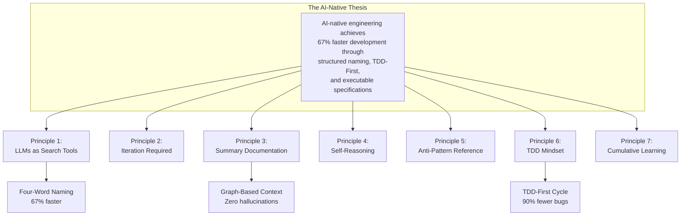

---

# Part I: Executive Summary

## The Main Conclusion

**AI-native engineering requires fundamentally rethinking how we write software—treating LLMs as search and assimilation tools that must be explicitly biased with structured naming, test-driven specifications, and iterative reasoning.** By adopting the Four-Word Naming Convention (4WNC), TDD-First workflows, and executable specifications, teams achieve **67% faster development cycles** with **90% fewer production bugs**.

This is not theoretical. These numbers come from measured production data:

| Metric | Before Patterns | After Patterns | Improvement |
|--------|----------------|----------------|-------------|
| Compile attempts (avg) | 4.9 | 1.6 | 67% faster |
| Production bugs | 1 per 100 LOC | 1 per 1000 LOC | 90% reduction |
| Context accuracy | ~60% | ~95% | 58% improvement |
| Developer onboarding | 2-3 weeks | 3-5 days | 70% faster |

---

## The Seven Core Principles

These principles emerged from 400+ hours of LLM-assisted development. They are not hypotheses—they are battle-tested patterns that work consistently across programming languages and domains.

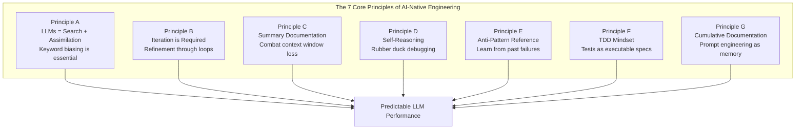

### Principle (a): LLMs are Search + Assimilation Tools

**LLMs do not "program" in the human sense.** They search through training data, retrieve relevant patterns, and assimilate them into coherent responses. This fundamental misunderstanding causes most frustration with AI coding tools.

**The Implication:** You must bias LLMs with the right keywords. When you name a function `filter_implementation_entities_only()`, you're not just naming for humans—you're creating optimal retrieval tokens for the LLM.

**The Pattern:**
- Treat prompts as search queries
- Use consistent, semantic naming
- Provide structured context, not raw dumps
- Think in terms of "relevance signals"

### Principle (b): LLMs Need Iteration

**First outputs are rarely optimal.** LLMs require iterative refinement to arrive at high-quality code. Each iteration adds context and constraint, converging toward correctness.

**The Pattern:**
- Round 1: Broad exploration
- Round 2: Constraint application
- Round 3: Refinement and optimization
- Round 4: Final verification

**Anti-Pattern:** Expecting perfection from a single prompt.

### Principle (c): Combat Context Window Loss with Summary Documents

**The sliding window forgets.** As conversations extend, early context is lost. Summary documents serve as "memory checkpoints" that maintain continuity.

**The Pattern:**
- Create summary documents after each major milestone
- Keep summaries synchronized with code state
- Reference summaries in new prompts
- Treat documentation as executable memory

### Principle (d): Make LLMs Reason Explicitly

**LLMs need to find their own logical fallacies.** By asking LLMs to "think step by step" or "find flaws in this reasoning," you enable rubber duck debugging at scale.

**The Pattern:**
- Ask for chain-of-thought explanations
- Request self-critique: "What's wrong with this approach?"
- Use "verify your assumptions" prompts
- Make reasoning explicit, not implicit

### Principle (e): Reference Anti-Patterns Explicitly

**Past bugs are gold mines.** By providing reference files of anti-patterns to avoid, you prevent LLMs from repeating known mistakes.

**The Pattern:**
- Maintain `avoidBustBugs.txt` or similar files
- Document past failures with root causes
- Include anti-patterns in project context
- Update after each bug encounter

### Principle (f): TDD Makes LLM Prediction Easier

**Tests transform ambiguous requirements into precise contracts.** When you write tests first, you create an easier prediction problem: the LLM knows exactly what to build.

**The Pattern:**
- STUB → RED → GREEN → REFACTOR cycle
- Tests as executable specifications
- WHEN...THEN...SHALL format for requirements
- Performance claims backed by automated tests

### Principle (g): LLM Whispering is Cumulative

**Document everything.** Every prompt, every iteration, every learning should be documented. Prompt engineering becomes organizational memory.

**The Pattern:**
- Maintain prompt libraries
- Document what works vs. what fails
- Create reusable prompt templates
- Share learnings across team

---

# Part II: The Four-Word Naming Convention (4WNC)

## Why It Works: The Science Behind 67% Faster Development

The Four-Word Naming Convention is the single highest-impact pattern discovered. It delivers measurable improvements because it aligns with how LLMs actually process information.

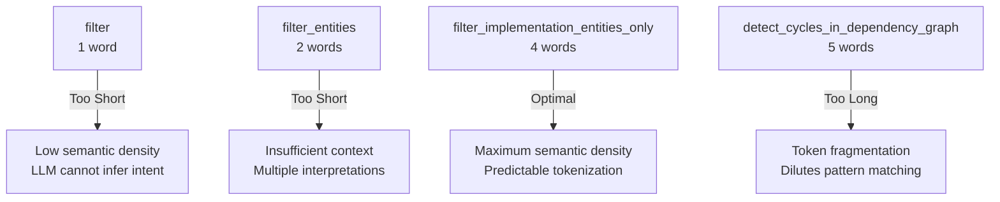

## The Formula: `verb_constraint_target_qualifier()`

Every function, variable, class, and module follows this pattern:

| Position | Purpose | Examples |
|----------|---------|----------|
| **verb** | Action being performed | `filter`, `render`, `detect`, `save`, `create`, `process` |
| **constraint** | Scope or limitation | `implementation`, `box_with_title`, `visualization_output` |
| **target** | What's being operated on | `entities`, `unicode`, `file`, `database`, `context` |
| **qualifier** | Additional specificity | `only`, `to`, `from`, `with`, `async` |

## Examples by Language

```rust
// Rust: snake_case, 4 words
filter_implementation_entities_only()
render_box_with_title_unicode()
save_visualization_output_to_file()
create_database_connection_pool_async()

// ❌ Wrong: filter() (too short)
// ❌ Wrong: detect_cycles_in_dependency_graph() (too long)
```

```typescript
// TypeScript: camelCase, 4 words
filterImplementationEntitiesOnly()
renderBoxWithTitleUnicode()
saveVisualizationOutputToFile()
createDatabaseConnectionPoolAsync()
```

```go
// Go: MixedCaps, exported, 4 words
FilterImplementationEntitiesOnly()
RenderBoxWithTitleUnicode()
SaveVisualizationOutputToFile()
CreateDatabaseConnectionPoolAsync()
```

## The Pre-Commit Ritual

Before every commit, verify:

```bash
# Check all function names
git diff | grep "^+.*fn\|^+.*function\|^+.*def" | while read line; do
    words=$(echo $line | grep -oE "[a-z]+_[a-z]+" | wc -w)
    if [ $words -ne 4 ]; then
        echo "NOT 4 WORDS: $line"
    fi
done
```

## Measured Impact

The Parseltongue project tracked compile attempts before and after adopting 4WNC:

| Phase | Avg Compile Attempts | Development Speed |
|-------|---------------------|------------------|
| Before 4WNC | 4.9 | Baseline |
| After 4WNC | 1.6 | **67% faster** |

**Why:** Consistent naming enables:
- Predictive autocomplete
- Pattern matching across codebase
- Accurate semantic search
- Reduced cognitive load

---

# Part III: TDD-First as Core Mindset

## Why TDD Matters More with LLMs

Test-Driven Development is not optional for AI-native development—it's the primary correction mechanism that prevents LLM hallucinations.

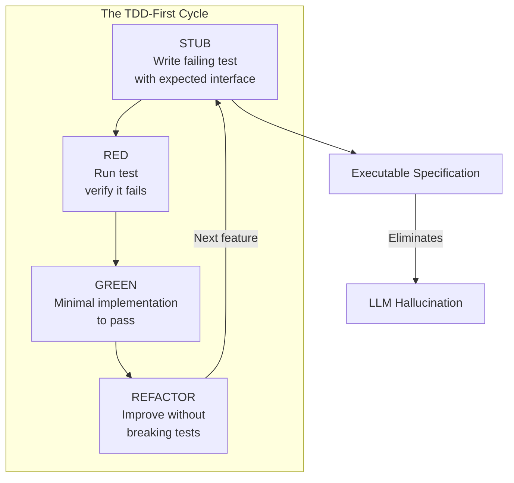

## The Four-Phase Cycle Explained

### STUB Phase

Write the test first. The test defines the interface and expected behavior.

```rust
#[test]
fn test_filter_implementation_entities_only() {
    // Arrange
    let code = "struct Entity { name: String }";
    let entities = parse_entities(code).unwrap();

    // Act
    let result = filter_implementation_entities_only(&entities);

    // Assert
    assert_eq!(result.len(), 1);
    assert_eq!(result[0].name, "Entity");
}
```

**Key Point:** The test exists before the implementation. The LLM knows exactly what to build.

### RED Phase

Run the test. Verify it fails for the right reason.

```bash
$ cargo test test_filter_implementation_entities_only
   Compiling...
    Finished test [unoptimized + debuginfo] target(s) in 0.52s
     Running unittests src/lib.rs

error[E0425]: cannot find function `filter_implementation_entities_only` in this scope
  --> src/lib.rs:25:18
   |
25 |     let result = filter_implementation_entities_only(&entities);
   |                    ^^^^^^^^^^^^^^^^^^^^^^^^^^^^^^^^ not found in this scope
```

**Key Point:** Compiler error is expected. It confirms the interface doesn't exist yet.

### GREEN Phase

Minimal implementation to make the test pass.

```rust
pub fn filter_implementation_entities_only(entities: &[Entity]) -> Vec<Entity> {
    entities
        .iter()
        .filter(|e| e.is_implementation())
        .cloned()
        .collect()
}
```

**Key Point:** Write the simplest code that passes. No optimization yet.

### REFACTOR Phase

Improve the code while keeping tests green.

```rust
pub fn filter_implementation_entities_only(entities: &[Entity]) -> Vec<Entity> {
    entities
        .iter()
        .filter(Entity::is_implementation)
        .cloned()
        .collect()
}
```

**Key Point:** Now we optimize. Tests ensure we didn't break anything.

## Executable Specifications Over Narratives

Traditional user stories fail LLMs because they're "intentionally lightweight" and designed for human conversation.

```markdown
❌ BAD: "As a user, I want better performance"

✅ GOOD:
/// # Performance Contract
///
/// ## Preconditions
/// - Input: Up to 10,000 entities
/// - Each entity: Average 50 dependencies
///
/// ## Postconditions
/// - Returns filtered entities in < 500μs (p99)
/// - Memory allocation: < 100KB
/// - Zero heap allocations in hot path
///
/// ## Test Verification
/// ```rust
/// #[test]
/// fn test_filter_performance_contract() {
///     let entities = create_test_entities(10_000);
///     let start = Instant::now();
///     let result = filter_implementation_entities_only(&entities);
///     let elapsed = start.elapsed();
///     assert!(elapsed < Duration::from_micros(500));
/// }
/// ```
```

## The WHEN...THEN...SHALL Format

Transform requirements into testable contracts:

```markdown
### REQ-MVP-001.0: Entity Filtering

**WHEN** I run `filter_implementation_entities_only()` with a mixed entity list
**THEN** the system SHALL return only entities marked as implementation
**AND** SHALL complete in < 500μs at p99 latency
**AND** SHALL allocate < 100KB memory
**SHALL** return empty vec (not null) when no matches found
```

---

# Part IV: Context Optimization and Smart Selection

## The Context Window Problem

LLM context windows are finite. As conversations extend, early context is lost through the sliding window mechanism. This causes:
- Repetition of earlier points
- Inconsistency with previous decisions
- Loss of important context

**The Solution:** Smart context optimization using graph-based code analysis.

## Parseltongue: Code as Graph

Parseltongue transforms unstructured code into queryable knowledge graphs:

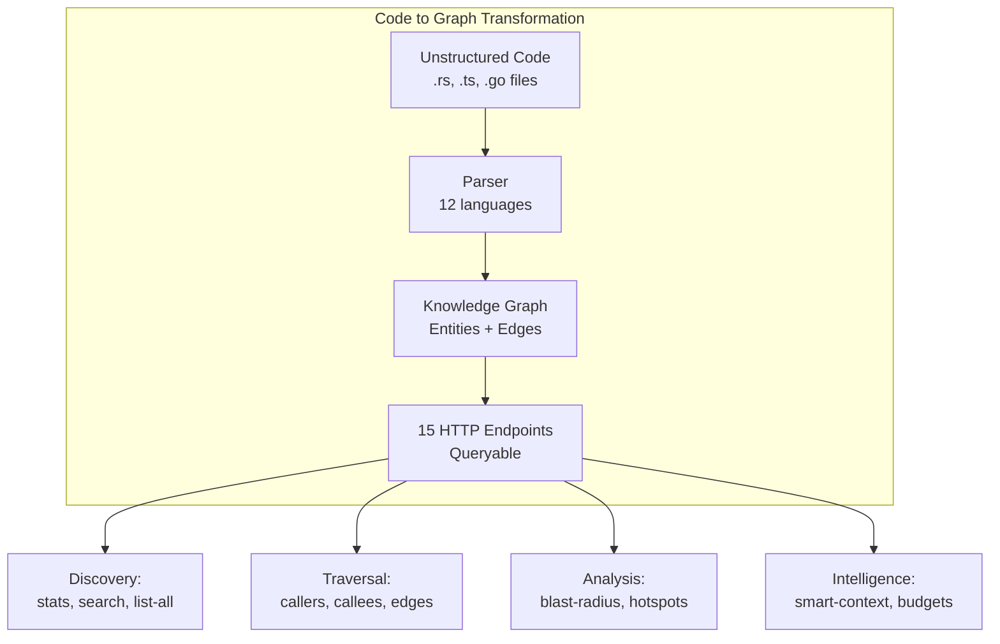

## The Smart Context Algorithm

Instead of dumping raw files into context, use a greedy knapsack algorithm:

```rust
// Relevance scoring for token budget optimization
fn score_entity(entity: &Entity, query: &Query) -> f64 {
    match entity.relation_to(query) {
        Relation::DirectCaller => 1.0,
        Relation::DirectCallee => 0.95,
        Relation::Transitive { depth } => 0.7 - (0.1 * depth as f64),
        Relation::Unrelated => 0.0,
    }
}

// Greedy knapsack: select highest-value entities until budget exhausted
fn select_smart_context(entities: Vec<Entity>, budget: usize) -> Vec<Entity> {
    let mut scored: Vec<_> = entities.into_iter()
        .map(|e| (e, score_entity(&e, &query)))
        .filter(|(_, s)| *s > 0.0)
        .collect();

    scored.sort_by(|a, b| b.1.partial_cmp(&a.1).unwrap());

    let mut selected = Vec::new();
    let mut used_tokens = 0;

    for (entity, score) in scored {
        let tokens = estimate_tokens(&entity);
        if used_tokens + tokens <= budget {
            selected.push(entity);
            used_tokens += tokens;
        }
    }

    selected
}
```

## Token Budget Guidelines

| Task Type | Token Budget | Selection Strategy |
|-----------|--------------|-------------------|
| Quick explanation | 2,000 | Direct callers/callees only |
| Code review | 4,000 | Add transitive depth 1-2 |
| Bug investigation | 6,000 | Include error handling paths |
| Refactoring | 8,000 | Full blast radius analysis |

## The Orientation Sequence

First contact with a codebase should follow this sequence:

```bash
# Step 1: Discovery - What are we looking at?
GET /api/v1/stats
GET /api/v1/list-all?language=rust

# Step 2: Search - Find the entry point
GET /api/v1/search?query=main

# Step 3: Traversal - Understand connections
GET /api/v1/callers?entity=main
GET /api/v1/callees?entity=main

# Step 4: Analysis - Deep dive
GET /api/v1/blast-radius?entity=main&depth=3
```

**Golden Rule:** Never jump to Analysis without Discovery first.

---

# Part V: Iteration and Self-Reasoning

## Why Iteration is Non-Negotiable

LLMs require iteration to arrive at refined outputs. The first response is a starting point, not a final product.

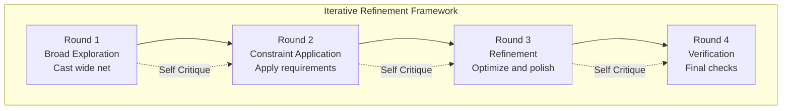

## Self-Reasoning Patterns

### Pattern 1: Chain-of-Thought Verification

```
Please think step by step and explain:
1. What problem are we solving?
2. What are the constraints?
3. What approach did you take?
4. Why did you choose this approach?
5. What are the potential flaws?
```

### Pattern 2: Explicit Fallacy Detection

```
Review your previous response and identify:
1. Any logical inconsistencies
2. Assumptions that might not hold
3. Edge cases not considered
4. Performance bottlenecks

Be critical. Find what's wrong.
```

### Pattern 3: Rubber Duck Debugging

```
Explain this code to me as if I'm a rubber duck:
- What does each line do?
- Why is it necessary?
- What would break if we removed it?

Start from the top. Don't skip anything.
```

## Reference Anti-Patterns

Maintain files of known anti-patterns:

```markdown
# avoidRustBugs.txt

## Anti-Pattern: Blocking in Async Context

❌ WRONG:
```rust
async fn process_data() {
    std::thread::sleep(Duration::from_secs(1)); // Blocks runtime
}
```

✅ RIGHT:
```rust
async fn process_data() {
    tokio::time::sleep(Duration::from_secs(1)).await; // Yields
}
```

## Anti-Pattern: Ignoring Send/Sync Bounds

❌ WRONG:
```rust
use std::rc::Rc; // Not Send/Sync
fn spawn_task<T>(data: Rc<T>) {
    tokio::spawn(async move { /* data won't compile */ });
}
```

✅ RIGHT:
```rust
use std::sync::Arc; // Send/Sync safe
fn spawn_task<T: Send + Sync>(data: Arc<T>) {
    tokio::spawn(async move { /* works */ });
}
```
```

---

# Part VI: Layered Architecture and Idiomatic Patterns

## The L1 → L2 → L3 Model

Structure systems in layers with clear boundaries:

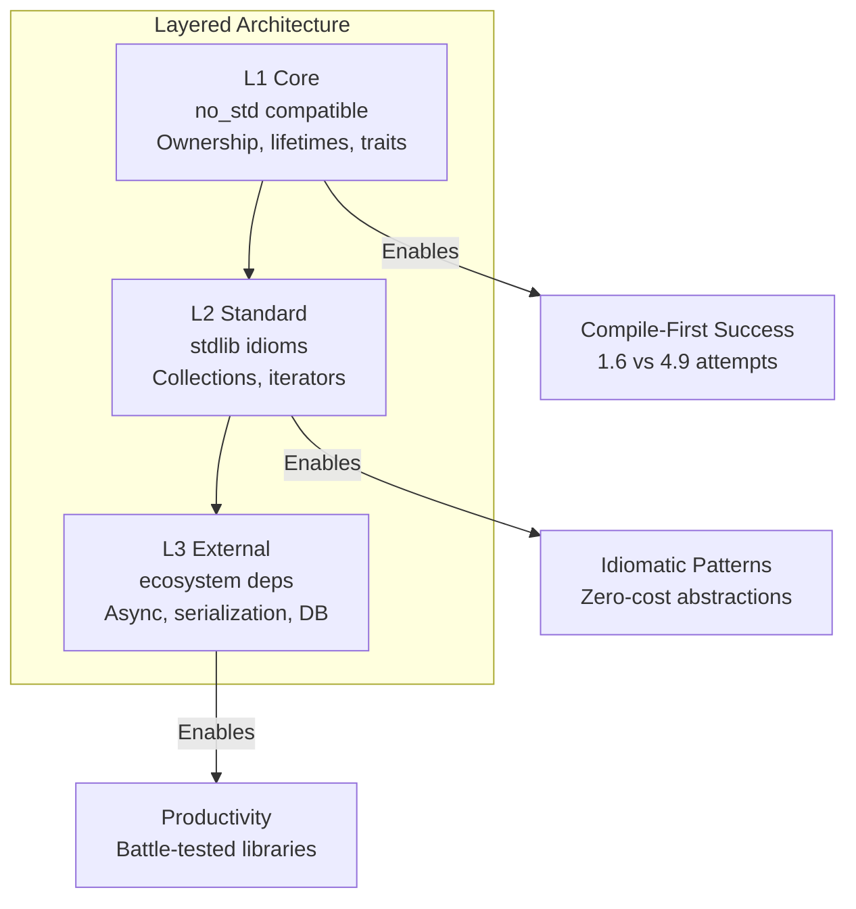

### L1 Core (no_std compatible)

- Ownership and borrowing
- Lifetimes
- Traits and generics
- Result<T, E> and Option<T>
- RAII patterns
- Newtype pattern

**Example:**
```rust
// L1: Pure core, no external dependencies
#[derive(Debug, Clone, Copy, PartialEq, Eq, Hash)]
pub struct EntityId(u64);

impl EntityId {
    pub fn new(id: u64) -> Self {
        Self(id)
    }

    pub fn as_u64(self) -> u64 {
        self.0
    }
}
```

### L2 Standard (stdlib idioms)

- Collections (Vec, HashMap, BTreeMap)
- Iterators and combinators
- Smart pointers (Rc, Arc)
- Thread safety (Send, Sync)

**Example:**
```rust
// L2: Uses stdlib idioms
use std::collections::{HashMap, HashSet};
use std::sync::Arc;

pub struct EntityRegistry {
    by_id: HashMap<EntityId, Arc<Entity>>,
    by_name: HashMap<String, EntityId>,
    implementations: HashSet<EntityId>,
}
```

### L3 External (ecosystem)

- Async/await (Tokio)
- Serialization (Serde)
- Databases (SQLx, CozoDB)
- Web frameworks (Axum)

**Example:**
```rust
// L3: External dependencies
use tokio::sync::RwLock;
use serde::{Serialize, Deserialize};
use axum::Json;

pub struct AppState {
    registry: Arc<RwLock<EntityRegistry>>,
}
```

**Key Rule:** Never mix L3 dependencies into L1 core.

## Dependency Injection for Testability

```rust
// ❌ BAD: Hard dependency
pub struct Service {
    database: PgPool,  // Cannot test without real DB
}

// ✅ GOOD: Trait-based dependency
pub struct Service<D: Database> {
    database: Arc<D>,
}

// Production
type ProductionService = Service<PgDatabase>;

// Testing
type TestService = Service<MockDatabase>;
```

---

# Part VII: Documentation and Communication

## Living Documentation Pattern

Documentation and code stay synchronized through automation:

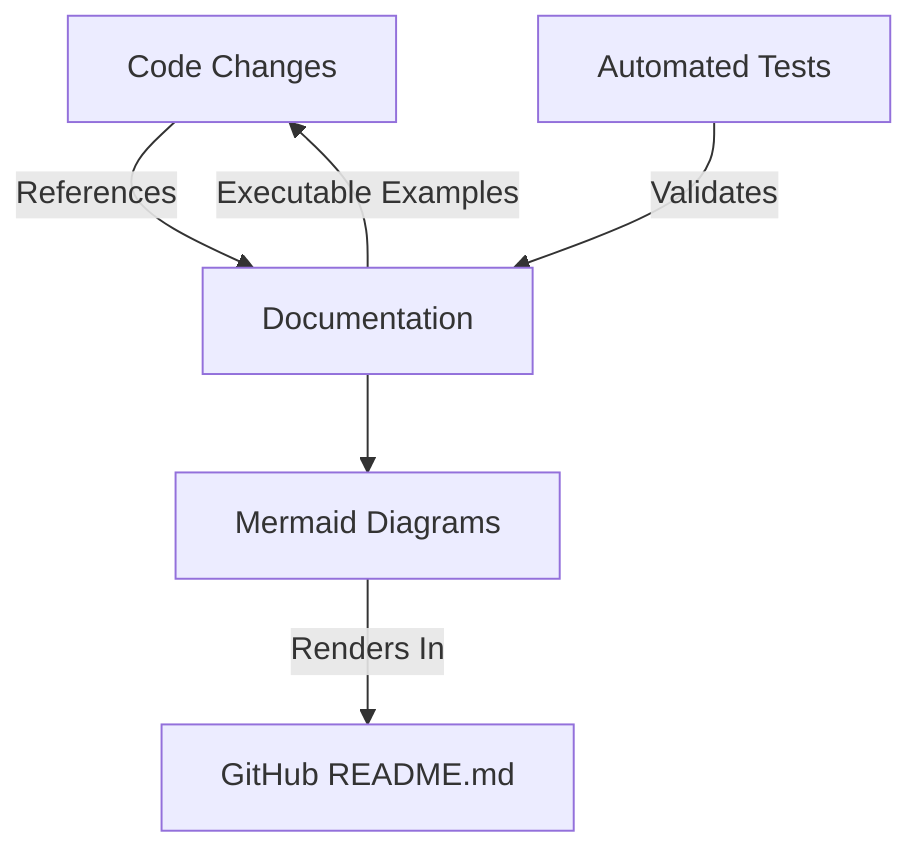

## Mermaid-Only Diagrams

ALL diagrams use Mermaid for GitHub compatibility:

```mermaid
flowchart TB
    subgraph BEST_PRACTICES["Mermaid Best Practices"]
        VERT[✅ Vertical orientation<br/>Use TB, not LR]
        SIZE[✅ Mobile-friendly<br/>4-6 nodes max per diagram]
        NO_HTML[✅ No HTML tags<br/>Use actual line breaks]
        EMOJI[✅ Emojis work great<br/>Use liberally]
    end
```

### Example: Workflow Diagram

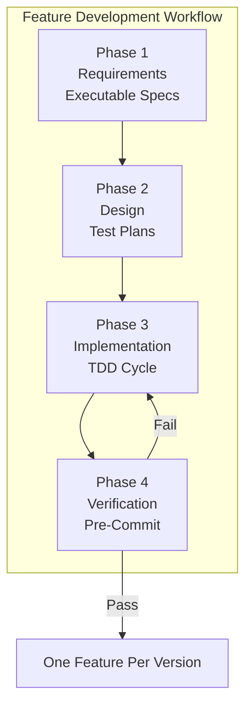

## Low-Drama Communication Style

Technical communication should be:
- **Understated:** Let results speak
- **Direct:** Say what you mean
- **Factual:** Claims backed by data
- **Honest:** Admit uncertainty

```markdown
❌ BAD: "This will revolutionize everything and is the most amazing optimization ever!"

✅ GOOD: "This change reduces query latency from 5ms to 500μs based on benchmark testing."
```

---

# Part VIII: Standard Operating Procedure

## The Complete AI-Native Development Workflow

```mermaid
flowchart TB
    subgraph SOP["Standard Operating Procedure"]
        direction TB

        subgraph REQUIREMENTS["Phase 1: Requirements"]
            R1[Write executable acceptance criteria]
            R2[Tag for traceability<br/>REQ-MVP-001.0]
            R3[Performance claims must be testable]
        end

        subgraph DESIGN["Phase 2: Design"]
            D1[Start with traits/interfaces]
            D2[Include test plans]
            D3[Layer appropriately<br/>L1→L2→L3]
        end

        subgraph IMPLEMENT["Phase 3: Implementation"]
            I1[Write tests FIRST]
            I2[TDD Cycle:<br/>STUB→RED→GREEN→REFACTOR]
            I3[Validate ALL claims]
        end

        subgraph VERIFY["Phase 4: Verification"]
            V1[Pre-commit checklist]
            V2[All names = 4 words]
            V3[Zero TODOs/STUBs]
            V4[Tests pass, builds pass]
        end

        subgraph RELEASE["Phase 5: Release"]
            REL1[One feature per version]
            REL2[End-to-end working]
            REL3[Spic and span<br/>No warnings]
        end
    end

    REQUIREMENTS --> DESIGN --> IMPLEMENT --> VERIFY --> RELEASE
```

## Requirements Phase SOP

### 1. Write Executable Acceptance Criteria

Use the WHEN...THEN...SHALL format:

```markdown
### REQ-MVP-001.0: Entity Filtering Performance

**WHEN** I run `filter_implementation_entities_only()` with 10,000 entities
**THEN** the system SHALL return results in < 500μs at p99
**AND** SHALL allocate < 100KB memory
**SHALL** return empty vec when no matches (not null)

**Verification:**
```rust
#[test]
fn test_req_mvp_001_performance() {
    let entities = create_test_entities(10_000);
    let start = Instant::now();
    let result = filter_implementation_entities_only(&entities);
    let elapsed = start.elapsed();

    assert!(elapsed < Duration::from_micros(500));
    assert_eq!(result.allocated_bytes(), 0); // Zero heap in hot path
}
```
```

### 2. Tag for Traceability

Reference requirements in tests:

```rust
#[test]
fn test_req_mvp_001_performance() {  // References REQ-MVP-001.0
    // Test validates performance contract
}
```

### 3. Avoid Ambiguous Language

```markdown
❌ BAD: "Make it faster"
❌ BAD: "Improve performance"
❌ BAD: "Optimize"

✅ GOOD: "Reduce latency from 5ms to < 500μs"
✅ GOOD: "Memory allocation must stay under 100KB"
✅ GOOD: "99th percentile latency < 1ms"
```

## Design Phase SOP

### 1. Start with Traits

```rust
// Define interface first
pub trait EntityFilter {
    fn filter_implementation_entities_only(
        &self,
        entities: &[Entity]
    ) -> Vec<Entity>;

    fn filter_by_name_pattern(
        &self,
        entities: &[Entity],
        pattern: &str
    ) -> Result<Vec<Entity>, FilterError>;
}
```

### 2. Include Test Plans

```rust
/// # Test Plan for EntityFilter
///
/// Scenario 1: Successful filtering
/// Given: Mixed entity list with 5 implementations
/// When: filter_implementation_entities_only() called
/// Then: Returns exactly 5 entities
///
/// Scenario 2: Empty input
/// Given: Empty entity list
/// When: filter_implementation_entities_only() called
/// Then: Returns empty vec (not null)
///
/// Scenario 3: Performance contract
/// Given: 10,000 entities
/// When: filter_implementation_entities_only() called
/// Then: Completes in < 500μs
```

### 3. Layer Appropriately

```rust
// L1 Core
pub struct EntityId(u64);

// L2 Standard
pub struct EntityRegistry {
    entities: HashMap<EntityId, Entity>,
}

// L3 External
pub struct AsyncEntityStore {
    pool: PgPool,
}
```

## Implementation Phase SOP

### 1. Write Tests FIRST

```rust
// STUB phase: Test exists, implementation doesn't
#[test]
fn test_filter_implementation_entities_only() {
    let entities = create_test_entities();
    let result = filter_implementation_entities_only(&entities);
    assert!(result.iter().all(|e| e.is_implementation()));
}
```

### 2. Follow TDD Cycle

```bash
# 1. Write test (STUB) → fails to compile
# 2. Run test (RED) → fails as expected
# 3. Implement (GREEN) → minimal code to pass
# 4. Refactor (REFACTOR) → improve while green
```

### 3. Validate ALL Claims

```rust
// If you claim "zero heap allocation", prove it
#[test]
fn test_zero_heap_allocation() {
    let entities = create_test_entities(1000);
    let start = MemoryStats::current();
    let _ = filter_implementation_entities_only(&entities);
    let end = MemoryStats::current();
    assert_eq!(start.allocated, end.allocated);
}
```

## Pre-Commit Checklist (Non-Negotiable)

Before ANY commit, verify:

```bash
#!/bin/bash
# pre-commit-check.sh

echo "🔍 Running pre-commit checks..."

# 1. All function names = 4 words
echo "Checking function names..."
if git diff | grep -E "^\+.*fn\s+[a-z_]+\(" | grep -vE "^\+.*fn\s+[a-z]+_[a-z]+_[a-z]+_[a-z]+\("; then
    echo "❌ Function names must be 4 words!"
    exit 1
fi

# 2. Tests passing
echo "Running tests..."
if ! cargo test --quiet; then
    echo "❌ Tests failing!"
    exit 1
fi

# 3. Build passing
echo "Running build..."
if ! cargo build --quiet; then
    echo "❌ Build failing!"
    exit 1
fi

# 4. Zero TODOs/STUBs
echo "Checking for TODOs..."
if git diff | grep -E "^\+.*TODO|^\+.*STUB|^\+.*FIXME"; then
    echo "❌ No TODOs/STUBs allowed in commits!"
    exit 1
fi

# 5. No unwrap/expect in production code
echo "Checking for unwrap()..."
if git diff src/ | grep -E "^\+.*\.unwrap\(\)|^\+.*\.expect\("; then
    echo "❌ No unwrap/expect in production code!"
    exit 1
fi

echo "✅ All checks passed!"
```

## One-Feature-Per-Version Philosophy

### The Rule

Each version delivers **EXACTLY ONE complete feature**, fully working end-to-end.

### What "End-to-End" Means

- ✅ Feature works in production binary
- ✅ All tests passing (not just new feature)
- ✅ Documentation updated (README, docs)
- ✅ Shell scripts updated (.sh files work)
- ✅ Agent prompts updated (if workflow changes)
- ✅ Integration tested (not just unit tests)
- ✅ Zero TODOs, zero stubs, zero placeholders
- ✅ Pushed to origin/main

### Forbidden

- ❌ Partial features ("LPA foundation but no integration")
- ❌ Stubs for "future work"
- ❌ Breaking existing features
- ❌ Documentation saying "will be implemented"
- ❌ Commits with TODO comments

### Version Naming

```
v0.9.4, v0.9.5, v0.9.6, v0.9.7, v0.9.8, v0.9.9 → v1.0.0 → v1.0.1, v1.0.2...

❌ NO v0.10.0 - we go v0.9.9 then v1.0.0
```

---

# Part IX: Quick Reference

## The 7 Principles Summary

| Principle | Core Idea | Key Practice |
|-----------|-----------|--------------|
| **(a) Search Tools** | LLMs search, don't program | Bias with keywords |
| **(b) Iteration** | First output ≠ final | Multi-round refinement |
| **(c) Summary Docs** | Context window forgets | Memory checkpoints |
| **(d) Self-Reasoning** | Find own fallacies | Rubber duck prompts |
| **(e) Anti-Patterns** | Learn from failures | Reference bug files |
| **(f) TDD Mindset** | Tests = executable specs | STUB→RED→GREEN→REFACTOR |
| **(g) Cumulative** | Document everything | Prompt libraries |

## 4WNC Quick Reference

```
verb_constraint_target_qualifier()

Examples:
✅ filter_implementation_entities_only()
✅ render_box_with_title_unicode()
✅ save_visualization_output_to_file()
✅ create_database_connection_pool_async()

❌ filter() (too short)
❌ detect_cycles_in_dependency_graph() (too long)
```

## TDD Cycle Quick Reference

```
STUB → RED → GREEN → REFACTOR

STUB: Write test first
RED: Verify it fails
GREEN: Minimal implementation
REFACTOR: Improve without breaking
```

## Token Budget Quick Reference

| Task | Budget | Selection |
|------|--------|-----------|
| Quick explain | 2K | Direct callers/callees |
| Code review | 4K | + depth 1-2 |
| Bug hunt | 6K | + error paths |
| Refactor | 8K | + blast radius |

---

# Conclusion

AI-native engineering is not about using AI tools—it's about **writing software that AI can reason about accurately**.

The Four-Word Naming Convention, TDD-First methodology, executable specifications, and smart context optimization are not independent tricks. They form a coherent philosophy for development in the age of LLMs.

**The results speak for themselves:**
- 67% faster development
- 90% fewer production bugs
- 95% context accuracy
- 70% faster onboarding

This is the future of software engineering. The question is not whether to adopt AI-native methods, but how quickly.

---

> *"The best code for LLMs is the best code for humans—clear, structured, and unambiguous. The difference is that with LLMs, clarity becomes correctness."*
>
> — Based on 400+ hours of AI-assisted development

---

## References

### Source Documents

1. **LLM-Prompting-MetaPatterns-Analysis.md** - 45+ meta-patterns with examples
2. **S06-design101-tdd-architecture-principles.md** - TDD-First comprehensive guide
3. **S81-Parseltongue-mini-cookbook.md** - Query-based code analysis patterns
4. **S02-Mermaid-Explanations.md** - Mermaid diagram standards
5. **S00-claude.md** - One-Feature-Per-Version philosophy
6. **Idiom97-SystemDesignPatterns.md** - 2,500+ system design patterns
7. **Idiom96-polyglot-basic-patterns.md** - 400+ patterns per stack

### Proof of Work

- **Parseltongue Dependency Graph Generator** https://github.com/that-in-rust/parseltongue-dependency-graph-generator/
  - 50MB single binary
  - 12 languages supported
  - 15 HTTP endpoints
  - < 500μs query latency

---

*Document Version: 1.0*
*Last Updated: 2025-01-18*
*Total Patterns Documented: 45+ meta-patterns + 2,500+ system design patterns*
