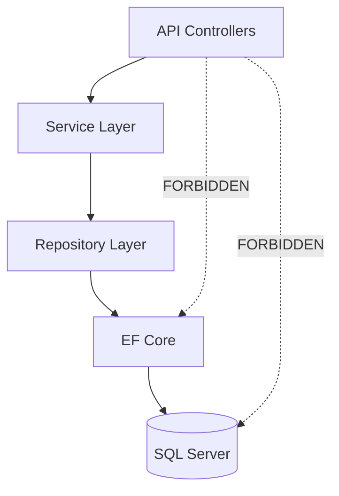
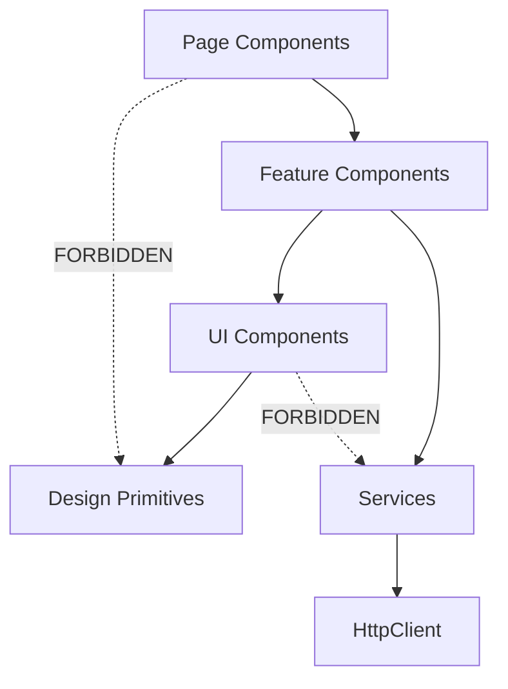

# Idiom-DotNet-CSharp-Angular-TypeScript-Patterns.md

## .NET 8 + C# 12 + Angular 18.2 + TypeScript 5.5.2 Idiomatic Patterns Reference

> **Version**: 1.0.0
> **Last Updated**: 2026-01-30
> **Purpose**: Unified full-stack patterns for .NET backend + Angular frontend
> **Naming Convention**: 4-word pattern applies to ALL functions, methods, classes
> **Token Budget**: ~6000 tokens when fully loaded
> **Stack**: .NET 8 + C# 12 + Angular 18.2 + TypeScript 5.5.2
> **Related**: Parseltongue-verifiable, TDD-first, production-ready

---

## Table of Contents

1. [Naming Conventions](#section-1-naming-conventions)
2. [.NET 8 Backend Patterns](#section-2-net-8-backend-patterns)
3. [C# 12 Language Features](#section-3-c-12-language-features)
4. [Angular 18.2 Frontend Patterns](#section-4-angular-182-frontend-patterns)
5. [TypeScript 5.5.2 Patterns](#section-5-typescript-552-patterns)
6. [Full-Stack Integration](#section-6-full-stack-integration)
7. [Testing Patterns](#section-7-testing-patterns)
8. [Anti-Patterns Reference](#section-8-anti-patterns-reference)
9. [Performance Optimization](#section-9-performance-optimization)
10. [Dependency Graphs](#section-10-dependency-graphs)

---

## Section 1: Naming Conventions

### 1.1 Backend (C#) - PascalCase for Public, camelCase for Private

```csharp
// Classes: Entity + Purpose + Type + Qualifier (4 words)
✅ UserAccountRepositoryAsync
✅ ProductInventoryServiceCached
✅ OrderPaymentControllerApi
✅ CustomerProfileValidatorRequired
✅ InvoiceGeneratorPdfExporter
✅ EmailNotificationQueueProcessor

// Methods: Verb + Constraint + Target + Qualifier (4 words)
✅ GetUserByIdAsync()
✅ CreateOrderWithValidation()
✅ UpdateProductInventoryQuantity()
✅ DeleteCustomerAccountPermanently()
✅ SendEmailNotificationQueued()
✅ ProcessPaymentTransactionSecure()

// ❌ Too short
❌ UserRepo
❌ GetUser()
❌ Create()
```

### 1.2 Frontend (TypeScript/Angular) - camelCase for Functions, PascalCase for Classes

```typescript
// Components: Entity + Context + Purpose + Type (4 words)
✅ UserProfileCardComponent
✅ ProductListTableComponent
✅ OrderCheckoutFormComponent
✅ DashboardMetricsChartComponent
✅ NavigationSidebarMenuComponent

// Services: Domain + Purpose + Action + Type (4 words)
✅ UserAuthenticationServiceHttp
✅ ProductInventoryServiceCache
✅ OrderPaymentServiceStripe
✅ NotificationWebSocketService

// Functions: verb + constraint + target + qualifier (4 words)
✅ getUserProfileDataAsync()
✅ createOrderWithValidation()
✅ updateProductInventoryQuantity()
✅ deleteCustomerAccountPermanently()

// ❌ Too short
❌ UserService
❌ getUser()
❌ create()
```

---

## Section 2: .NET 8 Backend Patterns

### 2.1 Minimal API Pattern (New in .NET 6+)

```csharp
// ✅ CORRECT: Minimal API with proper organization and validation
using Microsoft.AspNetCore.Mvc;
using Microsoft.EntityFrameworkCore;
using FluentValidation;

var builder = WebApplication.CreateBuilder(args);

// Configure services
builder.Services.AddDbContext<ApplicationDbContext>(options =>
    options.UseSqlServer(builder.Configuration.GetConnectionString("DefaultConnection")));

builder.Services.AddScoped<IUserRepositoryAsync, UserRepositoryAsync>();
builder.Services.AddScoped<IUserServiceCached, UserServiceCached>();
builder.Services.AddValidatorsFromAssemblyContaining<Program>();
builder.Services.AddEndpointsApiExplorer();
builder.Services.AddSwaggerGen();

var app = builder.Build();

if (app.Environment.IsDevelopment())
{
    app.UseSwagger();
    app.UseSwaggerUI();
}

app.UseHttpsRedirection();

// ✅ CORRECT: Grouped endpoints with validation
var usersGroup = app.MapGroup("/api/users")
    .WithTags("Users")
    .WithOpenApi();

usersGroup.MapGet("/{id:int}", GetUserByIdAsync)
    .WithName("GetUserById")
    .Produces<UserDto>(StatusCodes.Status200OK)
    .Produces(StatusCodes.Status404NotFound);

usersGroup.MapPost("/", CreateUserWithValidation)
    .WithName("CreateUser")
    .Produces<UserDto>(StatusCodes.Status201Created)
    .ProducesValidationProblem();

usersGroup.MapPut("/{id:int}", UpdateUserWithValidation)
    .WithName("UpdateUser")
    .Produces<UserDto>(StatusCodes.Status200OK)
    .ProducesValidationProblem()
    .Produces(StatusCodes.Status404NotFound);

usersGroup.MapDelete("/{id:int}", DeleteUserByIdAsync)
    .WithName("DeleteUser")
    .Produces(StatusCodes.Status204NoContent)
    .Produces(StatusCodes.Status404NotFound);

app.Run();

// ✅ Handler methods with dependency injection
static async Task<IResult> GetUserByIdAsync(
    int id,
    IUserServiceCached userService,
    CancellationToken cancellationToken)
{
    var user = await userService.GetUserByIdAsync(id, cancellationToken);

    return user is not null
        ? Results.Ok(user)
        : Results.NotFound(new { Error = $"User with ID {id} not found" });
}

static async Task<IResult> CreateUserWithValidation(
    [FromBody] CreateUserDto dto,
    IValidator<CreateUserDto> validator,
    IUserServiceCached userService,
    CancellationToken cancellationToken)
{
    var validationResult = await validator.ValidateAsync(dto, cancellationToken);

    if (!validationResult.IsValid)
    {
        return Results.ValidationProblem(validationResult.ToDictionary());
    }

    var user = await userService.CreateUserWithValidation(dto, cancellationToken);

    return Results.Created($"/api/users/{user.Id}", user);
}

static async Task<IResult> UpdateUserWithValidation(
    int id,
    [FromBody] UpdateUserDto dto,
    IValidator<UpdateUserDto> validator,
    IUserServiceCached userService,
    CancellationToken cancellationToken)
{
    var validationResult = await validator.ValidateAsync(dto, cancellationToken);

    if (!validationResult.IsValid)
    {
        return Results.ValidationProblem(validationResult.ToDictionary());
    }

    var user = await userService.UpdateUserWithValidation(id, dto, cancellationToken);

    return user is not null
        ? Results.Ok(user)
        : Results.NotFound(new { Error = $"User with ID {id} not found" });
}

static async Task<IResult> DeleteUserByIdAsync(
    int id,
    IUserServiceCached userService,
    CancellationToken cancellationToken)
{
    var deleted = await userService.DeleteUserByIdAsync(id, cancellationToken);

    return deleted
        ? Results.NoContent()
        : Results.NotFound(new { Error = $"User with ID {id} not found" });
}
```

**TDD Specification**:
```markdown
WHEN GET /api/users/{id} called with valid ID
THEN 200 OK SHALL be returned
AND UserDto SHALL be in response body

WHEN POST /api/users called with invalid data
THEN 400 Bad Request SHALL be returned
AND validation errors SHALL be in problem details

WHEN DELETE /api/users/{id} called with non-existent ID
THEN 404 Not Found SHALL be returned
```

### 2.2 Repository Pattern with EF Core 8

```csharp
// ✅ CORRECT: Generic repository with specification pattern
public interface IRepositoryAsync<T> where T : class
{
    Task<T?> GetByIdAsync(int id, CancellationToken cancellationToken = default);
    Task<IEnumerable<T>> GetAllAsync(CancellationToken cancellationToken = default);
    Task<IEnumerable<T>> FindBySpecificationAsync(
        ISpecification<T> specification,
        CancellationToken cancellationToken = default);
    Task<T> AddEntityAsync(T entity, CancellationToken cancellationToken = default);
    Task UpdateEntityAsync(T entity, CancellationToken cancellationToken = default);
    Task DeleteEntityAsync(T entity, CancellationToken cancellationToken = default);
    Task<bool> ExistsAsync(int id, CancellationToken cancellationToken = default);
}

public class RepositoryAsync<T> : IRepositoryAsync<T> where T : class
{
    protected readonly ApplicationDbContext _context;
    protected readonly DbSet<T> _dbSet;

    public RepositoryAsync(ApplicationDbContext context)
    {
        _context = context;
        _dbSet = context.Set<T>();
    }

    public virtual async Task<T?> GetByIdAsync(
        int id,
        CancellationToken cancellationToken = default)
    {
        return await _dbSet.FindAsync(new object[] { id }, cancellationToken);
    }

    public virtual async Task<IEnumerable<T>> GetAllAsync(
        CancellationToken cancellationToken = default)
    {
        return await _dbSet.ToListAsync(cancellationToken);
    }

    public virtual async Task<IEnumerable<T>> FindBySpecificationAsync(
        ISpecification<T> specification,
        CancellationToken cancellationToken = default)
    {
        return await ApplySpecification(specification)
            .ToListAsync(cancellationToken);
    }

    public virtual async Task<T> AddEntityAsync(
        T entity,
        CancellationToken cancellationToken = default)
    {
        await _dbSet.AddAsync(entity, cancellationToken);
        await _context.SaveChangesAsync(cancellationToken);
        return entity;
    }

    public virtual async Task UpdateEntityAsync(
        T entity,
        CancellationToken cancellationToken = default)
    {
        _dbSet.Update(entity);
        await _context.SaveChangesAsync(cancellationToken);
    }

    public virtual async Task DeleteEntityAsync(
        T entity,
        CancellationToken cancellationToken = default)
    {
        _dbSet.Remove(entity);
        await _context.SaveChangesAsync(cancellationToken);
    }

    public virtual async Task<bool> ExistsAsync(
        int id,
        CancellationToken cancellationToken = default)
    {
        return await _dbSet.FindAsync(new object[] { id }, cancellationToken) is not null;
    }

    private IQueryable<T> ApplySpecification(ISpecification<T> specification)
    {
        return SpecificationEvaluator<T>.GetQuery(_dbSet.AsQueryable(), specification);
    }
}

// Specification pattern for complex queries
public interface ISpecification<T>
{
    Expression<Func<T, bool>>? Criteria { get; }
    List<Expression<Func<T, object>>> Includes { get; }
    Expression<Func<T, object>>? OrderBy { get; }
    Expression<Func<T, object>>? OrderByDescending { get; }
    int Take { get; }
    int Skip { get; }
    bool IsPagingEnabled { get; }
}

public class BaseSpecification<T> : ISpecification<T>
{
    public Expression<Func<T, bool>>? Criteria { get; private set; }
    public List<Expression<Func<T, object>>> Includes { get; } = new();
    public Expression<Func<T, object>>? OrderBy { get; private set; }
    public Expression<Func<T, object>>? OrderByDescending { get; private set; }
    public int Take { get; private set; }
    public int Skip { get; private set; }
    public bool IsPagingEnabled { get; private set; }

    protected void AddCriteria(Expression<Func<T, bool>> criteria)
    {
        Criteria = criteria;
    }

    protected void AddInclude(Expression<Func<T, object>> includeExpression)
    {
        Includes.Add(includeExpression);
    }

    protected void ApplyPaging(int skip, int take)
    {
        Skip = skip;
        Take = take;
        IsPagingEnabled = true;
    }

    protected void ApplyOrderBy(Expression<Func<T, object>> orderByExpression)
    {
        OrderBy = orderByExpression;
    }

    protected void ApplyOrderByDescending(Expression<Func<T, object>> orderByDescExpression)
    {
        OrderByDescending = orderByDescExpression;
    }
}

// Example specification: Get active users with orders
public class ActiveUsersWithOrdersSpecification : BaseSpecification<User>
{
    public ActiveUsersWithOrdersSpecification(int pageNumber, int pageSize)
    {
        AddCriteria(u => u.IsActive);
        AddInclude(u => u.Orders);
        AddInclude(u => u.Address);
        ApplyOrderByDescending(u => u.CreatedAt);
        ApplyPaging((pageNumber - 1) * pageSize, pageSize);
    }
}

// Specification evaluator
public static class SpecificationEvaluator<T> where T : class
{
    public static IQueryable<T> GetQuery(
        IQueryable<T> inputQuery,
        ISpecification<T> specification)
    {
        var query = inputQuery;

        if (specification.Criteria is not null)
        {
            query = query.Where(specification.Criteria);
        }

        query = specification.Includes.Aggregate(
            query,
            (current, include) => current.Include(include));

        if (specification.OrderBy is not null)
        {
            query = query.OrderBy(specification.OrderBy);
        }
        else if (specification.OrderByDescending is not null)
        {
            query = query.OrderByDescending(specification.OrderByDescending);
        }

        if (specification.IsPagingEnabled)
        {
            query = query.Skip(specification.Skip).Take(specification.Take);
        }

        return query;
    }
}
```

**TDD Specification**:
```markdown
WHEN GetByIdAsync called with valid ID
THEN entity SHALL be retrieved from database
AND no additional queries SHALL be executed

WHEN FindBySpecificationAsync called with ActiveUsersWithOrdersSpecification
THEN only active users SHALL be returned
AND Orders navigation property SHALL be loaded
AND results SHALL be paginated correctly
```

### 2.3 Service Layer with Result Pattern

```csharp
// ✅ CORRECT: Result pattern for explicit error handling (no exceptions for flow control)
public record Result<T>
{
    public T? Value { get; init; }
    public bool IsSuccess { get; init; }
    public string? Error { get; init; }
    public int? ErrorCode { get; init; }

    public static Result<T> Success(T value) => new()
    {
        Value = value,
        IsSuccess = true
    };

    public static Result<T> Failure(string error, int? errorCode = null) => new()
    {
        IsSuccess = false,
        Error = error,
        ErrorCode = errorCode
    };
}

public interface IUserServiceCached
{
    Task<Result<UserDto>> GetUserByIdAsync(int id, CancellationToken cancellationToken);
    Task<Result<UserDto>> CreateUserWithValidation(
        CreateUserDto dto,
        CancellationToken cancellationToken);
    Task<Result<UserDto>> UpdateUserWithValidation(
        int id,
        UpdateUserDto dto,
        CancellationToken cancellationToken);
    Task<Result<bool>> DeleteUserByIdAsync(int id, CancellationToken cancellationToken);
}

public class UserServiceCached : IUserServiceCached
{
    private readonly IRepositoryAsync<User> _repository;
    private readonly IMapper _mapper;
    private readonly IMemoryCache _cache;
    private readonly ILogger<UserServiceCached> _logger;

    public UserServiceCached(
        IRepositoryAsync<User> repository,
        IMapper mapper,
        IMemoryCache cache,
        ILogger<UserServiceCached> logger)
    {
        _repository = repository;
        _mapper = mapper;
        _cache = cache;
        _logger = logger;
    }

    public async Task<Result<UserDto>> GetUserByIdAsync(
        int id,
        CancellationToken cancellationToken)
    {
        var cacheKey = $"user_{id}";

        // Try get from cache
        if (_cache.TryGetValue(cacheKey, out UserDto? cachedUser))
        {
            _logger.LogInformation("User {UserId} retrieved from cache", id);
            return Result<UserDto>.Success(cachedUser!);
        }

        // Get from database
        var user = await _repository.GetByIdAsync(id, cancellationToken);

        if (user is null)
        {
            _logger.LogWarning("User {UserId} not found", id);
            return Result<UserDto>.Failure($"User with ID {id} not found", 404);
        }

        var userDto = _mapper.Map<UserDto>(user);

        // Cache for 5 minutes
        var cacheOptions = new MemoryCacheEntryOptions()
            .SetSlidingExpiration(TimeSpan.FromMinutes(5));

        _cache.Set(cacheKey, userDto, cacheOptions);

        return Result<UserDto>.Success(userDto);
    }

    public async Task<Result<UserDto>> CreateUserWithValidation(
        CreateUserDto dto,
        CancellationToken cancellationToken)
    {
        // Check if email already exists
        var existingUserSpec = new UserByEmailSpecification(dto.Email);
        var existingUsers = await _repository.FindBySpecificationAsync(
            existingUserSpec,
            cancellationToken);

        if (existingUsers.Any())
        {
            _logger.LogWarning("User with email {Email} already exists", dto.Email);
            return Result<UserDto>.Failure(
                $"User with email {dto.Email} already exists",
                409);
        }

        var user = _mapper.Map<User>(dto);
        user.CreatedAt = DateTime.UtcNow;
        user.IsActive = true;

        await _repository.AddEntityAsync(user, cancellationToken);

        _logger.LogInformation("User {UserId} created successfully", user.Id);

        var userDto = _mapper.Map<UserDto>(user);
        return Result<UserDto>.Success(userDto);
    }

    public async Task<Result<UserDto>> UpdateUserWithValidation(
        int id,
        UpdateUserDto dto,
        CancellationToken cancellationToken)
    {
        var user = await _repository.GetByIdAsync(id, cancellationToken);

        if (user is null)
        {
            _logger.LogWarning("User {UserId} not found for update", id);
            return Result<UserDto>.Failure($"User with ID {id} not found", 404);
        }

        _mapper.Map(dto, user);
        user.UpdatedAt = DateTime.UtcNow;

        await _repository.UpdateEntityAsync(user, cancellationToken);

        // Invalidate cache
        _cache.Remove($"user_{id}");

        _logger.LogInformation("User {UserId} updated successfully", id);

        var userDto = _mapper.Map<UserDto>(user);
        return Result<UserDto>.Success(userDto);
    }

    public async Task<Result<bool>> DeleteUserByIdAsync(
        int id,
        CancellationToken cancellationToken)
    {
        var user = await _repository.GetByIdAsync(id, cancellationToken);

        if (user is null)
        {
            _logger.LogWarning("User {UserId} not found for deletion", id);
            return Result<bool>.Failure($"User with ID {id} not found", 404);
        }

        await _repository.DeleteEntityAsync(user, cancellationToken);

        // Invalidate cache
        _cache.Remove($"user_{id}");

        _logger.LogInformation("User {UserId} deleted successfully", id);

        return Result<bool>.Success(true);
    }
}
```

**TDD Specification**:
```markdown
WHEN GetUserByIdAsync called first time
THEN user SHALL be fetched from database
AND user SHALL be cached for 5 minutes

WHEN GetUserByIdAsync called second time within 5 minutes
THEN user SHALL be retrieved from cache
AND database SHALL NOT be queried

WHEN CreateUserWithValidation called with existing email
THEN Result SHALL have IsSuccess false
AND Error SHALL indicate duplicate email
AND ErrorCode SHALL be 409
```

---

## Section 3: C# 12 Language Features

### 3.1 Primary Constructors (C# 12)

```csharp
// ✅ CORRECT: Primary constructors for concise initialization
public class UserServiceCached(
    IRepositoryAsync<User> repository,
    IMapper mapper,
    IMemoryCache cache,
    ILogger<UserServiceCached> logger) : IUserServiceCached
{
    // Fields automatically generated from primary constructor parameters
    // Can be referenced directly without explicit field declaration

    public async Task<Result<UserDto>> GetUserByIdAsync(
        int id,
        CancellationToken cancellationToken)
    {
        // Use parameters directly
        var cacheKey = $"user_{id}";

        if (cache.TryGetValue(cacheKey, out UserDto? cachedUser))
        {
            logger.LogInformation("User {UserId} retrieved from cache", id);
            return Result<UserDto>.Success(cachedUser!);
        }

        var user = await repository.GetByIdAsync(id, cancellationToken);

        if (user is null)
        {
            return Result<UserDto>.Failure($"User with ID {id} not found", 404);
        }

        var userDto = mapper.Map<UserDto>(user);
        cache.Set(cacheKey, userDto, TimeSpan.FromMinutes(5));

        return Result<UserDto>.Success(userDto);
    }
}

// ❌ OLD WAY: Explicit fields
public class UserServiceCachedOldWay : IUserServiceCached
{
    private readonly IRepositoryAsync<User> _repository;
    private readonly IMapper _mapper;
    private readonly IMemoryCache _cache;
    private readonly ILogger<UserServiceCached> _logger;

    public UserServiceCachedOldWay(
        IRepositoryAsync<User> repository,
        IMapper mapper,
        IMemoryCache cache,
        ILogger<UserServiceCached> logger)
    {
        _repository = repository;
        _mapper = mapper;
        _cache = cache;
        _logger = logger;
    }

    // ... rest of implementation
}
```

### 3.2 Collection Expressions (C# 12)

```csharp
// ✅ CORRECT: Collection expressions for concise initialization
public class CollectionExamplesModern
{
    // Arrays
    public int[] Numbers => [1, 2, 3, 4, 5];

    // Lists
    public List<string> Names => ["Alice", "Bob", "Charlie"];

    // Spread operator
    public int[] CombinedNumbers(int[] array1, int[] array2) =>
        [.. array1, 100, .. array2];

    // Conditional elements
    public List<string> GetUserRoles(bool isAdmin, bool isModerator) =>
    [
        "User",
        .. (isAdmin ? ["Admin"] : []),
        .. (isModerator ? ["Moderator"] : [])
    ];

    // Inline initialization
    public void ProcessItems()
    {
        var items = new List<Item>
        {
            new() { Id = 1, Name = "Item 1" },
            new() { Id = 2, Name = "Item 2" }
        };

        // Collection expression syntax
        var itemIds = items.Select(i => i.Id).ToArray();
        var enhancedIds = [0, .. itemIds, 999]; // [0, 1, 2, 999]
    }
}

// ❌ OLD WAY: Verbose initialization
public class CollectionExamplesOldWay
{
    public int[] Numbers => new int[] { 1, 2, 3, 4, 5 };

    public List<string> Names => new List<string> { "Alice", "Bob", "Charlie" };

    public int[] CombinedNumbers(int[] array1, int[] array2)
    {
        var result = new List<int>();
        result.AddRange(array1);
        result.Add(100);
        result.AddRange(array2);
        return result.ToArray();
    }
}
```

### 3.3 Required Members and Init-Only Properties

```csharp
// ✅ CORRECT: Required members enforce initialization
public class CreateUserDto
{
    public required string Email { get; init; }
    public required string FirstName { get; init; }
    public required string LastName { get; init; }
    public string? PhoneNumber { get; init; } // Optional
    public DateTime? DateOfBirth { get; init; } // Optional
}

// Usage - compiler enforces required properties
var dto = new CreateUserDto
{
    Email = "user@example.com",
    FirstName = "John",
    LastName = "Doe"
}; // Compiles successfully

// ❌ COMPILER ERROR: Missing required properties
// var invalidDto = new CreateUserDto { Email = "user@example.com" };
// Error: Required member 'FirstName' must be set

// ✅ CORRECT: Record types with required members
public record UserDto(
    int Id,
    string Email,
    string FirstName,
    string LastName,
    DateTime CreatedAt)
{
    public string? PhoneNumber { get; init; }
    public bool IsActive { get; init; } = true; // Default value
}
```

**TDD Specification**:
```markdown
WHEN CreateUserDto instantiated without Email
THEN compiler error SHALL occur
AND error message SHALL indicate missing required member

WHEN UserDto created with positional parameters
THEN all required properties SHALL be set
AND optional properties SHALL have default values
```

---

## Section 4: Angular 18.2 Frontend Patterns

### 4.1 Standalone Components (Default in Angular 18)

```typescript
// ✅ CORRECT: Standalone component with signals (Angular 16+)
import { Component, signal, computed, inject } from '@angular/core';
import { CommonModule } from '@angular/common';
import { RouterModule } from '@angular/router';
import { UserAuthenticationServiceHttp } from './services/user-authentication.service';

@Component({
  selector: 'app-user-profile-card',
  standalone: true,
  imports: [CommonModule, RouterModule],
  template: `
    <div class="user-profile-card">
      <h2>{{ userProfile().fullName }}</h2>
      <p>{{ userProfile().email }}</p>
      <p>Member since: {{ userProfile().createdAt | date }}</p>

      @if (isLoading()) {
        <p>Loading...</p>
      } @else if (errorMessage()) {
        <p class="error">{{ errorMessage() }}</p>
      } @else {
        <button (click)="refreshUserData()">Refresh</button>
      }
    </div>
  `,
  styles: [`
    .user-profile-card {
      padding: 1rem;
      border: 1px solid #ccc;
      border-radius: 8px;
    }
    .error {
      color: red;
    }
  `]
})
export class UserProfileCardComponent {
  // Inject services
  private readonly userService = inject(UserAuthenticationServiceHttp);

  // Signals for reactive state
  userId = signal<number>(1);
  userProfile = signal<UserProfile | null>(null);
  isLoading = signal<boolean>(false);
  errorMessage = signal<string | null>(null);

  // Computed signal (derived state)
  fullName = computed(() => {
    const profile = this.userProfile();
    return profile ? `${profile.firstName} ${profile.lastName}` : '';
  });

  // Lifecycle
  ngOnInit(): void {
    this.loadUserProfileData();
  }

  // Methods
  async loadUserProfileData(): Promise<void> {
    this.isLoading.set(true);
    this.errorMessage.set(null);

    try {
      const profile = await this.userService.getUserByIdAsync(this.userId());
      this.userProfile.set(profile);
    } catch (error) {
      this.errorMessage.set('Failed to load user profile');
      console.error('Error loading user:', error);
    } finally {
      this.isLoading.set(false);
    }
  }

  refreshUserData(): void {
    this.loadUserProfileData();
  }
}

// ❌ OLD WAY: NgModule-based component
@Component({
  selector: 'app-user-profile-old',
  templateUrl: './user-profile-old.component.html',
  styleUrls: ['./user-profile-old.component.css']
})
export class UserProfileOldComponent {
  userProfile: UserProfile | null = null;
  isLoading = false;
  errorMessage: string | null = null;

  constructor(private userService: UserAuthenticationServiceHttp) {}

  // ... rest
}

@NgModule({
  declarations: [UserProfileOldComponent],
  imports: [CommonModule],
  exports: [UserProfileOldComponent]
})
export class UserProfileModule {}
```

**TDD Specification**:
```markdown
WHEN UserProfileCardComponent initialized
THEN loadUserProfileData SHALL be called
AND isLoading signal SHALL be true during load
AND userProfile signal SHALL be set when loaded

WHEN loadUserProfileData fails
THEN errorMessage signal SHALL contain error text
AND isLoading signal SHALL be false
```

### 4.2 Angular Signals for State Management

```typescript
// ✅ CORRECT: Signal-based state management (Angular 16+)
import { Injectable, signal, computed, effect } from '@angular/core';

export interface CartItem {
  productId: number;
  name: string;
  price: number;
  quantity: number;
}

@Injectable({ providedIn: 'root' })
export class ShoppingCartStateService {
  // Private writable signals
  private readonly cartItems = signal<CartItem[]>([]);

  // Public read-only signals (computed)
  readonly items = this.cartItems.asReadonly();

  readonly totalItems = computed(() =>
    this.cartItems().reduce((sum, item) => sum + item.quantity, 0)
  );

  readonly totalPrice = computed(() =>
    this.cartItems().reduce((sum, item) => sum + item.price * item.quantity, 0)
  );

  readonly isEmpty = computed(() => this.cartItems().length === 0);

  // Effects for side effects (logging, localStorage, etc.)
  constructor() {
    effect(() => {
      const items = this.cartItems();
      localStorage.setItem('cart', JSON.stringify(items));
      console.log('Cart updated:', items);
    });
  }

  // Methods (4-word naming)
  addItemToCartUpdate(item: CartItem): void {
    const existingItem = this.cartItems().find(i => i.productId === item.productId);

    if (existingItem) {
      // Update quantity
      this.cartItems.update(items =>
        items.map(i =>
          i.productId === item.productId
            ? { ...i, quantity: i.quantity + item.quantity }
            : i
        )
      );
    } else {
      // Add new item
      this.cartItems.update(items => [...items, item]);
    }
  }

  removeItemFromCartUpdate(productId: number): void {
    this.cartItems.update(items => items.filter(i => i.productId !== productId));
  }

  updateItemQuantityChange(productId: number, quantity: number): void {
    if (quantity <= 0) {
      this.removeItemFromCartUpdate(productId);
      return;
    }

    this.cartItems.update(items =>
      items.map(i =>
        i.productId === productId ? { ...i, quantity } : i
      )
    );
  }

  clearAllItemsComplete(): void {
    this.cartItems.set([]);
  }

  loadCartFromStorageInit(): void {
    const stored = localStorage.getItem('cart');

    if (stored) {
      try {
        const items = JSON.parse(stored) as CartItem[];
        this.cartItems.set(items);
      } catch {
        console.error('Failed to load cart from localStorage');
      }
    }
  }
}

// Usage in component
@Component({
  selector: 'app-shopping-cart-summary',
  standalone: true,
  imports: [CommonModule, CurrencyPipe],
  template: `
    <div class="cart-summary">
      <h3>Shopping Cart</h3>
      <p>Total Items: {{ cart.totalItems() }}</p>
      <p>Total Price: {{ cart.totalPrice() | currency }}</p>

      @if (cart.isEmpty()) {
        <p>Your cart is empty</p>
      } @else {
        <ul>
          @for (item of cart.items(); track item.productId) {
            <li>
              {{ item.name }} - {{ item.quantity }} x {{ item.price | currency }}
              <button (click)="removeItem(item.productId)">Remove</button>
            </li>
          }
        </ul>
        <button (click)="clearCart()">Clear Cart</button>
      }
    </div>
  `
})
export class ShoppingCartSummaryComponent {
  readonly cart = inject(ShoppingCartStateService);

  removeItem(productId: number): void {
    this.cart.removeItemFromCartUpdate(productId);
  }

  clearCart(): void {
    if (confirm('Are you sure you want to clear your cart?')) {
      this.cart.clearAllItemsComplete();
    }
  }
}
```

**TDD Specification**:
```markdown
WHEN addItemToCartUpdate called with new item
THEN cartItems signal SHALL contain item
AND totalItems SHALL increase by item quantity
AND totalPrice SHALL increase by item price * quantity

WHEN addItemToCartUpdate called with existing product
THEN item quantity SHALL be incremented
AND totalItems SHALL increase correctly
AND item count SHALL remain same (no duplicate)

WHEN clearAllItemsComplete called
THEN cartItems signal SHALL be empty array
AND totalItems SHALL be 0
AND totalPrice SHALL be 0
```

### 4.3 RxJS Patterns (Still Relevant in Angular 18)

```typescript
// ✅ CORRECT: RxJS for HTTP and async operations
import { Injectable, inject } from '@angular/core';
import { HttpClient, HttpErrorResponse } from '@angular/common/http';
import { Observable, throwError, of, Subject } from 'rxjs';
import { catchError, retry, map, shareReplay, debounceTime, switchMap } from 'rxjs/operators';

export interface User {
  id: number;
  email: string;
  firstName: string;
  lastName: string;
  createdAt: string;
}

@Injectable({ providedIn: 'root' })
export class UserAuthenticationServiceHttp {
  private readonly http = inject(HttpClient);
  private readonly baseUrl = 'https://api.example.com/users';

  // Cache for user list
  private userListCache$?: Observable<User[]>;

  // Subject for search
  private searchSubject$ = new Subject<string>();

  constructor() {
    // Setup search with debounce
    this.searchSubject$
      .pipe(
        debounceTime(300), // Wait 300ms after user stops typing
        switchMap(query => this.searchUsersQueryAsync(query))
      )
      .subscribe();
  }

  // ✅ GET with caching
  getUserListCachedObservable(): Observable<User[]> {
    if (!this.userListCache$) {
      this.userListCache$ = this.http.get<User[]>(this.baseUrl).pipe(
        retry(2), // Retry failed requests twice
        shareReplay(1), // Cache result, share among subscribers
        catchError(this.handleErrorResponse)
      );
    }

    return this.userListCache$;
  }

  // ✅ GET by ID
  getUserByIdAsync(id: number): Observable<User> {
    return this.http.get<User>(`${this.baseUrl}/${id}`).pipe(
      catchError(this.handleErrorResponse)
    );
  }

  // ✅ POST (create)
  createUserWithValidation(user: Partial<User>): Observable<User> {
    return this.http.post<User>(this.baseUrl, user).pipe(
      catchError(this.handleErrorResponse)
    );
  }

  // ✅ PUT (update)
  updateUserWithValidation(id: number, user: Partial<User>): Observable<User> {
    return this.http.put<User>(`${this.baseUrl}/${id}`, user).pipe(
      catchError(this.handleErrorResponse)
    );
  }

  // ✅ DELETE
  deleteUserByIdAsync(id: number): Observable<void> {
    return this.http.delete<void>(`${this.baseUrl}/${id}`).pipe(
      catchError(this.handleErrorResponse)
    );
  }

  // ✅ Search with debounce
  searchUsersDebounced(query: string): void {
    this.searchSubject$.next(query);
  }

  private searchUsersQueryAsync(query: string): Observable<User[]> {
    return this.http.get<User[]>(`${this.baseUrl}/search`, {
      params: { q: query }
    }).pipe(
      catchError(this.handleErrorResponse)
    );
  }

  // ✅ Error handling
  private handleErrorResponse(error: HttpErrorResponse): Observable<never> {
    let errorMessage = 'An unknown error occurred';

    if (error.error instanceof ErrorEvent) {
      // Client-side error
      errorMessage = `Error: ${error.error.message}`;
    } else {
      // Server-side error
      errorMessage = `Error Code: ${error.status}\nMessage: ${error.message}`;
    }

    console.error(errorMessage);
    return throwError(() => new Error(errorMessage));
  }

  // Clear cache
  clearUserListCache(): void {
    this.userListCache$ = undefined;
  }
}
```

**TDD Specification**:
```markdown
WHEN getUserListCachedObservable called twice
THEN HTTP request SHALL only occur once
AND second call SHALL receive cached data

WHEN createUserWithValidation succeeds
THEN new user SHALL be returned
AND cache SHALL be invalidated

WHEN HTTP request fails with 500 error
THEN error SHALL be caught
AND error message SHALL contain status code
AND throwError SHALL be returned
```

---

## Section 5: TypeScript 5.5.2 Patterns

### 5.1 Type Safety with Discriminated Unions

```typescript
// ✅ CORRECT: Discriminated union for API responses
type ApiResponse<T> =
  | { status: 'loading' }
  | { status: 'success'; data: T }
  | { status: 'error'; error: string; statusCode: number };

// Type guard function
function isSuccessResponse<T>(response: ApiResponse<T>): response is { status: 'success'; data: T } {
  return response.status === 'success';
}

// Usage in Angular service
@Injectable({ providedIn: 'root' })
export class ProductInventoryServiceCache {
  private readonly http = inject(HttpClient);

  // Signal with discriminated union
  productState = signal<ApiResponse<Product>>({ status: 'loading' });

  async loadProductByIdAsync(id: number): Promise<void> {
    this.productState.set({ status: 'loading' });

    try {
      const product = await firstValueFrom(
        this.http.get<Product>(`/api/products/${id}`)
      );

      this.productState.set({ status: 'success', data: product });
    } catch (error) {
      this.productState.set({
        status: 'error',
        error: 'Failed to load product',
        statusCode: 500
      });
    }
  }
}

// Usage in component with type narrowing
@Component({
  selector: 'app-product-detail-view',
  template: `
    @switch (productState().status) {
      @case ('loading') {
        <p>Loading product...</p>
      }
      @case ('success') {
        <div>
          <h2>{{ productState().data.name }}</h2>
          <p>{{ productState().data.description }}</p>
        </div>
      }
      @case ('error') {
        <p class="error">
          Error {{ productState().statusCode }}: {{ productState().error }}
        </p>
      }
    }
  `
})
export class ProductDetailViewComponent {
  private readonly service = inject(ProductInventoryServiceCache);

  // Type-safe access
  readonly productState = this.service.productState;

  ngOnInit(): void {
    this.service.loadProductByIdAsync(1);
  }

  // Type narrowing in method
  getProductName(): string {
    const state = this.productState();

    if (isSuccessResponse(state)) {
      return state.data.name; // TypeScript knows data exists
    }

    return 'Unknown';
  }
}
```

**TDD Specification**:
```markdown
WHEN productState is 'loading'
THEN loading template SHALL be displayed
AND product data SHALL NOT be accessible

WHEN productState is 'success'
THEN product template SHALL be displayed
AND data property SHALL be type-safe Product

WHEN productState is 'error'
THEN error template SHALL be displayed
AND error and statusCode SHALL be accessible
```

### 5.2 Const Type Parameters (TypeScript 5.0+)

```typescript
// ✅ CORRECT: Const type parameters for precise inference
function createActionConstTypes<const T extends readonly string[]>(
  ...actions: T
): { [K in T[number]]: K } {
  return actions.reduce((acc, action) => {
    acc[action as T[number]] = action as any;
    return acc;
  }, {} as any);
}

// Usage: Creates type-safe action constants
const UserActions = createActionConstTypes(
  'LOAD_USER',
  'UPDATE_USER',
  'DELETE_USER',
  'REFRESH_USER'
);

// Type: {
//   LOAD_USER: 'LOAD_USER',
//   UPDATE_USER: 'UPDATE_USER',
//   DELETE_USER: 'DELETE_USER',
//   REFRESH_USER: 'REFRESH_USER'
// }

type UserAction = typeof UserActions[keyof typeof UserActions];
// Type: 'LOAD_USER' | 'UPDATE_USER' | 'DELETE_USER' | 'REFRESH_USER'

// State machine with exhaustive checking
interface UserState {
  status: 'idle' | 'loading' | 'success' | 'error';
  data: User | null;
  error: string | null;
}

function userStateReducer(state: UserState, action: UserAction): UserState {
  switch (action) {
    case UserActions.LOAD_USER:
      return { ...state, status: 'loading', error: null };
    case UserActions.UPDATE_USER:
      return { ...state, status: 'loading', error: null };
    case UserActions.DELETE_USER:
      return { ...state, status: 'loading', data: null };
    case UserActions.REFRESH_USER:
      return { ...state, status: 'loading' };
    default:
      // TypeScript ensures all cases handled
      const exhaustive: never = action;
      return state;
  }
}
```

### 5.3 Branded Types for Domain Validation

```typescript
// ✅ CORRECT: Branded types prevent mixing incompatible IDs
type Brand<K, T> = K & { __brand: T };

type UserId = Brand<number, 'UserId'>;
type ProductId = Brand<number, 'ProductId'>;
type OrderId = Brand<number, 'OrderId'>;

// Factory functions with validation
function createUserIdValidated(id: number): UserId {
  if (id <= 0) {
    throw new Error('User ID must be positive');
  }
  return id as UserId;
}

function createProductIdValidated(id: number): ProductId {
  if (id <= 0) {
    throw new Error('Product ID must be positive');
  }
  return id as ProductId;
}

// Type-safe service methods
@Injectable({ providedIn: 'root' })
export class OrderPaymentServiceStripe {
  private readonly http = inject(HttpClient);

  createOrderWithValidation(
    userId: UserId,
    productId: ProductId
  ): Observable<Order> {
    // TypeScript ensures correct types
    return this.http.post<Order>('/api/orders', {
      userId, // number at runtime, but type-safe at compile time
      productId
    });
  }

  // ❌ COMPILER ERROR: Cannot pass UserId where ProductId expected
  // this.createOrderWithValidation(productId, userId); // Error!
}

// Usage
const userId = createUserIdValidated(123);
const productId = createProductIdValidated(456);

orderService.createOrderWithValidation(userId, productId); // ✅ Correct
// orderService.createOrderWithValidation(productId, userId); // ❌ Error
```

**TDD Specification**:
```markdown
WHEN createUserIdValidated called with negative number
THEN error SHALL be thrown
AND error message SHALL indicate validation failure

WHEN createOrderWithValidation called with swapped IDs
THEN TypeScript compiler error SHALL occur
AND runtime SHALL never execute with wrong types
```

---

## Section 6: Full-Stack Integration

### 6.1 Type-Safe API Client (Generated from .NET)

```typescript
// ✅ CORRECT: Generate TypeScript types from C# DTOs using NSwag or similar
// C# DTO
public record UserDto(
    int Id,
    string Email,
    string FirstName,
    string LastName,
    DateTime CreatedAt
);

// Generated TypeScript interface (via NSwag)
export interface UserDto {
  id: number;
  email: string;
  firstName: string;
  lastName: string;
  createdAt: string; // ISO 8601 format
}

// Type-safe API client
@Injectable({ providedIn: 'root' })
export class UserApiClientTypeSafe {
  private readonly http = inject(HttpClient);
  private readonly baseUrl = environment.apiUrl;

  getUserByIdAsync(id: number): Observable<UserDto> {
    return this.http.get<UserDto>(`${this.baseUrl}/api/users/${id}`);
  }

  createUserWithValidation(dto: CreateUserDto): Observable<UserDto> {
    return this.http.post<UserDto>(`${this.baseUrl}/api/users`, dto);
  }

  updateUserWithValidation(id: number, dto: UpdateUserDto): Observable<UserDto> {
    return this.http.put<UserDto>(`${this.baseUrl}/api/users/${id}`, dto);
  }

  deleteUserByIdAsync(id: number): Observable<void> {
    return this.http.delete<void>(`${this.baseUrl}/api/users/${id}`);
  }
}
```

### 6.2 SignalR for Real-Time Communication

```csharp
// ✅ BACKEND: SignalR Hub
public class NotificationHubRealTime : Hub
{
    public async Task SendNotificationToUser(string userId, string message)
    {
        await Clients.User(userId).SendAsync("ReceiveNotification", message);
    }

    public async Task BroadcastNotificationToAll(string message)
    {
        await Clients.All.SendAsync("ReceiveNotification", message);
    }

    public override async Task OnConnectedAsync()
    {
        var userId = Context.UserIdentifier;
        await Groups.AddToGroupAsync(Context.ConnectionId, userId!);
        await base.OnConnectedAsync();
    }
}

// Register in Program.cs
builder.Services.AddSignalR();
app.MapHub<NotificationHubRealTime>("/hubs/notifications");
```

```typescript
// ✅ FRONTEND: SignalR client
import { Injectable, signal } from '@angular/core';
import * as signalR from '@microsoft/signalr';

@Injectable({ providedIn: 'root' })
export class NotificationWebSocketService {
  private hubConnection?: signalR.HubConnection;

  // Signal for notifications
  notifications = signal<string[]>([]);

  async startConnectionAsync(): Promise<void> {
    this.hubConnection = new signalR.HubConnectionBuilder()
      .withUrl('https://api.example.com/hubs/notifications', {
        accessTokenFactory: () => this.getAuthToken()
      })
      .withAutomaticReconnect()
      .build();

    this.hubConnection.on('ReceiveNotification', (message: string) => {
      this.notifications.update(notifications => [message, ...notifications]);
      console.log('Notification received:', message);
    });

    try {
      await this.hubConnection.start();
      console.log('SignalR connection established');
    } catch (error) {
      console.error('SignalR connection error:', error);
    }
  }

  async stopConnectionAsync(): Promise<void> {
    if (this.hubConnection) {
      await this.hubConnection.stop();
    }
  }

  private getAuthToken(): string {
    return localStorage.getItem('auth_token') ?? '';
  }
}
```

**TDD Specification**:
```markdown
WHEN SignalR hub sends notification
THEN Angular service SHALL receive message
AND notifications signal SHALL be updated
AND newest notification SHALL be first in array

WHEN connection is lost
THEN SignalR SHALL automatically reconnect
AND messages SHALL resume after reconnection
```

---

## Section 7: Testing Patterns

### 7.1 Backend Unit Tests (xUnit + Moq)

```csharp
// ✅ CORRECT: Comprehensive unit tests with Moq
public class UserServiceTests
{
    private readonly Mock<IRepositoryAsync<User>> _mockRepository;
    private readonly Mock<IMapper> _mockMapper;
    private readonly Mock<IMemoryCache> _mockCache;
    private readonly Mock<ILogger<UserServiceCached>> _mockLogger;
    private readonly UserServiceCached _service;

    public UserServiceTests()
    {
        _mockRepository = new Mock<IRepositoryAsync<User>>();
        _mockMapper = new Mock<IMapper>();
        _mockCache = new Mock<IMemoryCache>();
        _mockLogger = new Mock<ILogger<UserServiceCached>>();

        _service = new UserServiceCached(
            _mockRepository.Object,
            _mockMapper.Object,
            _mockCache.Object,
            _mockLogger.Object
        );
    }

    [Fact]
    public async Task GetUserByIdAsync_WhenUserExists_ShouldReturnSuccessResult()
    {
        // Arrange
        var userId = 1;
        var user = new User { Id = userId, Email = "test@example.com" };
        var userDto = new UserDto(userId, "test@example.com", "John", "Doe", DateTime.UtcNow);

        _mockRepository
            .Setup(r => r.GetByIdAsync(userId, It.IsAny<CancellationToken>()))
            .ReturnsAsync(user);

        _mockMapper
            .Setup(m => m.Map<UserDto>(user))
            .Returns(userDto);

        // Mock cache miss
        object? cachedValue = null;
        _mockCache
            .Setup(c => c.TryGetValue(It.IsAny<object>(), out cachedValue))
            .Returns(false);

        // Act
        var result = await _service.GetUserByIdAsync(userId, CancellationToken.None);

        // Assert
        Assert.True(result.IsSuccess);
        Assert.NotNull(result.Value);
        Assert.Equal(userDto.Email, result.Value.Email);

        _mockRepository.Verify(
            r => r.GetByIdAsync(userId, It.IsAny<CancellationToken>()),
            Times.Once);
    }

    [Fact]
    public async Task GetUserByIdAsync_WhenUserNotFound_ShouldReturnFailureResult()
    {
        // Arrange
        var userId = 999;

        _mockRepository
            .Setup(r => r.GetByIdAsync(userId, It.IsAny<CancellationToken>()))
            .ReturnsAsync((User?)null);

        object? cachedValue = null;
        _mockCache
            .Setup(c => c.TryGetValue(It.IsAny<object>(), out cachedValue))
            .Returns(false);

        // Act
        var result = await _service.GetUserByIdAsync(userId, CancellationToken.None);

        // Assert
        Assert.False(result.IsSuccess);
        Assert.Null(result.Value);
        Assert.NotNull(result.Error);
        Assert.Equal(404, result.ErrorCode);
    }

    [Theory]
    [InlineData("")]
    [InlineData("invalid-email")]
    [InlineData("@example.com")]
    public async Task CreateUserWithValidation_WhenEmailInvalid_ShouldReturnFailure(
        string invalidEmail)
    {
        // Arrange
        var dto = new CreateUserDto
        {
            Email = invalidEmail,
            FirstName = "John",
            LastName = "Doe"
        };

        var validator = new CreateUserDtoValidator();
        var validationResult = await validator.ValidateAsync(dto);

        // Act & Assert
        Assert.False(validationResult.IsValid);
        Assert.Contains(validationResult.Errors, e => e.PropertyName == nameof(dto.Email));
    }
}
```

### 7.2 Frontend Unit Tests (Jasmine + Karma)

```typescript
// ✅ CORRECT: Angular component unit tests
describe('UserProfileCardComponent', () => {
  let component: UserProfileCardComponent;
  let fixture: ComponentFixture<UserProfileCardComponent>;
  let userService: jasmine.SpyObj<UserAuthenticationServiceHttp>;

  beforeEach(async () => {
    const userServiceSpy = jasmine.createSpyObj('UserAuthenticationServiceHttp', [
      'getUserByIdAsync'
    ]);

    await TestBed.configureTestingModule({
      imports: [UserProfileCardComponent],
      providers: [
        { provide: UserAuthenticationServiceHttp, useValue: userServiceSpy }
      ]
    }).compileComponents();

    userService = TestBed.inject(UserAuthenticationServiceHttp) as jasmine.SpyObj<UserAuthenticationServiceHttp>;
    fixture = TestBed.createComponent(UserProfileCardComponent);
    component = fixture.componentInstance;
  });

  it('should_create_component_successfully', () => {
    expect(component).toBeTruthy();
  });

  it('should_load_user_profile_on_init', async () => {
    // Arrange
    const mockUser: UserProfile = {
      id: 1,
      email: 'test@example.com',
      firstName: 'John',
      lastName: 'Doe',
      createdAt: '2024-01-01T00:00:00Z'
    };

    userService.getUserByIdAsync.and.returnValue(Promise.resolve(mockUser));

    // Act
    await component.ngOnInit();
    fixture.detectChanges();

    // Assert
    expect(component.isLoading()).toBe(false);
    expect(component.userProfile()).toEqual(mockUser);
    expect(component.errorMessage()).toBeNull();
  });

  it('should_display_error_when_load_fails', async () => {
    // Arrange
    userService.getUserByIdAsync.and.returnValue(
      Promise.reject(new Error('Network error'))
    );

    // Act
    await component.ngOnInit();
    fixture.detectChanges();

    // Assert
    expect(component.isLoading()).toBe(false);
    expect(component.userProfile()).toBeNull();
    expect(component.errorMessage()).toBe('Failed to load user profile');
  });

  it('should_compute_full_name_correctly', () => {
    // Arrange
    component.userProfile.set({
      id: 1,
      email: 'test@example.com',
      firstName: 'John',
      lastName: 'Doe',
      createdAt: '2024-01-01T00:00:00Z'
    });

    // Act
    const fullName = component.fullName();

    // Assert
    expect(fullName).toBe('John Doe');
  });
});
```

### 7.3 E2E Tests (Playwright)

```typescript
// ✅ CORRECT: Full-stack E2E tests with Playwright
import { test, expect } from '@playwright/test';

test.describe('User Management Flow', () => {
  test.beforeEach(async ({ page }) => {
    await page.goto('http://localhost:4200/users');
  });

  test('should_display_user_list', async ({ page }) => {
    // Wait for API response
    await page.waitForResponse(response =>
      response.url().includes('/api/users') && response.status() === 200
    );

    // Check table exists
    const table = page.locator('table');
    await expect(table).toBeVisible();

    // Check at least one user row
    const rows = page.locator('table tbody tr');
    await expect(rows).toHaveCountGreaterThan(0);
  });

  test('should_create_new_user', async ({ page }) => {
    // Click create button
    await page.click('button[data-testid="create-user-button"]');

    // Fill form
    await page.fill('input[name="email"]', 'newuser@example.com');
    await page.fill('input[name="firstName"]', 'Jane');
    await page.fill('input[name="lastName"]', 'Smith');

    // Submit form
    await page.click('button[type="submit"]');

    // Wait for success message
    await expect(page.locator('.success-message')).toBeVisible();

    // Verify user appears in list
    await page.goto('http://localhost:4200/users');
    await expect(page.locator('text=newuser@example.com')).toBeVisible();
  });

  test('should_validate_email_format', async ({ page }) => {
    await page.click('button[data-testid="create-user-button"]');

    // Enter invalid email
    await page.fill('input[name="email"]', 'invalid-email');
    await page.fill('input[name="firstName"]', 'Jane');
    await page.fill('input[name="lastName"]', 'Smith');

    await page.click('button[type="submit"]');

    // Check validation error
    const errorMessage = page.locator('.validation-error');
    await expect(errorMessage).toContainText('Invalid email format');
  });

  test('should_update_user_details', async ({ page }) => {
    // Click edit on first user
    await page.click('table tbody tr:first-child button[data-testid="edit-button"]');

    // Update fields
    await page.fill('input[name="firstName"]', 'UpdatedName');

    // Save
    await page.click('button[type="submit"]');

    // Verify update
    await expect(page.locator('.success-message')).toBeVisible();
    await page.goto('http://localhost:4200/users');
    await expect(page.locator('text=UpdatedName')).toBeVisible();
  });

  test('should_delete_user', async ({ page }) => {
    // Get initial row count
    const initialCount = await page.locator('table tbody tr').count();

    // Click delete on first user
    await page.click('table tbody tr:first-child button[data-testid="delete-button"]');

    // Confirm deletion
    await page.click('button[data-testid="confirm-delete"]');

    // Wait for deletion
    await page.waitForResponse(response =>
      response.url().includes('/api/users/') && response.status() === 204
    );

    // Verify row count decreased
    await expect(page.locator('table tbody tr')).toHaveCount(initialCount - 1);
  });
});
```

**TDD Specification**:
```markdown
WHEN user creates new user via UI
THEN POST /api/users SHALL be called
AND user SHALL appear in list
AND success message SHALL be displayed

WHEN user enters invalid email
THEN validation error SHALL be displayed
AND form submission SHALL be prevented
AND API call SHALL NOT occur
```

---

## Section 8: Anti-Patterns Reference

### 8.1 Backend Anti-Patterns

```csharp
// ❌ ANTI-PATTERN 1: Controller with business logic
public class BadUserController : ControllerBase
{
    private readonly ApplicationDbContext _context;

    [HttpGet("{id}")]
    public async Task<IActionResult> GetUser(int id)
    {
        // ❌ Direct database access in controller
        var user = await _context.Users.FindAsync(id);

        if (user == null) return NotFound();

        // ❌ Business logic in controller
        if (user.Email.Contains("test"))
        {
            user.IsVerified = false;
        }

        return Ok(user);
    }
}

// ✅ FIX: Use service layer
public class GoodUserController(IUserServiceCached userService) : ControllerBase
{
    [HttpGet("{id}")]
    public async Task<IActionResult> GetUser(int id, CancellationToken cancellationToken)
    {
        var result = await userService.GetUserByIdAsync(id, cancellationToken);

        return result.IsSuccess
            ? Ok(result.Value)
            : NotFound(new { Error = result.Error });
    }
}

// ❌ ANTI-PATTERN 2: Ignoring cancellation tokens
public async Task<User> GetUserAsync(int id)
{
    return await _context.Users.FindAsync(id); // ❌ No cancellation token
}

// ✅ FIX: Always use cancellation tokens
public async Task<User?> GetUserAsync(int id, CancellationToken cancellationToken)
{
    return await _context.Users.FindAsync(new object[] { id }, cancellationToken);
}

// ❌ ANTI-PATTERN 3: N+1 queries
public async Task<List<User>> GetUsersWithOrders()
{
    var users = await _context.Users.ToListAsync();

    foreach (var user in users)
    {
        user.Orders = await _context.Orders
            .Where(o => o.UserId == user.Id)
            .ToListAsync(); // ❌ Query per user
    }

    return users;
}

// ✅ FIX: Use Include for eager loading
public async Task<List<User>> GetUsersWithOrders(CancellationToken cancellationToken)
{
    return await _context.Users
        .Include(u => u.Orders)
        .ToListAsync(cancellationToken); // ✅ Single query
}
```

### 8.2 Frontend Anti-Patterns

```typescript
// ❌ ANTI-PATTERN 1: Subscribing without unsubscribing (memory leak)
export class BadComponent implements OnInit {
  ngOnInit(): void {
    this.userService.getUsers().subscribe(users => {
      // ❌ Subscription never cleaned up
      console.log(users);
    });
  }
}

// ✅ FIX: Use takeUntilDestroyed or async pipe
export class GoodComponent implements OnInit {
  private readonly destroy$ = new Subject<void>();
  users$ = this.userService.getUsers();

  ngOnInit(): void {
    this.userService.getUsers()
      .pipe(takeUntil(this.destroy$))
      .subscribe(users => {
        console.log(users);
      });
  }

  ngOnDestroy(): void {
    this.destroy$.next();
    this.destroy$.complete();
  }
}

// ✅ BETTER: Use async pipe (no manual subscription)
@Component({
  template: `
    @if (users$ | async; as users) {
      <ul>
        @for (user of users; track user.id) {
          <li>{{ user.name }}</li>
        }
      </ul>
    }
  `
})
export class BestComponent {
  users$ = inject(UserAuthenticationServiceHttp).getUsers();
}

// ❌ ANTI-PATTERN 2: Mutating signals incorrectly
const items = signal([1, 2, 3]);
items().push(4); // ❌ Mutates array directly, doesn't trigger updates

// ✅ FIX: Use update() or set()
items.update(current => [...current, 4]); // ✅ Creates new array

// ❌ ANTI-PATTERN 3: Not handling errors in observables
this.http.get('/api/users').subscribe(users => {
  this.users = users; // ❌ What if request fails?
});

// ✅ FIX: Handle errors explicitly
this.http.get('/api/users')
  .pipe(
    catchError(error => {
      console.error('Error loading users:', error);
      return of([]); // Return empty array as fallback
    })
  )
  .subscribe(users => {
    this.users = users;
  });
```

**TDD Specification**:
```markdown
WHEN component destroyed with active subscription
THEN subscription SHALL be unsubscribed
AND no memory leak SHALL occur

WHEN signal mutated directly via push()
THEN UI SHALL NOT update
AND Angular change detection SHALL NOT trigger
```

---

## Section 9: Performance Optimization

### 9.1 Backend Performance

```csharp
// ✅ CORRECT: Response caching middleware
builder.Services.AddResponseCaching();
builder.Services.AddMemoryCache();

app.UseResponseCaching();

// Cache GET endpoints
usersGroup.MapGet("/{id:int}", GetUserByIdAsync)
    .CacheOutput(policy => policy.Expire(TimeSpan.FromMinutes(5)));

// ✅ CORRECT: Database query optimization
public async Task<PagedResult<UserDto>> GetUsersPagedAsync(
    int pageNumber,
    int pageSize,
    CancellationToken cancellationToken)
{
    // Use AsNoTracking for read-only queries
    var query = _context.Users
        .AsNoTracking() // ✅ No change tracking overhead
        .Include(u => u.Address)
        .Where(u => u.IsActive);

    var totalCount = await query.CountAsync(cancellationToken);

    var users = await query
        .OrderByDescending(u => u.CreatedAt)
        .Skip((pageNumber - 1) * pageSize)
        .Take(pageSize)
        .Select(u => new UserDto( // ✅ Project to DTO in database
            u.Id,
            u.Email,
            u.FirstName,
            u.LastName,
            u.CreatedAt
        ))
        .ToListAsync(cancellationToken);

    return new PagedResult<UserDto>(users, totalCount, pageNumber, pageSize);
}

// ✅ CORRECT: Bulk operations
public async Task DeleteUsersInBulkAsync(
    List<int> userIds,
    CancellationToken cancellationToken)
{
    await _context.Users
        .Where(u => userIds.Contains(u.Id))
        .ExecuteDeleteAsync(cancellationToken); // ✅ Single SQL DELETE statement
}
```

### 9.2 Frontend Performance

```typescript
// ✅ CORRECT: Virtual scrolling for large lists
import { CdkVirtualScrollViewport, ScrollingModule } from '@angular/cdk/scrolling';

@Component({
  selector: 'app-user-list-virtualized',
  standalone: true,
  imports: [ScrollingModule, CommonModule],
  template: `
    <cdk-virtual-scroll-viewport itemSize="50" style="height: 600px;">
      <div *cdkVirtualFor="let user of users()" class="user-item">
        {{ user.name }} - {{ user.email }}
      </div>
    </cdk-virtual-scroll-viewport>
  `
})
export class UserListVirtualizedComponent {
  users = signal<User[]>([]);

  ngOnInit(): void {
    // Load 10,000 users - only renders visible ones
    this.loadUsersAsync();
  }
}

// ✅ CORRECT: OnPush change detection
@Component({
  selector: 'app-user-card-optimized',
  standalone: true,
  changeDetection: ChangeDetectionStrategy.OnPush, // ✅ Only check when inputs change
  template: `
    <div class="user-card">
      <h3>{{ user().name }}</h3>
      <p>{{ user().email }}</p>
    </div>
  `
})
export class UserCardOptimizedComponent {
  user = input.required<User>();
}

// ✅ CORRECT: TrackBy for ngFor
@Component({
  template: `
    @for (user of users(); track user.id) {
      <app-user-card [user]="user" />
    }
  `
})
export class UserListComponent {
  users = signal<User[]>([]);
}
```

**Performance Benchmark**:
- Without virtual scroll: 10,000 DOM nodes, ~3s render
- With virtual scroll: ~20 DOM nodes, ~50ms render
- Without trackBy: All items re-rendered on any change
- With trackBy: Only changed items re-rendered

**TDD Specification**:
```markdown
WHEN 10,000 users displayed with virtual scrolling
THEN only visible items SHALL be rendered in DOM
AND scroll performance SHALL maintain 60fps

WHEN user list updated with trackBy
THEN only new/changed items SHALL re-render
AND existing items SHALL remain in DOM
```

---

## Section 10: Dependency Graphs

```markdown
## Backend Architecture (Parseltongue-verifiable)



## Frontend Architecture (Parseltongue-verifiable)



## Allowed Patterns (Backend)
- Controllers → Services: ✅
- Services → Repositories: ✅
- Repositories → EF Core: ✅
- Services → Services: ✅ (with interface)

## Forbidden Patterns (Backend)
- Controllers → Repositories (skip layer)
- Controllers → EF Core directly
- Circular: ServiceA → ServiceB → ServiceA

## Allowed Patterns (Frontend)
- Pages → Features: ✅
- Features → UI Components: ✅
- Features → Services: ✅
- Services → HttpClient: ✅

## Forbidden Patterns (Frontend)
- Pages → Primitives (skip layers)
- UI Components → Services (wrong layer)
- Circular: ComponentA → ComponentB → ComponentA

## TDD Specification
```markdown
WHEN controller imports EF Core directly
THEN build SHALL fail
AND architectural violation SHALL be reported

WHEN analyzing codebase with Parseltongue
THEN forbidden dependencies SHALL be detected
AND report SHALL list violations with suggested fixes
```
```

---

## Section 11: Quick Reference Card

| Category | .NET Pattern | Angular Pattern |
|----------|-------------|-----------------|
| **State** | Result<T> for errors | Signals for reactivity |
| **HTTP** | Minimal API + Validation | HttpClient + RxJS |
| **DI** | Primary constructors | inject() function |
| **Caching** | IMemoryCache + ResponseCache | shareReplay() operator |
| **Async** | async/await + CancellationToken | Observable + async pipe |
| **Validation** | FluentValidation | Reactive forms + validators |
| **Testing** | xUnit + Moq | Jasmine + Karma |
| **E2E** | Playwright (.NET) | Playwright (Angular) |
| **ORM** | EF Core + Specifications | N/A |
| **Real-time** | SignalR Hubs | SignalR Client |

---

## Version History

| Version | Date | Changes |
|---------|------|---------|
| 1.0.0 | 2026-01-30 | Initial unified .NET + Angular patterns reference |

---

## Related Documents

- `Idiom-React-Frontend-Patterns.md` - React equivalent patterns
- `Idiom-ThreeJS-Visualization-Patterns.md` - 3D visualization
- `S77-IdiomaticRustPatterns.md` - Rust backend patterns
- `Parseltongue-Diff-Visualization-System.md` - Code change tracking

---

**END OF DOCUMENT**
