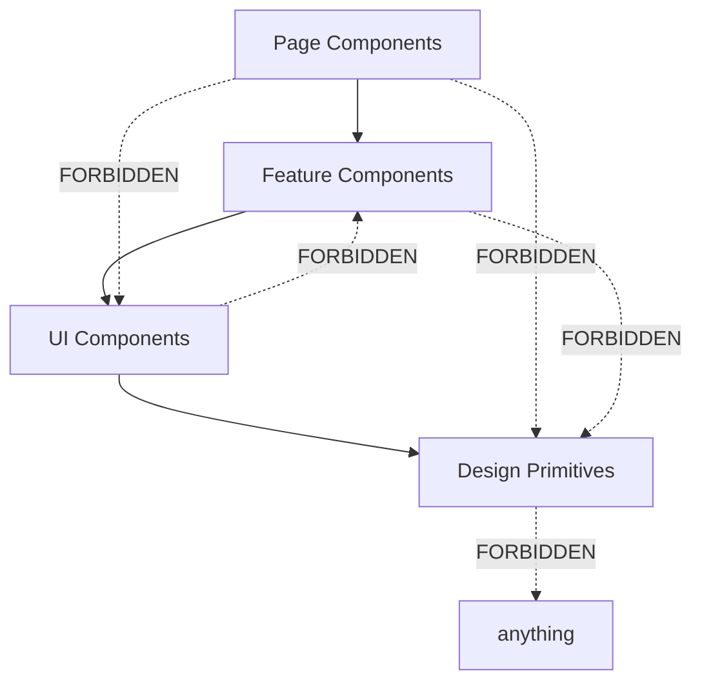

# Idiom-React-Frontend-Patterns.md

## React Idiomatic Patterns Reference (LLM Context Anchor)

> **Version**: 1.0.0
> **Last Updated**: 2026-01-30
> **Purpose**: Bias LLMs toward correct React patterns via semantic anchoring
> **Naming Convention**: 4-word pattern applies to functions, hooks, components
> **Token Budget**: ~4500 tokens when fully loaded
> **Related**: Parseltongue-verifiable dependency graphs, TDD-first specifications

---

## Section 1: The Four-Word Naming Convention (React Adaptation)

### 1.1 Components (PascalCase, 4 semantic units)

```tsx
// Pattern: Entity + Context + Purpose + Variant
✅ UserProfileCardCompact
✅ PaymentFormWizardStep
✅ NavigationSidebarMenuLink
✅ DashboardMetricsChartArea
✅ AuthLoginFormContainer
✅ ProductListGridItem
✅ SearchResultsTableRow
✅ SettingsPageLayoutMain

// ❌ Too short (insufficient semantic density)
❌ UserCard          // 2 units
❌ Form              // 1 unit
❌ Button            // 1 unit
❌ List              // 1 unit

// ❌ Too long (token fragmentation)
❌ UserProfileCardWithAvatarAndStatusBadge  // 6+ units
❌ NavigationSidebarMenuLinkWithIconAndTooltip  // 7+ units
```

### 1.2 Custom Hooks (camelCase, 4 words)

```tsx
// Pattern: use + Domain + Action + Qualifier
✅ useAuthStateListener()
✅ useFormValidationErrors()
✅ useLocalStoragePersist()
✅ useDebounceInputValue()
✅ useIntersectionObserverRef()
✅ useFetchDataWithCache()
✅ useWebSocketConnectionManager()
✅ useThemePreferenceToggle()

// ❌ Too short
❌ useAuth()
❌ useForm()
❌ useFetch()
❌ useData()

// ❌ Too long
❌ useUserAuthenticationStateChangeListenerWithCleanup()
```

### 1.3 Event Handlers (camelCase, 4 words)

```tsx
// Pattern: handle + Target + Event + Action
✅ handleFormSubmitValidation()
✅ handleButtonClickNavigation()
✅ handleInputChangeDebounce()
✅ handleModalCloseCleanup()
✅ handleImageLoadComplete()
✅ handleCheckboxToggleState()
✅ handleDropdownSelectOption()
✅ handleFileUploadProgress()

// ❌ Too short
❌ handleSubmit()
❌ handleClick()
❌ onChange()
❌ onSelect()
```

### 1.4 Utility Functions (camelCase, 4 words)

```tsx
// Pattern: verb + constraint + target + qualifier
✅ formatCurrencyWithLocale()
✅ validateEmailAddressFormat()
✅ parseJsonResponseSafely()
✅ transformArrayToHashmap()
✅ filterActiveUsersOnly()
✅ sortItemsByCreatedDate()
✅ capitalizeStringFirstLetter()
✅ truncateTextAtMaxLength()
```

---

## Section 2: State Management Patterns

### 2.1 Discriminated Union State (TypeScript)

**The Pattern**: Use discriminated unions for complex state machines to eliminate impossible states.

```tsx
// ✅ CORRECT: Exhaustive state handling with discriminated unions
type FetchState<T> =
  | { status: 'idle' }
  | { status: 'loading' }
  | { status: 'success'; data: T }
  | { status: 'error'; error: Error };

function useFetchDataWithState<T>(url: string): FetchState<T> {
  const [state, setState] = useState<FetchState<T>>({ status: 'idle' });

  useEffect(() => {
    setState({ status: 'loading' });

    fetchDataFromEndpoint<T>(url)
      .then(data => setState({ status: 'success', data }))
      .catch(error => setState({ status: 'error', error }));
  }, [url]);

  return state;
}

// Usage with exhaustive switch (TypeScript enforces completeness)
function renderFetchStateContent<T>(state: FetchState<T>): JSX.Element {
  switch (state.status) {
    case 'idle':
      return <IdlePlaceholderMessage />;
    case 'loading':
      return <LoadingSpinnerIndicator />;
    case 'success':
      return <DataDisplayContainer data={state.data} />;
    case 'error':
      return <ErrorMessageDisplay error={state.error} />;
    // TypeScript compiler errors if case missing
  }
}
```

```tsx
// ❌ WRONG: Boolean flags create impossible states
type BadFetchState<T> = {
  isLoading: boolean;
  isError: boolean;
  data: T | null;
  error: Error | null;
};
// Problems:
// - Can have isLoading=true AND isError=true simultaneously
// - Can have data AND error both non-null
// - Requires manual synchronization of flags
```

**TDD Specification**:
```markdown
WHEN state transitions from idle to loading
THEN status SHALL equal 'loading'
AND data SHALL be undefined
AND error SHALL be undefined

WHEN fetch succeeds
THEN status SHALL equal 'success'
AND data SHALL contain response
AND error SHALL be undefined
```

### 2.2 State Colocation Rules

```tsx
// RULE 1: State lives at lowest common ancestor
// ✅ CORRECT: Shared state lifted to common parent
function ParentComponentContainer() {
  const [sharedValue, setSharedValue] = useState('');

  return (
    <>
      <ChildInputComponent value={sharedValue} onChange={setSharedValue} />
      <ChildDisplayComponent value={sharedValue} />
    </>
  );
}

// RULE 2: Derived state is computed, not stored
// ✅ CORRECT: Compute derived values in render
function FilteredListComponent({ items, filter }: Props) {
  // Derived - computed on each render (cheap operation)
  const filteredItems = useMemo(
    () => filterItemsByPredicate(items, filter),
    [items, filter]
  );

  return <ListRenderer items={filteredItems} />;
}

// ❌ WRONG: Storing derived state creates sync bugs
function BadFilteredListComponent({ items, filter }: Props) {
  const [filteredItems, setFilteredItems] = useState(items);

  useEffect(() => {
    setFilteredItems(filterItemsByPredicate(items, filter));
  }, [items, filter]); // Synchronization bug waiting to happen

  // If parent re-renders without props changing, state is stale
}

// RULE 3: Don't mirror props in state
// ❌ WRONG: Mirroring props
function BadControlledInput({ initialValue }: Props) {
  const [value, setValue] = useState(initialValue);

  // Bug: If initialValue changes, component ignores it
  return <input value={value} onChange={e => setValue(e.target.value)} />;
}

// ✅ CORRECT: Either fully controlled or use key for reset
function GoodControlledInput({ value, onChange }: Props) {
  // Fully controlled - no internal state
  return <input value={value} onChange={onChange} />;
}

// ✅ CORRECT: Use key to reset component when prop changes
<BadControlledInput key={initialValue} initialValue={initialValue} />
```

**TDD Specification**:
```markdown
WHEN parent component shares state between children
THEN state SHALL be lifted to parent component
AND children SHALL receive state via props

WHEN deriving filtered list from items array
THEN filtered result SHALL be computed in render
AND SHALL NOT be stored in useState
AND SHALL use useMemo for expensive computations
```

### 2.3 Context Boundaries (Max 2 Levels)

```tsx
// ✅ CORRECT: Single-purpose context with strong typing
interface AuthContextValue {
  user: User | null;
  login: (credentials: Credentials) => Promise<void>;
  logout: () => Promise<void>;
  isAuthenticated: boolean;
}

const AuthContext = createContext<AuthContextValue | null>(null);

function useAuthContextValue(): AuthContextValue {
  const context = useContext(AuthContext);

  if (!context) {
    throw new Error('useAuthContextValue must be used within AuthProvider');
  }

  return context;
}

function AuthProviderComponent({ children }: PropsWithChildren) {
  const [user, setUser] = useState<User | null>(null);

  const login = useCallback(async (credentials: Credentials) => {
    const authUser = await authenticateUserWithCredentials(credentials);
    setUser(authUser);
  }, []);

  const logout = useCallback(async () => {
    await logoutUserSession();
    setUser(null);
  }, []);

  const value = useMemo(
    () => ({
      user,
      login,
      logout,
      isAuthenticated: user !== null,
    }),
    [user, login, logout]
  );

  return <AuthContext.Provider value={value}>{children}</AuthContext.Provider>;
}

// ✅ CORRECT: Context for cross-cutting concerns only
// - Authentication state (global)
// - Theme/locale preferences (global)
// - Feature flags (global)
// - WebSocket connections (global)

// ❌ WRONG: Context for component-specific state
// - Form values (use local state or form library)
// - UI toggle states (use local state)
// - Derived/computed values (compute inline with useMemo)
// - Data fetching results (use React Query/SWR)
```

**Context Performance Rule**: Avoid re-renders with proper memoization.

```tsx
// ✅ CORRECT: Split contexts by change frequency
const UserContext = createContext<User | null>(null);
const UserActionsContext = createContext<UserActions | null>(null);

function UserProviderComponent({ children }: PropsWithChildren) {
  const [user, setUser] = useState<User | null>(null);

  // Actions rarely change (memoized)
  const actions = useMemo(
    () => ({
      updateUser: (updates: Partial<User>) => {
        setUser(prev => (prev ? { ...prev, ...updates } : null));
      },
    }),
    []
  );

  return (
    <UserContext.Provider value={user}>
      <UserActionsContext.Provider value={actions}>
        {children}
      </UserActionsContext.Provider>
    </UserContext.Provider>
  );
}

// Consumers only re-render when needed
function DisplayUserName() {
  const user = useContext(UserContext); // Re-renders when user changes
  return <span>{user?.name}</span>;
}

function UpdateUserButton() {
  const actions = useContext(UserActionsContext); // Never re-renders (actions stable)
  return <button onClick={() => actions?.updateUser({ name: 'New' })}>Update</button>;
}
```

**TDD Specification**:
```markdown
WHEN component uses context outside provider
THEN error SHALL be thrown
AND error message SHALL indicate missing provider

WHEN context value changes
THEN only consuming components SHALL re-render
AND non-consuming siblings SHALL NOT re-render
```

---

## Section 3: Component Architecture Patterns

### 3.1 Composition Over Configuration

```tsx
// ✅ CORRECT: Compound component pattern with dot notation
function CardContainerComponent({ children }: PropsWithChildren) {
  return <div className="card-container" role="article">{children}</div>;
}

CardContainerComponent.Header = function CardHeaderSection({ children }: PropsWithChildren) {
  return <header className="card-header">{children}</header>;
};

CardContainerComponent.Body = function CardBodySection({ children }: PropsWithChildren) {
  return <main className="card-body">{children}</main>;
};

CardContainerComponent.Footer = function CardFooterSection({ children }: PropsWithChildren) {
  return <footer className="card-footer">{children}</footer>;
};

// Usage - maximum flexibility
function ProfileCardExample() {
  return (
    <CardContainerComponent>
      <CardContainerComponent.Header>
        <h2>John Doe</h2>
        <StatusBadgeComponent status="online" />
      </CardContainerComponent.Header>

      <CardContainerComponent.Body>
        <UserAvatarImage src="/avatar.jpg" alt="John Doe" />
        <UserBioText>Software Engineer at Acme Corp</UserBioText>
      </CardContainerComponent.Body>

      <CardContainerComponent.Footer>
        <ButtonPrimaryAction>View Profile</ButtonPrimaryAction>
        <ButtonSecondaryAction>Send Message</ButtonSecondaryAction>
      </CardContainerComponent.Footer>
    </CardContainerComponent>
  );
}
```

```tsx
// ❌ WRONG: Prop explosion anti-pattern
interface BadCardProps {
  headerTitle?: string;
  headerSubtitle?: string;
  headerIcon?: ReactNode;
  headerActions?: ReactNode;
  bodyContent?: ReactNode;
  bodyPadding?: 'small' | 'medium' | 'large';
  footerActions?: ReactNode;
  footerAlignment?: 'left' | 'center' | 'right';
  showHeader?: boolean;
  showFooter?: boolean;
  variant?: 'default' | 'outlined' | 'elevated';
  size?: 'small' | 'medium' | 'large';
  borderRadius?: number;
  shadow?: boolean;
  // ... 20 more props
}

function BadCardComponent(props: BadCardProps) {
  // Impossible to maintain - 50+ lines of conditional rendering
}
```

**TDD Specification**:
```markdown
WHEN CardContainerComponent.Header is used
THEN element SHALL render with header semantic tag
AND className SHALL equal 'card-header'

WHEN CardContainerComponent is used without Header
THEN component SHALL render successfully
AND no header element SHALL be present
```

### 3.2 Render Props for Inversion of Control

```tsx
// ✅ CORRECT: Render prop pattern for flexible rendering
interface DataFetcherProps<T> {
  url: string;
  renderLoadingState: () => JSX.Element;
  renderErrorState: (error: Error) => JSX.Element;
  renderSuccessState: (data: T) => JSX.Element;
}

function DataFetcherComponent<T>({
  url,
  renderLoadingState,
  renderErrorState,
  renderSuccessState,
}: DataFetcherProps<T>) {
  const state = useFetchDataWithState<T>(url);

  switch (state.status) {
    case 'idle':
    case 'loading':
      return renderLoadingState();
    case 'error':
      return renderErrorState(state.error);
    case 'success':
      return renderSuccessState(state.data);
  }
}

// Usage with maximum control
function UserListPage() {
  return (
    <DataFetcherComponent
      url="/api/users"
      renderLoadingState={() => <LoadingSpinnerLarge />}
      renderErrorState={(error) => (
        <ErrorBoundaryFallback
          error={error}
          resetAction={() => window.location.reload()}
        />
      )}
      renderSuccessState={(users) => (
        <UserListTableComponent users={users} />
      )}
    />
  );
}
```

**Alternative: Children as Function**

```tsx
// ✅ CORRECT: Children as function pattern
interface ListVirtualizerProps<T> {
  items: T[];
  itemHeight: number;
  children: (item: T, index: number) => JSX.Element;
}

function ListVirtualizerComponent<T>({
  items,
  itemHeight,
  children,
}: ListVirtualizerProps<T>) {
  // Virtualization logic...
  return (
    <div className="virtual-list">
      {visibleItems.map((item, index) => (
        <div key={index} style={{ height: itemHeight }}>
          {children(item, index)}
        </div>
      ))}
    </div>
  );
}

// Usage
<ListVirtualizerComponent items={products} itemHeight={80}>
  {(product, index) => (
    <ProductCardCompact
      product={product}
      position={index + 1}
    />
  )}
</ListVirtualizerComponent>
```

**TDD Specification**:
```markdown
WHEN DataFetcherComponent receives success data
THEN renderSuccessState SHALL be called with data
AND renderLoadingState SHALL NOT be called
AND renderErrorState SHALL NOT be called
```

### 3.3 Container/Presenter Separation

```tsx
// CONTAINER: Data fetching, state management, side effects
function UserProfileContainerSmart() {
  const { userId } = useParams<{ userId: string }>();
  const userQuery = useQueryUserById(userId);
  const updateMutation = useMutationUpdateUser();

  const handleProfileUpdateSubmit = useCallback(
    (formData: UserFormData) => {
      updateMutation.mutate(formData);
    },
    [updateMutation]
  );

  if (userQuery.isLoading) {
    return <LoadingSpinnerIndicator />;
  }

  if (userQuery.isError) {
    return <ErrorMessageDisplay error={userQuery.error} />;
  }

  return (
    <UserProfilePresenterPure
      user={userQuery.data}
      onUpdateSubmit={handleProfileUpdateSubmit}
      isUpdating={updateMutation.isLoading}
      updateError={updateMutation.error}
    />
  );
}

// PRESENTER: Pure rendering, no side effects, easily testable
interface UserProfilePresenterProps {
  user: User;
  onUpdateSubmit: (data: UserFormData) => void;
  isUpdating: boolean;
  updateError: Error | null;
}

function UserProfilePresenterPure({
  user,
  onUpdateSubmit,
  isUpdating,
  updateError,
}: UserProfilePresenterProps) {
  const [formData, setFormData] = useState<UserFormData>({
    name: user.name,
    email: user.email,
    bio: user.bio,
  });

  const handleFormSubmitEvent = useCallback(
    (e: FormEvent) => {
      e.preventDefault();
      onUpdateSubmit(formData);
    },
    [formData, onUpdateSubmit]
  );

  return (
    <form onSubmit={handleFormSubmitEvent}>
      <InputFieldControlled
        label="Name"
        value={formData.name}
        onChange={(name) => setFormData({ ...formData, name })}
      />

      <InputFieldControlled
        label="Email"
        value={formData.email}
        onChange={(email) => setFormData({ ...formData, email })}
      />

      <TextareaFieldControlled
        label="Bio"
        value={formData.bio}
        onChange={(bio) => setFormData({ ...formData, bio })}
      />

      {updateError && <ErrorMessageInline error={updateError} />}

      <ButtonSubmitForm disabled={isUpdating} loading={isUpdating}>
        {isUpdating ? 'Saving...' : 'Save Changes'}
      </ButtonSubmitForm>
    </form>
  );
}
```

**TDD Specification**:
```markdown
WHEN UserProfilePresenterPure receives user data
THEN form fields SHALL be initialized with user values
AND form SHALL be interactive
AND no data fetching SHALL occur

WHEN UserProfileContainerSmart mounts
THEN user data SHALL be fetched via useQueryUserById
AND loading state SHALL be displayed
AND presenter SHALL render when data loaded
```

---

## Section 4: Performance Patterns

### 4.1 Memoization Decision Matrix

| Scenario | useMemo | useCallback | React.memo | None |
|----------|---------|-------------|------------|------|
| Expensive computation (>100ms) | ✅ | | | |
| Referential equality for deps | ✅ | | | |
| Callback to memoized child | | ✅ | | |
| Callback to normal child | | | | ✅ |
| Frequently re-rendered list item | | | ✅ | |
| Infrequently re-rendered (<1/sec) | | | | ✅ |
| Object/array creation | ✅ | | | |
| Primitive value computation | | | | ✅ |

### 4.2 Correct Memoization

```tsx
// ✅ CORRECT: Memoize expensive computation
function SearchResultsListComponent({ items, query }: Props) {
  // Expensive operation - worth memoizing
  const filteredResults = useMemo(
    () => performExpensiveFilterOperation(items, query),
    [items, query]
  );

  return <ResultsListRenderer results={filteredResults} />;
}

// ✅ CORRECT: Stable callback for memoized child
function ParentWithMemoizedChild() {
  const [items, setItems] = useState<Item[]>([]);

  // useCallback prevents new function reference on every render
  const handleItemDeleteAction = useCallback(
    (id: string) => {
      setItems(prev => removeItemById(prev, id));
    },
    [] // setItems is stable - no deps needed
  );

  return (
    <MemoizedItemList
      items={items}
      onDelete={handleItemDeleteAction}
    />
  );
}

const MemoizedItemList = React.memo(function ItemListComponent({
  items,
  onDelete,
}: ItemListProps) {
  console.log('ItemList rendered'); // Only logs when items/onDelete change

  return (
    <ul>
      {items.map(item => (
        <ItemRowComponent
          key={item.id}
          item={item}
          onDelete={onDelete}
        />
      ))}
    </ul>
  );
});

// ✅ CORRECT: Memoize object creation for dependencies
function ComponentWithObjectDep({ config }: Props) {
  // Memoize object to prevent effect re-runs
  const stableConfig = useMemo(
    () => ({
      apiUrl: config.apiUrl,
      timeout: config.timeout,
    }),
    [config.apiUrl, config.timeout]
  );

  useEffect(() => {
    initializeApiClientWithConfig(stableConfig);
  }, [stableConfig]); // Won't re-run if apiUrl/timeout unchanged
}
```

```tsx
// ❌ WRONG: Premature/incorrect memoization
function BadMemoizationExample({ count }: { count: number }) {
  // ❌ Memoizing cheap operation (overhead > benefit)
  const doubled = useMemo(() => count * 2, [count]);

  // ❌ useCallback without memoized consumer (pointless)
  const handleClick = useCallback(() => {
    console.log('clicked');
  }, []);

  // ❌ New object in render defeats React.memo
  return <MemoizedChild style={{ color: 'red' }} />; // New object every render!
}

// ✅ FIX: Hoist object outside component
const CHILD_STYLE = { color: 'red' };

function GoodMemoizationExample({ count }: { count: number }) {
  const doubled = count * 2; // Just compute inline

  const handleClick = () => {
    console.log('clicked'); // No useCallback needed
  };

  return <MemoizedChild style={CHILD_STYLE} />; // Stable reference
}
```

**TDD Specification**:
```markdown
WHEN expensive computation memoized with useMemo
THEN computation SHALL only run when dependencies change
AND result SHALL be cached between renders

WHEN React.memo component receives new object prop
THEN component SHALL re-render (shallow comparison fails)
AND memoization SHALL NOT prevent re-render
```

### 4.3 List Virtualization Pattern

```tsx
// ✅ CORRECT: Virtualize long lists with react-virtual
import { useVirtualizer } from '@tanstack/react-virtual';

interface VirtualizedListProps<T> {
  items: T[];
  renderItem: (item: T, index: number) => JSX.Element;
  estimatedItemSize?: number;
  overscan?: number;
}

function VirtualizedListComponent<T>({
  items,
  renderItem,
  estimatedItemSize = 50,
  overscan = 5,
}: VirtualizedListProps<T>) {
  const parentRef = useRef<HTMLDivElement>(null);

  const virtualizer = useVirtualizer({
    count: items.length,
    getScrollElement: () => parentRef.current,
    estimateSize: () => estimatedItemSize,
    overscan, // Render extra items above/below viewport
  });

  return (
    <div
      ref={parentRef}
      style={{
        height: '600px',
        overflow: 'auto',
      }}
    >
      <div
        style={{
          height: `${virtualizer.getTotalSize()}px`,
          width: '100%',
          position: 'relative',
        }}
      >
        {virtualizer.getVirtualItems().map(virtualRow => (
          <div
            key={virtualRow.key}
            data-index={virtualRow.index}
            style={{
              position: 'absolute',
              top: 0,
              left: 0,
              width: '100%',
              transform: `translateY(${virtualRow.start}px)`,
            }}
          >
            {renderItem(items[virtualRow.index], virtualRow.index)}
          </div>
        ))}
      </div>
    </div>
  );
}

// Usage: Render 10,000 items efficiently
function ProductListPage() {
  const products = useQueryProductsList(); // 10,000 items

  return (
    <VirtualizedListComponent
      items={products}
      renderItem={(product, index) => (
        <ProductCardCompact
          product={product}
          position={index + 1}
        />
      )}
      estimatedItemSize={120}
      overscan={3}
    />
  );
}
```

**Performance Benchmark**:
- Non-virtualized: 10,000 DOM nodes, ~8s initial render, janky scrolling
- Virtualized: ~15 DOM nodes, ~50ms initial render, 60fps scrolling

**TDD Specification**:
```markdown
WHEN VirtualizedListComponent renders 10,000 items
THEN only visible items SHALL be in DOM
AND overscan items SHALL be pre-rendered
AND scroll performance SHALL maintain 60fps
```

---

## Section 5: Effect Patterns

### 5.1 Effect Categorization

```tsx
// CATEGORY 1: Synchronization with external system
useEffect(() => {
  const subscription = externalApi.subscribe(handleDataUpdate);

  return () => {
    subscription.unsubscribe();
  };
}, [handleDataUpdate]);

// CATEGORY 2: Event listener setup/cleanup
useEffect(() => {
  const handleWindowResize = () => {
    setDimensions({ width: window.innerWidth, height: window.innerHeight });
  };

  window.addEventListener('resize', handleWindowResize);

  return () => {
    window.removeEventListener('resize', handleWindowResize);
  };
}, []);

// CATEGORY 3: DOM measurement (use useLayoutEffect)
useLayoutEffect(() => {
  const rect = elementRef.current?.getBoundingClientRect();

  if (rect) {
    setDimensions({ width: rect.width, height: rect.height });
  }
}, []);

// ❌ NOT AN EFFECT: Derived state (use useMemo instead)
// ❌ NOT AN EFFECT: Event response (use event handler)
// ❌ NOT AN EFFECT: Initial data transform (compute in render)
// ❌ NOT AN EFFECT: Transforming props for render (compute inline)
```

**Decision Tree**:
```
Does this need to sync with external system? → useEffect
Does this read layout from DOM? → useLayoutEffect
Does this derive from props/state? → useMemo or inline computation
Does this respond to user event? → Event handler function
Does this need to run on mount only? → useEffect with []
```

**TDD Specification**:
```markdown
WHEN useEffect subscribes to external API
THEN cleanup function SHALL unsubscribe
AND subscription SHALL be re-established when deps change

WHEN component unmounts with active subscription
THEN cleanup function SHALL be called
AND no memory leaks SHALL occur
```

### 5.2 Cleanup Pattern with AbortController

```tsx
// ✅ CORRECT: Proper cleanup with abort controller
function useFetchWithAbortCleanup<T>(url: string) {
  const [data, setData] = useState<T | null>(null);
  const [error, setError] = useState<Error | null>(null);
  const [isLoading, setIsLoading] = useState(false);

  useEffect(() => {
    const abortController = new AbortController();

    async function fetchDataWithAbort() {
      setIsLoading(true);
      setError(null);

      try {
        const response = await fetch(url, {
          signal: abortController.signal,
        });

        if (!response.ok) {
          throw new Error(`HTTP ${response.status}: ${response.statusText}`);
        }

        const json = await response.json();

        // Only update state if not aborted
        if (!abortController.signal.aborted) {
          setData(json);
        }
      } catch (err) {
        // Ignore abort errors (cleanup triggered)
        if (err instanceof DOMException && err.name === 'AbortError') {
          console.log('Fetch aborted');
          return;
        }

        if (!abortController.signal.aborted) {
          setError(err instanceof Error ? err : new Error(String(err)));
        }
      } finally {
        if (!abortController.signal.aborted) {
          setIsLoading(false);
        }
      }
    }

    fetchDataWithAbort();

    // Cleanup: abort fetch if component unmounts or url changes
    return () => {
      abortController.abort();
    };
  }, [url]);

  return { data, error, isLoading };
}
```

**TDD Specification**:
```markdown
WHEN component unmounts during active fetch
THEN fetch SHALL be aborted via AbortController
AND setState calls SHALL NOT occur after unmount
AND no "Can't perform a React state update" warning SHALL appear
```

### 5.3 Ref Patterns

```tsx
// PATTERN 1: DOM element access
function AutofocusInputComponent() {
  const inputRef = useRef<HTMLInputElement>(null);

  useLayoutEffect(() => {
    // useLayoutEffect ensures DOM is ready
    inputRef.current?.focus();
  }, []);

  return <input ref={inputRef} type="text" />;
}

// PATTERN 2: Mutable value that doesn't trigger re-render
function IntervalCounterComponent() {
  const countRef = useRef(0);
  const [displayCount, setDisplayCount] = useState(0);

  useEffect(() => {
    const interval = setInterval(() => {
      countRef.current += 1;

      // Only re-render every 10 counts
      if (countRef.current % 10 === 0) {
        setDisplayCount(countRef.current);
      }
    }, 100);

    return () => clearInterval(interval);
  }, []);

  return (
    <div>
      <span>Display: {displayCount}</span>
      <span>(Internal: {countRef.current})</span>
    </div>
  );
}

// PATTERN 3: Previous value tracking
function usePreviousValueTracker<T>(value: T): T | undefined {
  const ref = useRef<T>();

  useEffect(() => {
    ref.current = value;
  }); // No dependency array - runs after every render

  return ref.current; // Returns previous value
}

function ComponentWithPreviousValue({ count }: { count: number }) {
  const previousCount = usePreviousValueTracker(count);

  return (
    <div>
      <p>Current: {count}</p>
      <p>Previous: {previousCount}</p>
      <p>Difference: {count - (previousCount ?? 0)}</p>
    </div>
  );
}

// PATTERN 4: Forwarding refs to child components
interface CustomInputProps {
  label: string;
  error?: string;
}

const CustomInputField = forwardRef<HTMLInputElement, CustomInputProps>(
  function CustomInputField({ label, error }, ref) {
    return (
      <div className="input-wrapper">
        <label>{label}</label>
        <input ref={ref} type="text" />
        {error && <span className="error">{error}</span>}
      </div>
    );
  }
);

// Usage
function ParentWithRefAccess() {
  const inputRef = useRef<HTMLInputElement>(null);

  const handleFocusInputButton = () => {
    inputRef.current?.focus();
  };

  return (
    <>
      <CustomInputField ref={inputRef} label="Username" />
      <button onClick={handleFocusInputButton}>Focus Input</button>
    </>
  );
}
```

**TDD Specification**:
```markdown
WHEN AutofocusInputComponent mounts
THEN input element SHALL receive focus
AND focus SHALL occur before browser paint

WHEN usePreviousValueTracker tracks count prop
THEN returned value SHALL be previous count
AND SHALL be undefined on first render
```

---

## Section 6: Testing Patterns (Playwright + React Testing Library)

### 6.1 Component Unit Tests

```tsx
// test-id naming: noun-noun (entity-element)
// <button data-testid="submit-button">
// <input data-testid="email-input">
// <div data-testid="error-message">

import { render, screen, fireEvent, waitFor } from '@testing-library/react';
import userEvent from '@testing-library/user-event';

describe('LoginFormComponent', () => {
  it('should_display_error_for_invalid_email', async () => {
    // Arrange
    const mockSubmit = jest.fn();
    render(<LoginFormComponent onSubmit={mockSubmit} />);

    // Act
    const emailInput = screen.getByTestId('email-input');
    const submitButton = screen.getByTestId('submit-button');

    await userEvent.type(emailInput, 'invalid-email');
    await userEvent.click(submitButton);

    // Assert
    const errorMessage = screen.getByTestId('error-message');
    expect(errorMessage).toHaveTextContent('Invalid email format');
    expect(mockSubmit).not.toHaveBeenCalled();
  });

  it('should_submit_form_with_valid_credentials', async () => {
    // Arrange
    const mockSubmit = jest.fn();
    render(<LoginFormComponent onSubmit={mockSubmit} />);

    // Act
    await userEvent.type(screen.getByTestId('email-input'), 'user@example.com');
    await userEvent.type(screen.getByTestId('password-input'), 'SecurePass123!');
    await userEvent.click(screen.getByTestId('submit-button'));

    // Assert
    await waitFor(() => {
      expect(mockSubmit).toHaveBeenCalledWith({
        email: 'user@example.com',
        password: 'SecurePass123!',
      });
    });
  });

  it('should_disable_button_during_submission', async () => {
    // Arrange
    const mockSubmit = jest.fn(() => new Promise(resolve => setTimeout(resolve, 100)));
    render(<LoginFormComponent onSubmit={mockSubmit} />);

    // Act
    await userEvent.type(screen.getByTestId('email-input'), 'user@example.com');
    await userEvent.type(screen.getByTestId('password-input'), 'password');

    const submitButton = screen.getByTestId('submit-button');
    await userEvent.click(submitButton);

    // Assert - button disabled during submission
    expect(submitButton).toBeDisabled();

    // Wait for submission to complete
    await waitFor(() => {
      expect(submitButton).not.toBeDisabled();
    });
  });
});
```

**TDD Specification**:
```markdown
WHEN invalid email entered in LoginFormComponent
THEN error message SHALL be displayed
AND form submission SHALL NOT occur
AND error-message testid SHALL be present

WHEN valid credentials submitted
THEN onSubmit callback SHALL be invoked
AND button SHALL be disabled during submission
AND button SHALL re-enable after completion
```

### 6.2 E2E Tests (Playwright Page Object Model)

```typescript
// pages/LoginPageObject.ts
import { Page, Locator, expect } from '@playwright/test';

export class LoginPageObject {
  private readonly emailInput: Locator;
  private readonly passwordInput: Locator;
  private readonly submitButton: Locator;
  private readonly errorMessage: Locator;

  constructor(private page: Page) {
    this.emailInput = page.getByTestId('email-input');
    this.passwordInput = page.getByTestId('password-input');
    this.submitButton = page.getByTestId('submit-button');
    this.errorMessage = page.getByTestId('error-message');
  }

  // Navigation (4 words)
  async navigateToLoginPageRoute(): Promise<void> {
    await this.page.goto('/login');
    await this.page.waitForLoadState('networkidle');
  }

  // Actions (4 words)
  async fillEmailInputField(email: string): Promise<void> {
    await this.emailInput.fill(email);
  }

  async fillPasswordInputField(password: string): Promise<void> {
    await this.passwordInput.fill(password);
  }

  async clickSubmitButtonElement(): Promise<void> {
    await this.submitButton.click();
  }

  async fillLoginFormCredentials(email: string, password: string): Promise<void> {
    await this.fillEmailInputField(email);
    await this.fillPasswordInputField(password);
  }

  // Assertions (4 words)
  async expectErrorMessageVisible(): Promise<void> {
    await expect(this.errorMessage).toBeVisible();
  }

  async expectErrorMessageContainsText(text: string): Promise<void> {
    await expect(this.errorMessage).toContainText(text);
  }

  async expectRedirectToDashboard(): Promise<void> {
    await expect(this.page).toHaveURL(/\/dashboard/);
  }

  async expectSubmitButtonDisabled(): Promise<void> {
    await expect(this.submitButton).toBeDisabled();
  }

  async expectSubmitButtonEnabled(): Promise<void> {
    await expect(this.submitButton).toBeEnabled();
  }
}
```

```typescript
// tests/login.spec.ts
import { test } from '@playwright/test';
import { LoginPageObject } from '../pages/LoginPageObject';

test.describe('Login Flow', () => {
  let loginPage: LoginPageObject;

  test.beforeEach(async ({ page }) => {
    loginPage = new LoginPageObject(page);
    await loginPage.navigateToLoginPageRoute();
  });

  test('should_display_error_for_invalid_email', async () => {
    // Arrange & Act
    await loginPage.fillLoginFormCredentials('invalid-email', 'password');
    await loginPage.clickSubmitButtonElement();

    // Assert
    await loginPage.expectErrorMessageVisible();
    await loginPage.expectErrorMessageContainsText('Invalid email');
  });

  test('should_redirect_after_successful_login', async () => {
    // Arrange & Act
    await loginPage.fillLoginFormCredentials('user@example.com', 'correct-password');
    await loginPage.clickSubmitButtonElement();

    // Assert
    await loginPage.expectRedirectToDashboard();
  });

  test('should_disable_button_during_submission', async ({ page }) => {
    // Arrange - intercept API call to delay response
    await page.route('**/api/auth/login', async (route) => {
      await new Promise(resolve => setTimeout(resolve, 1000));
      await route.fulfill({ status: 200, body: JSON.stringify({ success: true }) });
    });

    // Act
    await loginPage.fillLoginFormCredentials('user@example.com', 'password');
    await loginPage.clickSubmitButtonElement();

    // Assert - button disabled immediately
    await loginPage.expectSubmitButtonDisabled();

    // Wait for submission to complete
    await page.waitForResponse('**/api/auth/login');
    await loginPage.expectSubmitButtonEnabled();
  });
});
```

**TDD Specification**:
```markdown
WHEN LoginPageObject navigates to login route
THEN page URL SHALL match /login
AND network SHALL be idle

WHEN fillLoginFormCredentials called
THEN email input SHALL contain provided email
AND password input SHALL contain provided password

WHEN expectRedirectToDashboard called after successful login
THEN page URL SHALL match /dashboard pattern
AND navigation SHALL be complete
```

---

## Section 7: Anti-Patterns Reference

### 7.1 State Anti-Patterns

```tsx
// ❌ ANTI-PATTERN 1: Syncing state with props
function BadSyncComponent({ initialValue }: Props) {
  const [value, setValue] = useState(initialValue);

  useEffect(() => {
    setValue(initialValue); // BUG: Fights with user input
  }, [initialValue]);

  // If user types and parent re-renders, input resets to initialValue
}

// ✅ FIX: Use key to reset, or lift state
<BadSyncComponent key={initialValue} initialValue={initialValue} />

// OR make it fully controlled
function GoodControlledComponent({ value, onChange }: Props) {
  return <input value={value} onChange={onChange} />;
}
```

```tsx
// ❌ ANTI-PATTERN 2: Object/array in useState initializer runs every render
function BadInitializerComponent() {
  const [items, setItems] = useState(createExpensiveArray()); // ❌ Runs every render!
}

// ✅ FIX: Use initializer function (runs only once)
function GoodInitializerComponent() {
  const [items, setItems] = useState(() => createExpensiveArray()); // ✅ Runs once
}
```

```tsx
// ❌ ANTI-PATTERN 3: Storing what can be derived
function BadDerivedStateComponent({ items, filter }: Props) {
  const [filteredItems, setFilteredItems] = useState<Item[]>([]);

  useEffect(() => {
    setFilteredItems(filterItemsByPredicate(items, filter));
  }, [items, filter]); // Synchronization hell
}

// ✅ FIX: Compute derived values
function GoodDerivedStateComponent({ items, filter }: Props) {
  const filteredItems = useMemo(
    () => filterItemsByPredicate(items, filter),
    [items, filter]
  );
}
```

**TDD Specification**:
```markdown
WHEN useState initializer is function
THEN function SHALL be called once on mount
AND SHALL NOT be called on subsequent renders

WHEN component derives filtered list from items
THEN filter function SHALL NOT store result in state
AND SHALL compute result in render or useMemo
```

### 7.2 Effect Anti-Patterns

```tsx
// ❌ ANTI-PATTERN 1: Object dependency causes infinite loop
function BadEffectDepsComponent({ config }: { config: Config }) {
  useEffect(() => {
    doSomethingWithConfig(config);
  }, [config]); // If config is new object each render → infinite loop
}

// ✅ FIX: Destructure primitive dependencies
function GoodEffectDepsComponent({ config }: { config: Config }) {
  const { apiUrl, timeout } = config;

  useEffect(() => {
    doSomethingWithConfig({ apiUrl, timeout });
  }, [apiUrl, timeout]); // Primitives are stable
}

// ✅ FIX: Memoize object dependency
function AlternativeFixComponent({ config }: { config: Config }) {
  const stableConfig = useMemo(
    () => ({ apiUrl: config.apiUrl, timeout: config.timeout }),
    [config.apiUrl, config.timeout]
  );

  useEffect(() => {
    doSomethingWithConfig(stableConfig);
  }, [stableConfig]);
}
```

```tsx
// ❌ ANTI-PATTERN 2: Missing cleanup (memory leak)
function BadCleanupComponent() {
  useEffect(() => {
    const interval = setInterval(() => {
      console.log('tick');
    }, 1000);

    // ❌ No cleanup - interval continues after unmount!
  }, []);
}

// ✅ FIX: Always clean up subscriptions/timers
function GoodCleanupComponent() {
  useEffect(() => {
    const interval = setInterval(() => {
      console.log('tick');
    }, 1000);

    return () => {
      clearInterval(interval);
    };
  }, []);
}
```

```tsx
// ❌ ANTI-PATTERN 3: Fetching data without handling race conditions
function BadFetchComponent({ userId }: Props) {
  const [user, setUser] = useState(null);

  useEffect(() => {
    fetchUser(userId).then(data => {
      setUser(data); // ❌ May set stale data if userId changed
    });
  }, [userId]);
}

// ✅ FIX: Use AbortController or ignore flag
function GoodFetchComponent({ userId }: Props) {
  const [user, setUser] = useState(null);

  useEffect(() => {
    const abortController = new AbortController();

    fetchUser(userId, { signal: abortController.signal })
      .then(data => {
        if (!abortController.signal.aborted) {
          setUser(data);
        }
      })
      .catch(err => {
        if (err.name !== 'AbortError') {
          console.error(err);
        }
      });

    return () => {
      abortController.abort();
    };
  }, [userId]);
}
```

**TDD Specification**:
```markdown
WHEN component unmounts with active timer
THEN timer SHALL be cleared in cleanup
AND timer callback SHALL NOT execute after unmount

WHEN useEffect has object dependency
THEN effect SHALL NOT run on every render
AND SHALL only run when object contents change
```

### 7.3 Rendering Anti-Patterns

```tsx
// ❌ ANTI-PATTERN 1: Inline object props defeat memoization
function BadInlineObjectProps() {
  return (
    <MemoizedComponent
      style={{ color: 'red' }} // ❌ New object every render!
      config={{ apiUrl: '/api' }} // ❌ New object every render!
    />
  );
}

// ✅ FIX: Hoist constants outside component
const COMPONENT_STYLE = { color: 'red' };
const COMPONENT_CONFIG = { apiUrl: '/api' };

function GoodHoistedProps() {
  return (
    <MemoizedComponent
      style={COMPONENT_STYLE}
      config={COMPONENT_CONFIG}
    />
  );
}
```

```tsx
// ❌ ANTI-PATTERN 2: Index as key for dynamic lists
function BadListKeys({ items }: { items: Item[] }) {
  return (
    <ul>
      {items.map((item, index) => (
        <li key={index}>{item.name}</li> // ❌ Breaks on reorder/delete
      ))}
    </ul>
  );
}

// ✅ FIX: Use stable unique ID
function GoodListKeys({ items }: { items: Item[] }) {
  return (
    <ul>
      {items.map(item => (
        <li key={item.id}>{item.name}</li>
      ))}
    </ul>
  );
}
```

```tsx
// ❌ ANTI-PATTERN 3: Creating components inside render
function BadNestedComponent() {
  // ❌ Creates new component type every render
  const InnerComponent = ({ text }: { text: string }) => <span>{text}</span>;

  return <InnerComponent text="Hello" />;
}

// ✅ FIX: Define component outside
const InnerComponent = ({ text }: { text: string }) => <span>{text}</span>;

function GoodNestedComponent() {
  return <InnerComponent text="Hello" />;
}
```

**TDD Specification**:
```markdown
WHEN list items reordered
THEN item state SHALL persist correctly
AND React SHALL not recreate DOM nodes
AND animations SHALL work correctly

WHEN MemoizedComponent receives inline object prop
THEN component SHALL re-render on every parent render
AND memoization SHALL be bypassed
```

---

## Section 8: Dependency Graph Constraints

```markdown
## Component Hierarchy (Parseltongue-verifiable)



## Allowed Import Patterns
- pages/* → features/*: ✅
- features/* → ui/*: ✅
- ui/* → primitives/*: ✅
- hooks/* → utils/*: ✅
- components/* → hooks/*: ✅
- components/* → types/*: ✅

## Forbidden Import Patterns
- pages/* → primitives/* (skip layers)
- ui/* → features/* (reverse dependency)
- primitives/* → anything (leaf nodes)
- Circular: ComponentA → ComponentB → ComponentA

## TDD Specification
```markdown
WHEN page component imports from primitives
THEN import SHALL fail at build time
AND linter error SHALL be displayed

WHEN analyzing codebase with Parseltongue
THEN forbidden imports SHALL be detected
AND report SHALL list violations
```
```

---

## Section 9: Quick Reference Card

| Category | Pattern | Anti-Pattern |
|----------|---------|--------------|
| **State** | Discriminated unions | Boolean flags |
| **State** | Derived = computed | Derived = useState |
| **State** | Lift to common ancestor | Duplicate state |
| **Props** | Composition (children) | Prop explosion (50+ props) |
| **Memo** | Expensive only (>100ms) | Everything |
| **Memo** | useCallback for memo'd child | useCallback everywhere |
| **Effects** | External sync only | Derived state |
| **Cleanup** | Always return cleanup | Forget cleanup |
| **Cleanup** | AbortController for fetch | Race conditions |
| **Keys** | Stable unique ID | Array index |
| **Context** | Cross-cutting only | Component state |
| **Context** | Split by frequency | Single massive context |
| **Tests** | data-testid | className/tag selectors |
| **E2E** | Page Object Model | Inline locators |

---

## Section 10: Integration with Parseltongue

### 10.1 Code Entity Tracking

Parseltongue can track React component changes across commits:

```bash
# Ingest React codebase
parseltongue pt01 --path ./src --output rocksdb:react-base.db

# Make changes to components...

# Ingest updated codebase
parseltongue pt01 --path ./src --output rocksdb:react-live.db

# Analyze component changes
parseltongue diff --base rocksdb:react-base.db --live rocksdb:react-live.db
```

**Example Output**:
```
Entity Changes:
- ADDED: tsx:fn:useAuthContextValue:__path:src/contexts/AuthContext.tsx
- MODIFIED: tsx:fn:LoginFormComponent:__path:src/components/LoginForm.tsx:120-180
- REMOVED: tsx:fn:BadMemoizationExample:__path:src/utils/examples.tsx:45-60

Blast Radius (affected components):
- UserProfileContainerSmart (depends on useAuthContextValue)
- AuthProviderComponent (provides useAuthContextValue)
- ProtectedRouteWrapper (consumes auth context)
```

### 10.2 Dependency Graph Validation

```typescript
// Parseltongue query: Find forbidden cross-layer imports
const forbiddenImports = `
  // Query pages importing from primitives (forbidden)
  ?[page_entity, primitive_entity] :=
    *entity{entity_key: page_entity, entity_type: "tsx:import"},
    page_entity ~= "pages/",
    *depends_on{source: page_entity, target: primitive_entity},
    primitive_entity ~= "primitives/"
`;

// Returns violations like:
// ["pages/Dashboard.tsx", "primitives/Button.tsx"]
```

**TDD Specification**:
```markdown
WHEN analyzing React codebase with Parseltongue
THEN component hierarchy violations SHALL be detected
AND report SHALL show forbidden import paths
AND suggested fixes SHALL be provided
```

---

## Version History

| Version | Date | Changes |
|---------|------|---------|
| 1.0.0 | 2026-01-30 | Initial React patterns reference |

---

## Related Documents

- `S77-IdiomaticRustPatterns.md` - Rust equivalent patterns
- `AI-Native-Coding-MetaPatterns-Research.md` - Cross-language principles
- `S06-design101-tdd-architecture-principles.md` - TDD methodology
- `Parseltongue-Diff-Visualization-System.md` - Code change tracking

---

**END OF DOCUMENT**
