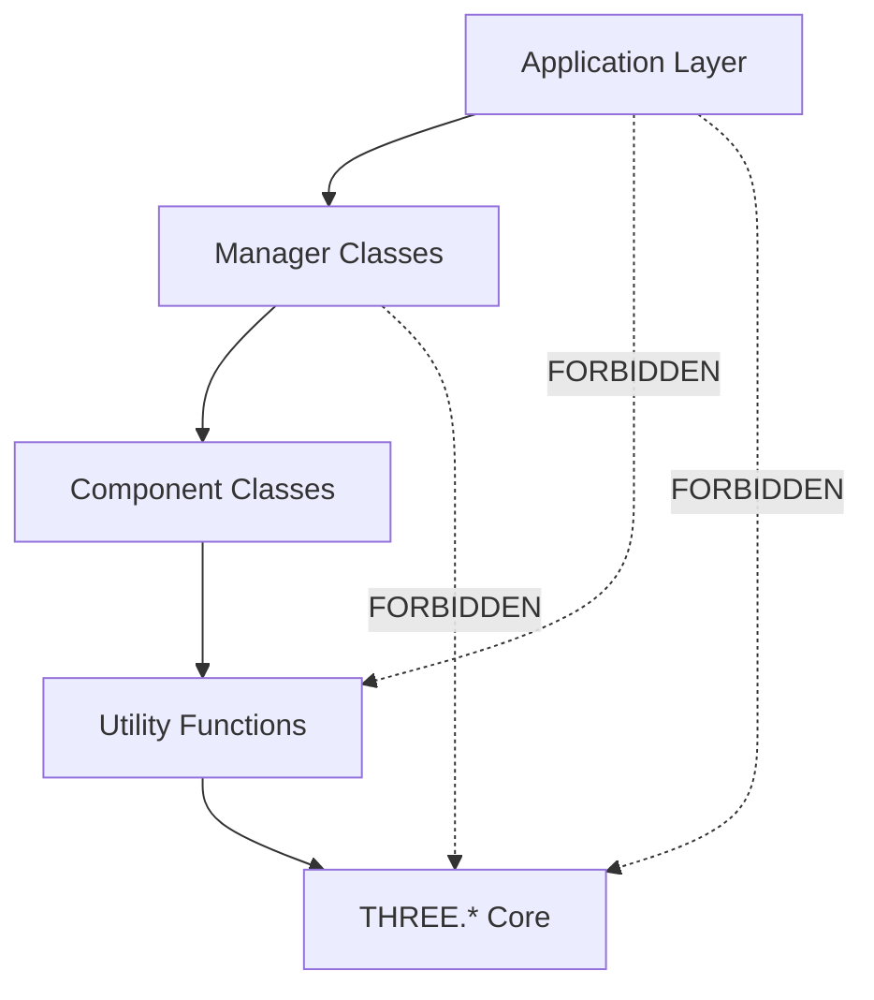

# Idiom-ThreeJS-Visualization-Patterns.md

## Three.js Idiomatic Patterns Reference (LLM Context Anchor)

> **Version**: 1.0.0
> **Last Updated**: 2026-01-30
> **Purpose**: Bias LLMs toward correct Three.js patterns via semantic anchoring
> **Naming Convention**: 4-word pattern applies to all functions and classes
> **Token Budget**: ~4000 tokens when fully loaded
> **Related**: Parseltongue diff visualization, React Three Fiber integration

---

## Section 1: The Four-Word Naming Convention (Three.js Adaptation)

### 1.1 Scene Objects (PascalCase, 4 units)

```typescript
// Pattern: Entity + Geometry + Material + Purpose
✅ ParticleSystemPointCloud
✅ TerrainMeshHeightmapped
✅ SkyboxCubeEnvironment
✅ CharacterModelAnimated
✅ WaterPlaneReflective
✅ LightProbeAmbientCapture
✅ BuildingGroupInstanced
✅ VehicleMeshProcedural

// ❌ Too short
❌ Particle
❌ Terrain
❌ Player
❌ Skybox
```

### 1.2 Functions (camelCase, 4 words)

```typescript
// Pattern: verb + target + operation + qualifier
✅ createMeshWithMaterial()
✅ updateCameraPositionSmooth()
✅ disposeSceneResourcesComplete()
✅ loadTextureFromUrl()
✅ calculateBoundingBoxWorld()
✅ applyTransformToGroup()
✅ animateRotationYAxis()
✅ rayCastFromCameraCenter()

// ❌ Too short
❌ createMesh()
❌ update()
❌ dispose()
❌ load()
```

### 1.3 Animation/Update Functions

```typescript
// Pattern: verb + target + property + modifier
✅ animateRotationYAxis()
✅ interpolatePositionLinear()
✅ updateMatrixWorldRecursive()
✅ tweenOpacityFadeOut()
✅ morphTargetInfluenceSmooth()
✅ updateBoneTransformations()
```

---

## Section 2: Scene Architecture Patterns

### 2.1 Scene Graph Organization

```typescript
// ✅ CORRECT: Hierarchical scene organization with semantic grouping
class SceneManagerOrganized {
  private scene: THREE.Scene;
  private rootGroups: {
    environment: THREE.Group;  // Skybox, fog, ambient effects
    terrain: THREE.Group;      // Ground, water, vegetation
    entities: THREE.Group;     // Characters, items, NPCs
    effects: THREE.Group;      // Particles, post-processing helpers
    ui: THREE.Group;           // 3D UI elements, billboards
  };

  constructor() {
    this.scene = new THREE.Scene();

    this.rootGroups = {
      environment: new THREE.Group(),
      terrain: new THREE.Group(),
      entities: new THREE.Group(),
      effects: new THREE.Group(),
      ui: new THREE.Group(),
    };

    // Named groups for debugging (appears in Three.js devtools)
    this.rootGroups.environment.name = 'EnvironmentRootGroup';
    this.rootGroups.terrain.name = 'TerrainRootGroup';
    this.rootGroups.entities.name = 'EntitiesRootGroup';
    this.rootGroups.effects.name = 'EffectsRootGroup';
    this.rootGroups.ui.name = 'UIRootGroup';

    // Add to scene in render order (back to front for transparency)
    this.scene.add(this.rootGroups.environment);
    this.scene.add(this.rootGroups.terrain);
    this.scene.add(this.rootGroups.entities);
    this.scene.add(this.rootGroups.effects);
    this.scene.add(this.rootGroups.ui);
  }

  addEntityToSceneGraph(
    entity: THREE.Object3D,
    category: keyof typeof this.rootGroups
  ): void {
    this.rootGroups[category].add(entity);
    entity.traverse(child => {
      // Enable shadows by default for entities
      if (child instanceof THREE.Mesh) {
        child.castShadow = true;
        child.receiveShadow = true;
      }
    });
  }

  removeEntityFromSceneGraph(entity: THREE.Object3D): void {
    entity.removeFromParent();
  }

  getSceneForRenderer(): THREE.Scene {
    return this.scene;
  }
}
```

```typescript
// ❌ WRONG: Flat scene with no organization
class BadSceneManager {
  private scene: THREE.Scene;

  constructor() {
    this.scene = new THREE.Scene();
  }

  addObject(obj: THREE.Object3D): void {
    this.scene.add(obj); // Everything at root - unmaintainable
  }
}
```

**TDD Specification**:
```markdown
WHEN entity added to SceneManagerOrganized
THEN entity SHALL be child of appropriate root group
AND shadows SHALL be enabled automatically
AND entity name SHALL be preserved

WHEN scene traversed for debugging
THEN root groups SHALL have semantic names
AND hierarchy SHALL be clear
```

### 2.2 Object Pooling Pattern

```typescript
// ✅ CORRECT: Pool frequently created/destroyed objects (e.g., bullets, particles)
class ObjectPoolMeshInstances<T extends THREE.Object3D> {
  private pool: T[] = [];
  private active: Set<T> = new Set();
  private factory: () => T;
  private maxPoolSize: number;

  constructor(
    factory: () => T,
    initialSize: number = 50,
    maxPoolSize: number = 200
  ) {
    this.factory = factory;
    this.maxPoolSize = maxPoolSize;
    this.preallocatePoolInstances(initialSize);
  }

  private preallocatePoolInstances(count: number): void {
    for (let i = 0; i < count; i++) {
      const instance = this.factory();
      instance.visible = false;
      this.pool.push(instance);
    }
  }

  acquireInstanceFromPool(): T {
    let instance = this.pool.pop();

    if (!instance) {
      // Pool exhausted - create new instance
      instance = this.factory();
      console.warn('Object pool exhausted, creating new instance');
    }

    instance.visible = true;
    this.active.add(instance);
    return instance;
  }

  releaseInstanceToPool(instance: T): void {
    if (!this.active.has(instance)) {
      console.warn('Attempting to release inactive instance');
      return;
    }

    instance.visible = false;
    this.active.delete(instance);

    // Prevent pool from growing unbounded
    if (this.pool.length < this.maxPoolSize) {
      this.pool.push(instance);
    } else {
      // Dispose instance if pool is full
      this.disposeObject3DComplete(instance);
    }
  }

  releaseAllInstancesToPool(): void {
    this.active.forEach(instance => {
      instance.visible = false;
      this.pool.push(instance);
    });
    this.active.clear();
  }

  private disposeObject3DComplete(object: T): void {
    if (object instanceof THREE.Mesh) {
      object.geometry?.dispose();

      if (Array.isArray(object.material)) {
        object.material.forEach(mat => mat.dispose());
      } else {
        object.material?.dispose();
      }
    }
  }

  getActiveCount(): number {
    return this.active.size;
  }

  getPoolSize(): number {
    return this.pool.length;
  }

  disposePoolComplete(): void {
    [...this.pool, ...Array.from(this.active)].forEach(instance => {
      this.disposeObject3DComplete(instance);
    });

    this.pool = [];
    this.active.clear();
  }
}

// Usage for bullet system
const bulletGeometry = new THREE.SphereGeometry(0.1, 8, 8);
const bulletMaterial = new THREE.MeshBasicMaterial({ color: 0xffff00 });

const bulletPool = new ObjectPoolMeshInstances(
  () => new THREE.Mesh(bulletGeometry, bulletMaterial.clone()),
  100, // Initial pool size
  500  // Max pool size
);

// Fire bullet
function fireBulletProjectile(origin: THREE.Vector3, direction: THREE.Vector3): void {
  const bullet = bulletPool.acquireInstanceFromPool();
  bullet.position.copy(origin);

  // Animate bullet...
  // After 3 seconds, return to pool
  setTimeout(() => {
    bulletPool.releaseInstanceToPool(bullet);
  }, 3000);
}
```

**Performance Comparison**:
- Without pooling: 60 bullets/sec = 60 allocations/sec → GC pauses
- With pooling: 60 bullets/sec = 0 allocations/sec after warmup → smooth 60fps

**TDD Specification**:
```markdown
WHEN acquireInstanceFromPool called
THEN instance SHALL be removed from pool
AND instance SHALL be added to active set
AND instance visible SHALL be true

WHEN releaseInstanceToPool called
THEN instance SHALL be removed from active set
AND instance SHALL be added to pool
AND instance visible SHALL be false

WHEN pool exhausted
THEN new instance SHALL be created
AND warning SHALL be logged
```

### 2.3 Entity Component Pattern

```typescript
// ✅ CORRECT: Composition over inheritance for game entities
interface ComponentBehaviorInterface {
  update(deltaTime: number): void;
  dispose(): void;
}

class EntityWithComponents extends THREE.Object3D {
  private components: Map<string, ComponentBehaviorInterface> = new Map();

  addComponentBehavior(name: string, component: ComponentBehaviorInterface): void {
    if (this.components.has(name)) {
      console.warn(`Component "${name}" already exists, replacing`);
      this.components.get(name)?.dispose();
    }

    this.components.set(name, component);
  }

  getComponentByName<T extends ComponentBehaviorInterface>(name: string): T | undefined {
    return this.components.get(name) as T | undefined;
  }

  removeComponentByName(name: string): boolean {
    const component = this.components.get(name);

    if (component) {
      component.dispose();
      this.components.delete(name);
      return true;
    }

    return false;
  }

  updateAllComponents(deltaTime: number): void {
    this.components.forEach(component => {
      component.update(deltaTime);
    });
  }

  disposeAllComponents(): void {
    this.components.forEach(component => component.dispose());
    this.components.clear();
  }
}

// Example component: Rotation animator
class RotationAnimatorComponent implements ComponentBehaviorInterface {
  constructor(
    private target: THREE.Object3D,
    private axis: THREE.Vector3,
    private speed: number
  ) {}

  update(deltaTime: number): void {
    this.target.rotateOnAxis(this.axis, this.speed * deltaTime);
  }

  setRotationSpeed(speed: number): void {
    this.speed = speed;
  }

  dispose(): void {
    // No resources to clean up
  }
}

// Example component: Physics body
class PhysicsBodyComponent implements ComponentBehaviorInterface {
  private velocity = new THREE.Vector3();
  private acceleration = new THREE.Vector3();
  private gravity = new THREE.Vector3(0, -9.81, 0);
  private mass: number;

  constructor(private target: THREE.Object3D, mass: number = 1.0) {
    this.mass = mass;
  }

  update(deltaTime: number): void {
    // Apply gravity
    this.acceleration.copy(this.gravity);

    // Update velocity
    this.velocity.addScaledVector(this.acceleration, deltaTime);

    // Update position
    this.target.position.addScaledVector(this.velocity, deltaTime);

    // Ground collision (simple)
    if (this.target.position.y < 0) {
      this.target.position.y = 0;
      this.velocity.y = 0;
    }
  }

  applyForceToBody(force: THREE.Vector3): void {
    // F = ma → a = F/m
    const accel = force.clone().divideScalar(this.mass);
    this.acceleration.add(accel);
  }

  setVelocityVector(velocity: THREE.Vector3): void {
    this.velocity.copy(velocity);
  }

  dispose(): void {
    // Remove from physics world if needed
  }
}

// Usage: Create player entity with components
function createPlayerEntityWithComponents(): EntityWithComponents {
  const player = new EntityWithComponents();
  player.name = 'PlayerEntity';

  // Add visual mesh
  const geometry = new THREE.BoxGeometry(1, 2, 1);
  const material = new THREE.MeshStandardMaterial({ color: 0x00ff00 });
  const mesh = new THREE.Mesh(geometry, material);
  player.add(mesh);

  // Add rotation component
  player.addComponentBehavior(
    'rotation',
    new RotationAnimatorComponent(
      player,
      new THREE.Vector3(0, 1, 0),
      Math.PI / 4 // 45 degrees per second
    )
  );

  // Add physics component
  player.addComponentBehavior(
    'physics',
    new PhysicsBodyComponent(player, 70) // 70kg mass
  );

  return player;
}

// Update loop
function updateGameLoop(deltaTime: number, entities: EntityWithComponents[]): void {
  entities.forEach(entity => {
    entity.updateAllComponents(deltaTime);
  });
}
```

**TDD Specification**:
```markdown
WHEN component added to entity
THEN component SHALL be retrievable by name
AND component update SHALL be called in game loop

WHEN entity disposed
THEN all components SHALL be disposed
AND components map SHALL be cleared
```

---

## Section 3: Resource Management Patterns

### 3.1 Disposal Pattern (Critical for Memory Management)

```typescript
// ✅ CORRECT: Complete disposal hierarchy (prevents memory leaks)
class ResourceDisposerComplete {

  disposeObject3DRecursive(object: THREE.Object3D): void {
    // Dispose children first (bottom-up traversal)
    while (object.children.length > 0) {
      this.disposeObject3DRecursive(object.children[0]);
    }

    // Dispose geometry and materials
    if (object instanceof THREE.Mesh) {
      this.disposeMeshGeometry(object.geometry);
      this.disposeMeshMaterial(object.material);
    }

    // Dispose other types
    if (object instanceof THREE.Line) {
      object.geometry?.dispose();
      this.disposeMeshMaterial(object.material);
    }

    if (object instanceof THREE.Points) {
      object.geometry?.dispose();
      this.disposeMeshMaterial(object.material);
    }

    // Remove from parent (important!)
    object.removeFromParent();

    // Clear any user data
    object.userData = {};
  }

  private disposeMeshGeometry(geometry: THREE.BufferGeometry): void {
    if (!geometry) return;

    geometry.dispose();

    // Dispose attributes manually if needed
    Object.keys(geometry.attributes).forEach(name => {
      const attribute = geometry.attributes[name];
      if (attribute && typeof attribute.dispose === 'function') {
        // BufferAttributes don't have dispose, but good practice to check
      }
    });
  }

  private disposeMeshMaterial(material: THREE.Material | THREE.Material[]): void {
    if (!material) return;

    if (Array.isArray(material)) {
      material.forEach(mat => this.disposeSingleMaterial(mat));
    } else {
      this.disposeSingleMaterial(material);
    }
  }

  private disposeSingleMaterial(material: THREE.Material): void {
    // Dispose all texture maps
    const textureKeys = [
      'map', 'lightMap', 'bumpMap', 'normalMap', 'specularMap',
      'envMap', 'alphaMap', 'aoMap', 'displacementMap',
      'emissiveMap', 'metalnessMap', 'roughnessMap', 'gradientMap'
    ] as const;

    textureKeys.forEach(key => {
      const texture = (material as any)[key] as THREE.Texture | undefined;

      if (texture && texture instanceof THREE.Texture) {
        texture.dispose();
      }
    });

    // Dispose material itself
    material.dispose();
  }

  disposeSceneComplete(scene: THREE.Scene): void {
    // Dispose all children
    while (scene.children.length > 0) {
      this.disposeObject3DRecursive(scene.children[0]);
    }

    // Dispose scene environment maps
    if (scene.environment) {
      scene.environment.dispose();
    }

    if (scene.background && scene.background instanceof THREE.Texture) {
      scene.background.dispose();
    }
  }

  disposeRendererComplete(renderer: THREE.WebGLRenderer): void {
    renderer.dispose();
    renderer.forceContextLoss();

    const canvas = renderer.domElement;
    if (canvas.parentElement) {
      canvas.parentElement.removeChild(canvas);
    }
  }
}

// Usage in component cleanup (React example)
useEffect(() => {
  const disposer = new ResourceDisposerComplete();

  return () => {
    disposer.disposeSceneComplete(scene);
    disposer.disposeRendererComplete(renderer);
  };
}, []);
```

```typescript
// ❌ WRONG: Incomplete disposal (memory leak)
function badDispose(mesh: THREE.Mesh): void {
  scene.remove(mesh);
  mesh.geometry.dispose();
  // ❌ Material not disposed → GPU memory leak
  // ❌ Textures not disposed → GPU memory leak
  // ❌ Children not disposed → memory leak
}
```

**Memory Leak Symptoms**:
- GPU memory usage increases over time
- Frame rate degrades after multiple scene loads
- Browser tab crashes after extended use

**TDD Specification**:
```markdown
WHEN disposeObject3DRecursive called on mesh
THEN geometry SHALL be disposed
AND all materials SHALL be disposed
AND all textures SHALL be disposed
AND object SHALL be removed from parent

WHEN scene disposed
THEN environment map SHALL be disposed
AND background texture SHALL be disposed (if texture)
AND all children SHALL be recursively disposed
```

### 3.2 Texture Loading Pattern with Caching

```typescript
// ✅ CORRECT: Centralized texture management with LRU cache
class TextureManagerCached {
  private textureCache: Map<string, THREE.Texture> = new Map();
  private loadingPromises: Map<string, Promise<THREE.Texture>> = new Map();
  private loader: THREE.TextureLoader;
  private maxCacheSize: number;

  constructor(maxCacheSize: number = 100) {
    this.loader = new THREE.TextureLoader();
    this.maxCacheSize = maxCacheSize;
  }

  async loadTextureFromUrl(url: string): Promise<THREE.Texture> {
    // Return cached texture if available
    const cached = this.textureCache.get(url);
    if (cached) return cached;

    // Return in-flight promise if already loading
    const loading = this.loadingPromises.get(url);
    if (loading) return loading;

    // Start new load
    const promise = new Promise<THREE.Texture>((resolve, reject) => {
      this.loader.load(
        url,
        (texture) => {
          // Configure texture defaults
          texture.encoding = THREE.sRGBEncoding;
          texture.anisotropy = 16; // Max anisotropic filtering

          this.textureCache.set(url, texture);
          this.loadingPromises.delete(url);

          // Evict oldest if cache full
          this.evictOldestIfNeeded();

          resolve(texture);
        },
        undefined, // onProgress
        (error) => {
          this.loadingPromises.delete(url);
          reject(error);
        }
      );
    });

    this.loadingPromises.set(url, promise);
    return promise;
  }

  private evictOldestIfNeeded(): void {
    if (this.textureCache.size <= this.maxCacheSize) return;

    // Get first entry (oldest in insertion order)
    const [oldestUrl, oldestTexture] = this.textureCache.entries().next().value;

    oldestTexture.dispose();
    this.textureCache.delete(oldestUrl);

    console.log(`Evicted texture from cache: ${oldestUrl}`);
  }

  disposeTextureByUrl(url: string): void {
    const texture = this.textureCache.get(url);

    if (texture) {
      texture.dispose();
      this.textureCache.delete(url);
    }
  }

  disposeAllTexturesComplete(): void {
    this.textureCache.forEach(texture => texture.dispose());
    this.textureCache.clear();
    this.loadingPromises.clear();
  }

  getCacheSize(): number {
    return this.textureCache.size;
  }
}

// Global singleton instance
export const textureManager = new TextureManagerCached(100);

// Usage
async function createTexturedMesh(): Promise<THREE.Mesh> {
  const geometry = new THREE.PlaneGeometry(10, 10);

  const texture = await textureManager.loadTextureFromUrl('/textures/ground.jpg');
  const material = new THREE.MeshStandardMaterial({ map: texture });

  return new THREE.Mesh(geometry, material);
}
```

**TDD Specification**:
```markdown
WHEN same texture URL loaded twice
THEN only one network request SHALL occur
AND same texture instance SHALL be returned

WHEN cache size exceeds maxCacheSize
THEN oldest texture SHALL be evicted
AND evicted texture SHALL be disposed
```

### 3.3 GLTF Loading Pattern with Draco Compression

```typescript
// ✅ CORRECT: GLTF with proper setup and error handling
import { GLTFLoader } from 'three/examples/jsm/loaders/GLTFLoader';
import { DRACOLoader } from 'three/examples/jsm/loaders/DRACOLoader';

class ModelLoaderGLTFDraco {
  private gltfLoader: GLTFLoader;
  private dracoLoader: DRACOLoader;
  private modelCache: Map<string, THREE.Group> = new Map();

  constructor(dracoDecoderPath: string = '/draco/') {
    this.dracoLoader = new DRACOLoader();
    this.dracoLoader.setDecoderPath(dracoDecoderPath);
    this.dracoLoader.setDecoderConfig({ type: 'js' }); // or 'wasm'

    this.gltfLoader = new GLTFLoader();
    this.gltfLoader.setDRACOLoader(this.dracoLoader);
  }

  async loadModelFromUrl(url: string, options?: {
    enableShadows?: boolean;
    castShadow?: boolean;
    receiveShadow?: boolean;
    scale?: number;
  }): Promise<THREE.Group> {
    // Check cache
    const cached = this.modelCache.get(url);
    if (cached) {
      return cached.clone(); // Return clone to allow independent transforms
    }

    return new Promise((resolve, reject) => {
      this.gltfLoader.load(
        url,
        (gltf) => {
          const model = gltf.scene;

          // Process model
          model.traverse((child) => {
            if (child instanceof THREE.Mesh) {
              // Configure shadows
              if (options?.enableShadows !== false) {
                child.castShadow = options?.castShadow !== false;
                child.receiveShadow = options?.receiveShadow !== false;
              }

              // Ensure materials update
              if (child.material instanceof THREE.Material) {
                child.material.needsUpdate = true;
              }

              // Enable frustum culling (default, but explicit)
              child.frustumCulled = true;
            }
          });

          // Apply scale if specified
          if (options?.scale) {
            model.scale.setScalar(options.scale);
          }

          // Cache original
          this.modelCache.set(url, model);

          resolve(model.clone());
        },
        (progress) => {
          const percent = (progress.loaded / progress.total) * 100;
          console.log(`Loading model: ${percent.toFixed(2)}%`);
        },
        (error) => {
          console.error('Error loading model:', error);
          reject(error);
        }
      );
    });
  }

  dispose(): void {
    this.dracoLoader.dispose();
    this.modelCache.clear();
  }
}

// Usage
const modelLoader = new ModelLoaderGLTFDraco();

async function loadCharacterModel(): Promise<THREE.Group> {
  const character = await modelLoader.loadModelFromUrl(
    '/models/character.glb',
    {
      enableShadows: true,
      castShadow: true,
      receiveShadow: false,
      scale: 2.0,
    }
  );

  return character;
}
```

**TDD Specification**:
```markdown
WHEN GLTF model loaded
THEN all meshes SHALL have shadows enabled (if option true)
AND materials SHALL have needsUpdate true
AND model SHALL be cached for reuse

WHEN cached model requested
THEN cloned model SHALL be returned
AND original SHALL remain in cache
```

---

## Section 4: Rendering Patterns

### 4.1 Render Loop Pattern with Delta Time

```typescript
// ✅ CORRECT: Structured render loop with proper timing
class RenderLoopManager {
  private renderer: THREE.WebGLRenderer;
  private scene: THREE.Scene;
  private camera: THREE.Camera;
  private clock: THREE.Clock;
  private animationFrameId: number | null = null;
  private updateCallbacks: ((delta: number) => void)[] = [];
  private isRunning: boolean = false;
  private targetFPS: number = 60;
  private frameInterval: number;
  private lastFrameTime: number = 0;

  constructor(
    renderer: THREE.WebGLRenderer,
    scene: THREE.Scene,
    camera: THREE.Camera,
    targetFPS: number = 60
  ) {
    this.renderer = renderer;
    this.scene = scene;
    this.camera = camera;
    this.clock = new THREE.Clock();
    this.targetFPS = targetFPS;
    this.frameInterval = 1000 / targetFPS;
  }

  addUpdateCallback(callback: (delta: number) => void): void {
    this.updateCallbacks.push(callback);
  }

  removeUpdateCallback(callback: (delta: number) => void): void {
    const index = this.updateCallbacks.indexOf(callback);
    if (index > -1) {
      this.updateCallbacks.splice(index, 1);
    }
  }

  startRenderLoopAnimation(): void {
    if (this.isRunning) return;

    this.isRunning = true;
    this.clock.start();
    this.lastFrameTime = performance.now();

    const animate = (currentTime: number): void {
      if (!this.isRunning) return;

      this.animationFrameId = requestAnimationFrame(animate);

      // Frame rate limiting (optional)
      const elapsed = currentTime - this.lastFrameTime;

      if (elapsed < this.frameInterval) {
        return; // Skip frame if not enough time passed
      }

      this.lastFrameTime = currentTime - (elapsed % this.frameInterval);

      // Get delta time (capped at 0.1s to prevent spiral of death)
      const delta = Math.min(this.clock.getDelta(), 0.1);

      // Update all registered callbacks
      this.updateCallbacks.forEach(callback => {
        try {
          callback(delta);
        } catch (error) {
          console.error('Error in update callback:', error);
        }
      });

      // Render scene
      this.renderer.render(this.scene, this.camera);
    };

    animate(performance.now());
  }

  stopRenderLoopAnimation(): void {
    this.isRunning = false;

    if (this.animationFrameId !== null) {
      cancelAnimationFrame(this.animationFrameId);
      this.animationFrameId = null;
    }

    this.clock.stop();
  }

  resizeRendererToContainer(width: number, height: number): void {
    this.renderer.setSize(width, height);

    if (this.camera instanceof THREE.PerspectiveCamera) {
      this.camera.aspect = width / height;
      this.camera.updateProjectionMatrix();
    } else if (this.camera instanceof THREE.OrthographicCamera) {
      const aspect = width / height;
      this.camera.left = -10 * aspect;
      this.camera.right = 10 * aspect;
      this.camera.top = 10;
      this.camera.bottom = -10;
      this.camera.updateProjectionMatrix();
    }
  }

  setTargetFPS(fps: number): void {
    this.targetFPS = fps;
    this.frameInterval = 1000 / fps;
  }
}
```

**TDD Specification**:
```markdown
WHEN render loop started
THEN animate function SHALL be called every frame
AND delta time SHALL be passed to callbacks
AND delta SHALL be capped at 0.1 seconds

WHEN render loop stopped
THEN animation frame SHALL be cancelled
AND clock SHALL be stopped
AND callbacks SHALL not be called
```

### 4.2 Responsive Canvas Pattern with ResizeObserver

```typescript
// ✅ CORRECT: Handle resize with modern ResizeObserver API
class ResponsiveCanvasManager {
  private container: HTMLElement;
  private renderer: THREE.WebGLRenderer;
  private camera: THREE.PerspectiveCamera | THREE.OrthographicCamera;
  private resizeObserver: ResizeObserver;
  private pixelRatio: number;

  constructor(
    container: HTMLElement,
    renderer: THREE.WebGLRenderer,
    camera: THREE.PerspectiveCamera | THREE.OrthographicCamera,
    maxPixelRatio: number = 2
  ) {
    this.container = container;
    this.renderer = renderer;
    this.camera = camera;
    this.pixelRatio = Math.min(window.devicePixelRatio, maxPixelRatio);

    // Modern resize detection
    this.resizeObserver = new ResizeObserver(entries => {
      for (const entry of entries) {
        if (entry.target === this.container) {
          this.handleContainerResizeEvent(entry.contentRect);
        }
      }
    });

    this.resizeObserver.observe(container);

    // Initial size
    this.handleContainerResizeEvent(container.getBoundingClientRect());
  }

  private handleContainerResizeEvent(rect: DOMRectReadOnly): void {
    const { width, height } = rect;

    // Update renderer
    this.renderer.setSize(width, height, false); // false = don't set canvas style
    this.renderer.setPixelRatio(this.pixelRatio);

    // Update camera
    if (this.camera instanceof THREE.PerspectiveCamera) {
      this.camera.aspect = width / height;
      this.camera.updateProjectionMatrix();
    } else if (this.camera instanceof THREE.OrthographicCamera) {
      const aspect = width / height;
      const frustumSize = 10;

      this.camera.left = (-frustumSize * aspect) / 2;
      this.camera.right = (frustumSize * aspect) / 2;
      this.camera.top = frustumSize / 2;
      this.camera.bottom = -frustumSize / 2;
      this.camera.updateProjectionMatrix();
    }
  }

  updatePixelRatio(maxPixelRatio: number): void {
    this.pixelRatio = Math.min(window.devicePixelRatio, maxPixelRatio);
    const rect = this.container.getBoundingClientRect();
    this.handleContainerResizeEvent(rect);
  }

  dispose(): void {
    this.resizeObserver.disconnect();
  }
}

// Usage in React component
function ThreeJSCanvas() {
  const containerRef = useRef<HTMLDivElement>(null);
  const rendererRef = useRef<THREE.WebGLRenderer | null>(null);
  const resizeManagerRef = useRef<ResponsiveCanvasManager | null>(null);

  useEffect(() => {
    if (!containerRef.current) return;

    const renderer = new THREE.WebGLRenderer({ antialias: true });
    const scene = new THREE.Scene();
    const camera = new THREE.PerspectiveCamera(75, 1, 0.1, 1000);

    containerRef.current.appendChild(renderer.domElement);

    const resizeManager = new ResponsiveCanvasManager(
      containerRef.current,
      renderer,
      camera,
      2 // Max pixel ratio
    );

    rendererRef.current = renderer;
    resizeManagerRef.current = resizeManager;

    return () => {
      resizeManager.dispose();
      renderer.dispose();
    };
  }, []);

  return <div ref={containerRef} style={{ width: '100%', height: '100%' }} />;
}
```

**TDD Specification**:
```markdown
WHEN container resized
THEN renderer SHALL update to new dimensions
AND camera aspect ratio SHALL update
AND projection matrix SHALL be recalculated

WHEN ResponsiveCanvasManager disposed
THEN ResizeObserver SHALL disconnect
AND no memory leaks SHALL occur
```

### 4.3 InstancedMesh Pattern for Massive Scenes

```typescript
// ✅ CORRECT: Use InstancedMesh for rendering thousands of identical objects
class InstancedMeshManager {
  private mesh: THREE.InstancedMesh;
  private dummy: THREE.Object3D;
  private activeCount: number = 0;
  private maxInstances: number;

  constructor(
    geometry: THREE.BufferGeometry,
    material: THREE.Material,
    maxInstances: number
  ) {
    this.maxInstances = maxInstances;
    this.mesh = new THREE.InstancedMesh(geometry, material, maxInstances);
    this.mesh.instanceMatrix.setUsage(THREE.DynamicDrawUsage); // Update frequently
    this.mesh.count = 0; // Start with no visible instances
    this.dummy = new THREE.Object3D();
  }

  addInstanceAtPosition(
    position: THREE.Vector3,
    rotation?: THREE.Euler,
    scale?: THREE.Vector3,
    color?: THREE.Color
  ): number {
    if (this.activeCount >= this.maxInstances) {
      console.warn('Maximum instance count reached');
      return -1;
    }

    const index = this.activeCount;

    // Set transform
    this.dummy.position.copy(position);

    if (rotation) {
      this.dummy.rotation.copy(rotation);
    } else {
      this.dummy.rotation.set(0, 0, 0);
    }

    if (scale) {
      this.dummy.scale.copy(scale);
    } else {
      this.dummy.scale.setScalar(1);
    }

    this.dummy.updateMatrix();
    this.mesh.setMatrixAt(index, this.dummy.matrix);

    // Set color if provided and mesh has color attribute
    if (color && this.mesh.instanceColor) {
      this.mesh.setColorAt(index, color);
    }

    this.activeCount++;
    this.mesh.count = this.activeCount;
    this.mesh.instanceMatrix.needsUpdate = true;

    if (this.mesh.instanceColor) {
      this.mesh.instanceColor.needsUpdate = true;
    }

    return index;
  }

  updateInstanceTransform(
    index: number,
    position?: THREE.Vector3,
    rotation?: THREE.Euler,
    scale?: THREE.Vector3
  ): void {
    if (index >= this.activeCount) {
      console.warn(`Instance ${index} not active`);
      return;
    }

    // Get current matrix
    this.mesh.getMatrixAt(index, this.dummy.matrix);
    this.dummy.matrix.decompose(this.dummy.position, this.dummy.quaternion, this.dummy.scale);

    // Update provided values
    if (position) this.dummy.position.copy(position);
    if (rotation) this.dummy.rotation.copy(rotation);
    if (scale) this.dummy.scale.copy(scale);

    this.dummy.updateMatrix();
    this.mesh.setMatrixAt(index, this.dummy.matrix);
    this.mesh.instanceMatrix.needsUpdate = true;
  }

  updateInstanceColor(index: number, color: THREE.Color): void {
    if (!this.mesh.instanceColor) {
      console.warn('InstancedMesh does not have instanceColor attribute');
      return;
    }

    if (index >= this.activeCount) {
      console.warn(`Instance ${index} not active`);
      return;
    }

    this.mesh.setColorAt(index, color);
    this.mesh.instanceColor.needsUpdate = true;
  }

  clearAllInstances(): void {
    this.activeCount = 0;
    this.mesh.count = 0;
  }

  getMeshForScene(): THREE.InstancedMesh {
    return this.mesh;
  }

  getActiveInstanceCount(): number {
    return this.activeCount;
  }

  dispose(): void {
    this.mesh.geometry.dispose();

    if (Array.isArray(this.mesh.material)) {
      this.mesh.material.forEach(m => m.dispose());
    } else {
      this.mesh.material.dispose();
    }
  }
}

// Usage: Render 10,000 trees with single draw call
const treeGeometry = new THREE.ConeGeometry(0.5, 2, 8);
const treeMaterial = new THREE.MeshStandardMaterial({ color: 0x228b22 });

const treeInstances = new InstancedMeshManager(
  treeGeometry,
  treeMaterial,
  10000
);

scene.add(treeInstances.getMeshForScene());

// Add trees in grid
for (let x = 0; x < 100; x++) {
  for (let z = 0; z < 100; z++) {
    const position = new THREE.Vector3(
      x * 5 - 250,
      0,
      z * 5 - 250
    );

    const rotation = new THREE.Euler(
      0,
      Math.random() * Math.PI * 2,
      0
    );

    const scale = new THREE.Vector3(
      0.8 + Math.random() * 0.4,
      0.8 + Math.random() * 0.4,
      0.8 + Math.random() * 0.4
    );

    treeInstances.addInstanceAtPosition(position, rotation, scale);
  }
}
```

**Performance Comparison**:
- 10,000 individual meshes: ~10 FPS, 10,000 draw calls
- 10,000 instanced meshes: ~60 FPS, 1 draw call

**TDD Specification**:
```markdown
WHEN 10,000 instances added to InstancedMeshManager
THEN only one draw call SHALL occur
AND all instances SHALL render correctly
AND frame rate SHALL remain above 60fps

WHEN instance transform updated
THEN only that instance SHALL move
AND instanceMatrix.needsUpdate SHALL be true
```

---

## Section 5: Camera and Controls Patterns

### 5.1 Camera Setup Pattern

```typescript
// ✅ CORRECT: Proper camera initialization with sensible defaults
function createPerspectiveCameraDefault(
  container: HTMLElement
): THREE.PerspectiveCamera {
  const aspect = container.clientWidth / container.clientHeight;

  const camera = new THREE.PerspectiveCamera(
    75,     // FOV - 75 is good for most 3D games/apps
    aspect, // Aspect ratio
    0.1,    // Near plane - not too small (z-fighting)
    1000    // Far plane - adjust based on scene scale
  );

  camera.position.set(0, 5, 10);
  camera.lookAt(0, 0, 0);

  return camera;
}

// For orthographic (2D-like, isometric, CAD)
function createOrthographicCameraFrustum(
  frustumSize: number,
  aspect: number
): THREE.OrthographicCamera {
  const camera = new THREE.OrthographicCamera(
    (-frustumSize * aspect) / 2,  // left
    (frustumSize * aspect) / 2,   // right
    frustumSize / 2,              // top
    -frustumSize / 2,             // bottom
    0.1,                          // near
    1000                          // far
  );

  camera.position.set(10, 10, 10);
  camera.lookAt(0, 0, 0);

  return camera;
}

// Configure renderer for best quality
function configureRendererQualitySettings(
  renderer: THREE.WebGLRenderer
): void {
  renderer.shadowMap.enabled = true;
  renderer.shadowMap.type = THREE.PCFSoftShadowMap; // or VSMShadowMap
  renderer.outputEncoding = THREE.sRGBEncoding;
  renderer.toneMapping = THREE.ACESFilmicToneMapping;
  renderer.toneMappingExposure = 1.0;
  renderer.physicallyCorrectLights = true;
}
```

**TDD Specification**:
```markdown
WHEN PerspectiveCamera created for container
THEN aspect ratio SHALL match container dimensions
AND FOV SHALL be 75 degrees
AND near plane SHALL be 0.1
AND far plane SHALL be 1000
```

### 5.2 Smooth Camera Follow with Damping

```typescript
// ✅ CORRECT: Third-person camera follow with smooth interpolation
class CameraFollowController {
  private camera: THREE.Camera;
  private target: THREE.Object3D;
  private offset: THREE.Vector3;
  private smoothFactor: number;
  private lookAtTarget: THREE.Vector3;
  private currentOffset: THREE.Vector3;

  constructor(
    camera: THREE.Camera,
    target: THREE.Object3D,
    offset: THREE.Vector3 = new THREE.Vector3(0, 5, 10),
    smoothFactor: number = 0.1
  ) {
    this.camera = camera;
    this.target = target;
    this.offset = offset.clone();
    this.smoothFactor = smoothFactor;
    this.lookAtTarget = new THREE.Vector3();
    this.currentOffset = offset.clone();
  }

  updateCameraPositionSmooth(deltaTime: number): void {
    // Calculate desired position (target + offset)
    const desiredPosition = this.target.position.clone().add(this.offset);

    // Lerp camera position for smooth follow
    this.camera.position.lerp(desiredPosition, this.smoothFactor);

    // Smooth look-at (look slightly ahead of target)
    const targetLookAt = this.target.position.clone();

    // If target has velocity, look ahead
    if (this.target.userData.velocity instanceof THREE.Vector3) {
      const velocity = this.target.userData.velocity as THREE.Vector3;
      targetLookAt.addScaledVector(velocity, 0.5); // Look 0.5 units ahead
    }

    this.lookAtTarget.lerp(targetLookAt, this.smoothFactor);
    this.camera.lookAt(this.lookAtTarget);
  }

  setOffsetVector(offset: THREE.Vector3): void {
    this.offset.copy(offset);
  }

  setSmoothFactor(factor: number): void {
    this.smoothFactor = Math.max(0, Math.min(1, factor)); // Clamp to [0, 1]
  }

  // Orbit around target (for inspection)
  orbitCameraAroundTarget(angleRadians: number, radius: number): void {
    const x = Math.sin(angleRadians) * radius;
    const z = Math.cos(angleRadians) * radius;
    this.offset.set(x, this.offset.y, z);
  }
}

// Usage in game loop
const cameraController = new CameraFollowController(
  camera,
  playerEntity,
  new THREE.Vector3(0, 8, 15), // Behind and above
  0.05 // Smooth factor (lower = smoother, higher = more responsive)
);

function updateGameLoop(deltaTime: number): void {
  // Update player movement...

  // Update camera
  cameraController.updateCameraPositionSmooth(deltaTime);
}
```

**TDD Specification**:
```markdown
WHEN camera follows moving target
THEN camera position SHALL lag behind target
AND lag SHALL be determined by smoothFactor
AND camera SHALL always look at target

WHEN smoothFactor is 0
THEN camera SHALL not move
WHEN smoothFactor is 1
THEN camera SHALL follow exactly with no lag
```

---

## Section 6: Animation Patterns

### 6.1 Animation Mixer Pattern for GLTF Models

```typescript
// ✅ CORRECT: Manage animations with proper crossfading
class AnimationControllerMixer {
  private mixer: THREE.AnimationMixer;
  private actions: Map<string, THREE.AnimationAction> = new Map();
  private currentAction: THREE.AnimationAction | null = null;

  constructor(model: THREE.Object3D, animations: THREE.AnimationClip[]) {
    this.mixer = new THREE.AnimationMixer(model);

    // Create actions for all clips
    animations.forEach(clip => {
      const action = this.mixer.clipAction(clip);
      this.actions.set(clip.name, action);
    });
  }

  playAnimationByName(
    name: string,
    fadeInDuration: number = 0.3,
    loop: THREE.AnimationActionLoopStyles = THREE.LoopRepeat
  ): boolean {
    const newAction = this.actions.get(name);

    if (!newAction) {
      console.warn(`Animation "${name}" not found`);
      return false;
    }

    if (this.currentAction === newAction && newAction.isRunning()) {
      return true; // Already playing
    }

    // Configure new action
    newAction.reset();
    newAction.setLoop(loop, loop === THREE.LoopOnce ? 1 : Infinity);
    newAction.clampWhenFinished = loop === THREE.LoopOnce;
    newAction.fadeIn(fadeInDuration);
    newAction.play();

    // Fade out previous action
    if (this.currentAction && this.currentAction !== newAction) {
      this.currentAction.fadeOut(fadeInDuration);
    }

    this.currentAction = newAction;
    return true;
  }

  updateAnimationMixerDelta(deltaTime: number): void {
    this.mixer.update(deltaTime);
  }

  stopAllAnimationsImmediate(): void {
    this.mixer.stopAllAction();
    this.currentAction = null;
  }

  getCurrentAnimationName(): string | null {
    if (!this.currentAction) return null;

    for (const [name, action] of this.actions.entries()) {
      if (action === this.currentAction) {
        return name;
      }
    }

    return null;
  }

  setAnimationTimeScale(scale: number): void {
    this.mixer.timeScale = scale;
  }

  dispose(): void {
    this.stopAllAnimationsImmediate();
    this.actions.clear();
  }
}

// Usage with character model
async function setupCharacterAnimations(model: THREE.Group): Promise<AnimationControllerMixer> {
  const gltf = await gltfLoader.load('/models/character.glb');

  const animations = gltf.animations; // Array of AnimationClips
  const animController = new AnimationControllerMixer(model, animations);

  // Play idle animation by default
  animController.playAnimationByName('Idle', 0.5);

  return animController;
}

// In game loop
function handleCharacterMovement(controller: AnimationControllerMixer, isWalking: boolean, isRunning: boolean): void {
  if (isRunning) {
    controller.playAnimationByName('Run', 0.2);
  } else if (isWalking) {
    controller.playAnimationByName('Walk', 0.2);
  } else {
    controller.playAnimationByName('Idle', 0.3);
  }
}
```

**TDD Specification**:
```markdown
WHEN playAnimationByName called with 'Walk'
THEN Walk animation SHALL start playing
AND previous animation SHALL fade out
AND fade duration SHALL match parameter

WHEN same animation played twice
THEN no action SHALL be taken
AND animation SHALL continue playing
```

### 6.2 Tween Animation Pattern (Custom)

```typescript
// ✅ CORRECT: Simple tween without external library
class TweenAnimatorSimple {
  private startValue: number;
  private endValue: number;
  private duration: number;
  private elapsed: number = 0;
  private easing: (t: number) => number;
  private onUpdate: (value: number) => void;
  private onComplete?: () => void;
  private isActive: boolean = false;

  constructor(config: {
    startValue: number;
    endValue: number;
    duration: number;
    easing?: (t: number) => number;
    onUpdate: (value: number) => void;
    onComplete?: () => void;
  }) {
    this.startValue = config.startValue;
    this.endValue = config.endValue;
    this.duration = config.duration;
    this.easing = config.easing || TweenAnimatorSimple.easeOutQuad;
    this.onUpdate = config.onUpdate;
    this.onComplete = config.onComplete;
  }

  start(): void {
    this.elapsed = 0;
    this.isActive = true;
  }

  updateTweenProgress(deltaTime: number): boolean {
    if (!this.isActive) return false;

    this.elapsed += deltaTime;
    const progress = Math.min(this.elapsed / this.duration, 1);
    const easedProgress = this.easing(progress);

    const currentValue = this.startValue + (this.endValue - this.startValue) * easedProgress;
    this.onUpdate(currentValue);

    if (progress >= 1) {
      this.isActive = false;
      this.onComplete?.();
      return false; // Tween complete
    }

    return true; // Tween active
  }

  stop(): void {
    this.isActive = false;
  }

  // Easing functions
  static easeLinear(t: number): number {
    return t;
  }

  static easeOutQuad(t: number): number {
    return t * (2 - t);
  }

  static easeInOutCubic(t: number): number {
    return t < 0.5 ? 4 * t * t * t : 1 - Math.pow(-2 * t + 2, 3) / 2;
  }

  static easeOutElastic(t: number): number {
    const c4 = (2 * Math.PI) / 3;
    return t === 0 ? 0 : t === 1 ? 1 :
      Math.pow(2, -10 * t) * Math.sin((t * 10 - 0.75) * c4) + 1;
  }

  static easeOutBounce(t: number): number {
    const n1 = 7.5625;
    const d1 = 2.75;

    if (t < 1 / d1) {
      return n1 * t * t;
    } else if (t < 2 / d1) {
      return n1 * (t -= 1.5 / d1) * t + 0.75;
    } else if (t < 2.5 / d1) {
      return n1 * (t -= 2.25 / d1) * t + 0.9375;
    } else {
      return n1 * (t -= 2.625 / d1) * t + 0.984375;
    }
  }
}

// Usage: Animate camera FOV
function animateCameraZoom(camera: THREE.PerspectiveCamera): TweenAnimatorSimple {
  return new TweenAnimatorSimple({
    startValue: camera.fov,
    endValue: 30, // Zoom in
    duration: 1.0, // 1 second
    easing: TweenAnimatorSimple.easeOutQuad,
    onUpdate: (value) => {
      camera.fov = value;
      camera.updateProjectionMatrix();
    },
    onComplete: () => {
      console.log('Zoom animation complete');
    },
  });
}

// In game loop
const zoomTween = animateCameraZoom(camera);
zoomTween.start();

function updateLoop(deltaTime: number): void {
  zoomTween.updateTweenProgress(deltaTime);
}
```

**TDD Specification**:
```markdown
WHEN tween started from 0 to 100 over 1 second
THEN value SHALL interpolate from 0 to 100
AND onUpdate SHALL be called each frame
AND onComplete SHALL be called when done

WHEN tween uses easeOutQuad
THEN animation SHALL start fast and end slow
AND final value SHALL equal endValue
```

---

## Section 7: Shader Patterns

### 7.1 Custom Shader Material with Uniforms

```typescript
// ✅ CORRECT: Custom shader with proper uniforms and TypeScript types
interface VerticalGradientShaderUniforms {
  uColorTop: { value: THREE.Color };
  uColorBottom: { value: THREE.Color };
  uTime: { value: number };
  uNoiseIntensity: { value: number };
}

class CustomShaderMaterialFactory {

  static createGradientShaderMaterial(
    colorTop: THREE.Color,
    colorBottom: THREE.Color
  ): THREE.ShaderMaterial {
    const uniforms: VerticalGradientShaderUniforms = {
      uColorTop: { value: colorTop },
      uColorBottom: { value: colorBottom },
      uTime: { value: 0 },
      uNoiseIntensity: { value: 0.1 },
    };

    return new THREE.ShaderMaterial({
      uniforms,
      vertexShader: `
        varying vec2 vUv;
        varying vec3 vPosition;
        varying vec3 vNormal;

        void main() {
          vUv = uv;
          vPosition = position;
          vNormal = normalize(normalMatrix * normal);

          gl_Position = projectionMatrix * modelViewMatrix * vec4(position, 1.0);
        }
      `,
      fragmentShader: `
        uniform vec3 uColorTop;
        uniform vec3 uColorBottom;
        uniform float uTime;
        uniform float uNoiseIntensity;

        varying vec2 vUv;
        varying vec3 vPosition;
        varying vec3 vNormal;

        // Simple noise function
        float random(vec2 st) {
          return fract(sin(dot(st.xy, vec2(12.9898, 78.233))) * 43758.5453123);
        }

        void main() {
          // Vertical gradient
          vec3 color = mix(uColorBottom, uColorTop, vUv.y);

          // Add subtle noise
          float noise = random(vUv + uTime) * uNoiseIntensity;
          color += noise;

          // Rim lighting effect
          float rimIntensity = 1.0 - max(0.0, dot(vNormal, vec3(0.0, 0.0, 1.0)));
          rimIntensity = pow(rimIntensity, 3.0);
          color += vec3(rimIntensity * 0.3);

          gl_FragColor = vec4(color, 1.0);
        }
      `,
      side: THREE.DoubleSide,
    });
  }

  static createWaterShaderMaterial(): THREE.ShaderMaterial {
    return new THREE.ShaderMaterial({
      uniforms: {
        uTime: { value: 0 },
        uWaterColor: { value: new THREE.Color(0x0077be) },
        uFoamColor: { value: new THREE.Color(0xffffff) },
        uWaveSpeed: { value: 1.0 },
        uWaveAmplitude: { value: 0.5 },
      },
      vertexShader: `
        uniform float uTime;
        uniform float uWaveSpeed;
        uniform float uWaveAmplitude;

        varying vec2 vUv;
        varying float vElevation;

        void main() {
          vUv = uv;

          // Wave animation
          vec3 newPosition = position;
          float wave1 = sin(position.x * 2.0 + uTime * uWaveSpeed) * uWaveAmplitude;
          float wave2 = sin(position.z * 3.0 + uTime * uWaveSpeed * 0.7) * uWaveAmplitude * 0.5;
          newPosition.y += wave1 + wave2;

          vElevation = newPosition.y;

          gl_Position = projectionMatrix * modelViewMatrix * vec4(newPosition, 1.0);
        }
      `,
      fragmentShader: `
        uniform vec3 uWaterColor;
        uniform vec3 uFoamColor;

        varying vec2 vUv;
        varying float vElevation;

        void main() {
          // Mix water color with foam based on elevation
          float foamMix = smoothstep(0.3, 0.5, vElevation);
          vec3 color = mix(uWaterColor, uFoamColor, foamMix);

          gl_FragColor = vec4(color, 0.8); // Semi-transparent
        }
      `,
      transparent: true,
      side: THREE.DoubleSide,
    });
  }
}

// Usage
const gradientMaterial = CustomShaderMaterialFactory.createGradientShaderMaterial(
  new THREE.Color(0xff6b6b),
  new THREE.Color(0x4ecdc4)
);

const planeGeometry = new THREE.PlaneGeometry(10, 10);
const mesh = new THREE.Mesh(planeGeometry, gradientMaterial);
scene.add(mesh);

// Update in render loop
function updateShaderUniforms(material: THREE.ShaderMaterial, elapsed: number): void {
  const uniforms = material.uniforms as VerticalGradientShaderUniforms;
  uniforms.uTime.value = elapsed;
}
```

**TDD Specification**:
```markdown
WHEN gradient shader material created
THEN uniforms SHALL contain uColorTop and uColorBottom
AND vertex shader SHALL pass vUv to fragment shader
AND fragment shader SHALL mix colors based on vUv.y
```

---

## Section 8: Anti-Patterns Reference

### 8.1 Memory Leak Anti-Patterns

```typescript
// ❌ ANTI-PATTERN 1: Not disposing resources
function badRemoveObject(scene: THREE.Scene, mesh: THREE.Mesh): void {
  scene.remove(mesh);
  // ❌ Geometry still in GPU memory
  // ❌ Material still in GPU memory
  // ❌ Textures still in GPU memory
  // Result: Memory leak, GPU memory fills up
}

// ✅ FIX: Complete disposal
function goodRemoveObject(scene: THREE.Scene, mesh: THREE.Mesh): void {
  scene.remove(mesh);
  mesh.geometry.dispose();

  if (Array.isArray(mesh.material)) {
    mesh.material.forEach(mat => {
      disposeMaterialComplete(mat);
    });
  } else {
    disposeMaterialComplete(mesh.material);
  }
}

function disposeMaterialComplete(material: THREE.Material): void {
  // Dispose all texture properties
  const textureProps = ['map', 'normalMap', 'roughnessMap', 'metalnessMap', 'aoMap'];

  textureProps.forEach(prop => {
    const texture = (material as any)[prop];
    if (texture instanceof THREE.Texture) {
      texture.dispose();
    }
  });

  material.dispose();
}
```

### 8.2 Performance Anti-Patterns

```typescript
// ❌ ANTI-PATTERN 1: Creating objects in render loop (garbage collection nightmare)
function badRenderLoop(): void {
  requestAnimationFrame(badRenderLoop);

  const direction = new THREE.Vector3(); // ❌ Creates garbage every frame
  const quaternion = new THREE.Quaternion(); // ❌ Creates garbage every frame
  const matrix = new THREE.Matrix4(); // ❌ Creates garbage every frame

  // ... use objects for calculations
}

// ✅ FIX: Reuse objects (module-level or class properties)
const _direction = new THREE.Vector3();
const _quaternion = new THREE.Quaternion();
const _matrix = new THREE.Matrix4();

function goodRenderLoop(): void {
  requestAnimationFrame(goodRenderLoop);

  _direction.set(0, 0, 0); // ✅ Reuse existing objects
  _quaternion.identity();
  _matrix.identity();

  // ... use objects for calculations
}

// ❌ ANTI-PATTERN 2: Updating matrix manually without proper flags
function badUpdateMatrix(mesh: THREE.Mesh): void {
  mesh.position.x += 1;
  mesh.matrixWorld.makeTranslation(mesh.position.x, 0, 0); // ❌ Wrong approach!
  // Three.js will overwrite this in the next render
}

// ✅ FIX: Let Three.js handle matrix updates or force update
function goodUpdateMatrix(mesh: THREE.Mesh): void {
  mesh.position.x += 1;
  // Matrix is updated automatically before render

  // OR if you need immediate matrix update:
  mesh.updateMatrixWorld(true); // true = force update entire hierarchy
}

// ❌ ANTI-PATTERN 3: Individual meshes instead of InstancedMesh
function badCreateForest(): void {
  for (let i = 0; i < 10000; i++) {
    const tree = new THREE.Mesh(treeGeometry, treeMaterial); // ❌ 10,000 meshes
    tree.position.set(Math.random() * 1000, 0, Math.random() * 1000);
    scene.add(tree);
  }
  // Result: 10,000 draw calls, ~5 FPS
}

// ✅ FIX: Use InstancedMesh
function goodCreateForest(): void {
  const instancedTrees = new THREE.InstancedMesh(treeGeometry, treeMaterial, 10000);
  const dummy = new THREE.Object3D();

  for (let i = 0; i < 10000; i++) {
    dummy.position.set(Math.random() * 1000, 0, Math.random() * 1000);
    dummy.updateMatrix();
    instancedTrees.setMatrixAt(i, dummy.matrix);
  }

  instancedTrees.instanceMatrix.needsUpdate = true;
  scene.add(instancedTrees);
  // Result: 1 draw call, 60 FPS
}
```

**TDD Specification**:
```markdown
WHEN mesh removed from scene
THEN geometry SHALL be disposed
AND material SHALL be disposed
AND textures SHALL be disposed
AND GPU memory SHALL be freed

WHEN render loop runs 1000 frames
THEN no Vector3 allocations SHALL occur after first frame
AND garbage collection pauses SHALL be minimized
```

### 8.3 Rendering Anti-Patterns

```typescript
// ❌ ANTI-PATTERN: Multiple renderers on same canvas (context loss)
const renderer1 = new THREE.WebGLRenderer({ canvas });
const renderer2 = new THREE.WebGLRenderer({ canvas }); // ❌ Context lost!

// ✅ FIX: One renderer, multiple scenes if needed
const renderer = new THREE.WebGLRenderer({ canvas });
renderer.autoClear = false;

function renderMultipleScenes(): void {
  renderer.clear();

  // Render background scene
  renderer.render(backgroundScene, camera);

  // Clear depth but keep color
  renderer.clearDepth();

  // Render foreground scene
  renderer.render(foregroundScene, camera);
}
```

---

## Section 9: Dependency Graph Constraints

```markdown
## Three.js Module Hierarchy (Parseltongue-verifiable)



## Allowed Import Patterns
- Application → Managers: ✅
- Managers → Components: ✅
- Components → Utils: ✅
- Utils → THREE.*: ✅ (wrapped)

## Forbidden Import Patterns
- Application → Utils (skip layers)
- Application → THREE.* directly (use managers)
- Circular: ManagerA → ManagerB → ManagerA
- Utils depending on Components (reverse hierarchy)

## TDD Specification
```markdown
WHEN Application imports THREE.Vector3 directly
THEN build SHALL fail
AND lint error SHALL indicate architectural violation

WHEN analyzing codebase with Parseltongue
THEN forbidden THREE.* imports in App layer SHALL be detected
AND report SHALL list violations with suggested fixes
```
```

---

## Section 10: Quick Reference Card

| Category | Pattern | Anti-Pattern |
|----------|---------|--------------|
| **Disposal** | Recursive + complete | scene.remove() only |
| **Objects in loop** | Reuse (module-level) | Create new every frame |
| **Many identical** | InstancedMesh | Individual meshes |
| **Textures** | Centralized cache | Load everywhere |
| **Scene organization** | Named groups (5 root) | Flat structure |
| **Animation** | AnimationMixer + crossfade | Manual transforms |
| **Camera follow** | Lerp with damping | Direct assignment |
| **Resize** | ResizeObserver | window.onresize |
| **Matrix updates** | Auto or force update | Manual matrix manipulation |
| **Shaders** | Uniforms + TypeScript types | Magic strings |

---

## Section 11: React Three Fiber Integration

### 11.1 R3F Component Pattern

```tsx
// ✅ CORRECT: R3F component with proper hooks
import { useFrame, useThree } from '@react-three/fiber';
import { useRef } from 'react';

function RotatingBoxMeshAnimated({ speed = 1 }: { speed?: number }) {
  const meshRef = useRef<THREE.Mesh>(null);

  // useFrame runs every frame
  useFrame((state, delta) => {
    if (meshRef.current) {
      meshRef.current.rotation.y += delta * speed;
    }
  });

  return (
    <mesh ref={meshRef}>
      <boxGeometry args={[1, 1, 1]} />
      <meshStandardMaterial color="orange" />
    </mesh>
  );
}

// Usage in React
function SceneContainerComponent() {
  return (
    <Canvas>
      <ambientLight intensity={0.5} />
      <pointLight position={[10, 10, 10]} />
      <RotatingBoxMeshAnimated speed={2} />
    </Canvas>
  );
}
```

### 11.2 R3F Resource Management with Suspense

```tsx
// ✅ CORRECT: useLoader with proper caching and Suspense
import { useLoader } from '@react-three/fiber';
import { GLTFLoader } from 'three/examples/jsm/loaders/GLTFLoader';
import { Suspense } from 'react';

function ModelComponentFromGLTF({ url }: { url: string }) {
  // useLoader automatically caches and suspends during load
  const gltf = useLoader(GLTFLoader, url);

  return <primitive object={gltf.scene.clone()} />;
}

function LoadingPlaceholderMesh() {
  return (
    <mesh>
      <boxGeometry args={[1, 1, 1]} />
      <meshBasicMaterial color="gray" wireframe />
    </mesh>
  );
}

// Usage with Suspense boundary
function SceneWithModel() {
  return (
    <Canvas>
      <ambientLight intensity={0.5} />
      <Suspense fallback={<LoadingPlaceholderMesh />}>
        <ModelComponentFromGLTF url="/models/character.glb" />
      </Suspense>
    </Canvas>
  );
}
```

**TDD Specification**:
```markdown
WHEN ModelComponentFromGLTF suspends during load
THEN LoadingPlaceholderMesh SHALL be displayed
AND model SHALL render when load complete

WHEN same model URL requested twice
THEN only one network request SHALL occur
AND cached model SHALL be returned
```

---

## Version History

| Version | Date | Changes |
|---------|------|---------|
| 1.0.0 | 2026-01-30 | Initial Three.js patterns reference |

---

## Related Documents

- `Idiom-React-Frontend-Patterns.md` - React integration patterns
- `Parseltongue-Diff-Visualization-System.md` - Code change visualization
- `S77-IdiomaticRustPatterns.md` - Backend patterns
- `AI-Native-Coding-MetaPatterns-Research.md` - Cross-language principles

---

**END OF DOCUMENT**
