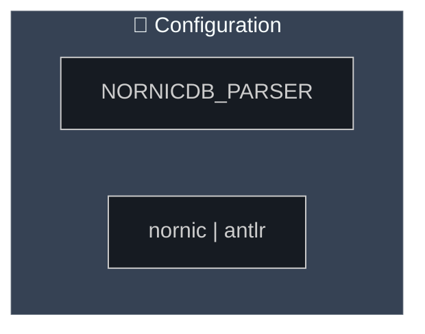

# Meta Rust Reference 202606 Part 5

Purpose: encyclopedia-grade Rust reference extracted repo-by-repo from every Git repository under `/Users/amuldotexe/Desktop`, with special attention to tree-sitter, parser, compiler, graph, async, storage, FFI, CLI, testing, and architecture patterns.

Assigned repo slice: `meta-rust-ref-202606-Part5-repos.txt`

Coverage status: coordinator completion pass applied; verify with tools/verify_meta_rust_ref.py.

## Architecture Lens

This corpus uses the `matt-engineering-improve-codebase-architecture` vocabulary:

- Module: anything with an interface and an implementation.
- Interface: every fact callers must know, including invariants, ordering constraints, errors, configuration, and performance characteristics.
- Implementation: the code inside the module.
- Depth: leverage at the interface; a deep module hides substantial behavior behind a small interface.
- Seam: where an interface lives and behavior can vary without editing in place.
- Adapter: a concrete thing satisfying an interface at a seam.
- Leverage: caller benefit from depth.
- Locality: maintainer benefit from concentrated change and verification.

## Extraction Protocol

- Browse assigned repositories repo by repo.
- Record every repository as either `Repo Coverage` or `Skipped Repo`.
- Prefer Rust source, Cargo workspaces, parser implementations, tree-sitter grammars, query files, compiler frontends, tokenizer/lexer/parser code, graph walkers, code intelligence tools, and agentic code-assist infrastructure.
- Include exact relative or absolute file evidence and short snippets when they teach a reusable shape.
- Explain the module/interface/implementation/seam/depth lesson, not only the syntax.
- Include transfer rules, risks, and verification hooks so an agent can reuse the pattern safely.
- Capture non-Rust parser or grammar implementations only when they illuminate Rust parser work or a Rust-adjacent architecture pattern.

## Repo Slice

- `/Users/amuldotexe/Desktop/oss-read-only/agent-debate`
- `/Users/amuldotexe/Desktop/oss-read-only/alienplatform/dockdash`
- `/Users/amuldotexe/Desktop/oss-read-only/clarity-cli`
- `/Users/amuldotexe/Desktop/oss-read-only/datafusion`
- `/Users/amuldotexe/Desktop/oss-read-only/ibis`
- `/Users/amuldotexe/Desktop/oss-read-only/opendal`
- `/Users/amuldotexe/Desktop/oss-read-only/pinot`
- `/Users/amuldotexe/Desktop/oss-read-only/scikit-learn`
- `/Users/amuldotexe/Desktop/oss-read-only/vaex`
- `/Users/amuldotexe/Desktop/personal-repos-lane/Arithmancy2025`
- `/Users/amuldotexe/Desktop/personal-repos-lane/Viz-Wizard`
- `/Users/amuldotexe/Desktop/personal-repos-lane/accio-tools/ignore-references/git-ref-repo/RAG-MCP-example`
- `/Users/amuldotexe/Desktop/personal-repos-lane/accio-tools/ignore-references/git-ref-repo/VOTR`
- `/Users/amuldotexe/Desktop/personal-repos-lane/accio-tools/ignore-references/git-ref-repo/dmcp`
- `/Users/amuldotexe/Desktop/personal-repos-lane/accio-tools/ignore-references/git-ref-repo/mcpproxy-go`
- `/Users/amuldotexe/Desktop/personal-repos-lane/amuldotexe.github.io`
- `/Users/amuldotexe/Desktop/personal-repos-lane/codecrafters-http-server-rust`
- `/Users/amuldotexe/Desktop/personal-repos-lane/dsa2024`
- `/Users/amuldotexe/Desktop/personal-repos-lane/felix-felicis`
- `/Users/amuldotexe/Desktop/personal-repos-lane/graph-data-science-2026.03`
- `/Users/amuldotexe/Desktop/personal-repos-lane/knight-bus-graph-walker/gitrefrepo/Neo4j family/cypher-dsl-src`
- `/Users/amuldotexe/Desktop/personal-repos-lane/knight-bus-graph-walker/gitrefrepo/Neo4j family/neo4j-apoc-src`
- `/Users/amuldotexe/Desktop/personal-repos-lane/knight-bus-graph-walker/gitrefrepo/Neo4j family/neo4j-gds-src`
- `/Users/amuldotexe/Desktop/personal-repos-lane/knight-bus-graph-walker/gitrefrepo/Neo4j family/neo4j-python-driver-src`
- `/Users/amuldotexe/Desktop/personal-repos-lane/knight-bus-graph-walker/gitrefrepo/age-src`
- `/Users/amuldotexe/Desktop/personal-repos-lane/knight-bus-graph-walker/gitrefrepo/apache-datafusion-src`
- `/Users/amuldotexe/Desktop/personal-repos-lane/knight-bus-graph-walker/gitrefrepo/apache-tinkerpop-src`
- `/Users/amuldotexe/Desktop/personal-repos-lane/knight-bus-graph-walker/gitrefrepo/clickhouse-src`
- `/Users/amuldotexe/Desktop/personal-repos-lane/knight-bus-graph-walker/gitrefrepo/differential-dataflow-src`
- `/Users/amuldotexe/Desktop/personal-repos-lane/knight-bus-graph-walker/gitrefrepo/galois-src`
- `/Users/amuldotexe/Desktop/personal-repos-lane/knight-bus-graph-walker/gitrefrepo/graphblas_sparse_linear_algebra-src`
- `/Users/amuldotexe/Desktop/personal-repos-lane/knight-bus-graph-walker/gitrefrepo/helix-db-src`
- `/Users/amuldotexe/Desktop/personal-repos-lane/knight-bus-graph-walker/gitrefrepo/kuzu-src`
- `/Users/amuldotexe/Desktop/personal-repos-lane/knight-bus-graph-walker/gitrefrepo/ldbc_graphalytics_platforms_arcadedb-src`
- `/Users/amuldotexe/Desktop/personal-repos-lane/knight-bus-graph-walker/gitrefrepo/ldbc_snb_interactive_v2_impls-src`
- `/Users/amuldotexe/Desktop/personal-repos-lane/knight-bus-graph-walker/gitrefrepo/minigraph-src`
- `/Users/amuldotexe/Desktop/personal-repos-lane/knight-bus-graph-walker/gitrefrepo/nornicdb-src`
- `/Users/amuldotexe/Desktop/personal-repos-lane/knight-bus-graph-walker/gitrefrepo/qdrant-src`
- `/Users/amuldotexe/Desktop/personal-repos-lane/knight-bus-graph-walker/gitrefrepo/rocksdb-src`
- `/Users/amuldotexe/Desktop/personal-repos-lane/knight-bus-graph-walker/gitrefrepo/sparsetools-src`
- `/Users/amuldotexe/Desktop/personal-repos-lane/knight-bus-graph-walker/gitrefrepo/thunderrw-src`
- `/Users/amuldotexe/Desktop/personal-repos-lane/knight-bus-graph-walker/gitrefrepo/typedb-src`
- `/Users/amuldotexe/Desktop/personal-repos-lane/mordor-mcp`
- `/Users/amuldotexe/Desktop/personal-repos-lane/nostd-union-find`
- `/Users/amuldotexe/Desktop/personal-repos-lane/parseltongue-rust-LLM-companion/git-ref-repo/ignore-this-folder-repos/71__vscode-tree-sitter-api`
- `/Users/amuldotexe/Desktop/personal-repos-lane/parseltongue-rust-LLM-companion/git-ref-repo/ignore-this-folder-repos/AbstractMachinesLab__tree-sitter-sexp`
- `/Users/amuldotexe/Desktop/personal-repos-lane/parseltongue-rust-LLM-companion/git-ref-repo/ignore-this-folder-repos/AndroidIDEOfficial__tree-sitter-aidl`
- `/Users/amuldotexe/Desktop/personal-repos-lane/parseltongue-rust-LLM-companion/git-ref-repo/ignore-this-folder-repos/Anirudh-030307__CHATBOT`
- `/Users/amuldotexe/Desktop/personal-repos-lane/parseltongue-rust-LLM-companion/git-ref-repo/ignore-this-folder-repos/Aryan1643__swe-agent`
- `/Users/amuldotexe/Desktop/personal-repos-lane/parseltongue-rust-LLM-companion/git-ref-repo/ignore-this-folder-repos/BloopAI__bloop`
- `/Users/amuldotexe/Desktop/personal-repos-lane/parseltongue-rust-LLM-companion/git-ref-repo/ignore-this-folder-repos/BurntSushi__ripgrep`
- `/Users/amuldotexe/Desktop/personal-repos-lane/parseltongue-rust-LLM-companion/git-ref-repo/ignore-this-folder-repos/CoatiSoftware__Sourcetrail`
- `/Users/amuldotexe/Desktop/personal-repos-lane/parseltongue-rust-LLM-companion/git-ref-repo/ignore-this-folder-repos/Contextualist__EXEC_WIKI-BGM`
- `/Users/amuldotexe/Desktop/personal-repos-lane/parseltongue-rust-LLM-companion/git-ref-repo/ignore-this-folder-repos/Dav1dde__PepegSitter`
- `/Users/amuldotexe/Desktop/personal-repos-lane/parseltongue-rust-LLM-companion/git-ref-repo/ignore-this-folder-repos/Durafen__Claude-code-memory`
- `/Users/amuldotexe/Desktop/personal-repos-lane/parseltongue-rust-LLM-companion/git-ref-repo/ignore-this-folder-repos/Enter-tainer__cxx2flow`
- `/Users/amuldotexe/Desktop/personal-repos-lane/parseltongue-rust-LLM-companion/git-ref-repo/ignore-this-folder-repos/FlorentRevest__tree-sitter-syzlang`
- `/Users/amuldotexe/Desktop/personal-repos-lane/parseltongue-rust-LLM-companion/git-ref-repo/ignore-this-folder-repos/GlitterKill__sdl-mcp`
- `/Users/amuldotexe/Desktop/personal-repos-lane/parseltongue-rust-LLM-companion/git-ref-repo/ignore-this-folder-repos/HeytalePazguato__tree-sitter-iec61131-3-st`
- `/Users/amuldotexe/Desktop/personal-repos-lane/parseltongue-rust-LLM-companion/git-ref-repo/ignore-this-folder-repos/IBM__tree-sitter-codeviews`
- `/Users/amuldotexe/Desktop/personal-repos-lane/parseltongue-rust-LLM-companion/git-ref-repo/ignore-this-folder-repos/JJK96__tree-sitter-vbscript`
- `/Users/amuldotexe/Desktop/personal-repos-lane/parseltongue-rust-LLM-companion/git-ref-repo/ignore-this-folder-repos/JonatasFischer__stropha`
- `/Users/amuldotexe/Desktop/personal-repos-lane/parseltongue-rust-LLM-companion/git-ref-repo/ignore-this-folder-repos/Julian__tree-sitter-lean`
- `/Users/amuldotexe/Desktop/personal-repos-lane/parseltongue-rust-LLM-companion/git-ref-repo/ignore-this-folder-repos/LegacyCodeHQ__clarity-cli`
- `/Users/amuldotexe/Desktop/personal-repos-lane/parseltongue-rust-LLM-companion/git-ref-repo/ignore-this-folder-repos/Menci__monaco-tree-sitter`
- `/Users/amuldotexe/Desktop/personal-repos-lane/parseltongue-rust-LLM-companion/git-ref-repo/ignore-this-folder-repos/Nishant-Chaudhary5338__mcp-code-indexer`
- `/Users/amuldotexe/Desktop/personal-repos-lane/parseltongue-rust-LLM-companion/git-ref-repo/ignore-this-folder-repos/OXY2DEV__tree-sitter-qf`
- `/Users/amuldotexe/Desktop/personal-repos-lane/parseltongue-rust-LLM-companion/git-ref-repo/ignore-this-folder-repos/OshanKHZ__bee2bee-indexer`
- `/Users/amuldotexe/Desktop/personal-repos-lane/parseltongue-rust-LLM-companion/git-ref-repo/ignore-this-folder-repos/PrestonKnopp__tree-sitter-gdscript`
- `/Users/amuldotexe/Desktop/personal-repos-lane/parseltongue-rust-LLM-companion/git-ref-repo/ignore-this-folder-repos/RageLtd__cartographer`
- `/Users/amuldotexe/Desktop/personal-repos-lane/parseltongue-rust-LLM-companion/git-ref-repo/ignore-this-folder-repos/SShadowS__tree-sitter-al`
- `/Users/amuldotexe/Desktop/personal-repos-lane/parseltongue-rust-LLM-companion/git-ref-repo/ignore-this-folder-repos/Soulthym__tree-sitter-astr`
- `/Users/amuldotexe/Desktop/personal-repos-lane/parseltongue-rust-LLM-companion/git-ref-repo/ignore-this-folder-repos/The-PR-Agent__pr-agent`
- `/Users/amuldotexe/Desktop/personal-repos-lane/parseltongue-rust-LLM-companion/git-ref-repo/ignore-this-folder-repos/ValdezFOmar__tree-sitter-format-string`
- `/Users/amuldotexe/Desktop/personal-repos-lane/parseltongue-rust-LLM-companion/git-ref-repo/ignore-this-folder-repos/Wilfred__difftastic`
- `/Users/amuldotexe/Desktop/personal-repos-lane/parseltongue-rust-LLM-companion/git-ref-repo/ignore-this-folder-repos/Zaenalos__tree-sitter-lua`
- `/Users/amuldotexe/Desktop/personal-repos-lane/parseltongue-rust-LLM-companion/git-ref-repo/ignore-this-folder-repos/acristoffers__tree-sitter-matlab`
- `/Users/amuldotexe/Desktop/personal-repos-lane/parseltongue-rust-LLM-companion/git-ref-repo/ignore-this-folder-repos/agentic-research__ley-line-open`
- `/Users/amuldotexe/Desktop/personal-repos-lane/parseltongue-rust-LLM-companion/git-ref-repo/ignore-this-folder-repos/ajankurjain__central-code-knowledge-graph`
- `/Users/amuldotexe/Desktop/personal-repos-lane/parseltongue-rust-LLM-companion/git-ref-repo/ignore-this-folder-repos/alemuller__tree-sitter-make`
- `/Users/amuldotexe/Desktop/personal-repos-lane/parseltongue-rust-LLM-companion/git-ref-repo/ignore-this-folder-repos/anatolykoptev__ox-codes`
- `/Users/amuldotexe/Desktop/personal-repos-lane/parseltongue-rust-LLM-companion/git-ref-repo/ignore-this-folder-repos/arborist-ts__registry`
- `/Users/amuldotexe/Desktop/personal-repos-lane/parseltongue-rust-LLM-companion/git-ref-repo/ignore-this-folder-repos/asumbek__tree-sitter-teal`
- `/Users/amuldotexe/Desktop/personal-repos-lane/parseltongue-rust-LLM-companion/git-ref-repo/ignore-this-folder-repos/bbfh-dev__tree-sitter-mcfunction`
- `/Users/amuldotexe/Desktop/personal-repos-lane/parseltongue-rust-LLM-companion/git-ref-repo/ignore-this-folder-repos/benwilliamgraham__tree-sitter-llvm`
- `/Users/amuldotexe/Desktop/personal-repos-lane/parseltongue-rust-LLM-companion/git-ref-repo/ignore-this-folder-repos/biomejs__tree-sitter-gritql`
- `/Users/amuldotexe/Desktop/personal-repos-lane/parseltongue-rust-LLM-companion/git-ref-repo/ignore-this-folder-repos/bydecom__graphrag-code`
- `/Users/amuldotexe/Desktop/personal-repos-lane/parseltongue-rust-LLM-companion/git-ref-repo/ignore-this-folder-repos/casey__tree-sitter-just`
- `/Users/amuldotexe/Desktop/personal-repos-lane/parseltongue-rust-LLM-companion/git-ref-repo/ignore-this-folder-repos/chanicpanic__tree-sitter-lark`
- `/Users/amuldotexe/Desktop/personal-repos-lane/parseltongue-rust-LLM-companion/git-ref-repo/ignore-this-folder-repos/cocoindex-io__realtime-codebase-indexing`
- `/Users/amuldotexe/Desktop/personal-repos-lane/parseltongue-rust-LLM-companion/git-ref-repo/ignore-this-folder-repos/continuedev__continue`
- `/Users/amuldotexe/Desktop/personal-repos-lane/parseltongue-rust-LLM-companion/git-ref-repo/ignore-this-folder-repos/crystal-lang-tools__tree-sitter-crystal`
- `/Users/amuldotexe/Desktop/personal-repos-lane/parseltongue-rust-LLM-companion/git-ref-repo/ignore-this-folder-repos/datwaft__tree-sitter-corpus`
- `/Users/amuldotexe/Desktop/personal-repos-lane/parseltongue-rust-LLM-companion/git-ref-repo/ignore-this-folder-repos/dgraph-io__dgraph`
- `/Users/amuldotexe/Desktop/personal-repos-lane/parseltongue-rust-LLM-companion/git-ref-repo/ignore-this-folder-repos/dmtrKovalenko__fff`
- `/Users/amuldotexe/Desktop/personal-repos-lane/parseltongue-rust-LLM-companion/git-ref-repo/ignore-this-folder-repos/dylan-gluck__tree-sitter-sudolang`
- `/Users/amuldotexe/Desktop/personal-repos-lane/parseltongue-rust-LLM-companion/git-ref-repo/ignore-this-folder-repos/elliottt__rules_tree_sitter`
- `/Users/amuldotexe/Desktop/personal-repos-lane/parseltongue-rust-LLM-companion/git-ref-repo/ignore-this-folder-repos/entrepeneur4lyf__code-graph-mcp`
- `/Users/amuldotexe/Desktop/personal-repos-lane/parseltongue-rust-LLM-companion/git-ref-repo/ignore-this-folder-repos/eventb-rossi__tree-sitter-eventb`
- `/Users/amuldotexe/Desktop/personal-repos-lane/parseltongue-rust-LLM-companion/git-ref-repo/ignore-this-folder-repos/flupkede__codesearch`
- `/Users/amuldotexe/Desktop/personal-repos-lane/parseltongue-rust-LLM-companion/git-ref-repo/ignore-this-folder-repos/framadhita4__syntax-tree-codebase-mcp`
- `/Users/amuldotexe/Desktop/personal-repos-lane/parseltongue-rust-LLM-companion/git-ref-repo/ignore-this-folder-repos/georgewfraser__vscode-tree-sitter`
- `/Users/amuldotexe/Desktop/personal-repos-lane/parseltongue-rust-LLM-companion/git-ref-repo/ignore-this-folder-repos/gleam-lang__tree-sitter-gleam`
- `/Users/amuldotexe/Desktop/personal-repos-lane/parseltongue-rust-LLM-companion/git-ref-repo/ignore-this-folder-repos/gmr__tree-sitter-postgres`
- `/Users/amuldotexe/Desktop/personal-repos-lane/parseltongue-rust-LLM-companion/git-ref-repo/ignore-this-folder-repos/growler__tree-sitter-webnf`
- `/Users/amuldotexe/Desktop/personal-repos-lane/parseltongue-rust-LLM-companion/git-ref-repo/ignore-this-folder-repos/hound-search__hound`
- `/Users/amuldotexe/Desktop/personal-repos-lane/parseltongue-rust-LLM-companion/git-ref-repo/ignore-this-folder-repos/igor-ramazanov__kak-tree-sitter-helix`
- `/Users/amuldotexe/Desktop/personal-repos-lane/parseltongue-rust-LLM-companion/git-ref-repo/ignore-this-folder-repos/indoorvivants__tree-sitter-smithy`
- `/Users/amuldotexe/Desktop/personal-repos-lane/parseltongue-rust-LLM-companion/git-ref-repo/ignore-this-folder-repos/jaksm__dev-tools`
- `/Users/amuldotexe/Desktop/personal-repos-lane/parseltongue-rust-LLM-companion/git-ref-repo/ignore-this-folder-repos/jiteshy__backstage-plugin-codeinsight`
- `/Users/amuldotexe/Desktop/personal-repos-lane/parseltongue-rust-LLM-companion/git-ref-repo/ignore-this-folder-repos/jlcrochet__tree-sitter-wren`
- `/Users/amuldotexe/Desktop/personal-repos-lane/parseltongue-rust-LLM-companion/git-ref-repo/ignore-this-folder-repos/johunsang__semble_rs`
- `/Users/amuldotexe/Desktop/personal-repos-lane/parseltongue-rust-LLM-companion/git-ref-repo/ignore-this-folder-repos/justinmk__tree-sitter-ini`
- `/Users/amuldotexe/Desktop/personal-repos-lane/parseltongue-rust-LLM-companion/git-ref-repo/ignore-this-folder-repos/kolen__tree-sitter-slim`
- `/Users/amuldotexe/Desktop/personal-repos-lane/parseltongue-rust-LLM-companion/git-ref-repo/ignore-this-folder-repos/kuzudb__kuzu`
- `/Users/amuldotexe/Desktop/personal-repos-lane/parseltongue-rust-LLM-companion/git-ref-repo/ignore-this-folder-repos/langston-barrett__treereduce`
- `/Users/amuldotexe/Desktop/personal-repos-lane/parseltongue-rust-LLM-companion/git-ref-repo/ignore-this-folder-repos/lewis6991__spellsitter.nvim`
- `/Users/amuldotexe/Desktop/personal-repos-lane/parseltongue-rust-LLM-companion/git-ref-repo/ignore-this-folder-repos/lumen-oss__nurr`
- `/Users/amuldotexe/Desktop/personal-repos-lane/parseltongue-rust-LLM-companion/git-ref-repo/ignore-this-folder-repos/matoous__tree-sitter-fga`
- `/Users/amuldotexe/Desktop/personal-repos-lane/parseltongue-rust-LLM-companion/git-ref-repo/ignore-this-folder-repos/mfussenegger__nvim-treehopper`
- `/Users/amuldotexe/Desktop/personal-repos-lane/parseltongue-rust-LLM-companion/git-ref-repo/ignore-this-folder-repos/mkoval1__tree-sitter-abap`
- `/Users/amuldotexe/Desktop/personal-repos-lane/parseltongue-rust-LLM-companion/git-ref-repo/ignore-this-folder-repos/mrnugget__tree-sitter-tucanir`
- `/Users/amuldotexe/Desktop/personal-repos-lane/parseltongue-rust-LLM-companion/git-ref-repo/ignore-this-folder-repos/nautilus-env__tree-sitter-nautilus`
- `/Users/amuldotexe/Desktop/personal-repos-lane/parseltongue-rust-LLM-companion/git-ref-repo/ignore-this-folder-repos/neovim__tree-sitter-vimdoc`
- `/Users/amuldotexe/Desktop/personal-repos-lane/parseltongue-rust-LLM-companion/git-ref-repo/ignore-this-folder-repos/nimterop__nimterop`
- `/Users/amuldotexe/Desktop/personal-repos-lane/parseltongue-rust-LLM-companion/git-ref-repo/ignore-this-folder-repos/nverno__tree-sitter-jq`
- `/Users/amuldotexe/Desktop/personal-repos-lane/parseltongue-rust-LLM-companion/git-ref-repo/ignore-this-folder-repos/nvim-treesitter__playground`
- `/Users/amuldotexe/Desktop/personal-repos-lane/parseltongue-rust-LLM-companion/git-ref-repo/ignore-this-folder-repos/ontograph__ontoindex`
- `/Users/amuldotexe/Desktop/personal-repos-lane/parseltongue-rust-LLM-companion/git-ref-repo/ignore-this-folder-repos/oracle__opengrok`
- `/Users/amuldotexe/Desktop/personal-repos-lane/parseltongue-rust-LLM-companion/git-ref-repo/ignore-this-folder-repos/petgraph__petgraph`
- `/Users/amuldotexe/Desktop/personal-repos-lane/parseltongue-rust-LLM-companion/git-ref-repo/ignore-this-folder-repos/polarmutex__tree-sitter-beancount`
- `/Users/amuldotexe/Desktop/personal-repos-lane/parseltongue-rust-LLM-companion/git-ref-repo/ignore-this-folder-repos/quickwit-oss__tantivy`
- `/Users/amuldotexe/Desktop/personal-repos-lane/parseltongue-rust-LLM-companion/git-ref-repo/ignore-this-folder-repos/rayliwell__tree-sitter-rstml`
- `/Users/amuldotexe/Desktop/personal-repos-lane/parseltongue-rust-LLM-companion/git-ref-repo/ignore-this-folder-repos/rigbox-dev__codeindex`
- `/Users/amuldotexe/Desktop/personal-repos-lane/parseltongue-rust-LLM-companion/git-ref-repo/ignore-this-folder-repos/romus204__tree-sitter-manager.nvim`
- `/Users/amuldotexe/Desktop/personal-repos-lane/parseltongue-rust-LLM-companion/git-ref-repo/ignore-this-folder-repos/sairam0424__trelix`
- `/Users/amuldotexe/Desktop/personal-repos-lane/parseltongue-rust-LLM-companion/git-ref-repo/ignore-this-folder-repos/sankalp1999__code_qa`
- `/Users/amuldotexe/Desktop/personal-repos-lane/parseltongue-rust-LLM-companion/git-ref-repo/ignore-this-folder-repos/sdsrss__code-graph-mcp`
- `/Users/amuldotexe/Desktop/personal-repos-lane/parseltongue-rust-LLM-companion/git-ref-repo/ignore-this-folder-repos/shotover__tree-sitter-cql`
- `/Users/amuldotexe/Desktop/personal-repos-lane/parseltongue-rust-LLM-companion/git-ref-repo/ignore-this-folder-repos/skbgp__codememory-mcp`
- `/Users/amuldotexe/Desktop/personal-repos-lane/parseltongue-rust-LLM-companion/git-ref-repo/ignore-this-folder-repos/sogaiu__tree-sitter-clojure`
- `/Users/amuldotexe/Desktop/personal-repos-lane/parseltongue-rust-LLM-companion/git-ref-repo/ignore-this-folder-repos/sourcegraph__scip-ruby`
- `/Users/amuldotexe/Desktop/personal-repos-lane/parseltongue-rust-LLM-companion/git-ref-repo/ignore-this-folder-repos/srujanmraj__CodeLens-AI-Intelligent-Code-Review-Documentation-Platform`
- `/Users/amuldotexe/Desktop/personal-repos-lane/parseltongue-rust-LLM-companion/git-ref-repo/ignore-this-folder-repos/strmax195-hue__7-24-IDE`
- `/Users/amuldotexe/Desktop/personal-repos-lane/parseltongue-rust-LLM-companion/git-ref-repo/ignore-this-folder-repos/sync7319__Arkhe`
- `/Users/amuldotexe/Desktop/personal-repos-lane/parseltongue-rust-LLM-companion/git-ref-repo/ignore-this-folder-repos/tautologico__tree-sitter-racket`
- `/Users/amuldotexe/Desktop/personal-repos-lane/parseltongue-rust-LLM-companion/git-ref-repo/ignore-this-folder-repos/theHamsta__tree-sitter-jinja2`
- `/Users/amuldotexe/Desktop/personal-repos-lane/parseltongue-rust-LLM-companion/git-ref-repo/ignore-this-folder-repos/topiary__topiary`
- `/Users/amuldotexe/Desktop/personal-repos-lane/parseltongue-rust-LLM-companion/git-ref-repo/ignore-this-folder-repos/tree-sitter-grammars__tree-sitter-lua`
- `/Users/amuldotexe/Desktop/personal-repos-lane/parseltongue-rust-LLM-companion/git-ref-repo/ignore-this-folder-repos/tree-sitter__csharp-tree-sitter`
- `/Users/amuldotexe/Desktop/personal-repos-lane/parseltongue-rust-LLM-companion/git-ref-repo/ignore-this-folder-repos/tree-sitter__kotlin-tree-sitter`
- `/Users/amuldotexe/Desktop/personal-repos-lane/parseltongue-rust-LLM-companion/git-ref-repo/ignore-this-folder-repos/tree-sitter__parser-update-action`
- `/Users/amuldotexe/Desktop/personal-repos-lane/parseltongue-rust-LLM-companion/git-ref-repo/ignore-this-folder-repos/tree-sitter__tree-sitter-c`
- `/Users/amuldotexe/Desktop/personal-repos-lane/parseltongue-rust-LLM-companion/git-ref-repo/ignore-this-folder-repos/tree-sitter__tree-sitter-embedded-template`
- `/Users/amuldotexe/Desktop/personal-repos-lane/parseltongue-rust-LLM-companion/git-ref-repo/ignore-this-folder-repos/tree-sitter__tree-sitter-java`
- `/Users/amuldotexe/Desktop/personal-repos-lane/parseltongue-rust-LLM-companion/git-ref-repo/ignore-this-folder-repos/tree-sitter__tree-sitter-php`
- `/Users/amuldotexe/Desktop/personal-repos-lane/parseltongue-rust-LLM-companion/git-ref-repo/ignore-this-folder-repos/tree-sitter__tree-sitter-rust`
- `/Users/amuldotexe/Desktop/personal-repos-lane/parseltongue-rust-LLM-companion/git-ref-repo/ignore-this-folder-repos/tree-sitter__workflows`
- `/Users/amuldotexe/Desktop/personal-repos-lane/parseltongue-rust-LLM-companion/git-ref-repo/ignore-this-folder-repos/unhappychoice__gittype`
- `/Users/amuldotexe/Desktop/personal-repos-lane/parseltongue-rust-LLM-companion/git-ref-repo/ignore-this-folder-repos/vedant1101__RepoRag`
- `/Users/amuldotexe/Desktop/personal-repos-lane/parseltongue-rust-LLM-companion/git-ref-repo/ignore-this-folder-repos/virchau13__tree-sitter-astro`
- `/Users/amuldotexe/Desktop/personal-repos-lane/parseltongue-rust-LLM-companion/git-ref-repo/ignore-this-folder-repos/waddie__tree-sitter-applescript`
- `/Users/amuldotexe/Desktop/personal-repos-lane/parseltongue-rust-LLM-companion/git-ref-repo/ignore-this-folder-repos/wippy-projects__mcp-code-tools`
- `/Users/amuldotexe/Desktop/personal-repos-lane/parseltongue-rust-LLM-companion/git-ref-repo/ignore-this-folder-repos/yamadashy__repomix`
- `/Users/amuldotexe/Desktop/personal-repos-lane/parseltongue-rust-LLM-companion/git-ref-repo/ignore-this-folder-repos/zackyalgiffari__fast-index`
- `/Users/amuldotexe/Desktop/personal-repos-lane/parseltongue-rust-LLM-companion/git-ref-repo/ignore-this-folder-repos/zxfgds__mcp-code-indexer`
- `/Users/amuldotexe/Desktop/personal-repos-lane/priori-incantatem`
- `/Users/amuldotexe/Desktop/personal-repos-lane/room-of-requirement/.research-corpus/springboot-java/repos/dyc87112__SpringBoot-Learning`
- `/Users/amuldotexe/Desktop/personal-repos-lane/room-of-requirement/.research-corpus/springboot-java/repos/spring-guides__gs-accessing-data-jpa`
- `/Users/amuldotexe/Desktop/personal-repos-lane/room-of-requirement/.research-corpus/springboot-java/repos/spring-guides__gs-uploading-files`
- `/Users/amuldotexe/Desktop/personal-repos-lane/room-of-requirement/.research-corpus/springboot-java/repos/yudaocode__SpringBoot-Labs`
- `/Users/amuldotexe/Desktop/personal-repos-lane/smallest-exp-20260404`
- `/Users/amuldotexe/Desktop/personal-repos-lane/txt-sectumsempra`
- `/Users/amuldotexe/Desktop/personal-repos-lane/zzJS-TS-notes-2023`
- `/Users/amuldotexe/Desktop/reference-repos-yard/GitNexus`
- `/Users/amuldotexe/Desktop/reference-repos-yard/argus`
- `/Users/amuldotexe/Desktop/reference-repos-yard/create-tauri-app`
- `/Users/amuldotexe/Desktop/reference-repos-yard/flowistry`
- `/Users/amuldotexe/Desktop/reference-repos-yard/lockbud`
- `/Users/amuldotexe/Desktop/reference-repos-yard/paralegal`
- `/Users/amuldotexe/Desktop/reference-repos-yard/rustc_codegen_cranelift`
- `/Users/amuldotexe/Desktop/reference-repos-yard/twitter-circle`

## Pattern Entries

## Repo Coverage: /Users/amuldotexe/Desktop/oss-read-only/datafusion

### Concept: Physical plan nodes advertise invariants and optimizer-visible properties through one deep trait

Evidence:

- `/Users/amuldotexe/Desktop/oss-read-only/datafusion/datafusion/physical-plan/src/execution_plan.rs` defines `pub trait ExecutionPlan: Any + Debug + DisplayAs + Send + Sync`.
- The same file documents that `execute` produces an async `SendableRecordBatchStream`, while `schema`, `properties`, `required_input_distribution`, and `required_input_ordering` communicate output properties and input requirements to optimizers.
- `check_invariants(&self, check: InvariantLevel) -> Result<()>` gives extension nodes a verification hook without forcing callers to know each concrete plan's internal rules.

Architecture lens:

`ExecutionPlan` is a deep Module Interface. A caller learns one seam: "this thing can report schema/properties, validate invariants, and execute a partition." Behind that seam, implementations hide scan operators, joins, projections, repartitioning, memory accounting, and streaming mechanics. The Depth is not the number of trait methods; it is the leverage from routing planning, display, optimization, execution, and debug invariant checks through the same Interface. The locality win is strong: when a physical operator has a bad ordering or partition invariant, its implementation can override `check_invariants` instead of pushing operator-specific checks into every optimizer or executor caller.

Reusable code shape:

```rust
pub trait ExecutionPlan: Any + Debug + DisplayAs + Send + Sync {
    fn name(&self) -> &str;
    fn properties(&self) -> &Arc<PlanProperties>;

    fn schema(&self) -> SchemaRef {
        Arc::clone(self.properties().schema())
    }

    fn check_invariants(&self, check: InvariantLevel) -> Result<()> {
        check_default_invariants(self, check)
    }

    fn execute(
        &self,
        partition: usize,
        context: Arc<TaskContext>,
    ) -> Result<SendableRecordBatchStream>;
}
```

Transfer rule:

For a graph walker, parser pipeline, or compiler pipeline, make the node Interface carry both behavior and optimizer-visible facts. A `GraphOperator` should not only `run`; it should expose output shape, ordering, resource cost, and an invariant check. This makes the Module deep because downstream passes can reason through the seam instead of matching concrete implementation names.

Verification hook:

Add a plan-invariant test that constructs a deliberately invalid custom operator and asserts that the generic invariant runner fails through the trait Interface. Also add a golden display test for the same operator so the debug Interface remains stable.

### Concept: Optimizer rules reach a fixed point by returning explicit transformation state

Evidence:

- `/Users/amuldotexe/Desktop/oss-read-only/datafusion/datafusion/optimizer/src/optimizer.rs` defines `pub trait OptimizerRule: Debug`.
- `rewrite` returns `Result<Transformed<LogicalPlan>, DataFusionError>`.
- The documentation explicitly says the optimizer calls `rewrite` several times until a fixed point is reached, and rules must return `Transformed::no` when unchanged.
- The same trait advises rules not to match function names directly, but to use semantic methods on UDF implementations because functions can be overridden.

Architecture lens:

The optimizer rule is a small but deep Module. Its Interface is "name, optional apply order, rewrite with transformation status." The implementation can be complex tree rewriting, but callers only need fixed-point semantics and honest change reporting. The `Transformed` return type is the crucial seam: it prevents callers from guessing whether a rule changed a plan by equality comparison, and it gives locality to termination logic.

Reusable code shape:

```rust
pub trait RewriteRule {
    fn name(&self) -> &str;
    fn apply_order(&self) -> Option<ApplyOrder> {
        None
    }

    fn rewrite(
        &self,
        plan: LogicalPlan,
        config: &dyn OptimizerConfig,
    ) -> Result<Transformed<LogicalPlan>, RewriteError>;
}

pub fn optimize_to_fixed_point(
    mut plan: LogicalPlan,
    rules: &[Box<dyn RewriteRule>],
    config: &dyn OptimizerConfig,
) -> Result<LogicalPlan, RewriteError> {
    loop {
        let mut changed = false;
        for rule in rules {
            let transformed = rule.rewrite(plan, config)?;
            changed |= transformed.transformed;
            plan = transformed.data;
        }
        if !changed {
            return Ok(plan);
        }
    }
}
```

Transfer rule:

Any parser normalization, query rewrite, MIR rewrite, or graph simplification pass should report "changed or unchanged" as part of its Interface. Do not make the driver infer change by serializing, hashing, or comparing whole trees unless the tree already has stable identity semantics.

Verification hook:

For every rule, add an idempotence test: applying the rule twice should make the second application return unchanged. Add a non-termination guard test around the fixed-point driver with a deliberately bad rule that always reports changed.

### Concept: Table providers turn data-source pushdown into an explicit scan contract

Evidence:

- `/Users/amuldotexe/Desktop/oss-read-only/datafusion/datafusion/catalog/src/table.rs` defines `pub trait TableProvider: Any + Debug + Sync + Send`.
- The Interface includes `schema`, `constraints`, `table_type`, optional logical plan metadata, and a scan method that receives projection, filters, and limit.
- The documentation states that projections are field indexes in schema order and that filters may reference columns not in projection, because predicate pushdown and projection pushdown interact.

Architecture lens:

`TableProvider` is a seam between logical planning and storage adapters. The Adapter can be Parquet, CSV, memory, remote SQL, or something else, but the planner sees the same Interface. Its Depth comes from pushing performance-sensitive facts into the Interface: projection, filter support, and limits. Locality improves because each storage implementation owns how much pushdown it can honor.

Reusable code shape:

```rust
pub trait TableProvider: Debug + Send + Sync {
    fn schema(&self) -> SchemaRef;
    fn table_type(&self) -> TableType;

    async fn scan(
        &self,
        projection: Option<&Vec<usize>>,
        filters: &[Expr],
        limit: Option<usize>,
    ) -> Result<Arc<dyn ExecutionPlan>>;

    fn supports_filters_pushdown(
        &self,
        filters: &[&Expr],
    ) -> Result<Vec<TableProviderFilterPushDown>>;
}
```

Transfer rule:

When designing storage-backed Rust Modules, avoid a shallow `read_all()` Interface if callers need predicate/projection/limit control. Put pushdown requests at the seam and let each Adapter declare support. This is especially reusable for code-index stores, graph stores, object stores, and parser symbol indexes.

Verification hook:

Create an Adapter test matrix with the same logical query executed against an in-memory Adapter and a pushdown-capable Adapter. Assert identical rows, and separately assert that the pushdown-capable Adapter receives only the projected columns and supported predicates.

## Repo Coverage: /Users/amuldotexe/Desktop/oss-read-only/opendal

### Concept: Accessor traits encode storage capabilities while Operator hides backend diversity

Evidence:

- `/Users/amuldotexe/Desktop/oss-read-only/opendal/core/core/src/raw/accessor.rs` defines `pub trait Access: Send + Sync + Debug + Unpin + 'static`.
- `Access` has associated `Reader`, `Writer`, `Lister`, and `Deleter` types and operations such as `create_dir`, `stat`, and `read`.
- Default operation implementations return `ErrorKind::Unsupported`, making unsupported capability behavior local to the raw Access Interface.
- `/Users/amuldotexe/Desktop/oss-read-only/opendal/core/core/src/types/operator/operator.rs` defines `pub struct Operator { accessor: Accessor }` and exposes the user-facing async API.

Architecture lens:

OpenDAL separates a raw storage Adapter seam from a user-facing `Operator` Module. The raw `Access` Interface is broad because storage has real behavioral variety: filesystem, S3, memory, databases, and cloud services differ in what they support. The `Operator` Interface is deeper for callers: stable paths, metadata, readers, writers, and checks, with backend-specific error/capability behavior hidden behind the accessor implementation.

Reusable code shape:

```rust
pub trait Access: Send + Sync + Debug + Unpin + 'static {
    type Reader: Read;
    type Writer: Write;
    type Lister: List;
    type Deleter: Delete;

    fn info(&self) -> Arc<AccessorInfo>;

    fn read(
        &self,
        path: &str,
        args: OpRead,
    ) -> impl Future<Output = Result<(RpRead, Self::Reader)>> + MaybeSend {
        let (_, _) = (path, args);
        ready(Err(Error::new(ErrorKind::Unsupported, "operation is not supported")))
    }
}

pub struct Operator {
    accessor: Accessor,
}
```

Transfer rule:

Use this shape when a Rust project must support many backends with uneven features. Put feature availability in the Adapter Interface, use unsupported defaults for optional operations, and expose a smaller high-level Module that callers use for normal workflows.

Verification hook:

For every new backend Adapter, run a capability conformance suite: unsupported operations must return the expected unsupported error, supported operations must round-trip through the public `Operator`, and `info().capabilities` must agree with observed behavior.

### Concept: Layers decorate storage behavior by forwarding unimplemented operations

Evidence:

- `/Users/amuldotexe/Desktop/oss-read-only/opendal/core/core/src/raw/layer.rs` defines `pub trait Layer<A: Access> { type LayeredAccess: Access; fn layer(&self, inner: A) -> Self::LayeredAccess; }`.
- The same file defines `LayeredAccess`, whose default methods forward to `inner()`.
- The repo contains many concrete layer crates under `/Users/amuldotexe/Desktop/oss-read-only/opendal/core/layers/`, including retry, timeout, logging, metrics, throttle, and tracing.

Architecture lens:

`Layer` is a seam for cross-cutting behavior. One Adapter wraps another Adapter. The depth comes from default forwarding: a layer implementation only overrides the operations it changes, while inheriting the rest of the storage Interface. Locality is excellent for cross-cutting behavior: retry policy, metrics, or timeout policy is implemented once and applies to all backend Adapters.

Reusable code shape:

```rust
pub trait Layer<A: Access> {
    type LayeredAccess: Access;
    fn layer(&self, inner: A) -> Self::LayeredAccess;
}

pub trait LayeredAccess: Send + Sync + Debug + Unpin + 'static {
    type Inner: Access;
    fn inner(&self) -> &Self::Inner;

    fn info(&self) -> Arc<AccessorInfo> {
        self.inner().info()
    }

    fn read(
        &self,
        path: &str,
        args: OpRead,
    ) -> impl Future<Output = Result<(RpRead, Self::Reader)>> + MaybeSend {
        self.inner().read(path, args)
    }
}
```

Transfer rule:

When adding observability, retries, deadlines, caching, or fault injection to an async Rust Module, prefer a layer seam over copying behavior into every backend. The deletion test is useful: deleting a retry layer should force retry complexity to reappear across many adapters; if not, the layer is too shallow.

Verification hook:

Write one fake inner Adapter that records calls and can inject errors. Reuse it to test every layer's behavior: forwarding untouched operations, retry counts, timeout cancellation, metric emission, and error preservation.

## Repo Coverage: /Users/amuldotexe/Desktop/personal-repos-lane/parseltongue-rust-LLM-companion/git-ref-repo/ignore-this-folder-repos/BurntSushi__ripgrep

### Concept: Search is split into Matcher, Searcher, and Sink seams

Evidence:

- `/Users/amuldotexe/Desktop/personal-repos-lane/parseltongue-rust-LLM-companion/git-ref-repo/ignore-this-folder-repos/BurntSushi__ripgrep/crates/matcher/src/lib.rs` defines `pub trait Matcher`.
- `/Users/amuldotexe/Desktop/personal-repos-lane/parseltongue-rust-LLM-companion/git-ref-repo/ignore-this-folder-repos/BurntSushi__ripgrep/crates/searcher/src/searcher/mod.rs` defines `pub struct SearcherBuilder` and `pub struct Searcher`.
- `/Users/amuldotexe/Desktop/personal-repos-lane/parseltongue-rust-LLM-companion/git-ref-repo/ignore-this-folder-repos/BurntSushi__ripgrep/crates/searcher/src/sink.rs` defines `pub trait Sink`.
- `Matcher::find_at` is the primitive; default methods build richer matching behavior on top. `Sink::matched`, `context`, `context_break`, and binary hooks let output behavior vary without editing the search loop.

Architecture lens:

This is a classic deep Module split. `Matcher` owns pattern semantics, `Searcher` owns I/O, decoding, line buffering, multiline mode, context windows, and binary detection, and `Sink` owns reporting. The seams are real because each has multiple Adapters: regex and PCRE2 matchers, many output sinks, and many builder configurations. The split maximizes locality: Unicode decoding bugs live in Searcher, regex semantics in Matcher, and JSON/terminal output in Sink.

Reusable code shape:

```rust
pub trait Matcher {
    type Captures: Captures;
    type Error: Display;

    fn find_at(
        &self,
        haystack: &[u8],
        at: usize,
    ) -> Result<Option<Match>, Self::Error>;

    fn new_captures(&self) -> Result<Self::Captures, Self::Error>;
}

pub trait Sink {
    type Error: SinkError;

    fn matched(
        &mut self,
        searcher: &Searcher,
        mat: &SinkMatch<'_>,
    ) -> Result<bool, Self::Error>;
}
```

Transfer rule:

For code intelligence tools, split "recognize", "walk", and "emit" into separate Modules. A tree-sitter code searcher can use `Matcher` for query predicates, `Searcher` for file traversal and parse buffering, and `Sink` for LSP, JSON, terminal, or database output. Avoid an all-in-one `search_and_print` implementation.

Verification hook:

Build one tiny matcher and two sinks for the same input. Assert that changing sinks never changes match offsets. Then test a sink returning `false` to verify the search loop stops and calls finish semantics exactly once.

## Repo Coverage: /Users/amuldotexe/Desktop/personal-repos-lane/parseltongue-rust-LLM-companion/git-ref-repo/ignore-this-folder-repos/petgraph__petgraph

### Concept: Traversal algorithms depend on graph capability traits, not concrete graph storage

Evidence:

- `/Users/amuldotexe/Desktop/personal-repos-lane/parseltongue-rust-LLM-companion/git-ref-repo/ignore-this-folder-repos/petgraph__petgraph/crates/petgraph/src/visit/mod.rs` defines `GraphBase`, `IntoNeighbors`, `IntoNeighborsDirected`, and `VisitMap`.
- `/Users/amuldotexe/Desktop/personal-repos-lane/parseltongue-rust-LLM-companion/git-ref-repo/ignore-this-folder-repos/petgraph__petgraph/crates/petgraph/src/visit/traversal.rs` defines `pub struct Dfs<N, VM>`.
- `VisitMap` has Adapters for `FixedBitSet` and `HashSet`, letting traversal state match node-id representation.

Architecture lens:

Petgraph makes graph traversal Modules deep by depending on minimal capability Interfaces. DFS does not need `Graph`, `StableGraph`, or `GraphMap`; it needs node ids, neighbors, and a visit map. That makes the algorithm portable across storage implementations. The `VisitMap` seam is especially useful: dense integer node ids use bitsets, arbitrary node ids use hash sets.

Reusable code shape:

```rust
pub trait GraphBase {
    type NodeId: Copy + PartialEq;
    type EdgeId: Copy + PartialEq;
}

pub trait IntoNeighbors: GraphRef {
    type Neighbors: Iterator<Item = Self::NodeId>;
    fn neighbors(self, a: Self::NodeId) -> Self::Neighbors;
}

pub trait VisitMap<N> {
    fn visit(&mut self, a: N) -> bool;
    fn is_visited(&self, a: &N) -> bool;
    fn unvisit(&mut self, a: N) -> bool;
}

pub struct Dfs<N, VM> {
    pub stack: Vec<N>,
    pub discovered: VM,
}
```

Transfer rule:

When implementing dependency graph walkers, AST graph traversals, or call graph analyses, make algorithms generic over traversal capability traits. Do not require callers to convert into one concrete graph type unless the algorithm truly needs that representation. The Interface should say what the algorithm consumes: neighbors, edge refs, visit state, weights, or direction.

Verification hook:

Run the same traversal test against two graph Adapters: a dense-index graph and a hash-map graph. Add a compile-time test or doctest showing DFS accepts any type implementing the neighbor and visitation Interfaces.

## Repo Coverage: /Users/amuldotexe/Desktop/personal-repos-lane/parseltongue-rust-LLM-companion/git-ref-repo/ignore-this-folder-repos/tree-sitter__tree-sitter-rust

### Concept: Grammar, FFI language export, and queries form three separate parser Interfaces

Evidence:

- `/Users/amuldotexe/Desktop/personal-repos-lane/parseltongue-rust-LLM-companion/git-ref-repo/ignore-this-folder-repos/tree-sitter__tree-sitter-rust/grammar.js` defines the Rust grammar with `name: 'rust'`, `extras`, `externals`, `supertypes`, precedence constants, primitive type lists, and token-tree punctuation.
- `/Users/amuldotexe/Desktop/personal-repos-lane/parseltongue-rust-LLM-companion/git-ref-repo/ignore-this-folder-repos/tree-sitter__tree-sitter-rust/bindings/rust/lib.rs` exposes `pub const LANGUAGE`, `NODE_TYPES`, `HIGHLIGHTS_QUERY`, `INJECTIONS_QUERY`, and `TAGS_QUERY`.
- `/Users/amuldotexe/Desktop/personal-repos-lane/parseltongue-rust-LLM-companion/git-ref-repo/ignore-this-folder-repos/tree-sitter__tree-sitter-rust/queries/highlights.scm` maps concrete nodes and predicates to semantic captures such as `@type`, `@function`, `@function.macro`, and `@comment.documentation`.

Architecture lens:

The grammar implementation is not the only Module. The Rust binding is an Adapter seam for consumers, and queries are a separate semantic Interface layered over the parse tree. This separation creates leverage: parsers, highlighters, taggers, and injection systems can change independently. The FFI export is intentionally tiny while hiding generated C parser code and query assets.

Reusable code shape:

```rust
use tree_sitter_language::LanguageFn;

extern "C" {
    fn tree_sitter_rust() -> *const ();
}

pub const LANGUAGE: LanguageFn =
    unsafe { LanguageFn::from_raw(tree_sitter_rust) };

pub const NODE_TYPES: &str = include_str!("../../src/node-types.json");
pub const HIGHLIGHTS_QUERY: &str = include_str!("../../queries/highlights.scm");
pub const INJECTIONS_QUERY: &str = include_str!("../../queries/injections.scm");
pub const TAGS_QUERY: &str = include_str!("../../queries/tags.scm");
```

Transfer rule:

For any Rust-adjacent grammar crate, treat the generated parser, Rust binding, and query files as separate Modules. The binding Interface should be tiny and asset-based. Consumers should not have to know where generated parser C lives or how queries are bundled.

Verification hook:

Keep a binding-level test that constructs a `tree_sitter::Parser`, calls `set_language`, parses a small code sample, and asserts `!tree.root_node().has_error()`. Add query smoke tests that compile every bundled query against the language.

## Repo Coverage: /Users/amuldotexe/Desktop/personal-repos-lane/parseltongue-rust-LLM-companion/git-ref-repo/ignore-this-folder-repos/Wilfred__difftastic

### Concept: Syntax-aware diffing starts with a parser seam before graph/path algorithms run

Evidence:

- `/Users/amuldotexe/Desktop/personal-repos-lane/parseltongue-rust-LLM-companion/git-ref-repo/ignore-this-folder-repos/Wilfred__difftastic/src/parse/syntax.rs` defines `pub(crate) enum Syntax<'a>`.
- `/Users/amuldotexe/Desktop/personal-repos-lane/parseltongue-rust-LLM-companion/git-ref-repo/ignore-this-folder-repos/Wilfred__difftastic/src/parse/tree_sitter_parser.rs` contains tree-sitter parsing implementation.
- `/Users/amuldotexe/Desktop/personal-repos-lane/parseltongue-rust-LLM-companion/git-ref-repo/ignore-this-folder-repos/Wilfred__difftastic/src/parse/guess_language.rs` handles language detection.
- `/Users/amuldotexe/Desktop/personal-repos-lane/parseltongue-rust-LLM-companion/git-ref-repo/ignore-this-folder-repos/Wilfred__difftastic/src/diff/graph.rs`, `src/diff/shortest_path.rs`, and `src/diff/lcs_diff.rs` show the later diff implementation is graph/path oriented rather than parser-specific.

Architecture lens:

Difftastic's useful pattern is the parser seam before the diff algorithm. Once source text becomes a normalized Syntax Module, the diff implementation can operate on tree shapes instead of knowing every grammar. That is a locality win: parser weirdness, language detection, and syntax errors stay near parse code; shortest-path and LCS code stay language-agnostic.

Reusable code shape:

```rust
enum Syntax<'a> {
    Atom { content: &'a str },
    List { children: Vec<Syntax<'a>> },
}

fn parse_for_diff<'a>(
    language: Language,
    source: &'a str,
) -> Result<Syntax<'a>, ParseError> {
    let tree = parse_with_tree_sitter(language, source)?;
    Ok(convert_tree_to_diff_syntax(tree, source))
}

fn diff_syntax(left: Syntax<'_>, right: Syntax<'_>) -> DiffGraph {
    build_shortest_path_graph(left, right)
}
```

Transfer rule:

When building a Rust code intelligence or refactoring tool, keep parser-specific work upstream of the graph algorithm. The graph Module should consume a normalized tree/graph Interface, not `tree_sitter::Node` directly, unless the whole tool is intentionally tree-sitter-only.

Verification hook:

Use paired fixture files under `sample_files/` style directories. Assert that a syntax error falls back or degrades gracefully, and that the same diff algorithm handles at least two languages by swapping only the parser Adapter.

## Repo Coverage: /Users/amuldotexe/Desktop/personal-repos-lane/parseltongue-rust-LLM-companion/git-ref-repo/ignore-this-folder-repos/topiary__topiary

### Concept: Formatting behavior is data-driven by tree-sitter query captures

Evidence:

- `/Users/amuldotexe/Desktop/personal-repos-lane/parseltongue-rust-LLM-companion/git-ref-repo/ignore-this-folder-repos/topiary__topiary/topiary-core/src/language.rs` defines `pub struct Language` with parser and query fields.
- `/Users/amuldotexe/Desktop/personal-repos-lane/parseltongue-rust-LLM-companion/git-ref-repo/ignore-this-folder-repos/topiary__topiary/topiary-core/src/lib.rs` exposes `pub fn formatter`, `formatter_str`, and `formatter_tree`.
- `/Users/amuldotexe/Desktop/personal-repos-lane/parseltongue-rust-LLM-companion/git-ref-repo/ignore-this-folder-repos/topiary__topiary/topiary-core/src/atom_collection.rs` defines `resolve_capture`, which maps capture names to formatting atoms and errors on unknown capture names.
- `/Users/amuldotexe/Desktop/personal-repos-lane/parseltongue-rust-LLM-companion/git-ref-repo/ignore-this-folder-repos/topiary__topiary/topiary-queries/queries/rust/formatting.scm` uses captures such as `@append_space`, `@prepend_input_softline`, `@append_indent_start`, and `@prepend_indent_end`.

Architecture lens:

Topiary makes the formatting engine a deep Module by moving language policy into query files. The Interface for a new language is not "write a formatter implementation"; it is "provide parser, formatting query, and injection query." The engine implementation owns capture resolution, atom collection, and pretty printing. This creates high leverage because the same formatter core can serve Rust, TOML, OCaml, Markdown, and other languages.

Reusable code shape:

```rust
pub struct Language {
    pub parser: tree_sitter::Language,
    pub query: tree_sitter::Query,
    pub injection_query: Option<tree_sitter::Query>,
}

fn apply_formatting_query(
    language: &Language,
    source: &str,
) -> Result<PrettyDoc, FormatterError> {
    let tree = parse(language.parser, source)?;
    let matches = collect_query_matches(&language.query, tree.root_node());
    let mut atoms = AtomCollection::new(source);
    for capture in matches.captures() {
        atoms.resolve_capture(capture.name(), &capture.node(), capture.predicates())?;
    }
    Ok(atoms.into_pretty_doc())
}
```

Transfer rule:

If behavior varies by language but the engine is stable, make the variable part declarative. Tree-sitter queries are an excellent Adapter Interface for syntax-aware formatting, highlighting, extraction, linting, and symbol tagging.

Verification hook:

Compile every query in CI, fail on unknown capture names, and run golden formatting tests per language. Add a test proving the same core formatter handles two languages by changing only `Language` configuration.

## Repo Coverage: /Users/amuldotexe/Desktop/personal-repos-lane/parseltongue-rust-LLM-companion/git-ref-repo/ignore-this-folder-repos/quickwit-oss__tantivy

### Concept: Search index storage is virtualized behind a Directory trait with explicit durability semantics

Evidence:

- `/Users/amuldotexe/Desktop/personal-repos-lane/parseltongue-rust-LLM-companion/git-ref-repo/ignore-this-folder-repos/quickwit-oss__tantivy/src/directory/directory.rs` defines `pub trait Directory: DirectoryClone + fmt::Debug + Send + Sync + 'static`.
- The Interface requires `get_file_handle`, `delete`, `exists`, `open_write`, `atomic_read`, and atomic replacement behavior.
- The documentation states that opened file slices may not change, writes may be aggressively buffered, callers must flush, and `Drop` must not be relied on for persistence.

Architecture lens:

`Directory` is a storage seam with a rich Interface because index correctness depends on durability and immutable read slices. It is deeper than a filesystem wrapper: it encodes virtual file semantics that support RAM, mmap, managed, and filesystem Adapters. The invariants are part of the Interface, not comments for one implementation.

Reusable code shape:

```rust
pub trait Directory: DirectoryClone + Debug + Send + Sync + 'static {
    fn get_file_handle(&self, path: &Path) -> Result<Arc<dyn FileHandle>, OpenReadError>;

    fn open_read(&self, path: &Path) -> Result<FileSlice, OpenReadError> {
        let file_handle = self.get_file_handle(path)?;
        Ok(FileSlice::new(file_handle))
    }

    fn open_write(&self, path: &Path) -> Result<WritePtr, OpenWriteError>;
    fn atomic_read(&self, path: &Path) -> Result<Vec<u8>, OpenReadError>;
    fn atomic_write(&self, path: &Path, data: &[u8]) -> Result<(), OpenWriteError>;
}
```

Transfer rule:

For on-disk graph indexes, code search indexes, or parser caches, model storage as a virtual directory Interface with atomicity and immutability rules. Do not leak `std::fs::File` across the seam if you need RAM or remote Adapters later.

Verification hook:

Run the same index read/write suite against a RAM Adapter and filesystem Adapter. Include a test that opens a read slice, writes a replacement, and asserts the old slice remains stable.

### Concept: Collectors separate segment-local search from global result merging

Evidence:

- `/Users/amuldotexe/Desktop/personal-repos-lane/parseltongue-rust-LLM-companion/git-ref-repo/ignore-this-folder-repos/quickwit-oss__tantivy/src/collector/mod.rs` defines `pub trait Collector: Sync + Send`.
- The Interface has associated `Fruit` and `Child` types, `for_segment`, `requires_scoring`, and `merge_fruits`.
- `collect_segment` builds a segment collector and delegates enumeration to `default_collect_segment_impl`.

Architecture lens:

The Collector Module is deep because it hides segmented-index execution. Callers ask for a global fruit. Implementations define how to collect inside one segment and how to merge. The seam is exactly where parallelism and index segmentation vary.

Reusable code shape:

```rust
pub trait Collector: Sync + Send {
    type Fruit;
    type Child: SegmentCollector;

    fn for_segment(
        &self,
        segment_local_id: SegmentOrdinal,
        segment: &SegmentReader,
    ) -> Result<Self::Child>;

    fn requires_scoring(&self) -> bool;

    fn merge_fruits(
        &self,
        segment_fruits: Vec<<Self::Child as SegmentCollector>::Fruit>,
    ) -> Result<Self::Fruit>;
}
```

Transfer rule:

For graph queries, search, or static analysis over sharded corpora, split per-shard collection from global merge. This lets the execution engine parallelize shards without teaching every query implementation about thread pools or storage layout.

Verification hook:

Create a collector whose merge is order-independent and test it with shuffled segment fruit order. For scoring collectors, assert `requires_scoring` controls whether scoring callbacks are invoked.

## Repo Coverage: /Users/amuldotexe/Desktop/personal-repos-lane/knight-bus-graph-walker/gitrefrepo/differential-dataflow-src

### Concept: Collections expose timely streams but preserve differential timestamp invariants

Evidence:

- `/Users/amuldotexe/Desktop/personal-repos-lane/knight-bus-graph-walker/gitrefrepo/differential-dataflow-src/differential-dataflow/src/collection.rs` defines `pub struct Collection<'scope, T: Timestamp, C: 'static> { pub inner: Stream<'scope, T, C> }`.
- The docs say `inner` is exposed for direct timely manipulation but is not the idiomatic way to work with the collection.
- The docs state that the timestamp in the data must always be at least the timestamp of the data in the timely-dataflow sense, or differential operators may behave unexpectedly.

Architecture lens:

`Collection` is a Module that deliberately exposes an escape hatch while preserving an invariant-rich Interface. The exposed `inner` stream is a seam for advanced adapters, but normal callers should use collection operators. This is a good example of controlled shallowness: the field is public for leverage, but the documentation marks the invariant cost.

Reusable code shape:

```rust
pub struct Collection<'scope, T: Timestamp, C: 'static> {
    pub inner: Stream<'scope, T, C>,
}

impl<'scope, T: Timestamp, C> Collection<'scope, T, C> {
    pub fn new(stream: Stream<'scope, T, C>) -> Self {
        Self { inner: stream }
    }
}
```

Transfer rule:

Expose internals only when advanced users need real leverage, and write the invariant as part of the Interface. For graph walkers and incremental parsers, this might mean exposing raw node streams while making timestamp, ordering, or ownership invariants explicit.

Verification hook:

Add property tests that compare high-level operator results with equivalent raw-stream manipulation for a small graph. Add negative tests or debug assertions for timestamp/order invariant violations where feasible.

### Concept: Arrangement turns update streams into shared traces with batch and cursor seams

Evidence:

- `/Users/amuldotexe/Desktop/personal-repos-lane/knight-bus-graph-walker/gitrefrepo/differential-dataflow-src/differential-dataflow/src/operators/arrange/arrangement.rs` defines `pub trait Arrange<'scope, T: Timestamp+Lattice, C>`.
- `arrange` is generic over `Batcher`, `Builder`, and `Trace`.
- `/Users/amuldotexe/Desktop/personal-repos-lane/knight-bus-graph-walker/gitrefrepo/differential-dataflow-src/differential-dataflow/src/trace/mod.rs` defines `pub trait TraceReader` with associated `Batch`, `Storage`, and `Cursor`.
- The arrangement docs explain sealing batches against frontier bounds and presenting sealed batches to a trace.

Architecture lens:

Arrangement is a deep Module because it hides incremental indexing, compaction, batch construction, and cursor traversal behind `Arrange` and `TraceReader` Interfaces. The associated types are complex because the implementation space is genuinely complex. This is the "one Adapter equals hypothetical seam, many adapters equals real seam" rule in action: traces, batches, cursors, and builders vary independently in high-performance dataflow.

Reusable code shape:

```rust
pub trait Arrange<'scope, T: Timestamp + Lattice, C>: Sized {
    fn arrange<Ba, Bu, Tr>(self) -> Arranged<'scope, TraceAgent<Tr>>
    where
        Ba: Batcher<Output = C, Time = T> + 'static,
        Bu: Builder<Time = T, Input = Ba::Output, Output = Tr::Batch>,
        Tr: Trace<Time = T> + 'static;
}

pub trait TraceReader: LayoutExt {
    type Batch: BatchReader;
    type Storage;
    type Cursor: Cursor<Storage = Self::Storage>;
    fn cursor(&mut self) -> (Self::Cursor, Self::Storage);
}
```

Transfer rule:

For incremental graph indexes or live code intelligence, introduce an arrangement seam when raw update streams become repeatedly queried state. Keep batch building, trace storage, and cursor traversal separate so each can evolve for memory layout and performance.

Verification hook:

Use small deterministic update streams. Assert that arranging and then cursor-reading yields the same multiset as direct collection. Add frontier advancement tests that seal empty and non-empty batches.

## Repo Coverage: /Users/amuldotexe/Desktop/personal-repos-lane/knight-bus-graph-walker/gitrefrepo/qdrant-src

### Concept: Vector storage splits read-only and mutable capabilities

Evidence:

- `/Users/amuldotexe/Desktop/personal-repos-lane/knight-bus-graph-walker/gitrefrepo/qdrant-src/lib/segment/src/vector_storage/vector_storage_base.rs` defines `pub trait VectorStorageRead`.
- The read Interface includes `distance`, `datatype`, `is_on_disk`, `total_vector_count`, `available_vector_count`, `get_vector`, `read_vectors`, and `get_vector_opt`.
- The same file defines `pub trait VectorStorage: VectorStorageRead`, adding `insert_vector`, `update_from`, `flusher`, `files`, `immutable_files`, and `delete_vector`.
- `read_vectors` threads caller-supplied user data through the callback so callers can map parallel reads back to their own input positions.

Architecture lens:

This is a good capability split. Read-only algorithms can depend on `VectorStorageRead` and avoid learning mutation, flushing, and file lifecycle rules. Mutable indexing depends on `VectorStorage`. The Interface has depth because it encodes storage facts that matter to search: distance metric, datatype, on-disk status, deletion accounting, and access pattern.

Reusable code shape:

```rust
pub trait VectorStorageRead {
    fn distance(&self) -> Distance;
    fn datatype(&self) -> VectorStorageDatatype;
    fn is_on_disk(&self) -> bool;
    fn total_vector_count(&self) -> usize;
    fn get_vector<P: AccessPattern>(&self, key: PointOffsetType) -> CowVector<'_>;

    fn read_vectors<P: AccessPattern, U: Copy>(
        &self,
        keys: impl IntoIterator<Item = (U, PointOffsetType)>,
        mut callback: impl FnMut(U, PointOffsetType, CowVector<'_>),
    ) {
        for (user_data, key) in keys {
            callback(user_data, key, self.get_vector::<P>(key));
        }
    }
}

pub trait VectorStorage: VectorStorageRead {
    fn insert_vector(&mut self, key: PointOffsetType, vector: VectorRef, hw: &HardwareCounterCell)
        -> OperationResult<()>;
    fn flusher(&self) -> Flusher;
    fn delete_vector(&mut self, key: PointOffsetType) -> OperationResult<bool>;
}
```

Transfer rule:

For graph, embedding, or symbol stores, split read and mutation Interfaces when many algorithms only need reads. It lowers caller knowledge, enables read-only Adapters, and makes mutation invariants local to writers.

Verification hook:

Run all search algorithms against a read-only fake implementing only `VectorStorageRead`. Separately run mutation tests that verify insert/delete changes `available_vector_count`, `files`, and `flusher` behavior.

### Concept: ShardOperation is a distributed collection seam for local and remote shards

Evidence:

- `/Users/amuldotexe/Desktop/personal-repos-lane/knight-bus-graph-walker/gitrefrepo/qdrant-src/lib/collection/src/shards/shard_trait.rs` defines `pub trait ShardOperation`.
- The Interface includes async `update`, `scroll_by`, `local_scroll_by_id`, `info`, `core_search`, `count`, and `retrieve`.
- `/Users/amuldotexe/Desktop/personal-repos-lane/knight-bus-graph-walker/gitrefrepo/qdrant-src/lib/collection/src/shards/local_shard/mod.rs` defines `pub struct LocalShard`, while the same shard directory contains remote-shard code.

Architecture lens:

`ShardOperation` is a seam for distribution. Callers can issue collection operations without knowing whether the Adapter is local, remote, replicated, or proxied. The Interface is wide because shard operations are a real protocol, but it is deep because it centralizes timeout, hardware measurement, deferred behavior, and search runtime concerns at one seam.

Reusable code shape:

```rust
pub trait ShardOperation {
    async fn update(
        &self,
        operation: OperationWithClockTag,
        wait: WaitUntil,
        timeout: Option<Duration>,
        hw_measurement_acc: HwMeasurementAcc,
    ) -> CollectionResult<UpdateResult>;

    async fn core_search(
        &self,
        request: Arc<CoreSearchRequestBatch>,
        search_runtime_handle: &AdaptiveSearchHandle,
        timeout: Option<Duration>,
        hw_measurement_acc: HwMeasurementAcc,
    ) -> CollectionResult<Vec<Vec<ScoredPoint>>>;
}
```

Transfer rule:

For distributed graph walkers or remote code-index shards, put the local/remote decision behind an async operation trait. Include cancellation, timeout, and measurement in the Interface if every caller must otherwise repeat it.

Verification hook:

Create a local fake shard and a remote-loopback Adapter. Run the same update/search/count contract tests against both. Add timeout tests where the Adapter intentionally delays and the caller sees the same error shape.

## Repo Coverage: /Users/amuldotexe/Desktop/reference-repos-yard/lockbud

### Concept: rustc_driver callbacks are a seam for whole-crate analysis without owning compilation

Evidence:

- `/Users/amuldotexe/Desktop/reference-repos-yard/lockbud/src/callbacks.rs` defines `pub struct LockBudCallbacks` and implements `rustc_driver::Callbacks`.
- `config` records input and output-directory information.
- `after_analysis` calls `compiler.sess.dcx().abort_if_errors()`, skips build scripts, runs `analyze_with_lockbud`, and returns either `Compilation::Stop` for test runs or `Compilation::Continue` so cargo still gets code generation.
- `/Users/amuldotexe/Desktop/reference-repos-yard/lockbud/src/detector/lock/mod.rs` defines `pub struct DeadlockDetector<'tcx>` and collects lock guards over a call graph using MIR bodies from `TyCtxt`.

Architecture lens:

The callback Module is a compiler Adapter. It satisfies rustc's Interface and places LockBud analysis after type checking, before or alongside code generation. Analysis Modules such as `DeadlockDetector` keep their implementation local: they receive `TyCtxt`, typing environment, and call graph facts instead of handling driver plumbing.

Reusable code shape:

```rust
pub struct AnalysisCallbacks {
    options: Options,
    output_directory: PathBuf,
    test_run: bool,
}

impl rustc_driver::Callbacks for AnalysisCallbacks {
    fn after_analysis(
        &mut self,
        compiler: &rustc_interface::interface::Compiler,
        tcx: TyCtxt<'_>,
    ) -> rustc_driver::Compilation {
        compiler.sess.dcx().abort_if_errors();
        self.run_analysis(tcx);
        if self.test_run {
            rustc_driver::Compilation::Stop
        } else {
            rustc_driver::Compilation::Continue
        }
    }
}
```

Transfer rule:

For rustc-based code intelligence, keep the driver Adapter thin. Put analysis Modules behind their own Interfaces and let the callback only decide phase, filtering, and whether compilation continues.

Verification hook:

Use toy crates under `toys/` or fixture workspaces. Assert diagnostics are emitted for known bad patterns and absent for known safe patterns. Include a test mode that stops before codegen to avoid backend nondeterminism.

## Repo Coverage: /Users/amuldotexe/Desktop/reference-repos-yard/flowistry

### Concept: Borrow-check facts and MIR dataflow are enabled through callbacks, then analyzed through a fixpoint engine

Evidence:

- `/Users/amuldotexe/Desktop/reference-repos-yard/flowistry/crates/flowistry/examples/example.rs` implements `rustc_driver::Callbacks` and in `config` calls `borrowck_facts::enable_mir_simplification()` plus `config.override_queries = Some(borrowck_facts::override_queries)`.
- In `after_analysis`, it obtains a function body, gets `body_with_facts`, and calls `compute_dependencies`.
- `/Users/amuldotexe/Desktop/reference-repos-yard/flowistry/crates/flowistry/src/mir/engine.rs` defines `pub struct AnalysisResults<'tcx, A: Analysis<'tcx>>` and `pub fn iterate_to_fixpoint<'tcx, A: Analysis<'tcx>>`.
- The engine materializes analysis state for every MIR location and uses a dirty work queue.

Architecture lens:

Flowistry has two important seams: a rustc callback Adapter for obtaining facts, and a dataflow engine Module for analysis execution. `AnalysisResults` is a deep Interface: callers can ask for `state_at(location)` without knowing the worklist implementation. Locality improves because changes to fixpoint iteration do not leak into dependency computation callers.

Reusable code shape:

```rust
impl rustc_driver::Callbacks for Callbacks {
    fn config(&mut self, config: &mut rustc_interface::Config) {
        borrowck_facts::enable_mir_simplification();
        config.override_queries = Some(borrowck_facts::override_queries);
    }

    fn after_analysis<'tcx>(
        &mut self,
        _compiler: &rustc_interface::interface::Compiler,
        tcx: TyCtxt<'tcx>,
    ) -> rustc_driver::Compilation {
        let body_with_facts = borrowck_facts::get_body_with_borrowck_facts(tcx, def_id);
        compute_dependencies(tcx, body_id, body_with_facts);
        rustc_driver::Compilation::Stop
    }
}

pub struct AnalysisResults<'tcx, A: Analysis<'tcx>> {
    pub analysis: A,
    state: IndexVec<LocationOrArgIndex, Rc<A::Domain>>,
}
```

Transfer rule:

If an analysis needs borrow-checker internals, make that requirement explicit in the compiler Adapter. Keep the analysis engine independent of the driver phase so it can be unit-tested with synthetic MIR-like fixtures or smaller graph domains.

Verification hook:

Add one compile fixture that fails if borrow-check facts are not enabled. Add dataflow engine tests with a tiny control-flow graph and expected state at each location.

## Repo Coverage: /Users/amuldotexe/Desktop/reference-repos-yard/paralegal

### Concept: Program dependence graph construction uses callback hooks plus memoized global locations

Evidence:

- `/Users/amuldotexe/Desktop/reference-repos-yard/paralegal/crates/flowistry_pdg_construction/src/callback.rs` defines `pub trait CallChangeCallback<'tcx, K>`.
- `CallChangeCallback` has `on_inline`, `on_inline_miss`, and `root_k`, allowing inlining behavior and root keys to vary.
- `/Users/amuldotexe/Desktop/reference-repos-yard/paralegal/crates/flowistry_pdg_construction/src/analysis/global/mod.rs` defines `pub struct MemoPdgConstructor<'tcx, K>` with `call_change_callback`, `pdg_cache`, `body_cache`, and async metadata.
- `/Users/amuldotexe/Desktop/reference-repos-yard/paralegal/crates/flowistry_pdg/src/pdg.rs` defines `GlobalLocation` and a copyable interned `CallString` with the invariant that a call string is never empty.

Architecture lens:

Paralegal's PDG construction is built around explicit seams for call changes, body access, memoization, and location identity. `MemoPdgConstructor` is deep because a caller can construct a whole interprocedural graph while the implementation manages cache locality, async lowering, inlining misses, and call-string identity. The callback Interface is real because different policy analyses can alter inlining behavior without editing the constructor.

Reusable code shape:

```rust
pub trait CallChangeCallback<'tcx, K> {
    fn on_inline(&self, info: CallInfo<'tcx, '_, K>) -> CallChanges<'tcx, K>;
    fn on_inline_miss(
        &self,
        resolution: Instance<'tcx>,
        param_env: TypingEnv<'tcx>,
        loc: Location,
        under_analysis: Instance<'tcx>,
        reason: InlineMissReason,
        call_span: Span,
    ) {}
    fn root_k(&self, info: Instance<'tcx>) -> K;
}

pub struct MemoPdgConstructor<'tcx, K> {
    tcx: TyCtxt<'tcx>,
    call_change_callback: Rc<dyn CallChangeCallback<'tcx, K> + 'tcx>,
    pdg_cache: PdgCache<'tcx, K>,
    body_cache: Rc<BodyCache<'tcx>>,
}
```

Transfer rule:

For compiler/code-intelligence graph builders, isolate policy variation behind callbacks and isolate expensive body/source access behind caches. Make location identity explicit and interned if graph nodes are copied frequently.

Verification hook:

Test the same small call graph with the default callback and a custom callback that prevents or rewrites one inline. Assert different graph shape but stable local node invariants. Add a test that no `CallString` can be empty.

## Repo Coverage: /Users/amuldotexe/Desktop/reference-repos-yard/rustc_codegen_cranelift

### Concept: A rustc codegen backend is a plugin Adapter with target/config validation at the seam

Evidence:

- `/Users/amuldotexe/Desktop/reference-repos-yard/rustc_codegen_cranelift/src/lib.rs` defines `pub struct CraneliftCodegenBackend { pub config: OnceCell<BackendConfig> }`.
- It implements `rustc_codegen_ssa::traits::CodegenBackend`.
- `init` validates unsupported rustc options such as coverage and LTO combinations, parses `BackendConfig`, and rejects JIT mode for `cargo check`.
- `target_config` maps rustc target triples to Cranelift-supported features.
- `__rustc_codegen_backend() -> Box<dyn CodegenBackend>` returns the plugin object.

Architecture lens:

The backend is an Adapter at rustc's codegen seam. Its Interface is dictated by `CodegenBackend`, but the implementation localizes Cranelift-specific constraints: target features, unsupported options, configuration, JIT/AOT mode, and backend versioning. The `OnceCell<BackendConfig>` gives locality to option parsing.

Reusable code shape:

```rust
pub struct CustomCodegenBackend {
    pub config: OnceCell<BackendConfig>,
}

impl CodegenBackend for CustomCodegenBackend {
    fn name(&self) -> &'static str {
        "custom"
    }

    fn init(&self, sess: &Session) {
        let config = self.config.get_or_init(|| {
            BackendConfig::from_opts(&sess.opts.cg.llvm_args)
                .unwrap_or_else(|err| sess.dcx().fatal(err))
        });
        validate_backend_mode(sess, config);
    }
}

pub fn __rustc_codegen_backend() -> Box<dyn CodegenBackend> {
    Box::new(CustomCodegenBackend { config: OnceCell::new() })
}
```

Transfer rule:

When integrating alternate compiler backends or codegen targets, put all target and option validation at the Adapter seam. Do not let lower-level lowering code rediscover unsupported mode combinations.

Verification hook:

Use compile fixtures for unsupported flags and target feature combinations. Assert that failures happen in `init` with clear diagnostics before lowering starts.

## Repo Coverage: /Users/amuldotexe/Desktop/reference-repos-yard/argus

### Concept: Trait-debugging tools preserve rustc obligations as serializable domain objects

Evidence:

- `/Users/amuldotexe/Desktop/reference-repos-yard/argus/crates/argus-cli/src/plugin.rs` defines an `ArgusAnalysis` trait, `ArgusCallbacks`, and implements `rustc_driver::Callbacks`.
- `/Users/amuldotexe/Desktop/reference-repos-yard/argus/crates/argus-ext/src/infer.rs` and `crates/argus-ext/src/ty.rs` define extension traits around `InferCtxt`, `TyCtxt`, predicates, obligations, and type-checking results.
- `/Users/amuldotexe/Desktop/reference-repos-yard/argus/crates/argus-ser/src/ty.rs` contains remote serde definitions for `PredicateObligation`, `Predicate`, `PredicateKind`, `TraitPredicate`, `ProjectionPredicate`, and many rustc type structures.
- `/Users/amuldotexe/Desktop/reference-repos-yard/argus/crates/argus/src/proof_tree/` contains proof tree Modules for topology, serialization, formatting, and interning.

Architecture lens:

Argus turns rustc's internal trait-solving state into a domain Interface that a UI and evaluator can consume. The serializable obligation Modules create a seam between compiler analysis and visualization. This is deep because callers get stable-ish domain data such as obligations, predicates, and proof trees rather than direct rustc internals. Locality is not perfect because rustc internals are volatile, but the volatility is concentrated in `argus-ser` and `argus-ext`.

Reusable code shape:

```rust
trait AnalysisPlugin: Sized + Send + Sync {
    type Output;
    fn analyze(tcx: TyCtxt<'_>, target: Target) -> Result<Self::Output, AnalysisError>;
}

#[serde(remote = "PredicateObligation")]
pub struct PredicateObligationDef<'tcx> {
    #[serde(with = "PredicateDef")]
    pub predicate: ty::Predicate<'tcx>,
    // include cause, param env, recursion depth, and stable ids as needed
}
```

Transfer rule:

For compiler-assisted UX, do not send raw compiler objects across process or UI seams. Define serializable domain Modules near the compiler Adapter, and let UI/tree rendering depend on those Modules. Expect rustc version churn and localize it.

Verification hook:

Keep fixture crates that produce known trait errors. Serialize the analysis output and assert stable structural snapshots for proof tree topology, not brittle full debug strings.

## Repo Coverage: /Users/amuldotexe/Desktop/personal-repos-lane/nostd-union-find

### Concept: Const-generic no_std data structures make capacity part of the Interface

Evidence:

- `/Users/amuldotexe/Desktop/personal-repos-lane/nostd-union-find/src/lib.rs` uses `#![cfg_attr(not(test), no_std)]`.
- It defines `pub struct UnionFind<const N: usize>` with fixed `[usize; N]` parent and rank arrays.
- `find_set_with_compression`, `union_sets_by_rank`, and `connected_sets_query_fast` return `Result<_, UnionFindError>` rather than panicking on out-of-bounds access.
- `/Users/amuldotexe/Desktop/personal-repos-lane/nostd-union-find/tests/property_based_union_find.rs` contains property tests for commutativity, transitivity, consistent roots, and redundant union behavior.

Architecture lens:

`UnionFind<N>` is a deep embedded-friendly Module. The Interface makes capacity explicit at compile time, removing allocator configuration from callers. The implementation hides path compression and union-by-rank. Locality is strong because performance and memory layout are concentrated in one type, while errors are structured through `UnionFindError`.

Reusable code shape:

```rust
#![cfg_attr(not(test), no_std)]

pub struct UnionFind<const N: usize> {
    parent: [usize; N],
    rank: [usize; N],
}

impl<const N: usize> UnionFind<N> {
    pub fn find_set_with_compression(&mut self, x: usize) -> Result<usize, UnionFindError> {
        if x >= N {
            return Err(UnionFindError::IndexOutOfBounds { index: x, capacity: N });
        }
        if self.parent[x] != x {
            self.parent[x] = self.find_set_with_compression(self.parent[x])?;
        }
        Ok(self.parent[x])
    }
}
```

Transfer rule:

For no_std graph algorithms, put capacity in the type when the maximum size is known. This gives callers a small Interface and predictable memory behavior. Use `Result` for bounds and invariant failures instead of `unwrap` or indexing panics.

Verification hook:

Keep property tests for union commutativity, find idempotence, transitive closure, redundant union no-op, and bounds errors. Add a `cargo build --no-default-features` or embedded target build to verify no_std compatibility.
## Skipped Repo: `/Users/amuldotexe/Desktop/oss-read-only/agent-debate`

### Concept: Repo skipped because bounded scan found no Rust, Cargo, tree-sitter, or parser-adjacent source evidence
Evidence: `/Users/amuldotexe/Desktop/oss-read-only/agent-debate`; scan counts include file_count=11, rust_files=0, cargo_manifests=0, candidate_paths=1.
Architecture lens: No Rust Module, parser Module, grammar Interface, or reusable seam was visible in the bounded `git ls-files` scan. Recording the skip preserves full Desktop coverage without inventing a pattern.
Reusable code shape:
```text
N/A: no Rust or parser-adjacent source evidence was present in the bounded scan.
```
Transfer rule: Do not use this repo as Rust evidence unless future changes add `Cargo.toml`, `*.rs`, tree-sitter grammar/query files, parser source, or code-intelligence infrastructure.
Verification hook: `git -C /Users/amuldotexe/Desktop/oss-read-only/agent-debate ls-files | rg "Cargo.toml|\.rs$|tree-sitter|tree_sitter|grammar|parser|parse|lexer|syntax|ast|queries/|\.scm$|\.pest$|\.lalrpop$"`

## Repo Coverage: `/Users/amuldotexe/Desktop/oss-read-only/alienplatform/dockdash`

Coordinator completion note: added after the parallel worker batch using `meta-rust-ref-202606-evidence-index.json` plus a bounded source read. Treat the cited source path as the authority and re-open it before transferring the pattern.

### Concept: Rust Module Architecture Slice From `oss-read-only/alienplatform/dockdash`
Evidence: `/Users/amuldotexe/Desktop/oss-read-only/alienplatform/dockdash/src/error.rs`; scan counts include rust_files=8, cargo_manifests=1, tree_sitter_query_files=0, pest_files=0, lalrpop_files=0.
Architecture lens: This Rust Module is valuable as an architecture slice when it hides ownership, error, async, storage, CLI, or workspace complexity behind a smaller Interface. The transfer question is whether deleting the module would scatter that complexity across callers.
Reusable code shape:
```rust
use thiserror::Error;

/// Represents application-specific errors.
#[derive(Error, Debug)]
#[non_exhaustive]
pub enum Error {
    /// A fallback error type when no variant matches
    #[error("Generic error: {message}{}", source.as_ref().map(|e| format!(": {e}")).unwrap_or_default())]
    Generic {
        /// The error message
        message: String,
        /// The wrapped error if available.
        source: Option<Box<dyn std::error::Error + Send + Sync + 'static>>,
    },

    #[error("I/O error: {message}: {source}")]
    Io {
        message: String,
```
Transfer rule: Use this pattern when the cited module earns depth: a small caller Interface hides meaningful implementation complexity. Avoid copying local project names or generated code without revalidating invariants in the target codebase.
Verification hook: Re-open `/Users/amuldotexe/Desktop/oss-read-only/alienplatform/dockdash/src/error.rs` and run `git -C /Users/amuldotexe/Desktop/oss-read-only/alienplatform/dockdash ls-files | rg "Cargo.toml|\.rs$|tree-sitter|tree_sitter|grammar|parser|parse|lexer|syntax|ast|queries/|\.scm$|\.pest$|\.lalrpop$"` before reusing the pattern.

## Repo Coverage: `/Users/amuldotexe/Desktop/oss-read-only/clarity-cli`

Coordinator completion note: added after the parallel worker batch using `meta-rust-ref-202606-evidence-index.json` plus a bounded source read. Treat the cited source path as the authority and re-open it before transferring the pattern.

### Concept: Parser And Syntax Module From `oss-read-only/clarity-cli`
Evidence: `/Users/amuldotexe/Desktop/oss-read-only/clarity-cli/depgraph/languages/c/parser_c.go`; scan counts include rust_files=0, cargo_manifests=0, tree_sitter_query_files=0, pest_files=0, lalrpop_files=0.
Architecture lens: The parser Module should keep tokenization, syntax shaping, error reporting, and downstream AST/HIR consumers behind a small Interface. The deepest shape concentrates grammar drift and parse errors in one implementation, improving locality for tests and callers.
Reusable code shape:
```text
	"strings"
	"sync"

	sitter "github.com/smacker/go-tree-sitter"
	"github.com/smacker/go-tree-sitter/c"
)

var (
	cLanguage   = c.GetLanguage()
	cParserPool = sync.Pool{
		New: func() any {
			parser := sitter.NewParser()
			parser.SetLanguage(cLanguage)
			return parser
		},
	}
)

```
Transfer rule: Use this pattern when a Rust tool must parse a structured language or command stream. Keep parse input, parse output, and error contracts explicit; do not let downstream modules depend on raw parser internals.
Verification hook: Re-open `/Users/amuldotexe/Desktop/oss-read-only/clarity-cli/depgraph/languages/c/parser_c.go` and run `git -C /Users/amuldotexe/Desktop/oss-read-only/clarity-cli ls-files | rg "Cargo.toml|\.rs$|tree-sitter|tree_sitter|grammar|parser|parse|lexer|syntax|ast|queries/|\.scm$|\.pest$|\.lalrpop$"` before reusing the pattern.

## Repo Coverage: `/Users/amuldotexe/Desktop/oss-read-only/ibis`

Coordinator completion note: added after the parallel worker batch using `meta-rust-ref-202606-evidence-index.json` plus a bounded source read. Treat the cited source path as the authority and re-open it before transferring the pattern.

### Concept: Parser And Syntax Module From `oss-read-only/ibis`
Evidence: `/Users/amuldotexe/Desktop/oss-read-only/ibis/ibis/backends/duckdb/tests/snapshots/test_decompile_tpch/test_parse_sql_tpch/tpch01/out_tpch.py`; scan counts include rust_files=0, cargo_manifests=0, tree_sitter_query_files=0, pest_files=0, lalrpop_files=0.
Architecture lens: The parser Module should keep tokenization, syntax shaping, error reporting, and downstream AST/HIR consumers behind a small Interface. The deepest shape concentrates grammar drift and parse errors in one implementation, improving locality for tests and callers.
Reusable code shape:
```text
    },
)
lit = ibis.literal(1)
f = lineitem.filter((lineitem.l_shipdate <= ibis.literal("1998-09-02").cast("date")))
multiply = f.l_extendedprice * ((lit - f.l_discount))
agg = f.aggregate(
    [
        f.l_quantity.sum().name("sum_qty"),
        f.l_extendedprice.sum().name("sum_base_price"),
        multiply.sum().name("sum_disc_price"),
        ((multiply) * ((lit + f.l_tax))).sum().name("sum_charge"),
        f.l_quantity.mean().name("avg_qty"),
        f.l_extendedprice.mean().name("avg_price"),
        f.l_discount.mean().name("avg_disc"),
        f.count().name("count_order"),
    ],
    by=[f.l_returnflag, f.l_linestatus],
)
```
Transfer rule: Use this pattern when a Rust tool must parse a structured language or command stream. Keep parse input, parse output, and error contracts explicit; do not let downstream modules depend on raw parser internals.
Verification hook: Re-open `/Users/amuldotexe/Desktop/oss-read-only/ibis/ibis/backends/duckdb/tests/snapshots/test_decompile_tpch/test_parse_sql_tpch/tpch01/out_tpch.py` and run `git -C /Users/amuldotexe/Desktop/oss-read-only/ibis ls-files | rg "Cargo.toml|\.rs$|tree-sitter|tree_sitter|grammar|parser|parse|lexer|syntax|ast|queries/|\.scm$|\.pest$|\.lalrpop$"` before reusing the pattern.

## Repo Coverage: `/Users/amuldotexe/Desktop/oss-read-only/pinot`

Coordinator completion note: added after the parallel worker batch using `meta-rust-ref-202606-evidence-index.json` plus a bounded source read. Treat the cited source path as the authority and re-open it before transferring the pattern.

### Concept: Parser And Syntax Module From `oss-read-only/pinot`
Evidence: `/Users/amuldotexe/Desktop/oss-read-only/pinot/pinot-broker/src/main/java/org/apache/pinot/broker/api/resources/SqlSyntaxValidationResponse.java`; scan counts include rust_files=0, cargo_manifests=0, tree_sitter_query_files=0, pest_files=0, lalrpop_files=0.
Architecture lens: The parser Module should keep tokenization, syntax shaping, error reporting, and downstream AST/HIR consumers behind a small Interface. The deepest shape concentrates grammar drift and parse errors in one implementation, improving locality for tests and callers.
Reusable code shape:
```text
N/A: could not read `/Users/amuldotexe/Desktop/oss-read-only/pinot/pinot-broker/src/main/java/org/apache/pinot/broker/api/resources/SqlSyntaxValidationResponse.java`: [Errno 2] No such file or directory: '/Users/amuldotexe/Desktop/oss-read-only/pinot/pinot-broker/src/main/java/org/apache/pinot/broker/api/resources/SqlSyntaxValidationResponse.java'
```
Transfer rule: Use this pattern when a Rust tool must parse a structured language or command stream. Keep parse input, parse output, and error contracts explicit; do not let downstream modules depend on raw parser internals.
Verification hook: Re-open `/Users/amuldotexe/Desktop/oss-read-only/pinot/pinot-broker/src/main/java/org/apache/pinot/broker/api/resources/SqlSyntaxValidationResponse.java` and run `git -C /Users/amuldotexe/Desktop/oss-read-only/pinot ls-files | rg "Cargo.toml|\.rs$|tree-sitter|tree_sitter|grammar|parser|parse|lexer|syntax|ast|queries/|\.scm$|\.pest$|\.lalrpop$"` before reusing the pattern.

## Repo Coverage: `/Users/amuldotexe/Desktop/oss-read-only/scikit-learn`

Coordinator completion note: added after the parallel worker batch using `meta-rust-ref-202606-evidence-index.json` plus a bounded source read. Treat the cited source path as the authority and re-open it before transferring the pattern.

### Concept: Parser And Syntax Module From `oss-read-only/scikit-learn`
Evidence: `/Users/amuldotexe/Desktop/oss-read-only/scikit-learn/benchmarks/bench_plot_fastkmeans.py`; scan counts include rust_files=0, cargo_manifests=0, tree_sitter_query_files=0, pest_files=0, lalrpop_files=0.
Architecture lens: The parser Module should keep tokenization, syntax shaping, error reporting, and downstream AST/HIR consumers behind a small Interface. The deepest shape concentrates grammar drift and parse errors in one implementation, improving locality for tests and callers.
Reusable code shape:
```text
            results["kmeans_speed"].append(delta)
            results["kmeans_quality"].append(kmeans.inertia_)

            print("Fast K-Means")
            # let's prepare the data in small chunks
            mbkmeans = MiniBatchKMeans(
                init="k-means++", n_clusters=10, batch_size=chunk
            )
            tstart = time()
            mbkmeans.fit(data)
            delta = time() - tstart
            print("Speed: %0.3fs" % delta)
            print("Inertia: %f" % mbkmeans.inertia_)
            print()
            print()

            results["MiniBatchKMeans Speed"].append(delta)
            results["MiniBatchKMeans Quality"].append(mbkmeans.inertia_)
```
Transfer rule: Use this pattern when a Rust tool must parse a structured language or command stream. Keep parse input, parse output, and error contracts explicit; do not let downstream modules depend on raw parser internals.
Verification hook: Re-open `/Users/amuldotexe/Desktop/oss-read-only/scikit-learn/benchmarks/bench_plot_fastkmeans.py` and run `git -C /Users/amuldotexe/Desktop/oss-read-only/scikit-learn ls-files | rg "Cargo.toml|\.rs$|tree-sitter|tree_sitter|grammar|parser|parse|lexer|syntax|ast|queries/|\.scm$|\.pest$|\.lalrpop$"` before reusing the pattern.

## Repo Coverage: `/Users/amuldotexe/Desktop/oss-read-only/vaex`

Coordinator completion note: added after the parallel worker batch using `meta-rust-ref-202606-evidence-index.json` plus a bounded source read. Treat the cited source path as the authority and re-open it before transferring the pattern.

### Concept: Parser And Syntax Module From `oss-read-only/vaex`
Evidence: `/Users/amuldotexe/Desktop/oss-read-only/vaex/misc/test/testgavifast.py`; scan counts include rust_files=0, cargo_manifests=0, tree_sitter_query_files=0, pest_files=0, lalrpop_files=0.
Architecture lens: The parser Module should keep tokenization, syntax shaping, error reporting, and downstream AST/HIR consumers behind a small Interface. The deepest shape concentrates grammar drift and parse errors in one implementation, improving locality for tests and callers.
Reusable code shape:
```text

import unittest
import numpy as np
import vaex.vaexfast
import numpy.testing

class MyTestCase(unittest.TestCase):

	def test_histogram1d(self):

		x = np.arange(-5-0.1, 5-0.1, dtype=np.float64)
		print x, sum(x)
		for N in [1, 2, 4, 256, 512]:
			counts = np.zeros(N, dtype=np.float64)
			min, max = -5, 5
			vaex.vaexfast.histogram1d(x, None, counts, min, max) #+1e-15)
			#print np.sum(counts), len(x), x
			self.assertEqual(np.sum(counts), 9, "histogram1d test") # 1 should fall outside
```
Transfer rule: Use this pattern when a Rust tool must parse a structured language or command stream. Keep parse input, parse output, and error contracts explicit; do not let downstream modules depend on raw parser internals.
Verification hook: Re-open `/Users/amuldotexe/Desktop/oss-read-only/vaex/misc/test/testgavifast.py` and run `git -C /Users/amuldotexe/Desktop/oss-read-only/vaex ls-files | rg "Cargo.toml|\.rs$|tree-sitter|tree_sitter|grammar|parser|parse|lexer|syntax|ast|queries/|\.scm$|\.pest$|\.lalrpop$"` before reusing the pattern.

## Skipped Repo: `/Users/amuldotexe/Desktop/personal-repos-lane/Arithmancy2025`

### Concept: Repo skipped because bounded scan found no Rust, Cargo, tree-sitter, or parser-adjacent source evidence
Evidence: `/Users/amuldotexe/Desktop/personal-repos-lane/Arithmancy2025`; scan counts include file_count=57, rust_files=0, cargo_manifests=0, candidate_paths=3.
Architecture lens: No Rust Module, parser Module, grammar Interface, or reusable seam was visible in the bounded `git ls-files` scan. Recording the skip preserves full Desktop coverage without inventing a pattern.
Reusable code shape:
```text
N/A: no Rust or parser-adjacent source evidence was present in the bounded scan.
```
Transfer rule: Do not use this repo as Rust evidence unless future changes add `Cargo.toml`, `*.rs`, tree-sitter grammar/query files, parser source, or code-intelligence infrastructure.
Verification hook: `git -C /Users/amuldotexe/Desktop/personal-repos-lane/Arithmancy2025 ls-files | rg "Cargo.toml|\.rs$|tree-sitter|tree_sitter|grammar|parser|parse|lexer|syntax|ast|queries/|\.scm$|\.pest$|\.lalrpop$"`

## Repo Coverage: `/Users/amuldotexe/Desktop/personal-repos-lane/Viz-Wizard`

Coordinator completion note: added after the parallel worker batch using `meta-rust-ref-202606-evidence-index.json` plus a bounded source read. Treat the cited source path as the authority and re-open it before transferring the pattern.

### Concept: Parser And Syntax Module From `personal-repos-lane/Viz-Wizard`
Evidence: `/Users/amuldotexe/Desktop/personal-repos-lane/Viz-Wizard/src/app/api/analyze/blast-radius/route.ts`; scan counts include rust_files=0, cargo_manifests=0, tree_sitter_query_files=0, pest_files=0, lalrpop_files=0.
Architecture lens: The parser Module should keep tokenization, syntax shaping, error reporting, and downstream AST/HIR consumers behind a small Interface. The deepest shape concentrates grammar drift and parse errors in one implementation, improving locality for tests and callers.
Reusable code shape:
```text
/**
 * Blast Radius API Route
 *
 * GET /api/analyze/blast-radius?file=<path>&hops=<number>&url=<parseltongue-url>
 *
 * Returns the blast radius (impact analysis) for a specific file.
 * Shows all files that would be affected if this file changes.
 */

import { NextResponse } from 'next/server';
import {
  ParseltongueClient,
  ParseltongueError,
  getBlastRadiusForFile,
} from '@/lib/parseltongue';

const DEFAULT_PARSELTONGUE_URL = 'http://localhost:7777';

```
Transfer rule: Use this pattern when a Rust tool must parse a structured language or command stream. Keep parse input, parse output, and error contracts explicit; do not let downstream modules depend on raw parser internals.
Verification hook: Re-open `/Users/amuldotexe/Desktop/personal-repos-lane/Viz-Wizard/src/app/api/analyze/blast-radius/route.ts` and run `git -C /Users/amuldotexe/Desktop/personal-repos-lane/Viz-Wizard ls-files | rg "Cargo.toml|\.rs$|tree-sitter|tree_sitter|grammar|parser|parse|lexer|syntax|ast|queries/|\.scm$|\.pest$|\.lalrpop$"` before reusing the pattern.

## Skipped Repo: `/Users/amuldotexe/Desktop/personal-repos-lane/accio-tools/ignore-references/git-ref-repo/RAG-MCP-example`

### Concept: Repo skipped because bounded scan found no Rust, Cargo, tree-sitter, or parser-adjacent source evidence
Evidence: `/Users/amuldotexe/Desktop/personal-repos-lane/accio-tools/ignore-references/git-ref-repo/RAG-MCP-example`; scan counts include file_count=6, rust_files=0, cargo_manifests=0, candidate_paths=1.
Architecture lens: No Rust Module, parser Module, grammar Interface, or reusable seam was visible in the bounded `git ls-files` scan. Recording the skip preserves full Desktop coverage without inventing a pattern.
Reusable code shape:
```text
N/A: no Rust or parser-adjacent source evidence was present in the bounded scan.
```
Transfer rule: Do not use this repo as Rust evidence unless future changes add `Cargo.toml`, `*.rs`, tree-sitter grammar/query files, parser source, or code-intelligence infrastructure.
Verification hook: `git -C /Users/amuldotexe/Desktop/personal-repos-lane/accio-tools/ignore-references/git-ref-repo/RAG-MCP-example ls-files | rg "Cargo.toml|\.rs$|tree-sitter|tree_sitter|grammar|parser|parse|lexer|syntax|ast|queries/|\.scm$|\.pest$|\.lalrpop$"`

## Repo Coverage: `/Users/amuldotexe/Desktop/personal-repos-lane/accio-tools/ignore-references/git-ref-repo/VOTR`

Coordinator completion note: added after the parallel worker batch using `meta-rust-ref-202606-evidence-index.json` plus a bounded source read. Treat the cited source path as the authority and re-open it before transferring the pattern.

### Concept: Parser And Syntax Module From `personal-repos-lane/accio-tools/ignore-references/git-ref-repo/VOTR`
Evidence: `/Users/amuldotexe/Desktop/personal-repos-lane/accio-tools/ignore-references/git-ref-repo/VOTR/benchmarks/efficiency/measure_schema_tokens.py`; scan counts include rust_files=0, cargo_manifests=0, tree_sitter_query_files=0, pest_files=0, lalrpop_files=0.
Architecture lens: The parser Module should keep tokenization, syntax shaping, error reporting, and downstream AST/HIR consumers behind a small Interface. The deepest shape concentrates grammar drift and parse errors in one implementation, improving locality for tests and callers.
Reusable code shape:
```text
#!/usr/bin/env python3
"""
Measure per-tool token counts for MCP-Zero-style vs VOTR compressed schemas.

Requires: pip install tiktoken (or pip install -e ".[eval]")

Example:
  python benchmarks/efficiency/measure_schema_tokens.py --index-dir data/index
  python benchmarks/efficiency/measure_schema_tokens.py --index-dir data/index --encoding o200k_base
"""
from __future__ import annotations

import argparse
import json
import statistics
import sys
from pathlib import Path

```
Transfer rule: Use this pattern when a Rust tool must parse a structured language or command stream. Keep parse input, parse output, and error contracts explicit; do not let downstream modules depend on raw parser internals.
Verification hook: Re-open `/Users/amuldotexe/Desktop/personal-repos-lane/accio-tools/ignore-references/git-ref-repo/VOTR/benchmarks/efficiency/measure_schema_tokens.py` and run `git -C /Users/amuldotexe/Desktop/personal-repos-lane/accio-tools/ignore-references/git-ref-repo/VOTR ls-files | rg "Cargo.toml|\.rs$|tree-sitter|tree_sitter|grammar|parser|parse|lexer|syntax|ast|queries/|\.scm$|\.pest$|\.lalrpop$"` before reusing the pattern.

## Skipped Repo: `/Users/amuldotexe/Desktop/personal-repos-lane/accio-tools/ignore-references/git-ref-repo/dmcp`

### Concept: Repo skipped because bounded scan found no Rust, Cargo, tree-sitter, or parser-adjacent source evidence
Evidence: `/Users/amuldotexe/Desktop/personal-repos-lane/accio-tools/ignore-references/git-ref-repo/dmcp`; scan counts include file_count=44, rust_files=0, cargo_manifests=0, candidate_paths=5.
Architecture lens: No Rust Module, parser Module, grammar Interface, or reusable seam was visible in the bounded `git ls-files` scan. Recording the skip preserves full Desktop coverage without inventing a pattern.
Reusable code shape:
```text
N/A: no Rust or parser-adjacent source evidence was present in the bounded scan.
```
Transfer rule: Do not use this repo as Rust evidence unless future changes add `Cargo.toml`, `*.rs`, tree-sitter grammar/query files, parser source, or code-intelligence infrastructure.
Verification hook: `git -C /Users/amuldotexe/Desktop/personal-repos-lane/accio-tools/ignore-references/git-ref-repo/dmcp ls-files | rg "Cargo.toml|\.rs$|tree-sitter|tree_sitter|grammar|parser|parse|lexer|syntax|ast|queries/|\.scm$|\.pest$|\.lalrpop$"`

## Repo Coverage: `/Users/amuldotexe/Desktop/personal-repos-lane/accio-tools/ignore-references/git-ref-repo/mcpproxy-go`

Coordinator completion note: added after the parallel worker batch using `meta-rust-ref-202606-evidence-index.json` plus a bounded source read. Treat the cited source path as the authority and re-open it before transferring the pattern.

### Concept: Parser And Syntax Module From `personal-repos-lane/accio-tools/ignore-references/git-ref-repo/mcpproxy-go`
Evidence: `/Users/amuldotexe/Desktop/personal-repos-lane/accio-tools/ignore-references/git-ref-repo/mcpproxy-go/docs/errors/MCPX_CONFIG_PARSE_ERROR.md`; scan counts include rust_files=0, cargo_manifests=0, tree_sitter_query_files=0, pest_files=0, lalrpop_files=0.
Architecture lens: The parser Module should keep tokenization, syntax shaping, error reporting, and downstream AST/HIR consumers behind a small Interface. The deepest shape concentrates grammar drift and parse errors in one implementation, improving locality for tests and callers.
Reusable code shape:
```text
---
id: MCPX_CONFIG_PARSE_ERROR
title: MCPX_CONFIG_PARSE_ERROR
sidebar_label: PARSE_ERROR
description: mcpproxy could not parse the configuration file as JSON.
---

# `MCPX_CONFIG_PARSE_ERROR`

**Severity:** error
**Domain:** Config

## What happened

mcpproxy reads `~/.mcpproxy/mcp_config.json` (or the path you configured) on
startup and on every change. The file failed JSON parsing — usually a
trailing comma, an unquoted key, or a stray character.

```
Transfer rule: Use this pattern when a Rust tool must parse a structured language or command stream. Keep parse input, parse output, and error contracts explicit; do not let downstream modules depend on raw parser internals.
Verification hook: Re-open `/Users/amuldotexe/Desktop/personal-repos-lane/accio-tools/ignore-references/git-ref-repo/mcpproxy-go/docs/errors/MCPX_CONFIG_PARSE_ERROR.md` and run `git -C /Users/amuldotexe/Desktop/personal-repos-lane/accio-tools/ignore-references/git-ref-repo/mcpproxy-go ls-files | rg "Cargo.toml|\.rs$|tree-sitter|tree_sitter|grammar|parser|parse|lexer|syntax|ast|queries/|\.scm$|\.pest$|\.lalrpop$"` before reusing the pattern.

## Skipped Repo: `/Users/amuldotexe/Desktop/personal-repos-lane/amuldotexe.github.io`

### Concept: Repo skipped because bounded scan found no Rust, Cargo, tree-sitter, or parser-adjacent source evidence
Evidence: `/Users/amuldotexe/Desktop/personal-repos-lane/amuldotexe.github.io`; scan counts include file_count=8, rust_files=0, cargo_manifests=0, candidate_paths=1.
Architecture lens: No Rust Module, parser Module, grammar Interface, or reusable seam was visible in the bounded `git ls-files` scan. Recording the skip preserves full Desktop coverage without inventing a pattern.
Reusable code shape:
```text
N/A: no Rust or parser-adjacent source evidence was present in the bounded scan.
```
Transfer rule: Do not use this repo as Rust evidence unless future changes add `Cargo.toml`, `*.rs`, tree-sitter grammar/query files, parser source, or code-intelligence infrastructure.
Verification hook: `git -C /Users/amuldotexe/Desktop/personal-repos-lane/amuldotexe.github.io ls-files | rg "Cargo.toml|\.rs$|tree-sitter|tree_sitter|grammar|parser|parse|lexer|syntax|ast|queries/|\.scm$|\.pest$|\.lalrpop$"`

## Repo Coverage: `/Users/amuldotexe/Desktop/personal-repos-lane/codecrafters-http-server-rust`

Coordinator completion note: added after the parallel worker batch using `meta-rust-ref-202606-evidence-index.json` plus a bounded source read. Treat the cited source path as the authority and re-open it before transferring the pattern.

### Concept: Rust Module Architecture Slice From `personal-repos-lane/codecrafters-http-server-rust`
Evidence: `/Users/amuldotexe/Desktop/personal-repos-lane/codecrafters-http-server-rust/src/main.rs`; scan counts include rust_files=1, cargo_manifests=1, tree_sitter_query_files=0, pest_files=0, lalrpop_files=0.
Architecture lens: This Rust Module is valuable as an architecture slice when it hides ownership, error, async, storage, CLI, or workspace complexity behind a smaller Interface. The transfer question is whether deleting the module would scatter that complexity across callers.
Reusable code shape:
```rust
// Uncomment this block to pass the first stage
use std::net::TcpListener;

fn main() {
    // You can use print statements as follows for debugging, they'll be visible when running tests.
    println!("Logs from your program will appear here!");

    // Uncomment this block to pass the first stage

    let listener = TcpListener::bind("127.0.0.1:4221").unwrap();

    for stream in listener.incoming() {
        match stream {
            Ok(_stream) => {
                println!("accepted new connection");
            }
            Err(e) => {
                println!("error: {}", e);
```
Transfer rule: Use this pattern when the cited module earns depth: a small caller Interface hides meaningful implementation complexity. Avoid copying local project names or generated code without revalidating invariants in the target codebase.
Verification hook: Re-open `/Users/amuldotexe/Desktop/personal-repos-lane/codecrafters-http-server-rust/src/main.rs` and run `git -C /Users/amuldotexe/Desktop/personal-repos-lane/codecrafters-http-server-rust ls-files | rg "Cargo.toml|\.rs$|tree-sitter|tree_sitter|grammar|parser|parse|lexer|syntax|ast|queries/|\.scm$|\.pest$|\.lalrpop$"` before reusing the pattern.

## Repo Coverage: `/Users/amuldotexe/Desktop/personal-repos-lane/dsa2024`

Coordinator completion note: added after the parallel worker batch using `meta-rust-ref-202606-evidence-index.json` plus a bounded source read. Treat the cited source path as the authority and re-open it before transferring the pattern.

### Concept: Parser And Syntax Module From `personal-repos-lane/dsa2024`
Evidence: `/Users/amuldotexe/Desktop/personal-repos-lane/dsa2024/A002Notebooks/Create/prd_ParseltongueV20241001.md`; scan counts include rust_files=10, cargo_manifests=5, tree_sitter_query_files=0, pest_files=0, lalrpop_files=0.
Architecture lens: The parser Module should keep tokenization, syntax shaping, error reporting, and downstream AST/HIR consumers behind a small Interface. The deepest shape concentrates grammar drift and parse errors in one implementation, improving locality for tests and callers.
Reusable code shape:
```text
### **Product Requirements Document (PRD): Parseltongue for Ubuntu**

---

#### **Product Overview**

**Parseltongue** is a Jupyter plugin designed to run both Rust and Java kernels in the same Jupyter notebook, specifically tailored for **Ubuntu** users. This plugin automates the installation of the necessary Rust and Java kernels, installs all required libraries, and configures the system environment. The software will be installed via `pip`, but it will also manage system dependencies and libraries outside of Python, ensuring a seamless experience for Ubuntu users.

#### **Key Objectives:**

- **Ubuntu-Specific**: Focus on providing full support for Ubuntu users, ensuring compatibility with Ubuntu’s package management system (APT).
- **Automate Installation**: Automate the installation of Rust (`evcxr_jupyter`), Java (`IJava`), Jupyter, and any additional libraries or system dependencies required to run both Rust and Java kernels.
- **Simplified Setup**: Provide a single-command installation process via `pip`, which installs both Python and non-Python dependencies.
- **Environment Configuration**: Ensure the user's system is properly configured to handle multiple kernels within Jupyter, with appropriate environmental settings.
- **Clear Documentation**: Offer clear, Ubuntu-specific documentation for installation, usage, and troubleshooting.

---

```
Transfer rule: Use this pattern when a Rust tool must parse a structured language or command stream. Keep parse input, parse output, and error contracts explicit; do not let downstream modules depend on raw parser internals.
Verification hook: Re-open `/Users/amuldotexe/Desktop/personal-repos-lane/dsa2024/A002Notebooks/Create/prd_ParseltongueV20241001.md` and run `git -C /Users/amuldotexe/Desktop/personal-repos-lane/dsa2024 ls-files | rg "Cargo.toml|\.rs$|tree-sitter|tree_sitter|grammar|parser|parse|lexer|syntax|ast|queries/|\.scm$|\.pest$|\.lalrpop$"` before reusing the pattern.

## Skipped Repo: `/Users/amuldotexe/Desktop/personal-repos-lane/felix-felicis`

### Concept: Repo skipped because bounded scan found no Rust, Cargo, tree-sitter, or parser-adjacent source evidence
Evidence: `/Users/amuldotexe/Desktop/personal-repos-lane/felix-felicis`; scan counts include file_count=34, rust_files=0, cargo_manifests=0, candidate_paths=1.
Architecture lens: No Rust Module, parser Module, grammar Interface, or reusable seam was visible in the bounded `git ls-files` scan. Recording the skip preserves full Desktop coverage without inventing a pattern.
Reusable code shape:
```text
N/A: no Rust or parser-adjacent source evidence was present in the bounded scan.
```
Transfer rule: Do not use this repo as Rust evidence unless future changes add `Cargo.toml`, `*.rs`, tree-sitter grammar/query files, parser source, or code-intelligence infrastructure.
Verification hook: `git -C /Users/amuldotexe/Desktop/personal-repos-lane/felix-felicis ls-files | rg "Cargo.toml|\.rs$|tree-sitter|tree_sitter|grammar|parser|parse|lexer|syntax|ast|queries/|\.scm$|\.pest$|\.lalrpop$"`

## Repo Coverage: `/Users/amuldotexe/Desktop/personal-repos-lane/graph-data-science-2026.03`

Coordinator completion note: added after the parallel worker batch using `meta-rust-ref-202606-evidence-index.json` plus a bounded source read. Treat the cited source path as the authority and re-open it before transferring the pattern.

### Concept: Parser And Syntax Module From `personal-repos-lane/graph-data-science-2026.03`
Evidence: `/Users/amuldotexe/Desktop/personal-repos-lane/graph-data-science-2026.03/algo-params/node-embeddings-params/src/main/java/org/neo4j/gds/embeddings/fastrp/FastRPParameters.java`; scan counts include rust_files=1, cargo_manifests=0, tree_sitter_query_files=0, pest_files=0, lalrpop_files=0.
Architecture lens: The parser Module should keep tokenization, syntax shaping, error reporting, and downstream AST/HIR consumers behind a small Interface. The deepest shape concentrates grammar drift and parse errors in one implementation, improving locality for tests and callers.
Reusable code shape:
```text
 * You should have received a copy of the GNU General Public License
 * along with this program.  If not, see <http://www.gnu.org/licenses/>.
 */
package org.neo4j.gds.embeddings.fastrp;

import org.neo4j.gds.AlgorithmParameters;
import org.neo4j.gds.annotation.Parameters;
import org.neo4j.gds.core.concurrency.Concurrency;

import java.util.List;
import java.util.Optional;

@Parameters
public record FastRPParameters(
    List<String> featureProperties,
    List<Number> iterationWeights,
    int embeddingDimension,
    double propertyRatio,
```
Transfer rule: Use this pattern when a Rust tool must parse a structured language or command stream. Keep parse input, parse output, and error contracts explicit; do not let downstream modules depend on raw parser internals.
Verification hook: Re-open `/Users/amuldotexe/Desktop/personal-repos-lane/graph-data-science-2026.03/algo-params/node-embeddings-params/src/main/java/org/neo4j/gds/embeddings/fastrp/FastRPParameters.java` and run `git -C /Users/amuldotexe/Desktop/personal-repos-lane/graph-data-science-2026.03 ls-files | rg "Cargo.toml|\.rs$|tree-sitter|tree_sitter|grammar|parser|parse|lexer|syntax|ast|queries/|\.scm$|\.pest$|\.lalrpop$"` before reusing the pattern.

## Repo Coverage: `/Users/amuldotexe/Desktop/personal-repos-lane/knight-bus-graph-walker/gitrefrepo/Neo4j family/cypher-dsl-src`

Coordinator completion note: added after the parallel worker batch using `meta-rust-ref-202606-evidence-index.json` plus a bounded source read. Treat the cited source path as the authority and re-open it before transferring the pattern.

### Concept: Parser And Syntax Module From `personal-repos-lane/knight-bus-graph-walker/gitrefrepo/Neo4j family/cypher-dsl-src`
Evidence: `/Users/amuldotexe/Desktop/personal-repos-lane/knight-bus-graph-walker/gitrefrepo/Neo4j family/cypher-dsl-src/neo4j-cypher-dsl-examples/neo4j-cypher-dsl-examples-parser/src/test/java/org/neo4j/cypherdsl/examples/parser/ConditionExtractingMatchFactory.java`; scan counts include rust_files=0, cargo_manifests=0, tree_sitter_query_files=0, pest_files=0, lalrpop_files=0.
Architecture lens: The parser Module should keep tokenization, syntax shaping, error reporting, and downstream AST/HIR consumers behind a small Interface. The deepest shape concentrates grammar drift and parse errors in one implementation, improving locality for tests and callers.
Reusable code shape:
```text
 * See the License for the specific language governing permissions and
 * limitations under the License.
 */
package org.neo4j.cypherdsl.examples.parser;

import java.util.ArrayList;
import java.util.LinkedHashMap;
import java.util.List;
import java.util.Map;
import java.util.Optional;
import java.util.concurrent.atomic.AtomicReference;
import java.util.function.Function;

import org.neo4j.cypherdsl.core.Comparison;
import org.neo4j.cypherdsl.core.Condition;
import org.neo4j.cypherdsl.core.KeyValueMapEntry;
import org.neo4j.cypherdsl.core.Match;
import org.neo4j.cypherdsl.core.Node;
```
Transfer rule: Use this pattern when a Rust tool must parse a structured language or command stream. Keep parse input, parse output, and error contracts explicit; do not let downstream modules depend on raw parser internals.
Verification hook: Re-open `/Users/amuldotexe/Desktop/personal-repos-lane/knight-bus-graph-walker/gitrefrepo/Neo4j family/cypher-dsl-src/neo4j-cypher-dsl-examples/neo4j-cypher-dsl-examples-parser/src/test/java/org/neo4j/cypherdsl/examples/parser/ConditionExtractingMatchFactory.java` and run `git -C /Users/amuldotexe/Desktop/personal-repos-lane/knight-bus-graph-walker/gitrefrepo/Neo4j family/cypher-dsl-src ls-files | rg "Cargo.toml|\.rs$|tree-sitter|tree_sitter|grammar|parser|parse|lexer|syntax|ast|queries/|\.scm$|\.pest$|\.lalrpop$"` before reusing the pattern.

## Repo Coverage: `/Users/amuldotexe/Desktop/personal-repos-lane/knight-bus-graph-walker/gitrefrepo/Neo4j family/neo4j-apoc-src`

Coordinator completion note: added after the parallel worker batch using `meta-rust-ref-202606-evidence-index.json` plus a bounded source read. Treat the cited source path as the authority and re-open it before transferring the pattern.

### Concept: Parser And Syntax Module From `personal-repos-lane/knight-bus-graph-walker/gitrefrepo/Neo4j family/neo4j-apoc-src`
Evidence: `/Users/amuldotexe/Desktop/personal-repos-lane/knight-bus-graph-walker/gitrefrepo/Neo4j family/neo4j-apoc-src/benchmark/src/jmh/java/org/neo4j/apoc/benchmark/ApocMetaStatsBenchmark.java`; scan counts include rust_files=0, cargo_manifests=0, tree_sitter_query_files=0, pest_files=0, lalrpop_files=0.
Architecture lens: The parser Module should keep tokenization, syntax shaping, error reporting, and downstream AST/HIR consumers behind a small Interface. The deepest shape concentrates grammar drift and parse errors in one implementation, improving locality for tests and callers.
Reusable code shape:
```text
 * Probably all kinds of problems here.
 */
@State(Scope.Thread)
public class ApocMetaStatsBenchmark {
    private EmbeddedNeo4j embeddedNeo4j;
    private GraphDatabaseService db;

    @Benchmark
    @BenchmarkMode(Mode.Throughput)
    public Object benchmarkMetaStats() {
        return db.executeTransactionally("CALL apoc.meta.stats()", Map.of(), r -> r.stream().toList());
    }

    @Setup(Level.Trial)
    public void setup() throws IOException {
        System.out.println("Starting...");
        final var embeddedNeo4j = EmbeddedNeo4j.start();
        System.out.println("Started in " + embeddedNeo4j.directory);
```
Transfer rule: Use this pattern when a Rust tool must parse a structured language or command stream. Keep parse input, parse output, and error contracts explicit; do not let downstream modules depend on raw parser internals.
Verification hook: Re-open `/Users/amuldotexe/Desktop/personal-repos-lane/knight-bus-graph-walker/gitrefrepo/Neo4j family/neo4j-apoc-src/benchmark/src/jmh/java/org/neo4j/apoc/benchmark/ApocMetaStatsBenchmark.java` and run `git -C /Users/amuldotexe/Desktop/personal-repos-lane/knight-bus-graph-walker/gitrefrepo/Neo4j family/neo4j-apoc-src ls-files | rg "Cargo.toml|\.rs$|tree-sitter|tree_sitter|grammar|parser|parse|lexer|syntax|ast|queries/|\.scm$|\.pest$|\.lalrpop$"` before reusing the pattern.

## Repo Coverage: `/Users/amuldotexe/Desktop/personal-repos-lane/knight-bus-graph-walker/gitrefrepo/Neo4j family/neo4j-gds-src`

Coordinator completion note: added after the parallel worker batch using `meta-rust-ref-202606-evidence-index.json` plus a bounded source read. Treat the cited source path as the authority and re-open it before transferring the pattern.

### Concept: Parser And Syntax Module From `personal-repos-lane/knight-bus-graph-walker/gitrefrepo/Neo4j family/neo4j-gds-src`
Evidence: `/Users/amuldotexe/Desktop/personal-repos-lane/knight-bus-graph-walker/gitrefrepo/Neo4j family/neo4j-gds-src/algo-params/similarity-params/src/main/java/org/neo4j/gds/similarity/knn/KnnNodePropertySpecParser.java`; scan counts include rust_files=1, cargo_manifests=0, tree_sitter_query_files=0, pest_files=0, lalrpop_files=0.
Architecture lens: The parser Module should keep tokenization, syntax shaping, error reporting, and downstream AST/HIR consumers behind a small Interface. The deepest shape concentrates grammar drift and parse errors in one implementation, improving locality for tests and callers.
Reusable code shape:
```text
import static org.neo4j.gds.core.StringIdentifierValidations.validateNoWhiteCharacter;
import static org.neo4j.gds.utils.StringFormatting.formatWithLocale;

public final class KnnNodePropertySpecParser {

    private KnnNodePropertySpecParser() {}

    /**
     * User input is one of
     *     * {@code java.lang.String}
     *     * {@code java.util.List<java.lang.String>}
     *     * {@code java.util.Map<java.lang.String, java.lang.String>}
     *
     * The single string is parsed as a property name.
     * The list of strings is parsed as a list of property names.
     * The map of string to string is parsed as a map from property names to similarity metrics.
     */
    public static List<KnnNodePropertySpec> parse(@NotNull Object userInput) {
```
Transfer rule: Use this pattern when a Rust tool must parse a structured language or command stream. Keep parse input, parse output, and error contracts explicit; do not let downstream modules depend on raw parser internals.
Verification hook: Re-open `/Users/amuldotexe/Desktop/personal-repos-lane/knight-bus-graph-walker/gitrefrepo/Neo4j family/neo4j-gds-src/algo-params/similarity-params/src/main/java/org/neo4j/gds/similarity/knn/KnnNodePropertySpecParser.java` and run `git -C /Users/amuldotexe/Desktop/personal-repos-lane/knight-bus-graph-walker/gitrefrepo/Neo4j family/neo4j-gds-src ls-files | rg "Cargo.toml|\.rs$|tree-sitter|tree_sitter|grammar|parser|parse|lexer|syntax|ast|queries/|\.scm$|\.pest$|\.lalrpop$"` before reusing the pattern.

## Repo Coverage: `/Users/amuldotexe/Desktop/personal-repos-lane/knight-bus-graph-walker/gitrefrepo/Neo4j family/neo4j-python-driver-src`

Coordinator completion note: added after the parallel worker batch using `meta-rust-ref-202606-evidence-index.json` plus a bounded source read. Treat the cited source path as the authority and re-open it before transferring the pattern.

### Concept: Rust-Adjacent Parser Reference From `personal-repos-lane/knight-bus-graph-walker/gitrefrepo/Neo4j family/neo4j-python-driver-src`
Evidence: `/Users/amuldotexe/Desktop/personal-repos-lane/knight-bus-graph-walker/gitrefrepo/Neo4j family/neo4j-python-driver-src/src/neo4j/_async/__init__.py`; scan counts include rust_files=0, cargo_manifests=0, tree_sitter_query_files=0, pest_files=0, lalrpop_files=0.
Architecture lens: This Rust Module is valuable as an architecture slice when it hides ownership, error, async, storage, CLI, or workspace complexity behind a smaller Interface. The transfer question is whether deleting the module would scatter that complexity across callers.
Reusable code shape:
```text
# Copyright (c) "Neo4j"
# Neo4j Sweden AB [https://neo4j.com]
#
# Licensed under the Apache License, Version 2.0 (the "License");
# you may not use this file except in compliance with the License.
# You may obtain a copy of the License at
#
#     https://www.apache.org/licenses/LICENSE-2.0
#
# Unless required by applicable law or agreed to in writing, software
# distributed under the License is distributed on an "AS IS" BASIS,
# WITHOUT WARRANTIES OR CONDITIONS OF ANY KIND, either express or implied.
# See the License for the specific language governing permissions and
# limitations under the License.
```
Transfer rule: Use this pattern when the cited module earns depth: a small caller Interface hides meaningful implementation complexity. Avoid copying local project names or generated code without revalidating invariants in the target codebase.
Verification hook: Re-open `/Users/amuldotexe/Desktop/personal-repos-lane/knight-bus-graph-walker/gitrefrepo/Neo4j family/neo4j-python-driver-src/src/neo4j/_async/__init__.py` and run `git -C /Users/amuldotexe/Desktop/personal-repos-lane/knight-bus-graph-walker/gitrefrepo/Neo4j family/neo4j-python-driver-src ls-files | rg "Cargo.toml|\.rs$|tree-sitter|tree_sitter|grammar|parser|parse|lexer|syntax|ast|queries/|\.scm$|\.pest$|\.lalrpop$"` before reusing the pattern.

## Repo Coverage: `/Users/amuldotexe/Desktop/personal-repos-lane/knight-bus-graph-walker/gitrefrepo/age-src`

Coordinator completion note: added after the parallel worker batch using `meta-rust-ref-202606-evidence-index.json` plus a bounded source read. Treat the cited source path as the authority and re-open it before transferring the pattern.

### Concept: Parser And Syntax Module From `personal-repos-lane/knight-bus-graph-walker/gitrefrepo/age-src`
Evidence: `/Users/amuldotexe/Desktop/personal-repos-lane/knight-bus-graph-walker/gitrefrepo/age-src/drivers/golang/parser/age_base_listener.go`; scan counts include rust_files=0, cargo_manifests=0, tree_sitter_query_files=0, pest_files=0, lalrpop_files=0.
Architecture lens: The parser Module should keep tokenization, syntax shaping, error reporting, and downstream AST/HIR consumers behind a small Interface. The deepest shape concentrates grammar drift and parse errors in one implementation, improving locality for tests and callers.
Reusable code shape:
```text
// Code generated from java-escape by ANTLR 4.11.1. DO NOT EDIT.

package parser // Age

import "github.com/antlr/antlr4/runtime/Go/antlr/v4"

// BaseAgeListener is a complete listener for a parse tree produced by AgeParser.
type BaseAgeListener struct{}

var _ AgeListener = &BaseAgeListener{}

// VisitTerminal is called when a terminal node is visited.
func (s *BaseAgeListener) VisitTerminal(node antlr.TerminalNode) {}

// VisitErrorNode is called when an error node is visited.
func (s *BaseAgeListener) VisitErrorNode(node antlr.ErrorNode) {}

// EnterEveryRule is called when any rule is entered.
```
Transfer rule: Use this pattern when a Rust tool must parse a structured language or command stream. Keep parse input, parse output, and error contracts explicit; do not let downstream modules depend on raw parser internals.
Verification hook: Re-open `/Users/amuldotexe/Desktop/personal-repos-lane/knight-bus-graph-walker/gitrefrepo/age-src/drivers/golang/parser/age_base_listener.go` and run `git -C /Users/amuldotexe/Desktop/personal-repos-lane/knight-bus-graph-walker/gitrefrepo/age-src ls-files | rg "Cargo.toml|\.rs$|tree-sitter|tree_sitter|grammar|parser|parse|lexer|syntax|ast|queries/|\.scm$|\.pest$|\.lalrpop$"` before reusing the pattern.

## Repo Coverage: `/Users/amuldotexe/Desktop/personal-repos-lane/knight-bus-graph-walker/gitrefrepo/apache-datafusion-src`

Coordinator completion note: added after the parallel worker batch using `meta-rust-ref-202606-evidence-index.json` plus a bounded source read. Treat the cited source path as the authority and re-open it before transferring the pattern.

### Concept: Rust Module Architecture Slice From `personal-repos-lane/knight-bus-graph-walker/gitrefrepo/apache-datafusion-src`
Evidence: `/Users/amuldotexe/Desktop/personal-repos-lane/knight-bus-graph-walker/gitrefrepo/apache-datafusion-src/benchmarks/queries/clickbench/README.md`; scan counts include rust_files=1575, cargo_manifests=51, tree_sitter_query_files=0, pest_files=0, lalrpop_files=0.
Architecture lens: This Rust Module is valuable as an architecture slice when it hides ownership, error, async, storage, CLI, or workspace complexity behind a smaller Interface. The transfer question is whether deleting the module would scatter that complexity across callers.
Reusable code shape:
```text
SELECT COUNT(*) AS ShareCount
FROM hits
WHERE
	-- Stage 1: High-selectivity filters (fast)
    "IsMobile" = 1 -- Filter mobile users
    AND "MobilePhoneModel" LIKE 'iPhone%' -- Match iPhone models
    AND "SocialAction" = 'share' -- Identify social sharing actions

	-- Stage 2: Moderate filters (cheap)
    AND "SocialSourceNetworkID" IN (5, 12) -- Filter specific social networks
    AND "ClientTimeZone" BETWEEN -5 AND 5 -- Restrict to common timezones

	-- Stage 3: Heavy computations (expensive)
    AND regexp_match("Referer", '\/campaign\/(spring|summer)_promo') IS NOT NULL -- Find campaign-specific referrers
    AND CASE
        WHEN split_part(split_part("URL", 'resolution=', 2), '&', 1) ~ '^\d+$'
        THEN split_part(split_part("URL", 'resolution=', 2), '&', 1)::INT
        ELSE 0
```
Transfer rule: Use this pattern when the cited module earns depth: a small caller Interface hides meaningful implementation complexity. Avoid copying local project names or generated code without revalidating invariants in the target codebase.
Verification hook: Re-open `/Users/amuldotexe/Desktop/personal-repos-lane/knight-bus-graph-walker/gitrefrepo/apache-datafusion-src/benchmarks/queries/clickbench/README.md` and run `git -C /Users/amuldotexe/Desktop/personal-repos-lane/knight-bus-graph-walker/gitrefrepo/apache-datafusion-src ls-files | rg "Cargo.toml|\.rs$|tree-sitter|tree_sitter|grammar|parser|parse|lexer|syntax|ast|queries/|\.scm$|\.pest$|\.lalrpop$"` before reusing the pattern.

## Repo Coverage: `/Users/amuldotexe/Desktop/personal-repos-lane/knight-bus-graph-walker/gitrefrepo/apache-tinkerpop-src`

Coordinator completion note: added after the parallel worker batch using `meta-rust-ref-202606-evidence-index.json` plus a bounded source read. Treat the cited source path as the authority and re-open it before transferring the pattern.

### Concept: Parser And Syntax Module From `personal-repos-lane/knight-bus-graph-walker/gitrefrepo/apache-tinkerpop-src`
Evidence: `/Users/amuldotexe/Desktop/personal-repos-lane/knight-bus-graph-walker/gitrefrepo/apache-tinkerpop-src/gremlin-core/src/main/java/org/apache/tinkerpop/gremlin/language/grammar/GremlinParserException.java`; scan counts include rust_files=0, cargo_manifests=0, tree_sitter_query_files=0, pest_files=0, lalrpop_files=0.
Architecture lens: The parser Module should keep tokenization, syntax shaping, error reporting, and downstream AST/HIR consumers behind a small Interface. The deepest shape concentrates grammar drift and parse errors in one implementation, improving locality for tests and callers.
Reusable code shape:
```text
 * specific language governing permissions and limitations
 * under the License.
 */
package org.apache.tinkerpop.gremlin.language.grammar;

/**
 * This exception is thrown when a parser error is encountered.
 */
public class GremlinParserException extends RuntimeException {

    private static final long serialVersionUID = 13748205730257427L;

    public GremlinParserException(final String message, final Throwable cause) {
        super(message, cause);
    }

    public GremlinParserException(final String message) {
        super(message);
```
Transfer rule: Use this pattern when a Rust tool must parse a structured language or command stream. Keep parse input, parse output, and error contracts explicit; do not let downstream modules depend on raw parser internals.
Verification hook: Re-open `/Users/amuldotexe/Desktop/personal-repos-lane/knight-bus-graph-walker/gitrefrepo/apache-tinkerpop-src/gremlin-core/src/main/java/org/apache/tinkerpop/gremlin/language/grammar/GremlinParserException.java` and run `git -C /Users/amuldotexe/Desktop/personal-repos-lane/knight-bus-graph-walker/gitrefrepo/apache-tinkerpop-src ls-files | rg "Cargo.toml|\.rs$|tree-sitter|tree_sitter|grammar|parser|parse|lexer|syntax|ast|queries/|\.scm$|\.pest$|\.lalrpop$"` before reusing the pattern.

## Repo Coverage: `/Users/amuldotexe/Desktop/personal-repos-lane/knight-bus-graph-walker/gitrefrepo/clickhouse-src`

Coordinator completion note: added after the parallel worker batch using `meta-rust-ref-202606-evidence-index.json` plus a bounded source read. Treat the cited source path as the authority and re-open it before transferring the pattern.

### Concept: Parser And Syntax Module From `personal-repos-lane/knight-bus-graph-walker/gitrefrepo/clickhouse-src`
Evidence: `/Users/amuldotexe/Desktop/personal-repos-lane/knight-bus-graph-walker/gitrefrepo/clickhouse-src/base/base/bit_cast.h`; scan counts include rust_files=17, cargo_manifests=6, tree_sitter_query_files=0, pest_files=0, lalrpop_files=0.
Architecture lens: The parser Module should keep tokenization, syntax shaping, error reporting, and downstream AST/HIR consumers behind a small Interface. The deepest shape concentrates grammar drift and parse errors in one implementation, improving locality for tests and callers.
Reusable code shape:
```text
#include <bit>
#include <cstring>
#include <algorithm>
#include <type_traits>


/** Returns value `from` converted to type `To` while retaining bit representation.
  * `To` and `From` must satisfy `CopyConstructible`.
  *
  * In contrast to std::bit_cast can cast types of different width.
  *
  * Note: for signed types of narrower size, the cast result is zero-extended
  * instead of sign-extended as with regular static_cast.
  * For example, -1 Int8 (represented as 0xFF) bit_cast to UInt64
  * gives 255 (represented as 0x00000000000000FF) instead of 0xFFFFFFFFFFFFFFFF
  */
template <typename To, typename From>
std::decay_t<To> bit_cast(const From & from)
```
Transfer rule: Use this pattern when a Rust tool must parse a structured language or command stream. Keep parse input, parse output, and error contracts explicit; do not let downstream modules depend on raw parser internals.
Verification hook: Re-open `/Users/amuldotexe/Desktop/personal-repos-lane/knight-bus-graph-walker/gitrefrepo/clickhouse-src/base/base/bit_cast.h` and run `git -C /Users/amuldotexe/Desktop/personal-repos-lane/knight-bus-graph-walker/gitrefrepo/clickhouse-src ls-files | rg "Cargo.toml|\.rs$|tree-sitter|tree_sitter|grammar|parser|parse|lexer|syntax|ast|queries/|\.scm$|\.pest$|\.lalrpop$"` before reusing the pattern.

## Repo Coverage: `/Users/amuldotexe/Desktop/personal-repos-lane/knight-bus-graph-walker/gitrefrepo/galois-src`

Coordinator completion note: added after the parallel worker batch using `meta-rust-ref-202606-evidence-index.json` plus a bounded source read. Treat the cited source path as the authority and re-open it before transferring the pattern.

### Concept: Parser And Syntax Module From `personal-repos-lane/knight-bus-graph-walker/gitrefrepo/galois-src`
Evidence: `/Users/amuldotexe/Desktop/personal-repos-lane/knight-bus-graph-walker/gitrefrepo/galois-src/libgpu/include/failfast.h`; scan counts include rust_files=0, cargo_manifests=0, tree_sitter_query_files=0, pest_files=0, lalrpop_files=0.
Architecture lens: The parser Module should keep tokenization, syntax shaping, error reporting, and downstream AST/HIR consumers behind a small Interface. The deepest shape concentrates grammar drift and parse errors in one implementation, improving locality for tests and callers.
Reusable code shape:
```text
/*
   failfast.h

   Implements debug routines. Part of the GGC source code.

   Copyright (C) 2014--2016, The University of Texas at Austin

   See LICENSE.TXT for copyright license.

   Author: Sreepathi Pai <sreepai@ices.utexas.edu>
*/

#pragma once

#include <stdio.h>
#include <stdarg.h>

static void ff_fprintf(const char* file, const int line, FILE* stream,
```
Transfer rule: Use this pattern when a Rust tool must parse a structured language or command stream. Keep parse input, parse output, and error contracts explicit; do not let downstream modules depend on raw parser internals.
Verification hook: Re-open `/Users/amuldotexe/Desktop/personal-repos-lane/knight-bus-graph-walker/gitrefrepo/galois-src/libgpu/include/failfast.h` and run `git -C /Users/amuldotexe/Desktop/personal-repos-lane/knight-bus-graph-walker/gitrefrepo/galois-src ls-files | rg "Cargo.toml|\.rs$|tree-sitter|tree_sitter|grammar|parser|parse|lexer|syntax|ast|queries/|\.scm$|\.pest$|\.lalrpop$"` before reusing the pattern.

## Repo Coverage: `/Users/amuldotexe/Desktop/personal-repos-lane/knight-bus-graph-walker/gitrefrepo/graphblas_sparse_linear_algebra-src`

Coordinator completion note: added after the parallel worker batch using `meta-rust-ref-202606-evidence-index.json` plus a bounded source read. Treat the cited source path as the authority and re-open it before transferring the pattern.

### Concept: Parser And Syntax Module From `personal-repos-lane/knight-bus-graph-walker/gitrefrepo/graphblas_sparse_linear_algebra-src`
Evidence: `/Users/amuldotexe/Desktop/personal-repos-lane/knight-bus-graph-walker/gitrefrepo/graphblas_sparse_linear_algebra-src/graphblas_sparse_linear_algebra/benches/apply_binary_operator.rs`; scan counts include rust_files=169, cargo_manifests=4, tree_sitter_query_files=0, pest_files=0, lalrpop_files=0.
Architecture lens: The parser Module should keep tokenization, syntax shaping, error reporting, and downstream AST/HIR consumers behind a small Interface. The deepest shape concentrates grammar drift and parse errors in one implementation, improving locality for tests and callers.
Reusable code shape:
```rust
use graphblas_sparse_linear_algebra::collections::sparse_matrix::operations::FromMatrixElementList;
use graphblas_sparse_linear_algebra::collections::sparse_matrix::operations::GetSparseMatrixElementValue;
use graphblas_sparse_linear_algebra::collections::sparse_matrix::MatrixElementList;
use graphblas_sparse_linear_algebra::collections::sparse_matrix::Size;
use graphblas_sparse_linear_algebra::collections::sparse_matrix::SparseMatrix;
use graphblas_sparse_linear_algebra::collections::Collection;
use graphblas_sparse_linear_algebra::context::Context;
use graphblas_sparse_linear_algebra::context::GetContext;

use criterion::{criterion_group, criterion_main, Criterion};
use graphblas_sparse_linear_algebra::operators::apply::ApplyBinaryOperator;
use graphblas_sparse_linear_algebra::operators::apply::BinaryOperatorApplier;
use graphblas_sparse_linear_algebra::operators::binary_operator::Assignment;
use graphblas_sparse_linear_algebra::operators::binary_operator::Plus;
use graphblas_sparse_linear_algebra::operators::mask::SelectEntireMatrix;
use graphblas_sparse_linear_algebra::operators::options::OperatorOptions;

fn bench_vector_indices(c: &mut Criterion) {
```
Transfer rule: Use this pattern when a Rust tool must parse a structured language or command stream. Keep parse input, parse output, and error contracts explicit; do not let downstream modules depend on raw parser internals.
Verification hook: Re-open `/Users/amuldotexe/Desktop/personal-repos-lane/knight-bus-graph-walker/gitrefrepo/graphblas_sparse_linear_algebra-src/graphblas_sparse_linear_algebra/benches/apply_binary_operator.rs` and run `git -C /Users/amuldotexe/Desktop/personal-repos-lane/knight-bus-graph-walker/gitrefrepo/graphblas_sparse_linear_algebra-src ls-files | rg "Cargo.toml|\.rs$|tree-sitter|tree_sitter|grammar|parser|parse|lexer|syntax|ast|queries/|\.scm$|\.pest$|\.lalrpop$"` before reusing the pattern.

## Repo Coverage: `/Users/amuldotexe/Desktop/personal-repos-lane/knight-bus-graph-walker/gitrefrepo/helix-db-src`

Coordinator completion note: added after the parallel worker batch using `meta-rust-ref-202606-evidence-index.json` plus a bounded source read. Treat the cited source path as the authority and re-open it before transferring the pattern.

### Concept: Rust Module Architecture Slice From `personal-repos-lane/knight-bus-graph-walker/gitrefrepo/helix-db-src`
Evidence: `/Users/amuldotexe/Desktop/personal-repos-lane/knight-bus-graph-walker/gitrefrepo/helix-db-src/helix-cli/src/commands/logs/mod.rs`; scan counts include rust_files=49, cargo_manifests=6, tree_sitter_query_files=0, pest_files=0, lalrpop_files=0.
Architecture lens: This Rust Module is valuable as an architecture slice when it hides ownership, error, async, storage, CLI, or workspace complexity behind a smaller Interface. The transfer question is whether deleting the module would scatter that complexity across callers.
Reusable code shape:
```rust
use crate::prompts;
use chrono::{DateTime, Duration, Utc};
use eyre::{Result, eyre};
use serde::Deserialize;

#[derive(Debug, Deserialize)]
struct LogsRangeResponse {
    logs: Vec<LogEntry>,
}

#[derive(Debug, Deserialize)]
struct LogEntry {
    message: String,
}

pub async fn run(
    instance: Option<String>,
    follow: bool,
```
Transfer rule: Use this pattern when the cited module earns depth: a small caller Interface hides meaningful implementation complexity. Avoid copying local project names or generated code without revalidating invariants in the target codebase.
Verification hook: Re-open `/Users/amuldotexe/Desktop/personal-repos-lane/knight-bus-graph-walker/gitrefrepo/helix-db-src/helix-cli/src/commands/logs/mod.rs` and run `git -C /Users/amuldotexe/Desktop/personal-repos-lane/knight-bus-graph-walker/gitrefrepo/helix-db-src ls-files | rg "Cargo.toml|\.rs$|tree-sitter|tree_sitter|grammar|parser|parse|lexer|syntax|ast|queries/|\.scm$|\.pest$|\.lalrpop$"` before reusing the pattern.

## Repo Coverage: `/Users/amuldotexe/Desktop/personal-repos-lane/knight-bus-graph-walker/gitrefrepo/kuzu-src`

Coordinator completion note: added after the parallel worker batch using `meta-rust-ref-202606-evidence-index.json` plus a bounded source read. Treat the cited source path as the authority and re-open it before transferring the pattern.

### Concept: Rust Module Architecture Slice From `personal-repos-lane/knight-bus-graph-walker/gitrefrepo/kuzu-src`
Evidence: `/Users/amuldotexe/Desktop/personal-repos-lane/knight-bus-graph-walker/gitrefrepo/kuzu-src/examples/rust/src/main.rs`; scan counts include rust_files=12, cargo_manifests=2, tree_sitter_query_files=0, pest_files=0, lalrpop_files=0.
Architecture lens: This Rust Module is valuable as an architecture slice when it hides ownership, error, async, storage, CLI, or workspace complexity behind a smaller Interface. The transfer question is whether deleting the module would scatter that complexity across callers.
Reusable code shape:
```rust
use kuzu::{Connection, Database, Error, SystemConfig};

fn main() -> Result<(), Error> {
    let db = Database::new(
        std::env::args()
            .nth(1)
            .expect("The first CLI argument should be the database path"),
        SystemConfig::default(),
    )?;
    let connection = Connection::new(&db)?;

    // Create schema.
    connection.query("CREATE NODE TABLE Person(name STRING, age INT64, PRIMARY KEY(name));")?;
    // Create nodes.
    connection.query("CREATE (:Person {name: 'Alice', age: 25});")?;
    connection.query("CREATE (:Person {name: 'Bob', age: 30});")?;

    // Execute a simple query.
```
Transfer rule: Use this pattern when the cited module earns depth: a small caller Interface hides meaningful implementation complexity. Avoid copying local project names or generated code without revalidating invariants in the target codebase.
Verification hook: Re-open `/Users/amuldotexe/Desktop/personal-repos-lane/knight-bus-graph-walker/gitrefrepo/kuzu-src/examples/rust/src/main.rs` and run `git -C /Users/amuldotexe/Desktop/personal-repos-lane/knight-bus-graph-walker/gitrefrepo/kuzu-src ls-files | rg "Cargo.toml|\.rs$|tree-sitter|tree_sitter|grammar|parser|parse|lexer|syntax|ast|queries/|\.scm$|\.pest$|\.lalrpop$"` before reusing the pattern.

## Repo Coverage: `/Users/amuldotexe/Desktop/personal-repos-lane/knight-bus-graph-walker/gitrefrepo/ldbc_graphalytics_platforms_arcadedb-src`

Coordinator completion note: added after the parallel worker batch using `meta-rust-ref-202606-evidence-index.json` plus a bounded source read. Treat the cited source path as the authority and re-open it before transferring the pattern.

### Concept: Rust-Adjacent Parser Reference From `personal-repos-lane/knight-bus-graph-walker/gitrefrepo/ldbc_graphalytics_platforms_arcadedb-src`
Evidence: `/Users/amuldotexe/Desktop/personal-repos-lane/knight-bus-graph-walker/gitrefrepo/ldbc_graphalytics_platforms_arcadedb-src/src/main/java/science/atlarge/graphalytics/arcadedb/metrics/lcc/LocalClusteringCoefficientComputation.java`; scan counts include rust_files=0, cargo_manifests=0, tree_sitter_query_files=0, pest_files=0, lalrpop_files=0.
Architecture lens: This Rust Module is valuable as an architecture slice when it hides ownership, error, async, storage, CLI, or workspace complexity behind a smaller Interface. The transfer question is whether deleting the module would scatter that complexity across callers.
Reusable code shape:
```text
/*
 * Copyright 2015 - 2026 Delft University of Technology / Arcade Data Ltd
 *
 * Licensed under the Apache License, Version 2.0 (the "License");
 * you may not use this file except in compliance with the License.
 * You may obtain a copy of the License at
 *
 *         http://www.apache.org/licenses/LICENSE-2.0
 *
 * Unless required by applicable law or agreed to in writing, software
 * distributed under the License is distributed on an "AS IS" BASIS,
 * WITHOUT WARRANTIES OR CONDITIONS OF ANY KIND, either express or implied.
 * See the License for the specific language governing permissions and
 * limitations under the License.
 */
package science.atlarge.graphalytics.arcadedb.metrics.lcc;

import com.arcadedb.database.Database;
```
Transfer rule: Use this pattern when the cited module earns depth: a small caller Interface hides meaningful implementation complexity. Avoid copying local project names or generated code without revalidating invariants in the target codebase.
Verification hook: Re-open `/Users/amuldotexe/Desktop/personal-repos-lane/knight-bus-graph-walker/gitrefrepo/ldbc_graphalytics_platforms_arcadedb-src/src/main/java/science/atlarge/graphalytics/arcadedb/metrics/lcc/LocalClusteringCoefficientComputation.java` and run `git -C /Users/amuldotexe/Desktop/personal-repos-lane/knight-bus-graph-walker/gitrefrepo/ldbc_graphalytics_platforms_arcadedb-src ls-files | rg "Cargo.toml|\.rs$|tree-sitter|tree_sitter|grammar|parser|parse|lexer|syntax|ast|queries/|\.scm$|\.pest$|\.lalrpop$"` before reusing the pattern.

## Repo Coverage: `/Users/amuldotexe/Desktop/personal-repos-lane/knight-bus-graph-walker/gitrefrepo/ldbc_snb_interactive_v2_impls-src`

Coordinator completion note: added after the parallel worker batch using `meta-rust-ref-202606-evidence-index.json` plus a bounded source read. Treat the cited source path as the authority and re-open it before transferring the pattern.

### Concept: Rust-Adjacent Parser Reference From `personal-repos-lane/knight-bus-graph-walker/gitrefrepo/ldbc_snb_interactive_v2_impls-src`
Evidence: `/Users/amuldotexe/Desktop/personal-repos-lane/knight-bus-graph-walker/gitrefrepo/ldbc_snb_interactive_v2_impls-src/cypher/queries/README.md`; scan counts include rust_files=0, cargo_manifests=0, tree_sitter_query_files=0, pest_files=0, lalrpop_files=0.
Architecture lens: This Rust Module is valuable as an architecture slice when it hides ownership, error, async, storage, CLI, or workspace complexity behind a smaller Interface. The transfer question is whether deleting the module would scatter that complexity across callers.
Reusable code shape:
```text
# Cypher queries

Implementations using [standard openCypher](https://github.com/opencypher/openCypher/blob/master/docs/standardisation-scope.adoc) features.

Use the `./check-feature.sh` script to check for Cypher features used in the implementations. Some examples:

```bash
# variable-length paths
./check-feature.sh ':\w*\*'
# count
./check-feature.sh 'count('
# negative pattern conditions (approximative)
./check-feature.sh 'NOT ('
# UNWIND
./check-feature.sh 'UNWIND'
```
```
Transfer rule: Use this pattern when the cited module earns depth: a small caller Interface hides meaningful implementation complexity. Avoid copying local project names or generated code without revalidating invariants in the target codebase.
Verification hook: Re-open `/Users/amuldotexe/Desktop/personal-repos-lane/knight-bus-graph-walker/gitrefrepo/ldbc_snb_interactive_v2_impls-src/cypher/queries/README.md` and run `git -C /Users/amuldotexe/Desktop/personal-repos-lane/knight-bus-graph-walker/gitrefrepo/ldbc_snb_interactive_v2_impls-src ls-files | rg "Cargo.toml|\.rs$|tree-sitter|tree_sitter|grammar|parser|parse|lexer|syntax|ast|queries/|\.scm$|\.pest$|\.lalrpop$"` before reusing the pattern.

## Skipped Repo: `/Users/amuldotexe/Desktop/personal-repos-lane/knight-bus-graph-walker/gitrefrepo/minigraph-src`

### Concept: Repo skipped because bounded scan found no Rust, Cargo, tree-sitter, or parser-adjacent source evidence
Evidence: `/Users/amuldotexe/Desktop/personal-repos-lane/knight-bus-graph-walker/gitrefrepo/minigraph-src`; scan counts include file_count=112, rust_files=0, cargo_manifests=0, candidate_paths=5.
Architecture lens: No Rust Module, parser Module, grammar Interface, or reusable seam was visible in the bounded `git ls-files` scan. Recording the skip preserves full Desktop coverage without inventing a pattern.
Reusable code shape:
```text
N/A: no Rust or parser-adjacent source evidence was present in the bounded scan.
```
Transfer rule: Do not use this repo as Rust evidence unless future changes add `Cargo.toml`, `*.rs`, tree-sitter grammar/query files, parser source, or code-intelligence infrastructure.
Verification hook: `git -C /Users/amuldotexe/Desktop/personal-repos-lane/knight-bus-graph-walker/gitrefrepo/minigraph-src ls-files | rg "Cargo.toml|\.rs$|tree-sitter|tree_sitter|grammar|parser|parse|lexer|syntax|ast|queries/|\.scm$|\.pest$|\.lalrpop$"`

## Repo Coverage: `/Users/amuldotexe/Desktop/personal-repos-lane/knight-bus-graph-walker/gitrefrepo/nornicdb-src`

Coordinator completion note: added after the parallel worker batch using `meta-rust-ref-202606-evidence-index.json` plus a bounded source read. Treat the cited source path as the authority and re-open it before transferring the pattern.

### Concept: Parser And Syntax Module From `personal-repos-lane/knight-bus-graph-walker/gitrefrepo/nornicdb-src`
Evidence: `/Users/amuldotexe/Desktop/personal-repos-lane/knight-bus-graph-walker/gitrefrepo/nornicdb-src/docs/architecture/cypher-parser-modes.md`; scan counts include rust_files=0, cargo_manifests=0, tree_sitter_query_files=0, pest_files=0, lalrpop_files=0.
Architecture lens: The parser Module should keep tokenization, syntax shaping, error reporting, and downstream AST/HIR consumers behind a small Interface. The deepest shape concentrates grammar drift and parse errors in one implementation, improving locality for tests and callers.
Reusable code shape:
```text
# Cypher Parser Modes

> **Environment Variable:** `NORNICDB_PARSER`
> **Options:** `nornic` (default) | `antlr`

NornicDB supports two Cypher parser implementations that can be switched at runtime.

## Architecture


Transfer rule: Use this pattern when a Rust tool must parse a structured language or command stream. Keep parse input, parse output, and error contracts explicit; do not let downstream modules depend on raw parser internals.
Verification hook: Re-open `/Users/amuldotexe/Desktop/personal-repos-lane/knight-bus-graph-walker/gitrefrepo/nornicdb-src/docs/architecture/cypher-parser-modes.md` and run `git -C /Users/amuldotexe/Desktop/personal-repos-lane/knight-bus-graph-walker/gitrefrepo/nornicdb-src ls-files | rg "Cargo.toml|\.rs$|tree-sitter|tree_sitter|grammar|parser|parse|lexer|syntax|ast|queries/|\.scm$|\.pest$|\.lalrpop$"` before reusing the pattern.

## Repo Coverage: `/Users/amuldotexe/Desktop/personal-repos-lane/knight-bus-graph-walker/gitrefrepo/rocksdb-src`

Coordinator completion note: added after the parallel worker batch using `meta-rust-ref-202606-evidence-index.json` plus a bounded source read. Treat the cited source path as the authority and re-open it before transferring the pattern.

### Concept: Parser And Syntax Module From `personal-repos-lane/knight-bus-graph-walker/gitrefrepo/rocksdb-src`
Evidence: `/Users/amuldotexe/Desktop/personal-repos-lane/knight-bus-graph-walker/gitrefrepo/rocksdb-src/.github/scripts/parse-claude-review.js`; scan counts include rust_files=0, cargo_manifests=0, tree_sitter_query_files=0, pest_files=0, lalrpop_files=0.
Architecture lens: The parser Module should keep tokenization, syntax shaping, error reporting, and downstream AST/HIR consumers behind a small Interface. The deepest shape concentrates grammar drift and parse errors in one implementation, improving locality for tests and callers.
Reusable code shape:
```javascript
// Parse Claude Code execution log and produce a markdown review comment.
//
// Usage from actions/github-script:
//   const parse = require('./.github/scripts/parse-claude-review.js');
//   const markdown = parse({ executionFile, conclusion, meta });
//
// Parameters:
//   executionFile - path to the JSON execution log from claude-code-base-action
//   conclusion    - 'success' or 'failure' from the action output
//   meta          - { trigger, autoMode, headSha, reviewer, isQuery, isPartial
//   }

const fs = require('fs');
const buildComment = require('./build-ai-review-comment.js');

module.exports = function parseClaude({executionFile, conclusion, meta}) {
  function getTriggerLine() {
    if (meta.trigger !== 'auto') {
```
Transfer rule: Use this pattern when a Rust tool must parse a structured language or command stream. Keep parse input, parse output, and error contracts explicit; do not let downstream modules depend on raw parser internals.
Verification hook: Re-open `/Users/amuldotexe/Desktop/personal-repos-lane/knight-bus-graph-walker/gitrefrepo/rocksdb-src/.github/scripts/parse-claude-review.js` and run `git -C /Users/amuldotexe/Desktop/personal-repos-lane/knight-bus-graph-walker/gitrefrepo/rocksdb-src ls-files | rg "Cargo.toml|\.rs$|tree-sitter|tree_sitter|grammar|parser|parse|lexer|syntax|ast|queries/|\.scm$|\.pest$|\.lalrpop$"` before reusing the pattern.

## Repo Coverage: `/Users/amuldotexe/Desktop/personal-repos-lane/knight-bus-graph-walker/gitrefrepo/sparsetools-src`

Coordinator completion note: added after the parallel worker batch using `meta-rust-ref-202606-evidence-index.json` plus a bounded source read. Treat the cited source path as the authority and re-open it before transferring the pattern.

### Concept: Parser And Syntax Module From `personal-repos-lane/knight-bus-graph-walker/gitrefrepo/sparsetools-src`
Evidence: `/Users/amuldotexe/Desktop/personal-repos-lane/knight-bus-graph-walker/gitrefrepo/sparsetools-src/src/traits.rs`; scan counts include rust_files=29, cargo_manifests=1, tree_sitter_query_files=0, pest_files=0, lalrpop_files=0.
Architecture lens: The parser Module should keep tokenization, syntax shaping, error reporting, and downstream AST/HIR consumers behind a small Interface. The deepest shape concentrates grammar drift and parse errors in one implementation, improving locality for tests and callers.
Reusable code shape:
```rust

use crate::util::DEFAULT_FLOAT_CONFIG;

pub trait Integer:
    num_traits::PrimInt + ops::AddAssign + ops::SubAssign + fmt::Display + fmt::Debug
{
}

impl Integer for usize {}
impl Integer for u8 {}
impl Integer for u16 {}
impl Integer for u32 {}
impl Integer for u64 {}
impl Integer for u128 {}

impl Integer for isize {}
impl Integer for i8 {}
impl Integer for i16 {}
```
Transfer rule: Use this pattern when a Rust tool must parse a structured language or command stream. Keep parse input, parse output, and error contracts explicit; do not let downstream modules depend on raw parser internals.
Verification hook: Re-open `/Users/amuldotexe/Desktop/personal-repos-lane/knight-bus-graph-walker/gitrefrepo/sparsetools-src/src/traits.rs` and run `git -C /Users/amuldotexe/Desktop/personal-repos-lane/knight-bus-graph-walker/gitrefrepo/sparsetools-src ls-files | rg "Cargo.toml|\.rs$|tree-sitter|tree_sitter|grammar|parser|parse|lexer|syntax|ast|queries/|\.scm$|\.pest$|\.lalrpop$"` before reusing the pattern.

## Repo Coverage: `/Users/amuldotexe/Desktop/personal-repos-lane/knight-bus-graph-walker/gitrefrepo/thunderrw-src`

Coordinator completion note: added after the parallel worker batch using `meta-rust-ref-202606-evidence-index.json` plus a bounded source read. Treat the cited source path as the authority and re-open it before transferring the pattern.

### Concept: Parser And Syntax Module From `personal-repos-lane/knight-bus-graph-walker/gitrefrepo/thunderrw-src`
Evidence: `/Users/amuldotexe/Desktop/personal-repos-lane/knight-bus-graph-walker/gitrefrepo/thunderrw-src/util/command_parser.h`; scan counts include rust_files=0, cargo_manifests=0, tree_sitter_query_files=0, pest_files=0, lalrpop_files=0.
Architecture lens: The parser Module should keep tokenization, syntax shaping, error reporting, and downstream AST/HIR consumers behind a small Interface. The deepest shape concentrates grammar drift and parse errors in one implementation, improving locality for tests and callers.
Reusable code shape:
```text
// Created by Shixuan Sun on 11/5/20.
//

#ifndef XTRAGRAPHCOMPUTING_COMMAND_PARSER_H
#define XTRAGRAPHCOMPUTING_COMMAND_PARSER_H

#include <string>
#include <algorithm>
#include <numeric>

class InputParser{
public:
    InputParser (int &argc, char **argv){
        for (int i = 1; i < argc; ++i)
            tokens_.emplace_back(argv[i]);
    }

    std::string get_cmd_option(const std::string &option) const{
```
Transfer rule: Use this pattern when a Rust tool must parse a structured language or command stream. Keep parse input, parse output, and error contracts explicit; do not let downstream modules depend on raw parser internals.
Verification hook: Re-open `/Users/amuldotexe/Desktop/personal-repos-lane/knight-bus-graph-walker/gitrefrepo/thunderrw-src/util/command_parser.h` and run `git -C /Users/amuldotexe/Desktop/personal-repos-lane/knight-bus-graph-walker/gitrefrepo/thunderrw-src ls-files | rg "Cargo.toml|\.rs$|tree-sitter|tree_sitter|grammar|parser|parse|lexer|syntax|ast|queries/|\.scm$|\.pest$|\.lalrpop$"` before reusing the pattern.

## Repo Coverage: `/Users/amuldotexe/Desktop/personal-repos-lane/knight-bus-graph-walker/gitrefrepo/typedb-src`

Coordinator completion note: added after the parallel worker batch using `meta-rust-ref-202606-evidence-index.json` plus a bounded source read. Treat the cited source path as the authority and re-open it before transferring the pattern.

### Concept: Parser And Syntax Module From `personal-repos-lane/knight-bus-graph-walker/gitrefrepo/typedb-src`
Evidence: `/Users/amuldotexe/Desktop/personal-repos-lane/knight-bus-graph-walker/gitrefrepo/typedb-src/compiler/annotation/expression/instructions/load_cast.rs`; scan counts include rust_files=558, cargo_manifests=43, tree_sitter_query_files=0, pest_files=0, lalrpop_files=0.
Architecture lens: The parser Module should keep tokenization, syntax shaping, error reporting, and downstream AST/HIR consumers behind a small Interface. The deepest shape concentrates grammar drift and parse errors in one implementation, improving locality for tests and callers.
Reusable code shape:
```rust
pub struct LoadVariable {}
pub struct LoadConstant {}

pub type CastUnaryIntegerToDouble<'a> = CastUnary<'a, i64, f64>;
pub type CastLeftIntegerToDouble<'a> = CastBinaryLeft<'a, i64, f64>;
pub type CastRightIntegerToDouble<'a> = CastBinaryRight<'a, i64, f64>;

pub type CastUnaryDecimalToDouble<'a> = CastUnary<'a, Decimal, f64>;
pub type CastLeftDecimalToDouble<'a> = CastBinaryLeft<'a, Decimal, f64>;
pub type CastRightDecimalToDouble<'a> = CastBinaryRight<'a, Decimal, f64>;

pub type CastUnaryIntegerToDecimal<'a> = CastUnary<'a, i64, Decimal>;
pub type CastLeftIntegerToDecimal<'a> = CastBinaryLeft<'a, i64, Decimal>;
pub type CastRightIntegerToDecimal<'a> = CastBinaryRight<'a, i64, Decimal>;

// Impls

// Load
```
Transfer rule: Use this pattern when a Rust tool must parse a structured language or command stream. Keep parse input, parse output, and error contracts explicit; do not let downstream modules depend on raw parser internals.
Verification hook: Re-open `/Users/amuldotexe/Desktop/personal-repos-lane/knight-bus-graph-walker/gitrefrepo/typedb-src/compiler/annotation/expression/instructions/load_cast.rs` and run `git -C /Users/amuldotexe/Desktop/personal-repos-lane/knight-bus-graph-walker/gitrefrepo/typedb-src ls-files | rg "Cargo.toml|\.rs$|tree-sitter|tree_sitter|grammar|parser|parse|lexer|syntax|ast|queries/|\.scm$|\.pest$|\.lalrpop$"` before reusing the pattern.

## Repo Coverage: `/Users/amuldotexe/Desktop/personal-repos-lane/mordor-mcp`

Coordinator completion note: added after the parallel worker batch using `meta-rust-ref-202606-evidence-index.json` plus a bounded source read. Treat the cited source path as the authority and re-open it before transferring the pattern.

### Concept: Parser And Syntax Module From `personal-repos-lane/mordor-mcp`
Evidence: `/Users/amuldotexe/Desktop/personal-repos-lane/mordor-mcp/ast-surgeon/crates/ast-surgeon-core/src/edit.rs`; scan counts include rust_files=54, cargo_manifests=8, tree_sitter_query_files=0, pest_files=0, lalrpop_files=0.
Architecture lens: The parser Module should keep tokenization, syntax shaping, error reporting, and downstream AST/HIR consumers behind a small Interface. The deepest shape concentrates grammar drift and parse errors in one implementation, improving locality for tests and callers.
Reusable code shape:
```rust
//! Computes and applies non-overlapping byte-range replacements
//! using reverse-order application to avoid offset invalidation.

use serde::{Deserialize, Serialize};
use thiserror::Error;

/// A single text replacement. Replaces bytes `[start..end)` with `replacement`.
/// `start` and `end` are byte offsets into the ORIGINAL source text.
#[derive(Debug, Clone, PartialEq, Eq, Serialize, Deserialize)]
pub struct TextEdit {
    /// Byte offset of the first byte to replace (inclusive).
    pub start: usize,
    /// Byte offset past the last byte to replace (exclusive).
    pub end: usize,
    /// The replacement text.
    pub replacement: String,
    /// Human-readable label for diagnostics.
    pub label: String,
```
Transfer rule: Use this pattern when a Rust tool must parse a structured language or command stream. Keep parse input, parse output, and error contracts explicit; do not let downstream modules depend on raw parser internals.
Verification hook: Re-open `/Users/amuldotexe/Desktop/personal-repos-lane/mordor-mcp/ast-surgeon/crates/ast-surgeon-core/src/edit.rs` and run `git -C /Users/amuldotexe/Desktop/personal-repos-lane/mordor-mcp ls-files | rg "Cargo.toml|\.rs$|tree-sitter|tree_sitter|grammar|parser|parse|lexer|syntax|ast|queries/|\.scm$|\.pest$|\.lalrpop$"` before reusing the pattern.

## Skipped Repo: `/Users/amuldotexe/Desktop/personal-repos-lane/parseltongue-rust-LLM-companion/git-ref-repo/ignore-this-folder-repos/71__vscode-tree-sitter-api`

### Concept: Repo skipped because bounded scan found no Rust, Cargo, tree-sitter, or parser-adjacent source evidence
Evidence: `/Users/amuldotexe/Desktop/personal-repos-lane/parseltongue-rust-LLM-companion/git-ref-repo/ignore-this-folder-repos/71__vscode-tree-sitter-api`; scan counts include file_count=22, rust_files=0, cargo_manifests=0, candidate_paths=2.
Architecture lens: No Rust Module, parser Module, grammar Interface, or reusable seam was visible in the bounded `git ls-files` scan. Recording the skip preserves full Desktop coverage without inventing a pattern.
Reusable code shape:
```text
N/A: no Rust or parser-adjacent source evidence was present in the bounded scan.
```
Transfer rule: Do not use this repo as Rust evidence unless future changes add `Cargo.toml`, `*.rs`, tree-sitter grammar/query files, parser source, or code-intelligence infrastructure.
Verification hook: `git -C /Users/amuldotexe/Desktop/personal-repos-lane/parseltongue-rust-LLM-companion/git-ref-repo/ignore-this-folder-repos/71__vscode-tree-sitter-api ls-files | rg "Cargo.toml|\.rs$|tree-sitter|tree_sitter|grammar|parser|parse|lexer|syntax|ast|queries/|\.scm$|\.pest$|\.lalrpop$"`

## Repo Coverage: `/Users/amuldotexe/Desktop/personal-repos-lane/parseltongue-rust-LLM-companion/git-ref-repo/ignore-this-folder-repos/AbstractMachinesLab__tree-sitter-sexp`

Coordinator completion note: added after the parallel worker batch using `meta-rust-ref-202606-evidence-index.json` plus a bounded source read. Treat the cited source path as the authority and re-open it before transferring the pattern.

### Concept: Tree-Sitter Grammar Or Query Module From `personal-repos-lane/parseltongue-rust-LLM-companion/git-ref-repo/ignore-this-folder-repos/AbstractMachinesLab__tree-sitter-sexp`
Evidence: `/Users/amuldotexe/Desktop/personal-repos-lane/parseltongue-rust-LLM-companion/git-ref-repo/ignore-this-folder-repos/AbstractMachinesLab__tree-sitter-sexp/src/tree_sitter/parser.h`; scan counts include rust_files=3, cargo_manifests=1, tree_sitter_query_files=0, pest_files=0, lalrpop_files=0.
Architecture lens: The grammar/query files form a parser Module whose Interface is the language grammar plus query captures. The implementation is generated parser code and query text. The useful seam is the registry or caller that consumes grammar artifacts without learning generator internals, giving leverage to highlighters, indexers, and code-assist tools.
Reusable code shape:
```text
#ifndef TREE_SITTER_PARSER_H_
#define TREE_SITTER_PARSER_H_

#ifdef __cplusplus
extern "C" {
#endif

#include <stdbool.h>
#include <stdint.h>
#include <stdlib.h>

#define ts_builtin_sym_error ((TSSymbol)-1)
#define ts_builtin_sym_end 0
#define TREE_SITTER_SERIALIZATION_BUFFER_SIZE 1024

#ifndef TREE_SITTER_API_H_
typedef uint16_t TSSymbol;
typedef uint16_t TSFieldId;
```
Transfer rule: Use this pattern when Rust tooling needs language-aware parsing, highlighting, symbols, or indentation. Keep generated grammar artifacts behind a stable language adapter seam and test queries with real snippets.
Verification hook: Re-open `/Users/amuldotexe/Desktop/personal-repos-lane/parseltongue-rust-LLM-companion/git-ref-repo/ignore-this-folder-repos/AbstractMachinesLab__tree-sitter-sexp/src/tree_sitter/parser.h` and run `git -C /Users/amuldotexe/Desktop/personal-repos-lane/parseltongue-rust-LLM-companion/git-ref-repo/ignore-this-folder-repos/AbstractMachinesLab__tree-sitter-sexp ls-files | rg "Cargo.toml|\.rs$|tree-sitter|tree_sitter|grammar|parser|parse|lexer|syntax|ast|queries/|\.scm$|\.pest$|\.lalrpop$"` before reusing the pattern.

## Repo Coverage: `/Users/amuldotexe/Desktop/personal-repos-lane/parseltongue-rust-LLM-companion/git-ref-repo/ignore-this-folder-repos/AndroidIDEOfficial__tree-sitter-aidl`

Coordinator completion note: added after the parallel worker batch using `meta-rust-ref-202606-evidence-index.json` plus a bounded source read. Treat the cited source path as the authority and re-open it before transferring the pattern.

### Concept: Tree-Sitter Grammar Or Query Module From `personal-repos-lane/parseltongue-rust-LLM-companion/git-ref-repo/ignore-this-folder-repos/AndroidIDEOfficial__tree-sitter-aidl`
Evidence: `/Users/amuldotexe/Desktop/personal-repos-lane/parseltongue-rust-LLM-companion/git-ref-repo/ignore-this-folder-repos/AndroidIDEOfficial__tree-sitter-aidl/src/tree_sitter/parser.h`; scan counts include rust_files=2, cargo_manifests=1, tree_sitter_query_files=0, pest_files=0, lalrpop_files=0.
Architecture lens: The grammar/query files form a parser Module whose Interface is the language grammar plus query captures. The implementation is generated parser code and query text. The useful seam is the registry or caller that consumes grammar artifacts without learning generator internals, giving leverage to highlighters, indexers, and code-assist tools.
Reusable code shape:
```text
#ifndef TREE_SITTER_PARSER_H_
#define TREE_SITTER_PARSER_H_

#ifdef __cplusplus
extern "C" {
#endif

#include <stdbool.h>
#include <stdint.h>
#include <stdlib.h>

#define ts_builtin_sym_error ((TSSymbol)-1)
#define ts_builtin_sym_end 0
#define TREE_SITTER_SERIALIZATION_BUFFER_SIZE 1024

typedef uint16_t TSStateId;

#ifndef TREE_SITTER_API_H_
```
Transfer rule: Use this pattern when Rust tooling needs language-aware parsing, highlighting, symbols, or indentation. Keep generated grammar artifacts behind a stable language adapter seam and test queries with real snippets.
Verification hook: Re-open `/Users/amuldotexe/Desktop/personal-repos-lane/parseltongue-rust-LLM-companion/git-ref-repo/ignore-this-folder-repos/AndroidIDEOfficial__tree-sitter-aidl/src/tree_sitter/parser.h` and run `git -C /Users/amuldotexe/Desktop/personal-repos-lane/parseltongue-rust-LLM-companion/git-ref-repo/ignore-this-folder-repos/AndroidIDEOfficial__tree-sitter-aidl ls-files | rg "Cargo.toml|\.rs$|tree-sitter|tree_sitter|grammar|parser|parse|lexer|syntax|ast|queries/|\.scm$|\.pest$|\.lalrpop$"` before reusing the pattern.

## Repo Coverage: `/Users/amuldotexe/Desktop/personal-repos-lane/parseltongue-rust-LLM-companion/git-ref-repo/ignore-this-folder-repos/Anirudh-030307__CHATBOT`

Coordinator completion note: added after the parallel worker batch using `meta-rust-ref-202606-evidence-index.json` plus a bounded source read. Treat the cited source path as the authority and re-open it before transferring the pattern.

### Concept: Tree-Sitter Grammar Or Query Module From `personal-repos-lane/parseltongue-rust-LLM-companion/git-ref-repo/ignore-this-folder-repos/Anirudh-030307__CHATBOT`
Evidence: `/Users/amuldotexe/Desktop/personal-repos-lane/parseltongue-rust-LLM-companion/git-ref-repo/ignore-this-folder-repos/Anirudh-030307__CHATBOT/tree-sitter.js`; scan counts include rust_files=0, cargo_manifests=0, tree_sitter_query_files=0, pest_files=0, lalrpop_files=0.
Architecture lens: The grammar/query files form a parser Module whose Interface is the language grammar plus query captures. The implementation is generated parser code and query text. The useful seam is the registry or caller that consumes grammar artifacts without learning generator internals, giving leverage to highlighters, indexers, and code-assist tools.
Reusable code shape:
```javascript
const TreeSitter = require("web-tree-sitter");
const fs = require("fs");
const path = require("path");
let jsparser = null;
let cparser = null;
let cppparser = null;
let pythonparser = null;
async function initParser() {
    try {
        await TreeSitter.Parser.init();
        const jsPath = path.join(__dirname, "node_modules", "tree-sitter-javascript", "tree-sitter-javascript.wasm");
        const JavaScript = await TreeSitter.Language.load(jsPath);
        jsparser = new TreeSitter.Parser();
        jsparser.setLanguage(JavaScript);
        console.log("Java Script parser loaded");
        //C
        const cPath = path.join(__dirname, "node_modules", "tree-sitter-c", "tree-sitter-c.wasm");
        const C = await TreeSitter.Language.load(cPath);
```
Transfer rule: Use this pattern when Rust tooling needs language-aware parsing, highlighting, symbols, or indentation. Keep generated grammar artifacts behind a stable language adapter seam and test queries with real snippets.
Verification hook: Re-open `/Users/amuldotexe/Desktop/personal-repos-lane/parseltongue-rust-LLM-companion/git-ref-repo/ignore-this-folder-repos/Anirudh-030307__CHATBOT/tree-sitter.js` and run `git -C /Users/amuldotexe/Desktop/personal-repos-lane/parseltongue-rust-LLM-companion/git-ref-repo/ignore-this-folder-repos/Anirudh-030307__CHATBOT ls-files | rg "Cargo.toml|\.rs$|tree-sitter|tree_sitter|grammar|parser|parse|lexer|syntax|ast|queries/|\.scm$|\.pest$|\.lalrpop$"` before reusing the pattern.

## Repo Coverage: `/Users/amuldotexe/Desktop/personal-repos-lane/parseltongue-rust-LLM-companion/git-ref-repo/ignore-this-folder-repos/Aryan1643__swe-agent`

Coordinator completion note: added after the parallel worker batch using `meta-rust-ref-202606-evidence-index.json` plus a bounded source read. Treat the cited source path as the authority and re-open it before transferring the pattern.

### Concept: Parser And Syntax Module From `personal-repos-lane/parseltongue-rust-LLM-companion/git-ref-repo/ignore-this-folder-repos/Aryan1643__swe-agent`
Evidence: `/Users/amuldotexe/Desktop/personal-repos-lane/parseltongue-rust-LLM-companion/git-ref-repo/ignore-this-folder-repos/Aryan1643__swe-agent/src/localization/ast_analyzer.py`; scan counts include rust_files=0, cargo_manifests=0, tree_sitter_query_files=0, pest_files=0, lalrpop_files=0.
Architecture lens: The parser Module should keep tokenization, syntax shaping, error reporting, and downstream AST/HIR consumers behind a small Interface. The deepest shape concentrates grammar drift and parse errors in one implementation, improving locality for tests and callers.
Reusable code shape:
```text
"""
src/localization/ast_analyzer.py

AST-based code analysis using tree-sitter.

Parses source files into syntax trees and extracts structural information:
  - Function definitions (name, line range, body)
  - Class definitions (name, line range, methods)
  - Import statements
  - Top-level variable assignments

This structural understanding enables precise fault localization —
instead of dumping entire files into the LLM context, we extract
only the relevant code symbols.
"""

import os
from pathlib import Path
```
Transfer rule: Use this pattern when a Rust tool must parse a structured language or command stream. Keep parse input, parse output, and error contracts explicit; do not let downstream modules depend on raw parser internals.
Verification hook: Re-open `/Users/amuldotexe/Desktop/personal-repos-lane/parseltongue-rust-LLM-companion/git-ref-repo/ignore-this-folder-repos/Aryan1643__swe-agent/src/localization/ast_analyzer.py` and run `git -C /Users/amuldotexe/Desktop/personal-repos-lane/parseltongue-rust-LLM-companion/git-ref-repo/ignore-this-folder-repos/Aryan1643__swe-agent ls-files | rg "Cargo.toml|\.rs$|tree-sitter|tree_sitter|grammar|parser|parse|lexer|syntax|ast|queries/|\.scm$|\.pest$|\.lalrpop$"` before reusing the pattern.

## Repo Coverage: `/Users/amuldotexe/Desktop/personal-repos-lane/parseltongue-rust-LLM-companion/git-ref-repo/ignore-this-folder-repos/BloopAI__bloop`

Coordinator completion note: added after the parallel worker batch using `meta-rust-ref-202606-evidence-index.json` plus a bounded source read. Treat the cited source path as the authority and re-open it before transferring the pattern.

### Concept: Tree-Sitter Grammar Or Query Module From `personal-repos-lane/parseltongue-rust-LLM-companion/git-ref-repo/ignore-this-folder-repos/BloopAI__bloop`
Evidence: `/Users/amuldotexe/Desktop/personal-repos-lane/parseltongue-rust-LLM-companion/git-ref-repo/ignore-this-folder-repos/BloopAI__bloop/server/bleep/src/intelligence/language/c/scopes.scm`; scan counts include rust_files=121, cargo_manifests=3, tree_sitter_query_files=13, pest_files=1, lalrpop_files=0.
Architecture lens: The grammar/query files form a parser Module whose Interface is the language grammar plus query captures. The implementation is generated parser code and query text. The useful seam is the registry or caller that consumes grammar artifacts without learning generator internals, giving leverage to highlighters, indexers, and code-assist tools.
Reusable code shape:
```scheme
   (union_specifier  (type_identifier) @local.reference)
                     (type_identifier) @local.reference])

;; type refs in casts
(cast_expression
  type:
  (type_descriptor
    [(struct_specifier (type_identifier) @local.reference)
     (enum_specifier   (type_identifier) @local.reference)
     (union_specifier  (type_identifier) @local.reference)
                       (type_identifier) @local.reference]))

;; type refs in casts

;; rhs of a declaration
(init_declarator
  value: (identifier) @local.reference)

```
Transfer rule: Use this pattern when Rust tooling needs language-aware parsing, highlighting, symbols, or indentation. Keep generated grammar artifacts behind a stable language adapter seam and test queries with real snippets.
Verification hook: Re-open `/Users/amuldotexe/Desktop/personal-repos-lane/parseltongue-rust-LLM-companion/git-ref-repo/ignore-this-folder-repos/BloopAI__bloop/server/bleep/src/intelligence/language/c/scopes.scm` and run `git -C /Users/amuldotexe/Desktop/personal-repos-lane/parseltongue-rust-LLM-companion/git-ref-repo/ignore-this-folder-repos/BloopAI__bloop ls-files | rg "Cargo.toml|\.rs$|tree-sitter|tree_sitter|grammar|parser|parse|lexer|syntax|ast|queries/|\.scm$|\.pest$|\.lalrpop$"` before reusing the pattern.

## Repo Coverage: `/Users/amuldotexe/Desktop/personal-repos-lane/parseltongue-rust-LLM-companion/git-ref-repo/ignore-this-folder-repos/CoatiSoftware__Sourcetrail`

Coordinator completion note: added after the parallel worker batch using `meta-rust-ref-202606-evidence-index.json` plus a bounded source read. Treat the cited source path as the authority and re-open it before transferring the pattern.

### Concept: Parser And Syntax Module From `personal-repos-lane/parseltongue-rust-LLM-companion/git-ref-repo/ignore-this-folder-repos/CoatiSoftware__Sourcetrail`
Evidence: `/Users/amuldotexe/Desktop/personal-repos-lane/parseltongue-rust-LLM-companion/git-ref-repo/ignore-this-folder-repos/CoatiSoftware__Sourcetrail/bin/app/user/projects/javaparser/src/main/java/com/github/javaparser/CommentsInserter.java`; scan counts include rust_files=0, cargo_manifests=0, tree_sitter_query_files=0, pest_files=0, lalrpop_files=0.
Architecture lens: The parser Module should keep tokenization, syntax shaping, error reporting, and downstream AST/HIR consumers behind a small Interface. The deepest shape concentrates grammar drift and parse errors in one implementation, improving locality for tests and callers.
Reusable code shape:
```text
/*
 * Copyright (C) 2007-2010 Júlio Vilmar Gesser.
 * Copyright (C) 2011, 2013-2016 The JavaParser Team.
 *
 * This file is part of JavaParser.
 *
 * JavaParser can be used either under the terms of
 * a) the GNU Lesser General Public License as published by
 *     the Free Software Foundation, either version 3 of the License, or
 *     (at your option) any later version.
 * b) the terms of the Apache License
 *
 * You should have received a copy of both licenses in LICENCE.LGPL and
 * LICENCE.APACHE. Please refer to those files for details.
 *
 * JavaParser is distributed in the hope that it will be useful,
 * but WITHOUT ANY WARRANTY; without even the implied warranty of
 * MERCHANTABILITY or FITNESS FOR A PARTICULAR PURPOSE.  See the
```
Transfer rule: Use this pattern when a Rust tool must parse a structured language or command stream. Keep parse input, parse output, and error contracts explicit; do not let downstream modules depend on raw parser internals.
Verification hook: Re-open `/Users/amuldotexe/Desktop/personal-repos-lane/parseltongue-rust-LLM-companion/git-ref-repo/ignore-this-folder-repos/CoatiSoftware__Sourcetrail/bin/app/user/projects/javaparser/src/main/java/com/github/javaparser/CommentsInserter.java` and run `git -C /Users/amuldotexe/Desktop/personal-repos-lane/parseltongue-rust-LLM-companion/git-ref-repo/ignore-this-folder-repos/CoatiSoftware__Sourcetrail ls-files | rg "Cargo.toml|\.rs$|tree-sitter|tree_sitter|grammar|parser|parse|lexer|syntax|ast|queries/|\.scm$|\.pest$|\.lalrpop$"` before reusing the pattern.

## Repo Coverage: `/Users/amuldotexe/Desktop/personal-repos-lane/parseltongue-rust-LLM-companion/git-ref-repo/ignore-this-folder-repos/Contextualist__EXEC_WIKI-BGM`

Coordinator completion note: added after the parallel worker batch using `meta-rust-ref-202606-evidence-index.json` plus a bounded source read. Treat the cited source path as the authority and re-open it before transferring the pattern.

### Concept: Tree-Sitter Grammar Or Query Module From `personal-repos-lane/parseltongue-rust-LLM-companion/git-ref-repo/ignore-this-folder-repos/Contextualist__EXEC_WIKI-BGM`
Evidence: `/Users/amuldotexe/Desktop/personal-repos-lane/parseltongue-rust-LLM-companion/git-ref-repo/ignore-this-folder-repos/Contextualist__EXEC_WIKI-BGM/tree-sitter-rkgk/Cargo.toml`; scan counts include rust_files=2, cargo_manifests=1, tree_sitter_query_files=1, pest_files=0, lalrpop_files=0.
Architecture lens: The grammar/query files form a parser Module whose Interface is the language grammar plus query captures. The implementation is generated parser code and query text. The useful seam is the registry or caller that consumes grammar artifacts without learning generator internals, giving leverage to highlighters, indexers, and code-assist tools.
Reusable code shape:
```text
[package]
name = "tree-sitter-rkgk"
description = "Rkgk grammar for tree-sitter"
version = "0.0.1"
license = "MIT"
readme = "README.md"
keywords = ["incremental", "parsing", "tree-sitter", "rkgk"]
categories = ["parsing", "text-editors"]
repository = "https://github.com/tree-sitter/tree-sitter-rkgk"
edition = "2021"
autoexamples = false

build = "bindings/rust/build.rs"
include = ["bindings/rust/*", "grammar.js", "queries/*", "src/*"]

[lib]
path = "bindings/rust/lib.rs"

```
Transfer rule: Use this pattern when Rust tooling needs language-aware parsing, highlighting, symbols, or indentation. Keep generated grammar artifacts behind a stable language adapter seam and test queries with real snippets.
Verification hook: Re-open `/Users/amuldotexe/Desktop/personal-repos-lane/parseltongue-rust-LLM-companion/git-ref-repo/ignore-this-folder-repos/Contextualist__EXEC_WIKI-BGM/tree-sitter-rkgk/Cargo.toml` and run `git -C /Users/amuldotexe/Desktop/personal-repos-lane/parseltongue-rust-LLM-companion/git-ref-repo/ignore-this-folder-repos/Contextualist__EXEC_WIKI-BGM ls-files | rg "Cargo.toml|\.rs$|tree-sitter|tree_sitter|grammar|parser|parse|lexer|syntax|ast|queries/|\.scm$|\.pest$|\.lalrpop$"` before reusing the pattern.

## Repo Coverage: `/Users/amuldotexe/Desktop/personal-repos-lane/parseltongue-rust-LLM-companion/git-ref-repo/ignore-this-folder-repos/Dav1dde__PepegSitter`

Coordinator completion note: added after the parallel worker batch using `meta-rust-ref-202606-evidence-index.json` plus a bounded source read. Treat the cited source path as the authority and re-open it before transferring the pattern.

### Concept: Parser And Syntax Module From `personal-repos-lane/parseltongue-rust-LLM-companion/git-ref-repo/ignore-this-folder-repos/Dav1dde__PepegSitter`
Evidence: `/Users/amuldotexe/Desktop/personal-repos-lane/parseltongue-rust-LLM-companion/git-ref-repo/ignore-this-folder-repos/Dav1dde__PepegSitter/src/lib.rs`; scan counts include rust_files=3, cargo_manifests=1, tree_sitter_query_files=0, pest_files=0, lalrpop_files=0.
Architecture lens: The parser Module should keep tokenization, syntax shaping, error reporting, and downstream AST/HIR consumers behind a small Interface. The deepest shape concentrates grammar drift and parse errors in one implementation, improving locality for tests and callers.
Reusable code shape:
```rust

macro_rules! pepegsit {
    ($lang:ident, $feature:expr, $path:expr) => {
        /// Tree-Sitter parser for this grammar.
        #[cfg(feature = $feature)]
        pub mod $lang {
            include!(concat!(env!("OUT_DIR"), $path));
        }
    };
}

pepegsit!(bash, "bash", "/lang_bash.rs");
pepegsit!(c, "c", "/lang_c.rs");
pepegsit!(cpp, "cpp", "/lang_cpp.rs");
pepegsit!(css, "css", "/lang_css.rs");
pepegsit!(d, "d", "/lang_d.rs");
pepegsit!(go, "go", "/lang_go.rs");
pepegsit!(haskell, "haskell", "/lang_haskell.rs");
```
Transfer rule: Use this pattern when a Rust tool must parse a structured language or command stream. Keep parse input, parse output, and error contracts explicit; do not let downstream modules depend on raw parser internals.
Verification hook: Re-open `/Users/amuldotexe/Desktop/personal-repos-lane/parseltongue-rust-LLM-companion/git-ref-repo/ignore-this-folder-repos/Dav1dde__PepegSitter/src/lib.rs` and run `git -C /Users/amuldotexe/Desktop/personal-repos-lane/parseltongue-rust-LLM-companion/git-ref-repo/ignore-this-folder-repos/Dav1dde__PepegSitter ls-files | rg "Cargo.toml|\.rs$|tree-sitter|tree_sitter|grammar|parser|parse|lexer|syntax|ast|queries/|\.scm$|\.pest$|\.lalrpop$"` before reusing the pattern.

## Repo Coverage: `/Users/amuldotexe/Desktop/personal-repos-lane/parseltongue-rust-LLM-companion/git-ref-repo/ignore-this-folder-repos/Durafen__Claude-code-memory`

Coordinator completion note: added after the parallel worker batch using `meta-rust-ref-202606-evidence-index.json` plus a bounded source read. Treat the cited source path as the authority and re-open it before transferring the pattern.

### Concept: Parser And Syntax Module From `personal-repos-lane/parseltongue-rust-LLM-companion/git-ref-repo/ignore-this-folder-repos/Durafen__Claude-code-memory`
Evidence: `/Users/amuldotexe/Desktop/personal-repos-lane/parseltongue-rust-LLM-companion/git-ref-repo/ignore-this-folder-repos/Durafen__Claude-code-memory/claude_indexer/analysis/base_parsers.py`; scan counts include rust_files=0, cargo_manifests=0, tree_sitter_query_files=0, pest_files=0, lalrpop_files=0.
Architecture lens: The parser Module should keep tokenization, syntax shaping, error reporting, and downstream AST/HIR consumers behind a small Interface. The deepest shape concentrates grammar drift and parse errors in one implementation, improving locality for tests and callers.
Reusable code shape:
```text
from pathlib import Path
from typing import Any

from tree_sitter import Node, Parser

from .entities import Entity, EntityFactory
from .parser import CodeParser


class TreeSitterParser(CodeParser):
    """Base class for all tree-sitter based parsers with common functionality."""

    # Child classes must define this
    SUPPORTED_EXTENSIONS: list[str] = []

    def __init__(self, language_module: Any, config: dict[str, Any] | None = None):
        from tree_sitter import Language

```
Transfer rule: Use this pattern when a Rust tool must parse a structured language or command stream. Keep parse input, parse output, and error contracts explicit; do not let downstream modules depend on raw parser internals.
Verification hook: Re-open `/Users/amuldotexe/Desktop/personal-repos-lane/parseltongue-rust-LLM-companion/git-ref-repo/ignore-this-folder-repos/Durafen__Claude-code-memory/claude_indexer/analysis/base_parsers.py` and run `git -C /Users/amuldotexe/Desktop/personal-repos-lane/parseltongue-rust-LLM-companion/git-ref-repo/ignore-this-folder-repos/Durafen__Claude-code-memory ls-files | rg "Cargo.toml|\.rs$|tree-sitter|tree_sitter|grammar|parser|parse|lexer|syntax|ast|queries/|\.scm$|\.pest$|\.lalrpop$"` before reusing the pattern.

## Repo Coverage: `/Users/amuldotexe/Desktop/personal-repos-lane/parseltongue-rust-LLM-companion/git-ref-repo/ignore-this-folder-repos/Enter-tainer__cxx2flow`

Coordinator completion note: added after the parallel worker batch using `meta-rust-ref-202606-evidence-index.json` plus a bounded source read. Treat the cited source path as the authority and re-open it before transferring the pattern.

### Concept: Tree-Sitter Grammar Or Query Module From `personal-repos-lane/parseltongue-rust-LLM-companion/git-ref-repo/ignore-this-folder-repos/Enter-tainer__cxx2flow`
Evidence: `/Users/amuldotexe/Desktop/personal-repos-lane/parseltongue-rust-LLM-companion/git-ref-repo/ignore-this-folder-repos/Enter-tainer__cxx2flow/tests/tree_sitter_contract.rs`; scan counts include rust_files=17, cargo_manifests=1, tree_sitter_query_files=0, pest_files=0, lalrpop_files=0.
Architecture lens: The grammar/query files form a parser Module whose Interface is the language grammar plus query captures. The implementation is generated parser code and query text. The useful seam is the registry or caller that consumes grammar artifacts without learning generator internals, giving leverage to highlighters, indexers, and code-assist tools.
Reusable code shape:
```rust
use std::{fs, path::PathBuf};

use tree_sitter::{Node, Parser};

fn fixture_path() -> PathBuf {
    PathBuf::from(env!("CARGO_MANIFEST_DIR"))
        .join("tests")
        .join("fixtures")
        .join("syntax_contract.c")
}

fn read_fixture() -> Vec<u8> {
    fs::read(fixture_path()).expect("failed to read syntax_contract.c")
}

fn parse_tree(content: &[u8]) -> tree_sitter::Tree {
    let mut parser = Parser::new();
    parser
```
Transfer rule: Use this pattern when Rust tooling needs language-aware parsing, highlighting, symbols, or indentation. Keep generated grammar artifacts behind a stable language adapter seam and test queries with real snippets.
Verification hook: Re-open `/Users/amuldotexe/Desktop/personal-repos-lane/parseltongue-rust-LLM-companion/git-ref-repo/ignore-this-folder-repos/Enter-tainer__cxx2flow/tests/tree_sitter_contract.rs` and run `git -C /Users/amuldotexe/Desktop/personal-repos-lane/parseltongue-rust-LLM-companion/git-ref-repo/ignore-this-folder-repos/Enter-tainer__cxx2flow ls-files | rg "Cargo.toml|\.rs$|tree-sitter|tree_sitter|grammar|parser|parse|lexer|syntax|ast|queries/|\.scm$|\.pest$|\.lalrpop$"` before reusing the pattern.

## Repo Coverage: `/Users/amuldotexe/Desktop/personal-repos-lane/parseltongue-rust-LLM-companion/git-ref-repo/ignore-this-folder-repos/FlorentRevest__tree-sitter-syzlang`

Coordinator completion note: added after the parallel worker batch using `meta-rust-ref-202606-evidence-index.json` plus a bounded source read. Treat the cited source path as the authority and re-open it before transferring the pattern.

### Concept: Tree-Sitter Grammar Or Query Module From `personal-repos-lane/parseltongue-rust-LLM-companion/git-ref-repo/ignore-this-folder-repos/FlorentRevest__tree-sitter-syzlang`
Evidence: `/Users/amuldotexe/Desktop/personal-repos-lane/parseltongue-rust-LLM-companion/git-ref-repo/ignore-this-folder-repos/FlorentRevest__tree-sitter-syzlang/src/tree_sitter/parser.h`; scan counts include rust_files=2, cargo_manifests=1, tree_sitter_query_files=0, pest_files=0, lalrpop_files=0.
Architecture lens: The grammar/query files form a parser Module whose Interface is the language grammar plus query captures. The implementation is generated parser code and query text. The useful seam is the registry or caller that consumes grammar artifacts without learning generator internals, giving leverage to highlighters, indexers, and code-assist tools.
Reusable code shape:
```text
#ifndef TREE_SITTER_PARSER_H_
#define TREE_SITTER_PARSER_H_

#ifdef __cplusplus
extern "C" {
#endif

#include <stdbool.h>
#include <stdint.h>
#include <stdlib.h>

#define ts_builtin_sym_error ((TSSymbol)-1)
#define ts_builtin_sym_end 0
#define TREE_SITTER_SERIALIZATION_BUFFER_SIZE 1024

typedef uint16_t TSStateId;

#ifndef TREE_SITTER_API_H_
```
Transfer rule: Use this pattern when Rust tooling needs language-aware parsing, highlighting, symbols, or indentation. Keep generated grammar artifacts behind a stable language adapter seam and test queries with real snippets.
Verification hook: Re-open `/Users/amuldotexe/Desktop/personal-repos-lane/parseltongue-rust-LLM-companion/git-ref-repo/ignore-this-folder-repos/FlorentRevest__tree-sitter-syzlang/src/tree_sitter/parser.h` and run `git -C /Users/amuldotexe/Desktop/personal-repos-lane/parseltongue-rust-LLM-companion/git-ref-repo/ignore-this-folder-repos/FlorentRevest__tree-sitter-syzlang ls-files | rg "Cargo.toml|\.rs$|tree-sitter|tree_sitter|grammar|parser|parse|lexer|syntax|ast|queries/|\.scm$|\.pest$|\.lalrpop$"` before reusing the pattern.

## Repo Coverage: `/Users/amuldotexe/Desktop/personal-repos-lane/parseltongue-rust-LLM-companion/git-ref-repo/ignore-this-folder-repos/GlitterKill__sdl-mcp`

Coordinator completion note: added after the parallel worker batch using `meta-rust-ref-202606-evidence-index.json` plus a bounded source read. Treat the cited source path as the authority and re-open it before transferring the pattern.

### Concept: Tree-Sitter Grammar Or Query Module From `personal-repos-lane/parseltongue-rust-LLM-companion/git-ref-repo/ignore-this-folder-repos/GlitterKill__sdl-mcp`
Evidence: `/Users/amuldotexe/Desktop/personal-repos-lane/parseltongue-rust-LLM-companion/git-ref-repo/ignore-this-folder-repos/GlitterKill__sdl-mcp/grammar-wrappers/sdl-mcp-tree-sitter-bash/README.md`; scan counts include rust_files=77, cargo_manifests=1, tree_sitter_query_files=0, pest_files=0, lalrpop_files=0.
Architecture lens: The grammar/query files form a parser Module whose Interface is the language grammar plus query captures. The implementation is generated parser code and query text. The useful seam is the registry or caller that consumes grammar artifacts without learning generator internals, giving leverage to highlighters, indexers, and code-assist tools.
Reusable code shape:
```text
# sdl-mcp-tree-sitter-bash

Peer-range wrapper around [`tree-sitter-bash`](https://www.npmjs.com/package/tree-sitter-bash) maintained by the [sdl-mcp](https://github.com/GlitterKill/sdl-mcp) project.

## Why this package exists

sdl-mcp aliases `tree-sitter` to `@keqingmoe/tree-sitter@0.26.2` for Node 24 / C++20 compatibility. Upstream `tree-sitter-bash` declares a narrower peer range that rejects 0.26.x, producing `ERESOLVE overriding peer dependency` warnings on install. This wrapper re-exports upstream unchanged but widens the peer range so consumers see no warnings.

## What it does

```js
const grammar = require("sdl-mcp-tree-sitter-bash");
// equivalent to:
const grammar = require("tree-sitter-bash");
```

The wrapper itself does not compile native code. Upstream grammars use prebuilt `.node` binaries when available; otherwise sdl-mcp's postinstall verifier rebuilds the grammar binding before source pruning.

```
Transfer rule: Use this pattern when Rust tooling needs language-aware parsing, highlighting, symbols, or indentation. Keep generated grammar artifacts behind a stable language adapter seam and test queries with real snippets.
Verification hook: Re-open `/Users/amuldotexe/Desktop/personal-repos-lane/parseltongue-rust-LLM-companion/git-ref-repo/ignore-this-folder-repos/GlitterKill__sdl-mcp/grammar-wrappers/sdl-mcp-tree-sitter-bash/README.md` and run `git -C /Users/amuldotexe/Desktop/personal-repos-lane/parseltongue-rust-LLM-companion/git-ref-repo/ignore-this-folder-repos/GlitterKill__sdl-mcp ls-files | rg "Cargo.toml|\.rs$|tree-sitter|tree_sitter|grammar|parser|parse|lexer|syntax|ast|queries/|\.scm$|\.pest$|\.lalrpop$"` before reusing the pattern.

## Repo Coverage: `/Users/amuldotexe/Desktop/personal-repos-lane/parseltongue-rust-LLM-companion/git-ref-repo/ignore-this-folder-repos/HeytalePazguato__tree-sitter-iec61131-3-st`

Coordinator completion note: added after the parallel worker batch using `meta-rust-ref-202606-evidence-index.json` plus a bounded source read. Treat the cited source path as the authority and re-open it before transferring the pattern.

### Concept: Tree-Sitter Grammar Or Query Module From `personal-repos-lane/parseltongue-rust-LLM-companion/git-ref-repo/ignore-this-folder-repos/HeytalePazguato__tree-sitter-iec61131-3-st`
Evidence: `/Users/amuldotexe/Desktop/personal-repos-lane/parseltongue-rust-LLM-companion/git-ref-repo/ignore-this-folder-repos/HeytalePazguato__tree-sitter-iec61131-3-st/bindings/c/tree_sitter/tree-sitter-iec61131-3-st.h`; scan counts include rust_files=2, cargo_manifests=1, tree_sitter_query_files=6, pest_files=0, lalrpop_files=0.
Architecture lens: The grammar/query files form a parser Module whose Interface is the language grammar plus query captures. The implementation is generated parser code and query text. The useful seam is the registry or caller that consumes grammar artifacts without learning generator internals, giving leverage to highlighters, indexers, and code-assist tools.
Reusable code shape:
```text
#ifndef TREE_SITTER_IEC61131_3_ST_H_
#define TREE_SITTER_IEC61131_3_ST_H_

typedef struct TSLanguage TSLanguage;

#ifdef __cplusplus
extern "C" {
#endif

const TSLanguage *tree_sitter_iec61131_3_st(void);

#ifdef __cplusplus
}
#endif

#endif // TREE_SITTER_IEC61131_3_ST_H_
```
Transfer rule: Use this pattern when Rust tooling needs language-aware parsing, highlighting, symbols, or indentation. Keep generated grammar artifacts behind a stable language adapter seam and test queries with real snippets.
Verification hook: Re-open `/Users/amuldotexe/Desktop/personal-repos-lane/parseltongue-rust-LLM-companion/git-ref-repo/ignore-this-folder-repos/HeytalePazguato__tree-sitter-iec61131-3-st/bindings/c/tree_sitter/tree-sitter-iec61131-3-st.h` and run `git -C /Users/amuldotexe/Desktop/personal-repos-lane/parseltongue-rust-LLM-companion/git-ref-repo/ignore-this-folder-repos/HeytalePazguato__tree-sitter-iec61131-3-st ls-files | rg "Cargo.toml|\.rs$|tree-sitter|tree_sitter|grammar|parser|parse|lexer|syntax|ast|queries/|\.scm$|\.pest$|\.lalrpop$"` before reusing the pattern.

## Repo Coverage: `/Users/amuldotexe/Desktop/personal-repos-lane/parseltongue-rust-LLM-companion/git-ref-repo/ignore-this-folder-repos/IBM__tree-sitter-codeviews`

Coordinator completion note: added after the parallel worker batch using `meta-rust-ref-202606-evidence-index.json` plus a bounded source read. Treat the cited source path as the authority and re-open it before transferring the pattern.

### Concept: Tree-Sitter Grammar Or Query Module From `personal-repos-lane/parseltongue-rust-LLM-companion/git-ref-repo/ignore-this-folder-repos/IBM__tree-sitter-codeviews`
Evidence: `/Users/amuldotexe/Desktop/personal-repos-lane/parseltongue-rust-LLM-companion/git-ref-repo/ignore-this-folder-repos/IBM__tree-sitter-codeviews/src/comex/codeviews/AST/AST.py`; scan counts include rust_files=0, cargo_manifests=0, tree_sitter_query_files=0, pest_files=0, lalrpop_files=0.
Architecture lens: The grammar/query files form a parser Module whose Interface is the language grammar plus query captures. The implementation is generated parser code and query text. The useful seam is the registry or caller that consumes grammar artifacts without learning generator internals, giving leverage to highlighters, indexers, and code-assist tools.
Reusable code shape:
```text
import networkx as nx


class ASTGraph:
    def __init__(self, src_language, src_code, properties, root_node, parser):
        self.src_language = src_language
        self.src_code = src_code
        self.properties = properties
        self.root_node = root_node
        self.parser = parser
        self.index = self.parser.index
        self.all_tokens = self.parser.all_tokens
        self.label = self.parser.label
        self.method_map = self.parser.method_map
        self.method_calls = self.parser.method_calls
        self.start_line = self.parser.start_line
        self.graph = self.to_networkx()

```
Transfer rule: Use this pattern when Rust tooling needs language-aware parsing, highlighting, symbols, or indentation. Keep generated grammar artifacts behind a stable language adapter seam and test queries with real snippets.
Verification hook: Re-open `/Users/amuldotexe/Desktop/personal-repos-lane/parseltongue-rust-LLM-companion/git-ref-repo/ignore-this-folder-repos/IBM__tree-sitter-codeviews/src/comex/codeviews/AST/AST.py` and run `git -C /Users/amuldotexe/Desktop/personal-repos-lane/parseltongue-rust-LLM-companion/git-ref-repo/ignore-this-folder-repos/IBM__tree-sitter-codeviews ls-files | rg "Cargo.toml|\.rs$|tree-sitter|tree_sitter|grammar|parser|parse|lexer|syntax|ast|queries/|\.scm$|\.pest$|\.lalrpop$"` before reusing the pattern.

## Repo Coverage: `/Users/amuldotexe/Desktop/personal-repos-lane/parseltongue-rust-LLM-companion/git-ref-repo/ignore-this-folder-repos/JJK96__tree-sitter-vbscript`

Coordinator completion note: added after the parallel worker batch using `meta-rust-ref-202606-evidence-index.json` plus a bounded source read. Treat the cited source path as the authority and re-open it before transferring the pattern.

### Concept: Tree-Sitter Grammar Or Query Module From `personal-repos-lane/parseltongue-rust-LLM-companion/git-ref-repo/ignore-this-folder-repos/JJK96__tree-sitter-vbscript`
Evidence: `/Users/amuldotexe/Desktop/personal-repos-lane/parseltongue-rust-LLM-companion/git-ref-repo/ignore-this-folder-repos/JJK96__tree-sitter-vbscript/src/tree_sitter/parser.h`; scan counts include rust_files=2, cargo_manifests=1, tree_sitter_query_files=0, pest_files=0, lalrpop_files=0.
Architecture lens: The grammar/query files form a parser Module whose Interface is the language grammar plus query captures. The implementation is generated parser code and query text. The useful seam is the registry or caller that consumes grammar artifacts without learning generator internals, giving leverage to highlighters, indexers, and code-assist tools.
Reusable code shape:
```text
#ifndef TREE_SITTER_PARSER_H_
#define TREE_SITTER_PARSER_H_

#ifdef __cplusplus
extern "C" {
#endif

#include <stdbool.h>
#include <stdint.h>
#include <stdlib.h>

#define ts_builtin_sym_error ((TSSymbol)-1)
#define ts_builtin_sym_end 0
#define TREE_SITTER_SERIALIZATION_BUFFER_SIZE 1024

#ifndef TREE_SITTER_API_H_
typedef uint16_t TSStateId;
typedef uint16_t TSSymbol;
```
Transfer rule: Use this pattern when Rust tooling needs language-aware parsing, highlighting, symbols, or indentation. Keep generated grammar artifacts behind a stable language adapter seam and test queries with real snippets.
Verification hook: Re-open `/Users/amuldotexe/Desktop/personal-repos-lane/parseltongue-rust-LLM-companion/git-ref-repo/ignore-this-folder-repos/JJK96__tree-sitter-vbscript/src/tree_sitter/parser.h` and run `git -C /Users/amuldotexe/Desktop/personal-repos-lane/parseltongue-rust-LLM-companion/git-ref-repo/ignore-this-folder-repos/JJK96__tree-sitter-vbscript ls-files | rg "Cargo.toml|\.rs$|tree-sitter|tree_sitter|grammar|parser|parse|lexer|syntax|ast|queries/|\.scm$|\.pest$|\.lalrpop$"` before reusing the pattern.

## Repo Coverage: `/Users/amuldotexe/Desktop/personal-repos-lane/parseltongue-rust-LLM-companion/git-ref-repo/ignore-this-folder-repos/JonatasFischer__stropha`

Coordinator completion note: added after the parallel worker batch using `meta-rust-ref-202606-evidence-index.json` plus a bounded source read. Treat the cited source path as the authority and re-open it before transferring the pattern.

### Concept: Tree-Sitter Grammar Or Query Module From `personal-repos-lane/parseltongue-rust-LLM-companion/git-ref-repo/ignore-this-folder-repos/JonatasFischer__stropha`
Evidence: `/Users/amuldotexe/Desktop/personal-repos-lane/parseltongue-rust-LLM-companion/git-ref-repo/ignore-this-folder-repos/JonatasFischer__stropha/src/stropha/adapters/chunker/tree_sitter_dispatch.py`; scan counts include rust_files=0, cargo_manifests=0, tree_sitter_query_files=0, pest_files=0, lalrpop_files=0.
Architecture lens: The grammar/query files form a parser Module whose Interface is the language grammar plus query captures. The implementation is generated parser code and query text. The useful seam is the registry or caller that consumes grammar artifacts without learning generator internals, giving leverage to highlighters, indexers, and code-assist tools.
Reusable code shape:
```text

```yaml
chunker:
  adapter: tree-sitter-dispatch
  config:
    languages:
      java:           { adapter: ast-generic, config: { language: java } }
      typescript:     { adapter: ast-generic, config: { language: typescript } }
      python:         { adapter: ast-generic, config: { language: python } }
      markdown:       { adapter: heading-split }
      vue:            { adapter: sfc-split }
      gherkin:        { adapter: regex-feature-scenario }
      _fallback:      { adapter: file-level }
```

When a section is omitted from YAML the dispatcher falls back to the
built-in registry below — same shape stropha shipped before Phase 3.
"""
```
Transfer rule: Use this pattern when Rust tooling needs language-aware parsing, highlighting, symbols, or indentation. Keep generated grammar artifacts behind a stable language adapter seam and test queries with real snippets.
Verification hook: Re-open `/Users/amuldotexe/Desktop/personal-repos-lane/parseltongue-rust-LLM-companion/git-ref-repo/ignore-this-folder-repos/JonatasFischer__stropha/src/stropha/adapters/chunker/tree_sitter_dispatch.py` and run `git -C /Users/amuldotexe/Desktop/personal-repos-lane/parseltongue-rust-LLM-companion/git-ref-repo/ignore-this-folder-repos/JonatasFischer__stropha ls-files | rg "Cargo.toml|\.rs$|tree-sitter|tree_sitter|grammar|parser|parse|lexer|syntax|ast|queries/|\.scm$|\.pest$|\.lalrpop$"` before reusing the pattern.

## Repo Coverage: `/Users/amuldotexe/Desktop/personal-repos-lane/parseltongue-rust-LLM-companion/git-ref-repo/ignore-this-folder-repos/Julian__tree-sitter-lean`

Coordinator completion note: added after the parallel worker batch using `meta-rust-ref-202606-evidence-index.json` plus a bounded source read. Treat the cited source path as the authority and re-open it before transferring the pattern.

### Concept: Tree-Sitter Grammar Or Query Module From `personal-repos-lane/parseltongue-rust-LLM-companion/git-ref-repo/ignore-this-folder-repos/Julian__tree-sitter-lean`
Evidence: `/Users/amuldotexe/Desktop/personal-repos-lane/parseltongue-rust-LLM-companion/git-ref-repo/ignore-this-folder-repos/Julian__tree-sitter-lean/bindings/c/tree-sitter-lean.h`; scan counts include rust_files=2, cargo_manifests=1, tree_sitter_query_files=5, pest_files=0, lalrpop_files=0.
Architecture lens: The grammar/query files form a parser Module whose Interface is the language grammar plus query captures. The implementation is generated parser code and query text. The useful seam is the registry or caller that consumes grammar artifacts without learning generator internals, giving leverage to highlighters, indexers, and code-assist tools.
Reusable code shape:
```text
#ifndef TREE_SITTER_LEAN_H_
#define TREE_SITTER_LEAN_H_

typedef struct TSLanguage TSLanguage;

#ifdef __cplusplus
extern "C" {
#endif

const TSLanguage *tree_sitter_lean(void);

#ifdef __cplusplus
}
#endif

#endif // TREE_SITTER_LEAN_H_
```
Transfer rule: Use this pattern when Rust tooling needs language-aware parsing, highlighting, symbols, or indentation. Keep generated grammar artifacts behind a stable language adapter seam and test queries with real snippets.
Verification hook: Re-open `/Users/amuldotexe/Desktop/personal-repos-lane/parseltongue-rust-LLM-companion/git-ref-repo/ignore-this-folder-repos/Julian__tree-sitter-lean/bindings/c/tree-sitter-lean.h` and run `git -C /Users/amuldotexe/Desktop/personal-repos-lane/parseltongue-rust-LLM-companion/git-ref-repo/ignore-this-folder-repos/Julian__tree-sitter-lean ls-files | rg "Cargo.toml|\.rs$|tree-sitter|tree_sitter|grammar|parser|parse|lexer|syntax|ast|queries/|\.scm$|\.pest$|\.lalrpop$"` before reusing the pattern.

## Repo Coverage: `/Users/amuldotexe/Desktop/personal-repos-lane/parseltongue-rust-LLM-companion/git-ref-repo/ignore-this-folder-repos/LegacyCodeHQ__clarity-cli`

Coordinator completion note: added after the parallel worker batch using `meta-rust-ref-202606-evidence-index.json` plus a bounded source read. Treat the cited source path as the authority and re-open it before transferring the pattern.

### Concept: Parser And Syntax Module From `personal-repos-lane/parseltongue-rust-LLM-companion/git-ref-repo/ignore-this-folder-repos/LegacyCodeHQ__clarity-cli`
Evidence: `/Users/amuldotexe/Desktop/personal-repos-lane/parseltongue-rust-LLM-companion/git-ref-repo/ignore-this-folder-repos/LegacyCodeHQ__clarity-cli/depgraph/languages/c/parser_c.go`; scan counts include rust_files=0, cargo_manifests=0, tree_sitter_query_files=0, pest_files=0, lalrpop_files=0.
Architecture lens: The parser Module should keep tokenization, syntax shaping, error reporting, and downstream AST/HIR consumers behind a small Interface. The deepest shape concentrates grammar drift and parse errors in one implementation, improving locality for tests and callers.
Reusable code shape:
```text
	"strings"
	"sync"

	sitter "github.com/smacker/go-tree-sitter"
	"github.com/smacker/go-tree-sitter/c"
)

var (
	cLanguage   = c.GetLanguage()
	cParserPool = sync.Pool{
		New: func() any {
			parser := sitter.NewParser()
			parser.SetLanguage(cLanguage)
			return parser
		},
	}
)

```
Transfer rule: Use this pattern when a Rust tool must parse a structured language or command stream. Keep parse input, parse output, and error contracts explicit; do not let downstream modules depend on raw parser internals.
Verification hook: Re-open `/Users/amuldotexe/Desktop/personal-repos-lane/parseltongue-rust-LLM-companion/git-ref-repo/ignore-this-folder-repos/LegacyCodeHQ__clarity-cli/depgraph/languages/c/parser_c.go` and run `git -C /Users/amuldotexe/Desktop/personal-repos-lane/parseltongue-rust-LLM-companion/git-ref-repo/ignore-this-folder-repos/LegacyCodeHQ__clarity-cli ls-files | rg "Cargo.toml|\.rs$|tree-sitter|tree_sitter|grammar|parser|parse|lexer|syntax|ast|queries/|\.scm$|\.pest$|\.lalrpop$"` before reusing the pattern.

## Repo Coverage: `/Users/amuldotexe/Desktop/personal-repos-lane/parseltongue-rust-LLM-companion/git-ref-repo/ignore-this-folder-repos/Menci__monaco-tree-sitter`

Coordinator completion note: added after the parallel worker batch using `meta-rust-ref-202606-evidence-index.json` plus a bounded source read. Treat the cited source path as the authority and re-open it before transferring the pattern.

### Concept: Tree-Sitter Grammar Or Query Module From `personal-repos-lane/parseltongue-rust-LLM-companion/git-ref-repo/ignore-this-folder-repos/Menci__monaco-tree-sitter`
Evidence: `/Users/amuldotexe/Desktop/personal-repos-lane/parseltongue-rust-LLM-companion/git-ref-repo/ignore-this-folder-repos/Menci__monaco-tree-sitter`; scan counts include rust_files=0, cargo_manifests=0, tree_sitter_query_files=0, pest_files=0, lalrpop_files=0.
Architecture lens: The grammar/query files form a parser Module whose Interface is the language grammar plus query captures. The implementation is generated parser code and query text. The useful seam is the registry or caller that consumes grammar artifacts without learning generator internals, giving leverage to highlighters, indexers, and code-assist tools.
Reusable code shape:
```text
N/A: no source file selected during bounded scan.
```
Transfer rule: Use this pattern when Rust tooling needs language-aware parsing, highlighting, symbols, or indentation. Keep generated grammar artifacts behind a stable language adapter seam and test queries with real snippets.
Verification hook: Run `git -C /Users/amuldotexe/Desktop/personal-repos-lane/parseltongue-rust-LLM-companion/git-ref-repo/ignore-this-folder-repos/Menci__monaco-tree-sitter ls-files | rg "Cargo.toml|\.rs$|tree-sitter|tree_sitter|grammar|parser|parse|lexer|syntax|ast|queries/|\.scm$|\.pest$|\.lalrpop$"` if this repo changes later.

## Repo Coverage: `/Users/amuldotexe/Desktop/personal-repos-lane/parseltongue-rust-LLM-companion/git-ref-repo/ignore-this-folder-repos/Nishant-Chaudhary5338__mcp-code-indexer`

Coordinator completion note: added after the parallel worker batch using `meta-rust-ref-202606-evidence-index.json` plus a bounded source read. Treat the cited source path as the authority and re-open it before transferring the pattern.

### Concept: Parser And Syntax Module From `personal-repos-lane/parseltongue-rust-LLM-companion/git-ref-repo/ignore-this-folder-repos/Nishant-Chaudhary5338__mcp-code-indexer`
Evidence: `/Users/amuldotexe/Desktop/personal-repos-lane/parseltongue-rust-LLM-companion/git-ref-repo/ignore-this-folder-repos/Nishant-Chaudhary5338__mcp-code-indexer/tools/code-indexer/src/engine/discovery/discover-workspace.ts`; scan counts include rust_files=0, cargo_manifests=0, tree_sitter_query_files=0, pest_files=0, lalrpop_files=0.
Architecture lens: The parser Module should keep tokenization, syntax shaping, error reporting, and downstream AST/HIR consumers behind a small Interface. The deepest shape concentrates grammar drift and parse errors in one implementation, improving locality for tests and callers.
Reusable code shape:
```text

export const discoverWorkspace = (startDir: string): Workspace => {
  const root = findMonorepoRoot(startDir);
  const rootPkg = JSON.parse(
    fs.readFileSync(path.join(root, 'package.json'), 'utf-8'),
  ) as PackageJson;

  const raw: { pkg: PackageJson; absPath: string }[] = [];
  if (isMonorepo(root)) {
    for (const pattern of readWorkspacePatterns(root)) {
      for (const absPath of expandPattern(pattern, root)) {
        const pkg = JSON.parse(
          fs.readFileSync(path.join(absPath, 'package.json'), 'utf-8'),
        ) as PackageJson;
        raw.push({ pkg, absPath });
      }
    }
  }
```
Transfer rule: Use this pattern when a Rust tool must parse a structured language or command stream. Keep parse input, parse output, and error contracts explicit; do not let downstream modules depend on raw parser internals.
Verification hook: Re-open `/Users/amuldotexe/Desktop/personal-repos-lane/parseltongue-rust-LLM-companion/git-ref-repo/ignore-this-folder-repos/Nishant-Chaudhary5338__mcp-code-indexer/tools/code-indexer/src/engine/discovery/discover-workspace.ts` and run `git -C /Users/amuldotexe/Desktop/personal-repos-lane/parseltongue-rust-LLM-companion/git-ref-repo/ignore-this-folder-repos/Nishant-Chaudhary5338__mcp-code-indexer ls-files | rg "Cargo.toml|\.rs$|tree-sitter|tree_sitter|grammar|parser|parse|lexer|syntax|ast|queries/|\.scm$|\.pest$|\.lalrpop$"` before reusing the pattern.

## Repo Coverage: `/Users/amuldotexe/Desktop/personal-repos-lane/parseltongue-rust-LLM-companion/git-ref-repo/ignore-this-folder-repos/OXY2DEV__tree-sitter-qf`

Coordinator completion note: added after the parallel worker batch using `meta-rust-ref-202606-evidence-index.json` plus a bounded source read. Treat the cited source path as the authority and re-open it before transferring the pattern.

### Concept: Tree-Sitter Grammar Or Query Module From `personal-repos-lane/parseltongue-rust-LLM-companion/git-ref-repo/ignore-this-folder-repos/OXY2DEV__tree-sitter-qf`
Evidence: `/Users/amuldotexe/Desktop/personal-repos-lane/parseltongue-rust-LLM-companion/git-ref-repo/ignore-this-folder-repos/OXY2DEV__tree-sitter-qf/src/tree_sitter/parser.h`; scan counts include rust_files=2, cargo_manifests=1, tree_sitter_query_files=2, pest_files=0, lalrpop_files=0.
Architecture lens: The grammar/query files form a parser Module whose Interface is the language grammar plus query captures. The implementation is generated parser code and query text. The useful seam is the registry or caller that consumes grammar artifacts without learning generator internals, giving leverage to highlighters, indexers, and code-assist tools.
Reusable code shape:
```text
#ifndef TREE_SITTER_PARSER_H_
#define TREE_SITTER_PARSER_H_

#ifdef __cplusplus
extern "C" {
#endif

#include <stdbool.h>
#include <stdint.h>
#include <stdlib.h>

#define ts_builtin_sym_error ((TSSymbol)-1)
#define ts_builtin_sym_end 0
#define TREE_SITTER_SERIALIZATION_BUFFER_SIZE 1024

#ifndef TREE_SITTER_API_H_
typedef uint16_t TSStateId;
typedef uint16_t TSSymbol;
```
Transfer rule: Use this pattern when Rust tooling needs language-aware parsing, highlighting, symbols, or indentation. Keep generated grammar artifacts behind a stable language adapter seam and test queries with real snippets.
Verification hook: Re-open `/Users/amuldotexe/Desktop/personal-repos-lane/parseltongue-rust-LLM-companion/git-ref-repo/ignore-this-folder-repos/OXY2DEV__tree-sitter-qf/src/tree_sitter/parser.h` and run `git -C /Users/amuldotexe/Desktop/personal-repos-lane/parseltongue-rust-LLM-companion/git-ref-repo/ignore-this-folder-repos/OXY2DEV__tree-sitter-qf ls-files | rg "Cargo.toml|\.rs$|tree-sitter|tree_sitter|grammar|parser|parse|lexer|syntax|ast|queries/|\.scm$|\.pest$|\.lalrpop$"` before reusing the pattern.

## Repo Coverage: `/Users/amuldotexe/Desktop/personal-repos-lane/parseltongue-rust-LLM-companion/git-ref-repo/ignore-this-folder-repos/OshanKHZ__bee2bee-indexer`

Coordinator completion note: added after the parallel worker batch using `meta-rust-ref-202606-evidence-index.json` plus a bounded source read. Treat the cited source path as the authority and re-open it before transferring the pattern.

### Concept: Tree-Sitter Grammar Or Query Module From `personal-repos-lane/parseltongue-rust-LLM-companion/git-ref-repo/ignore-this-folder-repos/OshanKHZ__bee2bee-indexer`
Evidence: `/Users/amuldotexe/Desktop/personal-repos-lane/parseltongue-rust-LLM-companion/git-ref-repo/ignore-this-folder-repos/OshanKHZ__bee2bee-indexer/n8n-node/src/parsers/tree_sitter_parser.py`; scan counts include rust_files=0, cargo_manifests=0, tree_sitter_query_files=0, pest_files=0, lalrpop_files=0.
Architecture lens: The grammar/query files form a parser Module whose Interface is the language grammar plus query captures. The implementation is generated parser code and query text. The useful seam is the registry or caller that consumes grammar artifacts without learning generator internals, giving leverage to highlighters, indexers, and code-assist tools.
Reusable code shape:
```text
"""
Tree-sitter based code parser for multiple languages.
"""
from pathlib import Path
from typing import Optional
from tree_sitter import Language, Parser, Tree

# Import language bindings
import tree_sitter_python as tspython
import tree_sitter_javascript as tsjavascript
import tree_sitter_typescript as tstypescript
import tree_sitter_rust as tsrust
import tree_sitter_go as tsgo
import tree_sitter_java as tsjava
import tree_sitter_cpp as tscpp

# Avoid relative imports for standalone usage
try:
```
Transfer rule: Use this pattern when Rust tooling needs language-aware parsing, highlighting, symbols, or indentation. Keep generated grammar artifacts behind a stable language adapter seam and test queries with real snippets.
Verification hook: Re-open `/Users/amuldotexe/Desktop/personal-repos-lane/parseltongue-rust-LLM-companion/git-ref-repo/ignore-this-folder-repos/OshanKHZ__bee2bee-indexer/n8n-node/src/parsers/tree_sitter_parser.py` and run `git -C /Users/amuldotexe/Desktop/personal-repos-lane/parseltongue-rust-LLM-companion/git-ref-repo/ignore-this-folder-repos/OshanKHZ__bee2bee-indexer ls-files | rg "Cargo.toml|\.rs$|tree-sitter|tree_sitter|grammar|parser|parse|lexer|syntax|ast|queries/|\.scm$|\.pest$|\.lalrpop$"` before reusing the pattern.

## Repo Coverage: `/Users/amuldotexe/Desktop/personal-repos-lane/parseltongue-rust-LLM-companion/git-ref-repo/ignore-this-folder-repos/PrestonKnopp__tree-sitter-gdscript`

Coordinator completion note: added after the parallel worker batch using `meta-rust-ref-202606-evidence-index.json` plus a bounded source read. Treat the cited source path as the authority and re-open it before transferring the pattern.

### Concept: Tree-Sitter Grammar Or Query Module From `personal-repos-lane/parseltongue-rust-LLM-companion/git-ref-repo/ignore-this-folder-repos/PrestonKnopp__tree-sitter-gdscript`
Evidence: `/Users/amuldotexe/Desktop/personal-repos-lane/parseltongue-rust-LLM-companion/git-ref-repo/ignore-this-folder-repos/PrestonKnopp__tree-sitter-gdscript/src/tree_sitter/parser.h`; scan counts include rust_files=2, cargo_manifests=1, tree_sitter_query_files=0, pest_files=0, lalrpop_files=0.
Architecture lens: The grammar/query files form a parser Module whose Interface is the language grammar plus query captures. The implementation is generated parser code and query text. The useful seam is the registry or caller that consumes grammar artifacts without learning generator internals, giving leverage to highlighters, indexers, and code-assist tools.
Reusable code shape:
```text
#ifndef TREE_SITTER_PARSER_H_
#define TREE_SITTER_PARSER_H_

#ifdef __cplusplus
extern "C" {
#endif

#include <stdbool.h>
#include <stdint.h>
#include <stdlib.h>

#define ts_builtin_sym_error ((TSSymbol)-1)
#define ts_builtin_sym_end 0
#define TREE_SITTER_SERIALIZATION_BUFFER_SIZE 1024

#ifndef TREE_SITTER_API_H_
typedef uint16_t TSStateId;
typedef uint16_t TSSymbol;
```
Transfer rule: Use this pattern when Rust tooling needs language-aware parsing, highlighting, symbols, or indentation. Keep generated grammar artifacts behind a stable language adapter seam and test queries with real snippets.
Verification hook: Re-open `/Users/amuldotexe/Desktop/personal-repos-lane/parseltongue-rust-LLM-companion/git-ref-repo/ignore-this-folder-repos/PrestonKnopp__tree-sitter-gdscript/src/tree_sitter/parser.h` and run `git -C /Users/amuldotexe/Desktop/personal-repos-lane/parseltongue-rust-LLM-companion/git-ref-repo/ignore-this-folder-repos/PrestonKnopp__tree-sitter-gdscript ls-files | rg "Cargo.toml|\.rs$|tree-sitter|tree_sitter|grammar|parser|parse|lexer|syntax|ast|queries/|\.scm$|\.pest$|\.lalrpop$"` before reusing the pattern.

## Repo Coverage: `/Users/amuldotexe/Desktop/personal-repos-lane/parseltongue-rust-LLM-companion/git-ref-repo/ignore-this-folder-repos/RageLtd__cartographer`

Coordinator completion note: added after the parallel worker batch using `meta-rust-ref-202606-evidence-index.json` plus a bounded source read. Treat the cited source path as the authority and re-open it before transferring the pattern.

### Concept: Parser And Syntax Module From `personal-repos-lane/parseltongue-rust-LLM-companion/git-ref-repo/ignore-this-folder-repos/RageLtd__cartographer`
Evidence: `/Users/amuldotexe/Desktop/personal-repos-lane/parseltongue-rust-LLM-companion/git-ref-repo/ignore-this-folder-repos/RageLtd__cartographer/src/parser/elixir.rs`; scan counts include rust_files=24, cargo_manifests=1, tree_sitter_query_files=0, pest_files=0, lalrpop_files=0.
Architecture lens: The parser Module should keep tokenization, syntax shaping, error reporting, and downstream AST/HIR consumers behind a small Interface. The deepest shape concentrates grammar drift and parse errors in one implementation, improving locality for tests and callers.
Reusable code shape:
```rust
use tree_sitter::Node;

use crate::types::{ImportEdge, Symbol, SymbolKind, Visibility};

use super::extractor::get_signature;
use super::resolver::resolve_elixir_module;

fn get_elixir_doc_comment(source: &str, node: &Node) -> Option<String> {
    let start_line = node.start_position().row;
    let lines: Vec<&str> = source.lines().collect();
    if start_line == 0 {
        return None;
    }

    for i in (0..start_line).rev() {
        let trimmed = lines[i].trim();
        if trimmed.is_empty() {
            continue;
```
Transfer rule: Use this pattern when a Rust tool must parse a structured language or command stream. Keep parse input, parse output, and error contracts explicit; do not let downstream modules depend on raw parser internals.
Verification hook: Re-open `/Users/amuldotexe/Desktop/personal-repos-lane/parseltongue-rust-LLM-companion/git-ref-repo/ignore-this-folder-repos/RageLtd__cartographer/src/parser/elixir.rs` and run `git -C /Users/amuldotexe/Desktop/personal-repos-lane/parseltongue-rust-LLM-companion/git-ref-repo/ignore-this-folder-repos/RageLtd__cartographer ls-files | rg "Cargo.toml|\.rs$|tree-sitter|tree_sitter|grammar|parser|parse|lexer|syntax|ast|queries/|\.scm$|\.pest$|\.lalrpop$"` before reusing the pattern.

## Repo Coverage: `/Users/amuldotexe/Desktop/personal-repos-lane/parseltongue-rust-LLM-companion/git-ref-repo/ignore-this-folder-repos/SShadowS__tree-sitter-al`

Coordinator completion note: added after the parallel worker batch using `meta-rust-ref-202606-evidence-index.json` plus a bounded source read. Treat the cited source path as the authority and re-open it before transferring the pattern.

### Concept: Tree-Sitter Grammar Or Query Module From `personal-repos-lane/parseltongue-rust-LLM-companion/git-ref-repo/ignore-this-folder-repos/SShadowS__tree-sitter-al`
Evidence: `/Users/amuldotexe/Desktop/personal-repos-lane/parseltongue-rust-LLM-companion/git-ref-repo/ignore-this-folder-repos/SShadowS__tree-sitter-al/bindings/c/tree-sitter-al.h`; scan counts include rust_files=2, cargo_manifests=1, tree_sitter_query_files=6, pest_files=0, lalrpop_files=0.
Architecture lens: The grammar/query files form a parser Module whose Interface is the language grammar plus query captures. The implementation is generated parser code and query text. The useful seam is the registry or caller that consumes grammar artifacts without learning generator internals, giving leverage to highlighters, indexers, and code-assist tools.
Reusable code shape:
```text
#ifndef TREE_SITTER_AL_H_
#define TREE_SITTER_AL_H_

typedef struct TSLanguage TSLanguage;

#ifdef __cplusplus
extern "C" {
#endif

const TSLanguage *tree_sitter_al(void);

#ifdef __cplusplus
}
#endif

#endif // TREE_SITTER_AL_H_
```
Transfer rule: Use this pattern when Rust tooling needs language-aware parsing, highlighting, symbols, or indentation. Keep generated grammar artifacts behind a stable language adapter seam and test queries with real snippets.
Verification hook: Re-open `/Users/amuldotexe/Desktop/personal-repos-lane/parseltongue-rust-LLM-companion/git-ref-repo/ignore-this-folder-repos/SShadowS__tree-sitter-al/bindings/c/tree-sitter-al.h` and run `git -C /Users/amuldotexe/Desktop/personal-repos-lane/parseltongue-rust-LLM-companion/git-ref-repo/ignore-this-folder-repos/SShadowS__tree-sitter-al ls-files | rg "Cargo.toml|\.rs$|tree-sitter|tree_sitter|grammar|parser|parse|lexer|syntax|ast|queries/|\.scm$|\.pest$|\.lalrpop$"` before reusing the pattern.

## Skipped Repo: `/Users/amuldotexe/Desktop/personal-repos-lane/parseltongue-rust-LLM-companion/git-ref-repo/ignore-this-folder-repos/Soulthym__tree-sitter-astr`

### Concept: Repo skipped because bounded scan found no Rust, Cargo, tree-sitter, or parser-adjacent source evidence
Evidence: `/Users/amuldotexe/Desktop/personal-repos-lane/parseltongue-rust-LLM-companion/git-ref-repo/ignore-this-folder-repos/Soulthym__tree-sitter-astr`; scan counts include file_count=0, rust_files=0, cargo_manifests=0, candidate_paths=0.
Architecture lens: No Rust Module, parser Module, grammar Interface, or reusable seam was visible in the bounded `git ls-files` scan. Recording the skip preserves full Desktop coverage without inventing a pattern.
Reusable code shape:
```text
N/A: no Rust or parser-adjacent source evidence was present in the bounded scan.
```
Transfer rule: Do not use this repo as Rust evidence unless future changes add `Cargo.toml`, `*.rs`, tree-sitter grammar/query files, parser source, or code-intelligence infrastructure.
Verification hook: `git -C /Users/amuldotexe/Desktop/personal-repos-lane/parseltongue-rust-LLM-companion/git-ref-repo/ignore-this-folder-repos/Soulthym__tree-sitter-astr ls-files | rg "Cargo.toml|\.rs$|tree-sitter|tree_sitter|grammar|parser|parse|lexer|syntax|ast|queries/|\.scm$|\.pest$|\.lalrpop$"`

## Repo Coverage: `/Users/amuldotexe/Desktop/personal-repos-lane/parseltongue-rust-LLM-companion/git-ref-repo/ignore-this-folder-repos/The-PR-Agent__pr-agent`

Coordinator completion note: added after the parallel worker batch using `meta-rust-ref-202606-evidence-index.json` plus a bounded source read. Treat the cited source path as the authority and re-open it before transferring the pattern.

### Concept: Parser And Syntax Module From `personal-repos-lane/parseltongue-rust-LLM-companion/git-ref-repo/ignore-this-folder-repos/The-PR-Agent__pr-agent`
Evidence: `/Users/amuldotexe/Desktop/personal-repos-lane/parseltongue-rust-LLM-companion/git-ref-repo/ignore-this-folder-repos/The-PR-Agent__pr-agent/tests/unittest/test_parse_code_suggestion.py`; scan counts include rust_files=0, cargo_manifests=0, tree_sitter_query_files=0, pest_files=0, lalrpop_files=0.
Architecture lens: The parser Module should keep tokenization, syntax shaping, error reporting, and downstream AST/HIR consumers behind a small Interface. The deepest shape concentrates grammar drift and parse errors in one implementation, improving locality for tests and callers.
Reusable code shape:
```text

# Generated by CodiumAI
from pr_agent.algo.utils import parse_code_suggestion

"""
Code Analysis

Objective:
The objective of the function is to convert a dictionary into a markdown format. The function takes in a dictionary as
input and recursively converts it into a markdown format. The function is specifically designed to handle dictionaries
that contain code suggestions.

Inputs:
- output_data: a dictionary containing the data to be converted into markdown format

Flow:
- Initialize an empty string variable called markdown_text
- Create a dictionary of emojis to be used in the markdown format
```
Transfer rule: Use this pattern when a Rust tool must parse a structured language or command stream. Keep parse input, parse output, and error contracts explicit; do not let downstream modules depend on raw parser internals.
Verification hook: Re-open `/Users/amuldotexe/Desktop/personal-repos-lane/parseltongue-rust-LLM-companion/git-ref-repo/ignore-this-folder-repos/The-PR-Agent__pr-agent/tests/unittest/test_parse_code_suggestion.py` and run `git -C /Users/amuldotexe/Desktop/personal-repos-lane/parseltongue-rust-LLM-companion/git-ref-repo/ignore-this-folder-repos/The-PR-Agent__pr-agent ls-files | rg "Cargo.toml|\.rs$|tree-sitter|tree_sitter|grammar|parser|parse|lexer|syntax|ast|queries/|\.scm$|\.pest$|\.lalrpop$"` before reusing the pattern.

## Repo Coverage: `/Users/amuldotexe/Desktop/personal-repos-lane/parseltongue-rust-LLM-companion/git-ref-repo/ignore-this-folder-repos/ValdezFOmar__tree-sitter-format-string`

Coordinator completion note: added after the parallel worker batch using `meta-rust-ref-202606-evidence-index.json` plus a bounded source read. Treat the cited source path as the authority and re-open it before transferring the pattern.

### Concept: Tree-Sitter Grammar Or Query Module From `personal-repos-lane/parseltongue-rust-LLM-companion/git-ref-repo/ignore-this-folder-repos/ValdezFOmar__tree-sitter-format-string`
Evidence: `/Users/amuldotexe/Desktop/personal-repos-lane/parseltongue-rust-LLM-companion/git-ref-repo/ignore-this-folder-repos/ValdezFOmar__tree-sitter-format-string/src/tree_sitter/parser.h`; scan counts include rust_files=2, cargo_manifests=1, tree_sitter_query_files=1, pest_files=0, lalrpop_files=0.
Architecture lens: The grammar/query files form a parser Module whose Interface is the language grammar plus query captures. The implementation is generated parser code and query text. The useful seam is the registry or caller that consumes grammar artifacts without learning generator internals, giving leverage to highlighters, indexers, and code-assist tools.
Reusable code shape:
```text
#ifndef TREE_SITTER_PARSER_H_
#define TREE_SITTER_PARSER_H_

#ifdef __cplusplus
extern "C" {
#endif

#include <stdbool.h>
#include <stdint.h>
#include <stdlib.h>

#define ts_builtin_sym_error ((TSSymbol)-1)
#define ts_builtin_sym_end 0
#define TREE_SITTER_SERIALIZATION_BUFFER_SIZE 1024

#ifndef TREE_SITTER_API_H_
typedef uint16_t TSStateId;
typedef uint16_t TSSymbol;
```
Transfer rule: Use this pattern when Rust tooling needs language-aware parsing, highlighting, symbols, or indentation. Keep generated grammar artifacts behind a stable language adapter seam and test queries with real snippets.
Verification hook: Re-open `/Users/amuldotexe/Desktop/personal-repos-lane/parseltongue-rust-LLM-companion/git-ref-repo/ignore-this-folder-repos/ValdezFOmar__tree-sitter-format-string/src/tree_sitter/parser.h` and run `git -C /Users/amuldotexe/Desktop/personal-repos-lane/parseltongue-rust-LLM-companion/git-ref-repo/ignore-this-folder-repos/ValdezFOmar__tree-sitter-format-string ls-files | rg "Cargo.toml|\.rs$|tree-sitter|tree_sitter|grammar|parser|parse|lexer|syntax|ast|queries/|\.scm$|\.pest$|\.lalrpop$"` before reusing the pattern.

## Repo Coverage: `/Users/amuldotexe/Desktop/personal-repos-lane/parseltongue-rust-LLM-companion/git-ref-repo/ignore-this-folder-repos/Zaenalos__tree-sitter-lua`

Coordinator completion note: added after the parallel worker batch using `meta-rust-ref-202606-evidence-index.json` plus a bounded source read. Treat the cited source path as the authority and re-open it before transferring the pattern.

### Concept: Tree-Sitter Grammar Or Query Module From `personal-repos-lane/parseltongue-rust-LLM-companion/git-ref-repo/ignore-this-folder-repos/Zaenalos__tree-sitter-lua`
Evidence: `/Users/amuldotexe/Desktop/personal-repos-lane/parseltongue-rust-LLM-companion/git-ref-repo/ignore-this-folder-repos/Zaenalos__tree-sitter-lua/bindings/c/tree_sitter/tree-sitter-lua.h`; scan counts include rust_files=2, cargo_manifests=1, tree_sitter_query_files=2, pest_files=0, lalrpop_files=0.
Architecture lens: The grammar/query files form a parser Module whose Interface is the language grammar plus query captures. The implementation is generated parser code and query text. The useful seam is the registry or caller that consumes grammar artifacts without learning generator internals, giving leverage to highlighters, indexers, and code-assist tools.
Reusable code shape:
```text
#ifndef TREE_SITTER_LUA_H_
#define TREE_SITTER_LUA_H_

typedef struct TSLanguage TSLanguage;

#ifdef __cplusplus
extern "C" {
#endif

const TSLanguage *tree_sitter_lua(void);

#ifdef __cplusplus
}
#endif

#endif // TREE_SITTER_LUA_H_
```
Transfer rule: Use this pattern when Rust tooling needs language-aware parsing, highlighting, symbols, or indentation. Keep generated grammar artifacts behind a stable language adapter seam and test queries with real snippets.
Verification hook: Re-open `/Users/amuldotexe/Desktop/personal-repos-lane/parseltongue-rust-LLM-companion/git-ref-repo/ignore-this-folder-repos/Zaenalos__tree-sitter-lua/bindings/c/tree_sitter/tree-sitter-lua.h` and run `git -C /Users/amuldotexe/Desktop/personal-repos-lane/parseltongue-rust-LLM-companion/git-ref-repo/ignore-this-folder-repos/Zaenalos__tree-sitter-lua ls-files | rg "Cargo.toml|\.rs$|tree-sitter|tree_sitter|grammar|parser|parse|lexer|syntax|ast|queries/|\.scm$|\.pest$|\.lalrpop$"` before reusing the pattern.

## Repo Coverage: `/Users/amuldotexe/Desktop/personal-repos-lane/parseltongue-rust-LLM-companion/git-ref-repo/ignore-this-folder-repos/acristoffers__tree-sitter-matlab`

Coordinator completion note: added after the parallel worker batch using `meta-rust-ref-202606-evidence-index.json` plus a bounded source read. Treat the cited source path as the authority and re-open it before transferring the pattern.

### Concept: Tree-Sitter Grammar Or Query Module From `personal-repos-lane/parseltongue-rust-LLM-companion/git-ref-repo/ignore-this-folder-repos/acristoffers__tree-sitter-matlab`
Evidence: `/Users/amuldotexe/Desktop/personal-repos-lane/parseltongue-rust-LLM-companion/git-ref-repo/ignore-this-folder-repos/acristoffers__tree-sitter-matlab/bindings/c/tree_sitter/tree-sitter-matlab.h`; scan counts include rust_files=2, cargo_manifests=1, tree_sitter_query_files=17, pest_files=0, lalrpop_files=0.
Architecture lens: The grammar/query files form a parser Module whose Interface is the language grammar plus query captures. The implementation is generated parser code and query text. The useful seam is the registry or caller that consumes grammar artifacts without learning generator internals, giving leverage to highlighters, indexers, and code-assist tools.
Reusable code shape:
```text
#ifndef TREE_SITTER_MATLAB_H_
#define TREE_SITTER_MATLAB_H_

typedef struct TSLanguage TSLanguage;

#ifdef __cplusplus
extern "C" {
#endif

const TSLanguage *tree_sitter_matlab(void);

#ifdef __cplusplus
}
#endif

#endif // TREE_SITTER_MATLAB_H_
```
Transfer rule: Use this pattern when Rust tooling needs language-aware parsing, highlighting, symbols, or indentation. Keep generated grammar artifacts behind a stable language adapter seam and test queries with real snippets.
Verification hook: Re-open `/Users/amuldotexe/Desktop/personal-repos-lane/parseltongue-rust-LLM-companion/git-ref-repo/ignore-this-folder-repos/acristoffers__tree-sitter-matlab/bindings/c/tree_sitter/tree-sitter-matlab.h` and run `git -C /Users/amuldotexe/Desktop/personal-repos-lane/parseltongue-rust-LLM-companion/git-ref-repo/ignore-this-folder-repos/acristoffers__tree-sitter-matlab ls-files | rg "Cargo.toml|\.rs$|tree-sitter|tree_sitter|grammar|parser|parse|lexer|syntax|ast|queries/|\.scm$|\.pest$|\.lalrpop$"` before reusing the pattern.

## Repo Coverage: `/Users/amuldotexe/Desktop/personal-repos-lane/parseltongue-rust-LLM-companion/git-ref-repo/ignore-this-folder-repos/agentic-research__ley-line-open`

Coordinator completion note: added after the parallel worker batch using `meta-rust-ref-202606-evidence-index.json` plus a bounded source read. Treat the cited source path as the authority and re-open it before transferring the pattern.

### Concept: Parser And Syntax Module From `personal-repos-lane/parseltongue-rust-LLM-companion/git-ref-repo/ignore-this-folder-repos/agentic-research__ley-line-open`
Evidence: `/Users/amuldotexe/Desktop/personal-repos-lane/parseltongue-rust-LLM-companion/git-ref-repo/ignore-this-folder-repos/agentic-research__ley-line-open/rs/ll-open/cli-lib/src/cmd_parse.rs`; scan counts include rust_files=138, cargo_manifests=21, tree_sitter_query_files=0, pest_files=0, lalrpop_files=0.
Architecture lens: The parser Module should keep tokenization, syntax shaping, error reporting, and downstream AST/HIR consumers behind a small Interface. The deepest shape concentrates grammar drift and parse errors in one implementation, improving locality for tests and callers.
Reusable code shape:
```rust
//! Parse command — walks a source directory, runs tree-sitter on each file,
//! and writes nodes + _ast + _source tables into a SQLite .db.
//!
//! Performance:
//! - **Incremental**: unchanged files (same mtime+size) are skipped.
//! - **Parallel**: tree-sitter parsing runs on all cores via rayon.
//! - **Batched**: all inserts happen in a single SQLite transaction.

use std::collections::{HashMap, HashSet};
use std::io::{BufWriter, Write};
use std::path::{Path, PathBuf};

use anyhow::{Context, Result, bail};
use leyline_ts::languages::TsLanguage;

/// Maximum file size that the parse pass will read into memory. Files
/// larger than this are skipped with a warning and counted as `errors`
/// in the summary. Bound chosen empirically: most source files are well
```
Transfer rule: Use this pattern when a Rust tool must parse a structured language or command stream. Keep parse input, parse output, and error contracts explicit; do not let downstream modules depend on raw parser internals.
Verification hook: Re-open `/Users/amuldotexe/Desktop/personal-repos-lane/parseltongue-rust-LLM-companion/git-ref-repo/ignore-this-folder-repos/agentic-research__ley-line-open/rs/ll-open/cli-lib/src/cmd_parse.rs` and run `git -C /Users/amuldotexe/Desktop/personal-repos-lane/parseltongue-rust-LLM-companion/git-ref-repo/ignore-this-folder-repos/agentic-research__ley-line-open ls-files | rg "Cargo.toml|\.rs$|tree-sitter|tree_sitter|grammar|parser|parse|lexer|syntax|ast|queries/|\.scm$|\.pest$|\.lalrpop$"` before reusing the pattern.

## Repo Coverage: `/Users/amuldotexe/Desktop/personal-repos-lane/parseltongue-rust-LLM-companion/git-ref-repo/ignore-this-folder-repos/ajankurjain__central-code-knowledge-graph`

Coordinator completion note: added after the parallel worker batch using `meta-rust-ref-202606-evidence-index.json` plus a bounded source read. Treat the cited source path as the authority and re-open it before transferring the pattern.

### Concept: Parser And Syntax Module From `personal-repos-lane/parseltongue-rust-LLM-companion/git-ref-repo/ignore-this-folder-repos/ajankurjain__central-code-knowledge-graph`
Evidence: `/Users/amuldotexe/Desktop/personal-repos-lane/parseltongue-rust-LLM-companion/git-ref-repo/ignore-this-folder-repos/ajankurjain__central-code-knowledge-graph/ckg/parsers/__init__.py`; scan counts include rust_files=0, cargo_manifests=0, tree_sitter_query_files=0, pest_files=0, lalrpop_files=0.
Architecture lens: The parser Module should keep tokenization, syntax shaping, error reporting, and downstream AST/HIR consumers behind a small Interface. The deepest shape concentrates grammar drift and parse errors in one implementation, improving locality for tests and callers.
Reusable code shape:
```text
"""Language parsers using Tree-sitter.

Each parser turns a source file into a `ParseResult` of nodes and edges
that the ingest pipeline writes to Neo4j.
"""

from ckg.parsers.base import Parser, ParseResult, get_parser

__all__ = ["ParseResult", "Parser", "get_parser"]
```
Transfer rule: Use this pattern when a Rust tool must parse a structured language or command stream. Keep parse input, parse output, and error contracts explicit; do not let downstream modules depend on raw parser internals.
Verification hook: Re-open `/Users/amuldotexe/Desktop/personal-repos-lane/parseltongue-rust-LLM-companion/git-ref-repo/ignore-this-folder-repos/ajankurjain__central-code-knowledge-graph/ckg/parsers/__init__.py` and run `git -C /Users/amuldotexe/Desktop/personal-repos-lane/parseltongue-rust-LLM-companion/git-ref-repo/ignore-this-folder-repos/ajankurjain__central-code-knowledge-graph ls-files | rg "Cargo.toml|\.rs$|tree-sitter|tree_sitter|grammar|parser|parse|lexer|syntax|ast|queries/|\.scm$|\.pest$|\.lalrpop$"` before reusing the pattern.

## Repo Coverage: `/Users/amuldotexe/Desktop/personal-repos-lane/parseltongue-rust-LLM-companion/git-ref-repo/ignore-this-folder-repos/alemuller__tree-sitter-make`

Coordinator completion note: added after the parallel worker batch using `meta-rust-ref-202606-evidence-index.json` plus a bounded source read. Treat the cited source path as the authority and re-open it before transferring the pattern.

### Concept: Tree-Sitter Grammar Or Query Module From `personal-repos-lane/parseltongue-rust-LLM-companion/git-ref-repo/ignore-this-folder-repos/alemuller__tree-sitter-make`
Evidence: `/Users/amuldotexe/Desktop/personal-repos-lane/parseltongue-rust-LLM-companion/git-ref-repo/ignore-this-folder-repos/alemuller__tree-sitter-make/src/tree_sitter/parser.h`; scan counts include rust_files=0, cargo_manifests=0, tree_sitter_query_files=1, pest_files=0, lalrpop_files=0.
Architecture lens: The grammar/query files form a parser Module whose Interface is the language grammar plus query captures. The implementation is generated parser code and query text. The useful seam is the registry or caller that consumes grammar artifacts without learning generator internals, giving leverage to highlighters, indexers, and code-assist tools.
Reusable code shape:
```text
#ifndef TREE_SITTER_PARSER_H_
#define TREE_SITTER_PARSER_H_

#ifdef __cplusplus
extern "C" {
#endif

#include <stdbool.h>
#include <stdint.h>
#include <stdlib.h>

#define ts_builtin_sym_error ((TSSymbol)-1)
#define ts_builtin_sym_end 0
#define TREE_SITTER_SERIALIZATION_BUFFER_SIZE 1024

typedef uint16_t TSStateId;

#ifndef TREE_SITTER_API_H_
```
Transfer rule: Use this pattern when Rust tooling needs language-aware parsing, highlighting, symbols, or indentation. Keep generated grammar artifacts behind a stable language adapter seam and test queries with real snippets.
Verification hook: Re-open `/Users/amuldotexe/Desktop/personal-repos-lane/parseltongue-rust-LLM-companion/git-ref-repo/ignore-this-folder-repos/alemuller__tree-sitter-make/src/tree_sitter/parser.h` and run `git -C /Users/amuldotexe/Desktop/personal-repos-lane/parseltongue-rust-LLM-companion/git-ref-repo/ignore-this-folder-repos/alemuller__tree-sitter-make ls-files | rg "Cargo.toml|\.rs$|tree-sitter|tree_sitter|grammar|parser|parse|lexer|syntax|ast|queries/|\.scm$|\.pest$|\.lalrpop$"` before reusing the pattern.

## Repo Coverage: `/Users/amuldotexe/Desktop/personal-repos-lane/parseltongue-rust-LLM-companion/git-ref-repo/ignore-this-folder-repos/anatolykoptev__ox-codes`

Coordinator completion note: added after the parallel worker batch using `meta-rust-ref-202606-evidence-index.json` plus a bounded source read. Treat the cited source path as the authority and re-open it before transferring the pattern.

### Concept: Parser And Syntax Module From `personal-repos-lane/parseltongue-rust-LLM-companion/git-ref-repo/ignore-this-folder-repos/anatolykoptev__ox-codes`
Evidence: `/Users/amuldotexe/Desktop/personal-repos-lane/parseltongue-rust-LLM-companion/git-ref-repo/ignore-this-folder-repos/anatolykoptev__ox-codes/crates/dataflow/src/queries/go.rs`; scan counts include rust_files=67, cargo_manifests=5, tree_sitter_query_files=0, pest_files=0, lalrpop_files=0.
Architecture lens: The parser Module should keep tokenization, syntax shaping, error reporting, and downstream AST/HIR consumers behind a small Interface. The deepest shape concentrates grammar drift and parse errors in one implementation, improving locality for tests and callers.
Reusable code shape:
```rust
use tree_sitter::Language;

use super::LangQueries;

pub struct GoQueries {
    language: Language,
}

impl Default for GoQueries {
    fn default() -> Self {
        Self {
            language: ox_langs::get_language("go").unwrap().language,
        }
    }
}

impl GoQueries {
    pub fn new() -> Self { Self::default() }
```
Transfer rule: Use this pattern when a Rust tool must parse a structured language or command stream. Keep parse input, parse output, and error contracts explicit; do not let downstream modules depend on raw parser internals.
Verification hook: Re-open `/Users/amuldotexe/Desktop/personal-repos-lane/parseltongue-rust-LLM-companion/git-ref-repo/ignore-this-folder-repos/anatolykoptev__ox-codes/crates/dataflow/src/queries/go.rs` and run `git -C /Users/amuldotexe/Desktop/personal-repos-lane/parseltongue-rust-LLM-companion/git-ref-repo/ignore-this-folder-repos/anatolykoptev__ox-codes ls-files | rg "Cargo.toml|\.rs$|tree-sitter|tree_sitter|grammar|parser|parse|lexer|syntax|ast|queries/|\.scm$|\.pest$|\.lalrpop$"` before reusing the pattern.

## Repo Coverage: `/Users/amuldotexe/Desktop/personal-repos-lane/parseltongue-rust-LLM-companion/git-ref-repo/ignore-this-folder-repos/arborist-ts__registry`

Coordinator completion note: added after the parallel worker batch using `meta-rust-ref-202606-evidence-index.json` plus a bounded source read. Treat the cited source path as the authority and re-open it before transferring the pattern.

### Concept: Parser And Syntax Module From `personal-repos-lane/parseltongue-rust-LLM-companion/git-ref-repo/ignore-this-folder-repos/arborist-ts__registry`
Evidence: `/Users/amuldotexe/Desktop/personal-repos-lane/parseltongue-rust-LLM-companion/git-ref-repo/ignore-this-folder-repos/arborist-ts__registry/parsers.toml`; scan counts include rust_files=0, cargo_manifests=0, tree_sitter_query_files=0, pest_files=0, lalrpop_files=0.
Architecture lens: The parser Module should keep tokenization, syntax shaping, error reporting, and downstream AST/HIR consumers behind a small Interface. The deepest shape concentrates grammar drift and parse errors in one implementation, improving locality for tests and callers.
Reusable code shape:
```text
# Tree-sitter Parser Registry
#
# Editor-neutral metadata about tree-sitter grammars. Captures facts about
# each parser repo for any tool to consume. Editor-specific decisions
# (revision pins, query compatibility) live downstream.
#
# Fields:
#   url           Git repository containing the grammar
#   location      Subdirectory within the repo (mono-repos)
#   branch        Non-default git branch hosting the grammar (rare)
#   generate      Whether the parser needs `tree-sitter generate` before build
#   maintainers   GitHub @-handles of active maintainers
#   requires      Other parsers this grammar depends on (e.g. injections)
#   readme_note   Human-readable note (gotchas, scope, dialect)
#
# 2026-04-13 | 329 parsers | synced from nvim-treesitter main

[ada]
```
Transfer rule: Use this pattern when a Rust tool must parse a structured language or command stream. Keep parse input, parse output, and error contracts explicit; do not let downstream modules depend on raw parser internals.
Verification hook: Re-open `/Users/amuldotexe/Desktop/personal-repos-lane/parseltongue-rust-LLM-companion/git-ref-repo/ignore-this-folder-repos/arborist-ts__registry/parsers.toml` and run `git -C /Users/amuldotexe/Desktop/personal-repos-lane/parseltongue-rust-LLM-companion/git-ref-repo/ignore-this-folder-repos/arborist-ts__registry ls-files | rg "Cargo.toml|\.rs$|tree-sitter|tree_sitter|grammar|parser|parse|lexer|syntax|ast|queries/|\.scm$|\.pest$|\.lalrpop$"` before reusing the pattern.

## Repo Coverage: `/Users/amuldotexe/Desktop/personal-repos-lane/parseltongue-rust-LLM-companion/git-ref-repo/ignore-this-folder-repos/asumbek__tree-sitter-teal`

Coordinator completion note: added after the parallel worker batch using `meta-rust-ref-202606-evidence-index.json` plus a bounded source read. Treat the cited source path as the authority and re-open it before transferring the pattern.

### Concept: Tree-Sitter Grammar Or Query Module From `personal-repos-lane/parseltongue-rust-LLM-companion/git-ref-repo/ignore-this-folder-repos/asumbek__tree-sitter-teal`
Evidence: `/Users/amuldotexe/Desktop/personal-repos-lane/parseltongue-rust-LLM-companion/git-ref-repo/ignore-this-folder-repos/asumbek__tree-sitter-teal/src/tree_sitter/parser.h`; scan counts include rust_files=2, cargo_manifests=1, tree_sitter_query_files=0, pest_files=0, lalrpop_files=0.
Architecture lens: The grammar/query files form a parser Module whose Interface is the language grammar plus query captures. The implementation is generated parser code and query text. The useful seam is the registry or caller that consumes grammar artifacts without learning generator internals, giving leverage to highlighters, indexers, and code-assist tools.
Reusable code shape:
```text
#ifndef TREE_SITTER_PARSER_H_
#define TREE_SITTER_PARSER_H_

#ifdef __cplusplus
extern "C" {
#endif

#include <stdbool.h>
#include <stdint.h>
#include <stdlib.h>

#define ts_builtin_sym_error ((TSSymbol)-1)
#define ts_builtin_sym_end 0
#define TREE_SITTER_SERIALIZATION_BUFFER_SIZE 1024

#ifndef TREE_SITTER_API_H_
typedef uint16_t TSStateId;
typedef uint16_t TSSymbol;
```
Transfer rule: Use this pattern when Rust tooling needs language-aware parsing, highlighting, symbols, or indentation. Keep generated grammar artifacts behind a stable language adapter seam and test queries with real snippets.
Verification hook: Re-open `/Users/amuldotexe/Desktop/personal-repos-lane/parseltongue-rust-LLM-companion/git-ref-repo/ignore-this-folder-repos/asumbek__tree-sitter-teal/src/tree_sitter/parser.h` and run `git -C /Users/amuldotexe/Desktop/personal-repos-lane/parseltongue-rust-LLM-companion/git-ref-repo/ignore-this-folder-repos/asumbek__tree-sitter-teal ls-files | rg "Cargo.toml|\.rs$|tree-sitter|tree_sitter|grammar|parser|parse|lexer|syntax|ast|queries/|\.scm$|\.pest$|\.lalrpop$"` before reusing the pattern.

## Repo Coverage: `/Users/amuldotexe/Desktop/personal-repos-lane/parseltongue-rust-LLM-companion/git-ref-repo/ignore-this-folder-repos/bbfh-dev__tree-sitter-mcfunction`

Coordinator completion note: added after the parallel worker batch using `meta-rust-ref-202606-evidence-index.json` plus a bounded source read. Treat the cited source path as the authority and re-open it before transferring the pattern.

### Concept: Tree-Sitter Grammar Or Query Module From `personal-repos-lane/parseltongue-rust-LLM-companion/git-ref-repo/ignore-this-folder-repos/bbfh-dev__tree-sitter-mcfunction`
Evidence: `/Users/amuldotexe/Desktop/personal-repos-lane/parseltongue-rust-LLM-companion/git-ref-repo/ignore-this-folder-repos/bbfh-dev__tree-sitter-mcfunction/src/tree_sitter/parser.h`; scan counts include rust_files=2, cargo_manifests=1, tree_sitter_query_files=1, pest_files=0, lalrpop_files=0.
Architecture lens: The grammar/query files form a parser Module whose Interface is the language grammar plus query captures. The implementation is generated parser code and query text. The useful seam is the registry or caller that consumes grammar artifacts without learning generator internals, giving leverage to highlighters, indexers, and code-assist tools.
Reusable code shape:
```text
#ifndef TREE_SITTER_PARSER_H_
#define TREE_SITTER_PARSER_H_

#ifdef __cplusplus
extern "C" {
#endif

#include <stdbool.h>
#include <stdint.h>
#include <stdlib.h>

#define ts_builtin_sym_error ((TSSymbol)-1)
#define ts_builtin_sym_end 0
#define TREE_SITTER_SERIALIZATION_BUFFER_SIZE 1024

#ifndef TREE_SITTER_API_H_
typedef uint16_t TSStateId;
typedef uint16_t TSSymbol;
```
Transfer rule: Use this pattern when Rust tooling needs language-aware parsing, highlighting, symbols, or indentation. Keep generated grammar artifacts behind a stable language adapter seam and test queries with real snippets.
Verification hook: Re-open `/Users/amuldotexe/Desktop/personal-repos-lane/parseltongue-rust-LLM-companion/git-ref-repo/ignore-this-folder-repos/bbfh-dev__tree-sitter-mcfunction/src/tree_sitter/parser.h` and run `git -C /Users/amuldotexe/Desktop/personal-repos-lane/parseltongue-rust-LLM-companion/git-ref-repo/ignore-this-folder-repos/bbfh-dev__tree-sitter-mcfunction ls-files | rg "Cargo.toml|\.rs$|tree-sitter|tree_sitter|grammar|parser|parse|lexer|syntax|ast|queries/|\.scm$|\.pest$|\.lalrpop$"` before reusing the pattern.

## Repo Coverage: `/Users/amuldotexe/Desktop/personal-repos-lane/parseltongue-rust-LLM-companion/git-ref-repo/ignore-this-folder-repos/benwilliamgraham__tree-sitter-llvm`

Coordinator completion note: added after the parallel worker batch using `meta-rust-ref-202606-evidence-index.json` plus a bounded source read. Treat the cited source path as the authority and re-open it before transferring the pattern.

### Concept: Tree-Sitter Grammar Or Query Module From `personal-repos-lane/parseltongue-rust-LLM-companion/git-ref-repo/ignore-this-folder-repos/benwilliamgraham__tree-sitter-llvm`
Evidence: `/Users/amuldotexe/Desktop/personal-repos-lane/parseltongue-rust-LLM-companion/git-ref-repo/ignore-this-folder-repos/benwilliamgraham__tree-sitter-llvm/src/tree_sitter/parser.h`; scan counts include rust_files=2, cargo_manifests=1, tree_sitter_query_files=1, pest_files=0, lalrpop_files=0.
Architecture lens: The grammar/query files form a parser Module whose Interface is the language grammar plus query captures. The implementation is generated parser code and query text. The useful seam is the registry or caller that consumes grammar artifacts without learning generator internals, giving leverage to highlighters, indexers, and code-assist tools.
Reusable code shape:
```text
#ifndef TREE_SITTER_PARSER_H_
#define TREE_SITTER_PARSER_H_

#ifdef __cplusplus
extern "C" {
#endif

#include <stdbool.h>
#include <stdint.h>
#include <stdlib.h>

#define ts_builtin_sym_error ((TSSymbol)-1)
#define ts_builtin_sym_end 0
#define TREE_SITTER_SERIALIZATION_BUFFER_SIZE 1024

#ifndef TREE_SITTER_API_H_
typedef uint16_t TSStateId;
typedef uint16_t TSSymbol;
```
Transfer rule: Use this pattern when Rust tooling needs language-aware parsing, highlighting, symbols, or indentation. Keep generated grammar artifacts behind a stable language adapter seam and test queries with real snippets.
Verification hook: Re-open `/Users/amuldotexe/Desktop/personal-repos-lane/parseltongue-rust-LLM-companion/git-ref-repo/ignore-this-folder-repos/benwilliamgraham__tree-sitter-llvm/src/tree_sitter/parser.h` and run `git -C /Users/amuldotexe/Desktop/personal-repos-lane/parseltongue-rust-LLM-companion/git-ref-repo/ignore-this-folder-repos/benwilliamgraham__tree-sitter-llvm ls-files | rg "Cargo.toml|\.rs$|tree-sitter|tree_sitter|grammar|parser|parse|lexer|syntax|ast|queries/|\.scm$|\.pest$|\.lalrpop$"` before reusing the pattern.

## Repo Coverage: `/Users/amuldotexe/Desktop/personal-repos-lane/parseltongue-rust-LLM-companion/git-ref-repo/ignore-this-folder-repos/biomejs__tree-sitter-gritql`

Coordinator completion note: added after the parallel worker batch using `meta-rust-ref-202606-evidence-index.json` plus a bounded source read. Treat the cited source path as the authority and re-open it before transferring the pattern.

### Concept: Tree-Sitter Grammar Or Query Module From `personal-repos-lane/parseltongue-rust-LLM-companion/git-ref-repo/ignore-this-folder-repos/biomejs__tree-sitter-gritql`
Evidence: `/Users/amuldotexe/Desktop/personal-repos-lane/parseltongue-rust-LLM-companion/git-ref-repo/ignore-this-folder-repos/biomejs__tree-sitter-gritql/src/tree_sitter/parser.h`; scan counts include rust_files=2, cargo_manifests=1, tree_sitter_query_files=2, pest_files=0, lalrpop_files=0.
Architecture lens: The grammar/query files form a parser Module whose Interface is the language grammar plus query captures. The implementation is generated parser code and query text. The useful seam is the registry or caller that consumes grammar artifacts without learning generator internals, giving leverage to highlighters, indexers, and code-assist tools.
Reusable code shape:
```text
#ifndef TREE_SITTER_PARSER_H_
#define TREE_SITTER_PARSER_H_

#ifdef __cplusplus
extern "C" {
#endif

#include <stdbool.h>
#include <stdint.h>
#include <stdlib.h>

#define ts_builtin_sym_error ((TSSymbol)-1)
#define ts_builtin_sym_end 0
#define TREE_SITTER_SERIALIZATION_BUFFER_SIZE 1024

#ifndef TREE_SITTER_API_H_
typedef uint16_t TSStateId;
typedef uint16_t TSSymbol;
```
Transfer rule: Use this pattern when Rust tooling needs language-aware parsing, highlighting, symbols, or indentation. Keep generated grammar artifacts behind a stable language adapter seam and test queries with real snippets.
Verification hook: Re-open `/Users/amuldotexe/Desktop/personal-repos-lane/parseltongue-rust-LLM-companion/git-ref-repo/ignore-this-folder-repos/biomejs__tree-sitter-gritql/src/tree_sitter/parser.h` and run `git -C /Users/amuldotexe/Desktop/personal-repos-lane/parseltongue-rust-LLM-companion/git-ref-repo/ignore-this-folder-repos/biomejs__tree-sitter-gritql ls-files | rg "Cargo.toml|\.rs$|tree-sitter|tree_sitter|grammar|parser|parse|lexer|syntax|ast|queries/|\.scm$|\.pest$|\.lalrpop$"` before reusing the pattern.

## Skipped Repo: `/Users/amuldotexe/Desktop/personal-repos-lane/parseltongue-rust-LLM-companion/git-ref-repo/ignore-this-folder-repos/bydecom__graphrag-code`

### Concept: Repo skipped because bounded scan found no Rust, Cargo, tree-sitter, or parser-adjacent source evidence
Evidence: `/Users/amuldotexe/Desktop/personal-repos-lane/parseltongue-rust-LLM-companion/git-ref-repo/ignore-this-folder-repos/bydecom__graphrag-code`; scan counts include file_count=39, rust_files=0, cargo_manifests=0, candidate_paths=1.
Architecture lens: No Rust Module, parser Module, grammar Interface, or reusable seam was visible in the bounded `git ls-files` scan. Recording the skip preserves full Desktop coverage without inventing a pattern.
Reusable code shape:
```text
N/A: no Rust or parser-adjacent source evidence was present in the bounded scan.
```
Transfer rule: Do not use this repo as Rust evidence unless future changes add `Cargo.toml`, `*.rs`, tree-sitter grammar/query files, parser source, or code-intelligence infrastructure.
Verification hook: `git -C /Users/amuldotexe/Desktop/personal-repos-lane/parseltongue-rust-LLM-companion/git-ref-repo/ignore-this-folder-repos/bydecom__graphrag-code ls-files | rg "Cargo.toml|\.rs$|tree-sitter|tree_sitter|grammar|parser|parse|lexer|syntax|ast|queries/|\.scm$|\.pest$|\.lalrpop$"`

## Repo Coverage: `/Users/amuldotexe/Desktop/personal-repos-lane/parseltongue-rust-LLM-companion/git-ref-repo/ignore-this-folder-repos/casey__tree-sitter-just`

Coordinator completion note: added after the parallel worker batch using `meta-rust-ref-202606-evidence-index.json` plus a bounded source read. Treat the cited source path as the authority and re-open it before transferring the pattern.

### Concept: Tree-Sitter Grammar Or Query Module From `personal-repos-lane/parseltongue-rust-LLM-companion/git-ref-repo/ignore-this-folder-repos/casey__tree-sitter-just`
Evidence: `/Users/amuldotexe/Desktop/personal-repos-lane/parseltongue-rust-LLM-companion/git-ref-repo/ignore-this-folder-repos/casey__tree-sitter-just/bindings/c/tree_sitter/tree-sitter-just.h`; scan counts include rust_files=2, cargo_manifests=1, tree_sitter_query_files=30, pest_files=0, lalrpop_files=0.
Architecture lens: The grammar/query files form a parser Module whose Interface is the language grammar plus query captures. The implementation is generated parser code and query text. The useful seam is the registry or caller that consumes grammar artifacts without learning generator internals, giving leverage to highlighters, indexers, and code-assist tools.
Reusable code shape:
```text
#ifndef TREE_SITTER_JUST_H_
#define TREE_SITTER_JUST_H_

typedef struct TSLanguage TSLanguage;

#ifdef __cplusplus
extern "C" {
#endif

const TSLanguage *tree_sitter_just(void);

#ifdef __cplusplus
}
#endif

#endif // TREE_SITTER_JUST_H_
```
Transfer rule: Use this pattern when Rust tooling needs language-aware parsing, highlighting, symbols, or indentation. Keep generated grammar artifacts behind a stable language adapter seam and test queries with real snippets.
Verification hook: Re-open `/Users/amuldotexe/Desktop/personal-repos-lane/parseltongue-rust-LLM-companion/git-ref-repo/ignore-this-folder-repos/casey__tree-sitter-just/bindings/c/tree_sitter/tree-sitter-just.h` and run `git -C /Users/amuldotexe/Desktop/personal-repos-lane/parseltongue-rust-LLM-companion/git-ref-repo/ignore-this-folder-repos/casey__tree-sitter-just ls-files | rg "Cargo.toml|\.rs$|tree-sitter|tree_sitter|grammar|parser|parse|lexer|syntax|ast|queries/|\.scm$|\.pest$|\.lalrpop$"` before reusing the pattern.

## Repo Coverage: `/Users/amuldotexe/Desktop/personal-repos-lane/parseltongue-rust-LLM-companion/git-ref-repo/ignore-this-folder-repos/chanicpanic__tree-sitter-lark`

Coordinator completion note: added after the parallel worker batch using `meta-rust-ref-202606-evidence-index.json` plus a bounded source read. Treat the cited source path as the authority and re-open it before transferring the pattern.

### Concept: Tree-Sitter Grammar Or Query Module From `personal-repos-lane/parseltongue-rust-LLM-companion/git-ref-repo/ignore-this-folder-repos/chanicpanic__tree-sitter-lark`
Evidence: `/Users/amuldotexe/Desktop/personal-repos-lane/parseltongue-rust-LLM-companion/git-ref-repo/ignore-this-folder-repos/chanicpanic__tree-sitter-lark/bindings/c/tree_sitter/tree-sitter-lark.h`; scan counts include rust_files=2, cargo_manifests=1, tree_sitter_query_files=3, pest_files=0, lalrpop_files=0.
Architecture lens: The grammar/query files form a parser Module whose Interface is the language grammar plus query captures. The implementation is generated parser code and query text. The useful seam is the registry or caller that consumes grammar artifacts without learning generator internals, giving leverage to highlighters, indexers, and code-assist tools.
Reusable code shape:
```text
#ifndef TREE_SITTER_LARK_H_
#define TREE_SITTER_LARK_H_

typedef struct TSLanguage TSLanguage;

#ifdef __cplusplus
extern "C" {
#endif

const TSLanguage *tree_sitter_lark(void);

#ifdef __cplusplus
}
#endif

#endif // TREE_SITTER_LARK_H_
```
Transfer rule: Use this pattern when Rust tooling needs language-aware parsing, highlighting, symbols, or indentation. Keep generated grammar artifacts behind a stable language adapter seam and test queries with real snippets.
Verification hook: Re-open `/Users/amuldotexe/Desktop/personal-repos-lane/parseltongue-rust-LLM-companion/git-ref-repo/ignore-this-folder-repos/chanicpanic__tree-sitter-lark/bindings/c/tree_sitter/tree-sitter-lark.h` and run `git -C /Users/amuldotexe/Desktop/personal-repos-lane/parseltongue-rust-LLM-companion/git-ref-repo/ignore-this-folder-repos/chanicpanic__tree-sitter-lark ls-files | rg "Cargo.toml|\.rs$|tree-sitter|tree_sitter|grammar|parser|parse|lexer|syntax|ast|queries/|\.scm$|\.pest$|\.lalrpop$"` before reusing the pattern.

## Skipped Repo: `/Users/amuldotexe/Desktop/personal-repos-lane/parseltongue-rust-LLM-companion/git-ref-repo/ignore-this-folder-repos/cocoindex-io__realtime-codebase-indexing`

### Concept: Repo skipped because bounded scan found no Rust, Cargo, tree-sitter, or parser-adjacent source evidence
Evidence: `/Users/amuldotexe/Desktop/personal-repos-lane/parseltongue-rust-LLM-companion/git-ref-repo/ignore-this-folder-repos/cocoindex-io__realtime-codebase-indexing`; scan counts include file_count=6, rust_files=0, cargo_manifests=0, candidate_paths=1.
Architecture lens: No Rust Module, parser Module, grammar Interface, or reusable seam was visible in the bounded `git ls-files` scan. Recording the skip preserves full Desktop coverage without inventing a pattern.
Reusable code shape:
```text
N/A: no Rust or parser-adjacent source evidence was present in the bounded scan.
```
Transfer rule: Do not use this repo as Rust evidence unless future changes add `Cargo.toml`, `*.rs`, tree-sitter grammar/query files, parser source, or code-intelligence infrastructure.
Verification hook: `git -C /Users/amuldotexe/Desktop/personal-repos-lane/parseltongue-rust-LLM-companion/git-ref-repo/ignore-this-folder-repos/cocoindex-io__realtime-codebase-indexing ls-files | rg "Cargo.toml|\.rs$|tree-sitter|tree_sitter|grammar|parser|parse|lexer|syntax|ast|queries/|\.scm$|\.pest$|\.lalrpop$"`

## Repo Coverage: `/Users/amuldotexe/Desktop/personal-repos-lane/parseltongue-rust-LLM-companion/git-ref-repo/ignore-this-folder-repos/continuedev__continue`

Coordinator completion note: added after the parallel worker batch using `meta-rust-ref-202606-evidence-index.json` plus a bounded source read. Treat the cited source path as the authority and re-open it before transferring the pattern.

### Concept: Tree-Sitter Grammar Or Query Module From `personal-repos-lane/parseltongue-rust-LLM-companion/git-ref-repo/ignore-this-folder-repos/continuedev__continue`
Evidence: `/Users/amuldotexe/Desktop/personal-repos-lane/parseltongue-rust-LLM-companion/git-ref-repo/ignore-this-folder-repos/continuedev__continue/core/autocomplete/context/static-context/tree-sitter-utils.ts`; scan counts include rust_files=10, cargo_manifests=1, tree_sitter_query_files=68, pest_files=0, lalrpop_files=0.
Architecture lens: The grammar/query files form a parser Module whose Interface is the language grammar plus query captures. The implementation is generated parser code and query text. The useful seam is the registry or caller that consumes grammar artifacts without learning generator internals, giving leverage to highlighters, indexers, and code-assist tools.
Reusable code shape:
```text
import * as fs from "fs/promises";
import Parser from "web-tree-sitter";
import { getFullLanguageName, getQueryForFile } from "../../../util/treeSitter";
import { getAst } from "../../util/ast";

export interface TypeDeclarationResult {
  name: string;
  fullText: string;
  startLine: number;
  startColumn: number;
  endLine: number;
  endColumn: number;
  kind: string;
}

export function findEnclosingTypeDeclaration(
  sourceCode: string,
  cursorLine: number,
```
Transfer rule: Use this pattern when Rust tooling needs language-aware parsing, highlighting, symbols, or indentation. Keep generated grammar artifacts behind a stable language adapter seam and test queries with real snippets.
Verification hook: Re-open `/Users/amuldotexe/Desktop/personal-repos-lane/parseltongue-rust-LLM-companion/git-ref-repo/ignore-this-folder-repos/continuedev__continue/core/autocomplete/context/static-context/tree-sitter-utils.ts` and run `git -C /Users/amuldotexe/Desktop/personal-repos-lane/parseltongue-rust-LLM-companion/git-ref-repo/ignore-this-folder-repos/continuedev__continue ls-files | rg "Cargo.toml|\.rs$|tree-sitter|tree_sitter|grammar|parser|parse|lexer|syntax|ast|queries/|\.scm$|\.pest$|\.lalrpop$"` before reusing the pattern.

## Repo Coverage: `/Users/amuldotexe/Desktop/personal-repos-lane/parseltongue-rust-LLM-companion/git-ref-repo/ignore-this-folder-repos/crystal-lang-tools__tree-sitter-crystal`

Coordinator completion note: added after the parallel worker batch using `meta-rust-ref-202606-evidence-index.json` plus a bounded source read. Treat the cited source path as the authority and re-open it before transferring the pattern.

### Concept: Tree-Sitter Grammar Or Query Module From `personal-repos-lane/parseltongue-rust-LLM-companion/git-ref-repo/ignore-this-folder-repos/crystal-lang-tools__tree-sitter-crystal`
Evidence: `/Users/amuldotexe/Desktop/personal-repos-lane/parseltongue-rust-LLM-companion/git-ref-repo/ignore-this-folder-repos/crystal-lang-tools__tree-sitter-crystal/bindings/c/tree-sitter-crystal.h`; scan counts include rust_files=2, cargo_manifests=1, tree_sitter_query_files=6, pest_files=0, lalrpop_files=0.
Architecture lens: The grammar/query files form a parser Module whose Interface is the language grammar plus query captures. The implementation is generated parser code and query text. The useful seam is the registry or caller that consumes grammar artifacts without learning generator internals, giving leverage to highlighters, indexers, and code-assist tools.
Reusable code shape:
```text
#ifndef TREE_SITTER_CRYSTAL_H_
#define TREE_SITTER_CRYSTAL_H_

typedef struct TSLanguage TSLanguage;

#ifdef __cplusplus
extern "C" {
#endif

const TSLanguage *tree_sitter_crystal(void);

#ifdef __cplusplus
}
#endif

#endif // TREE_SITTER_CRYSTAL_H_
```
Transfer rule: Use this pattern when Rust tooling needs language-aware parsing, highlighting, symbols, or indentation. Keep generated grammar artifacts behind a stable language adapter seam and test queries with real snippets.
Verification hook: Re-open `/Users/amuldotexe/Desktop/personal-repos-lane/parseltongue-rust-LLM-companion/git-ref-repo/ignore-this-folder-repos/crystal-lang-tools__tree-sitter-crystal/bindings/c/tree-sitter-crystal.h` and run `git -C /Users/amuldotexe/Desktop/personal-repos-lane/parseltongue-rust-LLM-companion/git-ref-repo/ignore-this-folder-repos/crystal-lang-tools__tree-sitter-crystal ls-files | rg "Cargo.toml|\.rs$|tree-sitter|tree_sitter|grammar|parser|parse|lexer|syntax|ast|queries/|\.scm$|\.pest$|\.lalrpop$"` before reusing the pattern.

## Repo Coverage: `/Users/amuldotexe/Desktop/personal-repos-lane/parseltongue-rust-LLM-companion/git-ref-repo/ignore-this-folder-repos/datwaft__tree-sitter-corpus`

Coordinator completion note: added after the parallel worker batch using `meta-rust-ref-202606-evidence-index.json` plus a bounded source read. Treat the cited source path as the authority and re-open it before transferring the pattern.

### Concept: Tree-Sitter Grammar Or Query Module From `personal-repos-lane/parseltongue-rust-LLM-companion/git-ref-repo/ignore-this-folder-repos/datwaft__tree-sitter-corpus`
Evidence: `/Users/amuldotexe/Desktop/personal-repos-lane/parseltongue-rust-LLM-companion/git-ref-repo/ignore-this-folder-repos/datwaft__tree-sitter-corpus/src/tree_sitter/parser.h`; scan counts include rust_files=2, cargo_manifests=1, tree_sitter_query_files=2, pest_files=0, lalrpop_files=0.
Architecture lens: The grammar/query files form a parser Module whose Interface is the language grammar plus query captures. The implementation is generated parser code and query text. The useful seam is the registry or caller that consumes grammar artifacts without learning generator internals, giving leverage to highlighters, indexers, and code-assist tools.
Reusable code shape:
```text
#ifndef TREE_SITTER_PARSER_H_
#define TREE_SITTER_PARSER_H_

#ifdef __cplusplus
extern "C" {
#endif

#include <stdbool.h>
#include <stdint.h>
#include <stdlib.h>

#define ts_builtin_sym_error ((TSSymbol)-1)
#define ts_builtin_sym_end 0
#define TREE_SITTER_SERIALIZATION_BUFFER_SIZE 1024

#ifndef TREE_SITTER_API_H_
typedef uint16_t TSStateId;
typedef uint16_t TSSymbol;
```
Transfer rule: Use this pattern when Rust tooling needs language-aware parsing, highlighting, symbols, or indentation. Keep generated grammar artifacts behind a stable language adapter seam and test queries with real snippets.
Verification hook: Re-open `/Users/amuldotexe/Desktop/personal-repos-lane/parseltongue-rust-LLM-companion/git-ref-repo/ignore-this-folder-repos/datwaft__tree-sitter-corpus/src/tree_sitter/parser.h` and run `git -C /Users/amuldotexe/Desktop/personal-repos-lane/parseltongue-rust-LLM-companion/git-ref-repo/ignore-this-folder-repos/datwaft__tree-sitter-corpus ls-files | rg "Cargo.toml|\.rs$|tree-sitter|tree_sitter|grammar|parser|parse|lexer|syntax|ast|queries/|\.scm$|\.pest$|\.lalrpop$"` before reusing the pattern.

## Repo Coverage: `/Users/amuldotexe/Desktop/personal-repos-lane/parseltongue-rust-LLM-companion/git-ref-repo/ignore-this-folder-repos/dgraph-io__dgraph`

Coordinator completion note: added after the parallel worker batch using `meta-rust-ref-202606-evidence-index.json` plus a bounded source read. Treat the cited source path as the authority and re-open it before transferring the pattern.

### Concept: Parser And Syntax Module From `personal-repos-lane/parseltongue-rust-LLM-companion/git-ref-repo/ignore-this-folder-repos/dgraph-io__dgraph`
Evidence: `/Users/amuldotexe/Desktop/personal-repos-lane/parseltongue-rust-LLM-companion/git-ref-repo/ignore-this-folder-repos/dgraph-io__dgraph/chunker/json_parser.go`; scan counts include rust_files=0, cargo_manifests=0, tree_sitter_query_files=0, pest_files=0, lalrpop_files=0.
Architecture lens: The parser Module should keep tokenization, syntax shaping, error reporting, and downstream AST/HIR consumers behind a small Interface. The deepest shape concentrates grammar drift and parse errors in one implementation, improving locality for tests and callers.
Reusable code shape:
```text
	}, str)
}

// handleBasicFacetsType parses a facetVal to string/float64/bool/datetime type.
func handleBasicFacetsType(key string, facetVal interface{}) (*api.Facet, error) {
	var jsonValue interface{}
	var valueType api.Facet_ValType
	switch v := facetVal.(type) {
	case string:
		if t, err := types.ParseTime(v); err == nil {
			valueType = api.Facet_DATETIME
			jsonValue = t
		} else {
			facet, err := facets.FacetFor(key, strconv.Quote(v))
			if err != nil {
				return nil, err
			}

```
Transfer rule: Use this pattern when a Rust tool must parse a structured language or command stream. Keep parse input, parse output, and error contracts explicit; do not let downstream modules depend on raw parser internals.
Verification hook: Re-open `/Users/amuldotexe/Desktop/personal-repos-lane/parseltongue-rust-LLM-companion/git-ref-repo/ignore-this-folder-repos/dgraph-io__dgraph/chunker/json_parser.go` and run `git -C /Users/amuldotexe/Desktop/personal-repos-lane/parseltongue-rust-LLM-companion/git-ref-repo/ignore-this-folder-repos/dgraph-io__dgraph ls-files | rg "Cargo.toml|\.rs$|tree-sitter|tree_sitter|grammar|parser|parse|lexer|syntax|ast|queries/|\.scm$|\.pest$|\.lalrpop$"` before reusing the pattern.

## Repo Coverage: `/Users/amuldotexe/Desktop/personal-repos-lane/parseltongue-rust-LLM-companion/git-ref-repo/ignore-this-folder-repos/dmtrKovalenko__fff`

Coordinator completion note: added after the parallel worker batch using `meta-rust-ref-202606-evidence-index.json` plus a bounded source read. Treat the cited source path as the authority and re-open it before transferring the pattern.

### Concept: Parser And Syntax Module From `personal-repos-lane/parseltongue-rust-LLM-companion/git-ref-repo/ignore-this-folder-repos/dmtrKovalenko__fff`
Evidence: `/Users/amuldotexe/Desktop/personal-repos-lane/parseltongue-rust-LLM-companion/git-ref-repo/ignore-this-folder-repos/dmtrKovalenko__fff/crates/fff-core/benches/parse_bench.rs`; scan counts include rust_files=101, cargo_manifests=8, tree_sitter_query_files=0, pest_files=0, lalrpop_files=0.
Architecture lens: The parser Module should keep tokenization, syntax shaping, error reporting, and downstream AST/HIR consumers behind a small Interface. The deepest shape concentrates grammar drift and parse errors in one implementation, improving locality for tests and callers.
Reusable code shape:
```rust
use criterion::{BenchmarkId, Criterion, Throughput, black_box, criterion_group, criterion_main};
use fff_query_parser::*;

fn bench_parse_simple(c: &mut Criterion) {
    let parser = QueryParser::default();

    c.bench_function("parse_simple_text", |b| {
        b.iter(|| parser.parse(black_box("hello world")));
    });

    c.bench_function("parse_extension", |b| {
        b.iter(|| parser.parse(black_box("*.rs")));
    });

    c.bench_function("parse_text_with_extension", |b| {
        b.iter(|| parser.parse(black_box("name *.rs")));
    });
}
```
Transfer rule: Use this pattern when a Rust tool must parse a structured language or command stream. Keep parse input, parse output, and error contracts explicit; do not let downstream modules depend on raw parser internals.
Verification hook: Re-open `/Users/amuldotexe/Desktop/personal-repos-lane/parseltongue-rust-LLM-companion/git-ref-repo/ignore-this-folder-repos/dmtrKovalenko__fff/crates/fff-core/benches/parse_bench.rs` and run `git -C /Users/amuldotexe/Desktop/personal-repos-lane/parseltongue-rust-LLM-companion/git-ref-repo/ignore-this-folder-repos/dmtrKovalenko__fff ls-files | rg "Cargo.toml|\.rs$|tree-sitter|tree_sitter|grammar|parser|parse|lexer|syntax|ast|queries/|\.scm$|\.pest$|\.lalrpop$"` before reusing the pattern.

## Repo Coverage: `/Users/amuldotexe/Desktop/personal-repos-lane/parseltongue-rust-LLM-companion/git-ref-repo/ignore-this-folder-repos/dylan-gluck__tree-sitter-sudolang`

Coordinator completion note: added after the parallel worker batch using `meta-rust-ref-202606-evidence-index.json` plus a bounded source read. Treat the cited source path as the authority and re-open it before transferring the pattern.

### Concept: Tree-Sitter Grammar Or Query Module From `personal-repos-lane/parseltongue-rust-LLM-companion/git-ref-repo/ignore-this-folder-repos/dylan-gluck__tree-sitter-sudolang`
Evidence: `/Users/amuldotexe/Desktop/personal-repos-lane/parseltongue-rust-LLM-companion/git-ref-repo/ignore-this-folder-repos/dylan-gluck__tree-sitter-sudolang/src/tree_sitter/parser.h`; scan counts include rust_files=2, cargo_manifests=1, tree_sitter_query_files=4, pest_files=0, lalrpop_files=0.
Architecture lens: The grammar/query files form a parser Module whose Interface is the language grammar plus query captures. The implementation is generated parser code and query text. The useful seam is the registry or caller that consumes grammar artifacts without learning generator internals, giving leverage to highlighters, indexers, and code-assist tools.
Reusable code shape:
```text
#ifndef TREE_SITTER_PARSER_H_
#define TREE_SITTER_PARSER_H_

#ifdef __cplusplus
extern "C" {
#endif

#include <stdbool.h>
#include <stdint.h>
#include <stdlib.h>

#define ts_builtin_sym_error ((TSSymbol)-1)
#define ts_builtin_sym_end 0
#define TREE_SITTER_SERIALIZATION_BUFFER_SIZE 1024

#ifndef TREE_SITTER_API_H_
typedef uint16_t TSStateId;
typedef uint16_t TSSymbol;
```
Transfer rule: Use this pattern when Rust tooling needs language-aware parsing, highlighting, symbols, or indentation. Keep generated grammar artifacts behind a stable language adapter seam and test queries with real snippets.
Verification hook: Re-open `/Users/amuldotexe/Desktop/personal-repos-lane/parseltongue-rust-LLM-companion/git-ref-repo/ignore-this-folder-repos/dylan-gluck__tree-sitter-sudolang/src/tree_sitter/parser.h` and run `git -C /Users/amuldotexe/Desktop/personal-repos-lane/parseltongue-rust-LLM-companion/git-ref-repo/ignore-this-folder-repos/dylan-gluck__tree-sitter-sudolang ls-files | rg "Cargo.toml|\.rs$|tree-sitter|tree_sitter|grammar|parser|parse|lexer|syntax|ast|queries/|\.scm$|\.pest$|\.lalrpop$"` before reusing the pattern.

## Repo Coverage: `/Users/amuldotexe/Desktop/personal-repos-lane/parseltongue-rust-LLM-companion/git-ref-repo/ignore-this-folder-repos/elliottt__rules_tree_sitter`

Coordinator completion note: added after the parallel worker batch using `meta-rust-ref-202606-evidence-index.json` plus a bounded source read. Treat the cited source path as the authority and re-open it before transferring the pattern.

### Concept: Tree-Sitter Grammar Or Query Module From `personal-repos-lane/parseltongue-rust-LLM-companion/git-ref-repo/ignore-this-folder-repos/elliottt__rules_tree_sitter`
Evidence: `/Users/amuldotexe/Desktop/personal-repos-lane/parseltongue-rust-LLM-companion/git-ref-repo/ignore-this-folder-repos/elliottt__rules_tree_sitter`; scan counts include rust_files=0, cargo_manifests=0, tree_sitter_query_files=0, pest_files=0, lalrpop_files=0.
Architecture lens: The grammar/query files form a parser Module whose Interface is the language grammar plus query captures. The implementation is generated parser code and query text. The useful seam is the registry or caller that consumes grammar artifacts without learning generator internals, giving leverage to highlighters, indexers, and code-assist tools.
Reusable code shape:
```text
N/A: no source file selected during bounded scan.
```
Transfer rule: Use this pattern when Rust tooling needs language-aware parsing, highlighting, symbols, or indentation. Keep generated grammar artifacts behind a stable language adapter seam and test queries with real snippets.
Verification hook: Run `git -C /Users/amuldotexe/Desktop/personal-repos-lane/parseltongue-rust-LLM-companion/git-ref-repo/ignore-this-folder-repos/elliottt__rules_tree_sitter ls-files | rg "Cargo.toml|\.rs$|tree-sitter|tree_sitter|grammar|parser|parse|lexer|syntax|ast|queries/|\.scm$|\.pest$|\.lalrpop$"` if this repo changes later.

## Repo Coverage: `/Users/amuldotexe/Desktop/personal-repos-lane/parseltongue-rust-LLM-companion/git-ref-repo/ignore-this-folder-repos/entrepeneur4lyf__code-graph-mcp`

Coordinator completion note: added after the parallel worker batch using `meta-rust-ref-202606-evidence-index.json` plus a bounded source read. Treat the cited source path as the authority and re-open it before transferring the pattern.

### Concept: Parser And Syntax Module From `personal-repos-lane/parseltongue-rust-LLM-companion/git-ref-repo/ignore-this-folder-repos/entrepeneur4lyf__code-graph-mcp`
Evidence: `/Users/amuldotexe/Desktop/personal-repos-lane/parseltongue-rust-LLM-companion/git-ref-repo/ignore-this-folder-repos/entrepeneur4lyf__code-graph-mcp/src/code_graph_mcp/universal_ast.py`; scan counts include rust_files=0, cargo_manifests=0, tree_sitter_query_files=0, pest_files=0, lalrpop_files=0.
Architecture lens: The parser Module should keep tokenization, syntax shaping, error reporting, and downstream AST/HIR consumers behind a small Interface. The deepest shape concentrates grammar drift and parse errors in one implementation, improving locality for tests and callers.
Reusable code shape:
```text
"""
Universal AST Analyzer

High-level analyzer that provides cross-language analysis capabilities.
Builds on the universal graph to provide code intelligence features.
"""

import logging
from collections import defaultdict
from functools import lru_cache
from pathlib import Path
from typing import Any, Dict, List, Set, Union

from .universal_graph import (
    NodeType,
    RelationshipType,
    UniversalNode,
)
```
Transfer rule: Use this pattern when a Rust tool must parse a structured language or command stream. Keep parse input, parse output, and error contracts explicit; do not let downstream modules depend on raw parser internals.
Verification hook: Re-open `/Users/amuldotexe/Desktop/personal-repos-lane/parseltongue-rust-LLM-companion/git-ref-repo/ignore-this-folder-repos/entrepeneur4lyf__code-graph-mcp/src/code_graph_mcp/universal_ast.py` and run `git -C /Users/amuldotexe/Desktop/personal-repos-lane/parseltongue-rust-LLM-companion/git-ref-repo/ignore-this-folder-repos/entrepeneur4lyf__code-graph-mcp ls-files | rg "Cargo.toml|\.rs$|tree-sitter|tree_sitter|grammar|parser|parse|lexer|syntax|ast|queries/|\.scm$|\.pest$|\.lalrpop$"` before reusing the pattern.

## Repo Coverage: `/Users/amuldotexe/Desktop/personal-repos-lane/parseltongue-rust-LLM-companion/git-ref-repo/ignore-this-folder-repos/eventb-rossi__tree-sitter-eventb`

Coordinator completion note: added after the parallel worker batch using `meta-rust-ref-202606-evidence-index.json` plus a bounded source read. Treat the cited source path as the authority and re-open it before transferring the pattern.

### Concept: Tree-Sitter Grammar Or Query Module From `personal-repos-lane/parseltongue-rust-LLM-companion/git-ref-repo/ignore-this-folder-repos/eventb-rossi__tree-sitter-eventb`
Evidence: `/Users/amuldotexe/Desktop/personal-repos-lane/parseltongue-rust-LLM-companion/git-ref-repo/ignore-this-folder-repos/eventb-rossi__tree-sitter-eventb/src/tree_sitter/parser.h`; scan counts include rust_files=2, cargo_manifests=1, tree_sitter_query_files=1, pest_files=0, lalrpop_files=0.
Architecture lens: The grammar/query files form a parser Module whose Interface is the language grammar plus query captures. The implementation is generated parser code and query text. The useful seam is the registry or caller that consumes grammar artifacts without learning generator internals, giving leverage to highlighters, indexers, and code-assist tools.
Reusable code shape:
```text
#ifndef TREE_SITTER_PARSER_H_
#define TREE_SITTER_PARSER_H_

#ifdef __cplusplus
extern "C" {
#endif

#include <stdbool.h>
#include <stdint.h>
#include <stdlib.h>

#define ts_builtin_sym_error ((TSSymbol)-1)
#define ts_builtin_sym_end 0
#define TREE_SITTER_SERIALIZATION_BUFFER_SIZE 1024

#ifndef TREE_SITTER_API_H_
typedef uint16_t TSStateId;
typedef uint16_t TSSymbol;
```
Transfer rule: Use this pattern when Rust tooling needs language-aware parsing, highlighting, symbols, or indentation. Keep generated grammar artifacts behind a stable language adapter seam and test queries with real snippets.
Verification hook: Re-open `/Users/amuldotexe/Desktop/personal-repos-lane/parseltongue-rust-LLM-companion/git-ref-repo/ignore-this-folder-repos/eventb-rossi__tree-sitter-eventb/src/tree_sitter/parser.h` and run `git -C /Users/amuldotexe/Desktop/personal-repos-lane/parseltongue-rust-LLM-companion/git-ref-repo/ignore-this-folder-repos/eventb-rossi__tree-sitter-eventb ls-files | rg "Cargo.toml|\.rs$|tree-sitter|tree_sitter|grammar|parser|parse|lexer|syntax|ast|queries/|\.scm$|\.pest$|\.lalrpop$"` before reusing the pattern.

## Repo Coverage: `/Users/amuldotexe/Desktop/personal-repos-lane/parseltongue-rust-LLM-companion/git-ref-repo/ignore-this-folder-repos/flupkede__codesearch`

Coordinator completion note: added after the parallel worker batch using `meta-rust-ref-202606-evidence-index.json` plus a bounded source read. Treat the cited source path as the authority and re-open it before transferring the pattern.

### Concept: Tree-Sitter Grammar Or Query Module From `personal-repos-lane/parseltongue-rust-LLM-companion/git-ref-repo/ignore-this-folder-repos/flupkede__codesearch`
Evidence: `/Users/amuldotexe/Desktop/personal-repos-lane/parseltongue-rust-LLM-companion/git-ref-repo/ignore-this-folder-repos/flupkede__codesearch/src/chunker/tree_sitter.rs`; scan counts include rust_files=61, cargo_manifests=2, tree_sitter_query_files=0, pest_files=0, lalrpop_files=0.
Architecture lens: The grammar/query files form a parser Module whose Interface is the language grammar plus query captures. The implementation is generated parser code and query text. The useful seam is the registry or caller that consumes grammar artifacts without learning generator internals, giving leverage to highlighters, indexers, and code-assist tools.
Reusable code shape:
```rust

use super::{Chunk, ChunkKind, Chunker};
use crate::cache::normalize_path;
use anyhow::Result;
use std::path::Path;

/// Smart chunker using tree-sitter for semantic boundaries
pub struct TreeSitterChunker {
    max_chunk_lines: usize,
    #[allow(dead_code)]
    max_chunk_chars: usize,
    overlap_lines: usize,
}

impl TreeSitterChunker {
    pub fn new(max_chunk_lines: usize, max_chunk_chars: usize, overlap_lines: usize) -> Self {
        Self {
            max_chunk_lines,
```
Transfer rule: Use this pattern when Rust tooling needs language-aware parsing, highlighting, symbols, or indentation. Keep generated grammar artifacts behind a stable language adapter seam and test queries with real snippets.
Verification hook: Re-open `/Users/amuldotexe/Desktop/personal-repos-lane/parseltongue-rust-LLM-companion/git-ref-repo/ignore-this-folder-repos/flupkede__codesearch/src/chunker/tree_sitter.rs` and run `git -C /Users/amuldotexe/Desktop/personal-repos-lane/parseltongue-rust-LLM-companion/git-ref-repo/ignore-this-folder-repos/flupkede__codesearch ls-files | rg "Cargo.toml|\.rs$|tree-sitter|tree_sitter|grammar|parser|parse|lexer|syntax|ast|queries/|\.scm$|\.pest$|\.lalrpop$"` before reusing the pattern.

## Repo Coverage: `/Users/amuldotexe/Desktop/personal-repos-lane/parseltongue-rust-LLM-companion/git-ref-repo/ignore-this-folder-repos/framadhita4__syntax-tree-codebase-mcp`

Coordinator completion note: added after the parallel worker batch using `meta-rust-ref-202606-evidence-index.json` plus a bounded source read. Treat the cited source path as the authority and re-open it before transferring the pattern.

### Concept: Tree-Sitter Grammar Or Query Module From `personal-repos-lane/parseltongue-rust-LLM-companion/git-ref-repo/ignore-this-folder-repos/framadhita4__syntax-tree-codebase-mcp`
Evidence: `/Users/amuldotexe/Desktop/personal-repos-lane/parseltongue-rust-LLM-companion/git-ref-repo/ignore-this-folder-repos/framadhita4__syntax-tree-codebase-mcp/src/parser/tree-sitter-init.ts`; scan counts include rust_files=1, cargo_manifests=0, tree_sitter_query_files=0, pest_files=0, lalrpop_files=0.
Architecture lens: The grammar/query files form a parser Module whose Interface is the language grammar plus query captures. The implementation is generated parser code and query text. The useful seam is the registry or caller that consumes grammar artifacts without learning generator internals, giving leverage to highlighters, indexers, and code-assist tools.
Reusable code shape:
```text
/**
 * tree-sitter-init.ts
 *
 * Thin wrapper that maps file paths to configured tree-sitter Parser instances
 * by delegating to the language plugin registry.
 *
 * Do NOT add language-specific logic here — add a new LanguagePlugin instead.
 */

import Parser from "tree-sitter";
import { extname } from "path";
import { getPlugin, allSupportedExtensions } from "./languages/index.js";

// Cache parsers so we only initialise each grammar once per extension
const cache = new Map<string, Parser>();

/**
 * Returns a configured tree-sitter Parser for the given file path.
```
Transfer rule: Use this pattern when Rust tooling needs language-aware parsing, highlighting, symbols, or indentation. Keep generated grammar artifacts behind a stable language adapter seam and test queries with real snippets.
Verification hook: Re-open `/Users/amuldotexe/Desktop/personal-repos-lane/parseltongue-rust-LLM-companion/git-ref-repo/ignore-this-folder-repos/framadhita4__syntax-tree-codebase-mcp/src/parser/tree-sitter-init.ts` and run `git -C /Users/amuldotexe/Desktop/personal-repos-lane/parseltongue-rust-LLM-companion/git-ref-repo/ignore-this-folder-repos/framadhita4__syntax-tree-codebase-mcp ls-files | rg "Cargo.toml|\.rs$|tree-sitter|tree_sitter|grammar|parser|parse|lexer|syntax|ast|queries/|\.scm$|\.pest$|\.lalrpop$"` before reusing the pattern.

## Repo Coverage: `/Users/amuldotexe/Desktop/personal-repos-lane/parseltongue-rust-LLM-companion/git-ref-repo/ignore-this-folder-repos/georgewfraser__vscode-tree-sitter`

Coordinator completion note: added after the parallel worker batch using `meta-rust-ref-202606-evidence-index.json` plus a bounded source read. Treat the cited source path as the authority and re-open it before transferring the pattern.

### Concept: Tree-Sitter Grammar Or Query Module From `personal-repos-lane/parseltongue-rust-LLM-companion/git-ref-repo/ignore-this-folder-repos/georgewfraser__vscode-tree-sitter`
Evidence: `/Users/amuldotexe/Desktop/personal-repos-lane/parseltongue-rust-LLM-companion/git-ref-repo/ignore-this-folder-repos/georgewfraser__vscode-tree-sitter/examples/rust/ast.rs`; scan counts include rust_files=2, cargo_manifests=0, tree_sitter_query_files=0, pest_files=0, lalrpop_files=0.
Architecture lens: The grammar/query files form a parser Module whose Interface is the language grammar plus query captures. The implementation is generated parser code and query text. The useful seam is the registry or caller that consumes grammar artifacts without learning generator internals, giving leverage to highlighters, indexers, and code-assist tools.
Reusable code shape:
```rust
// option. This file may not be copied, modified, or distributed
// except according to those terms.

// The Rust abstract syntax tree.

pub use self::TyParamBound::*;
pub use self::UnsafeSource::*;
pub use self::PathParameters::*;
pub use symbol::{Ident, Symbol as Name};
pub use util::ThinVec;
pub use util::parser::ExprPrecedence;

use syntax_pos::{Span, DUMMY_SP};
use codemap::{respan, Spanned};
use abi::Abi;
use ext::hygiene::{Mark, SyntaxContext};
use print::pprust;
use ptr::P;
```
Transfer rule: Use this pattern when Rust tooling needs language-aware parsing, highlighting, symbols, or indentation. Keep generated grammar artifacts behind a stable language adapter seam and test queries with real snippets.
Verification hook: Re-open `/Users/amuldotexe/Desktop/personal-repos-lane/parseltongue-rust-LLM-companion/git-ref-repo/ignore-this-folder-repos/georgewfraser__vscode-tree-sitter/examples/rust/ast.rs` and run `git -C /Users/amuldotexe/Desktop/personal-repos-lane/parseltongue-rust-LLM-companion/git-ref-repo/ignore-this-folder-repos/georgewfraser__vscode-tree-sitter ls-files | rg "Cargo.toml|\.rs$|tree-sitter|tree_sitter|grammar|parser|parse|lexer|syntax|ast|queries/|\.scm$|\.pest$|\.lalrpop$"` before reusing the pattern.

## Repo Coverage: `/Users/amuldotexe/Desktop/personal-repos-lane/parseltongue-rust-LLM-companion/git-ref-repo/ignore-this-folder-repos/gleam-lang__tree-sitter-gleam`

Coordinator completion note: added after the parallel worker batch using `meta-rust-ref-202606-evidence-index.json` plus a bounded source read. Treat the cited source path as the authority and re-open it before transferring the pattern.

### Concept: Tree-Sitter Grammar Or Query Module From `personal-repos-lane/parseltongue-rust-LLM-companion/git-ref-repo/ignore-this-folder-repos/gleam-lang__tree-sitter-gleam`
Evidence: `/Users/amuldotexe/Desktop/personal-repos-lane/parseltongue-rust-LLM-companion/git-ref-repo/ignore-this-folder-repos/gleam-lang__tree-sitter-gleam/bindings/c/tree_sitter/tree-sitter-gleam.h`; scan counts include rust_files=2, cargo_manifests=1, tree_sitter_query_files=4, pest_files=0, lalrpop_files=0.
Architecture lens: The grammar/query files form a parser Module whose Interface is the language grammar plus query captures. The implementation is generated parser code and query text. The useful seam is the registry or caller that consumes grammar artifacts without learning generator internals, giving leverage to highlighters, indexers, and code-assist tools.
Reusable code shape:
```text
#ifndef TREE_SITTER_GLEAM_H_
#define TREE_SITTER_GLEAM_H_

typedef struct TSLanguage TSLanguage;

#ifdef __cplusplus
extern "C" {
#endif

const TSLanguage *tree_sitter_gleam(void);

#ifdef __cplusplus
}
#endif

#endif // TREE_SITTER_GLEAM_H_
```
Transfer rule: Use this pattern when Rust tooling needs language-aware parsing, highlighting, symbols, or indentation. Keep generated grammar artifacts behind a stable language adapter seam and test queries with real snippets.
Verification hook: Re-open `/Users/amuldotexe/Desktop/personal-repos-lane/parseltongue-rust-LLM-companion/git-ref-repo/ignore-this-folder-repos/gleam-lang__tree-sitter-gleam/bindings/c/tree_sitter/tree-sitter-gleam.h` and run `git -C /Users/amuldotexe/Desktop/personal-repos-lane/parseltongue-rust-LLM-companion/git-ref-repo/ignore-this-folder-repos/gleam-lang__tree-sitter-gleam ls-files | rg "Cargo.toml|\.rs$|tree-sitter|tree_sitter|grammar|parser|parse|lexer|syntax|ast|queries/|\.scm$|\.pest$|\.lalrpop$"` before reusing the pattern.

## Repo Coverage: `/Users/amuldotexe/Desktop/personal-repos-lane/parseltongue-rust-LLM-companion/git-ref-repo/ignore-this-folder-repos/gmr__tree-sitter-postgres`

Coordinator completion note: added after the parallel worker batch using `meta-rust-ref-202606-evidence-index.json` plus a bounded source read. Treat the cited source path as the authority and re-open it before transferring the pattern.

### Concept: Tree-Sitter Grammar Or Query Module From `personal-repos-lane/parseltongue-rust-LLM-companion/git-ref-repo/ignore-this-folder-repos/gmr__tree-sitter-postgres`
Evidence: `/Users/amuldotexe/Desktop/personal-repos-lane/parseltongue-rust-LLM-companion/git-ref-repo/ignore-this-folder-repos/gmr__tree-sitter-postgres/plpgsql/src/tree_sitter/parser.h`; scan counts include rust_files=2, cargo_manifests=1, tree_sitter_query_files=5, pest_files=0, lalrpop_files=0.
Architecture lens: The grammar/query files form a parser Module whose Interface is the language grammar plus query captures. The implementation is generated parser code and query text. The useful seam is the registry or caller that consumes grammar artifacts without learning generator internals, giving leverage to highlighters, indexers, and code-assist tools.
Reusable code shape:
```text
#ifndef TREE_SITTER_PARSER_H_
#define TREE_SITTER_PARSER_H_

#ifdef __cplusplus
extern "C" {
#endif

#include <stdbool.h>
#include <stdint.h>
#include <stdlib.h>

#define ts_builtin_sym_error ((TSSymbol)-1)
#define ts_builtin_sym_end 0
#define TREE_SITTER_SERIALIZATION_BUFFER_SIZE 1024

#ifndef TREE_SITTER_API_H_
typedef uint16_t TSStateId;
typedef uint16_t TSSymbol;
```
Transfer rule: Use this pattern when Rust tooling needs language-aware parsing, highlighting, symbols, or indentation. Keep generated grammar artifacts behind a stable language adapter seam and test queries with real snippets.
Verification hook: Re-open `/Users/amuldotexe/Desktop/personal-repos-lane/parseltongue-rust-LLM-companion/git-ref-repo/ignore-this-folder-repos/gmr__tree-sitter-postgres/plpgsql/src/tree_sitter/parser.h` and run `git -C /Users/amuldotexe/Desktop/personal-repos-lane/parseltongue-rust-LLM-companion/git-ref-repo/ignore-this-folder-repos/gmr__tree-sitter-postgres ls-files | rg "Cargo.toml|\.rs$|tree-sitter|tree_sitter|grammar|parser|parse|lexer|syntax|ast|queries/|\.scm$|\.pest$|\.lalrpop$"` before reusing the pattern.

## Repo Coverage: `/Users/amuldotexe/Desktop/personal-repos-lane/parseltongue-rust-LLM-companion/git-ref-repo/ignore-this-folder-repos/growler__tree-sitter-webnf`

Coordinator completion note: added after the parallel worker batch using `meta-rust-ref-202606-evidence-index.json` plus a bounded source read. Treat the cited source path as the authority and re-open it before transferring the pattern.

### Concept: Tree-Sitter Grammar Or Query Module From `personal-repos-lane/parseltongue-rust-LLM-companion/git-ref-repo/ignore-this-folder-repos/growler__tree-sitter-webnf`
Evidence: `/Users/amuldotexe/Desktop/personal-repos-lane/parseltongue-rust-LLM-companion/git-ref-repo/ignore-this-folder-repos/growler__tree-sitter-webnf/src/tree_sitter/parser.h`; scan counts include rust_files=2, cargo_manifests=1, tree_sitter_query_files=2, pest_files=0, lalrpop_files=0.
Architecture lens: The grammar/query files form a parser Module whose Interface is the language grammar plus query captures. The implementation is generated parser code and query text. The useful seam is the registry or caller that consumes grammar artifacts without learning generator internals, giving leverage to highlighters, indexers, and code-assist tools.
Reusable code shape:
```text
#ifndef TREE_SITTER_PARSER_H_
#define TREE_SITTER_PARSER_H_

#ifdef __cplusplus
extern "C" {
#endif

#include <stdbool.h>
#include <stdint.h>
#include <stdlib.h>

#define ts_builtin_sym_error ((TSSymbol)-1)
#define ts_builtin_sym_end 0
#define TREE_SITTER_SERIALIZATION_BUFFER_SIZE 1024

#ifndef TREE_SITTER_API_H_
typedef uint16_t TSStateId;
typedef uint16_t TSSymbol;
```
Transfer rule: Use this pattern when Rust tooling needs language-aware parsing, highlighting, symbols, or indentation. Keep generated grammar artifacts behind a stable language adapter seam and test queries with real snippets.
Verification hook: Re-open `/Users/amuldotexe/Desktop/personal-repos-lane/parseltongue-rust-LLM-companion/git-ref-repo/ignore-this-folder-repos/growler__tree-sitter-webnf/src/tree_sitter/parser.h` and run `git -C /Users/amuldotexe/Desktop/personal-repos-lane/parseltongue-rust-LLM-companion/git-ref-repo/ignore-this-folder-repos/growler__tree-sitter-webnf ls-files | rg "Cargo.toml|\.rs$|tree-sitter|tree_sitter|grammar|parser|parse|lexer|syntax|ast|queries/|\.scm$|\.pest$|\.lalrpop$"` before reusing the pattern.

## Repo Coverage: `/Users/amuldotexe/Desktop/personal-repos-lane/parseltongue-rust-LLM-companion/git-ref-repo/ignore-this-folder-repos/hound-search__hound`

Coordinator completion note: added after the parallel worker batch using `meta-rust-ref-202606-evidence-index.json` plus a bounded source read. Treat the cited source path as the authority and re-open it before transferring the pattern.

### Concept: Parser And Syntax Module From `personal-repos-lane/parseltongue-rust-LLM-companion/git-ref-repo/ignore-this-folder-repos/hound-search__hound`
Evidence: `/Users/amuldotexe/Desktop/personal-repos-lane/parseltongue-rust-LLM-companion/git-ref-repo/ignore-this-folder-repos/hound-search__hound/codesearch/sparse/set.go`; scan counts include rust_files=0, cargo_manifests=0, tree_sitter_query_files=0, pest_files=0, lalrpop_files=0.
Architecture lens: The parser Module should keep tokenization, syntax shaping, error reporting, and downstream AST/HIR consumers behind a small Interface. The deepest shape concentrates grammar drift and parse errors in one implementation, improving locality for tests and callers.
Reusable code shape:
```text
// Use of this source code is governed by a BSD-style
// license that can be found in the LICENSE file.

// Package sparse implements sparse sets.
package sparse

// For comparison: running cindex over the Linux 2.6 kernel with this
// implementation of trigram sets takes 11 seconds.  If I change it to
// a bitmap (which must be cleared between files) it takes 25 seconds.

// A Set is a sparse set of uint32 values.
// http://research.swtch.com/2008/03/using-uninitialized-memory-for-fun-and.html
type Set struct {
	dense  []uint32
	sparse []uint32
}

// NewSet returns a new Set with a given maximum size.
```
Transfer rule: Use this pattern when a Rust tool must parse a structured language or command stream. Keep parse input, parse output, and error contracts explicit; do not let downstream modules depend on raw parser internals.
Verification hook: Re-open `/Users/amuldotexe/Desktop/personal-repos-lane/parseltongue-rust-LLM-companion/git-ref-repo/ignore-this-folder-repos/hound-search__hound/codesearch/sparse/set.go` and run `git -C /Users/amuldotexe/Desktop/personal-repos-lane/parseltongue-rust-LLM-companion/git-ref-repo/ignore-this-folder-repos/hound-search__hound ls-files | rg "Cargo.toml|\.rs$|tree-sitter|tree_sitter|grammar|parser|parse|lexer|syntax|ast|queries/|\.scm$|\.pest$|\.lalrpop$"` before reusing the pattern.

## Repo Coverage: `/Users/amuldotexe/Desktop/personal-repos-lane/parseltongue-rust-LLM-companion/git-ref-repo/ignore-this-folder-repos/igor-ramazanov__kak-tree-sitter-helix`

Coordinator completion note: added after the parallel worker batch using `meta-rust-ref-202606-evidence-index.json` plus a bounded source read. Treat the cited source path as the authority and re-open it before transferring the pattern.

### Concept: Tree-Sitter Grammar Or Query Module From `personal-repos-lane/parseltongue-rust-LLM-companion/git-ref-repo/ignore-this-folder-repos/igor-ramazanov__kak-tree-sitter-helix`
Evidence: `/Users/amuldotexe/Desktop/personal-repos-lane/parseltongue-rust-LLM-companion/git-ref-repo/ignore-this-folder-repos/igor-ramazanov__kak-tree-sitter-helix`; scan counts include rust_files=0, cargo_manifests=0, tree_sitter_query_files=0, pest_files=0, lalrpop_files=0.
Architecture lens: The grammar/query files form a parser Module whose Interface is the language grammar plus query captures. The implementation is generated parser code and query text. The useful seam is the registry or caller that consumes grammar artifacts without learning generator internals, giving leverage to highlighters, indexers, and code-assist tools.
Reusable code shape:
```text
N/A: no source file selected during bounded scan.
```
Transfer rule: Use this pattern when Rust tooling needs language-aware parsing, highlighting, symbols, or indentation. Keep generated grammar artifacts behind a stable language adapter seam and test queries with real snippets.
Verification hook: Run `git -C /Users/amuldotexe/Desktop/personal-repos-lane/parseltongue-rust-LLM-companion/git-ref-repo/ignore-this-folder-repos/igor-ramazanov__kak-tree-sitter-helix ls-files | rg "Cargo.toml|\.rs$|tree-sitter|tree_sitter|grammar|parser|parse|lexer|syntax|ast|queries/|\.scm$|\.pest$|\.lalrpop$"` if this repo changes later.

## Repo Coverage: `/Users/amuldotexe/Desktop/personal-repos-lane/parseltongue-rust-LLM-companion/git-ref-repo/ignore-this-folder-repos/indoorvivants__tree-sitter-smithy`

Coordinator completion note: added after the parallel worker batch using `meta-rust-ref-202606-evidence-index.json` plus a bounded source read. Treat the cited source path as the authority and re-open it before transferring the pattern.

### Concept: Tree-Sitter Grammar Or Query Module From `personal-repos-lane/parseltongue-rust-LLM-companion/git-ref-repo/ignore-this-folder-repos/indoorvivants__tree-sitter-smithy`
Evidence: `/Users/amuldotexe/Desktop/personal-repos-lane/parseltongue-rust-LLM-companion/git-ref-repo/ignore-this-folder-repos/indoorvivants__tree-sitter-smithy/src/tree_sitter/parser.h`; scan counts include rust_files=2, cargo_manifests=1, tree_sitter_query_files=1, pest_files=0, lalrpop_files=0.
Architecture lens: The grammar/query files form a parser Module whose Interface is the language grammar plus query captures. The implementation is generated parser code and query text. The useful seam is the registry or caller that consumes grammar artifacts without learning generator internals, giving leverage to highlighters, indexers, and code-assist tools.
Reusable code shape:
```text
#ifndef TREE_SITTER_PARSER_H_
#define TREE_SITTER_PARSER_H_

#ifdef __cplusplus
extern "C" {
#endif

#include <stdbool.h>
#include <stdint.h>
#include <stdlib.h>

#define ts_builtin_sym_error ((TSSymbol)-1)
#define ts_builtin_sym_end 0
#define TREE_SITTER_SERIALIZATION_BUFFER_SIZE 1024

#ifndef TREE_SITTER_API_H_
typedef uint16_t TSStateId;
typedef uint16_t TSSymbol;
```
Transfer rule: Use this pattern when Rust tooling needs language-aware parsing, highlighting, symbols, or indentation. Keep generated grammar artifacts behind a stable language adapter seam and test queries with real snippets.
Verification hook: Re-open `/Users/amuldotexe/Desktop/personal-repos-lane/parseltongue-rust-LLM-companion/git-ref-repo/ignore-this-folder-repos/indoorvivants__tree-sitter-smithy/src/tree_sitter/parser.h` and run `git -C /Users/amuldotexe/Desktop/personal-repos-lane/parseltongue-rust-LLM-companion/git-ref-repo/ignore-this-folder-repos/indoorvivants__tree-sitter-smithy ls-files | rg "Cargo.toml|\.rs$|tree-sitter|tree_sitter|grammar|parser|parse|lexer|syntax|ast|queries/|\.scm$|\.pest$|\.lalrpop$"` before reusing the pattern.

## Repo Coverage: `/Users/amuldotexe/Desktop/personal-repos-lane/parseltongue-rust-LLM-companion/git-ref-repo/ignore-this-folder-repos/jaksm__dev-tools`

Coordinator completion note: added after the parallel worker batch using `meta-rust-ref-202606-evidence-index.json` plus a bounded source read. Treat the cited source path as the authority and re-open it before transferring the pattern.

### Concept: Tree-Sitter Grammar Or Query Module From `personal-repos-lane/parseltongue-rust-LLM-companion/git-ref-repo/ignore-this-folder-repos/jaksm__dev-tools`
Evidence: `/Users/amuldotexe/Desktop/personal-repos-lane/parseltongue-rust-LLM-companion/git-ref-repo/ignore-this-folder-repos/jaksm__dev-tools/src/core/tree-sitter/parser.ts`; scan counts include rust_files=0, cargo_manifests=0, tree_sitter_query_files=0, pest_files=0, lalrpop_files=0.
Architecture lens: The grammar/query files form a parser Module whose Interface is the language grammar plus query captures. The implementation is generated parser code and query text. The useful seam is the registry or caller that consumes grammar artifacts without learning generator internals, giving leverage to highlighters, indexers, and code-assist tools.
Reusable code shape:
```text
/**
 * File parser — parse source files into ASTs with caching and incremental re-parse.
 */

import Parser from "web-tree-sitter";
import fs from "node:fs/promises";
import crypto from "node:crypto";
import { TreeSitterEngine } from "./engine.js";

interface ParsedFile {
  tree: Parser.Tree;
  language: string;
  hash: string;
  parsedAt: number;
}

export class FileParser {
  private engine: TreeSitterEngine;
```
Transfer rule: Use this pattern when Rust tooling needs language-aware parsing, highlighting, symbols, or indentation. Keep generated grammar artifacts behind a stable language adapter seam and test queries with real snippets.
Verification hook: Re-open `/Users/amuldotexe/Desktop/personal-repos-lane/parseltongue-rust-LLM-companion/git-ref-repo/ignore-this-folder-repos/jaksm__dev-tools/src/core/tree-sitter/parser.ts` and run `git -C /Users/amuldotexe/Desktop/personal-repos-lane/parseltongue-rust-LLM-companion/git-ref-repo/ignore-this-folder-repos/jaksm__dev-tools ls-files | rg "Cargo.toml|\.rs$|tree-sitter|tree_sitter|grammar|parser|parse|lexer|syntax|ast|queries/|\.scm$|\.pest$|\.lalrpop$"` before reusing the pattern.

## Skipped Repo: `/Users/amuldotexe/Desktop/personal-repos-lane/parseltongue-rust-LLM-companion/git-ref-repo/ignore-this-folder-repos/jiteshy__backstage-plugin-codeinsight`

### Concept: Repo skipped because bounded scan found no Rust, Cargo, tree-sitter, or parser-adjacent source evidence
Evidence: `/Users/amuldotexe/Desktop/personal-repos-lane/parseltongue-rust-LLM-companion/git-ref-repo/ignore-this-folder-repos/jiteshy__backstage-plugin-codeinsight`; scan counts include file_count=327, rust_files=0, cargo_manifests=0, candidate_paths=3.
Architecture lens: No Rust Module, parser Module, grammar Interface, or reusable seam was visible in the bounded `git ls-files` scan. Recording the skip preserves full Desktop coverage without inventing a pattern.
Reusable code shape:
```text
N/A: no Rust or parser-adjacent source evidence was present in the bounded scan.
```
Transfer rule: Do not use this repo as Rust evidence unless future changes add `Cargo.toml`, `*.rs`, tree-sitter grammar/query files, parser source, or code-intelligence infrastructure.
Verification hook: `git -C /Users/amuldotexe/Desktop/personal-repos-lane/parseltongue-rust-LLM-companion/git-ref-repo/ignore-this-folder-repos/jiteshy__backstage-plugin-codeinsight ls-files | rg "Cargo.toml|\.rs$|tree-sitter|tree_sitter|grammar|parser|parse|lexer|syntax|ast|queries/|\.scm$|\.pest$|\.lalrpop$"`

## Repo Coverage: `/Users/amuldotexe/Desktop/personal-repos-lane/parseltongue-rust-LLM-companion/git-ref-repo/ignore-this-folder-repos/jlcrochet__tree-sitter-wren`

Coordinator completion note: added after the parallel worker batch using `meta-rust-ref-202606-evidence-index.json` plus a bounded source read. Treat the cited source path as the authority and re-open it before transferring the pattern.

### Concept: Tree-Sitter Grammar Or Query Module From `personal-repos-lane/parseltongue-rust-LLM-companion/git-ref-repo/ignore-this-folder-repos/jlcrochet__tree-sitter-wren`
Evidence: `/Users/amuldotexe/Desktop/personal-repos-lane/parseltongue-rust-LLM-companion/git-ref-repo/ignore-this-folder-repos/jlcrochet__tree-sitter-wren/src/tree_sitter/parser.h`; scan counts include rust_files=2, cargo_manifests=1, tree_sitter_query_files=1, pest_files=0, lalrpop_files=0.
Architecture lens: The grammar/query files form a parser Module whose Interface is the language grammar plus query captures. The implementation is generated parser code and query text. The useful seam is the registry or caller that consumes grammar artifacts without learning generator internals, giving leverage to highlighters, indexers, and code-assist tools.
Reusable code shape:
```text
#ifndef TREE_SITTER_PARSER_H_
#define TREE_SITTER_PARSER_H_

#ifdef __cplusplus
extern "C" {
#endif

#include <stdbool.h>
#include <stdint.h>
#include <stdlib.h>

#define ts_builtin_sym_error ((TSSymbol)-1)
#define ts_builtin_sym_end 0
#define TREE_SITTER_SERIALIZATION_BUFFER_SIZE 1024

#ifndef TREE_SITTER_API_H_
typedef uint16_t TSStateId;
typedef uint16_t TSSymbol;
```
Transfer rule: Use this pattern when Rust tooling needs language-aware parsing, highlighting, symbols, or indentation. Keep generated grammar artifacts behind a stable language adapter seam and test queries with real snippets.
Verification hook: Re-open `/Users/amuldotexe/Desktop/personal-repos-lane/parseltongue-rust-LLM-companion/git-ref-repo/ignore-this-folder-repos/jlcrochet__tree-sitter-wren/src/tree_sitter/parser.h` and run `git -C /Users/amuldotexe/Desktop/personal-repos-lane/parseltongue-rust-LLM-companion/git-ref-repo/ignore-this-folder-repos/jlcrochet__tree-sitter-wren ls-files | rg "Cargo.toml|\.rs$|tree-sitter|tree_sitter|grammar|parser|parse|lexer|syntax|ast|queries/|\.scm$|\.pest$|\.lalrpop$"` before reusing the pattern.

## Repo Coverage: `/Users/amuldotexe/Desktop/personal-repos-lane/parseltongue-rust-LLM-companion/git-ref-repo/ignore-this-folder-repos/johunsang__semble_rs`

Coordinator completion note: added after the parallel worker batch using `meta-rust-ref-202606-evidence-index.json` plus a bounded source read. Treat the cited source path as the authority and re-open it before transferring the pattern.

### Concept: Parser And Syntax Module From `personal-repos-lane/parseltongue-rust-LLM-companion/git-ref-repo/ignore-this-folder-repos/johunsang__semble_rs`
Evidence: `/Users/amuldotexe/Desktop/personal-repos-lane/parseltongue-rust-LLM-companion/git-ref-repo/ignore-this-folder-repos/johunsang__semble_rs/src/index/mod.rs`; scan counts include rust_files=23, cargo_manifests=1, tree_sitter_query_files=0, pest_files=0, lalrpop_files=0.
Architecture lens: The parser Module should keep tokenization, syntax shaping, error reporting, and downstream AST/HIR consumers behind a small Interface. The deepest shape concentrates grammar drift and parse errors in one implementation, improving locality for tests and callers.
Reusable code shape:
```rust
use std::path::{Path, PathBuf};
use std::process::Command;

use anyhow::{bail, Context, Result};

use crate::bm25::Bm25Index;
use crate::encoder::{SemanticIndex, StaticEncoder};
use crate::graph::DependencyGraph;
use crate::search::search_hybrid;
use crate::stats::save_search_stats;
use crate::types::{CallType, Chunk, IndexStats, SearchResult};
use create::create_index_from_path;

use std::collections::HashSet;

pub struct SembleIndex {
    encoder: StaticEncoder,
    bm25_index: Bm25Index,
```
Transfer rule: Use this pattern when a Rust tool must parse a structured language or command stream. Keep parse input, parse output, and error contracts explicit; do not let downstream modules depend on raw parser internals.
Verification hook: Re-open `/Users/amuldotexe/Desktop/personal-repos-lane/parseltongue-rust-LLM-companion/git-ref-repo/ignore-this-folder-repos/johunsang__semble_rs/src/index/mod.rs` and run `git -C /Users/amuldotexe/Desktop/personal-repos-lane/parseltongue-rust-LLM-companion/git-ref-repo/ignore-this-folder-repos/johunsang__semble_rs ls-files | rg "Cargo.toml|\.rs$|tree-sitter|tree_sitter|grammar|parser|parse|lexer|syntax|ast|queries/|\.scm$|\.pest$|\.lalrpop$"` before reusing the pattern.

## Repo Coverage: `/Users/amuldotexe/Desktop/personal-repos-lane/parseltongue-rust-LLM-companion/git-ref-repo/ignore-this-folder-repos/justinmk__tree-sitter-ini`

Coordinator completion note: added after the parallel worker batch using `meta-rust-ref-202606-evidence-index.json` plus a bounded source read. Treat the cited source path as the authority and re-open it before transferring the pattern.

### Concept: Tree-Sitter Grammar Or Query Module From `personal-repos-lane/parseltongue-rust-LLM-companion/git-ref-repo/ignore-this-folder-repos/justinmk__tree-sitter-ini`
Evidence: `/Users/amuldotexe/Desktop/personal-repos-lane/parseltongue-rust-LLM-companion/git-ref-repo/ignore-this-folder-repos/justinmk__tree-sitter-ini/bindings/c/tree-sitter-ini.h`; scan counts include rust_files=2, cargo_manifests=1, tree_sitter_query_files=2, pest_files=0, lalrpop_files=0.
Architecture lens: The grammar/query files form a parser Module whose Interface is the language grammar plus query captures. The implementation is generated parser code and query text. The useful seam is the registry or caller that consumes grammar artifacts without learning generator internals, giving leverage to highlighters, indexers, and code-assist tools.
Reusable code shape:
```text
#ifndef TREE_SITTER_INI_H_
#define TREE_SITTER_INI_H_

typedef struct TSLanguage TSLanguage;

#ifdef __cplusplus
extern "C" {
#endif

const TSLanguage *tree_sitter_ini(void);

#ifdef __cplusplus
}
#endif

#endif // TREE_SITTER_INI_H_
```
Transfer rule: Use this pattern when Rust tooling needs language-aware parsing, highlighting, symbols, or indentation. Keep generated grammar artifacts behind a stable language adapter seam and test queries with real snippets.
Verification hook: Re-open `/Users/amuldotexe/Desktop/personal-repos-lane/parseltongue-rust-LLM-companion/git-ref-repo/ignore-this-folder-repos/justinmk__tree-sitter-ini/bindings/c/tree-sitter-ini.h` and run `git -C /Users/amuldotexe/Desktop/personal-repos-lane/parseltongue-rust-LLM-companion/git-ref-repo/ignore-this-folder-repos/justinmk__tree-sitter-ini ls-files | rg "Cargo.toml|\.rs$|tree-sitter|tree_sitter|grammar|parser|parse|lexer|syntax|ast|queries/|\.scm$|\.pest$|\.lalrpop$"` before reusing the pattern.

## Repo Coverage: `/Users/amuldotexe/Desktop/personal-repos-lane/parseltongue-rust-LLM-companion/git-ref-repo/ignore-this-folder-repos/kolen__tree-sitter-slim`

Coordinator completion note: added after the parallel worker batch using `meta-rust-ref-202606-evidence-index.json` plus a bounded source read. Treat the cited source path as the authority and re-open it before transferring the pattern.

### Concept: Tree-Sitter Grammar Or Query Module From `personal-repos-lane/parseltongue-rust-LLM-companion/git-ref-repo/ignore-this-folder-repos/kolen__tree-sitter-slim`
Evidence: `/Users/amuldotexe/Desktop/personal-repos-lane/parseltongue-rust-LLM-companion/git-ref-repo/ignore-this-folder-repos/kolen__tree-sitter-slim/src/tree_sitter/parser.h`; scan counts include rust_files=2, cargo_manifests=1, tree_sitter_query_files=2, pest_files=0, lalrpop_files=0.
Architecture lens: The grammar/query files form a parser Module whose Interface is the language grammar plus query captures. The implementation is generated parser code and query text. The useful seam is the registry or caller that consumes grammar artifacts without learning generator internals, giving leverage to highlighters, indexers, and code-assist tools.
Reusable code shape:
```text
#ifndef TREE_SITTER_PARSER_H_
#define TREE_SITTER_PARSER_H_

#ifdef __cplusplus
extern "C" {
#endif

#include <stdbool.h>
#include <stdint.h>
#include <stdlib.h>

#define ts_builtin_sym_error ((TSSymbol)-1)
#define ts_builtin_sym_end 0
#define TREE_SITTER_SERIALIZATION_BUFFER_SIZE 1024

#ifndef TREE_SITTER_API_H_
typedef uint16_t TSStateId;
typedef uint16_t TSSymbol;
```
Transfer rule: Use this pattern when Rust tooling needs language-aware parsing, highlighting, symbols, or indentation. Keep generated grammar artifacts behind a stable language adapter seam and test queries with real snippets.
Verification hook: Re-open `/Users/amuldotexe/Desktop/personal-repos-lane/parseltongue-rust-LLM-companion/git-ref-repo/ignore-this-folder-repos/kolen__tree-sitter-slim/src/tree_sitter/parser.h` and run `git -C /Users/amuldotexe/Desktop/personal-repos-lane/parseltongue-rust-LLM-companion/git-ref-repo/ignore-this-folder-repos/kolen__tree-sitter-slim ls-files | rg "Cargo.toml|\.rs$|tree-sitter|tree_sitter|grammar|parser|parse|lexer|syntax|ast|queries/|\.scm$|\.pest$|\.lalrpop$"` before reusing the pattern.

## Repo Coverage: `/Users/amuldotexe/Desktop/personal-repos-lane/parseltongue-rust-LLM-companion/git-ref-repo/ignore-this-folder-repos/kuzudb__kuzu`

Coordinator completion note: added after the parallel worker batch using `meta-rust-ref-202606-evidence-index.json` plus a bounded source read. Treat the cited source path as the authority and re-open it before transferring the pattern.

### Concept: Parser And Syntax Module From `personal-repos-lane/parseltongue-rust-LLM-companion/git-ref-repo/ignore-this-folder-repos/kuzudb__kuzu`
Evidence: `/Users/amuldotexe/Desktop/personal-repos-lane/parseltongue-rust-LLM-companion/git-ref-repo/ignore-this-folder-repos/kuzudb__kuzu/examples/rust/src/main.rs`; scan counts include rust_files=12, cargo_manifests=2, tree_sitter_query_files=0, pest_files=0, lalrpop_files=0.
Architecture lens: The parser Module should keep tokenization, syntax shaping, error reporting, and downstream AST/HIR consumers behind a small Interface. The deepest shape concentrates grammar drift and parse errors in one implementation, improving locality for tests and callers.
Reusable code shape:
```rust
use kuzu::{Connection, Database, Error, SystemConfig};

fn main() -> Result<(), Error> {
    let db = Database::new(
        std::env::args()
            .nth(1)
            .expect("The first CLI argument should be the database path"),
        SystemConfig::default(),
    )?;
    let connection = Connection::new(&db)?;

    // Create schema.
    connection.query("CREATE NODE TABLE Person(name STRING, age INT64, PRIMARY KEY(name));")?;
    // Create nodes.
    connection.query("CREATE (:Person {name: 'Alice', age: 25});")?;
    connection.query("CREATE (:Person {name: 'Bob', age: 30});")?;

    // Execute a simple query.
```
Transfer rule: Use this pattern when a Rust tool must parse a structured language or command stream. Keep parse input, parse output, and error contracts explicit; do not let downstream modules depend on raw parser internals.
Verification hook: Re-open `/Users/amuldotexe/Desktop/personal-repos-lane/parseltongue-rust-LLM-companion/git-ref-repo/ignore-this-folder-repos/kuzudb__kuzu/examples/rust/src/main.rs` and run `git -C /Users/amuldotexe/Desktop/personal-repos-lane/parseltongue-rust-LLM-companion/git-ref-repo/ignore-this-folder-repos/kuzudb__kuzu ls-files | rg "Cargo.toml|\.rs$|tree-sitter|tree_sitter|grammar|parser|parse|lexer|syntax|ast|queries/|\.scm$|\.pest$|\.lalrpop$"` before reusing the pattern.

## Repo Coverage: `/Users/amuldotexe/Desktop/personal-repos-lane/parseltongue-rust-LLM-companion/git-ref-repo/ignore-this-folder-repos/langston-barrett__treereduce`

Coordinator completion note: added after the parallel worker batch using `meta-rust-ref-202606-evidence-index.json` plus a bounded source read. Treat the cited source path as the authority and re-open it before transferring the pattern.

### Concept: Parser And Syntax Module From `personal-repos-lane/parseltongue-rust-LLM-companion/git-ref-repo/ignore-this-folder-repos/langston-barrett__treereduce`
Evidence: `/Users/amuldotexe/Desktop/personal-repos-lane/parseltongue-rust-LLM-companion/git-ref-repo/ignore-this-folder-repos/langston-barrett__treereduce/crates/treereduce-c/src/main.rs`; scan counts include rust_files=22, cargo_manifests=9, tree_sitter_query_files=0, pest_files=0, lalrpop_files=0.
Architecture lens: The parser Module should keep tokenization, syntax shaping, error reporting, and downstream AST/HIR consumers behind a small Interface. The deepest shape concentrates grammar drift and parse errors in one implementation, improving locality for tests and callers.
Reusable code shape:
```rust
use std::collections::HashMap;

use anyhow::Result;

fn main() -> Result<()> {
    treereduce::cli::main(
        tree_sitter_c::LANGUAGE.into(),
        tree_sitter_c::NODE_TYPES,
        // ("parameter_declaration", &["int x"][..]),
        HashMap::from([
            ("compound_statement", &["{}"][..]),
            ("number_literal", &["0"][..]),
            ("parameter_list", &["()"][..]),
            ("primitive_type", &["int"][..]),
            ("return_statement", &["return;"][..]),
            ("string_literal", &["\"\""][..]),
            // Notes:
            //
```
Transfer rule: Use this pattern when a Rust tool must parse a structured language or command stream. Keep parse input, parse output, and error contracts explicit; do not let downstream modules depend on raw parser internals.
Verification hook: Re-open `/Users/amuldotexe/Desktop/personal-repos-lane/parseltongue-rust-LLM-companion/git-ref-repo/ignore-this-folder-repos/langston-barrett__treereduce/crates/treereduce-c/src/main.rs` and run `git -C /Users/amuldotexe/Desktop/personal-repos-lane/parseltongue-rust-LLM-companion/git-ref-repo/ignore-this-folder-repos/langston-barrett__treereduce ls-files | rg "Cargo.toml|\.rs$|tree-sitter|tree_sitter|grammar|parser|parse|lexer|syntax|ast|queries/|\.scm$|\.pest$|\.lalrpop$"` before reusing the pattern.

## Repo Coverage: `/Users/amuldotexe/Desktop/personal-repos-lane/parseltongue-rust-LLM-companion/git-ref-repo/ignore-this-folder-repos/lewis6991__spellsitter.nvim`

Coordinator completion note: added after the parallel worker batch using `meta-rust-ref-202606-evidence-index.json` plus a bounded source read. Treat the cited source path as the authority and re-open it before transferring the pattern.

### Concept: Tree-Sitter Grammar Or Query Module From `personal-repos-lane/parseltongue-rust-LLM-companion/git-ref-repo/ignore-this-folder-repos/lewis6991__spellsitter.nvim`
Evidence: `/Users/amuldotexe/Desktop/personal-repos-lane/parseltongue-rust-LLM-companion/git-ref-repo/ignore-this-folder-repos/lewis6991__spellsitter.nvim/queries/c/spell.scm`; scan counts include rust_files=0, cargo_manifests=0, tree_sitter_query_files=15, pest_files=0, lalrpop_files=0.
Architecture lens: The grammar/query files form a parser Module whose Interface is the language grammar plus query captures. The implementation is generated parser code and query text. The useful seam is the registry or caller that consumes grammar artifacts without learning generator internals, giving leverage to highlighters, indexers, and code-assist tools.
Reusable code shape:
```scheme
(comment) @spell
(string_literal) @spell
```
Transfer rule: Use this pattern when Rust tooling needs language-aware parsing, highlighting, symbols, or indentation. Keep generated grammar artifacts behind a stable language adapter seam and test queries with real snippets.
Verification hook: Re-open `/Users/amuldotexe/Desktop/personal-repos-lane/parseltongue-rust-LLM-companion/git-ref-repo/ignore-this-folder-repos/lewis6991__spellsitter.nvim/queries/c/spell.scm` and run `git -C /Users/amuldotexe/Desktop/personal-repos-lane/parseltongue-rust-LLM-companion/git-ref-repo/ignore-this-folder-repos/lewis6991__spellsitter.nvim ls-files | rg "Cargo.toml|\.rs$|tree-sitter|tree_sitter|grammar|parser|parse|lexer|syntax|ast|queries/|\.scm$|\.pest$|\.lalrpop$"` before reusing the pattern.

## Repo Coverage: `/Users/amuldotexe/Desktop/personal-repos-lane/parseltongue-rust-LLM-companion/git-ref-repo/ignore-this-folder-repos/lumen-oss__nurr`

Coordinator completion note: added after the parallel worker batch using `meta-rust-ref-202606-evidence-index.json` plus a bounded source read. Treat the cited source path as the authority and re-open it before transferring the pattern.

### Concept: Parser And Syntax Module From `personal-repos-lane/parseltongue-rust-LLM-companion/git-ref-repo/ignore-this-folder-repos/lumen-oss__nurr`
Evidence: `/Users/amuldotexe/Desktop/personal-repos-lane/parseltongue-rust-LLM-companion/git-ref-repo/ignore-this-folder-repos/lumen-oss__nurr`; scan counts include rust_files=0, cargo_manifests=0, tree_sitter_query_files=0, pest_files=0, lalrpop_files=0.
Architecture lens: The parser Module should keep tokenization, syntax shaping, error reporting, and downstream AST/HIR consumers behind a small Interface. The deepest shape concentrates grammar drift and parse errors in one implementation, improving locality for tests and callers.
Reusable code shape:
```text
N/A: no source file selected during bounded scan.
```
Transfer rule: Use this pattern when a Rust tool must parse a structured language or command stream. Keep parse input, parse output, and error contracts explicit; do not let downstream modules depend on raw parser internals.
Verification hook: Run `git -C /Users/amuldotexe/Desktop/personal-repos-lane/parseltongue-rust-LLM-companion/git-ref-repo/ignore-this-folder-repos/lumen-oss__nurr ls-files | rg "Cargo.toml|\.rs$|tree-sitter|tree_sitter|grammar|parser|parse|lexer|syntax|ast|queries/|\.scm$|\.pest$|\.lalrpop$"` if this repo changes later.

## Repo Coverage: `/Users/amuldotexe/Desktop/personal-repos-lane/parseltongue-rust-LLM-companion/git-ref-repo/ignore-this-folder-repos/matoous__tree-sitter-fga`

Coordinator completion note: added after the parallel worker batch using `meta-rust-ref-202606-evidence-index.json` plus a bounded source read. Treat the cited source path as the authority and re-open it before transferring the pattern.

### Concept: Tree-Sitter Grammar Or Query Module From `personal-repos-lane/parseltongue-rust-LLM-companion/git-ref-repo/ignore-this-folder-repos/matoous__tree-sitter-fga`
Evidence: `/Users/amuldotexe/Desktop/personal-repos-lane/parseltongue-rust-LLM-companion/git-ref-repo/ignore-this-folder-repos/matoous__tree-sitter-fga/src/tree_sitter/parser.h`; scan counts include rust_files=2, cargo_manifests=1, tree_sitter_query_files=2, pest_files=0, lalrpop_files=0.
Architecture lens: The grammar/query files form a parser Module whose Interface is the language grammar plus query captures. The implementation is generated parser code and query text. The useful seam is the registry or caller that consumes grammar artifacts without learning generator internals, giving leverage to highlighters, indexers, and code-assist tools.
Reusable code shape:
```text
#ifndef TREE_SITTER_PARSER_H_
#define TREE_SITTER_PARSER_H_

#ifdef __cplusplus
extern "C" {
#endif

#include <stdbool.h>
#include <stdint.h>
#include <stdlib.h>

#define ts_builtin_sym_error ((TSSymbol)-1)
#define ts_builtin_sym_end 0
#define TREE_SITTER_SERIALIZATION_BUFFER_SIZE 1024

#ifndef TREE_SITTER_API_H_
typedef uint16_t TSStateId;
typedef uint16_t TSSymbol;
```
Transfer rule: Use this pattern when Rust tooling needs language-aware parsing, highlighting, symbols, or indentation. Keep generated grammar artifacts behind a stable language adapter seam and test queries with real snippets.
Verification hook: Re-open `/Users/amuldotexe/Desktop/personal-repos-lane/parseltongue-rust-LLM-companion/git-ref-repo/ignore-this-folder-repos/matoous__tree-sitter-fga/src/tree_sitter/parser.h` and run `git -C /Users/amuldotexe/Desktop/personal-repos-lane/parseltongue-rust-LLM-companion/git-ref-repo/ignore-this-folder-repos/matoous__tree-sitter-fga ls-files | rg "Cargo.toml|\.rs$|tree-sitter|tree_sitter|grammar|parser|parse|lexer|syntax|ast|queries/|\.scm$|\.pest$|\.lalrpop$"` before reusing the pattern.

## Skipped Repo: `/Users/amuldotexe/Desktop/personal-repos-lane/parseltongue-rust-LLM-companion/git-ref-repo/ignore-this-folder-repos/mfussenegger__nvim-treehopper`

### Concept: Repo skipped because bounded scan found no Rust, Cargo, tree-sitter, or parser-adjacent source evidence
Evidence: `/Users/amuldotexe/Desktop/personal-repos-lane/parseltongue-rust-LLM-companion/git-ref-repo/ignore-this-folder-repos/mfussenegger__nvim-treehopper`; scan counts include file_count=6, rust_files=0, cargo_manifests=0, candidate_paths=0.
Architecture lens: No Rust Module, parser Module, grammar Interface, or reusable seam was visible in the bounded `git ls-files` scan. Recording the skip preserves full Desktop coverage without inventing a pattern.
Reusable code shape:
```text
N/A: no Rust or parser-adjacent source evidence was present in the bounded scan.
```
Transfer rule: Do not use this repo as Rust evidence unless future changes add `Cargo.toml`, `*.rs`, tree-sitter grammar/query files, parser source, or code-intelligence infrastructure.
Verification hook: `git -C /Users/amuldotexe/Desktop/personal-repos-lane/parseltongue-rust-LLM-companion/git-ref-repo/ignore-this-folder-repos/mfussenegger__nvim-treehopper ls-files | rg "Cargo.toml|\.rs$|tree-sitter|tree_sitter|grammar|parser|parse|lexer|syntax|ast|queries/|\.scm$|\.pest$|\.lalrpop$"`

## Repo Coverage: `/Users/amuldotexe/Desktop/personal-repos-lane/parseltongue-rust-LLM-companion/git-ref-repo/ignore-this-folder-repos/mkoval1__tree-sitter-abap`

Coordinator completion note: added after the parallel worker batch using `meta-rust-ref-202606-evidence-index.json` plus a bounded source read. Treat the cited source path as the authority and re-open it before transferring the pattern.

### Concept: Tree-Sitter Grammar Or Query Module From `personal-repos-lane/parseltongue-rust-LLM-companion/git-ref-repo/ignore-this-folder-repos/mkoval1__tree-sitter-abap`
Evidence: `/Users/amuldotexe/Desktop/personal-repos-lane/parseltongue-rust-LLM-companion/git-ref-repo/ignore-this-folder-repos/mkoval1__tree-sitter-abap/src/tree_sitter/parser.h`; scan counts include rust_files=2, cargo_manifests=1, tree_sitter_query_files=1, pest_files=0, lalrpop_files=0.
Architecture lens: The grammar/query files form a parser Module whose Interface is the language grammar plus query captures. The implementation is generated parser code and query text. The useful seam is the registry or caller that consumes grammar artifacts without learning generator internals, giving leverage to highlighters, indexers, and code-assist tools.
Reusable code shape:
```text
#ifndef TREE_SITTER_PARSER_H_
#define TREE_SITTER_PARSER_H_

#ifdef __cplusplus
extern "C" {
#endif

#include <stdbool.h>
#include <stdint.h>
#include <stdlib.h>

#define ts_builtin_sym_error ((TSSymbol)-1)
#define ts_builtin_sym_end 0
#define TREE_SITTER_SERIALIZATION_BUFFER_SIZE 1024

#ifndef TREE_SITTER_API_H_
typedef uint16_t TSStateId;
typedef uint16_t TSSymbol;
```
Transfer rule: Use this pattern when Rust tooling needs language-aware parsing, highlighting, symbols, or indentation. Keep generated grammar artifacts behind a stable language adapter seam and test queries with real snippets.
Verification hook: Re-open `/Users/amuldotexe/Desktop/personal-repos-lane/parseltongue-rust-LLM-companion/git-ref-repo/ignore-this-folder-repos/mkoval1__tree-sitter-abap/src/tree_sitter/parser.h` and run `git -C /Users/amuldotexe/Desktop/personal-repos-lane/parseltongue-rust-LLM-companion/git-ref-repo/ignore-this-folder-repos/mkoval1__tree-sitter-abap ls-files | rg "Cargo.toml|\.rs$|tree-sitter|tree_sitter|grammar|parser|parse|lexer|syntax|ast|queries/|\.scm$|\.pest$|\.lalrpop$"` before reusing the pattern.

## Repo Coverage: `/Users/amuldotexe/Desktop/personal-repos-lane/parseltongue-rust-LLM-companion/git-ref-repo/ignore-this-folder-repos/mrnugget__tree-sitter-tucanir`

Coordinator completion note: added after the parallel worker batch using `meta-rust-ref-202606-evidence-index.json` plus a bounded source read. Treat the cited source path as the authority and re-open it before transferring the pattern.

### Concept: Tree-Sitter Grammar Or Query Module From `personal-repos-lane/parseltongue-rust-LLM-companion/git-ref-repo/ignore-this-folder-repos/mrnugget__tree-sitter-tucanir`
Evidence: `/Users/amuldotexe/Desktop/personal-repos-lane/parseltongue-rust-LLM-companion/git-ref-repo/ignore-this-folder-repos/mrnugget__tree-sitter-tucanir/src/tree_sitter/parser.h`; scan counts include rust_files=2, cargo_manifests=1, tree_sitter_query_files=1, pest_files=0, lalrpop_files=0.
Architecture lens: The grammar/query files form a parser Module whose Interface is the language grammar plus query captures. The implementation is generated parser code and query text. The useful seam is the registry or caller that consumes grammar artifacts without learning generator internals, giving leverage to highlighters, indexers, and code-assist tools.
Reusable code shape:
```text
#ifndef TREE_SITTER_PARSER_H_
#define TREE_SITTER_PARSER_H_

#ifdef __cplusplus
extern "C" {
#endif

#include <stdbool.h>
#include <stdint.h>
#include <stdlib.h>

#define ts_builtin_sym_error ((TSSymbol)-1)
#define ts_builtin_sym_end 0
#define TREE_SITTER_SERIALIZATION_BUFFER_SIZE 1024

typedef uint16_t TSStateId;

#ifndef TREE_SITTER_API_H_
```
Transfer rule: Use this pattern when Rust tooling needs language-aware parsing, highlighting, symbols, or indentation. Keep generated grammar artifacts behind a stable language adapter seam and test queries with real snippets.
Verification hook: Re-open `/Users/amuldotexe/Desktop/personal-repos-lane/parseltongue-rust-LLM-companion/git-ref-repo/ignore-this-folder-repos/mrnugget__tree-sitter-tucanir/src/tree_sitter/parser.h` and run `git -C /Users/amuldotexe/Desktop/personal-repos-lane/parseltongue-rust-LLM-companion/git-ref-repo/ignore-this-folder-repos/mrnugget__tree-sitter-tucanir ls-files | rg "Cargo.toml|\.rs$|tree-sitter|tree_sitter|grammar|parser|parse|lexer|syntax|ast|queries/|\.scm$|\.pest$|\.lalrpop$"` before reusing the pattern.

## Repo Coverage: `/Users/amuldotexe/Desktop/personal-repos-lane/parseltongue-rust-LLM-companion/git-ref-repo/ignore-this-folder-repos/nautilus-env__tree-sitter-nautilus`

Coordinator completion note: added after the parallel worker batch using `meta-rust-ref-202606-evidence-index.json` plus a bounded source read. Treat the cited source path as the authority and re-open it before transferring the pattern.

### Concept: Tree-Sitter Grammar Or Query Module From `personal-repos-lane/parseltongue-rust-LLM-companion/git-ref-repo/ignore-this-folder-repos/nautilus-env__tree-sitter-nautilus`
Evidence: `/Users/amuldotexe/Desktop/personal-repos-lane/parseltongue-rust-LLM-companion/git-ref-repo/ignore-this-folder-repos/nautilus-env__tree-sitter-nautilus/src/tree_sitter/parser.h`; scan counts include rust_files=2, cargo_manifests=1, tree_sitter_query_files=1, pest_files=0, lalrpop_files=0.
Architecture lens: The grammar/query files form a parser Module whose Interface is the language grammar plus query captures. The implementation is generated parser code and query text. The useful seam is the registry or caller that consumes grammar artifacts without learning generator internals, giving leverage to highlighters, indexers, and code-assist tools.
Reusable code shape:
```text
#ifndef TREE_SITTER_PARSER_H_
#define TREE_SITTER_PARSER_H_

#ifdef __cplusplus
extern "C" {
#endif

#include <stdbool.h>
#include <stdint.h>
#include <stdlib.h>

#define ts_builtin_sym_error ((TSSymbol)-1)
#define ts_builtin_sym_end 0
#define TREE_SITTER_SERIALIZATION_BUFFER_SIZE 1024

#ifndef TREE_SITTER_API_H_
typedef uint16_t TSStateId;
typedef uint16_t TSSymbol;
```
Transfer rule: Use this pattern when Rust tooling needs language-aware parsing, highlighting, symbols, or indentation. Keep generated grammar artifacts behind a stable language adapter seam and test queries with real snippets.
Verification hook: Re-open `/Users/amuldotexe/Desktop/personal-repos-lane/parseltongue-rust-LLM-companion/git-ref-repo/ignore-this-folder-repos/nautilus-env__tree-sitter-nautilus/src/tree_sitter/parser.h` and run `git -C /Users/amuldotexe/Desktop/personal-repos-lane/parseltongue-rust-LLM-companion/git-ref-repo/ignore-this-folder-repos/nautilus-env__tree-sitter-nautilus ls-files | rg "Cargo.toml|\.rs$|tree-sitter|tree_sitter|grammar|parser|parse|lexer|syntax|ast|queries/|\.scm$|\.pest$|\.lalrpop$"` before reusing the pattern.

## Repo Coverage: `/Users/amuldotexe/Desktop/personal-repos-lane/parseltongue-rust-LLM-companion/git-ref-repo/ignore-this-folder-repos/neovim__tree-sitter-vimdoc`

Coordinator completion note: added after the parallel worker batch using `meta-rust-ref-202606-evidence-index.json` plus a bounded source read. Treat the cited source path as the authority and re-open it before transferring the pattern.

### Concept: Tree-Sitter Grammar Or Query Module From `personal-repos-lane/parseltongue-rust-LLM-companion/git-ref-repo/ignore-this-folder-repos/neovim__tree-sitter-vimdoc`
Evidence: `/Users/amuldotexe/Desktop/personal-repos-lane/parseltongue-rust-LLM-companion/git-ref-repo/ignore-this-folder-repos/neovim__tree-sitter-vimdoc/src/tree_sitter/parser.h`; scan counts include rust_files=2, cargo_manifests=1, tree_sitter_query_files=2, pest_files=0, lalrpop_files=0.
Architecture lens: The grammar/query files form a parser Module whose Interface is the language grammar plus query captures. The implementation is generated parser code and query text. The useful seam is the registry or caller that consumes grammar artifacts without learning generator internals, giving leverage to highlighters, indexers, and code-assist tools.
Reusable code shape:
```text
#ifndef TREE_SITTER_PARSER_H_
#define TREE_SITTER_PARSER_H_

#ifdef __cplusplus
extern "C" {
#endif

#include <stdbool.h>
#include <stdint.h>
#include <stdlib.h>

#define ts_builtin_sym_error ((TSSymbol)-1)
#define ts_builtin_sym_end 0
#define TREE_SITTER_SERIALIZATION_BUFFER_SIZE 1024

#ifndef TREE_SITTER_API_H_
typedef uint16_t TSStateId;
typedef uint16_t TSSymbol;
```
Transfer rule: Use this pattern when Rust tooling needs language-aware parsing, highlighting, symbols, or indentation. Keep generated grammar artifacts behind a stable language adapter seam and test queries with real snippets.
Verification hook: Re-open `/Users/amuldotexe/Desktop/personal-repos-lane/parseltongue-rust-LLM-companion/git-ref-repo/ignore-this-folder-repos/neovim__tree-sitter-vimdoc/src/tree_sitter/parser.h` and run `git -C /Users/amuldotexe/Desktop/personal-repos-lane/parseltongue-rust-LLM-companion/git-ref-repo/ignore-this-folder-repos/neovim__tree-sitter-vimdoc ls-files | rg "Cargo.toml|\.rs$|tree-sitter|tree_sitter|grammar|parser|parse|lexer|syntax|ast|queries/|\.scm$|\.pest$|\.lalrpop$"` before reusing the pattern.

## Repo Coverage: `/Users/amuldotexe/Desktop/personal-repos-lane/parseltongue-rust-LLM-companion/git-ref-repo/ignore-this-folder-repos/nimterop__nimterop`

Coordinator completion note: added after the parallel worker batch using `meta-rust-ref-202606-evidence-index.json` plus a bounded source read. Treat the cited source path as the authority and re-open it before transferring the pattern.

### Concept: Parser And Syntax Module From `personal-repos-lane/parseltongue-rust-LLM-companion/git-ref-repo/ignore-this-folder-repos/nimterop__nimterop`
Evidence: `/Users/amuldotexe/Desktop/personal-repos-lane/parseltongue-rust-LLM-companion/git-ref-repo/ignore-this-folder-repos/nimterop__nimterop/tests/include/tast2.h`; scan counts include rust_files=0, cargo_manifests=0, tree_sitter_query_files=0, pest_files=0, lalrpop_files=0.
Architecture lens: The parser Module should keep tokenization, syntax shaping, error reporting, and downstream AST/HIR consumers behind a small Interface. The deepest shape concentrates grammar drift and parse errors in one implementation, improving locality for tests and callers.
Reusable code shape:
```text
#define BOOL true
#define MATHEXPR (1 + 2/3*20 - 100)
#define ANDEXPR (100 & 11000)
#define CASTEXPR (char) 34
#define AVAL 100
#define BVAL 200
#define EQ1 AVAL <= BVAL
#define EQ2 AVAL >= BVAL
#define EQ3 AVAL > BVAL
#define EQ4 AVAL < BVAL
#define EQ5 AVAL != BVAL
#define EQ6 AVAL == BVAL
#define SX_NEAR_ZERO (1.0f / (1 << 28))

// testing integer out of long int range
#define INT_FAST16_MIN (-9223372036854775807L-1)

#define SIZEOF sizeof(char)
```
Transfer rule: Use this pattern when a Rust tool must parse a structured language or command stream. Keep parse input, parse output, and error contracts explicit; do not let downstream modules depend on raw parser internals.
Verification hook: Re-open `/Users/amuldotexe/Desktop/personal-repos-lane/parseltongue-rust-LLM-companion/git-ref-repo/ignore-this-folder-repos/nimterop__nimterop/tests/include/tast2.h` and run `git -C /Users/amuldotexe/Desktop/personal-repos-lane/parseltongue-rust-LLM-companion/git-ref-repo/ignore-this-folder-repos/nimterop__nimterop ls-files | rg "Cargo.toml|\.rs$|tree-sitter|tree_sitter|grammar|parser|parse|lexer|syntax|ast|queries/|\.scm$|\.pest$|\.lalrpop$"` before reusing the pattern.

## Repo Coverage: `/Users/amuldotexe/Desktop/personal-repos-lane/parseltongue-rust-LLM-companion/git-ref-repo/ignore-this-folder-repos/nverno__tree-sitter-jq`

Coordinator completion note: added after the parallel worker batch using `meta-rust-ref-202606-evidence-index.json` plus a bounded source read. Treat the cited source path as the authority and re-open it before transferring the pattern.

### Concept: Tree-Sitter Grammar Or Query Module From `personal-repos-lane/parseltongue-rust-LLM-companion/git-ref-repo/ignore-this-folder-repos/nverno__tree-sitter-jq`
Evidence: `/Users/amuldotexe/Desktop/personal-repos-lane/parseltongue-rust-LLM-companion/git-ref-repo/ignore-this-folder-repos/nverno__tree-sitter-jq/src/tree_sitter/parser.h`; scan counts include rust_files=2, cargo_manifests=1, tree_sitter_query_files=1, pest_files=0, lalrpop_files=0.
Architecture lens: The grammar/query files form a parser Module whose Interface is the language grammar plus query captures. The implementation is generated parser code and query text. The useful seam is the registry or caller that consumes grammar artifacts without learning generator internals, giving leverage to highlighters, indexers, and code-assist tools.
Reusable code shape:
```text
#ifndef TREE_SITTER_PARSER_H_
#define TREE_SITTER_PARSER_H_

#ifdef __cplusplus
extern "C" {
#endif

#include <stdbool.h>
#include <stdint.h>
#include <stdlib.h>

#define ts_builtin_sym_error ((TSSymbol)-1)
#define ts_builtin_sym_end 0
#define TREE_SITTER_SERIALIZATION_BUFFER_SIZE 1024

#ifndef TREE_SITTER_API_H_
typedef uint16_t TSStateId;
typedef uint16_t TSSymbol;
```
Transfer rule: Use this pattern when Rust tooling needs language-aware parsing, highlighting, symbols, or indentation. Keep generated grammar artifacts behind a stable language adapter seam and test queries with real snippets.
Verification hook: Re-open `/Users/amuldotexe/Desktop/personal-repos-lane/parseltongue-rust-LLM-companion/git-ref-repo/ignore-this-folder-repos/nverno__tree-sitter-jq/src/tree_sitter/parser.h` and run `git -C /Users/amuldotexe/Desktop/personal-repos-lane/parseltongue-rust-LLM-companion/git-ref-repo/ignore-this-folder-repos/nverno__tree-sitter-jq ls-files | rg "Cargo.toml|\.rs$|tree-sitter|tree_sitter|grammar|parser|parse|lexer|syntax|ast|queries/|\.scm$|\.pest$|\.lalrpop$"` before reusing the pattern.

## Repo Coverage: `/Users/amuldotexe/Desktop/personal-repos-lane/parseltongue-rust-LLM-companion/git-ref-repo/ignore-this-folder-repos/nvim-treesitter__playground`

Coordinator completion note: added after the parallel worker batch using `meta-rust-ref-202606-evidence-index.json` plus a bounded source read. Treat the cited source path as the authority and re-open it before transferring the pattern.

### Concept: Tree-Sitter Grammar Or Query Module From `personal-repos-lane/parseltongue-rust-LLM-companion/git-ref-repo/ignore-this-folder-repos/nvim-treesitter__playground`
Evidence: `/Users/amuldotexe/Desktop/personal-repos-lane/parseltongue-rust-LLM-companion/git-ref-repo/ignore-this-folder-repos/nvim-treesitter__playground/queries/query/captures.scm`; scan counts include rust_files=0, cargo_manifests=0, tree_sitter_query_files=2, pest_files=0, lalrpop_files=0.
Architecture lens: The grammar/query files form a parser Module whose Interface is the language grammar plus query captures. The implementation is generated parser code and query text. The useful seam is the registry or caller that consumes grammar artifacts without learning generator internals, giving leverage to highlighters, indexers, and code-assist tools.
Reusable code shape:
```scheme
(capture name: (identifier) @capture.name) @capture.def
```
Transfer rule: Use this pattern when Rust tooling needs language-aware parsing, highlighting, symbols, or indentation. Keep generated grammar artifacts behind a stable language adapter seam and test queries with real snippets.
Verification hook: Re-open `/Users/amuldotexe/Desktop/personal-repos-lane/parseltongue-rust-LLM-companion/git-ref-repo/ignore-this-folder-repos/nvim-treesitter__playground/queries/query/captures.scm` and run `git -C /Users/amuldotexe/Desktop/personal-repos-lane/parseltongue-rust-LLM-companion/git-ref-repo/ignore-this-folder-repos/nvim-treesitter__playground ls-files | rg "Cargo.toml|\.rs$|tree-sitter|tree_sitter|grammar|parser|parse|lexer|syntax|ast|queries/|\.scm$|\.pest$|\.lalrpop$"` before reusing the pattern.

## Repo Coverage: `/Users/amuldotexe/Desktop/personal-repos-lane/parseltongue-rust-LLM-companion/git-ref-repo/ignore-this-folder-repos/ontograph__ontoindex`

Coordinator completion note: added after the parallel worker batch using `meta-rust-ref-202606-evidence-index.json` plus a bounded source read. Treat the cited source path as the authority and re-open it before transferring the pattern.

### Concept: Tree-Sitter Grammar Or Query Module From `personal-repos-lane/parseltongue-rust-LLM-companion/git-ref-repo/ignore-this-folder-repos/ontograph__ontoindex`
Evidence: `/Users/amuldotexe/Desktop/personal-repos-lane/parseltongue-rust-LLM-companion/git-ref-repo/ignore-this-folder-repos/ontograph__ontoindex/.github/scripts/check-tree-sitter-upgrade-readiness.py`; scan counts include rust_files=122, cargo_manifests=2, tree_sitter_query_files=44, pest_files=0, lalrpop_files=0.
Architecture lens: The grammar/query files form a parser Module whose Interface is the language grammar plus query captures. The implementation is generated parser code and query text. The useful seam is the registry or caller that consumes grammar artifacts without learning generator internals, giving leverage to highlighters, indexers, and code-assist tools.
Reusable code shape:
```text
#!/usr/bin/env python3
"""Monitor tree-sitter 0.25 runtime and upstream ecosystem readiness.

Tracks two things Dependabot cannot see:

  1. Peer-dep compatibility. Each tree-sitter-* grammar declares a peer
     dependency on the tree-sitter runtime. We want to know when every
     grammar's *latest npm release* satisfies tree-sitter@0.25.0 so we
     can remove local vendor snapshots.

  2. Vendored upstream drift. vendor/tree-sitter-proto/ is a snapshot of
     coder3101/tree-sitter-proto's parser.c. When upstream moves, we want
     to know whether we can pick it up.

It also checks OntoIndex's actual install path. Some grammars are vendored
with patched package metadata while upstream npm releases lag behind. Those
are upstream ecosystem blockers, not runtime blockers for the shipped package.

```
Transfer rule: Use this pattern when Rust tooling needs language-aware parsing, highlighting, symbols, or indentation. Keep generated grammar artifacts behind a stable language adapter seam and test queries with real snippets.
Verification hook: Re-open `/Users/amuldotexe/Desktop/personal-repos-lane/parseltongue-rust-LLM-companion/git-ref-repo/ignore-this-folder-repos/ontograph__ontoindex/.github/scripts/check-tree-sitter-upgrade-readiness.py` and run `git -C /Users/amuldotexe/Desktop/personal-repos-lane/parseltongue-rust-LLM-companion/git-ref-repo/ignore-this-folder-repos/ontograph__ontoindex ls-files | rg "Cargo.toml|\.rs$|tree-sitter|tree_sitter|grammar|parser|parse|lexer|syntax|ast|queries/|\.scm$|\.pest$|\.lalrpop$"` before reusing the pattern.

## Repo Coverage: `/Users/amuldotexe/Desktop/personal-repos-lane/parseltongue-rust-LLM-companion/git-ref-repo/ignore-this-folder-repos/oracle__opengrok`

Coordinator completion note: added after the parallel worker batch using `meta-rust-ref-202606-evidence-index.json` plus a bounded source read. Treat the cited source path as the authority and re-open it before transferring the pattern.

### Concept: Parser And Syntax Module From `personal-repos-lane/parseltongue-rust-LLM-companion/git-ref-repo/ignore-this-folder-repos/oracle__opengrok`
Evidence: `/Users/amuldotexe/Desktop/personal-repos-lane/parseltongue-rust-LLM-companion/git-ref-repo/ignore-this-folder-repos/oracle__opengrok/opengrok-indexer/src/main/java/org/opengrok/indexer/analysis/JFlexJointLexer.java`; scan counts include rust_files=3, cargo_manifests=0, tree_sitter_query_files=0, pest_files=0, lalrpop_files=0.
Architecture lens: The parser Module should keep tokenization, syntax shaping, error reporting, and downstream AST/HIR consumers behind a small Interface. The deepest shape concentrates grammar drift and parse errors in one implementation, improving locality for tests and callers.
Reusable code shape:
```text
import java.io.IOException;

/**
 * Represents an API for JFlex lexers that produce multiple types of derived
 * OpenGrok documents (e.g., cross-reference documents [xrefs] or Lucene search
 * documents [tokenizers]) from the same JFlex productions.
 */
public interface JFlexJointLexer extends JFlexStackingLexer {

    /**
     * Passes non-symbolic fragment for processing.
     * @param value the excised fragment
     * @throws IOException if an error occurs while accepting
     */
    void offer(String value) throws IOException;

    /**
     * Passes a text fragment that is syntactically a symbol for processing.
```
Transfer rule: Use this pattern when a Rust tool must parse a structured language or command stream. Keep parse input, parse output, and error contracts explicit; do not let downstream modules depend on raw parser internals.
Verification hook: Re-open `/Users/amuldotexe/Desktop/personal-repos-lane/parseltongue-rust-LLM-companion/git-ref-repo/ignore-this-folder-repos/oracle__opengrok/opengrok-indexer/src/main/java/org/opengrok/indexer/analysis/JFlexJointLexer.java` and run `git -C /Users/amuldotexe/Desktop/personal-repos-lane/parseltongue-rust-LLM-companion/git-ref-repo/ignore-this-folder-repos/oracle__opengrok ls-files | rg "Cargo.toml|\.rs$|tree-sitter|tree_sitter|grammar|parser|parse|lexer|syntax|ast|queries/|\.scm$|\.pest$|\.lalrpop$"` before reusing the pattern.

## Repo Coverage: `/Users/amuldotexe/Desktop/personal-repos-lane/parseltongue-rust-LLM-companion/git-ref-repo/ignore-this-folder-repos/polarmutex__tree-sitter-beancount`

Coordinator completion note: added after the parallel worker batch using `meta-rust-ref-202606-evidence-index.json` plus a bounded source read. Treat the cited source path as the authority and re-open it before transferring the pattern.

### Concept: Tree-Sitter Grammar Or Query Module From `personal-repos-lane/parseltongue-rust-LLM-companion/git-ref-repo/ignore-this-folder-repos/polarmutex__tree-sitter-beancount`
Evidence: `/Users/amuldotexe/Desktop/personal-repos-lane/parseltongue-rust-LLM-companion/git-ref-repo/ignore-this-folder-repos/polarmutex__tree-sitter-beancount/bindings/c/tree_sitter/tree-sitter-beancount.h`; scan counts include rust_files=4, cargo_manifests=1, tree_sitter_query_files=6, pest_files=0, lalrpop_files=0.
Architecture lens: The grammar/query files form a parser Module whose Interface is the language grammar plus query captures. The implementation is generated parser code and query text. The useful seam is the registry or caller that consumes grammar artifacts without learning generator internals, giving leverage to highlighters, indexers, and code-assist tools.
Reusable code shape:
```text
#ifndef TREE_SITTER_BEANCOUNT_H_
#define TREE_SITTER_BEANCOUNT_H_

typedef struct TSLanguage TSLanguage;

#ifdef __cplusplus
extern "C" {
#endif

const TSLanguage *tree_sitter_beancount(void);

#ifdef __cplusplus
}
#endif

#endif // TREE_SITTER_BEANCOUNT_H_
```
Transfer rule: Use this pattern when Rust tooling needs language-aware parsing, highlighting, symbols, or indentation. Keep generated grammar artifacts behind a stable language adapter seam and test queries with real snippets.
Verification hook: Re-open `/Users/amuldotexe/Desktop/personal-repos-lane/parseltongue-rust-LLM-companion/git-ref-repo/ignore-this-folder-repos/polarmutex__tree-sitter-beancount/bindings/c/tree_sitter/tree-sitter-beancount.h` and run `git -C /Users/amuldotexe/Desktop/personal-repos-lane/parseltongue-rust-LLM-companion/git-ref-repo/ignore-this-folder-repos/polarmutex__tree-sitter-beancount ls-files | rg "Cargo.toml|\.rs$|tree-sitter|tree_sitter|grammar|parser|parse|lexer|syntax|ast|queries/|\.scm$|\.pest$|\.lalrpop$"` before reusing the pattern.

## Repo Coverage: `/Users/amuldotexe/Desktop/personal-repos-lane/parseltongue-rust-LLM-companion/git-ref-repo/ignore-this-folder-repos/rayliwell__tree-sitter-rstml`

Coordinator completion note: added after the parallel worker batch using `meta-rust-ref-202606-evidence-index.json` plus a bounded source read. Treat the cited source path as the authority and re-open it before transferring the pattern.

### Concept: Tree-Sitter Grammar Or Query Module From `personal-repos-lane/parseltongue-rust-LLM-companion/git-ref-repo/ignore-this-folder-repos/rayliwell__tree-sitter-rstml`
Evidence: `/Users/amuldotexe/Desktop/personal-repos-lane/parseltongue-rust-LLM-companion/git-ref-repo/ignore-this-folder-repos/rayliwell__tree-sitter-rstml/base.grammar.js`; scan counts include rust_files=2, cargo_manifests=1, tree_sitter_query_files=11, pest_files=0, lalrpop_files=0.
Architecture lens: The grammar/query files form a parser Module whose Interface is the language grammar plus query captures. The implementation is generated parser code and query text. The useful seam is the registry or caller that consumes grammar artifacts without learning generator internals, giving leverage to highlighters, indexers, and code-assist tools.
Reusable code shape:
```javascript
/**
 * Tree-sitter grammar definition for rstml.
 *
 * @author Ryan Halliwell <git@rayliwell.com>
 * @license MIT
 */

const rustGrammar = require('./rust.grammar.js')

module.exports = {
  ...rustGrammar,

  conflicts: $ => [...rustGrammar.conflicts($)],

  rules: {
    ...rustGrammar.rules,

    _node: $ => choice($._node_except_block, $.block),
```
Transfer rule: Use this pattern when Rust tooling needs language-aware parsing, highlighting, symbols, or indentation. Keep generated grammar artifacts behind a stable language adapter seam and test queries with real snippets.
Verification hook: Re-open `/Users/amuldotexe/Desktop/personal-repos-lane/parseltongue-rust-LLM-companion/git-ref-repo/ignore-this-folder-repos/rayliwell__tree-sitter-rstml/base.grammar.js` and run `git -C /Users/amuldotexe/Desktop/personal-repos-lane/parseltongue-rust-LLM-companion/git-ref-repo/ignore-this-folder-repos/rayliwell__tree-sitter-rstml ls-files | rg "Cargo.toml|\.rs$|tree-sitter|tree_sitter|grammar|parser|parse|lexer|syntax|ast|queries/|\.scm$|\.pest$|\.lalrpop$"` before reusing the pattern.

## Repo Coverage: `/Users/amuldotexe/Desktop/personal-repos-lane/parseltongue-rust-LLM-companion/git-ref-repo/ignore-this-folder-repos/rigbox-dev__codeindex`

Coordinator completion note: added after the parallel worker batch using `meta-rust-ref-202606-evidence-index.json` plus a bounded source read. Treat the cited source path as the authority and re-open it before transferring the pattern.

### Concept: Tree-Sitter Grammar Or Query Module From `personal-repos-lane/parseltongue-rust-LLM-companion/git-ref-repo/ignore-this-folder-repos/rigbox-dev__codeindex`
Evidence: `/Users/amuldotexe/Desktop/personal-repos-lane/parseltongue-rust-LLM-companion/git-ref-repo/ignore-this-folder-repos/rigbox-dev__codeindex/crates/tree-sitter-langs/src/c_lang.rs`; scan counts include rust_files=62, cargo_manifests=7, tree_sitter_query_files=0, pest_files=0, lalrpop_files=0.
Architecture lens: The grammar/query files form a parser Module whose Interface is the language grammar plus query captures. The implementation is generated parser code and query text. The useful seam is the registry or caller that consumes grammar artifacts without learning generator internals, giving leverage to highlighters, indexers, and code-assist tools.
Reusable code shape:
```rust
use tree_sitter::{Language, Node, Tree};

use crate::{
    find_enclosing_region, DependencyKind, ExtractedDependency, ExtractedRegion, LanguagePlugin,
    RegionKind,
};

pub struct CPlugin;

impl LanguagePlugin for CPlugin {
    fn language_id(&self) -> &str {
        "c"
    }

    fn file_extensions(&self) -> &[&str] {
        &[".c", ".h"]
    }

```
Transfer rule: Use this pattern when Rust tooling needs language-aware parsing, highlighting, symbols, or indentation. Keep generated grammar artifacts behind a stable language adapter seam and test queries with real snippets.
Verification hook: Re-open `/Users/amuldotexe/Desktop/personal-repos-lane/parseltongue-rust-LLM-companion/git-ref-repo/ignore-this-folder-repos/rigbox-dev__codeindex/crates/tree-sitter-langs/src/c_lang.rs` and run `git -C /Users/amuldotexe/Desktop/personal-repos-lane/parseltongue-rust-LLM-companion/git-ref-repo/ignore-this-folder-repos/rigbox-dev__codeindex ls-files | rg "Cargo.toml|\.rs$|tree-sitter|tree_sitter|grammar|parser|parse|lexer|syntax|ast|queries/|\.scm$|\.pest$|\.lalrpop$"` before reusing the pattern.

## Repo Coverage: `/Users/amuldotexe/Desktop/personal-repos-lane/parseltongue-rust-LLM-companion/git-ref-repo/ignore-this-folder-repos/romus204__tree-sitter-manager.nvim`

Coordinator completion note: added after the parallel worker batch using `meta-rust-ref-202606-evidence-index.json` plus a bounded source read. Treat the cited source path as the authority and re-open it before transferring the pattern.

### Concept: Tree-Sitter Grammar Or Query Module From `personal-repos-lane/parseltongue-rust-LLM-companion/git-ref-repo/ignore-this-folder-repos/romus204__tree-sitter-manager.nvim`
Evidence: `/Users/amuldotexe/Desktop/personal-repos-lane/parseltongue-rust-LLM-companion/git-ref-repo/ignore-this-folder-repos/romus204__tree-sitter-manager.nvim/runtime/queries/ada/folds.scm`; scan counts include rust_files=0, cargo_manifests=0, tree_sitter_query_files=1188, pest_files=0, lalrpop_files=0.
Architecture lens: The grammar/query files form a parser Module whose Interface is the language grammar plus query captures. The implementation is generated parser code and query text. The useful seam is the registry or caller that consumes grammar artifacts without learning generator internals, giving leverage to highlighters, indexers, and code-assist tools.
Reusable code shape:
```scheme
; Support for folding in Ada
;    za     toggles folding a package, subprogram, if statement or loop
[
  (package_declaration)
  (generic_package_declaration)
  (package_body)
  (subprogram_body)
  (block_statement)
  (if_statement)
  (loop_statement)
  (gnatprep_declarative_if_statement)
  (gnatprep_if_statement)
] @fold
```
Transfer rule: Use this pattern when Rust tooling needs language-aware parsing, highlighting, symbols, or indentation. Keep generated grammar artifacts behind a stable language adapter seam and test queries with real snippets.
Verification hook: Re-open `/Users/amuldotexe/Desktop/personal-repos-lane/parseltongue-rust-LLM-companion/git-ref-repo/ignore-this-folder-repos/romus204__tree-sitter-manager.nvim/runtime/queries/ada/folds.scm` and run `git -C /Users/amuldotexe/Desktop/personal-repos-lane/parseltongue-rust-LLM-companion/git-ref-repo/ignore-this-folder-repos/romus204__tree-sitter-manager.nvim ls-files | rg "Cargo.toml|\.rs$|tree-sitter|tree_sitter|grammar|parser|parse|lexer|syntax|ast|queries/|\.scm$|\.pest$|\.lalrpop$"` before reusing the pattern.

## Repo Coverage: `/Users/amuldotexe/Desktop/personal-repos-lane/parseltongue-rust-LLM-companion/git-ref-repo/ignore-this-folder-repos/sairam0424__trelix`

Coordinator completion note: added after the parallel worker batch using `meta-rust-ref-202606-evidence-index.json` plus a bounded source read. Treat the cited source path as the authority and re-open it before transferring the pattern.

### Concept: Tree-Sitter Grammar Or Query Module From `personal-repos-lane/parseltongue-rust-LLM-companion/git-ref-repo/ignore-this-folder-repos/sairam0424__trelix`
Evidence: `/Users/amuldotexe/Desktop/personal-repos-lane/parseltongue-rust-LLM-companion/git-ref-repo/ignore-this-folder-repos/sairam0424__trelix/docs/superpowers/plans/2026-06-28-tree-sitter-upgrade.md`; scan counts include rust_files=0, cargo_manifests=0, tree_sitter_query_files=0, pest_files=0, lalrpop_files=0.
Architecture lens: The grammar/query files form a parser Module whose Interface is the language grammar plus query captures. The implementation is generated parser code and query text. The useful seam is the registry or caller that consumes grammar artifacts without learning generator internals, giving leverage to highlighters, indexers, and code-assist tools.
Reusable code shape:
```text
# Phase 4: tree-sitter Deprecated API Upgrade — Implementation Plan

**Date:** 2026-06-28
**Spec:** `docs/superpowers/specs/2026-06-28-tree-sitter-upgrade-design.md`
**Branch:** `feat/phase4-tree-sitter-warning-suppress`
**Estimated wall-clock time:** ~30 min

---

## Context

Every `tree_sitter_languages.get_language()` call fires:
```
FutureWarning: Language(path, name) is deprecated. Use Language(ptr, name) instead.
```

This produces 439 warnings per test run (699 tests). The chosen fix (Option D from
the spec) is a two-part suppression:
```
Transfer rule: Use this pattern when Rust tooling needs language-aware parsing, highlighting, symbols, or indentation. Keep generated grammar artifacts behind a stable language adapter seam and test queries with real snippets.
Verification hook: Re-open `/Users/amuldotexe/Desktop/personal-repos-lane/parseltongue-rust-LLM-companion/git-ref-repo/ignore-this-folder-repos/sairam0424__trelix/docs/superpowers/plans/2026-06-28-tree-sitter-upgrade.md` and run `git -C /Users/amuldotexe/Desktop/personal-repos-lane/parseltongue-rust-LLM-companion/git-ref-repo/ignore-this-folder-repos/sairam0424__trelix ls-files | rg "Cargo.toml|\.rs$|tree-sitter|tree_sitter|grammar|parser|parse|lexer|syntax|ast|queries/|\.scm$|\.pest$|\.lalrpop$"` before reusing the pattern.

## Skipped Repo: `/Users/amuldotexe/Desktop/personal-repos-lane/parseltongue-rust-LLM-companion/git-ref-repo/ignore-this-folder-repos/sankalp1999__code_qa`

### Concept: Repo skipped because bounded scan found no Rust, Cargo, tree-sitter, or parser-adjacent source evidence
Evidence: `/Users/amuldotexe/Desktop/personal-repos-lane/parseltongue-rust-LLM-companion/git-ref-repo/ignore-this-folder-repos/sankalp1999__code_qa`; scan counts include file_count=16, rust_files=0, cargo_manifests=0, candidate_paths=1.
Architecture lens: No Rust Module, parser Module, grammar Interface, or reusable seam was visible in the bounded `git ls-files` scan. Recording the skip preserves full Desktop coverage without inventing a pattern.
Reusable code shape:
```text
N/A: no Rust or parser-adjacent source evidence was present in the bounded scan.
```
Transfer rule: Do not use this repo as Rust evidence unless future changes add `Cargo.toml`, `*.rs`, tree-sitter grammar/query files, parser source, or code-intelligence infrastructure.
Verification hook: `git -C /Users/amuldotexe/Desktop/personal-repos-lane/parseltongue-rust-LLM-companion/git-ref-repo/ignore-this-folder-repos/sankalp1999__code_qa ls-files | rg "Cargo.toml|\.rs$|tree-sitter|tree_sitter|grammar|parser|parse|lexer|syntax|ast|queries/|\.scm$|\.pest$|\.lalrpop$"`

## Repo Coverage: `/Users/amuldotexe/Desktop/personal-repos-lane/parseltongue-rust-LLM-companion/git-ref-repo/ignore-this-folder-repos/sdsrss__code-graph-mcp`

Coordinator completion note: added after the parallel worker batch using `meta-rust-ref-202606-evidence-index.json` plus a bounded source read. Treat the cited source path as the authority and re-open it before transferring the pattern.

### Concept: Parser And Syntax Module From `personal-repos-lane/parseltongue-rust-LLM-companion/git-ref-repo/ignore-this-folder-repos/sdsrss__code-graph-mcp`
Evidence: `/Users/amuldotexe/Desktop/personal-repos-lane/parseltongue-rust-LLM-companion/git-ref-repo/ignore-this-folder-repos/sdsrss__code-graph-mcp/src/mcp/server/tools/ast_node.rs`; scan counts include rust_files=108, cargo_manifests=2, tree_sitter_query_files=0, pest_files=0, lalrpop_files=0.
Architecture lens: The parser Module should keep tokenization, syntax shaping, error reporting, and downstream AST/HIR consumers behind a small Interface. The deepest shape concentrates grammar drift and parse errors in one implementation, improving locality for tests and callers.
Reusable code shape:
```rust
//! `get_ast_node` — single-symbol introspection by node_id or symbol_name+file_path.
//!
//! Also hosts `append_impact_summary` (powers `include_impact=true` on get_ast_node)
//! and the path-traversal-safe `read_source_context` helper.

use super::super::*;

impl McpServer {
    pub(in crate::mcp::server) fn tool_get_ast_node(&self, args: &serde_json::Value) -> Result<serde_json::Value> {
        // Validate min_confidence at entry, BEFORE any index/freshness work, so a
        // bad value errors cleanly instead of after a possible reindex (and isn't
        // preempted by a freshness error) — enum-validate-at-entry. Used by the
        // include_impact caller traversal; min_confidence:"ambiguous" includes
        // every caller, default 'inferred' folds the ambiguous by-name fan-out.
        let impact_conf_rank = {
            let tier = match args["min_confidence"].as_str() {
                None | Some("") => crate::domain::CONF_INFERRED,
                Some(c) => crate::domain::normalize_confidence(c).ok_or_else(|| {
```
Transfer rule: Use this pattern when a Rust tool must parse a structured language or command stream. Keep parse input, parse output, and error contracts explicit; do not let downstream modules depend on raw parser internals.
Verification hook: Re-open `/Users/amuldotexe/Desktop/personal-repos-lane/parseltongue-rust-LLM-companion/git-ref-repo/ignore-this-folder-repos/sdsrss__code-graph-mcp/src/mcp/server/tools/ast_node.rs` and run `git -C /Users/amuldotexe/Desktop/personal-repos-lane/parseltongue-rust-LLM-companion/git-ref-repo/ignore-this-folder-repos/sdsrss__code-graph-mcp ls-files | rg "Cargo.toml|\.rs$|tree-sitter|tree_sitter|grammar|parser|parse|lexer|syntax|ast|queries/|\.scm$|\.pest$|\.lalrpop$"` before reusing the pattern.

## Repo Coverage: `/Users/amuldotexe/Desktop/personal-repos-lane/parseltongue-rust-LLM-companion/git-ref-repo/ignore-this-folder-repos/shotover__tree-sitter-cql`

Coordinator completion note: added after the parallel worker batch using `meta-rust-ref-202606-evidence-index.json` plus a bounded source read. Treat the cited source path as the authority and re-open it before transferring the pattern.

### Concept: Tree-Sitter Grammar Or Query Module From `personal-repos-lane/parseltongue-rust-LLM-companion/git-ref-repo/ignore-this-folder-repos/shotover__tree-sitter-cql`
Evidence: `/Users/amuldotexe/Desktop/personal-repos-lane/parseltongue-rust-LLM-companion/git-ref-repo/ignore-this-folder-repos/shotover__tree-sitter-cql/src/tree_sitter/parser.h`; scan counts include rust_files=4, cargo_manifests=1, tree_sitter_query_files=0, pest_files=0, lalrpop_files=0.
Architecture lens: The grammar/query files form a parser Module whose Interface is the language grammar plus query captures. The implementation is generated parser code and query text. The useful seam is the registry or caller that consumes grammar artifacts without learning generator internals, giving leverage to highlighters, indexers, and code-assist tools.
Reusable code shape:
```text
#ifndef TREE_SITTER_PARSER_H_
#define TREE_SITTER_PARSER_H_

#ifdef __cplusplus
extern "C" {
#endif

#include <stdbool.h>
#include <stdint.h>
#include <stdlib.h>

#define ts_builtin_sym_error ((TSSymbol)-1)
#define ts_builtin_sym_end 0
#define TREE_SITTER_SERIALIZATION_BUFFER_SIZE 1024

#ifndef TREE_SITTER_API_H_
typedef uint16_t TSStateId;
typedef uint16_t TSSymbol;
```
Transfer rule: Use this pattern when Rust tooling needs language-aware parsing, highlighting, symbols, or indentation. Keep generated grammar artifacts behind a stable language adapter seam and test queries with real snippets.
Verification hook: Re-open `/Users/amuldotexe/Desktop/personal-repos-lane/parseltongue-rust-LLM-companion/git-ref-repo/ignore-this-folder-repos/shotover__tree-sitter-cql/src/tree_sitter/parser.h` and run `git -C /Users/amuldotexe/Desktop/personal-repos-lane/parseltongue-rust-LLM-companion/git-ref-repo/ignore-this-folder-repos/shotover__tree-sitter-cql ls-files | rg "Cargo.toml|\.rs$|tree-sitter|tree_sitter|grammar|parser|parse|lexer|syntax|ast|queries/|\.scm$|\.pest$|\.lalrpop$"` before reusing the pattern.

## Repo Coverage: `/Users/amuldotexe/Desktop/personal-repos-lane/parseltongue-rust-LLM-companion/git-ref-repo/ignore-this-folder-repos/skbgp__codememory-mcp`

Coordinator completion note: added after the parallel worker batch using `meta-rust-ref-202606-evidence-index.json` plus a bounded source read. Treat the cited source path as the authority and re-open it before transferring the pattern.

### Concept: Tree-Sitter Grammar Or Query Module From `personal-repos-lane/parseltongue-rust-LLM-companion/git-ref-repo/ignore-this-folder-repos/skbgp__codememory-mcp`
Evidence: `/Users/amuldotexe/Desktop/personal-repos-lane/parseltongue-rust-LLM-companion/git-ref-repo/ignore-this-folder-repos/skbgp__codememory-mcp/src/parsers/tree_sitter.rs`; scan counts include rust_files=19, cargo_manifests=1, tree_sitter_query_files=0, pest_files=0, lalrpop_files=0.
Architecture lens: The grammar/query files form a parser Module whose Interface is the language grammar plus query captures. The implementation is generated parser code and query text. The useful seam is the registry or caller that consumes grammar artifacts without learning generator internals, giving leverage to highlighters, indexers, and code-assist tools.
Reusable code shape:
```rust
use anyhow::Result;
use std::path::Path;
use tree_sitter::Parser;
use streaming_iterator::StreamingIterator;

pub struct TreeSitterParser {
    parser: Parser,
}

impl TreeSitterParser {
    pub fn new() -> Self {
        Self {
            parser: Parser::new(),
        }
    }

    pub fn parse_file(&mut self, path: &Path, content: &str) -> Result<Vec<Symbol>> {
        let ext = path.extension().and_then(|e| e.to_str()).unwrap_or("");
```
Transfer rule: Use this pattern when Rust tooling needs language-aware parsing, highlighting, symbols, or indentation. Keep generated grammar artifacts behind a stable language adapter seam and test queries with real snippets.
Verification hook: Re-open `/Users/amuldotexe/Desktop/personal-repos-lane/parseltongue-rust-LLM-companion/git-ref-repo/ignore-this-folder-repos/skbgp__codememory-mcp/src/parsers/tree_sitter.rs` and run `git -C /Users/amuldotexe/Desktop/personal-repos-lane/parseltongue-rust-LLM-companion/git-ref-repo/ignore-this-folder-repos/skbgp__codememory-mcp ls-files | rg "Cargo.toml|\.rs$|tree-sitter|tree_sitter|grammar|parser|parse|lexer|syntax|ast|queries/|\.scm$|\.pest$|\.lalrpop$"` before reusing the pattern.

## Repo Coverage: `/Users/amuldotexe/Desktop/personal-repos-lane/parseltongue-rust-LLM-companion/git-ref-repo/ignore-this-folder-repos/sogaiu__tree-sitter-clojure`

Coordinator completion note: added after the parallel worker batch using `meta-rust-ref-202606-evidence-index.json` plus a bounded source read. Treat the cited source path as the authority and re-open it before transferring the pattern.

### Concept: Tree-Sitter Grammar Or Query Module From `personal-repos-lane/parseltongue-rust-LLM-companion/git-ref-repo/ignore-this-folder-repos/sogaiu__tree-sitter-clojure`
Evidence: `/Users/amuldotexe/Desktop/personal-repos-lane/parseltongue-rust-LLM-companion/git-ref-repo/ignore-this-folder-repos/sogaiu__tree-sitter-clojure/src/tree_sitter/parser.h`; scan counts include rust_files=0, cargo_manifests=0, tree_sitter_query_files=1, pest_files=0, lalrpop_files=0.
Architecture lens: The grammar/query files form a parser Module whose Interface is the language grammar plus query captures. The implementation is generated parser code and query text. The useful seam is the registry or caller that consumes grammar artifacts without learning generator internals, giving leverage to highlighters, indexers, and code-assist tools.
Reusable code shape:
```text
#ifndef TREE_SITTER_PARSER_H_
#define TREE_SITTER_PARSER_H_

#ifdef __cplusplus
extern "C" {
#endif

#include <stdbool.h>
#include <stdint.h>
#include <stdlib.h>

#define ts_builtin_sym_error ((TSSymbol)-1)
#define ts_builtin_sym_end 0
#define TREE_SITTER_SERIALIZATION_BUFFER_SIZE 1024

#ifndef TREE_SITTER_API_H_
typedef uint16_t TSStateId;
typedef uint16_t TSSymbol;
```
Transfer rule: Use this pattern when Rust tooling needs language-aware parsing, highlighting, symbols, or indentation. Keep generated grammar artifacts behind a stable language adapter seam and test queries with real snippets.
Verification hook: Re-open `/Users/amuldotexe/Desktop/personal-repos-lane/parseltongue-rust-LLM-companion/git-ref-repo/ignore-this-folder-repos/sogaiu__tree-sitter-clojure/src/tree_sitter/parser.h` and run `git -C /Users/amuldotexe/Desktop/personal-repos-lane/parseltongue-rust-LLM-companion/git-ref-repo/ignore-this-folder-repos/sogaiu__tree-sitter-clojure ls-files | rg "Cargo.toml|\.rs$|tree-sitter|tree_sitter|grammar|parser|parse|lexer|syntax|ast|queries/|\.scm$|\.pest$|\.lalrpop$"` before reusing the pattern.

## Repo Coverage: `/Users/amuldotexe/Desktop/personal-repos-lane/parseltongue-rust-LLM-companion/git-ref-repo/ignore-this-folder-repos/sourcegraph__scip-ruby`

Coordinator completion note: added after the parallel worker batch using `meta-rust-ref-202606-evidence-index.json` plus a bounded source read. Treat the cited source path as the authority and re-open it before transferring the pattern.

### Concept: Parser And Syntax Module From `personal-repos-lane/parseltongue-rust-LLM-companion/git-ref-repo/ignore-this-folder-repos/sourcegraph__scip-ruby`
Evidence: `/Users/amuldotexe/Desktop/personal-repos-lane/parseltongue-rust-LLM-companion/git-ref-repo/ignore-this-folder-repos/sourcegraph__scip-ruby/ast/ArgParsing.cc`; scan counts include rust_files=0, cargo_manifests=0, tree_sitter_query_files=0, pest_files=0, lalrpop_files=0.
Architecture lens: The parser Module should keep tokenization, syntax shaping, error reporting, and downstream AST/HIR consumers behind a small Interface. The deepest shape concentrates grammar drift and parse errors in one implementation, improving locality for tests and callers.
Reusable code shape:
```text
#include "ast/ArgParsing.h"
#include "common/typecase.h"
#include "core/Context.h"
#include "core/hashing/hashing.h"

using namespace std;

namespace sorbet::ast {

namespace {
core::ParsedArg parseArg(const ast::ExpressionPtr &arg) {
    core::ParsedArg parsedArg;
    auto *cursor = &arg;

    while (cursor != nullptr) {
        typecase(
            *cursor,
            [&](const ast::RestArg &rest) {
```
Transfer rule: Use this pattern when a Rust tool must parse a structured language or command stream. Keep parse input, parse output, and error contracts explicit; do not let downstream modules depend on raw parser internals.
Verification hook: Re-open `/Users/amuldotexe/Desktop/personal-repos-lane/parseltongue-rust-LLM-companion/git-ref-repo/ignore-this-folder-repos/sourcegraph__scip-ruby/ast/ArgParsing.cc` and run `git -C /Users/amuldotexe/Desktop/personal-repos-lane/parseltongue-rust-LLM-companion/git-ref-repo/ignore-this-folder-repos/sourcegraph__scip-ruby ls-files | rg "Cargo.toml|\.rs$|tree-sitter|tree_sitter|grammar|parser|parse|lexer|syntax|ast|queries/|\.scm$|\.pest$|\.lalrpop$"` before reusing the pattern.

## Repo Coverage: `/Users/amuldotexe/Desktop/personal-repos-lane/parseltongue-rust-LLM-companion/git-ref-repo/ignore-this-folder-repos/srujanmraj__CodeLens-AI-Intelligent-Code-Review-Documentation-Platform`

Coordinator completion note: added after the parallel worker batch using `meta-rust-ref-202606-evidence-index.json` plus a bounded source read. Treat the cited source path as the authority and re-open it before transferring the pattern.

### Concept: Parser And Syntax Module From `personal-repos-lane/parseltongue-rust-LLM-companion/git-ref-repo/ignore-this-folder-repos/srujanmraj__CodeLens-AI-Intelligent-Code-Review-Documentation-Platform`
Evidence: `/Users/amuldotexe/Desktop/personal-repos-lane/parseltongue-rust-LLM-companion/git-ref-repo/ignore-this-folder-repos/srujanmraj__CodeLens-AI-Intelligent-Code-Review-Documentation-Platform/backend/app/api/parse.py`; scan counts include rust_files=0, cargo_manifests=0, tree_sitter_query_files=0, pest_files=0, lalrpop_files=0.
Architecture lens: The parser Module should keep tokenization, syntax shaping, error reporting, and downstream AST/HIR consumers behind a small Interface. The deepest shape concentrates grammar drift and parse errors in one implementation, improving locality for tests and callers.
Reusable code shape:
```text
"""
Parse API Endpoint

Provides endpoints for parsing code into AST chunks.
Used for smart code chunking before RAG indexing.
"""

from fastapi import APIRouter, HTTPException
from pydantic import BaseModel
from typing import List, Optional, Literal
from app.services.ast_service import chunk_code_by_ast, get_code_structure

router = APIRouter(prefix="/api", tags=["parsing"])


class ParseRequest(BaseModel):
    """Request model for code parsing."""
    code: str
```
Transfer rule: Use this pattern when a Rust tool must parse a structured language or command stream. Keep parse input, parse output, and error contracts explicit; do not let downstream modules depend on raw parser internals.
Verification hook: Re-open `/Users/amuldotexe/Desktop/personal-repos-lane/parseltongue-rust-LLM-companion/git-ref-repo/ignore-this-folder-repos/srujanmraj__CodeLens-AI-Intelligent-Code-Review-Documentation-Platform/backend/app/api/parse.py` and run `git -C /Users/amuldotexe/Desktop/personal-repos-lane/parseltongue-rust-LLM-companion/git-ref-repo/ignore-this-folder-repos/srujanmraj__CodeLens-AI-Intelligent-Code-Review-Documentation-Platform ls-files | rg "Cargo.toml|\.rs$|tree-sitter|tree_sitter|grammar|parser|parse|lexer|syntax|ast|queries/|\.scm$|\.pest$|\.lalrpop$"` before reusing the pattern.

## Repo Coverage: `/Users/amuldotexe/Desktop/personal-repos-lane/parseltongue-rust-LLM-companion/git-ref-repo/ignore-this-folder-repos/strmax195-hue__7-24-IDE`

Coordinator completion note: added after the parallel worker batch using `meta-rust-ref-202606-evidence-index.json` plus a bounded source read. Treat the cited source path as the authority and re-open it before transferring the pattern.

### Concept: Parser And Syntax Module From `personal-repos-lane/parseltongue-rust-LLM-companion/git-ref-repo/ignore-this-folder-repos/strmax195-hue__7-24-IDE`
Evidence: `/Users/amuldotexe/Desktop/personal-repos-lane/parseltongue-rust-LLM-companion/git-ref-repo/ignore-this-folder-repos/strmax195-hue__7-24-IDE/core-backend/src/parser.rs`; scan counts include rust_files=3, cargo_manifests=1, tree_sitter_query_files=0, pest_files=0, lalrpop_files=0.
Architecture lens: The parser Module should keep tokenization, syntax shaping, error reporting, and downstream AST/HIR consumers behind a small Interface. The deepest shape concentrates grammar drift and parse errors in one implementation, improving locality for tests and callers.
Reusable code shape:
```rust
//! Tree-sitter based AST extractor.
//!
//! Given a piece of source code and an extension hint, returns a flat list of
//! "interesting" AST nodes (functions, methods, classes, structs, imports,
//! interfaces) with their positions in the file. The frontend uses this to
//! show structural overviews and to fold function bodies in agent context.

use serde::{Deserialize, Serialize};
use serde_json::{json, Value};
use tree_sitter::{Language, Node, Parser, Query, QueryCursor};

#[derive(Debug, Serialize, Deserialize, Clone)]
pub struct AstNode {
    pub name: String,
    /// One of: function, method, class, struct, interface, type, import, enum, variable.
    pub node_type: String,
    pub line_start: usize,
    pub line_end: usize,
```
Transfer rule: Use this pattern when a Rust tool must parse a structured language or command stream. Keep parse input, parse output, and error contracts explicit; do not let downstream modules depend on raw parser internals.
Verification hook: Re-open `/Users/amuldotexe/Desktop/personal-repos-lane/parseltongue-rust-LLM-companion/git-ref-repo/ignore-this-folder-repos/strmax195-hue__7-24-IDE/core-backend/src/parser.rs` and run `git -C /Users/amuldotexe/Desktop/personal-repos-lane/parseltongue-rust-LLM-companion/git-ref-repo/ignore-this-folder-repos/strmax195-hue__7-24-IDE ls-files | rg "Cargo.toml|\.rs$|tree-sitter|tree_sitter|grammar|parser|parse|lexer|syntax|ast|queries/|\.scm$|\.pest$|\.lalrpop$"` before reusing the pattern.

## Repo Coverage: `/Users/amuldotexe/Desktop/personal-repos-lane/parseltongue-rust-LLM-companion/git-ref-repo/ignore-this-folder-repos/sync7319__Arkhe`

Coordinator completion note: added after the parallel worker batch using `meta-rust-ref-202606-evidence-index.json` plus a bounded source read. Treat the cited source path as the authority and re-open it before transferring the pattern.

### Concept: Parser And Syntax Module From `personal-repos-lane/parseltongue-rust-LLM-companion/git-ref-repo/ignore-this-folder-repos/sync7319__Arkhe`
Evidence: `/Users/amuldotexe/Desktop/personal-repos-lane/parseltongue-rust-LLM-companion/git-ref-repo/ignore-this-folder-repos/sync7319__Arkhe/agents/parser_agent.py`; scan counts include rust_files=0, cargo_manifests=0, tree_sitter_query_files=0, pest_files=0, lalrpop_files=0.
Architecture lens: The parser Module should keep tokenization, syntax shaping, error reporting, and downstream AST/HIR consumers behind a small Interface. The deepest shape concentrates grammar drift and parse errors in one implementation, improving locality for tests and callers.
Reusable code shape:
```text
"""
Extracts AST structure (functions, classes, imports, exports, calls) using tree-sitter.
Falls back gracefully for unsupported file types.

Supported languages: Python, JavaScript, TypeScript, Go, Rust, Java, Ruby.
Extend _LANG_NODE_TYPES and _get_parser() to add new languages.

New fields added to structure:
  exports: list[str]         — symbols listed in __all__ (Python only)
  calls:   dict[str, list]   — call graph: function → [called names] (Python, JS, TS, Go)
"""
import logging
from concurrent.futures import ThreadPoolExecutor
import os
from tree_sitter import Language, Parser

logger = logging.getLogger("arkhe.parser")

```
Transfer rule: Use this pattern when a Rust tool must parse a structured language or command stream. Keep parse input, parse output, and error contracts explicit; do not let downstream modules depend on raw parser internals.
Verification hook: Re-open `/Users/amuldotexe/Desktop/personal-repos-lane/parseltongue-rust-LLM-companion/git-ref-repo/ignore-this-folder-repos/sync7319__Arkhe/agents/parser_agent.py` and run `git -C /Users/amuldotexe/Desktop/personal-repos-lane/parseltongue-rust-LLM-companion/git-ref-repo/ignore-this-folder-repos/sync7319__Arkhe ls-files | rg "Cargo.toml|\.rs$|tree-sitter|tree_sitter|grammar|parser|parse|lexer|syntax|ast|queries/|\.scm$|\.pest$|\.lalrpop$"` before reusing the pattern.

## Repo Coverage: `/Users/amuldotexe/Desktop/personal-repos-lane/parseltongue-rust-LLM-companion/git-ref-repo/ignore-this-folder-repos/tautologico__tree-sitter-racket`

Coordinator completion note: added after the parallel worker batch using `meta-rust-ref-202606-evidence-index.json` plus a bounded source read. Treat the cited source path as the authority and re-open it before transferring the pattern.

### Concept: Tree-Sitter Grammar Or Query Module From `personal-repos-lane/parseltongue-rust-LLM-companion/git-ref-repo/ignore-this-folder-repos/tautologico__tree-sitter-racket`
Evidence: `/Users/amuldotexe/Desktop/personal-repos-lane/parseltongue-rust-LLM-companion/git-ref-repo/ignore-this-folder-repos/tautologico__tree-sitter-racket/src/tree_sitter/parser.h`; scan counts include rust_files=0, cargo_manifests=0, tree_sitter_query_files=0, pest_files=0, lalrpop_files=0.
Architecture lens: The grammar/query files form a parser Module whose Interface is the language grammar plus query captures. The implementation is generated parser code and query text. The useful seam is the registry or caller that consumes grammar artifacts without learning generator internals, giving leverage to highlighters, indexers, and code-assist tools.
Reusable code shape:
```text
#ifndef TREE_SITTER_PARSER_H_
#define TREE_SITTER_PARSER_H_

#ifdef __cplusplus
extern "C" {
#endif

#include <stdbool.h>
#include <stdint.h>
#include <stdlib.h>

#define ts_builtin_sym_error ((TSSymbol)-1)
#define ts_builtin_sym_end 0
#define TREE_SITTER_SERIALIZATION_BUFFER_SIZE 1024

#ifndef TREE_SITTER_API_H_
typedef uint16_t TSSymbol;
typedef uint16_t TSFieldId;
```
Transfer rule: Use this pattern when Rust tooling needs language-aware parsing, highlighting, symbols, or indentation. Keep generated grammar artifacts behind a stable language adapter seam and test queries with real snippets.
Verification hook: Re-open `/Users/amuldotexe/Desktop/personal-repos-lane/parseltongue-rust-LLM-companion/git-ref-repo/ignore-this-folder-repos/tautologico__tree-sitter-racket/src/tree_sitter/parser.h` and run `git -C /Users/amuldotexe/Desktop/personal-repos-lane/parseltongue-rust-LLM-companion/git-ref-repo/ignore-this-folder-repos/tautologico__tree-sitter-racket ls-files | rg "Cargo.toml|\.rs$|tree-sitter|tree_sitter|grammar|parser|parse|lexer|syntax|ast|queries/|\.scm$|\.pest$|\.lalrpop$"` before reusing the pattern.

## Repo Coverage: `/Users/amuldotexe/Desktop/personal-repos-lane/parseltongue-rust-LLM-companion/git-ref-repo/ignore-this-folder-repos/theHamsta__tree-sitter-jinja2`

Coordinator completion note: added after the parallel worker batch using `meta-rust-ref-202606-evidence-index.json` plus a bounded source read. Treat the cited source path as the authority and re-open it before transferring the pattern.

### Concept: Tree-Sitter Grammar Or Query Module From `personal-repos-lane/parseltongue-rust-LLM-companion/git-ref-repo/ignore-this-folder-repos/theHamsta__tree-sitter-jinja2`
Evidence: `/Users/amuldotexe/Desktop/personal-repos-lane/parseltongue-rust-LLM-companion/git-ref-repo/ignore-this-folder-repos/theHamsta__tree-sitter-jinja2/src/tree_sitter/parser.h`; scan counts include rust_files=2, cargo_manifests=1, tree_sitter_query_files=0, pest_files=0, lalrpop_files=0.
Architecture lens: The grammar/query files form a parser Module whose Interface is the language grammar plus query captures. The implementation is generated parser code and query text. The useful seam is the registry or caller that consumes grammar artifacts without learning generator internals, giving leverage to highlighters, indexers, and code-assist tools.
Reusable code shape:
```text
#ifndef TREE_SITTER_PARSER_H_
#define TREE_SITTER_PARSER_H_

#ifdef __cplusplus
extern "C" {
#endif

#include <stdbool.h>
#include <stdint.h>
#include <stdlib.h>

#define ts_builtin_sym_error ((TSSymbol)-1)
#define ts_builtin_sym_end 0
#define TREE_SITTER_SERIALIZATION_BUFFER_SIZE 1024

typedef uint16_t TSStateId;

#ifndef TREE_SITTER_API_H_
```
Transfer rule: Use this pattern when Rust tooling needs language-aware parsing, highlighting, symbols, or indentation. Keep generated grammar artifacts behind a stable language adapter seam and test queries with real snippets.
Verification hook: Re-open `/Users/amuldotexe/Desktop/personal-repos-lane/parseltongue-rust-LLM-companion/git-ref-repo/ignore-this-folder-repos/theHamsta__tree-sitter-jinja2/src/tree_sitter/parser.h` and run `git -C /Users/amuldotexe/Desktop/personal-repos-lane/parseltongue-rust-LLM-companion/git-ref-repo/ignore-this-folder-repos/theHamsta__tree-sitter-jinja2 ls-files | rg "Cargo.toml|\.rs$|tree-sitter|tree_sitter|grammar|parser|parse|lexer|syntax|ast|queries/|\.scm$|\.pest$|\.lalrpop$"` before reusing the pattern.

## Repo Coverage: `/Users/amuldotexe/Desktop/personal-repos-lane/parseltongue-rust-LLM-companion/git-ref-repo/ignore-this-folder-repos/tree-sitter-grammars__tree-sitter-lua`

Coordinator completion note: added after the parallel worker batch using `meta-rust-ref-202606-evidence-index.json` plus a bounded source read. Treat the cited source path as the authority and re-open it before transferring the pattern.

### Concept: Tree-Sitter Grammar Or Query Module From `personal-repos-lane/parseltongue-rust-LLM-companion/git-ref-repo/ignore-this-folder-repos/tree-sitter-grammars__tree-sitter-lua`
Evidence: `/Users/amuldotexe/Desktop/personal-repos-lane/parseltongue-rust-LLM-companion/git-ref-repo/ignore-this-folder-repos/tree-sitter-grammars__tree-sitter-lua/bindings/c/tree_sitter/tree-sitter-lua.h`; scan counts include rust_files=2, cargo_manifests=1, tree_sitter_query_files=4, pest_files=0, lalrpop_files=0.
Architecture lens: The grammar/query files form a parser Module whose Interface is the language grammar plus query captures. The implementation is generated parser code and query text. The useful seam is the registry or caller that consumes grammar artifacts without learning generator internals, giving leverage to highlighters, indexers, and code-assist tools.
Reusable code shape:
```text
#ifndef TREE_SITTER_LUA_H_
#define TREE_SITTER_LUA_H_

typedef struct TSLanguage TSLanguage;

#ifdef __cplusplus
extern "C" {
#endif

const TSLanguage *tree_sitter_lua(void);

#ifdef __cplusplus
}
#endif

#endif // TREE_SITTER_LUA_H_
```
Transfer rule: Use this pattern when Rust tooling needs language-aware parsing, highlighting, symbols, or indentation. Keep generated grammar artifacts behind a stable language adapter seam and test queries with real snippets.
Verification hook: Re-open `/Users/amuldotexe/Desktop/personal-repos-lane/parseltongue-rust-LLM-companion/git-ref-repo/ignore-this-folder-repos/tree-sitter-grammars__tree-sitter-lua/bindings/c/tree_sitter/tree-sitter-lua.h` and run `git -C /Users/amuldotexe/Desktop/personal-repos-lane/parseltongue-rust-LLM-companion/git-ref-repo/ignore-this-folder-repos/tree-sitter-grammars__tree-sitter-lua ls-files | rg "Cargo.toml|\.rs$|tree-sitter|tree_sitter|grammar|parser|parse|lexer|syntax|ast|queries/|\.scm$|\.pest$|\.lalrpop$"` before reusing the pattern.

## Repo Coverage: `/Users/amuldotexe/Desktop/personal-repos-lane/parseltongue-rust-LLM-companion/git-ref-repo/ignore-this-folder-repos/tree-sitter__csharp-tree-sitter`

Coordinator completion note: added after the parallel worker batch using `meta-rust-ref-202606-evidence-index.json` plus a bounded source read. Treat the cited source path as the authority and re-open it before transferring the pattern.

### Concept: Tree-Sitter Grammar Or Query Module From `personal-repos-lane/parseltongue-rust-LLM-companion/git-ref-repo/ignore-this-folder-repos/tree-sitter__csharp-tree-sitter`
Evidence: `/Users/amuldotexe/Desktop/personal-repos-lane/parseltongue-rust-LLM-companion/git-ref-repo/ignore-this-folder-repos/tree-sitter__csharp-tree-sitter/tree-sitter/README.md`; scan counts include rust_files=0, cargo_manifests=0, tree_sitter_query_files=0, pest_files=0, lalrpop_files=0.
Architecture lens: The grammar/query files form a parser Module whose Interface is the language grammar plus query captures. The implementation is generated parser code and query text. The useful seam is the registry or caller that consumes grammar artifacts without learning generator internals, giving leverage to highlighters, indexers, and code-assist tools.
Reusable code shape:
```text
# Update the submodules

To update the tree-sitter submodules when there is any update on language grammars or tree-sitter tools, you need to run:
```cmd
git pull
git submodule update --remote
```
```
Transfer rule: Use this pattern when Rust tooling needs language-aware parsing, highlighting, symbols, or indentation. Keep generated grammar artifacts behind a stable language adapter seam and test queries with real snippets.
Verification hook: Re-open `/Users/amuldotexe/Desktop/personal-repos-lane/parseltongue-rust-LLM-companion/git-ref-repo/ignore-this-folder-repos/tree-sitter__csharp-tree-sitter/tree-sitter/README.md` and run `git -C /Users/amuldotexe/Desktop/personal-repos-lane/parseltongue-rust-LLM-companion/git-ref-repo/ignore-this-folder-repos/tree-sitter__csharp-tree-sitter ls-files | rg "Cargo.toml|\.rs$|tree-sitter|tree_sitter|grammar|parser|parse|lexer|syntax|ast|queries/|\.scm$|\.pest$|\.lalrpop$"` before reusing the pattern.

## Repo Coverage: `/Users/amuldotexe/Desktop/personal-repos-lane/parseltongue-rust-LLM-companion/git-ref-repo/ignore-this-folder-repos/tree-sitter__kotlin-tree-sitter`

Coordinator completion note: added after the parallel worker batch using `meta-rust-ref-202606-evidence-index.json` plus a bounded source read. Treat the cited source path as the authority and re-open it before transferring the pattern.

### Concept: Tree-Sitter Grammar Or Query Module From `personal-repos-lane/parseltongue-rust-LLM-companion/git-ref-repo/ignore-this-folder-repos/tree-sitter__kotlin-tree-sitter`
Evidence: `/Users/amuldotexe/Desktop/personal-repos-lane/parseltongue-rust-LLM-companion/git-ref-repo/ignore-this-folder-repos/tree-sitter__kotlin-tree-sitter/ktreesitter/src/androidInstrumentedTest/kotlin/io/github/treesitter/ktreesitter/ParserTest.kt`; scan counts include rust_files=0, cargo_manifests=0, tree_sitter_query_files=0, pest_files=0, lalrpop_files=0.
Architecture lens: The grammar/query files form a parser Module whose Interface is the language grammar plus query captures. The implementation is generated parser code and query text. The useful seam is the registry or caller that consumes grammar artifacts without learning generator internals, giving leverage to highlighters, indexers, and code-assist tools.
Reusable code shape:
```text

import br.com.colman.kotest.KotestRunnerAndroid
import io.github.treesitter.ktreesitter.java.TreeSitterJava
import io.kotest.assertions.throwables.shouldNotThrowAnyUnit
import io.kotest.core.spec.style.FunSpec
import io.kotest.inspectors.forSome
import io.kotest.matchers.*
import io.kotest.matchers.collections.*
import io.kotest.matchers.nulls.*
import io.kotest.matchers.string.*
import io.kotest.matchers.types.*
import org.junit.runner.RunWith

@RunWith(KotestRunnerAndroid::class)
class ParserTest : FunSpec({
    val parser = Parser()

    test("language") {
```
Transfer rule: Use this pattern when Rust tooling needs language-aware parsing, highlighting, symbols, or indentation. Keep generated grammar artifacts behind a stable language adapter seam and test queries with real snippets.
Verification hook: Re-open `/Users/amuldotexe/Desktop/personal-repos-lane/parseltongue-rust-LLM-companion/git-ref-repo/ignore-this-folder-repos/tree-sitter__kotlin-tree-sitter/ktreesitter/src/androidInstrumentedTest/kotlin/io/github/treesitter/ktreesitter/ParserTest.kt` and run `git -C /Users/amuldotexe/Desktop/personal-repos-lane/parseltongue-rust-LLM-companion/git-ref-repo/ignore-this-folder-repos/tree-sitter__kotlin-tree-sitter ls-files | rg "Cargo.toml|\.rs$|tree-sitter|tree_sitter|grammar|parser|parse|lexer|syntax|ast|queries/|\.scm$|\.pest$|\.lalrpop$"` before reusing the pattern.

## Skipped Repo: `/Users/amuldotexe/Desktop/personal-repos-lane/parseltongue-rust-LLM-companion/git-ref-repo/ignore-this-folder-repos/tree-sitter__parser-update-action`

### Concept: Repo skipped because bounded scan found no Rust, Cargo, tree-sitter, or parser-adjacent source evidence
Evidence: `/Users/amuldotexe/Desktop/personal-repos-lane/parseltongue-rust-LLM-companion/git-ref-repo/ignore-this-folder-repos/tree-sitter__parser-update-action`; scan counts include file_count=7, rust_files=0, cargo_manifests=0, candidate_paths=1.
Architecture lens: No Rust Module, parser Module, grammar Interface, or reusable seam was visible in the bounded `git ls-files` scan. Recording the skip preserves full Desktop coverage without inventing a pattern.
Reusable code shape:
```text
N/A: no Rust or parser-adjacent source evidence was present in the bounded scan.
```
Transfer rule: Do not use this repo as Rust evidence unless future changes add `Cargo.toml`, `*.rs`, tree-sitter grammar/query files, parser source, or code-intelligence infrastructure.
Verification hook: `git -C /Users/amuldotexe/Desktop/personal-repos-lane/parseltongue-rust-LLM-companion/git-ref-repo/ignore-this-folder-repos/tree-sitter__parser-update-action ls-files | rg "Cargo.toml|\.rs$|tree-sitter|tree_sitter|grammar|parser|parse|lexer|syntax|ast|queries/|\.scm$|\.pest$|\.lalrpop$"`

## Repo Coverage: `/Users/amuldotexe/Desktop/personal-repos-lane/parseltongue-rust-LLM-companion/git-ref-repo/ignore-this-folder-repos/tree-sitter__tree-sitter-c`

Coordinator completion note: added after the parallel worker batch using `meta-rust-ref-202606-evidence-index.json` plus a bounded source read. Treat the cited source path as the authority and re-open it before transferring the pattern.

### Concept: Tree-Sitter Grammar Or Query Module From `personal-repos-lane/parseltongue-rust-LLM-companion/git-ref-repo/ignore-this-folder-repos/tree-sitter__tree-sitter-c`
Evidence: `/Users/amuldotexe/Desktop/personal-repos-lane/parseltongue-rust-LLM-companion/git-ref-repo/ignore-this-folder-repos/tree-sitter__tree-sitter-c/bindings/c/tree_sitter/tree-sitter-c.h`; scan counts include rust_files=2, cargo_manifests=1, tree_sitter_query_files=2, pest_files=0, lalrpop_files=0.
Architecture lens: The grammar/query files form a parser Module whose Interface is the language grammar plus query captures. The implementation is generated parser code and query text. The useful seam is the registry or caller that consumes grammar artifacts without learning generator internals, giving leverage to highlighters, indexers, and code-assist tools.
Reusable code shape:
```text
#ifndef TREE_SITTER_C_H_
#define TREE_SITTER_C_H_

typedef struct TSLanguage TSLanguage;

#ifdef __cplusplus
extern "C" {
#endif

const TSLanguage *tree_sitter_c(void);

#ifdef __cplusplus
}
#endif

#endif // TREE_SITTER_C_H_
```
Transfer rule: Use this pattern when Rust tooling needs language-aware parsing, highlighting, symbols, or indentation. Keep generated grammar artifacts behind a stable language adapter seam and test queries with real snippets.
Verification hook: Re-open `/Users/amuldotexe/Desktop/personal-repos-lane/parseltongue-rust-LLM-companion/git-ref-repo/ignore-this-folder-repos/tree-sitter__tree-sitter-c/bindings/c/tree_sitter/tree-sitter-c.h` and run `git -C /Users/amuldotexe/Desktop/personal-repos-lane/parseltongue-rust-LLM-companion/git-ref-repo/ignore-this-folder-repos/tree-sitter__tree-sitter-c ls-files | rg "Cargo.toml|\.rs$|tree-sitter|tree_sitter|grammar|parser|parse|lexer|syntax|ast|queries/|\.scm$|\.pest$|\.lalrpop$"` before reusing the pattern.

## Repo Coverage: `/Users/amuldotexe/Desktop/personal-repos-lane/parseltongue-rust-LLM-companion/git-ref-repo/ignore-this-folder-repos/tree-sitter__tree-sitter-embedded-template`

Coordinator completion note: added after the parallel worker batch using `meta-rust-ref-202606-evidence-index.json` plus a bounded source read. Treat the cited source path as the authority and re-open it before transferring the pattern.

### Concept: Tree-Sitter Grammar Or Query Module From `personal-repos-lane/parseltongue-rust-LLM-companion/git-ref-repo/ignore-this-folder-repos/tree-sitter__tree-sitter-embedded-template`
Evidence: `/Users/amuldotexe/Desktop/personal-repos-lane/parseltongue-rust-LLM-companion/git-ref-repo/ignore-this-folder-repos/tree-sitter__tree-sitter-embedded-template/bindings/c/tree_sitter/tree-sitter-embedded-template.h`; scan counts include rust_files=2, cargo_manifests=1, tree_sitter_query_files=4, pest_files=0, lalrpop_files=0.
Architecture lens: The grammar/query files form a parser Module whose Interface is the language grammar plus query captures. The implementation is generated parser code and query text. The useful seam is the registry or caller that consumes grammar artifacts without learning generator internals, giving leverage to highlighters, indexers, and code-assist tools.
Reusable code shape:
```text
#ifndef TREE_SITTER_EMBEDDED_TEMPLATE_H_
#define TREE_SITTER_EMBEDDED_TEMPLATE_H_

typedef struct TSLanguage TSLanguage;

#ifdef __cplusplus
extern "C" {
#endif

const TSLanguage *tree_sitter_embedded_template(void);

#ifdef __cplusplus
}
#endif

#endif // TREE_SITTER_EMBEDDED_TEMPLATE_H_
```
Transfer rule: Use this pattern when Rust tooling needs language-aware parsing, highlighting, symbols, or indentation. Keep generated grammar artifacts behind a stable language adapter seam and test queries with real snippets.
Verification hook: Re-open `/Users/amuldotexe/Desktop/personal-repos-lane/parseltongue-rust-LLM-companion/git-ref-repo/ignore-this-folder-repos/tree-sitter__tree-sitter-embedded-template/bindings/c/tree_sitter/tree-sitter-embedded-template.h` and run `git -C /Users/amuldotexe/Desktop/personal-repos-lane/parseltongue-rust-LLM-companion/git-ref-repo/ignore-this-folder-repos/tree-sitter__tree-sitter-embedded-template ls-files | rg "Cargo.toml|\.rs$|tree-sitter|tree_sitter|grammar|parser|parse|lexer|syntax|ast|queries/|\.scm$|\.pest$|\.lalrpop$"` before reusing the pattern.

## Repo Coverage: `/Users/amuldotexe/Desktop/personal-repos-lane/parseltongue-rust-LLM-companion/git-ref-repo/ignore-this-folder-repos/tree-sitter__tree-sitter-java`

Coordinator completion note: added after the parallel worker batch using `meta-rust-ref-202606-evidence-index.json` plus a bounded source read. Treat the cited source path as the authority and re-open it before transferring the pattern.

### Concept: Tree-Sitter Grammar Or Query Module From `personal-repos-lane/parseltongue-rust-LLM-companion/git-ref-repo/ignore-this-folder-repos/tree-sitter__tree-sitter-java`
Evidence: `/Users/amuldotexe/Desktop/personal-repos-lane/parseltongue-rust-LLM-companion/git-ref-repo/ignore-this-folder-repos/tree-sitter__tree-sitter-java/src/tree_sitter/parser.h`; scan counts include rust_files=2, cargo_manifests=1, tree_sitter_query_files=2, pest_files=0, lalrpop_files=0.
Architecture lens: The grammar/query files form a parser Module whose Interface is the language grammar plus query captures. The implementation is generated parser code and query text. The useful seam is the registry or caller that consumes grammar artifacts without learning generator internals, giving leverage to highlighters, indexers, and code-assist tools.
Reusable code shape:
```text
#ifndef TREE_SITTER_PARSER_H_
#define TREE_SITTER_PARSER_H_

#ifdef __cplusplus
extern "C" {
#endif

#include <stdbool.h>
#include <stdint.h>
#include <stdlib.h>

#define ts_builtin_sym_error ((TSSymbol)-1)
#define ts_builtin_sym_end 0
#define TREE_SITTER_SERIALIZATION_BUFFER_SIZE 1024

#ifndef TREE_SITTER_API_H_
typedef uint16_t TSStateId;
typedef uint16_t TSSymbol;
```
Transfer rule: Use this pattern when Rust tooling needs language-aware parsing, highlighting, symbols, or indentation. Keep generated grammar artifacts behind a stable language adapter seam and test queries with real snippets.
Verification hook: Re-open `/Users/amuldotexe/Desktop/personal-repos-lane/parseltongue-rust-LLM-companion/git-ref-repo/ignore-this-folder-repos/tree-sitter__tree-sitter-java/src/tree_sitter/parser.h` and run `git -C /Users/amuldotexe/Desktop/personal-repos-lane/parseltongue-rust-LLM-companion/git-ref-repo/ignore-this-folder-repos/tree-sitter__tree-sitter-java ls-files | rg "Cargo.toml|\.rs$|tree-sitter|tree_sitter|grammar|parser|parse|lexer|syntax|ast|queries/|\.scm$|\.pest$|\.lalrpop$"` before reusing the pattern.

## Repo Coverage: `/Users/amuldotexe/Desktop/personal-repos-lane/parseltongue-rust-LLM-companion/git-ref-repo/ignore-this-folder-repos/tree-sitter__tree-sitter-php`

Coordinator completion note: added after the parallel worker batch using `meta-rust-ref-202606-evidence-index.json` plus a bounded source read. Treat the cited source path as the authority and re-open it before transferring the pattern.

### Concept: Tree-Sitter Grammar Or Query Module From `personal-repos-lane/parseltongue-rust-LLM-companion/git-ref-repo/ignore-this-folder-repos/tree-sitter__tree-sitter-php`
Evidence: `/Users/amuldotexe/Desktop/personal-repos-lane/parseltongue-rust-LLM-companion/git-ref-repo/ignore-this-folder-repos/tree-sitter__tree-sitter-php/php/src/tree_sitter/parser.h`; scan counts include rust_files=2, cargo_manifests=1, tree_sitter_query_files=4, pest_files=0, lalrpop_files=0.
Architecture lens: The grammar/query files form a parser Module whose Interface is the language grammar plus query captures. The implementation is generated parser code and query text. The useful seam is the registry or caller that consumes grammar artifacts without learning generator internals, giving leverage to highlighters, indexers, and code-assist tools.
Reusable code shape:
```text
#ifndef TREE_SITTER_PARSER_H_
#define TREE_SITTER_PARSER_H_

#ifdef __cplusplus
extern "C" {
#endif

#include <stdbool.h>
#include <stdint.h>
#include <stdlib.h>

#define ts_builtin_sym_error ((TSSymbol)-1)
#define ts_builtin_sym_end 0
#define TREE_SITTER_SERIALIZATION_BUFFER_SIZE 1024

#ifndef TREE_SITTER_API_H_
typedef uint16_t TSStateId;
typedef uint16_t TSSymbol;
```
Transfer rule: Use this pattern when Rust tooling needs language-aware parsing, highlighting, symbols, or indentation. Keep generated grammar artifacts behind a stable language adapter seam and test queries with real snippets.
Verification hook: Re-open `/Users/amuldotexe/Desktop/personal-repos-lane/parseltongue-rust-LLM-companion/git-ref-repo/ignore-this-folder-repos/tree-sitter__tree-sitter-php/php/src/tree_sitter/parser.h` and run `git -C /Users/amuldotexe/Desktop/personal-repos-lane/parseltongue-rust-LLM-companion/git-ref-repo/ignore-this-folder-repos/tree-sitter__tree-sitter-php ls-files | rg "Cargo.toml|\.rs$|tree-sitter|tree_sitter|grammar|parser|parse|lexer|syntax|ast|queries/|\.scm$|\.pest$|\.lalrpop$"` before reusing the pattern.

## Skipped Repo: `/Users/amuldotexe/Desktop/personal-repos-lane/parseltongue-rust-LLM-companion/git-ref-repo/ignore-this-folder-repos/tree-sitter__workflows`

### Concept: Repo skipped because bounded scan found no Rust, Cargo, tree-sitter, or parser-adjacent source evidence
Evidence: `/Users/amuldotexe/Desktop/personal-repos-lane/parseltongue-rust-LLM-companion/git-ref-repo/ignore-this-folder-repos/tree-sitter__workflows`; scan counts include file_count=9, rust_files=0, cargo_manifests=0, candidate_paths=0.
Architecture lens: No Rust Module, parser Module, grammar Interface, or reusable seam was visible in the bounded `git ls-files` scan. Recording the skip preserves full Desktop coverage without inventing a pattern.
Reusable code shape:
```text
N/A: no Rust or parser-adjacent source evidence was present in the bounded scan.
```
Transfer rule: Do not use this repo as Rust evidence unless future changes add `Cargo.toml`, `*.rs`, tree-sitter grammar/query files, parser source, or code-intelligence infrastructure.
Verification hook: `git -C /Users/amuldotexe/Desktop/personal-repos-lane/parseltongue-rust-LLM-companion/git-ref-repo/ignore-this-folder-repos/tree-sitter__workflows ls-files | rg "Cargo.toml|\.rs$|tree-sitter|tree_sitter|grammar|parser|parse|lexer|syntax|ast|queries/|\.scm$|\.pest$|\.lalrpop$"`

## Repo Coverage: `/Users/amuldotexe/Desktop/personal-repos-lane/parseltongue-rust-LLM-companion/git-ref-repo/ignore-this-folder-repos/unhappychoice__gittype`

Coordinator completion note: added after the parallel worker batch using `meta-rust-ref-202606-evidence-index.json` plus a bounded source read. Treat the cited source path as the authority and re-open it before transferring the pattern.

### Concept: Parser And Syntax Module From `personal-repos-lane/parseltongue-rust-LLM-companion/git-ref-repo/ignore-this-folder-repos/unhappychoice__gittype`
Evidence: `/Users/amuldotexe/Desktop/personal-repos-lane/parseltongue-rust-LLM-companion/git-ref-repo/ignore-this-folder-repos/unhappychoice__gittype/benches/source_code_parser_bench.rs`; scan counts include rust_files=617, cargo_manifests=1, tree_sitter_query_files=0, pest_files=0, lalrpop_files=0.
Architecture lens: The parser Module should keep tokenization, syntax shaping, error reporting, and downstream AST/HIR consumers behind a small Interface. The deepest shape concentrates grammar drift and parse errors in one implementation, improving locality for tests and callers.
Reusable code shape:
```rust
use criterion::{criterion_group, criterion_main, Criterion};
use gittype::domain::models::languages::Rust;
use gittype::domain::services::source_code_parser::parsers::parse_with_thread_local;
use gittype::domain::services::source_code_parser::ChunkExtractor;
use std::path::Path;

// Load test fixture files
fn load_fixture(filename: &str) -> String {
    let fixture_path = Path::new("tests/fixtures").join(filename);
    std::fs::read_to_string(fixture_path)
        .unwrap_or_else(|_| panic!("Failed to load fixture: {}", filename))
}

fn bench_chunk_extractor(c: &mut Criterion) {
    let mut group = c.benchmark_group("chunk_extractor");

    // Load real fixture data
    let rust_code = load_fixture("complex_rust_service.rs");
```
Transfer rule: Use this pattern when a Rust tool must parse a structured language or command stream. Keep parse input, parse output, and error contracts explicit; do not let downstream modules depend on raw parser internals.
Verification hook: Re-open `/Users/amuldotexe/Desktop/personal-repos-lane/parseltongue-rust-LLM-companion/git-ref-repo/ignore-this-folder-repos/unhappychoice__gittype/benches/source_code_parser_bench.rs` and run `git -C /Users/amuldotexe/Desktop/personal-repos-lane/parseltongue-rust-LLM-companion/git-ref-repo/ignore-this-folder-repos/unhappychoice__gittype ls-files | rg "Cargo.toml|\.rs$|tree-sitter|tree_sitter|grammar|parser|parse|lexer|syntax|ast|queries/|\.scm$|\.pest$|\.lalrpop$"` before reusing the pattern.

## Skipped Repo: `/Users/amuldotexe/Desktop/personal-repos-lane/parseltongue-rust-LLM-companion/git-ref-repo/ignore-this-folder-repos/vedant1101__RepoRag`

### Concept: Repo skipped because bounded scan found no Rust, Cargo, tree-sitter, or parser-adjacent source evidence
Evidence: `/Users/amuldotexe/Desktop/personal-repos-lane/parseltongue-rust-LLM-companion/git-ref-repo/ignore-this-folder-repos/vedant1101__RepoRag`; scan counts include file_count=42, rust_files=0, cargo_manifests=0, candidate_paths=2.
Architecture lens: No Rust Module, parser Module, grammar Interface, or reusable seam was visible in the bounded `git ls-files` scan. Recording the skip preserves full Desktop coverage without inventing a pattern.
Reusable code shape:
```text
N/A: no Rust or parser-adjacent source evidence was present in the bounded scan.
```
Transfer rule: Do not use this repo as Rust evidence unless future changes add `Cargo.toml`, `*.rs`, tree-sitter grammar/query files, parser source, or code-intelligence infrastructure.
Verification hook: `git -C /Users/amuldotexe/Desktop/personal-repos-lane/parseltongue-rust-LLM-companion/git-ref-repo/ignore-this-folder-repos/vedant1101__RepoRag ls-files | rg "Cargo.toml|\.rs$|tree-sitter|tree_sitter|grammar|parser|parse|lexer|syntax|ast|queries/|\.scm$|\.pest$|\.lalrpop$"`

## Repo Coverage: `/Users/amuldotexe/Desktop/personal-repos-lane/parseltongue-rust-LLM-companion/git-ref-repo/ignore-this-folder-repos/virchau13__tree-sitter-astro`

Coordinator completion note: added after the parallel worker batch using `meta-rust-ref-202606-evidence-index.json` plus a bounded source read. Treat the cited source path as the authority and re-open it before transferring the pattern.

### Concept: Tree-Sitter Grammar Or Query Module From `personal-repos-lane/parseltongue-rust-LLM-companion/git-ref-repo/ignore-this-folder-repos/virchau13__tree-sitter-astro`
Evidence: `/Users/amuldotexe/Desktop/personal-repos-lane/parseltongue-rust-LLM-companion/git-ref-repo/ignore-this-folder-repos/virchau13__tree-sitter-astro/src/tree_sitter/parser.h`; scan counts include rust_files=2, cargo_manifests=1, tree_sitter_query_files=2, pest_files=0, lalrpop_files=0.
Architecture lens: The grammar/query files form a parser Module whose Interface is the language grammar plus query captures. The implementation is generated parser code and query text. The useful seam is the registry or caller that consumes grammar artifacts without learning generator internals, giving leverage to highlighters, indexers, and code-assist tools.
Reusable code shape:
```text
#ifndef TREE_SITTER_PARSER_H_
#define TREE_SITTER_PARSER_H_

#ifdef __cplusplus
extern "C" {
#endif

#include <stdbool.h>
#include <stdint.h>
#include <stdlib.h>

#define ts_builtin_sym_error ((TSSymbol)-1)
#define ts_builtin_sym_end 0
#define TREE_SITTER_SERIALIZATION_BUFFER_SIZE 1024

#ifndef TREE_SITTER_API_H_
typedef uint16_t TSStateId;
typedef uint16_t TSSymbol;
```
Transfer rule: Use this pattern when Rust tooling needs language-aware parsing, highlighting, symbols, or indentation. Keep generated grammar artifacts behind a stable language adapter seam and test queries with real snippets.
Verification hook: Re-open `/Users/amuldotexe/Desktop/personal-repos-lane/parseltongue-rust-LLM-companion/git-ref-repo/ignore-this-folder-repos/virchau13__tree-sitter-astro/src/tree_sitter/parser.h` and run `git -C /Users/amuldotexe/Desktop/personal-repos-lane/parseltongue-rust-LLM-companion/git-ref-repo/ignore-this-folder-repos/virchau13__tree-sitter-astro ls-files | rg "Cargo.toml|\.rs$|tree-sitter|tree_sitter|grammar|parser|parse|lexer|syntax|ast|queries/|\.scm$|\.pest$|\.lalrpop$"` before reusing the pattern.

## Repo Coverage: `/Users/amuldotexe/Desktop/personal-repos-lane/parseltongue-rust-LLM-companion/git-ref-repo/ignore-this-folder-repos/waddie__tree-sitter-applescript`

Coordinator completion note: added after the parallel worker batch using `meta-rust-ref-202606-evidence-index.json` plus a bounded source read. Treat the cited source path as the authority and re-open it before transferring the pattern.

### Concept: Tree-Sitter Grammar Or Query Module From `personal-repos-lane/parseltongue-rust-LLM-companion/git-ref-repo/ignore-this-folder-repos/waddie__tree-sitter-applescript`
Evidence: `/Users/amuldotexe/Desktop/personal-repos-lane/parseltongue-rust-LLM-companion/git-ref-repo/ignore-this-folder-repos/waddie__tree-sitter-applescript/bindings/c/tree_sitter/tree-sitter-applescript.h`; scan counts include rust_files=2, cargo_manifests=1, tree_sitter_query_files=5, pest_files=0, lalrpop_files=0.
Architecture lens: The grammar/query files form a parser Module whose Interface is the language grammar plus query captures. The implementation is generated parser code and query text. The useful seam is the registry or caller that consumes grammar artifacts without learning generator internals, giving leverage to highlighters, indexers, and code-assist tools.
Reusable code shape:
```text
#ifndef TREE_SITTER_APPLESCRIPT_H_
#define TREE_SITTER_APPLESCRIPT_H_

typedef struct TSLanguage TSLanguage;

#ifdef __cplusplus
extern "C" {
#endif

const TSLanguage *tree_sitter_applescript(void);

#ifdef __cplusplus
}
#endif

#endif // TREE_SITTER_APPLESCRIPT_H_
```
Transfer rule: Use this pattern when Rust tooling needs language-aware parsing, highlighting, symbols, or indentation. Keep generated grammar artifacts behind a stable language adapter seam and test queries with real snippets.
Verification hook: Re-open `/Users/amuldotexe/Desktop/personal-repos-lane/parseltongue-rust-LLM-companion/git-ref-repo/ignore-this-folder-repos/waddie__tree-sitter-applescript/bindings/c/tree_sitter/tree-sitter-applescript.h` and run `git -C /Users/amuldotexe/Desktop/personal-repos-lane/parseltongue-rust-LLM-companion/git-ref-repo/ignore-this-folder-repos/waddie__tree-sitter-applescript ls-files | rg "Cargo.toml|\.rs$|tree-sitter|tree_sitter|grammar|parser|parse|lexer|syntax|ast|queries/|\.scm$|\.pest$|\.lalrpop$"` before reusing the pattern.

## Skipped Repo: `/Users/amuldotexe/Desktop/personal-repos-lane/parseltongue-rust-LLM-companion/git-ref-repo/ignore-this-folder-repos/wippy-projects__mcp-code-tools`

### Concept: Repo skipped because bounded scan found no Rust, Cargo, tree-sitter, or parser-adjacent source evidence
Evidence: `/Users/amuldotexe/Desktop/personal-repos-lane/parseltongue-rust-LLM-companion/git-ref-repo/ignore-this-folder-repos/wippy-projects__mcp-code-tools`; scan counts include file_count=12, rust_files=0, cargo_manifests=0, candidate_paths=2.
Architecture lens: No Rust Module, parser Module, grammar Interface, or reusable seam was visible in the bounded `git ls-files` scan. Recording the skip preserves full Desktop coverage without inventing a pattern.
Reusable code shape:
```text
N/A: no Rust or parser-adjacent source evidence was present in the bounded scan.
```
Transfer rule: Do not use this repo as Rust evidence unless future changes add `Cargo.toml`, `*.rs`, tree-sitter grammar/query files, parser source, or code-intelligence infrastructure.
Verification hook: `git -C /Users/amuldotexe/Desktop/personal-repos-lane/parseltongue-rust-LLM-companion/git-ref-repo/ignore-this-folder-repos/wippy-projects__mcp-code-tools ls-files | rg "Cargo.toml|\.rs$|tree-sitter|tree_sitter|grammar|parser|parse|lexer|syntax|ast|queries/|\.scm$|\.pest$|\.lalrpop$"`

## Repo Coverage: `/Users/amuldotexe/Desktop/personal-repos-lane/parseltongue-rust-LLM-companion/git-ref-repo/ignore-this-folder-repos/yamadashy__repomix`

Coordinator completion note: added after the parallel worker batch using `meta-rust-ref-202606-evidence-index.json` plus a bounded source read. Treat the cited source path as the authority and re-open it before transferring the pattern.

### Concept: Parser And Syntax Module From `personal-repos-lane/parseltongue-rust-LLM-companion/git-ref-repo/ignore-this-folder-repos/yamadashy__repomix`
Evidence: `/Users/amuldotexe/Desktop/personal-repos-lane/parseltongue-rust-LLM-companion/git-ref-repo/ignore-this-folder-repos/yamadashy__repomix/src/core/file/packageJsonParse.ts`; scan counts include rust_files=0, cargo_manifests=0, tree_sitter_query_files=0, pest_files=0, lalrpop_files=0.
Architecture lens: The parser Module should keep tokenization, syntax shaping, error reporting, and downstream AST/HIR consumers behind a small Interface. The deepest shape concentrates grammar drift and parse errors in one implementation, improving locality for tests and callers.
Reusable code shape:
```text
import * as url from 'node:url';
import { logger } from '../../shared/logger.js';

export const getVersion = async (): Promise<string> => {
  try {
    const packageJson = await parsePackageJson();

    if (!packageJson.version) {
      logger.warn('No version found in package.json');
      return 'unknown';
    }

    return packageJson.version;
  } catch (error) {
    logger.error('Error reading package.json:', error);
    return 'unknown';
  }
};
```
Transfer rule: Use this pattern when a Rust tool must parse a structured language or command stream. Keep parse input, parse output, and error contracts explicit; do not let downstream modules depend on raw parser internals.
Verification hook: Re-open `/Users/amuldotexe/Desktop/personal-repos-lane/parseltongue-rust-LLM-companion/git-ref-repo/ignore-this-folder-repos/yamadashy__repomix/src/core/file/packageJsonParse.ts` and run `git -C /Users/amuldotexe/Desktop/personal-repos-lane/parseltongue-rust-LLM-companion/git-ref-repo/ignore-this-folder-repos/yamadashy__repomix ls-files | rg "Cargo.toml|\.rs$|tree-sitter|tree_sitter|grammar|parser|parse|lexer|syntax|ast|queries/|\.scm$|\.pest$|\.lalrpop$"` before reusing the pattern.

## Repo Coverage: `/Users/amuldotexe/Desktop/personal-repos-lane/parseltongue-rust-LLM-companion/git-ref-repo/ignore-this-folder-repos/zackyalgiffari__fast-index`

Coordinator completion note: added after the parallel worker batch using `meta-rust-ref-202606-evidence-index.json` plus a bounded source read. Treat the cited source path as the authority and re-open it before transferring the pattern.

### Concept: Parser And Syntax Module From `personal-repos-lane/parseltongue-rust-LLM-companion/git-ref-repo/ignore-this-folder-repos/zackyalgiffari__fast-index`
Evidence: `/Users/amuldotexe/Desktop/personal-repos-lane/parseltongue-rust-LLM-companion/git-ref-repo/ignore-this-folder-repos/zackyalgiffari__fast-index/src/parse.rs`; scan counts include rust_files=9, cargo_manifests=1, tree_sitter_query_files=0, pest_files=0, lalrpop_files=0.
Architecture lens: The parser Module should keep tokenization, syntax shaping, error reporting, and downstream AST/HIR consumers behind a small Interface. The deepest shape concentrates grammar drift and parse errors in one implementation, improving locality for tests and callers.
Reusable code shape:
```rust
use streaming_iterator::StreamingIterator;
use tree_sitter::{Node, Parser, Query, QueryCursor};

use crate::{compress, util::lang::Language};

/// (start_byte, end_byte, preserve) — absolute offsets into the source file.
/// `preserve == true` means the compressor should keep this comment as-is
/// (Rust `///` / `//!`, TS/JS `/** */`); otherwise it gets stripped.
pub type CommentSpan = (usize, usize, bool);

pub struct ParsedFile {
    pub symbols: Vec<Symbol>,
    pub comment_spans: Vec<CommentSpan>,
}

#[derive(Debug, Clone, Copy, PartialEq, Eq)]
pub enum SymbolKind {
    Function,
```
Transfer rule: Use this pattern when a Rust tool must parse a structured language or command stream. Keep parse input, parse output, and error contracts explicit; do not let downstream modules depend on raw parser internals.
Verification hook: Re-open `/Users/amuldotexe/Desktop/personal-repos-lane/parseltongue-rust-LLM-companion/git-ref-repo/ignore-this-folder-repos/zackyalgiffari__fast-index/src/parse.rs` and run `git -C /Users/amuldotexe/Desktop/personal-repos-lane/parseltongue-rust-LLM-companion/git-ref-repo/ignore-this-folder-repos/zackyalgiffari__fast-index ls-files | rg "Cargo.toml|\.rs$|tree-sitter|tree_sitter|grammar|parser|parse|lexer|syntax|ast|queries/|\.scm$|\.pest$|\.lalrpop$"` before reusing the pattern.

## Repo Coverage: `/Users/amuldotexe/Desktop/personal-repos-lane/parseltongue-rust-LLM-companion/git-ref-repo/ignore-this-folder-repos/zxfgds__mcp-code-indexer`

Coordinator completion note: added after the parallel worker batch using `meta-rust-ref-202606-evidence-index.json` plus a bounded source read. Treat the cited source path as the authority and re-open it before transferring the pattern.

### Concept: Parser And Syntax Module From `personal-repos-lane/parseltongue-rust-LLM-companion/git-ref-repo/ignore-this-folder-repos/zxfgds__mcp-code-indexer`
Evidence: `/Users/amuldotexe/Desktop/personal-repos-lane/parseltongue-rust-LLM-companion/git-ref-repo/ignore-this-folder-repos/zxfgds__mcp-code-indexer`; scan counts include rust_files=0, cargo_manifests=0, tree_sitter_query_files=0, pest_files=0, lalrpop_files=0.
Architecture lens: The parser Module should keep tokenization, syntax shaping, error reporting, and downstream AST/HIR consumers behind a small Interface. The deepest shape concentrates grammar drift and parse errors in one implementation, improving locality for tests and callers.
Reusable code shape:
```text
N/A: no source file selected during bounded scan.
```
Transfer rule: Use this pattern when a Rust tool must parse a structured language or command stream. Keep parse input, parse output, and error contracts explicit; do not let downstream modules depend on raw parser internals.
Verification hook: Run `git -C /Users/amuldotexe/Desktop/personal-repos-lane/parseltongue-rust-LLM-companion/git-ref-repo/ignore-this-folder-repos/zxfgds__mcp-code-indexer ls-files | rg "Cargo.toml|\.rs$|tree-sitter|tree_sitter|grammar|parser|parse|lexer|syntax|ast|queries/|\.scm$|\.pest$|\.lalrpop$"` if this repo changes later.

## Repo Coverage: `/Users/amuldotexe/Desktop/personal-repos-lane/priori-incantatem`

Coordinator completion note: added after the parallel worker batch using `meta-rust-ref-202606-evidence-index.json` plus a bounded source read. Treat the cited source path as the authority and re-open it before transferring the pattern.

### Concept: Parser And Syntax Module From `personal-repos-lane/priori-incantatem`
Evidence: `/Users/amuldotexe/Desktop/personal-repos-lane/priori-incantatem/iggy-deconstruct/RD08_PARSELTONGUE_DEPENDENCY_ANALYSIS.md`; scan counts include rust_files=0, cargo_manifests=0, tree_sitter_query_files=0, pest_files=0, lalrpop_files=0.
Architecture lens: The parser Module should keep tokenization, syntax shaping, error reporting, and downstream AST/HIR consumers behind a small Interface. The deepest shape concentrates grammar drift and parse errors in one implementation, improving locality for tests and callers.
Reusable code shape:
```text
# RD08: Parseltongue Dependency Graph Analysis

## Executive Summary

Deep static analysis of Apache Iggy codebase using parseltongue dependency graph generator reveals a well-structured, modular architecture with **10,362 code entities**, **41,255 dependency edges**, and **zero circular dependencies**.

---

## 1. Codebase Statistics Overview

| Metric | Value |
|--------|-------|
| **Total Files Indexed** | 1,845 |
| **Total Code Entities** | 10,362 |
| **Total Dependency Edges** | 41,255 |
| **Test Entities (Excluded)** | 3,758 |
| **Circular Dependencies** | 0 |

```
Transfer rule: Use this pattern when a Rust tool must parse a structured language or command stream. Keep parse input, parse output, and error contracts explicit; do not let downstream modules depend on raw parser internals.
Verification hook: Re-open `/Users/amuldotexe/Desktop/personal-repos-lane/priori-incantatem/iggy-deconstruct/RD08_PARSELTONGUE_DEPENDENCY_ANALYSIS.md` and run `git -C /Users/amuldotexe/Desktop/personal-repos-lane/priori-incantatem ls-files | rg "Cargo.toml|\.rs$|tree-sitter|tree_sitter|grammar|parser|parse|lexer|syntax|ast|queries/|\.scm$|\.pest$|\.lalrpop$"` before reusing the pattern.

## Repo Coverage: `/Users/amuldotexe/Desktop/personal-repos-lane/room-of-requirement/.research-corpus/springboot-java/repos/dyc87112__SpringBoot-Learning`

Coordinator completion note: added after the parallel worker batch using `meta-rust-ref-202606-evidence-index.json` plus a bounded source read. Treat the cited source path as the authority and re-open it before transferring the pattern.

### Concept: Rust-Adjacent Parser Reference From `personal-repos-lane/room-of-requirement/.research-corpus/springboot-java/repos/dyc87112__SpringBoot-Learning`
Evidence: `/Users/amuldotexe/Desktop/personal-repos-lane/room-of-requirement/.research-corpus/springboot-java/repos/dyc87112__SpringBoot-Learning/1.x/Chapter4-1-2/src/main/java/com/didispace/async/Task.java`; scan counts include rust_files=0, cargo_manifests=0, tree_sitter_query_files=0, pest_files=0, lalrpop_files=0.
Architecture lens: This Rust Module is valuable as an architecture slice when it hides ownership, error, async, storage, CLI, or workspace complexity behind a smaller Interface. The transfer question is whether deleting the module would scatter that complexity across callers.
Reusable code shape:
```text
package com.didispace.async;

import org.springframework.scheduling.annotation.Async;
import org.springframework.scheduling.annotation.AsyncResult;
import org.springframework.stereotype.Component;

import java.util.Random;
import java.util.concurrent.Future;

/**
 * @author 程序猿DD
 * @version 1.0.0
 * @date 16/5/16 下午12:58.
 * @blog http://blog.didispace.com
 */
@Component
public class Task {

```
Transfer rule: Use this pattern when the cited module earns depth: a small caller Interface hides meaningful implementation complexity. Avoid copying local project names or generated code without revalidating invariants in the target codebase.
Verification hook: Re-open `/Users/amuldotexe/Desktop/personal-repos-lane/room-of-requirement/.research-corpus/springboot-java/repos/dyc87112__SpringBoot-Learning/1.x/Chapter4-1-2/src/main/java/com/didispace/async/Task.java` and run `git -C /Users/amuldotexe/Desktop/personal-repos-lane/room-of-requirement/.research-corpus/springboot-java/repos/dyc87112__SpringBoot-Learning ls-files | rg "Cargo.toml|\.rs$|tree-sitter|tree_sitter|grammar|parser|parse|lexer|syntax|ast|queries/|\.scm$|\.pest$|\.lalrpop$"` before reusing the pattern.

## Skipped Repo: `/Users/amuldotexe/Desktop/personal-repos-lane/room-of-requirement/.research-corpus/springboot-java/repos/spring-guides__gs-accessing-data-jpa`

### Concept: Repo skipped because bounded scan found no Rust, Cargo, tree-sitter, or parser-adjacent source evidence
Evidence: `/Users/amuldotexe/Desktop/personal-repos-lane/room-of-requirement/.research-corpus/springboot-java/repos/spring-guides__gs-accessing-data-jpa`; scan counts include file_count=57, rust_files=0, cargo_manifests=0, candidate_paths=1.
Architecture lens: No Rust Module, parser Module, grammar Interface, or reusable seam was visible in the bounded `git ls-files` scan. Recording the skip preserves full Desktop coverage without inventing a pattern.
Reusable code shape:
```text
N/A: no Rust or parser-adjacent source evidence was present in the bounded scan.
```
Transfer rule: Do not use this repo as Rust evidence unless future changes add `Cargo.toml`, `*.rs`, tree-sitter grammar/query files, parser source, or code-intelligence infrastructure.
Verification hook: `git -C /Users/amuldotexe/Desktop/personal-repos-lane/room-of-requirement/.research-corpus/springboot-java/repos/spring-guides__gs-accessing-data-jpa ls-files | rg "Cargo.toml|\.rs$|tree-sitter|tree_sitter|grammar|parser|parse|lexer|syntax|ast|queries/|\.scm$|\.pest$|\.lalrpop$"`

## Skipped Repo: `/Users/amuldotexe/Desktop/personal-repos-lane/room-of-requirement/.research-corpus/springboot-java/repos/spring-guides__gs-uploading-files`

### Concept: Repo skipped because bounded scan found no Rust, Cargo, tree-sitter, or parser-adjacent source evidence
Evidence: `/Users/amuldotexe/Desktop/personal-repos-lane/room-of-requirement/.research-corpus/springboot-java/repos/spring-guides__gs-uploading-files`; scan counts include file_count=82, rust_files=0, cargo_manifests=0, candidate_paths=1.
Architecture lens: No Rust Module, parser Module, grammar Interface, or reusable seam was visible in the bounded `git ls-files` scan. Recording the skip preserves full Desktop coverage without inventing a pattern.
Reusable code shape:
```text
N/A: no Rust or parser-adjacent source evidence was present in the bounded scan.
```
Transfer rule: Do not use this repo as Rust evidence unless future changes add `Cargo.toml`, `*.rs`, tree-sitter grammar/query files, parser source, or code-intelligence infrastructure.
Verification hook: `git -C /Users/amuldotexe/Desktop/personal-repos-lane/room-of-requirement/.research-corpus/springboot-java/repos/spring-guides__gs-uploading-files ls-files | rg "Cargo.toml|\.rs$|tree-sitter|tree_sitter|grammar|parser|parse|lexer|syntax|ast|queries/|\.scm$|\.pest$|\.lalrpop$"`

## Repo Coverage: `/Users/amuldotexe/Desktop/personal-repos-lane/room-of-requirement/.research-corpus/springboot-java/repos/yudaocode__SpringBoot-Labs`

Coordinator completion note: added after the parallel worker batch using `meta-rust-ref-202606-evidence-index.json` plus a bounded source read. Treat the cited source path as the authority and re-open it before transferring the pattern.

### Concept: Parser And Syntax Module From `personal-repos-lane/room-of-requirement/.research-corpus/springboot-java/repos/yudaocode__SpringBoot-Labs`
Evidence: `/Users/amuldotexe/Desktop/personal-repos-lane/room-of-requirement/.research-corpus/springboot-java/repos/yudaocode__SpringBoot-Labs/lab-03-kafka/lab-03-kafka-demo-broadcast/src/main/java/cn/iocoder/springboot/lab03/kafkademo/Application.java`; scan counts include rust_files=0, cargo_manifests=0, tree_sitter_query_files=0, pest_files=0, lalrpop_files=0.
Architecture lens: The parser Module should keep tokenization, syntax shaping, error reporting, and downstream AST/HIR consumers behind a small Interface. The deepest shape concentrates grammar drift and parse errors in one implementation, improving locality for tests and callers.
Reusable code shape:
```text
package cn.iocoder.springboot.lab03.kafkademo;

import org.springframework.boot.SpringApplication;
import org.springframework.boot.autoconfigure.SpringBootApplication;

@SpringBootApplication
public class Application {

    public static void main(String[] args) {
        SpringApplication.run(Application.class, args);
    }

}
```
Transfer rule: Use this pattern when a Rust tool must parse a structured language or command stream. Keep parse input, parse output, and error contracts explicit; do not let downstream modules depend on raw parser internals.
Verification hook: Re-open `/Users/amuldotexe/Desktop/personal-repos-lane/room-of-requirement/.research-corpus/springboot-java/repos/yudaocode__SpringBoot-Labs/lab-03-kafka/lab-03-kafka-demo-broadcast/src/main/java/cn/iocoder/springboot/lab03/kafkademo/Application.java` and run `git -C /Users/amuldotexe/Desktop/personal-repos-lane/room-of-requirement/.research-corpus/springboot-java/repos/yudaocode__SpringBoot-Labs ls-files | rg "Cargo.toml|\.rs$|tree-sitter|tree_sitter|grammar|parser|parse|lexer|syntax|ast|queries/|\.scm$|\.pest$|\.lalrpop$"` before reusing the pattern.

## Repo Coverage: `/Users/amuldotexe/Desktop/personal-repos-lane/smallest-exp-20260404`

Coordinator completion note: added after the parallel worker batch using `meta-rust-ref-202606-evidence-index.json` plus a bounded source read. Treat the cited source path as the authority and re-open it before transferring the pattern.

### Concept: Parser And Syntax Module From `personal-repos-lane/smallest-exp-20260404`
Evidence: `/Users/amuldotexe/Desktop/personal-repos-lane/smallest-exp-20260404/smallest-ai-python-sdk-realtime/python-test-harness/python_test_harness/extractors/python_ast_helpers.py`; scan counts include rust_files=6, cargo_manifests=5, tree_sitter_query_files=0, pest_files=0, lalrpop_files=0.
Architecture lens: The parser Module should keep tokenization, syntax shaping, error reporting, and downstream AST/HIR consumers behind a small Interface. The deepest shape concentrates grammar drift and parse errors in one implementation, improving locality for tests and callers.
Reusable code shape:
```text
from __future__ import annotations

import ast
from pathlib import Path


def load_python_module_tree(file_path: Path) -> ast.Module:
    return ast.parse(file_path.read_text(encoding="utf-8"))


def list_public_method_names(file_path: Path, class_name: str) -> list[str]:
    module_tree = load_python_module_tree(file_path)
    for node in module_tree.body:
        if isinstance(node, ast.ClassDef) and node.name == class_name:
            return [
                child.name
                for child in node.body
                if isinstance(child, (ast.FunctionDef, ast.AsyncFunctionDef))
```
Transfer rule: Use this pattern when a Rust tool must parse a structured language or command stream. Keep parse input, parse output, and error contracts explicit; do not let downstream modules depend on raw parser internals.
Verification hook: Re-open `/Users/amuldotexe/Desktop/personal-repos-lane/smallest-exp-20260404/smallest-ai-python-sdk-realtime/python-test-harness/python_test_harness/extractors/python_ast_helpers.py` and run `git -C /Users/amuldotexe/Desktop/personal-repos-lane/smallest-exp-20260404 ls-files | rg "Cargo.toml|\.rs$|tree-sitter|tree_sitter|grammar|parser|parse|lexer|syntax|ast|queries/|\.scm$|\.pest$|\.lalrpop$"` before reusing the pattern.

## Repo Coverage: `/Users/amuldotexe/Desktop/personal-repos-lane/txt-sectumsempra`

Coordinator completion note: added after the parallel worker batch using `meta-rust-ref-202606-evidence-index.json` plus a bounded source read. Treat the cited source path as the authority and re-open it before transferring the pattern.

### Concept: Rust Module Architecture Slice From `personal-repos-lane/txt-sectumsempra`
Evidence: `/Users/amuldotexe/Desktop/personal-repos-lane/txt-sectumsempra/src/error.rs`; scan counts include rust_files=4, cargo_manifests=1, tree_sitter_query_files=0, pest_files=0, lalrpop_files=0.
Architecture lens: This Rust Module is valuable as an architecture slice when it hides ownership, error, async, storage, CLI, or workspace complexity behind a smaller Interface. The transfer question is whether deleting the module would scatter that complexity across callers.
Reusable code shape:
```rust
use std::fmt;
use std::io;

pub type Result<T> = std::result::Result<T, ChunkError>;

#[derive(Debug)]
pub enum ChunkError {
    Io(io::Error),
    InvalidInput(&'static str),
}

impl fmt::Display for ChunkError {
    fn fmt(&self, f: &mut fmt::Formatter<'_>) -> fmt::Result {
        match self {
            ChunkError::Io(err) => write!(f, "IO error: {}", err),
            ChunkError::InvalidInput(msg) => write!(f, "Invalid input: {}", msg),
        }
    }
```
Transfer rule: Use this pattern when the cited module earns depth: a small caller Interface hides meaningful implementation complexity. Avoid copying local project names or generated code without revalidating invariants in the target codebase.
Verification hook: Re-open `/Users/amuldotexe/Desktop/personal-repos-lane/txt-sectumsempra/src/error.rs` and run `git -C /Users/amuldotexe/Desktop/personal-repos-lane/txt-sectumsempra ls-files | rg "Cargo.toml|\.rs$|tree-sitter|tree_sitter|grammar|parser|parse|lexer|syntax|ast|queries/|\.scm$|\.pest$|\.lalrpop$"` before reusing the pattern.

## Skipped Repo: `/Users/amuldotexe/Desktop/personal-repos-lane/zzJS-TS-notes-2023`

### Concept: Repo skipped because bounded scan found no Rust, Cargo, tree-sitter, or parser-adjacent source evidence
Evidence: `/Users/amuldotexe/Desktop/personal-repos-lane/zzJS-TS-notes-2023`; scan counts include file_count=16, rust_files=0, cargo_manifests=0, candidate_paths=0.
Architecture lens: No Rust Module, parser Module, grammar Interface, or reusable seam was visible in the bounded `git ls-files` scan. Recording the skip preserves full Desktop coverage without inventing a pattern.
Reusable code shape:
```text
N/A: no Rust or parser-adjacent source evidence was present in the bounded scan.
```
Transfer rule: Do not use this repo as Rust evidence unless future changes add `Cargo.toml`, `*.rs`, tree-sitter grammar/query files, parser source, or code-intelligence infrastructure.
Verification hook: `git -C /Users/amuldotexe/Desktop/personal-repos-lane/zzJS-TS-notes-2023 ls-files | rg "Cargo.toml|\.rs$|tree-sitter|tree_sitter|grammar|parser|parse|lexer|syntax|ast|queries/|\.scm$|\.pest$|\.lalrpop$"`

## Repo Coverage: `/Users/amuldotexe/Desktop/reference-repos-yard/GitNexus`

Coordinator completion note: added after the parallel worker batch using `meta-rust-ref-202606-evidence-index.json` plus a bounded source read. Treat the cited source path as the authority and re-open it before transferring the pattern.

### Concept: Tree-Sitter Grammar Or Query Module From `reference-repos-yard/GitNexus`
Evidence: `/Users/amuldotexe/Desktop/reference-repos-yard/GitNexus/.github/scripts/check-tree-sitter-upgrade-readiness.py`; scan counts include rust_files=136, cargo_manifests=1, tree_sitter_query_files=3, pest_files=0, lalrpop_files=0.
Architecture lens: The grammar/query files form a parser Module whose Interface is the language grammar plus query captures. The implementation is generated parser code and query text. The useful seam is the registry or caller that consumes grammar artifacts without learning generator internals, giving leverage to highlighters, indexers, and code-assist tools.
Reusable code shape:
```text
N/A: could not read `/Users/amuldotexe/Desktop/reference-repos-yard/GitNexus/.github/scripts/check-tree-sitter-upgrade-readiness.py`: [Errno 2] No such file or directory: '/Users/amuldotexe/Desktop/reference-repos-yard/GitNexus/.github/scripts/check-tree-sitter-upgrade-readiness.py'
```
Transfer rule: Use this pattern when Rust tooling needs language-aware parsing, highlighting, symbols, or indentation. Keep generated grammar artifacts behind a stable language adapter seam and test queries with real snippets.
Verification hook: Re-open `/Users/amuldotexe/Desktop/reference-repos-yard/GitNexus/.github/scripts/check-tree-sitter-upgrade-readiness.py` and run `git -C /Users/amuldotexe/Desktop/reference-repos-yard/GitNexus ls-files | rg "Cargo.toml|\.rs$|tree-sitter|tree_sitter|grammar|parser|parse|lexer|syntax|ast|queries/|\.scm$|\.pest$|\.lalrpop$"` before reusing the pattern.

## Repo Coverage: `/Users/amuldotexe/Desktop/reference-repos-yard/create-tauri-app`

Coordinator completion note: added after the parallel worker batch using `meta-rust-ref-202606-evidence-index.json` plus a bounded source read. Treat the cited source path as the authority and re-open it before transferring the pattern.

### Concept: Rust Module Architecture Slice From `reference-repos-yard/create-tauri-app`
Evidence: `/Users/amuldotexe/Desktop/reference-repos-yard/create-tauri-app/node/src/lib.rs`; scan counts include rust_files=19, cargo_manifests=2, tree_sitter_query_files=0, pest_files=0, lalrpop_files=0.
Architecture lens: This Rust Module is valuable as an architecture slice when it hides ownership, error, async, storage, CLI, or workspace complexity behind a smaller Interface. The transfer question is whether deleting the module would scatter that complexity across callers.
Reusable code shape:
```rust
// Copyright 2019-2022 Tauri Programme within The Commons Conservancy
// SPDX-License-Identifier: Apache-2.0
// SPDX-License-Identifier: MIT

#[allow(unused)]
#[napi_derive::napi]
fn run(args: Vec<String>, bin_name: Option<String>, pkg_manager: Option<String>) {
    create_tauri_app::run(args, bin_name, pkg_manager);
}
```
Transfer rule: Use this pattern when the cited module earns depth: a small caller Interface hides meaningful implementation complexity. Avoid copying local project names or generated code without revalidating invariants in the target codebase.
Verification hook: Re-open `/Users/amuldotexe/Desktop/reference-repos-yard/create-tauri-app/node/src/lib.rs` and run `git -C /Users/amuldotexe/Desktop/reference-repos-yard/create-tauri-app ls-files | rg "Cargo.toml|\.rs$|tree-sitter|tree_sitter|grammar|parser|parse|lexer|syntax|ast|queries/|\.scm$|\.pest$|\.lalrpop$"` before reusing the pattern.

## Skipped Repo: `/Users/amuldotexe/Desktop/reference-repos-yard/twitter-circle`

### Concept: Repo skipped because bounded scan found no Rust, Cargo, tree-sitter, or parser-adjacent source evidence
Evidence: `/Users/amuldotexe/Desktop/reference-repos-yard/twitter-circle`; scan counts include file_count=27, rust_files=0, cargo_manifests=0, candidate_paths=1.
Architecture lens: No Rust Module, parser Module, grammar Interface, or reusable seam was visible in the bounded `git ls-files` scan. Recording the skip preserves full Desktop coverage without inventing a pattern.
Reusable code shape:
```text
N/A: no Rust or parser-adjacent source evidence was present in the bounded scan.
```
Transfer rule: Do not use this repo as Rust evidence unless future changes add `Cargo.toml`, `*.rs`, tree-sitter grammar/query files, parser source, or code-intelligence infrastructure.
Verification hook: `git -C /Users/amuldotexe/Desktop/reference-repos-yard/twitter-circle ls-files | rg "Cargo.toml|\.rs$|tree-sitter|tree_sitter|grammar|parser|parse|lexer|syntax|ast|queries/|\.scm$|\.pest$|\.lalrpop$"`

