# The 12 Principles of LLM-Native Development

This is a working reference for LLM-assisted engineering.
The goal is simple: make outcomes more predictable.

## Summary: The 12 Principles at a Glance

| # | Principle | Core point | Default move |
| --- | --- | --- | --- |
| 1 | LLMs are retrieval systems | The model responds to cues more than intent | Use precise names, types, and constraints |
| 2 | Iteration is required | First output is usually a draft | Explore, constrain, refine, verify |
| 3 | Context windows forget | Long sessions lose earlier decisions | Write summary checkpoints |
| 4 | Self-critique finds weak spots | Plausible output is not the same as correct output | Ask what is wrong, risky, or assumed |
| 5 | Negative knowledge is leverage | "Do not do this" removes bad paths fast | Keep anti-patterns and failure notes |
| 6 | Tests are the spec | Executable checks beat prose | Write the test before the implementation |
| 7 | Four-word names are a strong default | Names shape retrieval quality | Prefer clear, specific, stable names |
| 8 | Match process to work type | Bugs and products do not need the same process | Use the lightest process that still protects quality |
| 9 | PRD and architecture should co-evolve | Scope and design simplify each other | Let architecture discoveries remove requirements |
| 10 | Serialize state | Progress disappears without checkpoints | Save phase, tests, decisions, next steps |
| 11 | Delegate with rules | Vibes create drift | Use explicit routing rules |
| 12 | Close the loop | Teams improve only if they learn from outcomes | Record failures, fixes, and wins |

## Principle 1: LLMs are Retrieval Systems

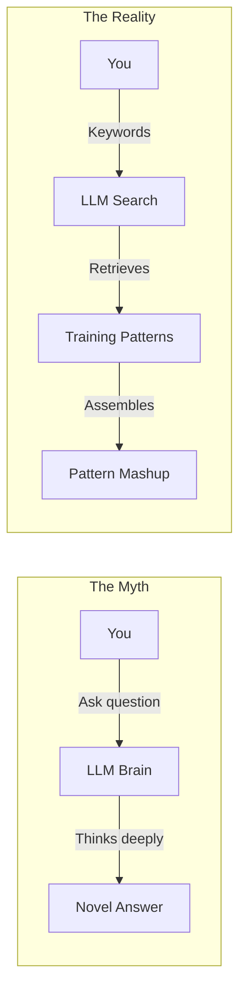

LLMs are better understood as retrieval-and-composition systems than as clean reasoners.
That means naming, prompting, and context are part of the implementation.

- Treat prompts like search queries.
- Treat naming like retrieval design.
- When output is off, fix the inputs before blaming the model.

## Principle 2: Iteration Is Required

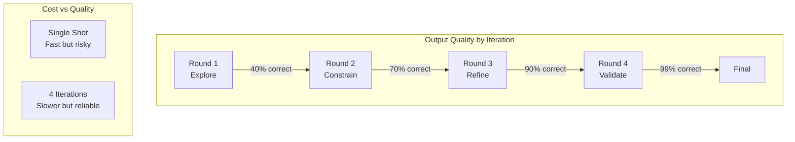

The first output is usually a direction, not a result.
Good work comes from deliberate passes, not one lucky prompt.

- Explore: get the rough shape.
- Constrain: add rules, types, interfaces, and limits.
- Refine: simplify and tighten.
- Verify: prove the result against tests or checks.

## Principle 3: Context Windows Forget

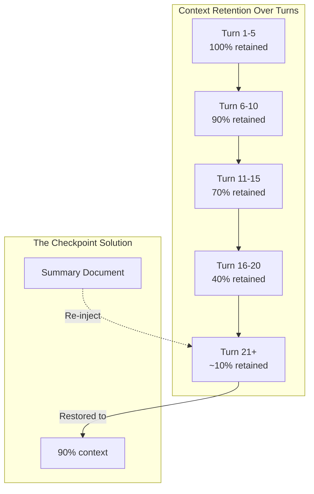

Long sessions decay.
If a decision matters later, put it in a file.

- Summarize after major decisions.
- Save requirements, architecture choices, and open questions.
- Use files as memory, not just the chat thread.

## Principle 4: Self-Critique Finds Weak Spots

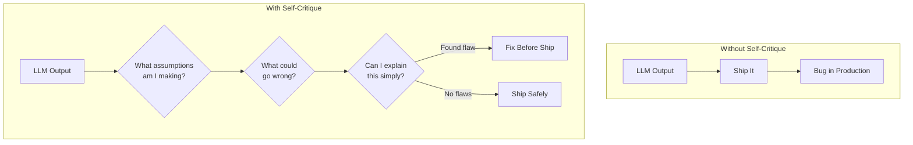

LLMs are fluent by default.
Fluency hides mistakes unless you force a second pass.

- Ask what is wrong with the answer.
- Ask what assumptions it depends on.
- Ask for the simplest explanation of the solution.

If the explanation falls apart, the design probably does too.

## Principle 5: Negative Knowledge Is Leverage

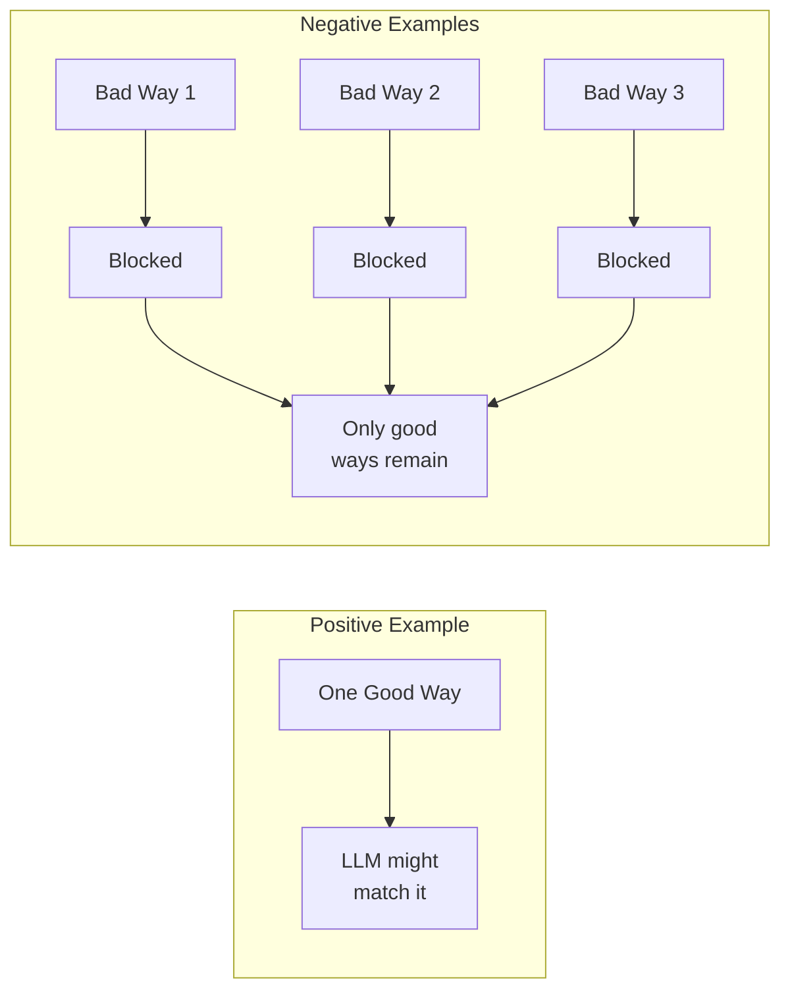

Positive examples help.
Negative examples prevent repeats.

- Keep a file of bugs, traps, and failure patterns.
- Write anti-patterns in concrete language.
- Reuse them when prompting, reviewing, and refactoring.

One avoided bug is often more valuable than one polished example.

## Principle 6: Tests Are the Spec

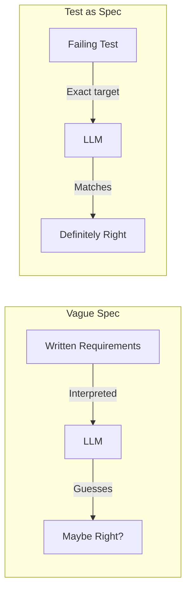

If the test is clear, the implementation target is clear.
If the spec is vague, the model fills gaps with guesses.

- Write the failing test first.
- Let the test define names, types, and behavior.
- Treat prose as support for the test, not a substitute for it.

## Principle 7: Four-Word Names Are a Strong Default

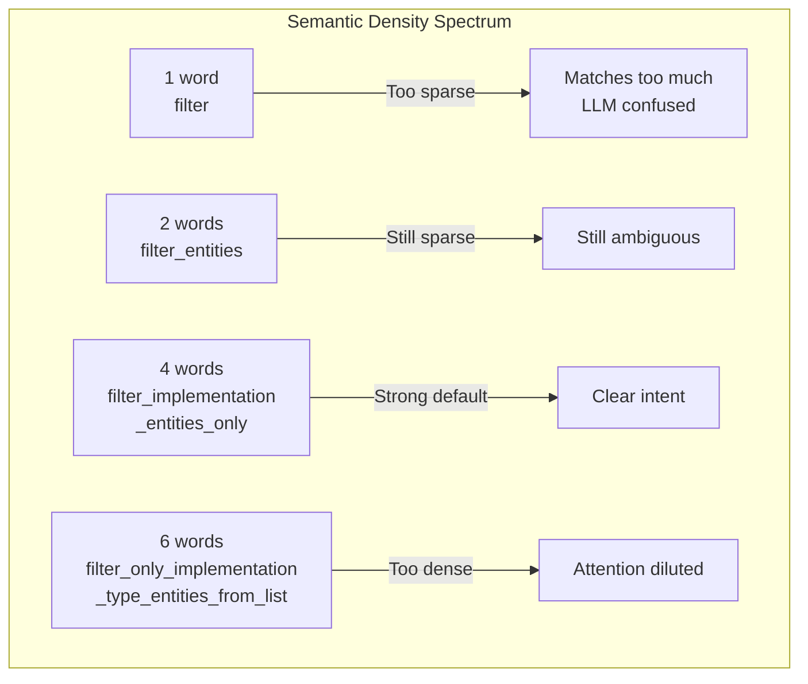

The point is not numerology.
The point is semantic density.

- Short names are often vague.
- Long names often dilute the signal.
- Four words is a good default because it tends to force specificity without turning into a paragraph.

Use the pattern when it helps.
Do not preserve a bad public API just to obey a slogan.

## Principle 8: Match Process to Work Type

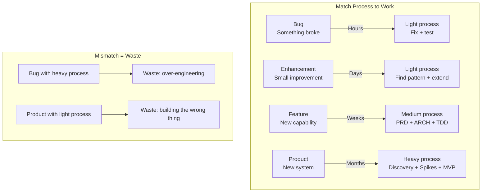

Process should match risk and uncertainty.
Too much process is drag.
Too little process is rework.

- Bugs need speed plus regression coverage.
- Enhancements should reuse existing rails.
- Features need bounded design and TDD.
- Products need discovery before build.

See [A01-LLM-Workflow01.md](./A01-LLM-Workflow01.md) for the detailed routing.

## Principle 9: PRD and Architecture Should Co-Evolve

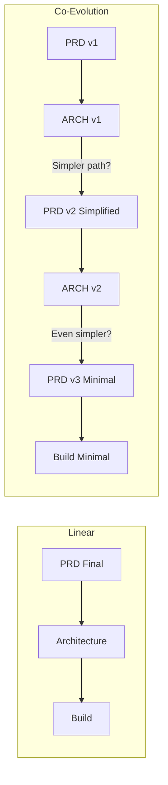

Requirements and architecture should push on each other.
The design should reveal what can be removed, not just what can be built.

- Start with the user value, not a maximal scope list.
- Let architecture discoveries simplify the PRD.
- Stop when the scope is clear, useful, and hard to simplify further.

## Principle 10: Serialize State

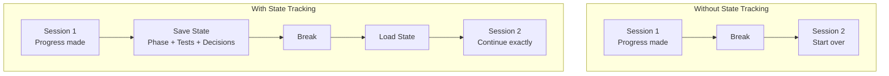

If progress matters, write it down.
A checkpoint should let someone else resume without guesswork.

- Capture the current phase.
- Record test status.
- Record key decisions and rejected options.
- Write the next steps plainly.

If the note cannot restart the work, it is not a checkpoint yet.

## Principle 11: Delegate With Rules

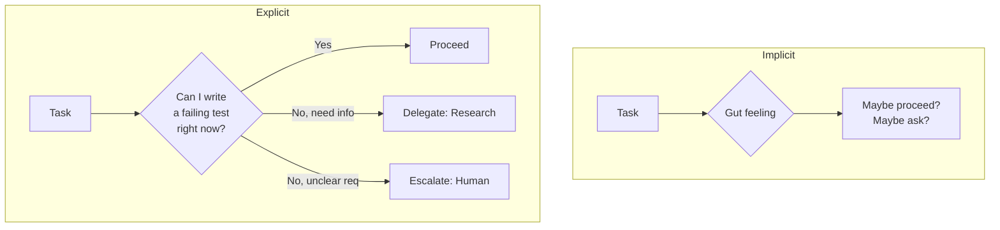

Delegation needs a rule, not a mood.
The cleanest rule is usually: can I define correctness right now?

- If yes, proceed.
- If not because you lack facts, research.
- If not because the requirement is unclear, escalate.

This keeps autonomy useful without letting it drift.

## Principle 12: Close the Loop

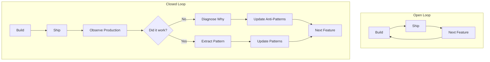

Teams improve only if results change future behavior.
Shipping without learning is just repetition.

- Record failures and their causes.
- Record wins worth repeating.
- Feed both back into prompts, tests, and review habits.

## How They Connect

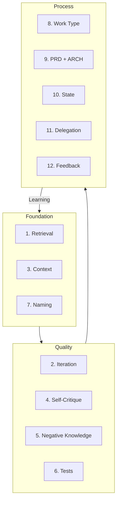

These principles fit together:

- Foundation explains how the model behaves.
- Quality improves what you get from it.
- Process decides how work moves safely.

The through-line is simple:

> Fill the context with the right information at the right time.
