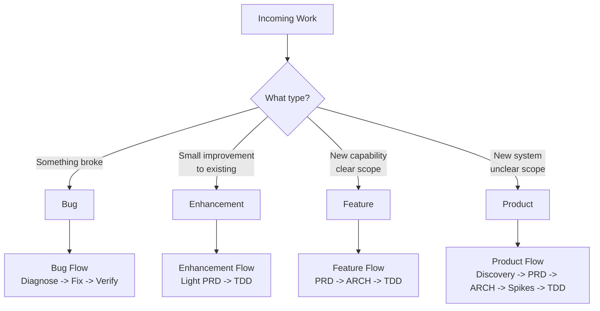
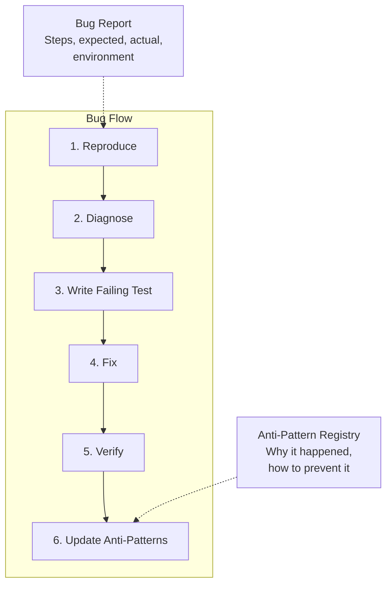
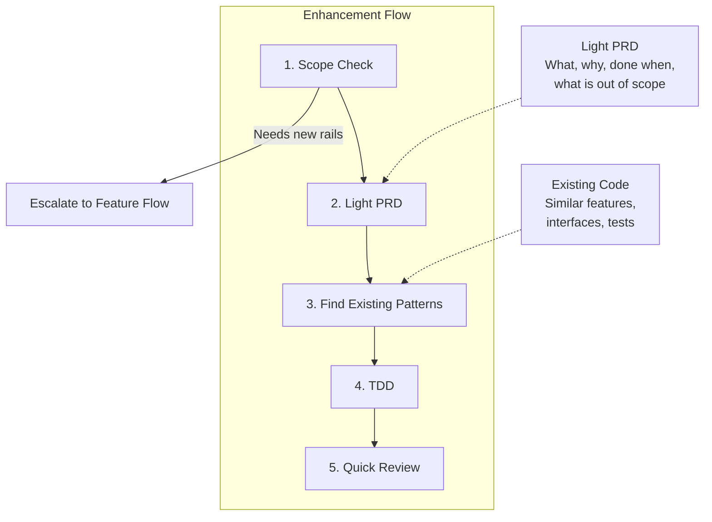
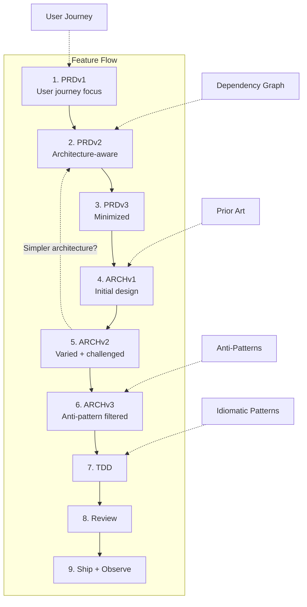
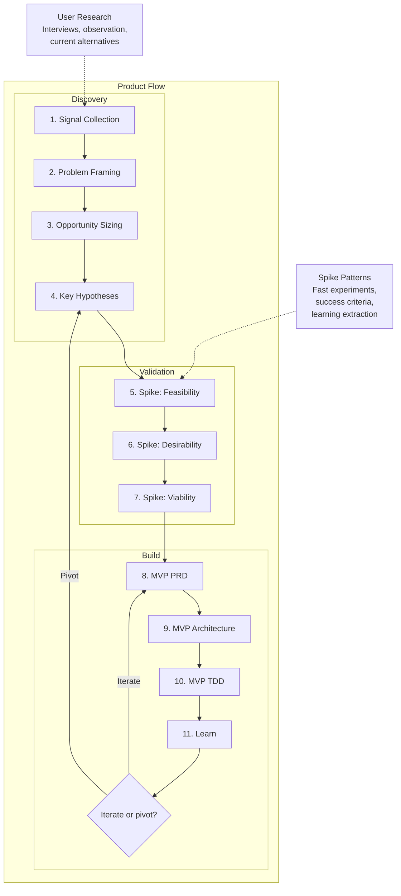
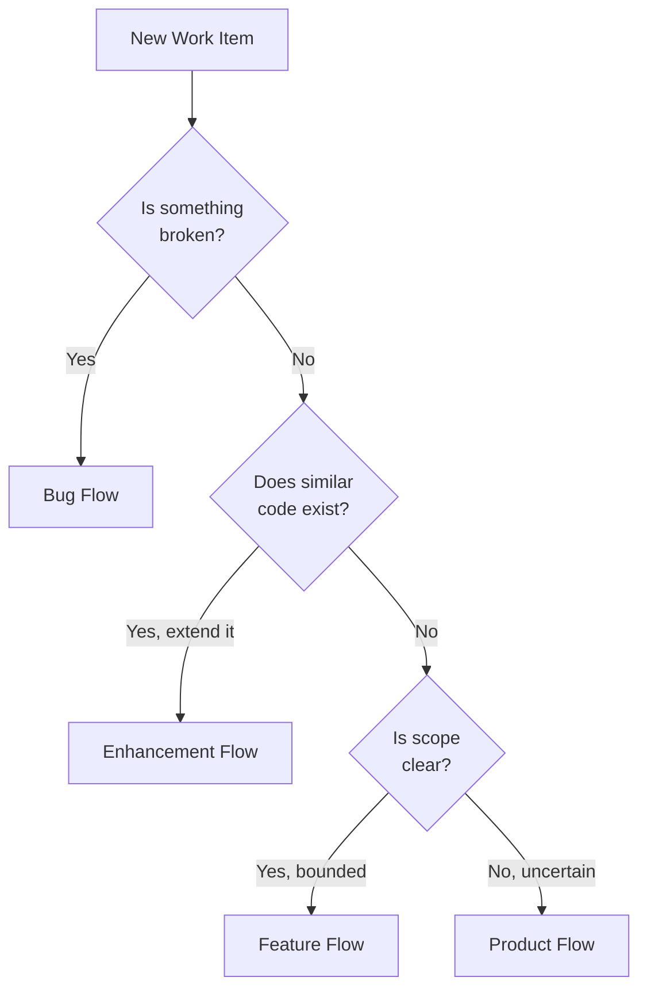
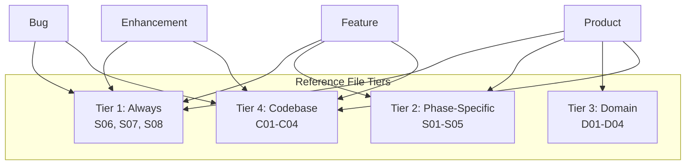
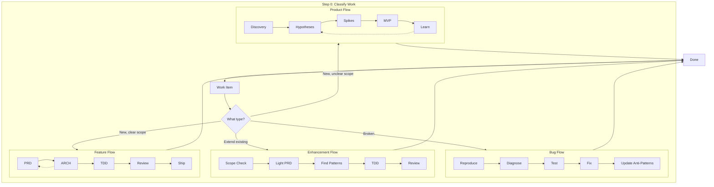

# LLM Workflow v01: Work Type Differentiation

Not all work deserves the same process.
The point of this file is to choose the lightest process that still protects quality.

## Quick Classifier

| Work Type | Use it for | PRD | Architecture | TDD | Time |
| --- | --- | --- | --- | --- | --- |
| Bug | Something broke | None | None | Fix + regression test | Hours |
| Enhancement | Small change on existing rails | Light | Light | Yes | Days |
| Feature | New bounded capability | Yes | Yes | Full | Weeks |
| Product | New system or unclear scope | Deep | Extensive | Full + spikes | Months |

Over-process wastes time.
Under-process builds the wrong thing.

## Work Type Framework

## Flow 1: Bug Flow (Hours)

**Use this when**: something that used to work no longer works.

**Default steps**

1. Reproduce the bug.
2. Find the root cause.
3. Write the regression test first.
4. Make the smallest fix that passes.
5. Run the relevant checks.
6. Record why it slipped through.

**Load these files**

- `S07-anti-patterns-registry.md`
- `C03-test-inventory.md`

**Do not load by default**

- PRD files
- architecture exploration
- spikes

## Flow 2: Enhancement Flow (Days)

**Use this when**: the work extends an existing pattern instead of creating a new one.

**Default steps**

1. Confirm the change fits existing rails.
2. Write a short PRD.
3. Find the closest prior example in the codebase.
4. Use TDD.
5. Review quickly and ship.

**Load these files**

- `C01-dependency-graph.md`
- `C02-existing-interfaces.md`
- `S08-idiomatic-patterns.md`

**Do not load by default**

- deep discovery
- long PRD cycles
- broad architecture exploration

**Rule of thumb**

If you can describe the work as "do X like we do Y," it is probably an enhancement.
If you cannot find a Y, it is probably a feature.

## Flow 3: Feature Flow (Weeks)

**Use this when**: the capability is new, but the scope is still clear and bounded.

**Default steps**

1. Write the first PRD from the user journey.
2. Tighten the PRD with implementation reality.
3. Minimize the scope.
4. Iterate architecture in parallel with the PRD.
5. Run TDD against the final shape.
6. Review and observe after shipping.

**Load these files**

- `S06`, `S07`, `S08`
- `C01-C04`
- domain-specific files when relevant

**Key rule**

Let architecture remove scope.
Do not treat the first PRD as sacred.

## Flow 4: Product Flow (Months)

**Use this when**: the scope is unclear, the domain is new, or you might be solving the wrong problem.

**Default steps**

1. Define the problem before the feature list.
2. Write the key hypotheses.
3. Run spikes to test the risky assumptions.
4. Build the smallest useful MVP.
5. Learn from reality and loop.

**Load these files**

- `S01-problem-discovery-patterns.md`
- `S02-technical-spike-patterns.md`
- Tier 1 files for the build phase
- new domain files if the space is new

**Key rule**

Product work is about learning before scale.
Do not confuse activity with validation.

## The Classification Decision Tree

**Ask in this order**

1. Did something break?
2. Am I extending an existing pattern?
3. Can I define done right now?
4. If not, am I still discovering the problem?

## Reference Files by Work Type

| Work Type | Load first | Usually skip |
| --- | --- | --- |
| Bug | S07, C03 | discovery, spikes |
| Enhancement | S08, C01-C02 | deep PRD, broad architecture |
| Feature | S06-S08, C01-C04 | discovery-heavy product work |
| Product | everything relevant | nothing by default |

## Time Budget by Work Type

| Work Type | PRD | ARCH | Spike | TDD | Review | Total |
| --- | --- | --- | --- | --- | --- | --- |
| Bug | 0 | 0 | 0 | 2h | 30m | 2-4 hours |
| Enhancement | 30m | 0 | 0 | 4h | 1h | 1-2 days |
| Feature | 4h | 4h | 0-4h | 16h | 4h | 1-2 weeks |
| Product | 8h+ | 8h+ | 16h+ | 40h+ | 8h+ | 4+ weeks |

Time budget is a signal.
If the real work keeps blowing past the expected budget, the classification is probably wrong.

## Updated Master Workflow

## The Common-Sense Test

Before starting, ask:

1. What kind of work is this?
2. What is the lightest process that still protects quality?
3. What is the time budget?
4. Which files actually matter for this kind of work?

The goal is not maximum process.
The goal is minimum viable process with maximum confidence.
