# 🦀 Rust Memory Mental Models: The MCU Guide

## 1️⃣ The Big Picture: Where Memory Lives

```mermaid
%%{init: {'theme': 'dark'}}%%
flowchart TB
    subgraph PROGRAM["🎬 YOUR RUST PROGRAM (The MCU)"]
        
        subgraph STACK["📚 THE STACK<br/>━━━━━━━━━━━━━━━━━━━━<br/>Thor's Asgard Palace"]
            S1["🔨 Function locals live here<br/>━━━━━━━━━━━━━━━━<br/>Thor just PUTS Mjolnir down<br/>No permission needed<br/>No paperwork"]
            S2["⚡ LIFO: Last In, First Out<br/>━━━━━━━━━━━━━━━━<br/>Like stacking plates<br/>Can only remove top plate"]
            S3["🏃 Automatic cleanup<br/>━━━━━━━━━━━━━━━━<br/>Function returns?<br/>Stack pointer moves up<br/>Everything 'freed' instantly"]
        end
        
        subgraph HEAP["🏛️ THE HEAP<br/>━━━━━━━━━━━━━━━━━━━━<br/>Avengers Compound Storage"]
            H1["📦 Dynamic allocations<br/>━━━━━━━━━━━━━━━━<br/>Box, Vec, String, Rc, Arc<br/>Anything that can GROW"]
            H2["🔍 Happy Hogan manages it<br/>━━━━━━━━━━━━━━━━<br/>Searches for free rooms<br/>Updates his ledger<br/>Sometimes asks OS for more"]
            H3["🧹 Manual-ish cleanup<br/>━━━━━━━━━━━━━━━━<br/>Rust's Drop trait runs<br/>Deallocator updates free list<br/>Memory returned to pool"]
        end
        
    end
    
    STACK -.->|"Pointers on stack<br/>point to heap data"| HEAP
    
    style STACK fill:#1a472a,stroke:#2ecc71,stroke-width:3px
    style HEAP fill:#4a1a1a,stroke:#e74c3c,stroke-width:3px
    style PROGRAM fill:#1a1a2e,stroke:#9b59b6,stroke-width:2px
```

---

## 2️⃣ Stack Allocation: Thor's Speed

```mermaid
%%{init: {'theme': 'dark'}}%%
flowchart LR
    subgraph ALLOCATION["⚡ STACK ALLOCATION: ONE INSTRUCTION"]
        
        subgraph BEFORE["BEFORE: RSP at position 1000"]
            B1["RSP → 1000<br/>━━━━━━━━<br/>Empty space above"]
        end
        
        subgraph INSTRUCTION["THE MAGIC"]
            I1["sub rsp, 24<br/>━━━━━━━━━━━━<br/>Subtract 24 from RSP<br/>That's literally IT<br/>One CPU cycle!"]
        end
        
        subgraph AFTER["AFTER: RSP at position 976"]
            A1["RSP → 976<br/>━━━━━━━━<br/>24 bytes now 'yours'<br/>976 to 1000"]
        end
        
        BEFORE --> INSTRUCTION --> AFTER
    end
    
    subgraph THOR["🔨 MCU ANALOGY"]
        T1["Thor putting down Mjolnir<br/>━━━━━━━━━━━━━━━━━━━━<br/>• Doesn't ask permission<br/>• Doesn't fill forms<br/>• Doesn't wait<br/>• Just... places it<br/>• Table was always there"]
    end
    
    ALLOCATION -.-> THOR
    
    style ALLOCATION fill:#1a3a1a,stroke:#2ecc71,stroke-width:2px
    style THOR fill:#2c1810,stroke:#f39c12,stroke-width:2px
```

---

## 3️⃣ Heap Allocation: Strange's Search

```mermaid
%%{init: {'theme': 'dark'}}%%
flowchart TB
    subgraph HEAP_ALLOC["🏛️ HEAP ALLOCATION: THE FULL PROCESS"]
        
        START["malloc(100) called<br/>━━━━━━━━━━━━━━<br/>'I need 100 bytes please'"]
        
        subgraph SEARCH["STEP 1: Search Free List"]
            SR1["Walk through free blocks<br/>━━━━━━━━━━━━━━━━━━<br/>Block 1: 50 bytes - too small<br/>Block 2: 80 bytes - too small<br/>Block 3: 200 bytes - YES!"]
        end
        
        subgraph SPLIT["STEP 2: Maybe Split Block"]
            SP1["Block is 200, need 100<br/>━━━━━━━━━━━━━━━━━━<br/>Split into:<br/>• 100 bytes for you<br/>• 100 bytes stays free"]
        end
        
        subgraph BOOKKEEP["STEP 3: Update Bookkeeping"]
            BK1["Mark block as USED<br/>Remove from free list<br/>Update size metadata<br/>Set boundary tags"]
        end
        
        subgraph OSASK["STEP 4: (If No Space) Ask OS"]
            OS1["Call brk() or mmap()<br/>━━━━━━━━━━━━━━━━━━<br/>Context switch to kernel!<br/>OS updates page tables<br/>Returns new memory<br/>This is EXPENSIVE"]
        end
        
        RETURN["Return pointer to you<br/>━━━━━━━━━━━━━━<br/>Finally done!"]
        
        START --> SEARCH
        SEARCH -->|"Found space"| SPLIT
        SEARCH -->|"No space!"| OSASK
        SPLIT --> BOOKKEEP
        OSASK --> BOOKKEEP
        BOOKKEEP --> RETURN
    end
    
    subgraph STRANGE["🧙 MCU: DR. STRANGE FINDING A ROOM"]
        ST1["1. Walks through Sanctum<br/>   checking each door"]
        ST2["2. This room taken...<br/>   This one too small...<br/>   This one has demons..."]
        ST3["3. Found one! Updates<br/>   magical ledger"]
        ST4["4. If Sanctum full:<br/>   Contact Ancient One<br/>   Request dimension expansion<br/>   WAIT for approval"]
        
        ST1 --> ST2 --> ST3
        ST2 -.->|"Full!"| ST4
    end
    
    style HEAP_ALLOC fill:#3a1a1a,stroke:#e74c3c,stroke-width:2px
    style OSASK fill:#4a0a0a,stroke:#c0392b,stroke-width:3px
    style STRANGE fill:#1a1a3a,stroke:#9b59b6,stroke-width:2px
```

---

## 4️⃣ CPU Cache: Why Stack Wins

```mermaid
%%{init: {'theme': 'dark'}}%%
flowchart TB
    subgraph CACHE_HIERARCHY["🧠 CPU CACHE HIERARCHY"]
        
        subgraph CPU["THE CPU"]
            L1["L1 Cache: 64KB<br/>━━━━━━━━━━━━<br/>⚡ 1 nanosecond<br/>Your desk drawer"]
            L2["L2 Cache: 256KB<br/>━━━━━━━━━━━━<br/>⏱️ 4 nanoseconds<br/>Filing cabinet nearby"]
        end
        
        L3["L3 Cache: 8MB<br/>━━━━━━━━━━━━<br/>⏳ 10 nanoseconds<br/>Storage room down hall"]
        
        RAM["RAM: 16GB+<br/>━━━━━━━━━━━━<br/>🐌 100 nanoseconds<br/>Warehouse across town"]
        
        L1 --> L2 --> L3 --> RAM
    end
    
    subgraph STACK_CACHE["📚 STACK: CACHE FRIENDLY"]
        SC1["┌────┬────┬────┬────┬────┬────┐<br/>│ a  │ b  │ c  │ d  │ e  │ f  │<br/>└────┴────┴────┴────┴────┴────┘<br/>━━━━━━━━━━━━━━━━━━━━━━━━━━━━<br/>ALL CONTIGUOUS!<br/>CPU fetches 'a', gets b,c,d,e,f FREE<br/>Called 'cache line prefetch'"]
    end
    
    subgraph HEAP_CACHE["🏛️ HEAP: CACHE UNFRIENDLY"]
        HC1["┌────┐     ┌────┐          ┌────┐<br/>│ a  │     │ b  │          │ c  │<br/>└──┬─┘     └──┬─┘          └──┬─┘<br/>   │ junk     │   garbage    │<br/>   └──────────┴──────────────┘<br/>━━━━━━━━━━━━━━━━━━━━━━━━━━━━<br/>SCATTERED EVERYWHERE!<br/>Each access = potential cache MISS<br/>Must go to RAM = 100x slower"]
    end
    
    style STACK_CACHE fill:#1a3a1a,stroke:#2ecc71,stroke-width:3px
    style HEAP_CACHE fill:#3a1a1a,stroke:#e74c3c,stroke-width:3px
```

---

## 5️⃣ Infinity Stones Analogy: Cache Locality

```mermaid
%%{init: {'theme': 'dark'}}%%
flowchart TB
    subgraph STACK_STONES["💎 STACK: ALL STONES IN GAUNTLET"]
        G1["🧤 THANOS'S GAUNTLET<br/>━━━━━━━━━━━━━━━━━━━━"]
        
        subgraph GAUNTLET["All Stones Together"]
            GS1["🟣 Power"]
            GS2["🔵 Space"]
            GS3["🔴 Reality"]
            GS4["🟠 Soul"]
            GS5["🟢 Time"]
            GS6["🟡 Mind"]
        end
        
        G2["Need Power Stone?<br/>━━━━━━━━━━━━<br/>RIGHT THERE ⚡<br/>0 nanoseconds travel"]
        
        G3["Need ANY Stone?<br/>━━━━━━━━━━━━<br/>ALL RIGHT THERE ⚡<br/>No searching needed"]
    end
    
    subgraph HEAP_STONES["💎 HEAP: STONES ACROSS GALAXY"]
        H1["🌌 SCATTERED STONES<br/>━━━━━━━━━━━━━━━━━━━━"]
        
        XANDAR["🟣 Power Stone<br/>━━━━━━━━━━<br/>📍 Xandar"]
        ASGARD["🔵 Space Stone<br/>━━━━━━━━━━<br/>📍 Asgard"]
        LONDON["🔴 Reality Stone<br/>━━━━━━━━━━<br/>📍 London cave"]
        VORMIR["🟠 Soul Stone<br/>━━━━━━━━━━<br/>📍 Vormir"]
        
        H2["Need Power Stone?<br/>━━━━━━━━━━━━<br/>🚀 Travel to Xandar<br/>100 nanoseconds!"]
        
        H3["This is POINTER CHASING<br/>━━━━━━━━━━━━━━━━━<br/>Following pointers to<br/>different memory locations<br/>Each jump = potential cache miss"]
    end
    
    style STACK_STONES fill:#1a3a1a,stroke:#2ecc71,stroke-width:3px
    style HEAP_STONES fill:#3a1a1a,stroke:#e74c3c,stroke-width:3px
    style GAUNTLET fill:#2a1a4a,stroke:#9b59b6,stroke-width:2px
```

---

## 6️⃣ Stack Cleanup: Thor Leaves the Party

```mermaid
%%{init: {'theme': 'dark'}}%%
flowchart TB
    subgraph STACK_CLEANUP["♻️ STACK CLEANUP: INSTANT"]
        
        subgraph DURING["DURING FUNCTION"]
            D1["fn battle() {<br/>    let shield = 12;   // RSP moves ↓<br/>    let hammer = 42;   // RSP moves ↓<br/>    let suit = 9001;   // RSP moves ↓<br/>    // ... fight bad guys ...<br/>}"]
            
            D2["Stack State:<br/>━━━━━━━━━━━━<br/>RSP → │ suit: 9001  │<br/>      │ hammer: 42  │<br/>      │ shield: 12  │<br/>      │ prev frame  │"]
        end
        
        subgraph RETURN["FUNCTION RETURNS"]
            R1["add rsp, 24  // Move RSP back up<br/>ret           // Return to caller"]
            
            R2["Stack State:<br/>━━━━━━━━━━━━<br/>      │ (garbage)   │<br/>      │ (garbage)   │<br/>      │ (garbage)   │<br/>RSP → │ prev frame  │<br/>━━━━━━━━━━━━<br/>Memory not erased!<br/>Just marked 'available'"]
        end
        
        DURING --> RETURN
    end
    
    subgraph THOR_PARTY["🎉 MCU: THOR'S PARTY"]
        T1["Thor hosts party in Asgard<br/>━━━━━━━━━━━━━━━━━━━━"]
        T2["Party ends...<br/>━━━━━━━━━━━━━━━━━━━━"]
        T3["Thor just LEAVES<br/>━━━━━━━━━━━━━━━━━━━━<br/>• No cleaning crew<br/>• No paperwork<br/>• No invoices<br/>• It's HIS palace<br/>• He'll use it tomorrow"]
        
        T1 --> T2 --> T3
    end
    
    style STACK_CLEANUP fill:#1a3a1a,stroke:#2ecc71,stroke-width:2px
    style RETURN fill:#0a2a0a,stroke:#27ae60,stroke-width:3px
    style THOR_PARTY fill:#2c1810,stroke:#f39c12,stroke-width:2px
```

---

## 7️⃣ Heap Cleanup: Tony's Cleaning Crew

```mermaid
%%{init: {'theme': 'dark'}}%%
flowchart TB
    subgraph HEAP_CLEANUP["🧹 HEAP CLEANUP: ACTUAL WORK"]
        
        subgraph DROP["WHEN VARIABLE GOES OUT OF SCOPE"]
            DR1["fn stark_party() {<br/>    let guests = vec![1,2,3,4,5];<br/>} // ← Rust calls Drop here"]
        end
        
        subgraph STEPS["THE CLEANUP PROCESS"]
            S1["1️⃣ Drop::drop() runs<br/>━━━━━━━━━━━━━━━━<br/>Custom cleanup logic<br/>Close files, flush buffers"]
            
            S2["2️⃣ dealloc() called<br/>━━━━━━━━━━━━━━━━<br/>Tell allocator: 'I'm done<br/>with this memory'"]
            
            S3["3️⃣ Update free list<br/>━━━━━━━━━━━━━━━━<br/>Add block back to<br/>available memory pool"]
            
            S4["4️⃣ Maybe coalesce<br/>━━━━━━━━━━━━━━━━<br/>Merge with adjacent<br/>free blocks to reduce<br/>fragmentation"]
            
            S1 --> S2 --> S3 --> S4
        end
        
        DROP --> STEPS
    end
    
    subgraph TONY_PARTY["🎉 MCU: TONY'S RENTED VENUE"]
        TP1["Tony rents a venue<br/>━━━━━━━━━━━━━━━━━━━━"]
        TP2["Party ends...<br/>━━━━━━━━━━━━━━━━━━━━"]
        TP3["Cleaning crew comes<br/>━━━━━━━━━━━━━━━━━━━━<br/>• Sweep floors<br/>• Check for damages<br/>• Update booking system<br/>• Mark room available<br/>• Maybe combine with<br/>  adjacent empty rooms"]
        
        TP1 --> TP2 --> TP3
    end
    
    style HEAP_CLEANUP fill:#3a1a1a,stroke:#e74c3c,stroke-width:2px
    style STEPS fill:#2a0a0a,stroke:#c0392b,stroke-width:2px
    style TONY_PARTY fill:#1a1a3a,stroke:#3498db,stroke-width:2px
```

---

## 8️⃣ Vec Reallocation: The Great Migration

```mermaid
%%{init: {'theme': 'dark'}}%%
flowchart TB
    subgraph REALLOC["🚚 VEC REALLOCATION: WHEN CAPACITY EXCEEDED"]
        
        subgraph BEFORE["BEFORE: Vec is FULL"]
            B1["Heap Memory:<br/>┌─────┬─────┬─────┬─────┬─────────────┬────────────┐<br/>│  1  │  2  │  3  │  4  │ SOMEONE     │   FREE     │<br/>│     │     │     │     │ ELSE'S DATA │   SPACE    │<br/>└─────┴─────┴─────┴─────┴─────────────┴────────────┘<br/>  ↑ Your Vec (cap=4)      ↑ BLOCKED!"]
        end
        
        subgraph STEP1["STEP 1: Allocate NEW bigger space"]
            S1A["Find space for capacity * 2 = 8 slots<br/>━━━━━━━━━━━━━━━━━━━━━━━━━━━━"]
            S1B["┌───┬───┬───┬───┬─────────┬───┬───┬───┬───┬───┬───┬───┬───┐<br/>│ 1 │ 2 │ 3 │ 4 │BLOCKED  │   │   │   │   │   │   │   │   │<br/>└───┴───┴───┴───┴─────────┴───┴───┴───┴───┴───┴───┴───┴───┘<br/> ↑ old                      ↑ NEW allocation (cap=8)"]
        end
        
        subgraph STEP2["STEP 2: COPY everything"]
            S2A["memcpy(new_ptr, old_ptr, 4 * size_of_element)<br/>━━━━━━━━━━━━━━━━━━━━━━━━━━━━━━━━━━━━━━━━"]
            S2B["┌───┬───┬───┬───┬─────────┬───┬───┬───┬───┬───┬───┬───┬───┐<br/>│ 1 │ 2 │ 3 │ 4 │BLOCKED  │ 1 │ 2 │ 3 │ 4 │   │   │   │   │<br/>└───┴───┴───┴───┴─────────┴───┴───┴───┴───┴───┴───┴───┴───┘<br/> copying ━━━━━━━━━━━━━━━━━→"]
        end
        
        subgraph STEP3["STEP 3: Free old, add new element"]
            S3A["free(old_ptr); vec.ptr = new_ptr;<br/>━━━━━━━━━━━━━━━━━━━━━━━━━━━━━━━━"]
            S3B["┌────┬────┬────┬────┬─────────┬───┬───┬───┬───┬───┬───┬───┬───┐<br/>│FREE│FREE│FREE│FREE│BLOCKED  │ 1 │ 2 │ 3 │ 4 │ 5 │   │   │   │<br/>└────┴────┴────┴────┴─────────┴───┴───┴───┴───┴───┴───┴───┴───┘<br/>                               ↑ Vec now points HERE! cap=8"]
        end
        
        BEFORE --> STEP1 --> STEP2 --> STEP3
    end
    
    style REALLOC fill:#1a1a3a,stroke:#9b59b6,stroke-width:2px
    style STEP2 fill:#3a3a1a,stroke:#f1c40f,stroke-width:2px
```

---

## 9️⃣ MCU: Avengers Base Migration

```mermaid
%%{init: {'theme': 'dark'}}%%
flowchart TB
    subgraph MOVE["🏛️ AVENGERS BASE MIGRATION"]
        
        subgraph STARK_TOWER["STARK TOWER (Capacity: 4)"]
            ST1["┌─────────┬─────────┬─────────┬─────────┐<br/>│ Iron Man│   Cap   │  Thor   │  Hulk   │<br/>└─────────┴─────────┴─────────┴─────────┘<br/>━━━━━━━━━━━━━━━━━━━━━━━━━━━━━━━━━━━━━━<br/>FULL! Can't expand - Oscorp next door!"]
        end
        
        subgraph NEW_MEMBERS["NEW MEMBERS WANT TO JOIN"]
            NM1["Black Widow 🕷️<br/>Hawkeye 🏹<br/>Vision 🤖"]
        end
        
        subgraph SOLUTION["THE SOLUTION"]
            SOL1["1️⃣ Build NEW Upstate Compound<br/>   (capacity = 8)"]
            SOL2["2️⃣ Move ALL existing Avengers<br/>   Iron Man → Compound<br/>   Cap → Compound<br/>   Thor → Compound<br/>   Hulk → Compound"]
            SOL3["3️⃣ Sell/Abandon Stark Tower<br/>   (free old memory)"]
            SOL4["4️⃣ Add new members!<br/>   Black Widow ✓<br/>   Hawkeye ✓<br/>   Vision ✓"]
            
            SOL1 --> SOL2 --> SOL3 --> SOL4
        end
        
        subgraph COST["💰 THE COST"]
            C1["• Had to move 4 heroes (copy)<br/>• Had to build new facility (alloc)<br/>• Had to deal with old tower (dealloc)<br/>━━━━━━━━━━━━━━━━━━━━━━━━━━━━<br/>This is why reallocation is EXPENSIVE!"]
        end
        
        STARK_TOWER --> NEW_MEMBERS
        NEW_MEMBERS --> SOLUTION
        SOLUTION --> COST
    end
    
    style STARK_TOWER fill:#3a1a1a,stroke:#e74c3c,stroke-width:2px
    style SOLUTION fill:#1a3a1a,stroke:#2ecc71,stroke-width:2px
    style COST fill:#3a3a1a,stroke:#f1c40f,stroke-width:2px
```

---

## 🔟 Why Double Capacity? Growth Strategy

```mermaid
%%{init: {'theme': 'dark'}}%%
flowchart TB
    subgraph BAD["❌ BAD: Grow by 1 Each Time"]
        B1["push(1) → alloc 1, copy 0<br/>push(2) → alloc 2, copy 1<br/>push(3) → alloc 3, copy 2<br/>push(4) → alloc 4, copy 3<br/>...<br/>push(n) → alloc n, copy n-1<br/>━━━━━━━━━━━━━━━━━━━━━━<br/>Total copies: 0+1+2+3+...+(n-1)<br/>= n²/2 = O(n²) 🐌<br/>━━━━━━━━━━━━━━━━━━━━━━<br/>MCU: Moving Avengers to a<br/>slightly bigger base EVERY<br/>time someone joins!"]
    end
    
    subgraph GOOD["✅ GOOD: Double Each Time"]
        G1["push(1) → alloc 1<br/>push(2) → alloc 2, copy 1  ← grew<br/>push(3) → alloc 4, copy 2  ← grew<br/>push(4) → fits!<br/>push(5) → alloc 8, copy 4  ← grew<br/>push(6,7,8) → fits!<br/>push(9) → alloc 16, copy 8 ← grew<br/>━━━━━━━━━━━━━━━━━━━━━━<br/>Total copies: 1+2+4+8+... ≈ 2n<br/>= O(n) → O(1) amortized ⚡<br/>━━━━━━━━━━━━━━━━━━━━━━<br/>MCU: Stark Tower(4) →<br/>Upstate Compound(8) →<br/>Helicarrier(16) →<br/>Wakanda(32)"]
    end
    
    subgraph VISUAL["📊 VISUAL COMPARISON"]
        V1["n=1000 elements:<br/>━━━━━━━━━━━━━━━━━━━━━━<br/>❌ Grow by 1: ~500,000 copies<br/>✅ Double:     ~2,000 copies<br/>━━━━━━━━━━━━━━━━━━━━━━<br/>250x difference!"]
    end
    
    style BAD fill:#3a1a1a,stroke:#e74c3c,stroke-width:3px
    style GOOD fill:#1a3a1a,stroke:#2ecc71,stroke-width:3px
    style VISUAL fill:#1a1a3a,stroke:#9b59b6,stroke-width:2px
```

---

## 1️⃣1️⃣ Pointer Invalidation: The Danger Zone

```mermaid
%%{init: {'theme': 'dark'}}%%
flowchart TB
    subgraph DANGER["☠️ POINTER INVALIDATION"]
        
        subgraph SETUP["THE SETUP"]
            S1["let mut heroes = vec!['Iron Man', 'Cap'];<br/>let iron_man_ptr = &heroes[0];<br/>━━━━━━━━━━━━━━━━━━━━━━━━━━━━<br/>iron_man_ptr → 0x1000 (Stark Tower address)"]
        end
        
        subgraph REALLOC2["REALLOCATION HAPPENS"]
            R1["for i in 0..100 {<br/>    heroes.push('Random Hero');<br/>}<br/>━━━━━━━━━━━━━━━━━━━━━━━━━━━━<br/>Vec reallocates!<br/>Data moves from 0x1000 to 0x2000"]
        end
        
        subgraph PROBLEM["THE PROBLEM"]
            P1["iron_man_ptr still points to 0x1000<br/>━━━━━━━━━━━━━━━━━━━━━━━━━━━━<br/>0x1000 = FREED MEMORY!<br/>Could be garbage<br/>Could be reused by someone else<br/>━━━━━━━━━━━━━━━━━━━━━━━━━━━━<br/>*iron_man_ptr = UNDEFINED BEHAVIOR 💀"]
        end
        
        SETUP --> REALLOC2 --> PROBLEM
    end
    
    subgraph MCU_ANALOGY["🏠 MCU ANALOGY"]
        M1["You gave friend the address:<br/>'Meet me at 200 Park Ave, Manhattan'<br/>━━━━━━━━━━━━━━━━━━━━━━━━━━━━"]
        M2["Avengers moved to Upstate NY<br/>━━━━━━━━━━━━━━━━━━━━━━━━━━━━"]
        M3["Friend shows up at old address...<br/>━━━━━━━━━━━━━━━━━━━━━━━━━━━━<br/>Empty building! Or worse...<br/>A VILLAIN lives there now! 🦹‍♂️"]
        
        M1 --> M2 --> M3
    end
    
    style DANGER fill:#4a0a0a,stroke:#e74c3c,stroke-width:3px
    style PROBLEM fill:#5a0a0a,stroke:#c0392b,stroke-width:3px
    style MCU_ANALOGY fill:#3a2a1a,stroke:#f39c12,stroke-width:2px
```

---

## 1️⃣2️⃣ Rust's Borrow Checker: The Bodyguard

```mermaid
%%{init: {'theme': 'dark'}}%%
flowchart TB
    subgraph BORROW_CHECKER["🛡️ RUST'S BORROW CHECKER: SAVES YOU"]
        
        subgraph BAD_CODE["❌ THIS CODE WON'T COMPILE"]
            BC1["let mut heroes = vec!['Iron Man', 'Cap'];<br/><br/>let iron_man_ref = &heroes[0];  // immutable borrow<br/><br/>heroes.push('Thor');  // mutable borrow - ERROR!<br/><br/>println!('{}', iron_man_ref);"]
        end
        
        subgraph ERROR["COMPILER ERROR"]
            E1["error[E0502]: cannot borrow 'heroes'<br/>as mutable because it is also<br/>borrowed as immutable<br/>━━━━━━━━━━━━━━━━━━━━━━━━━━━━<br/>Rust PREVENTS the bug at compile time!"]
        end
        
        subgraph WHY["WHY THIS RULE EXISTS"]
            W1["push() MIGHT reallocate<br/>━━━━━━━━━━━━━━━━━━━━━━<br/>If it does, iron_man_ref<br/>would point to freed memory<br/>━━━━━━━━━━━━━━━━━━━━━━<br/>Rust says: 'NO! I won't let<br/>you shoot yourself in foot!'"]
        end
        
        BAD_CODE --> ERROR
        ERROR --> WHY
    end
    
    subgraph MCU_BODYGUARD["🕴️ MCU: HAPPY AS BODYGUARD"]
        HB1["You: 'Let me give out<br/>    Stark Tower address'"]
        HB2["Happy: 'Fine, here's a visitor pass'<br/>        (immutable reference)"]
        HB3["You: 'Now let me move<br/>    everyone to new base'"]
        HB4["Happy: 'NOPE! You have<br/>        visitors using that address!<br/>        Cancel their passes first!'"]
        
        HB1 --> HB2 --> HB3 --> HB4
    end
    
    style BORROW_CHECKER fill:#1a3a1a,stroke:#2ecc71,stroke-width:3px
    style ERROR fill:#3a1a1a,stroke:#e74c3c,stroke-width:2px
    style MCU_BODYGUARD fill:#1a1a3a,stroke:#3498db,stroke-width:2px
```

---

## 1️⃣3️⃣ The Solution: Use with_capacity

```mermaid
%%{init: {'theme': 'dark'}}%%
flowchart TB
    subgraph SOLUTION["✅ THE SOLUTION: PREALLOCATE"]
        
        subgraph BAD_WAY["❌ BAD: Unknown reallocations"]
            BW1["let mut heroes = Vec::new();<br/><br/>for hero in all_heroes {<br/>    heroes.push(hero);  // Might reallocate!<br/>}<br/>━━━━━━━━━━━━━━━━━━━━━━━━━━━━<br/>Could reallocate log₂(n) times<br/>Each time = allocate + copy + free"]
        end
        
        subgraph GOOD_WAY["✅ GOOD: Allocate once"]
            GW1["let mut heroes = Vec::with_capacity(1000);<br/><br/>for hero in all_heroes {<br/>    heroes.push(hero);  // Never reallocates!<br/>}<br/>━━━━━━━━━━━━━━━━━━━━━━━━━━━━<br/>ONE allocation, ZERO copies<br/>All space reserved upfront"]
        end
        
        BW1 --> |"vs"| GW1
    end
    
    subgraph MCU_PLANNING["🏗️ MCU: TONY'S PLANNING"]
        TP1["❌ BAD TONY:<br/>'I'll just add rooms as<br/>Avengers join'<br/>━━━━━━━━━━━━━━━━━━━━<br/>Constant construction!<br/>Moving people around!"]
        
        TP2["✅ GOOD TONY:<br/>'I know we'll have 50 Avengers.<br/>Build compound for 50 NOW.'<br/>━━━━━━━━━━━━━━━━━━━━<br/>One construction project<br/>Everyone just moves in"]
        
        TP1 --> |"vs"| TP2
    end
    
    style BAD_WAY fill:#3a1a1a,stroke:#e74c3c,stroke-width:2px
    style GOOD_WAY fill:#1a3a1a,stroke:#2ecc71,stroke-width:3px
```

---

## 1️⃣4️⃣ Master Summary: Stack vs Heap

```mermaid
%%{init: {'theme': 'dark'}}%%
flowchart TB
    subgraph SUMMARY["🎯 MASTER SUMMARY"]
        
        subgraph STACK_SUM["📚 STACK (Thor's Palace)"]
            SS1["⚡ ALLOCATION<br/>━━━━━━━━━━━━<br/>1 CPU instruction<br/>sub rsp, N"]
            SS2["🧠 CACHE<br/>━━━━━━━━━━━━<br/>Always contiguous<br/>CPU prefetches<br/>Cache hits = FAST"]
            SS3["♻️ CLEANUP<br/>━━━━━━━━━━━━<br/>Just move RSP<br/>No destructor calls<br/>Instant!"]
            SS4["📏 SIZE<br/>━━━━━━━━━━━━<br/>Must know at compile<br/>Usually 1-8 MB limit<br/>Fixed size only"]
        end
        
        subgraph HEAP_SUM["🏛️ HEAP (Avengers Compound)"]
            HS1["🐌 ALLOCATION<br/>━━━━━━━━━━━━<br/>100s of instructions<br/>Search + bookkeep<br/>Maybe OS call"]
            HS2["😰 CACHE<br/>━━━━━━━━━━━━<br/>Scattered/fragmented<br/>Pointer chasing<br/>Cache misses = SLOW"]
            HS3["🧹 CLEANUP<br/>━━━━━━━━━━━━<br/>Drop trait runs<br/>Free list updated<br/>Maybe coalesce"]
            HS4["📐 SIZE<br/>━━━━━━━━━━━━<br/>Dynamic at runtime<br/>Limited by RAM<br/>Can grow/shrink"]
        end
        
    end
    
    subgraph WHEN_TO_USE["🤔 WHEN TO USE WHAT"]
        WU1["USE STACK WHEN:<br/>━━━━━━━━━━━━━━━━━━━━<br/>• Size known at compile time<br/>• Small data (< few KB)<br/>• Short-lived data<br/>• Performance critical<br/>━━━━━━━━━━━━━━━━━━━━<br/>let x: i32 = 42;<br/>let arr: [u8; 100] = [0; 100];"]
        
        WU2["USE HEAP WHEN:<br/>━━━━━━━━━━━━━━━━━━━━<br/>• Size unknown at compile<br/>• Large data (> few KB)<br/>• Long-lived data<br/>• Needs to grow/shrink<br/>━━━━━━━━━━━━━━━━━━━━<br/>let v: Vec<i32> = vec![1,2,3];<br/>let s: String = String::new();"]
    end
    
    style STACK_SUM fill:#1a3a1a,stroke:#2ecc71,stroke-width:3px
    style HEAP_SUM fill:#3a1a1a,stroke:#e74c3c,stroke-width:3px
    style WU1 fill:#0a2a0a,stroke:#27ae60,stroke-width:2px
    style WU2 fill:#2a0a0a,stroke:#c0392b,stroke-width:2px
```

---

## Quick Reference Card

| Aspect | Stack 📚 | Heap 🏛️ |
|--------|----------|---------|
| **MCU** | Thor's Palace | Avengers Compound |
| **Speed** | ⚡ 1 instruction | 🐌 100s of instructions |
| **Cache** | 💚 Always hot | 🔴 Often cold |
| **Cleanup** | ✨ Instant | 🧹 Work required |
| **Size** | Fixed | Dynamic |
| **Lifetime** | Until function returns | Until explicitly freed |
| **Rust types** | `i32`, `[T; N]`, tuples | `Box`, `Vec`, `String`, `Rc`, `Arc` |
