# 🦀 Rust Memory Mental Models
## Mobile-Friendly Edition

---

# PART 1: The Big Picture

## 1A. Where Memory Lives

```mermaid
%%{init: {'theme': 'dark'}}%%
flowchart TB
    PROGRAM["🎬 YOUR RUST PROGRAM"]
    
    STACK["📚 THE STACK<br/>━━━━━━━━━━━━<br/>Thor's Asgard<br/>Palace"]
    
    HEAP["🏛️ THE HEAP<br/>━━━━━━━━━━━━<br/>Avengers<br/>Compound"]
    
    PROGRAM --> STACK
    PROGRAM --> HEAP
    STACK -.->|"pointers"| HEAP
    
    style STACK fill:#1a472a,stroke:#2ecc71,stroke-width:3px
    style HEAP fill:#4a1a1a,stroke:#e74c3c,stroke-width:3px
```

## 1B. Stack Properties

```mermaid
%%{init: {'theme': 'dark'}}%%
flowchart TB
    TITLE["📚 STACK<br/>Thor's Palace"]
    
    S1["🔨 Locals live here<br/>━━━━━━━━━━━━<br/>Thor just PUTS<br/>Mjolnir down<br/>No permission<br/>No paperwork"]
    
    S2["⚡ LIFO Order<br/>━━━━━━━━━━━━<br/>Last In First Out<br/>Like stacking<br/>plates"]
    
    S3["🏃 Auto cleanup<br/>━━━━━━━━━━━━<br/>Function returns?<br/>Stack pointer moves<br/>Everything freed!"]
    
    TITLE --> S1
    S1 --> S2
    S2 --> S3
    
    style TITLE fill:#1a472a,stroke:#2ecc71,stroke-width:3px
    style S1 fill:#0d2818,stroke:#27ae60
    style S2 fill:#0d2818,stroke:#27ae60
    style S3 fill:#0d2818,stroke:#27ae60
```

## 1C. Heap Properties

```mermaid
%%{init: {'theme': 'dark'}}%%
flowchart TB
    TITLE["🏛️ HEAP<br/>Avengers Compound"]
    
    H1["📦 Dynamic allocs<br/>━━━━━━━━━━━━<br/>Box, Vec, String<br/>Rc, Arc<br/>Anything that GROWS"]
    
    H2["🔍 Happy manages<br/>━━━━━━━━━━━━<br/>Searches free rooms<br/>Updates his ledger<br/>Sometimes asks OS"]
    
    H3["🧹 Manual cleanup<br/>━━━━━━━━━━━━<br/>Drop trait runs<br/>Free list updated<br/>Memory returned"]
    
    TITLE --> H1
    H1 --> H2
    H2 --> H3
    
    style TITLE fill:#4a1a1a,stroke:#e74c3c,stroke-width:3px
    style H1 fill:#2a0d0d,stroke:#c0392b
    style H2 fill:#2a0d0d,stroke:#c0392b
    style H3 fill:#2a0d0d,stroke:#c0392b
```

---

# PART 2: Stack Allocation

## 2A. The Magic Instruction

```mermaid
%%{init: {'theme': 'dark'}}%%
flowchart TB
    TITLE["⚡ STACK ALLOCATION"]
    
    BEFORE["BEFORE<br/>━━━━━━━━<br/>RSP → 1000"]
    
    MAGIC["THE MAGIC<br/>━━━━━━━━━━━━<br/>sub rsp, 24<br/>━━━━━━━━━━━━<br/>ONE instruction!<br/>ONE CPU cycle!"]
    
    AFTER["AFTER<br/>━━━━━━━━<br/>RSP → 976<br/>24 bytes yours!"]
    
    TITLE --> BEFORE
    BEFORE --> MAGIC
    MAGIC --> AFTER
    
    style TITLE fill:#1a472a,stroke:#2ecc71,stroke-width:3px
    style MAGIC fill:#0d2818,stroke:#27ae60,stroke-width:2px
```

## 2B. MCU: Thor's Hammer

```mermaid
%%{init: {'theme': 'dark'}}%%
flowchart TB
    TITLE["🔨 THOR ANALOGY"]
    
    T1["Thor wants to<br/>put Mjolnir down"]
    
    T2["Does he ask<br/>permission?<br/>━━━━━━━━━━━━<br/>NO"]
    
    T3["Does he fill<br/>out forms?<br/>━━━━━━━━━━━━<br/>NO"]
    
    T4["Does he wait?<br/>━━━━━━━━━━━━<br/>NO"]
    
    T5["He just...<br/>━━━━━━━━━━━━<br/>PUTS IT DOWN<br/>━━━━━━━━━━━━<br/>Table was<br/>always there"]
    
    TITLE --> T1
    T1 --> T2
    T2 --> T3
    T3 --> T4
    T4 --> T5
    
    style TITLE fill:#2c1810,stroke:#f39c12,stroke-width:3px
    style T5 fill:#3d2010,stroke:#e67e22,stroke-width:2px
```

---

# PART 3: Heap Allocation

## 3A. Step 1 - Search

```mermaid
%%{init: {'theme': 'dark'}}%%
flowchart TB
    TITLE["🏛️ HEAP ALLOC<br/>Step 1: Search"]
    
    START["malloc(100)<br/>called"]
    
    SEARCH["Walk free list<br/>━━━━━━━━━━━━<br/>Block 1: 50 bytes<br/>❌ too small<br/>━━━━━━━━━━━━<br/>Block 2: 80 bytes<br/>❌ too small<br/>━━━━━━━━━━━━<br/>Block 3: 200 bytes<br/>✅ YES!"]
    
    TITLE --> START
    START --> SEARCH
    
    style TITLE fill:#4a1a1a,stroke:#e74c3c,stroke-width:3px
    style SEARCH fill:#2a0d0d,stroke:#c0392b
```

## 3B. Step 2 - Split

```mermaid
%%{init: {'theme': 'dark'}}%%
flowchart TB
    TITLE["🏛️ HEAP ALLOC<br/>Step 2: Split"]
    
    FOUND["Found 200 byte<br/>block"]
    
    SPLIT["Maybe split?<br/>━━━━━━━━━━━━<br/>Need: 100 bytes<br/>Have: 200 bytes<br/>━━━━━━━━━━━━<br/>Split into:<br/>• 100 for you<br/>• 100 stays free"]
    
    TITLE --> FOUND
    FOUND --> SPLIT
    
    style TITLE fill:#4a1a1a,stroke:#e74c3c,stroke-width:3px
    style SPLIT fill:#2a0d0d,stroke:#c0392b
```

## 3C. Step 3 - Bookkeeping

```mermaid
%%{init: {'theme': 'dark'}}%%
flowchart TB
    TITLE["🏛️ HEAP ALLOC<br/>Step 3: Bookkeep"]
    
    BOOK["Update records<br/>━━━━━━━━━━━━<br/>Mark block USED<br/>━━━━━━━━━━━━<br/>Remove from<br/>free list<br/>━━━━━━━━━━━━<br/>Update size<br/>metadata<br/>━━━━━━━━━━━━<br/>Set boundary<br/>tags"]
    
    TITLE --> BOOK
    
    style TITLE fill:#4a1a1a,stroke:#e74c3c,stroke-width:3px
    style BOOK fill:#2a0d0d,stroke:#c0392b
```

## 3D. Step 4 - Ask OS (if needed)

```mermaid
%%{init: {'theme': 'dark'}}%%
flowchart TB
    TITLE["🏛️ HEAP ALLOC<br/>Step 4: Ask OS"]
    
    NOSPACE["No space found!"]
    
    OS["Call OS<br/>━━━━━━━━━━━━<br/>brk() or mmap()<br/>━━━━━━━━━━━━<br/>Context switch!<br/>Enter kernel!<br/>Update page tables!<br/>Return new memory<br/>━━━━━━━━━━━━<br/>EXPENSIVE! 🐌"]
    
    TITLE --> NOSPACE
    NOSPACE --> OS
    
    style TITLE fill:#5a0a0a,stroke:#c0392b,stroke-width:3px
    style OS fill:#3a0505,stroke:#922b21,stroke-width:2px
```

## 3E. MCU: Dr. Strange

```mermaid
%%{init: {'theme': 'dark'}}%%
flowchart TB
    TITLE["🧙 STRANGE<br/>Finding a Room"]
    
    ST1["Walks through<br/>Sanctum checking<br/>each door"]
    
    ST2["This room taken...<br/>This one too small...<br/>This one has<br/>DEMONS..."]
    
    ST3["Found one!<br/>Updates magical<br/>ledger"]
    
    ST4["If Sanctum full:<br/>━━━━━━━━━━━━<br/>Contact Ancient One<br/>Request dimension<br/>expansion<br/>WAIT for approval"]
    
    TITLE --> ST1
    ST1 --> ST2
    ST2 --> ST3
    ST2 -.->|"full!"| ST4
    
    style TITLE fill:#1a1a3a,stroke:#9b59b6,stroke-width:3px
    style ST4 fill:#2a1a4a,stroke:#8e44ad,stroke-width:2px
```

---

# PART 4: CPU Cache

## 4A. Cache Hierarchy

```mermaid
%%{init: {'theme': 'dark'}}%%
flowchart TB
    TITLE["🧠 CPU CACHE<br/>HIERARCHY"]
    
    L1["L1 Cache<br/>━━━━━━━━━━━━<br/>64 KB<br/>⚡ 1 nanosecond<br/>━━━━━━━━━━━━<br/>Your desk drawer"]
    
    L2["L2 Cache<br/>━━━━━━━━━━━━<br/>256 KB<br/>⏱️ 4 nanoseconds<br/>━━━━━━━━━━━━<br/>Filing cabinet"]
    
    L3["L3 Cache<br/>━━━━━━━━━━━━<br/>8 MB<br/>⏳ 10 nanoseconds<br/>━━━━━━━━━━━━<br/>Storage room"]
    
    RAM["RAM<br/>━━━━━━━━━━━━<br/>16+ GB<br/>🐌 100 nanoseconds<br/>━━━━━━━━━━━━<br/>Warehouse<br/>across town"]
    
    TITLE --> L1
    L1 --> L2
    L2 --> L3
    L3 --> RAM
    
    style L1 fill:#1a472a,stroke:#2ecc71,stroke-width:2px
    style L2 fill:#2a5a1a,stroke:#27ae60
    style L3 fill:#3a3a1a,stroke:#f1c40f
    style RAM fill:#4a1a1a,stroke:#e74c3c,stroke-width:2px
```

## 4B. Stack: Cache Friendly

```mermaid
%%{init: {'theme': 'dark'}}%%
flowchart TB
    TITLE["📚 STACK<br/>Cache Friendly"]
    
    VIS["Memory Layout<br/>━━━━━━━━━━━━<br/>┌──┬──┬──┬──┐<br/>│a │b │c │d │<br/>└──┴──┴──┴──┘<br/>━━━━━━━━━━━━<br/>ALL CONTIGUOUS!"]
    
    HOW["How CPU sees it<br/>━━━━━━━━━━━━<br/>Fetches 'a'<br/>Gets b,c,d FREE!<br/>━━━━━━━━━━━━<br/>Called 'cache<br/>line prefetch'"]
    
    RESULT["Result<br/>━━━━━━━━━━━━<br/>CACHE HITS ✅<br/>FAST! ⚡"]
    
    TITLE --> VIS
    VIS --> HOW
    HOW --> RESULT
    
    style TITLE fill:#1a472a,stroke:#2ecc71,stroke-width:3px
    style RESULT fill:#0d2818,stroke:#27ae60,stroke-width:2px
```

## 4C. Heap: Cache Unfriendly

```mermaid
%%{init: {'theme': 'dark'}}%%
flowchart TB
    TITLE["🏛️ HEAP<br/>Cache Unfriendly"]
    
    VIS["Memory Layout<br/>━━━━━━━━━━━━<br/>┌──┐   ┌──┐<br/>│a │...│b │...<br/>└──┘   └──┘<br/>━━━━━━━━━━━━<br/>SCATTERED!"]
    
    HOW["How CPU sees it<br/>━━━━━━━━━━━━<br/>Fetches 'a'<br/>Gets junk with it<br/>━━━━━━━━━━━━<br/>Need 'b'?<br/>Different location!"]
    
    RESULT["Result<br/>━━━━━━━━━━━━<br/>CACHE MISSES ❌<br/>SLOW! 🐌"]
    
    TITLE --> VIS
    VIS --> HOW
    HOW --> RESULT
    
    style TITLE fill:#4a1a1a,stroke:#e74c3c,stroke-width:3px
    style RESULT fill:#2a0d0d,stroke:#c0392b,stroke-width:2px
```

---

# PART 5: Infinity Stones

## 5A. Stack: Gauntlet

```mermaid
%%{init: {'theme': 'dark'}}%%
flowchart TB
    TITLE["💎 STACK<br/>Stones in Gauntlet"]
    
    GAUNTLET["🧤 GAUNTLET<br/>━━━━━━━━━━━━<br/>🟣 Power<br/>🔵 Space<br/>🔴 Reality<br/>🟠 Soul<br/>🟢 Time<br/>🟡 Mind<br/>━━━━━━━━━━━━<br/>ALL TOGETHER"]
    
    ACCESS["Need any stone?<br/>━━━━━━━━━━━━<br/>RIGHT THERE ⚡<br/>0 travel time<br/>No searching"]
    
    TITLE --> GAUNTLET
    GAUNTLET --> ACCESS
    
    style TITLE fill:#2a1a4a,stroke:#9b59b6,stroke-width:3px
    style GAUNTLET fill:#1a0a3a,stroke:#8e44ad,stroke-width:2px
```

## 5B. Heap: Scattered

```mermaid
%%{init: {'theme': 'dark'}}%%
flowchart TB
    TITLE["💎 HEAP<br/>Stones Scattered"]
    
    POWER["🟣 Power<br/>📍 Xandar"]
    
    SPACE["🔵 Space<br/>📍 Asgard"]
    
    REALITY["🔴 Reality<br/>📍 London"]
    
    SOUL["🟠 Soul<br/>📍 Vormir"]
    
    ACCESS["Need Power Stone?<br/>━━━━━━━━━━━━<br/>🚀 Travel to Xandar!<br/>100 nanoseconds!<br/>━━━━━━━━━━━━<br/>This is<br/>POINTER CHASING"]
    
    TITLE --> POWER
    TITLE --> SPACE
    TITLE --> REALITY
    TITLE --> SOUL
    POWER -.-> ACCESS
    
    style TITLE fill:#4a1a1a,stroke:#e74c3c,stroke-width:3px
    style ACCESS fill:#2a0d0d,stroke:#c0392b,stroke-width:2px
```

---

# PART 6: Cleanup

## 6A. Stack Cleanup

```mermaid
%%{init: {'theme': 'dark'}}%%
flowchart TB
    TITLE["♻️ STACK<br/>CLEANUP"]
    
    DURING["During function<br/>━━━━━━━━━━━━<br/>let shield = 12<br/>let hammer = 42<br/>let suit = 9001<br/>━━━━━━━━━━━━<br/>RSP moves down<br/>for each"]
    
    RETURN["Function returns<br/>━━━━━━━━━━━━<br/>add rsp, 24<br/>ret<br/>━━━━━━━━━━━━<br/>RSP moves back!<br/>INSTANT! ⚡"]
    
    NOTE["Note:<br/>━━━━━━━━━━━━<br/>Memory NOT erased<br/>Just marked as<br/>'available to<br/>overwrite'"]
    
    TITLE --> DURING
    DURING --> RETURN
    RETURN --> NOTE
    
    style TITLE fill:#1a472a,stroke:#2ecc71,stroke-width:3px
    style RETURN fill:#0d2818,stroke:#27ae60,stroke-width:2px
```

## 6B. Thor Leaves Party

```mermaid
%%{init: {'theme': 'dark'}}%%
flowchart TB
    TITLE["🎉 THOR'S<br/>PARTY CLEANUP"]
    
    PARTY["Thor hosts party<br/>in Asgard"]
    
    ENDS["Party ends..."]
    
    LEAVES["Thor just LEAVES<br/>━━━━━━━━━━━━<br/>❌ No cleaning crew<br/>❌ No paperwork<br/>❌ No invoices<br/>━━━━━━━━━━━━<br/>It's HIS palace!<br/>He'll use it<br/>tomorrow"]
    
    TITLE --> PARTY
    PARTY --> ENDS
    ENDS --> LEAVES
    
    style TITLE fill:#2c1810,stroke:#f39c12,stroke-width:3px
    style LEAVES fill:#3d2010,stroke:#e67e22,stroke-width:2px
```

## 6C. Heap Cleanup

```mermaid
%%{init: {'theme': 'dark'}}%%
flowchart TB
    TITLE["🧹 HEAP<br/>CLEANUP"]
    
    SCOPE["Variable goes<br/>out of scope"]
    
    S1["1️⃣ Drop::drop()<br/>━━━━━━━━━━━━<br/>Custom cleanup<br/>Close files<br/>Flush buffers"]
    
    S2["2️⃣ dealloc()<br/>━━━━━━━━━━━━<br/>Tell allocator:<br/>'I'm done with<br/>this memory'"]
    
    S3["3️⃣ Update list<br/>━━━━━━━━━━━━<br/>Add block back<br/>to free list"]
    
    S4["4️⃣ Coalesce<br/>━━━━━━━━━━━━<br/>Merge with<br/>adjacent free<br/>blocks"]
    
    TITLE --> SCOPE
    SCOPE --> S1
    S1 --> S2
    S2 --> S3
    S3 --> S4
    
    style TITLE fill:#4a1a1a,stroke:#e74c3c,stroke-width:3px
```

## 6D. Tony's Cleanup Crew

```mermaid
%%{init: {'theme': 'dark'}}%%
flowchart TB
    TITLE["🎉 TONY'S<br/>PARTY CLEANUP"]
    
    RENTS["Tony rents<br/>a venue"]
    
    ENDS["Party ends..."]
    
    CREW["Cleaning crew<br/>must come<br/>━━━━━━━━━━━━<br/>✓ Sweep floors<br/>✓ Check damages<br/>✓ Update booking<br/>✓ Mark available<br/>✓ Maybe combine<br/>  with adjacent<br/>  empty rooms"]
    
    TITLE --> RENTS
    RENTS --> ENDS
    ENDS --> CREW
    
    style TITLE fill:#1a1a3a,stroke:#3498db,stroke-width:3px
    style CREW fill:#0d0d2a,stroke:#2980b9,stroke-width:2px
```

---

# PART 7: Vec Reallocation

## 7A. The Problem

```mermaid
%%{init: {'theme': 'dark'}}%%
flowchart TB
    TITLE["🚚 VEC REALLOC<br/>The Problem"]
    
    FULL["Vec is FULL<br/>━━━━━━━━━━━━<br/>┌───┬───┬───┬───┐<br/>│ 1 │ 2 │ 3 │ 4 │<br/>└───┴───┴───┴───┘<br/>capacity = 4"]
    
    BLOCKED["Can't expand!<br/>━━━━━━━━━━━━<br/>Someone else's<br/>data is RIGHT<br/>next to you!"]
    
    NEED["Need to add<br/>element 5!<br/>━━━━━━━━━━━━<br/>What do we do?"]
    
    TITLE --> FULL
    FULL --> BLOCKED
    BLOCKED --> NEED
    
    style TITLE fill:#3a3a1a,stroke:#f1c40f,stroke-width:3px
    style BLOCKED fill:#4a1a1a,stroke:#e74c3c,stroke-width:2px
```

## 7B. Step 1 - Allocate New

```mermaid
%%{init: {'theme': 'dark'}}%%
flowchart TB
    TITLE["🚚 STEP 1<br/>Allocate New"]
    
    FIND["Find space for<br/>capacity × 2<br/>━━━━━━━━━━━━<br/>4 × 2 = 8 slots"]
    
    NEW["New allocation<br/>━━━━━━━━━━━━<br/>┌───┬───┬───┬───┐<br/>│   │   │   │   │<br/>├───┼───┼───┼───┤<br/>│   │   │   │   │<br/>└───┴───┴───┴───┘<br/>━━━━━━━━━━━━<br/>8 empty slots<br/>somewhere else"]
    
    TITLE --> FIND
    FIND --> NEW
    
    style TITLE fill:#1a3a1a,stroke:#2ecc71,stroke-width:3px
```

## 7C. Step 2 - Copy

```mermaid
%%{init: {'theme': 'dark'}}%%
flowchart TB
    TITLE["🚚 STEP 2<br/>Copy Everything"]
    
    COPY["memcpy()<br/>━━━━━━━━━━━━<br/>Copy ALL elements<br/>from old to new"]
    
    RESULT["Result<br/>━━━━━━━━━━━━<br/>OLD:<br/>┌───┬───┬───┬───┐<br/>│ 1 │ 2 │ 3 │ 4 │<br/>└───┴───┴───┴───┘<br/>━━━━━━━━━━━━<br/>NEW:<br/>┌───┬───┬───┬───┐<br/>│ 1 │ 2 │ 3 │ 4 │<br/>├───┼───┼───┼───┤<br/>│   │   │   │   │<br/>└───┴───┴───┴───┘"]
    
    TITLE --> COPY
    COPY --> RESULT
    
    style TITLE fill:#3a3a1a,stroke:#f1c40f,stroke-width:3px
    style COPY fill:#2a2a0a,stroke:#d4ac0d,stroke-width:2px
```

## 7D. Step 3 - Free & Update

```mermaid
%%{init: {'theme': 'dark'}}%%
flowchart TB
    TITLE["🚚 STEP 3<br/>Free & Update"]
    
    FREE["free(old_ptr)<br/>━━━━━━━━━━━━<br/>Old memory<br/>returned to pool"]
    
    UPDATE["Update Vec<br/>━━━━━━━━━━━━<br/>vec.ptr = new_ptr<br/>vec.cap = 8"]
    
    ADD["Now add elem 5!<br/>━━━━━━━━━━━━<br/>┌───┬───┬───┬───┐<br/>│ 1 │ 2 │ 3 │ 4 │<br/>├───┼───┼───┼───┤<br/>│ 5 │   │   │   │<br/>└───┴───┴───┴───┘"]
    
    TITLE --> FREE
    FREE --> UPDATE
    UPDATE --> ADD
    
    style TITLE fill:#1a3a1a,stroke:#2ecc71,stroke-width:3px
    style ADD fill:#0d2818,stroke:#27ae60,stroke-width:2px
```

---

# PART 8: Avengers Migration

## 8A. Stark Tower Full

```mermaid
%%{init: {'theme': 'dark'}}%%
flowchart TB
    TITLE["🏛️ STARK TOWER<br/>Capacity: 4"]
    
    HEROES["Current Team<br/>━━━━━━━━━━━━<br/>🦸 Iron Man<br/>🛡️ Cap<br/>🔨 Thor<br/>💚 Hulk<br/>━━━━━━━━━━━━<br/>FULL!"]
    
    PROBLEM["Problem:<br/>━━━━━━━━━━━━<br/>Oscorp building<br/>is next door!<br/>━━━━━━━━━━━━<br/>Can't expand!"]
    
    TITLE --> HEROES
    HEROES --> PROBLEM
    
    style TITLE fill:#3a1a1a,stroke:#e74c3c,stroke-width:3px
    style PROBLEM fill:#4a0a0a,stroke:#c0392b,stroke-width:2px
```

## 8B. New Members Want In

```mermaid
%%{init: {'theme': 'dark'}}%%
flowchart TB
    TITLE["👥 NEW MEMBERS<br/>Want to Join!"]
    
    NEW1["🕷️ Black Widow"]
    NEW2["🏹 Hawkeye"]
    NEW3["🤖 Vision"]
    
    PROBLEM["No room in<br/>Stark Tower!<br/>━━━━━━━━━━━━<br/>What do we do?"]
    
    TITLE --> NEW1
    TITLE --> NEW2
    TITLE --> NEW3
    NEW1 --> PROBLEM
    NEW2 --> PROBLEM
    NEW3 --> PROBLEM
    
    style TITLE fill:#1a1a3a,stroke:#3498db,stroke-width:3px
```

## 8C. The Solution

```mermaid
%%{init: {'theme': 'dark'}}%%
flowchart TB
    TITLE["✅ SOLUTION<br/>Relocate!"]
    
    S1["1️⃣ Build NEW<br/>Upstate Compound<br/>━━━━━━━━━━━━<br/>capacity = 8"]
    
    S2["2️⃣ Move EVERYONE<br/>━━━━━━━━━━━━<br/>Iron Man → Compound<br/>Cap → Compound<br/>Thor → Compound<br/>Hulk → Compound"]
    
    S3["3️⃣ Abandon Tower<br/>━━━━━━━━━━━━<br/>free(stark_tower)"]
    
    S4["4️⃣ Add new members!<br/>━━━━━━━━━━━━<br/>Black Widow ✓<br/>Hawkeye ✓<br/>Vision ✓"]
    
    TITLE --> S1
    S1 --> S2
    S2 --> S3
    S3 --> S4
    
    style TITLE fill:#1a3a1a,stroke:#2ecc71,stroke-width:3px
    style S4 fill:#0d2818,stroke:#27ae60,stroke-width:2px
```

## 8D. The Cost

```mermaid
%%{init: {'theme': 'dark'}}%%
flowchart TB
    TITLE["💰 THE COST"]
    
    COST["What we paid:<br/>━━━━━━━━━━━━<br/>• Moved 4 heroes<br/>  (copy operation)<br/>━━━━━━━━━━━━<br/>• Built new facility<br/>  (new allocation)<br/>━━━━━━━━━━━━<br/>• Dealt with old tower<br/>  (deallocation)<br/>━━━━━━━━━━━━<br/>EXPENSIVE!"]
    
    LESSON["Lesson:<br/>━━━━━━━━━━━━<br/>This is why<br/>reallocation<br/>is costly!"]
    
    TITLE --> COST
    COST --> LESSON
    
    style TITLE fill:#3a3a1a,stroke:#f1c40f,stroke-width:3px
    style COST fill:#2a2a0a,stroke:#d4ac0d,stroke-width:2px
```

---

# PART 9: Growth Strategy

## 9A. Bad: Grow by 1

```mermaid
%%{init: {'theme': 'dark'}}%%
flowchart TB
    TITLE["❌ BAD STRATEGY<br/>Grow by 1"]
    
    STEPS["push(1) → alloc 1<br/>push(2) → alloc 2, copy 1<br/>push(3) → alloc 3, copy 2<br/>push(4) → alloc 4, copy 3<br/>...<br/>push(n) → copy n-1"]
    
    MATH["Total copies:<br/>━━━━━━━━━━━━<br/>0+1+2+3+...+(n-1)<br/>= n²/2<br/>= O(n²) 🐌"]
    
    MCU["MCU Analogy:<br/>━━━━━━━━━━━━<br/>Moving Avengers<br/>to slightly bigger<br/>base EVERY time<br/>someone joins!"]
    
    TITLE --> STEPS
    STEPS --> MATH
    MATH --> MCU
    
    style TITLE fill:#4a1a1a,stroke:#e74c3c,stroke-width:3px
    style MATH fill:#3a0a0a,stroke:#c0392b,stroke-width:2px
```

## 9B. Good: Double

```mermaid
%%{init: {'theme': 'dark'}}%%
flowchart TB
    TITLE["✅ GOOD STRATEGY<br/>Double Each Time"]
    
    STEPS["push(1) → alloc 1<br/>push(2) → alloc 2, copy 1<br/>push(3) → alloc 4, copy 2<br/>push(4) → fits!<br/>push(5) → alloc 8, copy 4<br/>push(6,7,8) → fits!<br/>push(9) → alloc 16, copy 8"]
    
    MATH["Total copies:<br/>━━━━━━━━━━━━<br/>1+2+4+8+... ≈ 2n<br/>= O(n)<br/>= O(1) amortized ⚡"]
    
    MCU["MCU Analogy:<br/>━━━━━━━━━━━━<br/>Stark Tower(4) →<br/>Compound(8) →<br/>Helicarrier(16) →<br/>Wakanda(32)"]
    
    TITLE --> STEPS
    STEPS --> MATH
    MATH --> MCU
    
    style TITLE fill:#1a3a1a,stroke:#2ecc71,stroke-width:3px
    style MATH fill:#0d2818,stroke:#27ae60,stroke-width:2px
```

## 9C. The Difference

```mermaid
%%{init: {'theme': 'dark'}}%%
flowchart TB
    TITLE["📊 COMPARISON<br/>n = 1000 elements"]
    
    BAD["❌ Grow by 1<br/>━━━━━━━━━━━━<br/>~500,000 copies"]
    
    GOOD["✅ Double<br/>━━━━━━━━━━━━<br/>~2,000 copies"]
    
    DIFF["Difference:<br/>━━━━━━━━━━━━<br/>250× faster!"]
    
    TITLE --> BAD
    TITLE --> GOOD
    BAD --> DIFF
    GOOD --> DIFF
    
    style BAD fill:#4a1a1a,stroke:#e74c3c,stroke-width:2px
    style GOOD fill:#1a3a1a,stroke:#2ecc71,stroke-width:2px
    style DIFF fill:#1a1a3a,stroke:#9b59b6,stroke-width:3px
```

---

# PART 10: Pointer Danger

## 10A. The Setup

```mermaid
%%{init: {'theme': 'dark'}}%%
flowchart TB
    TITLE["☠️ POINTER<br/>INVALIDATION"]
    
    CODE["let mut heroes =<br/>  vec!['Iron Man', 'Cap'];<br/><br/>let iron_man_ptr =<br/>  &heroes[0];"]
    
    STATE["Current state:<br/>━━━━━━━━━━━━<br/>iron_man_ptr<br/>points to 0x1000<br/>(Stark Tower)"]
    
    TITLE --> CODE
    CODE --> STATE
    
    style TITLE fill:#4a0a0a,stroke:#c0392b,stroke-width:3px
```

## 10B. Reallocation Happens

```mermaid
%%{init: {'theme': 'dark'}}%%
flowchart TB
    TITLE["🚚 REALLOCATION<br/>HAPPENS"]
    
    CODE["for i in 0..100 {<br/>  heroes.push(<br/>    'Random Hero'<br/>  );<br/>}"]
    
    WHAT["What happens:<br/>━━━━━━━━━━━━<br/>Vec reallocates!<br/>━━━━━━━━━━━━<br/>Data moves from<br/>0x1000 → 0x2000"]
    
    TITLE --> CODE
    CODE --> WHAT
    
    style TITLE fill:#3a3a1a,stroke:#f1c40f,stroke-width:3px
```

## 10C. The Problem

```mermaid
%%{init: {'theme': 'dark'}}%%
flowchart TB
    TITLE["💀 THE PROBLEM"]
    
    STILL["iron_man_ptr<br/>still points to<br/>0x1000!"]
    
    BUT["But 0x1000 is<br/>━━━━━━━━━━━━<br/>FREED MEMORY!<br/>━━━━━━━━━━━━<br/>Could be garbage<br/>Could be reused"]
    
    UB["*iron_man_ptr =<br/>━━━━━━━━━━━━<br/>UNDEFINED<br/>BEHAVIOR 💀"]
    
    TITLE --> STILL
    STILL --> BUT
    BUT --> UB
    
    style TITLE fill:#5a0a0a,stroke:#c0392b,stroke-width:3px
    style UB fill:#3a0505,stroke:#922b21,stroke-width:3px
```

## 10D. MCU: Wrong Address

```mermaid
%%{init: {'theme': 'dark'}}%%
flowchart TB
    TITLE["🏠 MCU ANALOGY"]
    
    GAVE["You gave friend<br/>an address:<br/>━━━━━━━━━━━━<br/>'Meet me at<br/>200 Park Ave<br/>Manhattan'"]
    
    MOVED["Avengers moved<br/>to Upstate NY!"]
    
    SHOWS["Friend shows up<br/>at old address...<br/>━━━━━━━━━━━━<br/>Empty building!<br/>Or worse...<br/>━━━━━━━━━━━━<br/>A VILLAIN now<br/>lives there! 🦹‍♂️"]
    
    TITLE --> GAVE
    GAVE --> MOVED
    MOVED --> SHOWS
    
    style TITLE fill:#2c1810,stroke:#f39c12,stroke-width:3px
    style SHOWS fill:#4a0a0a,stroke:#c0392b,stroke-width:2px
```

---

# PART 11: Borrow Checker

## 11A. The Bad Code

```mermaid
%%{init: {'theme': 'dark'}}%%
flowchart TB
    TITLE["❌ WON'T COMPILE"]
    
    CODE["let mut heroes =<br/>  vec!['Iron Man'];<br/><br/>let iron_man_ref =<br/>  &heroes[0];<br/><br/>heroes.push('Thor');<br/><br/>println!(iron_man_ref);"]
    
    TITLE --> CODE
    
    style TITLE fill:#4a1a1a,stroke:#e74c3c,stroke-width:3px
```

## 11B. The Error

```mermaid
%%{init: {'theme': 'dark'}}%%
flowchart TB
    TITLE["🛑 COMPILER ERROR"]
    
    ERR["error[E0502]:<br/>━━━━━━━━━━━━<br/>cannot borrow<br/>'heroes' as mutable<br/>because it is also<br/>borrowed as<br/>immutable"]
    
    SAVED["Rust PREVENTS<br/>the bug at<br/>compile time! ✅"]
    
    TITLE --> ERR
    ERR --> SAVED
    
    style TITLE fill:#3a1a1a,stroke:#e74c3c,stroke-width:3px
    style SAVED fill:#1a3a1a,stroke:#2ecc71,stroke-width:2px
```

## 11C. Why This Rule

```mermaid
%%{init: {'theme': 'dark'}}%%
flowchart TB
    TITLE["🤔 WHY THIS RULE"]
    
    MIGHT["push() MIGHT<br/>reallocate"]
    
    IF["If it does...<br/>━━━━━━━━━━━━<br/>iron_man_ref<br/>points to<br/>freed memory!"]
    
    RUST["Rust says:<br/>━━━━━━━━━━━━<br/>'NO! I won't<br/>let you shoot<br/>yourself in<br/>the foot!'"]
    
    TITLE --> MIGHT
    MIGHT --> IF
    IF --> RUST
    
    style TITLE fill:#1a1a3a,stroke:#9b59b6,stroke-width:3px
    style RUST fill:#1a3a1a,stroke:#2ecc71,stroke-width:2px
```

## 11D. Happy the Bodyguard

```mermaid
%%{init: {'theme': 'dark'}}%%
flowchart TB
    TITLE["🕴️ HAPPY AS<br/>BODYGUARD"]
    
    H1["You: 'Let me give<br/>out Stark Tower<br/>address'"]
    
    H2["Happy: 'Fine,<br/>here's a visitor<br/>pass'<br/>(immutable ref)"]
    
    H3["You: 'Now let me<br/>move everyone<br/>to new base'"]
    
    H4["Happy: 'NOPE!<br/>━━━━━━━━━━━━<br/>You have visitors<br/>using that address!<br/>━━━━━━━━━━━━<br/>Cancel their<br/>passes first!'"]
    
    TITLE --> H1
    H1 --> H2
    H2 --> H3
    H3 --> H4
    
    style TITLE fill:#1a1a3a,stroke:#3498db,stroke-width:3px
    style H4 fill:#1a3a1a,stroke:#2ecc71,stroke-width:2px
```

---

# PART 12: The Solution

## 12A. Bad Way

```mermaid
%%{init: {'theme': 'dark'}}%%
flowchart TB
    TITLE["❌ BAD WAY"]
    
    CODE["let mut heroes =<br/>  Vec::new();<br/><br/>for hero in all {<br/>  heroes.push(hero);<br/>}"]
    
    PROBLEM["Problem:<br/>━━━━━━━━━━━━<br/>Might reallocate<br/>log₂(n) times!<br/>━━━━━━━━━━━━<br/>Each time =<br/>alloc + copy + free"]
    
    TITLE --> CODE
    CODE --> PROBLEM
    
    style TITLE fill:#4a1a1a,stroke:#e74c3c,stroke-width:3px
```

## 12B. Good Way

```mermaid
%%{init: {'theme': 'dark'}}%%
flowchart TB
    TITLE["✅ GOOD WAY"]
    
    CODE["let mut heroes =<br/>  Vec::with_capacity(<br/>    1000<br/>  );<br/><br/>for hero in all {<br/>  heroes.push(hero);<br/>}"]
    
    BENEFIT["Benefit:<br/>━━━━━━━━━━━━<br/>ONE allocation!<br/>ZERO copies!<br/>━━━━━━━━━━━━<br/>All space<br/>reserved upfront"]
    
    TITLE --> CODE
    CODE --> BENEFIT
    
    style TITLE fill:#1a3a1a,stroke:#2ecc71,stroke-width:3px
    style BENEFIT fill:#0d2818,stroke:#27ae60,stroke-width:2px
```

## 12C. Tony's Planning

```mermaid
%%{init: {'theme': 'dark'}}%%
flowchart TB
    TITLE["🏗️ TONY'S<br/>PLANNING"]
    
    BAD["❌ BAD TONY:<br/>━━━━━━━━━━━━<br/>'I'll just add<br/>rooms as<br/>Avengers join'<br/>━━━━━━━━━━━━<br/>Constant<br/>construction!<br/>Moving people!"]
    
    GOOD["✅ GOOD TONY:<br/>━━━━━━━━━━━━<br/>'I know we'll<br/>have 50 Avengers.<br/>Build compound<br/>for 50 NOW.'<br/>━━━━━━━━━━━━<br/>One project!<br/>Everyone moves in!"]
    
    TITLE --> BAD
    TITLE --> GOOD
    
    style BAD fill:#4a1a1a,stroke:#e74c3c,stroke-width:2px
    style GOOD fill:#1a3a1a,stroke:#2ecc71,stroke-width:2px
```

---

# PART 13: Master Summary

## 13A. Stack Summary

```mermaid
%%{init: {'theme': 'dark'}}%%
flowchart TB
    TITLE["📚 STACK<br/>Thor's Palace"]
    
    ALLOC["⚡ ALLOCATION<br/>━━━━━━━━━━━━<br/>1 CPU instruction<br/>sub rsp, N"]
    
    CACHE["🧠 CACHE<br/>━━━━━━━━━━━━<br/>Always contiguous<br/>CPU prefetches<br/>Cache hits = FAST"]
    
    CLEAN["♻️ CLEANUP<br/>━━━━━━━━━━━━<br/>Just move RSP<br/>No destructor calls<br/>Instant!"]
    
    SIZE["📏 SIZE<br/>━━━━━━━━━━━━<br/>Must know at<br/>compile time<br/>Usually 1-8 MB<br/>Fixed only"]
    
    TYPES["🦀 RUST TYPES<br/>━━━━━━━━━━━━<br/>i32, f64, bool<br/>[T; N] arrays<br/>tuples, structs"]
    
    TITLE --> ALLOC
    ALLOC --> CACHE
    CACHE --> CLEAN
    CLEAN --> SIZE
    SIZE --> TYPES
    
    style TITLE fill:#1a472a,stroke:#2ecc71,stroke-width:3px
```

## 13B. Heap Summary

```mermaid
%%{init: {'theme': 'dark'}}%%
flowchart TB
    TITLE["🏛️ HEAP<br/>Avengers Compound"]
    
    ALLOC["🐌 ALLOCATION<br/>━━━━━━━━━━━━<br/>100s of instructions<br/>Search + bookkeep<br/>Maybe OS call"]
    
    CACHE["😰 CACHE<br/>━━━━━━━━━━━━<br/>Scattered/fragmented<br/>Pointer chasing<br/>Cache misses = SLOW"]
    
    CLEAN["🧹 CLEANUP<br/>━━━━━━━━━━━━<br/>Drop trait runs<br/>Free list updated<br/>Maybe coalesce"]
    
    SIZE["📐 SIZE<br/>━━━━━━━━━━━━<br/>Dynamic at runtime<br/>Limited by RAM<br/>Can grow/shrink"]
    
    TYPES["🦀 RUST TYPES<br/>━━━━━━━━━━━━<br/>Box&lt;T&gt;<br/>Vec&lt;T&gt;<br/>String<br/>Rc&lt;T&gt;, Arc&lt;T&gt;"]
    
    TITLE --> ALLOC
    ALLOC --> CACHE
    CACHE --> CLEAN
    CLEAN --> SIZE
    SIZE --> TYPES
    
    style TITLE fill:#4a1a1a,stroke:#e74c3c,stroke-width:3px
```

## 13C. When to Use Stack

```mermaid
%%{init: {'theme': 'dark'}}%%
flowchart TB
    TITLE["✅ USE STACK<br/>WHEN"]
    
    C1["Size known at<br/>compile time"]
    
    C2["Small data<br/>(< few KB)"]
    
    C3["Short-lived<br/>data"]
    
    C4["Performance<br/>critical"]
    
    CODE["Examples:<br/>━━━━━━━━━━━━<br/>let x: i32 = 42;<br/><br/>let arr: [u8; 100]<br/>  = [0; 100];"]
    
    TITLE --> C1
    C1 --> C2
    C2 --> C3
    C3 --> C4
    C4 --> CODE
    
    style TITLE fill:#1a3a1a,stroke:#2ecc71,stroke-width:3px
    style CODE fill:#0d2818,stroke:#27ae60,stroke-width:2px
```

## 13D. When to Use Heap

```mermaid
%%{init: {'theme': 'dark'}}%%
flowchart TB
    TITLE["✅ USE HEAP<br/>WHEN"]
    
    C1["Size unknown<br/>at compile time"]
    
    C2["Large data<br/>(> few KB)"]
    
    C3["Long-lived<br/>data"]
    
    C4["Needs to<br/>grow/shrink"]
    
    CODE["Examples:<br/>━━━━━━━━━━━━<br/>let v: Vec&lt;i32&gt;<br/>  = vec![1,2,3];<br/><br/>let s: String<br/>  = String::new();"]
    
    TITLE --> C1
    C1 --> C2
    C2 --> C3
    C3 --> C4
    C4 --> CODE
    
    style TITLE fill:#4a1a1a,stroke:#e74c3c,stroke-width:3px
    style CODE fill:#2a0d0d,stroke:#c0392b,stroke-width:2px
```

---

# Quick Reference

| Aspect | Stack 📚 | Heap 🏛️ |
|--------|----------|---------|
| **MCU** | Thor's Palace | Avengers Compound |
| **Speed** | ⚡ 1 instruction | 🐌 100s |
| **Cache** | 💚 Hot | 🔴 Cold |
| **Cleanup** | ✨ Instant | 🧹 Work |
| **Size** | Fixed | Dynamic |
