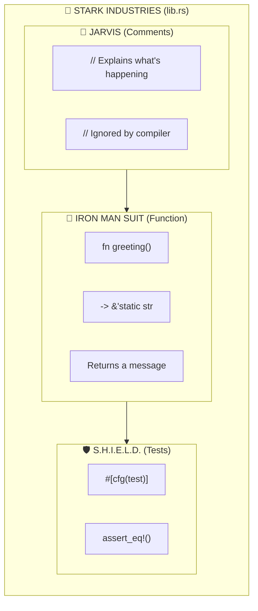
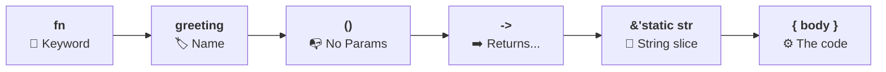
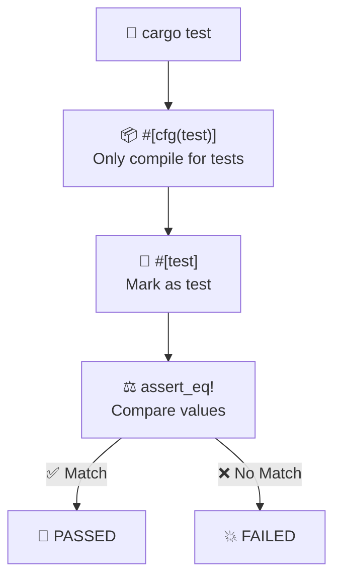
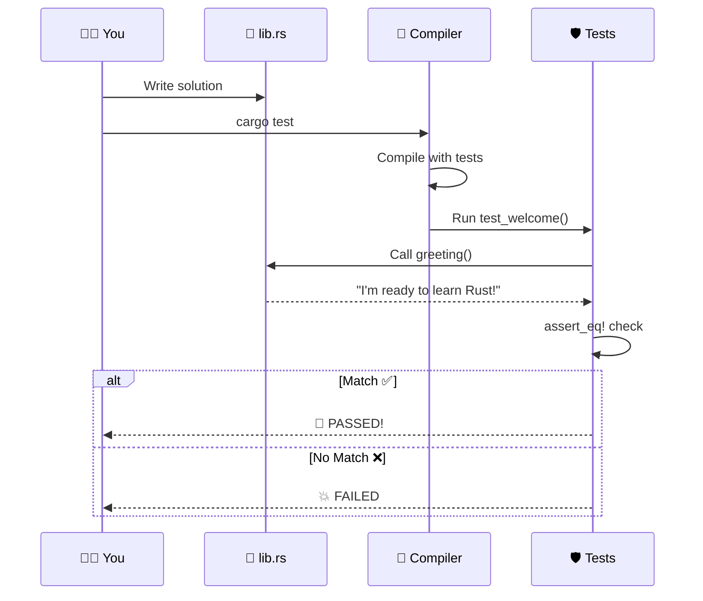
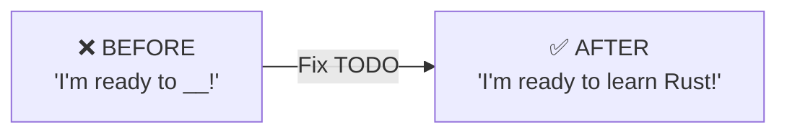

# 🦀 Rust Exercise #1: Welcome — MCU Edition

> **Exercise:** `exercises/01_intro/00_welcome`  
> **Goal:** Complete the `greeting()` function to return `"I'm ready to learn Rust!"`

---

## 🎬 The Big Picture: Your First Rust File



### 🎮 ELI10 (Explain Like I'm 10)
Imagine you're Tony Stark building your first Iron Man suit! **Comments** are like JARVIS giving you hints. The **function** is the actual suit that DOES something. The **tests** are S.H.I.E.L.D. checking if your suit works!

### 💻 ELI15 (Explain Like I'm 15)
A `.rs` file is your workshop. Comments (`//`) are documentation the compiler ignores. Functions define reusable behavior with explicit return types. The test module (`#[cfg(test)]`) only compiles during `cargo test`, verifying your implementation.

---

## 🦾 Function Anatomy: Building the Suit



### The Code

```rust
fn greeting() -> &'static str {
    // TODO: fix me 👇
    "I'm ready to learn Rust!"  // ← THE SOLUTION!
}
```

### 🎮 ELI10
A function is like a vending machine! Press the button (`greeting()`), get something back (the string). The `->` is the chute where your snack comes out!

### 💻 ELI15
`&'static str` means we return a **reference** to a string slice with a **'static lifetime**—it lives for the entire program. Rust guarantees memory safety at compile time.

---

## 🛡️ Test Flow: S.H.I.E.L.D. Verification



### The Test Code

```rust
#[cfg(test)]
mod tests {
    use crate::greeting;

    #[test]
    fn test_welcome() {
        assert_eq!(greeting(), "I'm ready to learn Rust!");
    }
}
```

### 🎮 ELI10
Tests are like getting a report card! Nick Fury checks if your answer matches the expected answer. Say it wrong? Back to training! Say it right? Welcome to the Avengers!

### 💻 ELI15
`#[cfg(test)]` is **conditional compilation**—the test module only exists in test builds. `assert_eq!` panics if values don't match, causing the test to fail.

---

## ⚡ Complete Mission Flow



---

## 🎯 The Solution



### Complete Working Code

```rust
fn greeting() -> &'static str {
    "I'm ready to learn Rust!"
}

#[cfg(test)]
mod tests {
    use crate::greeting;

    #[test]
    fn test_welcome() {
        assert_eq!(greeting(), "I'm ready to learn Rust!");
    }
}
```

---

## 📚 Key Concepts Mind Map

```mermaid
mindmap
    root((🦀 Exercise 1))
        Comments
            // single line
            Ignored by compiler
        Functions
            fn keyword
            Parameters in ()
            Return type after ->
        Types
            &'static str
            String slice reference
            Lives forever
        Testing
            #[cfg(test)]
            #[test]
            assert_eq!
```

---

> *"I am Iron Man."* — And now, YOU are ready to learn Rust! 🦀
