# 🦀 Rust Lifetimes: The Complete Mental Model

> **Context:** Understanding `&'static str` from Exercise 1  
> **MCU Analogy:** Lifetimes are like character contracts—how long an actor is signed to appear in the MCU!

---

## 🎬 What Are Lifetimes? (The Core Concept)

**Three-Word Name:** `Reference Validity Duration`

A lifetime is Rust's way of tracking **how long a reference is valid**. It prevents you from using a reference after the data it points to has been destroyed (dangling pointer).

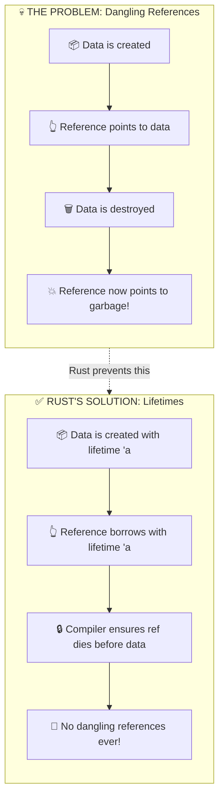

### 🎮 ELI10: The Library Book Rule
When you borrow a library book (reference), you MUST return it before the library closes (data gets destroyed). The librarian (compiler) tracks your borrowing period (lifetime) to make sure you don't keep a book from a closed library!

### 💻 ELI15: Compile-Time Borrow Tracking
Lifetimes are compile-time annotations that help the borrow checker verify that all references are valid for their entire usage scope. They have zero runtime cost—purely a static analysis tool.

---

## 📜 The `'static` Lifetime (From Exercise 1)

**Three-Word Name:** `Eternal Program Duration`

```rust
fn greeting() -> &'static str {
    "I'm ready to learn Rust!"
}
```

The `'static` lifetime means the reference is valid for the **entire duration of the program**.

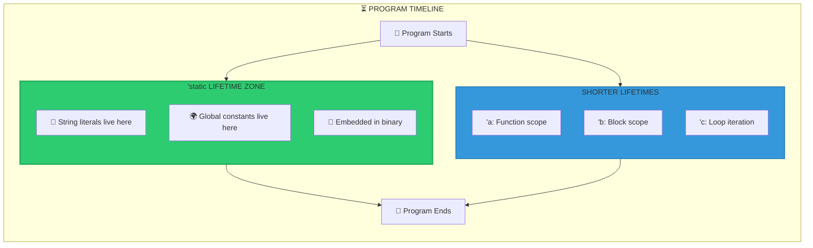

### Why String Literals Are `'static`

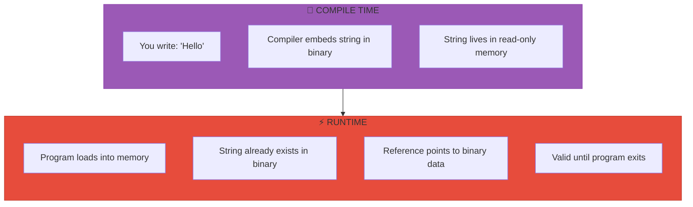

### 🎮 ELI10: The Infinity Stones
`'static` is like the Infinity Stones—they exist from the beginning of the universe (program start) until the end (program exit). String literals like `"I'm ready to learn Rust!"` are carved into the Reality Stone itself (the binary file)!

### 💻 ELI15: Binary Embedding
String literals are compiled directly into the executable's `.rodata` (read-only data) section. The reference `&'static str` points to this pre-allocated memory, which is guaranteed to exist for the entire program execution.

---

## 🎭 The Lifetime Family Tree

**Three-Word Name:** `Lifetime Scope Hierarchy`

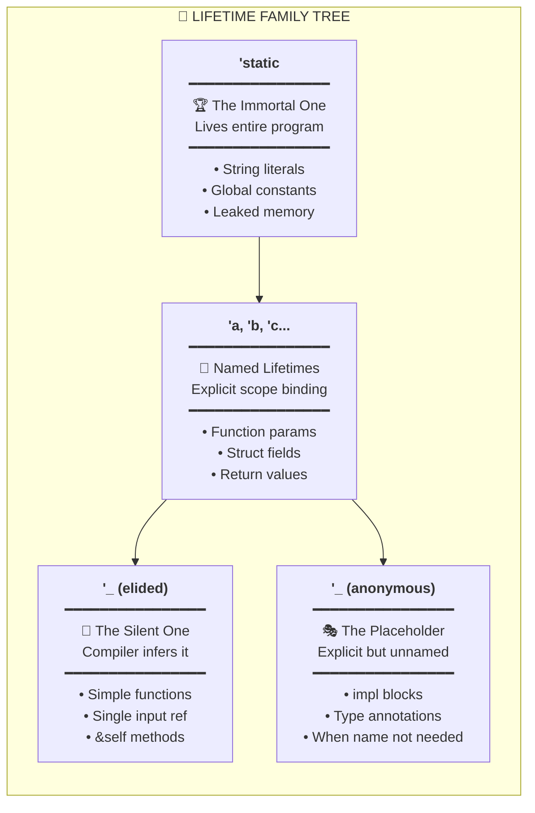

---

## 🔄 Lifetime Comparison Chart

**Three-Word Name:** `Scope Duration Comparison`

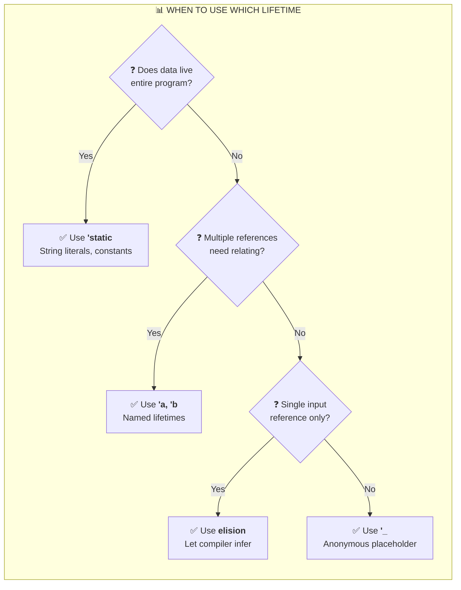

---

## 📝 Named Lifetimes Explained

**Three-Word Name:** `Explicit Scope Binding`

When you have multiple references, you need to tell Rust how they relate:

```rust
// ❌ Won't compile - Rust doesn't know which lifetime to use
fn longest(x: &str, y: &str) -> &str { ... }

// ✅ Works - We say: "output lives as long as BOTH inputs"
fn longest<'a>(x: &'a str, y: &'a str) -> &'a str { ... }
```

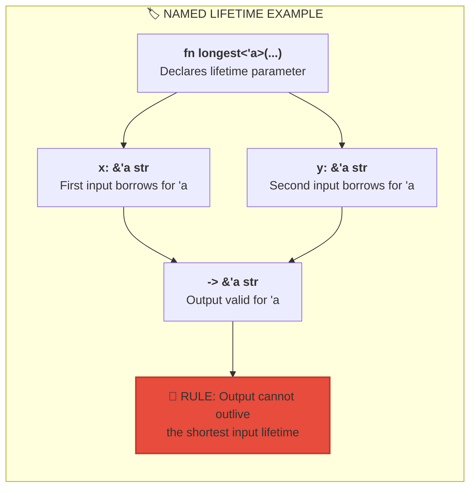

### 🎮 ELI10: The Actor Contract
Named lifetimes are like actor contracts! If Thor (`'a`) and Loki (`'a`) both sign 3-movie contracts, any scene featuring BOTH of them (`-> &'a`) can only exist within those 3 movies. The scene can't outlive either contract!

### 💻 ELI15: Lifetime Unification
When you write `'a` on multiple parameters, you're telling the compiler to find the **intersection** of their lifetimes. The output reference is constrained to this intersection—it must be valid wherever ALL inputs are valid.

---

## 🤫 Lifetime Elision Rules

**Three-Word Name:** `Automatic Inference Rules`

Rust has 3 rules that let you skip writing lifetimes in common cases:

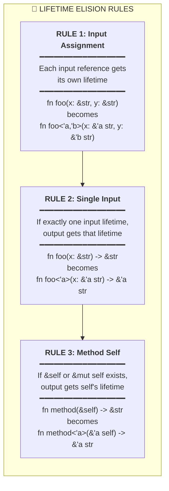

### Elision in Action

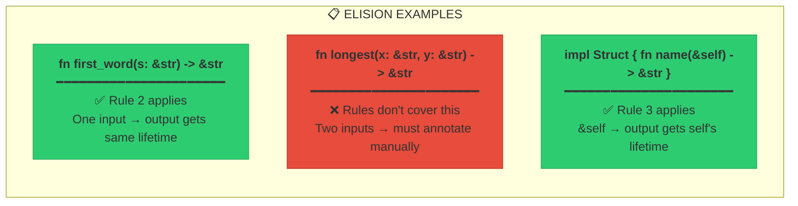

---

## 🏛️ Lifetimes in Structs

**Three-Word Name:** `Struct Reference Binding`

When a struct holds a reference, it needs a lifetime annotation:

```rust
// Struct that borrows data
struct Ticket<'a> {
    title: &'a str,      // Borrows for lifetime 'a
    description: &'a str, // Also borrows for 'a
}
```

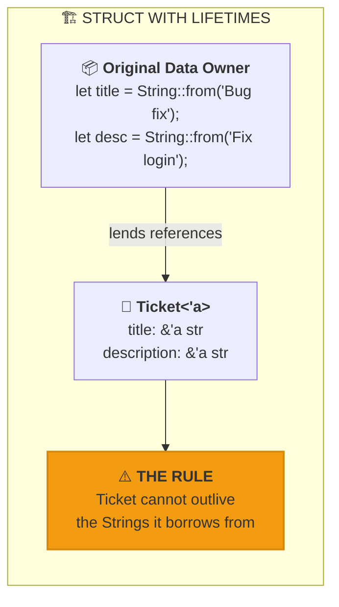

### 🎮 ELI10: The Permission Slip
A struct with lifetimes is like a field trip permission slip! The slip (`Ticket`) can only be used while the parent's signature (`String` data) is valid. Once mom tears up the original (`String` dropped), the permission slip is useless!

### 💻 ELI15: Outlives Constraint
`Ticket<'a>` can only exist while `'a` is valid. The compiler tracks this transitively—any function returning `Ticket<'a>` must ensure the borrowed data lives long enough.

---

## 🎯 `'static` vs Named: The Decision Flow

**Three-Word Name:** `Lifetime Selection Decision`

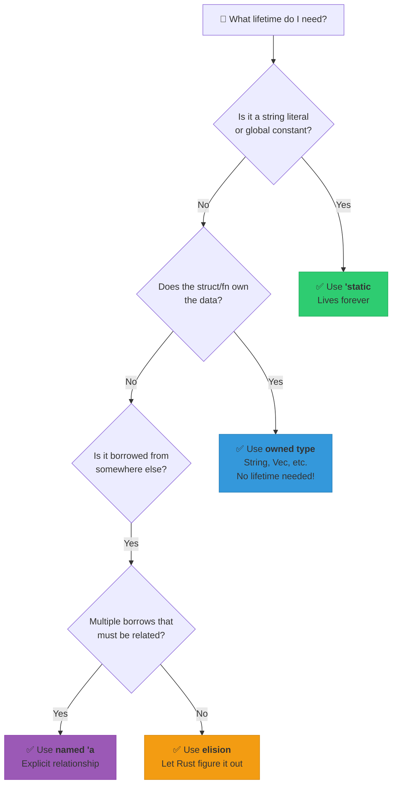

---

## 📚 Idiomatic Lifetime Patterns

**Three-Word Name:** `Best Practice Patterns`

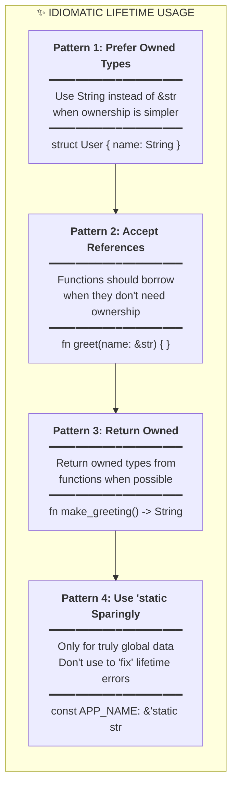

---

## 🔗 Connecting Back to Exercise 1

**Three-Word Name:** `Exercise Context Application`

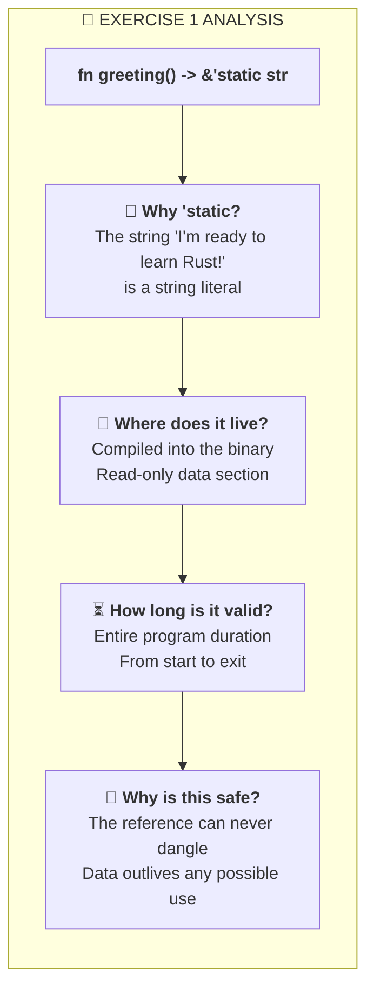

### The Full Picture

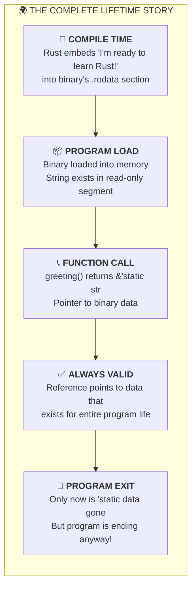

---

## 🏆 Summary: Lifetime Cheat Sheet

**Three-Word Name:** `Quick Reference Guide`

| Lifetime | Three-Word Name | When To Use | Example |
|----------|-----------------|-------------|---------|
| `'static` | Eternal Program Duration | String literals, globals | `&'static str` |
| `'a` | Explicit Scope Binding | Relating multiple refs | `fn foo<'a>(x: &'a str)` |
| `'_` | Anonymous Placeholder | Type annotations | `impl Iterator<Item = &'_ str>` |
| (elided) | Automatic Compiler Inference | Simple single-ref functions | `fn len(s: &str) -> usize` |

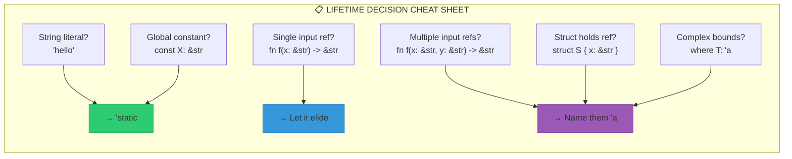

---

## 🎬 Final MCU Analogy

> **`'static`** = The Infinity Stones (exist from universe start to end)  
> **`'a`** = Actor contracts (valid for specified duration)  
> **Elision** = JARVIS auto-filling forms (compiler figures it out)  
> **Borrow Checker** = Nick Fury (ensures no one breaks the rules)

---

> *"The hardest choices require the strongest wills."*  
> — Choosing between `&str` and `String` is one of them. 🦀
