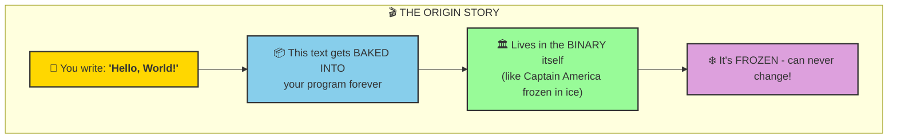
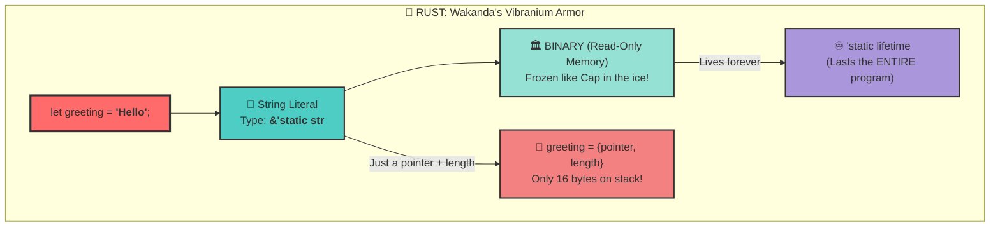
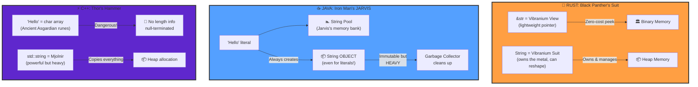
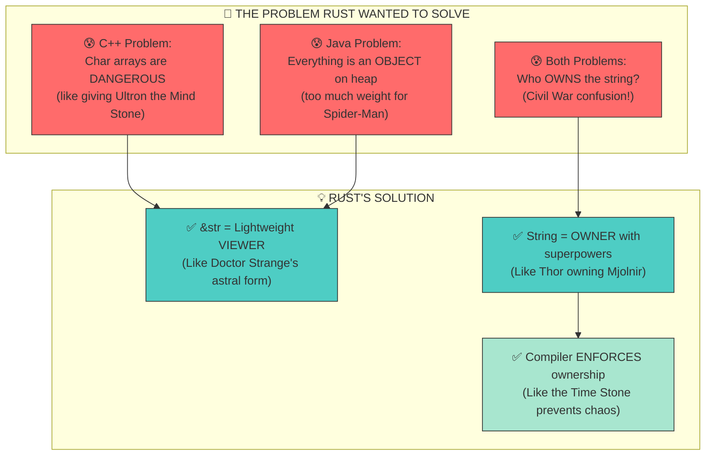
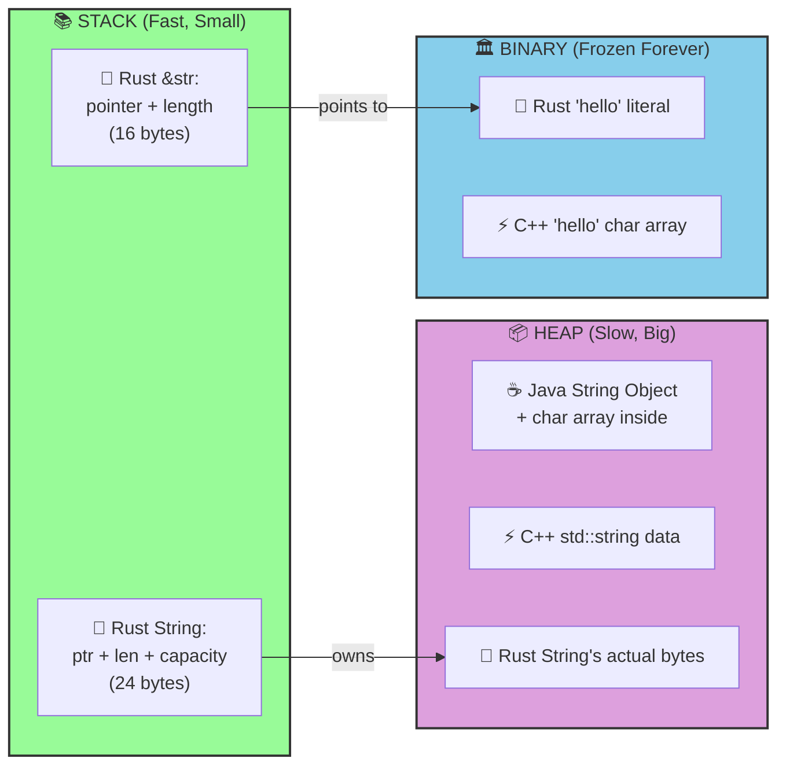
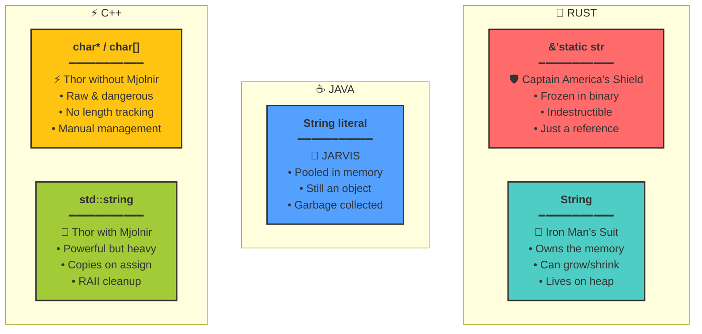
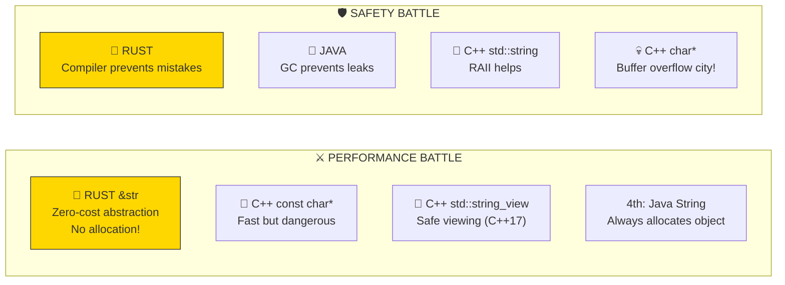

This is a fantastic creative-educational request! Since you're already building MCU-style Rust educational content, I can deliver this directly from my knowledge of Rust, Java, and C++ fundamentals. Let me create some epic Mermaid diagrams that explain string literals like you're 10 years old, Avengers-style! 🦸

---

## 🎬 The Avengers Guide to String Literals

### What IS a String Literal? (The Origin Story)

**ELI10:** Imagine you're making a comic book. The words printed on the pages are **string literals** - they're printed FOREVER and can never change. The book just points to where those words are!

---

### 🦀 Rust's String Literal: The Vibranium Approach

---

### 🆚 The Big Three: Rust vs Java vs C++

---

### 🧠 WHY Did Rust Think of This? (The Design Philosophy)

---

### 🏠 Where Do Strings LIVE? (Memory Layout)

---

### 🦸 The Avengers Analogy Summary

---

### 📊 The Battle Stats

---

## 🎓 ELI10 Summary

| Language | String Literal Is Like... | Superpower | Weakness |
|----------|--------------------------|------------|----------|
| **🦀 Rust** | Cap's Shield (frozen, just point at it) | Zero-cost, compiler protects you | Learning curve |
| **☕ Java** | JARVIS (smart but uses energy) | Easy, garbage collected | Always makes objects |
| **⚡ C++** | Thor's hammer (powerful, dangerous) | Max control | Can hurt yourself! |

**The Big Idea:** Rust said "What if we could have C++'s speed AND Java's safety?" The answer was the **ownership system** where `&str` is a *view* and `String` is an *owner*!

---

Want me to create an artifact with all these diagrams in one beautiful file, or dive deeper into any specific comparison? 🚀
