# 🦸 The Avengers Guide to Rust String Literals

> *Explain like I'm 10, with Marvel Cinematic Universe analogies*

---

## 🎬 ACT 1: What IS a String Literal?

### The Origin Story

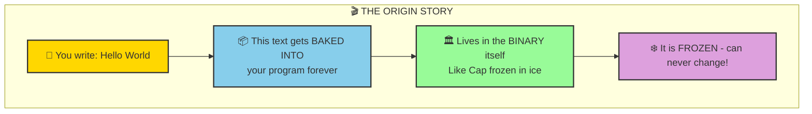

**ELI10:** Imagine you're making a comic book. The words printed on the pages are **string literals** - they're printed FOREVER and can never change. Your variable just points to where those words are!

---

## 🎬 ACT 2: Memory Layout (Where Strings Live)

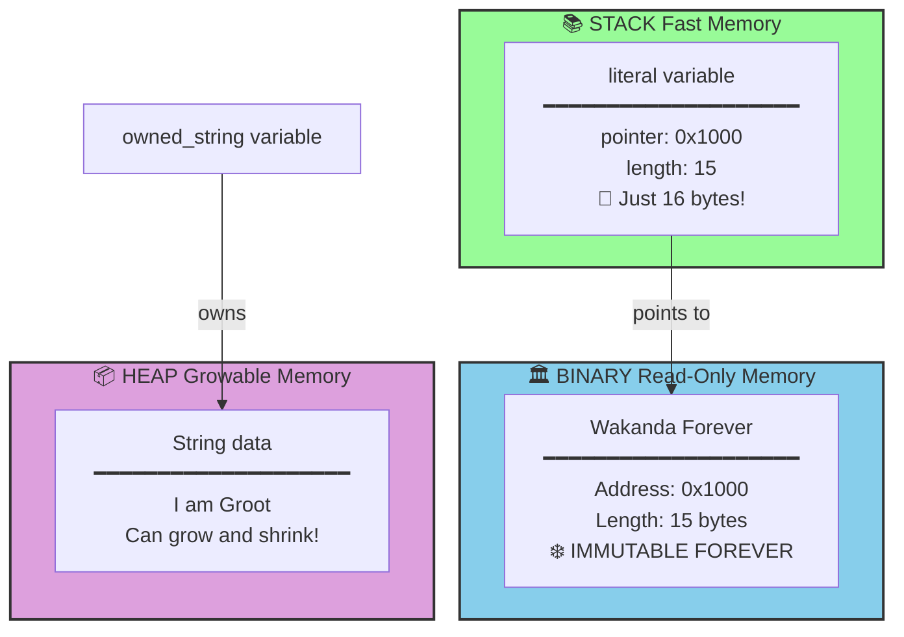

---

## 🎬 ACT 3: The Twin Powers - &str vs String

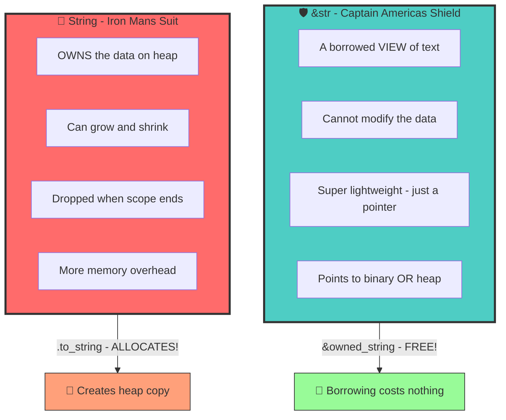

---

## 🦀 Basic String Literal Code

```rust
fn main() {
    // ═══════════════════════════════════════════════════════
    // 🧊 String literal - frozen in the binary forever!
    // ═══════════════════════════════════════════════════════
    let cap_quote: &'static str = "I can do this all day.";
    
    // 🎯 The type is usually inferred, so you can just write:
    let another_quote = "Avengers, assemble!";
    
    println!("{}", cap_quote);
    println!("{}", another_quote);
}
```

**What happens:**
- The text `"I can do this all day."` is baked into your compiled binary
- `cap_quote` is just a pointer (16 bytes) pointing to that frozen text
- The `'static` lifetime means it lives for the ENTIRE program

---

## 🦀 &str vs String in Code

```rust
fn main() {
    // ═══════════════════════════════════════════════════════
    // 🛡️ &str - Captain America's Shield (just a VIEW)
    // ═══════════════════════════════════════════════════════
    let shield: &str = "Vibranium Shield";  // Points to binary
    
    // ═══════════════════════════════════════════════════════
    // 🦾 String - Iron Man's Suit (OWNS the data)
    // ═══════════════════════════════════════════════════════
    let suit: String = String::from("Iron Man Mark 85");  // Allocates on heap
    
    // 🔄 Converting between them!
    let suit_view: &str = &suit;                    // Borrow the suit (FREE!)
    let shield_owned: String = shield.to_string(); // Clone the shield (COSTS memory!)
    
    println!("Shield: {}", shield);
    println!("Suit: {}", suit);
    println!("Suit view: {}", suit_view);
    println!("Shield owned: {}", shield_owned);
}
```

---

## 🎬 ACT 4: Escape Sequences (Doctor Strange's Portals)

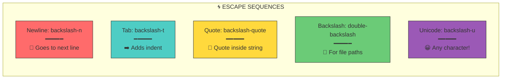

### Escape Sequences Code

```rust
fn main() {
    // 🌀 Escape sequences - like Doctor Strange's portal magic!
    
    // Newline - goes to next line
    let multiverse = "Earth-616\nEarth-838\nEarth-199999";
    
    // Tab - adds spacing  
    let roster = "Hero\tPower\tTeam";
    
    // Quote within quote (escaped with backslash)
    let thanos_quote = "Thanos said: \"I am inevitable.\"";
    
    // Backslash itself (escape the escape!)
    let path = "C:\\Avengers\\Compound";
    
    // Unicode - any character in the universe!
    let wakanda = "Wakanda Forever! \u{1F1FC}\u{1F1E6}";
    
    println!("{}", multiverse);
    println!("{}", roster);
    println!("{}", thanos_quote);
    println!("{}", path);
    println!("{}", wakanda);
}
```

**Output:**
```
Earth-616
Earth-838
Earth-199999
Hero    Power   Team
Thanos said: "I am inevitable."
C:\Avengers\Compound
Wakanda Forever! 🇼🇦
```

---

## 🎬 ACT 5: Raw Strings (Hulk Mode - No Escaping!)

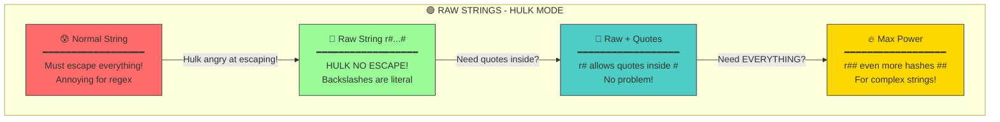

### Raw Strings Code

```rust
fn main() {
    // 🟢 RAW STRINGS - Hulk doesn't escape, he SMASHES through!
    
    // r"..." = raw string (no escape processing)
    // Perfect for regex patterns!
    let regex = r"\d{3}-\d{4}";  // No need to escape backslashes!
    
    // r#"..."# = raw string with quotes inside!
    let hulk_quote = r#"Hulk said: "SMASH!""#;
    
    // r##"..."## = even more hashes for complex strings
    let code_example = r##"
        let x = r#"nested raw string"#;
        println!("{}", x);
    "##;
    
    println!("Regex: {}", regex);
    println!("{}", hulk_quote);
    println!("Code: {}", code_example);
}
```

**Output:**
```
Regex: \d{3}-\d{4}
Hulk said: "SMASH!"
Code: 
        let x = r#"nested raw string"#;
        println!("{}", x);
```

---

## 🎬 ACT 6: Byte Strings (Rocket Raccoon's Binary Data)

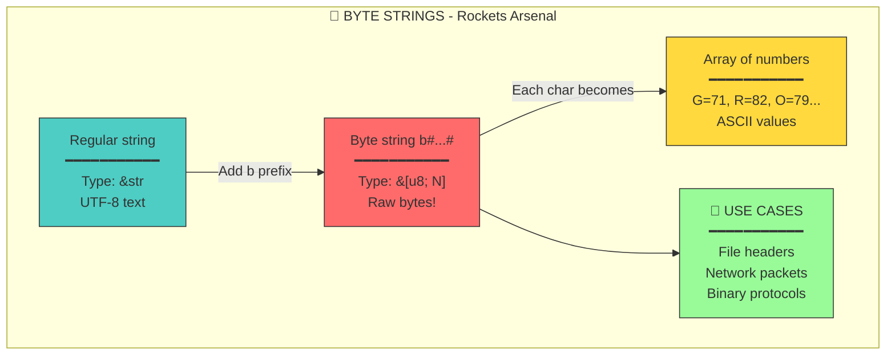

### Byte Strings Code

```rust
fn main() {
    // 🦝 BYTE STRINGS - Rocket's raw binary weapon data!
    
    // b"..." = byte string literal (array of u8 bytes)
    let binary_code: &[u8] = b"GROOT";
    
    // Each character becomes its ASCII value
    println!("Bytes: {:?}", binary_code);  // [71, 82, 79, 79, 84]
    
    // Combine with raw: br"..."
    let raw_bytes = br"\x00\x01";  // Literal backslashes, not escapes!
    
    // Useful for: file signatures, network protocols, embedded data
    let png_header: &[u8] = b"\x89PNG\r\n\x1a\n";
    
    println!("Raw bytes: {:?}", raw_bytes);
    println!("PNG header: {:?}", png_header);
}
```

**Output:**
```
Bytes: [71, 82, 79, 79, 84]
Raw bytes: [92, 120, 48, 48, 92, 120, 48, 49]
PNG header: [137, 80, 78, 71, 13, 10, 26, 10]
```

---

## 🎬 ACT 7: String Slicing (Ant-Man's Precision Cuts)

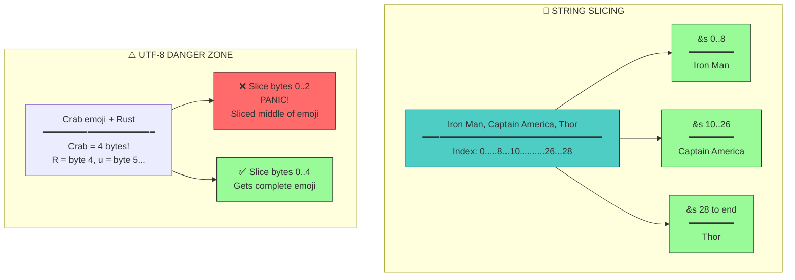

### String Slicing Code

```rust
fn main() {
    // 🐜 STRING SLICING - Ant-Man shrinks to exact portions!
    
    let avengers = "Iron Man, Captain America, Thor, Hulk";
    
    // Slice by byte indices (careful with UTF-8!)
    let iron_man: &str = &avengers[0..8];       // "Iron Man"
    let cap: &str = &avengers[10..26];          // "Captain America"
    let from_thor: &str = &avengers[28..];      // "Thor, Hulk"
    let all: &str = &avengers[..];              // Full string
    
    println!("First hero: {}", iron_man);
    println!("Second hero: {}", cap);
    println!("Rest: {}", from_thor);
    
    // ⚠️ WARNING: Can't slice in middle of UTF-8 character!
    let emoji = "🦀Rust";
    // let bad = &emoji[0..2];  // 💥 PANIC! 🦀 is 4 bytes!
    let good = &emoji[0..4];    // ✅ "🦀" (complete emoji)
    let rest = &emoji[4..];     // ✅ "Rust"
    
    println!("Emoji: {}, Rest: {}", good, rest);
}
```

**Output:**
```
First hero: Iron Man
Second hero: Captain America
Rest: Thor, Hulk
Emoji: 🦀, Rest: Rust
```

---

## 🎬 ACT 8: The Infinity Methods

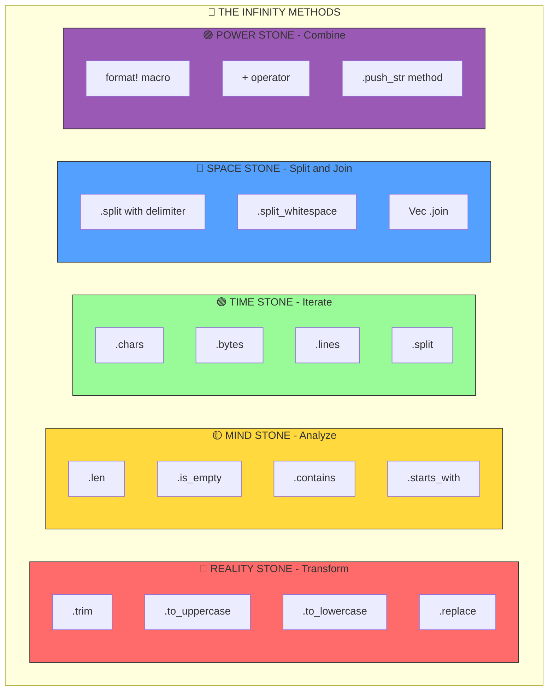

### String Methods Code

```rust
fn main() {
    let quote = "  I am Iron Man  ";
    
    // ═══════════════════════════════════════════════════════
    // 🔴 REALITY STONE - Transform the string
    // ═══════════════════════════════════════════════════════
    let trimmed = quote.trim();                     // "I am Iron Man"
    let upper = quote.to_uppercase();               // "  I AM IRON MAN  "
    let replaced = quote.replace("Iron", "Spider"); // "  I am Spider Man  "
    
    // ═══════════════════════════════════════════════════════
    // 🟡 MIND STONE - Analyze the string  
    // ═══════════════════════════════════════════════════════
    let length = quote.len();                       // 17 bytes
    let chars = quote.chars().count();              // 17 characters
    let contains_iron = quote.contains("Iron");     // true
    let starts_with_i = quote.trim().starts_with("I"); // true
    
    // ═══════════════════════════════════════════════════════
    // 🟢 TIME STONE - Iterate through time
    // ═══════════════════════════════════════════════════════
    for word in "Avengers Assemble".split_whitespace() {
        println!("Word: {}", word);
    }
    
    // ═══════════════════════════════════════════════════════
    // 🔵 SPACE STONE - Split across dimensions
    // ═══════════════════════════════════════════════════════
    let heroes: Vec<&str> = "Thor,Hulk,Widow".split(',').collect();
    
    // ═══════════════════════════════════════════════════════
    // 🟣 POWER STONE - Combine strings  
    // ═══════════════════════════════════════════════════════
    let combined = format!("{} says: {}", "Thanos", "Inevitable");
    let concatenated = String::from("Avengers") + " " + "Assemble";
    
    println!("Trimmed: '{}'", trimmed);
    println!("Upper: '{}'", upper);
    println!("Replaced: '{}'", replaced);
    println!("Length: {} bytes", length);
    println!("Contains Iron: {}", contains_iron);
    println!("Heroes: {:?}", heroes);
    println!("Combined: {}", combined);
    println!("Concatenated: {}", concatenated);
}
```

**Output:**
```
Word: Avengers
Word: Assemble
Trimmed: 'I am Iron Man'
Upper: '  I AM IRON MAN  '
Replaced: '  I am Spider Man  '
Length: 17 bytes
Contains Iron: true
Heroes: ["Thor", "Hulk", "Widow"]
Combined: Thanos says: Inevitable
Concatenated: Avengers Assemble
```

---

## 🎬 ACT 9: The Complete Memory Picture

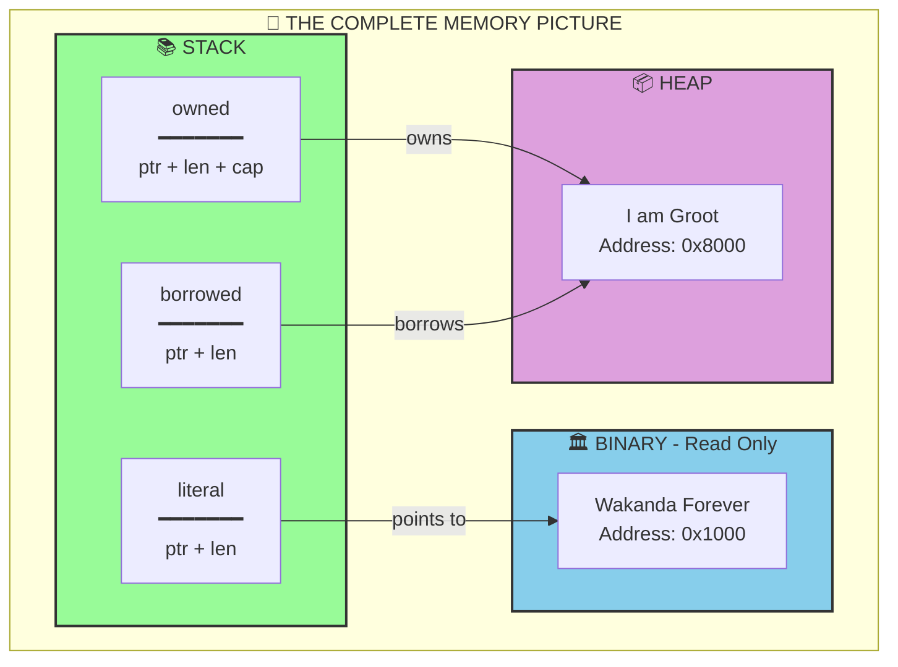

### Complete Memory Example Code

```rust
fn main() {
    // Let's see EVERYTHING in memory!
    
    // 1️⃣ String literal (lives in binary)
    let literal: &'static str = "Wakanda Forever";
    
    // 2️⃣ Owned String (lives on heap)
    let mut owned: String = String::from("I am ");
    owned.push_str("Groot");  // Can modify!
    
    // 3️⃣ Borrowed slice (points to owned)
    let borrowed: &str = &owned;
    
    // 4️⃣ Slice of literal
    let slice: &str = &literal[0..7];  // "Wakanda"
    
    // Print memory addresses (peek behind the curtain!)
    println!("Literal ptr: {:p}", literal.as_ptr());
    println!("Owned ptr: {:p}", owned.as_ptr());
    println!("Borrowed ptr: {:p}", borrowed.as_ptr());  // Same as owned!
    println!("Slice ptr: {:p}", slice.as_ptr());        // Same as literal!
    
    // See the actual values
    println!("\nLiteral: {}", literal);
    println!("Owned: {}", owned);
    println!("Borrowed: {}", borrowed);
    println!("Slice: {}", slice);
}
```

---

## 🆚 Rust vs Java vs C++ Comparison

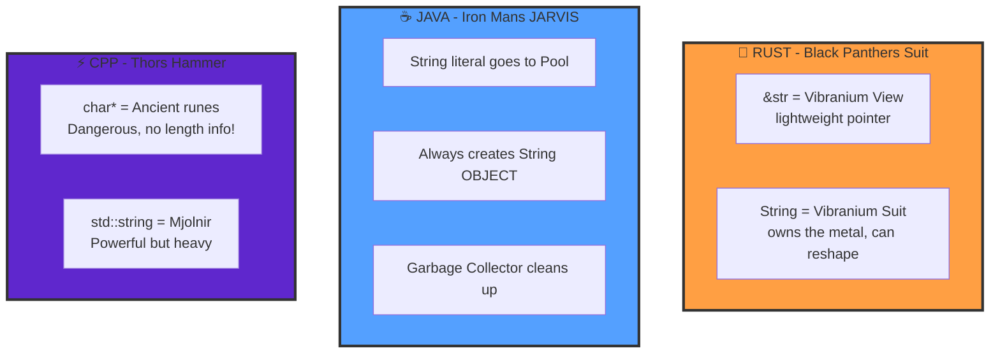

---

## 🎓 Cheat Sheet Summary

| Syntax | Type | Lives In | MCU Hero | Use For |
|--------|------|----------|----------|---------|
| `"hello"` | `&'static str` | Binary | Cap's Shield ❄️ | Constant text |
| `String::from("hi")` | `String` | Heap | Iron Man's Suit 🦾 | Mutable text |
| `&some_string` | `&str` | Points to heap | Borrowed Suit 🤝 | Reading strings |
| `r"raw\text"` | `&'static str` | Binary | Hulk Mode 💪 | Regex, paths |
| `b"bytes"` | `&[u8; N]` | Binary | Rocket's Data 🦝 | Binary data |

---

## 🏆 The Big Idea

Rust said: *"What if we could have C++'s speed AND Java's safety?"*

The answer was the **ownership system** where:
- `&str` is a *view* (like looking through a window)
- `String` is an *owner* (like owning the house)

The compiler enforces who owns what, so you get:
- ⚡ Zero-cost abstractions (as fast as C++)
- 🛡️ Memory safety (no crashes from bad pointers)
- 💪 No garbage collector overhead

---

*Excelsior!* 🦸


Excellent question! This is a **crucial distinction** that trips up many Rustaceans. Let me clarify:

## ❌ No! `&str` is NOT always a string literal!

`&str` is a **type** (string slice), not a specific value. It can point to **three different places**:

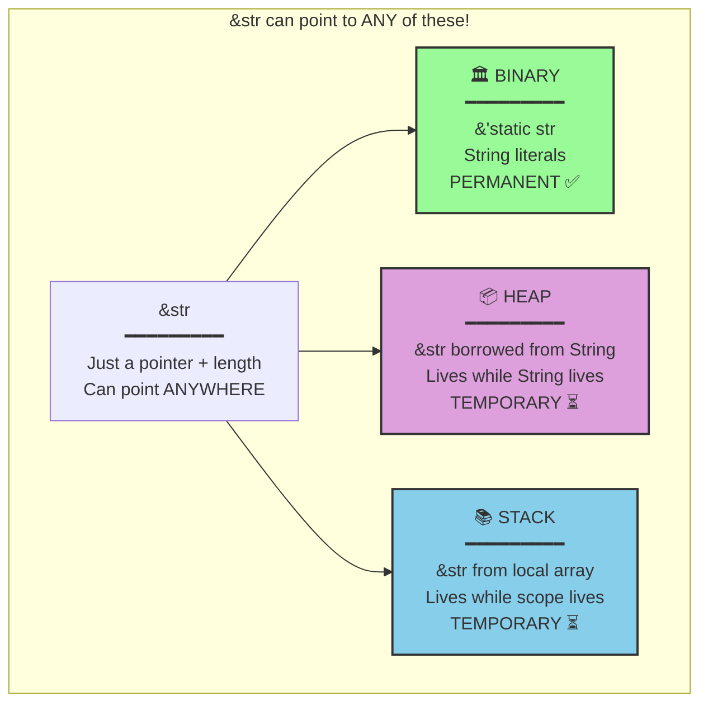

## The Key Insight

| What You Write | Type | Points To | Lifetime |
|----------------|------|-----------|----------|
| `"hello"` | `&'static str` | Binary | **FOREVER** ♾️ |
| `&my_string` | `&str` | Heap | While `my_string` lives |
| `&my_string[0..3]` | `&str` | Heap | While `my_string` lives |
| `&some_array` | `&str` | Stack | While scope lives |

## Code Example

```rust
fn main() {
    // ═══════════════════════════════════════════════════════
    // 1️⃣ STRING LITERAL → &'static str (PERMANENT)
    // ═══════════════════════════════════════════════════════
    let literal: &'static str = "I am inevitable";
    // This text is BAKED into the binary - lives forever!
    
    // ═══════════════════════════════════════════════════════
    // 2️⃣ BORROWED FROM String → &str (TEMPORARY!)
    // ═══════════════════════════════════════════════════════
    let owned: String = String::from("I am Iron Man");
    let borrowed: &str = &owned;  // Points to HEAP, not binary!
    // If `owned` is dropped, `borrowed` becomes INVALID!
    
    // ═══════════════════════════════════════════════════════
    // 3️⃣ SLICE OF String → &str (TEMPORARY!)
    // ═══════════════════════════════════════════════════════
    let slice: &str = &owned[0..4];  // "I am" - still points to heap!
    
    // Both have type &str, but different lifetimes!
    println!("Literal: {}", literal);
    println!("Borrowed: {}", borrowed);
    println!("Slice: {}", slice);
}
```

## The MCU Analogy 🦸

Think of it this way:

| Concept | MCU Analogy |
|---------|-------------|
| `&'static str` (literal) | **Captain America's Shield** - Made of vibranium, exists forever, stored in a vault (binary) |
| `&str` from `String` | **Borrowing Tony's suit** - You can use it, but Tony owns it. When Tony leaves, suit goes too! |
| `&str` (the type) | **"Borrowed equipment"** - Could be Cap's shield OR Tony's suit. The type doesn't tell you which! |

## Why This Matters

```rust
fn this_is_dangerous() -> &str {
    let owned = String::from("Temporary!");
    &owned  // ❌ COMPILER ERROR! 
    // `owned` dies at end of function, &str would point to nothing!
}

fn this_is_safe() -> &'static str {
    "Permanent!"  // ✅ OK! String literal lives forever
}
```

## Summary

```
String Literal "hello"  →  &'static str  →  ALWAYS permanent
                              ↓
                           is a type of
                              ↓
                            &str  ←  Can also come from String, slices, etc.
                              ↓
                         NOT always permanent!
```

**Bottom line:** `&'static str` (string literal) is permanent. Plain `&str` is just a borrowed view that could point anywhere - its lifetime depends on what it's borrowing from! 🦀
