# 🦀 Rust Exercise #3: Integers — Type Mismatch

> **Exercise:** `exercises/02_basic_calculator/01_integers`  
> **Goal:** Fix the type mismatch between `u32` and `u8`  
> **MCU Theme:** You can't combine Infinity Stones from different universes!

---

## 🎯 The Problem

```rust
// ❌ BROKEN - Type mismatch!
fn compute(a: u32, b: u32) -> u32 {
    let multiplier: u8 = 4;  // u8 ≠ u32
    a + b * multiplier       // 💥 Can't mix types!
}
```

```rust
// ✅ FIXED - Types match!
fn compute(a: u32, b: u32) -> u32 {
    let multiplier: u32 = 4;  // Now it's u32
    a + b * multiplier        // 🎉 Works!
}
```

---

## 🎬 Part 1: Why Types Must Match

**Three-Word Name:** `Strict Type Safety`

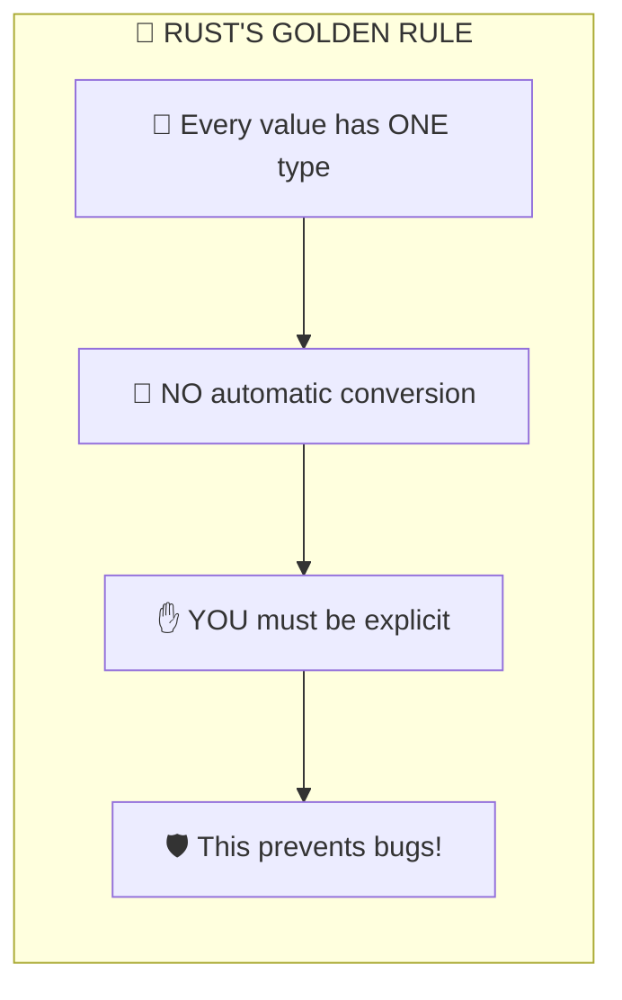
```mermaid
flowchart TB
    subgraph RUST_RULE["🦀 RUST'S GOLDEN RULE"]
        direction TB
        
        R1["🔢 Every value has ONE type"]
        R2["🚫 NO automatic conversion"]
        R3["✋ YOU must be explicit"]
        R4["🛡️ This prevents bugs!"]
        
        R1 --> R2
        R2 --> R3
        R3 --> R4
    end
```

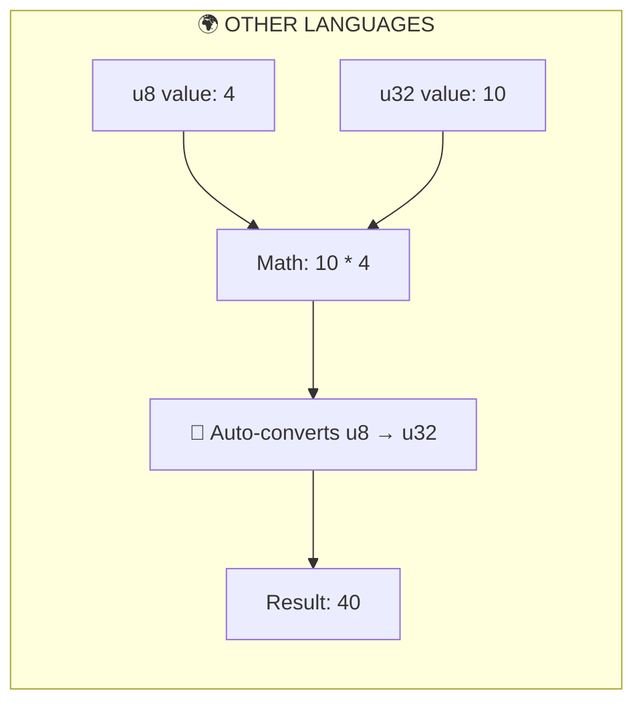
```mermaid
flowchart TB
    subgraph OTHER_LANGS["🌍 OTHER LANGUAGES"]
        direction TB
        
        O1["u8 value: 4"]
        O2["u32 value: 10"]
        O3["Math: 10 * 4"]
        O4["🤷 Auto-converts u8 → u32"]
        O5["Result: 40"]
        
        O1 --> O3
        O2 --> O3
        O3 --> O4
        O4 --> O5
    end
```

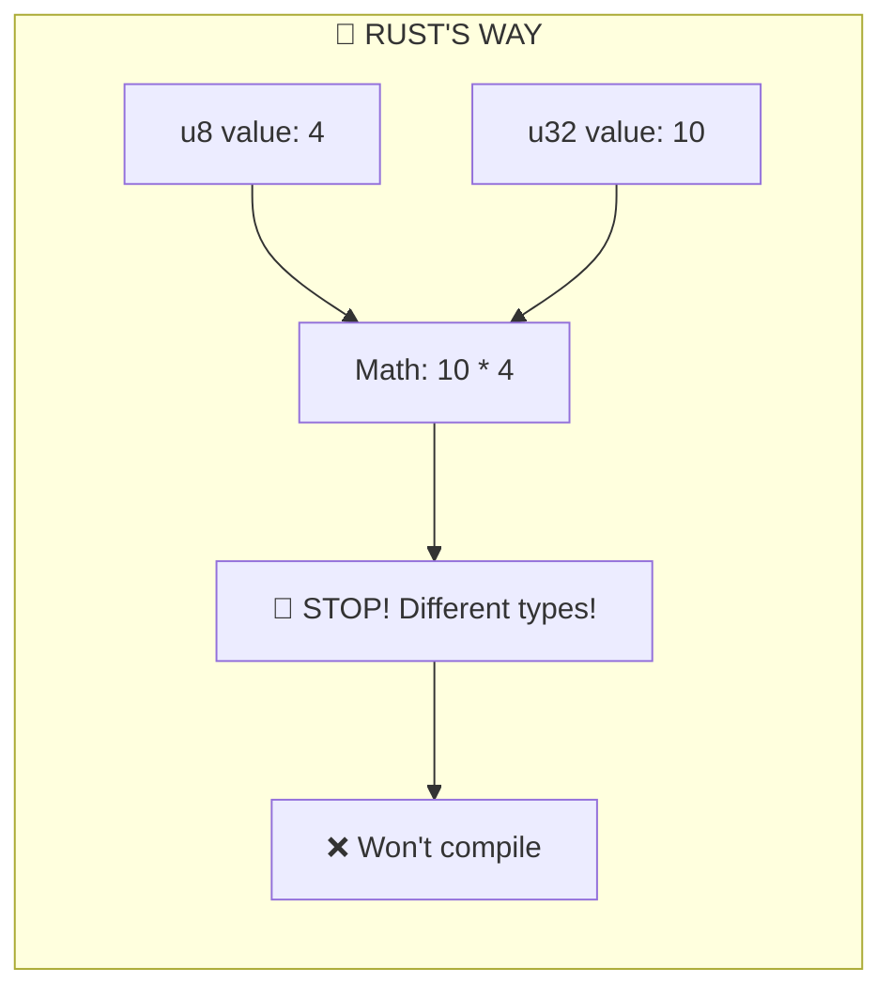
```mermaid
flowchart TB
    subgraph RUST_WAY["🦀 RUST'S WAY"]
        direction TB
        
        R1["u8 value: 4"]
        R2["u32 value: 10"]
        R3["Math: 10 * 4"]
        R4["🛑 STOP! Different types!"]
        R5["❌ Won't compile"]
        
        R1 --> R3
        R2 --> R3
        R3 --> R4
        R4 --> R5
    end
```

### 🎮 ELI5: The LEGO Rule
Imagine you have big LEGO blocks (u32) and tiny LEGO blocks (u8). You can't just stick them together! They're different sizes. You need to make them ALL the same size first!

### 🧒 ELI10: The Infinity Stones Rule
Each Infinity Stone only works in its own universe! The Space Stone from Universe-32 (u32) can't combine with the Power Stone from Universe-8 (u8). They have to be from the SAME universe to work together!

---

## 🔢 Part 2: Understanding Integer Sizes

**Three-Word Name:** `Bit Width Comparison`

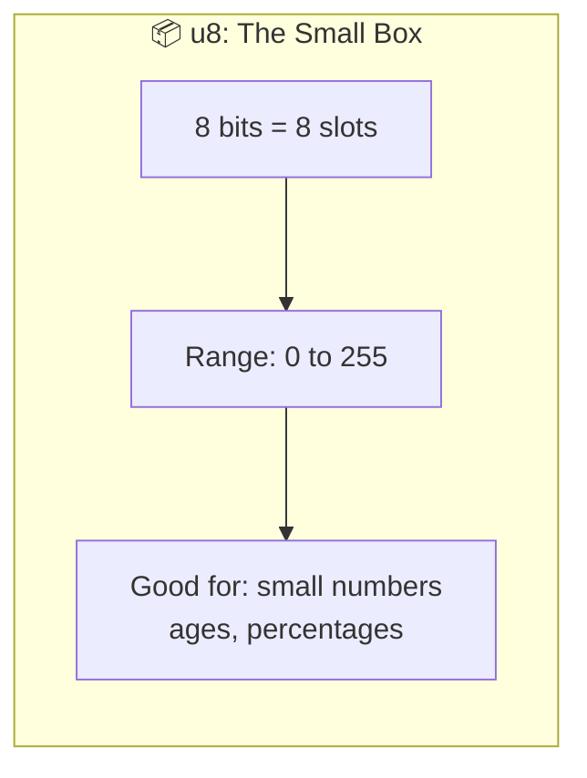
```mermaid
flowchart TB
    subgraph U8["📦 u8: The Small Box"]
        direction TB
        
        U8_BITS["8 bits = 8 slots"]
        U8_RANGE["Range: 0 to 255"]
        U8_USE["Good for: small numbers<br/>ages, percentages"]
        
        U8_BITS --> U8_RANGE
        U8_RANGE --> U8_USE
    end
```

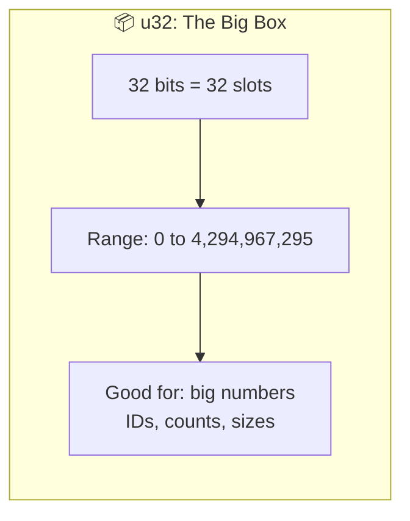
```mermaid
flowchart TB
    subgraph U32["📦 u32: The Big Box"]
        direction TB
        
        U32_BITS["32 bits = 32 slots"]
        U32_RANGE["Range: 0 to 4,294,967,295"]
        U32_USE["Good for: big numbers<br/>IDs, counts, sizes"]
        
        U32_BITS --> U32_RANGE
        U32_RANGE --> U32_USE
    end
```

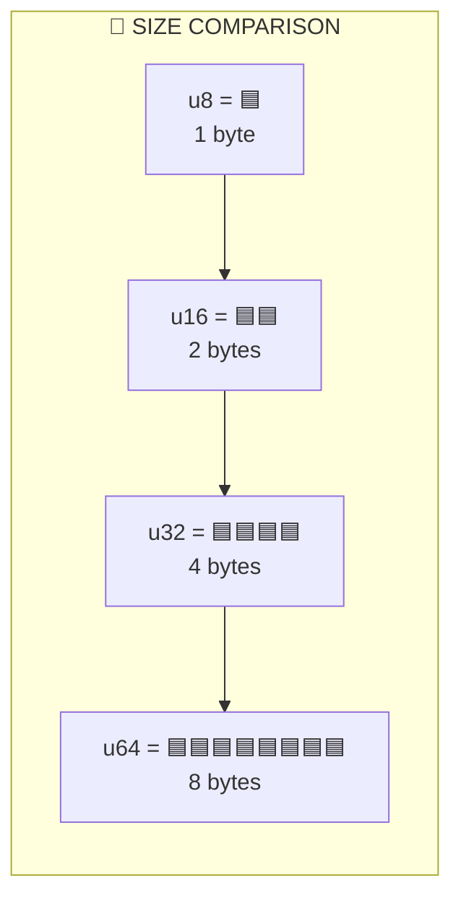
```mermaid
flowchart TB
    subgraph SIZE_COMPARE["📏 SIZE COMPARISON"]
        direction TB
        
        S1["u8  = 🟦<br/>1 byte"]
        S2["u16 = 🟦🟦<br/>2 bytes"]
        S3["u32 = 🟦🟦🟦🟦<br/>4 bytes"]
        S4["u64 = 🟦🟦🟦🟦🟦🟦🟦🟦<br/>8 bytes"]
        
        S1 --> S2
        S2 --> S3
        S3 --> S4
    end
```

### 🎮 ELI5: Backpacks!
- `u8` is a tiny backpack — fits 255 toys max
- `u32` is a HUGE backpack — fits 4 BILLION toys!

You can't just dump a big backpack into a tiny one, and you can't just mix stuff between them without being careful!

### 🧒 ELI10: Iron Man Suit Sizes
- `u8` = Mark I suit (small, limited power)
- `u32` = Mark 85 suit (huge power capacity)

JARVIS won't let you plug Mark I batteries into Mark 85 — they're incompatible sizes! You need to specifically tell him to convert.

---

## 💥 Part 3: The Error Explained

**Three-Word Name:** `Type Mismatch Error`

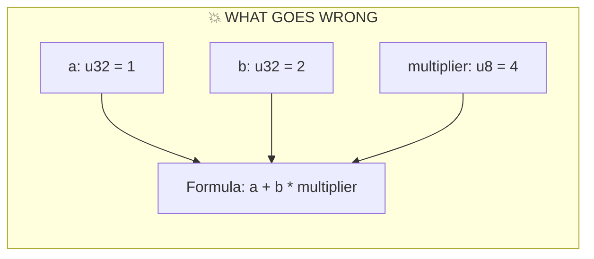
```mermaid
flowchart TB
    subgraph ERROR_FLOW["💥 WHAT GOES WRONG"]
        direction TB
        
        E1["a: u32 = 1"]
        E2["b: u32 = 2"]
        E3["multiplier: u8 = 4"]
        E4["Formula: a + b * multiplier"]
        
        E1 --> E4
        E2 --> E4
        E3 --> E4
    end
```

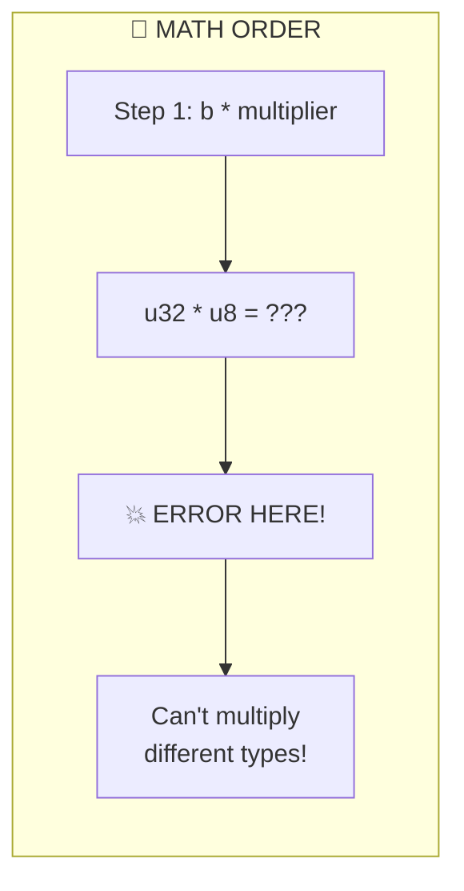
```mermaid
flowchart TB
    subgraph MATH_STEP["🧮 MATH ORDER"]
        direction TB
        
        M1["Step 1: b * multiplier"]
        M2["u32 * u8 = ???"]
        M3["💥 ERROR HERE!"]
        M4["Can't multiply<br/>different types!"]
        
        M1 --> M2
        M2 --> M3
        M3 --> M4
    end
```

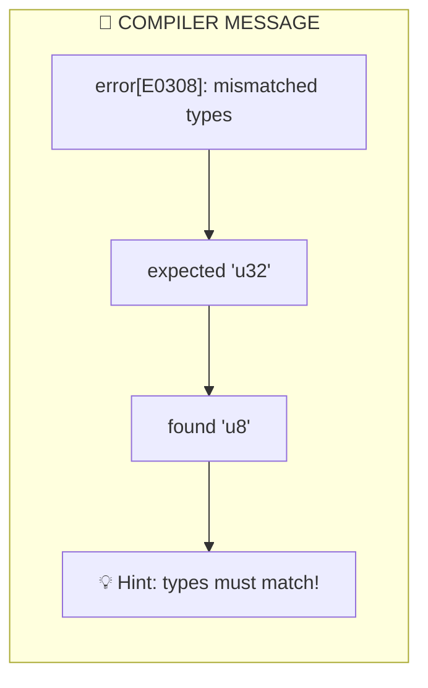
```mermaid
flowchart TB
    subgraph COMPILER["🤖 COMPILER MESSAGE"]
        direction TB
        
        C1["error[E0308]: mismatched types"]
        C2["expected 'u32'"]
        C3["found 'u8'"]
        C4["💡 Hint: types must match!"]
        
        C1 --> C2
        C2 --> C3
        C3 --> C4
    end
```

### 🎮 ELI5: The Puzzle Piece Problem
You have a square puzzle piece (u32) and a triangle puzzle piece (u8). They don't fit together! The puzzle police (compiler) says "These don't match!"

### 🧒 ELI10: The Avengers Comms System
Iron Man's suit uses 32-channel radio (u32). Ant-Man's helmet uses 8-channel radio (u8). They can't just talk directly — different frequencies! Someone needs to translate.

---

## ✅ Part 4: The Solution

**Three-Word Name:** `Match The Types`

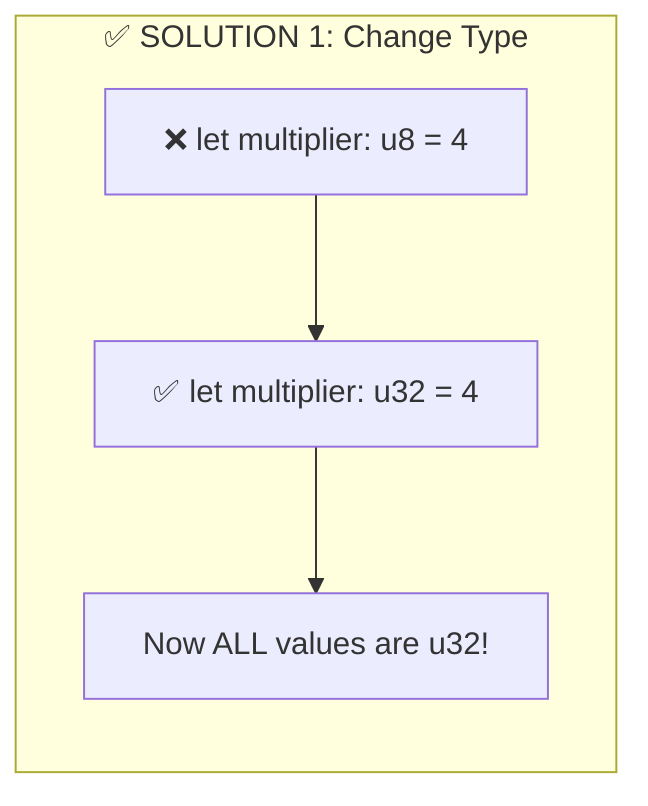
```mermaid
flowchart TB
    subgraph SOLUTION1["✅ SOLUTION 1: Change Type"]
        direction TB
        
        S1_OLD["❌ let multiplier: u8 = 4"]
        S1_NEW["✅ let multiplier: u32 = 4"]
        S1_WHY["Now ALL values are u32!"]
        
        S1_OLD --> S1_NEW
        S1_NEW --> S1_WHY
    end
```

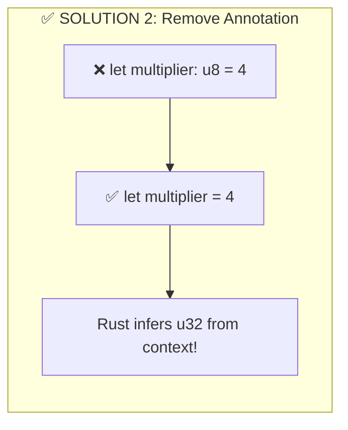
```mermaid
flowchart TB
    subgraph SOLUTION2["✅ SOLUTION 2: Remove Annotation"]
        direction TB
        
        S2_OLD["❌ let multiplier: u8 = 4"]
        S2_NEW["✅ let multiplier = 4"]
        S2_WHY["Rust infers u32 from context!"]
        
        S2_OLD --> S2_NEW
        S2_NEW --> S2_WHY
    end
```

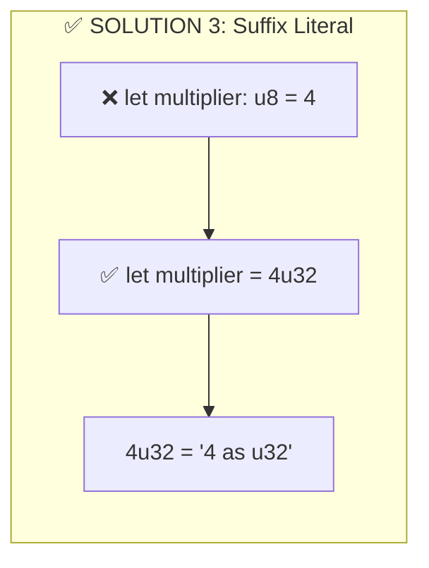
```mermaid
flowchart TB
    subgraph SOLUTION3["✅ SOLUTION 3: Suffix Literal"]
        direction TB
        
        S3_OLD["❌ let multiplier: u8 = 4"]
        S3_NEW["✅ let multiplier = 4u32"]
        S3_WHY["4u32 = '4 as u32'"]
        
        S3_OLD --> S3_NEW
        S3_NEW --> S3_WHY
    end
```

### All Three Solutions Work!

```rust
// Solution 1: Explicit type annotation
let multiplier: u32 = 4;

// Solution 2: Let Rust infer (sees u32 * ?, infers u32)
let multiplier = 4;

// Solution 3: Type suffix on literal
let multiplier = 4u32;
```

---

## 🔄 Part 5: The Complete Flow

**Three-Word Name:** `Fixed Computation Flow`

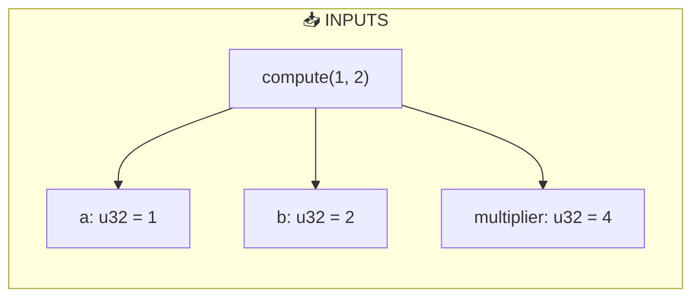
```mermaid
flowchart TB
    subgraph INPUT["📥 INPUTS"]
        direction TB
        
        I1["compute(1, 2)"]
        I2["a: u32 = 1"]
        I3["b: u32 = 2"]
        I4["multiplier: u32 = 4"]
        
        I1 --> I2
        I1 --> I3
        I1 --> I4
    end
```

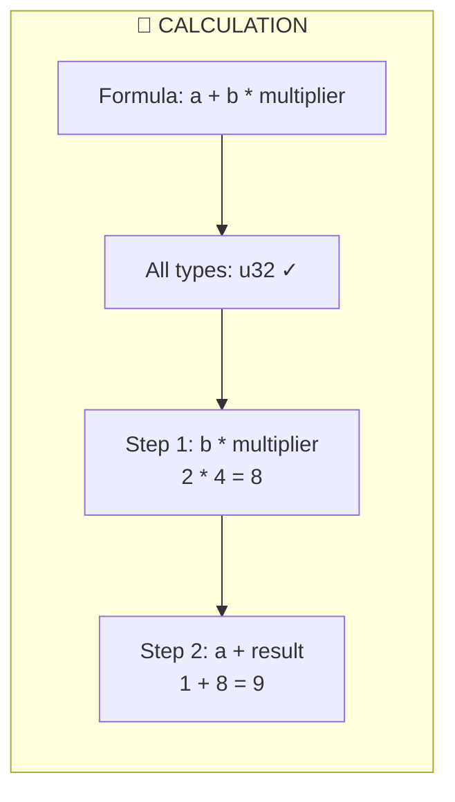
```mermaid
flowchart TB
    subgraph CALC["🧮 CALCULATION"]
        direction TB
        
        C1["Formula: a + b * multiplier"]
        C2["All types: u32 ✓"]
        C3["Step 1: b * multiplier<br/>2 * 4 = 8"]
        C4["Step 2: a + result<br/>1 + 8 = 9"]
        
        C1 --> C2
        C2 --> C3
        C3 --> C4
    end
```

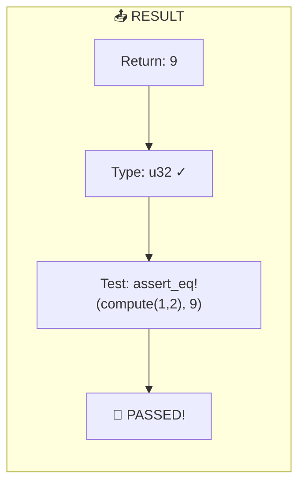
```mermaid
flowchart TB
    subgraph OUTPUT["📤 RESULT"]
        direction TB
        
        O1["Return: 9"]
        O2["Type: u32 ✓"]
        O3["Test: assert_eq!(compute(1,2), 9)"]
        O4["🎉 PASSED!"]
        
        O1 --> O2
        O2 --> O3
        O3 --> O4
    end
```

---

## 📚 Part 6: Integer Type Reference

**Three-Word Name:** `Integer Family Chart`

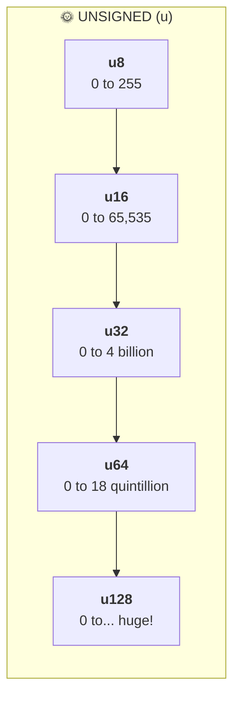
```mermaid
flowchart TB
    subgraph UNSIGNED["🌞 UNSIGNED (u)"]
        direction TB
        
        U1["<b>u8</b><br/>0 to 255"]
        U2["<b>u16</b><br/>0 to 65,535"]
        U3["<b>u32</b><br/>0 to 4 billion"]
        U4["<b>u64</b><br/>0 to 18 quintillion"]
        U5["<b>u128</b><br/>0 to... huge!"]
        
        U1 --> U2
        U2 --> U3
        U3 --> U4
        U4 --> U5
    end
```

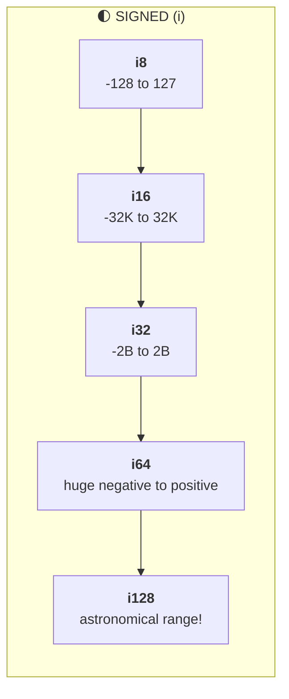
```mermaid
flowchart TB
    subgraph SIGNED["🌓 SIGNED (i)"]
        direction TB
        
        I1["<b>i8</b><br/>-128 to 127"]
        I2["<b>i16</b><br/>-32K to 32K"]
        I3["<b>i32</b><br/>-2B to 2B"]
        I4["<b>i64</b><br/>huge negative to positive"]
        I5["<b>i128</b><br/>astronomical range!"]
        
        I1 --> I2
        I2 --> I3
        I3 --> I4
        I4 --> I5
    end
```

### Quick Memory Size Reference

| Type | Bytes | Bits | Max Value (unsigned) |
|------|-------|------|---------------------|
| u8   | 1     | 8    | 255                 |
| u16  | 2     | 16   | 65,535              |
| u32  | 4     | 32   | 4,294,967,295       |
| u64  | 8     | 64   | 18+ quintillion     |

---

## 🎯 Part 7: Why Rust Is Strict

**Three-Word Name:** `Safety Over Convenience`

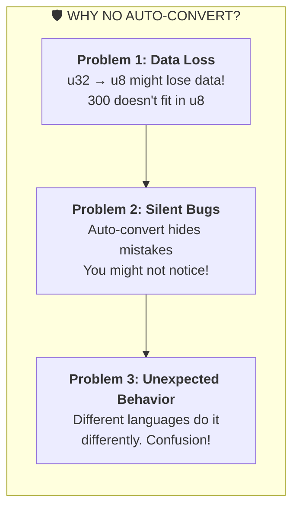
```mermaid
flowchart TB
    subgraph WHY_STRICT["🛡️ WHY NO AUTO-CONVERT?"]
        direction TB
        
        W1["<b>Problem 1: Data Loss</b><br/>u32 → u8 might lose data!<br/>300 doesn't fit in u8"]
        
        W2["<b>Problem 2: Silent Bugs</b><br/>Auto-convert hides mistakes<br/>You might not notice!"]
        
        W3["<b>Problem 3: Unexpected Behavior</b><br/>Different languages do it<br/>differently. Confusion!"]
        
        W1 --> W2
        W2 --> W3
    end
```

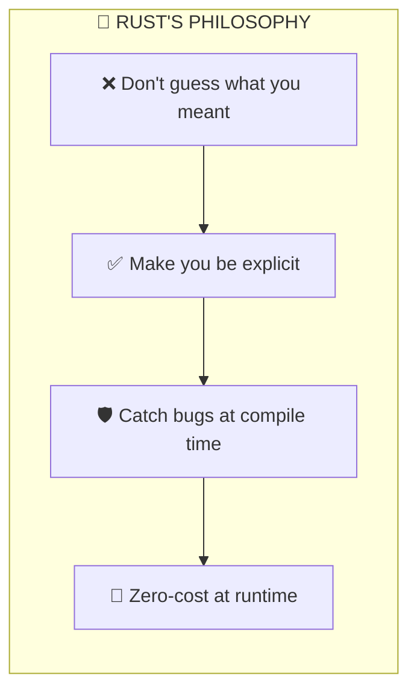
```mermaid
flowchart TB
    subgraph RUST_PHILOSOPHY["🦀 RUST'S PHILOSOPHY"]
        direction TB
        
        P1["❌ Don't guess what you meant"]
        P2["✅ Make you be explicit"]
        P3["🛡️ Catch bugs at compile time"]
        P4["🚀 Zero-cost at runtime"]
        
        P1 --> P2
        P2 --> P3
        P3 --> P4
    end
```

### 🎮 ELI5: The Safety Helmet Rule
Mom says you MUST wear a helmet when biking. It's annoying, but it keeps you safe! Rust makes you say exactly what type you want — it's annoying sometimes, but it stops you from getting hurt (bugs)!

### 🧒 ELI10: The S.H.I.E.L.D. Protocol
Nick Fury doesn't allow "probably fine" — everything must be VERIFIED. When you mix types, Rust says "Are you SURE? Show me explicitly." This catches bugs BEFORE they become Ultron-level disasters!

---

## 📝 Part 8: Complete Solution

**Three-Word Name:** `Final Working Code`

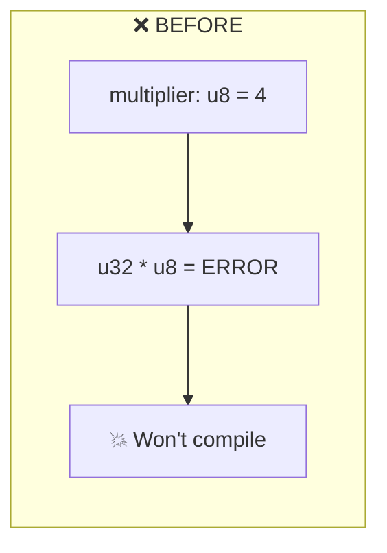
```mermaid
flowchart TB
    subgraph BEFORE["❌ BEFORE"]
        direction TB
        B1["multiplier: u8 = 4"]
        B2["u32 * u8 = ERROR"]
        B3["💥 Won't compile"]
        
        B1 --> B2
        B2 --> B3
    end
```

```mermaid
flowchart TB
    subgraph AFTER["✅ AFTER"]
        direction TB
        A1["multiplier: u32 = 4"]
        A2["u32 * u32 = u32"]
        A3["🎉 Compiles & passes!"]
        
        A1 --> A2
        A2 --> A3
    end
```

### The Complete Working Code

```rust
fn compute(a: u32, b: u32) -> u32 {
    let multiplier: u32 = 4;  // Changed from u8 to u32
    a + b * multiplier
}

#[cfg(test)]
mod tests {
    use crate::compute;

    #[test]
    fn case() {
        assert_eq!(compute(1, 2), 9);
        // 1 + 2 * 4 = 1 + 8 = 9 ✓
    }
}
```

---

## 🏆 Part 9: Key Takeaways

**Three-Word Name:** `Core Learning Summary`

```mermaid
flowchart TB
    subgraph LESSONS["📚 WHAT YOU LEARNED"]
        direction TB
        
        L1["<b>1. Types Must Match</b><br/>Can't mix u8 with u32<br/>in arithmetic"]
        
        L2["<b>2. No Auto-Conversion</b><br/>Rust never guesses<br/>You must be explicit"]
        
        L3["<b>3. Compiler Helps</b><br/>Error messages tell you<br/>exactly what's wrong"]
        
        L4["<b>4. Multiple Solutions</b><br/>Change type annotation<br/>Or let Rust infer"]
        
        L1 --> L2
        L2 --> L3
        L3 --> L4
    end
```

```mermaid
flowchart TB
    subgraph REMEMBER["🧠 REMEMBER"]
        direction TB
        
        R1["u = unsigned (no negatives)"]
        R2["i = signed (has negatives)"]
        R3["8/16/32/64 = bit width"]
        R4["Bigger bits = bigger numbers"]
        
        R1 --> R2
        R2 --> R3
        R3 --> R4
    end
```

---

## 🎬 Final MCU Wisdom

> **Types must match** — Infinity Stones from different universes don't combine!  
> **Rust is strict** — Nick Fury doesn't accept "probably fine"  
> **Compiler is helpful** — JARVIS tells you exactly what to fix  
> **Explicit is better** — No surprises, no hidden bugs!

---

> *"The hardest choices require the strongest wills... and the correct types."*  
> — Thanos, if he programmed in Rust 🦀

### Quick Fix Cheat Sheet

| Problem | Solution |
|---------|----------|
| `let x: u8 = 4` mixed with `u32` | Change to `let x: u32 = 4` |
| Don't know what type? | Remove annotation, let Rust infer |
| Want explicit literal? | Use suffix: `4u32`, `100i64` |
