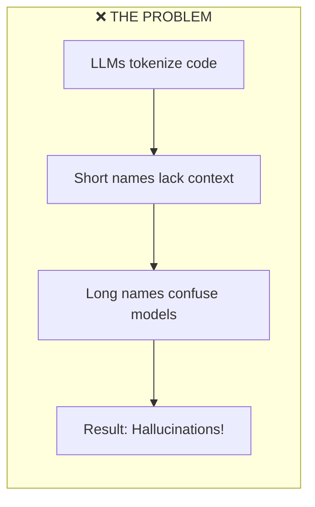
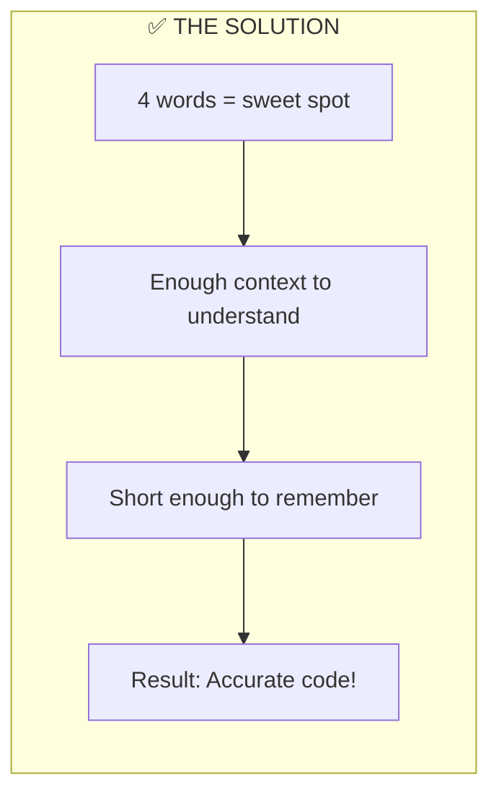
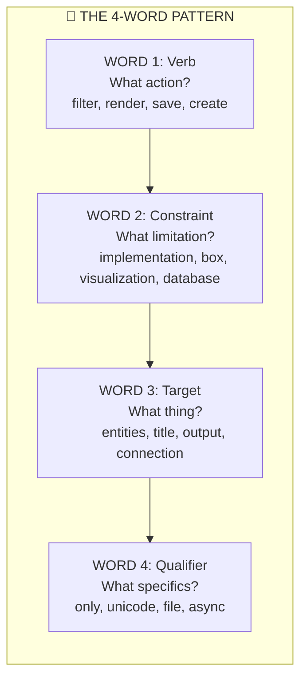
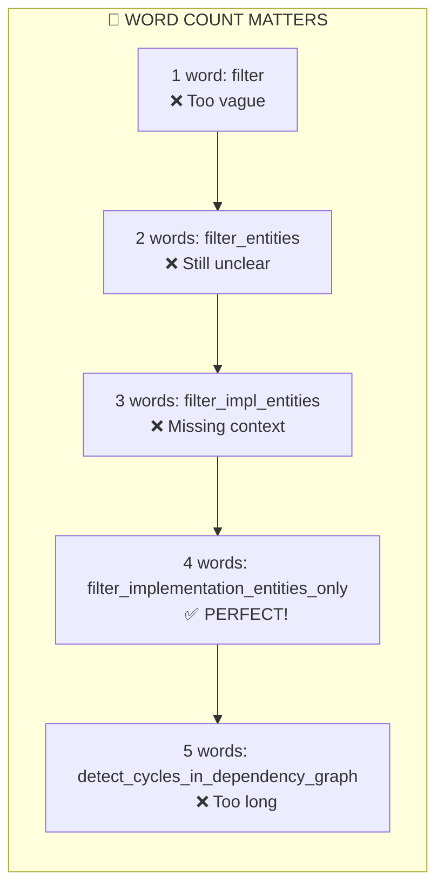
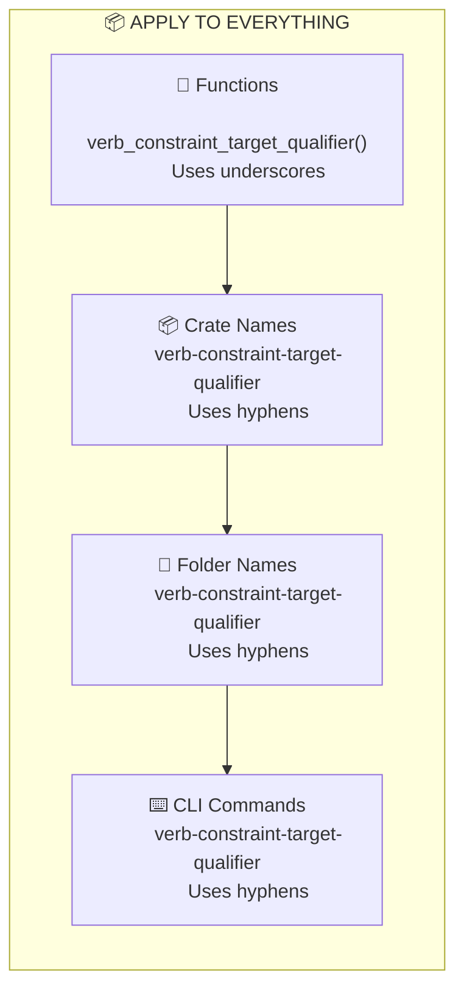
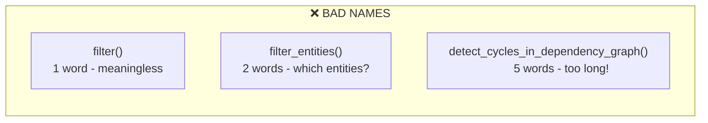
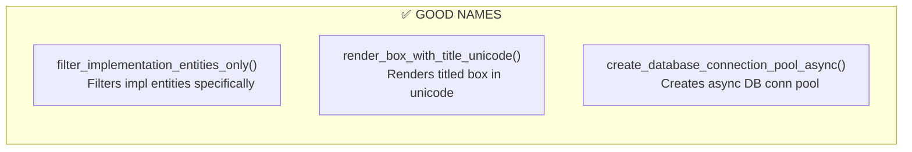
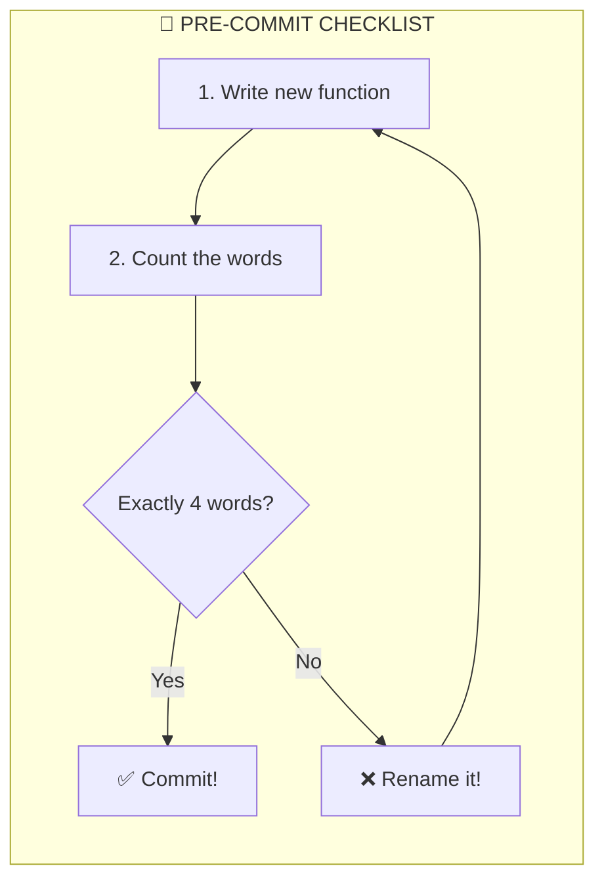
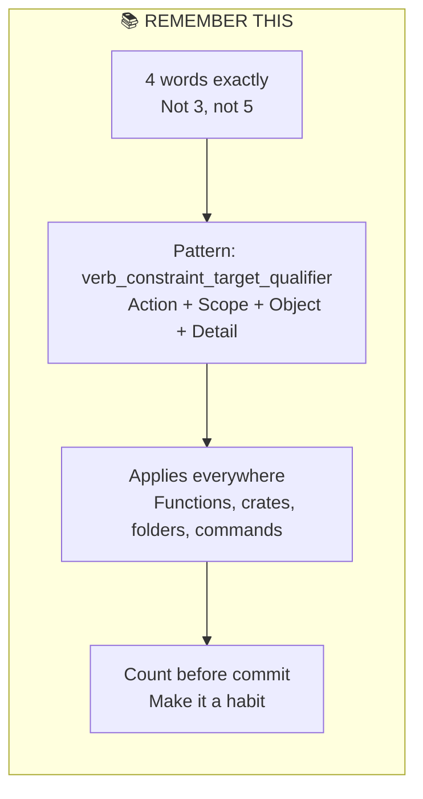

# 🏷️ Four-Word Naming Convention: LLM-Optimized Identifiers

> **Source:** Design101: TDD-First Architecture Principles  
> **Concept:** Four-Word Naming Convention for Functions, Crates, Folders, Commands  
> **MCU Theme:** Every Avenger needs a proper callsign — not too short, not too long!

---

## 🎯 The Problem & Solution

```rust
// ❌ BAD - Too vague, too short
fn filter() { }
fn filter_entities() { }

// ❌ BAD - Too long, hard to parse
fn detect_cycles_in_dependency_graph() { }

// ✅ GOOD - Exactly 4 words
fn filter_implementation_entities_only() { }
fn render_box_with_title_unicode() { }
fn save_visualization_output_to_file() { }
```

---

## 🎬 Part 1: Why Exactly Four Words?

**Three-Word Name:** `Optimal Semantic Density`





### 🎮 ELI5: The Goldilocks Rule
Imagine naming your teddy bear. "Bear" is too short — which bear? "My-Brown-Fluffy-Teddy-Bear-From-Grandma" is too long! But "Brown Fluffy Teddy Bear" is just right — exactly 4 words, and everyone knows which bear you mean!

### 🧒 ELI10: The Avengers Callsign System
Nick Fury doesn't call Tony just "Man" (too vague) or "Anthony-Edward-Stark-Iron-Man-Genius" (too long). He calls him "Iron Man Stark Tony" — 4 words that tell you WHO (Tony), WHAT (Iron Man), and make it memorable. That's how computers need to read your code!

---

## 🔧 Part 2: The Four-Word Pattern

**Three-Word Name:** `Verb Constraint Target Qualifier`



### Pattern Formula

```
verb_constraint_target_qualifier()
```

| Position | Role | Question | Examples |
|----------|------|----------|----------|
| Word 1 | **Verb** | What action? | filter, render, save, create, parse |
| Word 2 | **Constraint** | What scope/limit? | implementation, box, database, user |
| Word 3 | **Target** | What object? | entities, title, output, connection |
| Word 4 | **Qualifier** | What specifics? | only, unicode, async, pool |

---

## 📏 Part 3: Counting Words — The Rule

**Three-Word Name:** `Exact Word Count`



### 🎮 ELI5: The Pizza Order
When you order pizza:
- "Pizza" — They don't know what kind! ❌
- "Cheese pizza" — Still missing info ❌
- "Large cheese pizza" — Almost! ❌
- "Large cheese pizza delivered" — Perfect! ✅
- "Large cheese pizza delivered to my house on Oak Street" — Too much! ❌

4 words = just enough info!

### 🧒 ELI10: The S.H.I.E.L.D. Mission Code
S.H.I.E.L.D. mission names are always 4 words:
- "Retrieve" — Retrieve what? Where? ❌
- "Avengers Assemble" — Still vague ❌  
- "Avengers Assemble New York" — Missing action type ❌
- "Execute Avengers Assembly Protocol" — ✅ Perfect!
- "Execute Emergency Avengers Team Assembly Protocol" — Too long, confusing ❌

---

## 🎯 Part 4: Where To Apply This

**Three-Word Name:** `Universal Naming Scope`



### Separator Rules

| Context | Separator | Example |
|---------|-----------|---------|
| Functions | `_` underscore | `save_visualization_output_file()` |
| Crates | `-` hyphen | `parse-markdown-ast-nodes` |
| Folders | `-` hyphen | `user-auth-token-service/` |
| Commands | `-` hyphen | `generate-schema-types-rust` |

---

## ✅ Part 5: Good vs Bad Examples

**Three-Word Name:** `Naming Quality Examples`





### Side-by-Side Comparison

| ❌ Bad | Word Count | ✅ Good | Word Count |
|--------|------------|---------|------------|
| `filter()` | 1 | `filter_implementation_entities_only()` | 4 |
| `render()` | 1 | `render_box_with_title_unicode()` | 4 |
| `save()` | 1 | `save_visualization_output_to_file()` | 4 |
| `create_db_conn()` | 3 | `create_database_connection_pool_async()` | 4 |
| `detect_cycles_in_dependency_graph()` | 5 | `detect_dependency_graph_cycles()` | 4 |

---

## 🔄 Part 6: The Pre-Commit Ritual

**Three-Word Name:** `Naming Verification Ritual`



### Quick Word Count Check

```rust
// Count the underscores, add 1 = word count
fn save_visualization_output_file() 
//    1          2          3     4  = 4 words ✅

fn filter_entities()
//    1      2     = 2 words ❌ (need 2 more!)

fn detect_cycles_in_dependency_graph()
//    1      2    3      4       5   = 5 words ❌ (1 too many!)
```

### 🎮 ELI5: The Finger Counting Game
Before you save your work, count on your fingers:
1. "save" — one finger
2. "visualization" — two fingers  
3. "output" — three fingers
4. "file" — four fingers

Four fingers = you're done! More or less = try again!

### 🧒 ELI10: The JARVIS Verification
Before Tony deploys code, JARVIS runs a check:
> "Sir, function `filter()` has only 1 word. I need 4 words to understand what you want. Please rename to `filter_implementation_entities_only()` — that's verb, constraint, target, qualifier."

Make JARVIS (your linter) happy!

---

## 🏆 Part 7: Key Takeaways

**Three-Word Name:** `Core Naming Principles`



---

## 🎬 Final MCU Wisdom

> **Why 4 words?** — LLMs tokenize code. 4 words = optimal semantic density. Not too vague, not too verbose.

> **The pattern** — `verb_constraint_target_qualifier()` tells the WHAT, WHERE, and HOW in exactly 4 chunks.

> **Apply everywhere** — Functions (underscores), crates/folders/commands (hyphens).

> **Pre-commit ritual** — Count words. Not 4? Rename it!

---

> *"I am Iron Man Stark Tony. Four words. Perfectly balanced, as all naming conventions should be."*  
> — Thanos, if he reviewed your PR 🦀

---

## Quick Reference Card

```
✅ GOOD (4 words):
filter_implementation_entities_only()
render_box_with_title_unicode()
save_visualization_output_file()
create_database_connection_async()
parse_markdown_content_nodes()

❌ BAD (not 4 words):
filter()                              // 1 word
filter_entities()                     // 2 words
save_output()                         // 2 words
detect_cycles_in_dependency_graph()   // 5 words
```
