# 📜 Executable Specifications Over Narratives: Contract-Driven Development

> **Source:** Design101: TDD-First Architecture Principles  
> **Concept:** Transform vague user stories into executable contracts with preconditions, postconditions, and error conditions  
> **MCU Theme:** The Sokovia Accords — vague promises vs legally binding contracts!

---

## 🎯 The Problem & Solution

```rust
// ❌ BAD: Vague user story
// "As a user, I want to send messages"

// ✅ GOOD: Executable specification with contracts
/// # Preconditions
/// - User authenticated with room access
/// - Content: 1-10000 chars, sanitized HTML
/// 
/// # Postconditions  
/// - Returns Ok(Message<Persisted>) on success
/// - Inserts row into 'messages' table
/// 
/// # Error Conditions
/// - MessageError::Authorization if user lacks access
pub async fn create_message_with_deduplication(
    &self,
    content: String,
    room_id: RoomId,
) -> Result<Message<Persisted>, MessageError>;
```

---

## 🎬 Part 1: Why User Stories Fail LLMs

**Three-Word Name:** `Ambiguity Causes Hallucination`

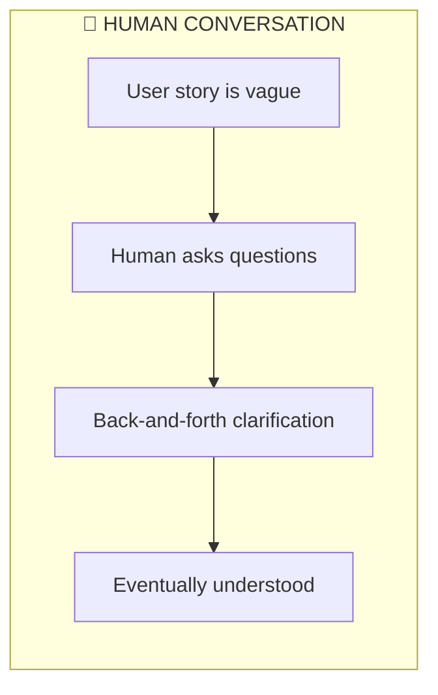

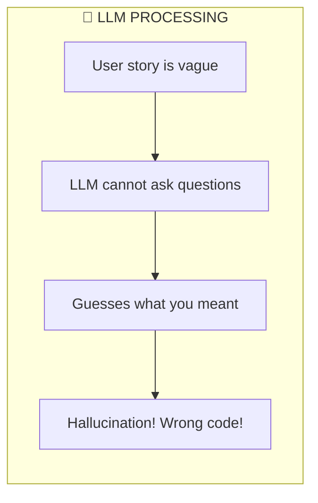

### 🎮 ELI5: The Birthday Cake Problem
If you tell mom "I want a cake," she'll ask: What flavor? How big? What color frosting? But a robot can't ask — it just guesses! If you say "chocolate layer cake with blue frosting for 10 people," the robot knows EXACTLY what to make!

### 🧒 ELI10: The Sokovia Accords Problem
Remember when the Avengers had vague rules like "be heroes"? Everyone interpreted it differently — chaos! But the Sokovia Accords were SPECIFIC: who can do what, when, with what consequences. LLMs need Sokovia Accords, not vague promises!

---

## 📋 Part 2: The Three Contract Components

**Three-Word Name:** `Pre Post Error`

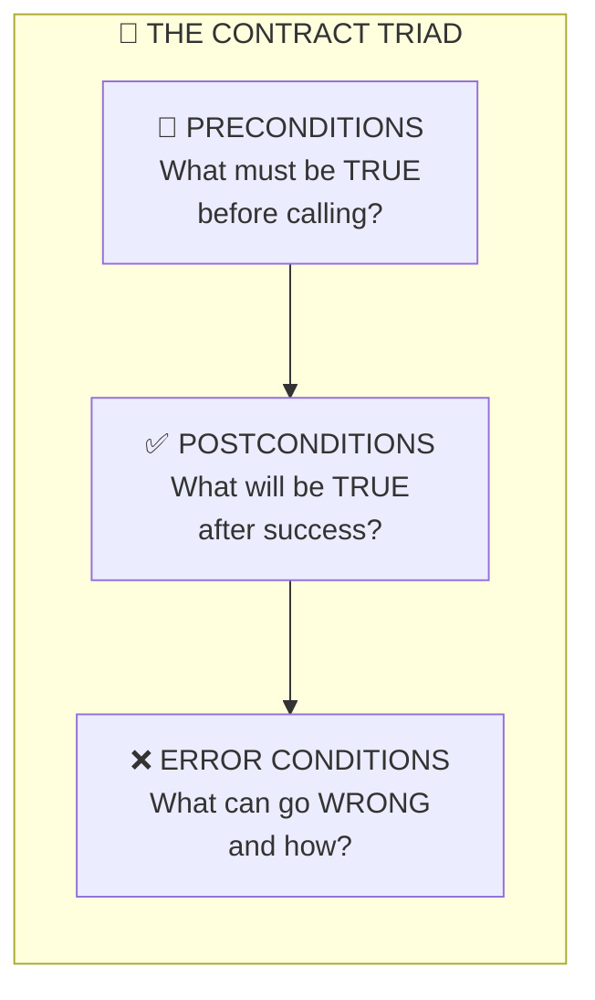

### The Three Questions Every Contract Answers

| Component | Question | Example |
|-----------|----------|---------|
| **Preconditions** | What must be true BEFORE? | User is authenticated |
| **Postconditions** | What will be true AFTER? | Message saved to database |
| **Error Conditions** | What can go WRONG? | Authorization denied |

---

## 🚦 Part 3: Preconditions Explained

**Three-Word Name:** `Input Validation Rules`

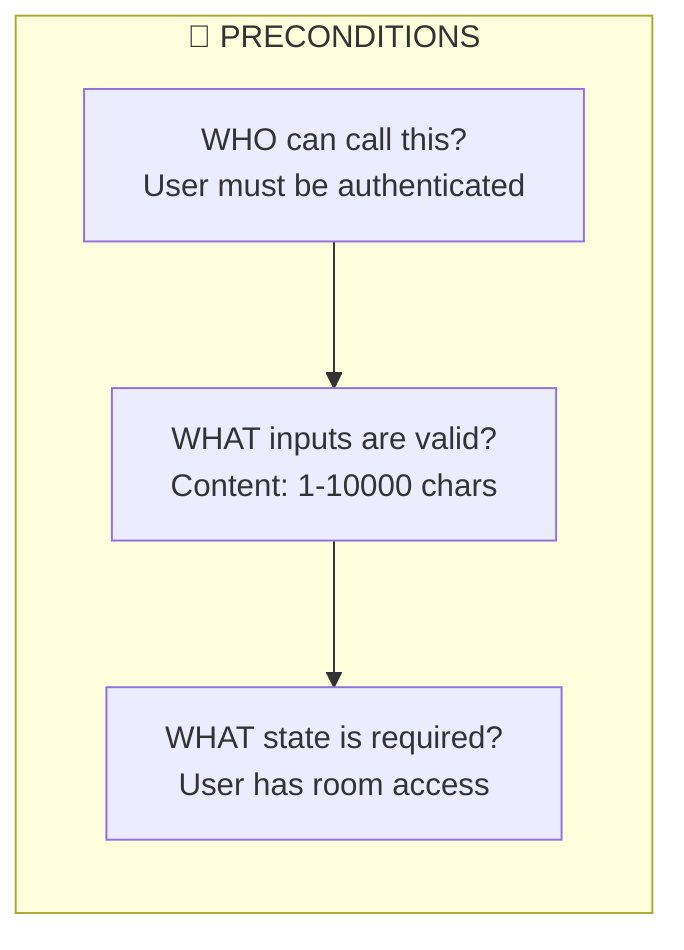

### Example Preconditions

```rust
/// # Preconditions
/// - User authenticated with room access
/// - Content: 1-10000 chars, sanitized HTML
/// - client_message_id: valid UUID
```

### 🎮 ELI5: The Amusement Park Rules
Before you ride the roller coaster:
- You must be THIS tall ✓
- You must have a ticket ✓
- You must not be eating ✓

If ANY rule fails, you can't ride! Preconditions are the "you must be this tall" signs for your code.

### 🧒 ELI10: The Avengers Facility Access
Before entering the Avengers compound:
- Must have valid ID badge (authenticated)
- Must have clearance level (room access)
- Must pass biometric scan (valid UUID)

JARVIS checks ALL conditions before opening the door!

---

## ✅ Part 4: Postconditions Explained

**Three-Word Name:** `Guaranteed Success Outcomes`

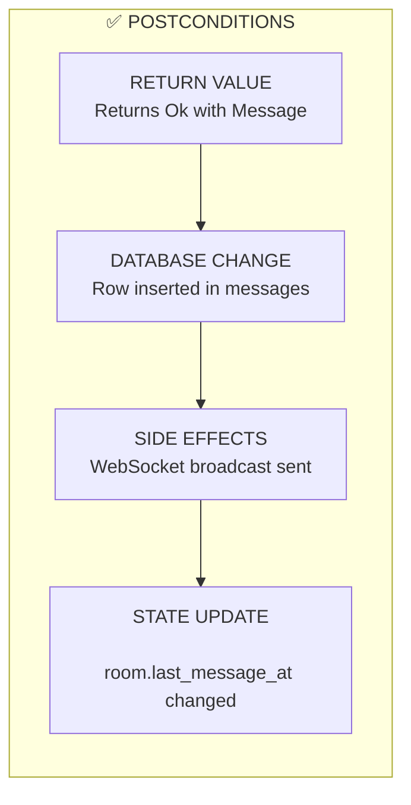

### Example Postconditions

```rust
/// # Postconditions  
/// - Returns Ok(Message<Persisted>) on success
/// - Inserts row into 'messages' table
/// - Updates room.last_message_at timestamp
/// - Broadcasts to room subscribers via WebSocket
/// - Deduplication: returns existing if client_message_id exists
```

### 🎮 ELI5: The Vending Machine Promise
When you put money in and press B7:
- You WILL get a candy bar ✓
- The display WILL show "Thank You" ✓
- Your money WILL be gone ✓

Postconditions are the vending machine's PROMISE of what happens after!

### 🧒 ELI10: The Iron Man Suit Contract
When Tony says "Deploy Mark 85":
- Suit WILL assemble on his body ✓
- HUD WILL activate ✓
- JARVIS WILL come online ✓
- Power WILL be at 100% ✓

These are GUARANTEED outcomes — the suit's postconditions!

---

## ❌ Part 5: Error Conditions Explained

**Three-Word Name:** `Failure Mode Catalog`

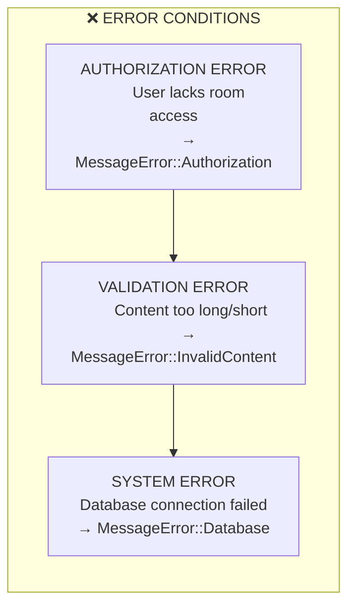

### Example Error Conditions

```rust
/// # Error Conditions
/// - MessageError::Authorization if user lacks room access
/// - MessageError::InvalidContent if content violates constraints
/// - MessageError::Database on persistence failure
```

### 🎮 ELI5: The "What Could Go Wrong" List
Before crossing the street:
- ❌ Light might be RED (wait!)
- ❌ Car might be coming (look!)
- ❌ You might trip (be careful!)

Error conditions tell you EVERY way things could go wrong!

### 🧒 ELI10: The Mission Failure Briefing
Nick Fury always briefs what could go wrong:
- ❌ Target might have backup (Authorization)
- ❌ Intel might be wrong (InvalidContent)
- ❌ Comms might go down (Database)

Knowing failure modes means you can HANDLE them!

---

## 🔄 Part 6: User Story → Contract Transformation

**Three-Word Name:** `Vague To Precise`

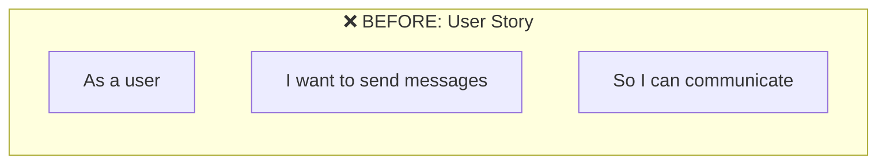

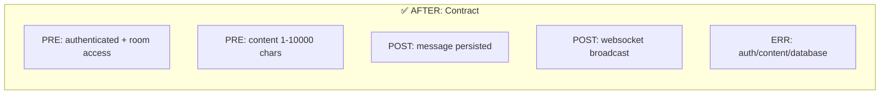

### The Transformation Process

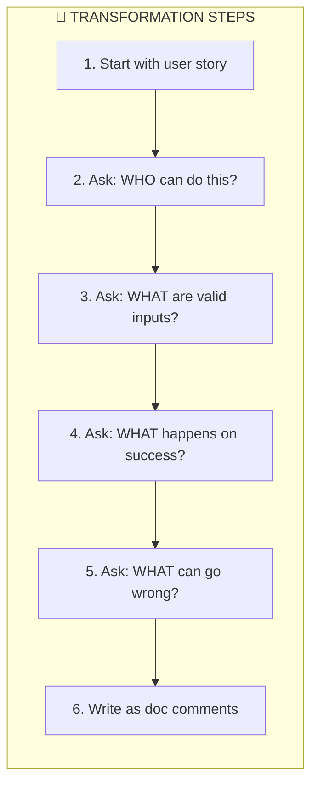

---

## 📐 Part 7: The Four Layer Pattern

**Three-Word Name:** `Specification Layer Hierarchy`

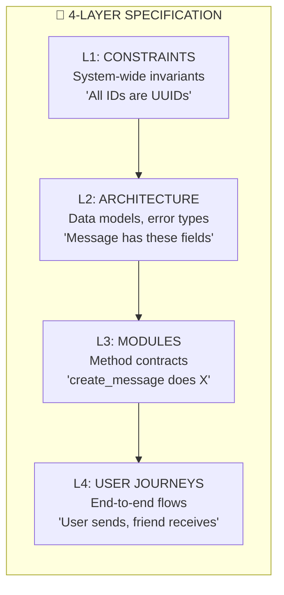

### Layer Responsibilities

| Layer | Scope | Example |
|-------|-------|---------|
| **L1** | System rules | "All timestamps are UTC" |
| **L2** | Data structures | "Message has id, content, timestamp" |
| **L3** | Method behavior | "create_message persists and broadcasts" |
| **L4** | User flows | "Send message → Friend sees it" |

---

## 🧪 Part 8: Tests Validate Contracts

**Three-Word Name:** `Contract Test Validation`

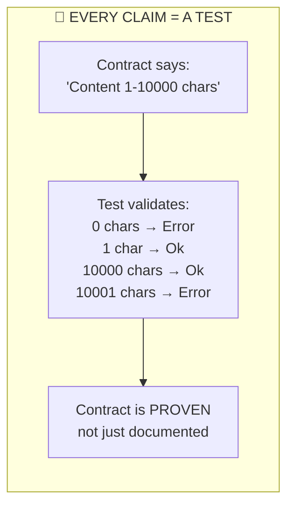

### Test Structure

```rust
#[test]
fn test_precondition_content_length() {
    // Empty content fails
    assert!(create_message("").is_err());
    
    // 1 char succeeds
    assert!(create_message("a").is_ok());
    
    // 10000 chars succeeds
    assert!(create_message(&"a".repeat(10000)).is_ok());
    
    // 10001 chars fails
    assert!(create_message(&"a".repeat(10001)).is_err());
}
```

### 🎮 ELI5: The Promise Checker
If your friend promises "I'll give you 5 candies," you COUNT them! Tests are like counting — they CHECK that promises are kept!

### 🧒 ELI10: The S.H.I.E.L.D. Verification
When an agent claims "Mission complete," Fury doesn't just believe them — he checks the evidence! Tests are your evidence that contracts are honored.

---

## 📝 Part 9: Complete Contract Template

**Three-Word Name:** `Contract Documentation Template`

```rust
/// Brief description of what this function does
/// 
/// # Preconditions
/// - [WHO] User must be [requirement]
/// - [WHAT] Input X must be [constraint]
/// - [STATE] System must be in [state]
/// 
/// # Postconditions
/// - [RETURN] Returns [type] on success
/// - [DATABASE] [Change description]
/// - [SIDE EFFECT] [Effect description]
/// 
/// # Error Conditions
/// - [ErrorType::Variant] if [condition]
/// - [ErrorType::Variant] if [condition]
/// 
/// # Example
/// ```rust
/// let result = function_name(args);
/// assert!(result.is_ok());
/// ```
pub fn function_name_four_words(
    args: ArgType,
) -> Result<SuccessType, ErrorType>;
```

---

## 🏆 Part 10: Key Takeaways

**Three-Word Name:** `Contract Development Summary`

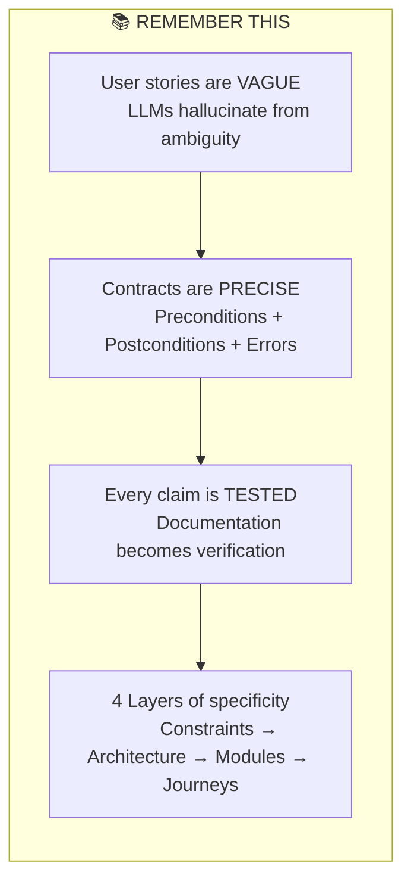

---

## 🎬 Final MCU Wisdom

> **Why contracts?** — LLMs can't ask clarifying questions. Vague specs = hallucinated code. Contracts eliminate ambiguity.

> **The three parts** — Preconditions (what must be true before), Postconditions (what will be true after), Error Conditions (what can go wrong).

> **Tests = proof** — Every contract claim must have an automated test. Documentation alone is just promises.

> **4 layers** — L1 Constraints → L2 Architecture → L3 Modules → L4 User Journeys

---

> *"I could do this all day... but only if you give me a proper contract with preconditions, postconditions, and error handling."*  
> — Captain America, if he did code review 🦀

---

## Quick Reference: Contract Checklist

Before writing any function, answer:

| Question | Contract Section |
|----------|------------------|
| WHO can call this? | Precondition |
| WHAT inputs are valid? | Precondition |
| WHAT state is required? | Precondition |
| WHAT is returned on success? | Postcondition |
| WHAT database changes happen? | Postcondition |
| WHAT side effects occur? | Postcondition |
| WHAT errors can happen? | Error Condition |
| HOW is each claim tested? | Test case |
