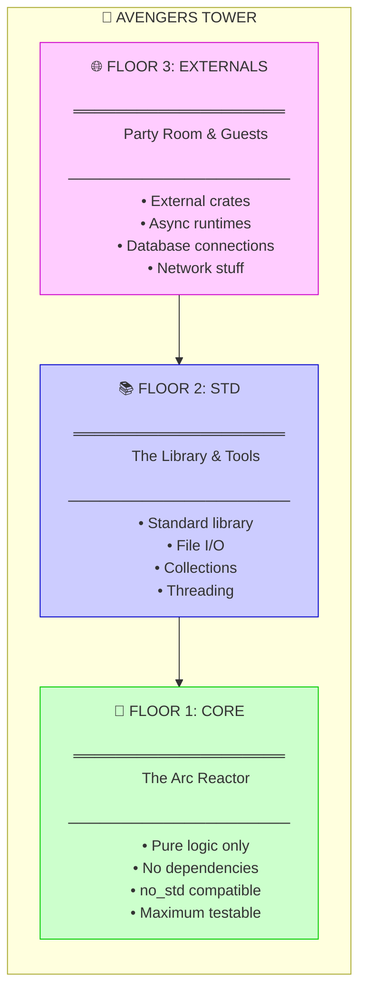
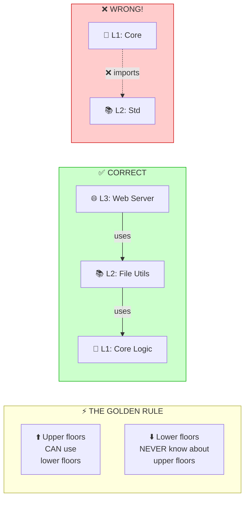
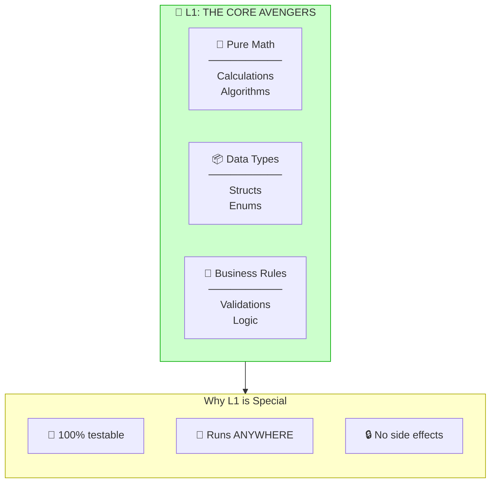
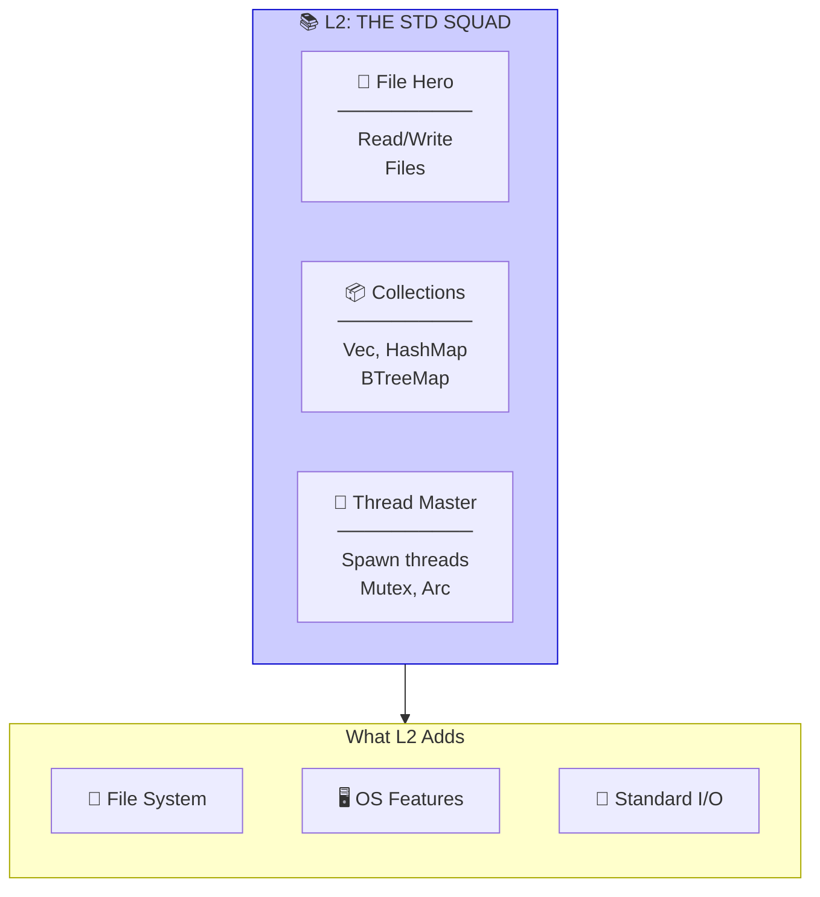
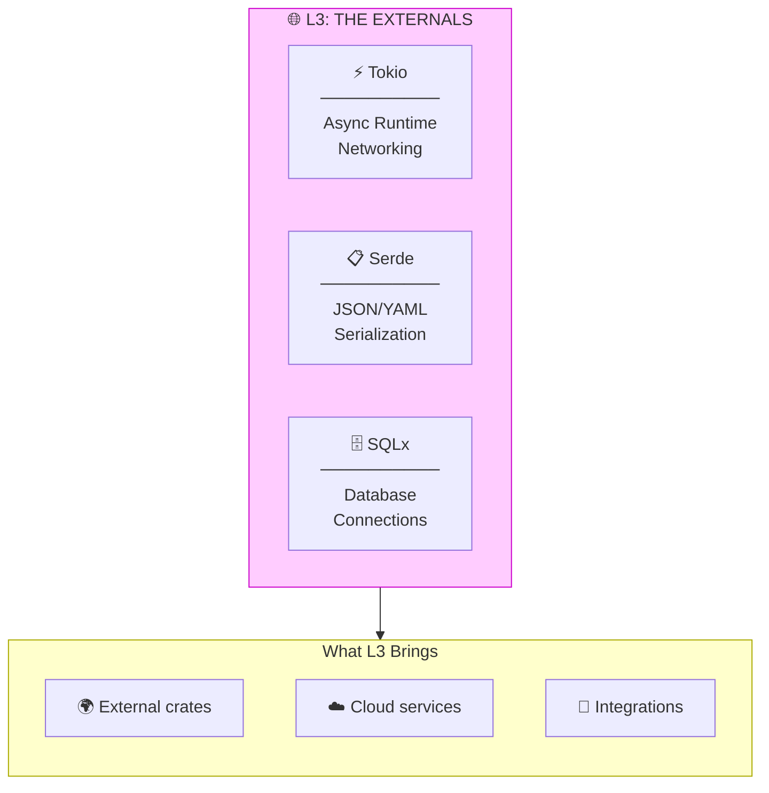
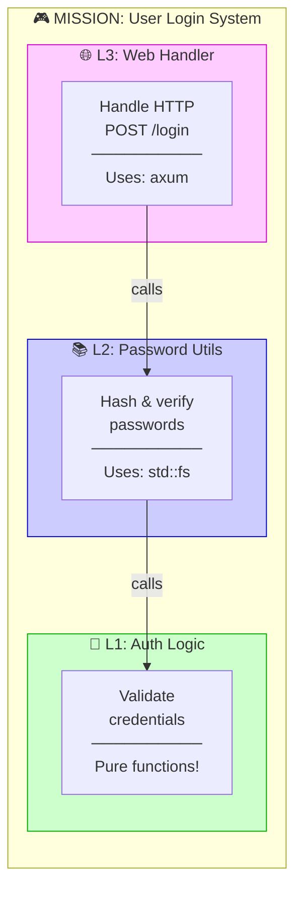
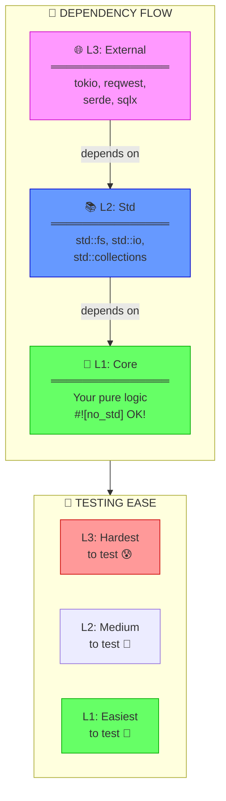
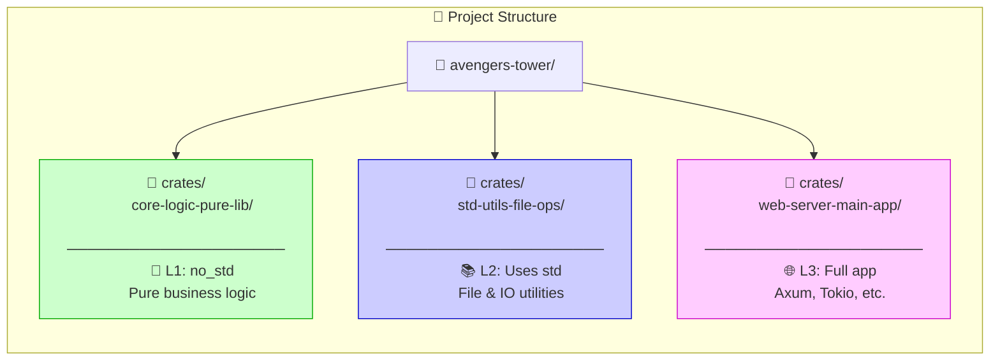

Based on the document, the **second key concept** is **"Layered Rust Architecture (L1→L2→L3)"** - organizing code in clear layers from Core → Std → External dependencies.

---

# 🏰 Layered Architecture: Building the Avengers Tower

## What's the Big Idea?

Think of building Avengers Tower! You can't start with the fancy penthouse - you need a **strong foundation first**. Each floor depends on the one below it, and the lower floors should NEVER depend on upper floors!

---

## Part 1: The Three Floors of Power 🏢

---

## Part 2: The Golden Rule ⚡

---

## Part 3: Meet the Avengers of Each Layer 🦸

---

## Part 4: L2 - The Support Team 📚

---

## Part 5: L3 - The Guest Stars 🌐

---

## Part 6: A Real Mission Example 🎮

---

## Part 7: The Dependency Direction 🧭

---

## Part 8: The Stark Industries File Structure 📁

---

## 🧠 Remember: The Jarvis Principle

> **"Sir, the Arc Reactor powers everything above it, but needs nothing from above."** - JARVIS

| Layer | Can Use | Cannot Use | Testability |
|:------|:--------|:-----------|:------------|
| 💎 L1 Core | Nothing | L2, L3 | ⭐⭐⭐⭐⭐ |
| 📚 L2 Std | L1 only | L3 | ⭐⭐⭐⭐ |
| 🌐 L3 External | L1, L2 | - | ⭐⭐ |

---

**Key Takeaway**: Put as much code as possible in L1 (the Arc Reactor)! It's the most testable, portable, and reliable layer. Only move up when you absolutely need those features! 🚀

