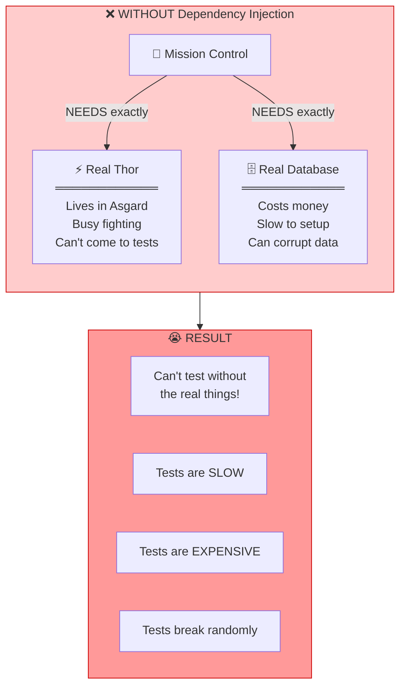
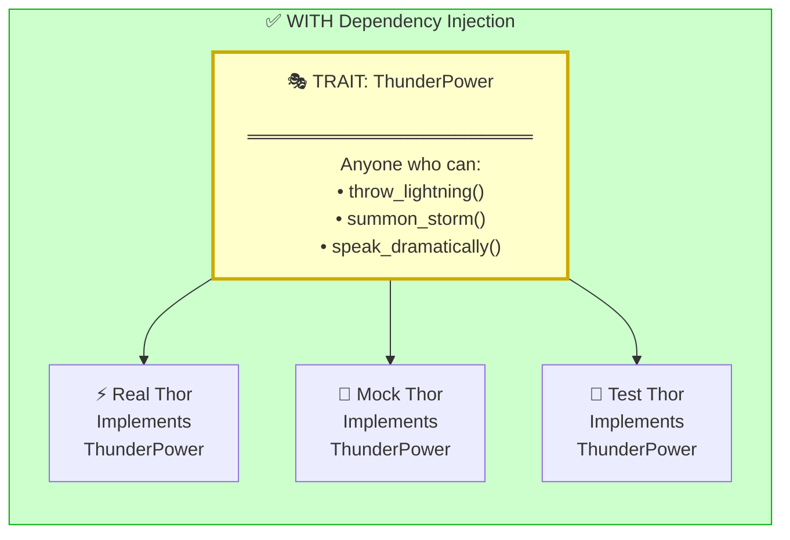
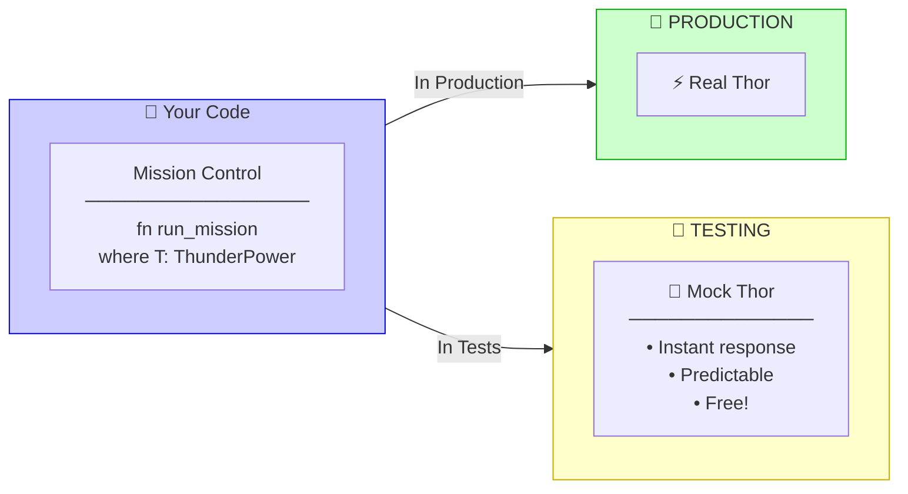
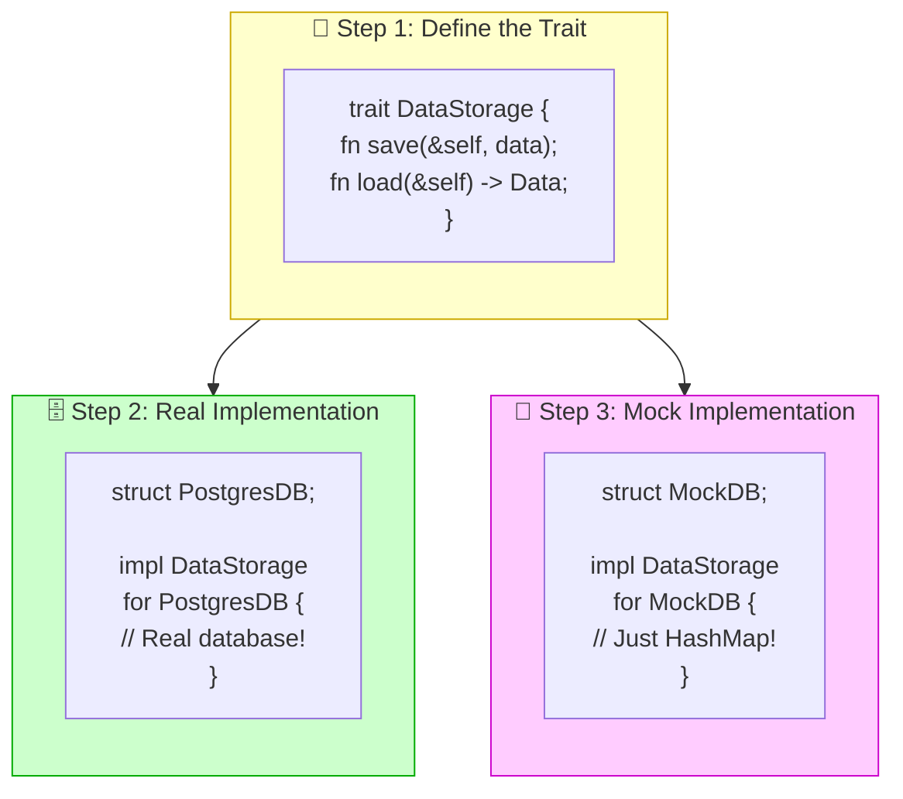
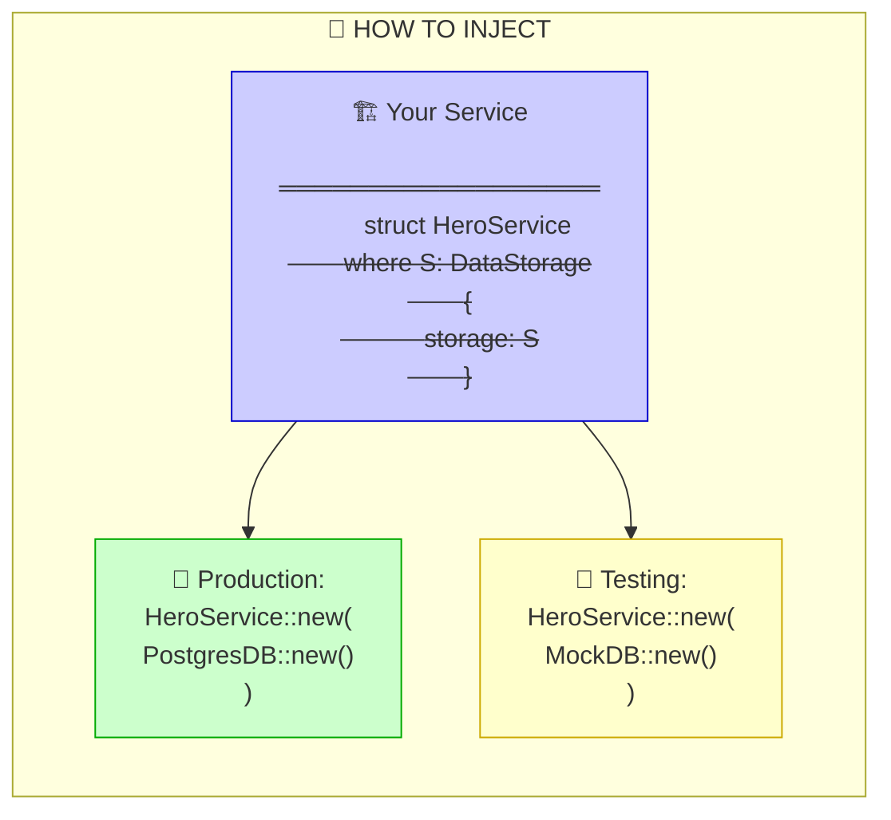
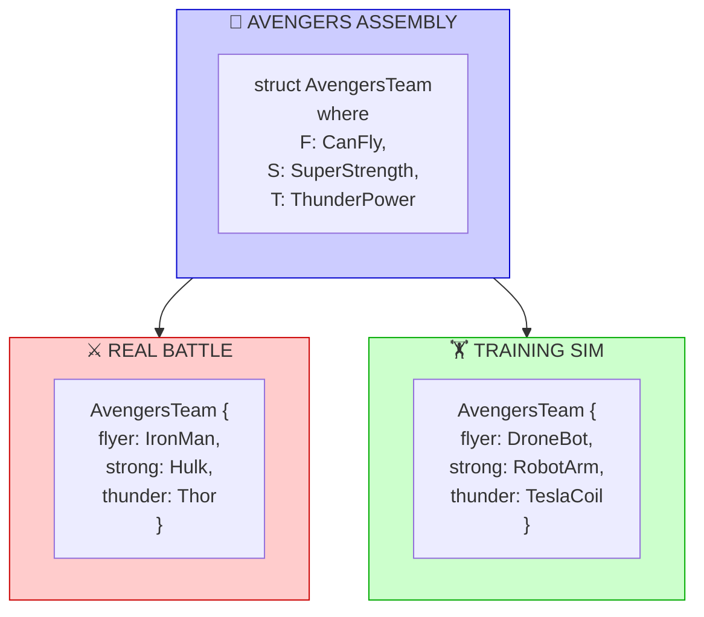
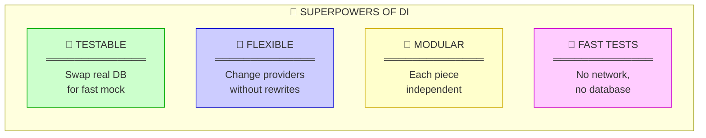
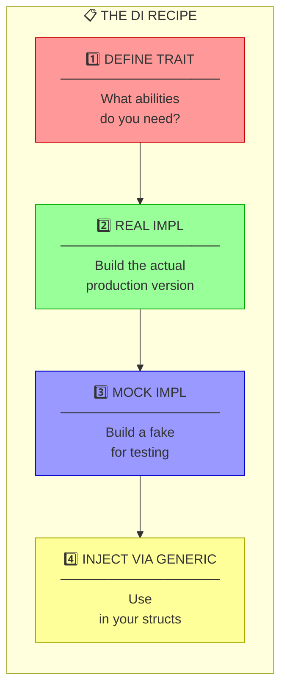
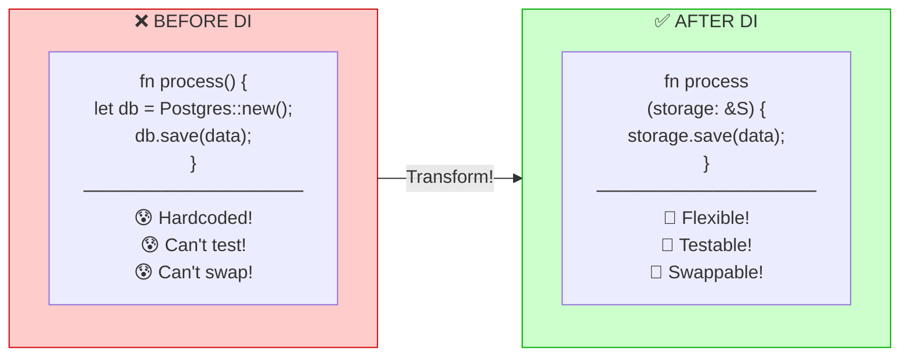

Based on the document, the **third key concept** is **"Dependency Injection for Testability"** - the principle that every component depends on traits (interfaces), not concrete types!

---

# 🎭 Dependency Injection: The Shape-Shifter Strategy

## What's the Big Idea?

Imagine if the Avengers could only work with the REAL Thor. What if Thor is busy? Mission cancelled! 😱

But what if they could work with **anyone who has Thor's powers**? Now they can train with a Thor-bot, test with a practice-Thor, and fight with real Thor!

That's **Dependency Injection** - your code works with *abilities* (traits), not specific *people* (concrete types)!

---

## Part 1: The Problem Without DI 😰

---

## Part 2: The Solution - Traits! 🎭

---

## Part 3: The Magic Swap 🔄

---

## Part 4: Real Code Example 🦀

---

## Part 5: The Injection Part 💉

---

## Part 6: The Avengers Analogy Complete 🦸

---

## Part 7: Why This Rocks 🎸

---

## Part 8: The Pattern Template 📋

---

## Part 9: Before vs After ⚖️

---

## 🧠 Remember: The Tony Stark Rule

> **"I don't need Thor. I need someone who can throw lightning. Big difference!"** - Tony Stark (engineering wisdom)

| Approach | Testability | Flexibility | Maintenance |
|:---------|:------------|:------------|:------------|
| ❌ Concrete Types | Hard 😰 | None 🔒 | Nightmare 💀 |
| ✅ Traits (DI) | Easy 🎉 | Total 🔓 | Dream ✨ |

---

**Key Takeaway**: Always ask yourself: *"What ABILITY do I need?"* not *"What THING do I need?"* Define traits for abilities, then inject whatever implements them! 🚀

