# 🎭 Dependency Injection: The Shape-Shifter Protocol

## The Core Concept

**Dependency Injection (DI)** means your code asks for *capabilities* (traits), not *specific implementations* (structs).

Think of it like Nick Fury recruiting for a mission. He doesn't say "I need Tony Stark." He says "I need someone who can fly and shoot energy blasts." This way, War Machine, Rescue, or Iron Man can all fill the role.

---

## Part 1: The Problem - Hardcoded Dependencies

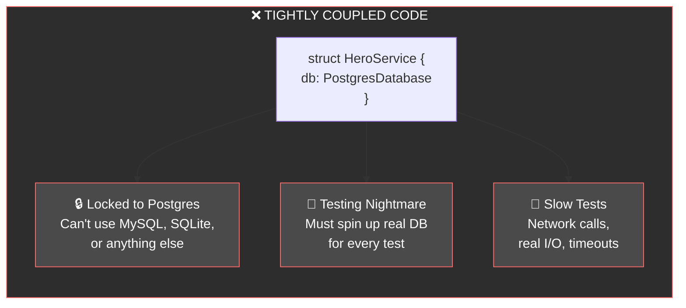

**The Bad Code:**
```rust
// ❌ WRONG: Hardcoded dependency
struct HeroService {
    db: PostgresDatabase,  // Locked to this specific type!
}

impl HeroService {
    fn new() -> Self {
        Self {
            db: PostgresDatabase::connect("localhost:5432")
        }
    }
    
    fn save_hero(&self, hero: Hero) -> Result<()> {
        self.db.insert(hero)  // Can't test without real Postgres!
    }
}
```

---

## Part 2: The Solution - Depend on Traits

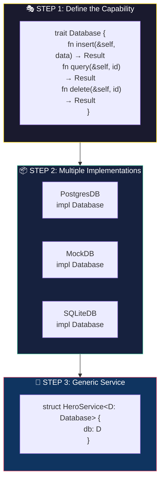

**The Good Code:**
```rust
// ✅ RIGHT: Depend on trait, not concrete type

// Step 1: Define what capabilities we need
trait Database {
    fn insert(&self, hero: &Hero) -> Result<()>;
    fn find(&self, id: HeroId) -> Result<Option<Hero>>;
}

// Step 2: Service accepts ANY Database implementation
struct HeroService<D: Database> {
    db: D,  // Generic! Can be anything that implements Database
}

impl<D: Database> HeroService<D> {
    fn new(db: D) -> Self {
        Self { db }  // Injected from outside!
    }
    
    fn save_hero(&self, hero: Hero) -> Result<()> {
        self.db.insert(&hero)
    }
}
```

---

## Part 3: Real vs Mock Implementation

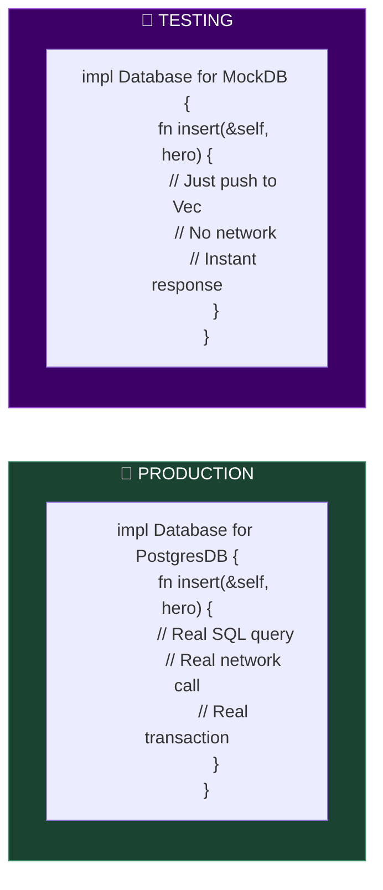

**Both Implementations:**
```rust
// 🚀 PRODUCTION: Real PostgreSQL
struct PostgresDB {
    pool: PgPool,
}

impl Database for PostgresDB {
    fn insert(&self, hero: &Hero) -> Result<()> {
        sqlx::query("INSERT INTO heroes VALUES ($1, $2)")
            .bind(&hero.id)
            .bind(&hero.name)
            .execute(&self.pool)
            .await?;
        Ok(())
    }
    
    fn find(&self, id: HeroId) -> Result<Option<Hero>> {
        // Real database query...
    }
}

// 🧪 TESTING: Fast in-memory mock
struct MockDB {
    heroes: RefCell<HashMap<HeroId, Hero>>,
}

impl Database for MockDB {
    fn insert(&self, hero: &Hero) -> Result<()> {
        self.heroes.borrow_mut().insert(hero.id, hero.clone());
        Ok(())  // Instant! No network!
    }
    
    fn find(&self, id: HeroId) -> Result<Option<Hero>> {
        Ok(self.heroes.borrow().get(&id).cloned())
    }
}
```

---

## Part 4: The Injection in Action

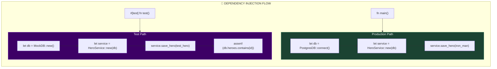

**Usage Code:**
```rust
// 🚀 In main.rs (Production)
fn main() {
    let db = PostgresDB::connect("postgres://prod-server").await;
    let service = HeroService::new(db);  // Inject real DB
    
    service.save_hero(Hero::new("Tony Stark")).await;
}

// 🧪 In tests (Fast, isolated, no external deps)
#[test]
fn test_save_hero() {
    let mock_db = MockDB::new();
    let service = HeroService::new(mock_db);  // Inject mock!
    
    let hero = Hero::new("Test Hero");
    service.save_hero(hero.clone()).unwrap();
    
    // Verify it was saved
    assert_eq!(service.db.find(hero.id).unwrap(), Some(hero));
}
```

---

## Part 5: The Avengers Mission Control Example

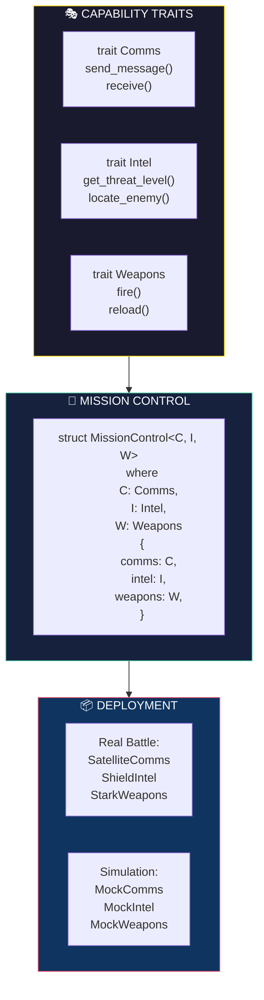

**Full Example:**
```rust
// Define capabilities needed for a mission
trait Communications {
    fn send(&self, msg: &str) -> Result<()>;
    fn receive(&self) -> Result<Vec<Message>>;
}

trait Intelligence {
    fn threat_level(&self, location: Coords) -> ThreatLevel;
    fn locate_target(&self, name: &str) -> Option<Coords>;
}

// Mission Control is generic over its dependencies
struct MissionControl<C: Communications, I: Intelligence> {
    comms: C,
    intel: I,
}

impl<C: Communications, I: Intelligence> MissionControl<C, I> {
    fn new(comms: C, intel: I) -> Self {
        Self { comms, intel }
    }
    
    fn execute_mission(&self, target: &str) -> Result<()> {
        let location = self.intel.locate_target(target)
            .ok_or(Error::TargetNotFound)?;
            
        let threat = self.intel.threat_level(location);
        
        self.comms.send(&format!(
            "Target at {:?}, threat: {:?}", location, threat
        ))?;
        
        Ok(())
    }
}

// 🚀 Production: Real satellite uplink + SHIELD database
fn run_real_mission() {
    let mc = MissionControl::new(
        SatelliteComms::connect("shield-sat-7"),
        ShieldIntelDatabase::new(),
    );
    mc.execute_mission("Thanos").unwrap();
}

// 🧪 Test: Everything is mocked
#[test]
fn test_mission_execution() {
    let mock_comms = MockComms::new();
    let mock_intel = MockIntel::with_target("TestVillain", Coords(0, 0));
    
    let mc = MissionControl::new(mock_comms, mock_intel);
    
    assert!(mc.execute_mission("TestVillain").is_ok());
    assert!(mc.execute_mission("Unknown").is_err());
}
```

---

## Part 6: The DI Checklist

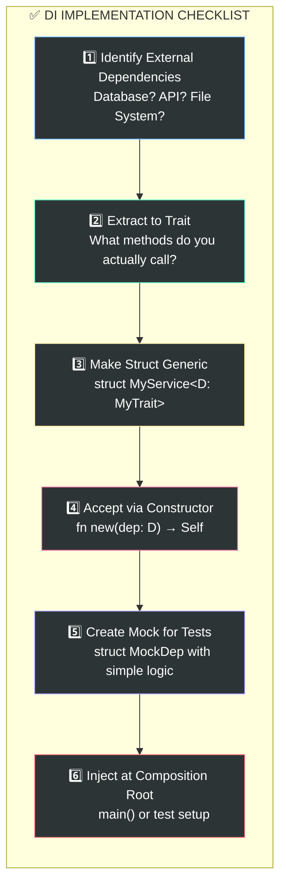

---

## Summary: Before vs After

| Aspect | ❌ Hardcoded | ✅ Dependency Injection |
|:-------|:-------------|:------------------------|
| **Type** | `db: PostgresDB` | `db: D where D: Database` |
| **Created** | Inside the struct | Passed in from outside |
| **Testing** | Need real DB running | Use fast MockDB |
| **Flexibility** | Locked to one impl | Swap anytime |
| **Test Speed** | Seconds (network I/O) | Milliseconds (in-memory) |

---

## 🧠 The Nick Fury Principle

> **"I don't need Tony Stark. I need flight capability and ranged weapons. Stark, Rhodes, or Danvers can fill that role."**

Your code should think the same way:
- Don't ask for `PostgresDB` → Ask for `impl Database`
- Don't ask for `HttpClient` → Ask for `impl ApiClient`  
- Don't ask for `FileSystem` → Ask for `impl Storage`

**This is how you build systems that are testable, flexible, and maintainable.** 🚀

# 🌍 Dependency Injection: A Universal Meta-Pattern

Great question! **Yes, Dependency Injection is absolutely a meta-pattern** that appears across virtually every complex system — biological, social, economic, and mechanical. It's fundamentally about **decoupling "what you need" from "how you get it"**.

---

## The Core Abstraction

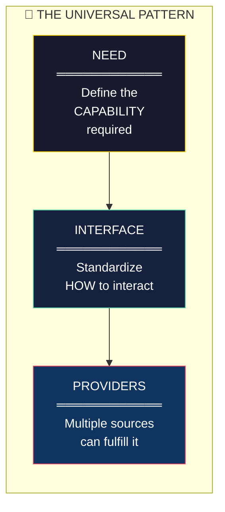

---

## 1. 🧬 Biology: Nature's Original DI

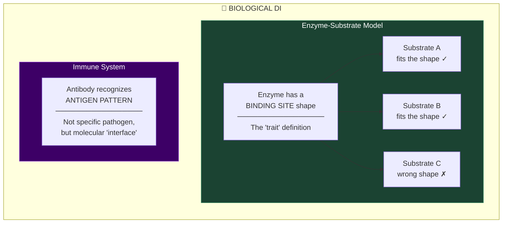

**The Biology Parallel:**
```
// Nature's "trait" definition
trait BindingSite {
    fn molecular_shape(&self) -> Shape;
    fn charge_distribution(&self) -> Charge;
}

// Any molecule implementing this "trait" can bind
// The enzyme doesn't care WHO you are, only WHAT you can do
```

**Real Examples:**
- **Enzymes** don't care which specific molecule binds — only that it has the right shape (interface)
- **Antibodies** recognize antigen patterns, not specific pathogens
- **Receptors** accept any neurotransmitter with the matching molecular "interface"
- **Ecological niches** need "a decomposer" — fungi, bacteria, or insects can fill the role

---

## 2. 💼 Business & Organizations

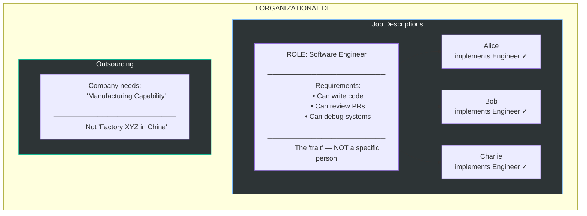

**Real Examples:**
- **Job descriptions** define capabilities, not specific people
- **Contractors** — you hire "accounting capability" not "John specifically"
- **Outsourcing** — need "manufacturing" not a specific factory
- **Consultants** — inject expertise temporarily, swap when needed

---

## 3. 🔧 Engineering & Manufacturing

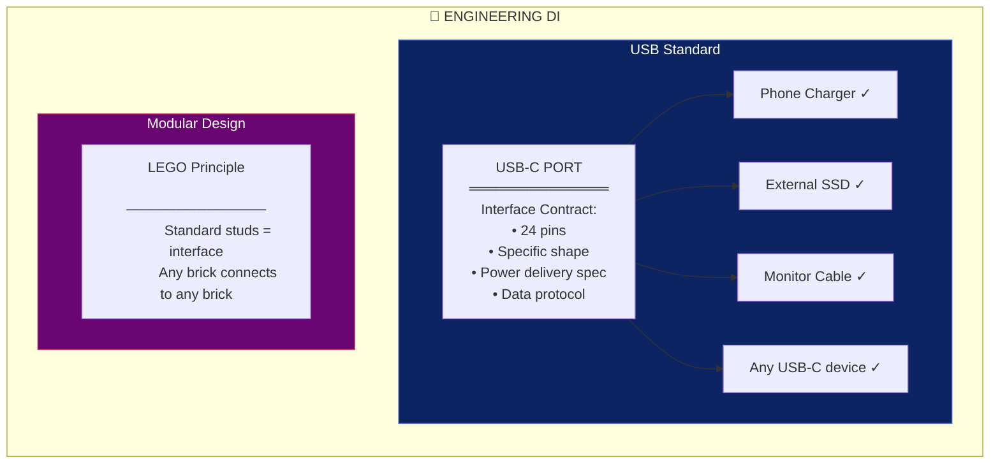

**Real Examples:**
- **USB/HDMI/Standards** — any device implementing the interface works
- **Eli Whitney's Interchangeable Parts** — musket parts from any factory fit any musket
- **LEGO** — standard stud interface, infinite combinations
- **Electrical outlets** — any plug matching the standard works
- **NATO standardization** — ammunition from any allied nation fits any allied weapon

---

## 4. 💰 Economics & Markets

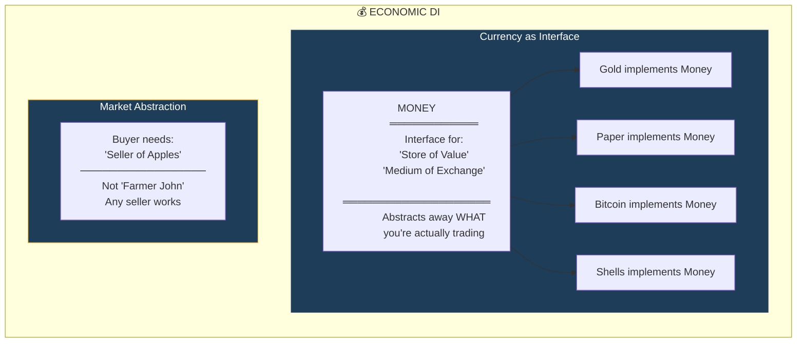

**Real Examples:**
- **Currency** — abstracts "value" into an interface any good can implement
- **Markets** — buyers need "a seller of X" not a specific vendor
- **Insurance** — abstracts risk into a pooled interface
- **Stocks** — ownership interface, underlying companies are implementations

---

## 5. 🏥 Medicine

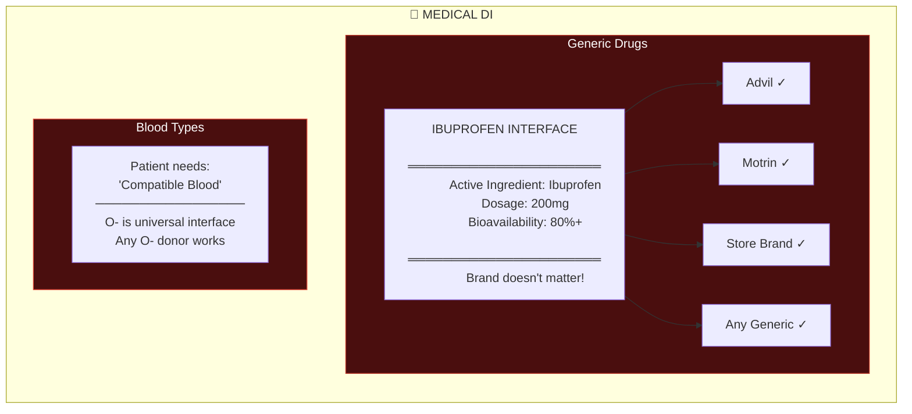

**Real Examples:**
- **Generic drugs** — same active ingredient interface, different manufacturers
- **Blood transfusions** — type compatibility is the interface
- **Organ transplants** — HLA matching defines the "trait"
- **Medical devices** — standard Luer locks, any syringe fits any needle

---

## 6. 🎓 Education & Credentials

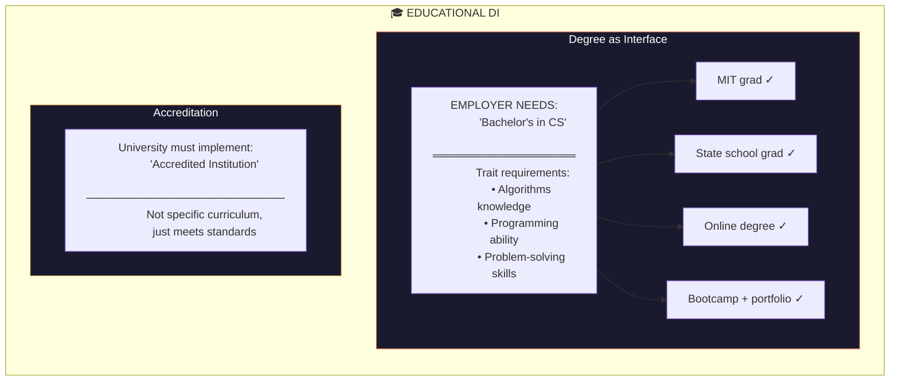

---

## 7. 🏛️ Law & Governance

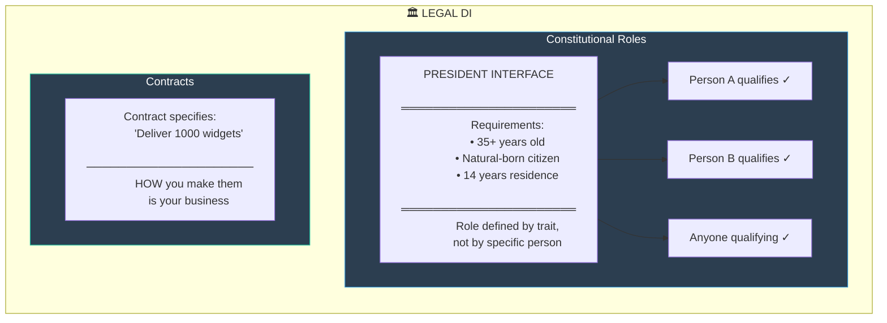

---

## The Meta-Pattern Revealed

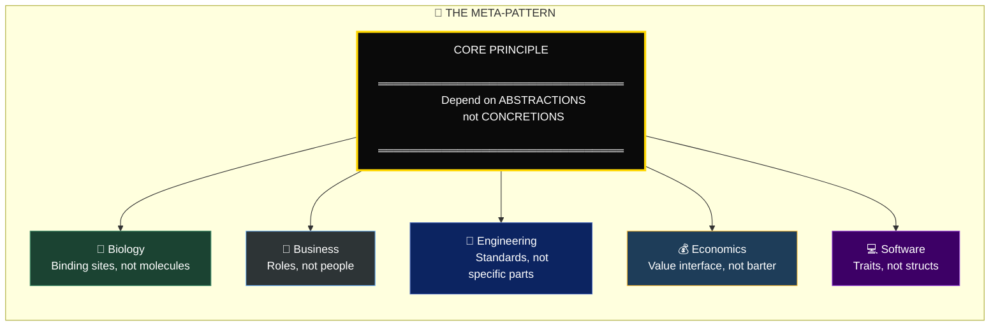

---

## Why This Pattern Exists Everywhere

| Property | Why It's Universal |
|:---------|:-------------------|
| **Resilience** | If one provider fails, swap in another |
| **Scalability** | Add new providers without changing system |
| **Evolvability** | Improve implementations independently |
| **Testability** | Simulate with mocks/stand-ins |
| **Efficiency** | Competition among providers |
| **Composability** | Mix and match components freely |

---

## 🧠 The Philosophical Root

This is actually a manifestation of **Plato's Theory of Forms**:

> The "Form" (trait/interface) is the abstract ideal. Concrete things are just implementations of that form.

A chair isn't valuable because it's *this specific chair* — it's valuable because it implements the `Sittable` interface.

```rust
// Plato was a Rustacean
trait Sittable {
    fn support_weight(&self, kg: f64) -> bool;
    fn has_surface(&self) -> bool;
}

// These are all "chairs" — implementations of the Form
impl Sittable for WoodenChair { ... }
impl Sittable for Rock { ... }
impl Sittable for Floor { ... }
impl Sittable for AnotherPersonsLap { ... }  // 😄
```

---

## Key Insight

**Dependency Injection isn't a software pattern that happens to appear elsewhere.**

**It's a universal systems design principle that software finally gave a name to.**

Anywhere you see:
- Standardization
- Interchangeability  
- Role-based thinking
- Abstraction layers
- Modular design

...you're seeing Dependency Injection in action. 🚀

# 🦀 Traits: The Behavioral Contract System

## The Fundamental Distinction

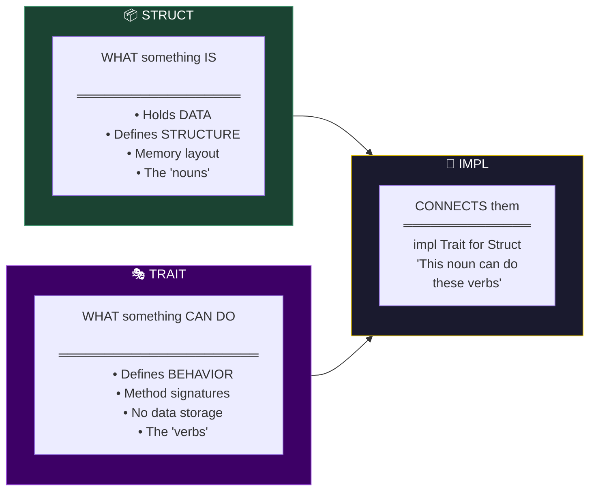

---

## Part 1: Struct — The Data Container

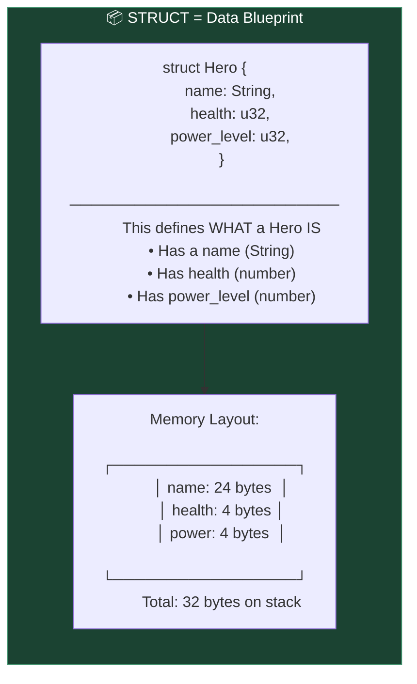

**Struct Code:**
```rust
// A struct defines DATA structure
struct Hero {
    name: String,
    health: u32,
    power_level: u32,
}

// You can add methods directly to a struct
impl Hero {
    fn new(name: &str) -> Self {
        Self {
            name: name.to_string(),
            health: 100,
            power_level: 50,
        }
    }
    
    fn is_alive(&self) -> bool {
        self.health > 0
    }
}

// Usage
let iron_man = Hero::new("Tony Stark");
println!("{} alive: {}", iron_man.name, iron_man.is_alive());
```

---

## Part 2: Trait — The Behavior Contract

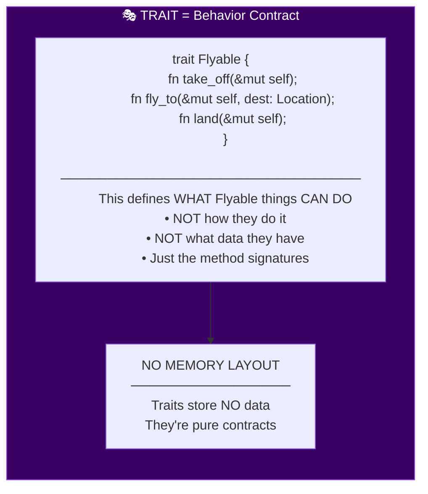

**Trait Code:**
```rust
// A trait defines BEHAVIOR contract
trait Flyable {
    fn take_off(&mut self);
    fn fly_to(&mut self, destination: &str);
    fn land(&mut self);
    
    // Traits CAN have default implementations
    fn hover(&self) {
        println!("Hovering in place...");
    }
}

// The trait itself holds NO data
// It's just a promise: "I can do these things"
```

---

## Part 3: Connecting Struct + Trait with `impl`

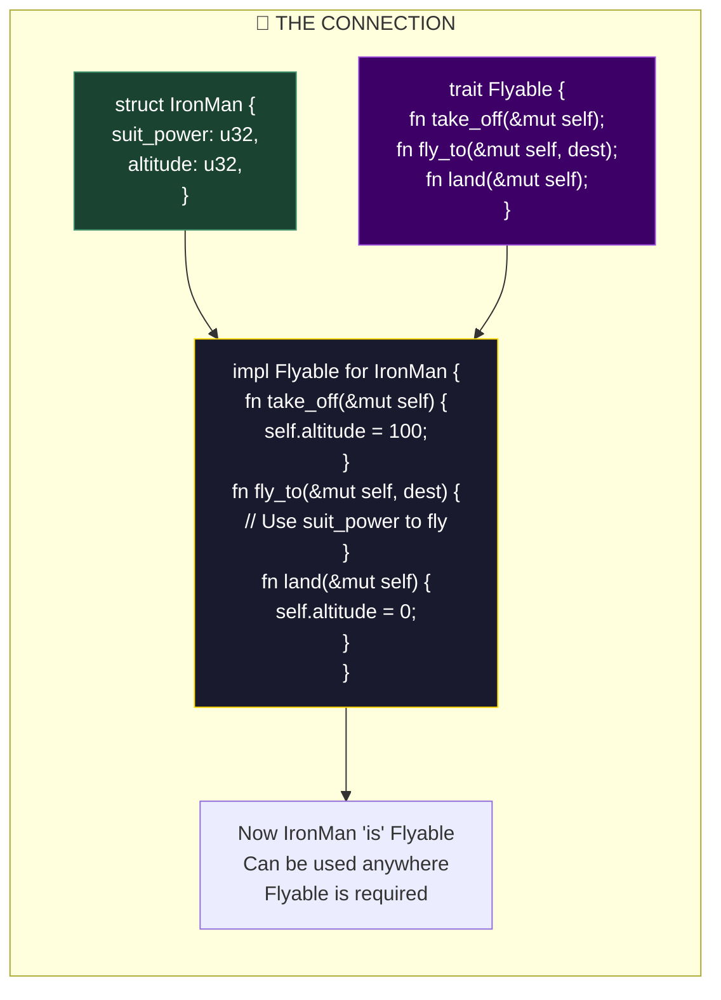

**Implementation Code:**
```rust
struct IronMan {
    suit_power: u32,
    altitude: u32,
}

struct Falcon {
    wing_span: f32,
    altitude: u32,
}

// IronMan implements Flyable
impl Flyable for IronMan {
    fn take_off(&mut self) {
        println!("Repulsors engaged!");
        self.suit_power -= 10;
        self.altitude = 100;
    }
    
    fn fly_to(&mut self, destination: &str) {
        println!("Flying to {} via repulsors", destination);
    }
    
    fn land(&mut self) {
        println!("Landing sequence initiated");
        self.altitude = 0;
    }
}

// Falcon ALSO implements Flyable (differently!)
impl Flyable for Falcon {
    fn take_off(&mut self) {
        println!("Wings extended!");
        self.altitude = 50;
    }
    
    fn fly_to(&mut self, destination: &str) {
        println!("Gliding to {}", destination);
    }
    
    fn land(&mut self) {
        println!("Wings folding");
        self.altitude = 0;
    }
}
```

---

## Part 4: Why Traits Were Invented

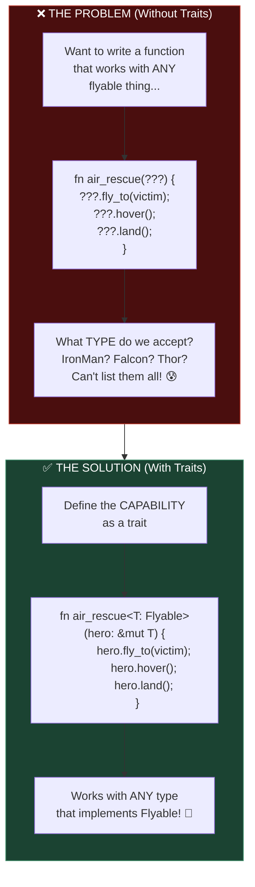

**The Power of Traits:**
```rust
// This function works with ANY Flyable type
fn air_rescue<T: Flyable>(hero: &mut T, victim_location: &str) {
    hero.take_off();
    hero.fly_to(victim_location);
    hero.hover();  // Uses default implementation
    println!("Rescuing victim...");
    hero.land();
}

// Usage - works with both!
let mut tony = IronMan { suit_power: 100, altitude: 0 };
let mut sam = Falcon { wing_span: 2.5, altitude: 0 };

air_rescue(&mut tony, "Stark Tower");  // ✓ Works!
air_rescue(&mut sam, "Washington DC"); // ✓ Also works!
```

---

## Part 5: Struct vs Trait Summary

```mermaid
flowchart TD
    subgraph COMPARE["📊 STRUCT vs TRAIT"]
        direction TB
        
        subgraph STRUCT_SIDE["📦 STRUCT"]
            S1["Holds DATA ✓"]
            S2["Has memory layout ✓"]
            S3["Can be instantiated ✓"]
            S4["Defines 'what it IS'"]
            S5["One struct = one type"]
        end
        
        subgraph TRAIT_SIDE["🎭 TRAIT"]
            T1["Holds NO data ✗"]
            T2["No memory layout ✗"]
            T3["Cannot be instantiated ✗"]
            T4["Defines 'what it CAN DO'"]
            T5["Many types can impl one trait"]
        end
    end
    
    style STRUCT_SIDE fill:#1b4332,stroke:#40916c,color:#fff
    style TRAIT_SIDE fill:#3d0066,stroke:#9d4edd,color:#fff
```

---

# 🌍 Cross-Language Comparison

## The Landscape

```mermaid
flowchart TD
    subgraph LANGS["🌍 SAME CONCEPT, DIFFERENT NAMES"]
        direction TB
        
        RUST["🦀 Rust
        ═══════════
        trait"]
        
        JAVA["☕ Java
        ═══════════
        interface
        (+ abstract class)"]
        
        CPP["⚡ C++
        ═══════════
        abstract class
        virtual functions
        concepts (C++20)"]
        
        GO["🐹 Go
        ═══════════
        interface
        (implicit)"]
        
        SWIFT["🍎 Swift
        ═══════════
        protocol"]
        
        HASKELL["λ Haskell
        ═══════════
        typeclass"]
    end
    
    style RUST fill:#f74c00,stroke:#fff,color:#fff
    style JAVA fill:#007396,stroke:#fff,color:#fff
    style CPP fill:#00599c,stroke:#fff,color:#fff
    style GO fill:#00add8,stroke:#fff,color:#fff
    style SWIFT fill:#fa7343,stroke:#fff,color:#fff
    style HASKELL fill:#5e5086,stroke:#fff,color:#fff
```

---

## Rust vs Java

```mermaid
flowchart LR
    subgraph RUST_WAY["🦀 RUST"]
        direction TB
        
        R1["trait Flyable {
            fn fly(&self);
        }"]
        
        R2["struct Bird { }
        impl Flyable for Bird {
            fn fly(&self) { ... }
        }"]
        
        R3["Implemented OUTSIDE
        the struct definition
        ─────────────────────
        Can impl traits for
        types you don't own!"]
    end
    
    subgraph JAVA_WAY["☕ JAVA"]
        direction TB
        
        J1["interface Flyable {
            void fly();
        }"]
        
        J2["class Bird implements Flyable {
            public void fly() { ... }
        }"]
        
        J3["Implemented INSIDE
        the class definition
        ─────────────────────
        Can't add interfaces
        to existing classes!"]
    end
    
    style RUST_WAY fill:#f74c00,stroke:#fff,color:#fff
    style JAVA_WAY fill:#007396,stroke:#fff,color:#fff
```

**Side-by-Side Code:**

```rust
// ═══════════════════════════════════════
// 🦀 RUST
// ═══════════════════════════════════════

// Define the trait
trait Flyable {
    fn fly(&self);
    fn land(&self);
}

// Struct is separate
struct Bird {
    species: String,
}

// Implementation is SEPARATE from both!
impl Flyable for Bird {
    fn fly(&self) {
        println!("{} flaps wings", self.species);
    }
    fn land(&self) {
        println!("{} lands", self.species);
    }
}

// 🔥 SUPERPOWER: Implement YOUR trait for THEIR type!
impl Flyable for SomeLibrarysType {
    fn fly(&self) { /* ... */ }
    fn land(&self) { /* ... */ }
}
```

```java
// ═══════════════════════════════════════
// ☕ JAVA
// ═══════════════════════════════════════

// Define the interface
interface Flyable {
    void fly();
    void land();
}

// Implementation is INSIDE the class
class Bird implements Flyable {
    private String species;
    
    @Override
    public void fly() {
        System.out.println(species + " flaps wings");
    }
    
    @Override
    public void land() {
        System.out.println(species + " lands");
    }
}

// ❌ CANNOT add interface to existing class
// If String doesn't implement Flyable, you're stuck!
```

---

## Key Differences: Rust vs Java

```mermaid
flowchart TD
    subgraph DIFF["🔍 KEY DIFFERENCES"]
        direction TB
        
        subgraph D1["Orphan Rule vs Closed World"]
            RUST1["🦀 Rust: Can impl external
            traits for your types, OR
            your traits for external types
            (but not both external)"]
            
            JAVA1["☕ Java: Can only implement
            interfaces in class definition.
            No retroactive implementation."]
        end
        
        subgraph D2["Static vs Dynamic Dispatch"]
            RUST2["🦀 Rust: Default is STATIC
            (monomorphization)
            No runtime cost!
            
            fn do_thing&lt;T: Fly&gt;(t: T)"]
            
            JAVA2["☕ Java: Always DYNAMIC
            (vtable lookup)
            Runtime cost on every call
            
            void doThing(Flyable f)"]
        end
        
        subgraph D3["No Inheritance"]
            RUST3["🦀 Rust: NO struct inheritance
            Composition over inheritance
            Traits can inherit traits though"]
            
            JAVA3["☕ Java: Full class inheritance
            class Child extends Parent
            implements Interface"]
        end
    end
    
    style D1 fill:#2d3436,stroke:#74b9ff,color:#fff
    style D2 fill:#2d3436,stroke:#55efc4,color:#fff
    style D3 fill:#2d3436,stroke:#fd79a8,color:#fff
```

---

## Rust vs C++

```mermaid
flowchart LR
    subgraph RUST_TRAITS["🦀 RUST TRAITS"]
        direction TB
        
        RT1["trait Animal {
            fn speak(&self);
        }"]
        
        RT2["Explicit contract
        Compiler enforces
        No runtime cost (default)"]
    end
    
    subgraph CPP_OLD["⚡ C++ (Traditional)"]
        direction TB
        
        CO1["class Animal {
        public:
            virtual void speak() = 0;
        };"]
        
        CO2["Abstract class
        Virtual table (vtable)
        Runtime cost on every call"]
    end
    
    subgraph CPP_NEW["⚡ C++20 Concepts"]
        direction TB
        
        CN1["template&lt;typename T&gt;
        concept Animal = requires(T a) {
            { a.speak() };
        };"]
        
        CN2["Compile-time constraints
        Like Rust traits!
        No runtime cost"]
    end
    
    style RUST_TRAITS fill:#f74c00,stroke:#fff,color:#fff
    style CPP_OLD fill:#00599c,stroke:#fff,color:#fff
    style CPP_NEW fill:#00599c,stroke:#ffd700,color:#fff
```

**C++ Evolution Toward Rust's Model:**

```cpp
// ═══════════════════════════════════════
// ⚡ C++ TRADITIONAL (Abstract Classes)
// ═══════════════════════════════════════

// Abstract base class (like a trait, but with inheritance)
class Flyable {
public:
    virtual void fly() = 0;     // Pure virtual = must implement
    virtual void land() = 0;
    virtual ~Flyable() = default;
};

// Must INHERIT from Flyable
class Bird : public Flyable {
public:
    void fly() override {
        std::cout << "Flapping wings\n";
    }
    void land() override {
        std::cout << "Landing\n";
    }
};

// Runtime dispatch via vtable (has cost!)
void rescue(Flyable* hero) {
    hero->fly();   // vtable lookup at runtime
    hero->land();  // vtable lookup at runtime
}
```

```cpp
// ═══════════════════════════════════════
// ⚡ C++20 CONCEPTS (More like Rust!)
// ═══════════════════════════════════════

// Concept = compile-time constraint (like trait!)
template<typename T>
concept Flyable = requires(T t) {
    { t.fly() } -> std::same_as<void>;
    { t.land() } -> std::same_as<void>;
};

// No inheritance needed!
class Bird {
public:
    void fly() { std::cout << "Flapping\n"; }
    void land() { std::cout << "Landing\n"; }
};

// Compile-time dispatch (like Rust!)
template<Flyable T>
void rescue(T& hero) {
    hero.fly();   // No vtable! Compile-time resolution!
    hero.land();
}
```

---

## Static vs Dynamic Dispatch

```mermaid
flowchart TD
    subgraph DISPATCH["⚡ DISPATCH METHODS"]
        direction TB
        
        subgraph STATIC["STATIC DISPATCH (Monomorphization)"]
            S1["fn rescue&lt;T: Flyable&gt;(hero: T)"]
            S2["Compiler generates:
            rescue_IronMan(...)
            rescue_Falcon(...)
            rescue_Thor(...)"]
            S3["✅ Zero runtime cost
            ✅ Inlining possible
            ❌ Larger binary size"]
        end
        
        subgraph DYNAMIC["DYNAMIC DISPATCH (vtable)"]
            D1["fn rescue(hero: &dyn Flyable)"]
            D2["Runtime looks up:
            'Which fly() do I call?'
            via pointer table"]
            D3["✅ Smaller binary
            ✅ Flexibility
            ❌ Runtime cost
            ❌ No inlining"]
        end
    end
    
    style STATIC fill:#1b4332,stroke:#40916c,color:#fff
    style DYNAMIC fill:#3d0066,stroke:#9d4edd,color:#fff
```

**Rust Supports Both:**

```rust
// ═══════════════════════════════════════
// STATIC DISPATCH (default, zero-cost)
// ═══════════════════════════════════════
fn rescue_static<T: Flyable>(hero: &mut T) {
    hero.fly();
    hero.land();
}

// Compiler generates SEPARATE functions:
// rescue_static::<IronMan>()
// rescue_static::<Falcon>()
// Each is optimized specifically!

// ═══════════════════════════════════════
// DYNAMIC DISPATCH (when you need flexibility)
// ═══════════════════════════════════════
fn rescue_dynamic(hero: &mut dyn Flyable) {
    hero.fly();   // vtable lookup
    hero.land();  // vtable lookup
}

// ONE function, works with any Flyable
// Useful for heterogeneous collections:
let heroes: Vec<Box<dyn Flyable>> = vec![
    Box::new(IronMan::new()),
    Box::new(Falcon::new()),
    Box::new(Thor::new()),
];
```

---

## Complete Comparison Table

| Feature | 🦀 Rust Trait | ☕ Java Interface | ⚡ C++ Abstract Class | ⚡ C++20 Concept |
|:--------|:--------------|:------------------|:---------------------|:-----------------|
| **Data Storage** | ❌ No | ❌ No | ✅ Yes | ❌ No |
| **Default Methods** | ✅ Yes | ✅ Yes (Java 8+) | ✅ Yes | ❌ No |
| **Multiple Impl** | ✅ Yes | ✅ Yes | ✅ Yes | ✅ Yes |
| **Inheritance Required** | ❌ No | ❌ No | ✅ Yes | ❌ No |
| **Retroactive Impl** | ✅ Yes | ❌ No | ❌ No | ✅ Yes |
| **Static Dispatch** | ✅ Default | ❌ No | ❌ No | ✅ Yes |
| **Dynamic Dispatch** | ✅ `dyn` | ✅ Default | ✅ Default | ❌ No |
| **Associated Types** | ✅ Yes | ✅ Generics | ✅ typedef | ✅ Yes |
| **Const Functions** | ✅ Yes | ❌ No | ✅ constexpr | ✅ Yes |

---

## Why Rust Chose Traits

```mermaid
flowchart TD
    subgraph WHY["🎯 RUST'S DESIGN GOALS"]
        direction TB
        
        G1["Zero-Cost Abstractions
        ─────────────────────────
        Traits compile away
        No runtime overhead"]
        
        G1 --> G2["No Inheritance Hierarchy
        ─────────────────────────
        Avoid diamond problem
        Composition > Inheritance"]
        
        G2 --> G3["Retroactive Implementation
        ─────────────────────────
        Impl traits for types
        you didn't write"]
        
        G3 --> G4["Explicit is Better
        ─────────────────────────
        No implicit conversions
        Type safety enforced"]
    end
    
    style G1 fill:#f74c00,stroke:#fff,color:#fff
    style G2 fill:#f74c00,stroke:#fff,color:#fff
    style G3 fill:#f74c00,stroke:#fff,color:#fff
    style G4 fill:#f74c00,stroke:#fff,color:#fff
```

---

## 🧠 The Mental Model

```mermaid
flowchart LR
    subgraph MENTAL["🧠 THINK OF IT THIS WAY"]
        direction TB
        
        STRUCT_BOX["📦 STRUCT
        ════════════
        A box that
        HOLDS things
        
        'I have data'"]
        
        TRAIT_CONTRACT["📜 TRAIT
        ════════════
        A contract that
        PROMISES abilities
        
        'I can do things'"]
        
        IMPL_BRIDGE["🔗 IMPL
        ════════════
        The bridge that
        CONNECTS them
        
        'This box can
        do these things'"]
    end
    
    STRUCT_BOX --> IMPL_BRIDGE
    TRAIT_CONTRACT --> IMPL_BRIDGE
    
    style STRUCT_BOX fill:#1b4332,stroke:#40916c,color:#fff
    style TRAIT_CONTRACT fill:#3d0066,stroke:#9d4edd,color:#fff
    style IMPL_BRIDGE fill:#1a1a2e,stroke:#ffd700,color:#fff
```

**The Philosophy:**

> **Struct** = "I AM this thing" (identity, data)
> 
> **Trait** = "I CAN DO this thing" (capability, behavior)
> 
> **Impl** = "This thing that I AM can do these things" (connection)

This separation is what makes Rust's type system so powerful — you can extend behaviors without modifying types, compose capabilities without inheritance, and get zero-cost abstractions that compile to the same code as hand-written specialized implementations. 🚀


