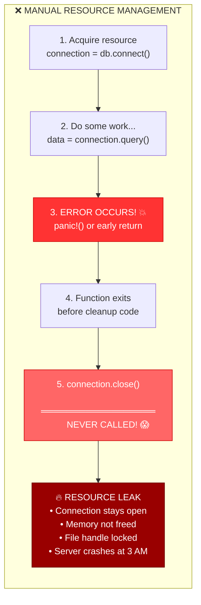
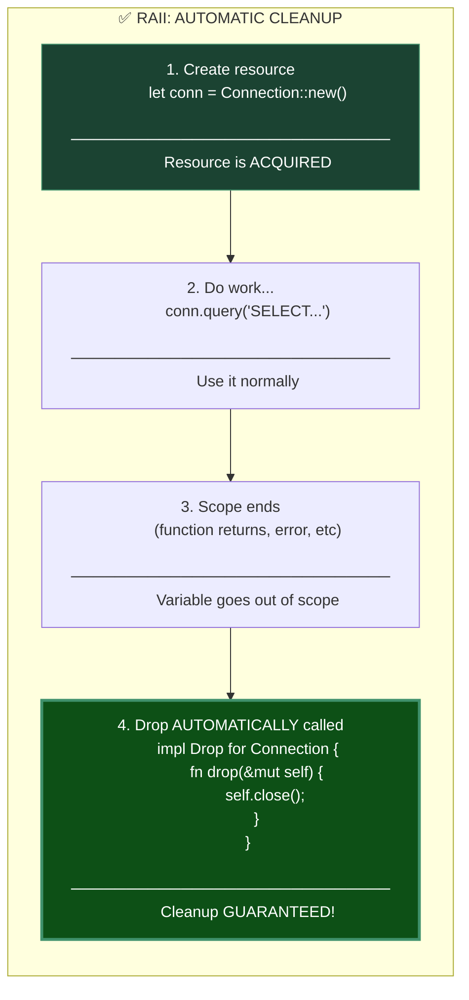
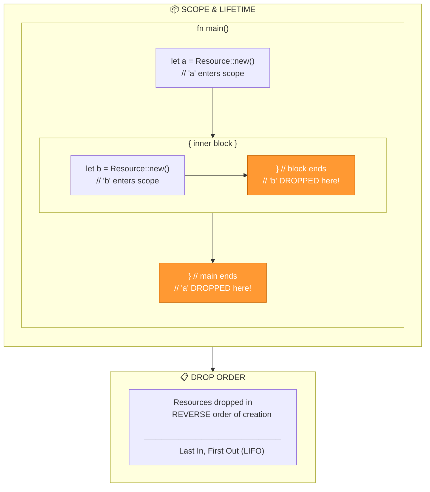
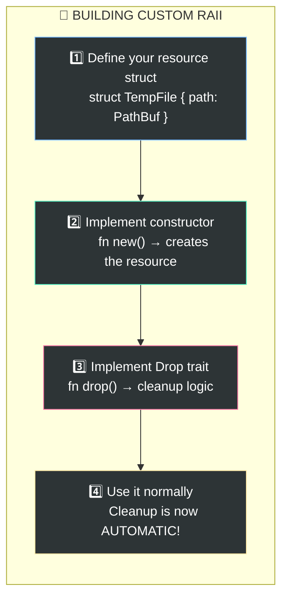
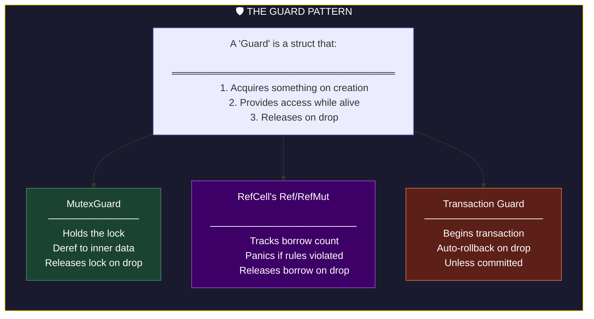
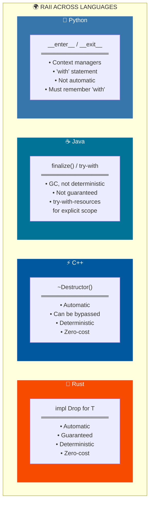
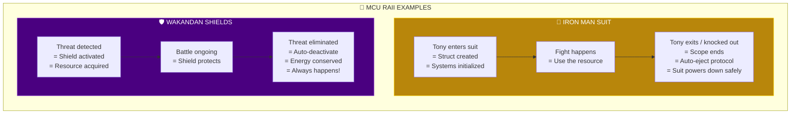

Based on the document, the **fourth key concept** is **"RAII Resource Management"** — the principle that all resources are automatically managed with `Drop` implementations.

---

# 🛡️ RAII: The Wakandan Auto-Shield Protocol

## The Core Concept

**RAII** = *Resource Acquisition Is Initialization*

In plain English: **When something is created, it sets up. When it's destroyed, it cleans up. Automatically. Always. No exceptions.**

Think of Wakanda's energy shields — they activate the instant you need them and deactivate automatically when the threat ends. You never manually turn them off, and they NEVER stay on wasting power.

---

## Part 1: The Problem RAII Solves



**The Buggy Code (C-style):**

```c
// ❌ C: Manual resource management (DANGEROUS)
void process_data() {
    FILE* file = fopen("data.txt", "r");
    Connection* conn = db_connect("localhost");
    
    char* buffer = malloc(1024);
    
    // Do some work...
    if (some_error_condition) {
        return;  // 💥 LEAKED: file, conn, buffer!
    }
    
    // More work...
    if (another_error) {
        free(buffer);
        return;  // 💥 LEAKED: file, conn!
    }
    
    // Must remember ALL cleanup, in reverse order
    free(buffer);
    db_disconnect(conn);
    fclose(file);
}
```

---

## Part 2: RAII — The Automatic Solution



**The Safe Code (Rust RAII):**

```rust
// ✅ RUST: RAII automatic cleanup (SAFE)

struct Connection {
    host: String,
    is_open: bool,
}

impl Connection {
    fn new(host: &str) -> Self {
        println!("🔗 Opening connection to {}", host);
        Self {
            host: host.to_string(),
            is_open: true,
        }
    }
    
    fn query(&self, sql: &str) -> Result<Data, Error> {
        // Do query...
        Ok(Data::new())
    }
}

// 🛡️ THE MAGIC: Drop trait
impl Drop for Connection {
    fn drop(&mut self) {
        println!("🔌 Auto-closing connection to {}", self.host);
        self.is_open = false;
        // Cleanup happens HERE, automatically!
    }
}

fn process_data() -> Result<(), Error> {
    let conn = Connection::new("localhost");  // Acquired!
    
    // Do some work...
    if some_error {
        return Err(Error::new("oops"));
        // 🎉 conn.drop() called automatically!
    }
    
    conn.query("SELECT * FROM users")?;
    
    Ok(())
    // 🎉 conn.drop() called automatically here too!
}
// Connection ALWAYS cleaned up, no matter how we exit!
```

---

## Part 3: How Drop Works



**Demonstrating Drop Order:**

```rust
struct Resource {
    name: String,
}

impl Resource {
    fn new(name: &str) -> Self {
        println!("📦 Creating: {}", name);
        Self { name: name.to_string() }
    }
}

impl Drop for Resource {
    fn drop(&mut self) {
        println!("🗑️  Dropping: {}", self.name);
    }
}

fn main() {
    let first = Resource::new("First");   // Created 1st
    let second = Resource::new("Second"); // Created 2nd
    
    {
        let inner = Resource::new("Inner"); // Created 3rd
        println!("Inside inner block");
    } // "Inner" dropped here!
    
    println!("Back in main");
} // "Second" dropped, then "First" (reverse order!)

// OUTPUT:
// 📦 Creating: First
// 📦 Creating: Second
// 📦 Creating: Inner
// Inside inner block
// 🗑️  Dropping: Inner    <-- Dropped when block ends
// Back in main
// 🗑️  Dropping: Second   <-- LIFO order
// 🗑️  Dropping: First
```

---

## Part 4: Real-World RAII Examples


**Real Code Examples:**

```rust
use std::fs::File;
use std::io::{Read, Write};
use std::sync::Mutex;

// ═══════════════════════════════════════
// 📁 FILE HANDLING - Auto-closed
// ═══════════════════════════════════════
fn read_config() -> Result<String, std::io::Error> {
    let mut file = File::open("config.toml")?;
    let mut contents = String::new();
    file.read_to_string(&mut contents)?;
    Ok(contents)
} // 🎉 File automatically closed here!

// ═══════════════════════════════════════
// 🔐 MUTEX LOCKS - Auto-released
// ═══════════════════════════════════════
fn update_counter(counter: &Mutex<u32>) {
    let mut guard = counter.lock().unwrap();
    *guard += 1;
    println!("Counter: {}", *guard);
} // 🎉 Lock automatically released here!
  // Even if we panic, lock is released!

// ═══════════════════════════════════════
// 💾 HEAP MEMORY - Auto-freed
// ═══════════════════════════════════════
fn process_large_data() {
    let data: Box<[u8; 1_000_000]> = Box::new([0; 1_000_000]);
    // Use the 1MB buffer...
    process(&data);
} // 🎉 1MB automatically freed here!

// ═══════════════════════════════════════
// 🗄️ CONNECTION POOL - Auto-returned
// ═══════════════════════════════════════
async fn get_user(pool: &PgPool, id: i32) -> Result<User, Error> {
    let conn = pool.acquire().await?;  // Get from pool
    let user = sqlx::query_as("SELECT * FROM users WHERE id = $1")
        .bind(id)
        .fetch_one(&conn)
        .await?;
    Ok(user)
} // 🎉 Connection returned to pool automatically!
```

---

## Part 5: Custom Drop Implementation



**Complete Example — Temporary File:**

```rust
use std::fs::{self, File};
use std::io::Write;
use std::path::PathBuf;

/// A temporary file that auto-deletes when dropped
struct TempFile {
    path: PathBuf,
    file: File,
}

impl TempFile {
    fn new(name: &str) -> std::io::Result<Self> {
        let path = std::env::temp_dir().join(name);
        println!("📝 Creating temp file: {:?}", path);
        let file = File::create(&path)?;
        Ok(Self { path, file })
    }
    
    fn write_all(&mut self, data: &[u8]) -> std::io::Result<()> {
        self.file.write_all(data)
    }
}

impl Drop for TempFile {
    fn drop(&mut self) {
        println!("🗑️  Auto-deleting temp file: {:?}", self.path);
        if let Err(e) = fs::remove_file(&self.path) {
            eprintln!("Warning: couldn't delete temp file: {}", e);
        }
    }
}

fn process_with_temp_file() -> std::io::Result<()> {
    let mut temp = TempFile::new("processing.tmp")?;
    
    temp.write_all(b"intermediate data")?;
    
    // Do processing...
    if something_failed {
        return Err(Error::new("processing failed"));
        // 🎉 Temp file STILL gets deleted!
    }
    
    Ok(())
} // 🎉 Temp file automatically deleted!
```

---

## Part 6: RAII Guards Pattern



**Transaction Guard Example:**

```rust
/// Database transaction with auto-rollback
struct Transaction<'a> {
    conn: &'a mut Connection,
    committed: bool,
}

impl<'a> Transaction<'a> {
    fn begin(conn: &'a mut Connection) -> Result<Self, DbError> {
        conn.execute("BEGIN")?;
        println!("🔓 Transaction started");
        Ok(Self { conn, committed: false })
    }
    
    fn execute(&mut self, sql: &str) -> Result<(), DbError> {
        self.conn.execute(sql)
    }
    
    fn commit(mut self) -> Result<(), DbError> {
        self.conn.execute("COMMIT")?;
        self.committed = true;
        println!("✅ Transaction committed");
        Ok(())
    }
}

impl Drop for Transaction<'_> {
    fn drop(&mut self) {
        if !self.committed {
            println!("⚠️  Rolling back uncommitted transaction!");
            let _ = self.conn.execute("ROLLBACK");
        }
    }
}

// Usage
fn transfer_money(conn: &mut Connection) -> Result<(), DbError> {
    let mut tx = Transaction::begin(conn)?;
    
    tx.execute("UPDATE accounts SET balance = balance - 100 WHERE id = 1")?;
    tx.execute("UPDATE accounts SET balance = balance + 100 WHERE id = 2")?;
    
    // If we forget to commit, or error occurs...
    if validation_failed {
        return Err(DbError::ValidationFailed);
        // 🎉 Transaction automatically rolled back!
    }
    
    tx.commit()?;  // Explicitly commit
    Ok(())
}
```

---

## Part 7: Cross-Language Comparison



**Side-by-Side Comparison:**

```rust
// ═══════════════════════════════════════
// 🦀 RUST — Automatic, always works
// ═══════════════════════════════════════
fn process() {
    let file = File::open("data.txt").unwrap();
    // use file...
}   // ✅ Closed automatically. Always. Even on panic.
```

```cpp
// ═══════════════════════════════════════
// ⚡ C++ — Automatic, but can be bypassed
// ═══════════════════════════════════════
void process() {
    std::ifstream file("data.txt");
    // use file...
}   // ✅ Closed automatically

// BUT...
void dangerous() {
    auto* file = new std::ifstream("data.txt");
    // use file...
}   // ❌ LEAKED! 'new' bypasses RAII
```

```java
// ═══════════════════════════════════════
// ☕ JAVA — Must explicitly use try-with-resources
// ═══════════════════════════════════════

// ❌ OLD WAY: Easy to leak
void oldWay() throws IOException {
    FileReader file = new FileReader("data.txt");
    // use file...
    // What if exception here? LEAKED!
    file.close();
}

// ✅ BETTER: try-with-resources (Java 7+)
void newWay() throws IOException {
    try (FileReader file = new FileReader("data.txt")) {
        // use file...
    }   // Closed automatically
}
// But you must REMEMBER to use try-with-resources!
```

```python
# ═══════════════════════════════════════
# 🐍 PYTHON — Context managers with 'with'
# ═══════════════════════════════════════

# ❌ WRONG: Manual management
def bad_way():
    file = open("data.txt")
    # use file...
    # What if exception? LEAKED!
    file.close()

# ✅ RIGHT: Context manager
def good_way():
    with open("data.txt") as file:
        # use file...
    # Closed automatically

# But you must REMEMBER to use 'with'!
```

```go
// ═══════════════════════════════════════
// 🐹 GO — defer statement
// ═══════════════════════════════════════
func process() error {
    file, err := os.Open("data.txt")
    if err != nil {
        return err
    }
    defer file.Close()  // Must remember this!
    
    // use file...
    return nil
}
// 'defer' runs at function exit, but you must remember it
```

---

## Part 8: Comparison Table

| Feature | 🦀 Rust | ⚡ C++ | ☕ Java | 🐍 Python | 🐹 Go |
|:--------|:--------|:-------|:--------|:----------|:------|
| **Automatic** | ✅ Always | ⚠️ Usually | ❌ No | ❌ No | ❌ No |
| **Deterministic** | ✅ Yes | ✅ Yes | ❌ GC | ✅ Yes | ✅ Yes |
| **Can Forget** | ❌ No | ⚠️ `new` | ✅ Yes | ✅ Yes | ✅ Yes |
| **Syntax** | Implicit | Implicit | `try()` | `with` | `defer` |
| **Nested OK** | ✅ Yes | ✅ Yes | ⚠️ Verbose | ⚠️ Indent | ✅ Yes |
| **Zero-cost** | ✅ Yes | ✅ Yes | ❌ No | ❌ No | ⚠️ Runtime |

---

## Part 9: The MCU Analogy



---

## Part 10: Common RAII Patterns in Rust

```rust
// ═══════════════════════════════════════
// 🔐 SCOPEGUARD — Run code on exit
// ═══════════════════════════════════════
use scopeguard::defer;

fn with_cleanup() {
    defer! {
        println!("This runs no matter what!");
    }
    
    // Do risky operations...
    might_panic();
    
    // Cleanup runs even if we panic!
}

// ═══════════════════════════════════════
// 📊 TRACING SPANS — Auto-close spans
// ═══════════════════════════════════════
use tracing::{info_span, Instrument};

async fn process_request(id: u64) {
    let span = info_span!("request", %id);
    let _guard = span.enter();  // RAII guard!
    
    // All logs in here are tagged with request id
    do_work().await;
    
}   // Span automatically closed!

// ═══════════════════════════════════════
// 🕐 TIMING — Auto-log elapsed time
// ═══════════════════════════════════════
struct Timer {
    name: String,
    start: std::time::Instant,
}

impl Timer {
    fn new(name: &str) -> Self {
        Self {
            name: name.to_string(),
            start: std::time::Instant::now(),
        }
    }
}

impl Drop for Timer {
    fn drop(&mut self) {
        let elapsed = self.start.elapsed();
        println!("⏱️  {} took {:?}", self.name, elapsed);
    }
}

fn slow_operation() {
    let _timer = Timer::new("slow_operation");
    
    std::thread::sleep(std::time::Duration::from_secs(2));
    
}   // Prints: "⏱️ slow_operation took 2.00s"
```

---

## 🧠 The Tony Stark Principle

> **"JARVIS, auto-cleanup protocols. If I'm unconscious, shut everything down safely."**
> 
> That's RAII — resources clean themselves up, no matter how you exit.

**Key Takeaways:**

| Principle | Meaning |
|:----------|:--------|
| **Acquisition = Initialization** | Get the resource in the constructor |
| **Release = Destruction** | Free the resource in `drop()` |
| **Scope = Lifetime** | Resource lives as long as the variable |
| **Automatic = Safe** | No manual cleanup = no forgotten cleanup |

**This is why Rust has no garbage collector yet no memory leaks — ownership + RAII = automatic, deterministic, zero-cost resource management.** 🚀

