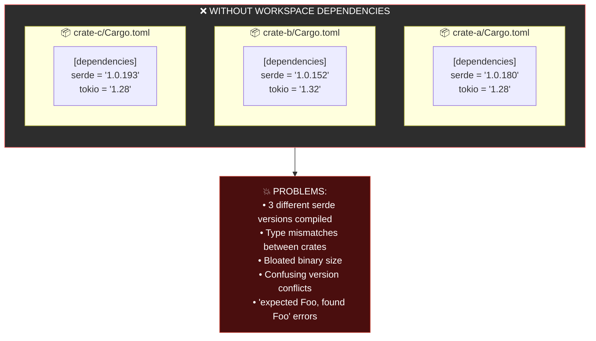
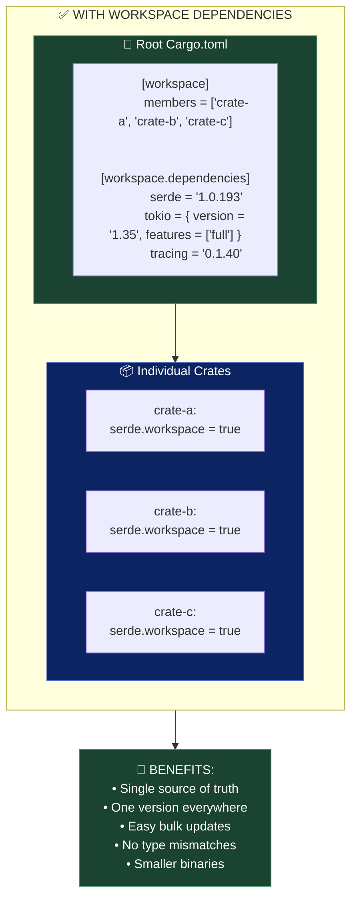
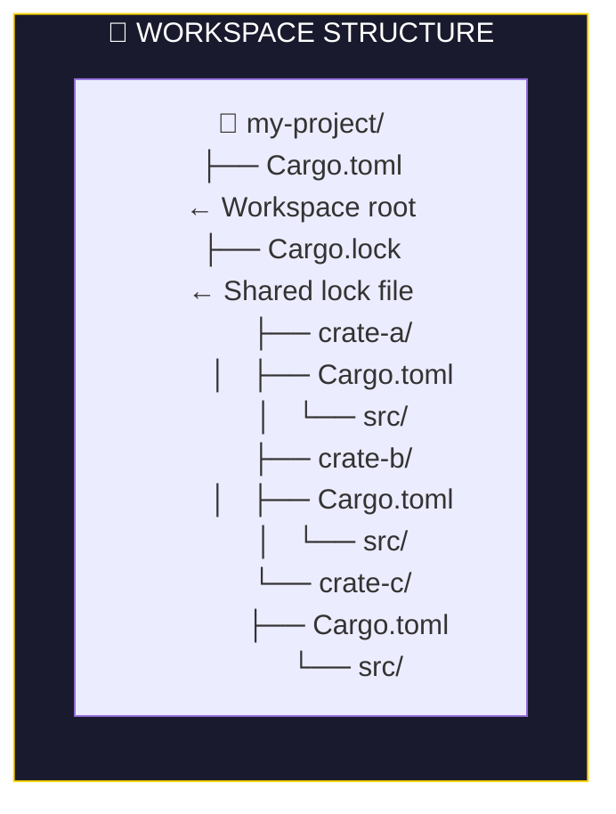
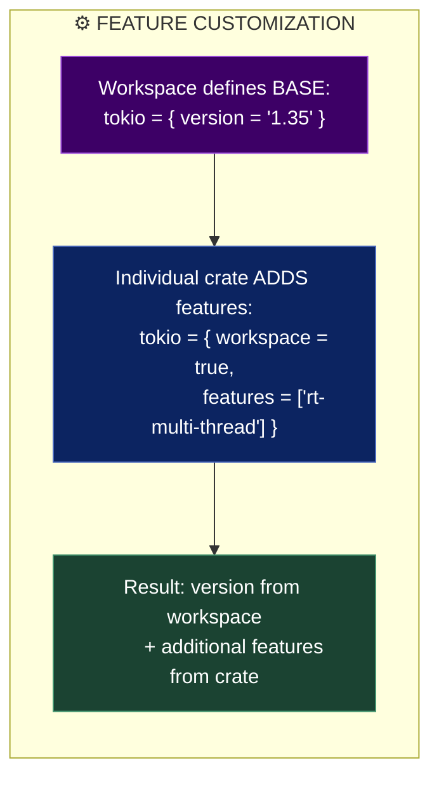
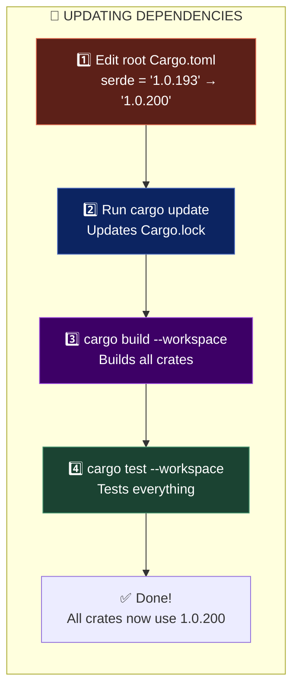
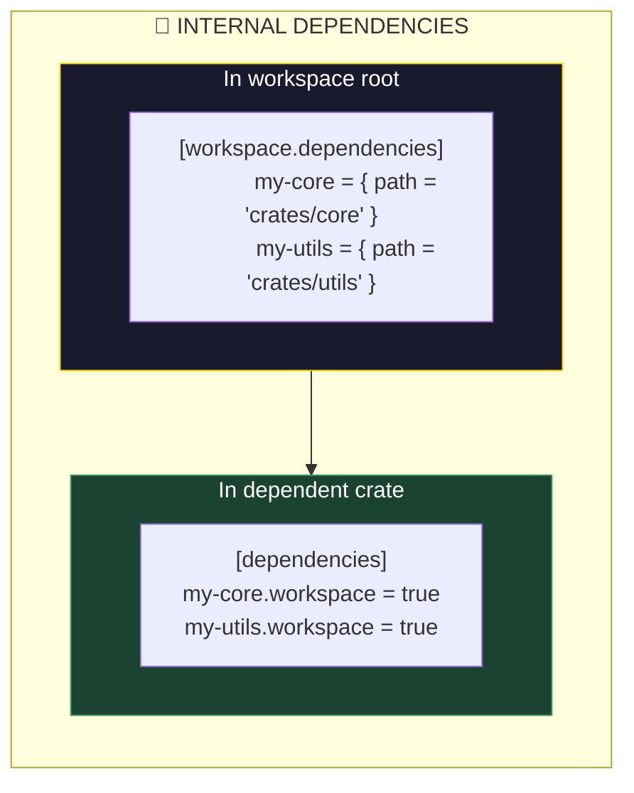
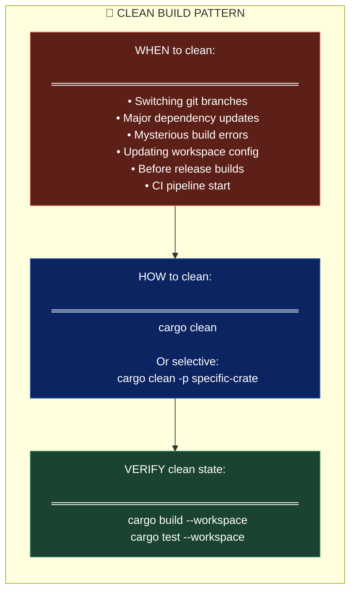
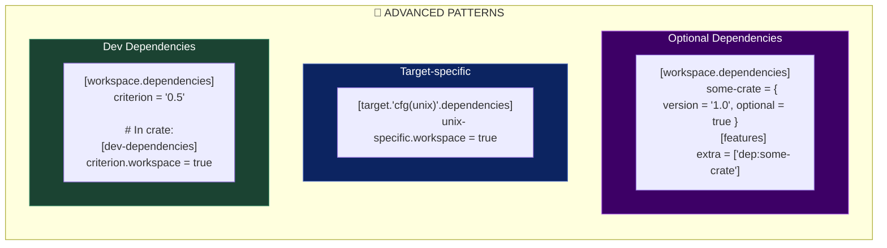
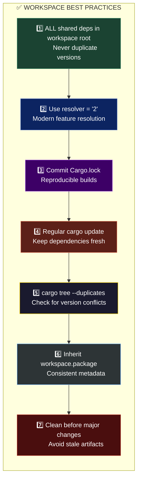

The **first concept** in this document is **"0A. Workspace and Dependency Management"** — specifically starting with **"0A.1 Workspace-level dependency declaration for version consistency"**. This is about managing dependencies in Rust workspaces to ensure consistent versions across multiple crates.

---

# 📦 Workspace Dependency Management: The S.H.I.E.L.D. Supply Chain

## The Core Concept

In a Rust **workspace** (a collection of related crates), you want ALL crates to use the **same version** of shared dependencies. Without this, you get version conflicts, duplicate compilations, and "dependency hell."

Think of it like S.H.I.E.L.D. managing equipment for all Avengers teams — everyone needs to use **compatible gear** from the **same supplier**, or missions fail.

---

## Part 1: The Problem Without Workspace Dependencies



**The Problematic Structure:**

```toml
# ❌ BAD: Each crate declares its own versions

# crate-a/Cargo.toml
[dependencies]
serde = "1.0.180"
tokio = { version = "1.28", features = ["full"] }
tracing = "0.1.37"

# crate-b/Cargo.toml  
[dependencies]
serde = "1.0.152"  # Different version!
tokio = { version = "1.32", features = ["rt"] }  # Different!
tracing = "0.1.40"  # Different!

# crate-c/Cargo.toml
[dependencies]
serde = "1.0.193"  # Yet another version!
tokio = { version = "1.28", features = ["sync"] }
```

**The Nightmare Error:**

```rust
// This actually happens with version mismatches!
error[E0308]: mismatched types
  --> src/lib.rs:15:5
   |
15 |     process(data)
   |     ^^^^^^^ expected `serde_json::Value` (serde 1.0.180)
   |             found `serde_json::Value` (serde 1.0.152)
   |
   = note: perhaps two different versions of crate `serde` are being used?
```

---

## Part 2: The Solution — Workspace Dependencies



---

## Part 3: The Correct Structure



**Root Cargo.toml (The Central Command):**

```toml
# ═══════════════════════════════════════
# 📂 /Cargo.toml (Workspace Root)
# ═══════════════════════════════════════

[workspace]
# List all member crates
members = [
    "crate-a",
    "crate-b", 
    "crate-c",
    "crates/*",  # Glob patterns work too!
]

# Optional: exclude some directories
exclude = [
    "examples/experimental",
]

# Shared resolver version (use "2" for modern Rust)
resolver = "2"

# ════════════════════════════════════════
# 🎯 WORKSPACE DEPENDENCIES - Single Source of Truth
# ════════════════════════════════════════
[workspace.dependencies]
# Core serialization
serde = { version = "1.0.193", features = ["derive"] }
serde_json = "1.0.108"

# Async runtime
tokio = { version = "1.35", features = ["full"] }

# Error handling
thiserror = "1.0.56"
anyhow = "1.0.79"

# Logging/tracing
tracing = "0.1.40"
tracing-subscriber = { version = "0.3.18", features = ["env-filter"] }

# Testing
tokio-test = "0.4.3"
proptest = "1.4.0"

# Internal crates (path dependencies)
crate-a = { path = "crate-a" }
crate-b = { path = "crate-b" }
crate-c = { path = "crate-c" }

# ════════════════════════════════════════
# 📦 WORKSPACE METADATA
# ════════════════════════════════════════
[workspace.package]
version = "0.1.0"
edition = "2021"
rust-version = "1.75"
authors = ["Your Team <team@example.com>"]
license = "MIT OR Apache-2.0"
repository = "https://github.com/org/project"
```

**Individual Crate Cargo.toml:**

```toml
# ═══════════════════════════════════════
# 📦 crate-a/Cargo.toml
# ═══════════════════════════════════════

[package]
name = "crate-a"
# Inherit from workspace
version.workspace = true
edition.workspace = true
rust-version.workspace = true
authors.workspace = true
license.workspace = true

[dependencies]
# Just reference workspace dependencies!
serde.workspace = true
serde_json.workspace = true
tokio.workspace = true
thiserror.workspace = true
tracing.workspace = true

# Internal workspace crate
crate-b.workspace = true

# Crate-specific dependency (not in workspace)
uuid = { version = "1.6", features = ["v4"] }

[dev-dependencies]
tokio-test.workspace = true
proptest.workspace = true
```

---

## Part 4: Adding Features Locally



**Code Example:**

```toml
# ═══════════════════════════════════════
# Root Cargo.toml - Base definition
# ═══════════════════════════════════════
[workspace.dependencies]
tokio = { version = "1.35" }  # No features by default

# ═══════════════════════════════════════
# crate-a/Cargo.toml - Needs full runtime
# ═══════════════════════════════════════
[dependencies]
tokio = { workspace = true, features = ["full"] }

# ═══════════════════════════════════════
# crate-b/Cargo.toml - Only needs sync primitives
# ═══════════════════════════════════════
[dependencies]
tokio = { workspace = true, features = ["sync"] }

# ═══════════════════════════════════════
# crate-c/Cargo.toml - Needs IO + time
# ═══════════════════════════════════════
[dependencies]
tokio = { workspace = true, features = ["io-util", "time"] }
```

---

## Part 5: Version Update Workflow



**Commands:**

```bash
# ═══════════════════════════════════════
# WORKSPACE COMMANDS
# ═══════════════════════════════════════

# Build entire workspace
cargo build --workspace

# Test entire workspace
cargo test --workspace

# Check entire workspace (faster than build)
cargo check --workspace

# Update dependencies
cargo update

# Update specific dependency
cargo update -p serde

# See dependency tree
cargo tree

# Find duplicate dependencies
cargo tree --duplicates

# Build specific crate
cargo build -p crate-a

# Run specific crate's binary
cargo run -p crate-a

# Clean workspace
cargo clean
```

---

## Part 6: Internal Crate Dependencies



**Complete Example:**

```toml
# ═══════════════════════════════════════
# Root Cargo.toml
# ═══════════════════════════════════════
[workspace]
members = [
    "crates/core",
    "crates/utils",
    "crates/api",
    "crates/cli",
]

[workspace.dependencies]
# External dependencies
serde = { version = "1.0", features = ["derive"] }
tokio = { version = "1.35", features = ["full"] }

# Internal crates - define them here!
my-core = { path = "crates/core" }
my-utils = { path = "crates/utils" }
my-api = { path = "crates/api" }

# ═══════════════════════════════════════
# crates/api/Cargo.toml
# ═══════════════════════════════════════
[package]
name = "my-api"
version.workspace = true

[dependencies]
# External
serde.workspace = true
tokio.workspace = true

# Internal - same clean syntax!
my-core.workspace = true
my-utils.workspace = true

# ═══════════════════════════════════════
# crates/cli/Cargo.toml
# ═══════════════════════════════════════
[package]
name = "my-cli"
version.workspace = true

[dependencies]
my-api.workspace = true
my-core.workspace = true
tokio.workspace = true
```

---

## Part 7: The Clean Build Pattern



**Clean Build Script:**

```bash
#!/bin/bash
# ═══════════════════════════════════════
# clean-rebuild.sh - Full clean rebuild
# ═══════════════════════════════════════

set -e  # Exit on error

echo "🧹 Cleaning workspace..."
cargo clean

echo "🔄 Updating dependencies..."
cargo update

echo "🔨 Building workspace..."
cargo build --workspace

echo "🧪 Running tests..."
cargo test --workspace

echo "📋 Checking for issues..."
cargo clippy --workspace -- -D warnings

echo "✅ Clean build complete!"
```

---

## Part 8: Advanced Patterns



**Advanced Cargo.toml:**

```toml
# ═══════════════════════════════════════
# Root Cargo.toml - Advanced Setup
# ═══════════════════════════════════════

[workspace]
members = ["crates/*"]
resolver = "2"

[workspace.dependencies]
# Regular dependencies
serde = { version = "1.0", features = ["derive"] }
tokio = { version = "1.35", features = ["full"] }

# Optional dependencies (for features)
aws-sdk-s3 = { version = "1.0", optional = true }
redis = { version = "0.24", optional = true }

# Dev/test dependencies
criterion = "0.5"
proptest = "1.4"
tokio-test = "0.4"
wiremock = "0.5"

# Build dependencies
prost-build = "0.12"

[workspace.metadata.release]
# cargo-release configuration
shared-version = true
tag-name = "v{{version}}"

# ═══════════════════════════════════════
# crates/my-service/Cargo.toml
# ═══════════════════════════════════════

[package]
name = "my-service"
version.workspace = true
edition.workspace = true

[dependencies]
serde.workspace = true
tokio.workspace = true

# Optional features
aws-sdk-s3 = { workspace = true, optional = true }
redis = { workspace = true, optional = true }

[dev-dependencies]
criterion.workspace = true
proptest.workspace = true
tokio-test.workspace = true
wiremock.workspace = true

[build-dependencies]
prost-build.workspace = true

[features]
default = []
aws = ["dep:aws-sdk-s3"]
caching = ["dep:redis"]
full = ["aws", "caching"]

# Platform-specific
[target.'cfg(unix)'.dependencies]
nix = "0.27"

[target.'cfg(windows)'.dependencies]
windows = "0.52"

[[bench]]
name = "performance"
harness = false
```

---

## Part 9: Cross-Language Comparison

| Feature | 🦀 Cargo Workspace | 📦 npm/pnpm | 🐍 Poetry | ☕ Maven |
|:--------|:-------------------|:------------|:----------|:---------|
| **Shared versions** | `[workspace.dependencies]` | `pnpm-workspace.yaml` | `[tool.poetry.dependencies]` | Parent POM |
| **Local reference** | `dep.workspace = true` | `"workspace:*"` | Path deps | Module inheritance |
| **Lock file** | Single `Cargo.lock` | `pnpm-lock.yaml` | `poetry.lock` | None (by default) |
| **Feature flags** | ✅ Native | ❌ No | ❌ No | Profiles |
| **Build caching** | ✅ Shared target/ | ✅ .pnpm-store | ✅ Cache | ✅ .m2 |

---

## Part 10: Best Practices Checklist



---

## 🧠 The Nick Fury Principle

> **"All Avengers teams use the same supplier for equipment. Different gear versions? That's how missions fail."**

| Approach | Result |
|:---------|:-------|
| **Per-crate versions** | Version conflicts, type mismatches, bloat |
| **Workspace dependencies** | Single source of truth, consistent builds |

**Key Takeaways:**

1. **Define all shared dependencies in the workspace root**
2. **Use `dep.workspace = true`** in individual crates
3. **Add features locally** when needed
4. **Run `cargo tree --duplicates`** to catch conflicts
5. **Clean build** when switching branches or updating deps
6. **Single `Cargo.lock`** ensures reproducible builds across all crates

This is the foundation of maintainable, scalable Rust projects! 🚀

