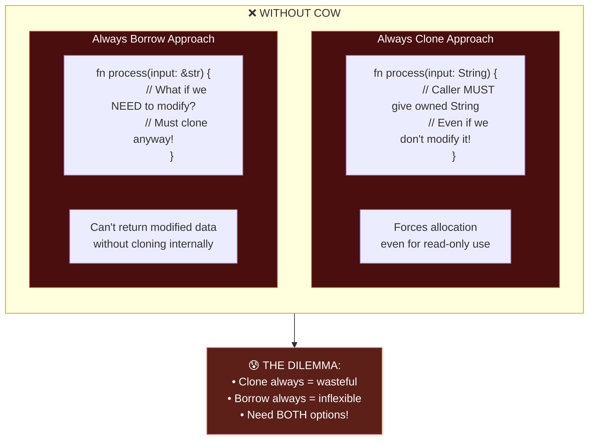
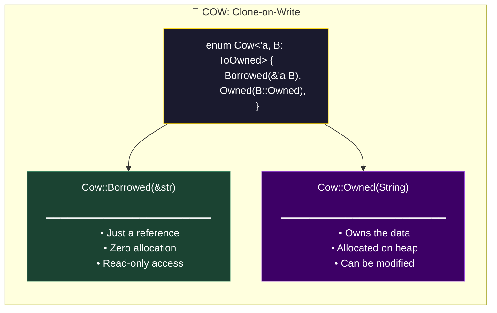
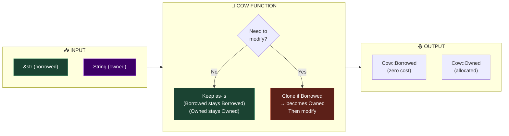
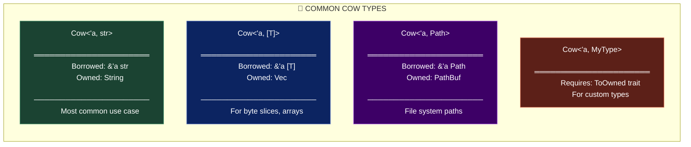
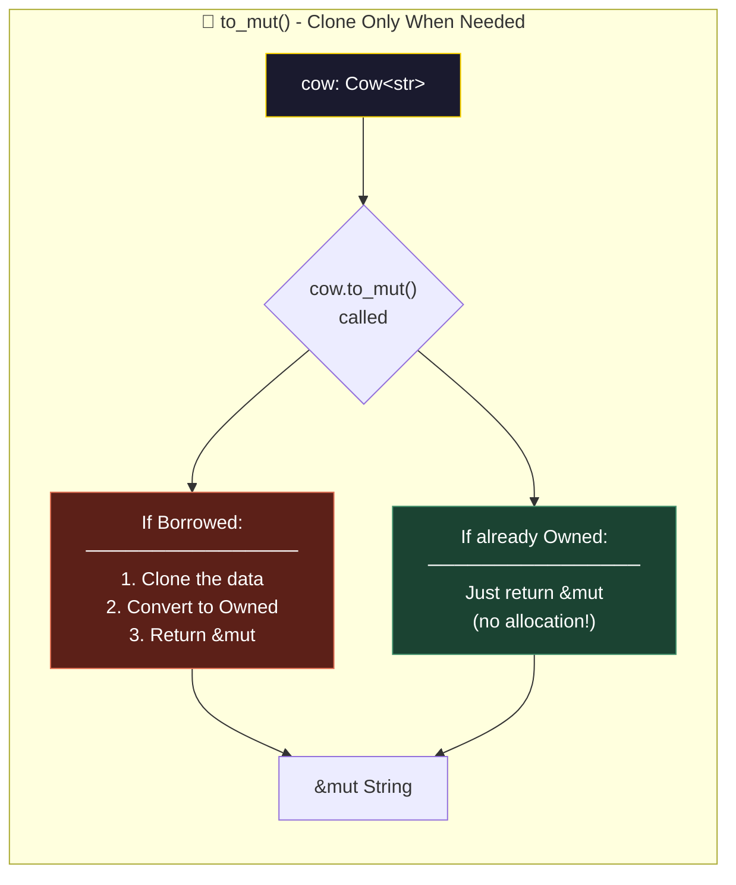
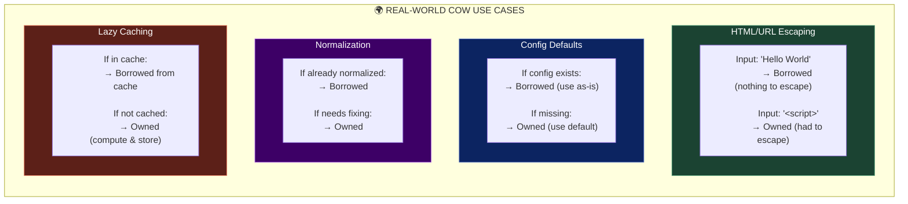
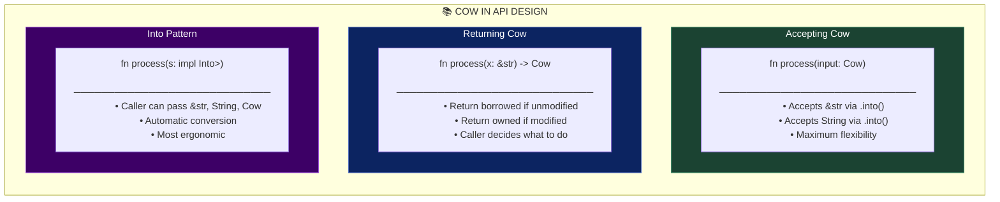
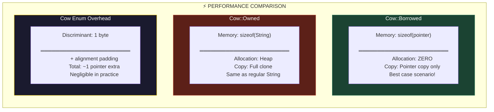
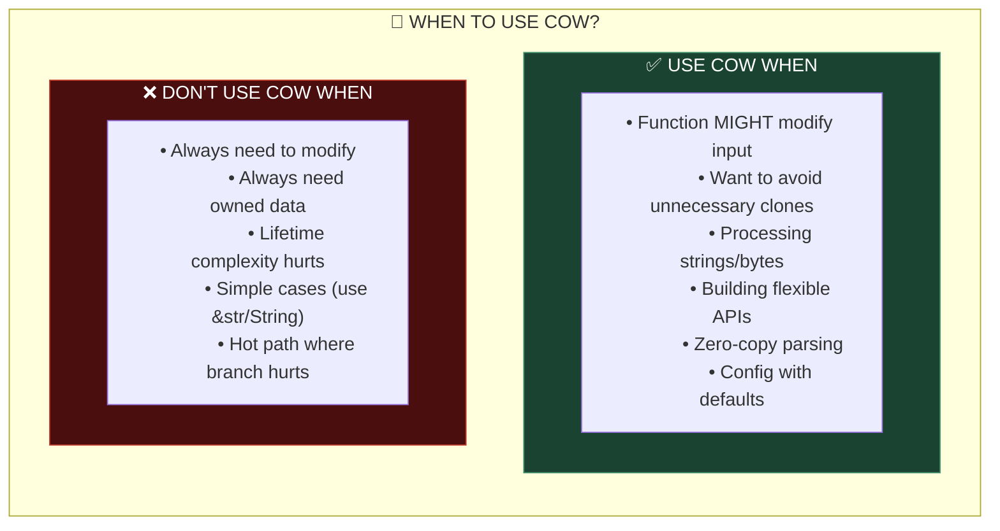

Based on the document, the **next concept** is **"1.1 Clone-on-Write (Cow) for optional data ownership"** — a smart pointer pattern that avoids unnecessary cloning by only allocating when mutation is needed.

---

# 🐄 Clone-on-Write (Cow): The Mystique Pattern

## The Core Concept

**Cow** = *Clone on Write*

It's a smart pointer that can hold either a **borrowed reference** OR an **owned value**. It only clones (allocates) when you actually need to **modify** the data.

Think of it like Mystique from X-Men — she can either **borrow someone's appearance** (cheap, no effort) or **fully transform** (expensive, but necessary when she needs to act). She only transforms when she absolutely must.

---

## Part 1: The Problem Cow Solves



**The Wasteful Approach:**

```rust
// ❌ WASTEFUL: Always requires owned String
fn normalize_username(input: String) -> String {
    if input.contains(' ') {
        input.replace(' ', "_")  // Needed modification
    } else {
        input  // Didn't need to modify, but caller already cloned!
    }
}

// Caller must clone even if unnecessary
let name = "alice";  // &str
let normalized = normalize_username(name.to_string());  // Forced clone!

// If name was "bob" (no spaces), we cloned for nothing!
```

---

## Part 2: Enter Cow — Best of Both Worlds



**The Smart Approach:**

```rust
use std::borrow::Cow;

// ✅ SMART: Takes Cow - works with both borrowed AND owned
fn normalize_username(input: Cow<str>) -> Cow<str> {
    if input.contains(' ') {
        // Need to modify → clone into owned String
        Cow::Owned(input.replace(' ', "_"))
    } else {
        // No modification needed → return as-is (maybe still borrowed!)
        input
    }
}

// Usage 1: Pass a borrowed &str
let name1 = "alice";  // No spaces
let result1 = normalize_username(Cow::Borrowed(name1));
// result1 is still Borrowed! Zero allocation!

// Usage 2: Pass a borrowed &str that needs modification
let name2 = "bob smith";  // Has space
let result2 = normalize_username(Cow::Borrowed(name2));
// result2 is Owned (had to clone to modify)

// Usage 3: Pass an already-owned String
let name3 = String::from("charlie");
let result3 = normalize_username(Cow::Owned(name3));
// result3 is Owned, reuses the original allocation if no modification
```

---

## Part 3: The Visual Mental Model



---

## Part 4: Common Cow Types



**Code Examples:**

```rust
use std::borrow::Cow;
use std::path::Path;

// ═══════════════════════════════════════
// Cow<str> - String handling
// ═══════════════════════════════════════
fn ensure_prefix(s: &str) -> Cow<str> {
    if s.starts_with("https://") {
        Cow::Borrowed(s)  // Already has prefix, no change
    } else {
        Cow::Owned(format!("https://{}", s))  // Must create new string
    }
}

let url1 = ensure_prefix("https://example.com");  // Borrowed!
let url2 = ensure_prefix("example.com");          // Owned (allocated)

// ═══════════════════════════════════════
// Cow<[u8]> - Byte slice handling
// ═══════════════════════════════════════
fn ensure_null_terminated(bytes: &[u8]) -> Cow<[u8]> {
    if bytes.last() == Some(&0) {
        Cow::Borrowed(bytes)  // Already null-terminated
    } else {
        let mut owned = bytes.to_vec();
        owned.push(0);
        Cow::Owned(owned)  // Had to allocate
    }
}

// ═══════════════════════════════════════
// Cow<Path> - Path handling
// ═══════════════════════════════════════
fn ensure_absolute(path: &Path) -> Cow<Path> {
    if path.is_absolute() {
        Cow::Borrowed(path)
    } else {
        Cow::Owned(std::env::current_dir().unwrap().join(path))
    }
}
```

---

## Part 5: The `to_mut()` Method — Lazy Cloning



**Code Example:**

```rust
use std::borrow::Cow;

fn maybe_modify(mut cow: Cow<str>, should_modify: bool) -> Cow<str> {
    if should_modify {
        // to_mut() clones ONLY if currently Borrowed
        let s = cow.to_mut();  // Returns &mut String
        s.push_str(" (modified)");
    }
    // If should_modify is false, no allocation happened!
    cow
}

// Example 1: No modification needed
let input1 = Cow::Borrowed("hello");
let output1 = maybe_modify(input1, false);
// output1 is still Borrowed! Zero allocation!

// Example 2: Modification needed
let input2 = Cow::Borrowed("hello");
let output2 = maybe_modify(input2, true);
// output2 is Owned: "hello (modified)"

// Example 3: Already owned, modification needed
let input3 = Cow::Owned(String::from("hello"));
let output3 = maybe_modify(input3, true);
// No extra allocation! Modified in-place.
```

---

## Part 6: Real-World Use Cases



**Complete Real-World Examples:**

```rust
use std::borrow::Cow;

// ═══════════════════════════════════════
// 🔒 HTML ESCAPING
// ═══════════════════════════════════════
fn escape_html(input: &str) -> Cow<str> {
    // Check if escaping is needed
    if input.contains(|c| matches!(c, '<' | '>' | '&' | '"' | '\'')) {
        // Must escape - allocate new string
        let escaped = input
            .replace('&', "&amp;")
            .replace('<', "&lt;")
            .replace('>', "&gt;")
            .replace('"', "&quot;")
            .replace('\'', "&#39;");
        Cow::Owned(escaped)
    } else {
        // Safe string - zero allocation!
        Cow::Borrowed(input)
    }
}

// Most strings don't need escaping = zero allocations!
let safe = escape_html("Hello World");      // Borrowed
let unsafe_ = escape_html("<script>");       // Owned: "&lt;script&gt;"

// ═══════════════════════════════════════
// ⚙️ CONFIG WITH DEFAULTS
// ═══════════════════════════════════════
fn get_config_value<'a>(
    config: &'a HashMap<String, String>,
    key: &str,
    default: &'a str,
) -> Cow<'a, str> {
    match config.get(key) {
        Some(value) => Cow::Borrowed(value.as_str()),
        None => Cow::Borrowed(default),  // Can borrow static default!
    }
}

// Both paths return Borrowed - no allocations!

// ═══════════════════════════════════════
// 📝 WHITESPACE NORMALIZATION
// ═══════════════════════════════════════
fn normalize_whitespace(input: &str) -> Cow<str> {
    // Check if normalization is needed
    let needs_normalization = input.chars().any(|c| {
        c == '\t' || c == '\r' || input.contains("  ")
    });
    
    if needs_normalization {
        let normalized = input
            .replace('\t', " ")
            .replace('\r', "")
            .split_whitespace()
            .collect::<Vec<_>>()
            .join(" ");
        Cow::Owned(normalized)
    } else {
        Cow::Borrowed(input)
    }
}

// ═══════════════════════════════════════
// 🔗 URL SLUG GENERATION
// ═══════════════════════════════════════
fn to_slug(input: &str) -> Cow<str> {
    let is_valid_slug = input.chars().all(|c| {
        c.is_ascii_lowercase() || c.is_ascii_digit() || c == '-'
    });
    
    if is_valid_slug {
        Cow::Borrowed(input)  // Already a valid slug
    } else {
        let slug = input
            .to_lowercase()
            .chars()
            .map(|c| if c.is_alphanumeric() { c } else { '-' })
            .collect::<String>();
        Cow::Owned(slug)
    }
}

let slug1 = to_slug("hello-world");      // Borrowed (already valid)
let slug2 = to_slug("Hello World!");     // Owned: "hello-world-"
```

---

## Part 7: API Design with Cow



**Ergonomic API Design:**

```rust
use std::borrow::Cow;

// ═══════════════════════════════════════
// PATTERN 1: Accept impl Into<Cow<str>>
// ═══════════════════════════════════════
struct Config {
    name: Cow<'static, str>,
    description: Cow<'static, str>,
}

impl Config {
    // Accept anything that converts to Cow
    fn new(
        name: impl Into<Cow<'static, str>>,
        description: impl Into<Cow<'static, str>>,
    ) -> Self {
        Self {
            name: name.into(),
            description: description.into(),
        }
    }
}

// All of these work!
let c1 = Config::new("app", "My app");                    // &'static str
let c2 = Config::new(String::from("app"), "description"); // String
let c3 = Config::new(Cow::Borrowed("app"), "desc");       // Cow

// ═══════════════════════════════════════
// PATTERN 2: Return Cow for optional modification
// ═══════════════════════════════════════
fn sanitize_input(input: &str) -> Cow<str> {
    // ... implementation
    if needs_sanitization {
        Cow::Owned(sanitized)
    } else {
        Cow::Borrowed(input)
    }
}

// Caller can easily convert if needed:
let result = sanitize_input("hello");
let owned: String = result.into_owned();  // Force to String
let borrowed: &str = &result;             // Borrow (works for both variants)

// ═══════════════════════════════════════
// PATTERN 3: Cow in structs for flexibility
// ═══════════════════════════════════════
#[derive(Debug, Clone)]
struct Message<'a> {
    id: u64,
    content: Cow<'a, str>,
    metadata: Cow<'a, [u8]>,
}

impl<'a> Message<'a> {
    // Borrow from existing data (zero-copy parsing)
    fn parse(data: &'a str) -> Self {
        Self {
            id: 1,
            content: Cow::Borrowed(data),
            metadata: Cow::Borrowed(&[]),
        }
    }
    
    // Convert to owned for storage/sending
    fn into_owned(self) -> Message<'static> {
        Message {
            id: self.id,
            content: Cow::Owned(self.content.into_owned()),
            metadata: Cow::Owned(self.metadata.into_owned()),
        }
    }
}
```

---

## Part 8: Performance Characteristics



**Benchmark Example:**

```rust
use std::borrow::Cow;
use criterion::{black_box, criterion_group, criterion_main, Criterion};

fn escape_always_clone(input: &str) -> String {
    if input.contains('<') {
        input.replace('<', "&lt;")
    } else {
        input.to_string()  // Always allocates!
    }
}

fn escape_with_cow(input: &str) -> Cow<str> {
    if input.contains('<') {
        Cow::Owned(input.replace('<', "&lt;"))
    } else {
        Cow::Borrowed(input)  // Zero allocation!
    }
}

fn benchmark(c: &mut Criterion) {
    let safe_input = "This is a safe string with no special characters";
    
    c.bench_function("always_clone", |b| {
        b.iter(|| escape_always_clone(black_box(safe_input)))
    });
    
    c.bench_function("with_cow", |b| {
        b.iter(|| escape_with_cow(black_box(safe_input)))
    });
}

// Results (typical):
// always_clone: 45 ns/iter (+/- 2)  ← Allocates every time
// with_cow:     3 ns/iter (+/- 0)   ← Zero allocation!
```

---

## Part 9: Common Methods

```mermaid
flowchart TD
    subgraph METHODS["🔧 COW METHODS"]
        direction TB
        
        M1["cow.to_mut() → &mut T::Owned
        ══════════════════════════════════
        Clone if Borrowed, return &mut
        Lazy cloning!"]
        
        M2["cow.into_owned() → T::Owned
        ══════════════════════════════════
        Consume cow, return owned value
        Clone if was Borrowed"]
        
        M3["cow.is_borrowed() → bool
        cow.is_owned() → bool
        ══════════════════════════════════
        Check current state"]
        
        M4["Deref: &*cow → &T
        ══════════════════════════════════
        Borrow content (works for both)"]
        
        M5["From impls:
        Cow::from(&str) → Borrowed
        Cow::from(String) → Owned
        ══════════════════════════════════
        Ergonomic construction"]
    end
    
    style M1 fill:#1b4332,stroke:#40916c,color:#fff
    style M2 fill:#0c2461,stroke:#4a69bd,color:#fff
    style M3 fill:#3d0066,stroke:#9d4edd,color:#fff
    style M4 fill:#5c2018,stroke:#e17055,color:#fff
    style M5 fill:#1a1a2e,stroke:#ffd700,color:#fff
```



**Method Examples:**

```rust
use std::borrow::Cow;

let mut cow: Cow<str> = Cow::Borrowed("hello");

// Check state
assert!(cow.is_borrowed());
assert!(!cow.is_owned());

// Deref to access content
let len = cow.len();  // Works via Deref
let upper = cow.to_uppercase();  // Works via Deref

// to_mut() - lazy clone
{
    let s: &mut String = cow.to_mut();  // Clones here (was Borrowed)
    s.push_str(" world");
}
assert!(cow.is_owned());  // Now owned!

// into_owned() - consume and get owned
let owned: String = cow.into_owned();

// From implementations
let cow1: Cow<str> = "static string".into();  // Borrowed
let cow2: Cow<str> = String::from("owned").into();  // Owned
let cow3: Cow<str> = Cow::from("another");  // Borrowed
```

---

## Part 10: When to Use Cow



---

## Part 11: Cross-Language Comparison

| Feature | 🦀 Rust Cow | ⚡ C++ | ☕ Java | 🐍 Python |
|:--------|:------------|:-------|:--------|:----------|
| **Type** | `Cow<'a, T>` | N/A (manual) | N/A | N/A (GC) |
| **Mechanism** | Enum (Borrowed/Owned) | `shared_ptr` + copy | Immutable + copy | Reference counting |
| **Explicit** | ✅ Yes | Manual | Implicit | Implicit |
| **Zero-cost borrowed** | ✅ Yes | ⚠️ Depends | ❌ No | ❌ No |
| **Compile-time safety** | ✅ Yes | ⚠️ Partial | ❌ No | ❌ No |

```cpp
// C++ - Manual COW pattern (old std::string did this)
class CowString {
    std::shared_ptr<std::string> data;
public:
    void modify() {
        if (!data.unique()) {
            data = std::make_shared<std::string>(*data);  // Clone!
        }
        // Now safe to modify
    }
};
// Error-prone, not compile-time checked
```

---

## 🧠 The Mystique Principle

> **"Why fully transform when you can just borrow the appearance? Only transform when you absolutely must act."**

| Scenario | Without Cow | With Cow |
|:---------|:------------|:---------|
| No modification needed | Clone anyway 😢 | Zero allocation! 🎉 |
| Modification needed | Clone | Clone (same) |
| Already owned + modify | N/A | No extra allocation! |

**Key Takeaways:**

1. **Use `Cow<str>`** when a function *might* need to modify a string
2. **Return `Cow`** from functions that conditionally allocate
3. **Use `to_mut()`** for lazy cloning when you need mutation
4. **Accept `impl Into<Cow<str>>`** for maximum API flexibility
5. **Most strings don't need modification** — Cow exploits this!

This pattern can dramatically reduce allocations in string-heavy code! 🚀

