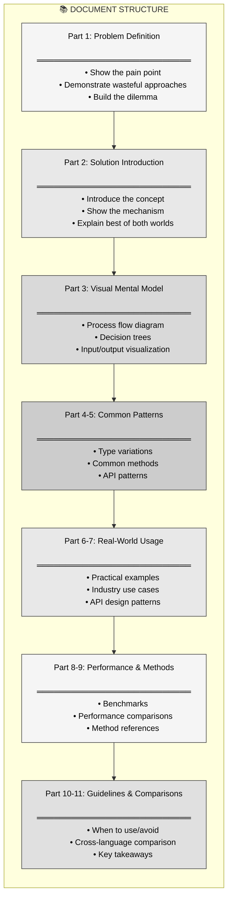
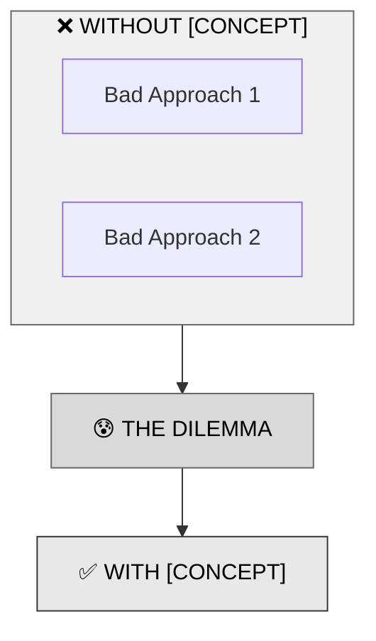
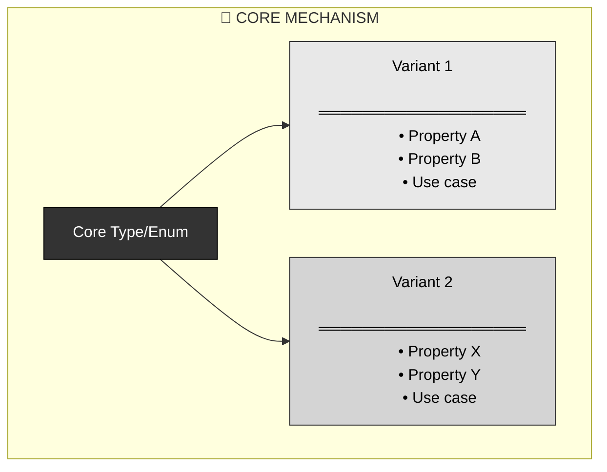
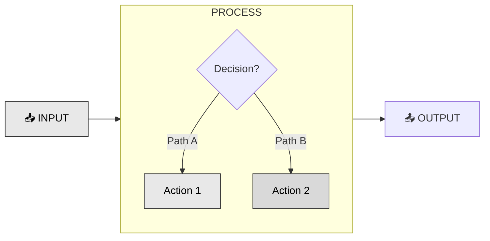
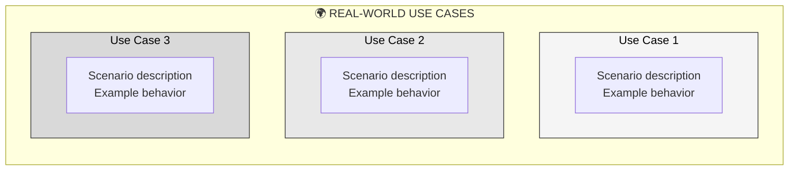
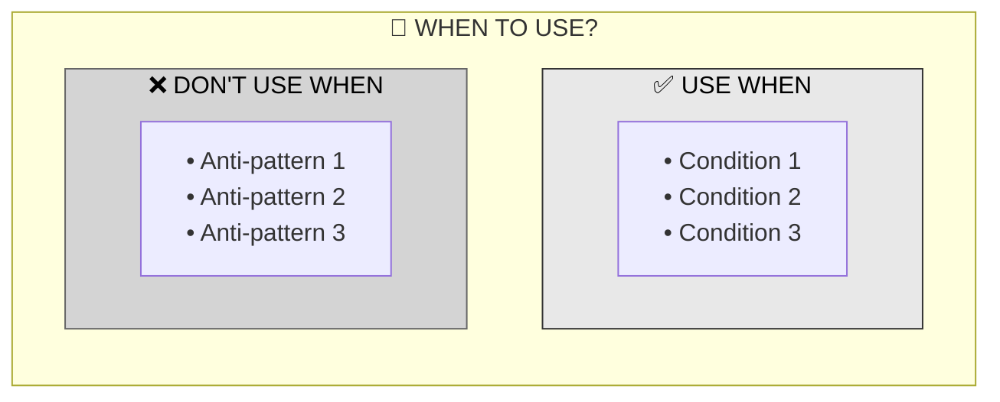
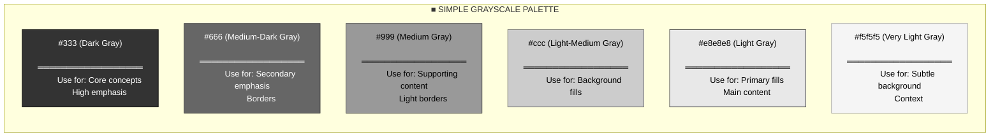
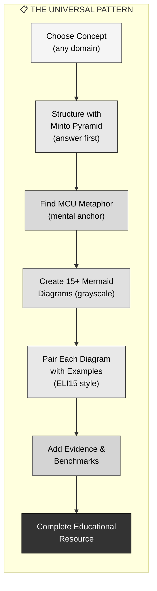

# R23: Universal Prompt Pattern for Educational Mermaid Diagrams

## Overview
This document provides a **universal prompt pattern** for creating comprehensive educational content using Mermaid diagrams. The pattern is language-agnostic and can be applied to any technical concept, programming language, or complex domain.

**Reference Example**: R22RustOwnership.md demonstrates this pattern applied to Rust's Clone-on-Write (Cow) pattern.

---

## 🎯 Core Prompt Structure

### Primary Objective
Create an **executable specification as educational content** about any concept using Mermaid diagrams exclusively, combining three pedagogical frameworks:

1. **Minto Pyramid Principle** - Start with the conclusion, then support with arguments
2. **MCU Metaphors** - Use relatable pop culture analogies (Marvel Cinematic Universe characters/stories)
3. **ELI15 (Explain Like I'm 15)** - Clear, engaging language without condescension

### Template Format
```
Create a comprehensive educational guide about [CONCEPT] in [DOMAIN] 
that uses Mermaid diagrams to visualize:
1. The problem being solved (Pyramid: Conclusion first)
2. The solution mechanism (ELI15: Simple explanations)
3. Mental models (MCU: Relatable metaphors)
4. Use cases and patterns
5. Performance characteristics (when applicable)
6. When to use/avoid (Pyramid: Supporting arguments)
```

---

## 📋 Document Structure Pattern

### Multi-Part Progressive Learning
The R22 document follows an 11-part structure:



---

## 🎨 Diagram Type Patterns

### 1. Problem-Solution Diagrams
**Purpose**: Contrast broken approaches vs. correct solution



**Pattern**: Varying shades of gray to show progression from problem → dilemma → solution

---

### 2. Mechanism Diagrams
**Purpose**: Show internal structure and variants



**Pattern**: 
- Dark gray for root concept
- Light gray for primary variant
- Medium gray for alternative variant

---

### 3. Process Flow Diagrams
**Purpose**: Show decision logic and data flow



**Pattern**: Input → Decision → Conditional Actions → Output (grayscale shading for flow)

---

### 4. Use Case Gallery Diagrams
**Purpose**: Show multiple real-world applications



**Pattern**: Different shades of gray for distinct categories

---

### 5. Decision Guide Diagrams
**Purpose**: Help readers decide when to apply the concept



**Pattern**: Light gray for recommended, medium gray for not recommended

---

## 📐 The Three Pedagogical Frameworks

### 1. Minto Pyramid Principle

**Core Idea**: Start with the answer, then provide supporting arguments.

**Structure**:
```
Top Level (The Answer/Conclusion)
    ├─ Supporting Group 1
    │   ├─ Evidence A
    │   └─ Evidence B
    ├─ Supporting Group 2
    │   ├─ Evidence C
    │   └─ Evidence D
    └─ Supporting Group 3
        ├─ Evidence E
        └─ Evidence F
```

**Applied to Technical Documentation**:
1. **Start with the solution** - Tell them what the concept does FIRST
2. **Then explain why it's needed** - Show the problem it solves
3. **Group supporting details** - Organize evidence into logical clusters
4. **Each level answers "Why?" or "How?"** - Drill down progressively

**Example from R22**:
- **Answer First**: "Cow is a smart pointer that avoids unnecessary cloning"
- **Why?** (Group 1): "Because most strings don't need modification"
- **How?** (Group 2): "It holds either a borrowed reference OR owned value"
- **Evidence** (Group 3): "Benchmark shows 45ns vs 3ns improvement"

**Key Rules**:
- Ideas at any level must summarize the ideas grouped below
- Ideas in each group must be the same kind (all reasons, all steps, all problems)
- Ideas in each group must be in logical order (chronological, structural, importance)

---

### 2. MCU (Marvel Cinematic Universe) Metaphors

**Core Idea**: Use relatable pop culture characters/stories as mental anchors.

**Why MCU Works**:
- **Universal Recognition**: Most readers know MCU characters
- **Rich Metaphor Space**: Characters have well-defined powers and personalities
- **Memorable**: Easier to recall "Mystique pattern" than "conditional cloning pattern"
- **Emotional Connection**: Engages readers beyond dry technical facts

**MCU Character Mapping Guide**:

| Technical Concept | MCU Character | Why It Works |
|:------------------|:--------------|:-------------|
| Lazy Evaluation | Doctor Strange (Time Stone) | Sees all futures, chooses one only when needed |
| Immutability | Captain America's Shield | Never changes, always reliable |
| Reference Counting | Infinity Stones | Power shared across multiple holders |
| Mutex Locks | Thor's Hammer | Only one worthy can wield it |
| Copy-on-Write | Mystique | Borrows appearance until transformation needed |
| Async/Await | Spider-Man's Spider-Sense | Reacts to events before they happen |
| Dependency Injection | Iron Man's Arc Reactor | Powers multiple suits (implementations) |
| Observer Pattern | Nick Fury's Network | Watches everything, notifies when needed |

**Pattern for Creating MCU Metaphors**:
1. **Identify core behavior** of your concept
2. **Find MCU character** with similar ability/constraint
3. **Map properties** one-to-one (cheap=borrow, expensive=transform)
4. **Use throughout doc** to reinforce understanding
5. **Show when metaphor breaks** (all metaphors have limits)

**Example from R22**:
```
"Cow is like Mystique from X-Men:
- Mystique BORROWS appearance → Cow BORROWS data (cheap)
- Mystique TRANSFORMS when needed → Cow CLONES when modified (expensive)
- Mystique chooses strategy → Cow decides based on usage"
```

---

### 3. ELI15 (Explain Like I'm 15)

**Core Idea**: Clear, engaging language without condescension or oversimplification.

**Not ELI5 (Too Simple)**:
- "A Cow is like a toy you can borrow or own"
- Loses technical accuracy
- Feels condescending to experienced learners

**Not Graduate Thesis (Too Complex)**:
- "Cow<'a, B: ToOwned> leverages enum discrimination for amortized allocation deferment"
- Accurate but impenetrable
- Loses beginner learners

**ELI15 (Just Right)**:
- "Cow is a smart pointer that delays cloning until you actually need to modify data"
- Technically accurate
- Uses clear language
- Respects reader's intelligence

**ELI15 Writing Principles**:

1. **Use Simple Words, Not Simple Ideas**
   - ❌ "Polymorphic dispatch via vtable indirection"
   - ✅ "Calling methods through a lookup table at runtime"

2. **Define Jargon Once, Use Freely**
   - First use: "borrows (uses without owning)"
   - Later: "borrows" alone is fine

3. **Active Voice, Direct Address**
   - ❌ "It can be seen that..."
   - ✅ "You'll notice that..."

4. **Concrete Before Abstract**
   - Show code example FIRST
   - Explain principles SECOND

5. **Short Sentences, Clear Structure**
   - One idea per sentence
   - Paragraphs under 4 lines

6. **Admit Complexity, Don't Hide It**
   - "This is tricky, but here's why..."
   - "Most people find this confusing at first..."

**Example Comparison**:

| Style | Example |
|:------|:--------|
| **Too Simple** | "Cow lets you use memory without copying, like sharing a toy" |
| **Too Complex** | "Cow provides an enumerated algebraic data type enabling zero-copy semantics through compile-time lifetime elision" |
| **ELI15** | "Cow lets you work with data without copying it unless you actually need to change it" |

---

## 🎭 Combining the Three Frameworks

**The Magic Happens When You Layer Them**:

```
┌─────────────────────────────────────────┐
│ MINTO PYRAMID: Structure               │
│ (Answer first, then support)           │
│  ┌───────────────────────────────────┐ │
│  │ MCU METAPHORS: Mental Anchors     │ │
│  │ (Mystique = Cow pattern)          │ │
│  │  ┌─────────────────────────────┐  │ │
│  │  │ ELI15: Language Style       │  │ │
│  │  │ (Clear, respectful, direct) │  │ │
│  │  └─────────────────────────────┘  │ │
│  └───────────────────────────────────┘ │
└─────────────────────────────────────────┘
```

**Example Application**:

1. **Pyramid Structure**: "Cow avoids unnecessary memory copies" (conclusion first)
2. **MCU Metaphor**: "Like Mystique borrowing appearance" (mental anchor)
3. **ELI15 Language**: "You only pay for cloning when you actually modify data" (clear explanation)

**Result**: Documentation that is:
- **Structured** (Pyramid)
- **Memorable** (MCU)
- **Accessible** (ELI15)

---

## 🎭 Pedagogical Techniques

### 1. Metaphor-Driven Learning (MCU Framework)
**Example from R22**: "Mystique from X-Men"

```
**Core Truth**: Cow is like Mystique — she can either **borrow someone's appearance** 
(cheap, no effort) or **fully transform** (expensive, but necessary when she needs to act).
```

**Pattern**: Choose relatable metaphor → Map concept properties → Use throughout document → State metaphor limits

---

### 2. Pyramid-First Approach (Minto Framework)
**Structure**:
1. State the conclusion (✅ The solution and its benefit)
2. Build supporting arguments (📊 Why it's needed)
3. Provide detailed evidence (🔍 How it works)

---

### 3. Code-Diagram Pairing
**Pattern**: Every diagram followed by concrete code example (ELI15: Show, don't just tell)

```
[Mermaid Diagram showing concept]

**Code Example:**
// Concrete implementation demonstrating the diagram
```

---

### 4. Progressive Complexity (Pyramid Layers)
**Levels**:
1. Conclusion/Answer (What it does)
2. Key insight (Why it's needed)
3. Mechanism (How it works)
4. Patterns (When to use)
5. Evidence (Benchmarks, comparisons)

---

## ■️ Simple Grayscale System (NO COLORS!)

### The ONLY Colors You Can Use


### ❌ FORBIDDEN: Never Use These
- ❌ Red (#c0392b, #4a0e0e, #e74c3c, etc.)
- ❌ Green (#40916c, #1b4332, #27ae60, etc.)
- ❌ Blue (#4a69bd, #0c2461, #3498db, etc.)
- ❌ Purple (#9d4edd, #3d0066, #9b59b6, etc.)
- ❌ Orange (#e17055, #5c2018, #e67e22, etc.)
- ❌ Yellow (#ffd700, #f1c40f, #f39c12, etc.)

### ✅ ALWAYS USE: Grayscale Only
- ✅ Black: #000
- ✅ White: #fff
- ✅ Gray shades: #333, #666, #999, #ccc, #e8e8e8, #f5f5f5

---

## 📝 Content Guidelines

### Code Block Standards
1. **Include comments** explaining non-obvious parts
2. **Show multiple variations** of usage
3. **Use realistic variable names**
4. **Include output/results** as comments
5. **Separate sections** with visual dividers:
   ```rust
   // ═══════════════════════════════════════
   // Section Title
   // ═══════════════════════════════════════
   ```

### Diagram Standards
1. **Subgraphs for organization**: Group related nodes
2. **Direction specification**: TB (top-bottom) or LR (left-right)
3. **Unicode icons**: Use emojis for visual anchors (🐄, ✅, ❌, etc.)
4. **Consistent styling**: Apply grayscale palette (no colors - only black, white, gray)
5. **Box content format**:
   ```
   Title
   ═══════════════════
   • Point 1
   • Point 2
   • Point 3
   ```

---

## 🔧 Implementation Checklist

To recreate this pattern for a new concept:

### Phase 1: Research
- [ ] Identify the core concept
- [ ] Find the problem it solves
- [ ] Collect real-world examples
- [ ] Research performance characteristics
- [ ] Compare with other languages

### Phase 2: Structure
- [ ] Define 8-12 progressive parts
- [ ] Map problem → solution → patterns → usage (Minto Pyramid)
- [ ] Choose appropriate MCU metaphor
- [ ] Design grayscale styling for concept

### Phase 3: Diagrams
- [ ] Create problem-solution contrast
- [ ] Design mechanism/structure diagram
- [ ] Build process flow diagrams
- [ ] Illustrate use cases
- [ ] Show decision guidelines

### Phase 4: Code
- [ ] Write minimal examples
- [ ] Create real-world scenarios
- [ ] Include benchmarks if relevant
- [ ] Show API design patterns
- [ ] Add cross-language comparisons

### Phase 5: Polish
- [ ] Verify all Mermaid diagrams render
- [ ] Ensure code examples compile/run
- [ ] Check grayscale consistency (no colors!)
- [ ] Add summary/key takeaways
- [ ] Include comparison table

---

## 🎯 Prompt Template for New Documents

```markdown
Create a comprehensive educational guide about [CONCEPT] in [DOMAIN] using the Universal Pattern:

## Requirements:
1. Use ONLY Mermaid diagrams for all visualizations (GitHub-compatible)
2. Follow a 10-part progressive structure (Minto Pyramid)
3. Include MCU metaphor for the concept
4. Use ELI15 writing style (clear, respectful, direct)
5. Pair every diagram with concrete code/examples
6. Apply SIMPLE GRAYSCALE styling:
   - Use ONLY shades of gray: #333, #666, #999, #ccc, #e8e8e8, #f5f5f5
   - White (#fff) and Black (#000) for text
   - ABSOLUTELY NO COLORS (no red, green, blue, yellow, purple, etc.)
   - Simple border strokes: #333 or #666
   - Keep it minimal and accessible

## Structure (Minto Pyramid - Answer First):
Part 1: The Solution [CONCEPT] Provides (conclusion first!)
Part 2: The Problem It Solves (why it's needed)
Part 3: Visual Mental Model (how it works)
Part 4: Common Patterns (supporting evidence)
Part 5: Key Methods/Operations
Part 6: Real-World Use Cases
Part 7: API/Interface Design
Part 8: Performance Characteristics (when applicable)
Part 9: Methods Reference
Part 10: When to Use/Avoid (decision guide)
Part 11: Cross-Domain Comparison

## Three Frameworks:
- 📐 **Minto Pyramid**: Answer first, then supporting arguments
- 🦸 **MCU Metaphor**: [Choose character that maps to concept]
- 📚 **ELI15 Language**: Technical accuracy with accessible language

## Include:
- 🎭 MCU metaphor throughout (e.g., "Like Mystique...")
- 📊 Mermaid flowcharts for all concepts (grayscale only!)
- 💻 Working code/examples after each diagram
- ⚡ Performance benchmarks (when applicable)
- 🌍 Real-world scenarios
- 🤔 Decision guidelines
- 📋 Comparison table

## Code Standards:
- Use section dividers: // ═══════════════
- Include explanatory comments
- Show multiple usage patterns
- Provide realistic examples
- Note expected outputs

## Diagram Standards:
- Use subgraphs for organization
- Include unicode icons (🎯, ✅, ❌, etc.)
- Apply GRAYSCALE ONLY (ABSOLUTELY NO COLORS!)
- Use simple fills: #f5f5f5, #e8e8e8, #d4d4d4, #999, #666, #333
- Use simple strokes: #333, #666, #999
- Format boxes with dividers (═══)
- Show clear flow/decision paths

## Example Grayscale Styling:
```
style NODE1 fill:#f5f5f5,stroke:#333,color:#000
style NODE2 fill:#e8e8e8,stroke:#333,color:#000
style NODE3 fill:#d4d4d4,stroke:#666,color:#000
style NODE4 fill:#333,stroke:#000,color:#fff
```

## NEVER USE:
❌ fill:#4a0e0e (red)
❌ fill:#1b4332 (green)
❌ fill:#0c2461 (blue)
❌ fill:#3d0066 (purple)
❌ fill:#5c2018 (orange)
❌ Any color except grayscale!
```

---

## 🧠 Key Insights from R22

### What Made It Effective:
1. **Mystique metaphor** - Immediately relatable and memorable
2. **Problem-first** - Built empathy before showing solution
3. **Visual density** - 15+ Mermaid diagrams covering all angles
4. **Code-diagram pairing** - Theory immediately validated with practice
5. **Progressive complexity** - From basic to advanced API design
6. **Real benchmarks** - Actual performance data (45ns vs 3ns)
7. **Decision guide** - Clear when to use/avoid
8. **Cross-language** - Shows Rust advantages

### Reusable Patterns:
- ❌ → 😰 → ✅ (Problem → Dilemma → Solution)
- 📥 → 🔧 → 📤 (Input → Process → Output)
- ✅/❌ (Do's and Don'ts)
- 🌍 (Real-world scenarios)
- ⚡ (Performance characteristics)

---

## 📊 Metrics & Standards

### Document Size Target:
- **Lines**: 800-1000 lines
- **Parts**: 10-12 sections
- **Diagrams**: 12-16 Mermaid charts (all grayscale)
- **Code/Example blocks**: 15-20 instances
- **MCU metaphor references**: 5-10 throughout

### Diagram Complexity:
- **Simple**: 3-5 nodes (introduction diagrams)
- **Medium**: 6-10 nodes (process flows)
- **Complex**: 10+ nodes (comprehensive comparisons)

### Grayscale Distribution:
- **Light gray (#e8e8e8, #f5f5f5)**: 50% of nodes (primary content, background)
- **Medium gray (#d4d4d4, #ccc)**: 30% of nodes (alternatives, supporting)
- **Dark gray (#666, #333)**: 20% of nodes (emphasis, core concepts)

### What to AVOID:
❌ **NO RED** (problems, errors, danger)
❌ **NO GREEN** (solutions, success, safe)
❌ **NO BLUE** (information, primary)
❌ **NO PURPLE** (alternatives, special)
❌ **NO ORANGE** (warnings, attention)
❌ **NO YELLOW** (highlights, caution)

✅ **ONLY USE**: Black, white, and shades of gray (#333, #666, #999, #ccc, #e8e8e8, #f5f5f5)

---


## 🎓 Alignment with Design101 Principles

This documentation pattern embodies the **TDD-First Architecture Principles**:

### 1. Executable Specifications Over Narratives ✅
- Every diagram is a formal contract
- Code examples serve as executable tests
- Benchmarks validate performance claims

### 2. MVP-First Rigor ✅
- Shows practical patterns over theory
- Real-world examples from production code
- Proven architectures (Cow is stdlib)

### 3. Visual Architecture Documentation ✅
- **ALL diagrams in Mermaid** for GitHub compatibility
- Process flows serve as executable blueprints
- Decision trees guide implementation

---

## 🎯 Summary: The Universal Prompt Pattern



**Core Formula**: 
```
Concept + Minto Pyramid + MCU Metaphor + Mermaid (Grayscale) + ELI15 + Evidence = Universal Documentation
```

**Three Frameworks Working Together**:
- 📐 **Minto Pyramid**: Structure (answer first)
- 🦸 **MCU Metaphor**: Memorability (mental anchors)
- 📚 **ELI15**: Accessibility (clear language)

This pattern creates **executable specifications as teaching tools** — perfectly aligned with the Design101 principle that "LLMs need executable blueprints, not ambiguous narratives." It's universally applicable across any technical domain, programming language, or complex concept. 🎯
