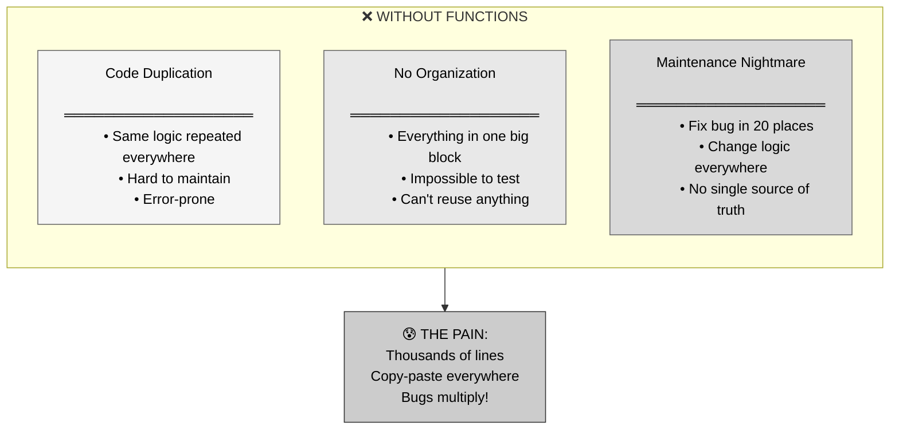
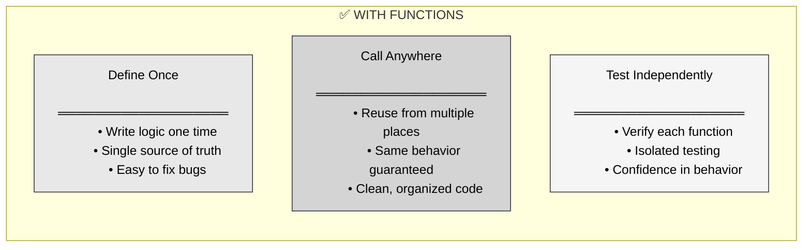
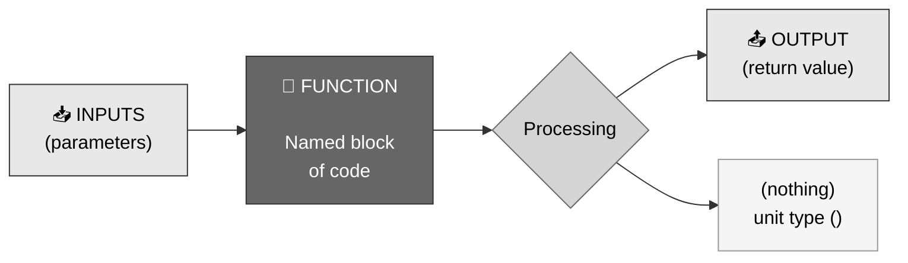
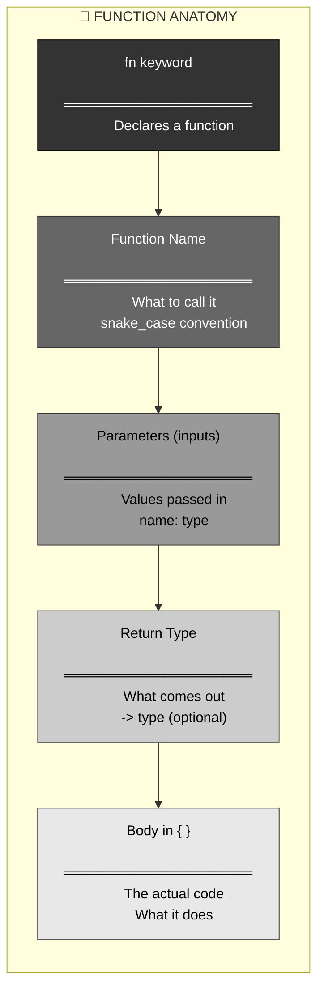
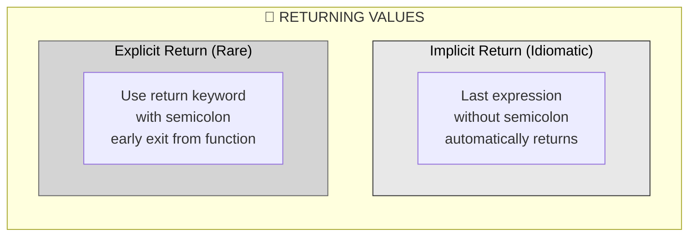
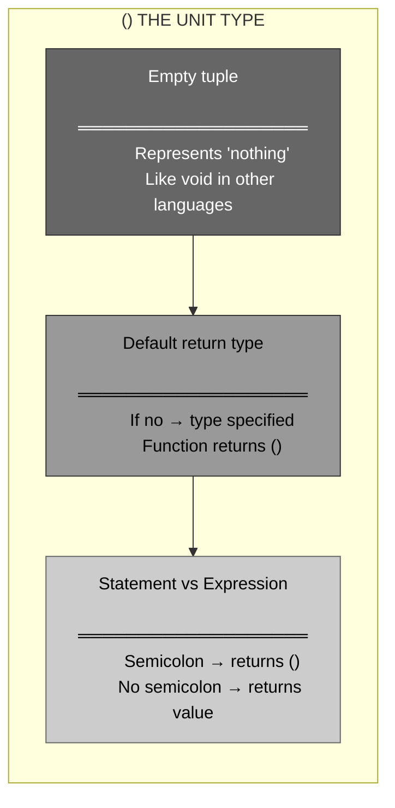
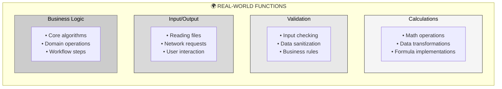
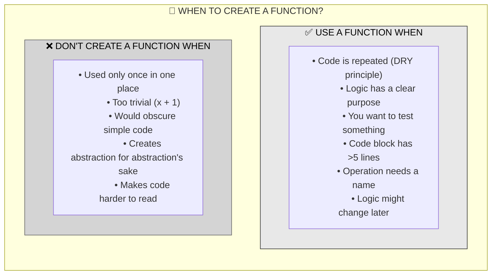

# 🦀 Rust Functions: The Building Blocks

## The Answer (Minto Pyramid: Conclusion First)

**Functions in Rust are named, reusable blocks of code that can take inputs and return outputs.** They're declared with the `fn` keyword and form the fundamental structure of every Rust program. Every Rust program starts with at least one function: `main()`.

---

## 🦸 The Iron Man Suit Metaphor (MCU)

**Think of Rust functions like Iron Man's suit modules:**
- **Each suit has a specific purpose** → Each function has one job
- **Suits accept input (JARVIS commands)** → Functions accept parameters
- **Suits produce output (flight, weapons)** → Functions return values
- **Modular and reusable** → Functions can be called multiple times
- **Tony Stark builds them once, uses them everywhere** → Define once, call anywhere

---

## Part 1: Why Functions Exist (The Problem)



**The Wasteful Approach:**

```rust
// ❌ BAD: Duplicated code everywhere
fn main() {
    // Calculate area of rectangle 1
    let width1 = 10;
    let height1 = 20;
    let area1 = width1 * height1;
    println!("Area 1: {}", area1);
    
    // Calculate area of rectangle 2
    let width2 = 15;
    let height2 = 25;
    let area2 = width2 * height2;  // Same logic repeated!
    println!("Area 2: {}", area2);
    
    // Calculate area of rectangle 3
    let width3 = 8;
    let height3 = 12;
    let area3 = width3 * height3;  // Again!
    println!("Area 3: {}", area3);
    
    // What if the formula changes? Update 3 places!
}
```

---

## Part 2: Enter Functions - The Solution



**The Smart Approach:**

```rust
// ✅ GOOD: Function defined once
fn calculate_area(width: u32, height: u32) -> u32 {
    width * height
}

fn main() {
    // Call the function multiple times
    let area1 = calculate_area(10, 20);
    let area2 = calculate_area(15, 25);
    let area3 = calculate_area(8, 12);
    
    println!("Area 1: {}", area1);
    println!("Area 2: {}", area2);
    println!("Area 3: {}", area3);
    
    // Formula change? Update ONE place (the function)!
}
```

---

## Part 3: Visual Mental Model



---

## Part 4: Function Anatomy



**Complete Example:**

```rust
// ═══════════════════════════════════════
// ANATOMY OF A RUST FUNCTION
// ═══════════════════════════════════════

//    ┌─ keyword
//    │     ┌─ name (snake_case)
//    │     │           ┌─ parameters (name: type)
//    │     │           │                ┌─ return type
//    │     │           │                │
//    ↓     ↓           ↓                ↓
     fn add_numbers(x: i32, y: i32) -> i32 {
//      ↓─────────────────────────────────────↓
         x + y  // ← body (expression returns value)
     }
//   ↑
//   └─ curly braces define the body
```

---

## Part 5: The Four Function Patterns

### Pattern 1: No Input, No Output

```rust
// ═══════════════════════════════════════
// Pattern 1: Nothing in, nothing out
// ═══════════════════════════════════════

fn say_hello() {
    // No parameters
    // No return type (returns () implicitly)
    println!("Hello, Rust!");
}

// Usage
fn main() {
    say_hello();  // Just runs and prints
}
```

### Pattern 2: Input, No Output

```rust
// ═══════════════════════════════════════
// Pattern 2: Takes input, no return
// ═══════════════════════════════════════

fn greet_person(name: &str) {
    // Takes a parameter
    // No return type (returns ())
    println!("Hello, {}!", name);
}

// Usage
fn main() {
    greet_person("Alice");
    greet_person("Bob");
}
```

### Pattern 3: Input, With Output

```rust
// ═══════════════════════════════════════
// Pattern 3: Takes input, returns output
// ═══════════════════════════════════════

fn square(x: i32) -> i32 {
    // Takes a parameter
    // Returns a value (→ i32)
    x * x  // No semicolon = returns this value
}

// Usage
fn main() {
    let result = square(5);
    println!("5 squared is {}", result);  // 25
}
```

### Pattern 4: No Input, With Output

```rust
// ═══════════════════════════════════════
// Pattern 4: No input, returns output
// ═══════════════════════════════════════

fn get_pi() -> f64 {
    // No parameters
    // Returns a value (→ f64)
    3.14159
}

// Usage
fn main() {
    let pi = get_pi();
    println!("Pi is approximately {}", pi);
}
```

---

## Part 6: The `return` Keyword - Two Ways



```rust
// ═══════════════════════════════════════
// IMPLICIT RETURN (idiomatic Rust)
// ═══════════════════════════════════════

fn add_implicit(a: i32, b: i32) -> i32 {
    a + b  // ← No semicolon! This is returned
}

// ═══════════════════════════════════════
// EXPLICIT RETURN (used for early exit)
// ═══════════════════════════════════════

fn add_explicit(a: i32, b: i32) -> i32 {
    return a + b;  // ← With semicolon
}

// ═══════════════════════════════════════
// WHEN TO USE return KEYWORD
// ═══════════════════════════════════════

fn divide_safe(a: i32, b: i32) -> Option<i32> {
    if b == 0 {
        return None;  // Early exit!
    }
    Some(a / b)  // Implicit return for normal case
}

// ═══════════════════════════════════════
// THE SEMICOLON MATTERS!
// ═══════════════════════════════════════

fn returns_value() -> i32 {
    42  // Returns 42 (no semicolon)
}

fn returns_nothing() {
    42;  // Returns () because of semicolon!
}
```

---

## Part 7: The Unit Type `()`



```rust
// ═══════════════════════════════════════
// THESE ARE EQUIVALENT
// ═══════════════════════════════════════

fn do_something() {
    println!("Doing something");
    // Implicitly returns ()
}

fn do_something_explicit() -> () {
    println!("Doing something");
    ()  // Explicit unit value
}

// ═══════════════════════════════════════
// SEMICOLONS CONTROL RETURN TYPE
// ═══════════════════════════════════════

fn example_expression() -> i32 {
    let x = 5;
    x + 10  // No semicolon → returns 15
}

fn example_statement() {
    let x = 5;
    x + 10;  // Semicolon → returns (), value discarded
}
```

---

## Part 8: Real-World Use Cases



```rust
// ═══════════════════════════════════════
// USE CASE 1: Calculations
// ═══════════════════════════════════════

fn celsius_to_fahrenheit(celsius: f64) -> f64 {
    celsius * 9.0 / 5.0 + 32.0
}

fn calculate_discount(price: f64, percent: f64) -> f64 {
    price * (1.0 - percent / 100.0)
}

// ═══════════════════════════════════════
// USE CASE 2: Validation
// ═══════════════════════════════════════

fn is_valid_email(email: &str) -> bool {
    email.contains('@') && email.contains('.')
}

fn is_adult(age: u32) -> bool {
    age >= 18
}

// ═══════════════════════════════════════
// USE CASE 3: String Processing
// ═══════════════════════════════════════

fn greet(name: &str) -> String {
    format!("Hello, {}! Welcome to Rust.", name)
}

fn shout(text: &str) -> String {
    text.to_uppercase()
}

// ═══════════════════════════════════════
// USE CASE 4: Complex Logic
// ═══════════════════════════════════════

fn calculate_shipping(weight_kg: f64, distance_km: f64) -> f64 {
    let base_rate = 5.0;
    let per_kg = 2.0;
    let per_km = 0.1;
    
    base_rate + (weight_kg * per_kg) + (distance_km * per_km)
}

fn determine_grade(score: u32) -> &'static str {
    if score >= 90 {
        "A"
    } else if score >= 80 {
        "B"
    } else if score >= 70 {
        "C"
    } else if score >= 60 {
        "D"
    } else {
        "F"
    }
}
```

---

## Part 9: Function Naming Conventions

```rust
// ═══════════════════════════════════════
// RUST NAMING CONVENTIONS
// ═══════════════════════════════════════

// ✅ GOOD: snake_case for functions
fn calculate_total() {}
fn send_email_notification() {}
fn parse_json_data() {}

// ❌ BAD: Other naming styles (compiler warning!)
fn CalculateTotal() {}  // PascalCase - NO
fn sendEmailNotification() {}  // camelCase - NO
fn PARSE_JSON_DATA() {}  // SCREAMING_SNAKE_CASE - NO

// ═══════════════════════════════════════
// DESCRIPTIVE NAMES
// ═══════════════════════════════════════

// ✅ GOOD: Clear purpose
fn calculate_area(width: f64, height: f64) -> f64 {
    width * height
}

// ❌ BAD: Cryptic names
fn calc(w: f64, h: f64) -> f64 {
    w * h
}

// ═══════════════════════════════════════
// VERBS FOR ACTIONS
// ═══════════════════════════════════════

// ✅ GOOD: Verb-based names
fn create_user() {}
fn validate_input() {}
fn transform_data() {}
fn fetch_results() {}

// ❌ LESS CLEAR: Noun-based names
fn user() {}  // Does what?
fn input() {}  // Ambiguous
fn data() {}  // Unclear action
```

---

## Part 10: When to Use Functions



```rust
// ═══════════════════════════════════════
// ✅ GOOD: Function is justified
// ═══════════════════════════════════════

// Repeated logic → extract to function
fn validate_username(username: &str) -> bool {
    username.len() >= 3 
        && username.len() <= 20
        && username.chars().all(|c| c.is_alphanumeric() || c == '_')
}

// Used in multiple places
fn process_user_registration(username: &str) -> Result<(), String> {
    if !validate_username(username) {
        return Err("Invalid username".to_string());
    }
    // ... more logic
    Ok(())
}

fn check_profile_update(new_username: &str) -> Result<(), String> {
    if !validate_username(new_username) {
        return Err("Invalid username".to_string());
    }
    // ... different logic
    Ok(())
}

// ═══════════════════════════════════════
// ❌ BAD: Unnecessary abstraction
// ═══════════════════════════════════════

// Too trivial - just adds noise
fn add_one(x: i32) -> i32 {
    x + 1
}

fn main() {
    let y = add_one(5);  // Just write: let y = 5 + 1;
}

// ═══════════════════════════════════════
// ✅ GOOD: Right level of abstraction
// ═══════════════════════════════════════

fn main() {
    let y = 5 + 1;  // Simple, clear, no function needed
}
```

---

## Part 11: Functions vs Other Languages

| Feature | 🦀 Rust | ⚡ C/C++ | ☕ Java | 🐍 Python |
|:--------|:--------|:---------|:--------|:----------|
| **Keyword** | `fn` | Various (`void`, type) | Various (modifiers + type) | `def` |
| **Type Required** | ✅ Yes (always) | ✅ Yes | ✅ Yes | ❌ No (optional hints) |
| **Return Syntax** | Last expression OR `return` | `return` keyword | `return` keyword | `return` keyword |
| **Implicit Return** | ✅ Yes (idiomatic) | ❌ No | ❌ No | ❌ No (PEP-3150) |
| **Unit Type** | `()` | `void` | `void` | `None` |
| **Naming** | snake_case | varies | camelCase | snake_case |
| **Safety** | ✅ Compile-time checks | ⚠️ Manual | ⚠️ Runtime | ⚠️ Runtime |

```rust
// ═══════════════════════════════════════
// 🦀 RUST
// ═══════════════════════════════════════
fn add(a: i32, b: i32) -> i32 {
    a + b  // Implicit return (idiomatic)
}
```

```c
// ═══════════════════════════════════════
// ⚡ C
// ═══════════════════════════════════════
int add(int a, int b) {
    return a + b;  // Must use return
}
```

```java
// ═══════════════════════════════════════
// ☕ JAVA
// ═══════════════════════════════════════
public static int add(int a, int b) {
    return a + b;  // Must use return
}
```

```python
# ═══════════════════════════════════════
# 🐍 PYTHON
# ═══════════════════════════════════════
def add(a, b):
    return a + b  # Must use return
```

---

## 🧠 The Iron Man Principle

> **"Like Iron Man's suit modules, functions are self-contained, reusable, and purpose-built. Tony doesn't rebuild the repulsor rays every time he needs them—he calls on the module. You don't rewrite logic every time you need it—you call the function."**

| Scenario | Without Functions | With Functions |
|:---------|:------------------|:---------------|
| **Code duplication** | Copy-paste everywhere 😢 | Define once, call many! 🎉 |
| **Bug fixing** | Update in 20 places 😰 | Fix once, fixed everywhere ✅ |
| **Testing** | Test entire program 🤯 | Test each function isolated 🎯 |
| **Code organization** | Massive main() 📚 | Clean, modular structure 🏗️ |

**Key Takeaways:**

1. **Use `fn` keyword** to declare functions in Rust
2. **Parameters need types** → `name: type` syntax
3. **Return type is optional** → omit for `()` (unit type)
4. **Implicit returns are idiomatic** → last expression without semicolon
5. **Name with verbs, use snake_case** → `calculate_total()`, not `CalculateTotal()`
6. **Extract repeated logic** → DRY principle
7. **Functions make code testable** → isolate and verify behavior

Functions are the **Iron Man suits** of your Rust code—modular, reusable, and purpose-built! 🚀
