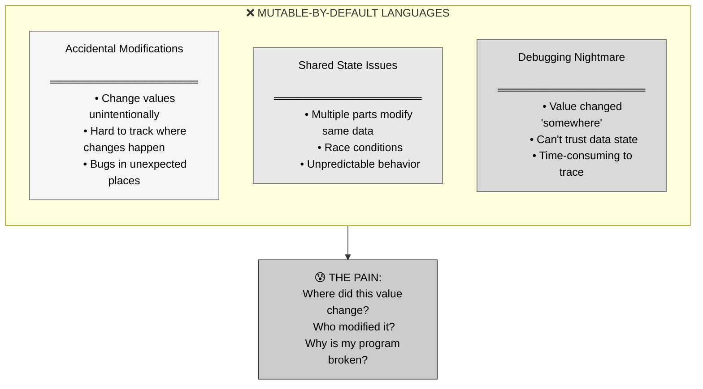
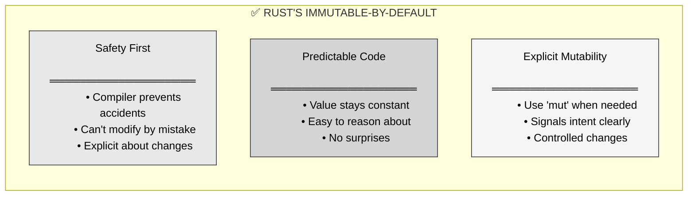
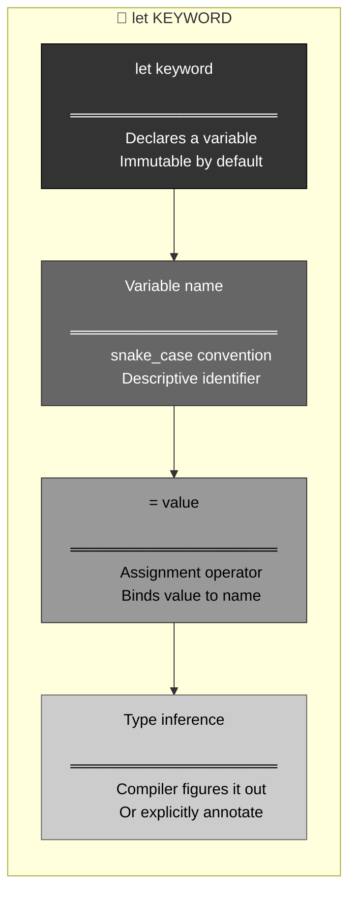
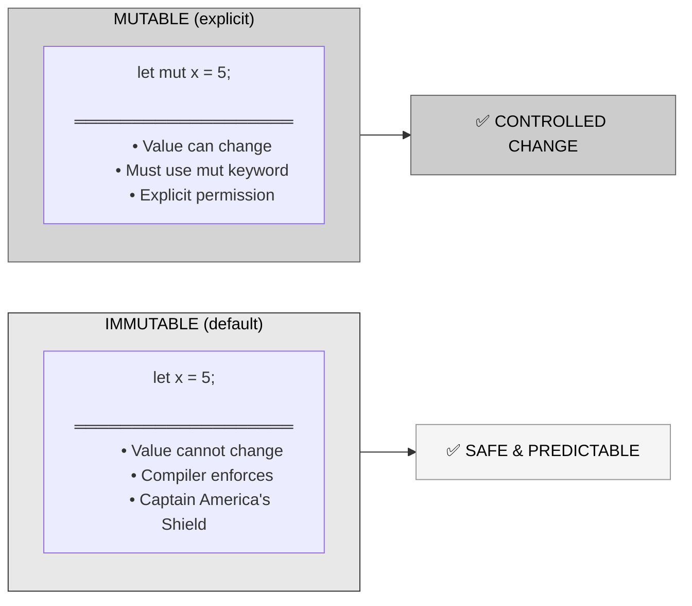
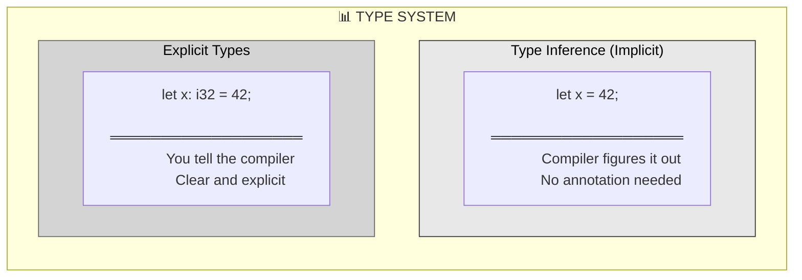
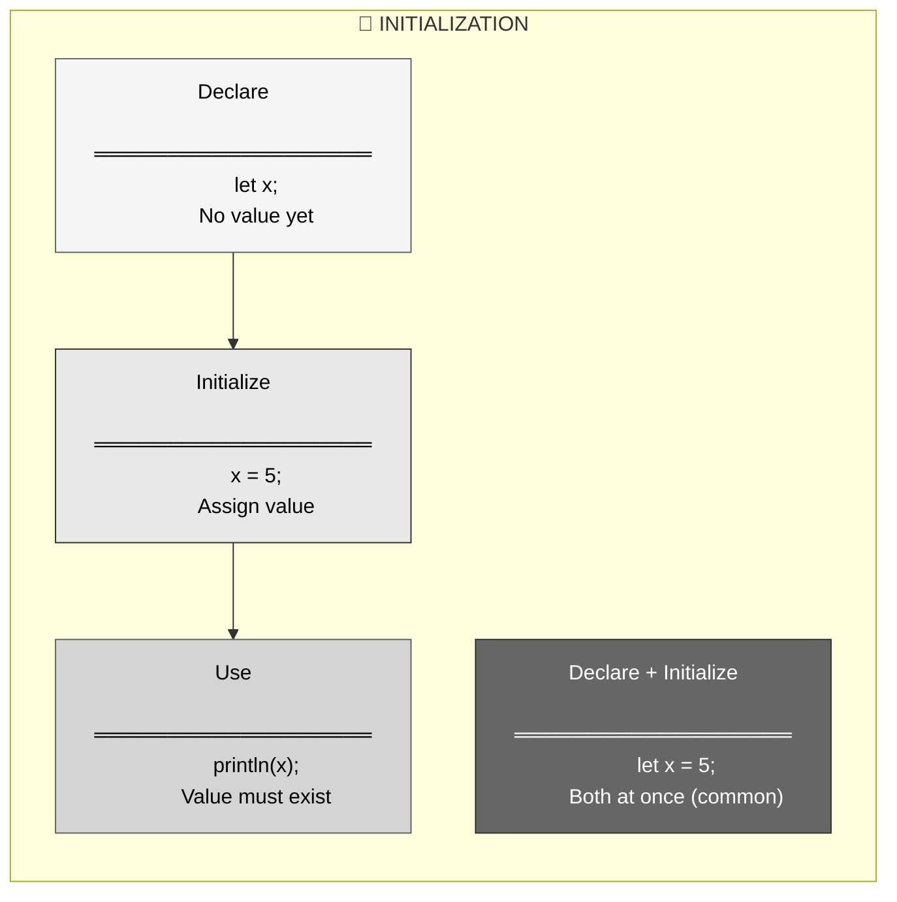
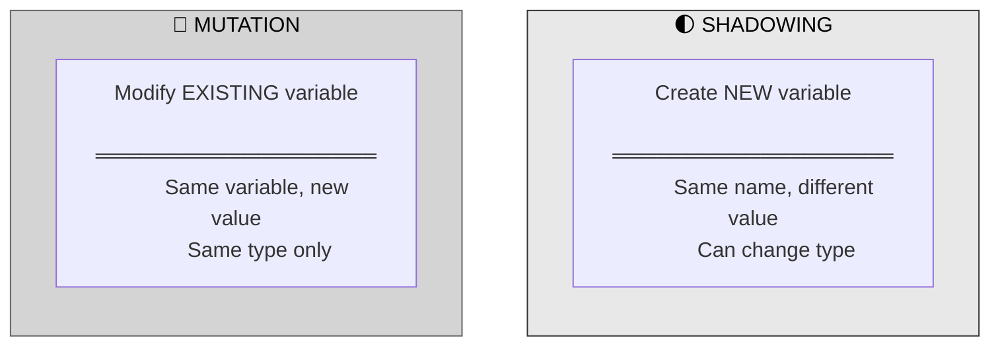
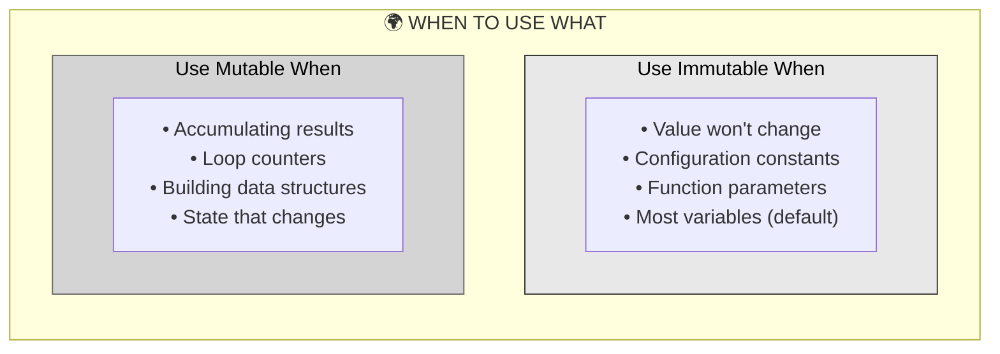
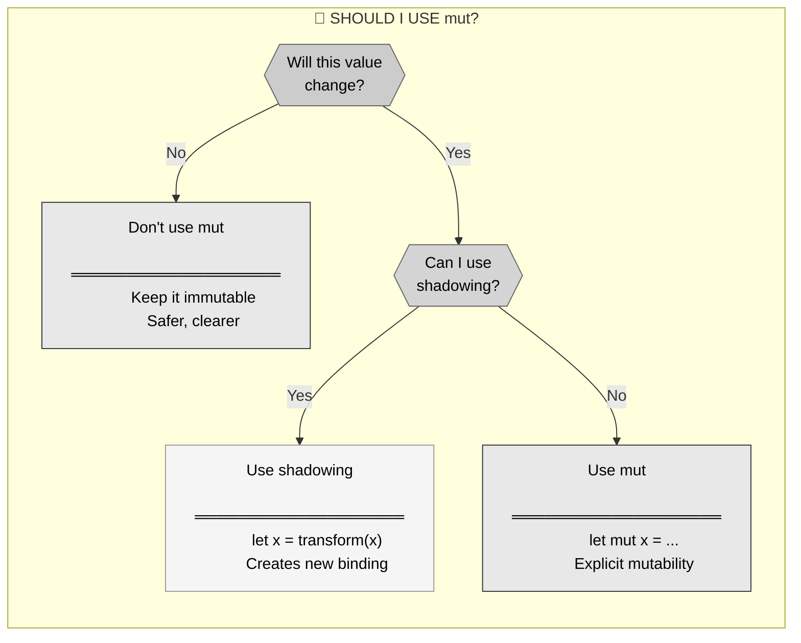

# 🦀 Rust Variables: Immutable by Default

## The Answer (Minto Pyramid: Conclusion First)

**Variables in Rust are declared with `let` and are immutable by default.** This means once you assign a value to a variable, you can't change it unless you explicitly mark it as mutable with `mut`. This immutability-by-default design prevents accidental bugs and makes code safer.

---

## 🦸 The Captain America's Shield Metaphor (MCU)

**Think of Rust variables like Captain America's Shield:**
- **Shield never changes form** → Variables are immutable by default
- **Reliable and predictable** → Immutable values can't be accidentally modified  
- **Built from Vibran

ium (indestructible)** → Type-safe, can't be broken
- **Cap must explicitly throw it** → Must use `mut` to allow changes
- **One shield, one purpose** → Clear ownership, no surprises

**"The shield doesn't bend, doesn't break. Neither do Rust variables—unless you explicitly say they can."**

---

## Part 1: Why Immutability? (The Problem)



**The Hidden Bug:**

```rust
// Imagine if Rust allowed this:
fn calculate_discount(price: i32) -> i32 {
    let discount = 10;
    // ... 50 lines of code ...
    discount = 20;  // Oops! Accidentally changed it!
    // ... more code ...
    price - (price * discount / 100)  // Wrong discount applied!
}
```

---

## Part 2: Enter Immutability - The Solution



**The Safe Approach:**

```rust
// ✅ RUST: Compiler catches the error!
fn calculate_discount(price: i32) -> i32 {
    let discount = 10;
    // ... 50 lines of code ...
    discount = 20;  // ❌ Compile error! Can't reassign immutable variable
    // Compiler says: "Consider using `mut discount`"
    price - (price * discount / 100)
}
```

---

## Part 3: Variable Declaration Syntax



**Basic Declaration:**

```rust
// ═══════════════════════════════════════
// BASIC VARIABLE DECLARATION
// ═══════════════════════════════════════

//  ┌─ keyword
//  │   ┌─ name
//  │   │       ┌─ assignment
//  │   │       │  ┌─ value
//  │   │       │  │
//  ↓   ↓       ↓  ↓
   let age = 25;
// Compiler infers type: i32

// ═══════════════════════════════════════
// WITH EXPLICIT TYPE ANNOTATION
// ═══════════════════════════════════════

//      ┌─ type annotation
//      │
//      ↓
let age: u32 = 25;

// ═══════════════════════════════════════
// OTHER TYPES
// ═══════════════════════════════════════

let name = "Alice";           // &str (string slice)
let pi = 3.14;                // f64 (floating point)
let is_valid = true;          // bool (boolean)
let letter = 'A';             // char (character)
```

---

## Part 4: Immutable vs Mutable



**Immutable Example:**

```rust
// ═══════════════════════════════════════
// IMMUTABLE VARIABLE (default)
// ═══════════════════════════════════════

let x = 5;
println!("x is: {}", x);  // x is: 5

x = 6;  // ❌ COMPILE ERROR!
// error[E0384]: cannot assign twice to immutable variable `x`
//  --> src/main.rs:4:5
//   |
// 2 |     let x = 5;
//   |         -
//   |         |
//   |         first assignment to `x`
//   |         help: consider making this binding mutable: `mut x`
// 3 |     println!("x is: {}", x);
// 4 |     x = 6;
//   |     ^^^^^ cannot assign twice to immutable variable
```

**Mutable Example:**

```rust
// ═══════════════════════════════════════
// MUTABLE VARIABLE (explicit)
// ═══════════════════════════════════════

let mut x = 5;  // ← Note the `mut` keyword!
println!("x is: {}", x);  // x is: 5

x = 6;  // ✅ Allowed! Variable is mutable
println!("x is now: {}", x);  // x is now: 6

x = 7;  // ✅ Can change multiple times
println!("x is now: {}", x);  // x is now: 7
```

---

## Part 5: Type Inference vs Explicit Types



```rust
// ═══════════════════════════════════════
// TYPE INFERENCE (compiler figures it out)
// ═══════════════════════════════════════

let age = 25;           // Compiler infers: i32
let price = 19.99;      // Compiler infers: f64
let name = "Bob";       // Compiler infers: &str
let is_valid = true;    // Compiler infers: bool

// ═══════════════════════════════════════
// EXPLICIT TYPE ANNOTATIONS
// ═══════════════════════════════════════

let age: u32 = 25;              // Explicitly u32 (unsigned 32-bit)
let price: f32 = 19.99;         // Explicitly f32 (32-bit float)
let name: &str = "Bob";         // Explicitly string slice
let is_valid: bool = true;      // Explicitly boolean

// ═══════════════════════════════════════
// WHEN EXPLICIT TYPES ARE REQUIRED
// ═══════════════════════════════════════

let numbers: Vec<i32> = Vec::new();  // Can't infer empty collection
let result: Result<i32, String> = Ok(42);  // Multiple possibilities

// ═══════════════════════════════════════
// SUFFIX NOTATION FOR NUMBER TYPES
// ═══════════════════════════════════════

let age = 25u32;        // Same as: let age: u32 = 25;
let price = 19.99f32;   // Same as: let price: f32 = 19.99;
```

---

## Part 6: Variable Initialization



```rust
// ═══════════════════════════════════════
// DECLARE AND INITIALIZE TOGETHER (common)
// ═══════════════════════════════════════

let x = 5;  // Declare and initialize in one line
println!("x: {}", x);  // ✅ Works!

// ═══════════════════════════════════════
// DECLARE FIRST, INITIALIZE LATER (rare)
// ═══════════════════════════════════════

let y;  // Declare without initializing
y = 10;  // Initialize later
println!("y: {}", y);  // ✅ Works!

// ═══════════════════════════════════════
// MUST INITIALIZE BEFORE USE
// ═══════════════════════════════════════

let z;
println!("z: {}", z);  // ❌ COMPILE ERROR!
// error[E0381]: borrow of possibly-uninitialized variable: `z`

z = 15;  // Too late! Already tried to use it

// ═══════════════════════════════════════
// CONDITIONAL INITIALIZATION
// ═══════════════════════════════════════

let number;
let condition = true;

if condition {
    number = 42;
} else {
    number = 0;
}

println!("number: {}", number);  // ✅ Works! Initialized in all paths
```

---

## Part 7: Shadowing vs Mutation



```rust
// ═══════════════════════════════════════
// SHADOWING (new variable, same name)
// ═══════════════════════════════════════

let x = 5;              // First x
let x = x + 1;          // Second x (shadows first x)
let x = x * 2;          // Third x (shadows second x)
println!("x: {}", x);   // 12

// Can even change types!
let spaces = "   ";      // x is a string
let spaces = spaces.len();  // x is now a number!

// ═══════════════════════════════════════
// MUTATION (modify existing variable)
// ═══════════════════════════════════════

let mut y = 5;          // Mutable variable
y = y + 1;              // Modify the SAME variable
y = y * 2;              // Still the same variable
println!("y: {}", y);   // 12

// Cannot change types!
let mut value = "   ";
value = value.len();    // ❌ COMPILE ERROR! Type mismatch

// ═══════════════════════════════════════
// KEY DIFFERENCES
// ═══════════════════════════════════════

// Shadowing:
// - Uses `let` each time
// - Creates new variable
// - Can change type
// - Variable is immutable (unless marked mut)

// Mutation:
// - No `let` for reassignment
// - Modifies existing variable
// - Cannot change type
// - Variable must be marked `mut`
```

---

## Part 8: Real-World Use Cases



```rust
// ═══════════════════════════════════════
// USE CASE 1: Configuration (Immutable)
// ═══════════════════════════════════════

let server_port = 8080;
let max_connections = 100;
let api_key = "secret_key_12345";

// These don't change during program execution
// Immutability prevents accidental modification

// ═══════════════════════════════════════
// USE CASE 2: Calculations (Immutable)
// ═══════════════════════════════════════

let width = 10;
let height = 20;
let area = width * height;

println!("Area: {}", area);
// Values are computed once, never change

// ═══════════════════════════════════════
// USE CASE 3: Accumulation (Mutable)
// ═══════════════════════════════════════

let mut sum = 0;
let mut count = 0;

for i in 1..=10 {
    sum += i;
    count += 1;
}

let average = sum / count;
println!("Average: {}", average);

// ═══════════════════════════════════════
// USE CASE 4: Building Data (Mutable)
// ═══════════════════════════════════════

let mut message = String::from("Hello");
message.push_str(", ");
message.push_str("World");
message.push('!');

println!("{}", message);  // Hello, World!

// ═══════════════════════════════════════
// USE CASE 5: State Management (Mutable)
// ═══════════════════════════════════════

let mut is_logged_in = false;
// ... user authentication code ...
is_logged_in = true;

if is_logged_in {
    println!("Welcome!");
}
```

---

## Part 9: Common Patterns

```rust
// ═══════════════════════════════════════
// PATTERN 1: Compute once, use many times
// ═══════════════════════════════════════

let base_price = 100;
let tax_rate = 0.08;
let tax = base_price as f64 * tax_rate;
let total = base_price as f64 + tax;

// All immutable - values computed once

// ═══════════════════════════════════════
// PATTERN 2: Transform through shadowing
// ═══════════════════════════════════════

let input = "  42  ";           // String with spaces
let input = input.trim();       // Remove spaces
let input = input.parse::<i32>().unwrap();  // Convert to number

println!("Number: {}", input);  // 42

// Each step shadows previous, keeping name consistent

// ═══════════════════════════════════════
// PATTERN 3: Mutable accumulator
// ═══════════════════════════════════════

let numbers = vec![1, 2, 3, 4, 5];
let mut total = 0;

for num in numbers {
    total += num;
}

println!("Total: {}", total);  // 15

// ═══════════════════════════════════════
// PATTERN 4: Temporary mutability
// ═══════════════════════════════════════

let mut data = vec![3, 1, 4, 1, 5];
data.sort();  // Modify to sort
let data = data;  // Shadow to make immutable again!

// Now data is immutable but sorted
println!("{:?}", data);  // [1, 1, 3, 4, 5]
```

---

## Part 10: When to Use mut



```rust
// ═══════════════════════════════════════
// PREFER IMMUTABLE (default choice)
// ═══════════════════════════════════════

let user_name = "Alice";
let age = 25;
let is_admin = true;

// These values don't change - keep them immutable

// ═══════════════════════════════════════
// USE mut FOR LOOPS
// ═══════════════════════════════════════

let mut counter = 0;
while counter < 10 {
    println!("{}", counter);
    counter += 1;  // Must be mutable to increment
}

// ═══════════════════════════════════════
// USE mut FOR BUILDING COLLECTIONS
// ═══════════════════════════════════════

let mut scores = Vec::new();
scores.push(85);
scores.push(92);
scores.push(78);

// Need mut to add elements

// ═══════════════════════════════════════
// AVOID mut IF SHADOWING WORKS
// ═══════════════════════════════════════

// ❌ Less clear with mut
let mut value = get_input();
value = value.trim();
value = value.to_uppercase();

// ✅ Better with shadowing
let value = get_input();
let value = value.trim();
let value = value.to_uppercase();
```

---

## Part 11: Variables vs Other Languages

| Feature | 🦀 Rust | ⚡ C/C++ | ☕ Java | 🐍 Python | 🟨 JavaScript |
|:--------|:--------|:---------|:--------|:----------|:--------------|
| **Keyword** | `let` | Various (`int`, `const`) | Type name | No keyword | `let`, `const`, `var` |
| **Default** | Immutable | Mutable | Mutable | Mutable | Depends (`const` immutable) |
| **Mutability** | Explicit `mut` | `const` for immutable | `final` for immutable | Always mutable | `const` vs `let` |
| **Type Required** | Inferred or explicit | ✅ Required | ✅ Required | ❌ Dynamic | ❌ Dynamic |
| **Type Changes** | ❌ No (unless shadowing) | ❌ No | ❌ No | ✅ Yes | ✅ Yes |
| **Safety** | ✅ Compile-time checks | ⚠️ Manual | ⚠️ Runtime | ⚠️ Runtime | ⚠️ Runtime |

```rust
// ═══════════════════════════════════════
// 🦀 RUST
// ═══════════════════════════════════════
let x = 5;      // Immutable by default
let mut y = 10;  // Explicit mutability
```

```c
// ═══════════════════════════════════════
// ⚡ C
// ═══════════════════════════════════════
int x = 5;       // Mutable by default
const int y = 10; // Immutable
```

```java
// ═══════════════════════════════════════
// ☕ JAVA
// ═══════════════════════════════════════
int x = 5;        // Mutable by default
final int y = 10; // Immutable
```

```python
# ═══════════════════════════════════════
# 🐍 PYTHON
# ═══════════════════════════════════════
x = 5      # Always mutable
# No immutable variable keyword
```

```javascript
// ═══════════════════════════════════════
// 🟨 JAVASCRIPT
// ═══════════════════════════════════════
let x = 5;    // Mutable
const y = 10; // Immutable
```

---

## 🧠 The Captain America's Shield Principle

> **"The shield doesn't change—it's indestructible, reliable, predictable. That's Rust's default. Want to throw it? You have to explicitly decide. Want to modify a variable? You have to explicitly say `mut`."**

| Scenario | Without Immutability | With Immutability (Rust) |
|:---------|:--------------------|:-------------------------|
| **Accidental changes** | Easy to modify by mistake 😢 | Compiler prevents it! 🎉 |
| **Bug tracking** | Where did it change? 😰 | Can't change, no bugs! ✅ |
| **Code reasoning** | Value might be anything 🤯 | Value is constant 🎯 |
| **Concurrency** | Race conditions possible 💥 | Safe to share! 🔒 |

**Key Takeaways:**

1. **Use `let` to declare variables** in Rust
2. **Immutable by default** → can't reassign unless marked `mut`
3. **Explicit `mut` keyword** → signals changeability
4. **Type inference works** → compiler figures out types
5. **Shadowing creates new variables** → can change type
6. **Mutation modifies existing** → same type only
7. **Prefer immutable** → use `mut` only when necessary

Variables are like **Captain America's Shield**—reliable, unchanging, and safe by default! 🛡️
