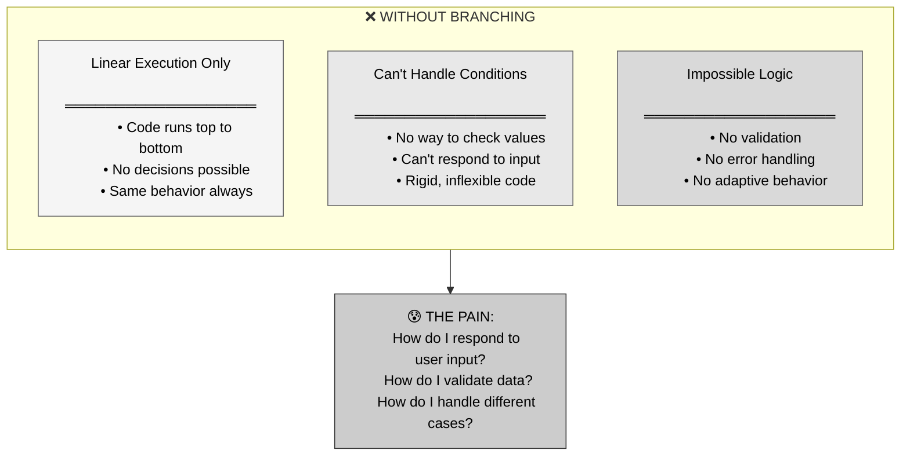
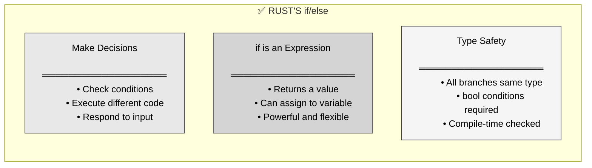
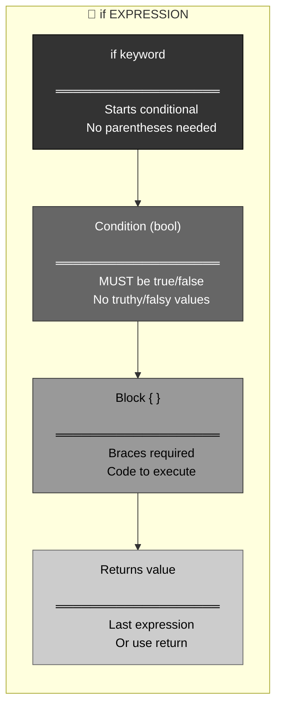
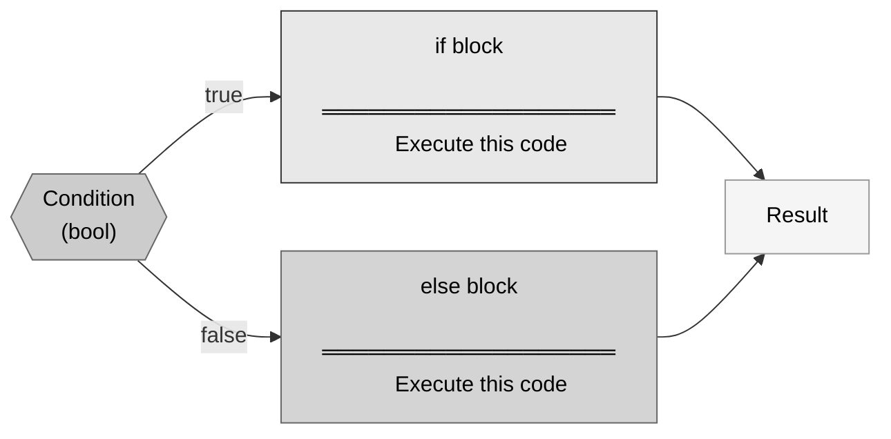
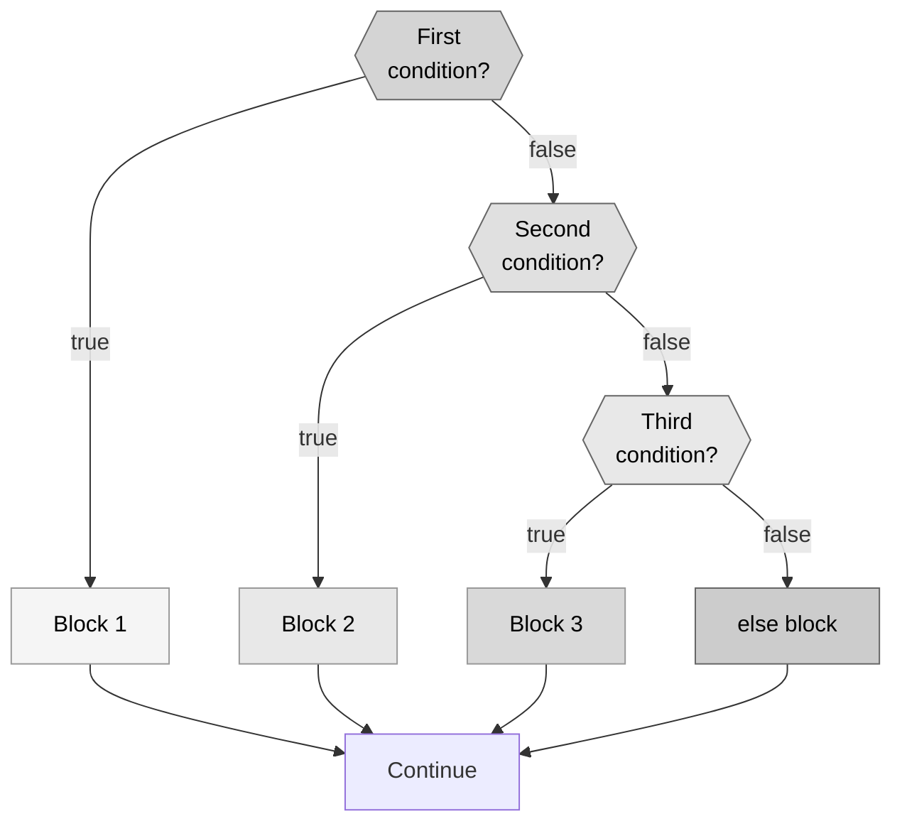
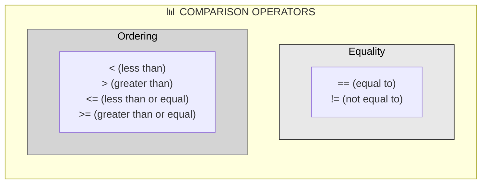
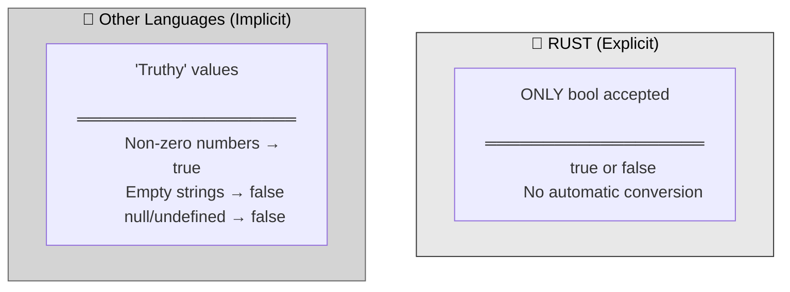
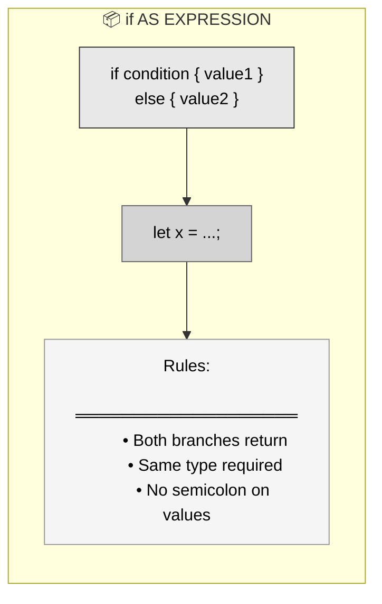
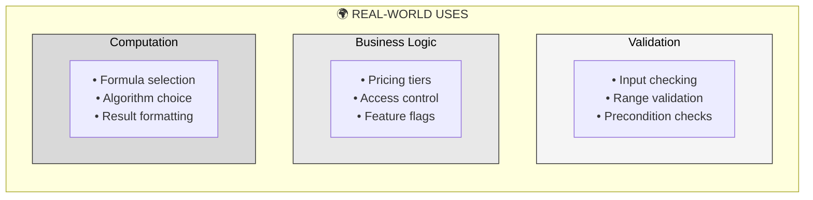
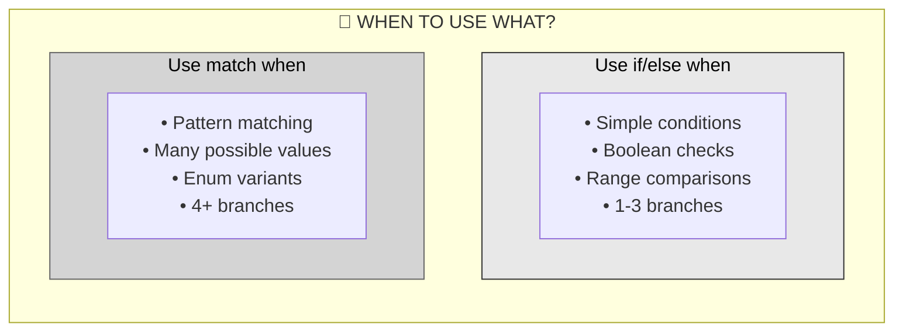

# 🦀 Rust if/else: Branching as Expressions

## The Answer (Minto Pyramid: Conclusion First)

**In Rust, `if` is an expression that returns a value, not just a statement.** Conditions must be explicit `bool` types (no truthy/falsy values), and all branches must return the same type. This makes control flow both safe and powerful—you can assign the result of an `if` expression directly to a variable.

---

## 🦸 The Doctor Strange Metaphor (MCU)

**Think of Rust's if/else like Doctor Strange using the Time Stone:**
- **Sees 14 million futures** → Multiple possible code paths (branches)
- **Evaluates conditions** → Checks which timeline to follow
- **Chooses ONE path** → Executes only the matching branch
- **Same outcome type** → All futures must lead to compatible results
- **No ambiguity** → Clear boolean choices, no "maybe" (no truthy/falsy)

**"I've looked at 14 million possibilities. In Rust, each `if` branch must return the same type."**

---

## Part 1: Why Control Flow? (The Problem)



**The Impossible Task:**

```rust
// Without control flow, this is impossible:
fn describe_temperature(celsius: i32) -> &'static str {
    // How do I return different strings based on temperature?
    // Can't check conditions!
    // Must always return the same thing...
    "I don't know!"
}
```

---

## Part 2: Enter if/else - The Solution



**The Smart Approach:**

```rust
// ✅ With if/else, decisions are easy!
fn describe_temperature(celsius: i32) -> &'static str {
    if celsius < 0 {
        "freezing"
    } else if celsius < 20 {
        "cold"
    } else if celsius < 30 {
        "warm"
    } else {
        "hot"
    }
}

println!("{}", describe_temperature(-5));  // "freezing"
println!("{}", describe_temperature(25));  // "warm"
```

---

## Part 3: if Syntax



**Basic if:**

```rust
// ═══════════════════════════════════════
// BASIC if STATEMENT
// ═══════════════════════════════════════

let number = 5;

if number < 10 {
    println!("Less than 10");
}

// ═══════════════════════════════════════
// CONDITION MUST BE bool
// ═══════════════════════════════════════

let x = 5;

// ✅ Correct: explicit bool
if x < 10 {
    println!("x is less than 10");
}

// ❌ WRONG: number is not bool!
if x {  // Compile error!
    println!("This won't work");
}
// error[E0308]: mismatched types
//  expected `bool`, found integer

// ✅ Correct: explicit comparison
if x != 0 {
    println!("x is not zero");
}
```

---

## Part 4: if/else Branches



```rust
// ═══════════════════════════════════════
// if/else BRANCHES
// ═══════════════════════════════════════

let number = 3;

if number < 5 {
    println!("number is less than 5");
} else {
    println!("number is 5 or greater");
}

// ═══════════════════════════════════════
// if AS EXPRESSION (returns value)
// ═══════════════════════════════════════

let number = 6;

let message = if number < 5 {
    "less than 5"  // No semicolon - returns value
} else {
    "5 or greater"  // No semicolon - returns value
};  // Semicolon after entire expression

println!("Number is {}", message);

// ═══════════════════════════════════════
// BOTH BRANCHES MUST RETURN SAME TYPE
// ═══════════════════════════════════════

// ✅ Correct: both return &str
let result = if true {
    "text"
} else {
    "more text"
};

// ❌ WRONG: different types!
let result = if true {
    "text"    // &str
} else {
    42        // i32  
};
// error: if and else have incompatible types
```

---

## Part 5: else if for Multiple Conditions



```rust
// ═══════════════════════════════════════
// else if FOR MULTIPLE CONDITIONS
// ═══════════════════════════════════════

let number = 6;

if number % 4 == 0 {
    println!("divisible by 4");
} else if number % 3 == 0 {
    println!("divisible by 3");  // This one executes!
} else if number % 2 == 0 {
    println!("divisible by 2");  // Not checked!
} else {
    println!("not divisible by 4, 3, or 2");
}

// Note: Only FIRST true condition executes
// Even though 6 is divisible by both 3 and 2!

// ═══════════════════════════════════════
// ASSIGNING else if RESULT
// ═══════════════════════════════════════

let score = 85;

let grade = if score >= 90 {
    'A'
} else if score >= 80 {
    'B'  // This one!
} else if score >= 70 {
    'C'
} else if score >= 60 {
    'D'
} else {
    'F'
};

println!("Grade: {}", grade);  // Grade: B
```

---

## Part 6: Comparison Operators



```rust
// ═══════════════════════════════════════
// COMPARISON OPERATORS
// ═══════════════════════════════════════

let x = 5;
let y = 10;

// Equality
if x == y {
    println!("equal");
}

if x != y {
    println!("not equal");  // This prints
}

// Ordering
if x < y {
    println!("x is less than y");  // This prints
}

if x > y {
    println!("x is greater than y");
}

if x <= 5 {
    println!("x is less than or equal to 5");  // This prints
}

if y >= 10 {
    println!("y is greater than or equal to 10");  // This prints
}

// ═══════════════════════════════════════
// LOGICAL OPERATORS
// ═══════════════════════════════════════

let age = 25;
let has_license = true;

// AND (&&) - both must be true
if age >= 18 && has_license {
    println!("Can drive");  // This prints
}

// OR (||) - at least one must be true
if age < 18 || !has_license {
    println!("Cannot drive");
} else {
    println!("Can drive");  // This prints
}

// NOT (!) - negates boolean
if !has_license {
    println!("No license");
} else {
    println!("Has license");  // This prints
}
```

---

## Part 7: No Truthy/Falsy Values



```rust
// ═══════════════════════════════════════
// RUST: NO TRUTHY/FALSY VALUES
// ═══════════════════════════════════════

let number = 5;

// ❌ WRONG: number is not bool
if number {
    println!("This won't compile");
}
// error[E0308]: mismatched types
//  expected `bool`, found integer

// ✅ Correct: explicit comparison
if number != 0 {
    println!("number is not zero");
}

// ═══════════════════════════════════════

let text = "hello";

// ❌ WRONG: string is not bool
if text {
    println!("This won't compile");
}

// ✅ Correct: check if not empty
if !text.is_empty() {
    println!("text is not empty");
}

// ═══════════════════════════════════════

let maybe: Option<i32> = Some(42);

// ❌ WRONG: Option is not bool
if maybe {
    println!("This won't compile");
}

// ✅ Correct: check if Some
if maybe.is_some() {
    println!("Has value");
}
```

---

## Part 8: if as Expression



```rust
// ═══════════════════════════════════════
// if AS EXPRESSION
// ═══════════════════════════════════════

let condition = true;
let number = if condition { 5 } else { 6 };
println!("number: {}", number);  // 5

// ═══════════════════════════════════════
// PRACTICAL EXAMPLE
// ═══════════════════════════════════════

let temperature = 25;

let status = if temperature < 0 {
    "freezing"
} else if temperature < 20 {
    "cold"
} else {
    "warm"
};

println!("It's {}", status);  // It's warm

// ═══════════════════════════════════════
// WITH COMPUTATIONS
// ═══════════════════════════════════════

let x = 10;

let result = if x > 5 {
    x * 2  // No semicolon!
} else {
    x / 2  // No semicolon!
};  // Semicolon after entire expression

println!("result: {}", result);  // 20

// ═══════════════════════════════════════
// MUST HAVE else WHEN ASSIGNING
// ═══════════════════════════════════════

// ❌ WRONG: What if condition is false?
let value = if condition {
    42
};
// error: `if` may be missing an `else` clause

// ✅ Correct: else provides fallback
let value = if condition {
    42
} else {
    0
};
```

---

## Part 9: Real-World Use Cases



```rust
// ═══════════════════════════════════════
// USE CASE 1: Input Validation
// ═══════════════════════════════════════

fn validate_age(age: i32) -> Result<(), String> {
    if age < 0 {
        Err("Age cannot be negative".to_string())
    } else if age > 150 {
        Err("Age seems unrealistic".to_string())
    } else {
        Ok(())
    }
}

// ═══════════════════════════════════════
// USE CASE 2: Pricing Logic
// ═══════════════════════════════════════

fn calculate_price(quantity: u32, is_member: bool) -> f64 {
    let base_price = 10.0;
    let total = (quantity as f64) * base_price;
    
    if is_member {
        total * 0.9  // 10% discount
    } else if quantity >= 10 {
        total * 0.95  // 5% bulk discount
    } else {
        total
    }
}

// ═══════════════════════════════════════
// USE CASE 3: Access Control
// ═══════════════════════════════════════

fn can_access(age: u32, is_premium: bool) -> bool {
    if age < 18 {
        false  // Too young
    } else if is_premium {
        true  // Premium members always allowed
    } else if age >= 21 {
        true  // Regular adults allowed
    } else {
        false  // 18-20 need premium
    }
}

// ═══════════════════════════════════════
// USE CASE 4: Algorithm Selection
// ═══════════════════════════════════════

fn sort_data(size: usize) -> &'static str {
    if size < 10 {
        "insertion_sort"  // Good for small arrays
    } else if size < 1000 {
        "quicksort"  // Good for medium arrays
    } else {
        "merge_sort"  // Best for large arrays
    }
}

// ═══════════════════════════════════════
// USE CASE 5: Error Handling
// ═══════════════════════════════════════

fn divide(a: i32, b: i32) -> Option<i32> {
    if b == 0 {
        None  // Cannot divide by zero
    } else {
        Some(a / b)
    }
}
```

---

## Part 10: Common Patterns

```rust
// ═══════════════════════════════════════
// PATTERN 1: Range checking
// ═══════════════════════════════════════

let score = 85;

let category = if score >= 90 {
    "Excellent"
} else if score >= 70 {
    "Good"
} else if score >= 50 {
    "Pass"
} else {
    "Fail"
};

// ═══════════════════════════════════════
// PATTERN 2: Guard clauses (early return)
// ═══════════════════════════════════════

fn process_user(age: i32) -> Result<String, String> {
    // Check for invalid input first
    if age < 0 {
        return Err("Invalid age".to_string());
    }
    
    if age < 18 {
        return Err("Too young".to_string());
    }
    
    // Main logic
    Ok("Processed successfully".to_string())
}

// ═══════════════════════════════════════
// PATTERN 3: Min/max selection
// ═══════════════════════════════════════

let a = 10;
let b = 20;

let max = if a > b { a } else { b };
let min = if a < b { a } else { b };

// ═══════════════════════════════════════
// PATTERN 4: Boolean flag computation
// ═══════════════════════════════════════

let age = 25;
let has_license = true;
let has_car = false;

let can_drive = if age >= 18 && has_license && has_car {
    true
} else {
    false
};

// Simpler version (direct bool):
let can_drive = age >= 18 && has_license && has_car;

// ═══════════════════════════════════════
// PATTERN 5: Default value selection
// ═══════════════════════════════════════

fn get_username(user: Option<&str>) -> &str {
    if user.is_some() {
        user.unwrap()
    } else {
        "Guest"
    }
}

// Even simpler with unwrap_or:
fn get_username_v2(user: Option<&str>) -> &str {
    user.unwrap_or("Guest")
}
```

---

## Part 11: if vs match



```rust
// ═══════════════════════════════════════
// ✅ GOOD: Use if for simple conditions
// ═══════════════════════════════════════

let age = 25;

if age >= 18 {
    println!("Adult");
} else {
    println!("Minor");
}

// ═══════════════════════════════════════
// ⚠️ CLUTTERED: Too many else if
// ═══════════════════════════════════════

let day = 3;

if day == 1 {
    println!("Monday");
} else if day == 2 {
    println!("Tuesday");
} else if day == 3 {
    println!("Wednesday");
} else if day == 4 {
    println!("Thursday");
} else if day == 5 {
    println!("Friday");
} else if day == 6 {
    println!("Saturday");
} else {
    println!("Sunday");
}

// ✅ BETTER: Use match for many values
match day {
    1 => println!("Monday"),
    2 => println!("Tuesday"),
    3 => println!("Wednesday"),
    4 => println!("Thursday"),
    5 => println!("Friday"),
    6 => println!("Saturday"),
    7 => println!("Sunday"),
    _ => println!("Invalid day"),
}
```

---

## Part 12: if/else vs Other Languages

| Feature | 🦀 Rust | ⚡ C/C++ | ☕ Java | 🐍 Python | 🟨 JavaScript |
|:--------|:--------|:---------|:--------|:----------|:--------------|
| **is Expression** | ✅ Yes | ⚠️ Ternary only | ⚠️ Ternary only | ⚠️ Ternary only | ✅ Yes (sort of) |
| **Condition Type** | `bool` only | Any (0 = false) | `boolean` only | Any (truthy/falsy) | Any (truthy/falsy) |
| **Parentheses** | Optional | Required | Required | Not used | Required |
| **Braces** | Required | Optional (bad!) | Optional (bad!) | Not used (indent) | Optional (bad!) |
| **Type Safety** | ✅ All branches same type | ❌ No | ⚠️ Weak | ❌ No | ❌ No |

```rust
// ═══════════════════════════════════════
// 🦀 RUST
// ═══════════════════════════════════════
let x = if condition { 5 } else { 10 };

// Must be bool, no parentheses needed, braces required
```

```c
// ═══════════════════════════════════════
// ⚡ C
// ═══════════════════════════════════════
int x = condition ? 5 : 10;  // Ternary

// if is statement, not expression
if (condition) {  // Parentheses required
    x = 5;
}
```

```java
// ═══════════════════════════════════════
// ☕ JAVA
// ═══════════════════════════════════════
int x = condition ? 5 : 10;  // Ternary

if (condition) {  // Parentheses required
    x = 5;
}
```

```python
# ═══════════════════════════════════════
# 🐍 PYTHON
# ═══════════════════════════════════════
x = 5 if condition else 10  # Ternary

# Truthy/falsy values allowed
if 0:  # 0 is falsy
    print("Never runs")
```

```javascript
// ═══════════════════════════════════════
// 🟨 JAVASCRIPT
// ═══════════════════════════════════════
let x = condition ? 5 : 10;  // Ternary

// Truthy/falsy values
if (0) {  // 0 is falsy
    console.log("Never runs");
}
```

---

## 🧠 The Doctor Strange Principle

> **"I've seen 14 million possibilities. Each if branch is a timeline—but all must lead to the same type of outcome. No ambiguity, no truthy/falsy magic, just clear boolean choices."**

| Scenario | Other Languages | Rust |
|:---------|:---------------|:-----|
| **if as expression** | Need ternary operator | Built-in! 🎉 |
| **Truthy/falsy** | 0, "", null → false | Explicit bool only ✅ |
| **Type safety** | Different types allowed 😢 | Same type required 🎯 |
| **Clarity** | if (x) ambiguous 🤯 | if x != 0 explicit 📝 |

**Key Takeaways:**

1. **`if` is an expression** → returns a value, can assign
2. **Conditions must be `bool`** → no truthy/falsy values
3. **All branches return same type** → compiler enforced
4. **No parentheses needed** → cleaner syntax
5. **Braces always required** → consistent, safe
6. **`else if` for multiple conditions** → first match wins
7. **Comparison operators** → ==, !=, <, >, <=, >=
8. **Logical operators** → &&, ||, !

Control flow is like **Doctor Strange choosing timelines**—multiple possibilities, explicit conditions, one clear path! 🔮

