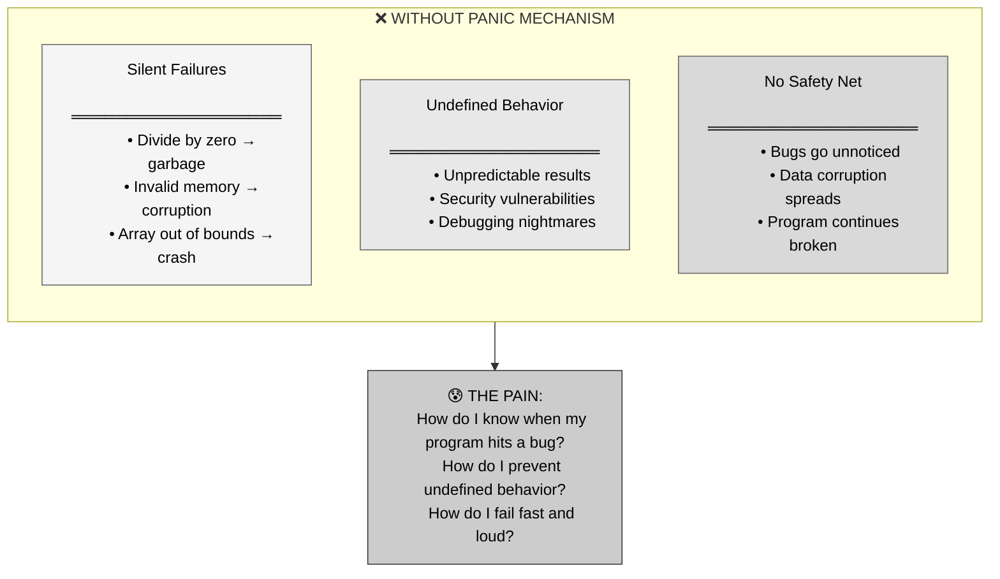
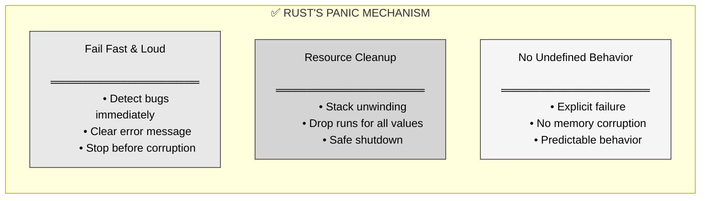
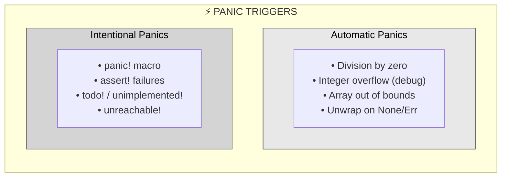
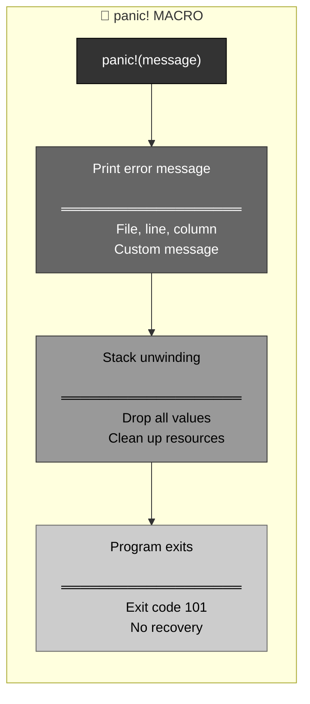
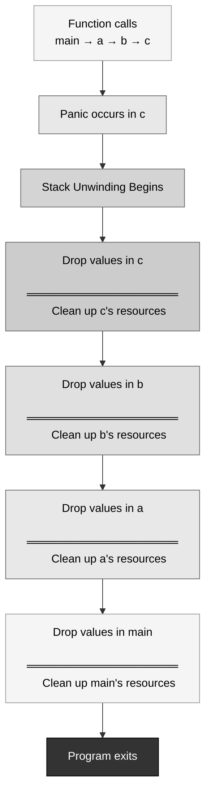
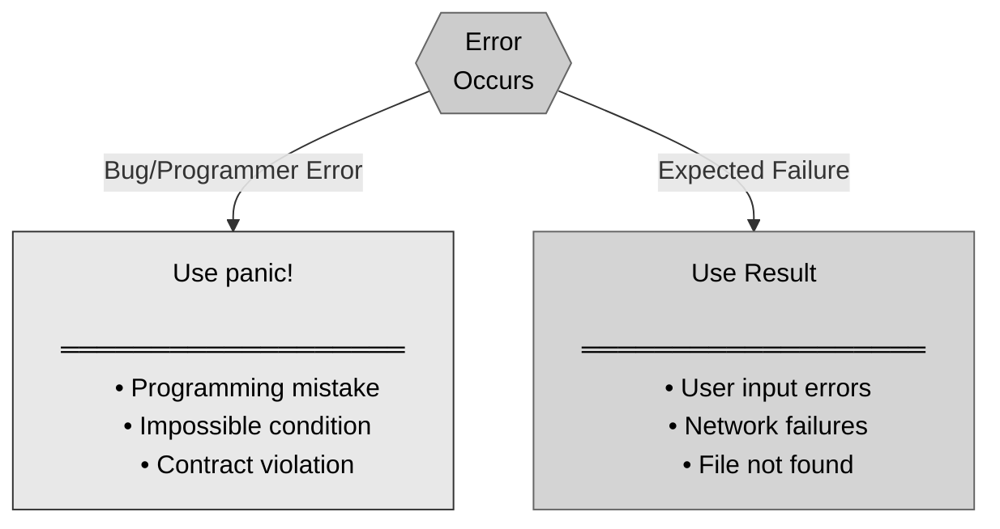
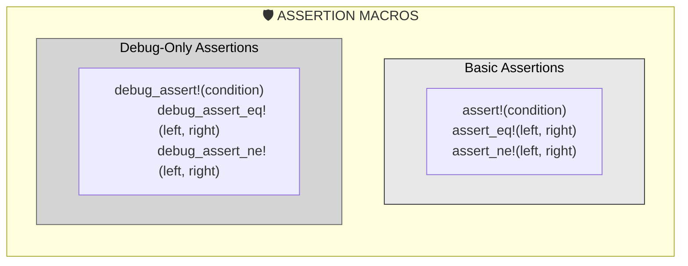
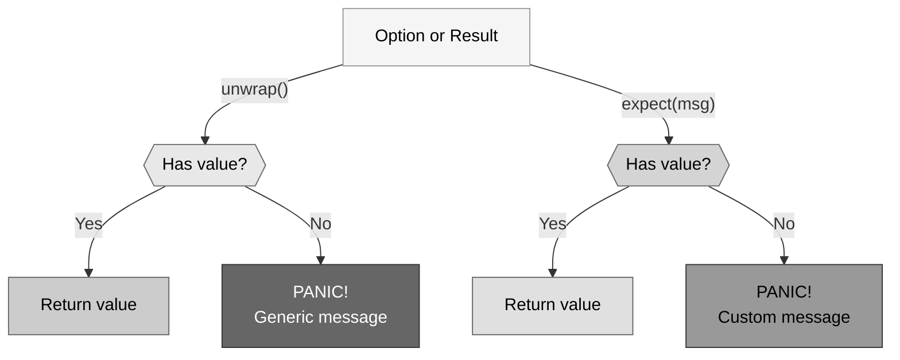
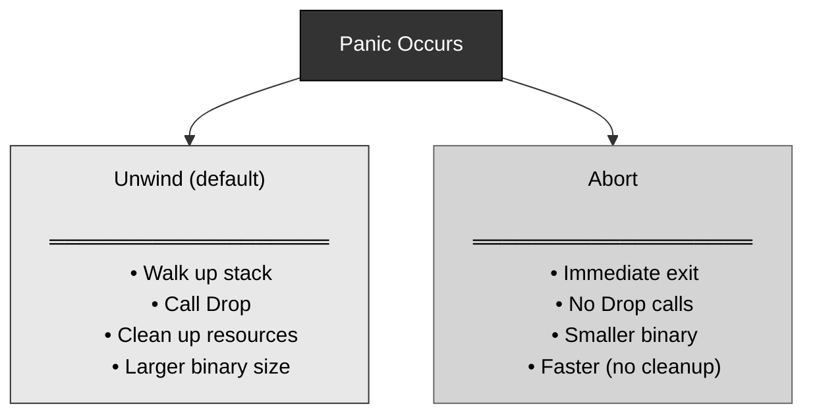

# 🦀 Rust Panics: Unrecoverable Errors

## The Answer (Minto Pyramid: Conclusion First)

**A panic is Rust's way of signaling an unrecoverable error—something went so wrong that the program cannot continue.** When a panic occurs, the program prints an error message, unwinds the stack (cleaning up resources), and exits. Panics are for bugs and programming errors, not for expected runtime failures (use `Result` for those).

---

## 🦸 The Infinity Gauntlet Metaphor (MCU)

**Think of Rust's panic like Thanos snapping the Infinity Gauntlet:**
- **The Snap** → Panic is triggered (divide by zero, index out of bounds, `panic!` macro)
- **Instant, catastrophic effect** → Program cannot continue, immediate termination
- **Inevitable cleanup** → Stack unwinds, Drop implementations run (the "dusting away")
- **No recovery** → Once it happens, you can't undo it (unrecoverable error)
- **Should be prevented** → Avengers tried to stop it; you should prevent panics via validation

**"I am inevitable." — Just like a panic when dividing by zero.**

---

## Part 1: Why Panics? (The Problem)



**The Danger:**

```rust
// In some languages (like C), this might:
// - Return garbage
// - Corrupt memory
// - Crash unpredictably
// - Create security vulnerabilities
fn speed(start: u32, end: u32, time_elapsed: u32) -> u32 {
    let distance = end - start;
    distance / time_elapsed  // What if time_elapsed is 0?
}
```

---

## Part 2: Enter panic! - The Solution



**The Safe Approach:**

```rust
// ✅ Rust panics with clear error message
fn speed(start: u32, end: u32, time_elapsed: u32) -> u32 {
    let distance = end - start;
    distance / time_elapsed  // Panics if time_elapsed is 0!
}

// Running with time_elapsed = 0 produces:
// thread 'main' panicked at src/main.rs:3:5:
// attempt to divide by zero
```

---

## Part 3: What Causes Panics?



```rust
// ═══════════════════════════════════════
// AUTOMATIC PANIC: Division by zero
// ═══════════════════════════════════════

let x = 10;
let y = 0;
let z = x / y;  // PANIC! attempt to divide by zero

// ═══════════════════════════════════════
// AUTOMATIC PANIC: Array out of bounds
// ═══════════════════════════════════════

let numbers = vec![1, 2, 3];
let item = numbers[10];  // PANIC! index out of bounds

// ═══════════════════════════════════════
// AUTOMATIC PANIC: Unwrap on None
// ═══════════════════════════════════════

let maybe: Option<i32> = None;
let value = maybe.unwrap();  // PANIC! called `Option::unwrap()` on a `None` value

// ═══════════════════════════════════════
// INTENTIONAL PANIC: panic! macro
// ═══════════════════════════════════════

fn validate_age(age: i32) {
    if age < 0 {
        panic!("Age cannot be negative!");
    }
}

validate_age(-5);  // PANIC! Age cannot be negative!
```

---

## Part 4: The panic! Macro



```rust
// ═══════════════════════════════════════
// BASIC panic!
// ═══════════════════════════════════════

fn main() {
    panic!("Something went wrong!");
    // Code after this never executes
    println!("This will never print");
}

// Output:
// thread 'main' panicked at src/main.rs:2:5:
// Something went wrong!

// ═══════════════════════════════════════
// panic! WITH FORMATTING
// ═══════════════════════════════════════

let x = 42;
panic!("Invalid value: {}", x);

// Output:
// thread 'main' panicked at src/main.rs:2:5:
// Invalid value: 42

// ═══════════════════════════════════════
// WHEN TO USE panic!
// ═══════════════════════════════════════

fn divide(a: i32, b: i32) -> i32 {
    if b == 0 {
        panic!("Cannot divide by zero!");
    }
    a / b
}

// Better approach: use Result instead!
fn divide_safe(a: i32, b: i32) -> Result<i32, String> {
    if b == 0 {
        Err("Cannot divide by zero".to_string())
    } else {
        Ok(a / b)
    }
}
```

---

## Part 5: Stack Unwinding



```rust
// ═══════════════════════════════════════
// STACK UNWINDING EXAMPLE
// ═══════════════════════════════════════

struct Resource {
    name: String,
}

impl Drop for Resource {
    fn drop(&mut self) {
        println!("Cleaning up: {}", self.name);
    }
}

fn level_3() {
    let r3 = Resource { name: "Level 3".to_string() };
    panic!("Error at level 3!");
    // r3 will be dropped during unwinding
}

fn level_2() {
    let r2 = Resource { name: "Level 2".to_string() };
    level_3();
    // r2 will be dropped during unwinding
}

fn level_1() {
    let r1 = Resource { name: "Level 1".to_string() };
    level_2();
    // r1 will be dropped during unwinding
}

fn main() {
    level_1();
}

// Output:
// Cleaning up: Level 3
// Cleaning up: Level 2
// Cleaning up: Level 1
// thread 'main' panicked at src/main.rs:12:5:
// Error at level 3!
```

---

## Part 6: Panics vs Results



```rust
// ═══════════════════════════════════════
// ✅ GOOD: Use panic for bugs
// ═══════════════════════════════════════

fn calculate_percentage(numerator: u32, denominator: u32) -> f64 {
    // This is a programming error - caller should validate
    assert!(denominator != 0, "Denominator cannot be zero");
    (numerator as f64 / denominator as f64) * 100.0
}

// ═══════════════════════════════════════
// ✅ GOOD: Use Result for expected errors
// ═══════════════════════════════════════

use std::fs::File;
use std::io::Result;

fn read_file(path: &str) -> Result<String> {
    // File might not exist - this is expected
    std::fs::read_to_string(path)
}

fn main() {
    match read_file("config.txt") {
        Ok(contents) => println!("File: {}", contents),
        Err(e) => println!("Error: {}", e),
    }
}

// ═══════════════════════════════════════
// ❌ BAD: Using panic for expected errors
// ═══════════════════════════════════════

fn read_config(path: &str) -> String {
    std::fs::read_to_string(path)
        .unwrap()  // Bad! File might not exist
}

// ═══════════════════════════════════════
// ❌ BAD: Using Result for bugs
// ═══════════════════════════════════════

fn divide(a: i32, b: i32) -> Result<i32, String> {
    // Dividing by zero is a programming error!
    // Should use assert or panic instead
    if b == 0 {
        Err("Division by zero".to_string())
    } else {
        Ok(a / b)
    }
}
```

---

## Part 7: Assertion Macros



```rust
// ═══════════════════════════════════════
// assert! - Always checked
// ═══════════════════════════════════════

fn withdraw(balance: u32, amount: u32) -> u32 {
    assert!(amount <= balance, "Insufficient funds");
    balance - amount
}

withdraw(100, 150);  // PANIC! Insufficient funds

// ═══════════════════════════════════════
// assert_eq! - Equality check
// ═══════════════════════════════════════

fn add(a: i32, b: i32) -> i32 {
    a + b
}

let result = add(2, 2);
assert_eq!(result, 4);  // Pass
assert_eq!(result, 5);  // PANIC! assertion failed: `(left == right)`

// ═══════════════════════════════════════
// assert_ne! - Inequality check
// ═══════════════════════════════════════

let x = 10;
assert_ne!(x, 0);  // Pass
assert_ne!(x, 10);  // PANIC! assertion failed: `(left != right)`

// ═══════════════════════════════════════
// debug_assert! - Only in debug builds
// ═══════════════════════════════════════

fn expensive_check(data: &[i32]) {
    // Checked in debug mode, skipped in release
    debug_assert!(data.len() > 0, "Data cannot be empty");
    
    // Always checked
    assert!(data.len() > 0, "Data cannot be empty");
}

// ═══════════════════════════════════════
// WITH CUSTOM MESSAGES
// ═══════════════════════════════════════

let age = 15;
assert!(age >= 18, "User must be 18 or older, got: {}", age);
// PANIC! User must be 18 or older, got: 15
```

---

## Part 8: Other Panic Macros

```rust
// ═══════════════════════════════════════
// todo! - Mark unfinished code
// ═══════════════════════════════════════

fn calculate_tax(income: f64) -> f64 {
    todo!("Implement tax calculation");
}

// PANIC! not yet implemented: Implement tax calculation

// ═══════════════════════════════════════
// unimplemented! - Mark unimplemented features
// ═══════════════════════════════════════

trait Drawable {
    fn draw(&self);
}

struct Circle;

impl Drawable for Circle {
    fn draw(&self) {
        unimplemented!("Circle drawing not yet supported");
    }
}

// ═══════════════════════════════════════
// unreachable! - Mark unreachable code
// ═══════════════════════════════════════

enum Status {
    Success,
    Failure,
}

fn handle_status(status: Status) -> &'static str {
    match status {
        Status::Success => "OK",
        Status::Failure => "Error",
        // Compiler knows all cases covered,
        // but if logic error occurs:
        _ => unreachable!("All cases should be covered"),
    }
}

// ═══════════════════════════════════════
// COMPARISON
// ═══════════════════════════════════════

// panic!()            → General panic
// todo!()             → "I'll implement this later"
// unimplemented!()    → "This feature isn't ready"
// unreachable!()      → "This should never execute"
```

---

## Part 9: unwrap and expect



```rust
// ═══════════════════════════════════════
// unwrap() - Panics with generic message
// ═══════════════════════════════════════

let maybe: Option<i32> = Some(42);
let value = maybe.unwrap();  // OK, returns 42

let nothing: Option<i32> = None;
let value = nothing.unwrap();  // PANIC!
// thread 'main' panicked at 'called `Option::unwrap()` on a `None` value'

// ═══════════════════════════════════════
// expect() - Panics with custom message
// ═══════════════════════════════════════

let config: Option<String> = None;
let value = config.expect("Config file must be loaded");
// PANIC! Config file must be loaded

// ═══════════════════════════════════════
// WITH Result
// ═══════════════════════════════════════

use std::fs::File;

// unwrap - generic error
let file = File::open("config.txt").unwrap();
// PANIC! called `Result::unwrap()` on an `Err` value: ...

// expect - custom error
let file = File::open("config.txt")
    .expect("Failed to open config.txt");
// PANIC! Failed to open config.txt: No such file or directory

// ═══════════════════════════════════════
// WHEN TO USE
// ═══════════════════════════════════════

// ✅ GOOD: Prototyping
fn main() {
    let data = fetch_data().unwrap();  // Quick testing
}

// ✅ GOOD: Tests
#[test]
fn test_parsing() {
    let result = parse("42").unwrap();  // Test should fail if parse fails
    assert_eq!(result, 42);
}

// ✅ GOOD: When failure is impossible
let num: Result<i32, _> = "42".parse();
let num = num.unwrap();  // We know "42" is valid

// ❌ BAD: Production code
fn load_config() -> Config {
    let file = File::open("config.txt").unwrap();  // Don't do this!
    // Use proper error handling instead
}
```

---

## Part 10: Abort vs Unwind



```rust
// ═══════════════════════════════════════
// DEFAULT: Unwind on panic
// ═══════════════════════════════════════

// Cargo.toml
// [profile.dev]
// panic = "unwind"  // Default

struct Resource;

impl Drop for Resource {
    fn drop(&mut self) {
        println!("Resource cleaned up");
    }
}

fn main() {
    let _r = Resource;
    panic!("Error!");
    // Output: Resource cleaned up
}

// ═══════════════════════════════════════
// ABORT: Immediate exit, no cleanup
// ═══════════════════════════════════════

// Cargo.toml
// [profile.release]
// panic = "abort"

fn main() {
    let _r = Resource;
    panic!("Error!");
    // Output: (no cleanup message)
    // Program exits immediately
}

// ═══════════════════════════════════════
// WHY USE ABORT?
// ═══════════════════════════════════════

// 1. Smaller binary size (no unwinding code)
// 2. Faster panic (no cleanup overhead)
// 3. Embedded systems with limited resources
// 4. When OS will clean up anyway

// ═══════════════════════════════════════
// WHY USE UNWIND?
// ═══════════════════════════════════════

// 1. Proper resource cleanup (files, sockets)
// 2. Better debugging (stack traces)
// 3. Can catch panics (advanced)
// 4. Default Rust behavior
```

---

## Part 11: Preventing Panics

```rust
// ═══════════════════════════════════════
// STRATEGY 1: Validate input
// ═══════════════════════════════════════

fn divide_safe(a: i32, b: i32) -> Option<i32> {
    if b == 0 {
        None  // Return None instead of panicking
    } else {
        Some(a / b)
    }
}

// ═══════════════════════════════════════
// STRATEGY 2: Use safe methods
// ═══════════════════════════════════════

let numbers = vec![1, 2, 3];

// ❌ Panics if out of bounds
let item = numbers[10];

// ✅ Returns None if out of bounds
let item = numbers.get(10);

// ═══════════════════════════════════════
// STRATEGY 3: Use Result for fallible operations
// ═══════════════════════════════════════

fn parse_age(input: &str) -> Result<u32, String> {
    input.parse::<u32>()
        .map_err(|_| "Invalid age format".to_string())
}

// ═══════════════════════════════════════
// STRATEGY 4: Use checked arithmetic
// ═══════════════════════════════════════

let x: u8 = 200;
let y: u8 = 100;

// ❌ Panics in debug mode on overflow
let z = x + y;

// ✅ Returns None on overflow
let z = x.checked_add(y);

match z {
    Some(result) => println!("Sum: {}", result),
    None => println!("Overflow occurred"),
}

// ═══════════════════════════════════════
// STRATEGY 5: Document preconditions
// ═══════════════════════════════════════

/// Calculates speed given distance and time.
/// 
/// # Panics
/// 
/// Panics if `time_elapsed` is zero.
fn speed(start: u32, end: u32, time_elapsed: u32) -> u32 {
    assert!(time_elapsed != 0, "time_elapsed cannot be zero");
    let distance = end - start;
    distance / time_elapsed
}
```

---

## Part 12: Real-World Use Cases

```rust
// ═══════════════════════════════════════
// USE CASE 1: Validating invariants
// ═══════════════════════════════════════

struct BankAccount {
    balance: u32,
}

impl BankAccount {
    fn new(initial_balance: u32) -> Self {
        BankAccount { balance: initial_balance }
    }
    
    fn withdraw(&mut self, amount: u32) {
        // Invariant: balance >= amount
        assert!(
            self.balance >= amount,
            "Insufficient funds: tried to withdraw {}, but balance is {}",
            amount,
            self.balance
        );
        self.balance -= amount;
    }
}

// ═══════════════════════════════════════
// USE CASE 2: Detecting programmer errors
// ═══════════════════════════════════════

fn process_batch(items: &[Item]) {
    // Caller must ensure items is not empty
    assert!(!items.is_empty(), "Batch cannot be empty");
    
    for item in items {
        // Process item
    }
}

// ═══════════════════════════════════════
// USE CASE 3: Impossible states
// ═══════════════════════════════════════

enum State {
    Initialized,
    Running,
    Stopped,
}

fn handle_event(state: &State) {
    match state {
        State::Initialized => { /* handle */ },
        State::Running => { /* handle */ },
        State::Stopped => { /* handle */ },
        // No wildcard - if new variant added and not handled:
        // Compiler error! (not runtime panic)
    }
}

// ═══════════════════════════════════════
// USE CASE 4: Testing
// ═══════════════════════════════════════

#[test]
fn test_addition() {
    let result = add(2, 2);
    assert_eq!(result, 4, "2 + 2 should equal 4");
}

#[test]
#[should_panic(expected = "Division by zero")]
fn test_divide_by_zero() {
    divide(10, 0);  // Should panic
}

// ═══════════════════════════════════════
// USE CASE 5: Prototyping
// ═══════════════════════════════════════

fn prototype_feature() {
    let data = load_data().unwrap();  // Quick and dirty
    let result = process(data).expect("Processing failed");
    
    // TODO: Add proper error handling before production
}
```

---

## Part 13: Panics vs Other Languages

| Feature | 🦀 Rust | ⚡ C/C++ | ☕ Java | 🐍 Python | 🟨 JavaScript |
|:--------|:--------|:---------|:--------|:----------|:--------------|
| **Mechanism** | panic! / unwinding | abort() / exit() | Exceptions | Exceptions | Exceptions |
| **Cleanup** | ✅ Drop called | ⚠️ Manual/none | ✅ finally blocks | ✅ finally blocks | ✅ finally blocks |
| **Catchable** | ⚠️ Rare (catch_unwind) | ❌ No | ✅ try/catch | ✅ try/except | ✅ try/catch |
| **For bugs** | ✅ Yes | ⚠️ abort() | ❌ No (use assertions) | ⚠️ Sometimes | ⚠️ Sometimes |
| **For errors** | ❌ No (use Result) | ❌ No (use errno) | ✅ Yes | ✅ Yes | ✅ Yes |
| **Stack trace** | ✅ Yes (RUST_BACKTRACE) | ⚠️ Debug tools | ✅ Yes | ✅ Yes | ✅ Yes |

```rust
// ═══════════════════════════════════════
// 🦀 RUST
// ═══════════════════════════════════════
panic!("Unrecoverable error");
// Stack unwinds, Drop called, program exits

// For expected errors:
Err("Recoverable error")
```

```cpp
// ═══════════════════════════════════════
// ⚡ C++
// ═══════════════════════════════════════
throw std::runtime_error("Error");  // Exception (recoverable)
abort();  // Immediate exit (like panic)

// C doesn't have exceptions or panic
exit(1);  // Immediate exit, no cleanup
```

```java
// ═══════════════════════════════════════
// ☕ JAVA
// ═══════════════════════════════════════
throw new RuntimeException("Error");  // Catchable

// AssertionError for bugs
assert condition : "message";
```

```python
# ═══════════════════════════════════════
# 🐍 PYTHON
# ═══════════════════════════════════════
raise Exception("Error")  # Catchable exception

# AssertionError for bugs
assert condition, "message"
```

```javascript
// ═══════════════════════════════════════
// 🟨 JAVASCRIPT
// ═══════════════════════════════════════
throw new Error("Error");  // Catchable exception

// No panic mechanism
console.assert(condition, "message");  // Just logs
```

---

## 🧠 The Infinity Gauntlet Principle

> **"I am inevitable." — Thanos**
> **Panics are inevitable when bugs occur, but they prevent the catastrophic corruption that would follow.**

| Scenario | Other Languages | Rust |
|:---------|:---------------|:-----|
| **Divide by zero** | Undefined behavior / crash | Panic with clear message 🎯 |
| **Out of bounds** | Memory corruption / exploit | Panic prevents corruption 🛡️ |
| **Resource cleanup** | Often leaked / manual 😢 | Automatic via Drop ✅ |
| **Error recovery** | Exceptions for everything 🤯 | Result for expected, panic for bugs 📝 |

**Key Takeaways:**

1. **Panic = unrecoverable error** → Program cannot continue
2. **For bugs, not expected errors** → Use Result for recoverable errors
3. **Stack unwinding** → Drop runs, resources cleaned up
4. **Fail fast and loud** → Better than silent corruption
5. **Use assertions** → assert!, assert_eq!, assert_ne!
6. **Development aids** → todo!, unimplemented!, unreachable!
7. **unwrap/expect** → Good for prototyping, bad for production
8. **Prevent panics** → Validate input, use safe methods, document preconditions

A panic is like the **Infinity Gauntlet snap**—instant, catastrophic, inevitable when triggered, but it prevents worse consequences (undefined behavior, memory corruption)! 💥

