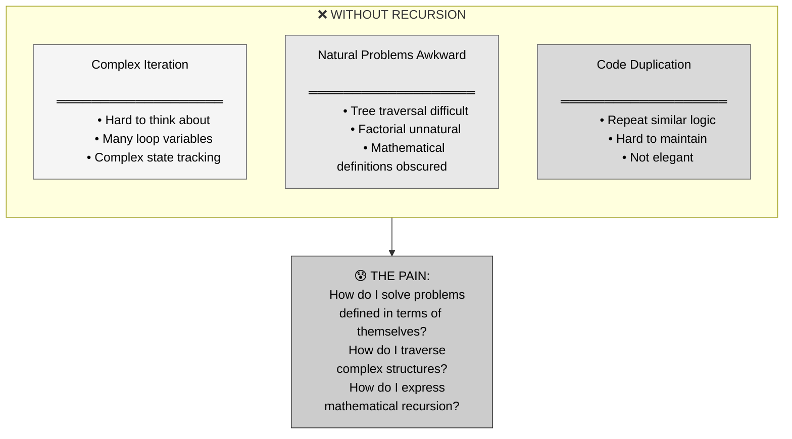
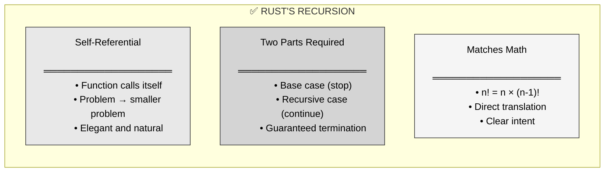
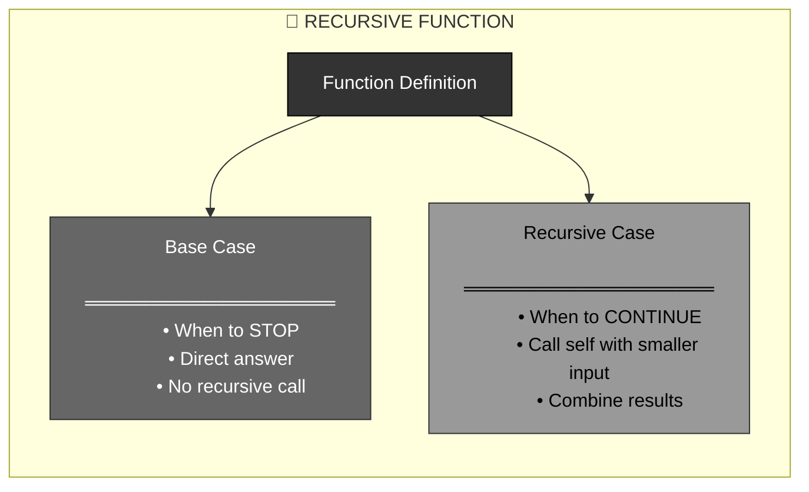
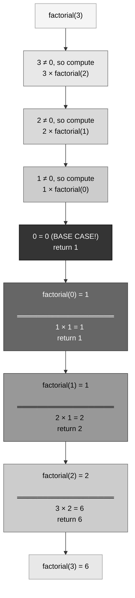
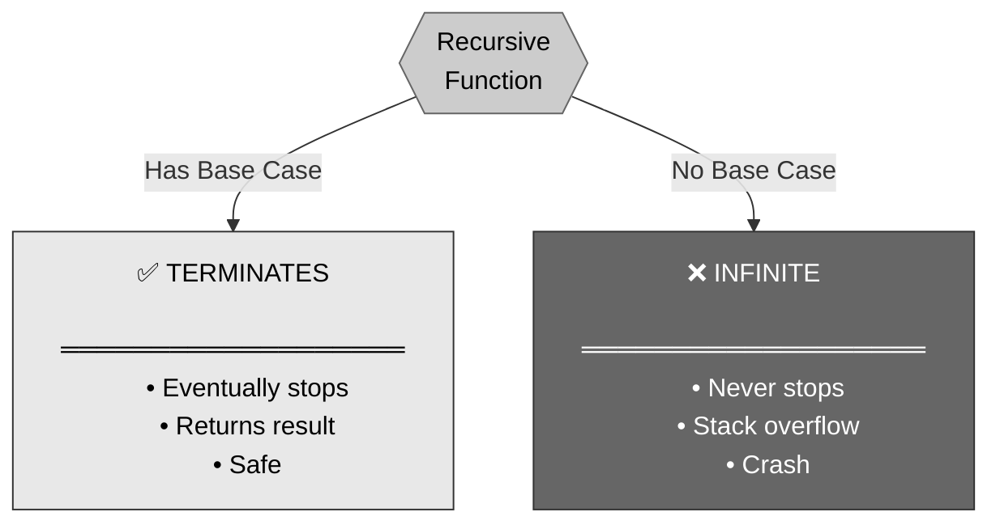
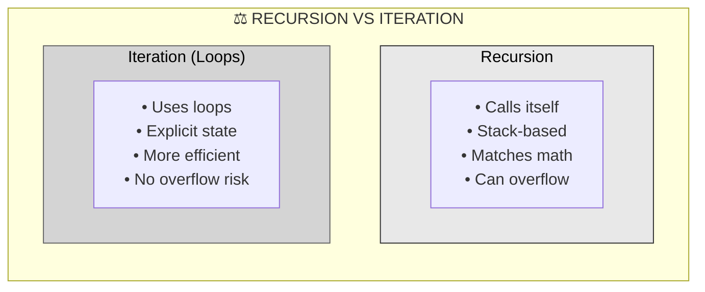
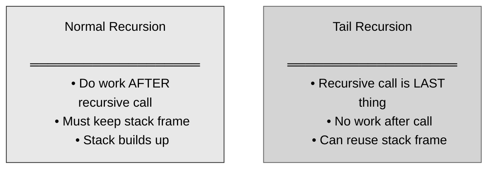

# 🦀 Rust Recursion: Functions That Call Themselves

## The Answer (Minto Pyramid: Conclusion First)

**Recursion is when a function calls itself to solve a problem by breaking it into smaller versions of the same problem.** Every recursive function needs two parts: a base case (when to stop) and a recursive case (how to break down the problem). Without a base case, recursion continues forever (stack overflow).

---

## 🦸 The Dormammu Time Loop Metaphor (MCU)

**Think of Rust's recursion like Doctor Strange's time loop with Dormammu:**
- **"Dormammu, I've come to bargain"** → Function calls itself repeatedly
- **Each iteration** → Function call with smaller problem
- **Base case = Dormammu gives up** → Condition when recursion stops
- **Returns through the loop** → Each call returns its result back up
- **Infinite without base case** → Would loop forever (like Strange intended for Dormammu)

**"We're in a time loop. I brought us into a time loop." — Doctor Strange showing recursion!**

---

## Part 1: Why Recursion? (The Problem)



**The Challenge:**

```rust
// Factorial: n! = n × (n-1) × (n-2) × ... × 1
// Example: 5! = 5 × 4 × 3 × 2 × 1 = 120

// Without recursion, you need loops and state:
fn factorial_loop(n: u32) -> u32 {
    let mut result = 1;
    for i in 1..=n {
        result *= i;
    }
    result
}
// Works, but doesn't match mathematical definition
```

---

## Part 2: Enter Recursion - The Solution



**The Elegant Approach:**

```rust
// ✅ With recursion, matches mathematical definition
fn factorial(n: u32) -> u32 {
    if n == 0 {
        1  // Base case: 0! = 1
    } else {
        n * factorial(n - 1)  // Recursive case: n! = n × (n-1)!
    }
}

// factorial(5)
// = 5 × factorial(4)
// = 5 × 4 × factorial(3)
// = 5 × 4 × 3 × factorial(2)
// = 5 × 4 × 3 × 2 × factorial(1)
// = 5 × 4 × 3 × 2 × 1 × factorial(0)
// = 5 × 4 × 3 × 2 × 1 × 1
// = 120
```

---

## Part 3: Anatomy of Recursion



```rust
// ═══════════════════════════════════════
// ANATOMY OF RECURSIVE FACTORIAL
// ═══════════════════════════════════════

fn factorial(n: u32) -> u32 {
    // BASE CASE: When to stop
    if n == 0 {
        return 1;  // 0! = 1 (by definition)
    }
    
    // RECURSIVE CASE: Break down the problem
    n * factorial(n - 1)
    //  ^^^^^^^^^^^^^^^^
    //  Call yourself with smaller problem
}

// ═══════════════════════════════════════
// WHY IT WORKS
// ═══════════════════════════════════════

// 1. Each call makes the problem smaller (n → n-1)
// 2. Eventually reaches base case (n = 0)
// 3. Base case returns without recursing
// 4. Results bubble back up through call stack
```

---

## Part 4: The Call Stack Visualization



```rust
// ═══════════════════════════════════════
// STEP-BY-STEP: factorial(3)
// ═══════════════════════════════════════

// Call 1: factorial(3)
//   n = 3, not base case
//   return 3 * factorial(2)  // Wait for result...

// Call 2: factorial(2)
//   n = 2, not base case
//   return 2 * factorial(1)  // Wait for result...

// Call 3: factorial(1)
//   n = 1, not base case
//   return 1 * factorial(0)  // Wait for result...

// Call 4: factorial(0)
//   n = 0, BASE CASE!
//   return 1                 // ← Start returning

// Back to Call 3:
//   return 1 * 1 = 1

// Back to Call 2:
//   return 2 * 1 = 2

// Back to Call 1:
//   return 3 * 2 = 6

// Final result: 6
```

---

## Part 5: Base Case - Critical!



```rust
// ═══════════════════════════════════════
// ✅ GOOD: Has base case
// ═══════════════════════════════════════

fn countdown(n: u32) {
    if n == 0 {
        println!("Blastoff!");  // Base case!
        return;
    }
    println!("{}", n);
    countdown(n - 1);
}

countdown(3);
// Output:
// 3
// 2
// 1
// Blastoff!

// ═══════════════════════════════════════
// ❌ BAD: No base case - INFINITE RECURSION!
// ═══════════════════════════════════════

fn infinite(n: u32) {
    println!("{}", n);
    infinite(n - 1);  // No base case!
}

// infinite(5);
// Output:
// 5
// 4
// 3
// 2
// 1
// 0
// ... keeps going ...
// thread 'main' has overflowed its stack
// CRASH!

// ═══════════════════════════════════════
// ❌ BAD: Base case never reached
// ═══════════════════════════════════════

fn broken(n: u32) {
    if n == 0 {
        return;  // Base case exists...
    }
    println!("{}", n);
    broken(n + 1);  // But n keeps INCREASING!
}

// broken(1);
// Stack overflow! Never reaches 0
```

---

## Part 6: Multiple Recursive Calls

```rust
// ═══════════════════════════════════════
// FIBONACCI: Two recursive calls
// ═══════════════════════════════════════

// fib(n) = fib(n-1) + fib(n-2)

fn fibonacci(n: u32) -> u32 {
    // Two base cases
    if n == 0 {
        return 0;
    }
    if n == 1 {
        return 1;
    }
    
    // Two recursive calls!
    fibonacci(n - 1) + fibonacci(n - 2)
}

println!("{}", fibonacci(6));  // 8

// Call tree for fibonacci(4):
//                 fib(4)
//               /        \
//           fib(3)      fib(2)
//          /     \      /     \
//      fib(2)  fib(1) fib(1) fib(0)
//      /    \
//  fib(1) fib(0)

// ═══════════════════════════════════════
// SUM OF ARRAY: Single recursive call
// ═══════════════════════════════════════

fn sum_array(arr: &[i32]) -> i32 {
    // Base case: empty array
    if arr.is_empty() {
        return 0;
    }
    
    // Recursive case: first element + sum of rest
    arr[0] + sum_array(&arr[1..])
}

let numbers = vec![1, 2, 3, 4, 5];
println!("{}", sum_array(&numbers));  // 15
```

---

## Part 7: Recursion vs Iteration



```rust
// ═══════════════════════════════════════
// FACTORIAL: Recursive version
// ═══════════════════════════════════════

fn factorial_recursive(n: u32) -> u32 {
    if n == 0 {
        1
    } else {
        n * factorial_recursive(n - 1)
    }
}

// Pros:
// - Elegant, matches mathematical definition
// - Natural for some problems (trees, graphs)
// - Less code

// Cons:
// - Uses stack space (one frame per call)
// - Can overflow for large n
// - Slightly slower (function call overhead)

// ═══════════════════════════════════════
// FACTORIAL: Iterative version
// ═══════════════════════════════════════

fn factorial_iterative(n: u32) -> u32 {
    let mut result = 1;
    for i in 1..=n {
        result *= i;
    }
    result
}

// Pros:
// - More efficient (less overhead)
// - No stack overflow risk
// - Uses constant stack space

// Cons:
// - More verbose
// - Need to manage state explicitly
// - Less natural for some problems

// ═══════════════════════════════════════
// WHEN TO USE EACH
// ═══════════════════════════════════════

// Use Recursion when:
// - Problem is naturally recursive (trees, graphs)
// - Code clarity is more important than performance
// - Input size is small

// Use Iteration when:
// - Performance is critical
// - Input size can be large
// - Problem is naturally iterative
```

---

## Part 8: Tail Recursion



```rust
// ═══════════════════════════════════════
// NORMAL RECURSION (not tail-recursive)
// ═══════════════════════════════════════

fn factorial(n: u32) -> u32 {
    if n == 0 {
        1
    } else {
        n * factorial(n - 1)  // Multiply AFTER recursive call
        //  ^
        //  Work happens after the call!
        //  Must keep stack frame to do multiplication
    }
}

// ═══════════════════════════════════════
// TAIL RECURSION
// ═══════════════════════════════════════

fn factorial_tail(n: u32, accumulator: u32) -> u32 {
    if n == 0 {
        accumulator  // Return accumulated result
    } else {
        factorial_tail(n - 1, n * accumulator)
        //             ^^^^^^^^^^^^^^^^^^^^^^^^^
        //             Recursive call is LAST thing
        //             No work after this!
    }
}

// Helper function to hide accumulator
fn factorial(n: u32) -> u32 {
    factorial_tail(n, 1)
}

// ═══════════════════════════════════════
// WHY TAIL RECURSION MATTERS
// ═══════════════════════════════════════

// Tail-recursive functions can be optimized by compiler:
// - Reuse stack frame (no stack buildup)
// - Effectively becomes a loop
// - No stack overflow risk

// Note: Rust doesn't guarantee tail-call optimization!
// For production, prefer iteration over recursion
```

---

## Part 9: Common Recursive Patterns

```rust
// ═══════════════════════════════════════
// PATTERN 1: Countdown
// ═══════════════════════════════════════

fn countdown(n: u32) {
    if n == 0 {
        println!("Done!");
        return;
    }
    println!("{}", n);
    countdown(n - 1);
}

// ═══════════════════════════════════════
// PATTERN 2: Sum of natural numbers
// ═══════════════════════════════════════

fn sum_to_n(n: u32) -> u32 {
    if n == 0 {
        0
    } else {
        n + sum_to_n(n - 1)
    }
}

// sum_to_n(5) = 5 + 4 + 3 + 2 + 1 + 0 = 15

// ═══════════════════════════════════════
// PATTERN 3: Power function
// ═══════════════════════════════════════

fn power(base: i32, exponent: u32) -> i32 {
    if exponent == 0 {
        1  // Anything to power 0 is 1
    } else {
        base * power(base, exponent - 1)
    }
}

// power(2, 3) = 2 × 2 × 2 = 8

// ═══════════════════════════════════════
// PATTERN 4: Greatest Common Divisor (Euclidean)
// ═══════════════════════════════════════

fn gcd(a: u32, b: u32) -> u32 {
    if b == 0 {
        a  // Base case
    } else {
        gcd(b, a % b)  // Recursive case
    }
}

// gcd(48, 18)
// = gcd(18, 48 % 18)
// = gcd(18, 12)
// = gcd(12, 18 % 12)
// = gcd(12, 6)
// = gcd(6, 12 % 6)
// = gcd(6, 0)
// = 6

// ═══════════════════════════════════════
// PATTERN 5: String reversal
// ═══════════════════════════════════════

fn reverse(s: &str) -> String {
    if s.is_empty() {
        String::new()
    } else {
        let first_char = &s[0..1];
        let rest = &s[1..];
        reverse(rest) + first_char
    }
}

// reverse("hello")
// = reverse("ello") + "h"
// = reverse("llo") + "e" + "h"
// = reverse("lo") + "l" + "e" + "h"
// = reverse("o") + "l" + "l" + "e" + "h"
// = reverse("") + "o" + "l" + "l" + "e" + "h"
// = "" + "o" + "l" + "l" + "e" + "h"
// = "olleh"
```

---

## Part 10: Stack Overflow Danger

```rust
// ═══════════════════════════════════════
// DANGER: Deep recursion can overflow stack
// ═══════════════════════════════════════

fn factorial(n: u32) -> u32 {
    if n == 0 {
        1
    } else {
        n * factorial(n - 1)
    }
}

// This works:
println!("{}", factorial(5));  // 120

// This works:
println!("{}", factorial(10));  // 3628800

// This might overflow for very large n:
// println!("{}", factorial(100000));
// thread 'main' has overflowed its stack

// ═══════════════════════════════════════
// SOLUTION: Use iteration for large inputs
// ═══════════════════════════════════════

fn factorial_safe(n: u32) -> u32 {
    let mut result = 1;
    for i in 1..=n {
        result *= i;
    }
    result
}

// ═══════════════════════════════════════
// OR: Limit recursion depth
// ═══════════════════════════════════════

fn factorial_limited(n: u32, max_depth: u32) -> Result<u32, String> {
    if max_depth == 0 {
        return Err("Recursion too deep".to_string());
    }
    
    if n == 0 {
        Ok(1)
    } else {
        match factorial_limited(n - 1, max_depth - 1) {
            Ok(result) => Ok(n * result),
            Err(e) => Err(e),
        }
    }
}
```

---

## Part 11: Real-World Use Cases

```rust
// ═══════════════════════════════════════
// USE CASE 1: File system traversal
// ═══════════════════════════════════════

use std::fs;
use std::path::Path;

fn list_files(path: &Path, indent: usize) {
    if path.is_dir() {
        println!("{}{}/", "  ".repeat(indent), path.file_name().unwrap().to_str().unwrap());
        
        if let Ok(entries) = fs::read_dir(path) {
            for entry in entries {
                if let Ok(entry) = entry {
                    list_files(&entry.path(), indent + 1);  // Recursive!
                }
            }
        }
    } else {
        println!("{}{}", "  ".repeat(indent), path.file_name().unwrap().to_str().unwrap());
    }
}

// ═══════════════════════════════════════
// USE CASE 2: JSON parsing (tree structure)
// ═══════════════════════════════════════

enum Json {
    Number(f64),
    String(String),
    Array(Vec<Json>),  // Can contain more JSON!
    Object(Vec<(String, Json)>),  // Can contain more JSON!
}

fn print_json(json: &Json, indent: usize) {
    match json {
        Json::Number(n) => println!("{}{}", "  ".repeat(indent), n),
        Json::String(s) => println!("{}{}", "  ".repeat(indent), s),
        Json::Array(arr) => {
            println!("{}[", "  ".repeat(indent));
            for item in arr {
                print_json(item, indent + 1);  // Recursive!
            }
            println!("{}]", "  ".repeat(indent));
        }
        Json::Object(obj) => {
            println!("{}{}", "  ".repeat(indent), "{");
            for (key, value) in obj {
                println!("{}{}: ", "  ".repeat(indent + 1), key);
                print_json(value, indent + 2);  // Recursive!
            }
            println!("{}}}", "  ".repeat(indent));
        }
    }
}

// ═══════════════════════════════════════
// USE CASE 3: Binary search
// ═══════════════════════════════════════

fn binary_search(arr: &[i32], target: i32) -> Option<usize> {
    if arr.is_empty() {
        return None;
    }
    
    let mid = arr.len() / 2;
    
    if arr[mid] == target {
        Some(mid)
    } else if arr[mid] > target {
        binary_search(&arr[..mid], target)  // Search left half
    } else {
        // Search right half, adjust index
        binary_search(&arr[mid + 1..], target)
            .map(|i| i + mid + 1)
    }
}

// ═══════════════════════════════════════
// USE CASE 4: Permutations
// ═══════════════════════════════════════

fn permutations(arr: &[i32]) -> Vec<Vec<i32>> {
    if arr.len() <= 1 {
        return vec![arr.to_vec()];
    }
    
    let mut result = Vec::new();
    
    for i in 0..arr.len() {
        let mut rest = arr.to_vec();
        let elem = rest.remove(i);
        
        // Get permutations of remaining elements (recursive!)
        for mut perm in permutations(&rest) {
            perm.insert(0, elem);
            result.push(perm);
        }
    }
    
    result
}
```

---

## Part 12: Debugging Recursive Functions

```rust
// ═══════════════════════════════════════
// TIP 1: Add print statements
// ═══════════════════════════════════════

fn factorial_debug(n: u32, depth: usize) -> u32 {
    println!("{}factorial({}) called", "  ".repeat(depth), n);
    
    if n == 0 {
        println!("{}Base case! Returning 1", "  ".repeat(depth));
        1
    } else {
        let result = n * factorial_debug(n - 1, depth + 1);
        println!("{}factorial({}) = {}", "  ".repeat(depth), n, result);
        result
    }
}

// factorial_debug(3, 0);
// Output:
// factorial(3) called
//   factorial(2) called
//     factorial(1) called
//       factorial(0) called
//       Base case! Returning 1
//     factorial(1) = 1
//   factorial(2) = 2
// factorial(3) = 6

// ═══════════════════════════════════════
// TIP 2: Verify base case first
// ═══════════════════════════════════════

#[test]
fn test_base_case() {
    assert_eq!(factorial(0), 1);  // Test base case!
}

#[test]
fn test_small_cases() {
    assert_eq!(factorial(1), 1);
    assert_eq!(factorial(2), 2);
    assert_eq!(factorial(3), 6);
}

// ═══════════════════════════════════════
// TIP 3: Check that problem gets smaller
// ═══════════════════════════════════════

fn factorial(n: u32) -> u32 {
    if n == 0 {
        1
    } else {
        // Make sure n - 1 < n (problem gets smaller!)
        assert!(n > 0, "n must be positive");
        n * factorial(n - 1)
    }
}
```

---

## Part 13: Recursion vs Other Languages

| Feature | 🦀 Rust | ⚡ C/C++ | ☕ Java | 🐍 Python | 🟨 JavaScript |
|:--------|:--------|:---------|:--------|:----------|:--------------|
| **Recursion support** | ✅ Yes | ✅ Yes | ✅ Yes | ✅ Yes | ✅ Yes |
| **Tail-call optimization** | ⚠️ Not guaranteed | ⚠️ Compiler-dependent | ❌ No | ❌ No | ⚠️ Some engines |
| **Stack size** | Default ~2MB | Default ~8MB | Can set (-Xss) | ~1MB (default) | Varies by engine |
| **Stack overflow check** | ✅ Yes | ✅ Yes | ✅ Yes | ✅ Yes | ✅ Yes |
| **Pattern matching** | ✅ Excellent | ❌ No | ⚠️ Switch only | ⚠️ Limited | ⚠️ Limited |

```rust
// ═══════════════════════════════════════
// 🦀 RUST
// ═══════════════════════════════════════
fn factorial(n: u32) -> u32 {
    if n == 0 { 1 } else { n * factorial(n - 1) }
}

// With pattern matching:
fn factorial(n: u32) -> u32 {
    match n {
        0 => 1,
        n => n * factorial(n - 1),
    }
}
```

```cpp
// ═══════════════════════════════════════
// ⚡ C++
// ═══════════════════════════════════════
unsigned int factorial(unsigned int n) {
    if (n == 0) return 1;
    return n * factorial(n - 1);
}
```

```java
// ═══════════════════════════════════════
// ☕ JAVA
// ═══════════════════════════════════════
public static int factorial(int n) {
    if (n == 0) return 1;
    return n * factorial(n - 1);
}
```

```python
# ═══════════════════════════════════════
# 🐍 PYTHON
# ═══════════════════════════════════════
def factorial(n):
    if n == 0:
        return 1
    return n * factorial(n - 1)
```

```javascript
// ═══════════════════════════════════════
// 🟨 JAVASCRIPT
// ═══════════════════════════════════════
function factorial(n) {
    if (n === 0) return 1;
    return n * factorial(n - 1);
}
```

---

## 🧠 The Dormammu Time Loop Principle

> **"Dormammu, I've come to bargain." — Doctor Strange, demonstrating recursion with a base case!**

| Scenario | Time Loop | Recursion |
|:---------|:----------|:----------|
| **Repeating action** | Strange confronts Dormammu | Function calls itself |
| **Each iteration** | Slightly different each time | With smaller input |
| **Base case** | Dormammu gives up | Condition to stop |
| **Without base case** | Would loop forever | Stack overflow |
| **Result propagation** | Strange wins when loop ends | Values return up the stack |

**Key Takeaways:**

1. **Recursion = function calling itself** → Break problem into smaller versions
2. **Two parts required** → Base case (stop) + Recursive case (continue)
3. **Base case critical** → Without it, infinite recursion / stack overflow
4. **Stack-based** → Each call uses stack space
5. **Matches mathematical definitions** → Natural for factorial, Fibonacci
6. **Call stack builds up** → Then unwinds as functions return
7. **Alternatives exist** → Iteration often more efficient
8. **Watch stack depth** → Large inputs can overflow

Recursion is like the **Dormammu time loop**—each iteration calls the same encounter with a smaller problem, until the base case (Dormammu's surrender) is reached! 🔄

