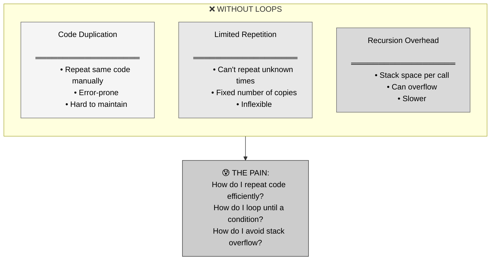
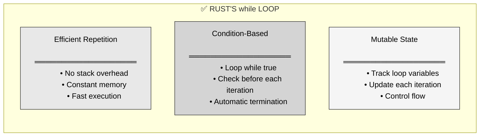
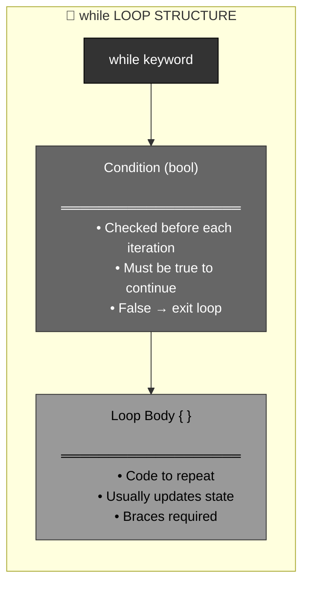
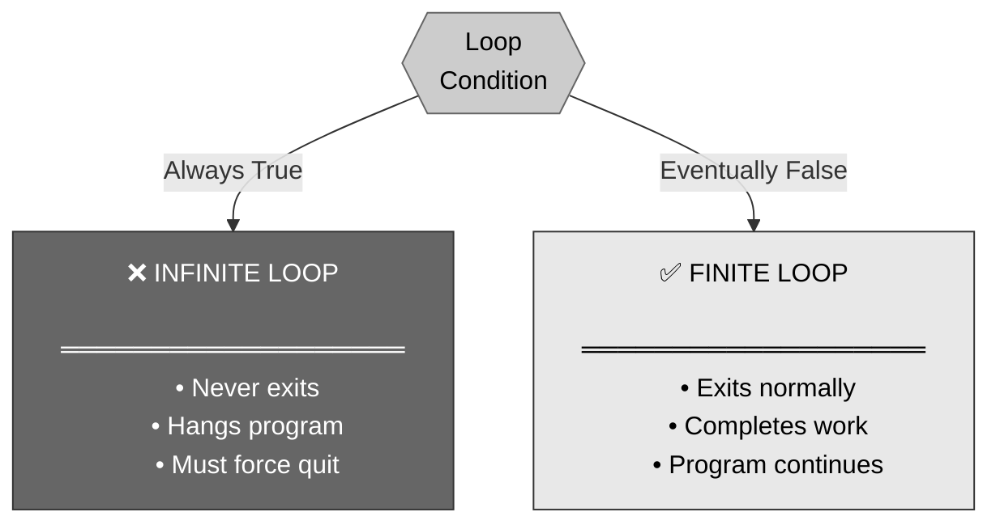
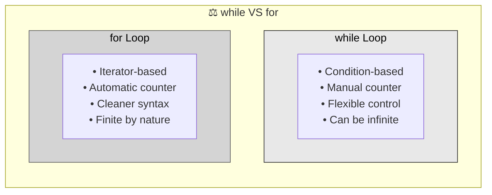

# 🦀 Rust while Loops: Repetition with Conditions

## The Answer (Minto Pyramid: Conclusion First)

**A `while` loop executes a block of code repeatedly as long as a condition remains true.** It checks the condition before each iteration and stops when the condition becomes false. Unlike recursion, loops use iteration with mutable state rather than function calls, making them more efficient for repetitive tasks.

---

## 🦸 The Hulk Smash Metaphor (MCU)

**Think of Rust's while loop like Hulk smashing enemies:**
- **While enemies remain** → Condition is true, keep looping
- **Hulk smash!** → Execute loop body
- **Check again** → Re-evaluate condition after each smash
- **No more enemies** → Condition becomes false, stop looping
- **Must track state** → Count of enemies decreases (mutable variables)

**"Hulk smash!" — Keep smashing while enemies > 0**

---

## Part 1: Why Loops? (The Problem)



**The Challenge:**

```rust
// Without loops, you'd need to repeat code:
println!("Countdown: 5");
println!("Countdown: 4");
println!("Countdown: 3");
println!("Countdown: 2");
println!("Countdown: 1");
println!("Blastoff!");

// Or use recursion (less efficient):
fn countdown(n: u32) {
    if n == 0 {
        println!("Blastoff!");
        return;
    }
    println!("Countdown: {}", n);
    countdown(n - 1);  // Stack overhead!
}
```

---

## Part 2: Enter while Loops - The Solution



**The Elegant Approach:**

```rust
// ✅ With while loop
let mut n = 5;

while n > 0 {
    println!("Countdown: {}", n);
    n -= 1;  // Decrease counter
}

println!("Blastoff!");

// Output:
// Countdown: 5
// Countdown: 4
// Countdown: 3
// Countdown: 2
// Countdown: 1
// Blastoff!
```

---

## Part 3: while Loop Anatomy



```rust
// ═══════════════════════════════════════
// ANATOMY OF while LOOP
// ═══════════════════════════════════════

let mut counter = 0;

while counter < 5 {
//    ^^^^^^^^^^^^^
//    Condition: checked before each iteration
    
    println!("Counter: {}", counter);
    counter += 1;
//  ^^^^^^^^^^^^
//  Update state (important!)
}

// ═══════════════════════════════════════
// EXECUTION FLOW
// ═══════════════════════════════════════

// 1. Check condition (counter < 5?)
// 2. If true, execute body
// 3. Repeat from step 1
// 4. If false, exit loop
```

---

## Part 4: Execution Flow Visualization

```mermaid
flowchart TD
    START["Start: counter = 0"]
    
    START --> CHECK1{{"counter < 5?
    (0 < 5)"}}
    CHECK1 -->|true| BODY1["Print: Counter: 0
    counter = 1"]
    
    BODY1 --> CHECK2{{"counter < 5?
    (1 < 5)"}}
    CHECK2 -->|true| BODY2["Print: Counter: 1
    counter = 2"]
    
    BODY2 --> CHECK3{{"counter < 5?
    (2 < 5)"}}
    CHECK3 -->|true| BODY3["Print: Counter: 2
    counter = 3"]
    
    BODY3 --> CHECK4{{"counter < 5?
    (3 < 5)"}}
    CHECK4 -->|true| BODY4["Print: Counter: 3
    counter = 4"]
    
    BODY4 --> CHECK5{{"counter < 5?
    (4 < 5)"}}
    CHECK5 -->|true| BODY5["Print: Counter: 4
    counter = 5"]
    
    BODY5 --> CHECK6{{"counter < 5?
    (5 < 5)"}}
    CHECK6 -->|false| END["Exit loop"]
    
    style START fill:#f5f5f5,stroke:#999,color:#000
    style CHECK1 fill:#e8e8e8,stroke:#666,color:#000
    style CHECK2 fill:#e8e8e8,stroke:#666,color:#000
    style CHECK3 fill:#e8e8e8,stroke:#666,color:#000
    style CHECK4 fill:#e8e8e8,stroke:#666,color:#000
    style CHECK5 fill:#e8e8e8,stroke:#666,color:#000
    style CHECK6 fill:#e8e8e8,stroke:#666,color:#000
    style BODY1 fill:#d4d4d4,stroke:#666,color:#000
    style BODY2 fill:#d4d4d4,stroke:#666,color:#000
    style BODY3 fill:#d4d4d4,stroke:#666,color:#000
    style BODY4 fill:#d4d4d4,stroke:#666,color:#000
    style BODY5 fill:#d4d4d4,stroke:#666,color:#000
    style END fill:#333,stroke:#000,color:#fff
```



---

## Part 5: Mutable Variables Required

```rust
// ═══════════════════════════════════════
// ❌ WRONG: Immutable variable
// ═══════════════════════════════════════

let counter = 0;

while counter < 5 {
    println!("Counter: {}", counter);
    counter += 1;  // ERROR!
}

// error[E0384]: cannot assign twice to immutable variable `counter`

// ═══════════════════════════════════════
// ✅ CORRECT: Mutable variable
// ═══════════════════════════════════════

let mut counter = 0;
//  ^^^
//  mut keyword required!

while counter < 5 {
    println!("Counter: {}", counter);
    counter += 1;  // OK! Can modify mut variable
}

// ═══════════════════════════════════════
// WHY MUTABLE?
// ═══════════════════════════════════════

// Loop variables need to change to:
// 1. Eventually make condition false
// 2. Track progress through loop
// 3. Accumulate results
```

---

## Part 6: Infinite Loops - The Danger



```rust
// ═══════════════════════════════════════
// ❌ INFINITE LOOP: Condition never false
// ═══════════════════════════════════════

let mut i = 0;

while i < 10 {
    println!("{}", i);
    // Forgot to increment i!
    // Condition is always true
    // Loop runs forever!
}

// ═══════════════════════════════════════
// ❌ INFINITE LOOP: Wrong update
// ═══════════════════════════════════════

let mut i = 0;

while i < 10 {
    println!("{}", i);
    i -= 1;  // Decreasing instead of increasing!
    // i becomes negative, always < 10
    // Infinite loop!
}

// ═══════════════════════════════════════
// ❌ INFINITE LOOP: Explicit
// ═══════════════════════════════════════

while true {
    println!("Forever!");
    // No way to exit
    // Infinite by design
}

// ═══════════════════════════════════════
// ✅ CORRECT: Condition eventually false
// ═══════════════════════════════════════

let mut i = 0;

while i < 10 {
    println!("{}", i);
    i += 1;  // Increment towards exit condition
}
```

---

## Part 7: Breaking Out of Loops

```rust
// ═══════════════════════════════════════
// break: Exit loop immediately
// ═══════════════════════════════════════

let mut i = 0;

while i < 10 {
    if i == 5 {
        break;  // Exit loop when i is 5
    }
    println!("{}", i);
    i += 1;
}

println!("Exited at {}", i);

// Output:
// 0
// 1
// 2
// 3
// 4
// Exited at 5

// ═══════════════════════════════════════
// continue: Skip to next iteration
// ═══════════════════════════════════════

let mut i = 0;

while i < 5 {
    i += 1;
    
    if i == 3 {
        continue;  // Skip printing 3
    }
    
    println!("{}", i);
}

// Output:
// 1
// 2
// 4
// 5

// ═══════════════════════════════════════
// PRACTICAL EXAMPLE: Search
// ═══════════════════════════════════════

fn find_index(arr: &[i32], target: i32) -> Option<usize> {
    let mut i = 0;
    
    while i < arr.len() {
        if arr[i] == target {
            return Some(i);  // Found it! Exit function
        }
        i += 1;
    }
    
    None  // Not found
}

let numbers = vec![10, 20, 30, 40, 50];
println!("{:?}", find_index(&numbers, 30));  // Some(2)
println!("{:?}", find_index(&numbers, 99));  // None
```

---

## Part 8: Common while Loop Patterns

```rust
// ═══════════════════════════════════════
// PATTERN 1: Counter loop
// ═══════════════════════════════════════

let mut count = 0;

while count < 5 {
    println!("Count: {}", count);
    count += 1;
}

// ═══════════════════════════════════════
// PATTERN 2: Accumulator loop
// ═══════════════════════════════════════

let mut sum = 0;
let mut i = 1;

while i <= 10 {
    sum += i;
    i += 1;
}

println!("Sum: {}", sum);  // 55

// ═══════════════════════════════════════
// PATTERN 3: Search loop
// ═══════════════════════════════════════

let numbers = vec![5, 12, 8, 3, 15];
let mut i = 0;
let mut found = false;

while i < numbers.len() && !found {
    if numbers[i] > 10 {
        println!("Found number > 10: {}", numbers[i]);
        found = true;
    }
    i += 1;
}

// ═══════════════════════════════════════
// PATTERN 4: Input validation loop
// ═══════════════════════════════════════

let mut valid = false;

while !valid {
    // Get user input (simplified)
    let input = get_input();
    
    if input >= 1 && input <= 100 {
        valid = true;
    } else {
        println!("Invalid! Try again.");
    }
}

// ═══════════════════════════════════════
// PATTERN 5: Factorial (iterative)
// ═══════════════════════════════════════

fn factorial(n: u32) -> u32 {
    let mut result = 1;
    let mut i = 1;
    
    while i <= n {
        result *= i;
        i += 1;
    }
    
    result
}

println!("{}", factorial(5));  // 120
```

---

## Part 9: while vs for Loops



```rust
// ═══════════════════════════════════════
// SAME TASK: Print 0 to 4
// ═══════════════════════════════════════

// With while loop:
let mut i = 0;
while i < 5 {
    println!("{}", i);
    i += 1;
}

// With for loop (cleaner!):
for i in 0..5 {
    println!("{}", i);
}

// ═══════════════════════════════════════
// WHEN TO USE while
// ═══════════════════════════════════════

// Use while when:
// - Condition is complex
// - Unknown number of iterations
// - Need manual control over loop variable

let mut x = 100;
while x > 1 {
    x /= 2;  // Divide by 2 each time
}

// ═══════════════════════════════════════
// WHEN TO USE for
// ═══════════════════════════════════════

// Use for when:
// - Iterating over a range
// - Iterating over a collection
// - Known number of iterations

for i in 0..10 {
    println!("{}", i);
}

for item in vec![1, 2, 3] {
    println!("{}", item);
}
```

---

## Part 10: Nested while Loops

```rust
// ═══════════════════════════════════════
// NESTED LOOPS: Multiplication table
// ═══════════════════════════════════════

let mut i = 1;

while i <= 5 {
    let mut j = 1;
    
    while j <= 5 {
        print!("{:3} ", i * j);
        j += 1;
    }
    
    println!();  // New line
    i += 1;
}

// Output:
//   1   2   3   4   5
//   2   4   6   8  10
//   3   6   9  12  15
//   4   8  12  16  20
//   5  10  15  20  25

// ═══════════════════════════════════════
// NESTED LOOPS: Pattern printing
// ═══════════════════════════════════════

let mut row = 1;

while row <= 4 {
    let mut col = 1;
    
    while col <= row {
        print!("* ");
        col += 1;
    }
    
    println!();
    row += 1;
}

// Output:
// *
// * *
// * * *
// * * * *
```

---

## Part 11: Real-World Use Cases

```rust
// ═══════════════════════════════════════
// USE CASE 1: Retry logic with timeout
// ═══════════════════════════════════════

fn connect_with_retry(max_attempts: u32) -> Result<Connection, String> {
    let mut attempts = 0;
    
    while attempts < max_attempts {
        match try_connect() {
            Ok(conn) => return Ok(conn),
            Err(_) => {
                attempts += 1;
                println!("Connection failed, retry {}/{}", attempts, max_attempts);
                std::thread::sleep(std::time::Duration::from_secs(1));
            }
        }
    }
    
    Err("Max retries exceeded".to_string())
}

// ═══════════════════════════════════════
// USE CASE 2: Processing stream until end
// ═══════════════════════════════════════

fn process_stream(reader: &mut impl Read) {
    let mut buffer = [0u8; 1024];
    
    while let Ok(bytes_read) = reader.read(&mut buffer) {
        if bytes_read == 0 {
            break;  // End of stream
        }
        
        process_data(&buffer[..bytes_read]);
    }
}

// ═══════════════════════════════════════
// USE CASE 3: Game loop
// ═══════════════════════════════════════

fn game_loop() {
    let mut game_running = true;
    
    while game_running {
        handle_input();
        update_game_state();
        render_frame();
        
        if check_quit_condition() {
            game_running = false;
        }
    }
}

// ═══════════════════════════════════════
// USE CASE 4: Polling with condition
// ═══════════════════════════════════════

fn wait_for_condition(timeout_ms: u64) -> bool {
    let start = std::time::Instant::now();
    
    while start.elapsed().as_millis() < timeout_ms as u128 {
        if check_condition() {
            return true;  // Condition met!
        }
        std::thread::sleep(std::time::Duration::from_millis(100));
    }
    
    false  // Timeout
}

// ═══════════════════════════════════════
// USE CASE 5: Numerical algorithms
// ═══════════════════════════════════════

fn sqrt_newton(n: f64, tolerance: f64) -> f64 {
    let mut guess = n / 2.0;
    
    while (guess * guess - n).abs() > tolerance {
        guess = (guess + n / guess) / 2.0;
    }
    
    guess
}

println!("{}", sqrt_newton(16.0, 0.001));  // ~4.0
```

---

## Part 12: while vs Recursion Performance

```rust
// ═══════════════════════════════════════
// FACTORIAL: Recursive (stack overhead)
// ═══════════════════════════════════════

fn factorial_recursive(n: u32) -> u32 {
    if n == 0 {
        1
    } else {
        n * factorial_recursive(n - 1)
    }
}

// Problems:
// - Uses stack space per call
// - Can overflow for large n
// - Function call overhead

// ═══════════════════════════════════════
// FACTORIAL: Iterative with while (efficient)
// ═══════════════════════════════════════

fn factorial_iterative(n: u32) -> u32 {
    let mut result = 1;
    let mut i = 1;
    
    while i <= n {
        result *= i;
        i += 1;
    }
    
    result
}

// Benefits:
// - Constant stack space
// - No overflow risk
// - Faster execution

// ═══════════════════════════════════════
// PERFORMANCE COMPARISON
// ═══════════════════════════════════════

// For factorial(10):
// Recursive: ~10 stack frames
// Iterative: 1 stack frame

// For factorial(1000):
// Recursive: Stack overflow!
// Iterative: Works fine
```

---

## Part 13: Common Mistakes

```rust
// ═══════════════════════════════════════
// MISTAKE 1: Off-by-one error
// ═══════════════════════════════════════

// ❌ WRONG: Prints 0-9 (10 numbers)
let mut i = 0;
while i < 10 {
    println!("{}", i);
    i += 1;
}

// ✅ CORRECT: Prints 1-10 (10 numbers)
let mut i = 1;
while i <= 10 {
    println!("{}", i);
    i += 1;
}

// ═══════════════════════════════════════
// MISTAKE 2: Forgetting to update
// ═══════════════════════════════════════

// ❌ WRONG: Infinite loop
let mut i = 0;
while i < 5 {
    println!("{}", i);
    // Forgot i += 1
}

// ═══════════════════════════════════════
// MISTAKE 3: Wrong comparison
// ═══════════════════════════════════════

// ❌ WRONG: Never enters loop
let mut i = 10;
while i < 5 {  // 10 < 5 is false from start
    println!("{}", i);
    i -= 1;
}

// ═══════════════════════════════════════
// MISTAKE 4: Unsigned underflow
// ═══════════════════════════════════════

// ❌ WRONG: Panics in debug mode
let mut i: u32 = 0;
while i >= 0 {  // Always true for unsigned!
    println!("{}", i);
    i -= 1;  // Underflows when i = 0
}

// ✅ CORRECT: Use different approach
let mut i = 5;
while i > 0 {
    println!("{}", i);
    i -= 1;
}
```

---

## Part 14: while vs Other Languages

| Feature | 🦀 Rust | ⚡ C/C++ | ☕ Java | 🐍 Python | 🟨 JavaScript |
|:--------|:--------|:---------|:--------|:----------|:--------------|
| **Basic syntax** | `while cond { }` | `while (cond) { }` | `while (cond) { }` | `while cond:` | `while (cond) { }` |
| **Condition type** | `bool` only | Any (0=false) | `boolean` only | Any (truthy/falsy) | Any (truthy/falsy) |
| **Braces** | Required | Optional (bad!) | Optional (bad!) | Indent-based | Optional (bad!) |
| **break/continue** | ✅ Yes | ✅ Yes | ✅ Yes | ✅ Yes | ✅ Yes |
| **loop labels** | ✅ Yes | ⚠️ goto only | ⚠️ Labeled break | ❌ No | ⚠️ Labeled break |

```rust
// ═══════════════════════════════════════
// 🦀 RUST
// ═══════════════════════════════════════
let mut i = 0;
while i < 5 {
    println!("{}", i);
    i += 1;
}
```

```c
// ═══════════════════════════════════════
// ⚡ C
// ═══════════════════════════════════════
int i = 0;
while (i < 5) {
    printf("%d\n", i);
    i++;
}
```

```java
// ═══════════════════════════════════════
// ☕ JAVA
// ═══════════════════════════════════════
int i = 0;
while (i < 5) {
    System.out.println(i);
    i++;
}
```

```python
# ═══════════════════════════════════════
# 🐍 PYTHON
# ═══════════════════════════════════════
i = 0
while i < 5:
    print(i)
    i += 1
```

```javascript
// ═══════════════════════════════════════
// 🟨 JAVASCRIPT
// ═══════════════════════════════════════
let i = 0;
while (i < 5) {
    console.log(i);
    i++;
}
```

---

## 🧠 The Hulk Smash Principle

> **"Hulk smash!" — Keep smashing while enemies remain!**

| Scenario | Hulk Fighting | while Loop |
|:---------|:--------------|:-----------|
| **Check condition** | Are there enemies? | Is condition true? |
| **Execute action** | Smash! | Run loop body |
| **Update state** | Enemies decrease | Variables change |
| **Check again** | Still enemies? | Still true? |
| **Stop when done** | No more enemies | Condition false |

**Key Takeaways:**

1. **while loops = condition-based repetition** → Loop while condition is true
2. **Mutable variables required** → Need `mut` to update loop state
3. **Check before each iteration** → Condition evaluated at start of each loop
4. **Can be infinite** → If condition never becomes false
5. **break exits immediately** → Jump out of loop
6. **continue skips iteration** → Jump to next loop iteration
7. **More efficient than recursion** → No stack overhead
8. **Flexible control** → Can handle complex conditions

while loops are like **Hulk smashing**—keep executing (smashing) while the condition (enemies remain) is true! 💚

