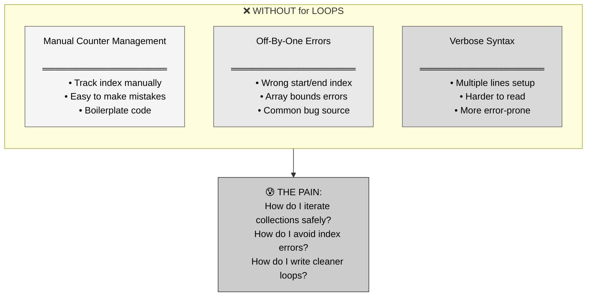
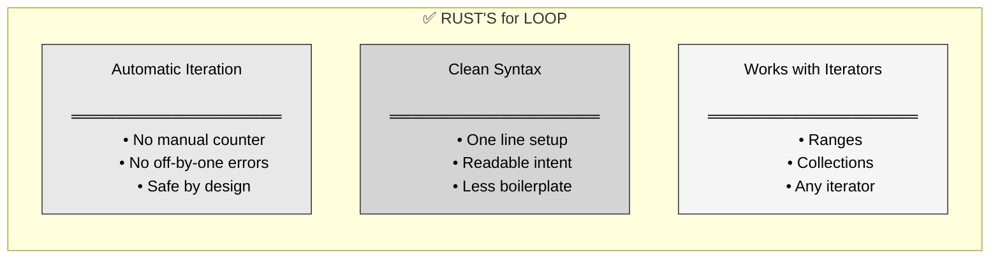
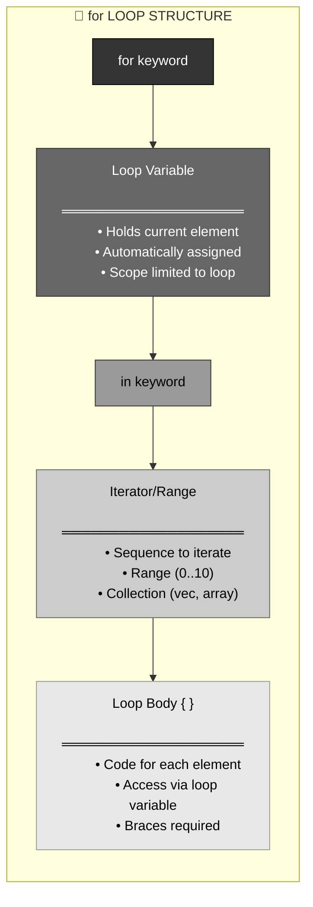
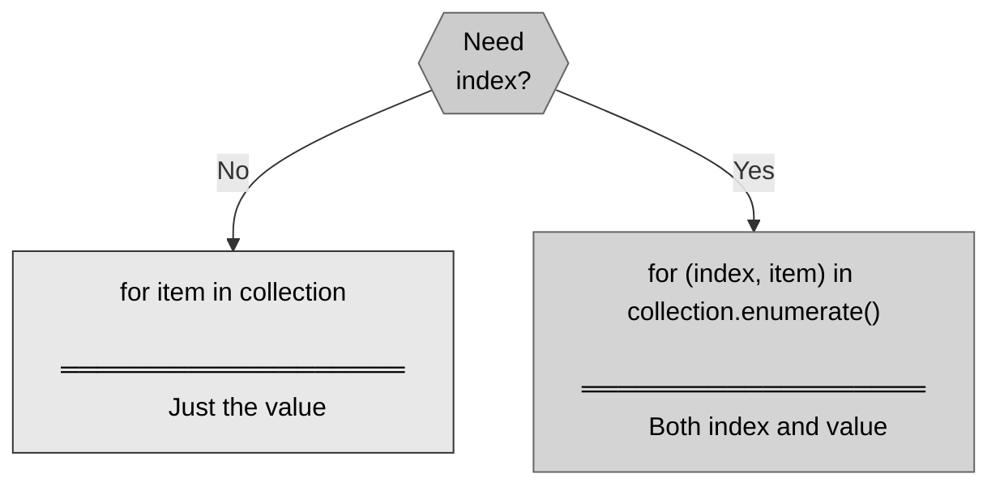
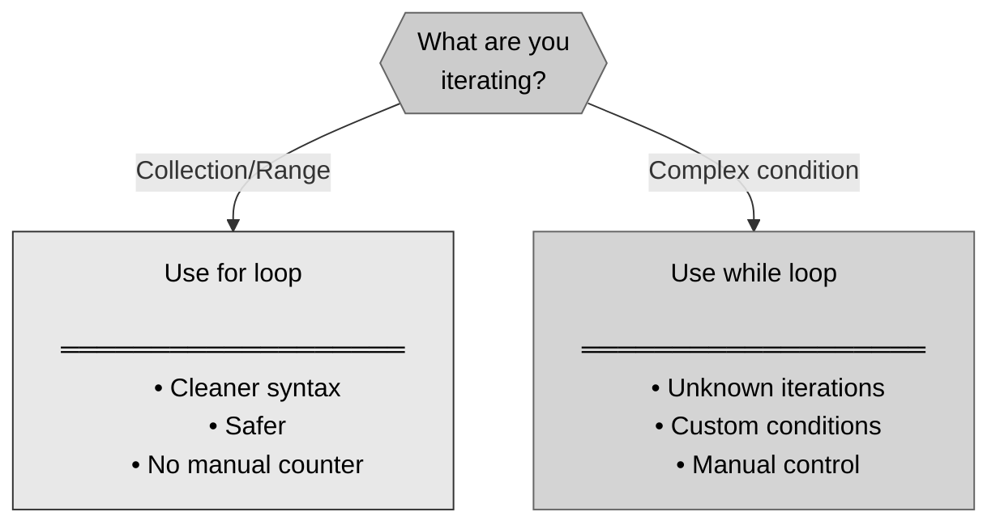

# 🦀 Rust for Loops: Iterating Over Collections

## The Answer (Minto Pyramid: Conclusion First)

**A `for` loop iterates over a sequence of values (an iterator), executing a block of code for each element.** It's cleaner and safer than `while` loops for iterating over collections or ranges, automatically handling the counter and eliminating off-by-one errors. for loops are Rust's idiomatic way to repeat code over known sequences.

---

## 🦸 The Avengers Assembly Metaphor (MCU)

**Think of Rust's for loop like Nick Fury assembling the Avengers:**
- **List of heroes** → Collection/range to iterate over
- **Nick Fury visits each hero** → Loop iterates through each element
- **One hero at a time** → Current element in loop body
- **Automatic progression** → No manual counter needed
- **Done when all recruited** → Loop ends when collection exhausted

**"There was an idea... to bring together a group of remarkable people." — Iterating through each Avenger!**

---

## Part 1: Why for Loops? (The Problem)



**The Challenge:**

```rust
// With while loop (verbose):
let numbers = vec![1, 2, 3, 4, 5];
let mut i = 0;

while i < numbers.len() {
    println!("{}", numbers[i]);
    i += 1;  // Easy to forget!
}

// Risk of off-by-one errors:
while i <= numbers.len() {  // BUG! Will panic
    println!("{}", numbers[i]);
    i += 1;
}
```

---

## Part 2: Enter for Loops - The Solution



**The Elegant Approach:**

```rust
// ✅ With for loop (clean!):
let numbers = vec![1, 2, 3, 4, 5];

for number in numbers {
    println!("{}", number);
}

// Output:
// 1
// 2
// 3
// 4
// 5

// No counter needed!
// No off-by-one errors!
// Clear and concise!
```

---

## Part 3: for Loop Anatomy



```rust
// ═══════════════════════════════════════
// ANATOMY OF for LOOP
// ═══════════════════════════════════════

for i in 0..5 {
//  ^    ^^^^
//  |    Iterator (range from 0 to 4)
//  Loop variable (holds current value)
    
    println!("{}", i);
//                 ^
//                 Use loop variable in body
}

// ═══════════════════════════════════════
// EXECUTION FLOW
// ═══════════════════════════════════════

// 1. Get next value from iterator
// 2. Assign to loop variable
// 3. Execute body
// 4. Repeat until iterator exhausted
```

---

## Part 4: Ranges - The Basics

```rust
// ═══════════════════════════════════════
// EXCLUSIVE RANGE: 0..5 (does NOT include 5)
// ═══════════════════════════════════════

for i in 0..5 {
    println!("{}", i);
}

// Output:
// 0
// 1
// 2
// 3
// 4

// ═══════════════════════════════════════
// INCLUSIVE RANGE: 0..=5 (INCLUDES 5)
// ═══════════════════════════════════════

for i in 0..=5 {
    println!("{}", i);
}

// Output:
// 0
// 1
// 2
// 3
// 4
// 5  ← Included!

// ═══════════════════════════════════════
// RANGES WITH VARIABLES
// ═══════════════════════════════════════

let start = 1;
let end = 10;

for i in start..end {
    println!("{}", i);
}

// ═══════════════════════════════════════
// REVERSE ITERATION with .rev()
// ═══════════════════════════════════════

for i in (0..5).rev() {
    println!("{}", i);
}

// Output:
// 4
// 3
// 2
// 1
// 0
```

---

## Part 5: Iterating Over Collections

```rust
// ═══════════════════════════════════════
// VECTOR: Iterate by value (consumes vector)
// ═══════════════════════════════════════

let numbers = vec![10, 20, 30, 40, 50];

for num in numbers {
    println!("{}", num);
}

// numbers is moved! Can't use it after loop

// ═══════════════════════════════════════
// VECTOR: Iterate by reference (borrow)
// ═══════════════════════════════════════

let numbers = vec![10, 20, 30, 40, 50];

for num in &numbers {
    println!("{}", num);
}

// Can still use numbers after loop!
println!("Still have: {:?}", numbers);

// ═══════════════════════════════════════
// ARRAY: Iterate over array
// ═══════════════════════════════════════

let arr = [1, 2, 3, 4, 5];

for item in arr {
    println!("{}", item);
}

// ═══════════════════════════════════════
// STRING: Iterate over characters
// ═══════════════════════════════════════

let text = "Hello";

for ch in text.chars() {
    println!("{}", ch);
}

// Output:
// H
// e
// l
// l
// o
```

---

## Part 6: Enumerate - Getting Index



```rust
// ═══════════════════════════════════════
// WITHOUT ENUMERATE: Just values
// ═══════════════════════════════════════

let fruits = vec!["apple", "banana", "cherry"];

for fruit in &fruits {
    println!("{}", fruit);
}

// Output:
// apple
// banana
// cherry

// ═══════════════════════════════════════
// WITH ENUMERATE: Index + value
// ═══════════════════════════════════════

let fruits = vec!["apple", "banana", "cherry"];

for (i, fruit) in fruits.iter().enumerate() {
    println!("{}: {}", i, fruit);
}

// Output:
// 0: apple
// 1: banana
// 2: cherry

// ═══════════════════════════════════════
// PRACTICAL EXAMPLE: Find position
// ═══════════════════════════════════════

let numbers = vec![10, 25, 30, 45, 50];

for (index, &num) in numbers.iter().enumerate() {
    if num > 40 {
        println!("First number > 40 at index {}: {}", index, num);
        break;
    }
}
```

---

## Part 7: Common for Loop Patterns

```rust
// ═══════════════════════════════════════
// PATTERN 1: Sum elements
// ═══════════════════════════════════════

let numbers = vec![1, 2, 3, 4, 5];
let mut sum = 0;

for num in &numbers {
    sum += num;
}

println!("Sum: {}", sum);  // 15

// ═══════════════════════════════════════
// PATTERN 2: Find maximum
// ═══════════════════════════════════════

let numbers = vec![10, 45, 23, 67, 31];
let mut max = numbers[0];

for &num in &numbers[1..] {
    if num > max {
        max = num;
    }
}

println!("Max: {}", max);  // 67

// ═══════════════════════════════════════
// PATTERN 3: Transform elements
// ═══════════════════════════════════════

let numbers = vec![1, 2, 3, 4, 5];
let mut doubled = Vec::new();

for num in &numbers {
    doubled.push(num * 2);
}

println!("{:?}", doubled);  // [2, 4, 6, 8, 10]

// ═══════════════════════════════════════
// PATTERN 4: Filter elements
// ═══════════════════════════════════════

let numbers = vec![1, 2, 3, 4, 5, 6, 7, 8, 9, 10];
let mut evens = Vec::new();

for &num in &numbers {
    if num % 2 == 0 {
        evens.push(num);
    }
}

println!("{:?}", evens);  // [2, 4, 6, 8, 10]

// ═══════════════════════════════════════
// PATTERN 5: Countdown
// ═══════════════════════════════════════

for i in (1..=5).rev() {
    println!("{}...", i);
}
println!("Blastoff!");

// Output:
// 5...
// 4...
// 3...
// 2...
// 1...
// Blastoff!
```

---

## Part 8: break and continue

```rust
// ═══════════════════════════════════════
// break: Exit loop early
// ═══════════════════════════════════════

for i in 0..10 {
    if i == 5 {
        break;  // Stop loop
    }
    println!("{}", i);
}

// Output: 0, 1, 2, 3, 4

// ═══════════════════════════════════════
// continue: Skip current iteration
// ═══════════════════════════════════════

for i in 0..10 {
    if i % 2 == 0 {
        continue;  // Skip even numbers
    }
    println!("{}", i);
}

// Output: 1, 3, 5, 7, 9

// ═══════════════════════════════════════
// PRACTICAL: Search and exit
// ═══════════════════════════════════════

let names = vec!["Alice", "Bob", "Charlie", "David"];
let mut found = false;

for name in &names {
    if name == &"Charlie" {
        println!("Found Charlie!");
        found = true;
        break;
    }
}

if !found {
    println!("Charlie not found");
}
```

---

## Part 9: Nested for Loops

```rust
// ═══════════════════════════════════════
// NESTED LOOPS: Multiplication table
// ═══════════════════════════════════════

for i in 1..=5 {
    for j in 1..=5 {
        print!("{:3} ", i * j);
    }
    println!();
}

// Output:
//   1   2   3   4   5
//   2   4   6   8  10
//   3   6   9  12  15
//   4   8  12  16  20
//   5  10  15  20  25

// ═══════════════════════════════════════
// NESTED LOOPS: All pairs
// ═══════════════════════════════════════

let colors = vec!["red", "green", "blue"];
let sizes = vec!["S", "M", "L"];

for color in &colors {
    for size in &sizes {
        println!("{} shirt, size {}", color, size);
    }
}

// Output:
// red shirt, size S
// red shirt, size M
// red shirt, size L
// green shirt, size S
// ... etc
```

---

## Part 10: for vs while



```rust
// ═══════════════════════════════════════
// USE for WHEN: Known sequence
// ═══════════════════════════════════════

// ✅ GOOD: Iterating 0-9
for i in 0..10 {
    println!("{}", i);
}

// ❌ VERBOSE: Same with while
let mut i = 0;
while i < 10 {
    println!("{}", i);
    i += 1;
}

// ═══════════════════════════════════════
// USE while WHEN: Complex condition
// ═══════════════════════════════════════

// ✅ GOOD: Custom termination condition
let mut value = 100;
while value > 1 {
    value /= 2;  // Halve each time
}

// ═══════════════════════════════════════
// GUIDELINE
// ═══════════════════════════════════════

// for loop → Iterate known sequence
// while loop → Loop until condition changes
```

---

## Part 11: Iterator Methods vs for Loops

```rust
// ═══════════════════════════════════════
// EXPLICIT for LOOP
// ═══════════════════════════════════════

let numbers = vec![1, 2, 3, 4, 5];
let mut doubled = Vec::new();

for num in &numbers {
    doubled.push(num * 2);
}

// ═══════════════════════════════════════
// ITERATOR METHOD (more idiomatic)
// ═══════════════════════════════════════

let numbers = vec![1, 2, 3, 4, 5];
let doubled: Vec<i32> = numbers.iter()
    .map(|x| x * 2)
    .collect();

// Both produce: [2, 4, 6, 8, 10]

// ═══════════════════════════════════════
// WHEN TO USE EACH
// ═══════════════════════════════════════

// Use for loop when:
// - Logic is complex
// - Multiple operations per element
// - Need explicit control flow

// Use iterator methods when:
// - Simple transformations
// - Filtering/mapping
// - More functional style
```

---

## Part 12: Real-World Use Cases

```rust
// ═══════════════════════════════════════
// USE CASE 1: Process user input
// ═══════════════════════════════════════

let inputs = vec!["10", "20", "30", "abc", "40"];

for input in &inputs {
    match input.parse::<i32>() {
        Ok(num) => println!("Parsed: {}", num),
        Err(_) => println!("Invalid: {}", input),
    }
}

// ═══════════════════════════════════════
// USE CASE 2: Generate HTML
// ═══════════════════════════════════════

let items = vec!["Apple", "Banana", "Cherry"];

println!("<ul>");
for item in &items {
    println!("  <li>{}</li>", item);
}
println!("</ul>");

// ═══════════════════════════════════════
// USE CASE 3: Batch processing
// ═══════════════════════════════════════

let files = vec!["data1.txt", "data2.txt", "data3.txt"];

for filename in &files {
    println!("Processing {}...", filename);
    // process_file(filename);
    println!("Done with {}", filename);
}

// ═══════════════════════════════════════
// USE CASE 4: Validate all items
// ═══════════════════════════════════════

let ages = vec![18, 25, 30, 17, 22];
let mut all_valid = true;

for &age in &ages {
    if age < 18 {
        println!("Invalid age: {}", age);
        all_valid = false;
    }
}

if all_valid {
    println!("All ages valid!");
}

// ═══════════════════════════════════════
// USE CASE 5: Build string from parts
// ═══════════════════════════════════════

let words = vec!["Hello", "world", "from", "Rust"];
let mut sentence = String::new();

for (i, word) in words.iter().enumerate() {
    sentence.push_str(word);
    if i < words.len() - 1 {
        sentence.push(' ');
    }
}

println!("{}", sentence);  // "Hello world from Rust"
```

---

## Part 13: Common Mistakes

```rust
// ═══════════════════════════════════════
// MISTAKE 1: Trying to modify while iterating
// ═══════════════════════════════════════

let mut numbers = vec![1, 2, 3, 4, 5];

// ❌ WRONG: Can't modify while iterating
// for num in &numbers {
//     numbers.push(10);  // ERROR!
// }

// ✅ CORRECT: Collect indices first
let indices: Vec<_> = (0..numbers.len()).collect();
for i in indices {
    // Now can modify
}

// ═══════════════════════════════════════
// MISTAKE 2: Moving when you meant to borrow
// ═══════════════════════════════════════

let strings = vec![String::from("a"), String::from("b")];

// ❌ WRONG: Moves strings
// for s in strings {
//     println!("{}", s);
// }
// println!("{:?}", strings);  // ERROR! Moved

// ✅ CORRECT: Borrow with &
for s in &strings {
    println!("{}", s);
}
println!("{:?}", strings);  // OK!

// ═══════════════════════════════════════
// MISTAKE 3: Wrong range bounds
// ═══════════════════════════════════════

// Want 1 to 10 inclusive:

// ❌ WRONG: Excludes 10
for i in 1..10 {
    println!("{}", i);  // 1-9
}

// ✅ CORRECT: Includes 10
for i in 1..=10 {
    println!("{}", i);  // 1-10
}
```

---

## Part 14: for Loops vs Other Languages

| Feature | 🦀 Rust | ⚡ C/C++ | ☕ Java | 🐍 Python | 🟨 JavaScript |
|:--------|:--------|:---------|:--------|:----------|:--------------|
| **Range syntax** | `0..10` | Range-for (C++11) | `int i=0; i<10` | `range(0, 10)` | `let i=0; i<10` |
| **Iterator-based** | ✅ Yes | ✅ C++11+ | ✅ Enhanced for | ✅ Yes | ✅ for...of |
| **Type safety** | ✅ Strong | ⚠️ Weak | ✅ Strong | ⚠️ Dynamic | ⚠️ Weak |
| **Ownership** | ✅ Move/borrow | ❌ No concept | ❌ No concept | ❌ No concept | ❌ No concept |

```rust
// ═══════════════════════════════════════
// 🦀 RUST
// ═══════════════════════════════════════
for i in 0..5 {
    println!("{}", i);
}

for item in vec![1, 2, 3] {
    println!("{}", item);
}
```

```cpp
// ═══════════════════════════════════════
// ⚡ C++ (C++11+)
// ═══════════════════════════════════════
for (int i = 0; i < 5; i++) {
    std::cout << i << std::endl;
}

std::vector<int> vec = {1, 2, 3};
for (int item : vec) {
    std::cout << item << std::endl;
}
```

```java
// ═══════════════════════════════════════
// ☕ JAVA
// ═══════════════════════════════════════
for (int i = 0; i < 5; i++) {
    System.out.println(i);
}

int[] arr = {1, 2, 3};
for (int item : arr) {
    System.out.println(item);
}
```

```python
# ═══════════════════════════════════════
# 🐍 PYTHON
# ═══════════════════════════════════════
for i in range(5):
    print(i)

for item in [1, 2, 3]:
    print(item)
```

```javascript
// ═══════════════════════════════════════
// 🟨 JAVASCRIPT
// ═══════════════════════════════════════
for (let i = 0; i < 5; i++) {
    console.log(i);
}

for (let item of [1, 2, 3]) {
    console.log(item);
}
```

---

## 🧠 The Avengers Assembly Principle

> **"There was an idea... to bring together a group of remarkable people." — Nick Fury assembling the Avengers, one hero at a time!**

| Scenario | Assembling Avengers | for Loop |
|:---------|:-------------------|:---------|
| **The list** | Roster of heroes | Collection/range |
| **Visit each** | Recruit one by one | Iterate elements |
| **Automatic** | Fury handles order | No manual counter |
| **Current hero** | Who's being recruited | Loop variable |
| **All assembled** | Mission complete | Iterator exhausted |

**Key Takeaways:**

1. **for loops = iterator-based repetition** → Loop over sequences automatically
2. **No manual counter needed** → Cleaner, safer code
3. **Ranges with `..` and `..=`** → Exclusive vs inclusive endpoints
4. **Works with collections** → Vectors, arrays, strings, etc.
5. **Borrow with &** → Iterate without moving (ownership)
6. **enumerate() for index** → Get both position and value
7. **break/continue work** → Early exit or skip iterations
8. **Safer than while** → No off-by-one errors for collections

for loops are like **Avengers Assembly**—automatically iterate through each hero (element) in the roster (collection), no manual tracking needed! 🦸‍♂️🦸‍♀️

