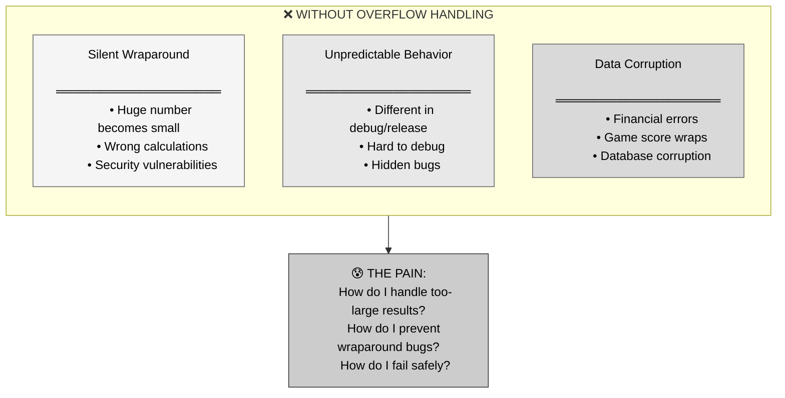
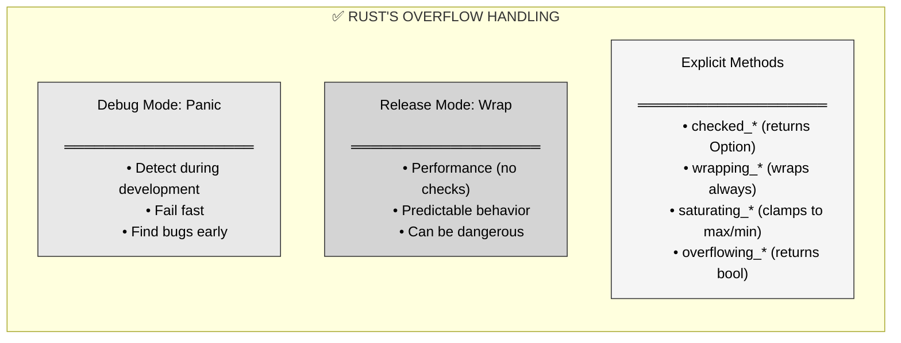
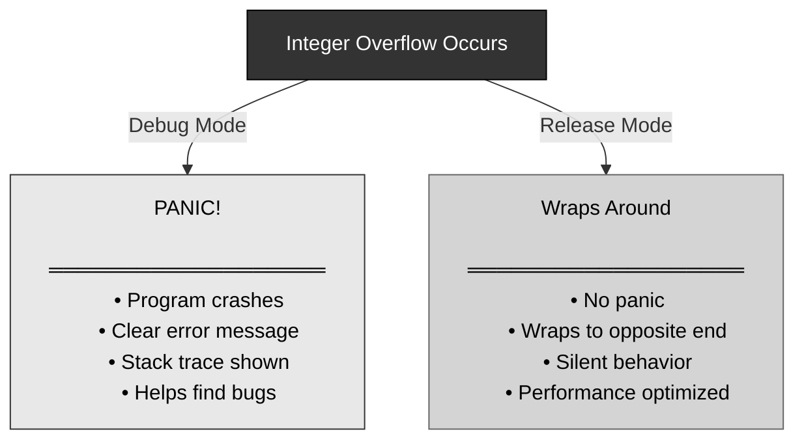
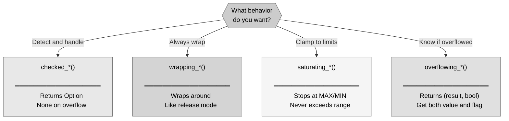

# 🦀 Rust Integer Overflow: When Numbers Get Too Big

## The Answer (Minto Pyramid: Conclusion First)

**Integer overflow occurs when an arithmetic operation produces a result larger than the maximum value (or smaller than the minimum value) that an integer type can hold.** Rust handles overflow differently in debug vs release builds: debug mode panics, release mode wraps around. You can explicitly choose overflow behavior using checked, wrapping, saturating, or overflowing arithmetic methods.

---

## 🦸 The Hulk Transformation Metaphor (MCU)

**Think of Rust's integer overflow like Bruce Banner transforming into Hulk:**
- **Banner (normal value)** → Number within valid range
- **Gets angry (operation exceeds max)** → Overflow occurs
- **Transforms to Hulk (wraps around)** → Value becomes drastically different
- **Can't contain the power** → Integer type can't hold the result
- **Need safety measures** → Checked/saturating arithmetic prevents disasters

**"That's my secret, Cap. I'm always checking for overflow." — Smart Hulk using checked arithmetic!**

---

## Part 1: Why Overflow Matters? (The Problem)



**The Danger:**

```rust
// u8 can hold 0-255
let x: u8 = 255;
let y: u8 = 1;

// What happens with x + y?
// Result should be 256, but u8 max is 255!

// In C/C++: Undefined behavior or silent wraparound
// In Rust debug: PANIC!
// In Rust release: Wraps to 0

// This is dangerous in real applications:
// - Banking: account balance wraps around
// - Games: score becomes negative
// - Security: buffer size calculations fail
```

---

## Part 2: Enter Rust's Overflow Handling - The Solution



---

## Part 3: Understanding Overflow

```rust
// ═══════════════════════════════════════
// INTEGER RANGES
// ═══════════════════════════════════════

// u8: 0 to 255
let max_u8 = u8::MAX;  // 255
let min_u8 = u8::MIN;  // 0

// i8: -128 to 127
let max_i8 = i8::MAX;  // 127
let min_i8 = i8::MIN;  // -128

// ═══════════════════════════════════════
// OVERFLOW: Exceeds maximum
// ═══════════════════════════════════════

let x: u8 = 255;  // Maximum u8 value

// x + 1 = 256, but u8 can't hold 256!
// In release mode, wraps to 0

// ═══════════════════════════════════════
// UNDERFLOW: Goes below minimum
// ═══════════════════════════════════════

let x: u8 = 0;  // Minimum u8 value

// x - 1 = -1, but u8 can't hold negative!
// In release mode, wraps to 255

// ═══════════════════════════════════════
// WHY IT HAPPENS
// ═══════════════════════════════════════

// u8 uses 8 bits:
// 11111111 (binary) = 255 (decimal) = MAX
// 11111111 + 1 = 100000000 (9 bits)
// But u8 only has 8 bits, so highest bit is lost:
// 00000000 = 0
```

---

## Part 4: Debug vs Release Mode



```rust
// ═══════════════════════════════════════
// DEBUG MODE (cargo build / cargo run)
// ═══════════════════════════════════════

fn main() {
    let x: u8 = 255;
    let y = x + 1;  // PANIC!
    println!("{}", y);
}

// Output in debug mode:
// thread 'main' panicked at 'attempt to add with overflow'

// ═══════════════════════════════════════
// RELEASE MODE (cargo build --release)
// ═══════════════════════════════════════

fn main() {
    let x: u8 = 255;
    let y = x + 1;  // Wraps to 0
    println!("{}", y);
}

// Output in release mode:
// 0

// ═══════════════════════════════════════
// CONFIGURE IN Cargo.toml
// ═══════════════════════════════════════

// [profile.release]
// overflow-checks = true  // Panic in release mode too

// [profile.dev]
// overflow-checks = false  // Wrap in debug mode too
```

---

## Part 5: Checked Arithmetic

```rust
// ═══════════════════════════════════════
// checked_add: Returns Option<T>
// ═══════════════════════════════════════

let x: u8 = 255;

match x.checked_add(1) {
    Some(result) => println!("Result: {}", result),
    None => println!("Overflow occurred!"),
}

// Output: Overflow occurred!

// ═══════════════════════════════════════
// checked_sub: Subtraction
// ═══════════════════════════════════════

let x: u8 = 0;

match x.checked_sub(1) {
    Some(result) => println!("Result: {}", result),
    None => println!("Underflow occurred!"),
}

// Output: Underflow occurred!

// ═══════════════════════════════════════
// checked_mul: Multiplication
// ═══════════════════════════════════════

let x: u8 = 200;

match x.checked_mul(2) {
    Some(result) => println!("Result: {}", result),
    None => println!("Overflow!"),
}

// Output: Overflow!

// ═══════════════════════════════════════
// checked_div: Division
// ═══════════════════════════════════════

let x: u8 = 10;

match x.checked_div(0) {
    Some(result) => println!("Result: {}", result),
    None => println!("Division by zero!"),
}

// Output: Division by zero!

// ═══════════════════════════════════════
// PRACTICAL: Safe accumulation
// ═══════════════════════════════════════

fn safe_sum(numbers: &[u32]) -> Option<u32> {
    let mut total: u32 = 0;
    
    for &num in numbers {
        total = total.checked_add(num)?;
        //                            ^
        //  ? operator: return None if overflow
    }
    
    Some(total)
}

let nums = vec![1000000000, 2000000000, 2000000000];
match safe_sum(&nums) {
    Some(sum) => println!("Sum: {}", sum),
    None => println!("Sum would overflow!"),
}
```

---

## Part 6: Wrapping Arithmetic

```rust
// ═══════════════════════════════════════
// wrapping_add: Always wraps
// ═══════════════════════════════════════

let x: u8 = 255;
let y = x.wrapping_add(1);

println!("{}", y);  // 0

// Works in both debug and release mode
// No panic, always wraps

// ═══════════════════════════════════════
// wrapping_sub: Wraps on underflow
// ═══════════════════════════════════════

let x: u8 = 0;
let y = x.wrapping_sub(1);

println!("{}", y);  // 255

// ═══════════════════════════════════════
// wrapping_mul
// ═══════════════════════════════════════

let x: u8 = 200;
let y = x.wrapping_mul(2);

println!("{}", y);  // 144 (400 wraps around)

// ═══════════════════════════════════════
// PRACTICAL: Ring buffer index
// ═══════════════════════════════════════

struct RingBuffer {
    index: u8,
    capacity: u8,
}

impl RingBuffer {
    fn next_index(&mut self) {
        // Want index to wrap: 0, 1, 2, ..., 255, 0, 1, ...
        self.index = self.index.wrapping_add(1);
    }
}
```

---

## Part 7: Saturating Arithmetic

```rust
// ═══════════════════════════════════════
// saturating_add: Clamps at MAX
// ═══════════════════════════════════════

let x: u8 = 255;
let y = x.saturating_add(10);

println!("{}", y);  // 255 (stays at max)

// ═══════════════════════════════════════
// saturating_sub: Clamps at MIN
// ═══════════════════════════════════════

let x: u8 = 5;
let y = x.saturating_sub(10);

println!("{}", y);  // 0 (stays at min)

// ═══════════════════════════════════════
// saturating_mul
// ═══════════════════════════════════════

let x: u8 = 200;
let y = x.saturating_mul(2);

println!("{}", y);  // 255 (clamped to max)

// ═══════════════════════════════════════
// PRACTICAL: Health points in game
// ═══════════════════════════════════════

struct Player {
    health: u8,  // 0-255
}

impl Player {
    fn take_damage(&mut self, damage: u8) {
        // Health goes to 0, not negative
        self.health = self.health.saturating_sub(damage);
    }
    
    fn heal(&mut self, amount: u8) {
        // Health goes to 255, not over
        self.health = self.health.saturating_add(amount);
    }
}

let mut player = Player { health: 10 };
player.take_damage(50);
println!("Health: {}", player.health);  // 0

player.heal(300);
println!("Health: {}", player.health);  // 255 (clamped)
```

---

## Part 8: Overflowing Arithmetic

```rust
// ═══════════════════════════════════════
// overflowing_add: Returns (result, bool)
// ═══════════════════════════════════════

let x: u8 = 255;
let (result, overflowed) = x.overflowing_add(1);

println!("Result: {}", result);  // 0
println!("Overflowed: {}", overflowed);  // true

// ═══════════════════════════════════════
// overflowing_sub
// ═══════════════════════════════════════

let x: u8 = 0;
let (result, overflowed) = x.overflowing_sub(1);

println!("Result: {}", result);  // 255
println!("Overflowed: {}", overflowed);  // true

// ═══════════════════════════════════════
// PRACTICAL: Detect overflow
// ═══════════════════════════════════════

fn multiply_with_check(a: u32, b: u32) -> Result<u32, String> {
    let (result, overflowed) = a.overflowing_mul(b);
    
    if overflowed {
        Err(format!("Overflow: {} * {} too large", a, b))
    } else {
        Ok(result)
    }
}

match multiply_with_check(1000000, 5000) {
    Ok(result) => println!("Result: {}", result),
    Err(e) => println!("Error: {}", e),
}
```

---

## Part 9: Comparison of Methods



```rust
// ═══════════════════════════════════════
// COMPARISON: All methods with 255 + 10
// ═══════════════════════════════════════

let x: u8 = 255;

// Standard (debug panics, release wraps):
// let y = x + 10;  // Panic in debug, 9 in release

// checked: Returns Option
let y = x.checked_add(10);  // None

// wrapping: Always wraps
let y = x.wrapping_add(10);  // 9

// saturating: Clamps to max
let y = x.saturating_add(10);  // 255

// overflowing: Returns (value, bool)
let (y, overflow) = x.overflowing_add(10);  // (9, true)
```

---

## Part 10: Real-World Examples

```rust
// ═══════════════════════════════════════
// EXAMPLE 1: Factorial with overflow check
// ═══════════════════════════════════════

fn factorial_safe(n: u32) -> Option<u32> {
    let mut result: u32 = 1;
    
    for i in 2..=n {
        result = result.checked_mul(i)?;
    }
    
    Some(result)
}

// factorial(12) = 479001600 (fits in u32)
// factorial(13) = 6227020800 (OVERFLOW for u32!)

println!("{:?}", factorial_safe(12));  // Some(479001600)
println!("{:?}", factorial_safe(13));  // None

// ═══════════════════════════════════════
// EXAMPLE 2: Safe array indexing
// ═══════════════════════════════════════

fn safe_index(arr: &[i32], index: usize, offset: isize) -> Option<i32> {
    // Convert index to isize for signed arithmetic
    let index_signed = index as isize;
    
    // Add offset with overflow check
    let new_index = index_signed.checked_add(offset)?;
    
    // Check if within bounds
    if new_index >= 0 && (new_index as usize) < arr.len() {
        Some(arr[new_index as usize])
    } else {
        None
    }
}

let arr = vec![10, 20, 30, 40, 50];
println!("{:?}", safe_index(&arr, 2, 1));   // Some(40)
println!("{:?}", safe_index(&arr, 2, -5));  // None

// ═══════════════════════════════════════
// EXAMPLE 3: Time calculation
// ═══════════════════════════════════════

struct Duration {
    seconds: u32,
}

impl Duration {
    fn add(&self, other: &Duration) -> Option<Duration> {
        Some(Duration {
            seconds: self.seconds.checked_add(other.seconds)?,
        })
    }
    
    fn from_hours(hours: u32) -> Option<Duration> {
        let seconds = hours.checked_mul(3600)?;
        Some(Duration { seconds })
    }
}

// ═══════════════════════════════════════
// EXAMPLE 4: Money calculations
// ═══════════════════════════════════════

#[derive(Debug)]
struct Money {
    cents: u64,  // Store in cents to avoid floats
}

impl Money {
    fn add(&self, other: &Money) -> Option<Money> {
        Some(Money {
            cents: self.cents.checked_add(other.cents)?,
        })
    }
    
    fn multiply(&self, factor: u64) -> Option<Money> {
        Some(Money {
            cents: self.cents.checked_mul(factor)?,
        })
    }
}

let price = Money { cents: 100_000_000 };  // $1,000,000
let total = price.multiply(1000);  // Try to multiply
println!("{:?}", total);  // None (overflow)
```

---

## Part 11: Common Patterns

```rust
// ═══════════════════════════════════════
// PATTERN 1: Chain with ? operator
// ═══════════════════════════════════════

fn calculate(a: u32, b: u32, c: u32) -> Option<u32> {
    let step1 = a.checked_add(b)?;
    let step2 = step1.checked_mul(c)?;
    let step3 = step2.checked_sub(100)?;
    Some(step3)
}

// ═══════════════════════════════════════
// PATTERN 2: Convert to larger type
// ═══════════════════════════════════════

fn safe_multiply_u8(a: u8, b: u8) -> u8 {
    let result = (a as u16) * (b as u16);
    
    if result > u8::MAX as u16 {
        u8::MAX  // Saturate
    } else {
        result as u8
    }
}

// ═══════════════════════════════════════
// PATTERN 3: Accumulate with check
// ═══════════════════════════════════════

fn sum_vec(numbers: &[u32]) -> Result<u32, String> {
    numbers.iter().try_fold(0u32, |acc, &n| {
        acc.checked_add(n)
            .ok_or_else(|| format!("Overflow at {}", n))
    })
}

// ═══════════════════════════════════════
// PATTERN 4: Loop with overflow check
// ═══════════════════════════════════════

fn power_safe(base: u32, exp: u32) -> Option<u32> {
    let mut result = 1u32;
    
    for _ in 0..exp {
        result = result.checked_mul(base)?;
    }
    
    Some(result)
}

println!("{:?}", power_safe(2, 10));   // Some(1024)
println!("{:?}", power_safe(2, 32));   // None (overflow)
```

---

## Part 12: Testing for Overflow

```rust
// ═══════════════════════════════════════
// UNIT TESTS for overflow behavior
// ═══════════════════════════════════════

#[cfg(test)]
mod tests {
    #[test]
    fn test_checked_add_success() {
        let x: u8 = 100;
        assert_eq!(x.checked_add(50), Some(150));
    }
    
    #[test]
    fn test_checked_add_overflow() {
        let x: u8 = 255;
        assert_eq!(x.checked_add(1), None);
    }
    
    #[test]
    fn test_saturating_behavior() {
        let x: u8 = 250;
        assert_eq!(x.saturating_add(10), 255);
    }
    
    #[test]
    fn test_wrapping_behavior() {
        let x: u8 = 255;
        assert_eq!(x.wrapping_add(1), 0);
    }
    
    #[test]
    #[should_panic(expected = "attempt to add with overflow")]
    #[cfg(debug_assertions)]
    fn test_overflow_panics_debug() {
        let x: u8 = 255;
        let _ = x + 1;  // Should panic in debug
    }
}
```

---

## Part 13: Performance Considerations

```rust
// ═══════════════════════════════════════
// PERFORMANCE COMPARISON
// ═══════════════════════════════════════

// Standard arithmetic (release mode):
// - Fastest (no checks)
// - Wraps silently
let x: u32 = 100;
let y = x + 50;  // Fast, unchecked

// checked_*:
// - Adds branch for overflow check
// - Returns Option (slight overhead)
// - Safest for critical operations
let y = x.checked_add(50);

// wrapping_*:
// - Same speed as standard
// - Explicit wrapping intent
// - Clear semantics
let y = x.wrapping_add(50);

// saturating_*:
// - Adds comparison and clamp
// - Slightly slower
// - Good for bounded values
let y = x.saturating_add(50);

// ═══════════════════════════════════════
// GUIDELINE
// ═══════════════════════════════════════

// Use checked_* when:
// - Correctness critical (money, safety)
// - Overflow is exceptional
// - Can handle None case

// Use wrapping_* when:
// - Wraparound is desired behavior
// - Performance critical
// - Cryptography, hashing

// Use saturating_* when:
// - Values should clamp at limits
// - UI controls (volume, brightness)
// - Game stats (health, score)

// Use standard +, -, * when:
// - Debug mode catches bugs
// - Release mode can wrap safely
// - Performance is critical
```

---

## Part 14: Overflow vs Other Languages

| Feature | 🦀 Rust | ⚡ C/C++ | ☕ Java | 🐍 Python | 🟨 JavaScript |
|:--------|:--------|:---------|:--------|:----------|:--------------|
| **Signed overflow** | Debug panic/Release wrap | Undefined behavior | Wraps silently | BigInt (auto) | Wraps silently |
| **Unsigned overflow** | Debug panic/Release wrap | Defined (wraps) | No unsigned | BigInt (auto) | N/A |
| **Detection** | ✅ checked_* methods | ❌ Manual only | ❌ Manual only | ✅ Automatic | ❌ None |
| **Safety** | ✅ Caught in debug | ❌ Unsafe | ⚠️ Silent bugs | ✅ Safe | ⚠️ Silent bugs |
| **Performance** | ✅ Release optimized | ✅ Fast | ✅ Fast | ⚠️ Slower (BigInt) | ✅ Fast |

```rust
// ═══════════════════════════════════════
// 🦀 RUST
// ═══════════════════════════════════════
let x: u8 = 255;
// Debug: panic, Release: wraps to 0
// let y = x + 1;

// Explicit control:
let y = x.checked_add(1);  // None
```

```c
// ═══════════════════════════════════════
// ⚡ C
// ═══════════════════════════════════════
unsigned char x = 255;
unsigned char y = x + 1;  // Wraps to 0 (defined for unsigned)

signed char z = 127;
signed char w = z + 1;  // UNDEFINED BEHAVIOR!
```

```java
// ═══════════════════════════════════════
// ☕ JAVA
// ═══════════════════════════════════════
byte x = 127;  // byte is signed in Java
byte y = (byte)(x + 1);  // Wraps to -128 (silently!)

// No checked arithmetic built-in
// Must manually check or use Math.addExact() etc.
```

```python
# ═══════════════════════════════════════
# 🐍 PYTHON
# ═══════════════════════════════════════
x = 2**100  # Arbitrarily large integers
y = x + 1   # No overflow, just bigger int!

# Python has no fixed-size integers
```

```javascript
// ═══════════════════════════════════════
// 🟨 JAVASCRIPT
// ═══════════════════════════════════════
let x = Number.MAX_SAFE_INTEGER;  // 2^53 - 1
let y = x + 1;  // Works
let z = x + 2;  // LOSS OF PRECISION!

// Use BigInt for large numbers
let big = 9007199254740991n + 2n;  // OK
```

---

## 🧠 The Hulk Transformation Principle

> **"That's my secret, Cap. I'm always checking for overflow." — Smart Hulk using checked arithmetic!**

| Scenario | Hulk Transformation | Integer Overflow |
|:---------|:-------------------|:-----------------|
| **Normal state** | Bruce Banner | Value within range |
| **Gets too angry** | Exceeds control | Exceeds MAX value |
| **Transformation** | Becomes Hulk | Wraps to MIN value |
| **Unpredictable** | Can't stop it | Silent wraparound |
| **Safety measures** | Meditation, control | checked_*, saturating_* |

**Key Takeaways:**

1. **Overflow = exceeding type limits** → Result doesn't fit in integer type
2. **Debug panics, release wraps** → Different behavior by build mode
3. **checked_* returns Option** → Detect overflow, handle gracefully
4. **wrapping_* always wraps** → Explicit wraparound behavior
5. **saturating_* clamps to limits** → Never exceeds MAX/MIN
6. **overflowing_* returns flag** → Get both result and overflow status
7. **Use ? operator with checked** → Clean error propagation
8. **Prefer explicit methods** → Make overflow behavior clear

Integer overflow is like **Hulk transformation**—when values get too big (angry), they transform unpredictably unless you have safety measures (checked arithmetic) in place! 💚

