# R32: Rust Structs - Building Custom Types

## The Answer (Minto Pyramid: Conclusion First)

**Structs let you bundle related data together into a single, named type with distinct fields.**

Instead of tracking multiple scattered variables, you group them into one cohesive unit. Each field has a name and type, and you can attach behavior through methods. Structs are Rust's primary tool for creating custom types that model real-world entities.

```rust
// The answer in code: Define once, use everywhere
struct Ticket {
    title: String,
    description: String,
    status: String,
}

let ticket = Ticket {
    title: "Fix login bug".to_string(),
    description: "Users can't sign in".to_string(),
    status: "Open".to_string(),
};
```

---

## 🦸 MCU Metaphor: Iron Man's Arc Reactor Suit

**Core Truth**: A struct is like **Iron Man's suit** — it combines different specialized components (arc reactor for power, repulsors for weapons, flight system for mobility) into one unified system that works together.

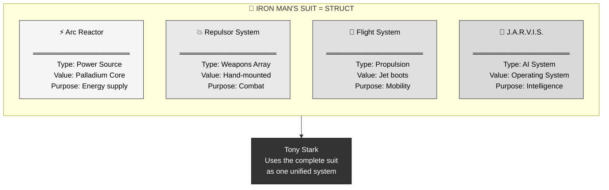

**The Mapping**:
- **Arc Reactor** = Field (e.g., `title: String`)
- **Each Component** = Different type (String, u32, bool)
- **Complete Suit** = Struct instance
- **Tony using suit** = Methods (behavior attached to data)

**Where the metaphor breaks**: Tony's suit can be damaged and repaired dynamically; Rust structs require explicit ownership rules for modifications. But the "many components, one system" idea holds perfectly.

---

## Part 1: The Problem Without Structs

### The Pain: Scattered Data Chaos

Before structs, you'd track related data with separate variables:

```rust
fn main() {
    // Tracking a ticket with separate variables
    let title1 = "Fix login bug".to_string();
    let description1 = "Users can't sign in".to_string();
    let status1 = "Open".to_string();
    
    // Oh no, need another ticket
    let title2 = "Add dark mode".to_string();
    let description2 = "Support dark theme".to_string();
    let status2 = "In Progress".to_string();
    
    // This gets messy FAST
    // Which title goes with which description?
    // How do you pass these around together?
}
```

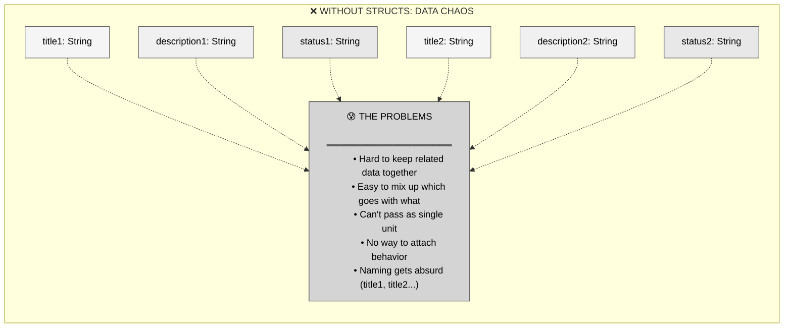

### Real Pain Points

1. **Function signatures explode**: Need 10 parameters instead of 1
2. **No logical grouping**: The relationship between data is implicit
3. **Can't pass around easily**: Functions can't "own" the complete concept
4. **No behavior attachment**: Can't add methods to scattered variables

---

## Part 2: The Solution - Structs

### Definition: Bundling Data with Names

A struct defines a new type by combining other types as **fields**:

```rust
// ═══════════════════════════════════════
// Define the struct (the blueprint)
// ═══════════════════════════════════════
struct Ticket {
    title: String,        // field_name: Type
    description: String,
    status: String,
}

// ═══════════════════════════════════════
// Create an instance (the actual data)
// ═══════════════════════════════════════
let ticket = Ticket {
    title: "Fix login".to_string(),
    description: "Auth broken".to_string(),
    status: "Open".to_string(),
};

// ═══════════════════════════════════════
// Access fields using dot notation
// ═══════════════════════════════════════
println!("Title: {}", ticket.title);
// Output: Title: Fix login
```

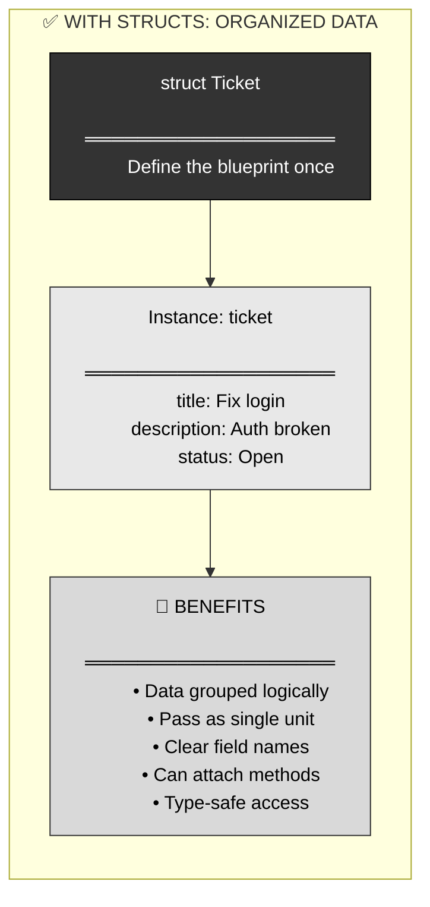

### Syntax Breakdown

```rust
struct StructName {    // Struct name (PascalCase)
    field1: Type1,     // Field name (snake_case): Type
    field2: Type2,     // Comma separator
    field3: Type3,     // Last field can have trailing comma
}
```

**Key Rules**:
- Struct names: `PascalCase` (e.g., `Ticket`, `UserProfile`)
- Field names: `snake_case` (e.g., `user_id`, `created_at`)
- Each field needs a type explicitly stated
- Fields separated by commas

---

## Part 3: Visual Mental Model - Anatomy of Structs

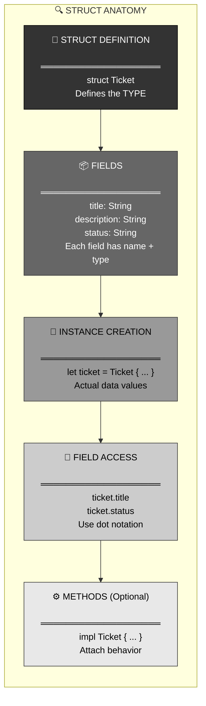

### Complete Example: Definition to Usage

```rust
// ═══════════════════════════════════════
// Step 1: Define the struct (blueprint)
// ═══════════════════════════════════════
struct Configuration {
    version: u32,
    active: bool,
    max_retries: u32,
}

// ═══════════════════════════════════════
// Step 2: Create instances (actual data)
// ═══════════════════════════════════════
let prod_config = Configuration {
    version: 2,
    active: true,
    max_retries: 5,
};

let dev_config = Configuration {
    version: 1,
    active: false,
    max_retries: 10,
};

// ═══════════════════════════════════════
// Step 3: Access fields
// ═══════════════════════════════════════
if prod_config.active {
    println!("Config version: {}", prod_config.version);
    // Output: Config version: 2
}
```

---

## Part 4: Creating Struct Instances - The Process

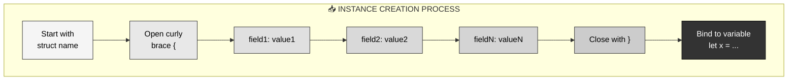

### Field Initialization Rules

```rust
struct Point {
    x: f64,
    y: f64,
}

// ═══════════════════════════════════════
// Must initialize ALL fields
// ═══════════════════════════════════════
let origin = Point {
    x: 0.0,
    y: 0.0,
};  // ✅ All fields provided

// ═══════════════════════════════════════
// Order doesn't matter
// ═══════════════════════════════════════
let p1 = Point { x: 1.0, y: 2.0 };  // ✅
let p2 = Point { y: 2.0, x: 1.0 };  // ✅ Same result

// ═══════════════════════════════════════
// Type must match field definition
// ═══════════════════════════════════════
let p3 = Point {
    x: 3.0,
    y: 4,  // ❌ Error: expected f64, found integer
};
```

### Shorthand Initialization

When variable name matches field name:

```rust
struct User {
    username: String,
    email: String,
    active: bool,
}

let username = "alice".to_string();
let email = "alice@example.com".to_string();
let active = true;

// ═══════════════════════════════════════
// Without shorthand (verbose)
// ═══════════════════════════════════════
let user1 = User {
    username: username,
    email: email,
    active: active,
};

// ═══════════════════════════════════════
// With shorthand (concise)
// ═══════════════════════════════════════
let user2 = User {
    username,  // Automatically uses the variable `username`
    email,     // Automatically uses the variable `email`
    active,    // Automatically uses the variable `active`
};
```

---

## Part 5: Accessing Fields - Dot Notation

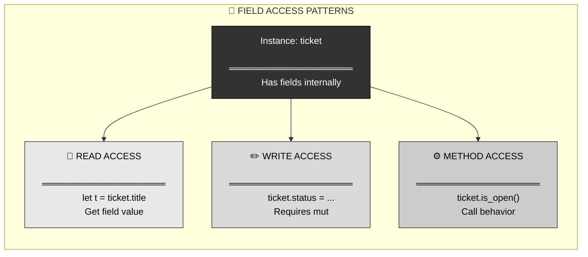

### Reading Fields

```rust
struct Rectangle {
    width: u32,
    height: u32,
}

let rect = Rectangle {
    width: 30,
    height: 50,
};

// ═══════════════════════════════════════
// Access using dot notation
// ═══════════════════════════════════════
let w = rect.width;    // Read width field
let h = rect.height;   // Read height field

println!("Rectangle: {}x{}", w, h);
// Output: Rectangle: 30x50

// ═══════════════════════════════════════
// Use in expressions
// ═══════════════════════════════════════
let area = rect.width * rect.height;
println!("Area: {}", area);
// Output: Area: 1500
```

### Modifying Fields (Requires Mutability)

```rust
struct Counter {
    value: u32,
}

// ═══════════════════════════════════════
// Immutable by default
// ═══════════════════════════════════════
let counter = Counter { value: 0 };
// counter.value = 5;  // ❌ Error: cannot mutate

// ═══════════════════════════════════════
// Make the binding mutable
// ═══════════════════════════════════════
let mut counter = Counter { value: 0 };
counter.value = 5;      // ✅ Works
counter.value += 10;    // ✅ Now it's 15

println!("Counter: {}", counter.value);
// Output: Counter: 15
```

**Important**: The `mut` keyword applies to the entire instance, not individual fields. You can't have some fields mutable and others immutable.

---

## Part 6: Methods - Attaching Behavior

### What Are Methods?

Methods are functions associated with a struct. They're defined in an `impl` (implementation) block.

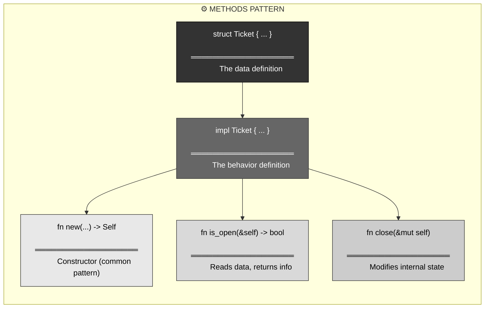

### Method Types: self, &self, &mut self

```rust
struct Ticket {
    title: String,
    status: String,
}

impl Ticket {
    // ═══════════════════════════════════════
    // Static method (no self parameter)
    // Called as: Ticket::new(...)
    // ═══════════════════════════════════════
    fn new(title: String) -> Ticket {
        Ticket {
            title,
            status: "Open".to_string(),
        }
    }
    
    // ═══════════════════════════════════════
    // Read-only method (borrows with &self)
    // Called as: ticket.is_open()
    // ═══════════════════════════════════════
    fn is_open(&self) -> bool {
        self.status == "Open"
    }
    
    // ═══════════════════════════════════════
    // Mutating method (borrows mutably with &mut self)
    // Called as: ticket.close()
    // ═══════════════════════════════════════
    fn close(&mut self) {
        self.status = "Closed".to_string();
    }
    
    // ═══════════════════════════════════════
    // Consuming method (takes ownership with self)
    // Called as: ticket.into_title()
    // After this, ticket can't be used anymore
    // ═══════════════════════════════════════
    fn into_title(self) -> String {
        self.title
    }
}
```

### Using Methods

```rust
// ═══════════════════════════════════════
// Create using static method
// ═══════════════════════════════════════
let mut ticket = Ticket::new("Fix bug".to_string());

// ═══════════════════════════════════════
// Call read-only method
// ═══════════════════════════════════════
if ticket.is_open() {
    println!("Ticket is still open");
}

// ═══════════════════════════════════════
// Call mutating method
// ═══════════════════════════════════════
ticket.close();
println!("Status: {}", ticket.status);
// Output: Status: Closed

// ═══════════════════════════════════════
// Call consuming method (takes ownership)
// ═══════════════════════════════════════
let title = ticket.into_title();
// ticket.is_open();  // ❌ Error: ticket was moved
```

---

## Part 7: Method Call Syntax

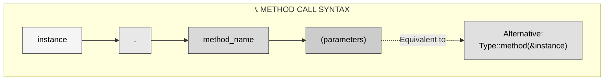

### Method Call Styles

```rust
struct Counter {
    value: u32,
}

impl Counter {
    fn increment(&mut self) {
        self.value += 1;
    }
    
    fn get_value(&self) -> u32 {
        self.value
    }
}

let mut counter = Counter { value: 0 };

// ═══════════════════════════════════════
// Method call syntax (preferred)
// ═══════════════════════════════════════
counter.increment();
let val = counter.get_value();

// ═══════════════════════════════════════
// Function call syntax (verbose, but valid)
// ═══════════════════════════════════════
Counter::increment(&mut counter);
let val = Counter::get_value(&counter);

// Both produce the same result
// The method syntax is clearer and more idiomatic
```

**Prefer method syntax** unless you need to be explicit about which trait's method you're calling (relevant later with trait objects).

---

## Part 8: Common Patterns - Constructor and Builder

### Pattern 1: The `new` Constructor

```rust
struct User {
    username: String,
    email: String,
    active: bool,
}

impl User {
    // ═══════════════════════════════════════
    // Standard constructor pattern
    // ═══════════════════════════════════════
    fn new(username: String, email: String) -> User {
        User {
            username,
            email,
            active: true,  // Default value
        }
    }
}

// Usage
let user = User::new(
    "alice".to_string(),
    "alice@example.com".to_string()
);
```

### Pattern 2: Builder Pattern (for many optional fields)

```rust
struct Config {
    host: String,
    port: u16,
    timeout: u64,
    retries: u32,
}

impl Config {
    fn new() -> Config {
        Config {
            host: "localhost".to_string(),
            port: 8080,
            timeout: 30,
            retries: 3,
        }
    }
    
    // ═══════════════════════════════════════
    // Builder methods return Self
    // ═══════════════════════════════════════
    fn with_host(mut self, host: String) -> Self {
        self.host = host;
        self
    }
    
    fn with_port(mut self, port: u16) -> Self {
        self.port = port;
        self
    }
    
    fn with_timeout(mut self, timeout: u64) -> Self {
        self.timeout = timeout;
        self
    }
}

// ═══════════════════════════════════════
// Chainable method calls
// ═══════════════════════════════════════
let config = Config::new()
    .with_host("api.example.com".to_string())
    .with_port(443)
    .with_timeout(60);
```

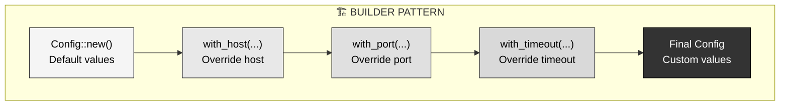

---

## Part 9: Real-World Use Cases

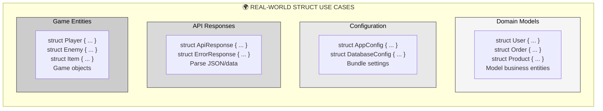

### Example: Web Application Models

```rust
// ═══════════════════════════════════════
// User domain model
// ═══════════════════════════════════════
struct User {
    id: u64,
    username: String,
    email: String,
    created_at: u64,  // Unix timestamp
}

impl User {
    fn new(id: u64, username: String, email: String) -> User {
        User {
            id,
            username,
            email,
            created_at: current_timestamp(),
        }
    }
    
    fn is_valid_email(&self) -> bool {
        self.email.contains('@')
    }
}

// ═══════════════════════════════════════
// HTTP request/response
// ═══════════════════════════════════════
struct ApiRequest {
    method: String,
    path: String,
    body: String,
}

struct ApiResponse {
    status: u16,
    body: String,
    content_type: String,
}

impl ApiResponse {
    fn success(body: String) -> ApiResponse {
        ApiResponse {
            status: 200,
            body,
            content_type: "application/json".to_string(),
        }
    }
    
    fn error(message: String) -> ApiResponse {
        ApiResponse {
            status: 500,
            body: message,
            content_type: "text/plain".to_string(),
        }
    }
}
```

### Example: Game Entity

```rust
struct Player {
    name: String,
    health: u32,
    position_x: f64,
    position_y: f64,
    inventory: Vec<String>,
}

impl Player {
    fn new(name: String) -> Player {
        Player {
            name,
            health: 100,
            position_x: 0.0,
            position_y: 0.0,
            inventory: Vec::new(),
        }
    }
    
    fn take_damage(&mut self, amount: u32) {
        if amount >= self.health {
            self.health = 0;
        } else {
            self.health -= amount;
        }
    }
    
    fn is_alive(&self) -> bool {
        self.health > 0
    }
    
    fn move_to(&mut self, x: f64, y: f64) {
        self.position_x = x;
        self.position_y = y;
    }
    
    fn pick_up_item(&mut self, item: String) {
        self.inventory.push(item);
    }
}

// Usage
let mut player = Player::new("Alice".to_string());
player.pick_up_item("Health Potion".to_string());
player.move_to(10.5, 20.3);
player.take_damage(30);

if player.is_alive() {
    println!("{} has {} health", player.name, player.health);
}
```

---

## Part 10: Struct Update Syntax

When creating a new struct instance based on an existing one:

```rust
struct Point3D {
    x: f64,
    y: f64,
    z: f64,
}

let p1 = Point3D {
    x: 1.0,
    y: 2.0,
    z: 3.0,
};

// ═══════════════════════════════════════
// Without struct update syntax
// ═══════════════════════════════════════
let p2 = Point3D {
    x: p1.x,
    y: p1.y,
    z: 5.0,  // Only changing z
};

// ═══════════════════════════════════════
// With struct update syntax (cleaner)
// ═══════════════════════════════════════
let p3 = Point3D {
    z: 5.0,   // Override z
    ..p1      // Copy remaining fields from p1
};

// p3 now has: x=1.0, y=2.0, z=5.0
```

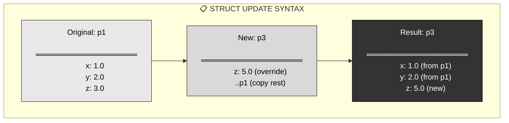

**Important**: The `..` syntax must come last in the initialization. Also, this moves or copies fields depending on their types (more on ownership later).

---

## Part 11: When to Use Structs

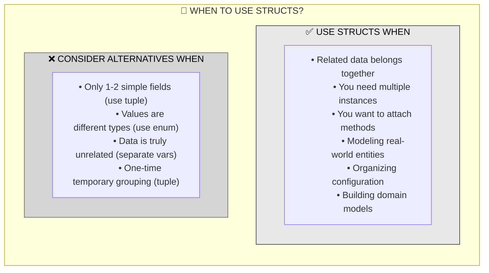

### Use Structs For:

1. **Domain Models**: `User`, `Order`, `Product`, `Invoice`
2. **Configuration**: `DatabaseConfig`, `ServerSettings`
3. **API Data**: `ApiRequest`, `ApiResponse`, `JsonPayload`
4. **Game Entities**: `Player`, `Enemy`, `Item`, `Level`
5. **Complex Data**: Anything with 3+ related fields

### Consider Alternatives:

1. **Tuples**: For simple, temporary grouping (e.g., `(x, y)` coordinates)
2. **Enums**: When data can be one of several variants
3. **Arrays/Vecs**: For homogeneous collections
4. **Separate variables**: If truly unrelated

---

## Part 12: Comparison with Other Types

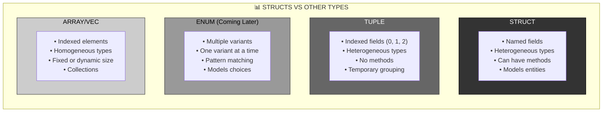

### Code Comparison

```rust
// ═══════════════════════════════════════
// Struct: Named fields, clear intent
// ═══════════════════════════════════════
struct Point {
    x: f64,
    y: f64,
}
let p = Point { x: 3.0, y: 4.0 };
println!("x: {}", p.x);  // Clear: accessing x coordinate

// ═══════════════════════════════════════
// Tuple: Indexed fields, less clear
// ═══════════════════════════════════════
let p = (3.0, 4.0);
println!("x: {}", p.0);  // Less clear: what is p.0?

// ═══════════════════════════════════════
// Array: Homogeneous, indexed
// ═══════════════════════════════════════
let p = [3.0, 4.0];
println!("x: {}", p[0]);  // Runtime indexing
```

**When to choose what**:
- **Struct**: Most cases, especially with 3+ fields or methods needed
- **Tuple**: Quick, temporary grouping (e.g., function return values)
- **Array/Vec**: Collections of same type
- **Enum**: When value is one of several variants (covered later)

---

## Part 13: Cross-Language Comparison

### Rust Struct vs Other Languages

```rust
// ═══════════════════════════════════════
// RUST
// ═══════════════════════════════════════
struct User {
    name: String,
    age: u32,
}

impl User {
    fn new(name: String, age: u32) -> User {
        User { name, age }
    }
    
    fn greet(&self) {
        println!("Hello, {}", self.name);
    }
}
```

```python
# ═══════════════════════════════════════
# PYTHON (Class)
# ═══════════════════════════════════════
class User:
    def __init__(self, name: str, age: int):
        self.name = name
        self.age = age
    
    def greet(self):
        print(f"Hello, {self.name}")
```

```javascript
// ═══════════════════════════════════════
// JAVASCRIPT (Class)
// ═══════════════════════════════════════
class User {
    constructor(name, age) {
        this.name = name;
        this.age = age;
    }
    
    greet() {
        console.log(`Hello, ${this.name}`);
    }
}
```

```go
// ═══════════════════════════════════════
// GO (Struct + Methods)
// ═══════════════════════════════════════
type User struct {
    Name string
    Age  uint32
}

func NewUser(name string, age uint32) User {
    return User{Name: name, Age: age}
}

func (u User) Greet() {
    fmt.Printf("Hello, %s\n", u.Name)
}
```

```c
// ═══════════════════════════════════════
// C (Struct, no methods)
// ═══════════════════════════════════════
struct User {
    char name[100];
    unsigned int age;
};

// Functions are separate, not attached
void greet(struct User* u) {
    printf("Hello, %s\n", u->name);
}
```

### Key Differences

| Feature | Rust | Python | JavaScript | Go | C |
|:--------|:-----|:-------|:-----------|:---|:--|
| **Type Safety** | ✅ Compile-time | ❌ Runtime | ❌ Runtime | ✅ Compile-time | ✅ Compile-time |
| **Methods** | ✅ Via impl | ✅ In class | ✅ In class | ✅ Receiver funcs | ❌ Separate functions |
| **Ownership** | ✅ Tracked | ❌ GC | ❌ GC | ❌ GC | ⚠️ Manual |
| **Mutability** | Explicit (`mut`) | Implicit | Implicit | Implicit | Implicit |
| **Initialization** | Must initialize all | Can be partial | Can be partial | Must initialize all | Can be partial |

**Rust's Unique Aspects**:
- Ownership and borrowing enforced at compile time
- Explicit mutability (`mut`)
- No inheritance (uses traits instead, covered later)
- No null (uses `Option` instead, covered later)
- Memory safety without garbage collection

---

## Part 14: Key Takeaways

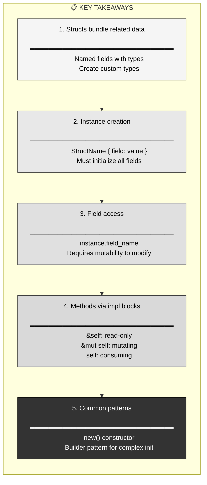

### Essential Principles

1. **Definition**: Structs create custom types by combining fields
2. **Instantiation**: Create instances with all fields initialized
3. **Access**: Use dot notation for fields and methods
4. **Methods**: Attach behavior via `impl` blocks
5. **Mutability**: The entire instance is `mut`, not individual fields
6. **Ownership**: Structs follow Rust's ownership rules (covered more later)

### The Iron Man Metaphor Recap

Just like **Tony Stark's suit combines** the arc reactor (power), repulsors (weapons), flight system (mobility), and J.A.R.V.I.S. (intelligence) into **one unified system**, a Rust struct combines different typed fields into a single, cohesive custom type that you can pass around and attach methods to.

**You now understand**:
- Why structs exist (organizing related data)
- How to define them (`struct Name { fields }`)
- How to create instances (`Name { field: value }`)
- How to access fields (`instance.field`)
- How to add methods (`impl Name { fn method(&self) }`)
- When to use them (modeling entities, configuration, domain models)

Structs are fundamental to Rust programming — they're how you model your domain and build complex systems from simple types. Combined with ownership (covered next) and traits (covered later), they become incredibly powerful tools for writing safe, expressive code. 🦾
