# R33: Rust Validation - Enforcing Invariants in Structs

## The Answer (Minto Pyramid: Conclusion First)

**Validation prevents invalid data from entering your structs by checking constraints before construction.**

Instead of allowing any value (empty strings, negative ages, nonsensical statuses), you validate inputs in a constructor method and only create the struct if all constraints are met. This enforces *invariants* — rules that must always be true about your data. In Rust, you typically use a `new` method with validation logic that panics or returns a `Result` (covered later) when given bad data.

```rust
// The answer in code: Validation enforces rules
struct Ticket {
    title: String,
    description: String,
    status: String,
}

impl Ticket {
    fn new(title: String, description: String, status: String) -> Ticket {
        // Validation: enforce invariants
        if title.is_empty() {
            panic!("Title cannot be empty");
        }
        if title.len() > 50 {
            panic!("Title cannot be longer than 50 characters");
        }
        if description.len() > 500 {
            panic!("Description cannot be longer than 500 characters");
        }
        if status != "To-Do" && status != "InProgress" && status != "Done" {
            panic!("Status must be To-Do, InProgress, or Done");
        }
        
        Ticket { title, description, status }
    }
}
```

---

## 🦸 MCU Metaphor: Doctor Strange's Sanctum Sanctorum

**Core Truth**: Validation is like **Doctor Strange's Sanctum Sanctorum protection spells** — they prevent unworthy or dangerous entities from entering. Only those who pass the mystical checks can cross the threshold.

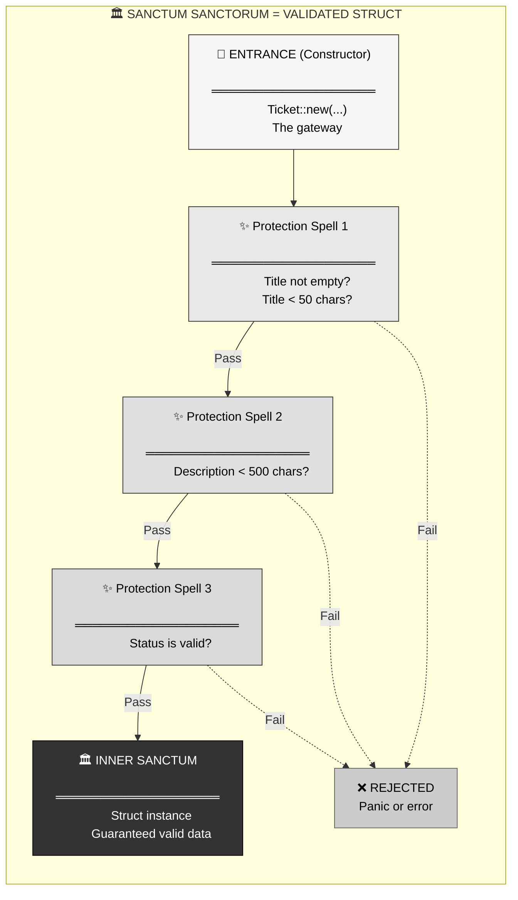

**The Mapping**:
- **Sanctum entrance** = Constructor method (`new`)
- **Protection spells** = Validation checks
- **Pass the spells** = Data meets constraints
- **Inner sanctum** = Struct instance (guaranteed valid)
- **Rejection** = Panic or error

**Where the metaphor breaks**: Doctor Strange can adjust spells on the fly; Rust validation is fixed at compile time in the method. But the "gatekeeper" concept holds perfectly.

---

## Part 1: The Problem Without Validation

### The Pain: Garbage In, Garbage Out

Without validation, users can create structs with nonsensical data:

```rust
struct Ticket {
    title: String,
    description: String,
    status: String,
}

fn main() {
    // ❌ Nothing stops this nonsense!
    let bad_ticket1 = Ticket {
        title: "".to_string(),  // Empty title
        description: "a".repeat(10000),  // 10,000 character description
        status: "Funny".to_string(),  // Invalid status
    };
    
    let bad_ticket2 = Ticket {
        title: "Fix bug".to_string(),
        description: "".to_string(),
        status: "Maybe Done?".to_string(),
    };
    
    // Your code now has to defensively check EVERYWHERE
    if bad_ticket1.title.is_empty() {
        // Handle empty title...
    }
    // This is exhausting and error-prone!
}
```

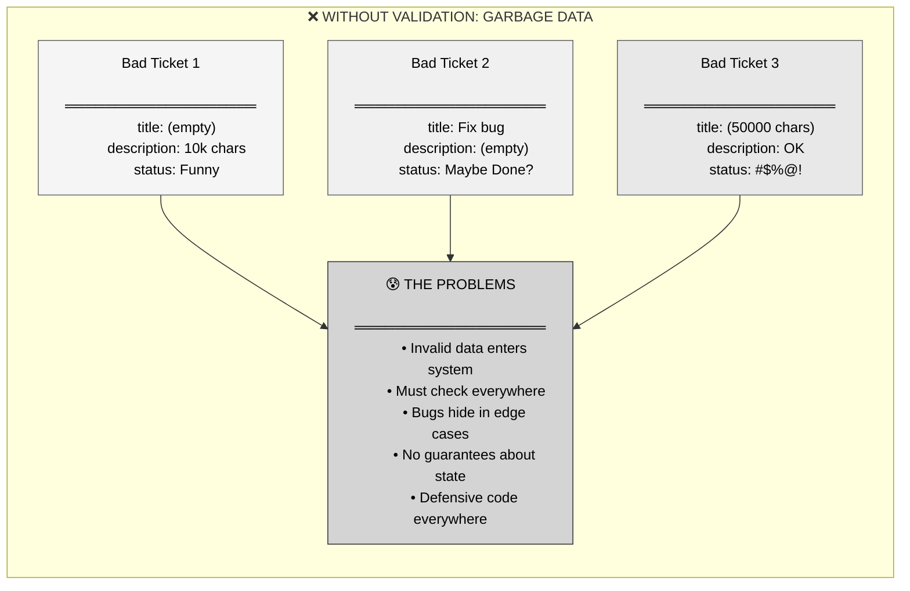

### Real Pain Points

1. **No guarantees**: Can't trust any instance has valid data
2. **Defensive code**: Must validate at every use site
3. **Runtime bugs**: Invalid data causes crashes far from creation
4. **Inconsistent state**: Some fields valid, others garbage
5. **No single source of truth**: Validation logic scattered

---

## Part 2: The Solution - Constructor Validation

### Definition: Gate-Keeping with `new`

Validate inputs in a constructor method before creating the struct:

```rust
struct Ticket {
    title: String,
    description: String,
    status: String,
}

impl Ticket {
    // ═══════════════════════════════════════
    // Constructor with validation (the gateway)
    // ═══════════════════════════════════════
    fn new(title: String, description: String, status: String) -> Ticket {
        // Validation checks
        if title.is_empty() {
            panic!("Title cannot be empty");
        }
        if title.len() > 50 {
            panic!("Title cannot exceed 50 characters");
        }
        if description.is_empty() {
            panic!("Description cannot be empty");
        }
        if description.len() > 500 {
            panic!("Description cannot exceed 500 characters");
        }
        
        let valid_statuses = ["To-Do", "InProgress", "Done"];
        if !valid_statuses.contains(&status.as_str()) {
            panic!("Status must be To-Do, InProgress, or Done");
        }
        
        // Only create if all checks pass
        Ticket { title, description, status }
    }
}

// ═══════════════════════════════════════
// Usage: FORCED through the gateway
// ═══════════════════════════════════════
let ticket = Ticket::new(
    "Fix login bug".to_string(),
    "Users can't sign in".to_string(),
    "To-Do".to_string()
);  // ✅ Valid, creates instance

// let bad = Ticket::new("".to_string(), "x".to_string(), "To-Do".to_string());
// ❌ Panics: "Title cannot be empty"
```

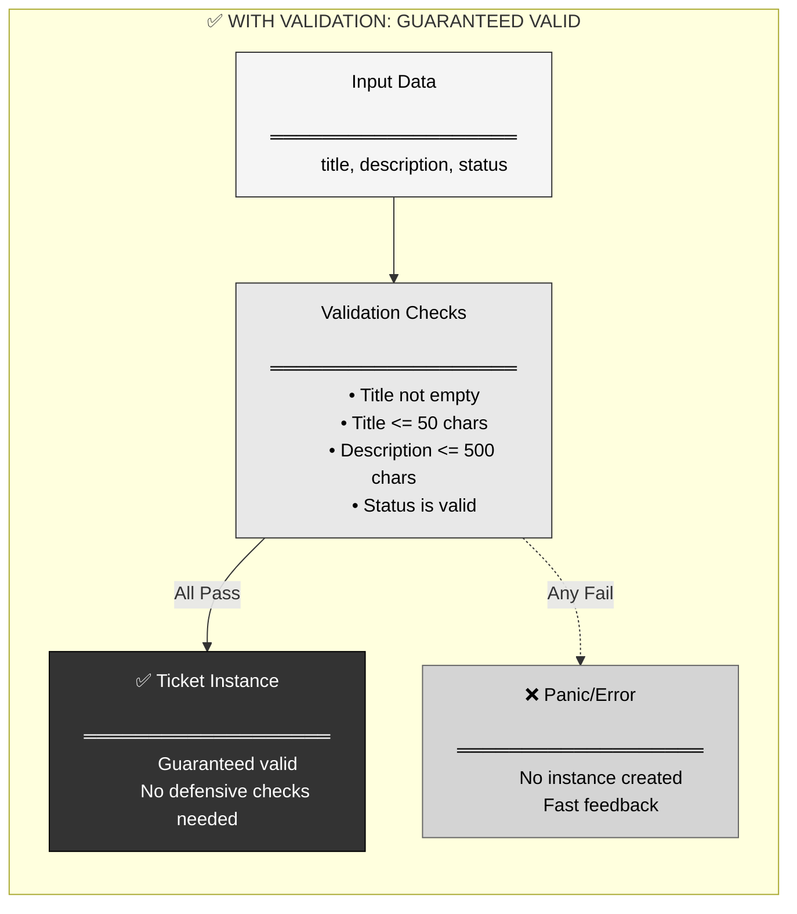

### Key Insight: Make Invalid States Unrepresentable

Once validation passes, **every instance is guaranteed valid**. You never have to check again.

---

## Part 3: Visual Mental Model - Validation Flow

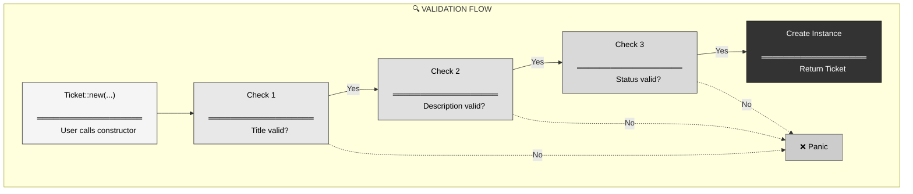

### Complete Example: Validated Constructor

```rust
struct User {
    username: String,
    email: String,
    age: u32,
}

impl User {
    fn new(username: String, email: String, age: u32) -> User {
        // ═══════════════════════════════════════
        // Validation 1: Username constraints
        // ═══════════════════════════════════════
        if username.is_empty() {
            panic!("Username cannot be empty");
        }
        if username.len() < 3 {
            panic!("Username must be at least 3 characters");
        }
        if username.len() > 20 {
            panic!("Username cannot exceed 20 characters");
        }
        
        // ═══════════════════════════════════════
        // Validation 2: Email constraints
        // ═══════════════════════════════════════
        if !email.contains('@') {
            panic!("Email must contain @");
        }
        if !email.contains('.') {
            panic!("Email must contain a domain");
        }
        
        // ═══════════════════════════════════════
        // Validation 3: Age constraints
        // ═══════════════════════════════════════
        if age < 13 {
            panic!("User must be at least 13 years old");
        }
        if age > 120 {
            panic!("Age seems unrealistic");
        }
        
        // All checks passed, create instance
        User { username, email, age }
    }
}

// ═══════════════════════════════════════
// Usage
// ═══════════════════════════════════════
let user = User::new(
    "alice123".to_string(),
    "alice@example.com".to_string(),
    25
);  // ✅ All valid

// let bad_user = User::new("ab".to_string(), "invalid".to_string(), 5);
// ❌ Panics: "Username must be at least 3 characters"
```

---

## Part 4: String Methods for Validation

Rust's `String` type provides many useful methods for validation:

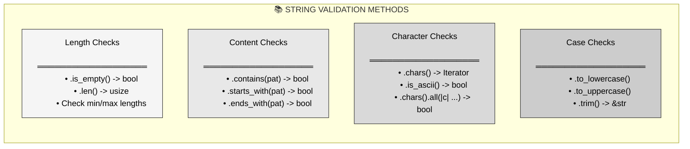

### Common Validation Patterns

```rust
// ═══════════════════════════════════════
// Length validation
// ═══════════════════════════════════════
if title.is_empty() {
    panic!("Title cannot be empty");
}
if title.len() > 50 {
    panic!("Title too long");
}

// ═══════════════════════════════════════
// Content validation
// ═══════════════════════════════════════
if !email.contains('@') {
    panic!("Invalid email");
}
if password.contains(' ') {
    panic!("Password cannot contain spaces");
}

// ═══════════════════════════════════════
// Character validation
// ═══════════════════════════════════════
if !username.chars().all(|c| c.is_alphanumeric() || c == '_') {
    panic!("Username can only contain letters, numbers, and underscores");
}

// ═══════════════════════════════════════
// Whitespace validation
// ═══════════════════════════════════════
let trimmed = title.trim();
if trimmed.is_empty() {
    panic!("Title cannot be only whitespace");
}

// ═══════════════════════════════════════
// Range validation (for numbers)
// ═══════════════════════════════════════
if age < 0 || age > 150 {
    panic!("Age out of valid range");
}
```

---

## Part 5: Validation Strategies

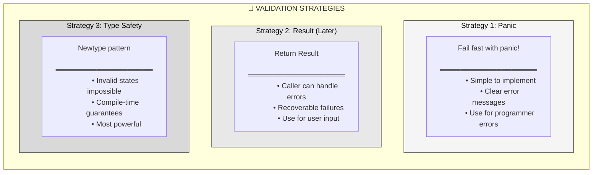

### Strategy 1: Panic (Current Approach)

```rust
impl Ticket {
    fn new(title: String, description: String, status: String) -> Ticket {
        if title.is_empty() {
            panic!("Title cannot be empty");  // Fails immediately
        }
        // ... more checks
        Ticket { title, description, status }
    }
}

// Usage
let ticket = Ticket::new("Title".into(), "Desc".into(), "To-Do".into());
// If validation fails, program crashes with message
```

**When to use**: 
- Validation logic errors (bugs in your code)
- Situations that should never happen
- Early development/prototyping

### Strategy 2: Result Type (Preview - Covered Later)

```rust
// This is a preview; Result will be covered in detail later
impl Ticket {
    fn new(title: String, description: String, status: String) 
        -> Result<Ticket, String> 
    {
        if title.is_empty() {
            return Err("Title cannot be empty".to_string());
        }
        // ... more checks
        Ok(Ticket { title, description, status })
    }
}

// Usage
match Ticket::new("Title".into(), "Desc".into(), "To-Do".into()) {
    Ok(ticket) => println!("Created ticket"),
    Err(msg) => println!("Validation failed: {}", msg),
}
```

**When to use**:
- User input validation
- Recoverable errors
- When caller should decide how to handle failure

---

## Part 6: Preventing Direct Construction

### The Problem: Bypassing Validation

If fields are public, users can bypass your `new` method:

```rust
// ❌ Public fields = anyone can bypass validation
pub struct Ticket {
    pub title: String,
    pub description: String,
    pub status: String,
}

impl Ticket {
    pub fn new(title: String, description: String, status: String) -> Ticket {
        // Validation here...
        Ticket { title, description, status }
    }
}

// User can bypass validation!
let bad_ticket = Ticket {
    title: "".to_string(),  // Validation bypassed!
    description: "x".to_string(),
    status: "Invalid".to_string(),
};
```

### The Solution: Private Fields

Make fields private, force construction through `new`:

```rust
// ✅ Private fields = must use new()
pub struct Ticket {
    title: String,        // Private by default
    description: String,
    status: String,
}

impl Ticket {
    pub fn new(title: String, description: String, status: String) -> Ticket {
        // Validation enforced here
        if title.is_empty() {
            panic!("Title cannot be empty");
        }
        // ... more validation
        Ticket { title, description, status }
    }
    
    // ═══════════════════════════════════════
    // Provide getters for read access
    // ═══════════════════════════════════════
    pub fn title(&self) -> &str {
        &self.title
    }
    
    pub fn description(&self) -> &str {
        &self.description
    }
    
    pub fn status(&self) -> &str {
        &self.status
    }
}

// Now users MUST go through new()
let ticket = Ticket::new("Title".into(), "Desc".into(), "To-Do".into());
println!("Title: {}", ticket.title());  // Access via getter

// let bad = Ticket { title: "".into(), ... };
// ❌ Compile error: fields are private
```

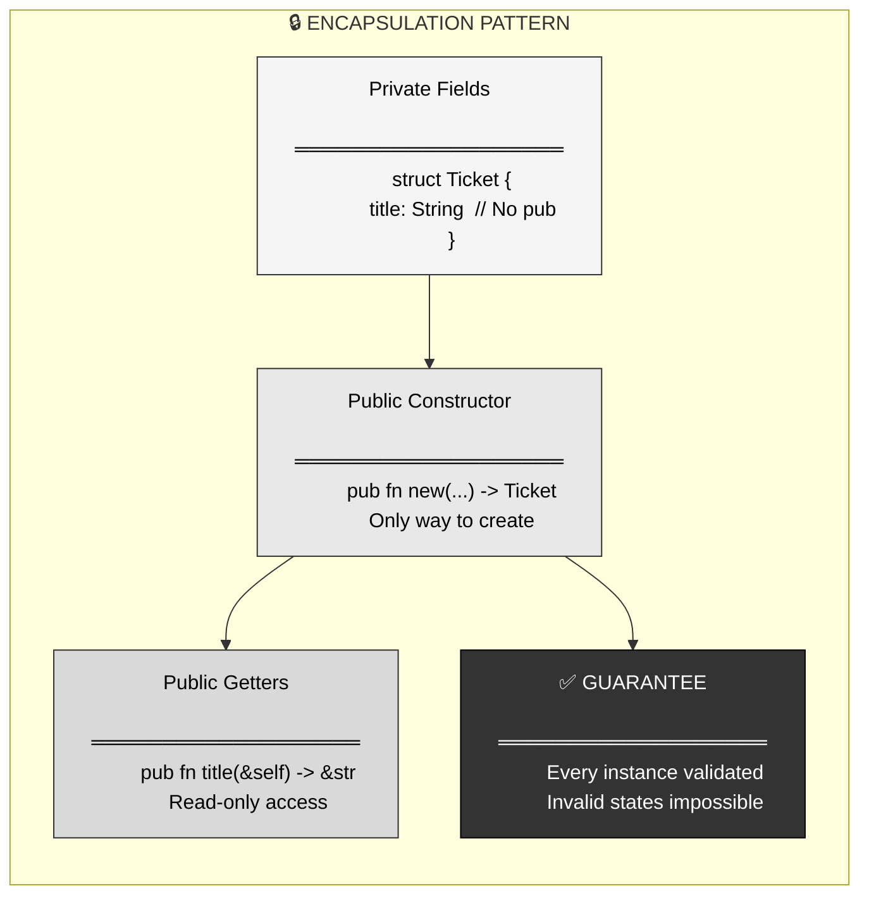

---

## Part 7: Real-World Validation Examples

### Example 1: Email Validation

```rust
struct Email {
    address: String,
}

impl Email {
    fn new(address: String) -> Email {
        // ═══════════════════════════════════════
        // Basic email validation
        // ═══════════════════════════════════════
        let trimmed = address.trim();
        
        if trimmed.is_empty() {
            panic!("Email cannot be empty");
        }
        
        if !trimmed.contains('@') {
            panic!("Email must contain @");
        }
        
        let parts: Vec<&str> = trimmed.split('@').collect();
        if parts.len() != 2 {
            panic!("Email must have exactly one @");
        }
        
        if parts[0].is_empty() {
            panic!("Email local part cannot be empty");
        }
        
        if parts[1].is_empty() || !parts[1].contains('.') {
            panic!("Email must have a valid domain");
        }
        
        Email { address: trimmed.to_string() }
    }
    
    pub fn address(&self) -> &str {
        &self.address
    }
}

// Usage
let email = Email::new("alice@example.com".to_string());  // ✅
// let bad = Email::new("not-an-email".to_string());  // ❌ Panics
```

### Example 2: Age Validation

```rust
struct Age {
    years: u32,
}

impl Age {
    fn new(years: u32) -> Age {
        if years < 0 {  // Note: u32 can't be negative, but good practice
            panic!("Age cannot be negative");
        }
        if years > 150 {
            panic!("Age seems unrealistic");
        }
        Age { years }
    }
    
    pub fn years(&self) -> u32 {
        self.years
    }
    
    pub fn is_adult(&self) -> bool {
        self.years >= 18
    }
    
    pub fn is_senior(&self) -> bool {
        self.years >= 65
    }
}

let age = Age::new(25);
if age.is_adult() {
    println!("Adult");
}
```

### Example 3: Username Validation

```rust
struct Username {
    value: String,
}

impl Username {
    fn new(value: String) -> Username {
        let trimmed = value.trim();
        
        // ═══════════════════════════════════════
        // Length constraints
        // ═══════════════════════════════════════
        if trimmed.len() < 3 {
            panic!("Username must be at least 3 characters");
        }
        if trimmed.len() > 20 {
            panic!("Username cannot exceed 20 characters");
        }
        
        // ═══════════════════════════════════════
        // Character constraints
        // ═══════════════════════════════════════
        let valid_chars = trimmed.chars().all(|c| {
            c.is_alphanumeric() || c == '_' || c == '-'
        });
        
        if !valid_chars {
            panic!("Username can only contain letters, numbers, underscore, and hyphen");
        }
        
        // ═══════════════════════════════════════
        // Must start with letter
        // ═══════════════════════════════════════
        if let Some(first_char) = trimmed.chars().next() {
            if !first_char.is_alphabetic() {
                panic!("Username must start with a letter");
            }
        }
        
        Username { value: trimmed.to_string() }
    }
    
    pub fn as_str(&self) -> &str {
        &self.value
    }
}

// Usage
let username = Username::new("alice_123".to_string());  // ✅
// let bad1 = Username::new("ab".to_string());  // ❌ Too short
// let bad2 = Username::new("123abc".to_string());  // ❌ Starts with number
// let bad3 = Username::new("alice@home".to_string());  // ❌ Invalid char
```

---

## Part 8: Validation Helper Functions

Organize validation logic into helper functions:

```rust
struct Ticket {
    title: String,
    description: String,
    status: String,
}

impl Ticket {
    pub fn new(title: String, description: String, status: String) -> Ticket {
        Self::validate_title(&title);
        Self::validate_description(&description);
        Self::validate_status(&status);
        
        Ticket { title, description, status }
    }
    
    // ═══════════════════════════════════════
    // Helper: Validate title
    // ═══════════════════════════════════════
    fn validate_title(title: &str) {
        if title.trim().is_empty() {
            panic!("Title cannot be empty");
        }
        if title.len() > 50 {
            panic!("Title cannot exceed 50 characters");
        }
    }
    
    // ═══════════════════════════════════════
    // Helper: Validate description
    // ═══════════════════════════════════════
    fn validate_description(description: &str) {
        if description.trim().is_empty() {
            panic!("Description cannot be empty");
        }
        if description.len() > 500 {
            panic!("Description cannot exceed 500 characters");
        }
    }
    
    // ═══════════════════════════════════════
    // Helper: Validate status
    // ═══════════════════════════════════════
    fn validate_status(status: &str) {
        let valid_statuses = ["To-Do", "InProgress", "Done"];
        if !valid_statuses.contains(&status) {
            panic!("Status must be To-Do, InProgress, or Done");
        }
    }
    
    // Getters...
    pub fn title(&self) -> &str { &self.title }
    pub fn description(&self) -> &str { &self.description }
    pub fn status(&self) -> &str { &self.status }
}
```

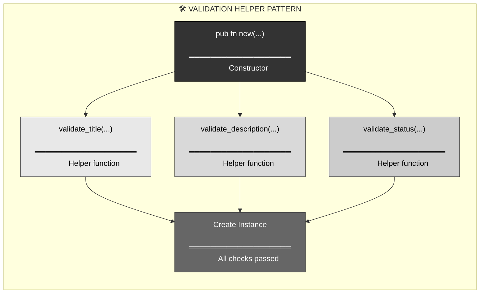

**Benefits**:
- Cleaner `new` method
- Reusable validation logic
- Easier to test individual validators
- Better error messages

---

## Part 9: When to Validate

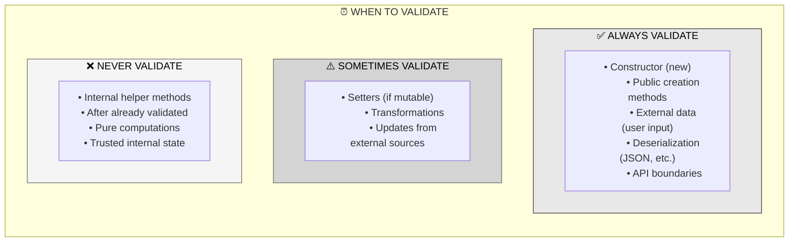

### Golden Rule: Validate at Boundaries

```rust
// ✅ GOOD: Validate at creation (boundary)
impl Ticket {
    pub fn new(title: String) -> Ticket {
        if title.is_empty() {
            panic!("Title cannot be empty");
        }
        Ticket { title }
    }
    
    // ✅ No validation needed (already guaranteed valid)
    pub fn title_length(&self) -> usize {
        self.title.len()  // Can trust self.title is valid
    }
    
    // ✅ No validation needed (internal helper)
    fn format_title(&self) -> String {
        format!("Ticket: {}", self.title)  // Already valid
    }
}

// ❌ BAD: Validating everywhere (wasteful)
impl Ticket {
    pub fn title_length(&self) -> usize {
        if self.title.is_empty() {  // ❌ Unnecessary
            panic!("Invalid state");
        }
        self.title.len()
    }
}
```

---

## Part 10: Validation Best Practices

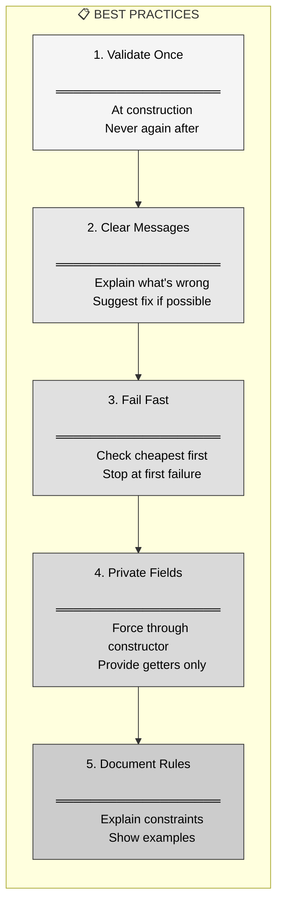

### Practice 1: Good Error Messages

```rust
// ❌ BAD: Vague message
if title.is_empty() {
    panic!("Invalid");
}

// ✅ GOOD: Specific message
if title.is_empty() {
    panic!("Title cannot be empty. Please provide a non-empty title.");
}

// ✅ BETTER: Include context
if title.len() > 50 {
    panic!("Title '{}' is {} characters long. Maximum allowed is 50.", 
           title, title.len());
}
```

### Practice 2: Check Cheapest First

```rust
impl Ticket {
    fn new(title: String, description: String) -> Ticket {
        // ✅ GOOD: Check length before expensive operations
        if title.is_empty() {  // Cheap: just check length
            panic!("Title cannot be empty");
        }
        
        // More expensive checks come after
        if title.chars().any(|c| c.is_control()) {  // Expensive: iterate chars
            panic!("Title contains control characters");
        }
        
        Ticket { title, description }
    }
}
```

### Practice 3: Document Constraints

```rust
/// A validated ticket title.
///
/// # Constraints
/// - Must not be empty
/// - Must not exceed 50 characters
/// - Must not contain control characters
/// - Leading/trailing whitespace is trimmed
///
/// # Examples
/// ```
/// let title = TicketTitle::new("Fix login bug".to_string());  // ✅ Valid
/// // let bad = TicketTitle::new("".to_string());  // ❌ Panics: empty
/// ```
struct TicketTitle {
    value: String,
}

impl TicketTitle {
    pub fn new(value: String) -> TicketTitle {
        let trimmed = value.trim();
        // Validation...
        TicketTitle { value: trimmed.to_string() }
    }
}
```

---

## Part 11: Comparison - Validation Approaches

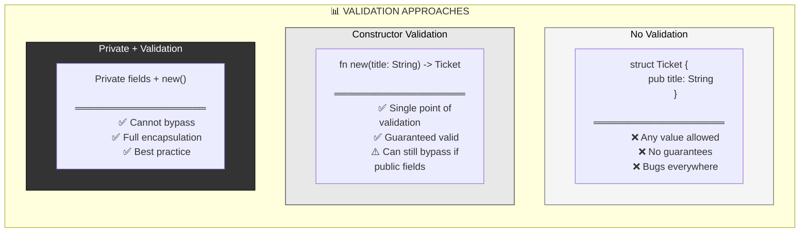

### Code Comparison

```rust
// ═══════════════════════════════════════
// Approach 1: No Validation (BAD)
// ═══════════════════════════════════════
pub struct TicketV1 {
    pub title: String,
}
// Anyone can create: TicketV1 { title: "".into() }
// ❌ No safety

// ═══════════════════════════════════════
// Approach 2: Constructor Validation (BETTER)
// ═══════════════════════════════════════
pub struct TicketV2 {
    pub title: String,  // Still public!
}
impl TicketV2 {
    pub fn new(title: String) -> TicketV2 {
        if title.is_empty() { panic!("Empty title"); }
        TicketV2 { title }
    }
}
// Problem: Can still do TicketV2 { title: "".into() }
// ⚠️ Validation can be bypassed

// ═══════════════════════════════════════
// Approach 3: Private + Validation (BEST)
// ═══════════════════════════════════════
pub struct TicketV3 {
    title: String,  // Private!
}
impl TicketV3 {
    pub fn new(title: String) -> TicketV3 {
        if title.is_empty() { panic!("Empty title"); }
        TicketV3 { title }
    }
    pub fn title(&self) -> &str { &self.title }
}
// MUST use new(), cannot bypass
// ✅ Guaranteed valid
```

---

## Part 12: Cross-Language Comparison

### Rust vs Other Languages

```rust
// ═══════════════════════════════════════
// RUST: Compile-time enforcement
// ═══════════════════════════════════════
pub struct Email {
    address: String,  // Private
}

impl Email {
    pub fn new(address: String) -> Email {
        if !address.contains('@') {
            panic!("Invalid email");
        }
        Email { address }
    }
    pub fn address(&self) -> &str { &self.address }
}
// Guarantee: Every Email instance has @ symbol
// Enforced: At compile time via privacy
```

```python
# ═══════════════════════════════════════
# PYTHON: Convention-based (not enforced)
# ═══════════════════════════════════════
class Email:
    def __init__(self, address: str):
        if '@' not in address:
            raise ValueError("Invalid email")
        self._address = address  # _ means "private" (convention only!)
    
    @property
    def address(self) -> str:
        return self._address

# Problem: Can still access email._address = "invalid"
# No compile-time enforcement
```

```javascript
// ═══════════════════════════════════════
// JAVASCRIPT: No real privacy (until recently)
// ═══════════════════════════════════════
class Email {
    constructor(address) {
        if (!address.includes('@')) {
            throw new Error("Invalid email");
        }
        this.address = address;  // Public!
    }
}

// Problem: email.address = "invalid" // No protection
```

```go
// ═══════════════════════════════════════
// GO: Package-level privacy
// ═══════════════════════════════════════
type Email struct {
    address string  // Lowercase = private to package
}

func NewEmail(address string) Email {
    if !strings.Contains(address, "@") {
        panic("Invalid email")
    }
    return Email{address: address}
}

func (e Email) Address() string {
    return e.address
}
// Better than JS/Python, but less granular than Rust
```

| Feature | Rust | Python | JavaScript | Go |
|:--------|:-----|:-------|:-----------|:---|
| **Field Privacy** | ✅ Module-level | ❌ Convention only | ⚠️ Recent (#) | ✅ Package-level |
| **Enforced at** | Compile time | Runtime | Runtime | Compile time |
| **Bypass possible?** | ❌ No | ✅ Yes | ✅ Yes | ⚠️ Within package |
| **Validation guarantee** | ✅ Strong | ❌ Weak | ❌ Weak | ⚠️ Medium |

---

## Part 13: Key Takeaways

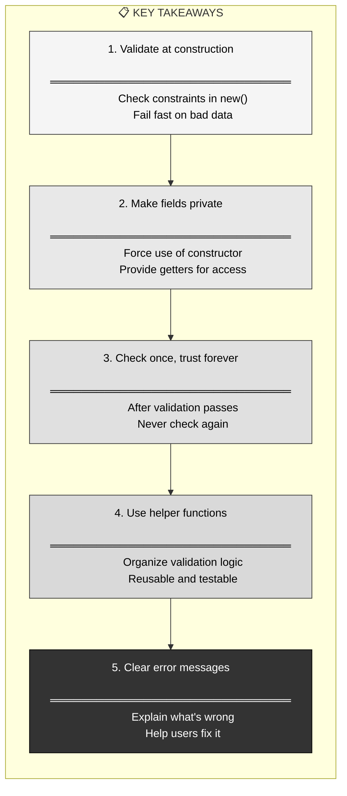

### Essential Principles

1. **Validation enforces invariants**: Rules that must always be true
2. **Validate at boundaries**: Constructor, deserializers, API entry points
3. **Private fields prevent bypass**: Can't construct without validation
4. **Fail fast**: Catch bad data immediately, not later
5. **Panic vs Result**: Panic for programmer errors, Result for user errors (later)
6. **Trust validated data**: Once validated, no need to check again

### The Doctor Strange Metaphor Recap

Just like **Doctor Strange's Sanctum Sanctorum** uses protection spells to ensure only worthy entities can enter the inner sanctum, **Rust validation** uses checks in the constructor to ensure only valid data can create struct instances. Once past the magical gateway, you're guaranteed to be inside safely with valid state.

**You now understand**:
- Why validation matters (preventing garbage data)
- How to validate (constructor with checks)
- When to validate (at construction, boundaries)
- How to enforce it (private fields + public constructor)
- Common patterns (string checks, range checks, content checks)
- Best practices (clear messages, helper functions, documentation)

Validation is critical to building robust Rust programs — it lets you write code that trusts its data structures, eliminating defensive checks everywhere and catching bugs early at the point of data entry. Combined with Rust's ownership system (covered next), validated structs become incredibly powerful guarantees about your program's state. 🏛️
