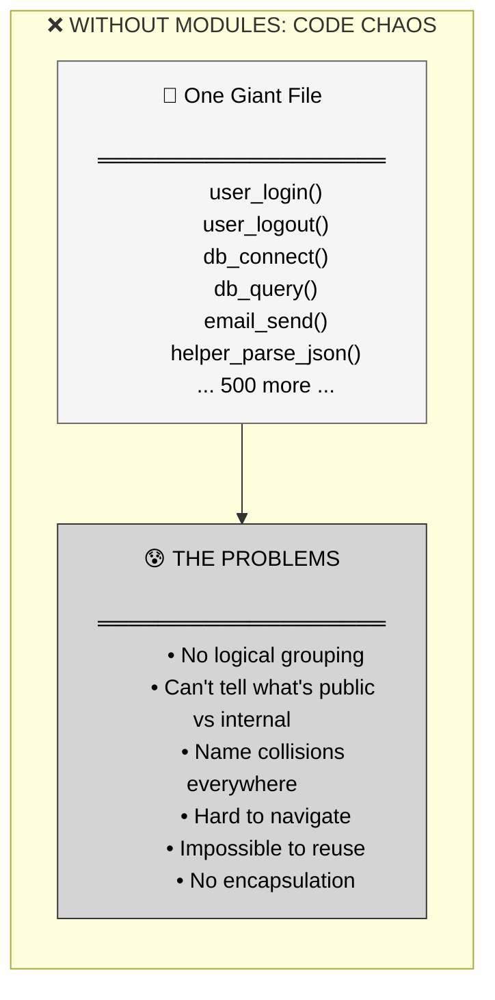
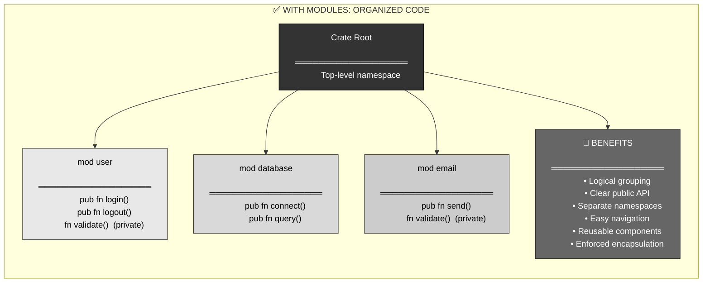
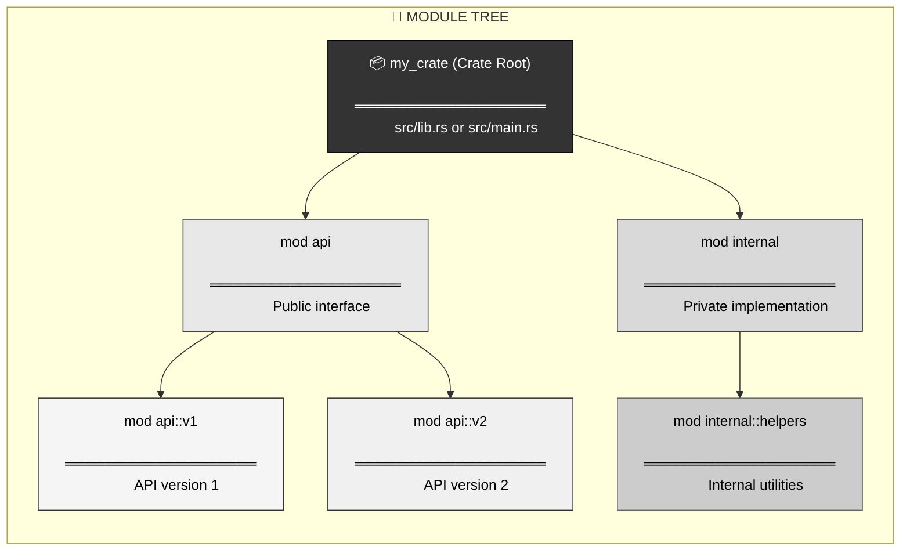
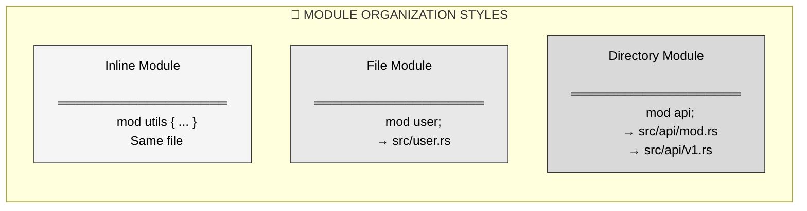
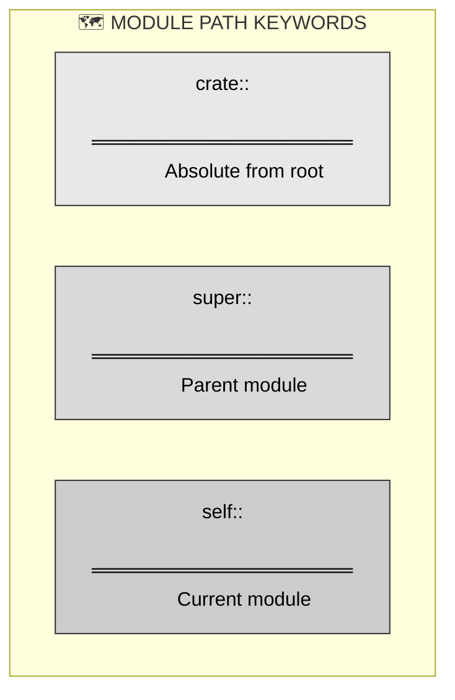
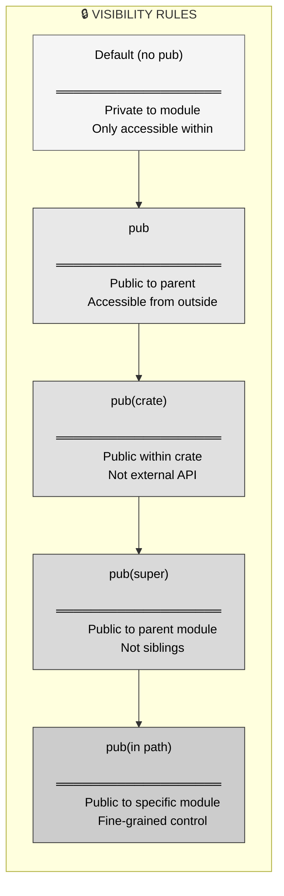
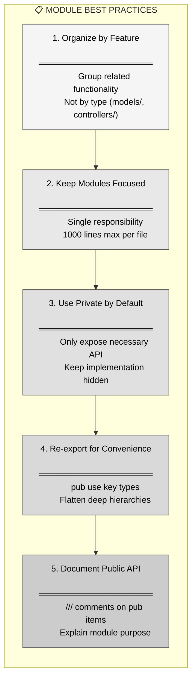
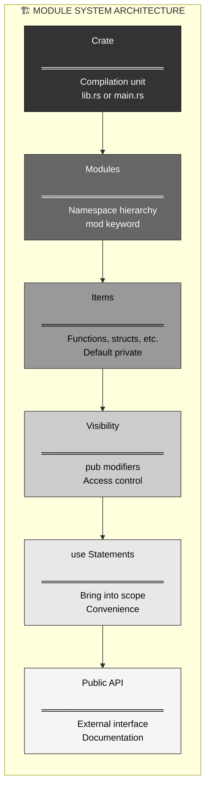
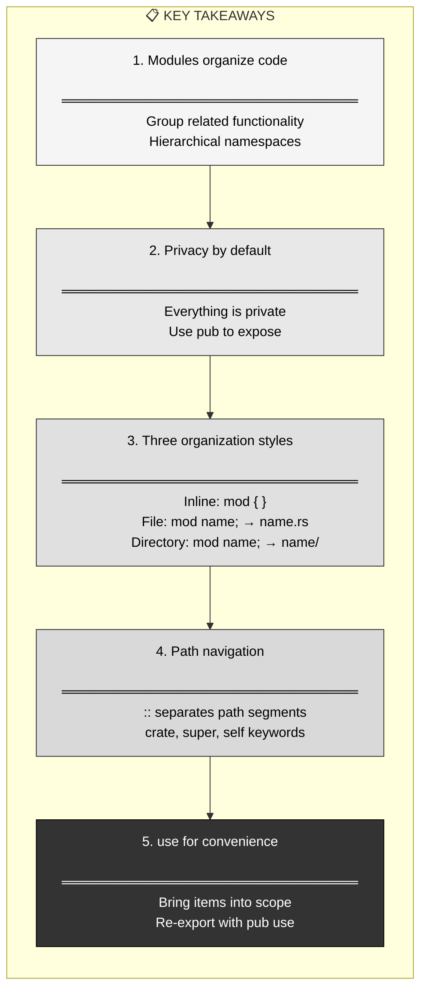

# R34: Rust Modules - Organizing Code with Namespaces

## The Answer (Minto Pyramid: Conclusion First)

**Modules group related code together under a common namespace, organizing your codebase into logical units.**

Instead of throwing all code into one file, you use `mod` to create hierarchical namespaces that separate concerns. Modules provide encapsulation (everything is private by default) and structure (files, directories, nested modules). Combined with visibility modifiers (`pub`), modules let you control what's exposed and what stays internal. Think of them as folders + access control for your code.

```rust
// The answer in code: Modules organize and encapsulate
mod helpers {
    // Private by default - only accessible within this module
    fn internal_helper() {
        println!("Internal only");
    }
    
    // Public - accessible from outside
    pub fn public_utility() {
        internal_helper();  // Can call private items within same module
        println!("Public utility");
    }
}

fn main() {
    helpers::public_utility();  // ✅ Works
    // helpers::internal_helper();  // ❌ Error: private function
}
```

---

## 🦸 MCU Metaphor: S.H.I.E.L.D.'s Organizational Structure

**Core Truth**: Modules are like **S.H.I.E.L.D.'s hierarchical organization** — different departments (modules) with specific responsibilities, nested clearance levels, and controlled access to classified information based on your security level.

```mermaid
flowchart TD
    subgraph SHIELD["🛡️ S.H.I.E.L.D. = MODULE SYSTEM"]
        direction TB
        
        HQ["⭐ S.H.I.E.L.D. HQ (Crate Root)
        ═══════════════════
        Top-level module
        Contains all departments"]
        
        HQ --> OPS["🎯 Operations (mod ops)
        ═══════════════════
        Public department
        Mission planning"]
        
        HQ --> RESEARCH["🔬 Research (mod research)
        ═══════════════════
        Private department
        Experimental tech"]
        
        HQ --> INTEL["🕵️ Intelligence (mod intel)
        ═══════════════════
        Public department
        Data gathering"]
        
        OPS --> FIELD["🚁 Field Ops (mod field)
        ═══════════════════
        Public sub-department
        Accessible to operations"]
        
        OPS --> BLACK["⬛ Black Ops (mod black_ops)
        ═══════════════════
        Private sub-department
        Classified missions"]
        
        INTEL --> ANALYSIS["📊 Analysis (mod analysis)
        ═══════════════════
        Public sub-department
        Report generation"]
    end
    
    style HQ fill:#333,stroke:#000,color:#fff
    style OPS fill:#e8e8e8,stroke:#333,color:#000
    style RESEARCH fill:#d9d9d9,stroke:#666,color:#000
    style INTEL fill:#e0e0e0,stroke:#333,color:#000
    style FIELD fill:#f5f5f5,stroke:#333,color:#000
    style BLACK fill:#ccc,stroke:#666,color:#000
    style ANALYSIS fill:#f0f0f0,stroke:#333,color:#000
```



**The Mapping**:
- **S.H.I.E.L.D. HQ** = Crate root (top-level module)
- **Departments** = Top-level modules (`mod ops`, `mod intel`)
- **Sub-departments** = Nested modules (`mod ops::field`)
- **Clearance levels** = Visibility (`pub` vs private)
- **Classified info** = Private items
- **Public briefings** = Public API

**Where the metaphor breaks**: S.H.I.E.L.D. can have dynamic clearance changes; Rust modules are fixed at compile time. But the hierarchical organization with access control concept holds perfectly.

---

## Part 1: The Problem Without Modules

### The Pain: Everything in One File

Without modules, code becomes an unorganized mess:

```rust
// ❌ All code in one giant file - no organization
fn user_login(username: String) { /* ... */ }
fn user_logout(user_id: u64) { /* ... */ }
fn user_validate(username: String) -> bool { /* ... */ }
fn db_connect() { /* ... */ }
fn db_query(sql: String) { /* ... */ }
fn db_close() { /* ... */ }
fn email_send(to: String, body: String) { /* ... */ }
fn email_validate(email: String) -> bool { /* ... */ }
fn helper_parse_json(json: String) { /* ... */ }
fn helper_format_date(timestamp: u64) -> String { /* ... */ }
// ... 500 more functions ...

fn main() {
    // Which functions are related?
    // Which are internal helpers?
    // Which are public API?
    // No idea!
}
```



### Real Pain Points

1. **No separation of concerns**: Related code scattered everywhere
2. **No encapsulation**: Everything is accessible to everything
3. **Name pollution**: All names in one global scope
4. **Hard to navigate**: Can't find related functions
5. **No reusability**: Can't extract modules to other projects
6. **Merge conflicts**: Everyone editing the same file

---

## Part 2: The Solution - Modules

### Definition: Hierarchical Namespaces

Modules group related code under a common name:

```rust
// ═══════════════════════════════════════
// Organize code with modules
// ═══════════════════════════════════════

mod user {
    pub fn login(username: String) {
        validate(&username);
        println!("User {} logged in", username);
    }
    
    pub fn logout(user_id: u64) {
        println!("User {} logged out", user_id);
    }
    
    // Private helper - only accessible within this module
    fn validate(username: &str) -> bool {
        !username.is_empty()
    }
}

mod database {
    pub fn connect() {
        println!("Connected to database");
    }
    
    pub fn query(sql: String) {
        println!("Executing: {}", sql);
    }
}

fn main() {
    // Use modules with :: path syntax
    user::login("alice".to_string());
    database::connect();
    user::logout(1);
    
    // user::validate("test");  // ❌ Error: private function
}
```



### Key Insight: Modules = Namespaces + Encapsulation

Modules provide **both** organization (hierarchy) **and** access control (privacy).

---

## Part 3: Visual Mental Model - Module Hierarchy



### Complete Example: Module Hierarchy

```rust
// ═══════════════════════════════════════
// Crate root (src/lib.rs or src/main.rs)
// ═══════════════════════════════════════

// Inline module (code in same file)
mod helpers {
    pub fn format_message(msg: &str) -> String {
        format!("[INFO] {}", msg)
    }
    
    // Private helper
    fn internal_logic() {
        // Only accessible within helpers module
    }
}

// Nested modules
mod api {
    pub mod v1 {
        pub fn get_user(id: u64) -> String {
            format!("User {}", id)
        }
    }
    
    pub mod v2 {
        pub fn get_user(id: u64) -> String {
            format!("User {} (v2)", id)
        }
    }
}

fn main() {
    // Access with :: path syntax
    let msg = helpers::format_message("Hello");
    println!("{}", msg);
    
    // Access nested modules
    let user_v1 = api::v1::get_user(1);
    let user_v2 = api::v2::get_user(1);
    
    println!("{}", user_v1);
    println!("{}", user_v2);
}
```

---

## Part 4: Module Declaration Styles

### Style 1: Inline Modules

Module defined in the same file:

```rust
// ═══════════════════════════════════════
// Inline module (small, self-contained)
// ═══════════════════════════════════════
mod utils {
    pub fn add(a: i32, b: i32) -> i32 {
        a + b
    }
}

fn main() {
    let result = utils::add(2, 3);
    println!("Result: {}", result);
}
```

**When to use**: Small, tightly coupled code; tests; examples.

### Style 2: File Modules

Module defined in a separate file:

```rust
// ═══════════════════════════════════════
// src/main.rs or src/lib.rs
// ═══════════════════════════════════════
mod user;  // Looks for src/user.rs

fn main() {
    user::login("alice".to_string());
}

// ═══════════════════════════════════════
// src/user.rs (separate file)
// ═══════════════════════════════════════
pub fn login(username: String) {
    println!("User {} logged in", username);
}

pub fn logout(user_id: u64) {
    println!("User {} logged out", user_id);
}
```

**When to use**: Larger modules; separate concerns; reusable components.

### Style 3: Directory Modules

Module with submodules in a directory:

```
src/
├── main.rs
└── api/
    ├── mod.rs      (or api.rs in parent)
    ├── v1.rs
    └── v2.rs
```

```rust
// ═══════════════════════════════════════
// src/main.rs
// ═══════════════════════════════════════
mod api;  // Looks for src/api/mod.rs or src/api.rs

fn main() {
    api::v1::get_user(1);
}

// ═══════════════════════════════════════
// src/api/mod.rs (or src/api.rs)
// ═══════════════════════════════════════
pub mod v1;  // Looks for src/api/v1.rs
pub mod v2;  // Looks for src/api/v2.rs

// ═══════════════════════════════════════
// src/api/v1.rs
// ═══════════════════════════════════════
pub fn get_user(id: u64) -> String {
    format!("User {} (v1)", id)
}

// ═══════════════════════════════════════
// src/api/v2.rs
// ═══════════════════════════════════════
pub fn get_user(id: u64) -> String {
    format!("User {} (v2)", id)
}
```

**When to use**: Complex modules with multiple submodules; large codebases.



---

## Part 5: Module Paths and Access

### Accessing Items in Modules

Use `::` to navigate module paths:

```rust
mod outer {
    pub mod inner {
        pub fn function() {
            println!("Inner function");
        }
    }
}

fn main() {
    // Absolute path (from crate root)
    crate::outer::inner::function();
    
    // Relative path
    outer::inner::function();
}
```

### Path Keywords

```rust
// ═══════════════════════════════════════
// crate - refers to crate root
// ═══════════════════════════════════════
use crate::outer::inner::function;

// ═══════════════════════════════════════
// super - refers to parent module
// ═══════════════════════════════════════
mod parent {
    pub fn parent_fn() {
        println!("Parent");
    }
    
    mod child {
        pub fn child_fn() {
            // Call parent module's function
            super::parent_fn();
        }
    }
}

// ═══════════════════════════════════════
// self - refers to current module
// ═══════════════════════════════════════
mod my_mod {
    pub fn public_fn() {}
    
    fn uses_self() {
        self::public_fn();  // Same as just public_fn()
    }
}
```



---

## Part 6: The `use` Statement - Bringing Into Scope

### Import Items for Convenience

```rust
mod helpers {
    pub fn format_message(msg: &str) -> String {
        format!("[INFO] {}", msg)
    }
    
    pub fn format_error(msg: &str) -> String {
        format!("[ERROR] {}", msg)
    }
}

// ═══════════════════════════════════════
// Without use: Full path every time
// ═══════════════════════════════════════
fn without_use() {
    let msg = helpers::format_message("Hello");
    let err = helpers::format_error("Oops");
}

// ═══════════════════════════════════════
// With use: Bring into scope
// ═══════════════════════════════════════
use helpers::format_message;
use helpers::format_error;

fn with_use() {
    let msg = format_message("Hello");  // No helpers:: prefix
    let err = format_error("Oops");
}

// ═══════════════════════════════════════
// Import multiple items
// ═══════════════════════════════════════
use helpers::{format_message, format_error};

// ═══════════════════════════════════════
// Import all items (star import - discouraged)
// ═══════════════════════════════════════
use helpers::*;
```

### Import Patterns

```rust
// ═══════════════════════════════════════
// Import specific item
// ═══════════════════════════════════════
use std::collections::HashMap;

// ═══════════════════════════════════════
// Import multiple items from same module
// ═══════════════════════════════════════
use std::collections::{HashMap, HashSet, BTreeMap};

// ═══════════════════════════════════════
// Import module itself
// ═══════════════════════════════════════
use std::collections;
// Then use: collections::HashMap

// ═══════════════════════════════════════
// Rename with `as`
// ═══════════════════════════════════════
use std::collections::HashMap as Map;
let my_map: Map<String, i32> = Map::new();

// ═══════════════════════════════════════
// Re-export (make imported item public)
// ═══════════════════════════════════════
pub use helpers::format_message;  // Now externally visible
```

---

## Part 7: Visibility and Privacy

### Default Privacy

```rust
mod my_module {
    // ❌ Private by default
    fn private_function() {
        println!("Private");
    }
    
    // ✅ Public with `pub`
    pub fn public_function() {
        println!("Public");
        private_function();  // Can call private within same module
    }
}

fn main() {
    my_module::public_function();  // ✅ Works
    // my_module::private_function();  // ❌ Error: private
}
```

### Visibility Rules



### Visibility Modifiers in Action

```rust
mod parent {
    // Private - only within parent
    fn private_fn() {
        println!("Private to parent");
    }
    
    // Public - accessible from anywhere
    pub fn public_fn() {
        println!("Public");
    }
    
    // Public within crate only
    pub(crate) fn crate_visible() {
        println!("Visible within crate");
    }
    
    pub mod child {
        // Public to parent module
        pub(super) fn visible_to_parent() {
            // Can call parent's private function
            super::private_fn();
        }
        
        // Public within specific module path
        pub(in crate::parent) fn specific_visibility() {
            println!("Visible in parent module");
        }
    }
}

fn main() {
    parent::public_fn();  // ✅ Works
    parent::crate_visible();  // ✅ Works (same crate)
    // parent::private_fn();  // ❌ Error: private
    // parent::child::visible_to_parent();  // ❌ Error: pub(super)
}
```

---

## Part 8: Real-World Module Organization

### Example 1: Web Application Structure

```
src/
├── main.rs          (entry point)
├── lib.rs           (library root)
├── api/
│   ├── mod.rs       (api module)
│   ├── users.rs     (user endpoints)
│   ├── posts.rs     (post endpoints)
│   └── auth.rs      (authentication)
├── database/
│   ├── mod.rs
│   ├── connection.rs
│   └── queries.rs
├── models/
│   ├── mod.rs
│   ├── user.rs
│   └── post.rs
└── utils/
    ├── mod.rs
    ├── validation.rs
    └── formatting.rs
```

```rust
// ═══════════════════════════════════════
// src/lib.rs
// ═══════════════════════════════════════
pub mod api;
pub mod models;
mod database;  // Private - internal only
mod utils;     // Private - internal only

// ═══════════════════════════════════════
// src/api/mod.rs
// ═══════════════════════════════════════
pub mod users;
pub mod posts;
mod auth;  // Private - internal to api

// ═══════════════════════════════════════
// src/api/users.rs
// ═══════════════════════════════════════
use crate::models::User;
use crate::database;
use super::auth;  // Access sibling module

pub fn get_user(id: u64) -> Option<User> {
    if !auth::check_permission() {
        return None;
    }
    database::queries::find_user(id)
}

pub fn create_user(username: String) -> User {
    // Implementation...
}
```

### Example 2: Library Module Pattern

```rust
// ═══════════════════════════════════════
// src/lib.rs - Public API surface
// ═══════════════════════════════════════

// Re-export important types for convenient access
pub use ticket::Ticket;
pub use status::Status;

// Public modules
pub mod ticket;
pub mod status;

// Private modules
mod validation;
mod helpers;

// ═══════════════════════════════════════
// src/ticket.rs
// ═══════════════════════════════════════
use crate::validation;
use crate::status::Status;

pub struct Ticket {
    title: String,
    description: String,
    status: Status,
}

impl Ticket {
    pub fn new(title: String, description: String, status: Status) -> Ticket {
        validation::validate_title(&title);
        validation::validate_description(&description);
        Ticket { title, description, status }
    }
    
    pub fn title(&self) -> &str {
        &self.title
    }
    
    pub fn description(&self) -> &str {
        &self.description
    }
    
    pub fn status(&self) -> &Status {
        &self.status
    }
}

// ═══════════════════════════════════════
// src/validation.rs (private module)
// ═══════════════════════════════════════
pub(crate) fn validate_title(title: &str) {
    if title.is_empty() {
        panic!("Title cannot be empty");
    }
}

pub(crate) fn validate_description(description: &str) {
    if description.is_empty() {
        panic!("Description cannot be empty");
    }
}
```

---

## Part 9: Module Best Practices



### Practice 1: Feature-Based Organization

```rust
// ❌ BAD: Organize by type
// src/models/user.rs
// src/models/post.rs
// src/controllers/user_controller.rs
// src/controllers/post_controller.rs
// (related code scattered)

// ✅ GOOD: Organize by feature
// src/users/
//   ├── mod.rs
//   ├── model.rs
//   ├── api.rs
//   └── validation.rs
// src/posts/
//   ├── mod.rs
//   ├── model.rs
//   ├── api.rs
//   └── validation.rs
// (related code together)
```

### Practice 2: Clear Public API

```rust
// ═══════════════════════════════════════
// src/lib.rs - Define clear public surface
// ═══════════════════════════════════════

//! # My Library
//!
//! This library provides ticket management functionality.

// Re-export main types
pub use ticket::Ticket;
pub use status::Status;
pub use error::TicketError;

// Public modules
pub mod ticket;
pub mod status;
pub mod error;

// Private modules (implementation details)
mod validation;
mod formatting;
mod database;

// Don't expose internal details
// Users just see: Ticket, Status, TicketError
```

### Practice 3: Avoid Deep Nesting

```rust
// ❌ BAD: Deep hierarchy
use my_crate::api::v1::users::handlers::get_user;

// ✅ GOOD: Flatten with re-exports
// In src/lib.rs:
pub use api::v1::users::get_user;  // Re-export

// Users can now:
use my_crate::get_user;  // Much cleaner!
```

---

## Part 10: Common Module Patterns

### Pattern 1: Prelude Module

Convenient imports for common items:

```rust
// ═══════════════════════════════════════
// src/prelude.rs
// ═══════════════════════════════════════
pub use crate::Ticket;
pub use crate::Status;
pub use crate::TicketError;
pub use crate::validation::Validator;

// ═══════════════════════════════════════
// src/lib.rs
// ═══════════════════════════════════════
pub mod prelude;

// ═══════════════════════════════════════
// User code - import everything at once
// ═══════════════════════════════════════
use my_crate::prelude::*;
// Now have access to all common types
```

### Pattern 2: Private Sub-modules for Organization

```rust
mod ticket {
    // Private sub-module for internal helpers
    mod validation {
        pub(super) fn validate_title(title: &str) -> bool {
            !title.is_empty()
        }
    }
    
    // Public API
    pub struct Ticket {
        title: String,
    }
    
    impl Ticket {
        pub fn new(title: String) -> Ticket {
            if !validation::validate_title(&title) {
                panic!("Invalid title");
            }
            Ticket { title }
        }
    }
}
```

### Pattern 3: Tests Module

```rust
pub fn add(a: i32, b: i32) -> i32 {
    a + b
}

// ═══════════════════════════════════════
// Tests in private module
// ═══════════════════════════════════════
#[cfg(test)]
mod tests {
    use super::*;  // Import parent module items
    
    #[test]
    fn test_add() {
        assert_eq!(add(2, 3), 5);
    }
}
```

---

## Part 11: Module System Architecture



---

## Part 12: Cross-Language Comparison

### Rust vs Other Languages

```rust
// ═══════════════════════════════════════
// RUST: Module-based privacy
// ═══════════════════════════════════════
mod my_module {
    fn private_fn() {}  // Private by default
    pub fn public_fn() {}  // Explicitly public
}
// Enforced at compile time
```

```python
# ═══════════════════════════════════════
# PYTHON: Convention-based
# ═══════════════════════════════════════
def _private_function():  # _ prefix = "private" (convention)
    pass

def public_function():
    pass

# Not enforced - can still call _private_function()
```

```javascript
// ═══════════════════════════════════════
// JAVASCRIPT: No module privacy (until recently)
// ═══════════════════════════════════════
function privateFunction() {  // No real privacy
  // ...
}

export function publicFunction() {
  // ...
}
// Module exports control visibility, not language
```

```go
// ═══════════════════════════════════════
// GO: Package-based, case-sensitive
// ═══════════════════════════════════════
package mypackage

func privateFunction() {}  // Lowercase = private to package
func PublicFunction() {}   // Uppercase = public

// Package-level granularity
```

| Feature | Rust | Python | JavaScript | Go |
|:--------|:-----|:-------|:-----------|:---|
| **Privacy model** | Module-based | Convention | Export-based | Package-based |
| **Default** | Private | Public | Public | Private (lowercase) |
| **Enforced** | ✅ Compile-time | ❌ No | ⚠️ Module exports | ✅ Compile-time |
| **Granularity** | Per-item | Convention | Per-module | Per-package |
| **Nested modules** | ✅ Yes | ✅ Yes (packages) | ⚠️ Limited | ❌ No |

**Rust's advantages**:
- Compile-time enforcement of privacy
- Fine-grained control (per-item visibility)
- Hierarchical module nesting
- Multiple visibility levels (`pub`, `pub(crate)`, `pub(super)`)

---

## Part 13: Key Takeaways



### Essential Principles

1. **Modules provide namespaces**: Group related code under common names
2. **Privacy by default**: Items are private unless marked `pub`
3. **Hierarchical organization**: Modules can nest (tree structure)
4. **Flexible file organization**: Inline, file-based, or directory-based
5. **Path syntax**: Use `::` to navigate, `crate`/`super`/`self` for relative paths
6. **`use` for imports**: Bring items into scope for convenience
7. **Re-exports**: `pub use` to flatten hierarchies and define API surface
8. **Visibility modifiers**: `pub`, `pub(crate)`, `pub(super)`, `pub(in path)`

### The S.H.I.E.L.D. Metaphor Recap

Just like **S.H.I.E.L.D.** organizes agents into departments (Operations, Intelligence, Research) with nested teams and clearance levels determining who can access classified information, **Rust modules** organize code into hierarchical namespaces with visibility modifiers controlling access to internal implementation details.

**You now understand**:
- Why modules exist (organization + encapsulation)
- How to create them (`mod` keyword, file/directory structure)
- How to organize them (inline, file, directory patterns)
- How to navigate them (path syntax, `::`, keywords)
- How to control access (visibility modifiers: `pub`, `pub(crate)`, etc.)
- How to use them (import with `use`, re-export with `pub use`)
- Best practices (feature-based, clear API, documentation)

Modules are fundamental to writing maintainable Rust code — they let you organize complexity, enforce encapsulation, and design clear APIs that separate public interfaces from private implementation details. 🛡️
