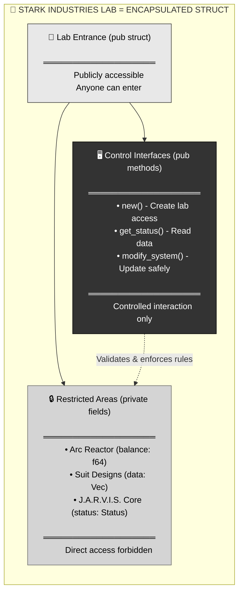
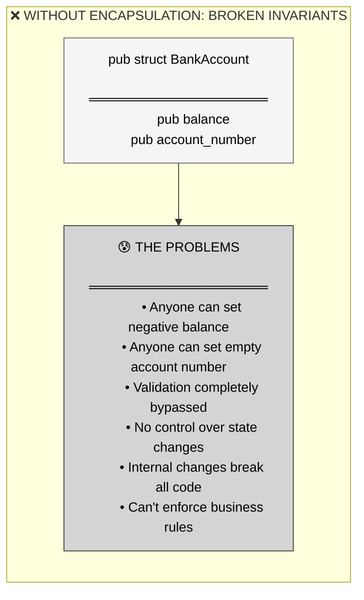
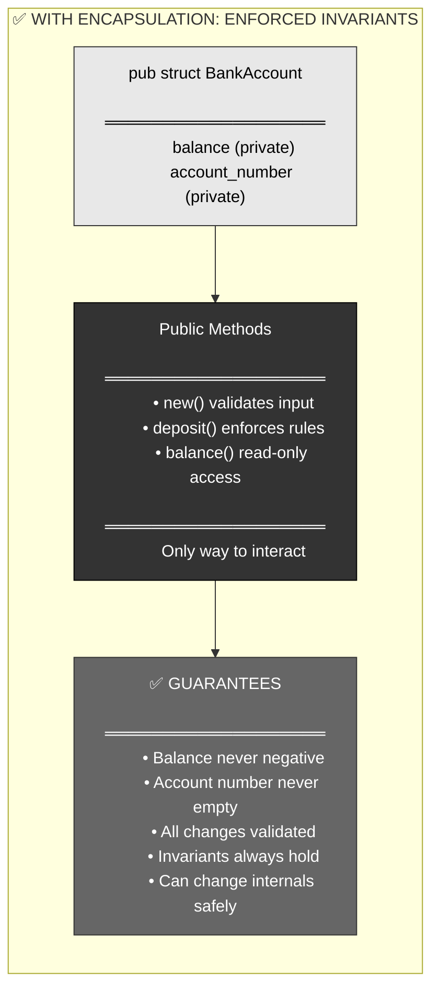
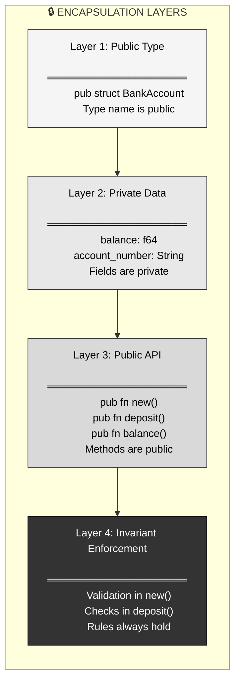
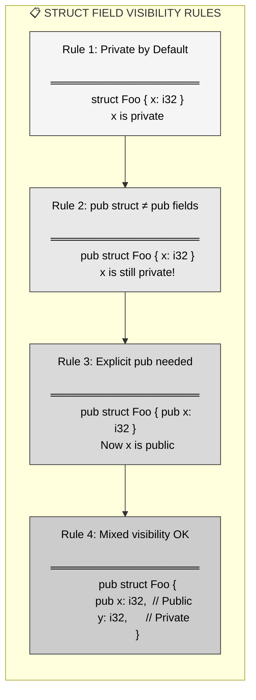
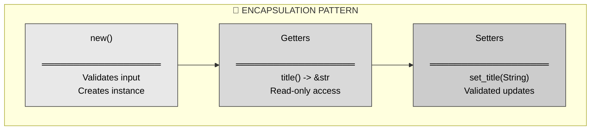
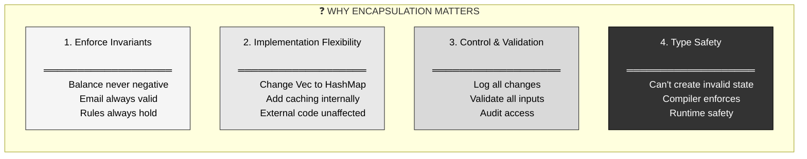
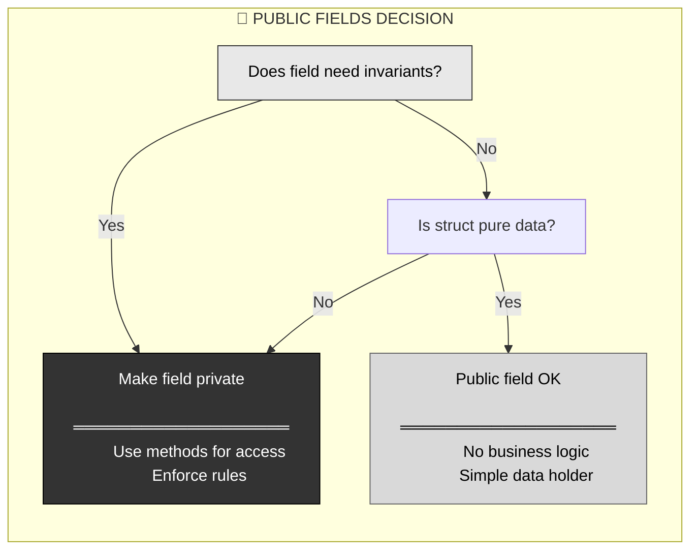
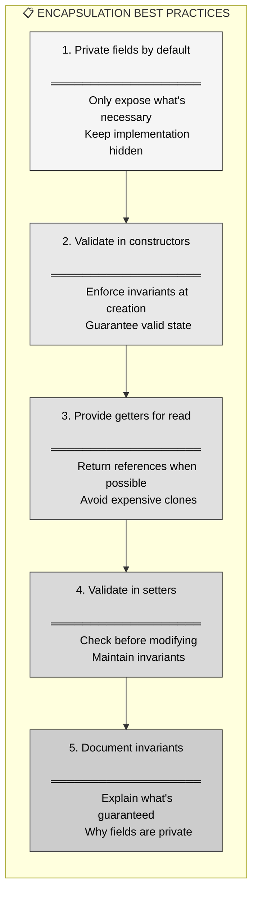
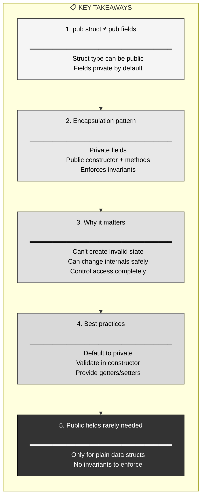

# R35: Rust Encapsulation - Public Structs with Private Fields

## The Answer (Minto Pyramid: Conclusion First)

**Encapsulation hides internal implementation details by making struct fields private while exposing a controlled public API through methods.**

A struct can be `pub` (publicly accessible type) while its fields remain private (inaccessible data). This forces all interaction through public methods (constructors, getters, setters), allowing you to enforce invariants, validate data, and change internal representation without breaking external code. The pattern: `pub struct` + private fields + `pub fn new()` + `pub` getters = encapsulation.

```rust
// The answer in code: Public struct, private fields
pub struct BankAccount {
    // Private fields - hidden from external code
    balance: f64,
    account_number: String,
}

impl BankAccount {
    // Public constructor - controlled creation
    pub fn new(account_number: String) -> BankAccount {
        BankAccount {
            balance: 0.0,
            account_number,
        }
    }
    
    // Public methods - controlled access
    pub fn deposit(&mut self, amount: f64) {
        if amount > 0.0 {
            self.balance += amount;
        }
    }
    
    pub fn balance(&self) -> f64 {
        self.balance  // Can't modify directly from outside!
    }
}

// Users can create and use, but can't break invariants
let mut account = BankAccount::new("12345".to_string());
account.deposit(100.0);
// account.balance = -500.0;  // ❌ Error: field is private!
```

---

## 🦸 MCU Metaphor: Stark Industries Lab Security

**Core Truth**: Encapsulation is like **Stark Industries' lab security** — Tony Stark's workshop is accessible (you can enter), but the arc reactor blueprints, J.A.R.V.I.S. core systems, and Iron Man suit schematics are locked away. You interact through controlled interfaces (J.A.R.V.I.S., authorized terminals), not by directly accessing the tech.



**The Mapping**:
- **Lab building** = `pub struct` (type is accessible)
- **Restricted areas** = Private fields (data is hidden)
- **Control interfaces** = Public methods (controlled access)
- **J.A.R.V.I.S. validation** = Invariant checks in methods
- **Security protocols** = Encapsulation enforcement

**Where the metaphor breaks**: Tony can override his own security; Rust's privacy is absolute at compile time. But the "public space with private internals" concept holds perfectly.

---

## Part 1: The Problem Without Encapsulation

### The Pain: Direct Field Access Breaks Invariants

Without private fields, anyone can break your carefully designed rules:

```rust
// ❌ BAD: Public struct with public fields
pub struct BankAccount {
    pub balance: f64,
    pub account_number: String,
}

impl BankAccount {
    pub fn new(account_number: String) -> BankAccount {
        BankAccount {
            balance: 0.0,
            account_number,
        }
    }
    
    pub fn deposit(&mut self, amount: f64) {
        if amount > 0.0 {
            self.balance += amount;
        }
    }
}

fn main() {
    let mut account = BankAccount::new("12345".to_string());
    account.deposit(100.0);
    
    // ❌ Nothing stops this disaster!
    account.balance = -10000.0;  // Negative balance!
    account.account_number = "".to_string();  // Empty account number!
    
    // Your validation logic is completely bypassed
    println!("Balance: {}", account.balance);  // Output: -10000
}
```



### Real Pain Points

1. **Invariants not enforced**: Rules you validated can be broken
2. **No control**: Can't track or log state changes
3. **Breaking changes**: Changing field names breaks all external code
4. **No abstraction**: Implementation details exposed
5. **Security issues**: Sensitive data directly accessible

---

## Part 2: The Solution - Private Fields

### Definition: Public Type, Private Data

Make the struct public but keep fields private:

```rust
// ✅ GOOD: Public struct with private fields
pub struct BankAccount {
    balance: f64,              // Private by default
    account_number: String,    // Private by default
}

impl BankAccount {
    // Public constructor - only way to create
    pub fn new(account_number: String) -> BankAccount {
        if account_number.is_empty() {
            panic!("Account number cannot be empty");
        }
        BankAccount {
            balance: 0.0,
            account_number,
        }
    }
    
    // Public method - controlled modification
    pub fn deposit(&mut self, amount: f64) {
        if amount <= 0.0 {
            panic!("Deposit amount must be positive");
        }
        self.balance += amount;
    }
    
    // Public getter - read-only access
    pub fn balance(&self) -> f64 {
        self.balance
    }
    
    pub fn account_number(&self) -> &str {
        &self.account_number
    }
}

fn main() {
    let mut account = BankAccount::new("12345".to_string());
    account.deposit(100.0);
    
    println!("Balance: {}", account.balance());  // ✅ Controlled access
    
    // account.balance = -10000.0;  // ❌ Compile error: field is private!
    // account.account_number = "".to_string();  // ❌ Compile error: field is private!
}
```



### Key Insight: Struct Visibility ≠ Field Visibility

**Critical distinction**:
- `pub struct Foo` = Type can be named/used externally
- Fields default to **private** even in `pub struct`
- Must explicitly mark fields `pub` if you want them accessible

---

## Part 3: Visual Mental Model - Encapsulation Layers



### Complete Example: Full Encapsulation

```rust
pub struct User {
    // All fields private
    username: String,
    email: String,
    age: u32,
}

impl User {
    // ═══════════════════════════════════════
    // Constructor: Validates everything
    // ═══════════════════════════════════════
    pub fn new(username: String, email: String, age: u32) -> User {
        if username.len() < 3 {
            panic!("Username too short");
        }
        if !email.contains('@') {
            panic!("Invalid email");
        }
        if age < 13 {
            panic!("User must be 13+");
        }
        User { username, email, age }
    }
    
    // ═══════════════════════════════════════
    // Getters: Read-only access
    // ═══════════════════════════════════════
    pub fn username(&self) -> &str {
        &self.username
    }
    
    pub fn email(&self) -> &str {
        &self.email
    }
    
    pub fn age(&self) -> u32 {
        self.age
    }
    
    // ═══════════════════════════════════════
    // Setter: Validated modification
    // ═══════════════════════════════════════
    pub fn set_email(&mut self, new_email: String) {
        if !new_email.contains('@') {
            panic!("Invalid email");
        }
        self.email = new_email;
    }
    
    // ═══════════════════════════════════════
    // Business logic: Uses private data
    // ═══════════════════════════════════════
    pub fn is_adult(&self) -> bool {
        self.age >= 18
    }
}

// Usage
let mut user = User::new("alice".to_string(), "alice@example.com".to_string(), 25);
println!("Username: {}", user.username());
println!("Is adult: {}", user.is_adult());
user.set_email("alice.smith@example.com".to_string());

// user.age = 5;  // ❌ Error: field is private
// user.email = "invalid".to_string();  // ❌ Error: field is private
```

---

## Part 4: Struct Field Visibility Rules



### Field Visibility Examples

```rust
// ═══════════════════════════════════════
// Example 1: All private (common for encapsulation)
// ═══════════════════════════════════════
pub struct FullyEncapsulated {
    data: Vec<String>,
    count: usize,
}

// ═══════════════════════════════════════
// Example 2: All public (rare, used for plain data)
// ═══════════════════════════════════════
pub struct Point {
    pub x: f64,
    pub y: f64,
}

// ═══════════════════════════════════════
// Example 3: Mixed (some public, some private)
// ═══════════════════════════════════════
pub struct Configuration {
    pub name: String,          // Public - users can access
    pub version: u32,          // Public - users can access
    internal_state: bool,      // Private - implementation detail
}

// ═══════════════════════════════════════
// Example 4: pub(crate) - visible within crate only
// ═══════════════════════════════════════
pub struct InternalConfig {
    pub(crate) data: String,   // Visible in crate, not external
    private_flag: bool,         // Truly private
}
```

---

## Part 5: The Encapsulation Pattern

### Pattern: Constructor + Getters + Validated Setters

```rust
pub struct Ticket {
    // Private fields
    title: String,
    description: String,
    status: String,
}

impl Ticket {
    // ═══════════════════════════════════════
    // Step 1: Validated constructor
    // ═══════════════════════════════════════
    pub fn new(title: String, description: String) -> Ticket {
        if title.is_empty() {
            panic!("Title cannot be empty");
        }
        if description.is_empty() {
            panic!("Description cannot be empty");
        }
        
        Ticket {
            title,
            description,
            status: "Open".to_string(),  // Default value
        }
    }
    
    // ═══════════════════════════════════════
    // Step 2: Getters for read access
    // ═══════════════════════════════════════
    pub fn title(&self) -> &str {
        &self.title
    }
    
    pub fn description(&self) -> &str {
        &self.description
    }
    
    pub fn status(&self) -> &str {
        &self.status
    }
    
    // ═══════════════════════════════════════
    // Step 3: Validated setters for modification
    // ═══════════════════════════════════════
    pub fn set_title(&mut self, new_title: String) {
        if new_title.is_empty() {
            panic!("Title cannot be empty");
        }
        self.title = new_title;
    }
    
    pub fn close(&mut self) {
        self.status = "Closed".to_string();
    }
}
```



---

## Part 6: Why Encapsulation Matters



### Benefit 1: Change Internal Representation

```rust
// Version 1: Store as Vec
pub struct UserList {
    users: Vec<String>,  // Private
}

impl UserList {
    pub fn new() -> UserList {
        UserList { users: Vec::new() }
    }
    
    pub fn add_user(&mut self, name: String) {
        self.users.push(name);
    }
    
    pub fn user_count(&self) -> usize {
        self.users.len()
    }
}

// Version 2: Change to HashMap (external code unaffected!)
use std::collections::HashMap;

pub struct UserList {
    users: HashMap<u64, String>,  // Changed implementation!
    next_id: u64,
}

impl UserList {
    pub fn new() -> UserList {
        UserList {
            users: HashMap::new(),
            next_id: 0,
        }
    }
    
    pub fn add_user(&mut self, name: String) {
        self.users.insert(self.next_id, name);
        self.next_id += 1;
    }
    
    pub fn user_count(&self) -> usize {
        self.users.len()  // Same API, different implementation!
    }
}

// External code doesn't break:
let mut list = UserList::new();
list.add_user("Alice".to_string());
println!("Count: {}", list.user_count());  // Still works!
```

### Benefit 2: Add Logging/Auditing

```rust
pub struct SecureData {
    value: String,
    access_count: usize,  // Track access
}

impl SecureData {
    pub fn new(value: String) -> SecureData {
        SecureData {
            value,
            access_count: 0,
        }
    }
    
    pub fn get_value(&mut self) -> &str {
        self.access_count += 1;  // Track every access
        println!("Data accessed {} times", self.access_count);
        &self.value
    }
}
```

---

## Part 7: Real-World Encapsulation Examples

### Example 1: Smart Pointer-like Type

```rust
pub struct SafeBuffer {
    data: Vec<u8>,
    max_size: usize,
}

impl SafeBuffer {
    pub fn new(max_size: usize) -> SafeBuffer {
        SafeBuffer {
            data: Vec::new(),
            max_size,
        }
    }
    
    pub fn push(&mut self, byte: u8) -> Result<(), String> {
        if self.data.len() >= self.max_size {
            return Err("Buffer full".to_string());
        }
        self.data.push(byte);
        Ok(())
    }
    
    pub fn len(&self) -> usize {
        self.data.len()
    }
    
    pub fn capacity(&self) -> usize {
        self.max_size
    }
    
    pub fn as_slice(&self) -> &[u8] {
        &self.data
    }
}
```

### Example 2: State Machine

```rust
pub struct Connection {
    state: ConnectionState,
    host: String,
}

enum ConnectionState {
    Disconnected,
    Connecting,
    Connected,
}

impl Connection {
    pub fn new(host: String) -> Connection {
        Connection {
            state: ConnectionState::Disconnected,
            host,
        }
    }
    
    pub fn connect(&mut self) {
        match self.state {
            ConnectionState::Disconnected => {
                println!("Connecting to {}", self.host);
                self.state = ConnectionState::Connected;
            }
            _ => println!("Already connected or connecting"),
        }
    }
    
    pub fn is_connected(&self) -> bool {
        matches!(self.state, ConnectionState::Connected)
    }
    
    pub fn disconnect(&mut self) {
        self.state = ConnectionState::Disconnected;
    }
}
```

### Example 3: Validated Email Type

```rust
pub struct Email {
    address: String,
}

impl Email {
    pub fn new(address: String) -> Result<Email, String> {
        if !address.contains('@') {
            return Err("Email must contain @".to_string());
        }
        
        let parts: Vec<&str> = address.split('@').collect();
        if parts.len() != 2 {
            return Err("Email must have one @".to_string());
        }
        
        if parts[0].is_empty() || parts[1].is_empty() {
            return Err("Email parts cannot be empty".to_string());
        }
        
        Ok(Email { address })
    }
    
    pub fn as_str(&self) -> &str {
        &self.address
    }
    
    pub fn domain(&self) -> &str {
        self.address.split('@').nth(1).unwrap()
    }
}

// Usage
match Email::new("alice@example.com".to_string()) {
    Ok(email) => println!("Email domain: {}", email.domain()),
    Err(e) => println!("Invalid email: {}", e),
}
```

---

## Part 8: When to Use Public Fields

### Rare Cases: When Public Fields Are OK

```rust
// ✅ GOOD: Plain data structs (no invariants)
pub struct Point {
    pub x: f64,
    pub y: f64,
}

// ✅ GOOD: Configuration with no validation
pub struct Color {
    pub r: u8,
    pub g: u8,
    pub b: u8,
}

// ✅ GOOD: Builder pattern intermediate
pub struct ConfigBuilder {
    pub host: String,
    pub port: u16,
}
```

### General Rule: Default to Private



**Default to private** unless you have a specific reason for public.

---

## Part 9: Encapsulation Best Practices



### Practice 1: Return References, Not Clones

```rust
pub struct User {
    name: String,
}

impl User {
    // ❌ BAD: Clones on every access (expensive)
    pub fn name_bad(&self) -> String {
        self.name.clone()
    }
    
    // ✅ GOOD: Returns reference (cheap)
    pub fn name(&self) -> &str {
        &self.name
    }
}
```

### Practice 2: Consider Builder for Many Fields

```rust
pub struct HttpRequest {
    method: String,
    url: String,
    headers: Vec<(String, String)>,
    body: Option<String>,
}

impl HttpRequest {
    pub fn builder() -> HttpRequestBuilder {
        HttpRequestBuilder::new()
    }
}

pub struct HttpRequestBuilder {
    method: Option<String>,
    url: Option<String>,
    headers: Vec<(String, String)>,
    body: Option<String>,
}

impl HttpRequestBuilder {
    fn new() -> HttpRequestBuilder {
        HttpRequestBuilder {
            method: None,
            url: None,
            headers: Vec::new(),
            body: None,
        }
    }
    
    pub fn method(mut self, method: String) -> Self {
        self.method = Some(method);
        self
    }
    
    pub fn url(mut self, url: String) -> Self {
        self.url = Some(url);
        self
    }
    
    pub fn header(mut self, key: String, value: String) -> Self {
        self.headers.push((key, value));
        self
    }
    
    pub fn body(mut self, body: String) -> Self {
        self.body = Some(body);
        self
    }
    
    pub fn build(self) -> Result<HttpRequest, String> {
        let method = self.method.ok_or("Method required")?;
        let url = self.url.ok_or("URL required")?;
        
        Ok(HttpRequest {
            method,
            url,
            headers: self.headers,
            body: self.body,
        })
    }
}

// Usage
let request = HttpRequest::builder()
    .method("GET".to_string())
    .url("https://example.com".to_string())
    .header("Authorization".to_string(), "Bearer token".to_string())
    .build()
    .expect("Failed to build request");
```

---

## Part 10: Cross-Language Comparison

### Rust vs Other Languages

```rust
// ═══════════════════════════════════════
// RUST: Compile-time field privacy
// ═══════════════════════════════════════
pub struct Account {
    balance: f64,  // Private
}

impl Account {
    pub fn new() -> Account {
        Account { balance: 0.0 }
    }
    
    pub fn balance(&self) -> f64 {
        self.balance
    }
}

// let mut acc = Account::new();
// acc.balance = 100.0;  // ❌ Compile error!
```

```python
# ═══════════════════════════════════════
# PYTHON: Convention-based privacy (not enforced)
# ═══════════════════════════════════════
class Account:
    def __init__(self):
        self._balance = 0.0  # _ means "private" (convention)
    
    @property
    def balance(self):
        return self._balance

acc = Account()
acc._balance = 100.0  # ⚠️ Works! Convention not enforced
```

```javascript
// ═══════════════════════════════════════
// JAVASCRIPT: # private fields (recent)
// ═══════════════════════════════════════
class Account {
    #balance = 0.0;  // Private field (ES2022+)
    
    getBalance() {
        return this.#balance;
    }
}

// let acc = new Account();
// acc.#balance = 100.0;  // ❌ Syntax error
```

```go
// ═══════════════════════════════════════
// GO: Package-level privacy
// ═══════════════════════════════════════
type Account struct {
    balance float64  // Lowercase = private to package
}

func NewAccount() Account {
    return Account{balance: 0.0}
}

func (a *Account) Balance() float64 {
    return a.balance
}

// Same package can access: acc.balance = 100.0
// Different package cannot
```

| Feature | Rust | Python | JavaScript | Go |
|:--------|:-----|:-------|:-----------|:---|
| **Field privacy** | ✅ Module-level | ❌ Convention | ✅ Class-level (#) | ✅ Package-level |
| **Enforced** | ✅ Compile-time | ❌ No | ✅ Runtime | ✅ Compile-time |
| **Bypass possible** | ❌ No | ✅ Yes | ⚠️ Reflection | ⚠️ Same package |
| **Struct vs fields** | ✅ Separate | N/A | ✅ Separate | ✅ Separate |

**Rust's advantage**: Compile-time enforcement with fine-grained control (per-field visibility).

---

## Part 11: Key Takeaways



### Essential Principles

1. **Struct visibility ≠ Field visibility**: `pub struct` has private fields by default
2. **Encapsulation = Private fields + Public API**: Control all access through methods
3. **Invariants enforced**: Validation in constructor/setters guarantees valid state
4. **Implementation flexibility**: Can change internals without breaking external code
5. **Compile-time safety**: Rust enforces privacy at compile time (no runtime bypass)
6. **Best practice: Private by default**: Only make fields public when truly needed
7. **Getters return references**: Avoid cloning when possible
8. **Builder pattern**: For structs with many optional fields

### The Stark Industries Metaphor Recap

Just like **Stark Industries' lab** is accessible (you can enter) but the arc reactor, suit designs, and J.A.R.V.I.S. core are locked away with access only through controlled interfaces (J.A.R.V.I.S., terminals), **Rust encapsulation** makes struct types public (`pub struct`) while keeping fields private, forcing all interaction through public methods that validate and enforce invariants.

**You now understand**:
- Why encapsulation matters (enforcing invariants, flexibility, control)
- How to encapsulate (private fields, public methods)
- When to encapsulate (almost always for non-trivial types)
- How to implement it (constructor + getters + validated setters)
- When public fields are OK (plain data with no invariants)
- Best practices (private by default, validate at boundaries, return references)

Encapsulation is fundamental to building robust Rust programs — it lets you enforce business rules at compile time, change implementation details without breaking clients, and design clean APIs that prevent misuse. Combined with Rust's ownership system, encapsulated types become incredibly powerful guarantees about your program's correctness. 🏢
