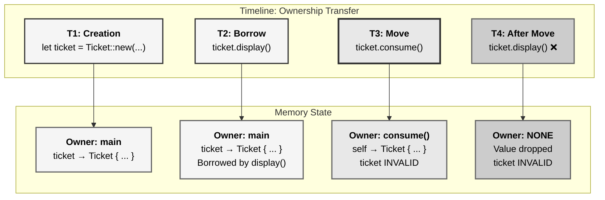
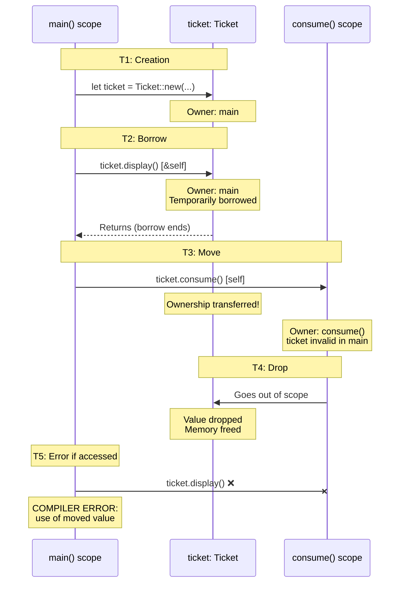
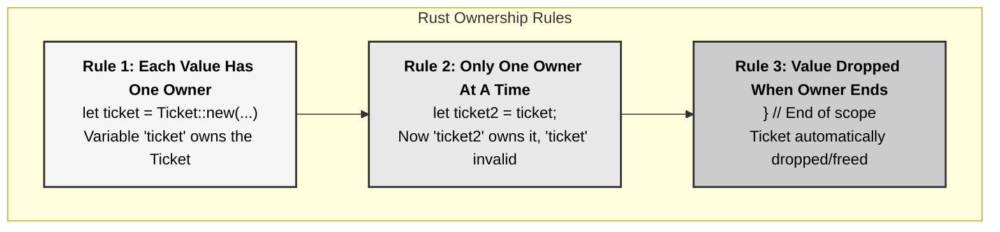
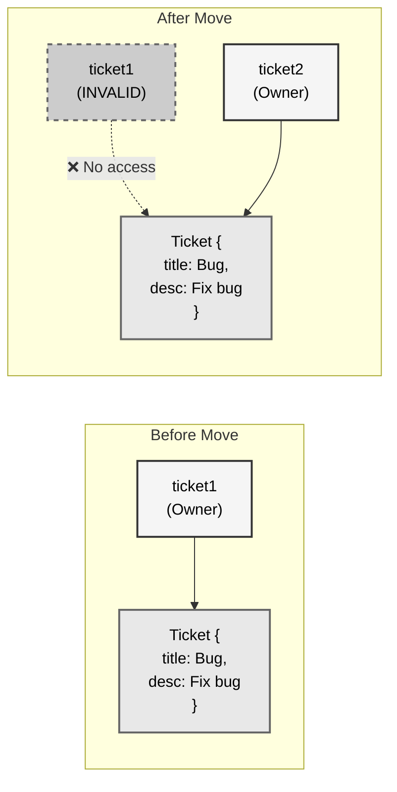
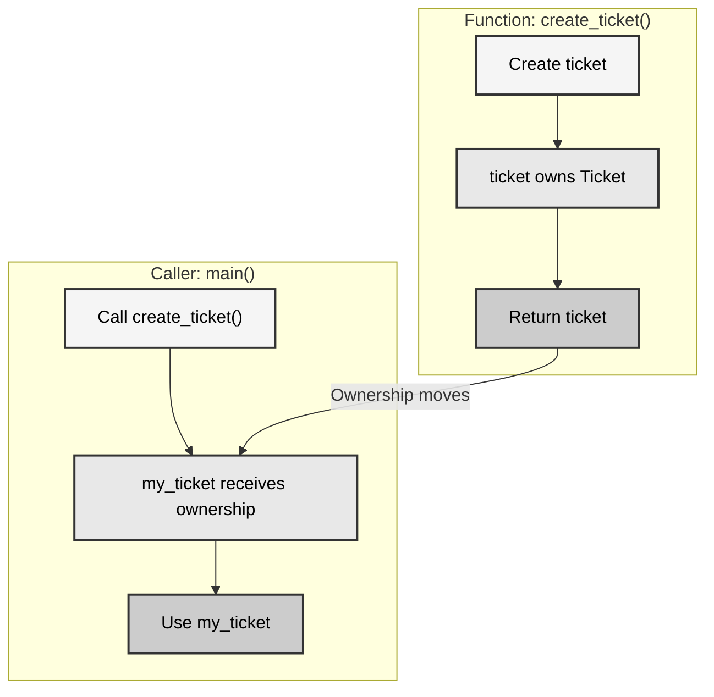
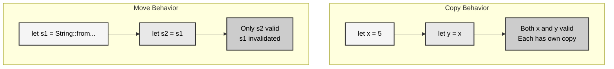
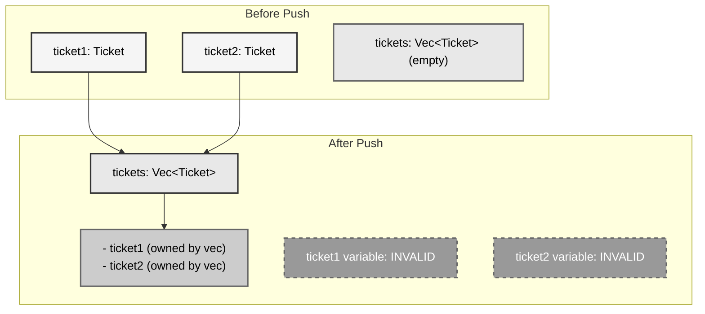
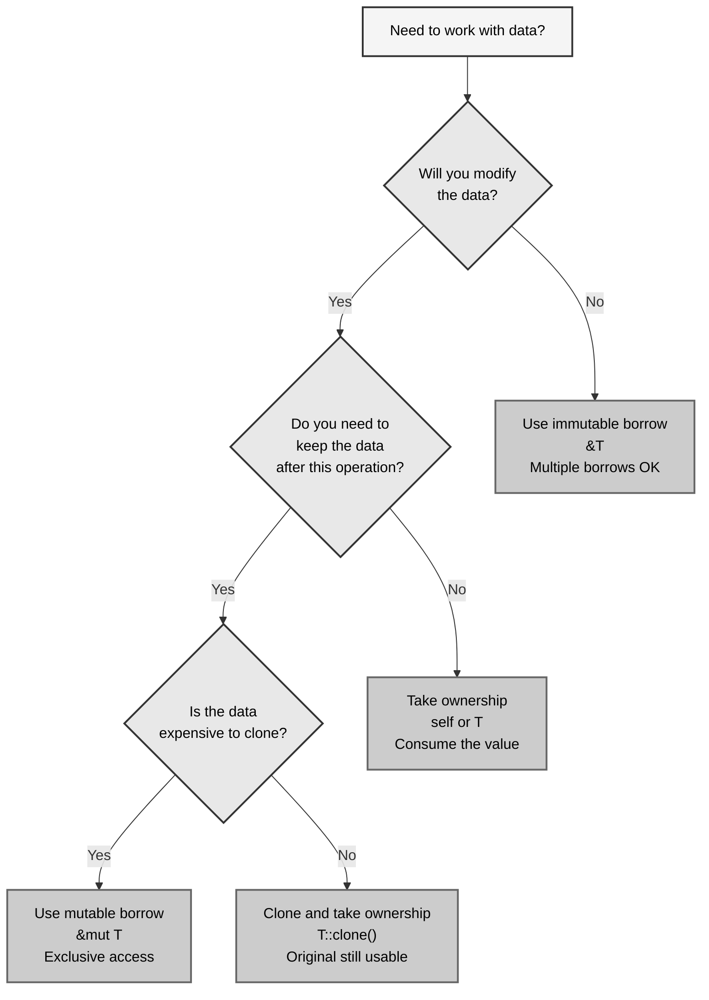
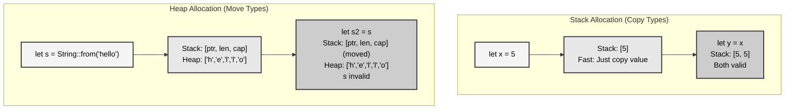
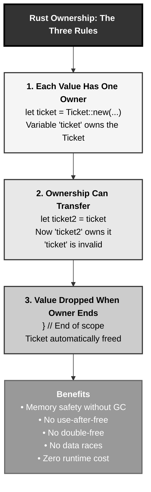

# Rust Ownership: The Infinity Stones Pattern

## The Answer (Minto Pyramid)

**Ownership is Rust's core memory management principle: every value has exactly one owner at a time, and ownership can be transferred but never shared for mutable data.**

When you call a method with `self` (not `&self`), ownership transfers to the function. The original owner can no longer use that value. This prevents use-after-free bugs, double-frees, and data races at compile time without needing a garbage collector.

**Three Supporting Principles:**

1. **Single Owner Rule**: Each value has exactly one owner variable at any moment
2. **Move Semantics**: Assignment and function calls transfer ownership by default (for non-Copy types)
3. **Compiler Enforcement**: The borrow checker prevents use-after-move at compile time

**Why This Matters**: Ownership eliminates entire classes of memory bugs that plague C/C++, while maintaining zero-runtime-cost abstractions. You get memory safety without garbage collection overhead.

---

## The MCU Metaphor: Infinity Stones

Think of Rust ownership like the Infinity Stones from the Marvel Universe:

### The Mapping

| Infinity Stones Concept | Rust Ownership Concept |
|------------------------|------------------------|
| **Each Stone has one wielder** | Each value has one owner |
| **Thanos takes the Stone from Vision** | `ticket.status()` with `self` moves ownership |
| **Vision can't use Stone after** | Original variable can't be used after move |
| **Stone's power stays with wielder** | Value's data stays with current owner |
| **Passing Stone = transfer of power** | Assignment/function call = ownership transfer |
| **Only wielder controls Stone** | Only owner can modify/drop value |
| **Ancient One lending Time Stone** | Borrowing with `&self` (temporary access) |
| **Stone destroyed when wielder dies** | Value dropped when owner goes out of scope |

### The Story

When Vision wields the Mind Stone, it's his alone. When Thanos rips it from Vision's forehead, ownership transfers completely. Vision can no longer access the Stone's power—attempting to do so would be catastrophic.

Similarly, when your code calls `ticket.status()` where `status(self)` takes ownership, the `ticket` variable transfers ownership to the function. Your original `ticket` binding can no longer access that value. The compiler prevents you from using it, just as the universe prevents Vision from wielding a Stone he no longer possesses.

This isn't a limitation—it's **protection**. The same transfer rules that prevent Vision from using a Stone twice prevent your code from accessing freed memory or causing data races.

---

## The Problem Without Ownership

Before understanding ownership, let's see what happens in languages without clear ownership rules:

```c path=null start=null
// C - Manual memory management nightmare
struct Ticket {
    char* title;
    char* description;
};

void process_ticket(struct Ticket* t) {
    // Do something with ticket
    free(t->title);
    free(t->description);
    free(t);  // Who should free this?
}

int main() {
    struct Ticket* ticket = malloc(sizeof(struct Ticket));
    ticket->title = strdup("Bug fix");
    ticket->description = strdup("Fix the thing");
    
    process_ticket(ticket);
    
    // Uh oh - is ticket still valid?
    // Should we free it? Was it already freed?
    // This compiles but might crash!
    printf("%s\n", ticket->title);  // Use-after-free bug!
    
    return 0;
}
```

**Problems:**

1. **Unclear Ownership**: Who owns the ticket? Who should free it?
2. **Use-After-Free**: Code accesses memory after it's freed
3. **Double-Free**: Multiple attempts to free the same memory
4. **Memory Leaks**: Forgetting to free allocated memory
5. **No Compiler Help**: All these bugs happen at runtime

```python path=null start=null
# Python - Garbage collector hides the problem
class Ticket:
    def __init__(self, title, description):
        self.title = title
        self.description = description

def process_ticket(ticket):
    # Do something with ticket
    # Python's GC will handle cleanup... eventually
    # But we pay runtime cost for GC
    pass

ticket = Ticket("Bug fix", "Fix the thing")
process_ticket(ticket)
# ticket still accessible - GC handles it
print(ticket.title)  # Works, but runtime overhead
```

**Problems:**

1. **Runtime Overhead**: Garbage collector runs during program execution
2. **Unpredictable Pauses**: GC can pause program at any time
3. **Memory Overhead**: GC requires extra memory to track objects
4. **No Clear Semantics**: When is memory actually freed? Unknown.

---

## The Solution: Ownership

Rust's ownership system provides memory safety without garbage collection:

```rust path=null start=null
struct Ticket {
    title: String,
    description: String,
}

impl Ticket {
    fn new(title: String, description: String) -> Self {
        Self { title, description }
    }
    
    // This method TAKES OWNERSHIP (note: self, not &self)
    fn consume(self) {
        println!("Consuming ticket: {}", self.title);
        // ticket is dropped here automatically
    }
    
    // This method BORROWS (note: &self)
    fn display(&self) {
        println!("Ticket: {}", self.title);
    }
}

fn main() {
    let ticket = Ticket::new(
        String::from("Bug fix"),
        String::from("Fix the thing")
    );
    
    // Borrowing - ticket still owned by main
    ticket.display();  // ✅ Works - just borrowing
    ticket.display();  // ✅ Works - can borrow multiple times
    
    // Moving ownership - ticket ownership transfers to consume()
    ticket.consume();  // Ownership moves here
    
    // ❌ COMPILER ERROR: ticket was moved
    // ticket.display();  // ERROR: value used here after move
}
```

**Compiler Output:**

```text path=null start=null
error[E0382]: borrow of moved value: `ticket`
  --> src/main.rs:XX:5
   |
   | let ticket = Ticket::new(...);
   |     ------ move occurs because `ticket` has type `Ticket`, 
   |            which does not implement the `Copy` trait
   | ticket.consume();
   |        --------- value moved here
   | ticket.display();
   |        ^^^^^^^ value borrowed here after move
```

The compiler **prevents** use-after-move at compile time!

---

## Visual Mental Model



### Ownership Transfer Diagram



### The Three Ownership Rules



---

## Anatomy of Ownership

### 1. Ownership Transfer (Move Semantics)

```rust path=null start=null
fn main() {
    let ticket1 = Ticket::new(
        String::from("Bug"),
        String::from("Fix bug")
    );
    
    // Move via assignment
    let ticket2 = ticket1;  // Ownership transfers to ticket2
    
    // ❌ ticket1 is now invalid
    // println!("{}", ticket1.title);  // ERROR: value used after move
    
    // ✅ ticket2 is valid
    println!("{}", ticket2.title);  // OK
}
```

**Memory Layout:**



### 2. Function Parameters and Ownership

```rust path=null start=null
// Takes ownership (self)
fn consume_ticket(ticket: Ticket) {
    println!("Title: {}", ticket.title);
    // ticket dropped here
}

// Borrows (& reference)
fn read_ticket(ticket: &Ticket) {
    println!("Title: {}", ticket.title);
    // No ownership transfer, ticket still valid in caller
}

fn main() {
    let ticket = Ticket::new(
        String::from("Feature"),
        String::from("Add feature")
    );
    
    // Borrow - ticket still valid after call
    read_ticket(&ticket);  // Pass reference
    read_ticket(&ticket);  // Can call multiple times
    
    // Move - ticket invalid after call
    consume_ticket(ticket);  // Move ownership
    // read_ticket(&ticket);  // ❌ ERROR: ticket moved
}
```

### 3. Method Signatures and Ownership

```rust path=null start=null
impl Ticket {
    // Takes ownership - consumes self
    fn into_string(self) -> String {
        format!("{}: {}", self.title, self.description)
    }
    
    // Borrows immutably - reads self
    fn get_title(&self) -> &str {
        &self.title
    }
    
    // Borrows mutably - modifies self
    fn set_title(&mut self, title: String) {
        self.title = title;
    }
}

fn main() {
    let mut ticket = Ticket::new(
        String::from("Bug"),
        String::from("Description")
    );
    
    // Immutable borrow
    let title = ticket.get_title();
    println!("Title: {}", title);
    
    // Mutable borrow
    ticket.set_title(String::from("Feature"));
    
    // Move ownership
    let summary = ticket.into_string();
    
    // ❌ ticket is gone now
    // ticket.get_title();  // ERROR: value used after move
    
    println!("Summary: {}", summary);
}
```

### 4. Return Values and Ownership

```rust path=null start=null
fn create_ticket() -> Ticket {
    let ticket = Ticket::new(
        String::from("New"),
        String::from("Description")
    );
    ticket  // Ownership moves to caller
}

fn main() {
    let my_ticket = create_ticket();  // Receives ownership
    println!("{}", my_ticket.title);  // ✅ Valid
}
```

**Ownership Flow:**



### 5. Copy vs Move Types

Some types implement the `Copy` trait and are copied instead of moved:

```rust path=null start=null
fn main() {
    // Integers implement Copy
    let x = 5;
    let y = x;  // x is COPIED, not moved
    println!("x: {}, y: {}", x, y);  // ✅ Both valid
    
    // Strings do NOT implement Copy
    let s1 = String::from("hello");
    let s2 = s1;  // s1 is MOVED, not copied
    // println!("{}", s1);  // ❌ ERROR: s1 moved
    println!("{}", s2);  // ✅ s2 valid
}
```

**Copy Types (Stack-Only Data):**
- All integer types: `i8`, `i16`, `i32`, `i64`, `i128`, `isize`, `u8`, etc.
- All floating-point types: `f32`, `f64`
- Boolean type: `bool`
- Character type: `char`
- Tuples containing only Copy types: `(i32, i32)`, `(bool, char)`
- Arrays of Copy types: `[i32; 5]`

**Move Types (Heap-Allocated Data):**
- `String`
- `Vec<T>`
- Custom structs (unless they derive `Copy`)
- Any type containing non-Copy fields



---

## Common Ownership Patterns

### Pattern 1: Consuming Builder Methods

```rust path=null start=null
struct TicketBuilder {
    title: Option<String>,
    description: Option<String>,
    priority: u8,
}

impl TicketBuilder {
    fn new() -> Self {
        Self {
            title: None,
            description: None,
            priority: 0,
        }
    }
    
    // Consumes self, returns new self (method chaining)
    fn title(mut self, title: String) -> Self {
        self.title = Some(title);
        self  // Return ownership
    }
    
    fn description(mut self, description: String) -> Self {
        self.description = Some(description);
        self
    }
    
    fn priority(mut self, priority: u8) -> Self {
        self.priority = priority;
        self
    }
    
    // Final consumption to build
    fn build(self) -> Result<Ticket, String> {
        let title = self.title.ok_or("Title required")?;
        let description = self.description.ok_or("Description required")?;
        Ok(Ticket { title, description })
    }
}

fn main() {
    // Each method consumes and returns builder
    let ticket = TicketBuilder::new()
        .title(String::from("Bug"))
        .description(String::from("Fix it"))
        .priority(1)
        .build()
        .unwrap();
    
    // Builder is consumed by build(), can't reuse
}
```

### Pattern 2: Option::take() for Ownership Transfer

```rust path=null start=null
struct Container {
    ticket: Option<Ticket>,
}

impl Container {
    fn extract_ticket(&mut self) -> Option<Ticket> {
        // take() moves ownership out, leaves None
        self.ticket.take()
    }
    
    fn has_ticket(&self) -> bool {
        self.ticket.is_some()
    }
}

fn main() {
    let mut container = Container {
        ticket: Some(Ticket::new(
            String::from("Task"),
            String::from("Do task")
        )),
    };
    
    println!("Has ticket: {}", container.has_ticket());  // true
    
    // Extract ownership
    let ticket = container.extract_ticket().unwrap();
    
    println!("Has ticket: {}", container.has_ticket());  // false
    println!("Ticket: {}", ticket.title);  // We own it now
}
```

### Pattern 3: Swap for Ownership Transfer

```rust path=null start=null
use std::mem;

struct TicketQueue {
    current: Option<Ticket>,
    next: Option<Ticket>,
}

impl TicketQueue {
    fn advance(&mut self) {
        // Move next to current, replace next with None
        self.current = mem::replace(&mut self.next, None);
    }
    
    fn swap_tickets(&mut self) {
        // Swap current and next
        mem::swap(&mut self.current, &mut self.next);
    }
}
```

### Pattern 4: Returning Self for Method Chaining

```rust path=null start=null
struct Ticket {
    title: String,
    description: String,
    priority: u8,
}

impl Ticket {
    // Borrows mutably, returns reference for chaining
    fn set_priority(&mut self, priority: u8) -> &mut Self {
        self.priority = priority;
        self
    }
    
    fn set_title(&mut self, title: String) -> &mut Self {
        self.title = title;
        self
    }
    
    fn set_description(&mut self, description: String) -> &mut Self {
        self.description = description;
        self
    }
}

fn main() {
    let mut ticket = Ticket {
        title: String::from("Bug"),
        description: String::from("Fix"),
        priority: 0,
    };
    
    // Method chaining with mutable borrows
    ticket
        .set_priority(1)
        .set_title(String::from("Feature"))
        .set_description(String::from("Add feature"));
    
    // ticket still valid - we borrowed, didn't move
    println!("{}", ticket.title);
}
```

### Pattern 5: Into Conversions

```rust path=null start=null
impl Ticket {
    // Consume self, return different type
    fn into_summary(self) -> String {
        format!("[{}] {}", self.title, self.description)
    }
}

fn main() {
    let ticket = Ticket::new(
        String::from("Bug"),
        String::from("Fix bug")
    );
    
    // Convert ticket into string, consuming it
    let summary: String = ticket.into_summary();
    
    // ticket is gone
    println!("{}", summary);
}
```

---

## Ownership in Different Contexts

### Context 1: Collections and Ownership

```rust path=null start=null
fn main() {
    let mut tickets = Vec::new();
    
    let ticket1 = Ticket::new(
        String::from("Bug 1"),
        String::from("Description 1")
    );
    let ticket2 = Ticket::new(
        String::from("Bug 2"),
        String::from("Description 2")
    );
    
    // Vec takes ownership
    tickets.push(ticket1);  // ticket1 moved into vec
    tickets.push(ticket2);  // ticket2 moved into vec
    
    // ❌ Can't use ticket1 or ticket2 anymore
    // println!("{}", ticket1.title);  // ERROR
    
    // Access through vec
    println!("{}", tickets[0].title);  // ✅ OK
    
    // Remove transfers ownership back out
    let removed = tickets.pop().unwrap();
    println!("{}", removed.title);  // We own it now
}
```

**Vector Ownership Model:**



### Context 2: Closures and Ownership

```rust path=null start=null
fn main() {
    let ticket = Ticket::new(
        String::from("Bug"),
        String::from("Fix bug")
    );
    
    // Closure borrows ticket
    let print_ticket = || {
        println!("{}", ticket.title);
    };
    
    print_ticket();  // ✅ OK
    print_ticket();  // ✅ OK - can call multiple times
    
    // ticket still valid
    println!("{}", ticket.title);  // ✅ OK
    
    // Closure that moves ticket
    let consume_ticket = move || {
        println!("{}", ticket.title);
        // ticket moved into closure
    };
    
    consume_ticket();  // ✅ OK
    // ❌ ticket moved into closure
    // println!("{}", ticket.title);  // ERROR
}
```

### Context 3: Struct Field Ownership

```rust path=null start=null
struct TicketSystem {
    active: Vec<Ticket>,
    archived: Vec<Ticket>,
}

impl TicketSystem {
    fn new() -> Self {
        Self {
            active: Vec::new(),
            archived: Vec::new(),
        }
    }
    
    fn add_ticket(&mut self, ticket: Ticket) {
        // System takes ownership
        self.active.push(ticket);
    }
    
    fn archive_ticket(&mut self, index: usize) -> Result<(), String> {
        if index >= self.active.len() {
            return Err(String::from("Invalid index"));
        }
        
        // Move ticket from active to archived
        let ticket = self.active.remove(index);
        self.archived.push(ticket);
        Ok(())
    }
    
    fn get_active_count(&self) -> usize {
        self.active.len()
    }
}

fn main() {
    let mut system = TicketSystem::new();
    
    let ticket = Ticket::new(
        String::from("Bug"),
        String::from("Description")
    );
    
    // Transfer ownership to system
    system.add_ticket(ticket);
    
    // ticket is gone
    // println!("{}", ticket.title);  // ❌ ERROR
    
    println!("Active: {}", system.get_active_count());  // 1
    
    system.archive_ticket(0).unwrap();
    
    println!("Active: {}", system.get_active_count());  // 0
}
```

---

## The Compiler's Error Messages

Understanding ownership errors is crucial. The compiler provides detailed explanations:

### Error 1: Use of Moved Value

```rust path=null start=null
fn main() {
    let ticket = Ticket::new(
        String::from("Bug"),
        String::from("Description")
    );
    
    let ticket2 = ticket;  // Move here
    
    println!("{}", ticket.title);  // ❌ ERROR
}
```

**Compiler Output:**

```text path=null start=null
error[E0382]: borrow of moved value: `ticket`
  --> src/main.rs:XX:20
   |
   | let ticket = Ticket::new(...);
   |     ------ move occurs because `ticket` has type `Ticket`,
   |            which does not implement the `Copy` trait
   | let ticket2 = ticket;
   |               ------ value moved here
   | println!("{}", ticket.title);
   |                ^^^^^^^^^^^^ value borrowed here after move
   |
   = note: consider using a reference instead: `&ticket`
```

**What This Means:**
1. `ticket` has type `Ticket` which doesn't implement `Copy`
2. Assignment moved ownership to `ticket2`
3. `ticket` is now invalid
4. Attempting to use `ticket.title` is illegal

**Solution:** Either use a reference or clone:

```rust path=null start=null
// Solution 1: Use reference
let ticket2 = &ticket;
println!("{}", ticket.title);  // ✅ OK

// Solution 2: Clone (if Ticket derives Clone)
let ticket2 = ticket.clone();
println!("{}", ticket.title);  // ✅ OK - both valid
```

### Error 2: Value Used After Partial Move

```rust path=null start=null
struct Container {
    ticket: Ticket,
    id: u32,
}

fn main() {
    let container = Container {
        ticket: Ticket::new(
            String::from("Bug"),
            String::from("Fix")
        ),
        id: 1,
    };
    
    let ticket = container.ticket;  // Partial move
    
    // ❌ Can't use container anymore
    println!("{}", container.id);  // ERROR
}
```

**Compiler Output:**

```text path=null start=null
error[E0382]: borrow of partially moved value: `container`
  --> src/main.rs:XX:20
   |
   | let ticket = container.ticket;
   |              ---------------- value partially moved here
   | println!("{}", container.id);
   |                ^^^^^^^^^^^^ value borrowed here after partial move
   |
   = note: partial move occurs because `container.ticket` has type `Ticket`,
           which does not implement the `Copy` trait
```

**What This Means:**
- Moving one field partially moves the entire struct
- Even though `id` is `Copy`, the whole struct is considered moved

**Solution:** Borrow or restructure:

```rust path=null start=null
// Solution 1: Borrow the field
let ticket = &container.ticket;
println!("{}", container.id);  // ✅ OK

// Solution 2: Move all fields
let Container { ticket, id } = container;
println!("Ticket: {}, ID: {}", ticket.title, id);  // ✅ OK
```

### Error 3: Moving Out of Borrow

```rust path=null start=null
fn process_ticket(ticket: &Ticket) {
    let owned = *ticket;  // ❌ Can't move out of borrowed content
}
```

**Compiler Output:**

```text path=null start=null
error[E0507]: cannot move out of `*ticket` which is behind a shared reference
  --> src/main.rs:XX:17
   |
   | let owned = *ticket;
   |             ^^^^^^^
   |             |
   |             move occurs because `*ticket` has type `Ticket`,
   |             which does not implement the `Copy` trait
   |             help: consider borrowing here: `&*ticket`
```

**What This Means:**
- You have a reference (`&Ticket`)
- You can't move ownership from a reference
- References don't own the data

**Solution:** Clone if you need ownership:

```rust path=null start=null
fn process_ticket(ticket: &Ticket) {
    let owned = ticket.clone();  // ✅ Clone instead of move
}
```

---

## Real-World Use Cases

### Use Case 1: State Machines with Typestate Pattern

```rust path=null start=null
// Different states are different types
struct Draft;
struct Review;
struct Published;

struct Article<State> {
    title: String,
    content: String,
    state: std::marker::PhantomData<State>,
}

impl Article<Draft> {
    fn new(title: String) -> Self {
        Self {
            title,
            content: String::new(),
            state: std::marker::PhantomData,
        }
    }
    
    fn write_content(mut self, content: String) -> Self {
        self.content = content;
        self
    }
    
    // Consume Draft, return Review
    fn submit_for_review(self) -> Article<Review> {
        Article {
            title: self.title,
            content: self.content,
            state: std::marker::PhantomData,
        }
    }
}

impl Article<Review> {
    // Consume Review, return Published
    fn approve(self) -> Article<Published> {
        Article {
            title: self.title,
            content: self.content,
            state: std::marker::PhantomData,
        }
    }
    
    // Consume Review, return Draft
    fn request_changes(self) -> Article<Draft> {
        Article {
            title: self.title,
            content: self.content,
            state: std::marker::PhantomData,
        }
    }
}

impl Article<Published> {
    fn get_url(&self) -> String {
        format!("https://example.com/{}", self.title)
    }
}

fn main() {
    let article = Article::<Draft>::new(String::from("Rust Ownership"));
    
    let article = article.write_content(String::from("Content here..."));
    
    // Can only submit draft for review
    let article = article.submit_for_review();
    
    // ❌ Can't write content in review state
    // let article = article.write_content(String::from("More"));  // ERROR
    
    // Must either approve or request changes
    let article = article.approve();
    
    // Only published articles have URLs
    println!("URL: {}", article.get_url());
}
```

**Benefits:**
- Compiler enforces state transitions
- Can't call wrong methods in wrong states
- No runtime state checking needed

### Use Case 2: Builder Pattern with Compile-Time Validation

```rust path=null start=null
struct NoTitle;
struct HasTitle;
struct NoDescription;
struct HasDescription;

struct TicketBuilder<T, D> {
    title: Option<String>,
    description: Option<String>,
    _title_state: std::marker::PhantomData<T>,
    _desc_state: std::marker::PhantomData<D>,
}

impl TicketBuilder<NoTitle, NoDescription> {
    fn new() -> Self {
        Self {
            title: None,
            description: None,
            _title_state: std::marker::PhantomData,
            _desc_state: std::marker::PhantomData,
        }
    }
}

impl<D> TicketBuilder<NoTitle, D> {
    fn title(self, title: String) -> TicketBuilder<HasTitle, D> {
        TicketBuilder {
            title: Some(title),
            description: self.description,
            _title_state: std::marker::PhantomData,
            _desc_state: std::marker::PhantomData,
        }
    }
}

impl<T> TicketBuilder<T, NoDescription> {
    fn description(self, description: String) -> TicketBuilder<T, HasDescription> {
        TicketBuilder {
            title: self.title,
            description: Some(description),
            _title_state: std::marker::PhantomData,
            _desc_state: std::marker::PhantomData,
        }
    }
}

impl TicketBuilder<HasTitle, HasDescription> {
    // Only available when both title and description are set
    fn build(self) -> Ticket {
        Ticket {
            title: self.title.unwrap(),
            description: self.description.unwrap(),
        }
    }
}

fn main() {
    let ticket = TicketBuilder::new()
        .title(String::from("Bug"))
        .description(String::from("Fix bug"))
        .build();  // ✅ Compiles
    
    // ❌ This won't compile - missing description
    // let ticket = TicketBuilder::new()
    //     .title(String::from("Bug"))
    //     .build();  // ERROR: build() not available
}
```

### Use Case 3: Resource Management (RAII)

```rust path=null start=null
use std::fs::File;
use std::io::Write;

struct Logger {
    file: File,
}

impl Logger {
    fn new(path: &str) -> std::io::Result<Self> {
        let file = File::create(path)?;
        Ok(Self { file })
    }
    
    fn log(&mut self, message: &str) -> std::io::Result<()> {
        writeln!(self.file, "{}", message)
    }
    
    // Consume self, close file explicitly
    fn close(mut self) -> std::io::Result<()> {
        self.file.flush()?;
        // File closed when self is dropped
        Ok(())
    }
}

impl Drop for Logger {
    fn drop(&mut self) {
        let _ = self.file.flush();
        println!("Logger dropped, file closed");
    }
}

fn main() -> std::io::Result<()> {
    let mut logger = Logger::new("log.txt")?;
    
    logger.log("Starting application")?;
    logger.log("Processing data")?;
    
    // Explicit close consumes logger
    logger.close()?;
    
    // ❌ Can't use logger after close
    // logger.log("After close")?;  // ERROR: logger moved
    
    Ok(())
}
```

### Use Case 4: Safe API Design

```rust path=null start=null
struct Database {
    connection: String,
}

impl Database {
    fn connect(url: &str) -> Self {
        println!("Connecting to {}", url);
        Self {
            connection: url.to_string(),
        }
    }
    
    fn disconnect(self) {
        println!("Disconnecting from {}", self.connection);
        // Connection closed
    }
}

struct Transaction<'a> {
    db: &'a mut Database,
    committed: bool,
}

impl<'a> Transaction<'a> {
    fn new(db: &'a mut Database) -> Self {
        println!("Starting transaction");
        Self {
            db,
            committed: false,
        }
    }
    
    fn execute(&mut self, query: &str) {
        println!("Executing: {}", query);
    }
    
    fn commit(mut self) {
        println!("Committing transaction");
        self.committed = true;
        // Transaction consumed - can't use again
    }
    
    fn rollback(self) {
        println!("Rolling back transaction");
        // Transaction consumed - can't use again
    }
}

impl<'a> Drop for Transaction<'a> {
    fn drop(&mut self) {
        if !self.committed {
            println!("Transaction not committed - auto rollback");
        }
    }
}

fn main() {
    let mut db = Database::connect("localhost:5432");
    
    // Start transaction
    let mut tx = Transaction::new(&mut db);
    tx.execute("INSERT INTO tickets ...");
    tx.commit();  // Transaction consumed
    
    // ❌ Can't use tx after commit
    // tx.execute("SELECT ...");  // ERROR: tx moved
    
    // Can start new transaction
    let tx2 = Transaction::new(&mut db);
    // tx2 dropped without commit - auto rollback
    
    db.disconnect();
}
```

---

## When to Use Ownership vs Borrowing



### Decision Matrix

| Scenario | Use | Example |
|----------|-----|---------|
| **Read-only access** | `&T` | `fn print_ticket(t: &Ticket)` |
| **Modify but keep** | `&mut T` | `fn update_title(t: &mut Ticket, title: String)` |
| **Consume/transform** | `T` | `fn into_string(self) -> String` |
| **Builder methods** | `self` → `Self` | `fn title(mut self, t: String) -> Self` |
| **Need multiple owners** | `Rc<T>` / `Arc<T>` | `let shared = Arc::new(config)` |
| **Thread-safe mutation** | `Arc<Mutex<T>>` | `let counter = Arc::new(Mutex::new(0))` |

---

## Comparing Ownership Across Languages

### Rust vs C++

```cpp path=null start=null
// C++ - Manual memory management
class Ticket {
    std::string title;
public:
    Ticket(std::string t) : title(t) {}
    
    // Must explicitly define copy/move behavior
    Ticket(const Ticket& other) : title(other.title) {}  // Copy
    Ticket(Ticket&& other) : title(std::move(other.title)) {}  // Move
    
    ~Ticket() { /* Cleanup */ }
};

void process_ticket(Ticket ticket) {  // Copy by default!
    // ticket is copied - expensive
}

void process_ticket_ref(const Ticket& ticket) {  // Reference
    // More efficient, but no compiler enforcement of lifetime
}

int main() {
    Ticket ticket("Bug");
    process_ticket(ticket);  // Copies ticket
    // ticket still valid - but at what cost?
    
    Ticket* ptr = new Ticket("Bug2");
    process_ticket(*ptr);
    delete ptr;  // Must manually free - easy to forget!
    
    return 0;
}
```

**Rust Equivalent:**

```rust path=null start=null
struct Ticket {
    title: String,
}

fn process_ticket(ticket: Ticket) {
    // Takes ownership - move, not copy
}

fn process_ticket_ref(ticket: &Ticket) {
    // Borrows - compiler enforces lifetime
}

fn main() {
    let ticket = Ticket {
        title: String::from("Bug"),
    };
    
    process_ticket(ticket);  // Moves ticket
    // ticket invalid now - compiler prevents use
    
    let ticket2 = Ticket {
        title: String::from("Bug2"),
    };
    // No manual memory management needed
    // Dropped automatically at end of scope
}
```

**Key Differences:**

| Aspect | C++ | Rust |
|--------|-----|------|
| **Default parameter passing** | Copy (expensive) | Move (cheap) |
| **Memory management** | Manual `new`/`delete` | Automatic RAII |
| **Lifetime safety** | Runtime errors | Compile-time errors |
| **Move semantics** | Opt-in (`std::move`) | Default for non-Copy types |
| **Copy semantics** | Default (can be expensive) | Opt-in (`Clone` trait) |

### Rust vs Java

```java path=null start=null
// Java - Garbage collected
class Ticket {
    private String title;
    
    public Ticket(String title) {
        this.title = title;
    }
    
    public String getTitle() {
        return title;
    }
}

public class Main {
    public static void processTicket(Ticket ticket) {
        // ticket is a reference - object not copied
        System.out.println(ticket.getTitle());
        // Object still accessible from caller
    }
    
    public static void main(String[] args) {
        Ticket ticket = new Ticket("Bug");
        processTicket(ticket);
        // ticket still valid - GC handles cleanup
        System.out.println(ticket.getTitle());  // Still works
        
        // No explicit cleanup needed
        // GC will collect ticket eventually
    }
}
```

**Rust Equivalent:**

```rust path=null start=null
struct Ticket {
    title: String,
}

fn process_ticket(ticket: &Ticket) {
    println!("{}", ticket.title);
}

fn main() {
    let ticket = Ticket {
        title: String::from("Bug"),
    };
    
    process_ticket(&ticket);  // Explicit borrow
    println!("{}", ticket.title);  // Still valid
    
    // Dropped at end of scope - deterministic
}
```

**Key Differences:**

| Aspect | Java | Rust |
|--------|-----|------|
| **Memory management** | Garbage collector | RAII + ownership |
| **Performance** | GC pauses | Zero-cost abstractions |
| **Reference tracking** | Runtime | Compile-time |
| **Cleanup timing** | Non-deterministic | Deterministic |
| **Memory overhead** | GC metadata | None |

### Rust vs Python

```python path=null start=null
# Python - Reference counting + GC
class Ticket:
    def __init__(self, title):
        self.title = title
    
    def __del__(self):
        print(f"Deleting ticket: {self.title}")

def process_ticket(ticket):
    # ticket is a reference
    print(ticket.title)
    # Reference count increases
    # Original still valid

def main():
    ticket = Ticket("Bug")
    process_ticket(ticket)
    # ticket still valid
    print(ticket.title)
    
    # ticket deleted when reference count hits 0
    # Timing is non-deterministic

if __name__ == "__main__":
    main()
```

**Rust Equivalent:**

```rust path=null start=null
struct Ticket {
    title: String,
}

impl Drop for Ticket {
    fn drop(&mut self) {
        println!("Dropping ticket: {}", self.title);
    }
}

fn process_ticket(ticket: &Ticket) {
    println!("{}", ticket.title);
}

fn main() {
    let ticket = Ticket {
        title: String::from("Bug"),
    };
    
    process_ticket(&ticket);
    println!("{}", ticket.title);
    
    // Dropped here - deterministic timing
}
```

**Key Differences:**

| Aspect | Python | Rust |
|--------|--------|------|
| **Memory management** | Ref counting + GC | Ownership |
| **Type safety** | Runtime | Compile-time |
| **Performance** | Interpreted + GC overhead | Native + zero overhead |
| **Cleanup timing** | When refcount = 0 (unpredictable) | End of scope (predictable) |
| **Thread safety** | GIL (limited) | Guaranteed by type system |

---

## Advanced Ownership Concepts

### Concept 1: Interior Mutability

Sometimes you need to mutate data through shared references:

```rust path=null start=null
use std::cell::RefCell;

struct TicketCounter {
    count: RefCell<u32>,
}

impl TicketCounter {
    fn new() -> Self {
        Self {
            count: RefCell::new(0),
        }
    }
    
    // Takes &self but mutates interior
    fn increment(&self) {
        *self.count.borrow_mut() += 1;
    }
    
    fn get(&self) -> u32 {
        *self.count.borrow()
    }
}

fn main() {
    let counter = TicketCounter::new();
    
    counter.increment();  // &self but mutates!
    counter.increment();
    
    println!("Count: {}", counter.get());  // 2
}
```

### Concept 2: Smart Pointers

```rust path=null start=null
use std::rc::Rc;
use std::sync::Arc;
use std::thread;

// Rc - Single-threaded reference counting
fn rc_example() {
    let ticket = Rc::new(Ticket::new(
        String::from("Shared"),
        String::from("Multiple owners")
    ));
    
    let ticket2 = Rc::clone(&ticket);  // Increment ref count
    let ticket3 = Rc::clone(&ticket);  // Increment ref count
    
    println!("Ref count: {}", Rc::strong_count(&ticket));  // 3
    
    // All three references valid
    println!("{}", ticket.title);
    println!("{}", ticket2.title);
    println!("{}", ticket3.title);
    
    // Dropped when last Rc is dropped
}

// Arc - Thread-safe reference counting
fn arc_example() {
    let ticket = Arc::new(Ticket::new(
        String::from("Shared"),
        String::from("Thread-safe")
    ));
    
    let ticket2 = Arc::clone(&ticket);
    
    let handle = thread::spawn(move || {
        println!("Thread: {}", ticket2.title);
    });
    
    println!("Main: {}", ticket.title);
    
    handle.join().unwrap();
}
```

### Concept 3: Lifetime Elision

The compiler infers lifetimes in simple cases:

```rust path=null start=null
// Explicit lifetimes
fn longest<'a>(x: &'a str, y: &'a str) -> &'a str {
    if x.len() > y.len() { x } else { y }
}

// Lifetime elision - compiler infers
fn first_word(s: &str) -> &str {
    &s[..1]
}

// Equivalent to:
fn first_word_explicit<'a>(s: &'a str) -> &'a str {
    &s[..1]
}
```

---

## Common Pitfalls and Solutions

### Pitfall 1: Trying to Use Value After Move

```rust path=null start=null
// ❌ WRONG
fn main() {
    let ticket = Ticket::new(String::from("Bug"), String::from("Fix"));
    process(ticket);
    println!("{}", ticket.title);  // ERROR: value used after move
}

// ✅ SOLUTION 1: Pass reference
fn main() {
    let ticket = Ticket::new(String::from("Bug"), String::from("Fix"));
    process(&ticket);
    println!("{}", ticket.title);  // OK
}

// ✅ SOLUTION 2: Clone
fn main() {
    let ticket = Ticket::new(String::from("Bug"), String::from("Fix"));
    process(ticket.clone());
    println!("{}", ticket.title);  // OK
}

// ✅ SOLUTION 3: Return ownership
fn process_and_return(ticket: Ticket) -> Ticket {
    // do something
    ticket  // Return ownership
}

fn main() {
    let ticket = Ticket::new(String::from("Bug"), String::from("Fix"));
    let ticket = process_and_return(ticket);
    println!("{}", ticket.title);  // OK
}
```

### Pitfall 2: Partial Moves

```rust path=null start=null
// ❌ WRONG
struct Container {
    ticket: Ticket,
    id: u32,
}

fn main() {
    let container = Container {
        ticket: Ticket::new(String::from("Bug"), String::from("Fix")),
        id: 1,
    };
    
    let ticket = container.ticket;  // Partial move
    println!("{}", container.id);  // ERROR: container partially moved
}

// ✅ SOLUTION 1: Destructure completely
fn main() {
    let container = Container {
        ticket: Ticket::new(String::from("Bug"), String::from("Fix")),
        id: 1,
    };
    
    let Container { ticket, id } = container;
    println!("Ticket: {}, ID: {}", ticket.title, id);  // OK
}

// ✅ SOLUTION 2: Use references
fn main() {
    let container = Container {
        ticket: Ticket::new(String::from("Bug"), String::from("Fix")),
        id: 1,
    };
    
    let ticket_ref = &container.ticket;
    println!("{}", ticket_ref.title);
    println!("{}", container.id);  // OK
}
```

### Pitfall 3: Fighting the Borrow Checker

```rust path=null start=null
// ❌ WRONG - trying to return reference to local
fn create_ticket_ref() -> &Ticket {
    let ticket = Ticket::new(String::from("Bug"), String::from("Fix"));
    &ticket  // ERROR: ticket dropped at end of function
}

// ✅ SOLUTION: Return owned value
fn create_ticket() -> Ticket {
    Ticket::new(String::from("Bug"), String::from("Fix"))
}

// ❌ WRONG - multiple mutable borrows
fn main() {
    let mut ticket = Ticket::new(String::from("Bug"), String::from("Fix"));
    let ref1 = &mut ticket;
    let ref2 = &mut ticket;  // ERROR: cannot borrow as mutable twice
    ref1.set_title(String::from("Feature"));
    ref2.set_title(String::from("Task"));
}

// ✅ SOLUTION: Don't overlap mutable borrows
fn main() {
    let mut ticket = Ticket::new(String::from("Bug"), String::from("Fix"));
    {
        let ref1 = &mut ticket;
        ref1.set_title(String::from("Feature"));
    }  // ref1 dropped here
    {
        let ref2 = &mut ticket;  // OK now
        ref2.set_title(String::from("Task"));
    }
}
```

---

## Performance Implications

### Stack vs Heap Allocation



### Zero-Cost Abstractions

Rust's ownership system has **zero runtime cost**:

```rust path=null start=null
// This Rust code:
fn process(ticket: Ticket) {
    println!("{}", ticket.title);
}

fn main() {
    let ticket = Ticket::new(String::from("Bug"), String::from("Fix"));
    process(ticket);
}

// Compiles to machine code equivalent to:
// 1. Allocate ticket on stack
// 2. Pass pointer to function
// 3. Free ticket when function returns
//
// No runtime ownership tracking!
// No garbage collector!
// Just pure, efficient machine code!
```

**Comparison:**

| Language | Runtime Cost | Memory Safety |
|----------|--------------|---------------|
| **Rust** | Zero | Compile-time guaranteed |
| **C/C++** | Zero | Manual (error-prone) |
| **Java** | GC overhead | Runtime guaranteed |
| **Python** | Ref counting + GC | Runtime guaranteed |
| **Go** | GC overhead | Runtime guaranteed |

---

## Key Takeaways



### The Mental Model

Think of ownership like the Infinity Stones:
- **Each Stone has one wielder** → Each value has one owner
- **Stones can be transferred** → Ownership can move
- **Previous wielder can't use Stone** → Original variable invalid after move
- **Stone destroyed with wielder** → Value dropped with owner

### The Core Principles

1. **Single Ownership**: Every value has exactly one owner
2. **Move Semantics**: Assignment and function calls transfer ownership
3. **Compiler Enforcement**: Borrow checker prevents use-after-move
4. **Zero Cost**: No runtime overhead for safety guarantees
5. **Explicit Borrowing**: Use `&T` when you don't need ownership

### When to Use What

| Scenario | Pattern | Example |
|----------|---------|---------|
| **Just reading** | `&T` | `fn display(t: &Ticket)` |
| **Modifying** | `&mut T` | `fn update(t: &mut Ticket)` |
| **Consuming** | `T` | `fn process(t: Ticket)` |
| **Transferring** | Move | `let t2 = t1;` |
| **Keeping both** | Clone | `let t2 = t1.clone();` |

### The Guarantee

Rust's ownership system guarantees:
- **No use-after-free**: Can't use moved values
- **No double-free**: Only owner frees memory
- **No dangling pointers**: References always valid
- **No data races**: Mutable XOR shared access

All enforced at **compile time** with **zero runtime cost**.

---

**Remember**: Ownership isn't a limitation—it's a superpower. Like the Infinity Stones granting power to one wielder, Rust's ownership gives you memory safety without sacrificing performance. The compiler is your ally, preventing bugs before they happen.
