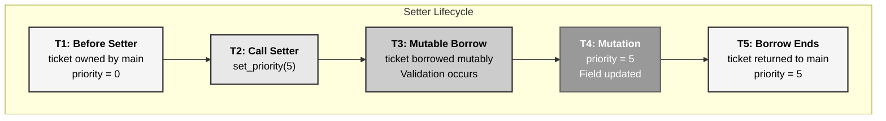
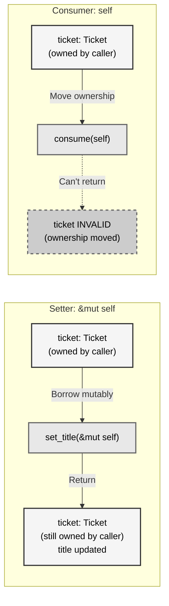
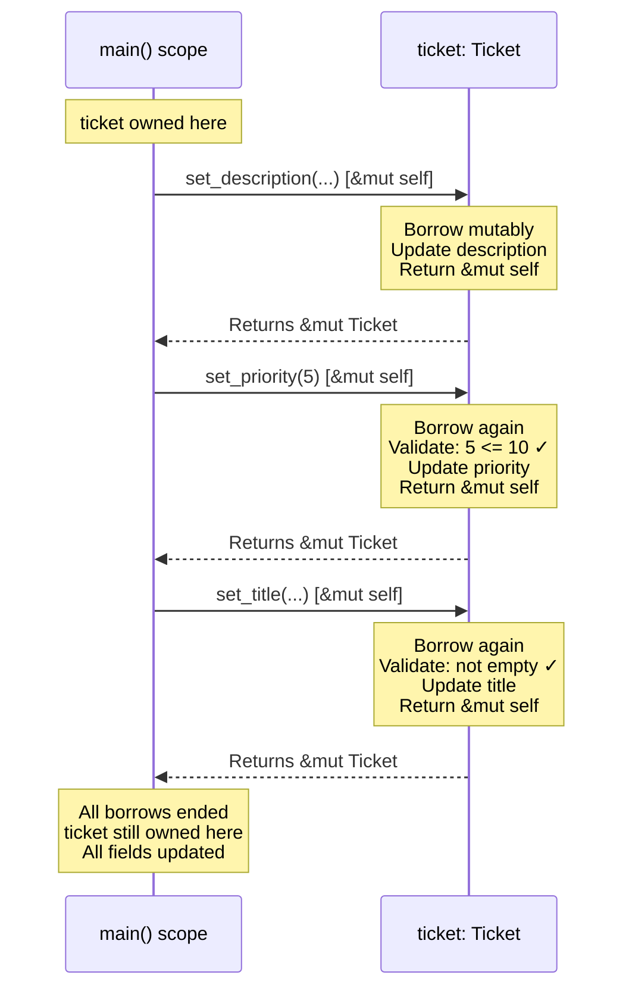
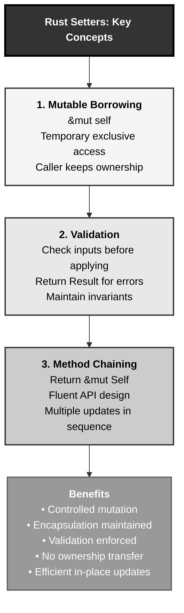

# Rust Setters: The Arc Reactor Upgrade Pattern

## The Answer (Minto Pyramid)

**Setters are methods that modify struct fields through mutable references (`&mut self`), allowing controlled in-place updates without transferring ownership.**

Unlike methods that consume `self`, setters borrow the instance mutably, make changes, and return control to the caller. The original owner keeps ownership. You can chain setters by returning `&mut Self`, validate inputs before applying changes, and maintain invariants throughout the object's lifetime.

**Three Supporting Principles:**

1. **Mutable Borrowing**: Setters take `&mut self`, borrowing the instance temporarily
2. **Controlled Mutation**: Changes happen through validated methods, not direct field access
3. **Ownership Preservation**: The caller retains ownership after the setter completes

**Why This Matters**: Setters provide safe, controlled mutation with validation, maintaining encapsulation while avoiding the overhead of creating new instances. You modify data in place while preserving guarantees about valid states.

---

## The MCU Metaphor: Arc Reactor Upgrades

Think of Rust setters like Tony Stark upgrading his Arc Reactor:

### The Mapping

| Arc Reactor Upgrades | Rust Setters |
|---------------------|--------------|
| **Tony keeps reactor in chest** | Struct stays owned by caller |
| **Upgrades without removing it** | `&mut self` borrows temporarily |
| **Each upgrade improves power** | Setter modifies field value |
| **Tony validates compatibility** | Setter validates input |
| **Reactor stays functional during upgrade** | Object maintains invariants |
| **Multiple upgrades in sequence** | Method chaining with `&mut Self` |
| **Arc Reactor returns to Tony** | Mutable borrow ends, owner regains control |
| **No new reactor needed** | In-place modification, no cloning |

### The Story

When Tony Stark upgrades his Arc Reactor from Mark I to Mark II, he doesn't rip it out and build a completely new one. Instead, he carefully modifies it *in place*—improving the power output, efficiency, and stability while keeping it in his chest. Each upgrade is validated (will this kill me?), applied carefully, and the reactor remains functional throughout.

Similarly, when you call `ticket.set_title(new_title)`, you're not creating a new ticket. You're borrowing the existing ticket mutably (`&mut self`), validating the new title, updating the field, and returning control. The ticket stays owned by the caller, modified in place, with its invariants intact.

This isn't just convenient—it's **efficient**. Just as Tony doesn't waste resources building new reactors for every upgrade, Rust setters avoid allocating new memory when you can safely modify existing data.

---

## The Problem Without Setters

Before understanding setters, let's see what happens without controlled mutation:

```rust path=null start=null
// ❌ WITHOUT SETTERS - Public fields, no validation
pub struct Ticket {
    pub title: String,        // Public - anyone can modify!
    pub description: String,  // No validation possible
    pub priority: u8,         // Could set to invalid values
}

fn main() {
    let mut ticket = Ticket {
        title: String::from("Bug fix"),
        description: String::from("Fix the bug"),
        priority: 1,
    };
    
    // Direct field access - no validation!
    ticket.title = String::from("");  // Empty title - invalid!
    ticket.priority = 255;             // Way too high - invalid!
    
    // No way to enforce rules
    // No way to maintain invariants
    // Anyone can break the ticket
}
```

**Problems:**

1. **No Validation**: Can set fields to invalid values
2. **No Encapsulation**: Internal details exposed
3. **No Invariants**: Can break object's guarantees
4. **No Control**: Can't track or log changes
5. **Fragile API**: Changing internals breaks all code

```java path=null start=null
// Java - Verbose getters/setters
public class Ticket {
    private String title;
    private String description;
    private int priority;
    
    public String getTitle() {
        return title;
    }
    
    public void setTitle(String title) {
        if (title == null || title.isEmpty()) {
            throw new IllegalArgumentException("Title required");
        }
        this.title = title;
    }
    
    public void setPriority(int priority) {
        if (priority < 0 || priority > 10) {
            throw new IllegalArgumentException("Priority 0-10");
        }
        this.priority = priority;
    }
    
    // Boilerplate for every field...
}

public class Main {
    public static void main(String[] args) {
        Ticket ticket = new Ticket();
        ticket.setTitle("Bug");      // Verbose
        ticket.setPriority(1);        // No chaining
        ticket.setPriority(255);      // Runtime error!
    }
}
```

**Problems:**

1. **Boilerplate**: Getters/setters for every field
2. **Runtime Errors**: Invalid values caught at runtime
3. **No Chaining**: Each setter is void, can't chain
4. **Null Everywhere**: Need null checks

---

## The Solution: Setters with Validation

Rust setters provide controlled mutation with validation:

```rust path=null start=null
pub struct Ticket {
    title: String,        // Private field
    description: String,  // Encapsulated
    priority: u8,         // Protected
}

impl Ticket {
    pub fn new(title: String, description: String) -> Result<Self, String> {
        if title.trim().is_empty() {
            return Err(String::from("Title cannot be empty"));
        }
        Ok(Self {
            title,
            description,
            priority: 0,
        })
    }
    
    // Getter - immutable borrow
    pub fn title(&self) -> &str {
        &self.title
    }
    
    // Setter - mutable borrow with validation
    pub fn set_title(&mut self, title: String) -> Result<(), String> {
        if title.trim().is_empty() {
            return Err(String::from("Title cannot be empty"));
        }
        self.title = title;
        Ok(())
    }
    
    // Chainable setter - returns &mut self
    pub fn set_priority(&mut self, priority: u8) -> Result<&mut Self, String> {
        if priority > 10 {
            return Err(String::from("Priority must be 0-10"));
        }
        self.priority = priority;
        Ok(self)
    }
    
    pub fn set_description(&mut self, description: String) -> &mut Self {
        self.description = description;
        self  // Return self for chaining
    }
}

fn main() {
    let mut ticket = Ticket::new(
        String::from("Bug fix"),
        String::from("Description")
    ).unwrap();
    
    // Validated setter
    ticket.set_title(String::from("Feature")).unwrap();
    
    // Chainable setters
    ticket
        .set_description(String::from("New feature"))
        .set_priority(5).unwrap();
    
    // ✅ Compiler prevents invalid state
    // ticket.set_title(String::from(""));  // Returns Err at runtime
    // ticket.set_priority(255);            // Returns Err at runtime
    
    println!("Title: {}", ticket.title());
}
```

**Benefits:**

1. **Validation**: Invalid values rejected
2. **Encapsulation**: Private fields, public setters
3. **Invariants**: Object stays valid
4. **Method Chaining**: Fluent API with `&mut Self`
5. **Type Safety**: Compiler enforces types

---

## Visual Mental Model



### Setter vs Consumer Methods



### Method Chaining with Setters



---

## Anatomy of Setters

### 1. Basic Setter Pattern

```rust path=null start=null
pub struct Ticket {
    title: String,
    description: String,
}

impl Ticket {
    // Getter - returns reference
    pub fn title(&self) -> &str {
        &self.title
    }
    
    // Setter - takes mutable reference
    pub fn set_title(&mut self, title: String) {
        self.title = title;
    }
    
    // Alternative: Setter with validation
    pub fn set_description(&mut self, description: String) -> Result<(), String> {
        if description.trim().is_empty() {
            return Err(String::from("Description cannot be empty"));
        }
        self.description = description;
        Ok(())
    }
}

fn main() {
    let mut ticket = Ticket {
        title: String::from("Bug"),
        description: String::from("Fix bug"),
    };
    
    // Using setters
    ticket.set_title(String::from("Feature"));
    
    match ticket.set_description(String::from("New feature")) {
        Ok(()) => println!("Description updated"),
        Err(e) => println!("Error: {}", e),
    }
    
    println!("Title: {}", ticket.title());
}
```

### 2. Chainable Setters

```rust path=null start=null
pub struct Ticket {
    title: String,
    description: String,
    priority: u8,
    status: String,
}

impl Ticket {
    pub fn new(title: String, description: String) -> Self {
        Self {
            title,
            description,
            priority: 0,
            status: String::from("open"),
        }
    }
    
    // Chainable setter - returns &mut Self
    pub fn set_title(&mut self, title: String) -> &mut Self {
        self.title = title;
        self  // Return mutable reference to self
    }
    
    pub fn set_description(&mut self, description: String) -> &mut Self {
        self.description = description;
        self
    }
    
    pub fn set_priority(&mut self, priority: u8) -> &mut Self {
        self.priority = priority;
        self
    }
    
    pub fn set_status(&mut self, status: String) -> &mut Self {
        self.status = status;
        self
    }
}

fn main() {
    let mut ticket = Ticket::new(
        String::from("Bug"),
        String::from("Description")
    );
    
    // Method chaining!
    ticket
        .set_title(String::from("Feature"))
        .set_description(String::from("Add new feature"))
        .set_priority(5)
        .set_status(String::from("in-progress"));
    
    println!("Title: {}", ticket.title);
}
```

### 3. Validated Chainable Setters

```rust path=null start=null
pub struct Ticket {
    title: String,
    priority: u8,
}

impl Ticket {
    pub fn new(title: String) -> Self {
        Self { title, priority: 0 }
    }
    
    // Chainable with Result
    pub fn set_title(&mut self, title: String) -> Result<&mut Self, String> {
        if title.trim().is_empty() {
            return Err(String::from("Title cannot be empty"));
        }
        self.title = title;
        Ok(self)  // Return Ok(&mut self) for chaining
    }
    
    pub fn set_priority(&mut self, priority: u8) -> Result<&mut Self, String> {
        if priority > 10 {
            return Err(String::from("Priority must be 0-10"));
        }
        self.priority = priority;
        Ok(self)
    }
}

fn main() -> Result<(), String> {
    let mut ticket = Ticket::new(String::from("Bug"));
    
    // Chainable with ? operator
    ticket
        .set_title(String::from("Feature"))?
        .set_priority(5)?;
    
    println!("Title: {}, Priority: {}", ticket.title, ticket.priority);
    
    // This would fail
    // ticket.set_priority(255)?;  // Err: Priority must be 0-10
    
    Ok(())
}
```

### 4. Setters with Side Effects

```rust path=null start=null
use std::time::{SystemTime, UNIX_EPOCH};

pub struct Ticket {
    title: String,
    description: String,
    updated_at: u64,
}

impl Ticket {
    pub fn new(title: String, description: String) -> Self {
        Self {
            title,
            description,
            updated_at: Self::current_timestamp(),
        }
    }
    
    fn current_timestamp() -> u64 {
        SystemTime::now()
            .duration_since(UNIX_EPOCH)
            .unwrap()
            .as_secs()
    }
    
    // Setter with side effect - updates timestamp
    pub fn set_title(&mut self, title: String) -> &mut Self {
        self.title = title;
        self.updated_at = Self::current_timestamp();  // Side effect!
        self
    }
    
    pub fn set_description(&mut self, description: String) -> &mut Self {
        self.description = description;
        self.updated_at = Self::current_timestamp();  // Side effect!
        self
    }
    
    pub fn updated_at(&self) -> u64 {
        self.updated_at
    }
}

fn main() {
    let mut ticket = Ticket::new(
        String::from("Bug"),
        String::from("Description")
    );
    
    println!("Initial timestamp: {}", ticket.updated_at());
    
    std::thread::sleep(std::time::Duration::from_secs(1));
    
    ticket.set_title(String::from("Feature"));
    
    println!("Updated timestamp: {}", ticket.updated_at());
}
```

### 5. Conditional Setters

```rust path=null start=null
pub struct Ticket {
    title: String,
    status: String,
    closed_at: Option<u64>,
}

impl Ticket {
    pub fn new(title: String) -> Self {
        Self {
            title,
            status: String::from("open"),
            closed_at: None,
        }
    }
    
    // Setter with conditional logic
    pub fn set_status(&mut self, status: String) -> Result<&mut Self, String> {
        match status.as_str() {
            "open" => {
                self.status = status;
                self.closed_at = None;  // Clear closed timestamp
                Ok(self)
            }
            "closed" => {
                self.status = status;
                self.closed_at = Some(Self::current_timestamp());  // Set closed time
                Ok(self)
            }
            "in-progress" => {
                if self.status == "closed" {
                    return Err(String::from("Cannot reopen closed ticket"));
                }
                self.status = status;
                Ok(self)
            }
            _ => Err(format!("Invalid status: {}", status)),
        }
    }
    
    fn current_timestamp() -> u64 {
        std::time::SystemTime::now()
            .duration_since(std::time::UNIX_EPOCH)
            .unwrap()
            .as_secs()
    }
}

fn main() -> Result<(), String> {
    let mut ticket = Ticket::new(String::from("Bug"));
    
    ticket.set_status(String::from("in-progress"))?;
    ticket.set_status(String::from("closed"))?;
    
    // This fails!
    match ticket.set_status(String::from("in-progress")) {
        Ok(_) => println!("Status updated"),
        Err(e) => println!("Error: {}", e),  // "Cannot reopen closed ticket"
    }
    
    Ok(())
}
```

---

## Common Setter Patterns

### Pattern 1: Builder Pattern with Setters

```rust path=null start=null
pub struct Ticket {
    title: String,
    description: String,
    priority: u8,
    assignee: Option<String>,
}

impl Ticket {
    pub fn new(title: String, description: String) -> Self {
        Self {
            title,
            description,
            priority: 0,
            assignee: None,
        }
    }
    
    // Builder-style chainable setters
    pub fn with_priority(mut self, priority: u8) -> Self {
        self.priority = priority;
        self  // Consume and return self (not &mut self!)
    }
    
    pub fn with_assignee(mut self, assignee: String) -> Self {
        self.assignee = Some(assignee);
        self
    }
}

fn main() {
    // Build with method chaining (consumes self each time)
    let ticket = Ticket::new(
        String::from("Bug"),
        String::from("Fix bug")
    )
    .with_priority(5)
    .with_assignee(String::from("Alice"));
    
    println!("Priority: {}", ticket.priority);
}
```

### Pattern 2: Update Methods

```rust path=null start=null
pub struct Ticket {
    title: String,
    description: String,
    priority: u8,
}

impl Ticket {
    pub fn new(title: String, description: String) -> Self {
        Self {
            title,
            description,
            priority: 0,
        }
    }
    
    // Update multiple fields at once
    pub fn update(
        &mut self,
        title: Option<String>,
        description: Option<String>,
        priority: Option<u8>,
    ) -> &mut Self {
        if let Some(t) = title {
            self.title = t;
        }
        if let Some(d) = description {
            self.description = d;
        }
        if let Some(p) = priority {
            self.priority = p;
        }
        self
    }
}

fn main() {
    let mut ticket = Ticket::new(
        String::from("Bug"),
        String::from("Description")
    );
    
    // Update only some fields
    ticket.update(
        Some(String::from("Feature")),  // Update title
        None,                            // Keep description
        Some(8),                         // Update priority
    );
    
    println!("Title: {}", ticket.title);
}
```

### Pattern 3: Try-Setters with Validation

```rust path=null start=null
pub struct Ticket {
    title: String,
    priority: u8,
}

impl Ticket {
    pub fn new(title: String) -> Self {
        Self { title, priority: 0 }
    }
    
    // Regular setter - panics on invalid input (use with caution!)
    pub fn set_priority(&mut self, priority: u8) {
        assert!(priority <= 10, "Priority must be 0-10");
        self.priority = priority;
    }
    
    // Try-setter - returns Result
    pub fn try_set_priority(&mut self, priority: u8) -> Result<(), String> {
        if priority > 10 {
            return Err(format!("Invalid priority: {}", priority));
        }
        self.priority = priority;
        Ok(())
    }
    
    // Chainable try-setter
    pub fn try_set_priority_chainable(&mut self, priority: u8) -> Result<&mut Self, String> {
        if priority > 10 {
            return Err(format!("Invalid priority: {}", priority));
        }
        self.priority = priority;
        Ok(self)
    }
}

fn main() -> Result<(), String> {
    let mut ticket = Ticket::new(String::from("Bug"));
    
    // Use try-setter with ? operator
    ticket.try_set_priority(5)?;
    
    // Or check explicitly
    match ticket.try_set_priority(255) {
        Ok(()) => println!("Priority updated"),
        Err(e) => println!("Error: {}", e),
    }
    
    Ok(())
}
```

### Pattern 4: Setters with Callbacks

```rust path=null start=null
pub struct Ticket {
    title: String,
    on_change: Option<Box<dyn Fn(&str) + 'static>>,
}

impl Ticket {
    pub fn new(title: String) -> Self {
        Self {
            title,
            on_change: None,
        }
    }
    
    // Set change callback
    pub fn on_change<F>(&mut self, callback: F) -> &mut Self
    where
        F: Fn(&str) + 'static,
    {
        self.on_change = Some(Box::new(callback));
        self
    }
    
    // Setter that triggers callback
    pub fn set_title(&mut self, title: String) -> &mut Self {
        let old_title = self.title.clone();
        self.title = title;
        
        // Trigger callback if set
        if let Some(ref callback) = self.on_change {
            callback(&old_title);
        }
        
        self
    }
}

fn main() {
    let mut ticket = Ticket::new(String::from("Bug"));
    
    ticket.on_change(|old_title| {
        println!("Title changed from: {}", old_title);
    });
    
    ticket.set_title(String::from("Feature"));  // Prints: Title changed from: Bug
}
```

### Pattern 5: Atomic Updates

```rust path=null start=null
use std::sync::{Arc, Mutex};

pub struct Ticket {
    title: Arc<Mutex<String>>,
    priority: Arc<Mutex<u8>>,
}

impl Ticket {
    pub fn new(title: String) -> Self {
        Self {
            title: Arc::new(Mutex::new(title)),
            priority: Arc::new(Mutex::new(0)),
        }
    }
    
    // Thread-safe setter
    pub fn set_title(&self, title: String) -> Result<(), String> {
        let mut t = self.title.lock()
            .map_err(|e| format!("Lock error: {}", e))?;
        *t = title;
        Ok(())
    }
    
    pub fn get_title(&self) -> String {
        self.title.lock().unwrap().clone()
    }
    
    pub fn set_priority(&self, priority: u8) -> Result<(), String> {
        if priority > 10 {
            return Err(String::from("Priority must be 0-10"));
        }
        let mut p = self.priority.lock()
            .map_err(|e| format!("Lock error: {}", e))?;
        *p = priority;
        Ok(())
    }
}

fn main() -> Result<(), String> {
    let ticket = Ticket::new(String::from("Bug"));
    
    ticket.set_title(String::from("Feature"))?;
    ticket.set_priority(5)?;
    
    println!("Title: {}", ticket.get_title());
    
    Ok(())
}
```

---

## Setters vs Other Patterns

### Comparison Table

| Pattern | Signature | Ownership | Chaining | Use Case |
|---------|-----------|-----------|----------|----------|
| **Simple Setter** | `&mut self` | Borrows | No | Basic field update |
| **Chainable Setter** | `&mut self → &mut Self` | Borrows | Yes | Fluent API |
| **Builder Method** | `self → Self` | Moves | Yes | Construction phase |
| **Try-Setter** | `&mut self → Result<(), E>` | Borrows | No | Validated update |
| **Update Method** | `&mut self, Option<T>...` | Borrows | No | Batch updates |
| **Getter** | `&self → &T` | Borrows | No | Read-only access |

### Visual Comparison


---

## Real-World Use Cases

### Use Case 1: Configuration Management

```rust path=null start=null
pub struct ServerConfig {
    host: String,
    port: u16,
    max_connections: usize,
    timeout_seconds: u64,
    tls_enabled: bool,
}

impl ServerConfig {
    pub fn new() -> Self {
        Self {
            host: String::from("localhost"),
            port: 8080,
            max_connections: 100,
            timeout_seconds: 30,
            tls_enabled: false,
        }
    }
    
    pub fn set_host(&mut self, host: String) -> Result<&mut Self, String> {
        if host.is_empty() {
            return Err(String::from("Host cannot be empty"));
        }
        self.host = host;
        Ok(self)
    }
    
    pub fn set_port(&mut self, port: u16) -> Result<&mut Self, String> {
        if port < 1024 {
            return Err(String::from("Port must be >= 1024"));
        }
        self.port = port;
        Ok(self)
    }
    
    pub fn set_max_connections(&mut self, max: usize) -> Result<&mut Self, String> {
        if max == 0 {
            return Err(String::from("Max connections must be > 0"));
        }
        self.max_connections = max;
        Ok(self)
    }
    
    pub fn enable_tls(&mut self) -> &mut Self {
        self.tls_enabled = true;
        self
    }
}

fn main() -> Result<(), String> {
    let mut config = ServerConfig::new();
    
    config
        .set_host(String::from("0.0.0.0"))?
        .set_port(8443)?
        .set_max_connections(500)?
        .enable_tls();
    
    println!("Config: {}:{}", config.host, config.port);
    
    Ok(())
}
```

### Use Case 2: State Management with Validation

```rust path=null start=null
#[derive(Debug, PartialEq)]
pub enum Status {
    Draft,
    InReview,
    Approved,
    Rejected,
}

pub struct Document {
    title: String,
    content: String,
    status: Status,
    version: u32,
}

impl Document {
    pub fn new(title: String) -> Self {
        Self {
            title,
            content: String::new(),
            status: Status::Draft,
            version: 1,
        }
    }
    
    pub fn set_content(&mut self, content: String) -> Result<&mut Self, String> {
        if self.status != Status::Draft {
            return Err(String::from("Can only edit draft documents"));
        }
        self.content = content;
        Ok(self)
    }
    
    pub fn submit_for_review(&mut self) -> Result<&mut Self, String> {
        if self.status != Status::Draft {
            return Err(String::from("Only drafts can be submitted"));
        }
        if self.content.is_empty() {
            return Err(String::from("Cannot submit empty document"));
        }
        self.status = Status::InReview;
        Ok(self)
    }
    
    pub fn approve(&mut self) -> Result<&mut Self, String> {
        if self.status != Status::InReview {
            return Err(String::from("Only documents in review can be approved"));
        }
        self.status = Status::Approved;
        self.version += 1;
        Ok(self)
    }
    
    pub fn reject(&mut self) -> Result<&mut Self, String> {
        if self.status != Status::InReview {
            return Err(String::from("Only documents in review can be rejected"));
        }
        self.status = Status::Rejected;
        Ok(self)
    }
}

fn main() -> Result<(), String> {
    let mut doc = Document::new(String::from("Proposal"));
    
    doc.set_content(String::from("Document content..."))?
       .submit_for_review()?
       .approve()?;
    
    // This would fail:
    // doc.set_content(String::from("More content"))?;  // Error: Can only edit drafts
    
    println!("Status: {:?}, Version: {}", doc.status, doc.version);
    
    Ok(())
}
```

### Use Case 3: Form Validation

```rust path=null start=null
pub struct UserForm {
    email: String,
    password: String,
    age: Option<u8>,
    terms_accepted: bool,
    errors: Vec<String>,
}

impl UserForm {
    pub fn new() -> Self {
        Self {
            email: String::new(),
            password: String::new(),
            age: None,
            terms_accepted: false,
            errors: Vec::new(),
        }
    }
    
    pub fn set_email(&mut self, email: String) -> &mut Self {
        self.errors.clear();
        if !email.contains('@') {
            self.errors.push(String::from("Invalid email"));
        }
        self.email = email;
        self
    }
    
    pub fn set_password(&mut self, password: String) -> &mut Self {
        if password.len() < 8 {
            self.errors.push(String::from("Password too short"));
        }
        self.password = password;
        self
    }
    
    pub fn set_age(&mut self, age: u8) -> &mut Self {
        if age < 13 {
            self.errors.push(String::from("Must be 13 or older"));
        }
        self.age = Some(age);
        self
    }
    
    pub fn accept_terms(&mut self) -> &mut Self {
        self.terms_accepted = true;
        self
    }
    
    pub fn is_valid(&self) -> bool {
        self.errors.is_empty() 
            && !self.email.is_empty()
            && !self.password.is_empty()
            && self.terms_accepted
    }
    
    pub fn errors(&self) -> &[String] {
        &self.errors
    }
}

fn main() {
    let mut form = UserForm::new();
    
    form.set_email(String::from("user@example.com"))
        .set_password(String::from("password123"))
        .set_age(25)
        .accept_terms();
    
    if form.is_valid() {
        println!("Form valid!");
    } else {
        println!("Errors: {:?}", form.errors());
    }
}
```

### Use Case 4: Cache Management

```rust path=null start=null
use std::collections::HashMap;
use std::time::{Duration, Instant};

pub struct Cache<K, V> {
    data: HashMap<K, (V, Instant)>,
    ttl: Duration,
    max_size: usize,
}

impl<K, V> Cache<K, V>
where
    K: std::hash::Hash + Eq,
{
    pub fn new() -> Self {
        Self {
            data: HashMap::new(),
            ttl: Duration::from_secs(300),  // 5 minutes
            max_size: 1000,
        }
    }
    
    pub fn set_ttl(&mut self, seconds: u64) -> &mut Self {
        self.ttl = Duration::from_secs(seconds);
        self
    }
    
    pub fn set_max_size(&mut self, size: usize) -> &mut Self {
        self.max_size = size;
        // Evict if over limit
        while self.data.len() > self.max_size {
            if let Some(key) = self.data.keys().next().cloned() {
                self.data.remove(&key);
            }
        }
        self
    }
    
    pub fn insert(&mut self, key: K, value: V) -> &mut Self {
        // Evict if at capacity
        if self.data.len() >= self.max_size {
            if let Some(oldest) = self.data.keys().next().cloned() {
                self.data.remove(&oldest);
            }
        }
        self.data.insert(key, (value, Instant::now()));
        self
    }
    
    pub fn get(&self, key: &K) -> Option<&V> {
        self.data.get(key).and_then(|(value, inserted_at)| {
            if inserted_at.elapsed() < self.ttl {
                Some(value)
            } else {
                None
            }
        })
    }
}

fn main() {
    let mut cache: Cache<String, String> = Cache::new();
    
    cache
        .set_ttl(60)           // 1 minute TTL
        .set_max_size(100)     // Max 100 items
        .insert(String::from("key1"), String::from("value1"))
        .insert(String::from("key2"), String::from("value2"));
    
    if let Some(value) = cache.get(&String::from("key1")) {
        println!("Found: {}", value);
    }
}
```

---

## Comparing Setters Across Languages

### Rust vs Java

```java path=null start=null
// Java - Traditional JavaBean pattern
public class Ticket {
    private String title;
    private int priority;
    
    // Constructor
    public Ticket(String title) {
        this.title = title;
        this.priority = 0;
    }
    
    // Getter
    public String getTitle() {
        return title;
    }
    
    // Setter - void, no chaining
    public void setTitle(String title) {
        if (title == null || title.isEmpty()) {
            throw new IllegalArgumentException("Title required");
        }
        this.title = title;
    }
    
    public void setPriority(int priority) {
        if (priority < 0 || priority > 10) {
            throw new IllegalArgumentException("Priority 0-10");
        }
        this.priority = priority;
    }
}

// Usage
Ticket ticket = new Ticket("Bug");
ticket.setTitle("Feature");    // No chaining
ticket.setPriority(5);          // Separate call
// ticket.setPriority(255);     // Runtime exception!
```

**Rust Equivalent:**

```rust path=null start=null
pub struct Ticket {
    title: String,
    priority: u8,
}

impl Ticket {
    pub fn new(title: String) -> Self {
        Self { title, priority: 0 }
    }
    
    pub fn title(&self) -> &str {
        &self.title
    }
    
    // Chainable setter with Result
    pub fn set_title(&mut self, title: String) -> Result<&mut Self, String> {
        if title.trim().is_empty() {
            return Err(String::from("Title required"));
        }
        self.title = title;
        Ok(self)
    }
    
    pub fn set_priority(&mut self, priority: u8) -> Result<&mut Self, String> {
        if priority > 10 {
            return Err(String::from("Priority 0-10"));
        }
        self.priority = priority;
        Ok(self)
    }
}

fn main() -> Result<(), String> {
    let mut ticket = Ticket::new(String::from("Bug"));
    
    // Chainable with error handling
    ticket
        .set_title(String::from("Feature"))?
        .set_priority(5)?;
    
    // Compile-time type safety + runtime validation
    // ticket.set_priority(255)?;  // Compile error (u8 max is 255)
                                   // But 255 > 10, so runtime Err
    
    Ok(())
}
```

**Key Differences:**

| Aspect | Java | Rust |
|--------|------|------|
| **Return type** | `void` | `&mut Self` or `Result<&mut Self, E>` |
| **Chaining** | No | Yes |
| **Error handling** | Exceptions (runtime) | `Result` (checked at compile time) |
| **Null safety** | `null` everywhere | No null, use `Option<T>` |
| **Type safety** | Runtime checks | Compile-time types + runtime validation |

### Rust vs JavaScript

```javascript path=null start=null
// JavaScript - Dynamic, no type safety
class Ticket {
    constructor(title) {
        this._title = title;
        this._priority = 0;
    }
    
    get title() {
        return this._title;
    }
    
    set title(value) {
        if (!value || value.trim() === '') {
            throw new Error('Title required');
        }
        this._title = value;
    }
    
    setPriority(priority) {
        if (priority < 0 || priority > 10) {
            throw new Error('Priority 0-10');
        }
        this._priority = priority;
        return this;  // Manual chaining
    }
}

// Usage
const ticket = new Ticket('Bug');
ticket.title = 'Feature';     // Property setter
ticket.setPriority(5);         // Method
// ticket.title = 255;         // No type checking!
```

**Rust Equivalent:**

```rust path=null start=null
pub struct Ticket {
    title: String,
    priority: u8,
}

impl Ticket {
    pub fn new(title: String) -> Self {
        Self { title, priority: 0 }
    }
    
    pub fn title(&self) -> &str {
        &self.title
    }
    
    pub fn set_title(&mut self, title: String) -> Result<&mut Self, String> {
        if title.trim().is_empty() {
            return Err(String::from("Title required"));
        }
        self.title = title;
        Ok(self)
    }
    
    pub fn set_priority(&mut self, priority: u8) -> Result<&mut Self, String> {
        if priority > 10 {
            return Err(String::from("Priority 0-10"));
        }
        self.priority = priority;
        Ok(self)
    }
}
```

**Key Differences:**

| Aspect | JavaScript | Rust |
|--------|-----------|------|
| **Type safety** | None (dynamic) | Full (static) |
| **Property setters** | Native syntax | Methods |
| **Error handling** | Exceptions | `Result<T, E>` |
| **Null/undefined** | Everywhere | No null, use `Option<T>` |
| **Performance** | Interpreted | Compiled, zero-cost |

### Rust vs Python

```python path=null start=null
# Python - Property decorators
class Ticket:
    def __init__(self, title):
        self._title = title
        self._priority = 0
    
    @property
    def title(self):
        return self._title
    
    @title.setter
    def title(self, value):
        if not value or not value.strip():
            raise ValueError("Title required")
        self._title = value
    
    def set_priority(self, priority):
        if priority < 0 or priority > 10:
            raise ValueError("Priority 0-10")
        self._priority = priority
        return self  # Chaining
    
# Usage
ticket = Ticket("Bug")
ticket.title = "Feature"    # Property setter
ticket.set_priority(5)       # Method
# ticket.title = 255        # Runtime error only
```

**Rust Equivalent** (shown above)

**Key Differences:**

| Aspect | Python | Rust |
|--------|--------|------|
| **Type hints** | Optional, not enforced | Required, enforced |
| **Property syntax** | `@property` decorator | Explicit methods |
| **Performance** | Interpreted, slow | Compiled, fast |
| **Memory safety** | GC overhead | Zero-cost abstractions |
| **Error handling** | Exceptions | `Result<T, E>` |

---

## Advanced Setter Patterns

### Pattern 1: Transactional Setters

```rust path=null start=null
pub struct Ticket {
    title: String,
    description: String,
    priority: u8,
}

pub struct TicketTransaction<'a> {
    ticket: &'a mut Ticket,
    title: Option<String>,
    description: Option<String>,
    priority: Option<u8>,
}

impl<'a> TicketTransaction<'a> {
    pub fn new(ticket: &'a mut Ticket) -> Self {
        Self {
            ticket,
            title: None,
            description: None,
            priority: None,
        }
    }
    
    pub fn set_title(&mut self, title: String) -> &mut Self {
        self.title = Some(title);
        self
    }
    
    pub fn set_description(&mut self, description: String) -> &mut Self {
        self.description = Some(description);
        self
    }
    
    pub fn set_priority(&mut self, priority: u8) -> &mut Self {
        self.priority = Some(priority);
        self
    }
    
    // Commit all changes at once
    pub fn commit(self) -> Result<(), String> {
        // Validate all changes first
        if let Some(ref title) = self.title {
            if title.trim().is_empty() {
                return Err(String::from("Title cannot be empty"));
            }
        }
        if let Some(priority) = self.priority {
            if priority > 10 {
                return Err(String::from("Priority must be 0-10"));
            }
        }
        
        // Apply all changes
        if let Some(title) = self.title {
            self.ticket.title = title;
        }
        if let Some(description) = self.description {
            self.ticket.description = description;
        }
        if let Some(priority) = self.priority {
            self.ticket.priority = priority;
        }
        
        Ok(())
    }
}

fn main() -> Result<(), String> {
    let mut ticket = Ticket {
        title: String::from("Bug"),
        description: String::from("Fix bug"),
        priority: 0,
    };
    
    // Start transaction
    let mut tx = TicketTransaction::new(&mut ticket);
    tx.set_title(String::from("Feature"))
      .set_priority(5)
      .set_description(String::from("New feature"));
    
    // Commit all changes atomically
    tx.commit()?;
    
    println!("Title: {}", ticket.title);
    Ok(())
}
```

### Pattern 2: Fluent Validation

```rust path=null start=null
pub struct Ticket {
    title: String,
    priority: u8,
}

pub struct ValidationError {
    field: String,
    message: String,
}

pub struct TicketValidator<'a> {
    ticket: &'a mut Ticket,
    errors: Vec<ValidationError>,
}

impl<'a> TicketValidator<'a> {
    pub fn new(ticket: &'a mut Ticket) -> Self {
        Self {
            ticket,
            errors: Vec::new(),
        }
    }
    
    pub fn set_title(&mut self, title: String) -> &mut Self {
        if title.trim().is_empty() {
            self.errors.push(ValidationError {
                field: String::from("title"),
                message: String::from("Title cannot be empty"),
            });
        } else {
            self.ticket.title = title;
        }
        self
    }
    
    pub fn set_priority(&mut self, priority: u8) -> &mut Self {
        if priority > 10 {
            self.errors.push(ValidationError {
                field: String::from("priority"),
                message: String::from("Priority must be 0-10"),
            });
        } else {
            self.ticket.priority = priority;
        }
        self
    }
    
    pub fn validate(self) -> Result<(), Vec<ValidationError>> {
        if self.errors.is_empty() {
            Ok(())
        } else {
            Err(self.errors)
        }
    }
}

fn main() {
    let mut ticket = Ticket {
        title: String::from("Bug"),
        priority: 0,
    };
    
    let result = TicketValidator::new(&mut ticket)
        .set_title(String::from(""))      // Invalid
        .set_priority(255)                 // Invalid
        .validate();
    
    match result {
        Ok(()) => println!("All valid!"),
        Err(errors) => {
            for error in errors {
                println!("{}: {}", error.field, error.message);
            }
        }
    }
}
```

---

## Common Pitfalls and Solutions

### Pitfall 1: Forgetting to Return `&mut Self`

```rust path=null start=null
// ❌ WRONG - Returns nothing, can't chain
impl Ticket {
    pub fn set_title(&mut self, title: String) {
        self.title = title;
        // Oops! Forgot to return self
    }
}

fn main() {
    let mut ticket = Ticket::new(String::from("Bug"));
    ticket.set_title(String::from("Feature"));
    // ticket.set_priority(5);  // Must call separately
}

// ✅ CORRECT - Returns &mut self for chaining
impl Ticket {
    pub fn set_title(&mut self, title: String) -> &mut Self {
        self.title = title;
        self  // Return self
    }
}

fn main() {
    let mut ticket = Ticket::new(String::from("Bug"));
    ticket
        .set_title(String::from("Feature"))
        .set_priority(5);  // Chainable!
}
```

### Pitfall 2: Confusing Builder Pattern and Setters

```rust path=null start=null
// ❌ MIXING PATTERNS - Inconsistent
impl Ticket {
    // Builder method - consumes self
    pub fn with_title(mut self, title: String) -> Self {
        self.title = title;
        self
    }
    
    // Setter - borrows mutably
    pub fn set_priority(&mut self, priority: u8) -> &mut Self {
        self.priority = priority;
        self
    }
}

fn main() {
    let ticket = Ticket::new(String::from("Bug"));
    // let ticket = ticket.with_title(String::from("Feature"));
    // ticket.set_priority(5);  // ERROR: ticket moved!
}

// ✅ CORRECT - Consistent pattern
impl Ticket {
    // All setters use &mut self
    pub fn set_title(&mut self, title: String) -> &mut Self {
        self.title = title;
        self
    }
    
    pub fn set_priority(&mut self, priority: u8) -> &mut Self {
        self.priority = priority;
        self
    }
}

fn main() {
    let mut ticket = Ticket::new(String::from("Bug"));
    ticket
        .set_title(String::from("Feature"))
        .set_priority(5);  // Works!
}
```

### Pitfall 3: Not Validating in Setters

```rust path=null start=null
// ❌ WRONG - No validation
impl Ticket {
    pub fn set_priority(&mut self, priority: u8) -> &mut Self {
        self.priority = priority;  // Accepts any u8!
        self
    }
}

fn main() {
    let mut ticket = Ticket::new(String::from("Bug"));
    ticket.set_priority(255);  // Invalid but allowed!
}

// ✅ CORRECT - Validate with Result
impl Ticket {
    pub fn set_priority(&mut self, priority: u8) -> Result<&mut Self, String> {
        if priority > 10 {
            return Err(String::from("Priority must be 0-10"));
        }
        self.priority = priority;
        Ok(self)
    }
}

fn main() -> Result<(), String> {
    let mut ticket = Ticket::new(String::from("Bug"));
    ticket.set_priority(5)?;       // Valid
    // ticket.set_priority(255)?;  // Returns Err
    Ok(())
}
```

---

## Key Takeaways



### The Mental Model

Think of setters like Tony Stark upgrading his Arc Reactor:
- **Reactor stays in chest** → Ownership stays with caller
- **Upgrades in place** → Mutable borrow modifies field
- **Validates compatibility** → Setter validates input
- **Multiple upgrades** → Method chaining with `&mut Self`

### Core Principles

1. **Mutable Borrowing**: `&mut self` borrows temporarily, caller keeps ownership
2. **Validation**: Check inputs, return `Result` for invalid values
3. **Encapsulation**: Private fields, public setters with validation
4. **Method Chaining**: Return `&mut Self` for fluent APIs
5. **Efficiency**: In-place modification, no cloning needed

### Decision Matrix

| Scenario | Pattern | Signature |
|----------|---------|-----------|
| **Basic update** | Simple setter | `&mut self` |
| **With validation** | Try-setter | `&mut self → Result<(), E>` |
| **Chainable** | Fluent setter | `&mut self → &mut Self` |
| **Construction** | Builder method | `self → Self` |
| **Batch update** | Update method | `&mut self, Option<T>...` |

### The Guarantee

Rust setters provide:
- **Type Safety**: Compiler enforces types
- **Validation**: Runtime checks for business rules
- **Encapsulation**: Private fields, controlled access
- **Efficiency**: No unnecessary allocations
- **No Ownership Transfer**: Caller keeps ownership

All achieved through **mutable borrowing** with zero runtime cost.

---

**Remember**: Setters aren't just field assignments—they're **controlled mutation points**. Like Tony Stark carefully upgrading his Arc Reactor, Rust setters let you modify data in place while maintaining safety guarantees, validating inputs, and preserving invariants. The borrow checker ensures you have exclusive access during updates, preventing data races and undefined behavior.
