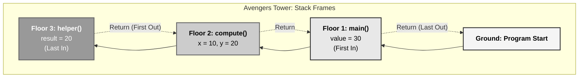
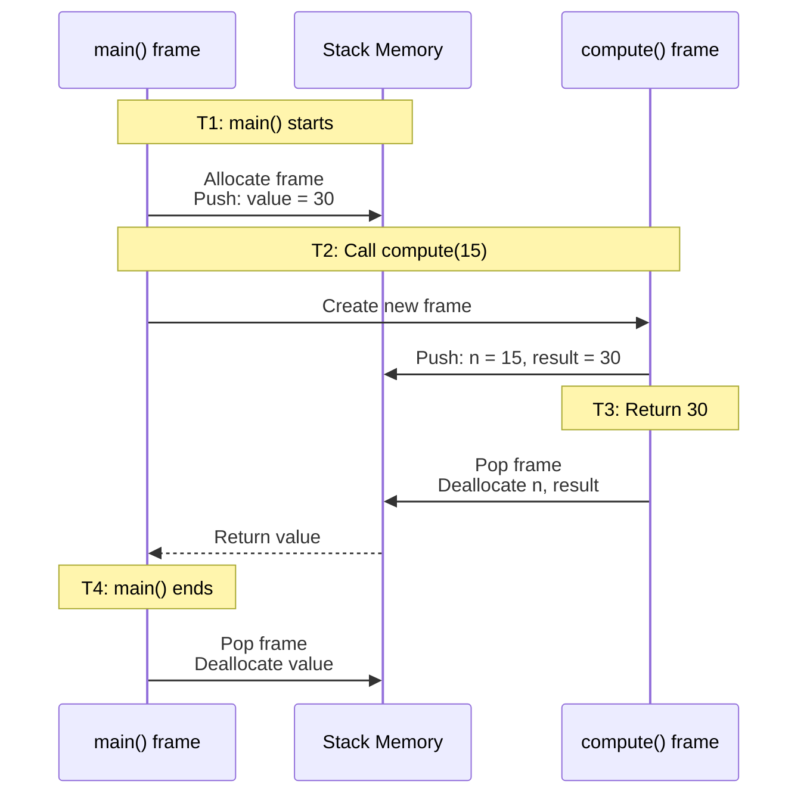
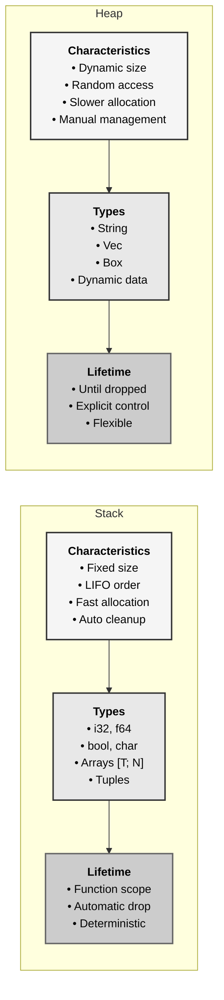
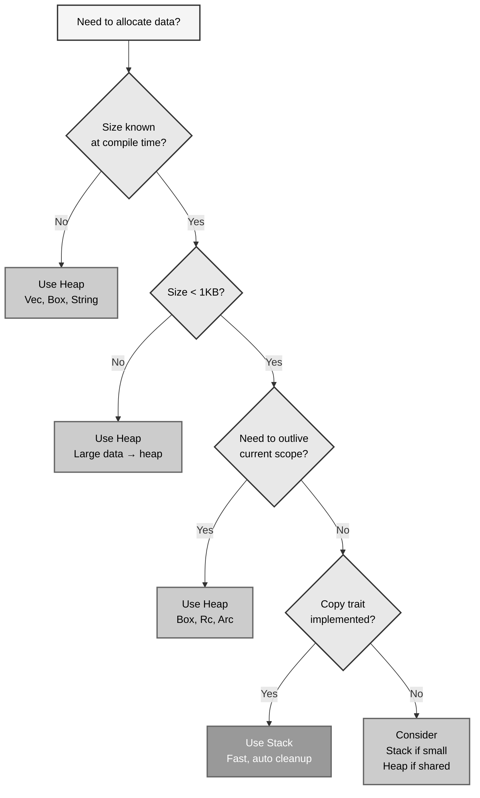
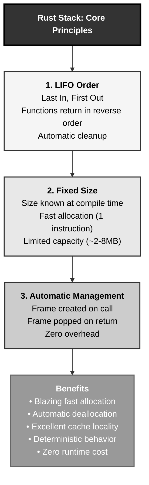

# Rust Stack Memory: The Avengers Tower Pattern

## The Answer (Minto Pyramid)

**The stack is a region of memory with automatic, deterministic allocation and deallocation where fixed-size values are stored in LIFO (Last In, First Out) order.**

When a function is called, a new stack frame is created containing local variables and function parameters. When the function returns, the frame is automatically popped and all data in it is dropped—no manual memory management needed. Stack allocation is extremely fast (just moving a pointer) but limited in size and requires knowing sizes at compile time.

**Three Supporting Principles:**

1. **LIFO Order**: Last function called is first to return; last value pushed is first popped
2. **Automatic Management**: Stack frames created on function call, destroyed on return
3. **Fixed Size**: Only types with compile-time known sizes can live on the stack

**Why This Matters**: Stack allocation provides blazing-fast memory access with zero overhead, automatic cleanup, and deterministic behavior. Understanding stack vs heap determines your code's performance characteristics and memory usage patterns.

---

## The MCU Metaphor: Avengers Tower

Think of Rust's stack like Avengers Tower with its vertical floors:

### The Mapping

| Avengers Tower | Rust Stack |
|----------------|------------|
| **Tower has fixed floors** | Stack has fixed size |
| **Enter floors from bottom up** | Push values onto stack |
| **Exit in reverse order (LIFO)** | Pop values in LIFO order |
| **Each floor: one mission** | Each frame: one function call |
| **Leave floor, equipment stays** | Return from function, locals dropped |
| **Fast elevator access** | Fast stack pointer movement |
| **Floor capacity limited** | Stack frame size limited |
| **Tower fills up → overflow** | Stack overflow error |

### The Story

When the Avengers assemble at their tower, they enter from the ground floor and move upward. Tony Stark enters first (ground floor), then Thor (floor 2), then Natasha (floor 3). When the mission ends, they exit in **reverse order**—Natasha leaves first (last in, first out), then Thor, then Tony.

Each floor holds mission-specific equipment of a fixed size. When an Avenger leaves their floor, all their equipment is automatically cleared—no manual cleanup needed. The elevator moves fast between floors (just incrementing/decrementing), but there's a limit to how high the tower goes. Stack too many missions? Tower overflow!

Similarly, when Rust calls functions, each creates a stack frame with local variables. The last function called returns first, automatically cleaning up its locals. Stack allocation is just moving a stack pointer (like the elevator), making it incredibly fast. But exceed the stack size? Stack overflow panic!

---

## The Problem Without Understanding Stack

Before understanding stack allocation, developers make costly mistakes:

```rust path=null start=null
// ❌ PROBLEM: Not understanding stack limits
fn recursive_bomb(n: u64) {
    let data = [0u8; 1024];  // 1KB per call
    println!("Depth: {}", n);
    recursive_bomb(n + 1);   // Infinite recursion!
    // Stack overflow!
}

// ❌ PROBLEM: Trying to return stack references
fn create_string() -> &str {
    let s = String::from("hello");
    &s  // ERROR: returning reference to stack local
    // s dropped when function returns!
}

// ❌ PROBLEM: Large stack allocations
fn process_data() {
    let huge_array = [0u8; 10_000_000];  // 10MB on stack!
    // Might overflow stack
    // Better to use heap (Vec)
}
```

**Problems:**

1. **Stack Overflow**: Unbounded recursion or huge locals exceed stack size
2. **Dangling References**: Returning references to stack locals (use-after-free)
3. **Size Limits**: Stack is limited (typically 2-8MB), heap is much larger
4. **No Dynamic Sizing**: Can't allocate variable-sized data on stack

```c path=null start=null
// C - Manual stack overflow danger
void dangerous() {
    int huge[1000000];  // 4MB on stack!
    // Undefined behavior if stack too small
}

int* return_local() {
    int x = 42;
    return &x;  // Returning stack address - UB!
}
```

**Problems:**

1. **No Bounds Checking**: Stack overflow = undefined behavior
2. **Manual Size Management**: Easy to blow the stack
3. **Dangling Pointers**: Compiler might not catch returning stack addresses

---

## The Solution: Understanding Stack Allocation

Rust's stack provides fast, automatic memory management for fixed-size types:

```rust path=null start=null
fn main() {
    // Stack frame for main()
    let x = 42;              // i32 on stack (4 bytes)
    let y = 3.14;            // f64 on stack (8 bytes)
    let tuple = (1, 2, 3);   // (i32, i32, i32) on stack (12 bytes)
    
    // Call function - new stack frame
    let result = add(x, 10);
    
    // result on stack in main's frame
    println!("Result: {}", result);
    
    // When main returns, entire stack frame cleared
}

fn add(a: i32, b: i32) -> i32 {
    // New stack frame for add()
    let sum = a + b;  // sum on stack
    sum               // Return value copied to caller's frame
    // add's frame popped, sum dropped
}
```

**Stack Timeline:**

```text
1. main() starts → Create main's frame
2. Allocate x, y, tuple on stack
3. Call add() → Create add's frame
4. Allocate a, b, sum on add's stack frame
5. Return from add() → Pop add's frame (sum dropped)
6. Result copied to main's frame
7. main() ends → Pop main's frame (x, y, tuple, result dropped)
```

### Copy Types on Stack

```rust path=null start=null
fn main() {
    let a = 5;      // i32 on stack
    let b = a;      // Copy a to b (both on stack)
    
    println!("a: {}, b: {}", a, b);  // ✅ Both valid
    
    // Both a and b are independent copies on stack
}
```

### Non-Copy Types (Heap Pointer on Stack)

```rust path=null start=null
fn main() {
    let s1 = String::from("hello");  // Stack: ptr, len, cap
                                      // Heap: "hello" data
    
    let s2 = s1;  // Move: copy stack data (ptr, len, cap)
                  // s1 invalidated (ownership moved)
    
    // println!("{}", s1);  // ❌ ERROR: s1 moved
    println!("{}", s2);     // ✅ OK
    
    // When s2 drops, heap data freed
}
```

---

## Visual Mental Model



### Stack Frame Lifecycle



### Stack vs Heap Comparison



---

## Anatomy of Stack Memory

### 1. Stack Frame Structure

```rust path=null start=null
fn main() {
    let x = 42;           // 4 bytes (i32)
    let y = 3.14;         // 8 bytes (f64)
    let arr = [1, 2, 3];  // 12 bytes (3 × i32)
    
    process(x, y);
}

fn process(a: i32, b: f64) {
    let result = a as f64 + b;
    println!("Result: {}", result);
}
```

**Stack Layout:**

```text
High Address
┌─────────────────────┐
│  main() frame       │
│  - x: 42 (i32)      │  4 bytes
│  - y: 3.14 (f64)    │  8 bytes
│  - arr: [1,2,3]     │  12 bytes
├─────────────────────┤
│  process() frame    │
│  - a: 42 (i32)      │  4 bytes (copy of x)
│  - b: 3.14 (f64)    │  8 bytes (copy of y)
│  - result: 45.14    │  8 bytes
└─────────────────────┘
Low Address (Stack Pointer)
```

### 2. Stack Growth and LIFO Order

```rust path=null start=null
fn main() {
    println!("1. Enter main");
    let x = 10;
    
    first();
    
    println!("5. Back in main");
}

fn first() {
    println!("2. Enter first");
    let y = 20;
    
    second();
    
    println!("4. Back in first");
}

fn second() {
    println!("3. Enter second");
    let z = 30;
    // Deepest stack frame
    println!("3. Exit second");
}
```

**Stack Timeline:**

```text
Time 1: main() → Stack: [main frame]
Time 2: first() → Stack: [main frame, first frame]
Time 3: second() → Stack: [main frame, first frame, second frame]
Time 4: return from second() → Stack: [main frame, first frame]
Time 5: return from first() → Stack: [main frame]
Time 6: return from main() → Stack: []
```

### 3. Copy Types on Stack

```rust path=null start=null
fn main() {
    let a = 5;       // Stack: a = 5
    let b = a;       // Stack: a = 5, b = 5 (copy)
    let c = add(a, b);  // Stack: a = 5, b = 5, c = 10
    
    println!("a: {}, b: {}, c: {}", a, b, c);  // All valid
}

fn add(x: i32, y: i32) -> i32 {
    // New frame: x = 5 (copy of a), y = 5 (copy of b)
    x + y  // Return 10 (copied to caller)
    // Frame popped
}
```

**Memory Diagram:**

```text
┌───────────────────┐
│  main() frame     │
│  a: 5             │
│  b: 5             │
│  c: 10            │
└───────────────────┘
    ↓ (grows down)
```

### 4. Fixed-Size Requirement

```rust path=null start=null
// ✅ VALID: Fixed size known at compile time
fn valid_stack() {
    let x: i32 = 42;           // 4 bytes
    let arr: [i32; 100] = [0; 100];  // 400 bytes
    let tuple: (i32, f64) = (1, 2.0);  // 12 bytes
}

// ❌ ERROR: Dynamic size not allowed on stack
// fn invalid_stack(n: usize) {
//     let arr: [i32; n] = [0; n];  // ERROR: n not known at compile time
// }

// ✅ SOLUTION: Use heap allocation
fn valid_heap(n: usize) {
    let vec: Vec<i32> = vec![0; n];  // Heap-allocated, size determined at runtime
    // Stack holds: ptr, len, cap (24 bytes)
    // Heap holds: actual data (4×n bytes)
}
```

### 5. Stack Overflow

```rust path=null start=null
// ❌ Stack overflow: unbounded recursion
fn overflow() {
    let x = [0u8; 1024];  // 1KB per frame
    println!("Recursing...");
    overflow();  // No base case!
    // Each call adds 1KB + metadata
    // Stack limit: ~2-8MB depending on OS
}

// ✅ SAFE: Bounded recursion
fn factorial(n: u64) -> u64 {
    if n <= 1 {
        1  // Base case
    } else {
        n * factorial(n - 1)
    }
}

fn main() {
    // overflow();  // ❌ Would panic: stack overflow
    
    let result = factorial(10);  // ✅ OK: limited depth
    println!("10! = {}", result);
}
```

---

## Common Stack Patterns

### Pattern 1: Local Variables

```rust path=null start=null
fn calculate() {
    // All locals on stack
    let count = 0;
    let sum = 0.0;
    let max_iterations = 100;
    let threshold = 1e-6;
    
    // Fixed-size array on stack
    let coefficients = [1.0, 2.0, 3.0, 4.0, 5.0];
    
    // All automatically dropped when function returns
}
```

### Pattern 2: Function Parameters

```rust path=null start=null
fn process(
    id: u32,              // Stack: 4 bytes
    value: f64,           // Stack: 8 bytes
    flags: [bool; 8],     // Stack: 8 bytes
) -> i32 {
    // Parameters are stack locals in this frame
    let result = id as i32 + value as i32;
    result
}
```

### Pattern 3: Small Fixed Arrays

```rust path=null start=null
fn matrix_multiply() {
    // Small matrices on stack
    let a = [[1, 2], [3, 4]];  // 16 bytes
    let b = [[5, 6], [7, 8]];  // 16 bytes
    let mut c = [[0, 0], [0, 0]];  // 16 bytes
    
    for i in 0..2 {
        for j in 0..2 {
            for k in 0..2 {
                c[i][j] += a[i][k] * b[k][j];
            }
        }
    }
    
    // All on stack, very fast access
}
```

### Pattern 4: Tuples and Structs

```rust path=null start=null
#[derive(Copy, Clone)]
struct Point {
    x: f64,
    y: f64,
}

fn distance() {
    let p1 = Point { x: 0.0, y: 0.0 };  // 16 bytes on stack
    let p2 = Point { x: 3.0, y: 4.0 };  // 16 bytes on stack
    
    let dx = p2.x - p1.x;
    let dy = p2.y - p1.y;
    let dist = (dx * dx + dy * dy).sqrt();
    
    println!("Distance: {}", dist);
}
```

### Pattern 5: Return Values

```rust path=null start=null
fn create_tuple() -> (i32, f64, bool) {
    let result = (42, 3.14, true);
    result  // Copied to caller's stack frame
}

fn main() {
    let data = create_tuple();  // Receives copy on main's stack
    println!("{:?}", data);
}
```

---

## Stack vs Heap Decision Making



### Decision Matrix

| Characteristic | Stack | Heap |
|----------------|-------|------|
| **Size** | Fixed at compile time | Dynamic at runtime |
| **Speed** | Very fast (~1 instruction) | Slower (memory allocator) |
| **Lifetime** | Function scope | Until explicitly dropped |
| **Size limit** | ~2-8MB total | Limited by available RAM |
| **Cleanup** | Automatic | Automatic (via Drop) |
| **Use case** | Small, temporary data | Large, dynamic, long-lived data |

---

## Real-World Use Cases

### Use Case 1: Performance-Critical Loops

```rust path=null start=null
fn process_samples(samples: &[f64]) -> f64 {
    // Stack-allocated working variables
    let mut sum = 0.0;
    let mut count = 0;
    let threshold = 0.5;
    
    // Hot loop - all stack access (very fast)
    for &sample in samples {
        if sample > threshold {
            sum += sample;
            count += 1;
        }
    }
    
    if count > 0 {
        sum / count as f64
    } else {
        0.0
    }
}

fn main() {
    let data = vec![0.3, 0.7, 0.9, 0.2, 0.8];
    let avg = process_samples(&data);
    println!("Average: {}", avg);
}
```

### Use Case 2: Small Fixed Buffers

```rust path=null start=null
fn format_message(id: u32, status: &str) -> String {
    // Small stack buffer for building message
    let mut buffer = [0u8; 256];
    let mut pos = 0;
    
    // Write to buffer
    let id_str = id.to_string();
    for &byte in id_str.as_bytes() {
        if pos < buffer.len() {
            buffer[pos] = byte;
            pos += 1;
        }
    }
    
    // Convert to String (heap-allocated)
    String::from_utf8_lossy(&buffer[..pos]).into_owned()
}
```

### Use Case 3: Recursive Algorithms with Bounded Depth

```rust path=null start=null
// Binary search - O(log n) depth, safe for stack
fn binary_search(arr: &[i32], target: i32) -> Option<usize> {
    fn search_range(arr: &[i32], target: i32, left: usize, right: usize) -> Option<usize> {
        if left > right {
            return None;
        }
        
        let mid = left + (right - left) / 2;
        
        match arr[mid].cmp(&target) {
            std::cmp::Ordering::Equal => Some(mid),
            std::cmp::Ordering::Less => search_range(arr, target, mid + 1, right),
            std::cmp::Ordering::Greater => {
                if mid == 0 {
                    None
                } else {
                    search_range(arr, target, left, mid - 1)
                }
            }
        }
    }
    
    if arr.is_empty() {
        None
    } else {
        search_range(arr, target, 0, arr.len() - 1)
    }
}

fn main() {
    let data = [1, 3, 5, 7, 9, 11, 13];
    match binary_search(&data, 7) {
        Some(idx) => println!("Found at index {}", idx),
        None => println!("Not found"),
    }
}
```

### Use Case 4: Parser State

```rust path=null start=null
#[derive(Debug, Clone, Copy)]
enum Token {
    Number(i32),
    Plus,
    Minus,
    EOF,
}

struct Parser {
    pos: usize,
    current: Token,
}

impl Parser {
    fn new() -> Self {
        Self {
            pos: 0,
            current: Token::EOF,
        }
    }
    
    fn parse_expr(&mut self, tokens: &[Token]) -> i32 {
        // Parser state on stack
        let mut result = 0;
        let mut current_op = Token::Plus;
        
        for &token in tokens {
            match token {
                Token::Number(n) => {
                    result = match current_op {
                        Token::Plus => result + n,
                        Token::Minus => result - n,
                        _ => result,
                    };
                }
                Token::Plus => current_op = Token::Plus,
                Token::Minus => current_op = Token::Minus,
                Token::EOF => break,
            }
        }
        
        result
    }
}

fn main() {
    let mut parser = Parser::new();
    let tokens = [
        Token::Number(10),
        Token::Plus,
        Token::Number(5),
        Token::Minus,
        Token::Number(3),
        Token::EOF,
    ];
    
    let result = parser.parse_expr(&tokens);
    println!("Result: {}", result);  // 12
}
```

---

## Comparing Stack Across Languages

### Rust vs C

```c path=null start=null
// C - Manual stack management, no safety
void process() {
    int x = 42;           // Stack
    int arr[100];         // Stack (400 bytes)
    char buf[1024];       // Stack (1KB)
    
    // No bounds checking!
    for (int i = 0; i <= 100; i++) {  // Oops! Off-by-one
        arr[i] = i;  // Buffer overflow - undefined behavior!
    }
}

int* return_stack() {
    int local = 42;
    return &local;  // Dangling pointer - UB!
}
```

**Rust Equivalent:**

```rust path=null start=null
fn process() {
    let x = 42;
    let mut arr = [0i32; 100];
    let mut buf = [0u8; 1024];
    
    // Bounds checked at runtime
    for i in 0..=100 {  // Off-by-one attempt
        // arr[i] = i;  // ❌ PANIC: index out of bounds
    }
    
    // Safe access
    for i in 0..100 {
        arr[i] = i;  // ✅ OK
    }
}

// ❌ Can't compile: returning reference to stack
// fn return_stack() -> &i32 {
//     let local = 42;
//     &local  // ERROR: borrowed value doesn't live long enough
// }
```

**Key Differences:**

| Aspect | C | Rust |
|--------|---|------|
| **Bounds checking** | None | Runtime panics |
| **Dangling pointers** | Undefined behavior | Compile-time error |
| **Stack size** | Platform-dependent, no checks | Platform-dependent, checked |
| **Safety** | Unsafe | Safe by default |

### Rust vs Java

```java path=null start=null
// Java - Everything (except primitives) on heap
public class Example {
    public void process() {
        int x = 42;  // Primitive on stack
        int[] arr = new int[100];  // Array on HEAP!
        
        // Objects always on heap
        String s = "hello";  // String object on heap
        
        // No direct control over stack vs heap
    }
}
```

**Rust Equivalent:**

```rust path=null start=null
fn process() {
    let x = 42;  // Stack
    let arr = [0i32; 100];  // Stack (if fixed size)
    let vec = vec![0i32; 100];  // Heap
    
    let s = "hello";  // &str - string literal (static memory)
    let string = String::from("hello");  // String on heap
    
    // Explicit control over stack vs heap
}
```

**Key Differences:**

| Aspect | Java | Rust |
|--------|------|------|
| **Object location** | Always heap | Stack or heap (explicit) |
| **Arrays** | Always heap | Stack (fixed size) or heap (Vec) |
| **Control** | Automatic | Explicit choice |
| **Performance** | GC overhead | Zero overhead |

### Rust vs Go

```go path=null start=null
// Go - Escape analysis determines stack vs heap
func process() {
    x := 42  // Likely stack
    arr := make([]int, 100)  // Compiler decides!
    
    // Escape analysis:
    // - If returned or captured, → heap
    // - If local only, → stack
}

func createSlice() []int {
    s := []int{1, 2, 3}  // Escapes to heap (returned)
    return s
}
```

**Rust Equivalent:**

```rust path=null start=null
fn process() {
    let x = 42;  // Stack (explicit)
    let arr = [0i32; 100];  // Stack (explicit fixed array)
    let vec = vec![0i32; 100];  // Heap (explicit Vec)
    
    // Programmer controls stack vs heap
}

fn create_vec() -> Vec<i32> {
    let v = vec![1, 2, 3];  // Heap (Vec always heap-allocated)
    v  // Ownership moved to caller
}
```

**Key Differences:**

| Aspect | Go | Rust |
|--------|-----|------|
| **Allocation choice** | Compiler decides (escape analysis) | Programmer decides |
| **Predictability** | Less predictable | Fully predictable |
| **Control** | Automatic | Explicit |
| **Performance** | Good, but opaque | Excellent, transparent |

---

## Advanced Stack Concepts

### Concept 1: Stack Frames and Alignment

```rust path=null start=null
use std::mem;

#[repr(C)]
struct Aligned {
    a: u8,   // 1 byte
    // 7 bytes padding
    b: u64,  // 8 bytes (requires 8-byte alignment)
}

fn alignment_demo() {
    println!("u8 size: {}, align: {}", 
        mem::size_of::<u8>(), 
        mem::align_of::<u8>());
    
    println!("u64 size: {}, align: {}", 
        mem::size_of::<u64>(), 
        mem::align_of::<u64>());
    
    println!("Aligned size: {}, align: {}", 
        mem::size_of::<Aligned>(),  // 16 bytes (not 9!)
        mem::align_of::<Aligned>());  // 8-byte alignment
}
```

### Concept 2: Zero-Sized Types on Stack

```rust path=null start=null
struct Empty;

struct Zero {
    a: (),
    b: Empty,
}

fn zero_sized() {
    let x = Empty;
    let y = Zero { a: (), b: Empty };
    let arr = [Empty; 1000];
    
    println!("Empty size: {}", std::mem::size_of::<Empty>());  // 0
    println!("Zero size: {}", std::mem::size_of::<Zero>());    // 0
    println!("Array size: {}", std::mem::size_of_val(&arr));   // 0
    
    // Zero-sized types don't consume stack space!
}
```

### Concept 3: Stack Red Zones and Guard Pages

```rust path=null start=null
// Stack overflow detection
fn deep_recursion(depth: usize) {
    let buffer = [0u8; 1024];  // 1KB per frame
    
    if depth > 0 {
        println!("Depth: {}", depth);
        deep_recursion(depth - 1);
    }
    
    // Accessing buffer to prevent optimization
    println!("Buffer: {}", buffer[0]);
}

fn main() {
    // This will panic with stack overflow
    // Most systems: 2-8MB stack
    // 1KB per frame = ~2000-8000 max depth
    
    // deep_recursion(10000);  // ❌ Stack overflow!
    deep_recursion(100);  // ✅ OK for most systems
}
```

---

## Common Pitfalls and Solutions

### Pitfall 1: Stack Overflow from Large Arrays

```rust path=null start=null
// ❌ WRONG - Huge array on stack
fn process_data() {
    let data = [0u8; 10_000_000];  // 10MB on stack!
    // Stack overflow likely
}

// ✅ SOLUTION - Use heap
fn process_data_heap() {
    let data = vec![0u8; 10_000_000];  // 10MB on heap
    // Stack holds Vec metadata (24 bytes)
    // Heap holds actual data
}

// ✅ SOLUTION - Pass by reference
fn process_data_ref(data: &[u8]) {
    // Just a reference on stack (16 bytes)
    println!("Processing {} bytes", data.len());
}
```

### Pitfall 2: Unbounded Recursion

```rust path=null start=null
// ❌ WRONG - No base case
fn infinite(n: u64) {
    println!("{}", n);
    infinite(n + 1);  // Stack overflow!
}

// ✅ SOLUTION - Add base case
fn bounded(n: u64, limit: u64) {
    if n >= limit {
        return;  // Base case
    }
    println!("{}", n);
    bounded(n + 1, limit);
}

// ✅ SOLUTION - Use iteration
fn iterative(limit: u64) {
    for n in 0..limit {
        println!("{}", n);
    }
}
```

### Pitfall 3: Returning Stack References

```rust path=null start=null
// ❌ WRONG - Returning reference to stack local
// fn return_stack() -> &i32 {
//     let x = 42;
//     &x  // ERROR: borrowed value doesn't live long enough
// }

// ✅ SOLUTION 1 - Return owned value
fn return_owned() -> i32 {
    let x = 42;
    x  // Copy to caller's stack
}

// ✅ SOLUTION 2 - Use heap
fn return_heap() -> Box<i32> {
    let x = Box::new(42);  // Heap-allocated
    x  // Move ownership to caller
}

// ✅ SOLUTION 3 - Accept parameter
fn modify_param(result: &mut i32) {
    *result = 42;  // Modify caller's variable
}
```

---

## Performance Implications

### Stack Allocation Performance

```rust path=null start=null
use std::time::Instant;

fn benchmark_stack() {
    let start = Instant::now();
    
    for _ in 0..1_000_000 {
        // Stack allocation: ~1 instruction
        let x = [0u8; 100];
        std::hint::black_box(&x);  // Prevent optimization
    }
    
    let duration = start.elapsed();
    println!("Stack: {:?}", duration);
}

fn benchmark_heap() {
    let start = Instant::now();
    
    for _ in 0..1_000_000 {
        // Heap allocation: memory allocator overhead
        let v = vec![0u8; 100];
        std::hint::black_box(&v);
    }
    
    let duration = start.elapsed();
    println!("Heap: {:?}", duration);
}

fn main() {
    benchmark_stack();  // Much faster!
    benchmark_heap();
}
```

**Typical Results:**
- Stack: ~10-20ms for 1M allocations
- Heap: ~100-500ms for 1M allocations
- **Stack is 10-50x faster!**

### Cache Locality

```rust path=null start=null
// Stack data has excellent cache locality
fn sum_stack() -> i32 {
    let arr = [1, 2, 3, 4, 5];  // Contiguous on stack
    arr.iter().sum()  // Very cache-friendly
}

// Heap data might have poor locality
fn sum_heap() -> i32 {
    let v = vec![1, 2, 3, 4, 5];  // Heap allocation
    v.iter().sum()  // Might have cache misses
}
```

---

## Key Takeaways



### The Mental Model

Think of the stack like Avengers Tower:
- **Tower floors stacked** → Stack frames in LIFO order
- **Enter bottom-up** → Push values onto stack
- **Exit top-down** → Pop frames in reverse
- **Fast elevator** → Fast stack pointer movement
- **Limited height** → Fixed stack size limit

### Core Principles

1. **LIFO Order**: Last function called is first to return
2. **Automatic Management**: Frames created/destroyed automatically
3. **Fixed Size**: Only compile-time sized types allowed
4. **Fast Allocation**: Just moving a pointer (~1 instruction)
5. **Scope-Based Lifetime**: Variables live until frame pops

### Decision Guide

| Use Stack When | Use Heap When |
|----------------|---------------|
| Size known at compile time | Size determined at runtime |
| Small data (< 1KB) | Large data (> 1KB) |
| Short-lived (function scope) | Long-lived (beyond scope) |
| Performance critical | Need shared ownership |
| Copy types | Non-Copy types |

### The Guarantee

Stack allocation provides:
- **Speed**: 10-50x faster than heap
- **Safety**: Automatic cleanup, no leaks
- **Predictability**: Deterministic behavior
- **Efficiency**: Zero overhead, excellent cache locality

All achieved through **automatic frame management** with LIFO order.

---

**Remember**: The stack isn't just faster—it's **fundamentally simpler**. Like Avengers Tower with its orderly floor-by-floor entry and exit, the stack's LIFO order and automatic management make reasoning about memory trivial. Use it for small, short-lived, fixed-size data, and save the heap for dynamic, long-lived, or large allocations.
