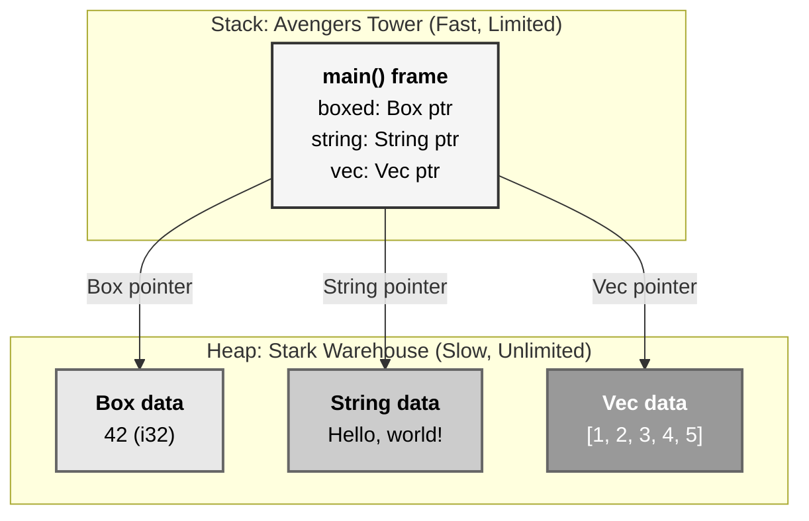
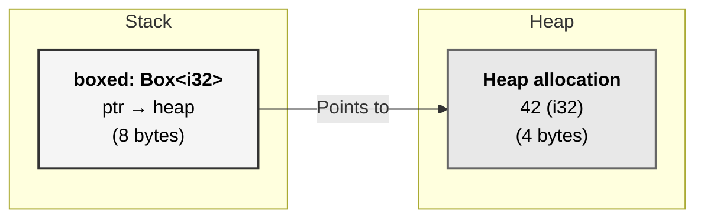
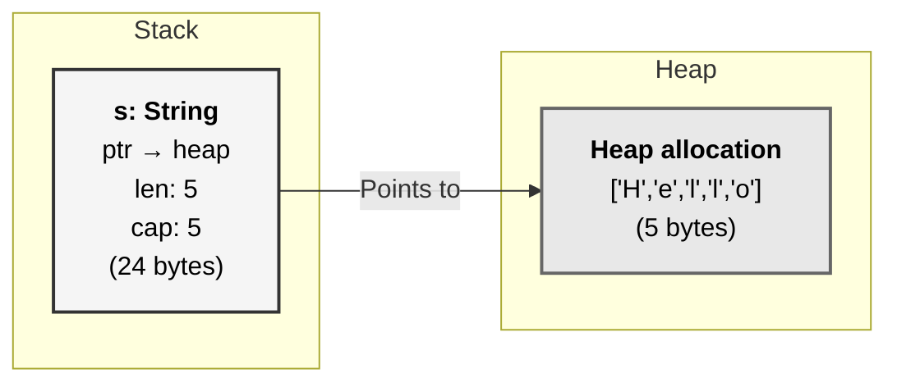
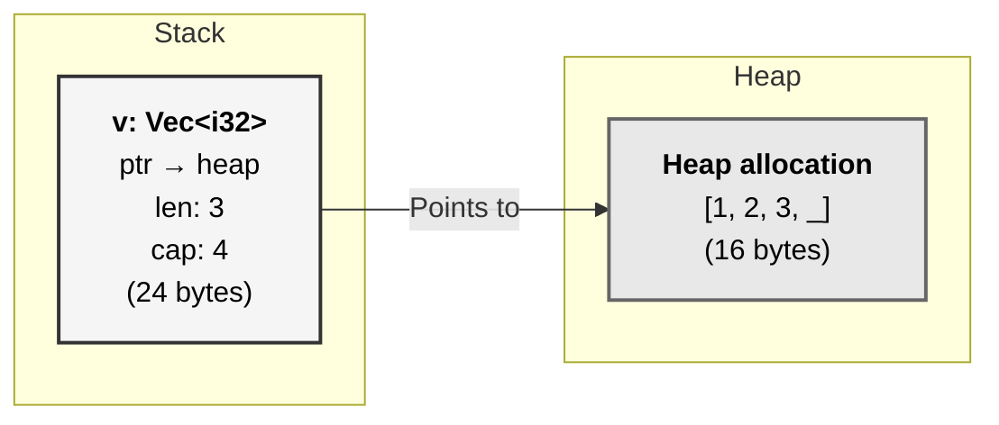
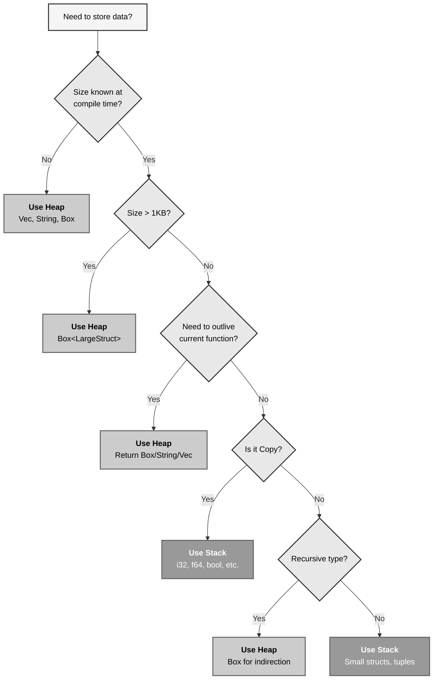
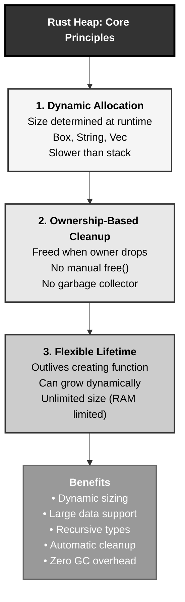

# Rust Heap Memory: The Stark Industries Warehouse Pattern

## The Answer (Minto Pyramid)

**The heap is a region of memory for dynamic allocation where data with runtime-determined sizes can be stored, managed through smart pointers like Box<T>, String, and Vec<T>.**

Unlike stack allocation (compile-time sized, LIFO, automatic), heap allocation allows variable-sized data that outlives function calls. Allocation is slower (requires finding free space and tracking metadata), but the heap is much larger (~gigabytes) and provides flexible lifetime control. Rust's ownership system ensures heap data is freed exactly once when the owner is dropped—no garbage collector needed.

**Three Supporting Principles:**

1. **Dynamic Sizing**: Size can be determined at runtime, not compile time
2. **Explicit Allocation**: Use `Box::new()`, `String::from()`, `Vec::new()` to allocate
3. **Ownership-Based Cleanup**: Heap memory freed when owner drops (RAII)

**Why This Matters**: Heap allocation enables data structures that grow dynamically (vectors, strings, trees), data that outlives its creating function, and recursive types. Understanding when to use heap vs stack is critical for both correctness (avoiding stack overflow) and performance (heap is 10-50x slower).

---

## The MCU Metaphor: Stark Industries Warehouse

Think of Rust's heap like Stark Industries' massive warehouse facility:

### The Mapping

| Stark Industries Warehouse | Rust Heap |
|----------------------------|-----------|
| **Huge warehouse space** | Heap size (~GB) vs stack (~MB) |
| **Dynamic inventory** | Runtime-sized allocations |
| **Slower forklift access** | Slower than stack pointer |
| **Items stay until retrieved** | Data persists until owner drops |
| **Unlimited storage duration** | Not limited to function scope |
| **Barcode tracking system** | Pointers track heap locations |
| **Warehouse manager (JARVIS)** | Memory allocator |
| **Checkout = cleanup** | Drop trait frees memory |

### The Story

Tony Stark's Tower has limited floors (the stack), but his warehouse facility is massive. When Tony needs to store large equipment—say, dozens of Iron Man suits or the Hulkbuster armor—he doesn't cram them into the Tower. He sends them to the warehouse where there's unlimited space and they can stay indefinitely.

Accessing warehouse items is slower (forklift vs elevator), but JARVIS tracks everything with barcodes (pointers). When Tony's done with an item, he explicitly checks it out and JARVIS handles the cleanup. No manual memory management—the system knows when items are no longer needed.

Similarly, when Rust needs dynamic data (a `Vec` that grows, a `String` of unknown length, or a recursive tree), it uses heap allocation. A small pointer lives on the stack (like the barcode), pointing to the large data in the heap (like the warehouse). When the owner drops, Rust automatically frees the heap memory—no garbage collector, no manual `free()`.

---

## The Problem Without Heap

Before understanding heap allocation, developers face limitations:

```rust path=null start=null
// ❌ PROBLEM: Can't determine size at compile time
fn create_buffer(size: usize) -> [u8; size] {
    // ERROR: size must be known at compile time
    [0u8; size]
}

// ❌ PROBLEM: Stack overflow with large data
fn process() {
    let huge = [0u8; 10_000_000];  // 10MB on stack!
    // Stack overflow!
}

// ❌ PROBLEM: Can't return dynamically-sized data
fn read_file(path: &str) -> ??? {
    // File size unknown until runtime
    // Can't use fixed-size array
}

// ❌ PROBLEM: Recursive types require indirection
// struct Node {
//     value: i32,
//     next: Option<Node>,  // ERROR: infinite size!
// }
```

**Problems:**

1. **No Dynamic Sizing**: Stack requires compile-time known sizes
2. **Size Limits**: Stack is tiny (~2-8MB), large data doesn't fit
3. **Scope Limitations**: Can't return data larger than stack allows
4. **Recursive Types**: Can't define types containing themselves

```c path=null start=null
// C - Manual heap management nightmare
#include <stdlib.h>

void process() {
    // Allocate on heap
    int* data = malloc(1000 * sizeof(int));
    
    if (data == NULL) {
        // Allocation failed - manual check needed
        return;
    }
    
    // Use data...
    
    free(data);  // Manual free - easy to forget!
    // Use-after-free possible
    // Double-free possible
    // Memory leak if forgotten
}

int* create_array() {
    int* arr = malloc(100 * sizeof(int));
    return arr;  // Caller must free - unclear ownership
}
```

**Problems:**

1. **Manual Management**: Must remember to `free()`
2. **Unclear Ownership**: Who owns the memory? Who frees it?
3. **Easy to Leak**: Forget `free()` → memory leak
4. **Use-After-Free**: Access after `free()` → undefined behavior
5. **Double-Free**: Call `free()` twice → crash

---

## The Solution: Heap with Ownership

Rust's heap allocation combines flexibility with safety:

```rust path=null start=null
fn main() {
    // Stack: 8 bytes (pointer)
    // Heap: 4 bytes (i32)
    let boxed = Box::new(42);
    
    // Stack: 24 bytes (ptr, len, cap)
    // Heap: 13 bytes ("Hello, world!")
    let string = String::from("Hello, world!");
    
    // Stack: 24 bytes (ptr, len, cap)
    // Heap: 20 bytes (5 × i32)
    let vector = vec![1, 2, 3, 4, 5];
    
    println!("Boxed: {}", boxed);
    println!("String: {}", string);
    println!("Vector: {:?}", vector);
    
    // When main ends:
    // 1. boxed drops → heap memory freed
    // 2. string drops → heap memory freed
    // 3. vector drops → heap memory freed
    // All automatic - no manual cleanup!
}
```

### Box<T>: Single Heap Allocation

```rust path=null start=null
fn main() {
    // Allocate i32 on heap
    let x = Box::new(5);
    
    println!("x: {}", x);  // Auto-deref: Box<i32> → i32
    
    // x dropped here → heap freed automatically
}
```

### String: Heap-Allocated Text

```rust path=null start=null
fn main() {
    let mut s = String::new();  // Empty, on heap
    s.push_str("Hello");        // Grows as needed
    s.push_str(", world!");     // Heap reallocates if needed
    
    println!("{}", s);
    
    // s dropped → heap freed
}
```

### Vec<T>: Dynamic Array

```rust path=null start=null
fn main() {
    let mut v = Vec::new();  // Empty, on heap
    v.push(1);               // Grows as needed
    v.push(2);
    v.push(3);
    
    println!("{:?}", v);
    
    // v dropped → heap freed
}
```

---

## Visual Mental Model



### Box<T> Memory Layout



### String Memory Layout



### Vec<T> Memory Layout



---

## Anatomy of Heap Allocation

### 1. Box<T>: Single Value on Heap

```rust path=null start=null
fn main() {
    // Allocate single i32 on heap
    let x = Box::new(42);
    
    println!("Value: {}", x);      // Auto-deref
    println!("Pointer: {:p}", &*x); // Address on heap
    
    // Can move Box (moves pointer, not data)
    let y = x;  // x moved to y
    
    // println!("{}", x);  // ❌ ERROR: x moved
    println!("{}", y);     // ✅ OK
    
    // y dropped → heap freed
}

fn use_box() -> Box<i32> {
    let b = Box::new(100);
    b  // Return Box (ownership transferred)
    // Heap data survives function return!
}
```

### 2. String: Dynamic Text

```rust path=null start=null
fn main() {
    // Create empty String (heap-allocated)
    let mut s = String::new();
    println!("Empty - len: {}, cap: {}", s.len(), s.capacity());
    
    // Add text - may reallocate
    s.push_str("Hello");
    println!("After 'Hello' - len: {}, cap: {}", s.len(), s.capacity());
    
    // Add more - might grow capacity
    s.push_str(", world!");
    println!("After ', world!' - len: {}, cap: {}", s.len(), s.capacity());
    
    // Reserve space to avoid reallocations
    let mut s2 = String::with_capacity(100);
    println!("Reserved - len: {}, cap: {}", s2.len(), s2.capacity());
    
    s2.push_str("No reallocation needed");
    println!("After push - len: {}, cap: {}", s2.len(), s2.capacity());
}
```

**Capacity Growth:**

```text
String::new()              → cap: 0
After first push/push_str  → cap: 8 (or similar)
When full                  → cap: 16 (doubles)
When full again            → cap: 32 (doubles)
...
```

### 3. Vec<T>: Dynamic Array

```rust path=null start=null
fn main() {
    // Create empty Vec
    let mut v = Vec::new();
    println!("Empty - len: {}, cap: {}", v.len(), v.capacity());
    
    // Add elements - grows as needed
    v.push(1);
    println!("After 1 - len: {}, cap: {}", v.len(), v.capacity());
    
    v.push(2);
    v.push(3);
    v.push(4);
    println!("After 4 - len: {}, cap: {}", v.len(), v.capacity());
    
    v.push(5);  // Might trigger reallocation
    println!("After 5 - len: {}, cap: {}", v.len(), v.capacity());
    
    // Pre-allocate to avoid reallocations
    let mut v2 = Vec::with_capacity(100);
    for i in 0..50 {
        v2.push(i);  // No reallocation needed
    }
    println!("Pre-allocated - len: {}, cap: {}", v2.len(), v2.capacity());
}
```

### 4. Recursive Types with Box

```rust path=null start=null
// ❌ ERROR: Infinite size
// enum List {
//     Cons(i32, List),  // List contains List → infinite!
//     Nil,
// }

// ✅ SOLUTION: Box provides indirection
enum List {
    Cons(i32, Box<List>),  // Box is fixed size (pointer)
    Nil,
}

fn main() {
    // Build linked list: 1 → 2 → 3 → Nil
    let list = List::Cons(1,
        Box::new(List::Cons(2,
            Box::new(List::Cons(3,
                Box::new(List::Nil)
            ))
        ))
    );
    
    // Each Cons node on heap
    // Stack only holds first Box pointer
    print_list(&list);
}

fn print_list(list: &List) {
    match list {
        List::Cons(value, next) => {
            print!("{} → ", value);
            print_list(next);
        }
        List::Nil => println!("Nil"),
    }
}
```

### 5. Heap Allocation Lifecycle

```rust path=null start=null
fn main() {
    println!("1. Before allocation");
    
    {
        println!("2. Allocating Box");
        let b = Box::new(vec![1, 2, 3]);
        
        println!("3. Using Box");
        println!("Box contains: {:?}", b);
        
        println!("4. About to drop Box");
    }  // b dropped here → heap freed
    
    println!("5. After Box dropped");
}
```

**Timeline:**

```text
1. Before allocation → Heap: []
2. Box::new(...)     → Heap: [Vec data]
3. Using Box         → Heap: [Vec data] (still allocated)
4. Scope ends        → Drop called
5. After drop        → Heap: [] (freed)
```

---

## Common Heap Patterns

### Pattern 1: Box for Large Data

```rust path=null start=null
struct LargeStruct {
    data: [u8; 10000],  // 10KB
}

fn main() {
    // ❌ Would use 10KB of stack
    // let large = LargeStruct { data: [0; 10000] };
    
    // ✅ Use Box - only 8 bytes on stack
    let large = Box::new(LargeStruct { data: [0; 10000] });
    
    println!("Size on stack: {}", std::mem::size_of_val(&large));  // 8
    println!("Size on heap: {}", std::mem::size_of::<LargeStruct>());  // 10000
}
```

### Pattern 2: Vec for Dynamic Collections

```rust path=null start=null
fn read_numbers() -> Vec<i32> {
    let mut numbers = Vec::new();
    
    // Read unknown number of inputs
    let inputs = vec![10, 20, 30, 40, 50];  // Simulated input
    
    for num in inputs {
        numbers.push(num);
    }
    
    numbers  // Return ownership
}

fn main() {
    let nums = read_numbers();
    println!("Read {} numbers", nums.len());
    println!("Numbers: {:?}", nums);
}
```

### Pattern 3: String for Dynamic Text

```rust path=null start=null
fn build_message(name: &str, age: u32) -> String {
    let mut message = String::from("Hello, ");
    message.push_str(name);
    message.push_str("! You are ");
    message.push_str(&age.to_string());
    message.push_str(" years old.");
    message  // Return ownership
}

fn main() {
    let msg = build_message("Alice", 30);
    println!("{}", msg);
}
```

### Pattern 4: Box<dyn Trait> for Trait Objects

```rust path=null start=null
trait Animal {
    fn speak(&self);
}

struct Dog;
impl Animal for Dog {
    fn speak(&self) {
        println!("Woof!");
    }
}

struct Cat;
impl Animal for Cat {
    fn speak(&self) {
        println!("Meow!");
    }
}

fn main() {
    // Heterogeneous collection of animals
    let animals: Vec<Box<dyn Animal>> = vec![
        Box::new(Dog),
        Box::new(Cat),
        Box::new(Dog),
    ];
    
    for animal in &animals {
        animal.speak();
    }
}
```

### Pattern 5: Rc<T> for Shared Ownership

```rust path=null start=null
use std::rc::Rc;

struct Node {
    value: i32,
    children: Vec<Rc<Node>>,
}

fn main() {
    let leaf = Rc::new(Node {
        value: 3,
        children: vec![],
    });
    
    // Both branch1 and branch2 share ownership of leaf
    let branch1 = Rc::new(Node {
        value: 1,
        children: vec![Rc::clone(&leaf)],
    });
    
    let branch2 = Rc::new(Node {
        value: 2,
        children: vec![Rc::clone(&leaf)],
    });
    
    println!("Leaf ref count: {}", Rc::strong_count(&leaf));  // 3
    
    // leaf freed when all Rc instances dropped
}
```

---

## Heap vs Stack Decision Making



### Decision Matrix

| Use Heap When | Use Stack When |
|---------------|----------------|
| Size unknown until runtime | Size known at compile time |
| Large data (> 1KB) | Small data (< 1KB) |
| Needs to outlive function | Scoped to function |
| Dynamic growth needed | Fixed size |
| Recursive types | Simple types |
| Shared ownership (Rc/Arc) | Single owner |

---

## Real-World Use Cases

### Use Case 1: File Reading

```rust path=null start=null
use std::fs;
use std::io;

fn read_file_to_string(path: &str) -> io::Result<String> {
    // File size unknown at compile time
    // Must use String (heap-allocated)
    fs::read_to_string(path)
}

fn read_file_to_vec(path: &str) -> io::Result<Vec<u8>> {
    // File size unknown at compile time
    // Must use Vec (heap-allocated)
    fs::read(path)
}

fn main() -> io::Result<()> {
    let content = read_file_to_string("example.txt")?;
    println!("File contains {} bytes", content.len());
    
    let bytes = read_file_to_vec("example.txt")?;
    println!("File as bytes: {} bytes", bytes.len());
    
    Ok(())
}
```

### Use Case 2: Dynamic Data Structures

```rust path=null start=null
struct Graph {
    nodes: Vec<Node>,
    edges: Vec<Edge>,
}

struct Node {
    id: usize,
    data: String,
}

struct Edge {
    from: usize,
    to: usize,
    weight: f64,
}

impl Graph {
    fn new() -> Self {
        Self {
            nodes: Vec::new(),
            edges: Vec::new(),
        }
    }
    
    fn add_node(&mut self, data: String) -> usize {
        let id = self.nodes.len();
        self.nodes.push(Node { id, data });
        id
    }
    
    fn add_edge(&mut self, from: usize, to: usize, weight: f64) {
        self.edges.push(Edge { from, to, weight });
    }
}

fn main() {
    let mut graph = Graph::new();
    
    let n1 = graph.add_node(String::from("Node 1"));
    let n2 = graph.add_node(String::from("Node 2"));
    let n3 = graph.add_node(String::from("Node 3"));
    
    graph.add_edge(n1, n2, 1.5);
    graph.add_edge(n2, n3, 2.0);
    graph.add_edge(n1, n3, 3.0);
    
    println!("Graph has {} nodes and {} edges", 
        graph.nodes.len(), 
        graph.edges.len());
}
```

### Use Case 3: Configuration Management

```rust path=null start=null
use std::collections::HashMap;

struct Config {
    settings: HashMap<String, String>,
    plugins: Vec<String>,
}

impl Config {
    fn new() -> Self {
        Self {
            settings: HashMap::new(),
            plugins: Vec::new(),
        }
    }
    
    fn set(&mut self, key: String, value: String) {
        self.settings.insert(key, value);
    }
    
    fn get(&self, key: &str) -> Option<&String> {
        self.settings.get(key)
    }
    
    fn add_plugin(&mut self, plugin: String) {
        self.plugins.push(plugin);
    }
    
    fn load_from_file(path: &str) -> std::io::Result<Self> {
        // Read config from file (dynamic size)
        let content = std::fs::read_to_string(path)?;
        
        let mut config = Config::new();
        for line in content.lines() {
            if let Some((key, value)) = line.split_once('=') {
                config.set(key.to_string(), value.to_string());
            }
        }
        
        Ok(config)
    }
}

fn main() -> std::io::Result<()> {
    let mut config = Config::new();
    config.set(String::from("host"), String::from("localhost"));
    config.set(String::from("port"), String::from("8080"));
    config.add_plugin(String::from("auth"));
    config.add_plugin(String::from("logging"));
    
    println!("Host: {}", config.get("host").unwrap());
    println!("Plugins: {}", config.plugins.len());
    
    Ok(())
}
```

### Use Case 4: Binary Tree

```rust path=null start=null
#[derive(Debug)]
struct TreeNode {
    value: i32,
    left: Option<Box<TreeNode>>,
    right: Option<Box<TreeNode>>,
}

impl TreeNode {
    fn new(value: i32) -> Self {
        Self {
            value,
            left: None,
            right: None,
        }
    }
    
    fn insert(&mut self, value: i32) {
        if value < self.value {
            match &mut self.left {
                Some(node) => node.insert(value),
                None => self.left = Some(Box::new(TreeNode::new(value))),
            }
        } else {
            match &mut self.right {
                Some(node) => node.insert(value),
                None => self.right = Some(Box::new(TreeNode::new(value))),
            }
        }
    }
    
    fn contains(&self, value: i32) -> bool {
        if value == self.value {
            true
        } else if value < self.value {
            self.left.as_ref().map_or(false, |node| node.contains(value))
        } else {
            self.right.as_ref().map_or(false, |node| node.contains(value))
        }
    }
}

fn main() {
    let mut tree = TreeNode::new(10);
    tree.insert(5);
    tree.insert(15);
    tree.insert(3);
    tree.insert(7);
    tree.insert(12);
    tree.insert(20);
    
    println!("Tree contains 7: {}", tree.contains(7));
    println!("Tree contains 100: {}", tree.contains(100));
}
```

---

## Comparing Heap Across Languages

### Rust vs C

```c path=null start=null
// C - Manual heap management
#include <stdlib.h>
#include <string.h>

void process() {
    // Allocate on heap
    int* numbers = malloc(10 * sizeof(int));
    if (numbers == NULL) {
        return;  // Allocation failed
    }
    
    // Use numbers...
    for (int i = 0; i < 10; i++) {
        numbers[i] = i;
    }
    
    // Must manually free
    free(numbers);
    
    // Easy to forget free() → memory leak
    // Use after free() → undefined behavior
}

char* create_string() {
    char* str = malloc(100);
    strcpy(str, "Hello");
    return str;  // Caller must free - unclear!
}
```

**Rust Equivalent:**

```rust path=null start=null
fn process() {
    // Allocate on heap
    let mut numbers = vec![0; 10];
    
    // Use numbers...
    for i in 0..10 {
        numbers[i] = i;
    }
    
    // Automatic free when numbers drops
    // No manual memory management!
}

fn create_string() -> String {
    let s = String::from("Hello");
    s  // Ownership transferred - clear!
}  // No manual free needed
```

**Key Differences:**

| Aspect | C | Rust |
|--------|---|------|
| **Allocation** | `malloc()` | `Box::new()`, `Vec::new()`, `String::from()` |
| **Deallocation** | Manual `free()` | Automatic (Drop trait) |
| **Ownership** | Unclear | Explicit |
| **Safety** | Unsafe (UB possible) | Safe (compiler enforced) |
| **Memory leaks** | Easy | Difficult (ownership prevents) |

### Rust vs Java

```java path=null start=null
// Java - Garbage collected heap
public class Example {
    public void process() {
        // Everything (except primitives) on heap
        ArrayList<Integer> numbers = new ArrayList<>();
        
        for (int i = 0; i < 10; i++) {
            numbers.add(i);  // Auto-growing
        }
        
        // No manual cleanup - GC handles it
        // But: GC pauses, unpredictable timing
    }
    
    public String createString() {
        String s = "Hello";
        return s;  // GC tracks references
    }
}
```

**Rust Equivalent:**

```rust path=null start=null
fn process() {
    let mut numbers = Vec::new();
    
    for i in 0..10 {
        numbers.push(i);
    }
    
    // Deterministic cleanup when numbers drops
    // No GC pauses!
}

fn create_string() -> String {
    let s = String::from("Hello");
    s  // Ownership transferred
}
```

**Key Differences:**

| Aspect | Java | Rust |
|--------|------|------|
| **Memory model** | GC heap | Ownership heap |
| **Cleanup** | Non-deterministic (GC) | Deterministic (Drop) |
| **Performance** | GC pauses | No pauses |
| **Overhead** | GC metadata | None |
| **Predictability** | Less predictable | Fully predictable |

### Rust vs C++

```cpp path=null start=null
// C++ - Manual or smart pointers
#include <memory>
#include <vector>
#include <string>

void process() {
    // Smart pointer (RAII)
    std::unique_ptr<int> num = std::make_unique<int>(42);
    
    // Auto-growing vector (heap-allocated)
    std::vector<int> numbers = {1, 2, 3, 4, 5};
    
    // String (heap-allocated)
    std::string text = "Hello";
    
    // Automatic cleanup when scope ends
    // But: easy to mix manual and automatic
}

int* manual_alloc() {
    int* p = new int(42);
    return p;  // Caller must delete - easy to forget!
}
```

**Rust Equivalent:**

```rust path=null start=null
fn process() {
    let num = Box::new(42);
    let numbers = vec![1, 2, 3, 4, 5];
    let text = String::from("Hello");
    
    // Automatic cleanup - no choice!
}

fn create_box() -> Box<i32> {
    let b = Box::new(42);
    b  // Ownership transferred
}
```

**Key Differences:**

| Aspect | C++ | Rust |
|--------|-----|------|
| **Smart pointers** | Optional (`unique_ptr`, `shared_ptr`) | Default (Box, Rc, Arc) |
| **Manual allocation** | Possible (`new`/`delete`) | Not allowed |
| **Memory safety** | Opt-in (smart pointers) | Default (ownership) |
| **Mixing styles** | Possible (error-prone) | Not possible |

---

## Advanced Heap Concepts

### Concept 1: Custom Allocators

```rust path=null start=null
use std::alloc::{GlobalAlloc, System, Layout};

struct CountingAllocator;

unsafe impl GlobalAlloc for CountingAllocator {
    unsafe fn alloc(&self, layout: Layout) -> *mut u8 {
        println!("Allocating {} bytes", layout.size());
        System.alloc(layout)
    }
    
    unsafe fn dealloc(&self, ptr: *mut u8, layout: Layout) {
        println!("Deallocating {} bytes", layout.size());
        System.dealloc(ptr, layout)
    }
}

#[global_allocator]
static ALLOCATOR: CountingAllocator = CountingAllocator;

fn main() {
    let v = vec![1, 2, 3, 4, 5];
    println!("Vec created");
    drop(v);
    println!("Vec dropped");
}
```

### Concept 2: Memory Fragmentation

```rust path=null start=null
fn demonstrate_fragmentation() {
    let mut allocations: Vec<Box<[u8; 1000]>> = Vec::new();
    
    // Allocate many small blocks
    for _ in 0..1000 {
        allocations.push(Box::new([0; 1000]));
    }
    
    // Free every other block
    for i in (0..allocations.len()).step_by(2) {
        allocations[i] = Box::new([0; 1000]);
    }
    
    // Heap now fragmented with holes
    // Might not be able to allocate large contiguous block
}
```

### Concept 3: Memory Pools

```rust path=null start=null
struct Pool {
    data: Vec<Box<[u8; 1024]>>,
}

impl Pool {
    fn new(size: usize) -> Self {
        let mut data = Vec::with_capacity(size);
        for _ in 0..size {
            data.push(Box::new([0; 1024]));
        }
        Self { data }
    }
    
    fn acquire(&mut self) -> Option<Box<[u8; 1024]>> {
        self.data.pop()
    }
    
    fn release(&mut self, item: Box<[u8; 1024]>) {
        self.data.push(item);
    }
}

fn main() {
    let mut pool = Pool::new(10);
    
    let item = pool.acquire().unwrap();
    // Use item...
    pool.release(item);  // Return to pool
}
```

---

## Common Pitfalls and Solutions

### Pitfall 1: Unnecessary Box

```rust path=null start=null
// ❌ UNNECESSARY - i32 is small
fn bad() -> Box<i32> {
    Box::new(42)  // Heap allocation for 4 bytes!
}

// ✅ BETTER - Just use i32
fn good() -> i32 {
    42  // Stack only
}
```

### Pitfall 2: Growing Without Capacity

```rust path=null start=null
// ❌ BAD - Many reallocations
fn bad() -> Vec<i32> {
    let mut v = Vec::new();
    for i in 0..1000 {
        v.push(i);  // Reallocates multiple times
    }
    v
}

// ✅ GOOD - Pre-allocate
fn good() -> Vec<i32> {
    let mut v = Vec::with_capacity(1000);
    for i in 0..1000 {
        v.push(i);  // No reallocations
    }
    v
}
```

### Pitfall 3: Memory Leaks with Rc Cycles

```rust path=null start=null
use std::rc::Rc;
use std::cell::RefCell;

struct Node {
    value: i32,
    next: Option<Rc<RefCell<Node>>>,
}

// ❌ CREATES CYCLE - Memory leak!
fn create_cycle() {
    let a = Rc::new(RefCell::new(Node {
        value: 1,
        next: None,
    }));
    
    let b = Rc::new(RefCell::new(Node {
        value: 2,
        next: Some(Rc::clone(&a)),
    }));
    
    a.borrow_mut().next = Some(Rc::clone(&b));
    // a → b → a (cycle!)
    // Memory never freed - leak!
}

// ✅ SOLUTION - Use Weak references
use std::rc::Weak;

struct SafeNode {
    value: i32,
    next: Option<Rc<RefCell<SafeNode>>>,
    prev: Option<Weak<RefCell<SafeNode>>>,  // Weak breaks cycle
}
```

---

## Performance Implications

### Heap Allocation Cost

```rust path=null start=null
use std::time::Instant;

fn benchmark_stack() {
    let start = Instant::now();
    for _ in 0..1_000_000 {
        let x = [0u8; 100];
        std::hint::black_box(&x);
    }
    println!("Stack: {:?}", start.elapsed());
}

fn benchmark_heap() {
    let start = Instant::now();
    for _ in 0..1_000_000 {
        let v = vec![0u8; 100];
        std::hint::black_box(&v);
    }
    println!("Heap: {:?}", start.elapsed());
}

fn main() {
    benchmark_stack();  // ~10-20ms
    benchmark_heap();   // ~100-500ms (10-50x slower!)
}
```

### Reallocation Cost

```rust path=null start=null
fn without_capacity() {
    let start = std::time::Instant::now();
    let mut v = Vec::new();
    for i in 0..100_000 {
        v.push(i);  // Many reallocations
    }
    println!("Without capacity: {:?}", start.elapsed());
}

fn with_capacity() {
    let start = std::time::Instant::now();
    let mut v = Vec::with_capacity(100_000);
    for i in 0..100_000 {
        v.push(i);  // No reallocations
    }
    println!("With capacity: {:?}", start.elapsed());
}

fn main() {
    without_capacity();  // ~2x slower
    with_capacity();     // Faster
}
```

---

## Key Takeaways



### The Mental Model

Think of the heap like Stark Industries Warehouse:
- **Huge warehouse** → Heap is much larger than stack
- **Dynamic inventory** → Runtime-sized allocations
- **Slower access** → Heap allocation slower than stack
- **Items stay until retrieved** → Data persists until owner drops
- **Barcode tracking** → Pointers track heap locations

### Core Principles

1. **Dynamic Allocation**: Size determined at runtime, not compile time
2. **Ownership-Based Cleanup**: Heap freed when owner drops (RAII)
3. **Explicit Types**: Box<T>, String, Vec<T>, Rc<T>, Arc<T>
4. **Slower but Flexible**: 10-50x slower than stack, but unlimited lifetime
5. **No GC Overhead**: Deterministic cleanup, no pause times

### Decision Guide

| Use Heap When | Use Stack When |
|---------------|----------------|
| Size unknown until runtime | Size known at compile time |
| Large data (> 1KB) | Small data (< 1KB) |
| Needs to outlive function | Scoped to function |
| Dynamic growth required | Fixed size sufficient |
| Recursive types | Simple types |
| Shared ownership needed | Single owner |

### The Guarantee

Heap allocation in Rust provides:
- **Safety**: No manual memory management, no leaks
- **Flexibility**: Dynamic sizing, flexible lifetime
- **Performance**: No GC pauses, predictable timing
- **Correctness**: Ownership prevents use-after-free

All achieved through **ownership-based RAII** without garbage collection.

---

**Remember**: The heap isn't just bigger—it's **fundamentally more flexible**. Like Stark's warehouse providing unlimited storage for equipment that doesn't fit in the Tower, Rust's heap handles dynamic data that can't live on the limited stack. Use it when you need runtime sizing, large allocations, or data that outlives its creating function—and let ownership handle cleanup automatically.
