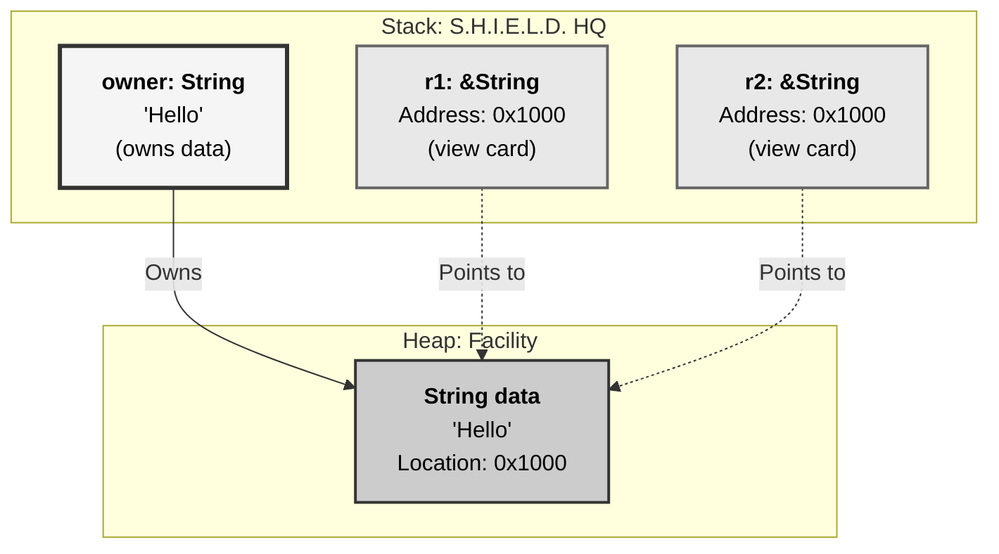
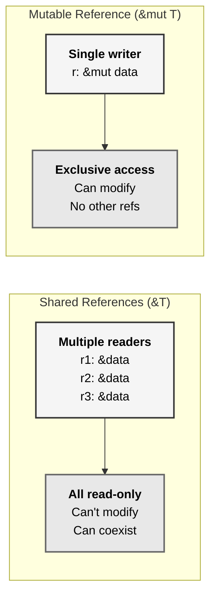
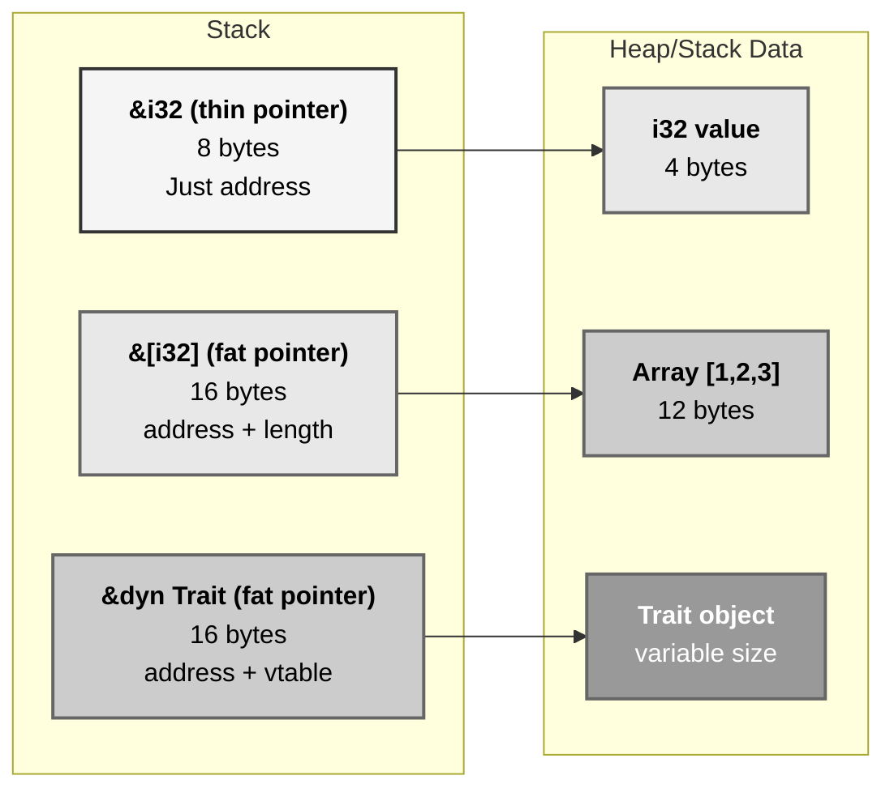
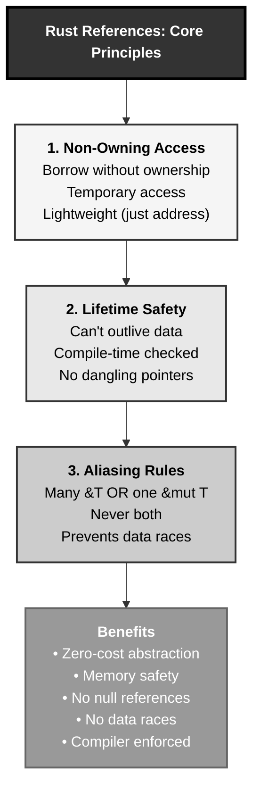

# Rust References in Memory: The S.H.I.E.L.D. Access Card Pattern

## The Answer (Minto Pyramid)

**References are non-owning pointers that provide temporary, safe access to data without transferring ownership, enforced by Rust's borrow checker at compile time.**

A reference (`&T` or `&mut T`) is a memory address pointing to data owned by someone else. Unlike raw pointers in C, Rust references are guaranteed valid—they can't outlive the data they point to, can't be null, and follow strict aliasing rules (many shared reads XOR one mutable write). References are lightweight (just an address on stack) but enable safe, zero-cost abstraction over shared and mutable access patterns.

**Three Supporting Principles:**

1. **Non-Owning**: References borrow data temporarily without taking ownership
2. **Lifetime-Bound**: References can't outlive the data they point to (enforced at compile time)
3. **Aliasing Rules**: Either many `&T` OR one `&mut T`, never both simultaneously

**Why This Matters**: References enable efficient data sharing without copying, safe mutation without ownership transfer, and zero-cost abstractions for building complex data structures. Understanding reference memory layout and borrow rules is fundamental to writing idiomatic, performant Rust code.

---

## The MCU Metaphor: S.H.I.E.L.D. Access Cards

Think of Rust references like S.H.I.E.L.D.'s security access system:

### The Mapping

| S.H.I.E.L.D. Access Cards | Rust References |
|---------------------------|-----------------|
| **Access card (not ownership)** | Reference borrows, doesn't own |
| **View-only card (&T)** | Shared reference (immutable) |
| **Modify card (&mut T)** | Mutable reference (exclusive) |
| **Card points to facility** | Reference points to data |
| **Multiple view cards OK** | Multiple `&T` allowed |
| **Only one modify card** | Only one `&mut T` allowed |
| **Card expires, facility stays** | Borrow ends, owner keeps data |
| **Can't move facility while cards active** | Can't move/drop while borrowed |

### The Story

When S.H.I.E.L.D. agents need access to a secure facility, Nick Fury issues temporary access cards. A **view-only card** lets multiple agents observe simultaneously (shared reference `&T`)—they can look but not touch. A **modify card** grants one agent exclusive access to make changes (mutable reference `&mut T`)—nobody else can enter while modifications happen.

The cards don't grant ownership—the facility still belongs to S.H.I.E.L.D. When cards expire (borrow ends), agents return them and the facility remains intact. Critically, S.H.I.E.L.D. can't relocate or demolish a facility while access cards are active—that would invalidate the addresses on the cards!

Similarly, Rust references (`&ticket` or `&mut ticket`) provide temporary access without ownership. Multiple shared references coexist, but a mutable reference demands exclusivity. References are just addresses (like card numbers pointing to rooms), and the borrow checker ensures they never outlive their data—no dangling pointers, no data races, all checked at compile time.

---

## The Problem Without Safe References

Before understanding Rust references, developers face pointer dangers:

```c path=null start=null
// C - Unsafe pointers everywhere
#include <stdlib.h>

void dangerous() {
    int x = 42;
    int* ptr = &x;  // Pointer to stack local
    
    // Use ptr...
    
    // x goes out of scope, ptr now dangling!
}

void use_after_free() {
    int* ptr = malloc(sizeof(int));
    *ptr = 42;
    
    free(ptr);  // Memory freed
    
    printf("%d\n", *ptr);  // Use after free - UB!
}

void aliasing_nightmare() {
    int x = 42;
    int* p1 = &x;
    int* p2 = &x;
    
    *p1 = 10;  // Modify through p1
    *p2 = 20;  // Modify through p2
    
    // Which value? Compiler can't optimize safely
}
```

**Problems:**

1. **Dangling Pointers**: Pointers outlive their data
2. **Use-After-Free**: Access freed memory
3. **No Lifetime Tracking**: Compiler doesn't know when pointers are invalid
4. **Unsafe Aliasing**: Multiple mutable aliases break optimization
5. **Null Pointers**: Need constant null checks

```cpp path=null start=null
// C++ - Better but still unsafe
void cpp_problems() {
    int x = 42;
    int& ref = x;  // Reference to x
    
    // ref valid as long as x lives
    // But no compile-time enforcement of lifetimes!
}

int& return_local() {
    int local = 42;
    return local;  // Dangling reference - compiles with warning!
}
```

---

## The Solution: Safe References with Lifetimes

Rust references provide safety through compile-time checking:

```rust path=null start=null
fn main() {
    let x = 42;  // x owns the i32
    
    // Shared reference - borrow immutably
    let r1 = &x;  // r1: &i32
    let r2 = &x;  // r2: &i32
    
    println!("r1: {}, r2: {}", r1, r2);  // ✅ Multiple reads OK
    
    // Both borrows end here
    
    // Mutable reference - borrow mutably
    let r3 = &mut x;  // ❌ ERROR: x is not mutable
}

fn working_example() {
    let mut x = 42;  // x is mutable
    
    {
        let r1 = &x;
        let r2 = &x;
        println!("r1: {}, r2: {}", r1, r2);
        // r1, r2 dropped here
    }
    
    {
        let r3 = &mut x;  // ✅ OK: no other borrows active
        *r3 += 10;
        // r3 dropped here
    }
    
    println!("x: {}", x);  // 52
}
```

### Borrow Checker Prevents Errors

```rust path=null start=null
// ❌ Can't have &mut while & exists
fn no_mixed_borrows() {
    let mut x = 42;
    let r1 = &x;        // Shared borrow
    let r2 = &mut x;    // ❌ ERROR: can't borrow mutably while immutably borrowed
    println!("{}", r1);
}

// ❌ Can't have multiple &mut
fn no_multiple_mut() {
    let mut x = 42;
    let r1 = &mut x;    // First mutable borrow
    let r2 = &mut x;    // ❌ ERROR: can't borrow mutably twice
    *r1 += 1;
}

// ❌ Can't move while borrowed
fn no_move_while_borrowed() {
    let s = String::from("hello");
    let r = &s;         // Borrow
    let s2 = s;         // ❌ ERROR: can't move while borrowed
    println!("{}", r);
}

// ✅ Non-lexical lifetimes (NLL)
fn nll_works() {
    let mut x = 42;
    let r1 = &x;
    println!("{}", r1);  // r1 last used here
    // r1's lifetime ends here (not at scope end)
    
    let r2 = &mut x;     // ✅ OK: r1 no longer active
    *r2 += 10;
}
```

---

## Visual Mental Model



### Shared vs Mutable References



### Reference Memory Layout



---

## Anatomy of References

### 1. Shared References (&T)

```rust path=null start=null
fn main() {
    let x = 42;
    
    // Create shared references
    let r1: &i32 = &x;
    let r2: &i32 = &x;
    let r3: &i32 = &x;
    
    // All can read simultaneously
    println!("r1: {}, r2: {}, r3: {}", r1, r2, r3);
    
    // Can't modify through shared reference
    // *r1 += 1;  // ❌ ERROR: can't assign through &i32
    
    // Original still accessible
    println!("x: {}", x);
}

fn pass_by_reference(value: &String) {
    // Borrow value immutably
    println!("Length: {}", value.len());
    // Can't modify
    // value.push_str("!");  // ❌ ERROR: can't mutate through &String
}

fn main2() {
    let s = String::from("hello");
    pass_by_reference(&s);  // Borrow
    pass_by_reference(&s);  // Borrow again
    println!("{}", s);      // s still valid
}
```

### 2. Mutable References (&mut T)

```rust path=null start=null
fn main() {
    let mut x = 42;
    
    // Create mutable reference (exclusive)
    let r = &mut x;
    *r += 10;  // ✅ Can modify
    
    println!("r: {}", r);  // 52
    // r dropped here
    
    println!("x: {}", x);  // 52
}

fn modify(value: &mut String) {
    value.push_str(" world");  // ✅ Can modify
}

fn main2() {
    let mut s = String::from("hello");
    modify(&mut s);  // Borrow mutably
    println!("{}", s);  // "hello world"
}
```

### 3. Reborrowing

```rust path=null start=null
fn takes_reference(r: &String) {
    println!("{}", r);
}

fn takes_mut_reference(r: &mut String) {
    r.push_str("!");
}

fn main() {
    let mut s = String::from("hello");
    let r = &mut s;
    
    // Reborrow immutably from mutable reference
    takes_reference(&*r);  // ✅ Reborrow as &String
    
    // Still have mutable access
    r.push_str(" world");
    
    println!("{}", r);
}
```

### 4. Reference Lifetimes

```rust path=null start=null
// Explicit lifetimes
fn longest<'a>(x: &'a str, y: &'a str) -> &'a str {
    if x.len() > y.len() {
        x
    } else {
        y
    }
}

// Lifetime elision (compiler infers)
fn first_word(s: &str) -> &str {
    s.split_whitespace().next().unwrap_or("")
}

fn main() {
    let s1 = String::from("long string");
    let s2 = String::from("short");
    
    let result = longest(&s1, &s2);
    println!("Longest: {}", result);
}

// ❌ Dangling reference prevented
// fn dangle() -> &String {
//     let s = String::from("hello");
//     &s  // ERROR: s dropped, returning dangling reference
// }

// ✅ Return owned value
fn no_dangle() -> String {
    let s = String::from("hello");
    s  // Move ownership to caller
}
```

### 5. Interior Mutability

```rust path=null start=null
use std::cell::RefCell;

fn main() {
    let x = RefCell::new(42);
    
    // Borrow immutably
    {
        let r1 = x.borrow();  // Returns Ref<i32>
        let r2 = x.borrow();  // Multiple immutable borrows OK
        println!("r1: {}, r2: {}", r1, r2);
    }  // Borrows dropped
    
    // Borrow mutably
    {
        let mut r = x.borrow_mut();  // Returns RefMut<i32>
        *r += 10;
    }  // Mutable borrow dropped
    
    println!("x: {}", x.borrow());  // 52
    
    // ❌ Runtime panic if rules violated
    // let r1 = x.borrow();
    // let r2 = x.borrow_mut();  // PANIC: already borrowed immutably
}
```

---

## Common Reference Patterns

### Pattern 1: Borrowing for Functions

```rust path=null start=null
// Pass by immutable reference (read-only)
fn calculate_length(s: &String) -> usize {
    s.len()  // Read data without taking ownership
}

// Pass by mutable reference (modify in place)
fn append(s: &mut String, suffix: &str) {
    s.push_str(suffix);
}

fn main() {
    let mut text = String::from("hello");
    
    let len = calculate_length(&text);  // Borrow immutably
    println!("Length: {}", len);
    
    append(&mut text, " world");  // Borrow mutably
    println!("Text: {}", text);
}
```

### Pattern 2: Iterating with References

```rust path=null start=null
fn main() {
    let numbers = vec![1, 2, 3, 4, 5];
    
    // Iterate over references (don't consume vec)
    for num in &numbers {  // num: &i32
        println!("{}", num);
    }
    
    // numbers still valid
    println!("Numbers: {:?}", numbers);
    
    // Mutable iteration
    let mut values = vec![1, 2, 3];
    for val in &mut values {  // val: &mut i32
        *val *= 2;
    }
    println!("Doubled: {:?}", values);
}
```

### Pattern 3: Method Chaining with &mut self

```rust path=null start=null
struct Builder {
    value: String,
    count: u32,
}

impl Builder {
    fn new() -> Self {
        Self {
            value: String::new(),
            count: 0,
        }
    }
    
    fn add(&mut self, s: &str) -> &mut Self {
        self.value.push_str(s);
        self.count += 1;
        self  // Return mutable reference for chaining
    }
    
    fn build(self) -> String {
        format!("{} (added {} times)", self.value, self.count)
    }
}

fn main() {
    let result = Builder::new()
        .add("hello")
        .add(" ")
        .add("world")
        .build();
    
    println!("{}", result);
}
```

### Pattern 4: Slice References

```rust path=null start=null
fn main() {
    let arr = [1, 2, 3, 4, 5];
    
    // Slice references (fat pointers: address + length)
    let slice1: &[i32] = &arr[1..4];  // [2, 3, 4]
    let slice2: &[i32] = &arr[..];    // Entire array
    
    println!("slice1: {:?}", slice1);
    println!("slice2: {:?}", slice2);
    
    // String slices
    let s = String::from("hello world");
    let hello: &str = &s[0..5];
    let world: &str = &s[6..11];
    
    println!("hello: {}, world: {}", hello, world);
}
```

### Pattern 5: Option<&T> for Optional References

```rust path=null start=null
fn find_first_even(numbers: &[i32]) -> Option<&i32> {
    for num in numbers {
        if num % 2 == 0 {
            return Some(num);  // Return reference to element
        }
    }
    None
}

fn main() {
    let nums = vec![1, 3, 5, 8, 9];
    
    match find_first_even(&nums) {
        Some(num) => println!("First even: {}", num),
        None => println!("No even numbers"),
    }
    
    // nums still valid
    println!("Numbers: {:?}", nums);
}
```

---

## Reference Size and Memory Layout

### Thin Pointers (8 bytes on 64-bit)

```rust path=null start=null
use std::mem;

fn main() {
    let x = 42i32;
    let r: &i32 = &x;
    
    println!("Size of i32: {}", mem::size_of::<i32>());    // 4
    println!("Size of &i32: {}", mem::size_of::<&i32>());  // 8 (just address)
    
    let s = String::from("hello");
    let r: &String = &s;
    
    println!("Size of String: {}", mem::size_of::<String>());  // 24 (ptr, len, cap)
    println!("Size of &String: {}", mem::size_of::<&String>());  // 8 (just address)
}
```

### Fat Pointers (16 bytes on 64-bit)

```rust path=null start=null
use std::mem;

fn main() {
    // Slice reference: address + length
    let arr = [1, 2, 3, 4, 5];
    let slice: &[i32] = &arr[1..4];
    
    println!("Size of [i32; 5]: {}", mem::size_of::<[i32; 5]>());  // 20
    println!("Size of &[i32]: {}", mem::size_of::<&[i32]>());       // 16 (addr + len)
    
    // Trait object: address + vtable pointer
    trait Animal {
        fn speak(&self);
    }
    
    struct Dog;
    impl Animal for Dog {
        fn speak(&self) { println!("Woof"); }
    }
    
    let dog = Dog;
    let animal: &dyn Animal = &dog;
    
    println!("Size of Dog: {}", mem::size_of::<Dog>());              // 0 (ZST)
    println!("Size of &dyn Animal: {}", mem::size_of::<&dyn Animal>());  // 16 (addr + vtable)
}
```

---

## Real-World Use Cases

### Use Case 1: Parsing Without Copying

```rust path=null start=null
struct Parser<'a> {
    input: &'a str,
    pos: usize,
}

impl<'a> Parser<'a> {
    fn new(input: &'a str) -> Self {
        Self { input, pos: 0 }
    }
    
    fn parse_word(&mut self) -> Option<&'a str> {
        let start = self.pos;
        
        while self.pos < self.input.len() {
            if self.input.as_bytes()[self.pos].is_ascii_whitespace() {
                break;
            }
            self.pos += 1;
        }
        
        if start == self.pos {
            None
        } else {
            let result = &self.input[start..self.pos];
            self.pos += 1;  // Skip whitespace
            Some(result)
        }
    }
}

fn main() {
    let text = "hello world rust";
    let mut parser = Parser::new(text);
    
    while let Some(word) = parser.parse_word() {
        println!("Word: {}", word);  // No copying!
    }
}
```

### Use Case 2: Graph Data Structure

```rust path=null start=null
struct Node {
    value: i32,
    neighbors: Vec<usize>,  // Indices instead of references
}

struct Graph {
    nodes: Vec<Node>,
}

impl Graph {
    fn new() -> Self {
        Self { nodes: Vec::new() }
    }
    
    fn add_node(&mut self, value: i32) -> usize {
        let id = self.nodes.len();
        self.nodes.push(Node {
            value,
            neighbors: Vec::new(),
        });
        id
    }
    
    fn add_edge(&mut self, from: usize, to: usize) {
        if from < self.nodes.len() && to < self.nodes.len() {
            self.nodes[from].neighbors.push(to);
        }
    }
    
    fn get_node(&self, id: usize) -> Option<&Node> {
        self.nodes.get(id)
    }
    
    fn get_neighbors(&self, id: usize) -> Vec<&Node> {
        if let Some(node) = self.nodes.get(id) {
            node.neighbors
                .iter()
                .filter_map(|&idx| self.nodes.get(idx))
                .collect()
        } else {
            Vec::new()
        }
    }
}

fn main() {
    let mut graph = Graph::new();
    
    let n0 = graph.add_node(10);
    let n1 = graph.add_node(20);
    let n2 = graph.add_node(30);
    
    graph.add_edge(n0, n1);
    graph.add_edge(n0, n2);
    graph.add_edge(n1, n2);
    
    if let Some(node) = graph.get_node(n0) {
        println!("Node value: {}", node.value);
        let neighbors = graph.get_neighbors(n0);
        println!("Has {} neighbors", neighbors.len());
    }
}
```

### Use Case 3: Configuration Reader

```rust path=null start=null
struct Config {
    data: std::collections::HashMap<String, String>,
}

impl Config {
    fn new() -> Self {
        Self {
            data: std::collections::HashMap::new(),
        }
    }
    
    fn set(&mut self, key: String, value: String) {
        self.data.insert(key, value);
    }
    
    fn get(&self, key: &str) -> Option<&str> {
        self.data.get(key).map(|s| s.as_str())
    }
    
    fn get_or_default<'a>(&'a self, key: &str, default: &'a str) -> &'a str {
        self.get(key).unwrap_or(default)
    }
}

fn main() {
    let mut config = Config::new();
    config.set(String::from("host"), String::from("localhost"));
    config.set(String::from("port"), String::from("8080"));
    
    println!("Host: {}", config.get("host").unwrap());
    println!("Timeout: {}", config.get_or_default("timeout", "30"));
}
```

---

## Comparing References Across Languages

### Rust vs C++

```cpp path=null start=null
// C++ - References less safe
void cpp_references() {
    int x = 42;
    int& ref = x;  // Reference to x
    
    ref = 10;  // ✅ Modifies x
    
    // No lifetime tracking at compile time
    // Dangling references possible
}

int& return_local() {
    int local = 42;
    return local;  // ⚠️ Dangling reference (warning, not error)
}
```

**Rust Equivalent:**

```rust path=null start=null
fn rust_references() {
    let mut x = 42;
    let ref_val = &mut x;
    
    *ref_val = 10;  // ✅ Modifies x
    
    // Lifetime tracked at compile time
    // Dangling references impossible
}

// ❌ Can't compile
// fn return_local() -> &i32 {
//     let local = 42;
//     &local  // ERROR: borrowed value doesn't live long enough
// }
```

**Key Differences:**

| Aspect | C++ | Rust |
|--------|-----|------|
| **Lifetime checking** | Minimal (warnings) | Complete (errors) |
| **Null references** | Possible (undefined) | Impossible |
| **Dangling refs** | Possible | Prevented at compile time |
| **Aliasing rules** | Not enforced | Strictly enforced |
| **Safety** | Opt-in | Default |

---

## Key Takeaways



### The Mental Model

Think of references like S.H.I.E.L.D. access cards:
- **View card (&T)** → Multiple simultaneous readers
- **Modify card (&mut T)** → Exclusive single writer
- **Card expires** → Borrow ends, owner keeps data
- **Can't move facility** → Can't move/drop while borrowed

### Core Principles

1. **Non-Owning**: References borrow temporarily without taking ownership
2. **Lifetime-Bound**: References guaranteed valid (compile-time checked)
3. **Aliasing Rules**: Either many `&T` OR one `&mut T`, never both
4. **Zero-Cost**: References are just addresses (8-16 bytes)
5. **No Null**: References always valid (use `Option<&T>` for optional)

### The Guarantee

Rust references provide:
- **Safety**: No dangling pointers, no null derefs
- **Performance**: Zero-cost abstraction (just addresses)
- **Correctness**: Aliasing rules prevent data races
- **Ergonomics**: Automatic dereferencing in method calls

All enforced at **compile time** with **zero runtime cost**.

---

**Remember**: References aren't just pointers—they're **safe, temporary access passes**. Like S.H.I.E.L.D. access cards that grant controlled facility access without ownership, Rust references provide temporary, validated access to data. The borrow checker ensures cards never point to demolished facilities, and aliasing rules prevent conflicts between readers and writers—all checked at compile time, zero runtime overhead.
