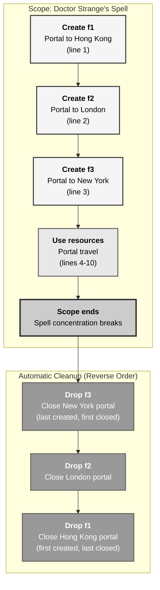
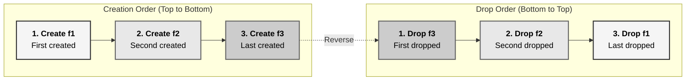
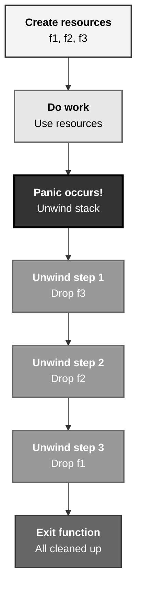
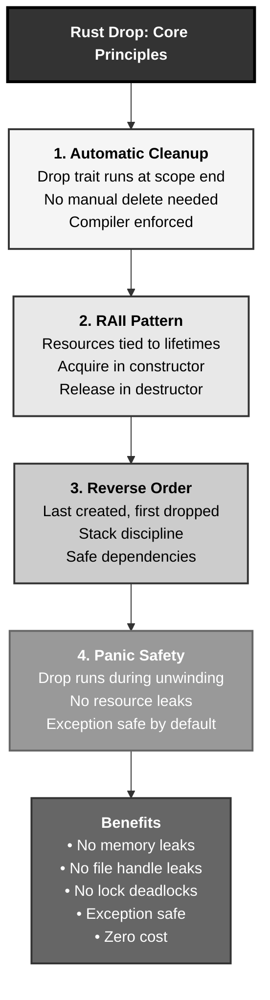

# Rust Destructors: The Doctor Strange Portal Closure Pattern

## The Answer (Minto Pyramid)

**Destructors in Rust automatically clean up resources when values go out of scope, implemented via the Drop trait and enforced by the compiler's RAII (Resource Acquisition Is Initialization) pattern.**

When a value goes out of scope, Rust automatically calls its destructor (the `drop` method from the `Drop` trait) to release resources. This happens in reverse order of declaration—last created, first destroyed. Unlike C++ where destructors are methods, Rust's `Drop` trait provides a single `drop(&mut self)` method. The compiler ensures destructors run even during panics (stack unwinding), preventing resource leaks. Copy types can't implement Drop (preventing double-free), and you can force early cleanup with `std::mem::drop`.

**Three Supporting Principles:**

1. **Automatic Cleanup**: Destructors run automatically at scope exit (no manual `delete`)
2. **RAII Enforcement**: Resources tied to object lifetimes (compile-time checked)
3. **Reverse Order**: Drop order is reverse of creation order (stack discipline)

**Why This Matters**: Destructors eliminate entire classes of bugs—memory leaks, file handle leaks, mutex deadlocks—by tying resource cleanup to scope. Understanding Drop is essential for managing files, network connections, locks, and any resource requiring cleanup.

---

## The MCU Metaphor: Doctor Strange's Portal Closure

Think of Rust destructors like Doctor Strange's mystical portals:

### The Mapping

| Doctor Strange's Portals | Rust Destructors |
|--------------------------|------------------|
| **Sling ring opens portal** | Constructor creates resource |
| **Portal auto-closes at spell end** | Drop trait runs at scope end |
| **Can't forget to close** | Compiler enforces cleanup |
| **Portals close in reverse order** | Drop order: reverse creation |
| **Manual closure possible** | `std::mem::drop()` for early cleanup |
| **Energy returns to source** | Memory/resources freed |
| **No half-open portals** | No partial cleanup (all-or-nothing) |
| **Broken concentration = cleanup** | Panic triggers unwinding & Drop |

### The Story

When Doctor Strange casts spells creating portals to other dimensions, each portal consumes mystical energy. The Ancient One taught him critical wisdom: **portals automatically close when the spell ends**—no manual closure needed. If Strange opens three portals in sequence (to Hong Kong, London, New York), they close in **reverse order** when his concentration breaks: New York, London, Hong Kong (last opened, first closed).

Strange doesn't need to remember which portals are open—the spell's scope handles it automatically. Even if Mordo interrupts his concentration (panic!), the mystical framework ensures all portals close properly during the "unwinding" of his spell, preventing dimensional breaches (resource leaks).

Similarly, Rust's destructors work like these auto-closing portals. When you create a `File`, `TcpStream`, or `Mutex`, the Drop trait ensures cleanup happens automatically at scope end. Open three files, they close in reverse order. Panic mid-function? Stack unwinding calls Drop on all live values, closing files, releasing locks, freeing memory—no leaks, all automatic.

---

## The Problem Without Automatic Destructors

Before understanding Rust destructors, developers face manual cleanup nightmares:

```c path=null start=null
// C - Manual cleanup everywhere
#include <stdio.h>
#include <stdlib.h>

void dangerous() {
    FILE* f1 = fopen("file1.txt", "r");
    FILE* f2 = fopen("file2.txt", "r");
    
    char* buffer = malloc(1024);
    
    if (some_condition) {
        // ❌ FORGOT to free buffer, close f1, f2
        return;  // Resource leak!
    }
    
    if (another_condition) {
        free(buffer);
        // ❌ FORGOT to close f1, f2
        return;  // File handle leak!
    }
    
    // Manual cleanup (tedious, error-prone)
    free(buffer);
    fclose(f2);
    fclose(f1);
}
```

**Problems:**

1. **Manual Cleanup**: Developer must remember to free every resource
2. **Early Returns**: Each exit point needs cleanup code
3. **Exception Safety**: Exceptions skip cleanup code
4. **Wrong Order**: Easy to free in wrong order (use-after-free)
5. **Double Free**: Accidentally freeing twice crashes

```cpp path=null start=null
// C++ - Better with RAII but still manual
class Resource {
public:
    Resource() { data = new int[100]; }
    ~Resource() { delete[] data; }  // Destructor
private:
    int* data;
};

void cpp_example() {
    Resource r1;  // Constructor allocates
    Resource r2;
    
    // If exception thrown here, destructors still run (good!)
    
    // Destructors run automatically at scope end
    // r2 destroyed first, then r1 (reverse order)
}

// But still need to manually implement destructors
// And easy to forget Copy/Move semantics
```

---

## The Solution: Automatic Drop Trait

Rust destructors provide automatic, safe cleanup:

```rust path=null start=null
struct FileWrapper {
    name: String,
}

impl Drop for FileWrapper {
    fn drop(&mut self) {
        println!("Closing file: {}", self.name);
    }
}

fn main() {
    let f1 = FileWrapper {
        name: String::from("file1.txt"),
    };
    
    let f2 = FileWrapper {
        name: String::from("file2.txt"),
    };
    
    let f3 = FileWrapper {
        name: String::from("file3.txt"),
    };
    
    println!("Files created");
    
    // Scope ends here
    // Drop called in REVERSE order: f3, f2, f1
}

// Output:
// Files created
// Closing file: file3.txt
// Closing file: file2.txt
// Closing file: file1.txt
```

### Drop with Early Return

```rust path=null start=null
fn safe_early_return() {
    let f1 = FileWrapper {
        name: String::from("file1.txt"),
    };
    
    let f2 = FileWrapper {
        name: String::from("file2.txt"),
    };
    
    if some_condition() {
        return;  // ✅ f2, f1 automatically dropped here!
    }
    
    let f3 = FileWrapper {
        name: String::from("file3.txt"),
    };
    
    // Normal scope end: f3, f2, f1 dropped
}

fn some_condition() -> bool { true }
```

### Manual Drop with std::mem::drop

```rust path=null start=null
fn main() {
    let f1 = FileWrapper {
        name: String::from("file1.txt"),
    };
    
    println!("File in use");
    
    // Force early drop
    drop(f1);  // ✅ f1 dropped HERE, not at scope end
    
    println!("File already closed");
    
    // Scope ends, nothing to drop
}

// Output:
// File in use
// Closing file: file1.txt
// File already closed
```

---

## Visual Mental Model



### Drop Order Visualization



### Panic Unwinding with Drop



---

## Anatomy of Drop

### 1. Basic Drop Implementation

```rust path=null start=null
struct Resource {
    id: u32,
}

impl Drop for Resource {
    fn drop(&mut self) {
        println!("Dropping resource {}", self.id);
    }
}

fn main() {
    let r1 = Resource { id: 1 };
    let r2 = Resource { id: 2 };
    let r3 = Resource { id: 3 };
    
    println!("Resources created");
    
    // Automatic drop in reverse order: r3, r2, r1
}

// Output:
// Resources created
// Dropping resource 3
// Dropping resource 2
// Dropping resource 1
```

### 2. Real-World Drop: File Handle

```rust path=null start=null
use std::fs::File;
use std::io::Write;

fn main() -> std::io::Result<()> {
    {
        let mut file = File::create("output.txt")?;
        file.write_all(b"Hello, world!")?;
        
        // File automatically closed at scope end (Drop impl)
    }  // file.drop() called here
    
    // File guaranteed closed
    println!("File closed");
    
    Ok(())
}
```

### 3. Manual Drop with std::mem::drop

```rust path=null start=null
fn main() {
    let r1 = Resource { id: 1 };
    
    println!("Before manual drop");
    
    // Force early drop
    std::mem::drop(r1);  // or just: drop(r1)
    
    println!("After manual drop");
    
    // r1 already dropped, can't use it
    // println!("{}", r1.id);  // ❌ ERROR: value used after move
}

// Output:
// Before manual drop
// Dropping resource 1
// After manual drop
```

### 4. Drop Order with Nested Scopes

```rust path=null start=null
fn main() {
    let r1 = Resource { id: 1 };
    
    {
        let r2 = Resource { id: 2 };
        
        {
            let r3 = Resource { id: 3 };
            println!("Inner scope");
            // r3 dropped here
        }
        
        println!("Middle scope");
        // r2 dropped here
    }
    
    println!("Outer scope");
    // r1 dropped here
}

// Output:
// Inner scope
// Dropping resource 3
// Middle scope
// Dropping resource 2
// Outer scope
// Dropping resource 1
```

### 5. Copy Types Can't Implement Drop

```rust path=null start=null
// ❌ Can't implement Drop for Copy types
// #[derive(Copy, Clone)]
// struct CopyType {
//     value: i32,
// }
// 
// impl Drop for CopyType {
//     fn drop(&mut self) {
//         println!("Dropping");
//     }
// }
// ERROR: Copy types can't have Drop (prevents double-free)

// ✅ Choose either Copy OR Drop, not both
struct NonCopyResource {
    data: String,  // String is not Copy
}

impl Drop for NonCopyResource {
    fn drop(&mut self) {
        println!("Dropping {}", self.data);
    }
}
```

---

## Common Drop Patterns

### Pattern 1: RAII Resource Guard

```rust path=null start=null
use std::sync::{Mutex, MutexGuard};

fn main() {
    let data = Mutex::new(vec![1, 2, 3]);
    
    {
        // Lock acquired, returns MutexGuard
        let mut guard: MutexGuard<Vec<i32>> = data.lock().unwrap();
        guard.push(4);
        
        // MutexGuard's Drop automatically unlocks mutex at scope end
    }  // Lock released here!
    
    // Can lock again immediately
    let guard = data.lock().unwrap();
    println!("Data: {:?}", *guard);
}
```

### Pattern 2: File Handle Wrapper

```rust path=null start=null
use std::fs::File;
use std::io::{Write, Result};

struct SafeFile {
    file: Option<File>,
    path: String,
}

impl SafeFile {
    fn create(path: &str) -> Result<Self> {
        let file = File::create(path)?;
        Ok(Self {
            file: Some(file),
            path: path.to_string(),
        })
    }
    
    fn write(&mut self, data: &[u8]) -> Result<()> {
        if let Some(ref mut f) = self.file {
            f.write_all(data)?;
        }
        Ok(())
    }
}

impl Drop for SafeFile {
    fn drop(&mut self) {
        println!("Closing file: {}", self.path);
        // File's Drop called automatically when Option dropped
    }
}

fn main() -> Result<()> {
    let mut file = SafeFile::create("output.txt")?;
    file.write(b"Hello")?;
    
    // File automatically closed at scope end
    Ok(())
}
```

### Pattern 3: Connection Pool Guard

```rust path=null start=null
struct Connection {
    id: u32,
}

struct ConnectionPool {
    available: Vec<Connection>,
}

struct PooledConnection<'a> {
    conn: Option<Connection>,
    pool: &'a mut ConnectionPool,
}

impl<'a> Drop for PooledConnection<'a> {
    fn drop(&mut self) {
        // Return connection to pool
        if let Some(conn) = self.conn.take() {
            println!("Returning connection {} to pool", conn.id);
            self.pool.available.push(conn);
        }
    }
}

impl ConnectionPool {
    fn new() -> Self {
        Self {
            available: vec![
                Connection { id: 1 },
                Connection { id: 2 },
                Connection { id: 3 },
            ],
        }
    }
    
    fn acquire(&mut self) -> Option<PooledConnection> {
        self.available.pop().map(|conn| PooledConnection {
            conn: Some(conn),
            pool: self,
        })
    }
}

fn main() {
    let mut pool = ConnectionPool::new();
    
    {
        let conn1 = pool.acquire().unwrap();
        println!("Using connection");
        // conn1 dropped here, returned to pool
    }
    
    println!("Available: {}", pool.available.len());  // 3 again
}
```

### Pattern 4: Timer/Profiler

```rust path=null start=null
use std::time::Instant;

struct Timer {
    name: String,
    start: Instant,
}

impl Timer {
    fn new(name: &str) -> Self {
        println!("[{}] Starting", name);
        Self {
            name: name.to_string(),
            start: Instant::now(),
        }
    }
}

impl Drop for Timer {
    fn drop(&mut self) {
        let elapsed = self.start.elapsed();
        println!("[{}] Elapsed: {:?}", self.name, elapsed);
    }
}

fn expensive_operation() {
    let _timer = Timer::new("expensive_operation");
    
    // Do work...
    std::thread::sleep(std::time::Duration::from_millis(100));
    
    // Timer automatically prints elapsed time at scope end
}

fn main() {
    expensive_operation();
}
```

### Pattern 5: Cleanup Chain

```rust path=null start=null
struct CleanupChain {
    name: String,
    next: Option<Box<CleanupChain>>,
}

impl CleanupChain {
    fn new(name: &str) -> Self {
        Self {
            name: name.to_string(),
            next: None,
        }
    }
    
    fn chain(mut self, next: CleanupChain) -> Self {
        self.next = Some(Box::new(next));
        self
    }
}

impl Drop for CleanupChain {
    fn drop(&mut self) {
        println!("Cleaning up: {}", self.name);
        // next dropped automatically after this
    }
}

fn main() {
    let chain = CleanupChain::new("step1")
        .chain(CleanupChain::new("step2")
            .chain(CleanupChain::new("step3")));
    
    println!("Chain created");
    
    // Drops in order: step1, step2, step3
}
```

---

## Drop During Panic

```rust path=null start=null
struct PanicResource {
    id: u32,
}

impl Drop for PanicResource {
    fn drop(&mut self) {
        println!("Dropping resource {} during unwinding", self.id);
    }
}

fn might_panic() {
    let r1 = PanicResource { id: 1 };
    let r2 = PanicResource { id: 2 };
    let r3 = PanicResource { id: 3 };
    
    println!("Before panic");
    
    if true {
        panic!("Something went wrong!");
    }
    
    println!("After panic");  // Never reached
}

fn main() {
    let result = std::panic::catch_unwind(|| {
        might_panic();
    });
    
    match result {
        Ok(_) => println!("Success"),
        Err(_) => println!("Caught panic"),
    }
}

// Output:
// Before panic
// Dropping resource 3 during unwinding
// Dropping resource 2 during unwinding
// Dropping resource 1 during unwinding
// Caught panic
```

---

## Real-World Use Cases

### Use Case 1: Database Transaction

```rust path=null start=null
struct Transaction<'a> {
    committed: bool,
    connection: &'a mut DatabaseConnection,
}

impl<'a> Transaction<'a> {
    fn new(conn: &'a mut DatabaseConnection) -> Self {
        conn.begin();
        Self {
            committed: false,
            connection: conn,
        }
    }
    
    fn commit(&mut self) {
        self.connection.commit();
        self.committed = true;
    }
}

impl<'a> Drop for Transaction<'a> {
    fn drop(&mut self) {
        if !self.committed {
            println!("Rolling back uncommitted transaction");
            self.connection.rollback();
        }
    }
}

struct DatabaseConnection;

impl DatabaseConnection {
    fn begin(&mut self) {
        println!("BEGIN TRANSACTION");
    }
    
    fn commit(&mut self) {
        println!("COMMIT");
    }
    
    fn rollback(&mut self) {
        println!("ROLLBACK");
    }
}

fn main() {
    let mut conn = DatabaseConnection;
    
    // Success case
    {
        let mut tx = Transaction::new(&mut conn);
        // Do work...
        tx.commit();
        // Drop called, but already committed
    }
    
    // Failure case (automatic rollback)
    {
        let mut tx = Transaction::new(&mut conn);
        // Do work...
        // Panic or early return - transaction NOT committed
        // Drop automatically rolls back!
    }
}
```

### Use Case 2: Temporary Directory

```rust path=null start=null
use std::path::{Path, PathBuf};
use std::fs;

struct TempDir {
    path: PathBuf,
}

impl TempDir {
    fn new(prefix: &str) -> std::io::Result<Self> {
        let path = PathBuf::from(format!("/tmp/{}_temp", prefix));
        fs::create_dir_all(&path)?;
        println!("Created temp dir: {:?}", path);
        Ok(Self { path })
    }
    
    fn path(&self) -> &Path {
        &self.path
    }
}

impl Drop for TempDir {
    fn drop(&mut self) {
        println!("Removing temp dir: {:?}", self.path);
        let _ = fs::remove_dir_all(&self.path);
    }
}

fn main() -> std::io::Result<()> {
    let temp = TempDir::new("test")?;
    
    // Use temp directory
    let file_path = temp.path().join("data.txt");
    fs::write(&file_path, b"temporary data")?;
    
    // Temp directory automatically cleaned up at scope end
    Ok(())
}
```

### Use Case 3: Scoped Thread Guard

```rust path=null start=null
use std::thread;
use std::sync::Arc;

struct ScopedThread {
    handle: Option<thread::JoinHandle<()>>,
}

impl ScopedThread {
    fn spawn<F>(f: F) -> Self 
    where
        F: FnOnce() + Send + 'static,
    {
        Self {
            handle: Some(thread::spawn(f)),
        }
    }
}

impl Drop for ScopedThread {
    fn drop(&mut self) {
        if let Some(handle) = self.handle.take() {
            println!("Waiting for thread to finish");
            let _ = handle.join();
            println!("Thread joined");
        }
    }
}

fn main() {
    {
        let _thread = ScopedThread::spawn(|| {
            println!("Thread working...");
            thread::sleep(std::time::Duration::from_millis(100));
            println!("Thread done");
        });
        
        println!("Main continues");
        
        // Drop automatically joins thread before scope exit
    }
    
    println!("Thread guaranteed finished");
}
```

---

## Comparing Drop Across Languages

### Rust vs C++

```cpp path=null start=null
// C++ - Destructors are methods
class Resource {
public:
    Resource(int id) : id_(id) {
        std::cout << "Created " << id_ << "\n";
    }
    
    ~Resource() {  // Destructor
        std::cout << "Destroyed " << id_ << "\n";
    }
    
    // Need to handle copy/move
    Resource(const Resource&) = delete;
    Resource& operator=(const Resource&) = delete;
    
private:
    int id_;
};

void cpp_example() {
    Resource r1(1);
    Resource r2(2);
    
    // Destructors run in reverse order: r2, r1
}
```

**Rust Equivalent:**

```rust path=null start=null
struct Resource {
    id: i32,
}

impl Resource {
    fn new(id: i32) -> Self {
        println!("Created {}", id);
        Self { id }
    }
}

impl Drop for Resource {
    fn drop(&mut self) {
        println!("Destroyed {}", self.id);
    }
}

fn rust_example() {
    let r1 = Resource::new(1);
    let r2 = Resource::new(2);
    
    // Drop runs in reverse order: r2, r1
    // Move semantics prevent double-drop automatically
}
```

**Key Differences:**

| Aspect | C++ | Rust |
|--------|-----|------|
| **Syntax** | `~ClassName()` destructor | `impl Drop for Type` trait |
| **Calling** | Automatic or manual (`delete`) | Always automatic (or `std::mem::drop`) |
| **Copy/Move** | Manual (Rule of 5) | Automatic (move by default) |
| **Double-free** | Possible (manual management) | Impossible (move semantics) |
| **Exception safety** | Opt-in (RAII) | Default (panic unwinding) |

---

## Advanced Drop Concepts

### 1. Drop Check and Lifetimes

```rust path=null start=null
// Drop checker ensures references stay valid
struct Inspector<'a> {
    data: &'a str,
}

impl<'a> Drop for Inspector<'a> {
    fn drop(&mut self) {
        // Safe to access data - still valid when drop runs
        println!("Inspecting: {}", self.data);
    }
}

fn main() {
    let text = String::from("hello");
    let inspector = Inspector { data: &text };
    
    // Drop order: inspector, then text
    // Compiler ensures text outlives inspector
}
```

### 2. ManuallyDrop for Fine-Grained Control

```rust path=null start=null
use std::mem::ManuallyDrop;

fn main() {
    let resource = ManuallyDrop::new(Resource { id: 1 });
    
    println!("Resource created but won't drop automatically");
    
    // Manually drop when ready
    unsafe {
        ManuallyDrop::drop(&mut resource);
    }
    
    println!("Manually dropped");
    
    // Scope ends, no automatic drop
}
```

### 3. Drop Flags and Optimization

```rust path=null start=null
// Compiler tracks which values need dropping
fn conditional_drop(condition: bool) {
    let r1 = Resource { id: 1 };
    
    if condition {
        drop(r1);  // Manually dropped
        return;
    }
    
    // Compiler knows: if we reach here, r1 needs dropping
    // If condition was true, r1 already dropped - no double drop
}
```

---

## Common Pitfalls and Solutions

### Pitfall 1: Forgetting Drop Doesn't Transfer Ownership

```rust path=null start=null
// ❌ WRONG: Trying to use after drop
fn pitfall() {
    let r = Resource { id: 1 };
    
    drop(r);  // r moved into drop
    
    // println!("{}", r.id);  // ❌ ERROR: value used after move
}

// ✅ CORRECT: Don't use after drop
fn correct() {
    let r = Resource { id: 1 };
    
    // Use r...
    
    drop(r);  // Done with r
    
    // Don't access r after this point
}
```

### Pitfall 2: Circular References with Rc

```rust path=null start=null
use std::rc::Rc;
use std::cell::RefCell;

#[derive(Debug)]
struct Node {
    value: i32,
    next: Option<Rc<RefCell<Node>>>,
}

impl Drop for Node {
    fn drop(&mut self) {
        println!("Dropping node {}", self.value);
    }
}

fn memory_leak() {
    let node1 = Rc::new(RefCell::new(Node {
        value: 1,
        next: None,
    }));
    
    let node2 = Rc::new(RefCell::new(Node {
        value: 2,
        next: Some(Rc::clone(&node1)),
    }));
    
    // Create cycle
    node1.borrow_mut().next = Some(Rc::clone(&node2));
    
    // ❌ Memory leak - cycle prevents drop!
}

// ✅ SOLUTION: Use Weak for back-references
use std::rc::Weak;

struct SafeNode {
    value: i32,
    next: Option<Rc<RefCell<SafeNode>>>,
    prev: Option<Weak<RefCell<SafeNode>>>,  // Weak breaks cycle
}
```

### Pitfall 3: Drop Order Dependencies

```rust path=null start=null
// ❌ Assuming wrong drop order
struct Database {
    connection: Connection,
    logger: Logger,  // Might need connection!
}

impl Drop for Database {
    fn drop(&mut self) {
        // logger dropped BEFORE connection
        // If logger.drop() needs connection, it's already gone!
    }
}

// ✅ CORRECT: Reorder fields
struct SafeDatabase {
    logger: Logger,      // Dropped FIRST
    connection: Connection,  // Dropped LAST (available for logger)
}
```

---

## Performance Implications

```rust path=null start=null
use std::time::Instant;

// Drop adds minimal overhead (just a function call)
struct Measured {
    id: u32,
}

impl Drop for Measured {
    fn drop(&mut self) {
        // Lightweight cleanup
    }
}

fn benchmark() {
    let start = Instant::now();
    
    for _ in 0..1_000_000 {
        let _m = Measured { id: 42 };
        // Drop called 1 million times
    }
    
    println!("Elapsed: {:?}", start.elapsed());
    // Typically <10ms - Drop is fast!
}

// Zero-cost abstraction: manual cleanup would be same speed
fn manual_cleanup() {
    let start = Instant::now();
    
    for _ in 0..1_000_000 {
        let m = Measured { id: 42 };
        // Manual cleanup here
        std::mem::forget(m);  // Skip drop for comparison
    }
    
    println!("Elapsed: {:?}", start.elapsed());
    // Same speed - Drop is zero-cost!
}
```

---

## Key Takeaways



### The Mental Model

Think of Drop like Doctor Strange's portals:
- **Portal opens** → Resource acquired (constructor)
- **Portal auto-closes** → Drop runs at scope end
- **Reverse order** → Last portal opened, first closed
- **Panic = unwinding** → All portals close during cleanup

### Core Principles

1. **Automatic Cleanup**: Drop runs at scope exit (no manual cleanup)
2. **RAII Enforcement**: Resources tied to object lifetimes
3. **Reverse Order**: Drop order mirrors stack (last in, first out)
4. **Panic Safety**: Drop runs during unwinding (no leaks)
5. **Zero Cost**: Drop is just a function call (compiler optimizes)

### The Guarantee

Rust Drop provides:
- **Safety**: No resource leaks, automatic cleanup
- **Correctness**: Reverse order prevents use-after-free
- **Ergonomics**: No manual delete, forget, or free calls
- **Exception Safety**: Panics trigger proper cleanup

All enforced at **compile time** with **minimal runtime cost**.

---

**Remember**: Destructors aren't manual cleanup—they're **automatic resource portals**. Like Doctor Strange's spells that auto-close portals when concentration ends, Rust's Drop trait ensures resources clean up automatically at scope exit. Open three files, they close in reverse. Panic mid-function? Stack unwinding calls Drop on every live value—no leaks, all automatic, zero cost. RAII makes resource safety a language guarantee, not a programmer burden.
