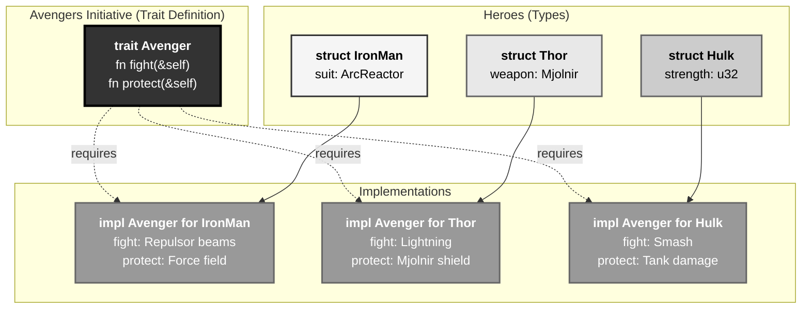
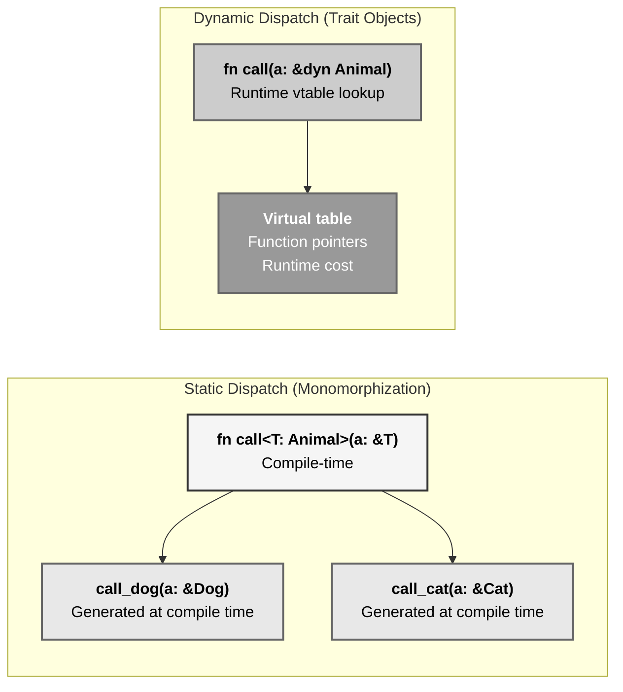
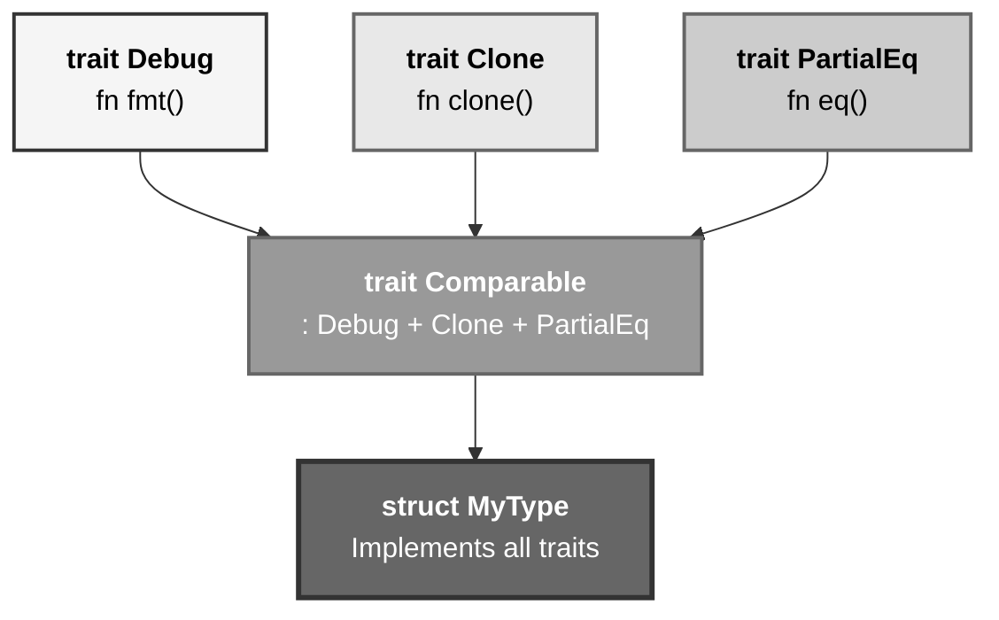
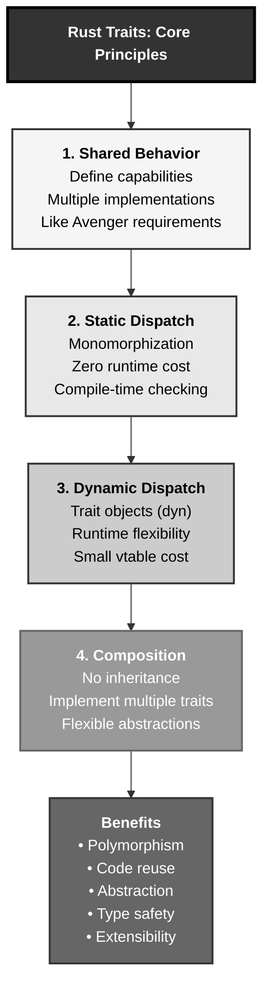

# Rust Traits: The Avengers Initiative Pattern

## The Answer (Minto Pyramid)

**Traits in Rust define shared behavior across different types, enabling polymorphism, abstraction, and code reuse through a compile-time interface system.**

A trait is like an interface—it specifies a set of methods that types must implement. Unlike inheritance, Rust uses composition: types implement traits to gain capabilities. Traits enable generic programming (trait bounds), dynamic dispatch (trait objects with `dyn`), and operator overloading (implementing `Add`, `Debug`, etc.). The compiler enforces trait implementations at compile time, ensuring type safety. Traits can have default implementations, associated types, and even associated constants.

**Three Supporting Principles:**

1. **Shared Behavior**: Traits define capabilities that multiple types can implement
2. **Compile-Time Safety**: Trait bounds checked at compile time (zero runtime cost)
3. **Composition Over Inheritance**: Types gain abilities by implementing traits, not extending classes

**Why This Matters**: Traits are Rust's primary abstraction mechanism, enabling polymorphism without inheritance. They power generics, iterators, error handling, operator overloading, and most standard library functionality. Understanding traits is essential for writing idiomatic Rust.

---

## The MCU Metaphor: The Avengers Initiative

Think of Rust traits like the Avengers Initiative:

### The Mapping

| The Avengers Initiative | Rust Traits |
|-------------------------|-------------|
| **Avengers qualification** | Trait definition |
| **Individual heroes** | Types (structs, enums) |
| **Hero joins Initiative** | Type implements trait |
| **Required abilities (fight, protect)** | Trait methods |
| **Each hero fights differently** | Custom implementations |
| **Team assemble (any Avenger)** | Generic with trait bound |
| **Nick Fury calls any Avenger** | Polymorphism |
| **Worthy to lift Mjolnir** | Trait bound constraint |

### The Story

When Nick Fury created the Avengers Initiative, he didn't care if you're a super soldier, a god, a genius inventor, or a gamma scientist—**he cared if you could protect Earth**. The Initiative defines requirements: you must be able to fight threats, work as a team, and protect civilians. Each Avenger meets these requirements differently.

Iron Man fights with repulsor beams and missiles. Captain America uses his shield and tactics. Thor wields Mjolnir and lightning. Black Widow uses stealth and combat skills. Hulk smashes. **Different implementations, same capability.**

When Fury assembles the team, he can call `avenger.fight()` on any member—he doesn't need to know if it's Tony, Steve, or Thor. The trait (`Avenger`) guarantees they all have the `fight()` method, even though each implementation differs. This is **polymorphism through traits**.

Similarly, Rust traits work like the Initiative. Define a `Drawable` trait with a `draw()` method. Implement it for `Circle`, `Square`, and `Triangle`. Now you can write functions accepting "any type that implements `Drawable`"—just like Fury can call any Avenger. The compiler ensures every type has the required methods, catching errors at compile time, not runtime.

---

## The Problem Without Traits

Before understanding traits, developers face code duplication and inflexibility:

```rust path=null start=null
// ❌ Without traits: Duplicate code for each type
struct Dog {
    name: String,
}

impl Dog {
    fn make_sound(&self) {
        println!("{} says: Woof!", self.name);
    }
}

struct Cat {
    name: String,
}

impl Cat {
    fn make_sound(&self) {
        println!("{} says: Meow!", self.name);
    }
}

// Can't write a generic function - no shared interface
// fn call_animal(animal: ???) {
//     animal.make_sound();
// }

fn main() {
    let dog = Dog { name: String::from("Rex") };
    let cat = Cat { name: String::from("Whiskers") };
    
    dog.make_sound();
    cat.make_sound();
    
    // ❌ Can't store different types in same collection
    // let animals = vec![dog, cat];  // ERROR: mismatched types
}
```

**Problems:**

1. **No Shared Interface**: Can't abstract over different types
2. **Code Duplication**: Same concept implemented separately
3. **No Polymorphism**: Can't write functions accepting "any type with X capability"
4. **No Collections**: Can't store different types together
5. **Manual Coordination**: No compiler enforcement of shared behavior

---

## The Solution: Trait Definitions and Implementations

Rust traits provide shared interfaces:

```rust path=null start=null
// Define the trait - shared behavior
trait Animal {
    fn make_sound(&self);
    fn name(&self) -> &str;
}

// Implement for Dog
struct Dog {
    name: String,
}

impl Animal for Dog {
    fn make_sound(&self) {
        println!("{} says: Woof!", self.name);
    }
    
    fn name(&self) -> &str {
        &self.name
    }
}

// Implement for Cat
struct Cat {
    name: String,
}

impl Animal for Cat {
    fn make_sound(&self) {
        println!("{} says: Meow!", self.name);
    }
    
    fn name(&self) -> &str {
        &self.name
    }
}

// ✅ Generic function using trait bound
fn call_animal<T: Animal>(animal: &T) {
    println!("Calling {}:", animal.name());
    animal.make_sound();
}

fn main() {
    let dog = Dog { name: String::from("Rex") };
    let cat = Cat { name: String::from("Whiskers") };
    
    call_animal(&dog);  // Works!
    call_animal(&cat);  // Works!
}
```

### Trait Objects for Dynamic Dispatch

```rust path=null start=null
fn main() {
    let dog = Dog { name: String::from("Rex") };
    let cat = Cat { name: String::from("Whiskers") };
    
    // ✅ Store different types in same collection using trait objects
    let animals: Vec<Box<dyn Animal>> = vec![
        Box::new(dog),
        Box::new(cat),
    ];
    
    for animal in &animals {
        animal.make_sound();
    }
}

// Output:
// Rex says: Woof!
// Whiskers says: Meow!
```

---

## Visual Mental Model



### Static vs Dynamic Dispatch



### Trait Composition



---

## Anatomy of Traits

### 1. Basic Trait Definition

```rust path=null start=null
trait Summary {
    fn summarize(&self) -> String;
}

struct Article {
    title: String,
    content: String,
}

impl Summary for Article {
    fn summarize(&self) -> String {
        format!("{}: {}", self.title, self.content)
    }
}

struct Tweet {
    username: String,
    message: String,
}

impl Summary for Tweet {
    fn summarize(&self) -> String {
        format!("@{}: {}", self.username, self.message)
    }
}

fn main() {
    let article = Article {
        title: String::from("Rust Traits"),
        content: String::from("Traits enable abstraction..."),
    };
    
    let tweet = Tweet {
        username: String::from("rustlang"),
        message: String::from("Rust 1.75 released!"),
    };
    
    println!("{}", article.summarize());
    println!("{}", tweet.summarize());
}
```

### 2. Default Implementations

```rust path=null start=null
trait Greet {
    fn greet(&self) -> String {
        String::from("Hello!")  // Default implementation
    }
    
    fn farewell(&self) -> String;  // Must be implemented
}

struct Person {
    name: String,
}

impl Greet for Person {
    // Use default greet() implementation
    
    fn farewell(&self) -> String {
        format!("Goodbye from {}!", self.name)
    }
}

struct Robot;

impl Greet for Robot {
    // Override default implementation
    fn greet(&self) -> String {
        String::from("HELLO, HUMAN.")
    }
    
    fn farewell(&self) -> String {
        String::from("SHUTTING DOWN.")
    }
}

fn main() {
    let person = Person { name: String::from("Alice") };
    let robot = Robot;
    
    println!("{}", person.greet());    // Uses default: "Hello!"
    println!("{}", person.farewell()); // Custom
    
    println!("{}", robot.greet());     // Overridden: "HELLO, HUMAN."
    println!("{}", robot.farewell());  // Custom
}
```

### 3. Trait Bounds in Generics

```rust path=null start=null
// Single trait bound
fn print_summary<T: Summary>(item: &T) {
    println!("Summary: {}", item.summarize());
}

// Multiple trait bounds
fn process<T: Summary + Clone>(item: &T) {
    let cloned = item.clone();
    println!("{}", item.summarize());
}

// Where clause for readability
fn complex_function<T, U>(t: &T, u: &U)
where
    T: Summary + Clone,
    U: Summary + std::fmt::Debug,
{
    println!("{}", t.summarize());
    println!("{:?}", u);
}

fn main() {
    let article = Article {
        title: String::from("Rust"),
        content: String::from("Systems programming"),
    };
    
    print_summary(&article);
}
```

### 4. Trait Objects (Dynamic Dispatch)

```rust path=null start=null
fn main() {
    // Trait objects: Box<dyn Trait>
    let items: Vec<Box<dyn Summary>> = vec![
        Box::new(Article {
            title: String::from("News"),
            content: String::from("Breaking news..."),
        }),
        Box::new(Tweet {
            username: String::from("user"),
            message: String::from("Hello world"),
        }),
    ];
    
    for item in &items {
        println!("{}", item.summarize());
    }
}

// Function accepting trait objects
fn notify(item: &dyn Summary) {
    println!("New notification: {}", item.summarize());
}
```

### 5. Associated Types

```rust path=null start=null
trait Iterator {
    type Item;  // Associated type
    
    fn next(&mut self) -> Option<Self::Item>;
}

struct Counter {
    count: u32,
    max: u32,
}

impl Iterator for Counter {
    type Item = u32;  // Specify concrete type
    
    fn next(&mut self) -> Option<Self::Item> {
        if self.count < self.max {
            self.count += 1;
            Some(self.count)
        } else {
            None
        }
    }
}

fn main() {
    let mut counter = Counter { count: 0, max: 5 };
    
    while let Some(num) = counter.next() {
        println!("{}", num);
    }
}
```

---

## Common Trait Patterns

### Pattern 1: Builder Pattern with Traits

```rust path=null start=null
trait Builder {
    type Output;
    
    fn build(self) -> Self::Output;
}

struct PersonBuilder {
    name: Option<String>,
    age: Option<u32>,
}

impl PersonBuilder {
    fn new() -> Self {
        Self {
            name: None,
            age: None,
        }
    }
    
    fn name(mut self, name: &str) -> Self {
        self.name = Some(name.to_string());
        self
    }
    
    fn age(mut self, age: u32) -> Self {
        self.age = Some(age);
        self
    }
}

struct Person {
    name: String,
    age: u32,
}

impl Builder for PersonBuilder {
    type Output = Person;
    
    fn build(self) -> Self::Output {
        Person {
            name: self.name.unwrap_or_else(|| String::from("Unknown")),
            age: self.age.unwrap_or(0),
        }
    }
}

fn main() {
    let person = PersonBuilder::new()
        .name("Alice")
        .age(30)
        .build();
    
    println!("Name: {}, Age: {}", person.name, person.age);
}
```

### Pattern 2: Operator Overloading

```rust path=null start=null
use std::ops::Add;

#[derive(Debug, Clone, Copy)]
struct Point {
    x: i32,
    y: i32,
}

impl Add for Point {
    type Output = Point;
    
    fn add(self, other: Point) -> Point {
        Point {
            x: self.x + other.x,
            y: self.y + other.y,
        }
    }
}

fn main() {
    let p1 = Point { x: 1, y: 2 };
    let p2 = Point { x: 3, y: 4 };
    
    let p3 = p1 + p2;  // Uses Add trait
    
    println!("Result: {:?}", p3);  // Point { x: 4, y: 6 }
}
```

### Pattern 3: Extension Traits

```rust path=null start=null
// Extend existing types with new methods
trait StringExtensions {
    fn word_count(&self) -> usize;
    fn is_palindrome(&self) -> bool;
}

impl StringExtensions for str {
    fn word_count(&self) -> usize {
        self.split_whitespace().count()
    }
    
    fn is_palindrome(&self) -> bool {
        let chars: Vec<char> = self.chars().collect();
        chars == chars.iter().rev().copied().collect::<Vec<_>>()
    }
}

fn main() {
    let text = "hello world rust";
    println!("Words: {}", text.word_count());  // 3
    
    let palindrome = "racecar";
    println!("Is palindrome: {}", palindrome.is_palindrome());  // true
}
```

### Pattern 4: From/Into for Conversions

```rust path=null start=null
struct Celsius(f64);
struct Fahrenheit(f64);

impl From<Fahrenheit> for Celsius {
    fn from(f: Fahrenheit) -> Self {
        Celsius((f.0 - 32.0) * 5.0 / 9.0)
    }
}

impl From<Celsius> for Fahrenheit {
    fn from(c: Celsius) -> Self {
        Fahrenheit(c.0 * 9.0 / 5.0 + 32.0)
    }
}

fn main() {
    let f = Fahrenheit(98.6);
    let c: Celsius = f.into();  // Uses From trait
    println!("Temperature: {} °C", c.0);
    
    let c2 = Celsius(100.0);
    let f2: Fahrenheit = c2.into();
    println!("Boiling point: {} °F", f2.0);
}
```

### Pattern 5: Trait Inheritance

```rust path=null start=null
trait Shape {
    fn area(&self) -> f64;
}

trait ColoredShape: Shape {  // Inherits Shape
    fn color(&self) -> &str;
    
    fn describe(&self) -> String {
        format!("A {} shape with area {}", self.color(), self.area())
    }
}

struct Circle {
    radius: f64,
    color: String,
}

impl Shape for Circle {
    fn area(&self) -> f64 {
        std::f64::consts::PI * self.radius * self.radius
    }
}

impl ColoredShape for Circle {
    fn color(&self) -> &str {
        &self.color
    }
}

fn main() {
    let circle = Circle {
        radius: 5.0,
        color: String::from("red"),
    };
    
    println!("{}", circle.describe());
}
```

---

## Standard Library Traits

### Debug, Display, Clone, Copy

```rust path=null start=null
use std::fmt;

#[derive(Debug, Clone)]  // Automatic implementations
struct Book {
    title: String,
    pages: u32,
}

impl fmt::Display for Book {
    fn fmt(&self, f: &mut fmt::Formatter) -> fmt::Result {
        write!(f, "{} ({} pages)", self.title, self.pages)
    }
}

fn main() {
    let book = Book {
        title: String::from("The Rust Programming Language"),
        pages: 552,
    };
    
    println!("{:?}", book);  // Debug
    println!("{}", book);    // Display
    
    let book2 = book.clone();  // Clone
    println!("Cloned: {}", book2);
}
```

### PartialEq, Eq, PartialOrd, Ord

```rust path=null start=null
#[derive(Debug, PartialEq, Eq, PartialOrd, Ord)]
struct Priority(u32);

fn main() {
    let p1 = Priority(1);
    let p2 = Priority(2);
    let p3 = Priority(1);
    
    assert!(p1 == p3);   // PartialEq
    assert!(p1 < p2);    // PartialOrd
    assert!(p2 > p1);    // PartialOrd
    
    let mut priorities = vec![p2, p1, p3];
    priorities.sort();  // Uses Ord
    
    println!("{:?}", priorities);
}
```

### Default

```rust path=null start=null
#[derive(Debug)]
struct Config {
    host: String,
    port: u16,
    timeout: u64,
}

impl Default for Config {
    fn default() -> Self {
        Self {
            host: String::from("localhost"),
            port: 8080,
            timeout: 30,
        }
    }
}

fn main() {
    let config = Config::default();
    println!("{:?}", config);
    
    // Use with struct update syntax
    let custom = Config {
        port: 3000,
        ..Default::default()
    };
    println!("{:?}", custom);
}
```

---

## Real-World Use Cases

### Use Case 1: Pluggable Logging

```rust path=null start=null
trait Logger {
    fn log(&self, message: &str);
}

struct ConsoleLogger;

impl Logger for ConsoleLogger {
    fn log(&self, message: &str) {
        println!("[CONSOLE] {}", message);
    }
}

struct FileLogger {
    filename: String,
}

impl Logger for FileLogger {
    fn log(&self, message: &str) {
        // In real code, write to file
        println!("[FILE:{}] {}", self.filename, message);
    }
}

struct Application<L: Logger> {
    logger: L,
}

impl<L: Logger> Application<L> {
    fn new(logger: L) -> Self {
        Self { logger }
    }
    
    fn run(&self) {
        self.logger.log("Application started");
        self.logger.log("Processing...");
        self.logger.log("Application finished");
    }
}

fn main() {
    let console_app = Application::new(ConsoleLogger);
    console_app.run();
    
    let file_app = Application::new(FileLogger {
        filename: String::from("app.log"),
    });
    file_app.run();
}
```

### Use Case 2: Database Abstraction

```rust path=null start=null
trait Database {
    fn connect(&mut self) -> Result<(), String>;
    fn query(&self, sql: &str) -> Vec<String>;
    fn close(&mut self);
}

struct PostgreSQL {
    connected: bool,
}

impl Database for PostgreSQL {
    fn connect(&mut self) -> Result<(), String> {
        println!("Connecting to PostgreSQL...");
        self.connected = true;
        Ok(())
    }
    
    fn query(&self, sql: &str) -> Vec<String> {
        println!("PostgreSQL query: {}", sql);
        vec![String::from("result1"), String::from("result2")]
    }
    
    fn close(&mut self) {
        println!("Closing PostgreSQL connection");
        self.connected = false;
    }
}

struct MongoDB {
    connected: bool,
}

impl Database for MongoDB {
    fn connect(&mut self) -> Result<(), String> {
        println!("Connecting to MongoDB...");
        self.connected = true;
        Ok(())
    }
    
    fn query(&self, sql: &str) -> Vec<String> {
        println!("MongoDB query: {}", sql);
        vec![String::from("doc1"), String::from("doc2")]
    }
    
    fn close(&mut self) {
        println!("Closing MongoDB connection");
        self.connected = false;
    }
}

fn run_app<D: Database>(mut db: D) {
    db.connect().unwrap();
    let results = db.query("SELECT * FROM users");
    println!("Results: {:?}", results);
    db.close();
}

fn main() {
    let pg = PostgreSQL { connected: false };
    run_app(pg);
    
    let mongo = MongoDB { connected: false };
    run_app(mongo);
}
```

### Use Case 3: Serialization

```rust path=null start=null
trait Serialize {
    fn serialize(&self) -> String;
}

#[derive(Debug)]
struct User {
    id: u32,
    name: String,
    email: String,
}

impl Serialize for User {
    fn serialize(&self) -> String {
        format!("{{\"id\":{},\"name\":\"{}\",\"email\":\"{}\"}}", 
                self.id, self.name, self.email)
    }
}

struct Product {
    sku: String,
    price: f64,
}

impl Serialize for Product {
    fn serialize(&self) -> String {
        format!("{{\"sku\":\"{}\",\"price\":{}}}", self.sku, self.price)
    }
}

fn save<T: Serialize>(item: &T) {
    let json = item.serialize();
    println!("Saving: {}", json);
}

fn main() {
    let user = User {
        id: 1,
        name: String::from("Alice"),
        email: String::from("alice@example.com"),
    };
    
    let product = Product {
        sku: String::from("RUST-001"),
        price: 49.99,
    };
    
    save(&user);
    save(&product);
}
```

---

## Comparing Traits Across Languages

### Rust vs Java Interfaces

```java path=null start=null
// Java - Interfaces with inheritance
interface Animal {
    void makeSound();
    String getName();
}

class Dog implements Animal {
    private String name;
    
    public Dog(String name) {
        this.name = name;
    }
    
    public void makeSound() {
        System.out.println(name + " says: Woof!");
    }
    
    public String getName() {
        return name;
    }
}

// Runtime polymorphism
Animal animal = new Dog("Rex");
animal.makeSound();  // Virtual call (runtime cost)
```

**Rust Equivalent:**

```rust path=null start=null
trait Animal {
    fn make_sound(&self);
    fn name(&self) -> &str;
}

struct Dog {
    name: String,
}

impl Animal for Dog {
    fn make_sound(&self) {
        println!("{} says: Woof!", self.name);
    }
    
    fn name(&self) -> &str {
        &self.name
    }
}

// Static dispatch (zero cost)
fn call_animal<T: Animal>(animal: &T) {
    animal.make_sound();
}

// Or dynamic dispatch (trait objects)
fn call_dyn(animal: &dyn Animal) {
    animal.make_sound();
}
```

**Key Differences:**

| Aspect | Java | Rust |
|--------|------|------|
| **Dispatch** | Always virtual (runtime) | Static by default, dynamic opt-in |
| **Null** | Can be null | Can't be null (use Option) |
| **Generics** | Type erasure | Monomorphization (zero cost) |
| **Default methods** | Since Java 8 | Built-in |
| **Multiple traits** | Single inheritance | Unlimited traits |

---

## Advanced Trait Concepts

### 1. Blanket Implementations

```rust path=null start=null
trait Double {
    fn double(&self) -> Self;
}

// Blanket implementation for all types implementing Add + Copy
impl<T> Double for T
where
    T: std::ops::Add<Output = T> + Copy,
{
    fn double(&self) -> Self {
        *self + *self
    }
}

fn main() {
    let x = 5;
    println!("Double: {}", x.double());  // 10
    
    let y = 3.14;
    println!("Double: {}", y.double());  // 6.28
}
```

### 2. Supertraits

```rust path=null start=null
trait Printable: std::fmt::Display {  // Supertrait
    fn print(&self) {
        println!("Printing: {}", self);
    }
}

struct Document {
    content: String,
}

impl std::fmt::Display for Document {
    fn fmt(&self, f: &mut std::fmt::Formatter) -> std::fmt::Result {
        write!(f, "{}", self.content)
    }
}

impl Printable for Document {}  // Must implement Display first

fn main() {
    let doc = Document {
        content: String::from("Hello, Rust!"),
    };
    
    doc.print();
}
```

### 3. Associated Constants

```rust path=null start=null
trait MathConstants {
    const PI: f64;
    const E: f64;
    
    fn circle_area(radius: f64) -> f64 {
        Self::PI * radius * radius
    }
}

struct FloatMath;

impl MathConstants for FloatMath {
    const PI: f64 = 3.141592653589793;
    const E: f64 = 2.718281828459045;
}

fn main() {
    println!("PI: {}", FloatMath::PI);
    println!("Circle area: {}", FloatMath::circle_area(5.0));
}
```

---

## Key Takeaways



### The Mental Model

Think of traits like the Avengers Initiative:
- **Initiative requirements** → Trait definition (must be able to fight)
- **Individual heroes** → Types implementing the trait
- **Each hero fights differently** → Custom implementations
- **Fury calls any Avenger** → Polymorphism through trait bounds

### Core Principles

1. **Shared Behavior**: Traits define capabilities that types implement
2. **Compile-Time Safety**: Trait bounds checked at compile time (zero cost)
3. **Static Dispatch**: Generics with monomorphization (no runtime overhead)
4. **Dynamic Dispatch**: Trait objects when runtime flexibility needed
5. **Composition**: Types implement multiple traits (not inheritance)

### The Guarantee

Rust traits provide:
- **Polymorphism**: Write code for "any type with capability X"
- **Type Safety**: Compiler ensures all methods exist
- **Performance**: Static dispatch is zero-cost, dynamic has minimal overhead
- **Extensibility**: Add traits to existing types (extension traits)

All with **compile-time verification** and **zero-cost abstractions**.

---

**Remember**: Traits aren't just interfaces—they're **capability contracts**. Like the Avengers Initiative defining what it means to be an Avenger (fight, protect, assemble), Rust traits define what it means to be Drawable, Iterable, or Serializable. Types prove their capabilities by implementing traits, the compiler enforces correctness, and generics enable zero-cost abstraction. Composition over inheritance, verified at compile time, executed at C speed.
