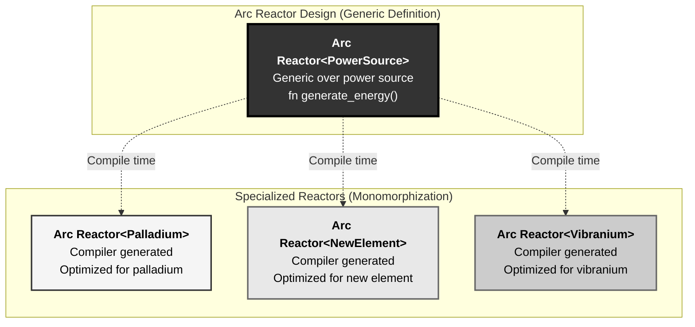
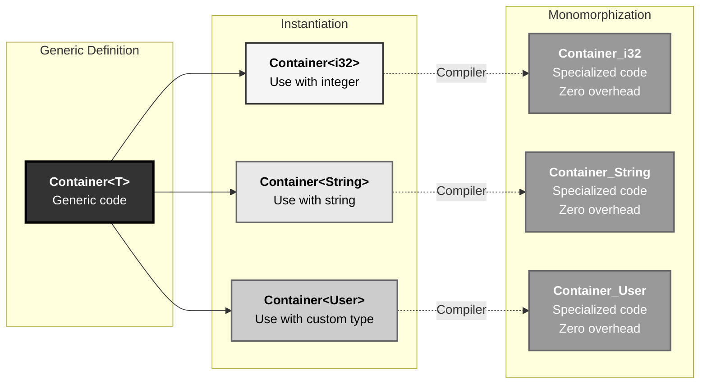
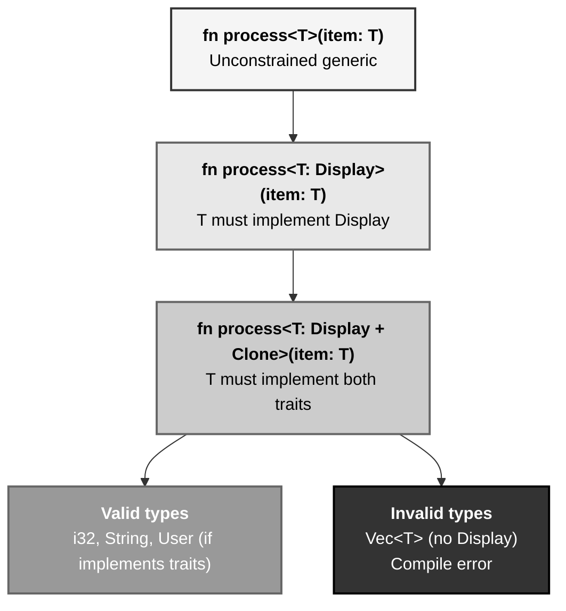
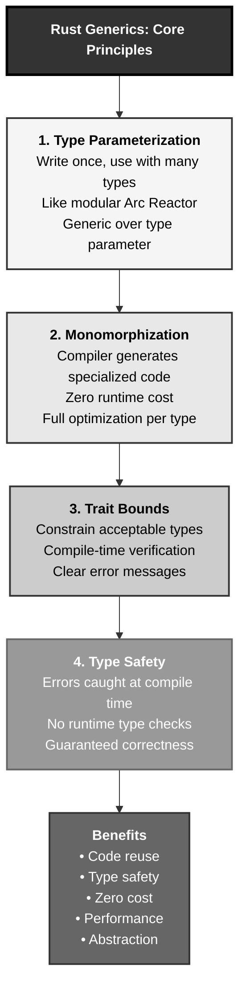

# Rust Generics: The Stark Modular Arc Reactor Pattern

## The Answer (Minto Pyramid)

**Generics in Rust enable writing flexible, reusable code that works with multiple types while maintaining compile-time type safety and zero runtime cost through monomorphization.**

A generic is a parameterized type or function that can work with any type satisfying specified constraints. Instead of writing separate implementations for `Vec<i32>`, `Vec<String>`, `Vec<User>`, you write `Vec<T>` once. The compiler generates specialized versions for each concrete type used—this is monomorphization. Generics work with trait bounds to constrain acceptable types, ensuring type safety. Unlike runtime polymorphism (virtual calls), generics are resolved at compile time with zero overhead.

**Three Supporting Principles:**

1. **Type Parameterization**: Write code once, use with many types
2. **Monomorphization**: Compiler generates specialized code (zero runtime cost)
3. **Trait Bounds**: Constrain generic types to ensure required capabilities

**Why This Matters**: Generics are fundamental to Rust's standard library (`Option<T>`, `Result<T, E>`, `Vec<T>`) and enable building flexible abstractions without sacrificing performance. Understanding generics is essential for writing idiomatic, reusable Rust code.

---

## The MCU Metaphor: Stark's Modular Arc Reactor

Think of Rust generics like Tony Stark's modular Arc Reactor design:

### The Mapping

| Stark's Arc Reactor | Rust Generics |
|---------------------|---------------|
| **Reactor core design** | Generic type/function definition |
| **Power source slot (any element)** | Type parameter `<T>` |
| **Palladium, vibranium, new element** | Concrete types (i32, String, User) |
| **Energy output interface** | Trait bound |
| **Same reactor, different power** | Same code, different types |
| **Build specific reactor** | Monomorphization (compile-time) |
| **No performance loss** | Zero runtime cost |
| **Must provide energy** | Type must satisfy trait bounds |

### The Story

When Tony Stark designed the Arc Reactor, he didn't hardcode it for palladium—**he made it modular**. The reactor's core design works with any power source: palladium, the new element he synthesized, or even vibranium. Each element has different properties (energy density, stability, toxicity), but they all satisfy the same interface: **they provide energy**.

Tony doesn't need to redesign the reactor for each element. The reactor is **generic over the power source type**. When he builds an Arc Reactor with palladium, the suit compiles a "palladium-specific" reactor. When he switches to the new element, it compiles a "new-element-specific" reactor. **Same design, different specializations—compiled at build time, zero runtime overhead.**

The power source must meet requirements (trait bounds): it must be stable, provide sustained energy, and interface with the reactor core. If someone tries to use unstable uranium, the design won't compile—the element doesn't meet the stability trait bound.

Similarly, Rust generics work like Stark's modular design. Write a `Container<T>` once—it works with any type `T`. Use `Container<i32>`, the compiler generates specialized code for integers. Use `Container<String>`, it generates specialized code for strings. **Same generic definition, specialized implementations, zero runtime cost.** Trait bounds ensure `T` has required capabilities, catching errors at compile time.

---

## The Problem Without Generics

Before understanding generics, developers face code duplication:

```rust path=null start=null
// ❌ Without generics: Duplicate code for each type
struct IntContainer {
    value: i32,
}

impl IntContainer {
    fn new(value: i32) -> Self {
        Self { value }
    }
    
    fn get(&self) -> &i32 {
        &self.value
    }
}

struct StringContainer {
    value: String,
}

impl StringContainer {
    fn new(value: String) -> Self {
        Self { value }
    }
    
    fn get(&self) -> &String {
        &self.value
    }
}

struct UserContainer {
    value: User,
}

// ... same code repeated for every type!

fn main() {
    let int_box = IntContainer::new(42);
    let string_box = StringContainer::new(String::from("hello"));
    
    println!("{}", int_box.get());
    println!("{}", string_box.get());
}
```

**Problems:**

1. **Code Duplication**: Same logic repeated for each type
2. **Maintenance Nightmare**: Bug fix requires changing all copies
3. **Explosion of Types**: Need new struct for every type
4. **No Abstraction**: Can't write functions accepting "any container"
5. **Scalability**: Doesn't scale to many types

---

## The Solution: Generic Types and Functions

Rust generics eliminate duplication:

```rust path=null start=null
// ✅ With generics: Write once, use with any type
struct Container<T> {
    value: T,
}

impl<T> Container<T> {
    fn new(value: T) -> Self {
        Self { value }
    }
    
    fn get(&self) -> &T {
        &self.value
    }
}

fn main() {
    let int_box = Container::new(42);          // Container<i32>
    let string_box = Container::new(String::from("hello"));  // Container<String>
    
    println!("{}", int_box.get());
    println!("{}", string_box.get());
}
```

### Generic Functions

```rust path=null start=null
// Generic function
fn print_twice<T: std::fmt::Display>(value: T) {
    println!("{}", value);
    println!("{}", value);
}

fn main() {
    print_twice(42);              // Works with i32
    print_twice(3.14);            // Works with f64
    print_twice("hello");         // Works with &str
}
```

### Multiple Type Parameters

```rust path=null start=null
struct Pair<T, U> {
    first: T,
    second: U,
}

impl<T, U> Pair<T, U> {
    fn new(first: T, second: U) -> Self {
        Self { first, second }
    }
    
    fn swap(self) -> Pair<U, T> {
        Pair {
            first: self.second,
            second: self.first,
        }
    }
}

fn main() {
    let pair = Pair::new(42, "hello");
    println!("First: {}, Second: {}", pair.first, pair.second);
    
    let swapped = pair.swap();
    println!("First: {}, Second: {}", swapped.first, swapped.second);
}
```

---

## Visual Mental Model



### Generic Type Flow



### Trait Bounds as Constraints



---

## Anatomy of Generics

### 1. Generic Structs

```rust path=null start=null
// Single type parameter
struct Point<T> {
    x: T,
    y: T,
}

impl<T> Point<T> {
    fn new(x: T, y: T) -> Self {
        Self { x, y }
    }
}

// Multiple type parameters
struct Rectangle<T, U> {
    width: T,
    height: U,
}

impl<T, U> Rectangle<T, U> {
    fn new(width: T, height: U) -> Self {
        Self { width, height }
    }
}

fn main() {
    let int_point = Point::new(5, 10);
    let float_point = Point::new(1.0, 4.0);
    
    let rect = Rectangle::new(50, 100.5);
}
```

### 2. Generic Enums

```rust path=null start=null
// Option from standard library
enum Option<T> {
    Some(T),
    None,
}

// Result from standard library
enum Result<T, E> {
    Ok(T),
    Err(E),
}

// Custom generic enum
enum Tree<T> {
    Leaf(T),
    Node {
        value: T,
        left: Box<Tree<T>>,
        right: Box<Tree<T>>,
    },
}

fn main() {
    let some_num: Option<i32> = Option::Some(5);
    let some_string: Option<String> = Option::Some(String::from("hello"));
    
    let ok_result: Result<i32, String> = Result::Ok(42);
    let err_result: Result<i32, String> = Result::Err(String::from("error"));
}
```

### 3. Generic Functions

```rust path=null start=null
// Generic function
fn largest<T: PartialOrd>(list: &[T]) -> &T {
    let mut largest = &list[0];
    
    for item in list {
        if item > largest {
            largest = item;
        }
    }
    
    largest
}

fn main() {
    let numbers = vec![34, 50, 25, 100, 65];
    let result = largest(&numbers);
    println!("Largest number: {}", result);
    
    let chars = vec!['y', 'm', 'a', 'q'];
    let result = largest(&chars);
    println!("Largest char: {}", result);
}
```

### 4. Generic Methods

```rust path=null start=null
struct Container<T> {
    value: T,
}

impl<T> Container<T> {
    fn new(value: T) -> Self {
        Self { value }
    }
    
    fn get(&self) -> &T {
        &self.value
    }
    
    // Generic method (different from struct's T)
    fn wrap<U>(self, wrapper: U) -> Container<(T, U)> {
        Container {
            value: (self.value, wrapper),
        }
    }
}

// Implementation only for specific type
impl Container<String> {
    fn len(&self) -> usize {
        self.value.len()
    }
}

fn main() {
    let num_container = Container::new(42);
    let wrapped = num_container.wrap("label");
    
    let string_container = Container::new(String::from("hello"));
    println!("Length: {}", string_container.len());
}
```

### 5. Trait Bounds

```rust path=null start=null
use std::fmt::Display;

// Single trait bound
fn print_item<T: Display>(item: T) {
    println!("Item: {}", item);
}

// Multiple trait bounds
fn process<T: Display + Clone>(item: T) {
    let cloned = item.clone();
    println!("Original: {}", item);
    println!("Cloned: {}", cloned);
}

// Where clause for readability
fn complex<T, U>(t: T, u: U)
where
    T: Display + Clone,
    U: Clone + std::fmt::Debug,
{
    println!("T: {}", t);
    println!("U: {:?}", u);
}

fn main() {
    print_item(42);
    print_item("hello");
    
    process(String::from("test"));
}
```

---

## Common Generic Patterns

### Pattern 1: Generic Collections

```rust path=null start=null
struct Stack<T> {
    items: Vec<T>,
}

impl<T> Stack<T> {
    fn new() -> Self {
        Self { items: Vec::new() }
    }
    
    fn push(&mut self, item: T) {
        self.items.push(item);
    }
    
    fn pop(&mut self) -> Option<T> {
        self.items.pop()
    }
    
    fn is_empty(&self) -> bool {
        self.items.is_empty()
    }
}

fn main() {
    let mut int_stack = Stack::new();
    int_stack.push(1);
    int_stack.push(2);
    int_stack.push(3);
    
    while let Some(item) = int_stack.pop() {
        println!("Popped: {}", item);
    }
    
    let mut string_stack = Stack::new();
    string_stack.push(String::from("hello"));
    string_stack.push(String::from("world"));
}
```

### Pattern 2: Generic Option-like Types

```rust path=null start=null
enum Maybe<T> {
    Just(T),
    Nothing,
}

impl<T> Maybe<T> {
    fn unwrap_or(self, default: T) -> T {
        match self {
            Maybe::Just(value) => value,
            Maybe::Nothing => default,
        }
    }
    
    fn map<U, F>(self, f: F) -> Maybe<U>
    where
        F: FnOnce(T) -> U,
    {
        match self {
            Maybe::Just(value) => Maybe::Just(f(value)),
            Maybe::Nothing => Maybe::Nothing,
        }
    }
}

fn main() {
    let some = Maybe::Just(42);
    let none: Maybe<i32> = Maybe::Nothing;
    
    println!("{}", some.unwrap_or(0));   // 42
    println!("{}", none.unwrap_or(0));   // 0
    
    let doubled = Maybe::Just(21).map(|x| x * 2);
    println!("{}", doubled.unwrap_or(0)); // 42
}
```

### Pattern 3: Builder Pattern with Generics

```rust path=null start=null
struct Builder<T> {
    items: Vec<T>,
}

impl<T> Builder<T> {
    fn new() -> Self {
        Self { items: Vec::new() }
    }
    
    fn add(mut self, item: T) -> Self {
        self.items.push(item);
        self
    }
    
    fn build(self) -> Vec<T> {
        self.items
    }
}

fn main() {
    let numbers = Builder::new()
        .add(1)
        .add(2)
        .add(3)
        .build();
    
    println!("{:?}", numbers);
    
    let words = Builder::new()
        .add("hello")
        .add("world")
        .build();
    
    println!("{:?}", words);
}
```

### Pattern 4: Generic Associated Functions

```rust path=null start=null
struct Parser<T> {
    _marker: std::marker::PhantomData<T>,
}

impl<T> Parser<T> {
    fn new() -> Self {
        Self {
            _marker: std::marker::PhantomData,
        }
    }
}

impl Parser<i32> {
    fn parse(s: &str) -> Result<i32, std::num::ParseIntError> {
        s.parse()
    }
}

impl Parser<f64> {
    fn parse(s: &str) -> Result<f64, std::num::ParseFloatError> {
        s.parse()
    }
}

fn main() {
    let int_result = Parser::<i32>::parse("42");
    let float_result = Parser::<f64>::parse("3.14");
    
    println!("{:?}", int_result);   // Ok(42)
    println!("{:?}", float_result); // Ok(3.14)
}
```

### Pattern 5: Constraining with Trait Bounds

```rust path=null start=null
use std::ops::Add;

fn add_values<T>(a: T, b: T) -> T
where
    T: Add<Output = T>,
{
    a + b
}

fn sum_list<T>(list: &[T]) -> T
where
    T: Add<Output = T> + Copy + Default,
{
    let mut sum = T::default();
    for item in list {
        sum = sum + *item;
    }
    sum
}

fn main() {
    println!("5 + 3 = {}", add_values(5, 3));
    println!("2.5 + 1.5 = {}", add_values(2.5, 1.5));
    
    let numbers = vec![1, 2, 3, 4, 5];
    println!("Sum: {}", sum_list(&numbers));
}
```

---

## Monomorphization in Action

```rust path=null start=null
// Generic function
fn double<T: std::ops::Add<Output = T> + Copy>(x: T) -> T {
    x + x
}

fn main() {
    let a = double(5);      // Uses i32 version
    let b = double(3.14);   // Uses f64 version
}

// Compiler generates (conceptually):
// fn double_i32(x: i32) -> i32 { x + x }
// fn double_f64(x: f64) -> f64 { x + x }
```

**Monomorphization Benefits:**
- Zero runtime cost (no dynamic dispatch)
- Full optimization per type
- Type-specific specializations
- No virtual function calls

**Trade-off:**
- Increased binary size (code duplication)
- Longer compile times
- But: maximum runtime performance

---

## Real-World Use Cases

### Use Case 1: Generic Cache

```rust path=null start=null
use std::collections::HashMap;
use std::hash::Hash;

struct Cache<K, V>
where
    K: Eq + Hash,
{
    store: HashMap<K, V>,
}

impl<K, V> Cache<K, V>
where
    K: Eq + Hash,
{
    fn new() -> Self {
        Self {
            store: HashMap::new(),
        }
    }
    
    fn insert(&mut self, key: K, value: V) {
        self.store.insert(key, value);
    }
    
    fn get(&self, key: &K) -> Option<&V> {
        self.store.get(key)
    }
    
    fn remove(&mut self, key: &K) -> Option<V> {
        self.store.remove(key)
    }
}

fn main() {
    let mut user_cache = Cache::new();
    user_cache.insert("user1", "Alice");
    user_cache.insert("user2", "Bob");
    
    if let Some(name) = user_cache.get(&"user1") {
        println!("Found: {}", name);
    }
    
    let mut number_cache = Cache::new();
    number_cache.insert(1, 100);
    number_cache.insert(2, 200);
}
```

### Use Case 2: Generic Response Handler

```rust path=null start=null
enum ApiResponse<T, E> {
    Success(T),
    Error(E),
}

impl<T, E> ApiResponse<T, E> {
    fn is_success(&self) -> bool {
        matches!(self, ApiResponse::Success(_))
    }
    
    fn unwrap(self) -> T {
        match self {
            ApiResponse::Success(value) => value,
            ApiResponse::Error(_) => panic!("Called unwrap on Error"),
        }
    }
    
    fn map<U, F>(self, f: F) -> ApiResponse<U, E>
    where
        F: FnOnce(T) -> U,
    {
        match self {
            ApiResponse::Success(value) => ApiResponse::Success(f(value)),
            ApiResponse::Error(err) => ApiResponse::Error(err),
        }
    }
}

#[derive(Debug)]
struct User {
    id: u32,
    name: String,
}

fn fetch_user(id: u32) -> ApiResponse<User, String> {
    if id > 0 {
        ApiResponse::Success(User {
            id,
            name: String::from("Alice"),
        })
    } else {
        ApiResponse::Error(String::from("Invalid ID"))
    }
}

fn main() {
    let response = fetch_user(1);
    
    if response.is_success() {
        let user = response.unwrap();
        println!("User: {:?}", user);
    }
    
    let name_response = fetch_user(2).map(|user| user.name);
    println!("Name: {:?}", name_response);
}
```

### Use Case 3: Generic Repository Pattern

```rust path=null start=null
trait Entity {
    type Id;
    fn id(&self) -> Self::Id;
}

struct Repository<T: Entity> {
    items: Vec<T>,
}

impl<T: Entity> Repository<T>
where
    T::Id: PartialEq,
{
    fn new() -> Self {
        Self { items: Vec::new() }
    }
    
    fn add(&mut self, item: T) {
        self.items.push(item);
    }
    
    fn find_by_id(&self, id: T::Id) -> Option<&T> {
        self.items.iter().find(|item| item.id() == id)
    }
    
    fn all(&self) -> &[T] {
        &self.items
    }
}

#[derive(Debug, Clone)]
struct User {
    id: u32,
    name: String,
}

impl Entity for User {
    type Id = u32;
    
    fn id(&self) -> Self::Id {
        self.id
    }
}

fn main() {
    let mut repo = Repository::new();
    
    repo.add(User {
        id: 1,
        name: String::from("Alice"),
    });
    
    repo.add(User {
        id: 2,
        name: String::from("Bob"),
    });
    
    if let Some(user) = repo.find_by_id(1) {
        println!("Found: {:?}", user);
    }
    
    println!("All users: {:?}", repo.all());
}
```

---

## Comparing Generics Across Languages

### Rust vs C++ Templates

```cpp path=null start=null
// C++ - Templates (similar to Rust generics)
template<typename T>
class Container {
private:
    T value;
public:
    Container(T val) : value(val) {}
    T get() { return value; }
};

// Template instantiation
Container<int> intContainer(42);
Container<std::string> stringContainer("hello");
```

**Rust Equivalent:**

```rust path=null start=null
struct Container<T> {
    value: T,
}

impl<T> Container<T> {
    fn new(value: T) -> Self {
        Self { value }
    }
    
    fn get(&self) -> &T {
        &self.value
    }
}

let int_container = Container::new(42);
let string_container = Container::new(String::from("hello"));
```

**Key Differences:**

| Aspect | C++ | Rust |
|--------|-----|------|
| **Constraints** | Concepts (C++20) or duck typing | Trait bounds (enforced) |
| **Errors** | Template instantiation errors | Clear trait bound errors |
| **Syntax** | `template<typename T>` | `<T>` with trait bounds |
| **Type inference** | Limited | Extensive |
| **Safety** | Compile-time duck typing | Explicit trait requirements |

---

## Advanced Generic Concepts

### 1. Lifetime Parameters with Generics

```rust path=null start=null
struct Ref<'a, T> {
    value: &'a T,
}

impl<'a, T> Ref<'a, T> {
    fn new(value: &'a T) -> Self {
        Self { value }
    }
    
    fn get(&self) -> &T {
        self.value
    }
}

fn main() {
    let num = 42;
    let ref_num = Ref::new(&num);
    println!("Value: {}", ref_num.get());
}
```

### 2. PhantomData for Unused Type Parameters

```rust path=null start=null
use std::marker::PhantomData;

struct Meters;
struct Feet;

struct Distance<Unit> {
    value: f64,
    _unit: PhantomData<Unit>,
}

impl<Unit> Distance<Unit> {
    fn new(value: f64) -> Self {
        Self {
            value,
            _unit: PhantomData,
        }
    }
}

impl Distance<Meters> {
    fn to_feet(self) -> Distance<Feet> {
        Distance::new(self.value * 3.28084)
    }
}

fn main() {
    let meters = Distance::<Meters>::new(100.0);
    let feet = meters.to_feet();
    println!("Distance: {} feet", feet.value);
}
```

### 3. Const Generics

```rust path=null start=null
// Const generic - parameterize by constant values
struct Array<T, const N: usize> {
    data: [T; N],
}

impl<T, const N: usize> Array<T, N> {
    fn len(&self) -> usize {
        N
    }
}

impl<T: Default + Copy, const N: usize> Array<T, N> {
    fn new() -> Self {
        Self {
            data: [T::default(); N],
        }
    }
}

fn main() {
    let arr3: Array<i32, 3> = Array::new();
    let arr5: Array<i32, 5> = Array::new();
    
    println!("arr3 length: {}", arr3.len());
    println!("arr5 length: {}", arr5.len());
}
```

---

## Key Takeaways



### The Mental Model

Think of generics like Stark's modular Arc Reactor:
- **Reactor core design** → Generic type definition
- **Power source slot** → Type parameter `<T>`
- **Different elements** → Concrete types (i32, String)
- **Build specific reactor** → Monomorphization (compiler generates specialized code)

### Core Principles

1. **Type Parameterization**: Write code once, works with any type
2. **Monomorphization**: Compiler generates specialized code (zero cost)
3. **Trait Bounds**: Constrain types to ensure capabilities
4. **Compile-Time Resolution**: All checking at compile time
5. **Zero Runtime Cost**: As fast as hand-written specialized code

### The Guarantee

Rust generics provide:
- **Reusability**: Write once, use with many types
- **Type Safety**: Errors caught at compile time
- **Performance**: Zero runtime overhead (monomorphization)
- **Flexibility**: Trait bounds enable powerful abstractions

All with **compile-time verification** and **C-level performance**.

---

**Remember**: Generics aren't just templates—they're **modular designs with guaranteed interfaces**. Like Stark's Arc Reactor that works with any power source (palladium, vibranium, new element) as long as it provides energy, Rust generics work with any type as long as it satisfies trait bounds. The compiler generates optimized, specialized code for each type used—same generic definition, zero runtime cost, maximum performance. Write once, compile many, run fast.
