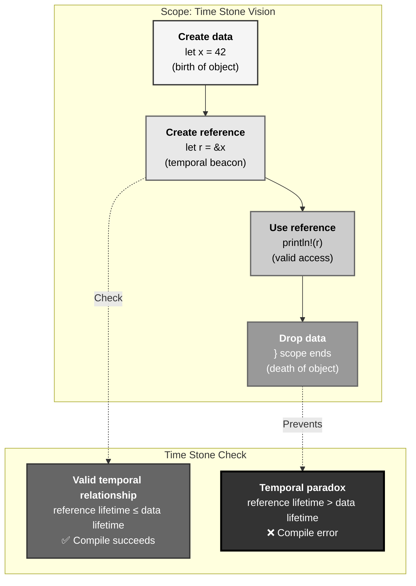
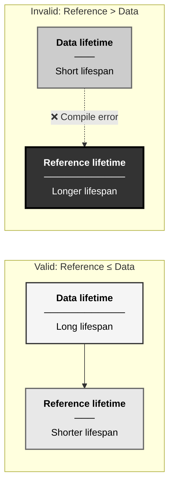
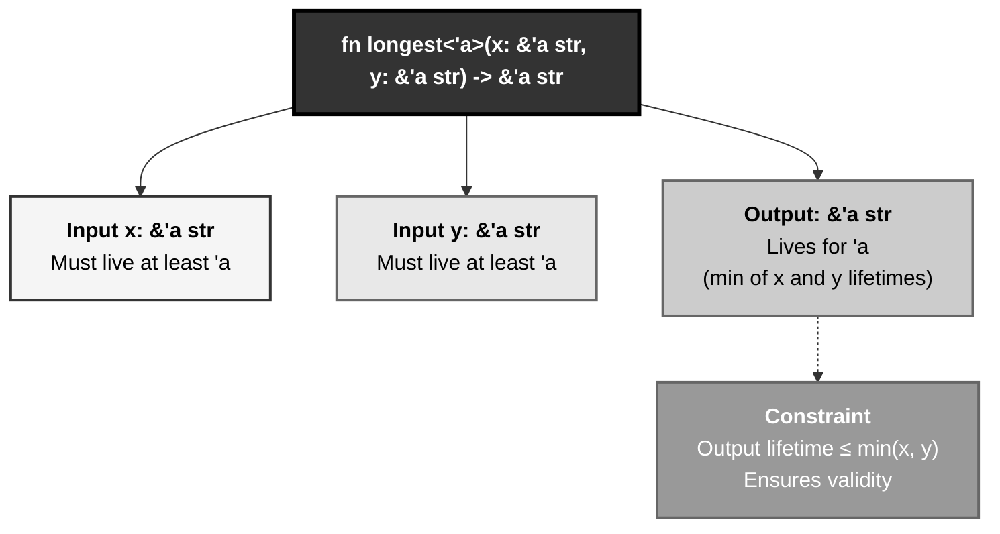
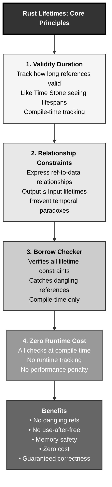

# Rust Lifetimes: The Time Stone Pattern

## The Answer (Minto Pyramid)

**Lifetimes in Rust ensure references are always valid by tracking how long data lives, preventing dangling references and use-after-free errors at compile time.**

A lifetime is a compile-time construct that describes the scope during which a reference is valid. Every reference has a lifetime, though most are implicit (lifetime elision). Explicit lifetime annotations (`'a`, `'b`) tell the compiler how references relate to each other and to their data. Lifetimes don't change how long data lives—they describe existing relationships. The borrow checker uses lifetimes to verify references never outlive their data, catching memory safety violations at compile time with zero runtime cost.

**Three Supporting Principles:**

1. **Validity Duration**: Lifetimes track how long references remain valid
2. **Relationship Constraints**: Lifetimes express relationships between references
3. **Compile-Time Verification**: All lifetime checking happens at compile time (zero cost)

**Why This Matters**: Lifetimes are Rust's secret weapon for memory safety without garbage collection. They enable safe references, zero-copy APIs, and complex data structures while guaranteeing no dangling pointers. Understanding lifetimes unlocks advanced Rust patterns.

---

## The MCU Metaphor: The Time Stone

Think of Rust lifetimes like the Time Stone's power to see temporal relationships:

### The Mapping

| The Time Stone | Rust Lifetimes |
|----------------|----------------|
| **See object's lifespan** | Track data's lifetime |
| **Prevent temporal paradoxes** | Prevent dangling references |
| **Ensure causality** | Ensure reference validity |
| **'a = duration** | Lifetime parameter 'a |
| **Stone sees all timelines** | Borrow checker sees all scopes |
| **Can't use future object** | Can't reference freed data |
| **Temporal constraint** | Lifetime constraint |
| **Zero time cost** | Zero runtime cost |

### The Story

When Doctor Strange wields the Time Stone, he sees the lifespan of every object—when it's created, when it's destroyed. The Stone **prevents temporal paradoxes**: you can't hold a reference to something that hasn't been created yet, or that's already been destroyed. If Strange tries to manipulate an object outside its existence span, the Time Stone refuses—**temporal causality violation**.

Consider Strange creating a portal. The portal exists for a specific duration—its **lifetime**. If Strange creates a reference (a magical beacon pointing to the portal), that reference is only valid while the portal exists. The Time Stone tracks this relationship: `beacon_lifetime ≤ portal_lifetime`. If Strange tries to use the beacon after closing the portal, the Stone prevents it—**dangling reference detected**.

When Strange reverses time on an apple (restoring it from eaten to whole), he's not changing the apple's intrinsic lifespan—he's manipulating its state within its existing lifetime. Similarly, Rust lifetimes don't extend or shrink how long data lives; they **describe and enforce** existing temporal relationships.

Similarly, Rust lifetimes work like the Time Stone. The borrow checker sees every value's lifespan—when it's created (`{`), when it's destroyed (`}`). When you create a reference (`&data`), the compiler ensures `reference_lifetime ≤ data_lifetime`. Try to return a reference to a local variable? The checker sees the temporal paradox: reference outlives data. **Compile error**. Try to use a reference after its data is moved? Temporal causality violation. **Compile error**. All checked at compile time, zero runtime cost.

---

## The Problem Without Lifetime Tracking

Before understanding lifetimes, developers face dangling pointers:

```c path=null start=null
// C - Dangling pointer disaster
#include <stdio.h>

int* return_local() {
    int x = 42;
    return &x;  // ⚠️ Returning pointer to stack local (UB)
}

void use_after_scope() {
    int* ptr;
    {
        int y = 10;
        ptr = &y;  // ptr points to y
    }  // y destroyed here
    
    printf("%d\n", *ptr);  // ❌ Dangling pointer - undefined behavior!
}

int main() {
    int* p = return_local();
    printf("%d\n", *p);  // ❌ Undefined behavior
    
    use_after_scope();  // ❌ Undefined behavior
    
    return 0;
}
```

**Problems:**

1. **Dangling Pointers**: References outlive their data
2. **Use-After-Free**: Access freed memory
3. **No Compile-Time Checks**: Errors only appear at runtime (maybe)
4. **Undefined Behavior**: Crashes, corruption, or silent bugs
5. **Manual Tracking**: Developer must remember lifetimes

---

## The Solution: Explicit Lifetime Annotations

Rust lifetimes make temporal relationships explicit:

```rust path=null start=null
// ❌ Won't compile - temporal paradox detected
// fn return_local() -> &i32 {
//     let x = 42;
//     &x  // ERROR: x doesn't live long enough
// }

// ✅ Correct - return owned value
fn return_owned() -> i32 {
    let x = 42;
    x  // Transfer ownership to caller
}

// ✅ Correct - borrow from caller
fn return_borrowed(x: &i32) -> &i32 {
    x  // Reference back to caller's data
}

fn main() {
    let value = return_owned();
    println!("{}", value);
    
    let data = 42;
    let reference = return_borrowed(&data);
    println!("{}", reference);
}
```

### Explicit Lifetime Annotations

```rust path=null start=null
// Lifetime parameter 'a
fn longest<'a>(x: &'a str, y: &'a str) -> &'a str {
    if x.len() > y.len() {
        x
    } else {
        y
    }
}

fn main() {
    let string1 = String::from("long string");
    let string2 = String::from("short");
    
    let result = longest(&string1, &string2);
    println!("Longest: {}", result);
}

// Lifetime relationships
fn main2() {
    let string1 = String::from("long string");
    let result;
    {
        let string2 = String::from("short");
        result = longest(&string1, &string2);
        // result valid here
    }  // string2 dropped
    
    // ❌ Would fail if we used result here
    // println!("{}", result);  // ERROR: string2 doesn't live long enough
}
```

### Lifetime Elision (Implicit Lifetimes)

```rust path=null start=null
// Compiler infers lifetimes (elision rules)
fn first_word(s: &str) -> &str {
    s.split_whitespace().next().unwrap_or("")
}

// Equivalent explicit version
fn first_word_explicit<'a>(s: &'a str) -> &'a str {
    s.split_whitespace().next().unwrap_or("")
}

fn main() {
    let sentence = String::from("hello world");
    let word = first_word(&sentence);
    println!("First word: {}", word);
}
```

---

## Visual Mental Model



### Lifetime Relationships



### Lifetime Parameter 'a



---

## Anatomy of Lifetimes

### 1. Basic Lifetime Annotations

```rust path=null start=null
// Single lifetime parameter
fn get_first<'a>(slice: &'a [i32]) -> &'a i32 {
    &slice[0]
}

// Multiple lifetime parameters
fn compare<'a, 'b>(x: &'a str, y: &'b str) -> bool {
    x.len() > y.len()
}

// Different lifetimes for inputs and output
fn first_or_default<'a, 'b>(
    slice: &'a [i32],
    default: &'b i32,
) -> &'a i32 {
    if slice.is_empty() {
        default  // ❌ ERROR: can't return 'b when 'a expected
    } else {
        &slice[0]  // ✅ OK: returns 'a
    }
}

fn main() {
    let numbers = vec![1, 2, 3];
    let first = get_first(&numbers);
    println!("First: {}", first);
}
```

### 2. Struct Lifetimes

```rust path=null start=null
// Struct holding references needs lifetime
struct Excerpt<'a> {
    text: &'a str,
}

impl<'a> Excerpt<'a> {
    fn new(text: &'a str) -> Self {
        Self { text }
    }
    
    fn get_text(&self) -> &str {
        self.text  // Lifetime elision: returns &'a str
    }
    
    fn first_sentence(&self) -> &str {
        self.text.split('.').next().unwrap_or("")
    }
}

fn main() {
    let novel = String::from("Call me Ishmael. Some years ago...");
    let excerpt = Excerpt::new(&novel);
    println!("Excerpt: {}", excerpt.get_text());
}

// ❌ Won't compile - excerpt outlives novel
// fn wrong() -> Excerpt {
//     let novel = String::from("...");
//     Excerpt::new(&novel)  // ERROR: novel dropped
// }
```

### 3. Lifetime Elision Rules

```rust path=null start=null
// Rule 1: Each input gets its own lifetime
fn print(s: &str) {
    // Compiler infers: fn print<'a>(s: &'a str)
    println!("{}", s);
}

// Rule 2: If one input lifetime, output gets same lifetime
fn first_char(s: &str) -> &str {
    // Compiler infers: fn first_char<'a>(s: &'a str) -> &'a str
    &s[0..1]
}

// Rule 3: If &self or &mut self, output gets self's lifetime
struct Parser<'a> {
    input: &'a str,
}

impl<'a> Parser<'a> {
    fn peek(&self) -> &str {
        // Compiler infers: fn peek(&self) -> &'a str
        self.input
    }
}
```

### 4. Static Lifetime

```rust path=null start=null
// 'static = lives for entire program duration
let s: &'static str = "I live forever";

// String literals are 'static
fn get_message() -> &'static str {
    "This is a static string"
}

// Leaking memory creates 'static references
fn leak_vec() -> &'static [i32] {
    let v = vec![1, 2, 3];
    Box::leak(v.into_boxed_slice())
}

fn main() {
    let message = get_message();
    println!("{}", message);  // Always valid
}
```

### 5. Lifetime Bounds

```rust path=null start=null
use std::fmt::Display;

// T must live at least as long as 'a
fn print_ref<'a, T>(item: &'a T)
where
    T: Display + 'a,
{
    println!("{}", item);
}

// Struct with lifetime bounds
struct Wrapper<'a, T: 'a> {
    value: &'a T,
}

impl<'a, T: 'a + Display> Wrapper<'a, T> {
    fn print(&self) {
        println!("Wrapped: {}", self.value);
    }
}

fn main() {
    let num = 42;
    let wrapper = Wrapper { value: &num };
    wrapper.print();
}
```

---

## Common Lifetime Patterns

### Pattern 1: Returning References

```rust path=null start=null
// Return reference from input
fn get_longest<'a>(x: &'a str, y: &'a str) -> &'a str {
    if x.len() > y.len() { x } else { y }
}

// Return reference from struct
struct Container<'a> {
    data: &'a str,
}

impl<'a> Container<'a> {
    fn get(&self) -> &str {
        self.data  // Lifetime elision
    }
}

fn main() {
    let s1 = String::from("hello");
    let s2 = String::from("world");
    
    let longest = get_longest(&s1, &s2);
    println!("Longest: {}", longest);
}
```

### Pattern 2: Multiple Lifetimes

```rust path=null start=null
struct Context<'a> {
    text: &'a str,
}

struct Parser<'a, 'b> {
    context: &'a Context<'b>,
}

impl<'a, 'b> Parser<'a, 'b> {
    fn get_context_text(&self) -> &'b str {
        self.context.text
    }
}

fn main() {
    let text = String::from("hello world");
    let context = Context { text: &text };
    let parser = Parser { context: &context };
    
    println!("{}", parser.get_context_text());
}
```

### Pattern 3: Lifetime Coercion

```rust path=null start=null
// Lifetime 'a can be coerced to shorter lifetime
fn use_longer<'a>(s: &'a str) {
    use_shorter(s);  // 'a coerced to shorter lifetime
}

fn use_shorter(s: &str) {
    println!("{}", s);
}

// Explicit coercion
fn coerce<'a: 'b, 'b>(x: &'a str) -> &'b str {
    x  // 'a outlives 'b, so safe to coerce
}

fn main() {
    let s = String::from("hello");
    use_longer(&s);
}
```

### Pattern 4: Higher-Rank Trait Bounds (HRTB)

```rust path=null start=null
// For all lifetimes 'a
fn call_with_ref<F>(f: F)
where
    F: for<'a> Fn(&'a str),
{
    let s = String::from("hello");
    f(&s);
}

fn main() {
    call_with_ref(|s| println!("{}", s));
}

// Trait with HRTB
trait Processor {
    fn process(&self, input: &str) -> &str;
}

fn use_processor<P: Processor>(p: &P) {
    let data = String::from("data");
    let result = p.process(&data);
    println!("{}", result);
}
```

### Pattern 5: Anonymous Lifetimes

```rust path=null start=null
// Use '_ when lifetime obvious from context
fn print(s: &str) {
    println!("{}", s);
}

struct Wrapper<'a> {
    data: &'a str,
}

impl Wrapper<'_> {  // Anonymous lifetime
    fn print(&self) {
        println!("{}", self.data);
    }
}

// In type aliases
type StrRef<'a> = &'a str;
type AnonStrRef = &'_ str;  // Lifetime inferred

fn main() {
    let s = String::from("hello");
    let w = Wrapper { data: &s };
    w.print();
}
```

---

## Real-World Use Cases

### Use Case 1: String Slicing

```rust path=null start=null
struct TextProcessor<'a> {
    text: &'a str,
}

impl<'a> TextProcessor<'a> {
    fn new(text: &'a str) -> Self {
        Self { text }
    }
    
    fn first_word(&self) -> &'a str {
        self.text
            .split_whitespace()
            .next()
            .unwrap_or("")
    }
    
    fn last_word(&self) -> &'a str {
        self.text
            .split_whitespace()
            .last()
            .unwrap_or("")
    }
    
    fn word_at(&self, index: usize) -> Option<&'a str> {
        self.text
            .split_whitespace()
            .nth(index)
    }
}

fn main() {
    let text = String::from("hello world from rust");
    let processor = TextProcessor::new(&text);
    
    println!("First: {}", processor.first_word());
    println!("Last: {}", processor.last_word());
    
    if let Some(word) = processor.word_at(2) {
        println!("Word 2: {}", word);
    }
}
```

### Use Case 2: Configuration with References

```rust path=null start=null
struct Config<'a> {
    host: &'a str,
    port: u16,
    path: &'a str,
}

impl<'a> Config<'a> {
    fn new(host: &'a str, port: u16, path: &'a str) -> Self {
        Self { host, port, path }
    }
    
    fn url(&self) -> String {
        format!("{}:{}{}", self.host, self.port, self.path)
    }
    
    fn host(&self) -> &str {
        self.host
    }
}

fn main() {
    let host = String::from("localhost");
    let path = String::from("/api/v1");
    
    let config = Config::new(&host, 8080, &path);
    println!("URL: {}", config.url());
    println!("Host: {}", config.host());
}
```

### Use Case 3: Iterator with Lifetime

```rust path=null start=null
struct Lines<'a> {
    text: &'a str,
    pos: usize,
}

impl<'a> Lines<'a> {
    fn new(text: &'a str) -> Self {
        Self { text, pos: 0 }
    }
}

impl<'a> Iterator for Lines<'a> {
    type Item = &'a str;
    
    fn next(&mut self) -> Option<Self::Item> {
        if self.pos >= self.text.len() {
            return None;
        }
        
        let start = self.pos;
        let remaining = &self.text[start..];
        
        if let Some(newline_pos) = remaining.find('\n') {
            self.pos = start + newline_pos + 1;
            Some(&remaining[..newline_pos])
        } else {
            self.pos = self.text.len();
            Some(remaining)
        }
    }
}

fn main() {
    let text = "line1\nline2\nline3";
    let lines = Lines::new(text);
    
    for (i, line) in lines.enumerate() {
        println!("Line {}: {}", i + 1, line);
    }
}
```

---

## Advanced Lifetime Concepts

### 1. Variance and Subtyping

```rust path=null start=null
// Covariance: 'a can be used where 'b is expected if 'a: 'b
fn covariant<'a>(s: &'a str) -> &'a str {
    s
}

// Invariance: Cannot substitute lifetimes
fn invariant<'a>(r: &'a mut i32) -> &'a mut i32 {
    r
}

// Contravariance: rare in Rust
fn example<'a, 'b: 'a>(s: &'a str) -> &'b str
where
    'a: 'b,  // 'a outlives 'b
{
    s
}
```

### 2. Lifetime Subtyping

```rust path=null start=null
// 'a: 'b means 'a outlives 'b
struct Ref<'a, 'b: 'a> {
    outer: &'a str,
    inner: &'b str,
}

impl<'a, 'b: 'a> Ref<'a, 'b> {
    fn new(outer: &'a str, inner: &'b str) -> Self {
        Self { outer, inner }
    }
    
    fn get_outer(&self) -> &'a str {
        self.outer
    }
    
    fn get_inner(&self) -> &'b str {
        self.inner
    }
}
```

### 3. Drop Check and Lifetimes

```rust path=null start=null
struct Inspector<'a> {
    data: &'a str,
}

impl<'a> Drop for Inspector<'a> {
    fn drop(&mut self) {
        // Can safely access self.data here
        println!("Dropping inspector with data: {}", self.data);
    }
}

fn main() {
    let text = String::from("hello");
    let inspector = Inspector { data: &text };
    
    // Drop order ensures text outlives inspector
}
```

---

## Comparing Lifetimes Across Languages

### Rust vs C++

```cpp path=null start=null
// C++ - No lifetime tracking
class StringView {
    const char* data;
    size_t length;
public:
    StringView(const std::string& s)
        : data(s.data()), length(s.length()) {}
    
    const char* get() const { return data; }
};

// ❌ Dangling pointer possible
StringView getDangling() {
    std::string temp = "temporary";
    return StringView(temp);  // temp destroyed, view dangles
}
```

**Rust Equivalent:**

```rust path=null start=null
struct StringView<'a> {
    data: &'a str,
}

impl<'a> StringView<'a> {
    fn new(s: &'a str) -> Self {
        Self { data: s }
    }
    
    fn get(&self) -> &str {
        self.data
    }
}

// ❌ Won't compile - temporal paradox detected
// fn get_dangling() -> StringView {
//     let temp = String::from("temporary");
//     StringView::new(&temp)  // ERROR: temp doesn't live long enough
// }
```

**Key Differences:**

| Aspect | C++ | Rust |
|--------|-----|------|
| **Lifetime tracking** | None | Complete compile-time tracking |
| **Dangling references** | Possible (UB) | Prevented at compile time |
| **Reference validity** | Runtime concern | Compile-time guarantee |
| **Annotations** | Not needed | Explicit when ambiguous |
| **Safety** | Opt-in (tools) | Built-in (borrow checker) |

---

## Key Takeaways



### The Mental Model

Think of lifetimes like the Time Stone:
- **Time Stone sees lifespans** → Borrow checker tracks lifetimes
- **Prevents temporal paradoxes** → Prevents dangling references
- **Ensures causality** → Reference ≤ Data lifetime
- **Zero time cost** → Zero runtime cost

### Core Principles

1. **Validity Duration**: Lifetimes track how long references remain valid
2. **Relationship Constraints**: Lifetimes express ref-to-data relationships
3. **Compile-Time Verification**: All checking at compile time (zero cost)
4. **Lifetime Elision**: Compiler infers most lifetimes automatically
5. **Temporal Safety**: Guaranteed no dangling references or use-after-free

### The Guarantee

Rust lifetimes provide:
- **Safety**: No dangling pointers, no use-after-free
- **Performance**: Zero runtime cost (compile-time only)
- **Correctness**: References always valid (compile-time proof)
- **Flexibility**: Express complex borrowing patterns safely

All with **compile-time verification** and **zero runtime overhead**.

---

**Remember**: Lifetimes aren't runtime tracking—they're **compile-time temporal proofs**. Like the Time Stone seeing every object's lifespan and preventing temporal paradoxes, Rust's borrow checker sees every value's lifetime and prevents reference violations. The checker ensures `reference_lifetime ≤ data_lifetime` for every reference, catching bugs at compile time with zero runtime cost. You can't create a beacon to a portal that's already closed, and you can't hold a reference to data that's already dropped. Temporal causality guaranteed, memory safety enforced, performance unaffected.
