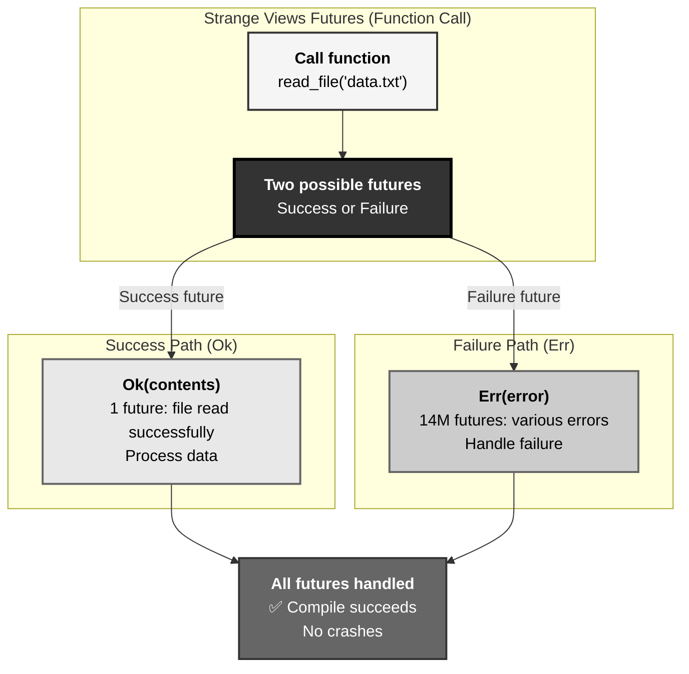
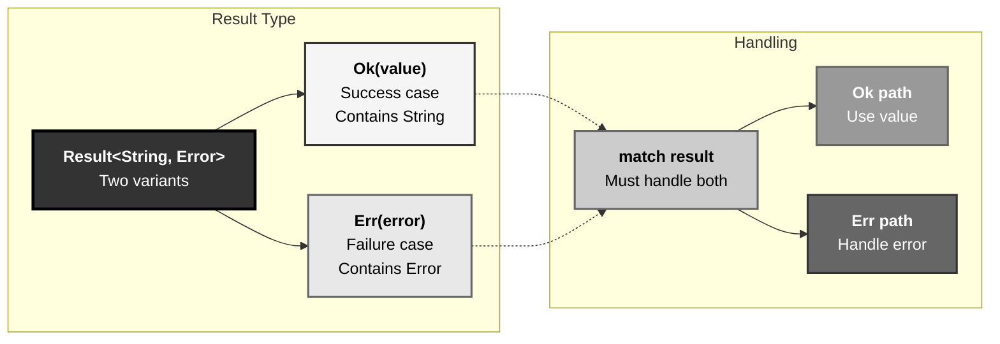
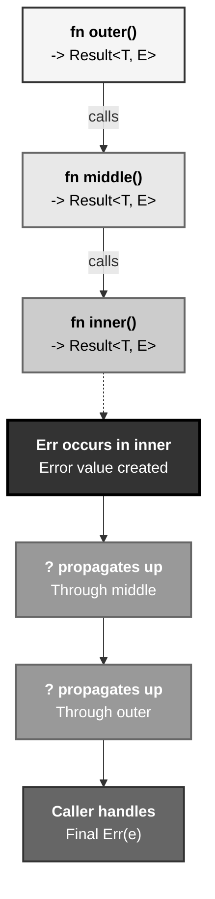
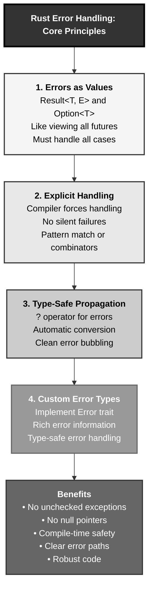

# Rust Error Handling: The 14 Million Futures Pattern

## The Answer (Minto Pyramid)

**Error handling in Rust uses Result<T, E> and Option<T> to make errors explicit and impossible to ignore, forcing developers to handle failure cases at compile time.**

Instead of exceptions that can be silently ignored, Rust makes errors values that must be handled. `Result<T, E>` represents success (`Ok(T)`) or failure (`Err(E)`). `Option<T>` represents presence (`Some(T)`) or absence (`None`). The compiler enforces handling both cases through pattern matching or combinator methods. Errors propagate explicitly with `?` operator. Custom error types implement `Error` trait. This approach eliminates unchecked exceptions, null pointer errors, and forgotten error handling—all caught at compile time.

**Three Supporting Principles:**

1. **Errors as Values**: Errors are first-class values, not control flow
2. **Explicit Handling**: Compiler forces you to handle both success and failure
3. **Type-Safe Propagation**: `?` operator propagates errors with type checking

**Why This Matters**: Error handling bugs cause production crashes. Rust's approach catches error handling mistakes at compile time, not runtime. Understanding `Result`, `Option`, and `?` is essential for writing robust Rust code.

---

## The MCU Metaphor: Doctor Strange's 14 Million Futures

Think of Rust error handling like Doctor Strange viewing possible futures:

### The Mapping

| Doctor Strange's Futures | Rust Error Handling |
|--------------------------|---------------------|
| **14 million possible outcomes** | Result<T, E> or Option<T> |
| **1 future where we win** | Ok(T) or Some(T) |
| **14,000,604 futures where we fail** | Err(E) or None |
| **Must see all outcomes** | Must handle all cases |
| **Can't ignore bad futures** | Compiler forces handling |
| **Choose path based on outcome** | Pattern match or combinator |
| **Future branches** | match, if let, ? operator |
| **Prepare for failure** | Error recovery logic |

### The Story

When Doctor Strange uses the Time Stone to see 14 million possible futures, he **must examine every single one**. He can't ignore the 14,000,604 futures where Thanos wins—pretending they don't exist won't stop them from happening. Each future is a possible outcome: **success or failure**. Strange must acknowledge both paths and plan accordingly.

In one future, Tony sacrifices himself and they win (`Ok(Victory)`). In 14,000,604 futures, they lose (`Err(Defeat)`). Strange can't just assume victory—he must **explicitly handle both outcomes**. He sees the failure cases, understands why they fail, and only then chooses the path to success. The Time Stone forces him to confront every possibility.

Similarly, Rust forces you to confront every possible outcome. Call a function that might fail? It returns `Result<T, E>`. Try to get an item from a Vec? It returns `Option<T>`. You **must handle both cases**: success and failure. The compiler is your Time Stone—it shows you all possible branches and refuses to compile until you've handled them all.

```rust
match read_file("data.txt") {
    Ok(contents) => process(contents),     // 1 future: success
    Err(error) => handle_error(error),     // Many futures: failure
}
```

Just like Strange viewing futures, you see both paths. Unlike exceptions that can be ignored, Rust **forces you to look at the failure path**. The compiler won't let you pretend errors don't exist—you must plan for every future, just like Strange.

---

## The Problem Without Explicit Error Handling

Before understanding Rust errors, developers face exception chaos:

```java path=null start=null
// Java - Unchecked exceptions can be ignored
public String readFile(String path) {
    // Throws IOException, but caller might not know
    return Files.readString(Path.of(path));
}

public void processData() {
    String data = readFile("data.txt");  // ❌ Might throw, not handled!
    System.out.println(data);
    // If IOException thrown, program crashes
}
```

```python path=null start=null
# Python - Exceptions can be silently ignored
def divide(a, b):
    return a / b  # Might raise ZeroDivisionError

result = divide(10, 0)  # ❌ Crashes at runtime!
print(result)
```

**Problems:**

1. **Silent Failures**: Exceptions can be ignored
2. **Runtime Crashes**: Unhandled errors crash program
3. **No Compiler Help**: Compiler doesn't force handling
4. **Unclear API**: Function signatures don't show errors
5. **Null Pointer Hell**: `null` represents absence, but no enforcement

---

## The Solution: Result and Option

Rust makes errors explicit values:

### Option<T> for Absence

```rust path=null start=null
fn find_user(id: u32) -> Option<User> {
    if id == 1 {
        Some(User { name: String::from("Alice") })
    } else {
        None  // No user found
    }
}

struct User {
    name: String,
}

fn main() {
    // Must handle both cases
    match find_user(1) {
        Some(user) => println!("Found: {}", user.name),
        None => println!("User not found"),
    }
    
    // Or use if let
    if let Some(user) = find_user(2) {
        println!("Found: {}", user.name);
    } else {
        println!("User not found");
    }
}
```

### Result<T, E> for Errors

```rust path=null start=null
use std::fs::File;
use std::io::{self, Read};

fn read_file(path: &str) -> Result<String, io::Error> {
    let mut file = File::open(path)?;  // Propagate error with ?
    let mut contents = String::new();
    file.read_to_string(&mut contents)?;
    Ok(contents)
}

fn main() {
    match read_file("data.txt") {
        Ok(contents) => println!("File contents: {}", contents),
        Err(error) => println!("Error reading file: {}", error),
    }
}
```

### The ? Operator

```rust path=null start=null
// Without ? operator - verbose
fn read_file_verbose(path: &str) -> Result<String, io::Error> {
    let file = match File::open(path) {
        Ok(f) => f,
        Err(e) => return Err(e),  // Early return on error
    };
    
    let mut contents = String::new();
    match file.read_to_string(&mut contents) {
        Ok(_) => Ok(contents),
        Err(e) => Err(e),
    }
}

// With ? operator - concise
fn read_file_concise(path: &str) -> Result<String, io::Error> {
    let mut file = File::open(path)?;  // ? propagates error
    let mut contents = String::new();
    file.read_to_string(&mut contents)?;
    Ok(contents)
}
```

---

## Visual Mental Model



### Result<T, E> Flow



### ? Operator Propagation



---

## Anatomy of Error Handling

### 1. Option<T> Basics

```rust path=null start=null
fn main() {
    let some_value: Option<i32> = Some(5);
    let no_value: Option<i32> = None;
    
    // Pattern matching
    match some_value {
        Some(v) => println!("Got value: {}", v),
        None => println!("No value"),
    }
    
    // if let
    if let Some(v) = some_value {
        println!("Value: {}", v);
    }
    
    // unwrap (panics if None)
    let value = some_value.unwrap();  // Dangerous!
    
    // unwrap_or (provide default)
    let value = no_value.unwrap_or(0);  // Safe
    
    // map
    let doubled = some_value.map(|x| x * 2);  // Some(10)
    
    // and_then
    let result = some_value.and_then(|x| {
        if x > 0 {
            Some(x * 2)
        } else {
            None
        }
    });
}
```

### 2. Result<T, E> Basics

```rust path=null start=null
fn divide(a: i32, b: i32) -> Result<i32, String> {
    if b == 0 {
        Err(String::from("Division by zero"))
    } else {
        Ok(a / b)
    }
}

fn main() {
    // Pattern matching
    match divide(10, 2) {
        Ok(result) => println!("Result: {}", result),
        Err(error) => println!("Error: {}", error),
    }
    
    // unwrap (panics if Err)
    let result = divide(10, 2).unwrap();
    
    // expect (panics with custom message)
    let result = divide(10, 2).expect("Division failed");
    
    // unwrap_or
    let result = divide(10, 0).unwrap_or(0);
    
    // map
    let doubled = divide(10, 2).map(|x| x * 2);  // Ok(10)
    
    // map_err
    let result = divide(10, 0).map_err(|e| format!("Calc error: {}", e));
}
```

### 3. The ? Operator

```rust path=null start=null
use std::fs::File;
use std::io::{self, Read};

fn read_username() -> Result<String, io::Error> {
    let mut file = File::open("username.txt")?;  // Returns Err if fails
    let mut username = String::new();
    file.read_to_string(&mut username)?;  // Returns Err if fails
    Ok(username)  // Both succeeded, return Ok
}

// ? works with Option too
fn get_first_char(s: &str) -> Option<char> {
    s.chars().next()  // Returns Option<char>
}

fn get_first_two_chars(s: &str) -> Option<(char, char)> {
    let first = s.chars().next()?;  // Returns None if no first char
    let second = s.chars().nth(1)?;  // Returns None if no second char
    Some((first, second))
}

fn main() {
    match read_username() {
        Ok(name) => println!("Username: {}", name),
        Err(e) => println!("Error: {}", e),
    }
    
    match get_first_two_chars("hello") {
        Some((a, b)) => println!("First two: {}, {}", a, b),
        None => println!("Not enough characters"),
    }
}
```

### 4. Custom Error Types

```rust path=null start=null
use std::fmt;

#[derive(Debug)]
enum MyError {
    IoError(std::io::Error),
    ParseError(String),
    NotFound,
}

impl fmt::Display for MyError {
    fn fmt(&self, f: &mut fmt::Formatter) -> fmt::Result {
        match self {
            MyError::IoError(e) => write!(f, "IO error: {}", e),
            MyError::ParseError(msg) => write!(f, "Parse error: {}", msg),
            MyError::NotFound => write!(f, "Not found"),
        }
    }
}

impl std::error::Error for MyError {}

// Convert from io::Error to MyError
impl From<std::io::Error> for MyError {
    fn from(error: std::io::Error) -> Self {
        MyError::IoError(error)
    }
}

fn read_config() -> Result<String, MyError> {
    let contents = std::fs::read_to_string("config.txt")?;  // Auto-converts io::Error
    if contents.is_empty() {
        Err(MyError::NotFound)
    } else {
        Ok(contents)
    }
}
```

### 5. Combinators

```rust path=null start=null
fn main() {
    let result: Result<i32, &str> = Ok(10);
    
    // map: transform Ok value
    let doubled = result.map(|x| x * 2);  // Ok(20)
    
    // and_then: chain operations
    let chained = result.and_then(|x| {
        if x > 5 {
            Ok(x * 2)
        } else {
            Err("Too small")
        }
    });
    
    // or_else: recover from error
    let recovered = Err("error").or_else(|_| Ok(0));  // Ok(0)
    
    // unwrap_or_else: compute default
    let value = result.unwrap_or_else(|e| {
        println!("Error: {}", e);
        0
    });
    
    // ok: Convert Result to Option
    let option = result.ok();  // Some(10)
}
```

---

## Common Error Handling Patterns

### Pattern 1: Early Return with ?

```rust path=null start=null
use std::fs::File;
use std::io::{self, Read};

fn process_file(path: &str) -> Result<String, io::Error> {
    let mut file = File::open(path)?;
    let mut contents = String::new();
    file.read_to_string(&mut contents)?;
    
    // Process contents
    let processed = contents.to_uppercase();
    
    Ok(processed)
}

fn main() {
    match process_file("data.txt") {
        Ok(data) => println!("Processed: {}", data),
        Err(e) => eprintln!("Error: {}", e),
    }
}
```

### Pattern 2: Multiple Error Types with Box<dyn Error>

```rust path=null start=null
use std::error::Error;
use std::fs::File;
use std::io::Read;

fn read_and_parse(path: &str) -> Result<i32, Box<dyn Error>> {
    let mut file = File::open(path)?;  // io::Error
    let mut contents = String::new();
    file.read_to_string(&mut contents)?;  // io::Error
    
    let number: i32 = contents.trim().parse()?;  // ParseIntError
    
    Ok(number)
}

fn main() {
    match read_and_parse("number.txt") {
        Ok(num) => println!("Number: {}", num),
        Err(e) => println!("Error: {}", e),
    }
}
```

### Pattern 3: Option to Result Conversion

```rust path=null start=null
fn find_user(id: u32) -> Option<User> {
    if id == 1 {
        Some(User { name: String::from("Alice") })
    } else {
        None
    }
}

struct User {
    name: String,
}

fn get_user(id: u32) -> Result<User, String> {
    find_user(id).ok_or_else(|| format!("User {} not found", id))
}

fn main() {
    match get_user(1) {
        Ok(user) => println!("Found: {}", user.name),
        Err(e) => println!("Error: {}", e),
    }
}
```

### Pattern 4: Collecting Results

```rust path=null start=null
fn parse_numbers(strings: &[&str]) -> Result<Vec<i32>, std::num::ParseIntError> {
    strings.iter()
        .map(|s| s.parse::<i32>())
        .collect()  // Collects Result<Vec<i32>, E>
}

fn main() {
    let strings = vec!["1", "2", "3", "4"];
    match parse_numbers(&strings) {
        Ok(numbers) => println!("Numbers: {:?}", numbers),
        Err(e) => println!("Parse error: {}", e),
    }
    
    let bad_strings = vec!["1", "2", "abc", "4"];
    match parse_numbers(&bad_strings) {
        Ok(numbers) => println!("Numbers: {:?}", numbers),
        Err(e) => println!("Parse error: {}", e),  // Stops at first error
    }
}
```

### Pattern 5: Logging Errors

```rust path=null start=null
fn process_with_logging(path: &str) -> Result<String, std::io::Error> {
    let result = std::fs::read_to_string(path);
    
    match &result {
        Ok(_) => println!("Successfully read {}", path),
        Err(e) => eprintln!("Error reading {}: {}", path, e),
    }
    
    result
}

// Or with map_err
fn process_with_map_err(path: &str) -> Result<String, std::io::Error> {
    std::fs::read_to_string(path).map_err(|e| {
        eprintln!("Error reading {}: {}", path, e);
        e
    })
}
```

---

## Real-World Use Cases

### Use Case 1: Configuration Loading

```rust path=null start=null
use std::fs;
use std::path::Path;

#[derive(Debug)]
enum ConfigError {
    FileNotFound,
    ParseError(String),
    InvalidFormat,
}

impl std::fmt::Display for ConfigError {
    fn fmt(&self, f: &mut std::fmt::Formatter) -> std::fmt::Result {
        match self {
            ConfigError::FileNotFound => write!(f, "Config file not found"),
            ConfigError::ParseError(msg) => write!(f, "Parse error: {}", msg),
            ConfigError::InvalidFormat => write!(f, "Invalid config format"),
        }
    }
}

impl std::error::Error for ConfigError {}

struct Config {
    host: String,
    port: u16,
}

fn load_config(path: &str) -> Result<Config, ConfigError> {
    if !Path::new(path).exists() {
        return Err(ConfigError::FileNotFound);
    }
    
    let contents = fs::read_to_string(path)
        .map_err(|_| ConfigError::FileNotFound)?;
    
    let lines: Vec<&str> = contents.lines().collect();
    
    if lines.len() < 2 {
        return Err(ConfigError::InvalidFormat);
    }
    
    let host = lines[0].to_string();
    let port: u16 = lines[1].parse()
        .map_err(|e| ConfigError::ParseError(format!("{}", e)))?;
    
    Ok(Config { host, port })
}

fn main() {
    match load_config("config.txt") {
        Ok(config) => println!("Loaded config: {}:{}", config.host, config.port),
        Err(e) => eprintln!("Failed to load config: {}", e),
    }
}
```

### Use Case 2: Database Operations

```rust path=null start=null
#[derive(Debug)]
enum DbError {
    ConnectionFailed,
    QueryFailed(String),
    NotFound,
}

impl std::fmt::Display for DbError {
    fn fmt(&self, f: &mut std::fmt::Formatter) -> std::fmt::Result {
        match self {
            DbError::ConnectionFailed => write!(f, "Failed to connect to database"),
            DbError::QueryFailed(msg) => write!(f, "Query failed: {}", msg),
            DbError::NotFound => write!(f, "Record not found"),
        }
    }
}

impl std::error::Error for DbError {}

struct User {
    id: u32,
    name: String,
}

struct Database;

impl Database {
    fn connect() -> Result<Self, DbError> {
        // Simulate connection
        Ok(Database)
    }
    
    fn find_user(&self, id: u32) -> Result<User, DbError> {
        if id == 1 {
            Ok(User {
                id,
                name: String::from("Alice"),
            })
        } else {
            Err(DbError::NotFound)
        }
    }
    
    fn save_user(&self, user: &User) -> Result<(), DbError> {
        // Simulate save
        println!("Saved user: {}", user.name);
        Ok(())
    }
}

fn update_user(id: u32, new_name: &str) -> Result<(), DbError> {
    let db = Database::connect()?;
    let mut user = db.find_user(id)?;
    user.name = new_name.to_string();
    db.save_user(&user)?;
    Ok(())
}

fn main() {
    match update_user(1, "Bob") {
        Ok(()) => println!("User updated successfully"),
        Err(e) => eprintln!("Error: {}", e),
    }
}
```

### Use Case 3: API Request Handling

```rust path=null start=null
use std::fmt;

#[derive(Debug)]
enum ApiError {
    NetworkError(String),
    ParseError(String),
    Unauthorized,
    NotFound,
}

impl fmt::Display for ApiError {
    fn fmt(&self, f: &mut fmt::Formatter) -> fmt::Result {
        match self {
            ApiError::NetworkError(msg) => write!(f, "Network error: {}", msg),
            ApiError::ParseError(msg) => write!(f, "Parse error: {}", msg),
            ApiError::Unauthorized => write!(f, "Unauthorized access"),
            ApiError::NotFound => write!(f, "Resource not found"),
        }
    }
}

impl std::error::Error for ApiError {}

#[derive(Debug)]
struct Response {
    status: u16,
    body: String,
}

fn fetch(url: &str) -> Result<Response, ApiError> {
    // Simulate HTTP request
    if url.contains("error") {
        return Err(ApiError::NetworkError(String::from("Connection failed")));
    }
    
    Ok(Response {
        status: 200,
        body: String::from(r#"{"id": 1, "name": "Alice"}"#),
    })
}

fn get_user(id: u32) -> Result<String, ApiError> {
    let url = format!("https://api.example.com/users/{}", id);
    let response = fetch(&url)?;
    
    if response.status == 404 {
        return Err(ApiError::NotFound);
    }
    
    if response.status == 401 {
        return Err(ApiError::Unauthorized);
    }
    
    // Parse JSON (simplified)
    if response.body.contains("name") {
        Ok(String::from("Alice"))
    } else {
        Err(ApiError::ParseError(String::from("Invalid JSON")))
    }
}

fn main() {
    match get_user(1) {
        Ok(name) => println!("User: {}", name),
        Err(e) => eprintln!("API error: {}", e),
    }
}
```

---

## Advanced Error Handling

### 1. thiserror and anyhow

```rust path=null start=null
// Using thiserror for library errors
use std::io;

#[derive(Debug)]
enum LibraryError {
    Io(io::Error),
    Parse(String),
    NotFound,
}

impl std::fmt::Display for LibraryError {
    fn fmt(&self, f: &mut std::fmt::Formatter) -> std::fmt::Result {
        match self {
            LibraryError::Io(e) => write!(f, "IO error: {}", e),
            LibraryError::Parse(msg) => write!(f, "Parse error: {}", msg),
            LibraryError::NotFound => write!(f, "Not found"),
        }
    }
}

impl std::error::Error for LibraryError {}

impl From<io::Error> for LibraryError {
    fn from(error: io::Error) -> Self {
        LibraryError::Io(error)
    }
}

// Using Box<dyn Error> for application errors
fn app_function() -> Result<(), Box<dyn std::error::Error>> {
    let contents = std::fs::read_to_string("file.txt")?;
    let number: i32 = contents.trim().parse()?;
    println!("Number: {}", number);
    Ok(())
}
```

### 2. Error Context

```rust path=null start=null
fn read_config() -> Result<String, String> {
    std::fs::read_to_string("config.txt")
        .map_err(|e| format!("Failed to read config: {}", e))
}

fn parse_config(contents: &str) -> Result<i32, String> {
    contents.trim().parse()
        .map_err(|e| format!("Failed to parse config: {}", e))
}

fn load_and_parse() -> Result<i32, String> {
    let contents = read_config()?;
    let value = parse_config(&contents)?;
    Ok(value)
}
```

### 3. Recovery Strategies

```rust path=null start=null
fn read_with_fallback(primary: &str, fallback: &str) -> Result<String, std::io::Error> {
    std::fs::read_to_string(primary)
        .or_else(|_| std::fs::read_to_string(fallback))
}

fn get_value_with_default(key: &str) -> i32 {
    std::env::var(key)
        .ok()
        .and_then(|s| s.parse().ok())
        .unwrap_or(42)  // Default value
}
```

---

## Key Takeaways



### The Mental Model

Think of error handling like Strange viewing futures:
- **14 million futures** → Result/Option (success or failure)
- **Must see all outcomes** → Must handle both cases
- **Can't ignore failures** → Compiler enforces handling
- **Choose path wisely** → Pattern match or combinator

### Core Principles

1. **Errors as Values**: Result<T, E> and Option<T> are first-class types
2. **Explicit Handling**: Compiler forces you to handle all cases
3. **Type-Safe Propagation**: ? operator propagates errors cleanly
4. **No Silent Failures**: Impossible to ignore errors
5. **Rich Error Types**: Custom errors provide context

### The Guarantee

Rust error handling provides:
- **Safety**: No unchecked exceptions, no null pointers
- **Robustness**: All error paths handled
- **Clarity**: Function signatures show possible errors
- **Performance**: Zero-cost abstractions

All enforced at **compile time**.

---

**Remember**: Error handling isn't exception catching—it's **viewing all possible futures**. Like Doctor Strange examining 14 million outcomes (1 success, 14M failures) and planning for each, Rust forces you to see both Ok and Err paths. The compiler is your Time Stone—it shows all possible branches and won't compile until you've handled them. No ignored exceptions, no forgotten error checks, no runtime surprises. Every future acknowledged, every error handled, all verified at compile time.
