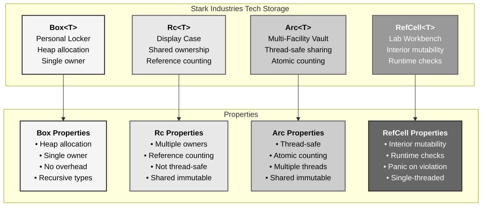
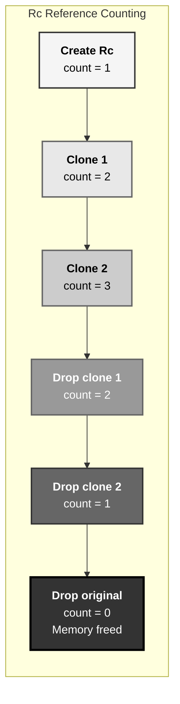
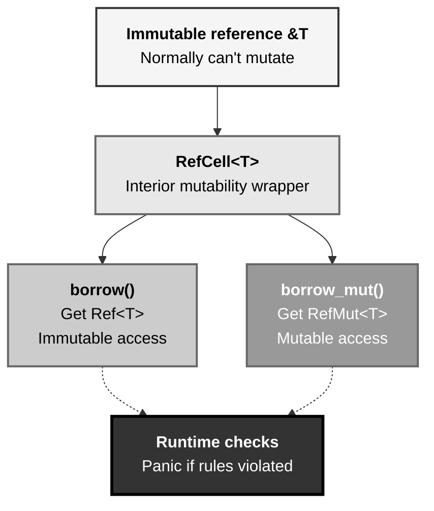
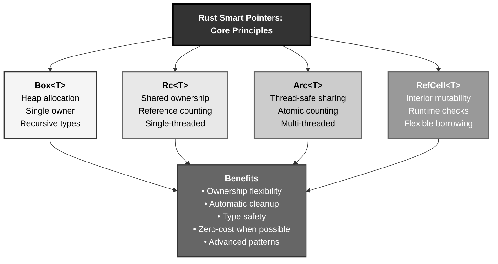

# Rust Smart Pointers: The Stark Industries Tech Vault Pattern

## The Answer (Minto Pyramid)

**Smart pointers in Rust provide advanced memory management patterns beyond basic ownership, enabling heap allocation (Box), shared ownership (Rc/Arc), and interior mutability (RefCell/Mutex) through types that act like pointers but with additional metadata and capabilities.**

A smart pointer is a data structure that acts like a pointer but has additional metadata and capabilities. Unlike references (`&T`), smart pointers own the data they point to. `Box<T>` enables heap allocation. `Rc<T>` (Reference Counted) enables multiple ownership via reference counting. `Arc<T>` (Atomic Rc) provides thread-safe shared ownership. `RefCell<T>` enables interior mutability (mutation through immutable reference). `Weak<T>` prevents reference cycles. Smart pointers implement `Deref` and `Drop` traits, providing automatic dereferencing and cleanup.

**Three Supporting Principles:**

1. **Ownership Flexibility**: Different pointers for different ownership patterns
2. **Compile-Time Safety**: Borrow rules enforced at compile time (Box, Rc, Arc) or runtime (RefCell)
3. **Zero-Cost When Possible**: Box has no overhead, Rc/Arc only when sharing needed

**Why This Matters**: Smart pointers enable patterns impossible with basic ownership: recursive types, shared data structures, interior mutability. Understanding smart pointers unlocks advanced Rust patterns.

---

## The MCU Metaphor: Stark Industries Tech Vault

Think of Rust smart pointers like Tony Stark's tech storage solutions:

### The Mapping

| Stark Industries Vault | Rust Smart Pointers |
|------------------------|---------------------|
| **Personal locker (Tony only)** | Box<T> (heap allocation, single owner) |
| **Shared display case** | Rc<T> (shared ownership, reference counting) |
| **Multi-facility vault** | Arc<T> (thread-safe shared ownership) |
| **Lab workbench** | RefCell<T> (interior mutability) |
| **Catalog reference** | Weak<T> (non-owning reference) |
| **Access counter** | Reference count (automatic cleanup) |
| **Lock mechanism** | Mutex<T> (thread-safe interior mutability) |
| **Vault cleanup** | Drop trait (automatic memory release) |

### The Story

Tony Stark has different storage solutions for different tech at Stark Industries:

**Personal Locker (`Box<T>`)**: Tony's private locker on the heap—only he has the key. When he stores the Mark I prototype here, it's moved from the stack (his desk) to secure heap storage. Only one person can own the locker at a time. When Tony's done, the locker is automatically cleared—no manual cleanup needed.

**Shared Display Case (`Rc<T>`)**: The Arc Reactor prototype sits in a display case in R&D. Multiple scientists can view it (multiple references), but they can't modify it. The display case has a **counter**: when scientist #1 looks at it, counter = 1. Scientist #2 joins, counter = 2. When scientists leave, the counter decrements. When counter reaches 0, JARVIS automatically removes the prototype and cleans up—no prototype sits abandoned.

**Multi-Facility Vault (`Arc<T>`)**: Some tech needs sharing across facilities in different threads—California HQ, New York Avengers Tower. `Arc` is like a synchronized vault with atomic counters. Thread-safe, multiple facilities can access simultaneously, automatic cleanup when last facility releases access.

**Lab Workbench (`RefCell<T>`)**: Sometimes Tony needs to modify tech even when it's "on display" (immutable reference). The workbench allows **interior mutability**: the display case is immutable, but the tech inside can be modified. Runtime checks prevent multiple engineers from modifying simultaneously—if someone's already working on it, others must wait.

Similarly, Rust smart pointers provide specialized storage for different patterns. Need heap allocation? `Box<T>`. Need sharing? `Rc<T>`. Need thread-safe sharing? `Arc<T>`. Need mutation through immutable reference? `RefCell<T>`. Each smart pointer has automatic cleanup (`Drop`), reference counting when needed, and compile-time or runtime safety checks.

---

## The Problem Without Smart Pointers

Before understanding smart pointers, developers face limitations:

```rust path=null start=null
// ❌ Can't create recursive types with just ownership
// struct Node {
//     value: i32,
//     next: Node,  // ERROR: infinite size!
// }

// ❌ Can't share ownership easily
// let data = vec![1, 2, 3];
// let owner1 = data;
// let owner2 = data;  // ERROR: value used after move

// ❌ Can't modify through immutable reference
// let x = 5;
// let r = &x;
// // Can't modify x through r - immutable!
```

**Problems:**

1. **No Heap Allocation**: Everything on stack (fixed size required)
2. **No Shared Ownership**: Only one owner at a time
3. **No Interior Mutability**: Can't mutate through `&T`
4. **No Recursive Types**: Can't define self-referential structures
5. **Manual Memory Management**: In other languages, leads to leaks

---

## The Solution: Smart Pointer Types

Rust provides specialized smart pointers:

### Box<T>: Heap Allocation

```rust path=null start=null
fn main() {
    // Store value on heap
    let boxed = Box::new(5);
    println!("Boxed value: {}", boxed);
    
    // Automatic deref
    let value = *boxed;  // Dereference
    println!("Value: {}", value);
    
    // Enables recursive types
    #[derive(Debug)]
    enum List {
        Cons(i32, Box<List>),
        Nil,
    }
    
    use List::{Cons, Nil};
    
    let list = Cons(1, Box::new(Cons(2, Box::new(Cons(3, Box::new(Nil))))));
    println!("List: {:?}", list);
}
```

### Rc<T>: Reference Counted Shared Ownership

```rust path=null start=null
use std::rc::Rc;

fn main() {
    let data = Rc::new(vec![1, 2, 3]);
    
    println!("Count: {}", Rc::strong_count(&data));  // 1
    
    {
        let data2 = Rc::clone(&data);  // Increment count
        let data3 = Rc::clone(&data);  // Increment count
        
        println!("Count: {}", Rc::strong_count(&data));  // 3
        println!("Data2: {:?}", data2);
        println!("Data3: {:?}", data3);
    }  // data2 and data3 dropped, count decrements
    
    println!("Count: {}", Rc::strong_count(&data));  // 1
}
```

### Arc<T>: Thread-Safe Reference Counting

```rust path=null start=null
use std::sync::Arc;
use std::thread;

fn main() {
    let data = Arc::new(vec![1, 2, 3]);
    
    let mut handles = vec![];
    
    for i in 0..3 {
        let data_clone = Arc::clone(&data);
        let handle = thread::spawn(move || {
            println!("Thread {}: {:?}", i, data_clone);
        });
        handles.push(handle);
    }
    
    for handle in handles {
        handle.join().unwrap();
    }
    
    println!("Main: {:?}", data);
}
```

### RefCell<T>: Interior Mutability

```rust path=null start=null
use std::cell::RefCell;

fn main() {
    let data = RefCell::new(5);
    
    // Immutable borrow
    {
        let r1 = data.borrow();
        let r2 = data.borrow();  // Multiple immutable borrows OK
        println!("r1: {}, r2: {}", r1, r2);
    }
    
    // Mutable borrow
    {
        let mut r = data.borrow_mut();
        *r += 10;
    }
    
    println!("Data: {}", data.borrow());  // 15
}
```

---

## Visual Mental Model



### Reference Counting Flow



### Interior Mutability Pattern



---

## Anatomy of Smart Pointers

### 1. Box<T> - Heap Allocation

```rust path=null start=null
fn main() {
    // Basic heap allocation
    let b = Box::new(5);
    println!("Boxed: {}", b);
    
    // Large data on heap
    let large_array = Box::new([0; 1_000_000]);
    println!("Array length: {}", large_array.len());
    
    // Recursive type
    #[derive(Debug)]
    enum List {
        Cons(i32, Box<List>),
        Nil,
    }
    
    use List::{Cons, Nil};
    
    let list = Cons(1, Box::new(Cons(2, Box::new(Nil))));
    println!("List: {:?}", list);
    
    // Box::leak for static lifetime
    let static_str: &'static str = Box::leak(Box::new(String::from("leaked")));
    println!("Static: {}", static_str);
}
```

### 2. Rc<T> - Reference Counting

```rust path=null start=null
use std::rc::Rc;

fn main() {
    let a = Rc::new(String::from("hello"));
    println!("Count: {}", Rc::strong_count(&a));  // 1
    
    let b = Rc::clone(&a);  // Shallow clone, increments count
    println!("Count: {}", Rc::strong_count(&a));  // 2
    
    {
        let c = Rc::clone(&a);
        println!("Count: {}", Rc::strong_count(&a));  // 3
        println!("c: {}", c);
    }  // c dropped, count decrements
    
    println!("Count: {}", Rc::strong_count(&a));  // 2
    
    // Downgrade to Weak
    let weak = Rc::downgrade(&a);
    println!("Weak count: {}", Rc::weak_count(&a));  // 1
    
    // Upgrade Weak to Rc
    if let Some(strong) = weak.upgrade() {
        println!("Upgraded: {}", strong);
    }
}
```

### 3. Arc<T> - Atomic Reference Counting

```rust path=null start=null
use std::sync::Arc;
use std::thread;

fn main() {
    let data = Arc::new(vec![1, 2, 3, 4, 5]);
    let mut handles = vec![];
    
    for i in 0..3 {
        let data_clone = Arc::clone(&data);
        
        let handle = thread::spawn(move || {
            let sum: i32 = data_clone.iter().sum();
            println!("Thread {}: sum = {}", i, sum);
        });
        
        handles.push(handle);
    }
    
    for handle in handles {
        handle.join().unwrap();
    }
    
    println!("Main thread: {:?}", data);
}
```

### 4. RefCell<T> - Interior Mutability

```rust path=null start=null
use std::cell::RefCell;

fn main() {
    let value = RefCell::new(5);
    
    // Multiple immutable borrows OK
    {
        let r1 = value.borrow();
        let r2 = value.borrow();
        println!("r1: {}, r2: {}", r1, r2);
    }  // Borrows released
    
    // Mutable borrow
    {
        let mut r = value.borrow_mut();
        *r += 10;
        println!("Modified: {}", r);
    }  // Mutable borrow released
    
    // ❌ This panics: can't borrow mutably while borrowed immutably
    // let r1 = value.borrow();
    // let r2 = value.borrow_mut();  // PANIC!
    
    println!("Final: {}", value.borrow());
}
```

### 5. Weak<T> - Breaking Reference Cycles

```rust path=null start=null
use std::rc::{Rc, Weak};
use std::cell::RefCell;

#[derive(Debug)]
struct Node {
    value: i32,
    next: Option<Rc<RefCell<Node>>>,
    prev: Option<Weak<RefCell<Node>>>,  // Weak prevents cycle
}

fn main() {
    let node1 = Rc::new(RefCell::new(Node {
        value: 1,
        next: None,
        prev: None,
    }));
    
    let node2 = Rc::new(RefCell::new(Node {
        value: 2,
        next: None,
        prev: Some(Rc::downgrade(&node1)),  // Weak reference
    }));
    
    node1.borrow_mut().next = Some(Rc::clone(&node2));
    
    println!("Node1 value: {}", node1.borrow().value);
    println!("Node2 value: {}", node2.borrow().value);
    
    // No memory leak - Weak breaks the cycle
}
```

---

## Common Smart Pointer Patterns

### Pattern 1: Shared Data Structure

```rust path=null start=null
use std::rc::Rc;
use std::cell::RefCell;

#[derive(Debug)]
struct Graph {
    nodes: Vec<Rc<RefCell<Node>>>,
}

#[derive(Debug)]
struct Node {
    value: i32,
    neighbors: Vec<Rc<RefCell<Node>>>,
}

impl Graph {
    fn new() -> Self {
        Graph { nodes: Vec::new() }
    }
    
    fn add_node(&mut self, value: i32) -> Rc<RefCell<Node>> {
        let node = Rc::new(RefCell::new(Node {
            value,
            neighbors: Vec::new(),
        }));
        self.nodes.push(Rc::clone(&node));
        node
    }
    
    fn add_edge(&self, from: &Rc<RefCell<Node>>, to: &Rc<RefCell<Node>>) {
        from.borrow_mut().neighbors.push(Rc::clone(to));
    }
}

fn main() {
    let mut graph = Graph::new();
    
    let n1 = graph.add_node(1);
    let n2 = graph.add_node(2);
    let n3 = graph.add_node(3);
    
    graph.add_edge(&n1, &n2);
    graph.add_edge(&n1, &n3);
    graph.add_edge(&n2, &n3);
    
    println!("Node 1 neighbors: {}", n1.borrow().neighbors.len());
}
```

### Pattern 2: Thread-Safe Shared State

```rust path=null start=null
use std::sync::{Arc, Mutex};
use std::thread;

fn main() {
    let counter = Arc::new(Mutex::new(0));
    let mut handles = vec![];
    
    for _ in 0..10 {
        let counter_clone = Arc::clone(&counter);
        
        let handle = thread::spawn(move || {
            let mut num = counter_clone.lock().unwrap();
            *num += 1;
        });
        
        handles.push(handle);
    }
    
    for handle in handles {
        handle.join().unwrap();
    }
    
    println!("Final count: {}", *counter.lock().unwrap());  // 10
}
```

### Pattern 3: Cache with Interior Mutability

```rust path=null start=null
use std::cell::RefCell;
use std::collections::HashMap;

struct Cache {
    store: RefCell<HashMap<String, i32>>,
}

impl Cache {
    fn new() -> Self {
        Cache {
            store: RefCell::new(HashMap::new()),
        }
    }
    
    fn get(&self, key: &str) -> Option<i32> {
        self.store.borrow().get(key).copied()
    }
    
    fn insert(&self, key: String, value: i32) {
        self.store.borrow_mut().insert(key, value);
    }
}

fn main() {
    let cache = Cache::new();
    
    cache.insert(String::from("key1"), 42);
    cache.insert(String::from("key2"), 100);
    
    if let Some(value) = cache.get("key1") {
        println!("Cached value: {}", value);
    }
}
```

### Pattern 4: Observer Pattern

```rust path=null start=null
use std::rc::{Rc, Weak};
use std::cell::RefCell;

struct Subject {
    observers: RefCell<Vec<Weak<RefCell<Observer>>>>,
    state: RefCell<i32>,
}

struct Observer {
    id: i32,
}

impl Subject {
    fn new() -> Rc<Self> {
        Rc::new(Subject {
            observers: RefCell::new(Vec::new()),
            state: RefCell::new(0),
        })
    }
    
    fn attach(&self, observer: &Rc<RefCell<Observer>>) {
        self.observers.borrow_mut().push(Rc::downgrade(observer));
    }
    
    fn set_state(&self, state: i32) {
        *self.state.borrow_mut() = state;
        self.notify();
    }
    
    fn notify(&self) {
        let state = *self.state.borrow();
        
        // Clean up dead weak references
        self.observers.borrow_mut().retain(|weak| {
            if let Some(observer) = weak.upgrade() {
                println!("Notifying observer {}: state = {}", 
                         observer.borrow().id, state);
                true
            } else {
                false  // Remove dead reference
            }
        });
    }
}

fn main() {
    let subject = Subject::new();
    
    let obs1 = Rc::new(RefCell::new(Observer { id: 1 }));
    let obs2 = Rc::new(RefCell::new(Observer { id: 2 }));
    
    subject.attach(&obs1);
    subject.attach(&obs2);
    
    subject.set_state(42);
    
    drop(obs1);  // Observer 1 no longer exists
    
    subject.set_state(100);  // Only observer 2 notified
}
```

### Pattern 5: Doubly Linked List

```rust path=null start=null
use std::rc::{Rc, Weak};
use std::cell::RefCell;

type Link = Option<Rc<RefCell<Node>>>;
type WeakLink = Option<Weak<RefCell<Node>>>;

#[derive(Debug)]
struct Node {
    value: i32,
    next: Link,
    prev: WeakLink,
}

struct DoublyLinkedList {
    head: Link,
    tail: WeakLink,
}

impl DoublyLinkedList {
    fn new() -> Self {
        DoublyLinkedList {
            head: None,
            tail: None,
        }
    }
    
    fn push_back(&mut self, value: i32) {
        let new_node = Rc::new(RefCell::new(Node {
            value,
            next: None,
            prev: None,
        }));
        
        match self.tail.take() {
            Some(old_tail) => {
                if let Some(old_tail_rc) = old_tail.upgrade() {
                    new_node.borrow_mut().prev = Some(old_tail.clone());
                    old_tail_rc.borrow_mut().next = Some(Rc::clone(&new_node));
                }
            }
            None => {
                self.head = Some(Rc::clone(&new_node));
            }
        }
        
        self.tail = Some(Rc::downgrade(&new_node));
    }
}

fn main() {
    let mut list = DoublyLinkedList::new();
    list.push_back(1);
    list.push_back(2);
    list.push_back(3);
    
    println!("List created");
}
```

---

## Real-World Use Cases

### Use Case 1: Configuration Singleton

```rust path=null start=null
use std::sync::{Arc, RwLock};

struct Config {
    host: String,
    port: u16,
}

impl Config {
    fn new() -> Arc<RwLock<Self>> {
        Arc::new(RwLock::new(Config {
            host: String::from("localhost"),
            port: 8080,
        }))
    }
}

fn main() {
    let config = Config::new();
    
    // Multiple readers
    {
        let r1 = config.read().unwrap();
        let r2 = config.read().unwrap();
        println!("Config: {}:{}", r1.host, r1.port);
        println!("Config: {}:{}", r2.host, r2.port);
    }
    
    // Single writer
    {
        let mut w = config.write().unwrap();
        w.port = 3000;
    }
    
    println!("Updated port: {}", config.read().unwrap().port);
}
```

### Use Case 2: Event System

```rust path=null start=null
use std::rc::Rc;
use std::cell::RefCell;

type Callback = Box<dyn Fn(&str)>;

struct EventBus {
    listeners: RefCell<Vec<Callback>>,
}

impl EventBus {
    fn new() -> Rc<Self> {
        Rc::new(EventBus {
            listeners: RefCell::new(Vec::new()),
        })
    }
    
    fn subscribe(&self, callback: Callback) {
        self.listeners.borrow_mut().push(callback);
    }
    
    fn emit(&self, event: &str) {
        for listener in self.listeners.borrow().iter() {
            listener(event);
        }
    }
}

fn main() {
    let bus = EventBus::new();
    
    bus.subscribe(Box::new(|event| {
        println!("Listener 1: {}", event);
    }));
    
    bus.subscribe(Box::new(|event| {
        println!("Listener 2: {}", event);
    }));
    
    bus.emit("user_login");
    bus.emit("data_updated");
}
```

### Use Case 3: Resource Pool

```rust path=null start=null
use std::sync::{Arc, Mutex};

struct ResourcePool<T> {
    resources: Arc<Mutex<Vec<T>>>,
}

impl<T> ResourcePool<T> {
    fn new(resources: Vec<T>) -> Self {
        ResourcePool {
            resources: Arc::new(Mutex::new(resources)),
        }
    }
    
    fn acquire(&self) -> Option<T> {
        self.resources.lock().unwrap().pop()
    }
    
    fn release(&self, resource: T) {
        self.resources.lock().unwrap().push(resource);
    }
}

fn main() {
    let pool = ResourcePool::new(vec![1, 2, 3, 4, 5]);
    
    if let Some(resource) = pool.acquire() {
        println!("Acquired: {}", resource);
        
        // Use resource...
        
        pool.release(resource);
        println!("Released");
    }
}
```

---

## Key Takeaways



### The Mental Model

Think of smart pointers like Stark Industries vaults:
- **Personal locker (Box)** → Heap allocation, single owner
- **Display case (Rc)** → Shared viewing, reference counting
- **Multi-facility vault (Arc)** → Thread-safe sharing
- **Lab workbench (RefCell)** → Interior mutability with runtime checks

### Core Principles

1. **Box<T>**: Heap allocation, single owner, enables recursive types
2. **Rc<T>**: Shared ownership via reference counting (single-threaded)
3. **Arc<T>**: Thread-safe shared ownership with atomic counting
4. **RefCell<T>**: Interior mutability with runtime borrow checking
5. **Weak<T>**: Non-owning references to break cycles

### The Guarantee

Rust smart pointers provide:
- **Flexibility**: Different ownership patterns for different needs
- **Safety**: Automatic memory management, no manual free
- **Performance**: Zero-cost when possible, minimal overhead when needed
- **Correctness**: Compile-time or runtime checks prevent bugs

All with **automatic cleanup** via `Drop` trait.

---

**Remember**: Smart pointers aren't just pointers—they're **specialized storage with automatic management**. Like Stark's tech vaults (personal locker, display case, multi-facility vault, workbench), each smart pointer serves a purpose: `Box` for heap allocation, `Rc` for shared ownership, `Arc` for thread-safe sharing, `RefCell` for interior mutability. Reference counting tracks usage, `Drop` handles cleanup automatically, and the compiler (or runtime) enforces safety. Choose the right vault for your tech, let Rust handle the rest.
