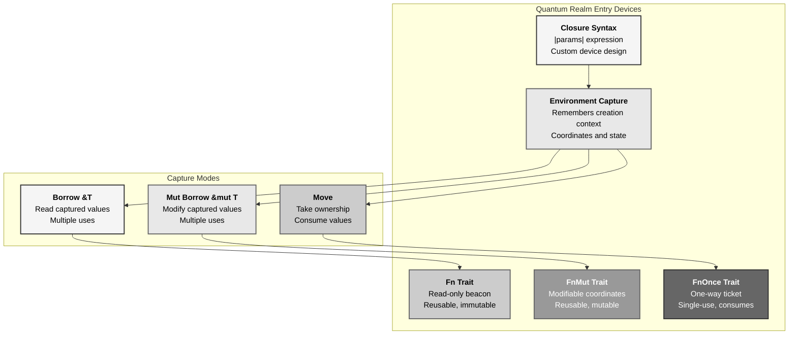
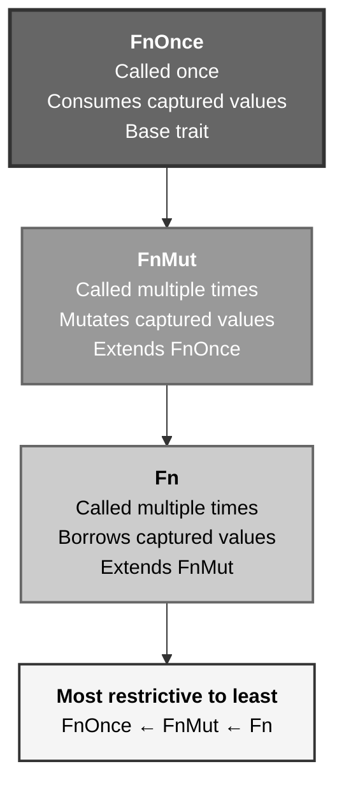
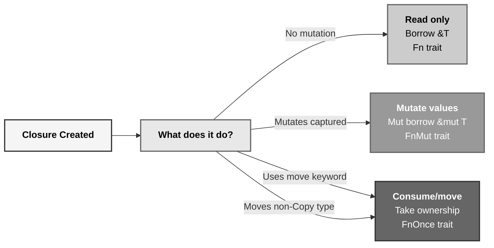
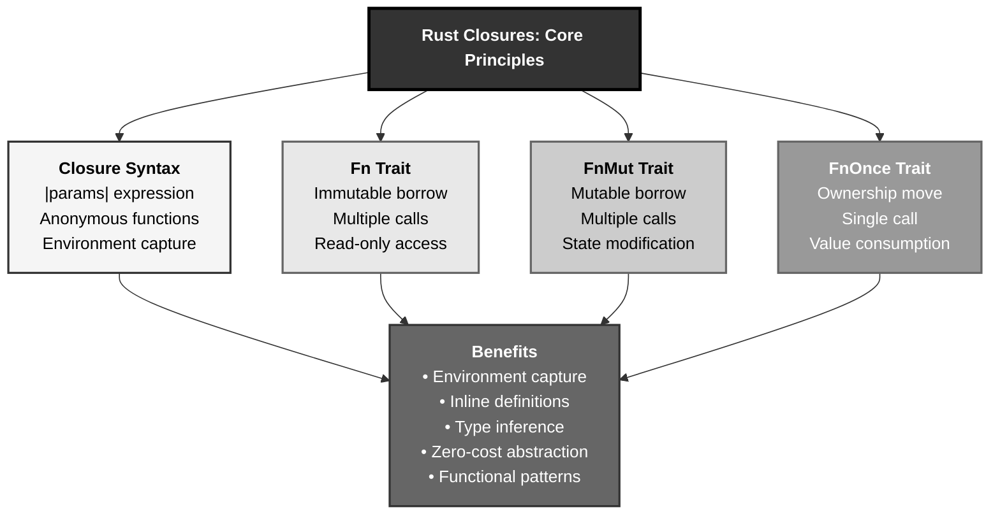

# Rust Closures: The Quantum Realm Entry Device Pattern

## The Answer (Minto Pyramid)

**Closures in Rust are anonymous functions that can capture variables from their surrounding environment, enabling flexible function-like behavior with three capture modes (borrow, mutable borrow, move) and three traits (Fn, FnMut, FnOnce) that determine how they interact with captured data.**

A closure is an anonymous function you can save in a variable or pass as an argument. Unlike regular functions, closures can capture values from the scope in which they're defined. Rust infers three capture modes: **borrow** (`&T` - read-only), **mutable borrow** (`&mut T` - modify), or **move** (take ownership). Three traits describe closure behavior: `Fn` (can be called repeatedly, borrows), `FnMut` (can be called repeatedly, mutably borrows), `FnOnce` (called once, moves). Closures enable functional programming patterns: iterators, callbacks, lazy evaluation, higher-order functions.

**Three Supporting Principles:**

1. **Environment Capture**: Closures remember their creation context
2. **Minimal Capture**: Rust captures only what's needed, in the least restrictive way
3. **Type Inference**: Closure types inferred from usage, ensuring zero-cost abstraction

**Why This Matters**: Closures enable expressive, functional code patterns impossible with regular functions. They're the foundation of Rust's iterator system and enable powerful abstractions with no runtime overhead.

---

## The MCU Metaphor: Quantum Realm Entry Device

Think of Rust closures like the Quantum Realm entry devices used by Ant-Man and the Avengers:

### The Mapping

| Quantum Realm Device | Rust Closures |
|----------------------|---------------|
| **Entry device** | Closure definition (`\|x\| x + 1`) |
| **Captured environment** | Variables from surrounding scope |
| **Read-only beacon** | Borrow capture (`&T`) |
| **Modifiable coordinates** | Mutable borrow capture (`&mut T`) |
| **One-way ticket** | Move capture (take ownership) |
| **Fn trait** | Reusable, non-mutating device |
| **FnMut trait** | Reusable, state-changing device |
| **FnOnce trait** | Single-use device (consumed) |
| **Device activation** | Closure invocation |

### The Story

Scott Lang's Quantum Realm entry device demonstrates closure behavior perfectly:

**The Device (`Closure`)**: The Quantum Realm entry device is a self-contained unit that remembers specific environmental coordinates—your entry point, time period, location. Unlike a generic portal generator (regular function), each device is customized with **captured data** from when it was created. Tony Stark creates one for Scott with 2012 coordinates; he creates another for Steve with 1970 coordinates. Same device design (closure syntax), different captured environments.

**Read-Only Beacon (`Fn` - Borrow)**: The device reads coordinates without modifying them. Scott can use it multiple times—check coordinates, verify timestamp, calculate route. The beacon data stays immutable. This is `Fn`: the closure borrows `&T`, can be called repeatedly, doesn't mutate state. Like checking coordinates without changing them.

**Modifiable Coordinates (`FnMut` - Mutable Borrow)**: Sometimes you need to update coordinates between jumps. The device tracks how many jumps you've made, adjusts for time dilation, modifies internal state. This is `FnMut`: the closure mutably borrows `&mut T`, can be called repeatedly, but changes captured state each time. Like incrementing a jump counter.

**One-Way Ticket (`FnOnce` - Move)**: Some missions require consuming the device entirely—single-use Pym particles that vanish after use, a device that self-destructs after activation. This is `FnOnce`: the closure takes ownership, moves captured values, can only be called once. After activation, the device is gone.

Similarly, Rust closures capture their environment (coordinates), have different access modes (read-only beacon, modifiable coordinates, one-way ticket), and implement traits (`Fn`, `FnMut`, `FnOnce`) that determine reusability. Each closure is a customized device for its specific task, remembering its creation context while providing flexible activation patterns.

---

## The Problem Without Closures

Before understanding closures, developers face limitations:

```rust path=null start=null
// ❌ Can't capture environment in regular functions
fn add(x: i32) -> i32 {
    // How to add to a value from outer scope?
    // x + outer_value  // ERROR: outer_value not in scope
    x
}

// ❌ Verbose callback patterns
struct State {
    count: i32,
}

fn process_with_callback(state: &mut State, callback: fn(&mut i32)) {
    callback(&mut state.count);
}

// ❌ Can't express intent compactly
let numbers = vec![1, 2, 3, 4, 5];
let mut evens = Vec::new();
for n in &numbers {
    if n % 2 == 0 {
        evens.push(*n);
    }
}
```

**Problems:**

1. **No Environment Capture**: Regular functions can't access outer scope
2. **Verbose Callbacks**: Function pointers require separate definitions
3. **Inflexible**: Can't express intent inline
4. **No State**: Function pointers can't carry state
5. **Repetitive Code**: Manual iteration patterns everywhere

---

## The Solution: Closure Syntax and Capture

Rust provides closures with automatic capture:

### Basic Closure Syntax

```rust path=null start=null
fn main() {
    // Closure with inferred types
    let add_one = |x| x + 1;
    println!("Result: {}", add_one(5));  // 6
    
    // Closure with explicit types
    let add_two = |x: i32| -> i32 { x + 2 };
    println!("Result: {}", add_two(5));  // 7
    
    // Closure with multiple parameters
    let multiply = |x: i32, y: i32| x * y;
    println!("Result: {}", multiply(3, 4));  // 12
    
    // Closure with no parameters
    let greet = || println!("Hello!");
    greet();
}
```

### Capturing Environment (Borrow)

```rust path=null start=null
fn main() {
    let factor = 2;
    
    // Closure borrows `factor` immutably
    let multiply = |x| x * factor;
    
    println!("Result: {}", multiply(5));  // 10
    println!("Result: {}", multiply(3));  // 6
    
    // `factor` still accessible
    println!("Factor: {}", factor);
}
```

### Capturing with Mutable Borrow

```rust path=null start=null
fn main() {
    let mut count = 0;
    
    // Closure borrows `count` mutably
    let mut increment = || {
        count += 1;
        count
    };
    
    println!("Count: {}", increment());  // 1
    println!("Count: {}", increment());  // 2
    println!("Count: {}", increment());  // 3
    
    // Can access count after closure is done
    println!("Final count: {}", count);  // 3
}
```

### Moving Ownership

```rust path=null start=null
fn main() {
    let data = vec![1, 2, 3];
    
    // Closure takes ownership with `move`
    let consume = move || {
        println!("Data: {:?}", data);
        // `data` moved into closure
    };
    
    consume();
    // consume();  // Can call again if data is Copy
    
    // ❌ data no longer accessible here
    // println!("{:?}", data);  // ERROR: value moved
}
```

---

## Visual Mental Model



### Closure Traits Hierarchy



### Capture Mode Selection



---

## Anatomy of Closures

### 1. Basic Closure Syntax

```rust path=null start=null
fn main() {
    // Minimal syntax
    let square = |x| x * x;
    println!("{}", square(5));  // 25
    
    // With type annotations
    let square_typed = |x: i32| -> i32 { x * x };
    println!("{}", square_typed(5));  // 25
    
    // Multiple statements
    let verbose = |x: i32| {
        let result = x * x;
        println!("Calculating...");
        result
    };
    println!("{}", verbose(5));  // 25
    
    // No parameters
    let hello = || println!("Hello!");
    hello();
}
```

### 2. Fn Trait - Immutable Borrow

```rust path=null start=null
fn main() {
    let multiplier = 3;
    
    // Implements Fn - borrows immutably
    let times_three = |x| x * multiplier;
    
    // Can call multiple times
    println!("{}", times_three(2));  // 6
    println!("{}", times_three(4));  // 12
    println!("{}", times_three(5));  // 15
    
    // Original still accessible
    println!("Multiplier: {}", multiplier);
}

fn apply_twice<F>(f: F, x: i32) -> i32
where
    F: Fn(i32) -> i32,
{
    f(f(x))
}

fn main() {
    let double = |x| x * 2;
    println!("{}", apply_twice(double, 5));  // 20
}
```

### 3. FnMut Trait - Mutable Borrow

```rust path=null start=null
fn main() {
    let mut sum = 0;
    
    // Implements FnMut - borrows mutably
    let mut accumulate = |x| {
        sum += x;
        sum
    };
    
    println!("{}", accumulate(1));  // 1
    println!("{}", accumulate(2));  // 3
    println!("{}", accumulate(3));  // 6
    
    println!("Final sum: {}", sum);  // 6
}

fn apply_and_modify<F>(mut f: F, x: i32)
where
    F: FnMut(i32),
{
    f(x);
    f(x * 2);
}

fn main() {
    let mut total = 0;
    apply_and_modify(|x| total += x, 5);
    println!("Total: {}", total);  // 15 (5 + 10)
}
```

### 4. FnOnce Trait - Ownership Move

```rust path=null start=null
fn main() {
    let data = vec![1, 2, 3];
    
    // Implements FnOnce - takes ownership
    let consume = move || {
        println!("Consuming: {:?}", data);
        drop(data);  // Explicit drop
    };
    
    consume();
    // consume();  // ERROR: can only call once
}

fn call_once<F>(f: F)
where
    F: FnOnce(),
{
    f();
}

fn main() {
    let data = vec![1, 2, 3];
    
    call_once(move || {
        println!("{:?}", data);
        // data consumed here
    });
    
    // data no longer available
}
```

### 5. Move Closures for Threads

```rust path=null start=null
use std::thread;

fn main() {
    let data = vec![1, 2, 3, 4, 5];
    
    // Must use `move` for thread safety
    let handle = thread::spawn(move || {
        println!("Thread data: {:?}", data);
    });
    
    handle.join().unwrap();
    
    // ❌ data no longer accessible
    // println!("{:?}", data);  // ERROR: value moved
}
```

---

## Common Closure Patterns

### Pattern 1: Iterator Adapters

```rust path=null start=null
fn main() {
    let numbers = vec![1, 2, 3, 4, 5];
    
    // map - transform each element
    let doubled: Vec<i32> = numbers.iter()
        .map(|x| x * 2)
        .collect();
    println!("Doubled: {:?}", doubled);
    
    // filter - select elements
    let evens: Vec<i32> = numbers.iter()
        .filter(|x| *x % 2 == 0)
        .copied()
        .collect();
    println!("Evens: {:?}", evens);
    
    // fold - accumulate
    let sum = numbers.iter()
        .fold(0, |acc, x| acc + x);
    println!("Sum: {}", sum);
    
    // Chain multiple operations
    let result: Vec<i32> = numbers.iter()
        .filter(|x| *x % 2 == 0)
        .map(|x| x * x)
        .collect();
    println!("Squared evens: {:?}", result);
}
```

### Pattern 2: Custom Comparators

```rust path=null start=null
fn main() {
    let mut people = vec![
        ("Alice", 30),
        ("Bob", 25),
        ("Charlie", 35),
    ];
    
    // Sort by age
    people.sort_by(|a, b| a.1.cmp(&b.1));
    println!("By age: {:?}", people);
    
    // Sort by name
    people.sort_by(|a, b| a.0.cmp(&b.0));
    println!("By name: {:?}", people);
    
    // Custom comparison
    people.sort_by(|a, b| {
        if a.1 == b.1 {
            a.0.cmp(&b.0)
        } else {
            a.1.cmp(&b.1)
        }
    });
    println!("Custom: {:?}", people);
}
```

### Pattern 3: Lazy Evaluation

```rust path=null start=null
fn main() {
    let expensive_computation = || {
        println!("Computing...");
        std::thread::sleep(std::time::Duration::from_secs(1));
        42
    };
    
    println!("Closure created, not executed yet");
    
    // Only computed when needed
    let result = expensive_computation();
    println!("Result: {}", result);
}

// Lazy initialization pattern
struct LazyValue<F>
where
    F: FnOnce() -> i32,
{
    init: Option<F>,
    value: Option<i32>,
}

impl<F> LazyValue<F>
where
    F: FnOnce() -> i32,
{
    fn new(init: F) -> Self {
        LazyValue {
            init: Some(init),
            value: None,
        }
    }
    
    fn get(&mut self) -> i32 {
        if self.value.is_none() {
            let init = self.init.take().unwrap();
            self.value = Some(init());
        }
        self.value.unwrap()
    }
}

fn main() {
    let mut lazy = LazyValue::new(|| {
        println!("Initializing...");
        42
    });
    
    println!("Created");
    println!("Value: {}", lazy.get());  // Initializes here
    println!("Value: {}", lazy.get());  // Uses cached value
}
```

### Pattern 4: Callbacks and Event Handlers

```rust path=null start=null
struct Button {
    label: String,
    on_click: Option<Box<dyn Fn()>>,
}

impl Button {
    fn new(label: &str) -> Self {
        Button {
            label: label.to_string(),
            on_click: None,
        }
    }
    
    fn set_on_click<F>(&mut self, callback: F)
    where
        F: Fn() + 'static,
    {
        self.on_click = Some(Box::new(callback));
    }
    
    fn click(&self) {
        println!("Button '{}' clicked", self.label);
        if let Some(ref callback) = self.on_click {
            callback();
        }
    }
}

fn main() {
    let mut button = Button::new("Submit");
    
    let mut count = 0;
    button.set_on_click(move || {
        println!("Click handler executed!");
    });
    
    button.click();
    button.click();
}
```

### Pattern 5: Function Factories

```rust path=null start=null
fn make_adder(n: i32) -> impl Fn(i32) -> i32 {
    move |x| x + n
}

fn main() {
    let add_5 = make_adder(5);
    let add_10 = make_adder(10);
    
    println!("{}", add_5(3));   // 8
    println!("{}", add_10(3));  // 13
}

// More complex factory
fn make_multiplier_and_adder(mul: i32, add: i32) -> impl Fn(i32) -> i32 {
    move |x| x * mul + add
}

fn main() {
    let transform = make_multiplier_and_adder(2, 3);
    println!("{}", transform(5));  // 13 (5 * 2 + 3)
}
```

---

## Real-World Use Cases

### Use Case 1: Configuration Builder

```rust path=null start=null
struct Config {
    host: String,
    port: u16,
    timeout: u64,
}

impl Config {
    fn build<F>(configure: F) -> Self
    where
        F: FnOnce(&mut ConfigBuilder),
    {
        let mut builder = ConfigBuilder::default();
        configure(&mut builder);
        builder.build()
    }
}

#[derive(Default)]
struct ConfigBuilder {
    host: Option<String>,
    port: Option<u16>,
    timeout: Option<u64>,
}

impl ConfigBuilder {
    fn host(&mut self, host: &str) -> &mut Self {
        self.host = Some(host.to_string());
        self
    }
    
    fn port(&mut self, port: u16) -> &mut Self {
        self.port = Some(port);
        self
    }
    
    fn timeout(&mut self, timeout: u64) -> &mut Self {
        self.timeout = Some(timeout);
        self
    }
    
    fn build(self) -> Config {
        Config {
            host: self.host.unwrap_or_else(|| "localhost".to_string()),
            port: self.port.unwrap_or(8080),
            timeout: self.timeout.unwrap_or(30),
        }
    }
}

fn main() {
    let config = Config::build(|c| {
        c.host("example.com")
            .port(3000)
            .timeout(60);
    });
    
    println!("{}:{}", config.host, config.port);
}
```

### Use Case 2: Retry Logic

```rust path=null start=null
fn retry<F, T, E>(mut operation: F, max_attempts: u32) -> Result<T, E>
where
    F: FnMut() -> Result<T, E>,
{
    let mut attempts = 0;
    
    loop {
        attempts += 1;
        
        match operation() {
            Ok(result) => return Ok(result),
            Err(e) => {
                if attempts >= max_attempts {
                    return Err(e);
                }
                println!("Attempt {} failed, retrying...", attempts);
            }
        }
    }
}

fn main() {
    let mut attempt = 0;
    
    let result = retry(
        || {
            attempt += 1;
            if attempt < 3 {
                Err("Failed")
            } else {
                Ok(42)
            }
        },
        5,
    );
    
    match result {
        Ok(value) => println!("Success: {}", value),
        Err(e) => println!("Failed: {}", e),
    }
}
```

### Use Case 3: Resource Cleanup (RAII with Closures)

```rust path=null start=null
struct Guard<F: FnOnce()> {
    cleanup: Option<F>,
}

impl<F: FnOnce()> Guard<F> {
    fn new(cleanup: F) -> Self {
        Guard {
            cleanup: Some(cleanup),
        }
    }
}

impl<F: FnOnce()> Drop for Guard<F> {
    fn drop(&mut self) {
        if let Some(cleanup) = self.cleanup.take() {
            cleanup();
        }
    }
}

fn main() {
    let mut resource = String::from("Resource acquired");
    
    {
        let _guard = Guard::new(|| {
            println!("Cleaning up resource");
        });
        
        println!("Using resource: {}", resource);
        
        // Guard automatically cleans up when scope ends
    }
    
    println!("After guard scope");
}
```

---

## Key Takeaways



### The Mental Model

Think of closures like Quantum Realm entry devices:
- **Entry device** → Closure definition captures environment
- **Read-only beacon (Fn)** → Check coordinates, reusable, non-mutating
- **Modifiable coordinates (FnMut)** → Update state, reusable, mutating
- **One-way ticket (FnOnce)** → Single-use, consumes captured values

### Core Principles

1. **Environment Capture**: Closures capture variables from surrounding scope
2. **Three Traits**: `Fn` (borrow), `FnMut` (mutable borrow), `FnOnce` (move)
3. **Minimal Capture**: Rust captures only what's needed, least restrictive way
4. **Type Inference**: Closure types inferred from usage
5. **Zero-Cost**: No runtime overhead compared to manual code

### The Guarantee

Rust closures provide:
- **Flexibility**: Inline function definitions with environment access
- **Safety**: Borrow checker enforces capture rules
- **Performance**: Zero-cost abstraction, inlined when possible
- **Expressiveness**: Functional programming patterns with compile-time guarantees

All with **automatic memory management** and **thread safety** when using `move`.

---

**Remember**: Closures aren't just anonymous functions—they're **environment-capturing code blocks with customized access patterns**. Like Quantum Realm entry devices (remembering coordinates, different access modes, reusable or single-use), closures capture their creation context via three modes (borrow, mutable borrow, move) and three traits (Fn, FnMut, FnOnce). The compiler infers the minimal capture needed, ensures safety via borrow checking, and optimizes to zero-cost. Define your device inline, let Rust manage the quantum mechanics.
