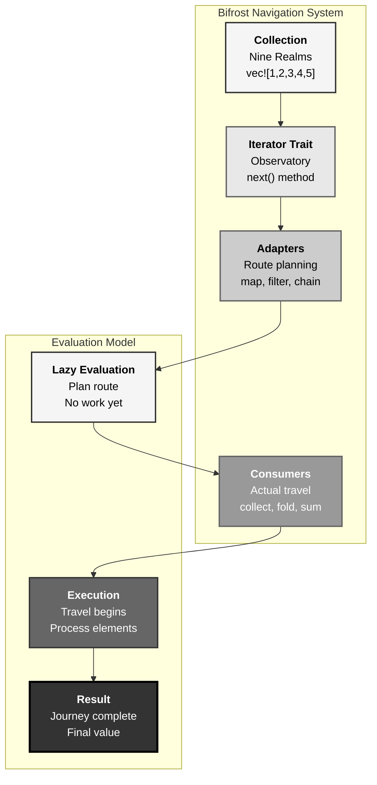
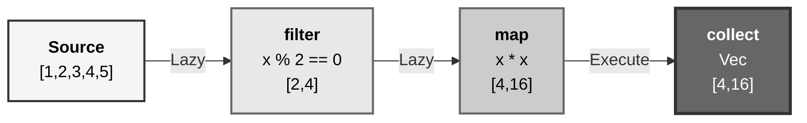
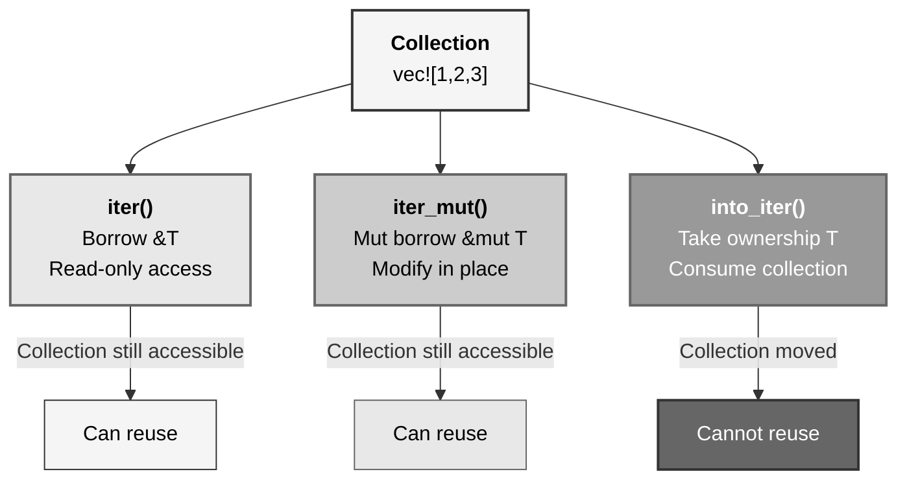
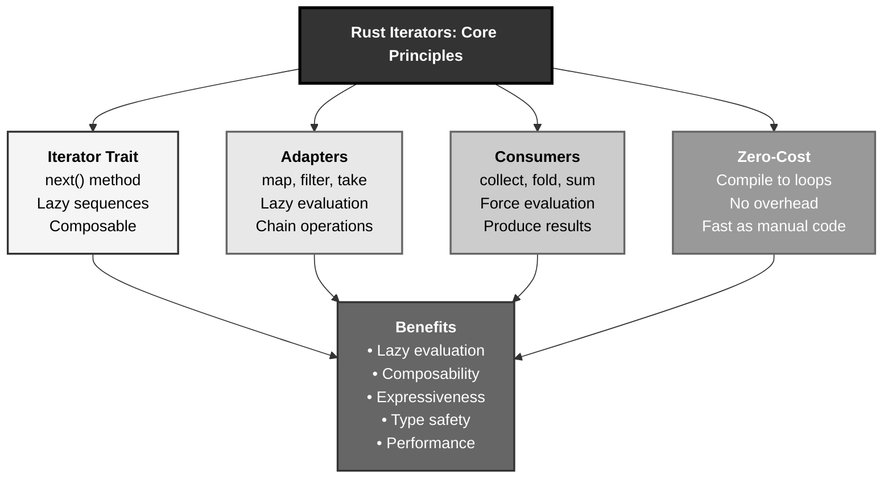

# Rust Iterators: The Bifrost Navigation System Pattern

## The Answer (Minto Pyramid)

**Iterators in Rust provide lazy, composable sequences that process collections element-by-element through the Iterator trait, enabling functional-style transformations (map, filter, fold) with zero-cost abstractions that compile to performance equivalent to manual loops.**

An iterator is a type implementing the `Iterator` trait with a single required method: `next()`, which returns `Option<Item>`. Iterators are **lazy**—they do nothing until consumed. Three iterator types exist: `iter()` (borrows `&T`), `iter_mut()` (mutably borrows `&mut T`), `into_iter()` (takes ownership, returns `T`). Iterator adapters (`map`, `filter`, `take`, `skip`) transform sequences lazily. Consumers (`collect`, `fold`, `sum`, `any`) force evaluation. All iterator operations compile to efficient machine code with no overhead versus hand-written loops—zero-cost abstraction.

**Three Supporting Principles:**

1. **Lazy Evaluation**: Operations create iterator chains, no work until consumed
2. **Composability**: Chain multiple operations declaratively
3. **Zero-Cost**: Compiles to same machine code as manual loops

**Why This Matters**: Iterators enable expressive, functional code that's as fast as imperative alternatives. Understanding iterators unlocks Rust's most powerful collection-processing patterns.

---

## The MCU Metaphor: Bifrost Navigation System

Think of Rust iterators like Heimdall's Bifrost—the rainbow bridge transportation system connecting the Nine Realms:

### The Mapping

| Bifrost System | Rust Iterators |
|----------------|----------------|
| **Bifrost observatory** | Iterator trait (next() method) |
| **Realm sequence** | Collection being traversed |
| **Heimdall's vision** | Lazy evaluation (sees path, doesn't travel yet) |
| **Stepping stones** | Individual elements (Some(item)) |
| **End of bridge** | None (iteration complete) |
| **Route planning** | Iterator adapters (map, filter, chain) |
| **Actual travel** | Consumers (collect, fold, for_each) |
| **Path transformation** | map (transform each realm) |
| **Realm filtering** | filter (skip certain realms) |

### The Story

Heimdall operates the Bifrost from his observatory, navigating between the Nine Realms:

**The Observatory (`Iterator` Trait)**: Heimdall's Bifrost observatory implements one core capability: `next()`—move to the next realm. He can see the entire path ahead (the collection), but doesn't travel until commanded. The observatory **lazily evaluates** the journey: Heimdall plans "visit Midgard, then Asgard, then Jotunheim," but doesn't actually activate the Bifrost until someone needs to travel. This is lazy evaluation—describe the journey, execute only when needed.

**Stepping Stones (`Some(Item)` and `None`)**: Each `next()` call returns a stepping stone—`Some(realm)` if more realms exist, `None` when you've reached the final destination. Thor calls `next()`: `Some(Midgard)`. Again: `Some(Asgard)`. Again: `Some(Jotunheim)`. Again: `None`—journey complete. The iterator protocol is simple: keep calling `next()` until you get `None`.

**Route Planning (`map`, `filter`, `chain`)**: Before traveling, Heimdall can modify the route. `map`: "Transform each realm—upgrade weapons at every stop." `filter`: "Skip realms without threats." `chain`: "After the Nine Realms, visit additional dimensions." These are **adapters**—they create new travel plans without activating the Bifrost. Lazy, composable, stackable.

**Actual Travel (`collect`, `fold`, `for_each`)**: Finally, Thor says "go"—this activates the Bifrost. `collect` visits all realms and gathers results. `fold` accumulates experience from each realm. `for_each` performs actions at every stop. These are **consumers**—they force evaluation, actually traversing the path Heimdall planned.

Similarly, Rust iterators provide a navigation system: define the sequence (collection), plan transformations (adapters), and execute when needed (consumers). Lazy evaluation means planning is free—you only pay for actual traversal. Zero-cost abstraction means the Bifrost route compiles to direct teleportation—no overhead versus manual realm-hopping.

---

## The Problem Without Iterators

Before understanding iterators, developers face limitations:

```rust path=null start=null
// ❌ Manual, imperative loops everywhere
let numbers = vec![1, 2, 3, 4, 5];
let mut doubled = Vec::new();
for n in &numbers {
    doubled.push(n * 2);
}

// ❌ Verbose filtering
let mut evens = Vec::new();
for n in &numbers {
    if n % 2 == 0 {
        evens.push(*n);
    }
}

// ❌ Complex transformations require nested loops
let mut result = Vec::new();
for n in &numbers {
    if n % 2 == 0 {
        result.push(n * n);
    }
}

// ❌ Accumulation requires manual state
let mut sum = 0;
for n in &numbers {
    sum += n;
}
```

**Problems:**

1. **Imperative Style**: Verbose, loop-heavy code
2. **Mutable State**: Requires `mut` for intermediate results
3. **Not Composable**: Can't chain operations declaratively
4. **Error-Prone**: Easy to introduce bugs in manual loops
5. **Less Intent**: Code shows "how" not "what"

---

## The Solution: Iterator Protocol

Rust provides the `Iterator` trait and rich adapter ecosystem:

### Basic Iterator Usage

```rust path=null start=null
fn main() {
    let numbers = vec![1, 2, 3, 4, 5];
    
    // Get iterator
    let mut iter = numbers.iter();
    
    // Call next() manually
    println!("{:?}", iter.next());  // Some(1)
    println!("{:?}", iter.next());  // Some(2)
    println!("{:?}", iter.next());  // Some(3)
    println!("{:?}", iter.next());  // Some(4)
    println!("{:?}", iter.next());  // Some(5)
    println!("{:?}", iter.next());  // None
}
```

### Three Iterator Types

```rust path=null start=null
fn main() {
    let numbers = vec![1, 2, 3];
    
    // iter() - borrows immutably
    for n in numbers.iter() {
        println!("{}", n);  // n is &i32
    }
    
    // iter_mut() - borrows mutably
    let mut numbers = vec![1, 2, 3];
    for n in numbers.iter_mut() {
        *n *= 2;  // n is &mut i32
    }
    println!("{:?}", numbers);  // [2, 4, 6]
    
    // into_iter() - takes ownership
    let numbers = vec![1, 2, 3];
    for n in numbers.into_iter() {
        println!("{}", n);  // n is i32
    }
    // numbers no longer accessible
}
```

### Iterator Adapters (Lazy)

```rust path=null start=null
fn main() {
    let numbers = vec![1, 2, 3, 4, 5];
    
    // map - transform each element
    let doubled = numbers.iter().map(|x| x * 2);
    // Nothing computed yet! (lazy)
    
    // filter - select elements
    let evens = numbers.iter().filter(|x| *x % 2 == 0);
    // Still lazy!
    
    // Chain adapters
    let result = numbers.iter()
        .filter(|x| *x % 2 == 0)
        .map(|x| x * x);
    // All lazy until consumed
}
```

### Consumers (Force Evaluation)

```rust path=null start=null
fn main() {
    let numbers = vec![1, 2, 3, 4, 5];
    
    // collect - gather into collection
    let doubled: Vec<i32> = numbers.iter()
        .map(|x| x * 2)
        .collect();
    println!("{:?}", doubled);
    
    // sum - accumulate
    let total: i32 = numbers.iter().sum();
    println!("{}", total);  // 15
    
    // fold - custom accumulation
    let product = numbers.iter().fold(1, |acc, x| acc * x);
    println!("{}", product);  // 120
    
    // any - check condition
    let has_even = numbers.iter().any(|x| x % 2 == 0);
    println!("{}", has_even);  // true
}
```

---

## Visual Mental Model



### Iterator Adapter Chain



### Three Iterator Types



---

## Anatomy of Iterators

### 1. The Iterator Trait

```rust path=null start=null
// Simplified Iterator trait
trait Iterator {
    type Item;
    
    fn next(&mut self) -> Option<Self::Item>;
    
    // Many provided methods: map, filter, collect, etc.
}

// Custom iterator example
struct Counter {
    count: u32,
    max: u32,
}

impl Counter {
    fn new(max: u32) -> Self {
        Counter { count: 0, max }
    }
}

impl Iterator for Counter {
    type Item = u32;
    
    fn next(&mut self) -> Option<Self::Item> {
        if self.count < self.max {
            self.count += 1;
            Some(self.count)
        } else {
            None
        }
    }
}

fn main() {
    let counter = Counter::new(5);
    
    for n in counter {
        println!("{}", n);  // 1, 2, 3, 4, 5
    }
}
```

### 2. Common Adapters

```rust path=null start=null
fn main() {
    let numbers = vec![1, 2, 3, 4, 5];
    
    // map - transform
    let doubled: Vec<i32> = numbers.iter()
        .map(|x| x * 2)
        .collect();
    
    // filter - select
    let evens: Vec<i32> = numbers.iter()
        .filter(|x| *x % 2 == 0)
        .copied()
        .collect();
    
    // take - limit count
    let first_three: Vec<i32> = numbers.iter()
        .take(3)
        .copied()
        .collect();
    
    // skip - skip elements
    let after_two: Vec<i32> = numbers.iter()
        .skip(2)
        .copied()
        .collect();
    
    // enumerate - add indices
    for (i, n) in numbers.iter().enumerate() {
        println!("{}: {}", i, n);
    }
    
    // zip - combine iterators
    let letters = vec!['a', 'b', 'c'];
    let pairs: Vec<_> = numbers.iter()
        .zip(letters.iter())
        .collect();
    println!("{:?}", pairs);  // [(1, 'a'), (2, 'b'), (3, 'c')]
}
```

### 3. Common Consumers

```rust path=null start=null
fn main() {
    let numbers = vec![1, 2, 3, 4, 5];
    
    // collect - gather into collection
    let doubled: Vec<i32> = numbers.iter()
        .map(|x| x * 2)
        .collect();
    
    // sum - add all elements
    let total: i32 = numbers.iter().sum();
    println!("Sum: {}", total);
    
    // product - multiply all elements
    let product: i32 = numbers.iter().product();
    println!("Product: {}", product);
    
    // fold - custom accumulation
    let sum = numbers.iter().fold(0, |acc, x| acc + x);
    println!("Fold sum: {}", sum);
    
    // any - check if any element satisfies condition
    let has_even = numbers.iter().any(|x| x % 2 == 0);
    println!("Has even: {}", has_even);
    
    // all - check if all elements satisfy condition
    let all_positive = numbers.iter().all(|x| *x > 0);
    println!("All positive: {}", all_positive);
    
    // find - get first matching element
    let first_even = numbers.iter().find(|x| *x % 2 == 0);
    println!("First even: {:?}", first_even);
    
    // count - count elements
    let count = numbers.iter().filter(|x| *x % 2 == 0).count();
    println!("Even count: {}", count);
}
```

### 4. Chaining Operations

```rust path=null start=null
fn main() {
    let numbers = vec![1, 2, 3, 4, 5, 6, 7, 8, 9, 10];
    
    // Complex chain
    let result: Vec<i32> = numbers.iter()
        .filter(|x| *x % 2 == 0)      // Keep evens: [2,4,6,8,10]
        .map(|x| x * x)                // Square: [4,16,36,64,100]
        .take(3)                       // First 3: [4,16,36]
        .collect();
    
    println!("{:?}", result);  // [4, 16, 36]
    
    // With enumerate
    let indexed: Vec<(usize, i32)> = numbers.iter()
        .copied()
        .enumerate()
        .filter(|(i, _)| i % 2 == 0)
        .collect();
    
    println!("{:?}", indexed);  // [(0,1), (2,3), (4,5), ...]
}
```

### 5. Custom Iterator Implementation

```rust path=null start=null
struct Fibonacci {
    curr: u64,
    next: u64,
}

impl Fibonacci {
    fn new() -> Self {
        Fibonacci { curr: 0, next: 1 }
    }
}

impl Iterator for Fibonacci {
    type Item = u64;
    
    fn next(&mut self) -> Option<Self::Item> {
        let current = self.curr;
        self.curr = self.next;
        self.next = current + self.next;
        Some(current)
    }
}

fn main() {
    let fib = Fibonacci::new();
    
    // Take first 10 Fibonacci numbers
    let first_ten: Vec<u64> = fib.take(10).collect();
    println!("{:?}", first_ten);
    // [0, 1, 1, 2, 3, 5, 8, 13, 21, 34]
}
```

---

## Common Iterator Patterns

### Pattern 1: Transform-Filter-Collect

```rust path=null start=null
fn main() {
    let numbers = vec![1, 2, 3, 4, 5, 6, 7, 8, 9, 10];
    
    // Pattern: transform → filter → collect
    let result: Vec<i32> = numbers.iter()
        .map(|x| x * 2)                // Transform
        .filter(|x| x % 3 == 0)        // Filter
        .collect();                     // Collect
    
    println!("{:?}", result);  // [6, 12, 18]
}
```

### Pattern 2: Partition

```rust path=null start=null
fn main() {
    let numbers = vec![1, 2, 3, 4, 5, 6];
    
    // Split into two groups
    let (evens, odds): (Vec<i32>, Vec<i32>) = numbers.iter()
        .copied()
        .partition(|x| x % 2 == 0);
    
    println!("Evens: {:?}", evens);  // [2, 4, 6]
    println!("Odds: {:?}", odds);    // [1, 3, 5]
}
```

### Pattern 3: Flat Map (Flatten Nested Structures)

```rust path=null start=null
fn main() {
    let nested = vec![vec![1, 2], vec![3, 4], vec![5, 6]];
    
    // Flatten nested vectors
    let flattened: Vec<i32> = nested.iter()
        .flat_map(|v| v.iter())
        .copied()
        .collect();
    
    println!("{:?}", flattened);  // [1, 2, 3, 4, 5, 6]
    
    // flat_map with transformation
    let doubled: Vec<i32> = vec![1, 2, 3]
        .iter()
        .flat_map(|x| vec![*x, x * 2])
        .collect();
    
    println!("{:?}", doubled);  // [1, 2, 2, 4, 3, 6]
}
```

### Pattern 4: Windowing (Consecutive Pairs)

```rust path=null start=null
fn main() {
    let numbers = vec![1, 2, 3, 4, 5];
    
    // Get consecutive pairs using windows
    let pairs: Vec<_> = numbers.windows(2)
        .map(|w| (w[0], w[1]))
        .collect();
    
    println!("{:?}", pairs);  // [(1,2), (2,3), (3,4), (4,5)]
    
    // Using zip for pairs
    let pairs2: Vec<_> = numbers.iter()
        .zip(numbers.iter().skip(1))
        .collect();
    
    println!("{:?}", pairs2);  // [(1,2), (2,3), (3,4), (4,5)]
}
```

### Pattern 5: Scan (Stateful Iteration)

```rust path=null start=null
fn main() {
    let numbers = vec![1, 2, 3, 4, 5];
    
    // Running sum using scan
    let running_sum: Vec<i32> = numbers.iter()
        .scan(0, |state, x| {
            *state += x;
            Some(*state)
        })
        .collect();
    
    println!("{:?}", running_sum);  // [1, 3, 6, 10, 15]
    
    // Factorial using scan
    let factorials: Vec<i32> = (1..=5)
        .scan(1, |state, x| {
            *state *= x;
            Some(*state)
        })
        .collect();
    
    println!("{:?}", factorials);  // [1, 2, 6, 24, 120]
}
```

---

## Real-World Use Cases

### Use Case 1: Data Pipeline Processing

```rust path=null start=null
#[derive(Debug)]
struct User {
    name: String,
    age: u32,
    active: bool,
}

fn main() {
    let users = vec![
        User { name: "Alice".to_string(), age: 30, active: true },
        User { name: "Bob".to_string(), age: 25, active: false },
        User { name: "Charlie".to_string(), age: 35, active: true },
        User { name: "Diana".to_string(), age: 28, active: true },
    ];
    
    // Complex data pipeline
    let active_names: Vec<String> = users.iter()
        .filter(|u| u.active)              // Only active users
        .filter(|u| u.age >= 30)           // Age >= 30
        .map(|u| u.name.clone())           // Extract names
        .collect();
    
    println!("{:?}", active_names);  // ["Alice", "Charlie"]
    
    // Count by condition
    let active_count = users.iter()
        .filter(|u| u.active)
        .count();
    
    println!("Active users: {}", active_count);
}
```

### Use Case 2: File Processing

```rust path=null start=null
use std::fs;

fn process_log_file(path: &str) -> Result<Vec<String>, std::io::Error> {
    let content = fs::read_to_string(path)?;
    
    let errors: Vec<String> = content.lines()
        .filter(|line| line.contains("ERROR"))
        .map(|line| line.to_string())
        .collect();
    
    Ok(errors)
}

fn main() {
    // Simulated log lines
    let logs = vec![
        "INFO: Application started",
        "ERROR: Connection failed",
        "DEBUG: Processing request",
        "ERROR: Invalid input",
        "INFO: Request completed",
    ];
    
    let errors: Vec<&str> = logs.iter()
        .copied()
        .filter(|line| line.contains("ERROR"))
        .collect();
    
    println!("Errors: {:?}", errors);
}
```

### Use Case 3: Statistical Analysis

```rust path=null start=null
fn mean(data: &[f64]) -> Option<f64> {
    if data.is_empty() {
        return None;
    }
    
    let sum: f64 = data.iter().sum();
    Some(sum / data.len() as f64)
}

fn median(data: &[f64]) -> Option<f64> {
    if data.is_empty() {
        return None;
    }
    
    let mut sorted = data.to_vec();
    sorted.sort_by(|a, b| a.partial_cmp(b).unwrap());
    
    let mid = sorted.len() / 2;
    if sorted.len() % 2 == 0 {
        Some((sorted[mid - 1] + sorted[mid]) / 2.0)
    } else {
        Some(sorted[mid])
    }
}

fn main() {
    let data = vec![1.0, 2.0, 3.0, 4.0, 5.0];
    
    if let Some(m) = mean(&data) {
        println!("Mean: {}", m);
    }
    
    if let Some(m) = median(&data) {
        println!("Median: {}", m);
    }
    
    // Standard deviation using iterators
    let mean_val = mean(&data).unwrap();
    let variance: f64 = data.iter()
        .map(|x| (x - mean_val).powi(2))
        .sum::<f64>() / data.len() as f64;
    let std_dev = variance.sqrt();
    
    println!("Std dev: {}", std_dev);
}
```

---

## Key Takeaways



### The Mental Model

Think of iterators like the Bifrost navigation system:
- **Observatory** → Iterator trait with next() method
- **Route planning** → Adapters (map, filter) create lazy chains
- **Actual travel** → Consumers (collect, fold) force evaluation
- **Zero-cost** → Bifrost compiles to direct teleportation (no overhead)

### Core Principles

1. **Iterator Trait**: Single `next()` method returns `Option<Item>`
2. **Lazy Evaluation**: Adapters create chains without doing work
3. **Consumers**: Force evaluation and produce final results
4. **Three Types**: `iter()` (borrow), `iter_mut()` (mut borrow), `into_iter()` (ownership)
5. **Zero-Cost**: Compiles to efficient machine code, same as manual loops

### The Guarantee

Rust iterators provide:
- **Expressiveness**: Declarative, functional-style code
- **Safety**: Type-safe transformations, borrow checker enforced
- **Performance**: Zero-cost abstraction, as fast as hand-written loops
- **Composability**: Chain operations declaratively

All with **compile-time optimization** and **no runtime overhead**.

---

**Remember**: Iterators aren't just loops—they're **lazy, composable sequence transformations with zero-cost abstractions**. Like Heimdall's Bifrost (plan routes lazily, travel when needed, instant teleportation), iterators enable describing transformations (adapters create chains), deferring work (lazy evaluation), and executing efficiently (consumers force evaluation, compiler optimizes to direct code). The Iterator trait provides the foundation, adapters build lazy chains, consumers trigger execution, and the compiler ensures zero overhead. Plan your Bifrost route, let Rust handle the quantum mechanics.
